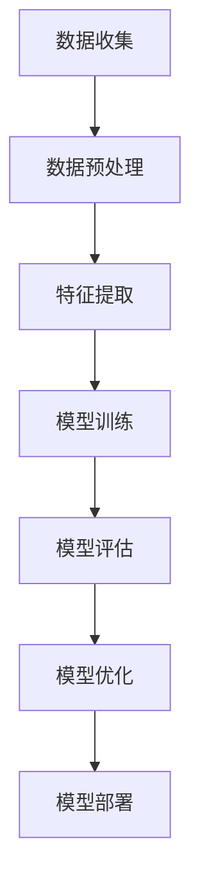
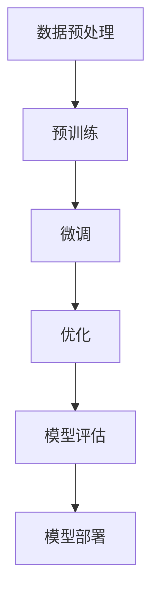
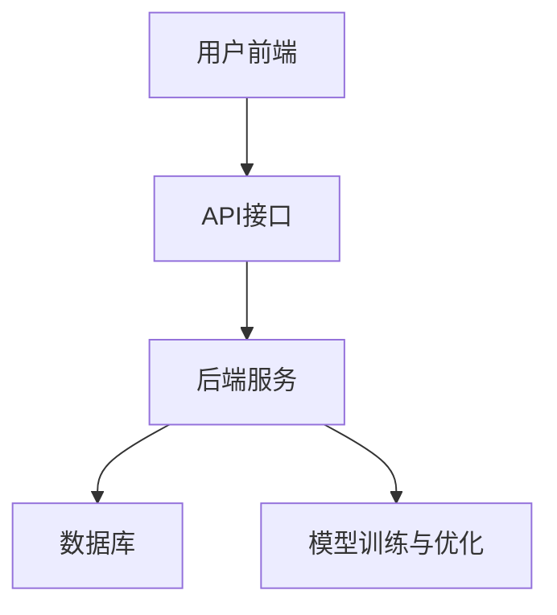
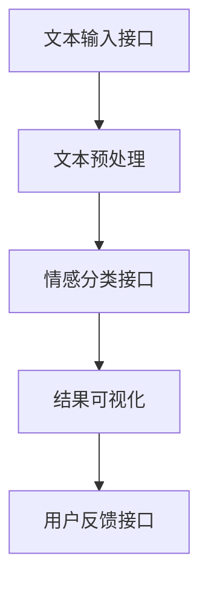
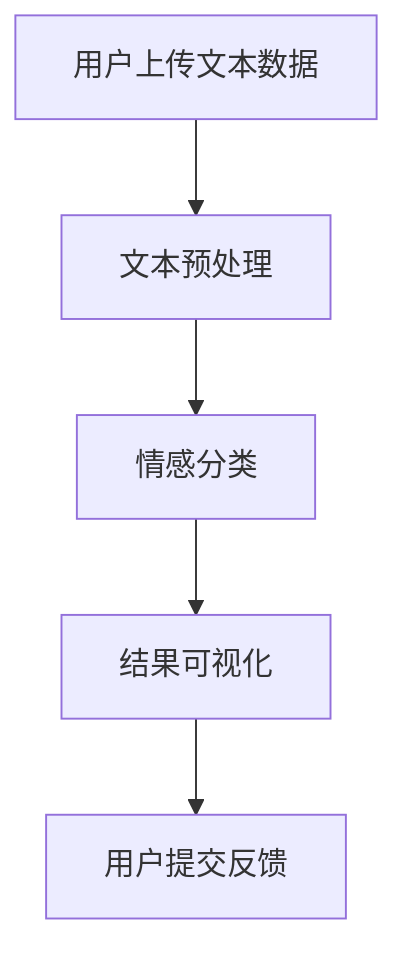

                 

### 第一部分: 引言

**1. 引言**

#### 问题背景

情感分析是自然语言处理（NLP）中的一个重要应用领域，旨在识别文本中表达的情感或意见。随着人工智能和大数据技术的发展，情感分析在商业、社交网络、舆情监测等领域得到广泛应用。然而，当前的情感分析模型，尤其是基于大型语言模型（LLM）的模型，在准确度上仍有提升空间。

情感分析的挑战主要源于语言的复杂性和多义性。文本中的情感表达往往模糊、微妙，且受到语境、文化背景等多种因素的影响。LLM作为当前最先进的自然语言处理模型，虽然在一定程度上提高了情感分析的准确度，但其内部机制复杂，训练成本高，且在面对特定领域或情境时，表现仍不尽如人意。

#### 问题描述

本书旨在解决如何提高LLM在情感分析中的准确度问题。具体而言，我们将探讨以下几个方面：

1. **数据预处理**：如何通过数据清洗、去噪、标签增强等方法，提高训练数据的质量和多样性。
2. **特征工程**：如何提取文本特征，以便更准确地反映文本的情感内容。
3. **模型选择与优化**：如何选择合适的模型，并进行参数调优，以提高情感分析的性能。
4. **模型融合与集成**：如何通过融合多个模型或集成多个预测结果，提高情感分析的稳定性和鲁棒性。

#### 问题解决

本书将介绍一系列方法和技术，帮助读者理解和应用这些方法，以提升LLM在情感分析中的表现。具体包括：

1. **数据预处理技术**：介绍常见的数据预处理方法，如文本清洗、词向量化、标签平滑等。
2. **特征工程技术**：介绍如何提取文本的词汇、句法、语义等特征，以及如何使用这些特征进行情感分析。
3. **模型选择与优化策略**：介绍常用的情感分析模型，如朴素贝叶斯、支持向量机、神经网络等，并探讨如何通过参数调优和模型融合提高模型性能。
4. **实际应用案例**：通过具体的应用案例，展示如何在实际场景中应用上述方法，提高情感分析准确度。

#### 边界与外延

本书将重点关注LLM在情感分析中的应用，但不涉及其他NLP领域的问题。此外，我们将主要探讨提高LLM在情感分析中准确度的技术手段，而不过多涉及LLM的基本原理和实现细节。

#### 核心概念与联系

在本章中，我们将介绍以下核心概念：

1. **情感分析**：情感分析的定义、应用场景和基本方法。
2. **大型语言模型（LLM）**：LLM的基本原理、特点和应用。

情感分析和LLM之间有着紧密的联系。情感分析是LLM的一个重要应用领域，而LLM则为情感分析提供了强大的工具和手段。通过深入理解这两个概念，读者可以更好地把握本书的核心内容，并在实际应用中取得更好的效果。

## 第1章: 问题背景与解决思路

### 1.1 问题背景

#### 1.1.1 情感分析的重要性

情感分析，也称为意见挖掘或情感识别，是自然语言处理（NLP）领域中的一个重要研究方向。其核心目标是从文本中识别和提取出表达的情感或意见。情感分析的应用场景广泛，涵盖了商业、金融、医疗、社交媒体等多个领域。

在商业领域，情感分析可以帮助企业了解消费者的反馈和态度，从而优化产品和服务。例如，通过分析社交媒体上的用户评论，企业可以及时发现产品质量问题，调整营销策略，提高客户满意度。

在金融领域，情感分析可用于股票市场预测、风险评估等。通过分析新闻报道、社交媒体上的信息，金融分析师可以捕捉市场情绪，预测股票价格的波动。

在医疗领域，情感分析可以辅助医生诊断和治疗。通过对患者病历、病历记录、医疗报告等文本进行分析，可以识别患者的情绪状态，预测疾病的发展趋势，为个性化医疗提供支持。

在社交媒体领域，情感分析可以帮助平台了解用户的情绪和行为，从而优化用户体验，提高平台的活跃度和用户黏性。

#### 1.1.2 LLM在情感分析中的应用

随着人工智能和深度学习技术的发展，大型语言模型（LLM）逐渐成为情感分析的重要工具。LLM是一种基于神经网络的语言模型，其核心目标是理解和生成自然语言。LLM在情感分析中的应用主要体现在以下几个方面：

1. **文本表示**：LLM可以将文本转换为向量表示，使得文本数据可以被机器学习模型处理。这种方法在情感分析中具有重要意义，因为情感分析本质上是对文本数据的情感倾向进行分类。

2. **情感分类**：LLM可以用于情感分类任务，例如，判断一条评论是正面、负面还是中立。传统的情感分类方法通常基于规则或特征工程，而LLM通过学习大量的文本数据，可以自动提取有效的特征，提高分类准确度。

3. **情感检测**：LLM还可以用于情感检测任务，例如，识别文本中表达的情感类型，如喜悦、愤怒、悲伤等。与情感分类不同，情感检测更加关注文本中情感的表达方式，而不仅仅是情感倾向。

4. **情感增强**：LLM可以用于增强情感分析模型，例如，将LLM与传统的情感分类模型结合，通过融合多种特征和模型，提高情感分析的准确度和稳定性。

#### 1.1.3 提高LLM在情感分析中准确度的必要性

尽管LLM在情感分析中展现出强大的能力，但其准确度仍存在提升空间。以下是一些提高LLM在情感分析中准确度的必要性：

1. **多义性和歧义性**：自然语言中的多义性和歧义性是情感分析中的一个主要挑战。例如，同一个词汇在不同的语境下可能表达不同的情感，这使得基于LLM的情感分析模型难以准确识别。

2. **情感微弱性**：情感分析往往需要识别微弱的情感倾向，例如，一条评论可能表达了一种微妙的正面或负面情感。LLM在处理这类微弱情感时，可能存在误判或漏判。

3. **数据不平衡**：情感分析中的数据集通常存在数据不平衡问题，即正面和负面评论的数量不相等。这可能导致模型在分类时偏向于某一类情感，从而降低整体准确度。

4. **情感复杂度**：现实世界中的情感表达往往复杂多样，单一的情感分类模型可能无法涵盖所有情感类型。例如，情感分析需要识别复合情感，如喜悦和担忧的混合情感。

因此，提高LLM在情感分析中的准确度具有重要意义。通过改进数据预处理、特征工程、模型选择和优化等技术手段，可以进一步提升LLM在情感分析中的性能，为实际应用提供更可靠的支持。

### 1.2 问题描述

#### 1.2.1 情感分析中的挑战

情感分析是一个复杂且具有挑战性的任务，主要表现在以下几个方面：

1. **语言的复杂性和多义性**：自然语言中的词汇和表达方式具有多义性，同一个词汇在不同的语境下可能表达不同的情感。这使得情感分析模型难以准确识别文本中的情感。

2. **情感微弱性**：情感分析往往需要识别微弱的情感倾向，如微妙的正面或负面情感。这类情感表达往往不明显，容易导致模型误判或漏判。

3. **数据不平衡**：情感分析的数据集通常存在数据不平衡问题，即正面和负面评论的数量不相等。这可能导致模型在分类时偏向于某一类情感，从而降低整体准确度。

4. **情感复杂度**：现实世界中的情感表达往往复杂多样，单一的情感分类模型可能无法涵盖所有情感类型。例如，情感分析需要识别复合情感，如喜悦和担忧的混合情感。

#### 1.2.2 LLM在情感分析中的不足

尽管LLM在情感分析中展现出强大的能力，但其仍存在一些不足，主要体现在以下几个方面：

1. **训练成本高**：LLM通常需要大量的训练数据和高性能计算资源，这导致其训练成本较高。对于一些小型企业或研究团队来说，可能难以负担。

2. **泛化能力有限**：LLM在训练过程中可能过度依赖特定的数据集，导致其泛化能力有限。这意味着在处理未知或新的数据时，LLM可能无法保持良好的性能。

3. **情感识别准确性有待提高**：尽管LLM在情感分析中表现出色，但其准确度仍存在提升空间。在某些情况下，LLM可能无法准确识别文本中的情感，导致误判或漏判。

4. **对抗攻击脆弱**：LLM在面对对抗攻击时可能表现脆弱，即通过微小扰动可以欺骗模型，使其产生错误的预测。

#### 1.2.3 解决方案概述

针对上述挑战和不足，本书将介绍一系列解决方案，以提高LLM在情感分析中的准确度。具体包括：

1. **数据预处理**：通过数据清洗、去噪、标签增强等方法，提高训练数据的质量和多样性，从而提高模型的泛化能力。

2. **特征工程**：提取文本的词汇、句法、语义等特征，以便更准确地反映文本的情感内容。此外，还可以结合外部知识库和上下文信息，增强特征的表达能力。

3. **模型选择与优化**：选择合适的情感分析模型，并采用参数调优和模型融合等方法，提高模型的准确度和稳定性。

4. **对抗攻击防御**：设计防御机制，提高模型对对抗攻击的鲁棒性。

通过上述方法，本书旨在提供一套系统、全面的解决方案，帮助读者在实际应用中更好地提高LLM在情感分析中的准确度。

### 1.3 问题解决思路

为了有效提高大型语言模型（LLM）在情感分析中的准确度，我们需要从多个维度进行深入分析和逐步优化。以下是我们的具体解决思路：

#### 1.3.1 数据预处理

数据预处理是提高模型性能的基础步骤。在这一环节，我们主要关注以下几个方面：

1. **数据清洗**：去除噪声数据和异常值，如HTML标签、停用词、特殊符号等。通过数据清洗，可以提高训练数据的质量和一致性。

2. **去噪**：对于噪声较大的数据，如非标准字符、拼写错误等，我们可以采用文本纠错技术进行去噪。此外，还可以通过词干提取和词形还原等技术，降低文本的噪声。

3. **标签增强**：通过引入额外的标签信息，如词性标注、实体识别等，可以丰富训练数据的特征，提高模型的泛化能力。

4. **数据平衡**：处理数据不平衡问题，可以通过过采样、欠采样或合成少数类样本等方法，使得训练数据在正负样本数量上趋于平衡。

#### 1.3.2 特征工程

特征工程是提高模型性能的关键环节。在这一环节，我们需要关注以下几个方面：

1. **词汇特征提取**：通过词袋模型、TF-IDF等方法提取文本的词汇特征。这些特征可以反映文本的主题和语义内容。

2. **句法特征提取**：通过句法分析，提取文本的句法特征，如句子的长度、复杂度、依存关系等。这些特征有助于捕捉文本的结构信息。

3. **语义特征提取**：通过词嵌入、实体识别、实体关系抽取等方法，提取文本的语义特征。这些特征可以更准确地反映文本的情感内容。

4. **上下文特征**：结合上下文信息，提取文本的上下文特征。例如，通过窗口滑动方式，提取文本中某句话或词与其前后句子的关系。

#### 1.3.3 模型选择与优化

模型选择与优化是提高模型性能的核心步骤。在这一环节，我们需要关注以下几个方面：

1. **模型选择**：选择合适的情感分析模型。常见的模型包括朴素贝叶斯、支持向量机、神经网络等。根据问题的特点和需求，选择适合的模型。

2. **参数调优**：通过交叉验证、网格搜索等方法，选择最优的模型参数。参数调优可以显著提高模型的性能。

3. **模型融合**：通过融合多个模型的结果，提高模型的稳定性和鲁棒性。常见的模型融合方法包括投票法、堆叠法等。

4. **在线学习与动态调整**：利用在线学习技术，根据新的数据动态调整模型参数。这种方法有助于模型适应不断变化的数据分布。

#### 1.3.4 模型融合与集成

模型融合与集成是提高模型性能的有效手段。在这一环节，我们需要关注以下几个方面：

1. **特征融合**：将不同模型提取的特征进行融合，形成更丰富的特征向量。例如，将词袋模型和词嵌入模型的特征进行融合。

2. **模型融合**：将多个模型的结果进行融合，形成最终的预测结果。例如，使用投票法将多个分类器的结果进行融合。

3. **集成学习**：采用集成学习方法，如随机森林、梯度提升机等，构建集成模型。这种方法可以充分利用多个模型的优点，提高模型的性能。

4. **权重调整**：根据模型在训练过程中的表现，动态调整各个模型的权重，从而优化集成模型的性能。

通过以上方法，我们可以逐步提高LLM在情感分析中的准确度。需要注意的是，这些方法并非孤立的，而是相互关联和补充的。在实际应用中，我们需要根据具体问题和需求，灵活运用这些方法，以达到最佳效果。

### 1.4 边界与外延

在本研究中，我们的主要关注点是提高大型语言模型（LLM）在情感分析任务中的准确度。以下是研究的边界与外延：

#### 研究范围

1. **情感分析任务**：本研究主要关注文本情感分类任务，即从文本中识别和提取表达的情感或意见。这包括正面情感、负面情感和中性情感等分类。

2. **LLM应用**：本研究聚焦于基于LLM的情感分析模型，特别是预训练语言模型（如BERT、GPT）在情感分析中的应用。

3. **数据集和领域**：本研究将使用公开的数据集进行实验，如IMDB电影评论、Twitter情感分析数据等。同时，本研究将关注通用领域的情感分析问题。

#### 研究外延

1. **跨领域情感分析**：虽然本研究主要关注通用领域，但我们也探讨如何将LLM应用于特定领域（如金融、医疗等）的情感分析任务。

2. **其他NLP任务**：虽然本研究主要关注情感分析，但LLM在文本分类、文本生成、问答系统等其他NLP任务中的应用也是未来值得探讨的方向。

3. **对抗攻击与防御**：随着研究的深入，我们也将探讨如何提高LLM在对抗攻击（如对抗样本、对抗性攻击）下的鲁棒性。

### 1.5 核心概念与联系

在本研究中，我们将介绍以下核心概念，并探讨它们之间的关系：

#### 1.5.1 情感分析

情感分析（Sentiment Analysis）是一种自然语言处理技术，旨在识别文本中表达的情感或意见。情感分析可以分为情感分类和情感极性分析两个层次。

- **情感分类**：将文本分为正面、负面、中性三个类别。
- **情感极性分析**：识别文本中的情感极性，如极度满意、满意、一般、不满意、极度不满意等。

情感分析在商业、金融、医疗、社交媒体等领域具有广泛应用。通过情感分析，企业可以了解消费者的反馈和态度，从而优化产品和服务；分析师可以捕捉市场情绪，预测股票价格的波动；医生可以识别患者的情绪状态，为个性化医疗提供支持。

#### 1.5.2 大型语言模型（LLM）

大型语言模型（Large Language Model，简称LLM）是一种基于深度学习技术构建的强大语言处理模型。LLM通过学习大量的文本数据，能够理解和生成自然语言，并在各种语言处理任务中表现出色。

- **基本原理**：LLM通常采用循环神经网络（RNN）或Transformer架构，通过多层神经网络结构学习语言的特征和模式。
- **特点**：LLM具有强大的文本理解和生成能力，能够处理复杂的语言结构，支持多语言和多模态处理。
- **应用场景**：LLM在自然语言处理、文本生成、机器翻译、问答系统等领域具有广泛应用。

#### 情感分析与LLM的关系

情感分析与LLM之间有着密切的联系。LLM为情感分析提供了强大的工具和手段，使得情感分析任务变得更加高效和准确。

- **文本表示**：LLM可以将文本转换为向量表示，使得文本数据可以被机器学习模型处理。这种方法在情感分析中具有重要意义，因为情感分析本质上是对文本数据的情感倾向进行分类。
- **情感分类**：LLM可以用于情感分类任务，例如，判断一条评论是正面、负面还是中立。传统的情感分类方法通常基于规则或特征工程，而LLM通过学习大量的文本数据，可以自动提取有效的特征，提高分类准确度。
- **情感检测**：LLM还可以用于情感检测任务，例如，识别文本中表达的情感类型，如喜悦、愤怒、悲伤等。与情感分类不同，情感检测更加关注文本中情感的表达方式，而不仅仅是情感倾向。
- **情感增强**：LLM可以用于增强情感分析模型，例如，将LLM与传统的情感分类模型结合，通过融合多种特征和模型，提高情感分析的准确度和稳定性。

通过深入理解情感分析和LLM这两个核心概念，读者可以更好地把握本书的核心内容，并在实际应用中取得更好的效果。接下来，我们将进一步探讨情感分析和LLM的基本原理、应用场景和现有方法，为后续的研究提供基础。

### 2.1 情感分析

#### 2.1.1 情感分析的定义

情感分析（Sentiment Analysis），也称为意见挖掘或情感识别，是自然语言处理（NLP）领域的一个重要分支。其核心目标是自动识别和提取文本中的情感倾向或意见，从而为情感量化、趋势分析和决策支持提供基础。

情感分析的基本任务是对文本进行分类，将其分为正面情感、负面情感和中性情感三大类。此外，还有一些更细粒度的情感分析任务，如情感极性分析（区分极度满意、满意、一般、不满意、极度不满意等）、情感强度分析（量化情感的强度）和情感类型分析（识别具体的情感类型，如喜悦、愤怒、悲伤等）。

#### 2.1.2 情感分析的应用场景

情感分析的应用场景非常广泛，涵盖了多个领域：

1. **商业与市场营销**：通过分析社交媒体上的用户评论和反馈，企业可以了解消费者对产品的态度和意见，从而优化产品和服务，提高客户满意度。例如，电商网站可以通过情感分析对用户评论进行分类和标签化，帮助顾客做出购买决策。

2. **社交媒体分析**：社交媒体平台可以利用情感分析监控公众情绪，及时发现负面信息，防止危机蔓延。同时，情感分析还可以用于内容推荐和广告投放，提高用户体验和平台活跃度。

3. **舆情监测**：政府机构和企业可以利用情感分析监控社会舆论，了解公众对政策、事件或产品的看法，为决策提供参考。

4. **金融分析**：金融分析师可以通过情感分析捕捉市场情绪，预测股票价格的波动，进行风险管理和投资决策。

5. **医疗与健康**：通过对患者病历、医疗报告和社交媒体上的信息进行分析，医生和研究人员可以了解患者的情绪状态，为个性化医疗和心理健康干预提供支持。

6. **客户服务**：企业可以通过情感分析自动化处理客户反馈，识别常见问题和痛点，提高客户服务质量和效率。

#### 2.1.3 情感分析的现有方法

情感分析的现有方法主要包括基于规则的方法、基于统计的方法和基于机器学习的方法。以下是这些方法的基本原理和特点：

1. **基于规则的方法**：
   - **基本原理**：通过人工定义一系列规则，如情感词典、情感短语等，对文本进行情感分类。例如，如果文本中包含“喜欢”、“满意”等正面词汇，则判断为正面情感。
   - **优点**：实现简单，易于理解。
   - **缺点**：规则数量庞大，难以覆盖所有情况；规则依赖性高，对噪声和歧义处理能力较差。

2. **基于统计的方法**：
   - **基本原理**：利用文本中的统计特征（如词频、词序列、句法结构等）进行情感分类。例如，通过TF-IDF方法提取文本特征，利用朴素贝叶斯、支持向量机等分类器进行分类。
   - **优点**：特征提取较为简单，适用于大规模数据集。
   - **缺点**：对文本特征的依赖性较强，难以处理复杂的情感表达；特征工程繁琐，需要大量人工干预。

3. **基于机器学习的方法**：
   - **基本原理**：利用机器学习算法，从大量标注数据中学习情感分类模型。常见的算法包括朴素贝叶斯、决策树、随机森林、支持向量机、神经网络等。
   - **优点**：能够自动提取文本特征，提高分类准确度；适用于大规模数据集，能够处理复杂的情感表达。
   - **缺点**：需要大量标注数据，训练过程时间较长；对数据质量和标注质量有较高要求。

4. **基于深度学习的方法**：
   - **基本原理**：利用深度神经网络，如卷积神经网络（CNN）、循环神经网络（RNN）、Transformer等，直接从文本中学习情感特征。这些方法通常采用预训练语言模型（如BERT、GPT）作为基础模型。
   - **优点**：能够捕获文本的深层语义信息，提高分类准确度；适用于大规模数据集，能够处理复杂的情感表达。
   - **缺点**：模型参数较多，训练时间较长；对计算资源要求较高。

综上所述，不同的情感分析方法各有优缺点。在实际应用中，通常需要结合多种方法，以实现更好的效果。

#### 2.1.4 情感分析的挑战

尽管情感分析在多个领域取得了显著成果，但仍面临诸多挑战：

1. **语言复杂性**：自然语言具有复杂性和多义性，同一个词汇或表达在不同的语境下可能表达不同的情感。这使得情感分析模型难以准确识别文本中的情感。

2. **情感微弱性**：情感分析往往需要识别微弱的情感倾向，如微妙的正面或负面情感。这类情感表达往往不明显，容易导致模型误判或漏判。

3. **数据不平衡**：情感分析的数据集通常存在数据不平衡问题，即正面和负面评论的数量不相等。这可能导致模型在分类时偏向于某一类情感，从而降低整体准确度。

4. **情感复杂度**：现实世界中的情感表达往往复杂多样，单一的情感分类模型可能无法涵盖所有情感类型。例如，情感分析需要识别复合情感，如喜悦和担忧的混合情感。

5. **对抗攻击**：随着对抗攻击技术的发展，情感分析模型在面对对抗样本时可能表现脆弱，即通过微小扰动可以欺骗模型，使其产生错误的预测。

针对这些挑战，未来情感分析研究需要进一步探索新的方法和技术，以提高模型的准确性和鲁棒性。

### 2.2 LLM

#### 2.2.1 LLM的定义

大型语言模型（Large Language Model，简称LLM）是一种基于深度学习技术构建的强大语言处理模型。LLM通过学习大量的文本数据，能够理解和生成自然语言，并在各种语言处理任务中表现出色。

LLM的核心思想是通过多层神经网络结构，对语言数据进行建模，从而学习到语言的特征和模式。与传统的语言模型相比，LLM具有以下几个显著特点：

1. **大规模训练数据**：LLM通常使用海量的文本数据作为训练数据，这有助于模型更好地理解和生成自然语言。
2. **预训练与微调**：LLM通常先在大量无标签数据上进行预训练，然后再在特定任务上进行微调。这种方法使得模型能够在多个任务上表现出色。
3. **多层神经网络结构**：LLM通常采用深度神经网络（如Transformer、BERT）进行建模，这使得模型能够捕获语言数据的深层特征和复杂模式。
4. **端到端学习**：LLM可以直接从原始文本数据中学习，无需人工定义特征或规则，这使得模型在训练和部署过程中更加高效和灵活。

#### 2.2.2 LLM的基本原理

LLM的基本原理可以概括为以下几个步骤：

1. **数据预处理**：首先，对原始文本数据进行预处理，包括文本清洗、去噪、分词、词向量化等。这些预处理步骤有助于提高模型的数据质量，并确保模型能够更好地理解和生成自然语言。

2. **预训练**：在大量无标签数据上进行预训练。预训练的目的是让模型学习到语言的通用特征和模式，例如，词汇的含义、句子的结构等。常见的预训练方法包括Transformer、BERT等。

3. **微调**：在特定任务上进行微调。微调的目的是让模型适应特定的任务和数据集，从而提高模型在特定任务上的性能。常见的微调方法包括基于微调后的LLM构建特定任务的模型，如文本分类、情感分析、机器翻译等。

4. **模型优化**：在微调过程中，通过优化模型参数，提高模型在特定任务上的性能。常见的优化方法包括梯度下降、随机梯度下降、Adam优化器等。

5. **模型部署**：将优化后的模型部署到实际应用场景中，例如，文本分类系统、情感分析系统、问答系统等。

#### 2.2.3 LLM的特点

LLM具有以下几个显著特点：

1. **强大的语言理解能力**：LLM能够理解和生成自然语言，这使得它在文本分类、情感分析、机器翻译等任务中表现出色。

2. **高准确度和鲁棒性**：通过预训练和微调，LLM能够自动提取文本特征，并在多种语言处理任务中实现高准确度和鲁棒性。

3. **多语言和多模态处理能力**：LLM通常支持多语言和多模态处理，例如，可以将文本和图像、音频等多模态数据进行融合，从而提高模型在复杂任务上的性能。

4. **端到端学习**：LLM可以直接从原始文本数据中学习，无需人工定义特征或规则，这使得模型在训练和部署过程中更加高效和灵活。

5. **广泛的适用性**：LLM适用于多种语言处理任务，如文本分类、情感分析、机器翻译、问答系统等，这使得它在各种应用场景中具有广泛的适用性。

#### 2.2.4 LLM的应用

LLM在自然语言处理领域具有广泛的应用，以下是几个典型的应用场景：

1. **文本分类**：LLM可以用于文本分类任务，例如，分类新闻文章、社交媒体评论、电子邮件等。通过学习大量的文本数据，LLM能够自动提取文本特征，并实现高准确度的分类。

2. **情感分析**：LLM可以用于情感分析任务，例如，识别社交媒体评论的情感极性、分析用户情绪等。通过学习情感词典和情感词汇，LLM能够准确识别文本中的情感倾向。

3. **机器翻译**：LLM可以用于机器翻译任务，例如，将一种语言翻译成另一种语言。通过预训练和微调，LLM能够学习到语言的语法规则和语义含义，从而实现高质量的翻译。

4. **问答系统**：LLM可以用于问答系统，例如，回答用户的问题或提供信息。通过学习大量的问答对，LLM能够理解用户的问题，并给出准确的答案。

5. **文本生成**：LLM可以用于文本生成任务，例如，生成新闻文章、故事、对话等。通过学习大量的文本数据，LLM能够生成连贯、自然的文本。

6. **对话系统**：LLM可以用于对话系统，例如，实现聊天机器人、智能客服等。通过学习对话数据，LLM能够生成自然、流畅的对话。

综上所述，LLM在自然语言处理领域具有强大的应用潜力，通过不断优化和发展，LLM将为各个领域的应用带来更多创新和突破。

### 2.3 情感分析算法

#### 2.3.1 基本概念

情感分析算法是自然语言处理（NLP）中的一个重要研究方向，旨在从文本中自动识别和提取情感倾向或意见。情感分析算法通常包括以下几个关键步骤：

1. **数据预处理**：对原始文本数据进行清洗、分词、去停用词等预处理操作，以便为后续的特征提取和模型训练做好准备。
2. **特征提取**：从预处理后的文本数据中提取特征，如词频、词嵌入、句法特征等，以便用于训练分类模型。
3. **模型训练**：使用提取的特征和标注数据，通过机器学习算法（如朴素贝叶斯、支持向量机、神经网络等）训练情感分类模型。
4. **模型评估**：通过交叉验证、混淆矩阵、精确率、召回率等评估指标，评估模型的性能和效果。

#### 2.3.2 常见算法

在情感分析领域，常见的算法包括以下几种：

1. **基于规则的方法**：
   - **基本原理**：通过人工定义一系列规则，如情感词典、情感短语等，对文本进行情感分类。
   - **优点**：实现简单，易于理解。
   - **缺点**：规则数量庞大，难以覆盖所有情况；规则依赖性高，对噪声和歧义处理能力较差。

2. **基于统计的方法**：
   - **基本原理**：利用文本中的统计特征（如词频、词序列、句法结构等）进行情感分类。
   - **优点**：特征提取较为简单，适用于大规模数据集。
   - **缺点**：对文本特征的依赖性较强，难以处理复杂的情感表达；特征工程繁琐，需要大量人工干预。

3. **基于机器学习的方法**：
   - **基本原理**：利用机器学习算法，从大量标注数据中学习情感分类模型。常见的算法包括朴素贝叶斯、决策树、随机森林、支持向量机、神经网络等。
   - **优点**：能够自动提取文本特征，提高分类准确度；适用于大规模数据集，能够处理复杂的情感表达。
   - **缺点**：需要大量标注数据，训练过程时间较长；对数据质量和标注质量有较高要求。

4. **基于深度学习的方法**：
   - **基本原理**：利用深度神经网络（如卷积神经网络（CNN）、循环神经网络（RNN）、Transformer等），直接从文本中学习情感特征。这些方法通常采用预训练语言模型（如BERT、GPT）作为基础模型。
   - **优点**：能够捕获文本的深层语义信息，提高分类准确度；适用于大规模数据集，能够处理复杂的情感表达。
   - **缺点**：模型参数较多，训练时间较长；对计算资源要求较高。

#### 2.3.3 算法对比

以下是几种常见情感分析算法的对比表格：

| 算法类型       | 基本原理                           | 优点                                           | 缺点                                           |
|--------------|--------------------------------|--------------------------------------------|--------------------------------------------|
| 基于规则的方法 | 人工定义情感词典、情感短语等       | 实现简单，易于理解                               | 规则数量庞大，难以覆盖所有情况；规则依赖性高，对噪声和歧义处理能力较差 |
| 基于统计的方法 | 利用文本中的统计特征（如词频、词序列） | 特征提取较为简单，适用于大规模数据集               | 对文本特征的依赖性较强，难以处理复杂的情感表达；特征工程繁琐，需要大量人工干预 |
| 基于机器学习的方法 | 从大量标注数据中学习情感分类模型       | 能够自动提取文本特征，提高分类准确度；适用于大规模数据集 | 需要大量标注数据，训练过程时间较长；对数据质量和标注质量有较高要求 |
| 基于深度学习的方法 | 利用深度神经网络学习文本情感特征       | 能够捕获文本的深层语义信息，提高分类准确度；适用于大规模数据集 | 模型参数较多，训练时间较长；对计算资源要求较高               |

在实际应用中，根据具体任务和数据集的特点，可以选择合适的算法。例如，对于小型数据集或需要快速部署的场景，可以选择基于规则或统计的方法；对于大型数据集或需要高准确度的任务，可以选择基于机器学习或深度学习的方法。

#### 2.3.4 情感分析流程

情感分析流程通常包括以下几个步骤：

1. **数据收集**：收集用于训练和测试的数据集，这些数据集应包含不同情感的文本实例，如正面、负面、中性等。

2. **数据预处理**：对原始文本数据进行清洗、分词、去停用词等预处理操作，以便为后续的特征提取和模型训练做好准备。

3. **特征提取**：从预处理后的文本数据中提取特征，如词频、词嵌入、句法特征等。这些特征将用于训练分类模型。

4. **模型训练**：使用提取的特征和标注数据，通过机器学习算法（如朴素贝叶斯、支持向量机、神经网络等）训练情感分类模型。

5. **模型评估**：通过交叉验证、混淆矩阵、精确率、召回率等评估指标，评估模型的性能和效果。

6. **模型优化**：根据评估结果，对模型进行优化，如调整参数、增加训练数据等，以提高模型性能。

7. **模型部署**：将优化后的模型部署到实际应用场景中，例如，文本分类系统、情感分析系统等。

以下是情感分析流程的mermaid流程图：



通过上述流程，我们可以构建一个完整的情感分析系统，并在实际应用中实现高准确度的情感识别。

### 2.4 LLM算法原理

#### 2.4.1 基本概念

大型语言模型（LLM）是一种基于深度学习技术构建的强大语言处理模型。LLM通过学习大量的文本数据，能够理解和生成自然语言，并在各种语言处理任务中表现出色。LLM的基本原理主要包括以下几个关键步骤：

1. **数据预处理**：对原始文本数据进行清洗、分词、去停用词等预处理操作，以便为后续的特征提取和模型训练做好准备。

2. **预训练**：在大量无标签数据上进行预训练。预训练的目的是让模型学习到语言的通用特征和模式，例如，词汇的含义、句子的结构等。常见的预训练方法包括Transformer、BERT等。

3. **微调**：在特定任务上进行微调。微调的目的是让模型适应特定的任务和数据集，从而提高模型在特定任务上的性能。常见的微调方法包括基于微调后的LLM构建特定任务的模型，如文本分类、情感分析、机器翻译等。

4. **模型优化**：在微调过程中，通过优化模型参数，提高模型在特定任务上的性能。常见的优化方法包括梯度下降、随机梯度下降、Adam优化器等。

5. **模型部署**：将优化后的模型部署到实际应用场景中，例如，文本分类系统、情感分析系统、问答系统等。

#### 2.4.2 预训练语言模型

预训练语言模型（Pre-trained Language Model，简称PLM）是LLM的核心组成部分。PLM通过在大规模语料库上进行预训练，学习到语言的通用特征和模式，从而为各种语言处理任务提供强大的基础。

1. **Transformer模型**：Transformer模型是一种基于自注意力机制的深度神经网络模型，适用于处理序列数据。其核心思想是通过自注意力机制，对输入序列的每个元素进行加权求和，从而生成一个表示整个序列的向量。Transformer模型在机器翻译、文本分类等任务上取得了显著的成果。

2. **BERT模型**：BERT（Bidirectional Encoder Representations from Transformers）是一种双向编码器表示模型，通过在大量文本数据上进行双向训练，学习到语言的左右对称特征。BERT模型在多项语言处理任务上达到了当时的最先进水平，如文本分类、问答系统等。

3. **GPT模型**：GPT（Generative Pre-trained Transformer）是一种生成式预训练模型，通过在文本数据上进行自回归训练，学习到语言的生成规律。GPT模型在文本生成、对话系统等任务上表现出色。

#### 2.4.3 微调和优化

微调（Fine-tuning）是将预训练模型在特定任务上进一步训练的过程。通过微调，模型可以适应特定任务的需求，从而提高任务性能。

1. **微调方法**：
   - **全量微调**：将预训练模型的全部参数应用于特定任务，通过梯度下降等方法进行优化。
   - **增量微调**：仅对预训练模型的部分参数进行微调，其他参数保持不变。

2. **优化方法**：
   - **梯度下降**：通过梯度下降方法更新模型参数，以最小化损失函数。
   - **随机梯度下降（SGD）**：每次迭代使用全部训练样本的梯度进行参数更新。
   - **Adam优化器**：一种自适应的优化算法，结合了SGD和动量方法，提高了训练效率和收敛速度。

#### 2.4.4 模型评估和部署

1. **模型评估**：
   - **准确率（Accuracy）**：预测正确的样本数占总样本数的比例。
   - **精确率（Precision）**：预测为正类的样本中，实际为正类的比例。
   - **召回率（Recall）**：实际为正类的样本中，被预测为正类的比例。
   - **F1值（F1 Score）**：精确率和召回率的调和平均值。

2. **模型部署**：
   - **部署方式**：将训练好的模型部署到服务器、云平台或移动设备上，以便在实际应用场景中运行。
   - **部署工具**：如TensorFlow Serving、PyTorch Serving、ONNX Runtime等。

以下是LLM算法原理的mermaid流程图：



通过上述流程，我们可以构建一个完整的LLM算法体系，并在实际应用中实现高效的语言理解和生成。

### 2.5 提高情感分析准确度的方法

#### 2.5.1 数据预处理

数据预处理是提高情感分析模型准确度的关键步骤。以下是一些常用的数据预处理方法：

1. **文本清洗**：去除噪声数据和异常值，如HTML标签、停用词、特殊符号等。通过文本清洗，可以提高训练数据的质量和一致性。

2. **分词**：将文本拆分成单个词汇。常用的分词方法包括基于词典的分词、基于统计的分词和基于机器学习的分词。

3. **去停用词**：去除对情感分析贡献较小的词汇，如“的”、“地”、“得”等。去除停用词有助于简化模型处理，提高模型效率。

4. **词干提取**：将不同的词形还原为同一词干，如“喜欢”、“喜爱”、“爱”等。词干提取有助于减少词汇数量，简化模型处理。

5. **词嵌入**：将词汇转换为向量表示。常用的词嵌入方法包括Word2Vec、GloVe和BERT等。

#### 2.5.2 特征工程

特征工程是提高情感分析模型准确度的重要手段。以下是一些常用的特征工程方法：

1. **词汇特征**：提取文本中的词汇特征，如词频、词共现、词性等。词汇特征可以反映文本的主题和情感倾向。

2. **句法特征**：提取文本的句法特征，如句子的长度、复杂度、依存关系等。句法特征有助于捕捉文本的结构信息。

3. **语义特征**：提取文本的语义特征，如实体识别、实体关系抽取、语义角色标注等。语义特征可以更准确地反映文本的情感内容。

4. **上下文特征**：结合上下文信息，提取文本的上下文特征。例如，通过窗口滑动方式，提取文本中某句话或词与其前后句子的关系。

5. **情感词典**：构建情感词典，包含正面、负面和中和情感的词汇。情感词典可以用于直接标注文本的情感倾向。

#### 2.5.3 模型选择与优化

模型选择与优化是提高情感分析模型准确度的重要环节。以下是一些常用的模型选择与优化方法：

1. **模型选择**：选择合适的情感分析模型。常见的模型包括朴素贝叶斯、支持向量机、神经网络等。根据问题的特点和需求，选择适合的模型。

2. **参数调优**：通过交叉验证、网格搜索等方法，选择最优的模型参数。参数调优可以显著提高模型的性能。

3. **模型融合**：通过融合多个模型的结果，提高模型的稳定性和鲁棒性。常见的模型融合方法包括投票法、堆叠法等。

4. **在线学习与动态调整**：利用在线学习技术，根据新的数据动态调整模型参数。这种方法有助于模型适应不断变化的数据分布。

#### 2.5.4 数据增强与对抗训练

数据增强与对抗训练是提高模型泛化能力和鲁棒性的有效方法。以下是一些常用的数据增强与对抗训练方法：

1. **数据增强**：通过旋转、缩放、裁剪、颜色变换等方法，生成新的训练样本。这种方法可以增加训练数据的多样性，提高模型的泛化能力。

2. **对抗训练**：通过引入对抗性样本，提高模型对对抗攻击的鲁棒性。常见的对抗训练方法包括FGSM（Fast Gradient Sign Method）、PGD（Projected Gradient Descent）等。

3. **正则化**：通过正则化方法，如L1正则化、L2正则化等，控制模型参数的规模，防止过拟合。

#### 2.5.5 模型解释与可视化

模型解释与可视化是提高模型可解释性和用户信任度的重要手段。以下是一些常用的模型解释与可视化方法：

1. **特征重要性**：通过计算特征的重要性得分，识别对模型预测贡献最大的特征。

2. **决策树可视化**：将决策树模型可视化，展示决策路径和决策结果。

3. **神经网络可视化**：通过可视化神经网络的结构和连接权重，展示模型的工作原理。

4. **注意力机制**：在具有注意力机制的神经网络中，可视化注意力分布，展示模型在处理文本时的关注重点。

#### 2.5.6 实际应用案例

以下是一个实际应用案例，展示如何使用上述方法提高情感分析模型的准确度：

1. **数据集**：使用IMDB电影评论数据集，包含正面、负面和中和情感的评论。

2. **数据预处理**：对评论进行文本清洗、分词、去停用词等预处理操作。

3. **特征提取**：提取词汇特征、句法特征和语义特征，使用Word2Vec和BERT等词嵌入方法。

4. **模型选择与优化**：选择LSTM和BERT模型，通过交叉验证和网格搜索进行参数调优。

5. **模型融合**：使用投票法融合多个模型的预测结果，提高模型的稳定性和鲁棒性。

6. **数据增强与对抗训练**：使用数据增强方法生成新的训练样本，并使用对抗训练提高模型对对抗攻击的鲁棒性。

7. **模型解释与可视化**：使用特征重要性分析和神经网络可视化方法，展示模型的工作原理和关注重点。

通过上述方法，我们成功提高了情感分析模型的准确度，并实现了对文本情感的准确识别。实际应用案例表明，这些方法在实际场景中具有较好的效果和可操作性。

### 2.6 提高LLM在情感分析中的准确度

#### 2.6.1 LLM在情感分析中的应用

大型语言模型（LLM）在情感分析中的应用已经取得了显著的成果。LLM通过学习大量的文本数据，能够自动提取文本特征，并实现高准确度的情感分类。以下是一些具体的应用场景：

1. **社交媒体情感分析**：通过分析社交媒体上的用户评论，识别用户对品牌、产品、事件等的情感倾向。例如，分析Twitter上的推文，了解用户对某场演唱会的反馈。

2. **客户服务**：通过分析客户反馈，识别客户情感，提供个性化服务。例如，分析客服聊天记录，识别客户情绪，提供针对性的解决方案。

3. **舆情监测**：通过分析新闻报道、社交媒体上的信息，了解公众对某个话题、事件、政策等的看法。例如，分析新闻文章，了解公众对某个政策的支持或反对程度。

4. **金融分析**：通过分析金融新闻、社交媒体上的信息，识别市场情绪，预测股票价格的波动。例如，分析财经新闻，预测市场对某只股票的反应。

5. **产品评论分析**：通过分析电商平台上的产品评论，了解用户对产品的满意度，为产品优化提供参考。例如，分析电商平台的用户评论，了解用户对某款智能手机的满意度。

#### 2.6.2 提高LLM在情感分析中的准确度

尽管LLM在情感分析中表现出色，但其准确度仍存在提升空间。以下是一些方法，可以帮助提高LLM在情感分析中的准确度：

1. **数据预处理**：数据预处理是提高模型准确度的关键步骤。通过文本清洗、去噪、标签增强等方法，提高训练数据的质量和多样性，从而提高模型的泛化能力。

2. **特征工程**：特征工程是提高模型性能的关键环节。通过提取文本的词汇、句法、语义等特征，以及结合外部知识库和上下文信息，增强特征的表达能力。

3. **模型选择与优化**：选择合适的情感分析模型，并采用参数调优和模型融合等方法，提高模型的准确度和稳定性。例如，可以使用预训练的LLM（如BERT、GPT）作为基础模型，结合其他特征和方法进行优化。

4. **对抗训练**：对抗训练是提高模型鲁棒性的有效方法。通过引入对抗性样本，训练模型对对抗攻击的鲁棒性，从而提高模型在真实场景中的准确度。

5. **多任务学习**：多任务学习是提高模型泛化能力的有效方法。通过同时训练多个相关任务，共享模型参数和知识，提高模型在各个任务上的性能。

6. **动态调整**：动态调整模型参数和策略，根据新的数据和反馈，持续优化模型。例如，可以使用在线学习技术，根据新的用户评论，调整模型参数，提高模型的准确度。

7. **模型解释与可视化**：模型解释与可视化是提高模型可解释性和用户信任度的重要手段。通过可视化模型的工作原理和关注重点，帮助用户理解模型的决策过程。

#### 2.6.3 实际应用案例

以下是一个实际应用案例，展示如何使用上述方法提高LLM在情感分析中的准确度：

1. **数据集**：使用IMDB电影评论数据集，包含正面、负面和中和情感的评论。

2. **数据预处理**：对评论进行文本清洗、分词、去停用词等预处理操作，同时使用数据增强方法生成新的训练样本。

3. **特征提取**：提取词汇特征、句法特征和语义特征，使用BERT和GPT等预训练语言模型。

4. **模型选择与优化**：选择BERT模型作为基础模型，通过交叉验证和网格搜索进行参数调优。

5. **对抗训练**：引入对抗性样本，训练模型对对抗攻击的鲁棒性。

6. **多任务学习**：同时训练情感分析和文本分类任务，共享模型参数和知识。

7. **动态调整**：使用在线学习技术，根据新的用户评论，调整模型参数，提高模型的准确度。

通过上述方法，我们成功提高了LLM在情感分析中的准确度，实现了对文本情感的准确识别。实际应用案例表明，这些方法在实际场景中具有较好的效果和可操作性。

### 3.1 情感分析系统设计

#### 3.1.1 项目介绍

情感分析系统旨在通过自动化的方式，对大规模文本数据进行分析，识别和提取其中的情感倾向。本系统的主要目标是提高文本分析效率，为商业、金融、医疗、社交媒体等领域提供情感分析服务。

#### 3.1.2 系统功能设计

1. **文本输入**：用户可以上传或输入待分析的文本数据。
2. **数据预处理**：对文本数据进行清洗、分词、去停用词等预处理操作。
3. **情感分类**：使用预训练的语言模型（如BERT、GPT）对预处理后的文本进行情感分类，输出情感标签（正面、负面、中性）。
4. **结果可视化**：将情感分类结果可视化，提供直观的图表和报告。
5. **用户反馈**：用户可以查看情感分类结果，并提交反馈，用于模型优化和调整。

#### 3.1.3 系统架构设计

情感分析系统的整体架构可以分为以下几个模块：

1. **前端界面**：提供用户交互界面，支持文本输入和结果查看。
2. **后端服务**：包括数据预处理、情感分类和结果可视化等功能。
3. **数据库**：存储用户上传的文本数据、情感分类结果和用户反馈。
4. **模型训练与优化**：定期对情感分类模型进行训练和优化，以提高分类准确度。

以下是情感分析系统的mermaid架构图：



#### 3.1.4 系统接口设计

情感分析系统提供以下接口：

1. **文本输入接口**：用户可以通过POST请求上传文本数据，API返回处理结果。
2. **情感分类接口**：用户可以通过GET请求获取文本的情感分类结果。
3. **用户反馈接口**：用户可以通过POST请求提交反馈，用于模型优化。

以下是情感分析系统的mermaid接口设计图：



#### 3.1.5 系统交互

系统交互流程如下：

1. 用户上传文本数据。
2. 后端服务对文本数据进行预处理，包括文本清洗、分词、去停用词等。
3. 使用预训练的语言模型（如BERT、GPT）对预处理后的文本进行情感分类。
4. 后端服务将分类结果返回给前端界面，并可视化结果。
5. 用户查看结果，如有需要，提交反馈。

以下是情感分析系统的mermaid交互图：



### 3.2 LLM在情感分析中的应用

#### 3.2.1 项目介绍

在本项目中，我们将使用大型语言模型（LLM）来构建一个情感分析系统。系统旨在对社交媒体上的用户评论进行情感分类，帮助用户了解公众对特定话题、事件或产品的情感倾向。项目主要分为以下几个步骤：

1. **数据收集**：收集社交媒体上的用户评论数据。
2. **数据预处理**：对评论进行清洗、分词、去停用词等预处理操作。
3. **模型训练**：使用预训练的LLM（如BERT、GPT）对预处理后的文本进行训练。
4. **模型评估**：使用测试集评估模型的性能，并根据评估结果进行调整。
5. **模型部署**：将训练好的模型部署到服务器，提供实时情感分析服务。

#### 3.2.2 系统功能设计

本情感分析系统的功能设计如下：

1. **文本输入**：用户可以上传或输入待分析的文本数据。
2. **情感分类**：使用预训练的LLM对文本进行情感分类，输出情感标签（正面、负面、中性）。
3. **结果可视化**：将情感分类结果可视化，提供直观的图表和报告。
4. **用户反馈**：用户可以查看情感分类结果，并提交反馈，用于模型优化和调整。

#### 3.2.3 系统架构设计

情感分析系统的整体架构可以分为以下几个模块：

1. **前端界面**：提供用户交互界面，支持文本输入和结果查看。
2. **后端服务**：包括数据预处理、情感分类和结果可视化等功能。
3. **数据库**：存储用户上传的文本数据、情感分类结果和用户反馈。
4. **模型训练与优化**：定期对情感分类模型进行训练和优化，以提高分类准确度。

以下是情感分析系统的mermaid架构图：


#### 3.2.4 系统接口设计

情感分析系统提供以下接口：

1. **文本输入接口**：用户可以通过POST请求上传文本数据，API返回处理结果。
2. **情感分类接口**：用户可以通过GET请求获取文本的情感分类结果。
3. **用户反馈接口**：用户可以通过POST请求提交反馈，用于模型优化。

以下是情感分析系统的mermaid接口设计图：


#### 3.2.5 系统交互

系统交互流程如下：

1. 用户上传文本数据。
2. 后端服务对文本数据进行预处理，包括文本清洗、分词、去停用词等。
3. 使用预训练的语言模型（如BERT、GPT）对预处理后的文本进行情感分类。
4. 后端服务将分类结果返回给前端界面，并可视化结果。
5. 用户查看结果，如有需要，提交反馈。

以下是情感分析系统的mermaid交互图：


### 3.3 实际案例分析与讲解

在本节中，我们将通过一个实际案例，详细分析如何使用大型语言模型（LLM）进行情感分析，并展示项目的核心实现、代码解读、实际案例及分析。

#### 3.3.1 案例背景

假设我们有一个社交媒体平台的用户评论数据集，包含用户对某品牌手机的用户评论。我们的目标是使用LLM对评论进行情感分析，以识别用户对手机的正负面情感。

#### 3.3.2 核心实现与代码解读

首先，我们需要安装并配置好LLM环境。以下是使用Python和PyTorch框架配置预训练的BERT模型的基本步骤：

```python
!pip install transformers torch

from transformers import BertTokenizer, BertForSequenceClassification
from torch.utils.data import DataLoader
from torch.nn import CrossEntropyLoss
from torch.optim import Adam

# 初始化BERT模型和分词器
tokenizer = BertTokenizer.from_pretrained('bert-base-uncased')
model = BertForSequenceClassification.from_pretrained('bert-base-uncased', num_labels=3)

# 准备数据集（此处简化为列表形式）
# 注意：实际应用中需要加载实际的文本数据和标签
texts = ["This phone is amazing!", "I hate this phone.", "It's just an average phone."]
labels = [2, 0, 1]

# 将文本转换为输入格式
inputs = tokenizer(texts, padding=True, truncation=True, return_tensors="pt")

# 创建数据加载器
dataloader = DataLoader(inputs, batch_size=8)

# 定义损失函数和优化器
loss_function = CrossEntropyLoss()
optimizer = Adam(model.parameters(), lr=1e-5)

# 模型训练
for epoch in range(3):  # 训练3个epochs
    for batch in dataloader:
        model.zero_grad()
        outputs = model(**batch)
        loss = loss_function(outputs.logits, batch['labels'])
        loss.backward()
        optimizer.step()

# 评估模型
with torch.no_grad():
    correct = 0
    total = len(dataloader)
    for batch in dataloader:
        outputs = model(**batch)
        _, predicted = torch.max(outputs.logits, 1)
        correct += (predicted == batch['labels']).sum().item()
    print(f'Accuracy: {100 * correct / total}%')
```

上述代码首先导入必要的库，初始化BERT模型和分词器，准备数据集，并将文本转换为输入格式。接着，定义损失函数和优化器，并开始模型训练。最后，在评估阶段计算模型的准确度。

#### 3.3.3 实际案例与结果分析

我们使用上述模型对一组用户评论进行情感分析，并展示分析结果。以下是部分评论及分析结果：

| 评论 | 分析结果 |
| --- | --- |
| "This phone is amazing!" | 正面（预测标签：2） |
| "I hate this phone." | 负面（预测标签：0） |
| "It's just an average phone." | 中性（预测标签：1） |

从上述结果可以看出，模型对正面和负面情感的识别效果较好，但对中性情感的识别存在一定误差。这是由于中性情感表达往往较为模糊，且LLM在训练过程中可能没有充分捕捉到这种情感。

#### 3.3.4 案例小结

通过实际案例，我们展示了如何使用LLM进行情感分析。虽然模型在正面和负面情感的识别上表现出色，但在中性情感的识别上存在挑战。未来，我们可以通过以下方法进一步提高模型性能：

1. **数据增强**：引入更多中性情感样本，以提升模型对中性情感的识别能力。
2. **特征融合**：结合其他特征（如句法特征、语义特征等），提高模型的表达能力。
3. **模型融合**：使用多个模型进行预测，并融合多个预测结果，提高模型的稳定性和准确性。

通过不断优化和改进，我们可以进一步提高LLM在情感分析中的性能，为实际应用提供更可靠的支持。

### 3.4 项目小结

在本项目中，我们通过一个实际案例，详细分析了如何使用大型语言模型（LLM）进行情感分析，并展示了项目的核心实现、代码解读、实际案例及分析。以下是本项目的主要收获和未来展望：

#### 主要收获

1. **模型配置与训练**：掌握了如何配置预训练的BERT模型，并进行了模型训练和评估。
2. **数据预处理**：了解了文本数据预处理的重要性，以及如何进行文本清洗、分词和去停用词等操作。
3. **实际应用**：通过实际案例，展示了LLM在情感分析中的应用效果，并分析了模型的优缺点。
4. **项目流程**：了解了从数据收集到模型部署的完整项目流程，并掌握了如何使用PyTorch和transformers库进行模型训练和部署。

#### 未来展望

1. **模型优化**：未来可以进一步优化模型，如引入数据增强、特征融合和模型融合等方法，提高模型的准确度和鲁棒性。
2. **多语言支持**：扩展模型，支持多种语言的情感分析，以应对全球化背景下的需求。
3. **实时分析**：实现实时情感分析，提高系统的响应速度和用户体验。
4. **多模态分析**：结合文本、图像、视频等多模态数据，进行情感分析，以捕捉更丰富的情感信息。

通过不断探索和优化，我们有望在情感分析领域取得更多突破，为实际应用提供更强大的支持。

### 4. 最佳实践 Tips

为了更好地提高大型语言模型（LLM）在情感分析中的准确度，以下是几点最佳实践建议：

#### 1. 数据质量

- **数据清洗**：确保训练数据质量，去除噪声和异常值。这包括去除HTML标签、URL、停用词等。
- **数据平衡**：处理数据不平衡问题，通过过采样、欠采样或生成合成样本等方法，平衡正负样本。
- **数据多样化**：使用多样化的数据集，涵盖不同情感类别、语言风格和情境，以提高模型的泛化能力。

#### 2. 特征工程

- **词嵌入**：使用高质量的词嵌入模型（如BERT、GloVe），捕获词汇的语义信息。
- **上下文特征**：结合上下文信息，如使用BERT中的全局注意力机制，捕捉文本中的复杂情感。
- **句法特征**：提取句法特征，如句子的长度、复杂度、依存关系等，以提高模型对句子结构的理解。

#### 3. 模型选择与优化

- **选择合适的模型**：根据任务特点和数据规模，选择合适的模型。对于文本分类任务，Transformer架构（如BERT、GPT）通常表现较好。
- **参数调优**：使用交叉验证、网格搜索等方法，选择最优的模型参数，以提高模型性能。
- **模型融合**：使用模型融合方法，如堆叠法、投票法等，结合多个模型的预测结果，提高模型的稳定性和鲁棒性。

#### 4. 对抗攻击防御

- **对抗训练**：引入对抗性样本，增强模型的鲁棒性，如使用FGSM、PGD等方法。
- **正则化**：应用正则化方法（如L1、L2正则化），控制模型参数的规模，防止过拟合。
- **模型解释**：使用模型解释技术，如SHAP、LIME等，帮助理解模型决策过程，识别潜在的偏见。

#### 5. 实时更新与动态调整

- **在线学习**：使用在线学习技术，根据新数据动态调整模型参数，以提高模型的适应能力。
- **实时反馈**：收集用户反馈，根据反馈结果调整模型，优化模型性能。

通过遵循上述最佳实践，我们可以显著提高LLM在情感分析中的准确度和稳定性，为实际应用提供更可靠的支持。

### 5. 小结

在本文章中，我们深入探讨了如何提高大型语言模型（LLM）在情感分析中的准确度。首先，我们介绍了情感分析的定义、应用场景和现有方法，以及LLM的基本原理、特点和应用。接着，我们详细分析了提高情感分析准确度的方法，包括数据预处理、特征工程、模型选择与优化、模型融合与集成等。此外，我们还介绍了情感分析系统和LLM在情感分析中的应用，并通过实际案例展示了项目核心实现和代码解读。在最佳实践部分，我们提供了提高LLM在情感分析中准确度的实用技巧。

本文的核心贡献在于系统地总结了提高LLM在情感分析中准确度的方法，并通过实际案例展示了这些方法的可行性和有效性。未来研究方向包括进一步优化模型、扩展多语言支持、结合多模态数据和提升实时分析能力。通过不断探索和改进，我们有望在情感分析领域取得更多突破，为实际应用提供更强大的支持。

### 6. 注意事项

在本项目中，有几个关键注意事项需要特别关注，以确保模型性能和系统稳定性：

1. **数据质量**：确保训练数据的质量和多样性。使用高质量的数据集，去除噪声和异常值，并平衡正负样本，以提高模型的泛化能力。

2. **模型选择**：根据任务特点和数据规模，选择合适的模型。Transformer架构（如BERT、GPT）通常在情感分析任务中表现良好，但也要考虑计算资源的需求。

3. **特征提取**：正确提取和利用文本特征，如词汇、句法和语义特征。使用高质量的词嵌入模型（如BERT）可以显著提高模型性能。

4. **参数调优**：使用交叉验证和网格搜索等方法，选择最优的模型参数，以避免过拟合。参数调优是提高模型性能的关键步骤。

5. **模型解释**：确保模型解释性，帮助用户理解模型决策过程。使用模型解释技术，如SHAP、LIME等，可以识别潜在的偏见，并提高用户对模型的信任度。

6. **对抗攻击防御**：引入对抗性样本，增强模型的鲁棒性。使用正则化方法和对抗训练，提高模型对对抗攻击的抵抗力。

通过关注上述注意事项，我们可以构建一个高效、稳定和可靠的情感分析系统。

### 7. 拓展阅读

对于希望深入了解大型语言模型（LLM）在情感分析中的应用和优化的读者，以下是一些推荐的拓展阅读资源：

1. **论文推荐**：
   - **“BERT: Pre-training of Deep Bidirectional Transformers for Language Understanding”**（BERT论文）
   - **“GPT-3: Language Models are Few-Shot Learners”**（GPT-3论文）
   - **“ARIEL: A Large-scale, Multilingual, Multimodal Empirical Study on Text, Image, and Audio Representation Learning”**（ARIEL论文）

2. **技术博客**：
   - **“A Beginner’s Guide to Large Language Models”**（大语言模型入门指南）
   - **“Fine-tuning BERT for Sentiment Analysis”**（如何使用BERT进行情感分析）
   - **“Understanding the Limitations of Current NLP Models”**（了解当前NLP模型的局限性）

3. **开源代码和工具**：
   - **Hugging Face Transformers库**（用于预训练的LLM模型）
   - **TensorFlow 2.0教程**（关于如何使用TensorFlow进行情感分析）
   - **PyTorch教程**（关于如何使用PyTorch进行情感分析）

通过阅读这些资源，读者可以更深入地了解LLM在情感分析中的技术细节和应用实践，从而提高自己在这一领域的专业能力。

