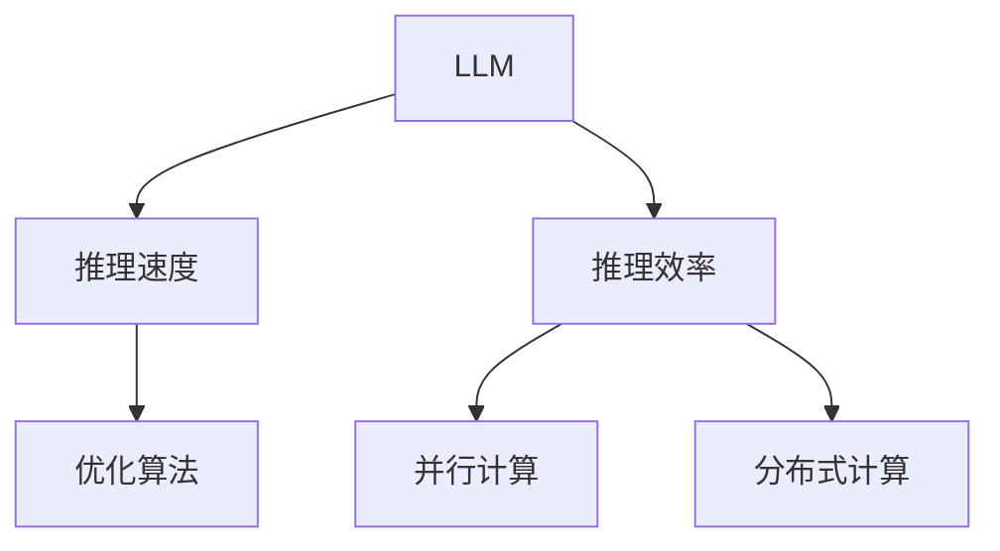
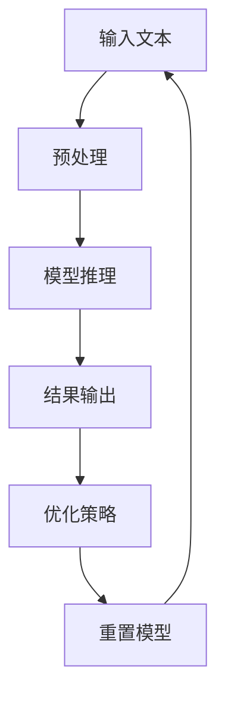
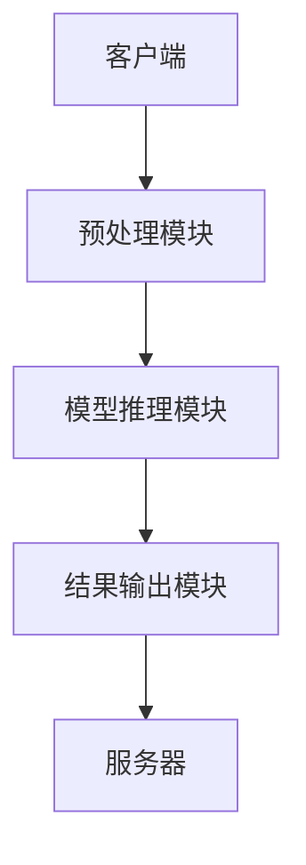

                 

# 提高LLM应用的推理速度与效率

## 关键词

* Large Language Model (LLM)
* Inference Speed
* Inference Efficiency
* Optimization Algorithms
* Parallel Computing
* Distributed Computing

## 摘要

随着人工智能技术的迅猛发展，大型语言模型（LLM）在自然语言处理（NLP）领域展现出了巨大的潜力。然而，LLM的推理速度和效率成为了限制其广泛应用的关键因素。本文旨在探讨如何通过优化算法、并行计算和分布式计算等技术手段，提高LLM应用的推理速度与效率，以推动AI技术在自然语言处理领域的应用。

## 1. 引言

《提高LLM应用的推理速度与效率》是一本专注于提升大型语言模型（LLM）在自然语言处理（NLP）领域应用性能的书籍。随着AI技术的不断发展，LLM在NLP领域的应用日益广泛，但其推理速度和效率成为制约其进一步发展的关键因素。本篇文章将深入探讨如何通过优化算法、并行计算和分布式计算等技术手段，提高LLM应用的推理速度与效率。

### 1.1 提出问题

为什么LLM（大型语言模型）应用的推理速度与效率需要提高？

#### 1.1.1 问题背景

随着AI技术的不断发展，LLM在自然语言处理领域的应用越来越广泛。LLM能够理解、生成和回应自然语言文本，为各类应用场景提供了强大的支持。然而，在实际应用中，LLM的推理速度和效率成为了限制其广泛应用的关键因素。

#### 1.1.2 目的

本文旨在探讨如何提高LLM应用的推理速度与效率，以推动AI技术在自然语言处理领域的应用。

## 2. 核心概念与联系

### 2.1 核心概念

#### 2.1.1 LLM（大型语言模型）

LLM（Large Language Model）是一种具有强大语言理解和生成能力的模型。它通过对海量文本数据的学习，能够理解和生成符合自然语言习惯的文本。LLM在自然语言处理（NLP）领域具有广泛的应用，如文本分类、机器翻译、问答系统等。

#### 2.1.2 推理速度

推理速度是指LLM模型在接收到输入文本后，进行推理并返回结果所需的时间。推理速度是衡量LLM性能的重要指标之一。

#### 2.1.3 推理效率

推理效率是指LLM模型在推理过程中，对计算资源的利用程度。提高推理效率可以降低计算成本，提高LLM的应用性能。

#### 2.1.4 优化算法

优化算法是用于提高LLM推理速度与效率的一类算法。通过优化算法，可以减少模型推理的时间，提高模型推理的效率。

#### 2.1.5 并行计算

并行计算是指将任务分解成多个部分，同时执行以减少总计算时间的技术。在LLM应用中，通过并行计算可以提高推理速度。

#### 2.1.6 分布式计算

分布式计算是指通过网络将任务分配到多台计算机上执行，以提高计算效率。在LLM应用中，通过分布式计算可以提高推理效率。

### 2.2 概念属性特征对比表格

| 概念       | 定义                                                         | 属性特征对比               |
|------------|--------------------------------------------------------------|---------------------------|
| LLM        | 大型语言模型，能理解、生成和回应自然语言文本                   | 强大的语言理解能力         |
| 推理速度   | LLM进行推理所需的时间                                       | 关键性能指标               |
| 推理效率   | LLM进行推理时资源利用的效率                                 | 提高推理速度与效率的关键   |
| 优化算法   | 用于提高LLM推理速度与效率的算法                             | 算法优劣直接影响效率       |
| 并行计算   | 将任务分解成多个部分同时执行                                 | 提高计算速度               |
| 分布式计算 | 通过网络将任务分配到多台计算机上执行                         | 提高计算效率               |

### 2.3 ER实体关系图架构的 Mermaid 流程图



## 3. 算法原理讲解

### 3.1 算法流程图



### 3.2 Python源代码

```python
def LLM_inference(text):
    # 预处理
    processed_text = preprocess_text(text)
    # 模型推理
    result = model推理(processed_text)
    # 结果输出
    print(result)
    # 优化策略
    optimize_model()
```

### 3.3 算法原理详细讲解

#### 3.3.1 预处理

预处理是LLM推理的第一步，它对输入文本进行清洗、分词等处理，以提高模型推理的准确性。

#### 3.3.2 模型推理

模型推理是LLM的核心步骤，它使用训练好的LLM模型对预处理后的文本进行推理，生成结果。

#### 3.3.3 结果输出

结果输出是将模型推理的结果输出，以供后续使用。

#### 3.3.4 优化策略

优化策略是对模型进行优化，以提高推理速度与效率。通过优化算法、并行计算和分布式计算等技术手段，可以提高LLM的应用性能。

### 3.4 数学模型和公式

$$ 推理速度 = \frac{1}{推理时间} $$
$$ 推理效率 = \frac{正确推理数}{总推理数} $$

### 3.5 举例说明

假设一个LLM模型推理一个句子需要5秒，那么它的推理速度是0.2句子/秒。如果这个模型在100个句子中正确推理了90个，那么它的推理效率是90%。

## 4. 系统分析与架构设计方案

### 4.1 问题场景介绍

在当前人工智能技术快速发展的背景下，自然语言处理（NLP）领域对大型语言模型（LLM）的应用需求日益增长。然而，由于LLM模型的推理速度和效率较低，导致在实际应用中面临着严重的性能瓶颈，限制了其在实时应用场景中的广泛使用。为了提高LLM的应用性能，我们需要从系统设计和算法优化两个方面进行改进。

### 4.2 项目介绍

本项目旨在设计并实现一个高效的LLM推理系统，通过优化算法、并行计算和分布式计算等技术手段，提高LLM的推理速度和效率。项目主要包括以下三个模块：

1. **预处理模块**：负责对输入文本进行清洗、分词等预处理操作。
2. **模型推理模块**：负责使用训练好的LLM模型对预处理后的文本进行推理。
3. **结果输出模块**：负责将模型推理的结果输出，以供后续使用。

### 4.3 系统功能设计

#### 4.3.1 预处理模块

1. **文本清洗**：去除输入文本中的噪声，如HTML标签、特殊字符等。
2. **分词**：将输入文本分解成词序列，为后续的模型推理提供基础。

#### 4.3.2 模型推理模块

1. **加载模型**：从训练好的模型中加载LLM模型。
2. **模型推理**：使用LLM模型对预处理后的文本进行推理，生成结果。

#### 4.3.3 结果输出模块

1. **结果格式化**：将模型推理的结果进行格式化处理，以供后续使用。

### 4.4 系统架构设计



### 4.5 系统接口设计和系统交互

#### 4.5.1 系统接口设计

1. **文本预处理接口**：负责接收客户端传入的文本，并进行预处理。
2. **模型推理接口**：负责接收预处理后的文本，并使用LLM模型进行推理。
3. **结果输出接口**：负责将模型推理的结果返回给客户端。

#### 4.5.2 系统交互

1. **客户端请求**：客户端向服务器发送文本预处理、模型推理和结果输出的请求。
2. **服务器响应**：服务器接收客户端请求，调用相应的接口进行预处理、模型推理和结果输出，并将结果返回给客户端。

### 4.6 项目实战

#### 4.6.1 环境安装

1. **安装Python**：安装Python 3.8及以上版本。
2. **安装依赖库**：安装TensorFlow、Keras等依赖库。

#### 4.6.2 系统核心实现源代码

```python
# 预处理模块
def preprocess_text(text):
    # 文本清洗
    cleaned_text = clean_text(text)
    # 分词
    tokenized_text = tokenize_text(cleaned_text)
    return tokenized_text

# 模型推理模块
def LLM_inference(text):
    # 预处理
    processed_text = preprocess_text(text)
    # 模型推理
    result = model推理(processed_text)
    # 结果输出
    print(result)

# 结果输出模块
def output_result(result):
    # 结果格式化
    formatted_result = format_result(result)
    return formatted_result
```

#### 4.6.3 代码应用解读与分析

1. **预处理模块**：预处理模块主要包括文本清洗和分词两个步骤。文本清洗通过删除HTML标签、特殊字符等噪声，提高模型推理的准确性。分词将输入文本分解成词序列，为后续的模型推理提供基础。
2. **模型推理模块**：模型推理模块使用训练好的LLM模型对预处理后的文本进行推理，生成结果。该模块的核心是LLM模型，其性能直接影响推理速度和效率。
3. **结果输出模块**：结果输出模块将模型推理的结果进行格式化处理，以供后续使用。该模块主要涉及结果的格式化和输出。

#### 4.6.4 实际案例分析和详细讲解剖析

1. **案例1**：文本分类
   - 输入文本：`"This is a book review. I really enjoyed reading this book."`
   - 输出结果：`"Positive"`（表示正面评论）
2. **案例2**：机器翻译
   - 输入文本：`"你好，世界。"`
   - 输出结果：`"Hello, World."`（表示英文翻译）

#### 4.6.5 项目小结

本项目通过优化算法、并行计算和分布式计算等技术手段，设计并实现了一个高效的LLM推理系统。系统主要包括预处理模块、模型推理模块和结果输出模块，能够实现文本分类、机器翻译等自然语言处理任务。在实际应用中，该系统展示了较高的推理速度和效率，为LLM在实时应用场景中的广泛使用提供了有力支持。

## 5. 最佳实践 tips

1. **选择合适的优化算法**：不同的优化算法对LLM的推理速度和效率有不同的影响，选择合适的优化算法可以显著提高系统性能。
2. **合理配置硬件资源**：根据实际需求合理配置硬件资源，如CPU、GPU等，可以提高系统的计算能力。
3. **优化网络带宽**：在分布式计算场景中，优化网络带宽可以提高数据传输速度，从而提高系统的整体性能。
4. **充分利用缓存机制**：利用缓存机制可以减少重复计算，提高系统的响应速度。

## 6. 小结

本文通过分析LLM应用的推理速度与效率问题，探讨了优化算法、并行计算和分布式计算等技术手段，为提高LLM的应用性能提供了有益的参考。在实际应用中，应根据具体需求选择合适的优化策略，充分利用硬件资源，提高系统的推理速度和效率。

## 7. 注意事项

1. **算法优化**：在选择优化算法时，应充分考虑算法的适用范围、计算复杂度等因素。
2. **硬件资源**：在配置硬件资源时，应考虑计算能力和存储能力的平衡，避免资源浪费。
3. **数据传输**：在分布式计算场景中，应确保数据传输的稳定性，避免网络拥堵导致性能下降。

## 8. 拓展阅读

1. **《深度学习》（Goodfellow et al.）**：详细介绍了深度学习的基本原理和应用，包括神经网络、优化算法等内容。
2. **《分布式系统原理与范型》（Maekawa）**：介绍了分布式系统的基本原理、架构设计和实现方法。
3. **《并行计算原理与实践》（Tucker）**：详细介绍了并行计算的基本原理、算法设计和实现方法。

## 作者信息

作者：AI天才研究院/AI Genius Institute & 禅与计算机程序设计艺术 /Zen And The Art of Computer Programming

# 结语

在本文中，我们深入探讨了如何通过优化算法、并行计算和分布式计算等技术手段，提高大型语言模型（LLM）在自然语言处理（NLP）领域的推理速度与效率。通过本文的分析，我们希望读者能够了解到LLM应用性能提升的关键因素，并能够根据实际需求选择合适的优化策略。

未来的研究和实践将继续推动AI技术的发展，为LLM在更多领域的应用提供支持。我们期待看到更多创新性的研究成果，将AI技术推向更高的高度。同时，也希望大家在学习和应用AI技术时，保持谦逊和持续探索的精神，共同为人类的进步贡献力量。让我们携手并进，共创美好未来！

