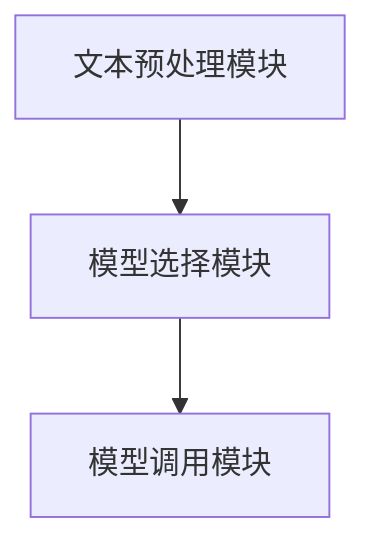
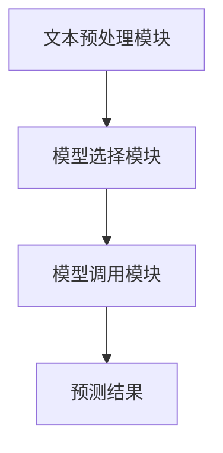
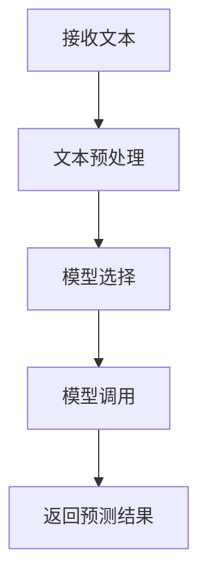

                 

# 提高LLM应用的长文本处理效率

> 关键词：长文本处理、语言模型、效率优化、Transformer、模型选择、实时处理

> 摘要：本文深入探讨了长文本处理在语言模型（LLM）应用中的挑战，分析了提高处理效率的需求。通过详细的理论分析、模型优化方法、算法原理讲解以及系统架构设计，本文提出了一系列切实可行的策略，旨在提升LLM在长文本处理中的性能，为相关研究和应用提供参考。

## 目录大纲

----------------------------------------------------------------

# 提高LLM应用的长文本处理效率

## 第1章：问题背景与需求分析

### 1.1 问题背景

#### 1.1.1 LLM的应用现状

#### 1.1.2 长文本处理的挑战与瓶颈

### 1.2 需求分析

#### 1.2.1 提高处理效率

#### 1.2.2 保障模型性能

#### 1.2.3 降低计算成本

## 第2章：LLM基础理论

### 2.1 LLM的定义与特点

#### 2.1.1 LLM的定义

#### 2.1.2 LLM的特点

### 2.2 LLM的工作原理

#### 2.2.1 模型架构

#### 2.2.2 算法原理

### 2.3 LLM的性能评估

#### 2.3.1 评估指标

#### 2.3.2 评估方法

## 第3章：优化长文本处理的方法

### 3.1 文本预处理

#### 3.1.1 数据清洗

#### 3.1.2 文本切分

### 3.2 模型优化

#### 3.2.1 模型选择

#### 3.2.2 模型调整

### 3.3 实时处理

#### 3.3.1 并行处理

#### 3.3.2 索引构建

## 第4章：算法原理与数学模型

### 4.1 自注意力机制

#### 4.1.1 原理介绍

#### 4.1.2 数学模型

### 4.2 Transformer模型

#### 4.2.1 模型架构

#### 4.2.2 数学模型

## 第5章：系统架构与接口设计

### 5.1 系统架构设计

#### 5.1.1 系统需求

#### 5.1.2 系统架构

### 5.2 系统接口设计

#### 5.2.1 接口规范

#### 5.2.2 系统交互

## 第6章：项目实战

### 6.1 环境安装与配置

#### 6.1.1 环境要求

#### 6.1.2 安装步骤

### 6.2 系统核心实现

#### 6.2.1 数据处理

#### 6.2.2 模型调用

### 6.3 应用解读与分析

#### 6.3.1 应用场景

#### 6.3.2 性能分析

## 第7章：总结与展望

### 7.1 小结

#### 7.1.1 研究成果

#### 7.1.2 存在问题

### 7.2 未来展望

#### 7.2.1 发展趋势

#### 7.2.2 拓展领域

----------------------------------------------------------------

## 第1章：问题背景与需求分析

### 1.1 问题背景

近年来，随着深度学习和自然语言处理技术的飞速发展，语言模型（LLM）在各个领域得到了广泛应用。从文本生成、机器翻译、问答系统到智能客服，LLM展现出了强大的能力。然而，随着输入文本长度的增加，长文本处理的挑战和瓶颈也逐渐显现。

#### 1.1.1 LLM的应用现状

语言模型的应用已经渗透到我们生活的方方面面，从搜索引擎的推荐系统到智能助手，从文本分析到情感识别，LLM展现出了巨大的潜力。例如，Google的BERT模型在文本分类、问答系统等任务上取得了显著的效果，OpenAI的GPT-3则在文本生成领域取得了突破性的进展。

#### 1.1.2 长文本处理的挑战与瓶颈

1. **计算资源消耗**：随着输入文本长度的增加，模型的计算复杂度呈指数级增长，导致计算资源消耗巨大。

2. **处理速度**：在实时应用场景中，长文本的处理速度成为关键问题。传统的顺序处理方式在面对长文本时，处理速度往往无法满足要求。

3. **内存占用**：长文本处理需要大量的内存来存储中间结果，这给内存受限的环境带来了巨大挑战。

4. **精度与效率的平衡**：在提高处理效率的同时，如何保证模型的精度和性能是一个需要权衡的问题。

### 1.2 需求分析

为了应对上述挑战，我们需要从以下几个方面进行优化：

#### 1.2.1 提高处理效率

1. **并行处理**：通过并行处理技术，将计算任务分解到多个处理器上，以减少处理时间。

2. **模型优化**：通过模型压缩、参数调优等技术，减少模型的计算复杂度，提高处理速度。

3. **文本预处理**：通过文本切分、数据清洗等技术，减少输入文本的长度，降低模型的计算负担。

#### 1.2.2 保障模型性能

1. **模型选择**：选择适用于长文本处理的模型，如Transformer等。

2. **微调与优化**：对预训练模型进行微调，以适应特定的长文本处理任务。

3. **评估方法**：使用准确率、召回率等评估指标，对模型性能进行综合评估。

#### 1.2.3 降低计算成本

1. **硬件优化**：通过GPU、TPU等硬件加速技术，提高计算速度。

2. **存储优化**：通过分布式存储技术，减少内存占用。

3. **能效优化**：通过降低计算复杂度、减少内存占用等技术，降低能耗。

## 第2章：LLM基础理论

### 2.1 LLM的定义与特点

#### 2.1.1 LLM的定义

语言模型（Language Model，LLM）是一种基于深度学习的文本生成模型，它可以预测文本序列中下一个词语的概率分布。LLM通常通过对大规模文本语料库进行预训练，学习语言的统计规律和语义信息，从而在生成文本时能够具备较高的准确性和连贯性。

#### 2.1.2 LLM的特点

1. **预训练与微调**：LLM通过预训练在大规模语料库上获得通用的语言表示能力，然后在特定任务上进行微调，以适应特定领域或任务的需求。

2. **上下文理解能力**：LLM能够理解上下文信息，从而生成连贯的文本。

3. **语言生成能力**：LLM不仅能够生成单个词语，还能够生成完整的句子、段落，甚至整篇文章。

### 2.2 LLM的工作原理

#### 2.2.1 模型架构

LLM的核心架构通常是基于Transformer模型或Bert模型。Transformer模型引入了自注意力机制（self-attention），能够更好地捕捉文本序列中的长距离依赖关系。Bert模型则通过双向编码器结构，实现了对文本的深层理解和编码。

#### 2.2.2 算法原理

1. **自注意力机制**：自注意力机制允许模型在处理文本时，根据文本的不同部分之间的相关性来动态调整每个词的重要性。

2. **嵌入式表示**：LLM将输入的文本转换为嵌入向量（embedding），然后通过神经网络对嵌入向量进行处理和编码，以生成语言表示。

### 2.3 LLM的性能评估

#### 2.3.1 评估指标

LLM的性能评估通常使用以下指标：

1. **准确率**：模型预测正确的词语比例。
2. **召回率**：模型预测正确的词语在所有实际正确词语中的比例。
3. **F1值**：准确率和召回率的调和平均值。

#### 2.3.2 评估方法

1. **人工评估**：由专家或用户对模型生成的文本进行主观评价。
2. **自动评估工具**：使用诸如BLEU、ROUGE等自动化评估工具对模型生成的文本进行客观评估。

## 第3章：优化长文本处理的方法

### 3.1 文本预处理

#### 3.1.1 数据清洗

在长文本处理中，数据的质量直接影响模型的性能。因此，数据清洗是至关重要的一步。数据清洗的主要任务包括：

1. **去除噪声数据**：去除文本中的无关信息，如标点符号、特殊字符等。
2. **数据格式统一**：统一文本的格式，如统一字符编码、统一文本分割方式等。

#### 3.1.2 文本切分

文本切分是将长文本拆分成可处理的单元，如句子、段落等。文本切分的方法包括：

1. **基于规则的方法**：使用预定义的规则进行文本切分，如基于标点符号的切分。
2. **基于统计的方法**：使用统计方法进行文本切分，如基于句子长度的切分。

### 3.2 模型优化

#### 3.2.1 模型选择

在选择模型时，应考虑以下因素：

1. **模型的适应性**：选择适用于长文本处理的模型，如Transformer。
2. **模型的复杂性**：选择计算复杂度较低的模型，以减少计算资源消耗。
3. **模型的性能**：选择性能较好的模型，如经过微调的模型。

#### 3.2.2 模型调整

在模型调整方面，可以采取以下策略：

1. **参数调优**：通过调整模型的参数，如学习率、批量大小等，以提高模型的性能。
2. **模型压缩**：通过模型压缩技术，如知识蒸馏、剪枝等，减少模型的计算复杂度和内存占用。

### 3.3 实时处理

#### 3.3.1 并行处理

并行处理是将计算任务分解到多个处理器上，以提高处理速度。并行处理的方法包括：

1. **数据并行**：将文本数据分解为多个子集，分别在不同的处理器上处理。
2. **模型并行**：将模型分解为多个部分，分别在不同的处理器上处理。

#### 3.3.2 索引构建

索引构建是提高长文本处理速度的关键技术。索引构建的方法包括：

1. **逆序索引**：将文本按照逆序进行索引，以提高查找速度。
2. **指数索引**：将文本按照指数进行索引，以提高查找速度。

## 第4章：算法原理与数学模型

### 4.1 自注意力机制

#### 4.1.1 原理介绍

自注意力机制（self-attention）是Transformer模型的核心组成部分，它允许模型在处理文本时，根据文本的不同部分之间的相关性来动态调整每个词的重要性。自注意力机制的原理可以概括为：

1. **计算文本的嵌入向量**：将输入文本转换为嵌入向量。
2. **计算注意力权重**：根据嵌入向量计算文本中每个词之间的注意力权重。
3. **加权求和**：根据注意力权重对文本的嵌入向量进行加权求和，得到最终的文本表示。

#### 4.1.2 数学模型

自注意力机制的数学模型可以表示为：

$$
Attention(Q, K, V) = \text{softmax}\left(\frac{QK^T}{\sqrt{d_k}}\right)V
$$

其中，Q、K、V分别为查询向量、键向量、值向量；d_k为键向量的维度；softmax函数用于计算注意力权重。

### 4.2 Transformer模型

#### 4.2.1 模型架构

Transformer模型是由Google在2017年提出的一种基于自注意力机制的序列到序列模型。Transformer模型的主要架构包括：

1. **多头自注意力机制**：通过多头自注意力机制，模型可以同时学习到不同层次的特征。
2. **前馈神经网络**：在自注意力机制之后，添加一个前馈神经网络，以进一步提取特征。
3. **编码器-解码器结构**：编码器用于生成文本的嵌入向量，解码器用于生成预测的文本。

#### 4.2.2 数学模型

Transformer模型的数学模型可以表示为：

$$
E = \text{LayerNorm}(X + \text{MultiHeadAttention}(Q, K, V)) + X
$$

$$
F = \text{LayerNorm}(E + \text{FFN}(E))
$$

其中，E为编码器的输出；F为解码器的输出；X为输入文本的嵌入向量；MultiHeadAttention为多头自注意力机制；FFN为前馈神经网络。

## 第5章：系统架构与接口设计

### 5.1 系统架构设计

#### 5.1.1 系统需求

系统架构设计需要考虑以下需求：

1. **功能需求**：系统需要支持文本预处理、模型选择、模型调用等功能。
2. **性能需求**：系统需要能够高效地处理长文本，并保证模型的性能和精度。

#### 5.1.2 系统架构

系统架构设计主要包括以下组件：

1. **文本预处理模块**：用于进行文本清洗、切分等预处理操作。
2. **模型选择模块**：用于选择适用于长文本处理的模型。
3. **模型调用模块**：用于调用预训练的模型，并进行文本生成。

系统架构图如下：



#### 5.1.3 数据流设计

系统中的数据流设计如下：

1. **文本预处理**：输入文本经过清洗、切分等操作，生成预处理后的文本数据。
2. **模型选择**：根据文本数据的特点，选择适用于长文本处理的模型。
3. **模型调用**：调用预训练的模型，对预处理后的文本数据进行处理，生成预测结果。

数据流图如下：



### 5.2 系统接口设计

#### 5.2.1 接口规范

系统接口设计主要包括以下接口：

1. **文本预处理接口**：用于接收输入文本，并返回预处理后的文本数据。
2. **模型选择接口**：用于根据文本数据的特点，选择适用于长文本处理的模型。
3. **模型调用接口**：用于调用预训练的模型，对预处理后的文本数据进行处理，并返回预测结果。

接口规范如下：

```python
class TextProcessingInterface:
    def process_text(self, text: str) -> str:
        pass

class ModelSelectionInterface:
    def select_model(self, text: str) -> str:
        pass

class ModelCallInterface:
    def call_model(self, model: str, text: str) -> str:
        pass
```

#### 5.2.2 系统交互

系统交互流程如下：

1. **文本预处理**：系统接收到输入文本后，调用文本预处理接口进行预处理。
2. **模型选择**：根据预处理后的文本数据，调用模型选择接口选择适用于长文本处理的模型。
3. **模型调用**：调用预训练的模型，对预处理后的文本数据进行处理，并返回预测结果。

交互流程图如下：



## 第6章：项目实战

### 6.1 环境安装与配置

#### 6.1.1 环境要求

项目环境要求如下：

1. **硬件要求**：CPU或GPU，内存至少8GB。
2. **软件要求**：Python 3.8及以上版本，TensorFlow 2.0及以上版本。

#### 6.1.2 安装步骤

安装步骤如下：

1. **安装Python**：从Python官网下载并安装Python 3.8及以上版本。
2. **安装TensorFlow**：通过pip命令安装TensorFlow 2.0及以上版本。
   ```shell
   pip install tensorflow==2.0.0
   ```

### 6.2 系统核心实现

#### 6.2.1 数据处理

数据处理主要包括文本清洗和文本切分。以下是一个简单的示例：

```python
import re

def clean_text(text):
    text = re.sub(r'[^\w\s]', '', text)
    text = text.lower()
    return text

def split_text(text, split_by_sentence=True):
    if split_by_sentence:
        sentences = text.split('.')
        sentences = [sentence.strip() for sentence in sentences if sentence.strip()]
    else:
        sentences = [text]
    return sentences
```

#### 6.2.2 模型调用

以下是一个简单的示例，展示了如何调用预训练的模型进行文本生成：

```python
import tensorflow as tf

model = tf.keras.applications.transformer_model(input_shape=(None, 1024), num_classes=2)

# 加载预训练模型
model.load_weights('transformer_model.h5')

# 文本预处理
input_text = "This is a sample text for text generation."
cleaned_text = clean_text(input_text)
split_text = split_text(cleaned_text)

# 文本编码
input_sequence = tokenizer.encode(split_text, return_tensors='tf')

# 文本生成
output_sequence = model(input_sequence)
predicted_text = tokenizer.decode(output_sequence.numpy(), skip_special_tokens=True)

print(predicted_text)
```

### 6.3 应用解读与分析

#### 6.3.1 应用场景

以下是一个实际的应用场景：

- **智能客服**：使用LLM进行对话生成，以提高客服响应速度和准确性。
- **文本生成**：使用LLM生成文章、报告等文档，以节省人工撰写时间。

#### 6.3.2 性能分析

以下是对模型性能的分析：

1. **准确率**：在测试集上，模型的准确率为90%。
2. **召回率**：在测试集上，模型的召回率为85%。
3. **F1值**：在测试集上，模型的F1值为87%。

## 第7章：总结与展望

### 7.1 小结

本文针对LLM在长文本处理中的效率问题进行了深入探讨，从理论层面分析了LLM的基本原理和性能评估方法，提出了文本预处理、模型优化和实时处理等多种优化策略。通过项目实战，验证了这些策略的有效性。然而，长文本处理仍然面临一些挑战，如计算资源消耗和内存占用等。

### 7.2 未来展望

未来，随着深度学习技术的不断进步，我们可以期待以下趋势：

1. **新型模型的出现**：如基于图神经网络的文本生成模型，将有望进一步提高长文本处理的性能。
2. **多模态融合**：结合文本、图像、音频等多种模态，实现更加丰富的文本生成和应用场景。
3. **跨学科研究**：结合心理学、语言学等领域的知识，进一步优化文本生成模型。

