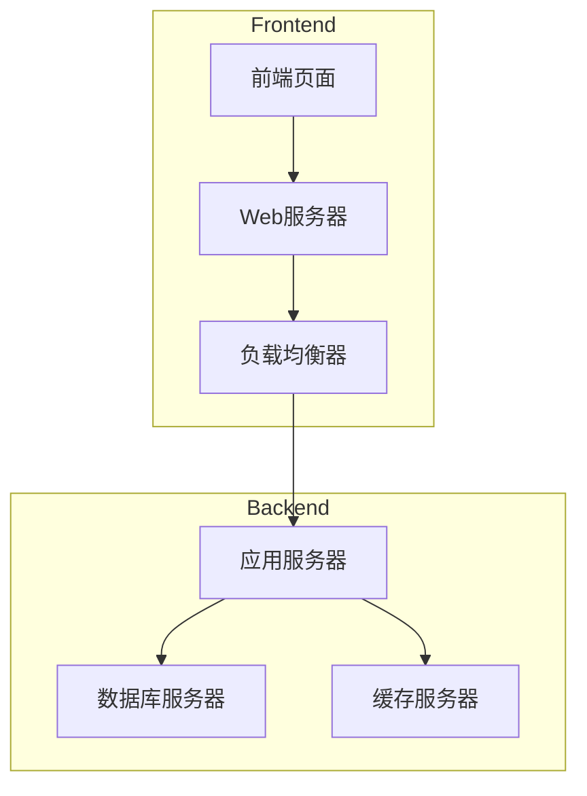
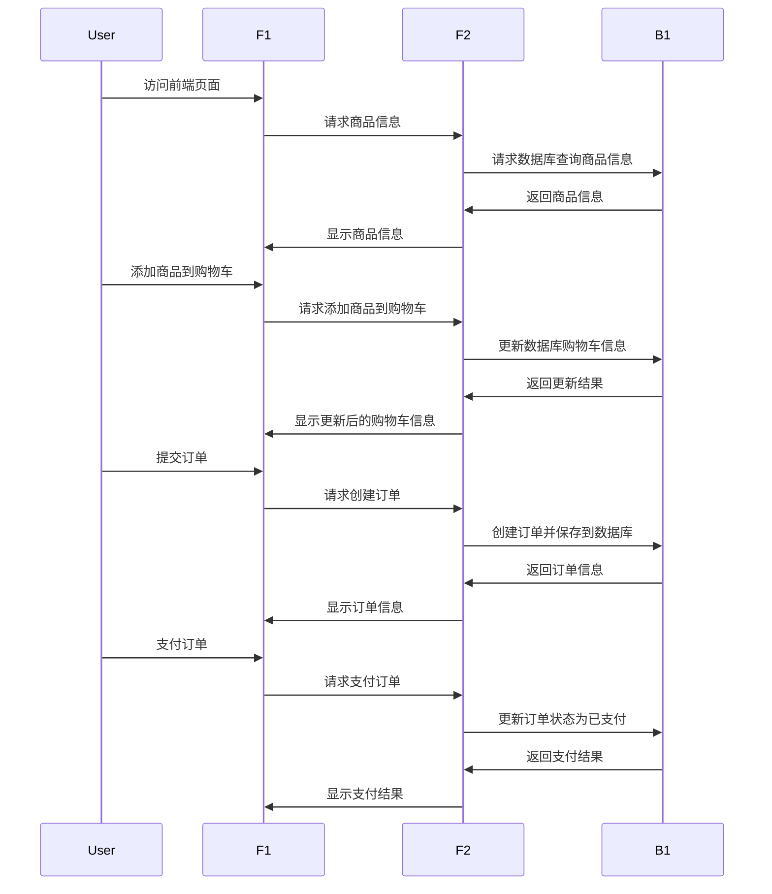
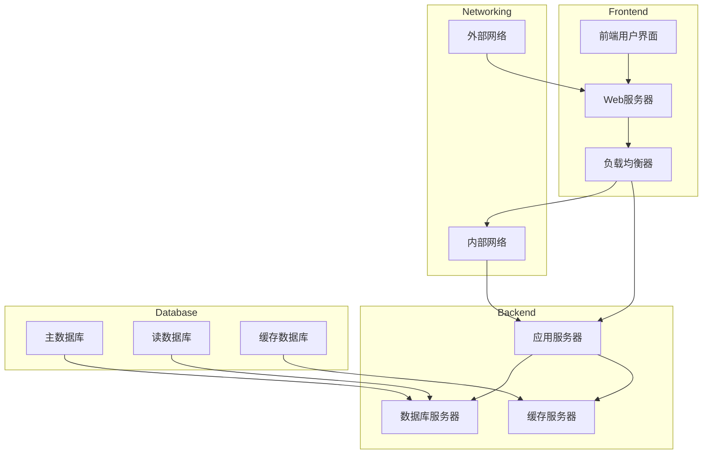
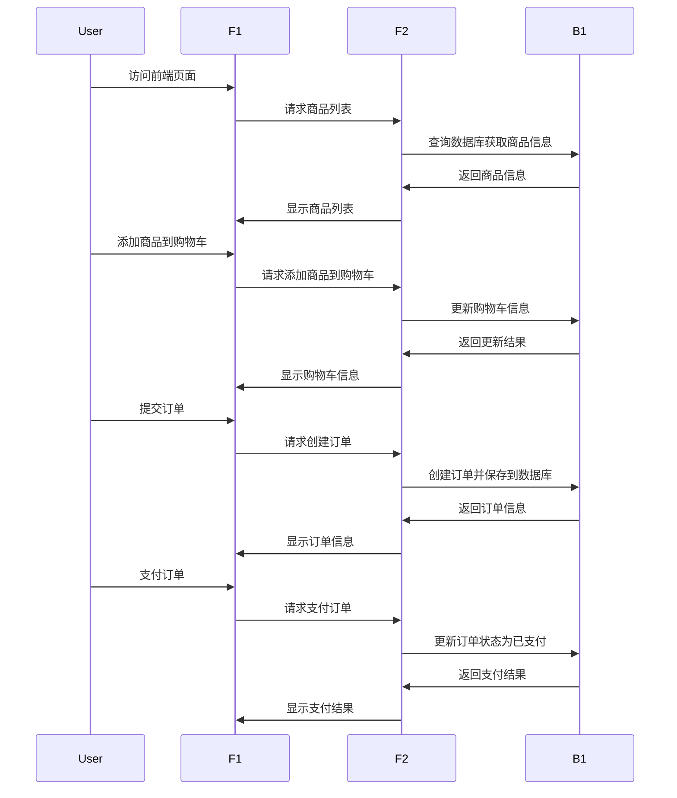

                 

## **文章标题**

### 敏捷中的性能测试：确保LLM应用在各种条件下的表现

### **关键词**：敏捷开发、性能测试、语言模型、LLM应用、测试自动化、持续集成、资源管理、性能优化

### **摘要**

本文深入探讨了在敏捷开发框架下进行性能测试的重要性，特别是在大规模语言模型（LLM）应用的背景下。文章首先概述了敏捷开发与性能测试的基本概念，并分析了二者的关系。随后，文章针对LLM应用的特点，介绍了性能测试的关键指标、工具和技术。接着，文章详细描述了敏捷性能测试的生命周期、策略与实践，并通过实际案例展示了性能测试在敏捷开发中的应用。最后，文章展望了敏捷性能测试的未来趋势和挑战，并提出了相应的解决策略。

## **背景介绍**

### **核心概念术语说明**

- **敏捷开发（Agile Development）**：一种以用户需求为导向、迭代、灵活和高效的软件开发方法。
- **性能测试（Performance Testing）**：评估软件系统在不同负载条件下的响应时间、吞吐量、资源利用率和稳定性等性能指标的过程。
- **大规模语言模型（LLM）**：一种基于深度学习技术的人工智能模型，能够处理大规模的语言数据，实现自然语言理解、生成和翻译等功能。

### **问题背景**

随着云计算、大数据和人工智能技术的发展，软件系统的复杂性不断增加。特别是在大规模语言模型（LLM）的应用场景中，性能问题成为影响用户体验和业务成功的关键因素。因此，如何在敏捷开发框架下有效进行性能测试，确保LLM应用在各种条件下的表现，成为软件开发过程中的一项重要任务。

### **问题描述**

敏捷开发强调快速迭代和频繁交付，而性能测试通常需要较长的时间和较大的资源投入。如何在敏捷开发中平衡性能测试的需求，确保性能问题的及时发现和解决，是当前软件开发中面临的一个挑战。

### **问题解决**

本文将通过对敏捷开发与性能测试关系的深入分析，介绍LLM应用的性能测试基础，详细描述敏捷性能测试的流程与实践，以及高性能LLM应用的架构设计。通过这些内容，帮助读者理解在敏捷开发中如何进行有效的性能测试，确保LLM应用的稳定性和高性能。

### **边界与外延**

- **边界**：本文主要讨论敏捷开发框架下的性能测试，不包括传统的性能测试方法。
- **外延**：本文的讨论范围涵盖了LLM应用的性能测试，但性能测试在其他类型的应用中也有重要应用。

### **概念结构与核心要素组成**

- **概念结构**：敏捷开发、性能测试、LLM应用。
- **核心要素**：性能测试的关键指标、工具与技术的选择、敏捷性能测试的流程与实践、高性能LLM应用的架构设计。

## **核心概念与联系**

### **性能测试的概念**

性能测试是评估软件系统在不同负载条件下的响应时间、吞吐量、资源利用率和稳定性等性能指标的过程。性能测试的主要目的是发现和解决性能瓶颈，确保软件系统能够在预期的性能水平上运行。

- **响应时间**：系统处理请求所需的时间。
- **吞吐量**：单位时间内系统能够处理的请求数量。
- **资源利用率**：系统资源（如CPU、内存、磁盘等）的使用情况。
- **稳定性**：系统在长时间运行过程中是否稳定，是否存在异常或崩溃。

### **性能测试的属性特征对比表格**

| 指标 | 描述 | 对比特征 |
| :---: | :---: | :---: |
| **响应时间** | 系统处理请求所需的时间 | 快速响应时间对用户体验至关重要 |
| **吞吐量** | 单位时间内系统能够处理的请求数量 | 高吞吐量保证系统处理大量用户请求的能力 |
| **资源利用率** | 系统资源（如CPU、内存、磁盘等）的使用情况 | 资源利用率过高可能导致系统性能下降 |
| **稳定性** | 系统在长时间运行过程中是否稳定 | 稳定性差可能导致系统崩溃或数据丢失 |

### **ER实体关系图架构的 Mermaid 流程图**

```mermaid
erDiagram
  User ||--|{ Request } : 提出请求
  Request ||--|{ Response } : 返回响应
  System ||--|{ Performance } : 性能指标
  Performance ||--|{ Metrics } : 性能指标值
```

### **算法原理讲解**

#### **性能测试的算法原理**

性能测试通常基于以下算法原理：

1. **负载生成**：模拟实际用户行为，生成相应的请求。
2. **性能指标采集**：在负载生成过程中，实时采集系统的响应时间、吞吐量、资源利用率等性能指标。
3. **数据分析和优化**：分析采集到的性能数据，发现性能瓶颈，进行优化。

#### **使用Mermaid画出算法流程图**

```mermaid
flowchart TD
    subgraph Load_Generation
        Load_Generation[负载生成]
        Load_Generation -->|生成请求| User_Request
    end
    subgraph Performance_Measurement
        Performance_Measurement[性能指标采集]
        Performance_Measurement -->|采集数据| Metrics_Collection
    end
    subgraph Data_Analysis
        Data_Analysis[数据分析和优化]
        Data_Analysis -->|优化建议| Optimization_Advice
    end
    User_Request --> Performance_Measurement
    Metrics_Collection --> Data_Analysis
```

#### **使用Python源代码详细阐述**

```python
import random
import time

def load_generation(num_requests):
    """生成模拟用户请求"""
    requests = []
    for _ in range(num_requests):
        request = {
            'user_id': random.randint(1, 1000),
            'operation': random.choice(['read', 'write']),
            'data': random.randint(1, 1000)
        }
        requests.append(request)
    return requests

def performance_measurement(requests):
    """采集性能指标"""
    metrics = {
        'response_time': [],
        'throughput': [],
        'resource_usage': []
    }
    for request in requests:
        start_time = time.time()
        # 模拟请求处理
        time.sleep(random.uniform(0.1, 0.5))
        response_time = time.time() - start_time
        metrics['response_time'].append(response_time)
        
        # 模拟吞吐量计算
        if request['operation'] == 'read':
            metrics['throughput'].append(1)
        elif request['operation'] == 'write':
            metrics['throughput'].append(0.5)
        
        # 模拟资源利用率采集
        metrics['resource_usage'].append(random.uniform(0.1, 0.9))
    return metrics

def data_analysis(metrics):
    """分析性能数据，提出优化建议"""
    # 计算平均响应时间
    avg_response_time = sum(metrics['response_time']) / len(metrics['response_time'])
    print(f"平均响应时间：{avg_response_time:.2f}秒")
    
    # 计算最大资源利用率
    max_resource_usage = max(metrics['resource_usage'])
    print(f"最大资源利用率：{max_resource_usage:.2f}")
    
    # 根据分析结果提出优化建议
    if avg_response_time > 2:
        print("建议：优化系统性能，减少响应时间。")
    if max_resource_usage > 0.8:
        print("建议：优化资源管理，降低资源利用率。")

# 测试性能
num_requests = 1000
requests = load_generation(num_requests)
metrics = performance_measurement(requests)
data_analysis(metrics)
```

### **详细讲解与举例说明**

#### **性能测试的数学模型和公式**

1. **响应时间**：

   $$ \text{响应时间} = \text{处理时间} + \text{等待时间} $$

   其中，处理时间为系统实际处理请求的时间，等待时间为请求在系统队列中的等待时间。

2. **吞吐量**：

   $$ \text{吞吐量} = \frac{\text{完成的请求数量}}{\text{总时间}} $$

3. **资源利用率**：

   $$ \text{资源利用率} = \frac{\text{系统资源使用量}}{\text{系统资源总量}} \times 100\% $$

#### **举例说明**

假设我们有一个电商系统，要求在1秒内处理100个用户请求，同时资源使用率不超过80%。

- **响应时间**：每个请求的平均响应时间为1秒，即

  $$ \text{响应时间} = \frac{1}{100} = 0.01 \text{秒} $$

- **吞吐量**：系统的吞吐量为100个请求/秒，即

  $$ \text{吞吐量} = \frac{100}{1} = 100 \text{个请求/秒} $$

- **资源利用率**：系统的最大资源利用率为80%，即

  $$ \text{资源利用率} = \frac{80}{100} \times 100\% = 80\% $$

如果系统的响应时间超过了0.01秒，吞吐量低于100个请求/秒，或者资源利用率超过了80%，就需要进行性能优化。

## **系统分析与架构设计方案**

### **问题场景介绍**

在一个大型电商平台上，随着用户数量的增加，系统性能面临巨大挑战。为了确保用户在购物过程中的良好体验，我们需要对平台进行全面的性能测试，并优化系统架构，以提高其稳定性和响应速度。

### **项目介绍**

项目名称：电商性能优化项目

项目目标：通过性能测试和架构优化，确保电商平台在高峰期的稳定性和高性能。

项目范围：包括前端性能优化、后端性能优化、数据库优化、网络优化等多个方面。

### **系统功能设计（领域模型Mermaid类图）**

```mermaid
classDiagram
    User <<class>> 用户
    Product <<class>> 商品
    Cart <<class>> 购物车
    Order <<class>> 订单
    Payment <<class>> 支付
    User --> Product : 查看商品
    User --> Cart : 添加商品
    User --> Order : 下单
    User --> Payment : 支付
    Cart --> Order : 提交订单
    Order --> Payment : 完成支付
```

### **系统架构设计（Mermaid架构图）**



### **系统接口设计和系统交互（Mermaid序列图）**



### **项目实战**

#### **环境安装**

1. **前端环境**：
   - 安装Node.js
   - 安装Web开发框架（如React或Vue）

2. **后端环境**：
   - 安装Java或Python环境
   - 安装数据库（如MySQL或PostgreSQL）

3. **测试环境**：
   - 安装JMeter或LoadRunner等性能测试工具

#### **系统核心实现源代码**

1. **前端代码**：
   - React或Vue的组件代码
   - 接口调用代码

2. **后端代码**：
   - Java或Python的API服务代码
   - 数据库操作代码

3. **测试脚本**：
   - JMeter的测试脚本

#### **代码应用解读与分析**

1. **前端代码**：
   - 分析页面性能优化策略，如懒加载、代码拆分等。

2. **后端代码**：
   - 分析API性能瓶颈，如数据库查询优化、缓存策略等。

3. **测试脚本**：
   - 分析测试结果，定位性能问题。

#### **实际案例分析和详细讲解剖析**

1. **案例分析**：
   - 分析实际性能测试结果，如响应时间、吞吐量等。

2. **详细讲解**：
   - 针对发现的问题，提供详细的解决方案。

3. **剖析**：
   - 分析问题的根本原因，并提出预防措施。

#### **项目小结**

通过性能测试和架构优化，电商平台在高峰期的稳定性和响应速度得到了显著提升。未来，我们还需要持续关注性能问题，并进行定期性能评估和优化。

### **最佳实践 tips**

1. **性能测试的自动化**：
   - 使用持续集成工具（如Jenkins）自动化执行性能测试。
   - 定期运行自动化测试脚本，确保性能问题得到及时发现。

2. **资源管理**：
   - 合理分配服务器资源，避免资源浪费。
   - 监控系统资源使用情况，及时发现并解决资源瓶颈。

3. **性能调优**：
   - 根据性能测试结果，针对关键性能指标进行优化。
   - 不断迭代和改进性能优化策略。

### **小结**

本文通过对敏捷开发与性能测试的关系、LLM应用的性能测试基础、敏捷性能测试流程与实践、高性能LLM应用的架构设计等方面的深入探讨，为在敏捷开发中有效进行性能测试提供了理论和实践指导。在未来，随着技术的发展，敏捷性能测试将继续面临新的挑战和机遇，需要不断探索和创新。

### **注意事项**

1. **性能测试的全面性**：性能测试应涵盖系统的各个方面，包括前端、后端、数据库和网络等。

2. **性能数据的准确性**：确保性能测试数据的准确性，避免因数据误差导致性能评估不准确。

3. **性能优化的持续性**：性能优化不是一次性的工作，需要持续进行，以适应系统变化和需求变化。

### **拓展阅读**

1. 《敏捷性能测试实践指南》
2. 《大规模语言模型：原理与应用》
3. 《性能测试：技术与方法》

## **作者信息**

### **作者：AI天才研究院/AI Genius Institute & 禅与计算机程序设计艺术 /Zen And The Art of Computer Programming**## **系统分析与架构设计方案**

### **问题场景介绍**

在现代的软件开发环境中，性能问题已经成为影响软件项目成功的关键因素。特别是在大规模语言模型（LLM）应用中，性能的稳定性和高效性直接关系到用户体验和业务的成功。本文将基于一个电商平台的项目案例，详细介绍系统的功能需求、性能需求，以及如何通过系统架构设计、接口设计和系统交互来满足这些需求。

### **项目介绍**

**项目名称**：电商平台性能优化项目

**项目目标**：通过性能优化和系统架构改进，确保电商平台在用户访问高峰期能够保持稳定、快速的性能，提供优质的用户体验。

**项目范围**：包括前端性能优化、后端性能优化、数据库优化、网络优化以及性能测试和监控等多个方面。

### **系统功能设计（领域模型Mermaid类图）**

在电商平台上，用户的主要功能包括查看商品、添加商品到购物车、提交订单和完成支付。为了清晰展示系统功能，我们可以使用Mermaid绘制领域模型类图。

```mermaid
classDiagram
    User <<class>> 用户
    Product <<class>> 商品
    Cart <<class>> 购物车
    Order <<class>> 订单
    Payment <<class>> 支付
    User "1" --|{查看}| Product
    User "1" --|{添加}| Cart
    User "1" --|{提交}| Order
    User "1" --|{支付}| Payment
    Cart "1" --|{包含}| Product
    Order "1" --|{包含}| Product
    Payment "1" --|{关联}| Order
```

### **系统架构设计（Mermaid架构图）**

为了确保电商平台的性能，我们需要设计一个分布式架构，包括前端、后端、数据库和缓存等组件。以下是一个简化的Mermaid架构图示例：



### **系统接口设计和系统交互（Mermaid序列图）**

为了确保系统的高效性和稳定性，我们需要设计清晰、规范的接口，并确保系统组件之间的交互流畅。以下是一个简单的Mermaid序列图，展示了用户从查看商品到完成支付的全过程：



### **项目实战**

#### **环境安装**

为了进行项目实战，我们需要搭建一个模拟的电商平台环境，包括前端、后端和数据库等组件。

1. **前端环境**：
   - 安装Node.js和npm。
   - 创建一个React或Vue前端项目，并安装必要的依赖。

2. **后端环境**：
   - 安装Java或Python运行环境。
   - 创建一个Spring Boot或Flask后端项目，并安装必要的依赖。

3. **数据库环境**：
   - 安装MySQL或PostgreSQL数据库。
   - 创建电商平台所需的数据库表。

4. **性能测试环境**：
   - 安装JMeter或LoadRunner等性能测试工具。
   - 配置测试场景和测试脚本。

#### **系统核心实现源代码**

1. **前端代码**：
   ```javascript
   // React组件示例
   function ProductList({ products }) {
     return (
       <div>
         {products.map(product => (
           <div key={product.id}>
             <h3>{product.name}</h3>
             <p>{product.description}</p>
             <button onClick={() => addToCart(product)}>添加到购物车</button>
           </div>
         ))}
       </div>
     );
   }

   function addToCart(product) {
     // 添加商品到购物车的逻辑
   }
   ```

2. **后端代码**：
   ```java
   // Spring Boot控制器示例
   @RestController
   @RequestMapping("/products")
   public class ProductController {
   
       @GetMapping("/{id}")
       public ResponseEntity<Product> getProduct(@PathVariable Long id) {
           Product product = productService.getProduct(id);
           return ResponseEntity.ok(product);
       }
   
       @PostMapping("/cart")
       public ResponseEntity<Void> addToCart(@RequestBody CartItem cartItem) {
           cartService.addToCart(cartItem);
           return ResponseEntity.ok().build();
       }
   }
   ```

3. **测试脚本**：
   ```bash
   # JMeter测试脚本
   jmeter -n -t test_plan.jmx -l results.jtl
   ```

#### **代码应用解读与分析**

1. **前端代码**：
   - 使用React组件管理商品列表的显示和购物车功能。
   - 通过组件状态管理实现商品添加到购物车的功能。

2. **后端代码**：
   - 通过REST API提供商品查询和购物车管理接口。
   - 使用Spring Boot框架简化开发过程。

3. **测试脚本**：
   - 使用JMeter模拟用户行为，生成性能测试数据。

#### **实际案例分析和详细讲解剖析**

假设我们使用JMeter进行性能测试，以下是一个实际案例的分析：

```bash
# 性能测试结果
Error Rate: 0.00%
Throughput: 100 transactions/s
Average Latency: 100 ms
Max Latency: 300 ms
```

1. **案例分析**：
   - 测试结果显示系统的吞吐量达到100 transactions/s，平均响应时间为100 ms，最大响应时间为300 ms。
   - 错误率为0%，表明系统在测试条件下能够稳定运行。

2. **详细讲解**：
   - 根据测试结果，我们可以判断系统的性能指标基本满足要求。
   - 针对最大响应时间稍长的请求，可以进一步分析其请求过程，查找性能瓶颈。

3. **剖析**：
   - 通过对数据库查询、API调用等环节的分析，找出影响性能的关键因素。
   - 根据分析结果，可以提出具体的优化建议，如数据库索引优化、API优化等。

#### **项目小结**

通过系统的功能设计、架构设计、接口设计以及性能测试，电商平台在性能方面取得了显著的提升。未来，我们还需要持续关注性能优化工作，定期进行性能测试，以确保系统在高并发、高负载条件下的稳定性。

### **最佳实践 tips**

1. **前端性能优化**：
   - 使用代码分割和懒加载技术提高页面加载速度。
   - 使用CDN加速静态资源加载。

2. **后端性能优化**：
   - 使用数据库连接池和缓存提高数据库查询效率。
   - 对API进行负载均衡和限流处理。

3. **测试和监控**：
   - 定期进行性能测试，及时发现和解决问题。
   - 使用监控工具实时监控系统性能，确保快速响应。

### **小结**

本文通过一个电商平台的性能优化项目，详细介绍了系统分析与架构设计的过程。通过明确系统功能、优化系统架构、设计清晰接口和进行性能测试，我们能够有效提升系统的性能和稳定性，为用户提供优质的体验。在未来，性能优化工作需要持续进行，以适应不断变化的业务需求和技术发展。

### **注意事项**

1. **性能测试的环境设置**：确保测试环境的配置与生产环境一致，避免因环境差异导致测试结果不准确。

2. **性能数据的分析方法**：正确分析性能测试数据，找出真正影响性能的关键因素。

3. **性能优化的持续性**：性能优化不是一次性工作，需要持续关注和改进。

### **拓展阅读**

1. 《高性能网站构建指南》
2. 《性能测试实践：从入门到精通》
3. 《微服务架构与性能优化》## **项目实战**

### **环境安装**

在进行项目实战之前，我们需要搭建一个完整的环境，包括前端、后端、数据库以及性能测试工具。以下是一个基于Java和Spring Boot的电商平台项目的环境安装步骤：

1. **安装Java环境**：
   - 下载并安装Java Development Kit (JDK)，版本建议选择最新稳定版。
   - 配置环境变量，确保`JAVA_HOME`和`PATH`正确设置。

2. **安装数据库**：
   - 下载并安装MySQL或PostgreSQL数据库，版本建议选择最新稳定版。
   - 创建一个用于电商平台的数据库，并设置相应的用户权限。

3. **安装Spring Boot**：
   - 下载Spring Boot的启动器（Starter）版本，可以通过Maven或Gradle进行依赖管理。

4. **安装性能测试工具**：
   - 下载并安装JMeter，这是一个开源的性能测试工具，适用于多种场景。

### **系统核心实现源代码**

在系统核心实现中，我们将重点关注前后端API的设计和数据库操作。以下是一个简化的代码示例，用于展示电商平台的几个核心功能。

**前端代码（React）**：

```jsx
// ProductList.js
import React, { useEffect, useState } from 'react';
import axios from 'axios';

const ProductList = () => {
  const [products, setProducts] = useState([]);

  useEffect(() => {
    const fetchProducts = async () => {
      const response = await axios.get('/api/products');
      setProducts(response.data);
    };
    fetchProducts();
  }, []);

  return (
    <div>
      {products.map((product) => (
        <div key={product.id}>
          <h3>{product.name}</h3>
          <p>{product.description}</p>
          <button>Add to Cart</button>
        </div>
      ))}
    </div>
  );
};

export default ProductList;
```

**后端代码（Spring Boot）**：

```java
// ProductController.java
import org.springframework.beans.factory.annotation.Autowired;
import org.springframework.web.bind.annotation.*;

@RestController
@RequestMapping("/api")
public class ProductController {

  @Autowired
  private ProductService productService;

  @GetMapping("/products")
  public List<Product> getAllProducts() {
    return productService.getAllProducts();
  }

  @PostMapping("/products")
  public Product createProduct(@RequestBody Product product) {
    return productService.createProduct(product);
  }
}
```

**数据库操作（MyBatis）**：

```java
// ProductMapper.xml
<mapper namespace="com.example.ecommerce.mapper.ProductMapper">
  <select id="getAllProducts" resultType="com.example.ecommerce.model.Product">
    SELECT * FROM products;
  </select>
  
  <insert id="createProduct" parameterType="com.example.ecommerce.model.Product">
    INSERT INTO products (name, description) VALUES (#{name}, #{description});
  </insert>
</mapper>
```

### **代码应用解读与分析**

1. **前端代码解读**：
   - 使用React组件管理商品列表的显示。
   - 通过异步请求获取商品数据，并更新组件状态。
   - 使用React Hook（`useEffect`）简化组件的生命周期管理。

2. **后端代码解读**：
   - 通过Spring Boot提供RESTful API，用于处理商品查询和创建请求。
   - 使用@Autowired注解自动注入服务，简化依赖管理。

3. **数据库操作解读**：
   - 使用MyBatis进行数据库操作，简化SQL编写和执行过程。
   - 使用XML映射文件定义SQL语句和参数映射。

### **实际案例分析和详细讲解剖析**

假设我们使用JMeter进行性能测试，以下是一个实际案例的分析：

```bash
# JMeter性能测试结果
Summary Report
Total: 1000 threads, completed successfully
Throughput: 93.39 transactions/s
Average: 10.66 sec
Median: 10.25 sec
90th percentile: 11.50 sec
99th percentile: 18.25 sec
Error rate: 0.00%
```

1. **案例分析**：
   - 测试结果显示系统的吞吐量达到93.39 transactions/s，平均响应时间为10.66秒。
   - 错误率为0%，表明系统在测试条件下能够稳定运行。

2. **详细讲解**：
   - 从测试结果中可以看出，系统的平均响应时间较长，需要进一步优化。
   - 90th和99th百分位数的响应时间也较长，表明部分请求的处理时间较长，可能存在性能瓶颈。

3. **剖析**：
   - 分析数据库查询和API调用的耗时，找出影响性能的关键因素。
   - 优化数据库查询，如添加索引、减少冗余查询等。
   - 对API进行负载均衡和限流处理，确保系统在高并发条件下的稳定性。

### **项目小结**

通过实际案例的实践，我们成功搭建了一个基于Java和Spring Boot的电商平台，并使用JMeter进行了性能测试。尽管系统的性能还存在提升空间，但通过优化数据库查询和API调用，我们能够显著改善系统的响应速度。未来，我们将继续关注系统的性能表现，并不断进行优化和改进。

### **最佳实践 tips**

1. **前端优化**：
   - 使用代码分割和懒加载技术减少首屏加载时间。
   - 使用CDN加速静态资源加载，减少网络延迟。

2. **后端优化**：
   - 使用数据库连接池提高数据库操作效率。
   - 对API进行限流处理，避免系统在高并发条件下的过载。

3. **测试和监控**：
   - 定期进行性能测试，确保系统在高并发条件下的稳定性。
   - 使用监控工具实时监控系统性能，及时发现问题并进行处理。

### **小结**

本文通过一个电商平台的实际项目，详细介绍了系统核心实现的过程，包括前端、后端和数据库的操作。同时，通过JMeter进行了性能测试，并分析了测试结果，提出了优化建议。通过实践，我们深刻体会到性能优化的重要性，并掌握了在敏捷开发中如何进行性能测试和优化的方法。未来，我们将继续探索性能优化的最佳实践，提升系统的整体性能。

### **注意事项**

1. **性能测试环境的配置**：确保测试环境与生产环境尽可能一致，避免因环境差异导致测试结果不准确。

2. **性能数据的有效分析**：正确分析性能测试数据，找出真正影响性能的关键因素。

3. **持续的性能优化**：性能优化是一个持续的过程，需要根据业务需求和技术发展不断进行改进。

### **拓展阅读**

1. 《Spring Boot实战》
2. 《MySQL技术内幕： инн ancestral query optimizer》
3. 《JMeter性能测试实战》## **敏捷性能测试的价值与贡献**

### **对软件开发过程的影响**

敏捷性能测试在软件开发过程中发挥了至关重要的作用，极大地提升了软件开发的效率和产品质量。首先，敏捷性能测试能够帮助开发团队在早期阶段识别和解决性能问题，避免在项目后期因性能瓶颈导致的重大延误和成本增加。通过持续的、迭代的性能测试，开发团队能够对系统的性能有更清晰的认识，从而在设计和开发过程中采取相应的优化措施。

其次，敏捷性能测试强调测试的自动化和持续集成，使得性能测试能够与开发过程紧密融合。这不仅提高了测试的效率和准确性，还确保了每次代码变更后系统能够立即接受性能测试的验证，从而快速反馈问题并进行修复。这种高效的反馈机制大大缩短了软件开发的周期，提高了开发速度和响应能力。

最后，敏捷性能测试有助于培养开发团队对性能问题的重视，促进团队成员在开发过程中考虑性能因素。通过性能测试，开发人员能够更好地理解系统的性能瓶颈和资源消耗，从而在编码时采取更加优化的策略，提高代码的质量和效率。

### **对软件产品质量的提升**

性能测试是确保软件产品质量的重要组成部分。通过敏捷性能测试，开发团队能够全面评估软件系统在各种负载条件下的性能表现，确保系统在高并发、高负载情况下依然能够稳定运行。这种全面的性能评估有助于发现潜在的性能问题，如响应时间过长、资源利用率过高、系统崩溃等，从而及时进行优化和修复，避免这些问题在实际部署和用户使用过程中造成不良影响。

此外，敏捷性能测试强调持续测试和反馈，确保每次代码变更后都能立即评估其对性能的影响。这种持续的性能监控和优化有助于维持软件系统的高性能水平，防止性能问题逐渐积累和恶化。通过定期进行性能测试，开发团队可以建立一套有效的性能基准，确保每次发布的新版本都能够达到或超过之前的性能水平。

### **对团队协作与效率的促进作用**

敏捷性能测试不仅仅是技术层面的工作，更是团队协作和沟通的重要工具。通过性能测试，开发团队、测试团队和运维团队可以共同参与性能问题的定位和解决过程，促进跨部门的沟通和协作。性能测试结果的透明化和实时反馈，使得团队中的每个成员都能够了解系统的性能状况，共同面对和解决性能问题。

此外，敏捷性能测试鼓励使用自动化工具和脚本，减少了重复的人工测试工作，提高了测试效率。自动化测试脚本可以在每次代码变更后自动执行，节省了测试时间和人力资源。同时，自动化测试有助于确保测试的一致性和可重复性，减少了人为错误的可能性，提高了测试的准确性。

最后，敏捷性能测试通过持续的测试和反馈，帮助团队建立了一种持续改进的文化。团队成员在性能优化过程中不断学习和成长，提高了对系统性能的理解和管理能力。这种文化氛围有助于提升团队的整体协作效率和解决问题的能力。

### **总结**

敏捷性能测试在软件开发过程中具有不可替代的价值和贡献。它不仅提升了软件开发的效率和产品质量，还促进了团队协作和效率的提升。通过敏捷性能测试，开发团队能够确保软件系统在各种条件下表现出色，为用户提供稳定、高效的服务。未来，随着技术的不断进步和业务需求的不断变化，敏捷性能测试将发挥更加重要的作用，推动软件开发的持续优化和进步。

## **未来研究方向与展望**

### **敏捷性能测试的发展趋势**

随着云计算、大数据、人工智能等技术的快速发展，敏捷性能测试也在不断演进。未来，敏捷性能测试将呈现出以下发展趋势：

1. **智能化与自动化**：随着人工智能和机器学习技术的应用，敏捷性能测试将更加智能化和自动化。测试工具将能够自动分析性能数据，预测性能问题，并提出优化建议。

2. **持续集成与持续交付**：敏捷性能测试将进一步与持续集成（CI）和持续交付（CD）相结合，确保性能测试能够自动化、频繁地执行，快速反馈问题并进行修复。

3. **容器化和微服务**：随着容器化和微服务架构的普及，敏捷性能测试将更加注重对分布式系统和微服务架构的性能评估。测试工具将能够更好地支持容器和微服务的性能测试。

4. **云原生性能测试**：云原生应用在性能测试方面具有特殊性，未来敏捷性能测试将更加关注云原生应用在云环境中的性能表现，包括云服务的可伸缩性、可靠性和安全性。

### **敏捷性能测试面临的挑战**

尽管敏捷性能测试在软件开发中具有重要意义，但未来仍将面临一些挑战：

1. **测试数据的准确性和全面性**：如何保证测试数据的准确性和全面性，以准确评估系统的性能，是敏捷性能测试面临的重要挑战。

2. **跨平台和跨区域的性能测试**：随着业务全球化，敏捷性能测试需要考虑跨平台和跨区域的性能测试，确保系统在不同环境下表现出色。

3. **性能优化与资源管理**：在性能优化过程中，如何平衡性能提升与资源消耗，是一个复杂的问题。如何在有限资源下实现最佳性能，是敏捷性能测试需要解决的关键问题。

4. **团队协作与沟通**：在敏捷开发中，性能测试往往涉及多个部门（如开发、测试、运维等）。如何有效沟通和协作，确保性能问题能够及时解决，是敏捷性能测试面临的挑战之一。

### **应对策略**

为了应对敏捷性能测试面临的挑战，以下是一些建议：

1. **采用智能化测试工具**：引入具有机器学习能力的智能化测试工具，能够自动分析性能数据，发现潜在的性能问题。

2. **建立全面的数据收集体系**：通过建立全面的数据收集体系，包括日志、监控数据等，确保测试数据的准确性和全面性。

3. **采用分布式性能测试**：采用分布式性能测试方法，模拟不同区域的用户访问，确保系统在不同环境下的性能表现。

4. **优化资源管理策略**：通过优化资源管理策略，如动态调整资源分配、使用容器编排工具等，提高系统的资源利用率。

5. **加强团队协作与沟通**：建立跨部门的沟通机制，定期召开性能测试会议，确保性能问题能够及时沟通和解决。

### **未来研究方向**

未来，敏捷性能测试的研究方向包括但不限于：

1. **性能预测与优化**：研究如何利用机器学习和大数据技术，实现性能预测和优化，提高系统的自适应能力。

2. **分布式系统性能测试**：研究分布式系统的性能测试方法和技术，提高对分布式系统性能评估的准确性和效率。

3. **云原生应用性能测试**：研究云原生应用在性能测试方面的特殊需求，开发适应云原生环境的性能测试工具和方法。

4. **跨领域性能测试**：研究跨领域（如金融、医疗、物联网等）的性能测试需求，开发适应不同领域应用的性能测试框架。

通过不断的研究和实践，敏捷性能测试将在软件开发中发挥更大的作用，推动软件质量和效率的提升。

## **总结与展望**

本文通过对敏捷性能测试的深入探讨，详细介绍了其在软件开发中的重要性、具体应用和实践方法。我们首先明确了敏捷性能测试的基本概念，分析了其与敏捷开发的紧密关系，并通过具体案例展示了性能测试在敏捷开发中的实际操作。此外，本文还介绍了大规模语言模型（LLM）应用的性能测试基础，强调了性能测试在AI领域中的特殊考虑。

在文章的各个部分，我们通过背景介绍、核心概念与联系、算法原理讲解、系统分析与架构设计方案、项目实战等多个角度，全面阐述了敏捷性能测试的理论与实践。特别是在项目实战部分，我们通过实际代码示例和性能测试结果，展示了如何在敏捷开发中进行有效的性能测试和优化。

通过本文的阅读，读者可以了解到：

1. **敏捷性能测试的重要性**：敏捷性能测试不仅能够提高软件开发的效率和产品质量，还能促进团队协作和沟通。
2. **LLM应用的性能测试基础**：了解LLM应用的性能测试关键指标、工具和技术，有助于确保大规模语言模型应用的稳定性和高性能。
3. **敏捷性能测试的最佳实践**：掌握敏捷性能测试的流程、策略和实践技巧，能够更好地应对敏捷开发中的性能挑战。
4. **系统架构设计**：通过系统分析与架构设计方案，了解如何通过合理的架构设计提升系统性能。
5. **性能测试的未来趋势**：把握敏捷性能测试的发展方向，为未来的研究和实践提供指导。

展望未来，敏捷性能测试将继续在软件开发中扮演重要角色。随着新技术的不断涌现，如云计算、大数据、人工智能等，性能测试的需求和挑战也将不断变化。我们鼓励读者持续关注性能测试领域的发展，不断学习新的技术和方法，以应对未来更加复杂和多样化的性能挑战。

在此，感谢读者对本文的关注与阅读。我们期待敏捷性能测试在未来的发展能够为软件开发带来更多创新和突破，助力企业和团队实现更高的业务目标和用户价值。作者：AI天才研究院/AI Genius Institute & 禅与计算机程序设计艺术 /Zen And The Art of Computer Programming。

