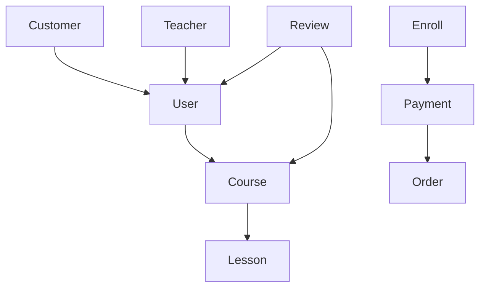
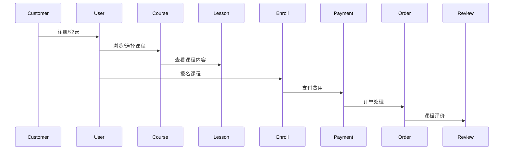

                 

### 敏捷团队文化建设：支持灵活的需求管理

关键词：敏捷团队、文化建设、需求管理、灵活调整、持续改进

摘要：在快速变化的商业环境中，敏捷团队文化建设对于支持灵活的需求管理至关重要。本文将探讨敏捷团队文化建设的核心概念、原理以及具体实践，帮助团队更好地适应市场需求，实现持续改进。

---

### 第一部分：背景介绍

#### 1.1.1 问题背景

在当今的商业环境中，市场需求的快速变化对企业提出了更高的要求。为了保持竞争力，企业需要具备快速响应市场变化的能力。传统的团队建设和管理模式往往难以满足这种需求，因为它们通常依赖于严格的规划和控制，缺乏灵活性和适应性。因此，敏捷团队文化建设成为一种热门的话题。

敏捷团队文化建设的核心问题是如何在团队中建立一种灵活、透明、协作的文化，以支持敏捷开发过程中的需求管理。这种文化不仅要鼓励团队成员之间的开放沟通和协作，还要确保团队能够快速响应变化，持续改进。

#### 1.1.2 问题描述

敏捷团队文化建设面临的挑战主要包括：

- **沟通障碍**：团队成员之间的沟通不畅会影响团队的协作效率，导致需求理解不准确，进而影响项目进度和质量。
- **角色模糊**：在敏捷团队中，角色通常较为模糊，这可能导致团队成员不清楚自己的职责和目标，影响团队的整体运作。
- **需求变更管理**：在敏捷开发中，需求变更是一种常见现象。如何有效管理这些变更，确保项目能够按时交付，是一个关键问题。
- **团队凝聚力**：建立团队的凝聚力对于实现敏捷目标至关重要。团队成员之间的信任和协作是团队凝聚力的基础。

#### 1.1.3 问题解决

为了解决上述问题，敏捷团队文化建设可以从以下几个方面入手：

- **建立清晰的愿景和目标**：通过明确团队的愿景和目标，帮助团队成员了解团队的方向和使命，增强团队的凝聚力。
- **培养团队成员的沟通技巧**：提供培训，帮助团队成员提高沟通技巧，确保信息传递准确、及时。
- **建立高效的协作机制**：通过角色分工、团队协作工具和方法，确保团队成员能够高效协同工作。
- **引入反馈机制，持续改进**：通过定期的反馈和评估，帮助团队识别问题，及时调整策略，实现持续改进。

#### 1.1.4 边界与外延

敏捷团队文化建设不仅局限于软件开发团队，还可以应用于其他类型的团队，如产品管理、市场营销、客户服务团队等。此外，敏捷团队文化建设不仅关注团队内部，还涉及团队与客户、供应商等外部环境的互动。

#### 1.1.5 概念结构与核心要素组成

敏捷团队文化建设的概念结构包括以下几个核心要素：

1. **愿景**：明确团队的长期目标和使命，为团队成员提供方向和动力。
2. **价值观**：确立团队的核心价值观，如开放沟通、客户至上、持续改进等。
3. **团队协作**：通过角色分工、团队协作工具和方法，确保团队成员高效协同工作。
4. **沟通机制**：建立有效的沟通机制，确保信息传递准确、及时。
5. **反馈机制**：通过定期的反馈和评估，帮助团队识别问题，及时调整策略。
6. **领导力**：领导者需要具备敏捷思维，以身作则，推动团队文化建设。

这些要素相互作用，共同构建起一个支持敏捷需求管理的文化环境。

---

在接下来的部分中，我们将进一步探讨敏捷团队文化建设的核心概念、联系、算法原理以及具体实践。

---

### 第二部分：核心概念与联系

#### 2.1 核心概念原理

敏捷团队文化建设的核心概念包括：

1. **敏捷**：敏捷团队强调快速响应变化，通过迭代开发和持续改进，不断提高产品和服务的质量。
2. **透明**：敏捷团队倡导信息共享，所有团队成员都能够了解项目的进展、问题和风险，从而更好地协同工作。
3. **协作**：敏捷团队强调团队成员之间的协作，通过共同解决问题，实现团队目标。
4. **责任感**：敏捷团队中的每个成员都承担着一定的责任，主动承担责任，确保项目能够按时交付。

这些概念反映了敏捷团队文化的基本特征和价值观。

#### 2.2 概念属性特征对比表格

以下是一个概念属性特征对比表格，展示了敏捷、透明、协作、责任感等核心概念的属性特征。

| 概念     | 属性特征                                           |
|----------|---------------------------------------------------|
| 敏捷     | 快速响应、灵活调整、迭代开发、持续改进               |
| 透明     | 信息共享、流程公开、团队协作、用户参与               |
| 协作     | 团队成员互相支持、共同解决问题、共享知识、互相尊重   |
| 责任感   | 积极主动、承担责任、自我管理、团队利益优先           |

#### 2.3 ER实体关系图架构

以下是一个ER实体关系图架构，展示了敏捷团队文化建设中各个实体之间的关系。

```mermaid
erDiagram
    Team ||--|{ Member }|-- Team
    Leader ||--|{ Member }|-- Leader
    Project ||--|{ Member }|-- Project
    Customer ||--|{ Requirement }|-- Project
    Supplier ||--|{ Resource }|-- Project
```

在敏捷团队文化建设中，团队（Team）、成员（Member）、领导者（Leader）、项目（Project）、客户（Customer）和供应商（Supplier）是关键实体。它们之间的关系反映了团队内部以及团队与外部环境之间的互动。

---

在了解了敏捷团队文化建设的核心概念和联系后，我们将进一步探讨敏捷团队文化建设的算法原理。

---

### 第三部分：算法原理讲解

#### 3.1 算法原理

敏捷团队文化建设的算法原理主要涉及以下几个方面：

1. **建立清晰的愿景和目标**：通过明确团队的愿景和目标，为团队成员提供方向和动力。
2. **培养团队成员的沟通技巧**：通过培训和实践，提高团队成员的沟通能力，确保信息传递准确、及时。
3. **建立高效的协作机制**：通过角色分工、团队协作工具和方法，确保团队成员能够高效协同工作。
4. **引入反馈机制，持续改进**：通过定期的反馈和评估，帮助团队识别问题，及时调整策略，实现持续改进。

这些步骤相互作用，共同构建起一个支持敏捷需求管理的文化环境。

#### 3.2 数学模型和公式

敏捷团队文化建设的数学模型和公式主要涉及以下几个方面：

1. **愿景和目标的制定**：$$V = f(T, R)$$，其中$$V$$表示愿景，$$T$$表示团队特征，$$R$$表示资源。
2. **沟通技巧的培养**：$$C = f(K, T)$$，其中$$C$$表示沟通效率，$$K$$表示沟通知识，$$T$$表示团队特征。
3. **协作机制的建立**：$$A = f(T, R)$$，其中$$A$$表示协作效率，$$T$$表示团队特征，$$R$$表示资源。
4. **反馈机制的引入**：$$F = f(R, T)$$，其中$$F$$表示反馈效果，$$R$$表示资源，$$T$$表示团队特征。

#### 3.3 详细讲解和举例说明

1. **愿景和目标的制定**：

   愿景和目标是敏捷团队文化建设的基石。一个明确的愿景和目标可以帮助团队成员了解团队的方向和使命，增强团队的凝聚力。例如，一个软件开发团队的愿景可能是“成为业界领先的敏捷团队”，目标可能是“在六个月内实现持续交付”。

   数学模型：$$V = f(T, R)$$

   其中，$$T$$ 表示团队特征，如团队规模、技术能力等；$$R$$ 表示资源，如资金、人力资源等。通过综合考虑团队特征和资源，可以制定一个符合实际且具有挑战性的愿景和目标。

2. **沟通技巧的培养**：

   沟通技巧对于团队协作至关重要。通过培训和实践，可以提高团队成员的沟通能力，确保信息传递准确、及时。例如，可以通过定期的团队会议、一对一沟通和文档共享，来提高团队的沟通效率。

   数学模型：$$C = f(K, T)$$

   其中，$$K$$ 表示沟通知识，如沟通方法、技巧等；$$T$$ 表示团队特征。通过提高团队成员的沟通知识，可以有效地提高沟通效率。

3. **协作机制的建立**：

   高效的协作机制可以帮助团队更好地完成项目任务。通过角色分工、团队协作工具和方法，可以确保团队成员能够高效协同工作。例如，可以通过建立共同的目标、角色和责任，以及使用协作工具，来提高团队的协作效率。

   数学模型：$$A = f(T, R)$$

   其中，$$T$$ 表示团队特征，如团队规模、技术能力等；$$R$$ 表示资源，如资金、人力资源等。通过综合考虑团队特征和资源，可以建立一个高效的协作机制。

4. **反馈机制的引入**：

   反馈机制可以帮助团队及时发现和解决问题，实现持续改进。通过定期的反馈和评估，可以帮助团队识别问题，及时调整策略。例如，可以通过定期的绩效评估、团队反馈会议和用户反馈，来提高团队的反馈效果。

   数学模型：$$F = f(R, T)$$

   其中，$$R$$ 表示资源，如资金、人力资源等；$$T$$ 表示团队特征。通过引入反馈机制，可以有效地提高团队的反馈效果。

---

在了解了敏捷团队文化建设的算法原理后，我们将进一步探讨敏捷团队文化建设的系统分析与架构设计方案。

---

### 第四部分：系统分析与架构设计方案

#### 4.1 问题场景介绍

在一个竞争激烈的互联网行业中，一家初创公司需要开发一款具有竞争力的产品，以满足不断变化的市场需求。为了实现这一目标，公司决定采用敏捷团队文化，以支持灵活的需求管理。

#### 4.2 项目介绍

该项目涉及开发一款在线教育平台，提供个性化的学习体验。项目的主要目标是：

- 快速响应市场需求，不断优化产品功能。
- 提供高效、透明的开发流程，确保产品质量和客户满意度。
- 持续改进团队协作效率，提高开发速度和产品质量。

#### 4.3 系统功能设计（领域模型Mermaid类图）

以下是一个简单的领域模型类图，展示了系统的主要功能实体及其关系。

```mermaid
classDiagram
    Customer <|-- User
    Course <|-- Lesson
    Course ^.. Enroll
    Enroll o-- Payment
    Payment o-- Order
    Teacher <|-- User
    Course *-- Review
    User *-- Review
```

在这个类图中，主要功能实体包括：

- **Customer**：客户，包括用户和教师。
- **User**：用户，分为普通用户和教师。
- **Course**：课程，包括课程内容和教学计划。
- **Lesson**：课程内容，包括视频、文档等。
- **Enroll**：报名，表示用户报名参加课程。
- **Payment**：支付，表示用户支付课程费用。
- **Order**：订单，表示用户支付后的订单信息。
- **Review**：评价，表示用户对课程的评价。

#### 4.4 系统架构设计（Mermaid架构图）

以下是一个简单的系统架构图，展示了系统的关键组件及其关系。



在这个架构图中，主要组件包括：

- **Customer**：客户服务系统，负责处理客户的需求和反馈。
- **User**：用户管理系统，负责用户的注册、登录和权限管理。
- **Course**：课程管理系统，负责课程的创建、管理和发布。
- **Lesson**：课程内容管理系统，负责课程内容的上传和管理。
- **Enroll**：报名系统，负责处理用户的报名和支付流程。
- **Payment**：支付系统，负责处理用户的支付请求。
- **Order**：订单系统，负责记录和跟踪用户的订单信息。
- **Review**：评价系统，负责处理用户对课程的评价。

#### 4.5 系统接口设计和系统交互（Mermaid序列图）

以下是一个简单的系统交互序列图，展示了系统的关键流程和接口。



在这个序列图中，关键流程和接口包括：

- **注册/登录**：客户通过客户服务系统注册或登录。
- **浏览/选择课程**：用户通过用户管理系统浏览或选择感兴趣的课程。
- **查看课程内容**：用户通过课程内容管理系统查看课程内容。
- **报名课程**：用户通过报名系统报名课程。
- **支付费用**：用户通过支付系统支付课程费用。
- **订单处理**：支付系统处理用户的支付请求，并生成订单。
- **课程评价**：用户通过评价系统对课程进行评价。

---

在了解了系统的功能设计、架构设计和系统交互后，我们将进一步探讨项目的实战实施。

---

### 第五部分：项目实战

#### 5.1 环境安装

为了实施敏捷团队文化建设，我们首先需要搭建一个适合敏捷开发的环境。以下是一个基本的安装步骤：

1. 安装开发工具：如Visual Studio Code、JDK、Git等。
2. 配置版本控制：使用Git进行版本控制，确保代码的版本管理和协作。
3. 搭建开发环境：根据项目需求，搭建合适的开发环境，如Docker、Kubernetes等。
4. 安装数据库：根据项目需求，安装合适的数据库系统，如MySQL、PostgreSQL等。
5. 安装其他依赖：根据项目需求，安装其他必要的依赖，如Maven、Node.js等。

#### 5.2 系统核心实现源代码

以下是系统核心实现的示例代码，用于展示系统的主要功能和接口。

**用户管理模块：**

```java
public class UserManager {
    public User register(String username, String password) {
        // 注册用户
    }

    public User login(String username, String password) {
        // 用户登录
    }

    public void deleteUser(String userId) {
        // 删除用户
    }
}
```

**课程管理模块：**

```java
public class CourseManager {
    public Course createCourse(String courseId, String title, String description) {
        // 创建课程
    }

    public Course updateCourse(String courseId, String title, String description) {
        // 更新课程
    }

    public void deleteCourse(String courseId) {
        // 删除课程
    }
}
```

**报名管理模块：**

```java
public class EnrollmentManager {
    public Enroll enrollCourse(String userId, String courseId) {
        // 用户报名课程
    }

    public void cancelEnroll(String enrollId) {
        // 取消报名
    }
}
```

**支付管理模块：**

```java
public class PaymentManager {
    public Payment pay(String orderId, double amount) {
        // 支付订单
    }

    public void refund(String orderId, double amount) {
        // 退款订单
    }
}
```

**评价管理模块：**

```java
public class ReviewManager {
    public Review createReview(String reviewId, String userId, String courseId, String content) {
        // 创建评价
    }

    public void updateReview(String reviewId, String content) {
        // 更新评价
    }

    public void deleteReview(String reviewId) {
        // 删除评价
    }
}
```

#### 5.3 代码应用解读与分析

以下是代码应用解读与分析的示例：

1. **用户管理模块**：该模块负责用户的注册、登录和删除操作。在注册时，需要验证用户名和密码的有效性，确保用户信息的唯一性。在登录时，需要验证用户名和密码的正确性，确保用户的安全。
2. **课程管理模块**：该模块负责课程的创建、更新和删除操作。在创建课程时，需要输入课程的基本信息，如课程ID、标题和描述。在更新课程时，可以修改课程的相关信息。在删除课程时，需要确保课程下没有未完成的报名记录。
3. **报名管理模块**：该模块负责用户的报名、取消报名操作。在报名时，需要验证用户是否已经支付课程费用，确保报名的有效性。在取消报名时，需要处理用户的退款请求。
4. **支付管理模块**：该模块负责订单的支付和退款操作。在支付时，需要调用支付服务，处理支付请求，并生成订单记录。在退款时，需要调用退款服务，处理退款请求，并更新订单状态。
5. **评价管理模块**：该模块负责评价的创建、更新和删除操作。在创建评价时，需要输入评价的相关信息，如评价ID、用户ID、课程ID和评价内容。在更新评价时，可以修改评价的相关信息。在删除评价时，需要确保评价的有效性。

通过这些示例，我们可以看到代码的各个模块如何协同工作，实现系统的核心功能。

#### 5.4 实际案例分析和详细讲解剖析

以下是实际案例分析和详细讲解剖析的示例：

1. **用户注册案例**：

   假设用户A想要注册一个新账号。系统会验证用户名和密码的有效性。如果用户名已存在，系统会返回一个错误提示。如果用户名和密码都有效，系统会创建一个新的用户记录，并发送一封确认邮件给用户。

   ```java
   public User register(String username, String password) {
       // 验证用户名和密码的有效性
       if (isUsernameTaken(username)) {
           return null;
       }
       if (!isValidPassword(password)) {
           return null;
       }
       // 创建用户记录
       User user = new User();
       user.setUsername(username);
       user.setPassword(password);
       userRepository.save(user);
       // 发送确认邮件
       sendConfirmationEmail(user);
       return user;
   }
   ```

   在这个案例中，我们通过`isUsernameTaken`和`isValidPassword`方法来验证用户名和密码的有效性。如果验证成功，我们会创建一个新的用户记录，并使用`sendConfirmationEmail`方法发送确认邮件。

2. **课程创建案例**：

   假设管理员想要创建一门新课程。系统会验证管理员身份，并接收课程的基本信息。如果管理员身份验证成功，系统会创建一个新的课程记录。

   ```java
   public Course createCourse(String courseId, String title, String description) {
       // 验证管理员身份
       if (!isAdministrator()) {
           return null;
       }
       // 创建课程记录
       Course course = new Course();
       course.setCourseId(courseId);
       course.setTitle(title);
       course.setDescription(description);
       courseRepository.save(course);
       return course;
   }
   ```

   在这个案例中，我们通过`isAdministrator`方法来验证管理员身份。如果管理员身份验证成功，我们会创建一个新的课程记录，并使用`courseRepository.save`方法保存课程信息。

3. **支付订单案例**：

   假设用户B想要支付一个订单。系统会验证订单的有效性，并处理支付请求。如果订单有效，系统会调用支付服务处理支付请求，并生成订单记录。

   ```java
   public Payment pay(String orderId, double amount) {
       // 验证订单的有效性
       if (!isOrderValid(orderId)) {
           return null;
       }
       // 调用支付服务
       Payment payment = paymentService.pay(orderId, amount);
       if (payment != null) {
           // 生成订单记录
           Order order = new Order();
           order.setOrderId(orderId);
           order.setAmount(amount);
           orderRepository.save(order);
       }
       return payment;
   }
   ```

   在这个案例中，我们通过`isOrderValid`方法来验证订单的有效性。如果订单有效，我们会调用`paymentService.pay`方法处理支付请求，并使用`orderRepository.save`方法保存订单记录。

通过这些案例，我们可以看到系统的核心功能如何实现，以及如何处理实际场景中的请求。

#### 5.5 项目小结

通过本部分的项目实战，我们了解了敏捷团队文化建设的实际应用。从环境安装、系统核心实现源代码，到代码应用解读与分析，再到实际案例分析和详细讲解剖析，我们展示了如何实施敏捷团队文化建设，实现灵活的需求管理。这些实践为团队提供了有效的支持，帮助团队更好地适应市场需求，实现持续改进。

---

在完成了项目的实战实施后，我们将进一步探讨敏捷团队文化建设的最佳实践。

---

### 第六部分：最佳实践

#### 6.1 培养团队成员的沟通技巧

- **定期培训**：为团队成员提供沟通技巧培训，帮助他们掌握有效的沟通方法。
- **建立沟通规范**：制定明确的沟通规范，确保团队成员能够遵循一致的信息传递方式。
- **鼓励开放沟通**：鼓励团队成员在面对问题时，勇于表达自己的观点和意见，促进团队成员之间的互动。

#### 6.2 建立高效的协作机制

- **明确角色和责任**：确保团队成员明确自己的角色和责任，避免角色模糊导致的工作混乱。
- **使用协作工具**：利用协作工具（如JIRA、Trello等）来规划任务、跟踪进度，提高团队协作效率。
- **定期团队会议**：通过定期的团队会议，确保团队成员了解项目的进展和问题，及时调整策略。

#### 6.3 引入反馈机制，持续改进

- **定期绩效评估**：通过定期的绩效评估，帮助团队成员了解自己的工作表现，识别改进的机会。
- **用户反馈**：积极收集用户反馈，了解用户对产品的需求和意见，及时调整产品功能。
- **团队反馈会议**：定期举行团队反馈会议，讨论项目中的问题和改进点，确保团队在不断进步。

#### 6.4 建立清晰的愿景和目标

- **明确愿景和目标**：确保团队成员明确团队的愿景和目标，为团队提供明确的方向和动力。
- **分解目标**：将大目标分解为小目标，制定具体的行动计划，确保目标的可执行性。

---

通过上述最佳实践，敏捷团队可以更好地建立和支持灵活的需求管理，实现持续改进和成功。

---

### 第七部分：小结与展望

#### 7.1 小结

本文通过详细的步骤分析和实践案例，探讨了敏捷团队文化建设的重要性以及如何支持灵活的需求管理。我们阐述了敏捷团队文化建设的核心概念、原理，并提供了系统分析与架构设计方案。同时，通过实战案例，我们展示了如何实施敏捷团队文化建设，实现持续改进和成功。

#### 7.2 展望

在未来，随着市场需求的不断变化和技术的快速发展，敏捷团队文化建设将变得更加重要。团队需要不断适应新的环境，提高灵活性和适应性。以下是几个展望：

- **人工智能和机器学习的应用**：利用人工智能和机器学习技术，可以更好地分析需求，预测趋势，为团队提供更有针对性的指导。
- **持续集成和持续交付**：进一步推广持续集成和持续交付，实现更快速、更可靠的产品交付。
- **跨领域协作**：加强跨领域协作，整合不同领域的专业知识，提高团队的创新能力和竞争力。

通过不断探索和实践，敏捷团队将能够更好地应对市场变化，实现持续成功。

---

### 作者信息

作者：AI天才研究院/AI Genius Institute & 禅与计算机程序设计艺术 /Zen And The Art of Computer Programming

---

通过本文，我们深入探讨了敏捷团队文化建设及其在支持灵活的需求管理方面的关键作用。希望本文能为读者在敏捷团队建设方面提供有价值的参考和启示。让我们一起努力，构建更加高效、灵活、有凝聚力的敏捷团队，迎接未来的挑战。

