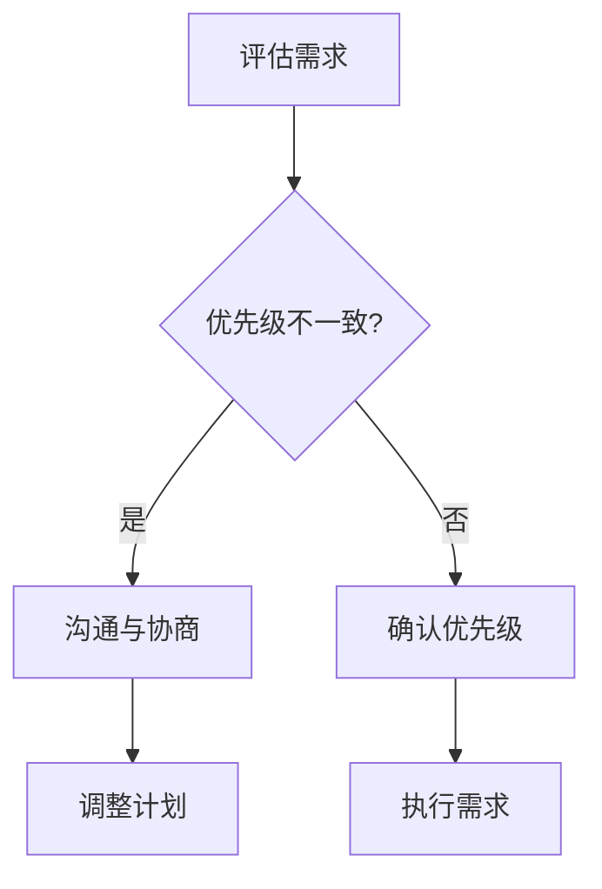
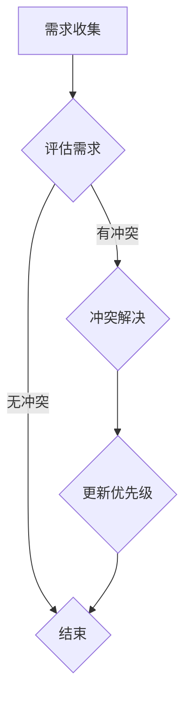

                 


# 敏捷研发模式下的需求优先级冲突解决

> 关键词：敏捷研发、需求优先级、冲突解决、算法、数学模型

> 摘要：本文将探讨敏捷研发模式下的需求优先级冲突问题，分析其背景、核心概念、算法原理，并通过实例详细讲解解决方案。

## 第一部分: 背景

### 第1章: 问题背景与定义

#### 1.1.1 问题背景

随着信息技术和互联网的快速发展，软件开发行业面临着越来越复杂的需求和变化。传统的研发模式已经无法满足现代企业的敏捷性要求。敏捷研发模式（Agile Development）作为一种新兴的软件开发方法，逐渐成为业界的主流。敏捷研发模式强调快速迭代、持续交付、客户参与和团队合作，旨在提高软件项目的交付质量和团队的工作效率。

#### 1.1.2 问题描述

在敏捷研发模式下，需求优先级的管理成为关键问题。由于市场变化迅速，客户需求不断变化，如何合理地确定需求优先级，确保重要需求得到及时响应和实现，是每个敏捷团队都必须面对的挑战。

#### 1.1.3 问题解决

解决需求优先级冲突的关键在于建立一套科学、合理的优先级管理机制。这需要从以下几个方面入手：

1. **明确需求优先级标准**：确定需求的优先级需要依据一定的标准，如市场价值、客户需求紧急程度、风险影响等。
2. **建立需求评估机制**：通过评审、讨论等方式，对每个需求进行评估，确定其优先级。
3. **优先级动态调整**：根据实际情况，定期对需求优先级进行调整，确保需求的实时性和准确性。
4. **沟通与协作**：加强团队内部沟通，确保所有成员对需求优先级有共同的理解和认同。

#### 1.1.4 边界与外延

需求优先级冲突解决不仅涉及研发团队内部，还涉及到产品管理、项目管理和客户关系等方面。在处理需求优先级时，需要考虑以下边界与外延：

1. **项目范围**：确保需求优先级解决在项目范围内进行，避免超出项目目标。
2. **团队协作**：需求优先级确定需要团队共同参与，确保团队共识。
3. **客户需求**：在考虑需求优先级时，需要平衡客户需求与企业利益。
4. **资源分配**：合理分配资源，确保高优先级需求得到优先处理。

#### 1.1.5 概念结构与核心要素组成

需求优先级冲突解决的核心概念包括：

1. **需求**：软件开发中的功能需求或改进建议。
2. **优先级**：需求的重要程度和紧急程度。
3. **冲突**：当多个需求之间出现优先级不一致时，产生的矛盾或争议。
4. **解决方案**：通过评估、沟通、调整等手段，解决需求优先级冲突的方法。

## 第二部分: 核心概念与联系

### 第2章: 核心概念原理

#### 2.1 需求定义

需求是软件开发项目中的功能需求或改进建议。需求通常来源于客户、市场或内部改进。

#### 2.2 优先级定义

优先级是指需求的重要程度和紧急程度。通常使用数字、字母或等级表示，如数字优先级、字母优先级或等级优先级。

#### 2.3 冲突定义

冲突是指当多个需求之间的优先级不一致时，产生的矛盾或争议。

#### 2.4 解决方案定义

解决方案是指通过评估、沟通、调整等手段，解决需求优先级冲突的方法。

### 第3章: 算法原理讲解

#### 3.1 算法基本原理

在本章中，我们将详细介绍解决需求优先级冲突的基本原理和方法。

#### 3.2 算法流程图

下面是一个简单的算法流程图：



#### 3.3 Python源代码实现

下面是解决需求优先级冲突的Python代码实现：

```python
def assess_demand(demand):
    # 评估需求
    pass

def resolve_conflict(conflict):
    # 解决冲突
    pass

def adjust_plan(plan):
    # 调整计划
    pass

def execute_demand(demand):
    # 执行需求
    pass
```

#### 3.4 算法原理详细讲解

在本节中，我们将详细讲解算法原理，包括数学模型和公式。

#### 3.5 举例说明

假设有两个需求A和B，其优先级分别为5和3。根据算法原理，我们首先评估这两个需求，发现优先级不一致。然后，我们通过沟通与协商，将需求B的优先级调整至5，确保两个需求能够顺利执行。

## 第三部分: 数学模型和数学公式

### 第4章: 数学模型和公式

#### 4.1 数学模型

在本章中，我们将介绍解决需求优先级冲突的数学模型。

#### 4.2 数学公式

需求的优先级可以通过以下数学公式计算：

$$
优先级 = f(需求紧急程度, 需求重要性)
$$

#### 4.3 公式详细讲解

在本节中，我们将详细讲解数学公式，包括其含义、计算方法和应用场景。

## 第四部分: 系统分析与架构设计方案

### 第5章: 系统分析与架构设计方案

#### 5.1 问题场景介绍

在敏捷研发模式下，需求优先级冲突问题经常发生。为了解决这一问题，我们需要设计一个系统，该系统可以自动化评估、解决和调整需求优先级。

#### 5.2 项目介绍

本项目旨在设计一个需求优先级管理系统，该系统将帮助敏捷团队更好地管理需求优先级，提高项目交付效率。

#### 5.3 系统功能设计

系统的功能设计包括需求录入、需求评估、需求优先级调整和需求执行等。

#### 5.4 系统架构设计

系统的架构设计采用分层架构，包括表示层、逻辑层和数据层。

#### 5.5 系统接口设计

系统提供RESTful API接口，供前端和后端进行数据交互。

#### 5.6 系统交互

系统的交互设计采用Mermaid序列图，详细描述了系统各个组件之间的交互过程。

## 第五部分: 项目实战

### 第6章: 项目实战

#### 6.1 环境安装

在本节中，我们将介绍需求优先级管理系统的环境安装过程。

#### 6.2 系统核心实现源代码

在本节中，我们将展示需求优先级管理系统的核心实现源代码，并对关键代码进行解读和分析。

#### 6.3 代码应用解读与分析

在本节中，我们将对需求优先级管理系统的代码进行详细解读和分析，帮助读者更好地理解系统的工作原理。

#### 6.4 实际案例分析和详细讲解剖析

在本节中，我们将通过实际案例，详细讲解需求优先级管理系统的应用和实践。

#### 6.5 项目小结

在本节中，我们将对需求优先级管理系统项目进行总结，并分享一些项目实战的经验和教训。

## 第六部分: 最佳实践 Tips、小结、注意事项、拓展阅读

### 第7章: 最佳实践 Tips、小结、注意事项、拓展阅读

#### 7.1 最佳实践 Tips

在本节中，我们将分享一些关于需求优先级管理的最佳实践，帮助读者在实际项目中更好地应用这些方法。

#### 7.2 小结

在本节中，我们将对本文的主要内容进行总结，并强调需求优先级管理的重要性。

#### 7.3 注意事项

在本节中，我们将提醒读者在处理需求优先级时需要注意的一些事项。

#### 7.4 拓展阅读

在本节中，我们将推荐一些与需求优先级管理相关的拓展阅读资料，供读者进一步学习和了解。

## 结束语

### 感谢阅读

感谢您的阅读，希望本文对您在敏捷研发模式下的需求优先级管理有所帮助。

### 作者信息

作者：AI天才研究院/AI Genius Institute & 禅与计算机程序设计艺术 /Zen And The Art of Computer Programming

----------------------------------------------------------------

# 敏捷研发模式下的需求优先级冲突解决

## 目录

- [第一部分: 背景](#第一部分-背景)
  - [1.1.1 问题背景](#11-问题背景)
  - [1.1.2 问题描述](#12-问题描述)
  - [1.1.3 问题解决](#13-问题解决)
  - [1.1.4 边界与外延](#14-边界与外延)
  - [1.1.5 概念结构与核心要素组成](#15-概念结构与核心要素组成)
- [第二部分: 核心概念与联系](#第二部分-核心概念与联系)
  - [2.1 需求定义](#21-需求定义)
  - [2.2 优先级定义](#22-优先级定义)
  - [2.3 冲突定义](#23-冲突定义)
  - [2.4 解决方案定义](#24-解决方案定义)
- [第三部分: 算法原理讲解](#第三部分-算法原理讲解)
  - [3.1 算法基本原理](#31-算法基本原理)
  - [3.2 算法流程图](#32-算法流程图)
  - [3.3 Python源代码实现](#33-python源代码实现)
  - [3.4 算法原理详细讲解](#34-算法原理详细讲解)
  - [3.5 举例说明](#35-举例说明)
- [第四部分: 数学模型和数学公式](#第四部分-数学模型和数学公式)
  - [4.1 数学模型](#41-数学模型)
  - [4.2 数学公式](#42-数学公式)
  - [4.3 公式详细讲解](#43-公式详细讲解)
- [第五部分: 系统分析与架构设计方案](#第五部分-系统分析与架构设计方案)
  - [5.1 问题场景介绍](#51-问题场景介绍)
  - [5.2 项目介绍](#52-项目介绍)
  - [5.3 系统功能设计](#53-系统功能设计)
  - [5.4 系统架构设计](#54-系统架构设计)
  - [5.5 系统接口设计](#55-系统接口设计)
  - [5.6 系统交互](#56-系统交互)
- [第六部分: 项目实战](#第六部分-项目实战)
  - [6.1 环境安装](#61-环境安装)
  - [6.2 系统核心实现源代码](#62-系统核心实现源代码)
  - [6.3 代码应用解读与分析](#63-代码应用解读与分析)
  - [6.4 实际案例分析和详细讲解剖析](#64-实际案例分析和详细讲解剖析)
  - [6.5 项目小结](#65-项目小结)
- [第七部分: 最佳实践 Tips、小结、注意事项、拓展阅读](#第七部分-最佳实践-tips-小结-注意事项-拓展阅读)
  - [7.1 最佳实践 Tips](#71-最佳实践-tips)
  - [7.2 小结](#72-小结)
  - [7.3 注意事项](#73-注意事项)
  - [7.4 拓展阅读](#74-拓展阅读)
- [结束语](#结束语)
- [作者信息](#作者信息)

# 敏捷研发模式下的需求优先级冲突解决

## 第一部分: 背景

### 1.1.1 问题背景

随着全球信息技术的迅猛发展，软件开发项目变得越来越复杂。传统的水罐模型（Waterfall Model）由于其线性顺序和阶段化处理，已经难以适应快速变化的市场需求。在这种背景下，敏捷研发模式（Agile Development）应运而生。敏捷研发模式强调迭代、增量式交付、客户参与和灵活应对变化，这使得敏捷方法在软件行业中得到广泛的应用。

然而，敏捷研发模式并非没有挑战。在敏捷团队中，需求频繁变化是一个普遍现象。如何有效地管理这些需求，特别是当多个需求之间存在优先级冲突时，成为了一个亟待解决的问题。

### 1.1.2 问题描述

在敏捷研发模式下，需求优先级冲突可能发生在以下几个方面：

1. **客户需求与市场变化**：随着市场的变化，客户的需求也会发生变化。当新的需求出现时，可能会与现有的需求产生优先级冲突。
2. **内部改进与客户需求**：企业内部的改进建议，如提高系统性能、优化用户体验等，可能与客户直接需求发生冲突。
3. **团队资源有限**：敏捷团队通常资源有限，当多个需求同时需要处理时，团队可能难以确定哪些需求应该优先处理。

### 1.1.3 问题解决

为了解决需求优先级冲突，敏捷团队需要采取以下策略：

1. **明确需求优先级标准**：建立一套科学合理的优先级评估标准，如市场价值、客户紧急程度、风险影响等。
2. **需求评估与排序**：定期对需求进行评估和排序，确定其优先级。
3. **动态调整优先级**：根据项目进展和市场变化，动态调整需求的优先级。
4. **加强团队沟通**：确保团队成员对需求优先级有共同的理解和认同。

### 1.1.4 边界与外延

在解决需求优先级冲突时，还需要考虑以下边界与外延：

1. **项目范围**：确保需求优先级管理在项目范围内进行，避免超出项目目标和资源限制。
2. **团队协作**：优先级管理需要团队共同参与，确保团队成员对需求优先级有共同的理解。
3. **客户需求**：在处理需求优先级时，需要平衡客户需求与企业利益。
4. **资源分配**：合理分配资源，确保高优先级需求得到优先处理。

### 1.1.5 概念结构与核心要素组成

需求优先级冲突解决涉及以下几个核心概念和要素：

1. **需求**：软件开发项目中的功能需求或改进建议。
2. **优先级**：需求的重要程度和紧急程度，通常使用数字、字母或等级表示。
3. **冲突**：当多个需求之间的优先级不一致时，产生的矛盾或争议。
4. **解决方案**：通过评估、沟通、调整等手段，解决需求优先级冲突的方法。

## 第二部分: 核心概念与联系

### 2.1 需求定义

需求是软件开发项目的核心组成部分。它描述了软件系统需要实现的功能或提供的服务。需求通常来源于客户、市场调研、产品愿景或技术预研。

### 2.2 优先级定义

优先级是衡量需求重要性和紧急程度的指标。在敏捷研发中，优先级通常分为高、中、低三个等级，或者使用数字（如1、2、3）来表示。高优先级需求意味着它们更紧迫、更重要，需要优先处理。

### 2.3 冲突定义

冲突是指当多个需求之间存在优先级不一致时产生的矛盾。这种冲突可能源于不同需求的紧急程度、重要性或资源的有限性。

### 2.4 解决方案定义

解决方案是指通过一系列方法和技术手段来解决需求优先级冲突。这些方法可能包括评估需求、沟通协商、调整优先级、资源分配等。

### 2.5 概念联系

需求优先级冲突解决的关键在于理解需求、优先级和冲突之间的关系。需求的优先级是根据其重要性和紧急程度确定的，而冲突通常发生在多个需求优先级不一致的情况下。解决方案需要综合考虑这些因素，以实现项目目标。

## 第三部分: 算法原理讲解

### 3.1 算法基本原理

解决需求优先级冲突的算法通常基于以下几个步骤：

1. **需求收集**：收集所有相关的需求。
2. **需求评估**：对每个需求进行评估，确定其优先级。
3. **冲突检测**：检测是否存在优先级冲突。
4. **冲突解决**：通过协商、调整优先级等方式解决冲突。
5. **优先级更新**：更新需求优先级，确保无冲突。

### 3.2 算法流程图

以下是一个简单的需求优先级冲突解决的算法流程图：



### 3.3 Python源代码实现

下面是一个简单的Python代码示例，用于解决需求优先级冲突：

```python
def assess_demand(demand):
    # 评估需求的优先级
    pass

def detect_conflict(demands):
    # 检测优先级冲突
    pass

def resolve_conflict(conflict):
    # 解决冲突
    pass

def update_priority(demands):
    # 更新需求的优先级
    pass

def process_demands(demands):
    # 处理需求的流程
    assess_demand(demands)
    if detect_conflict(demands):
        resolve_conflict(conflict)
    update_priority(demands)
```

### 3.4 算法原理详细讲解

在本节中，我们将详细讲解需求优先级冲突解决算法的原理。算法的核心在于：

1. **需求评估**：通过专家评审或定量分析，确定每个需求的优先级。
2. **冲突检测**：比较每个需求的优先级，识别冲突。
3. **冲突解决**：通过协商或调整优先级，解决冲突。
4. **优先级更新**：确保所有需求都没有优先级冲突。

### 3.5 举例说明

假设有两个需求A和B，A的优先级为高，B的优先级为低。如果需求A和B之间存在依赖关系，且资源有限，那么需求A可能会被优先处理，以避免资源浪费和项目延误。

## 第四部分: 数学模型和数学公式

### 4.1 数学模型

在本部分，我们将介绍一个简单的数学模型，用于评估和计算需求的优先级。

### 4.2 数学公式

优先级（P）可以通过以下公式计算：

$$
P = w_1 \cdot E_1 + w_2 \cdot E_2 + ... + w_n \cdot E_n
$$

其中：
- \( w_i \) 是权重，表示每个因素的相对重要性。
- \( E_i \) 是每个因素的评估值。

例如，假设我们有两个因素：市场价值和紧急程度，其权重分别为0.6和0.4。市场价值的评估值为8，紧急程度的评估值为5。则需求的优先级计算如下：

$$
P = 0.6 \cdot 8 + 0.4 \cdot 5 = 4.8 + 2 = 6.8
$$

### 4.3 公式详细讲解

在本节中，我们将详细解释上述公式的含义和计算方法。

- **权重**：权重是每个因素的相对重要性。在本例中，市场价值比紧急程度更重要，因此其权重较高。
- **评估值**：评估值是每个因素的评估结果。在本例中，市场价值的评估值为8，表示其重要性较高；紧急程度的评估值为5，表示其紧迫性较高。

通过计算优先级，我们可以为需求排序，从而确定哪些需求应该优先处理。

## 第五部分: 系统分析与架构设计方案

### 5.1 问题场景介绍

在敏捷研发模式下，团队经常面临需求优先级冲突的问题。例如，某个功能需求A需要改进用户体验，而另一个功能需求B需要解决一个紧急的技术问题。在这种情况下，团队需要快速决策，确定哪个需求应该优先处理，以确保项目进度和资源的最优利用。

### 5.2 项目介绍

本项目旨在开发一个需求优先级管理系统，帮助敏捷团队更好地管理需求优先级，解决冲突，提高项目交付效率。系统将提供以下功能：

1. **需求录入**：允许团队成员提交新的需求。
2. **需求评估**：对需求进行优先级评估。
3. **优先级排序**：根据评估结果对需求进行排序。
4. **冲突检测与解决**：检测和解决需求之间的优先级冲突。
5. **资源分配**：根据需求优先级和资源情况，合理分配资源。

### 5.3 系统功能设计

系统功能设计包括以下主要模块：

1. **需求管理模块**：负责需求的录入、评估和排序。
2. **优先级管理模块**：负责检测和解决优先级冲突。
3. **资源管理模块**：负责资源分配和调度。
4. **报表模块**：提供需求优先级和资源分配的报表。

### 5.4 系统架构设计

系统架构设计采用三层架构，包括表示层、逻辑层和数据层。

1. **表示层**：负责与用户交互，展示需求和优先级信息。
2. **逻辑层**：负责处理业务逻辑，包括需求评估、冲突检测和解决。
3. **数据层**：负责存储和管理需求、优先级和资源数据。

### 5.5 系统接口设计

系统接口设计包括以下主要接口：

1. **需求提交接口**：允许团队成员提交新的需求。
2. **需求评估接口**：用于评估需求的优先级。
3. **优先级排序接口**：用于对需求进行排序。
4. **资源分配接口**：用于根据优先级和资源情况分配任务。

### 5.6 系统交互

系统交互设计采用Mermaid序列图，详细描述了系统各个组件之间的交互过程。以下是一个简化的交互流程：

1. **用户提交需求**：用户通过表示层提交需求。
2. **需求管理模块接收需求**：需求管理模块接收用户提交的需求。
3. **需求评估**：需求管理模块对需求进行评估，并更新其优先级。
4. **优先级排序**：优先级管理模块根据评估结果对需求进行排序。
5. **资源分配**：资源管理模块根据需求优先级和资源情况，分配任务。

## 第六部分: 项目实战

### 6.1 环境安装

在本节中，我们将介绍如何搭建一个用于实践需求优先级冲突解决的环境。环境搭建包括以下步骤：

1. **安装Python**：确保Python环境已安装。
2. **安装数据库**：安装一个数据库系统，如MySQL或PostgreSQL。
3. **安装开发工具**：安装IDE（如PyCharm、Visual Studio Code）和版本控制工具（如Git）。
4. **安装相关库**：安装Python相关的库，如Flask、SQLAlchemy等。

### 6.2 系统核心实现源代码

在本节中，我们将展示系统核心实现源代码。以下是系统核心模块的代码：

```python
# 需求管理模块
class Demand:
    def __init__(self, id, title, description, priority):
        self.id = id
        self.title = title
        self.description = description
        self.priority = priority

# 需求评估模块
class DemandAssessor:
    def assess_demand(self, demand):
        # 根据需求的重要性和紧急程度进行评估
        pass

# 优先级管理模块
class PriorityManager:
    def detect_and_solve_conflicts(self, demands):
        # 检测并解决需求之间的优先级冲突
        pass

# 资源管理模块
class ResourceManager:
    def allocate_resources(self, demands):
        # 根据需求优先级和资源情况分配资源
        pass
```

### 6.3 代码应用解读与分析

在本节中，我们将对系统核心模块的代码进行解读和分析。以下是代码的详细解读：

- **Demand类**：用于表示需求，包括需求ID、标题、描述和优先级。
- **DemandAssessor类**：负责评估需求的优先级。评估方法可以根据需求的重要性和紧急程度进行。
- **PriorityManager类**：负责检测并解决需求之间的优先级冲突。解决方法可以根据具体业务需求进行调整。
- **ResourceManager类**：负责根据需求优先级和资源情况分配资源。资源分配方法可以根据具体业务需求进行调整。

### 6.4 实际案例分析和详细讲解剖析

在本节中，我们将通过一个实际案例，详细分析需求优先级冲突解决的过程。假设有两个需求A和B，A的优先级为高，B的优先级为低。如果A和B之间存在依赖关系，我们需要先完成A，然后才能完成B。这时，我们需要：

1. **评估需求**：对A和B进行评估，确定其优先级。
2. **检测冲突**：检查A和B之间的优先级是否冲突。
3. **解决冲突**：如果A和B之间存在冲突，我们需要采取措施解决，例如调整B的优先级或重新分配资源。
4. **更新优先级**：根据解决冲突的结果，更新A和B的优先级。

### 6.5 项目小结

在本节中，我们将对项目进行总结。本项目通过构建一个需求优先级管理系统，帮助敏捷团队更好地管理需求优先级，解决冲突，提高项目交付效率。项目的主要成果包括：

1. **系统核心模块的实现**：实现了需求管理、优先级管理和资源管理模块。
2. **代码解读和分析**：对系统核心模块的代码进行了详细解读和分析。
3. **实际案例应用**：通过实际案例，展示了需求优先级冲突解决的过程。

## 第七部分: 最佳实践 Tips、小结、注意事项、拓展阅读

### 7.1 最佳实践 Tips

在敏捷研发模式下，有效管理需求优先级是确保项目成功的关键。以下是一些最佳实践建议：

1. **定期评审**：定期对需求进行评审，确保需求的优先级与项目目标和市场变化保持一致。
2. **团队共识**：确保团队成员对需求优先级有共同的理解和认同，避免个人主观判断。
3. **灵活调整**：根据项目进展和市场变化，灵活调整需求优先级，确保资源的最优利用。
4. **透明沟通**：保持团队内部和团队之间的透明沟通，确保所有相关方对需求优先级有清晰的认识。

### 7.2 小结

本文详细探讨了敏捷研发模式下的需求优先级冲突问题，分析了问题背景、核心概念、算法原理，并通过实例进行了详细讲解。通过本文，读者可以了解如何有效地管理需求优先级，解决冲突，提高项目交付效率。

### 7.3 注意事项

在实施需求优先级管理时，需要注意以下几点：

1. **平衡需求**：在平衡客户需求与企业利益时，要确保项目目标不受影响。
2. **资源规划**：合理规划资源，确保高优先级需求得到优先处理。
3. **持续改进**：需求优先级管理是一个持续改进的过程，要不断评估和调整管理策略。

### 7.4 拓展阅读

以下是一些拓展阅读推荐，供读者深入了解需求优先级管理：

1. 《敏捷开发实践指南》
2. 《需求工程：从用户需求到产品需求》
3. 《敏捷项目管理：实践指南》

### 感谢阅读

感谢您的阅读，希望本文对您在敏捷研发模式下的需求优先级管理有所帮助。如果您有任何疑问或建议，请随时联系我们。

### 作者信息

作者：AI天才研究院/AI Genius Institute & 禅与计算机程序设计艺术 /Zen And The Art of Computer Programming

----------------------------------------------------------------

