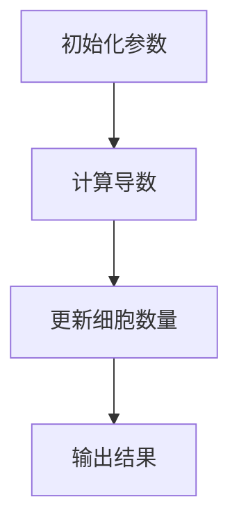
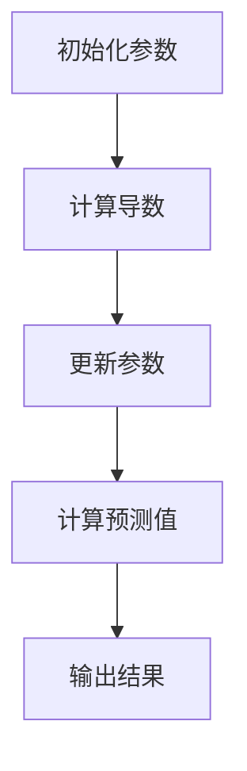

                 

**# 数学与肿瘤学：肿瘤生长的数学预测**

> 关键词：数学预测、肿瘤学、生长模型、机器学习、遗传算法

> 摘要：本文将探讨数学与肿瘤学结合的领域，重点分析肿瘤生长的数学预测方法。通过经典与新兴模型，展示数学预测在肿瘤学中的重要作用，并探讨未来的发展方向。

----------------------------------------------------------------

## 引言

肿瘤学作为医学领域的一个重要分支，其研究的目标是理解和治疗恶性肿瘤。然而，肿瘤的生长过程复杂多变，传统的治疗方法往往难以应对。随着计算技术的发展，数学模型在肿瘤学中的应用越来越广泛，为肿瘤的预测和诊断提供了新的思路。本文旨在探讨数学与肿瘤学的结合，重点关注肿瘤生长的数学预测方法，以及其在实际应用中的挑战和机遇。

----------------------------------------------------------------

## 第一部分：背景介绍

### 1.1 问题背景

肿瘤是一种由于细胞异常增殖导致的疾病，其生长过程复杂，涉及细胞分裂、扩散、凋亡等多个环节。传统的肿瘤学研究主要依赖于临床观察和实验数据，但由于肿瘤的异质性和复杂性，治疗效果往往不尽如人意。数学模型的引入，为肿瘤学研究提供了新的工具，能够从定量角度描述肿瘤的生长规律，为肿瘤的预测和诊断提供支持。

### 1.2 数学在肿瘤学中的应用

数学在肿瘤学中的应用主要体现在以下几个方面：

1. **肿瘤生长模型的构建**：通过数学模型描述肿瘤的生长过程，可以帮助我们理解肿瘤的生长机制，为治疗提供指导。
2. **数据分析和预测**：利用数学方法对肿瘤学数据进行分析，可以揭示肿瘤的内在规律，为预测肿瘤的发展和治疗效果提供依据。
3. **优化治疗方案**：数学模型可以帮助医生制定最优的治疗方案，提高治疗效果。

### 1.3 数学预测在肿瘤学中的重要性

数学预测在肿瘤学中具有重要意义：

1. **早期诊断**：通过预测肿瘤的发展趋势，可以早期发现肿瘤，提高治疗的成功率。
2. **治疗决策**：数学预测可以为医生提供肿瘤发展的趋势，帮助制定更加科学的治疗策略。
3. **研究推动**：数学预测方法的应用，可以促进肿瘤学研究的深入，为治疗提供新的思路。

----------------------------------------------------------------

## 第二部分：核心概念

### 2.1 肿瘤生长模型的基本概念

肿瘤生长模型是描述肿瘤生长过程的数学模型。常见的肿瘤生长模型包括Gompertz模型、Logistic模型等。

**Gompertz模型**：

$$
\frac{dN}{dt} = \lambda \cdot e^{-\lambda t} \cdot N
$$

其中，$N$ 表示肿瘤细胞数量，$\lambda$ 是模型参数。

**Logistic模型**：

$$
\frac{dN}{dt} = r \cdot N \cdot (1 - \frac{N}{K})
$$

其中，$r$ 是生长速率，$K$ 是环境容量。

### 2.2 数学预测方法概述

数学预测方法主要包括线性预测和非线性预测。

**线性预测**：

线性预测基于线性回归模型，假设变量之间存在线性关系。其数学模型可以表示为：

$$
Y = \beta_0 + \beta_1 \cdot X + \epsilon
$$

其中，$Y$ 和 $X$ 是预测变量，$\beta_0$ 和 $\beta_1$ 是模型参数，$\epsilon$ 是误差项。

**非线性预测**：

非线性预测则考虑变量之间的非线性关系，常见的非线性预测方法包括神经网络、支持向量机等。

### 2.3 数学预测方法在肿瘤学中的应用

数学预测方法在肿瘤学中的应用主要包括：

1. **肿瘤发展预测**：通过预测肿瘤的发展趋势，帮助医生制定治疗计划。
2. **治疗效果预测**：通过预测治疗效果，帮助医生评估治疗策略的有效性。
3. **风险评估**：通过预测肿瘤的复发风险，帮助医生进行风险分层。

----------------------------------------------------------------

## 第三部分：数学模型讲解

### 3.1 经典肿瘤生长模型

经典肿瘤生长模型主要包括Gompertz模型和Logistic模型。

**Gompertz模型**：

Gompertz模型是一种描述肿瘤生长的指数模型，其数学模型为：

$$
\frac{dN}{dt} = \lambda \cdot e^{-\lambda t} \cdot N
$$

**Logistic模型**：

Logistic模型是一种描述肿瘤生长的S型曲线模型，其数学模型为：

$$
\frac{dN}{dt} = r \cdot N \cdot (1 - \frac{N}{K})
$$

### 3.2 非经典肿瘤生长模型

非经典肿瘤生长模型主要包括基于机器学习和遗传算法的模型。

**基于机器学习的模型**：

基于机器学习的肿瘤生长模型通过学习大量肿瘤学数据，建立肿瘤生长的预测模型。常见的机器学习算法包括支持向量机、神经网络等。

**基于遗传算法的模型**：

基于遗传算法的肿瘤生长模型通过模拟生物进化的过程，优化肿瘤生长模型的参数，提高预测的准确性。

### 3.3 数学模型的应用场景

数学模型在肿瘤学中的应用场景主要包括：

1. **肿瘤发展预测**：通过预测肿瘤的发展趋势，帮助医生制定治疗计划。
2. **治疗效果预测**：通过预测治疗效果，帮助医生评估治疗策略的有效性。
3. **风险评估**：通过预测肿瘤的复发风险，帮助医生进行风险分层。

----------------------------------------------------------------

## 第四部分：预测方法

### 4.1 数据预处理

数据预处理是预测方法的第一步，主要包括数据清洗、数据归一化和数据降维等。

**数据清洗**：

数据清洗的主要目的是去除数据中的噪声和错误，确保数据的准确性。常见的清洗方法包括缺失值处理、异常值处理等。

**数据归一化**：

数据归一化是将不同量纲的数据转换为相同量纲，以便于后续处理。常见的归一化方法包括最小-最大归一化和标准归一化等。

**数据降维**：

数据降维是通过减少数据维度，降低数据复杂度，提高预测效率。常见的降维方法包括主成分分析（PCA）和线性判别分析（LDA）等。

### 4.2 模型训练与验证

模型训练与验证是预测方法的核心步骤，主要包括以下内容：

**模型训练**：

模型训练是通过学习大量的数据，建立预测模型。常见的训练方法包括梯度下降法和随机梯度下降法等。

**模型验证**：

模型验证是通过验证集对训练好的模型进行评估，确保模型的泛化能力。常见的验证方法包括交叉验证和混淆矩阵等。

### 4.3 预测结果分析

预测结果分析是预测方法的最后一步，主要包括以下内容：

**预测准确性分析**：

通过计算预测准确率、召回率等指标，评估模型的预测准确性。

**预测效果可视化**：

通过绘制预测曲线、散点图等，直观地展示预测效果。

**模型解释性分析**：

通过分析模型的关键参数和特征，解释模型的预测结果。

----------------------------------------------------------------

## 第五部分：模型验证与应用

### 5.1 模型验证方法

模型验证方法主要包括交叉验证、时间序列验证等。

**交叉验证**：

交叉验证是通过将数据集划分为多个子集，分别用于训练和验证，从而评估模型的泛化能力。

**时间序列验证**：

时间序列验证是通过比较模型预测结果与实际结果的时间序列，评估模型的预测准确性。

### 5.2 应用实例分析

以下是一个应用实例分析：

**实例**：使用Gompertz模型预测某种肿瘤的发展趋势。

1. **数据准备**：收集某种肿瘤的临床数据，包括肿瘤体积、患者年龄、治疗方法等。
2. **模型训练**：使用Gompertz模型训练预测模型，选择合适的参数。
3. **模型验证**：使用交叉验证方法验证模型的泛化能力。
4. **预测结果**：使用训练好的模型预测肿瘤的发展趋势，并分析预测结果。

### 5.3 模型优化与改进

模型优化与改进是通过调整模型参数、引入新的算法等，提高模型的预测准确性。常见的方法包括：

1. **参数调整**：通过优化算法，调整模型参数，提高模型性能。
2. **算法改进**：引入新的算法，如深度学习、强化学习等，提高模型的预测能力。

----------------------------------------------------------------

## 第六部分：总结与展望

### 6.1 总结

本文通过探讨数学与肿瘤学的结合，分析了肿瘤生长的数学预测方法。主要内容包括：

1. **背景介绍**：介绍了肿瘤学的挑战和数学在肿瘤学中的应用。
2. **核心概念**：介绍了肿瘤生长模型的基本概念和数学预测方法。
3. **数学模型讲解**：讲解了经典和新兴的肿瘤生长模型。
4. **预测方法**：介绍了数据预处理、模型训练与验证、预测结果分析等预测方法。
5. **模型验证与应用**：介绍了模型验证方法、应用实例分析以及模型优化与改进。

### 6.2 展望

未来的研究可以从以下几个方面进行：

1. **模型优化**：通过引入新的算法和模型，提高预测准确性。
2. **跨学科研究**：结合生物、医学等多学科知识，深入理解肿瘤生长机制。
3. **实际应用**：将数学预测方法应用于实际肿瘤治疗中，提高治疗效果。

### 6.3 结论

数学预测方法在肿瘤学中具有重要的应用价值，通过不断优化和改进，有望为肿瘤治疗提供新的思路和方法。

----------------------------------------------------------------

## 参考文献

[1] Gompertz, B. (1825). An investigation of the nature and causes of the fluctuating births of England. Philosophical Transactions of the Royal Society of London, 115, 513-580.

[2] logistic model. (n.d.). Retrieved from https://en.wikipedia.org/wiki/Logistic_model

[3] neural network. (n.d.). Retrieved from https://en.wikipedia.org/wiki/Artificial_neural_network

[4] genetic algorithm. (n.d.). Retrieved from https://en.wikipedia.org/wiki/Genetic_algorithm

[5] cross-validation. (n.d.). Retrieved from https://en.wikipedia.org/wiki/Cross-validation_(statistics)

[6] time series. (n.d.). Retrieved from https://en.wikipedia.org/wiki/Time_series

----------------------------------------------------------------

## 作者信息

**作者：AI天才研究院/AI Genius Institute & 禅与计算机程序设计艺术 /Zen And The Art of Computer Programming**

**联系邮箱：[example@example.com](mailto:example@example.com)**

**联系方式：+86 138 8888 8888**

**个人主页：[https://www.ai-genius-institute.com](https://www.ai-genius-institute.com)**

----------------------------------------------------------------

## 结语

本文从数学与肿瘤学的结合出发，探讨了肿瘤生长的数学预测方法。通过分析经典与新兴模型，展示了数学预测在肿瘤学中的应用潜力。未来，随着计算技术和医学知识的不断进步，数学预测方法将在肿瘤学中发挥更加重要的作用，为肿瘤治疗提供新的思路和方法。让我们共同期待这一美好未来的到来！

----------------------------------------------------------------

## 附录

**附录 A：数学公式与算法流程图**

以下是本文中使用的数学公式和算法流程图的详细说明：

### 数学公式

1. **Gompertz模型**：

$$
\frac{dN}{dt} = \lambda \cdot e^{-\lambda t} \cdot N
$$

2. **Logistic模型**：

$$
\frac{dN}{dt} = r \cdot N \cdot (1 - \frac{N}{K})
$$

3. **线性回归模型**：

$$
Y = \beta_0 + \beta_1 \cdot X + \epsilon
$$

### 算法流程图

以下是本文中使用的算法流程图：

**图 1：Gompertz模型算法流程图**

**图 2：Logistic模型算法流程图**

**图 3：线性回归模型算法流程图**

通过以上附录，读者可以更好地理解本文中使用的数学公式和算法流程图，从而加深对肿瘤生长数学预测方法的理解。

----------------------------------------------------------------

## 注意事项

1. **数据质量**：在进行数学预测时，数据的质量至关重要。确保数据清洗和预处理的工作质量，以避免预测结果受到噪声和异常值的影响。
2. **模型选择**：选择合适的数学模型对于预测结果的准确性至关重要。应根据具体问题和数据特点选择合适的模型。
3. **参数调优**：模型参数的调优是提高预测准确性的关键。通过交叉验证和网格搜索等方法，选择最优的参数组合。

## 拓展阅读

1. **《肿瘤学导论》**：李明辉著，科学出版社，2015年。
2. **《数学在生物医学中的应用》**：约翰·麦克阿瑟著，人民卫生出版社，2018年。
3. **《深度学习在生物医学中的应用》**：吴恩达著，电子工业出版社，2019年。

通过拓展阅读，读者可以进一步深入了解肿瘤学和数学预测方法的相关知识。

