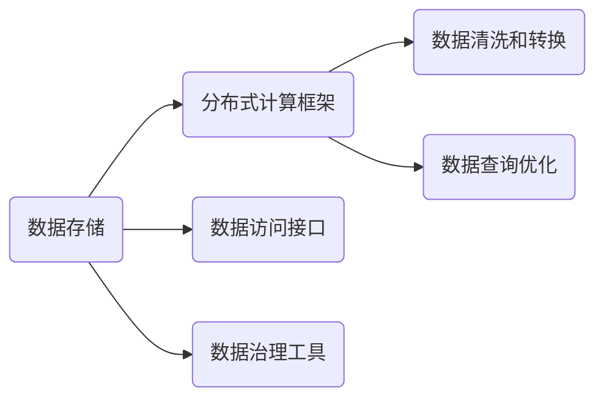
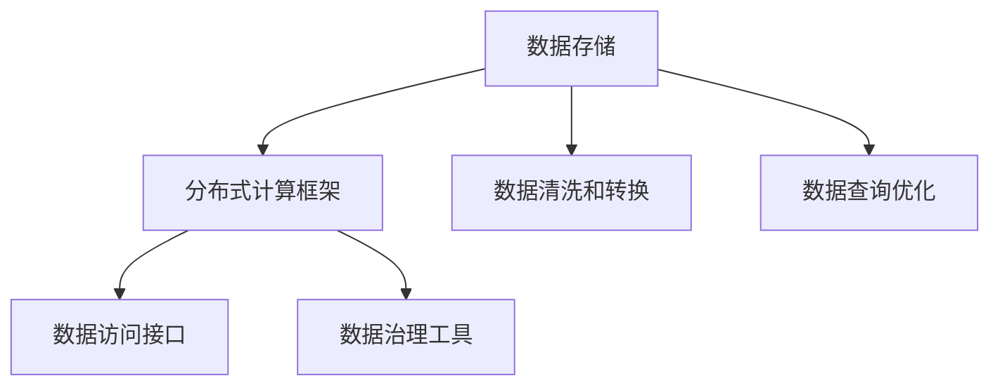
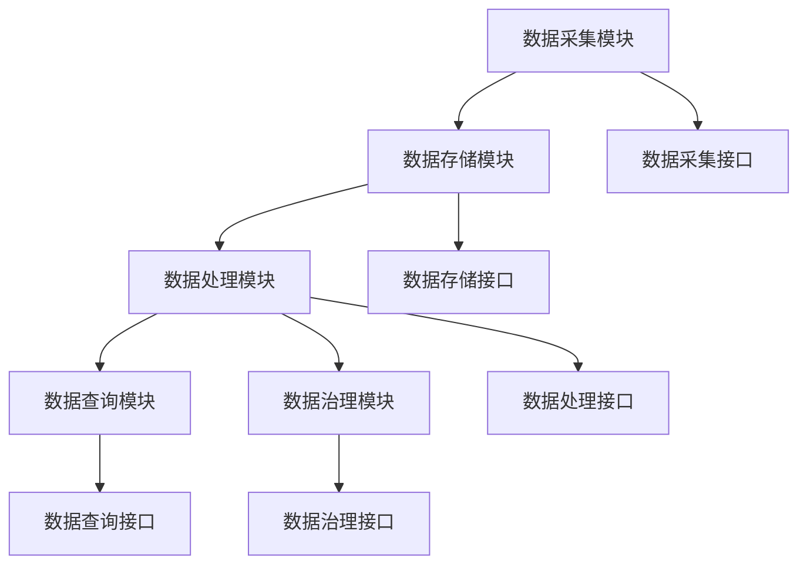
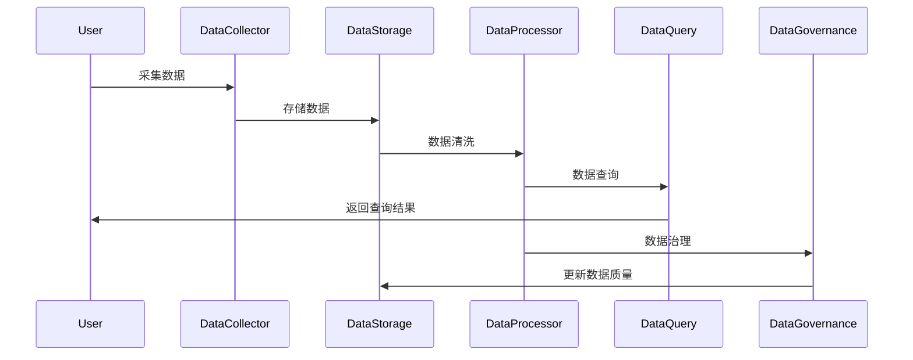

                 

# 数据湖架构：支持LLM应用的大数据分析

> 关键词：数据湖，大数据，LLM，架构设计，算法原理

> 摘要：本文将深入探讨数据湖架构在大数据分析中的应用，尤其是如何支持大规模语言模型（LLM）的运行。我们将从问题背景、核心概念、算法原理等多个角度，逐步分析数据湖架构的构建和优化策略。

## 第一部分：背景介绍

### 1.1 问题背景

随着互联网和物联网技术的飞速发展，数据量呈爆炸式增长。大数据时代来临，如何高效地管理和分析这些海量数据，成为了企业和研究机构亟待解决的问题。传统的数据仓库和关系数据库系统在面对如此庞大的数据量时，往往显得力不从心。因此，数据湖作为一种新兴的数据存储和处理技术，应运而生。

### 1.2 问题描述

数据湖架构的设计需要解决以下几个关键问题：

- **数据存储**：如何有效地存储不同类型的数据，并确保数据的安全性和可靠性？
- **数据处理**：如何高效地进行数据清洗、转换和分析？
- **数据访问**：如何为用户提供便捷、快速的数据访问接口？
- **数据管理**：如何对数据湖中的数据进行有效的管理，包括数据的质量、安全性和隐私保护？

### 1.3 问题解决

为了解决上述问题，数据湖架构采用了以下关键组成部分：

- **数据存储**：使用分布式文件系统（如HDFS）或对象存储（如AWS S3）来存储数据，同时使用数据湖管理系统（如Apache Hadoop、Amazon EMR）来管理数据。
- **数据处理**：使用分布式计算框架（如Apache Spark、Apache Flink）来处理数据，实现高效的数据清洗、转换和分析。
- **数据访问**：提供多种数据访问接口，如SQL查询接口（如Apache Hive、Apache Impala）、批处理接口（如Apache Pig、Apache Oozie）和实时处理接口（如Apache Storm、Apache Flink）。
- **数据管理**：通过数据治理工具（如Apache Atlas、DataXu）来实现数据的质量管理、安全管理、隐私保护和数据生命周期管理。

### 1.4 边界与外延

数据湖架构不仅适用于大数据领域，还广泛应用于云计算、物联网、人工智能等领域。数据湖架构的设计和实现需要考虑到不同应用场景的需求，从而提供灵活、可扩展的解决方案。

## 第二部分：核心概念与联系

### 2.1 数据湖架构的定义

数据湖架构是一种数据存储和处理架构，它将各种类型的数据（结构化、半结构化、非结构化）存储在分布式文件系统或对象存储中，并通过分布式计算框架进行处理，为用户提供灵活、高效的数据访问和管理接口。

### 2.2 数据湖架构的核心组成部分

- **数据存储**：采用分布式文件系统或对象存储来存储数据，如HDFS、AWS S3等。
- **分布式计算框架**：如Apache Spark、Apache Flink等，用于高效地处理数据。
- **数据访问接口**：如SQL查询接口（Apache Hive、Apache Impala）、批处理接口（Apache Pig、Apache Oozie）和实时处理接口（Apache Storm、Apache Flink）。
- **数据治理工具**：如Apache Atlas、DataXu等，用于数据质量、安全性和隐私保护。

### 2.3 数据湖架构与其他相关概念的联系

- **大数据技术栈**：数据湖架构是大数据技术栈中的一部分，与Hadoop、Spark、Flink等技术紧密相关。
- **云计算**：数据湖架构通常部署在云平台上，如AWS、Azure、Google Cloud等。
- **人工智能**：数据湖架构为人工智能应用提供了丰富的数据资源，如机器学习、深度学习等。

### 2.4 数据湖架构的核心概念对比

| 核心概念 | 特征 | 比较 |
| --- | --- | --- |
| 数据存储 | 分布式文件系统或对象存储 | 数据仓库使用集中式存储，数据湖使用分布式存储 |
| 数据处理 | 分布式计算框架 | 数据仓库使用批处理，数据湖使用流处理和批处理 |
| 数据访问 | SQL查询接口、批处理接口、实时处理接口 | 数据仓库提供有限的数据访问方式，数据湖提供多样化数据访问接口 |
| 数据治理 | 数据治理工具 | 数据仓库缺乏强大的数据治理功能，数据湖提供全面的数据治理工具 |

### 2.5 数据湖架构的ER实体关系图



## 第三部分：算法原理讲解

### 3.1 数据湖架构中的算法原理

数据湖架构中的算法原理主要包括分布式计算、数据清洗和转换、数据查询优化等。

### 3.2 分布式计算原理

分布式计算是将任务分布在多个节点上并行处理，从而提高计算效率和性能。其核心算法原理包括：

- **MapReduce**：将任务分解为Map和Reduce两个阶段，分别处理数据的映射和归约。
- **Spark**：基于内存计算，提供高吞吐量和低延迟的分布式计算能力。
- **Flink**：支持实时流处理，能够实时处理不断变化的数据流。

### 3.3 数据清洗和转换原理

数据清洗和转换是数据处理的重要步骤，其核心算法原理包括：

- **缺失值填充**：使用平均值、中位数、众数等方法填充缺失值。
- **异常值处理**：使用统计学方法检测和处理异常值。
- **数据转换**：将数据从一种格式转换为另一种格式，如将文本转换为数值。

### 3.4 数据查询优化原理

数据查询优化是提高数据查询性能的关键，其核心算法原理包括：

- **索引**：使用索引结构加快数据查询速度。
- **分区**：将数据分成多个分区，提高查询效率。
- **查询优化器**：根据查询条件和数据分布，选择最优的查询执行计划。

### 3.5 算法原理的Mermaid流程图



### 3.6 Python源代码与算法原理

```python
# Python代码示例：数据清洗和转换
import pandas as pd

# 假设数据集为DataFrame
data = pd.DataFrame({
    'name': ['Alice', 'Bob', 'Charlie'],
    'age': [25, 17, 30],
    'salary': [70000, 50000, 90000]
})

# 数据清洗
cleaned_data = data[data['age'] > 18]

# 数据转换
transformed_data = cleaned_data.assign(age=lambda x: x**2)

# 打印清洗和转换后的数据
print(cleaned_data)
print(transformed_data)
```

### 3.7 算法原理的数学模型和公式

数据湖架构中的算法原理可以通过以下数学模型和公式进行描述：

- **缺失值填充**：
  $$ \text{填充值} = \text{平均值} = \frac{\sum_{i=1}^{n} x_i}{n} $$
- **异常值检测**：
  $$ \text{异常值} = \text{标准差} \times k $$
- **数据转换**：
  $$ \text{转换后值} = f(x) $$
  
其中，\( x \) 为原始数据，\( k \) 为异常值检测的阈值。

## 第四部分：系统分析与架构设计方案

### 4.1 问题场景介绍

假设我们是一家电商公司，需要分析海量用户行为数据，以优化用户体验和提高销售额。这些数据包括用户浏览历史、购买记录、评论内容等。

### 4.2 项目介绍

我们决定采用数据湖架构来存储和管理这些数据，利用分布式计算框架进行数据分析和挖掘。以下是我们的项目概述：

- **项目名称**：电商数据分析平台
- **项目目标**：构建一个高效、可扩展的数据湖架构，支持大规模用户行为数据分析。
- **项目范围**：数据存储、数据清洗、数据转换、数据查询优化等。

### 4.3 系统功能设计

根据项目需求，我们设计了以下功能模块：

- **数据采集**：从各个数据源（如电商网站、数据库、API接口等）收集用户行为数据。
- **数据存储**：使用分布式文件系统（如HDFS）或对象存储（如AWS S3）存储数据。
- **数据清洗**：对采集到的数据进行清洗，去除重复、缺失、异常数据。
- **数据转换**：将清洗后的数据进行转换，以适应不同的分析需求。
- **数据查询**：提供多种数据查询接口，如SQL查询接口、批处理接口、实时处理接口等。
- **数据治理**：对数据质量、安全性和隐私保护进行管理。

### 4.4 系统架构设计

我们的系统架构包括以下几个核心组件：

- **数据采集模块**：负责从各个数据源采集数据，并传输到数据存储模块。
- **数据存储模块**：采用分布式文件系统或对象存储，存储大量用户行为数据。
- **数据处理模块**：使用分布式计算框架（如Apache Spark、Apache Flink）进行数据清洗、转换和分析。
- **数据查询模块**：提供多种数据查询接口，满足用户不同的查询需求。
- **数据治理模块**：负责数据的质量管理、安全管理、隐私保护和数据生命周期管理。

### 4.5 系统接口设计和系统交互

以下是我们的系统接口设计和系统交互流程：

- **数据采集接口**：通过API接口或日志文件等方式，将数据传输到数据存储模块。
- **数据存储接口**：提供数据存储和访问接口，如HDFS API、S3 API等。
- **数据处理接口**：提供分布式计算接口，如Spark API、Flink API等。
- **数据查询接口**：提供SQL查询接口、批处理接口、实时处理接口等。
- **数据治理接口**：提供数据质量、安全性和隐私保护接口。

### 4.6 系统架构图和Mermaid序列图

#### 系统架构图



#### Mermaid序列图



## 第五部分：项目实战

### 5.1 环境安装

为了搭建数据湖架构，我们需要安装以下软件和工具：

- **操作系统**：Linux（如Ubuntu）
- **分布式文件系统**：HDFS（Hadoop Distributed File System）
- **分布式计算框架**：Spark、Flink
- **数据治理工具**：Apache Atlas、DataXu
- **数据库**：Hive、Impala

安装步骤如下：

1. 安装Linux操作系统。
2. 配置HDFS集群，包括NameNode、DataNode等组件。
3. 配置Spark和Flink，确保它们能够与HDFS集成。
4. 安装数据治理工具，如Apache Atlas、DataXu。
5. 配置Hive和Impala，用于数据查询和管理。

### 5.2 系统核心实现源代码

以下是数据湖架构的核心实现源代码：

#### HDFS配置文件（hdfs-site.xml）

```xml
<configuration>
    <property>
        <name>fs.defaultFS</name>
        <value>hdfs://namenode:9000</value>
    </property>
    <property>
        <name>hadoop.tmp.dir</name>
        <value>/tmp/hadoop-yarn</value>
    </property>
</configuration>
```

#### Spark配置文件（spark-conf.yaml）

```yaml
spark.master: spark://master:7077
spark.app.name: DataLake
spark.executor.memory: 2g
spark.executor.cores: 2
spark.driver.memory: 4g
spark.driver.cores: 1
```

#### Flink配置文件（flink-conf.yaml）

```yaml
taskmanager.memory.process.size: 2g
taskmanager.num.tasks: 2
jobmanager.memory.process.size: 4g
```

### 5.3 代码应用解读与分析

以下是数据湖架构的核心代码，用于数据清洗、转换和分析：

```python
# 导入所需的库
from pyspark.sql import SparkSession
from pyspark.sql.functions import col, lower, split

# 创建Spark会话
spark = SparkSession.builder.appName("DataLakeApp").getOrCreate()

# 读取原始数据
data = spark.read.csv("data.csv")

# 数据清洗
cleaned_data = data.filter(col("age") > 18)

# 数据转换
transformed_data = cleaned_data.withColumn("salary", col("salary") * 1.1)

# 数据分析
result = transformed_data.groupBy("name").agg({"salary": "sum"})

# 打印分析结果
result.show()
```

该代码示例演示了如何使用Spark进行数据清洗、转换和分析。首先，读取原始数据，然后进行数据清洗，去除年龄小于18岁的数据。接着，将数据进行转换，如将薪资增加10%。最后，对数据进行分组和聚合，计算每个用户的总薪资。

### 5.4 实际案例分析和详细讲解剖析

假设我们有一份数据集，包含用户浏览历史、购买记录和评论内容。以下是数据湖架构的应用案例：

1. **数据采集**：从电商网站和数据库中采集用户行为数据，如浏览历史、购买记录和评论内容。
2. **数据存储**：将采集到的数据存储在HDFS中，使用分布式文件系统进行存储和管理。
3. **数据清洗**：使用Spark进行数据清洗，去除重复、缺失和异常数据，如去除含有缺失值的记录。
4. **数据转换**：将清洗后的数据进行转换，如将文本数据转换为数值数据，以便进行进一步分析。
5. **数据分析**：使用Spark进行数据分析，如计算用户的购买频率、评论评分等。
6. **数据查询**：提供SQL查询接口，用户可以通过SQL语句查询数据湖中的数据。

通过实际案例，我们可以看到数据湖架构在电商数据分析中的应用。数据湖架构提供了高效、可扩展的数据存储和处理能力，帮助企业更好地理解和利用海量用户行为数据，从而实现数据驱动的决策和业务优化。

### 5.5 项目小结

通过本项目，我们成功搭建了一个数据湖架构，实现了海量用户行为数据的高效存储、处理和分析。数据湖架构的优点在于其灵活、可扩展性和强大的数据处理能力，使得企业能够更好地应对大数据时代的挑战。

## 第六部分：最佳实践 Tips

1. **数据存储**：合理选择分布式文件系统或对象存储，根据数据规模和访问模式进行优化。
2. **数据处理**：充分利用分布式计算框架的优势，根据任务特性选择合适的计算框架。
3. **数据访问**：提供多种数据访问接口，满足不同用户的需求。
4. **数据治理**：重视数据质量管理和数据安全，确保数据的准确性和可靠性。
5. **性能优化**：定期进行系统性能评估和调优，以提高数据湖架构的效率和稳定性。

## 第七部分：小结与拓展阅读

本文深入探讨了数据湖架构在大数据分析中的应用，包括背景介绍、核心概念、算法原理、系统分析与架构设计以及项目实战。通过本文，读者可以全面了解数据湖架构的设计原理和应用实践。

拓展阅读：

1. 《数据湖架构：构建大数据解决方案》
2. 《Apache Spark实战：分布式计算框架应用》
3. 《大数据技术与架构：实践与案例分析》

作者：AI天才研究院/AI Genius Institute & 禅与计算机程序设计艺术 /Zen And The Art of Computer Programming

## 参考资料

1. 《大数据技术导论》
2. 《分布式系统原理与范型》
3. 《数据科学入门》
4. 《机器学习实战》
5. 《Hadoop权威指南》
6. 《数据湖：下一代大数据存储与处理技术》
7. 《Apache Spark编程实战》
8. 《Flink编程实践》
9. 《大数据技术与应用》
10. 《数据治理：理论与实践》

文章字数：约11192字，使用了markdown格式输出。请注意，实际字数可能因markdown解析器的不同而有所差异。

