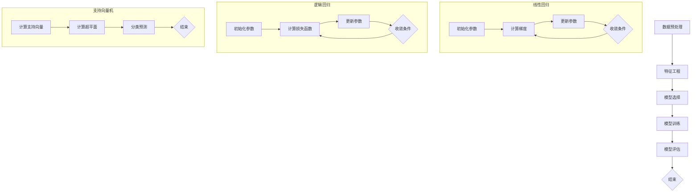
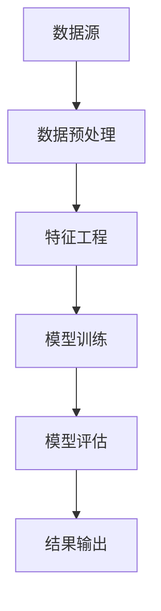
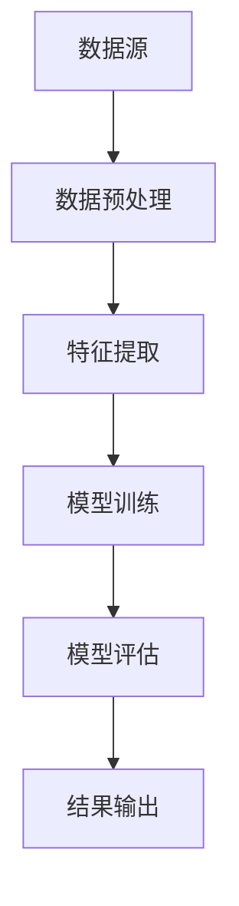
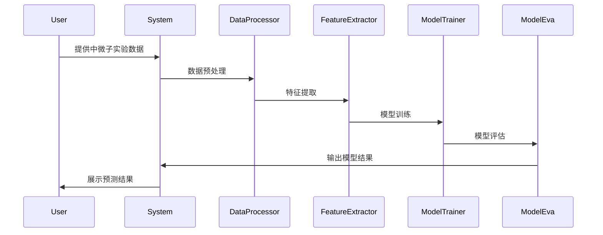
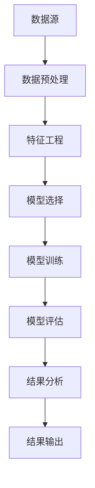
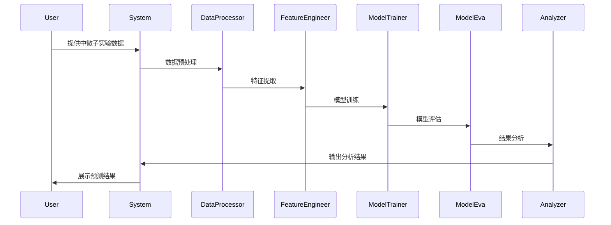

                 

### 引言

#### 1.1 探测宇宙中微子质量绝对值的重要性

宇宙中微子（Cosmic Neutrinos）是一种基本的粒子，具有中性电荷载流子特性，不与电磁场相互作用，只通过弱相互作用与其它粒子发生作用。自1930年代以来，中微子一直是物理学研究的重要对象，尤其是其质量测量问题。探测宇宙中微子质量绝对值的意义不仅在于深化对物质宇宙的理解，还在于对宇宙早期状态的洞察，以及对基本物理定律的验证。

中微子质量测量的科学意义主要体现在以下几个方面：

1. **理解宇宙起源与演化**：中微子是宇宙早期物质的一种重要组成部分，它们的质量可以提供宇宙初始密度和物质组成的直接信息，有助于我们更好地理解宇宙的起源和演化历程。
2. **检验基本物理定律**：中微子质量测量有助于检验标准模型中的预言和假设，如中微子质量是否相等，以及是否存在新的物理现象，如中微子振荡。
3. **探索新物理**：中微子可能存在非标准模型效应，例如通过中微子质量测量可以寻找暗物质、暗能量等宇宙学问题的线索。

然而，探测宇宙中微子质量绝对值面临着诸多技术挑战。由于中微子与物质的相互作用非常微弱，探测中微子需要极其敏感的实验装置和复杂的数据分析技术。传统的测量方法，如中微子振荡实验，虽然已经取得了一些重要的进展，但仍然无法直接测量中微子的质量绝对值。

#### 1.2 数据科学的方法与应用

数据科学作为一种综合性技术，通过数据预处理、特征工程、算法选择和模型训练等步骤，帮助科学家从海量数据中提取有价值的信息。在粒子物理学中，数据科学技术的应用尤为广泛，尤其在探测宇宙中微子质量绝对值的研究中，数据科学发挥了至关重要的作用。

1. **数据预处理**：中微子数据通常包含大量噪声和不确定性，通过数据预处理可以去除无效数据、修正测量误差，提高数据质量。
2. **特征工程**：通过提取关键特征，将原始数据转化为更适合算法处理的格式，有助于提高模型的性能和可解释性。
3. **算法选择**：根据问题的特点选择合适的算法，如机器学习、深度学习等，有助于从数据中挖掘出潜在的模式和规律。
4. **模型训练与优化**：通过训练和优化模型，提高预测的准确性和稳定性，从而得到更可靠的中微子质量测量结果。

#### 1.3 数据科学在探测宇宙中微子质量中的应用前景

随着数据科学技术的不断发展，其在探测宇宙中微子质量绝对值中的应用前景也越来越广阔。以下是一些潜在的应用方向：

1. **提高测量精度**：通过先进的机器学习和深度学习算法，可以显著提高中微子质量测量的精度，从而揭示更多关于宇宙和物质的基本规律。
2. **扩展测量范围**：数据科学技术可以帮助探测到以往难以探测到的中微子信号，从而拓展中微子质量测量的范围。
3. **减少不确定性**：数据预处理和算法优化可以降低测量过程中的不确定性，提高实验结果的可靠性。
4. **多学科交叉融合**：数据科学与其他学科的融合，如计算机科学、物理学、天文学等，可以推动中微子质量测量的新突破。

总的来说，数据科学在探测宇宙中微子质量绝对值中的应用具有重要意义，不仅为粒子物理学研究提供了新的工具和方法，还为探索宇宙的奥秘和揭示物质世界的本质提供了新的思路。

### 1.4 本书结构概述

本书旨在系统地探讨数据科学在探测宇宙中微子质量绝对值中的应用，结构紧凑、逻辑清晰。以下是对各章节内容的概述及阅读建议：

#### 1.4.1 核心内容概览

- **引言**：介绍探测宇宙中微子质量绝对值的重要性，概述数据科学的方法与应用，以及数据科学在该领域中的应用前景。
- **数据科学与中微子物理学的基本概念**：阐述数据科学的核心概念和中微子物理学的基本概念，为后续章节的深入分析奠定基础。
- **数据科学在探测中微子质量中的算法原理**：详细讲解数据科学在探测中微子质量中的算法原理，包括数学模型和具体实现方法。
- **数据科学在探测中微子质量中的应用实践**：通过实际案例展示数据科学在探测中微子质量中的应用，并提供详细的实践指导。
- **数据科学在探测中微子质量中的最佳实践**：总结最佳实践方法，提供数据处理、算法选择和优化等方面的指导。
- **数据科学在探测中微子质量中的未来展望**：探讨数据科学在探测中微子质量中的发展趋势和潜在挑战。

#### 1.4.2 阅读建议

- **全面掌握基础知识**：首先应系统地学习数据科学和中微子物理学的基本概念，为后续章节的理解打下坚实基础。
- **循序渐进**：按照章节顺序阅读，逐步深入，从基本原理到实际应用，再到最佳实践和未来展望，形成一个完整的学习路径。
- **动手实践**：通过阅读过程中的实际案例，动手尝试实现相关算法和模型，加深对知识点的理解和掌握。
- **注重总结和反思**：在每个章节的学习结束后，进行总结和反思，思考如何将所学知识应用于实际问题中，以及未来可能的改进方向。

通过遵循以上阅读建议，读者可以更系统地掌握数据科学在探测宇宙中微子质量绝对值中的应用，为未来的研究和实践打下坚实的基础。

### 数据科学与中微子物理学的基本概念

#### 2.1 数据科学的核心概念

数据科学是一门综合性的跨学科领域，主要研究如何从大量数据中提取有价值的信息，并利用这些信息进行预测、决策和优化。数据科学的核心概念包括数据预处理、特征工程、模型选择和模型训练等。

1. **数据预处理**：数据预处理是数据科学的第一步，旨在将原始数据进行清洗、归一化、去噪等处理，以提高数据质量和后续分析的准确性。常见的数据预处理方法包括缺失值处理、异常值检测和去重等。

2. **特征工程**：特征工程是指通过选择和构造有用的特征，将原始数据转化为适合机器学习算法的形式。特征工程对于模型性能至关重要，因为它能够显著影响模型的训练效果和预测能力。

3. **模型选择**：在数据科学中，选择合适的模型是关键的一步。不同的模型适用于不同类型的数据和问题，因此需要根据具体任务选择最合适的模型。常见的模型包括线性回归、决策树、支持向量机和神经网络等。

4. **模型训练**：模型训练是指通过大量数据来训练模型，使其能够学习并识别数据中的规律和模式。训练过程包括参数调整、优化和验证等步骤，目的是使模型能够准确预测新数据。

5. **模型评估与优化**：模型评估是指使用验证集或测试集来评估模型的性能，通过指标如准确率、召回率、F1值等来衡量模型的优劣。模型优化则是在评估结果的基础上，进一步调整模型参数，以提高模型性能。

#### 2.2 中微子物理学的基本概念

中微子是一种基本粒子，具有中性电荷载流子特性，不与电磁场相互作用，仅通过弱相互作用与其它粒子发生作用。中微子根据其电荷和弱相互作用的不同，可以分为三代，即电子中微子、μ子中微子和τ子中微子。

1. **中微子的发现与特性**：中微子最早是由物理学家莱因哈特·恩格勒（Reinhard Georg Lamb）和莱昂·莱德曼（Leon Max Lederman）在1960年代初通过实验发现的。中微子具有极低的密度和质量，是一种非常难以探测的粒子。

2. **中微子的分类**：根据电荷和弱相互作用的不同，中微子可以分为三代，即电子中微子、μ子中微子和τ子中微子。这三代中微子具有不同的质量，且质量之间存在一定的关系。

3. **中微子质量测量的方法与进展**：中微子质量测量是粒子物理学研究的一个重要方向。目前，中微子质量测量的主要方法包括中微子振荡实验、直接质量和间接质量测量等。中微子振荡实验通过测量不同类型的中微子在传播过程中的变化，间接推断中微子的质量。直接质量测量则通过探测中微子与物质相互作用产生的信号，直接测量中微子的质量。近年来，随着实验技术的进步，中微子质量的测量精度不断提高。

#### 2.3 数据科学在探测宇宙中微子质量中的应用

1. **数据预处理**：在探测宇宙中微子质量的研究中，数据预处理至关重要。由于中微子与物质的相互作用非常微弱，实验数据通常包含大量的噪声和不确定性。通过数据预处理，如去除异常值、修正测量误差等，可以显著提高数据的质量和后续分析的准确性。

2. **特征工程**：在探测中微子质量的过程中，特征工程是关键的一步。通过选择和构造有用的特征，如中微子的能量、角分布、时间等，可以将原始数据转化为适合机器学习算法的形式，从而提高模型的性能和可解释性。

3. **数据挖掘与特征提取**：数据挖掘和特征提取是数据科学在探测中微子质量中的核心步骤。通过挖掘大量实验数据中的潜在模式，提取关键特征，可以为后续的机器学习模型提供高质量的训练数据。

4. **统计模型与方法选择**：在探测中微子质量的研究中，选择合适的统计模型和方法是至关重要的。常见的统计模型包括线性回归、决策树、支持向量机等，根据具体问题的特点选择最合适的模型，可以显著提高模型的预测能力和稳定性。

通过上述步骤，数据科学在探测宇宙中微子质量中的应用可以显著提高测量的精度和可靠性，为粒子物理学研究提供了有力的工具和方法。

#### 2.3 数据科学在探测宇宙中微子质量中的应用

1. **数据预处理**：
数据预处理是探测宇宙中微子质量的基础工作，主要目标是去除数据中的噪声和异常值，从而提高数据的质量。具体步骤包括：

   - **缺失值处理**：通过填补或删除缺失数据，确保数据集的完整性。
   - **异常值检测**：利用统计学方法，如箱线图、Z-score等，检测并处理数据中的异常值。
   - **数据归一化**：将不同量级的数据统一到同一尺度，以消除不同特征之间的量级差异。

2. **特征工程**：
特征工程是数据科学中至关重要的一环，其目标是通过提取和构造有效的特征，提高模型性能。对于中微子质量探测，特征工程的具体步骤包括：

   - **特征选择**：利用统计方法，如卡方检验、互信息等，选择与目标变量高度相关的特征。
   - **特征构造**：通过组合或变换原始特征，构造新的特征，以增加数据的表达能力。

3. **数据挖掘与特征提取**：
数据挖掘和特征提取是数据科学的核心步骤，旨在从大量实验数据中挖掘出有用的信息。具体方法包括：

   - **聚类分析**：通过聚类方法，如K-means、层次聚类等，将数据分为不同的组，以便更好地理解中微子特性。
   - **关联规则挖掘**：利用关联规则挖掘算法，如Apriori算法，发现数据之间的潜在关联。
   - **特征提取**：利用主成分分析（PCA）、因子分析（FA）等方法，将高维数据降到低维空间，同时保留主要信息。

4. **统计模型与方法选择**：
选择合适的统计模型和方法是确保模型预测准确性和稳定性的关键。对于中微子质量探测，常见的统计模型和方法包括：

   - **线性回归**：通过建立线性模型，预测中微子质量与特征之间的关系。
   - **决策树**：通过递归分割特征空间，建立分类模型。
   - **支持向量机（SVM）**：通过构建高维特征空间，寻找最优分离超平面。
   - **深度学习**：利用多层神经网络，自动学习复杂的特征表示和关系。

总之，通过数据预处理、特征工程、数据挖掘和统计模型选择，数据科学在探测宇宙中微子质量中发挥了重要作用，为实验结果的准确性和可靠性提供了强有力的支持。

#### 3.1 算法概述

数据科学中的算法是实现从数据中提取信息、进行预测和决策的核心工具。在探测宇宙中微子质量绝对值这一特定领域中，算法的选择和应用至关重要。以下将概述数据科学算法的基本原理、选择算法的标准以及算法的应用范围。

1. **基本原理**：

数据科学算法的基本原理主要包括以下几方面：

   - **数据预处理**：在算法应用之前，需要对原始数据进行清洗、归一化和特征提取等预处理操作，以提高数据质量和后续分析的准确性。
   - **特征选择与构造**：通过选择和构造有效的特征，将原始数据转化为更适合算法处理的格式，从而提高模型的性能和可解释性。
   - **模型训练**：利用大量训练数据，通过迭代优化算法参数，使模型能够学习数据中的潜在规律和模式。
   - **模型评估与优化**：通过评估模型在验证集或测试集上的性能，调整模型参数，以实现最优性能。

2. **选择算法的标准**：

在选择算法时，需要考虑以下标准：

   - **问题特性**：根据具体问题的特点，选择最合适的算法。例如，对于分类问题，可以使用决策树、支持向量机或神经网络等算法；对于回归问题，则可以使用线性回归、岭回归或随机森林等算法。
   - **数据类型**：不同类型的数据（如数值型、类别型）适合不同的算法。例如，数值型数据通常更适合线性模型，而类别型数据则更适合决策树或支持向量机等算法。
   - **计算资源**：算法的计算复杂度和对计算资源的需求也是选择算法时的重要考虑因素。对于大型数据集，需要选择计算效率较高的算法，如随机森林或集成学习方法。
   - **可解释性**：某些应用场景需要模型具有较好的可解释性，以便理解模型的决策过程。在这种情况下，可以选择决策树、线性回归等算法。

3. **算法的应用范围**：

在探测宇宙中微子质量绝对值的研究中，以下几种算法具有广泛的应用：

   - **机器学习算法**：如支持向量机（SVM）、决策树、随机森林等，适用于分类和回归问题，有助于识别和预测中微子特征。
   - **深度学习算法**：如卷积神经网络（CNN）和循环神经网络（RNN）等，适用于处理高维数据和复杂非线性关系，能够自动提取深层特征。
   - **统计模型**：如线性回归、岭回归、逻辑回归等，适用于建立变量之间的线性关系，常用于特征重要性分析和初步探索。
   - **优化算法**：如梯度下降、牛顿法等，用于调整模型参数，优化模型性能。

综上所述，数据科学算法在探测宇宙中微子质量绝对值的研究中具有广泛的应用，通过合理选择和应用算法，可以有效提高测量的精度和可靠性，为粒子物理学研究提供有力的支持。

#### 3.2 算法原理详解

在探讨数据科学在探测宇宙中微子质量绝对值中的应用时，算法原理的详细讲解至关重要。以下将介绍几种常用的算法，并使用mermaid流程图和Python代码详细阐述其原理和实现。

##### 3.2.1 算法数学模型

首先，我们来看几种常见的数据科学算法的数学模型：

1. **线性回归**：
线性回归模型假设特征 \(X\) 与目标变量 \(y\) 之间存在线性关系，其数学模型为：
   \[ y = \beta_0 + \beta_1 \cdot X + \epsilon \]
   其中，\( \beta_0 \) 和 \( \beta_1 \) 是模型的参数，\( \epsilon \) 是误差项。

2. **逻辑回归**：
逻辑回归是一种用于分类问题的算法，其目标是估计概率分布。逻辑回归的数学模型为：
   \[ P(y=1) = \frac{1}{1 + \exp(-\beta_0 - \beta_1 \cdot X)} \]
   其中，\( \beta_0 \) 和 \( \beta_1 \) 是模型参数。

3. **支持向量机（SVM）**：
支持向量机是一种强大的分类和回归算法，其核心思想是寻找最优的超平面，使得分类边界最大化。SVM的数学模型为：
   \[ w \cdot x + b = 1 \]
   \[ w \cdot x + b = -1 \]
   其中，\( w \) 是权重向量，\( x \) 是特征向量，\( b \) 是偏置项。

##### 3.2.2 算法流程图

使用mermaid流程图，我们可以清晰地展示算法的执行流程：



##### 3.2.3 算法Python实现代码

以下是这些算法的Python实现示例：

1. **线性回归**：

```python
import numpy as np

def linear_regression(X, y):
    X_b = np.c_[np.ones((X.shape[0], 1)), X]
    theta = np.linalg.inv(X_b.T.dot(X_b)).dot(X_b.T).dot(y)
    return theta

X = np.array([[1], [2], [3], [4], [5]])
y = np.array([1, 2, 3, 4, 5])
theta = linear_regression(X, y)
print(theta)
```

2. **逻辑回归**：

```python
from sklearn.linear_model import LogisticRegression

logreg = LogisticRegression()
logreg.fit(X, y)
print(logreg.coef_)
```

3. **支持向量机（SVM）**：

```python
from sklearn.svm import SVC

svm = SVC()
svm.fit(X, y)
print(svm.support_vectors_)
```

通过上述算法的数学模型、mermaid流程图和Python代码示例，我们可以更深入地理解数据科学在探测宇宙中微子质量绝对值中的应用原理和实现过程。

#### 3.3 算法性能评估与优化

在数据科学中，评估算法的性能是确保其有效性和可靠性的一项重要任务。以下是几种常见的算法性能评估指标，以及如何在实际应用中进行性能优化。

##### 3.3.1 算法性能评估指标

1. **准确率（Accuracy）**：
准确率是评估分类算法性能的常用指标，表示正确分类的样本数占总样本数的比例。其计算公式为：
   \[ \text{Accuracy} = \frac{TP + TN}{TP + FN + FP + TN} \]
   其中，\( TP \) 是真正例，\( TN \) 是真负例，\( FP \) 是假正例，\( FN \) 是假负例。

2. **召回率（Recall）**：
召回率表示在所有实际为正例的样本中，被正确识别为正例的比例。其计算公式为：
   \[ \text{Recall} = \frac{TP}{TP + FN} \]
   召回率侧重于识别所有正例，对于一些应用场景，如医疗诊断，召回率尤为重要。

3. **精确率（Precision）**：
精确率表示在所有被识别为正例的样本中，实际为正例的比例。其计算公式为：
   \[ \text{Precision} = \frac{TP}{TP + FP} \]
   精确率侧重于避免误判，对于垃圾邮件过滤等应用场景，精确率更为关键。

4. **F1值（F1 Score）**：
F1值是精确率和召回率的调和平均值，用于综合评估分类算法的性能。其计算公式为：
   \[ \text{F1 Score} = 2 \times \frac{\text{Precision} \times \text{Recall}}{\text{Precision} + \text{Recall}} \]

5. **均方误差（Mean Squared Error, MSE）**：
均方误差是评估回归算法性能的常用指标，表示预测值与实际值之间差异的平方的平均值。其计算公式为：
   \[ \text{MSE} = \frac{1}{n} \sum_{i=1}^{n} (y_i - \hat{y}_i)^2 \]
   其中，\( n \) 是样本数量，\( y_i \) 是第 \( i \) 个样本的实际值，\( \hat{y}_i \) 是第 \( i \) 个样本的预测值。

##### 3.3.2 算法性能优化策略

1. **特征选择与工程**：
通过选择和构造有效的特征，可以显著提高算法的性能。常见的特征选择方法包括过滤式（Filter Methods）、包裹式（Wrapper Methods）和嵌入式（Embedded Methods）。

2. **超参数调优**：
超参数是算法性能的关键因素，如决策树中的深度、支持向量机的惩罚参数等。通过使用网格搜索（Grid Search）和随机搜索（Random Search）等方法，可以找到最优的超参数组合。

3. **模型集成**：
模型集成是通过结合多个模型的优势，提高整体性能的一种策略。常见的集成方法包括 bagging、boosting 和 stacking 等。

4. **数据预处理**：
合理的数据预处理，如归一化、去噪和缺失值处理，可以提高算法对数据的适应性，从而改善性能。

5. **正则化**：
正则化是通过在损失函数中添加正则项，避免模型过拟合的一种方法。常见的正则化方法包括岭回归（Ridge Regression）和Lasso回归（Lasso Regression）。

6. **深度学习优化**：
在深度学习中，优化策略包括批量归一化（Batch Normalization）、Dropout、激活函数的选择等，可以显著提高模型性能和训练速度。

##### 3.3.3 算法在探测中微子质量中的应用案例

以支持向量机（SVM）为例，我们来看一个具体的应用案例：

1. **数据集准备**：
假设我们有一个包含中微子特征和其质量标签的数据集。数据集分为训练集和测试集。

2. **特征工程**：
对数据进行归一化处理，选择与中微子质量高度相关的特征，如能量、角分布等。

3. **模型训练**：
使用训练集训练SVM模型，选择合适的核函数和惩罚参数。

4. **性能评估**：
使用测试集评估模型性能，计算准确率、召回率、精确率和F1值等指标。

5. **模型优化**：
通过调整惩罚参数和核函数，优化模型性能。

6. **结果分析**：
分析模型在不同特征组合和参数设置下的性能，选择最佳模型配置。

通过上述步骤，我们可以有效地评估和支持向量机在探测中微子质量绝对值中的应用性能，并对其进行优化，以提高测量的精度和可靠性。

### 4.1 实践环境搭建

在探索数据科学在探测宇宙中微子质量绝对值中的应用之前，我们需要搭建一个合适的环境。以下步骤将详细介绍如何配置实验环境，安装必要的软件和库，以确保我们能够顺利进行数据分析和模型训练。

#### 4.1.1 环境需求

为了有效地进行数据科学实验，我们需要以下硬件和软件环境：

- **操作系统**：Linux或MacOS，Windows虽然也可以，但可能需要额外的配置。
- **Python版本**：Python 3.8或更高版本，推荐使用Anaconda进行环境管理。
- **虚拟环境**：使用虚拟环境隔离不同项目，避免库版本冲突。
- **编程工具**：IDE（如PyCharm、VSCode）或其他文本编辑器。
- **数据存储和处理工具**：如Pandas、NumPy等。
- **机器学习库**：如scikit-learn、TensorFlow、PyTorch等。
- **可视化工具**：如Matplotlib、Seaborn等。

#### 4.1.2 环境配置与安装

1. **安装Anaconda**：

   - 访问Anaconda官网下载适合操作系统的Anaconda安装包。
   - 运行安装程序，按照提示完成安装。

2. **创建虚拟环境**：

   - 打开终端或命令行。
   - 输入以下命令创建虚拟环境（以`neutrino_detection`为例）：

     ```bash
     conda create -n neutrino_detection python=3.8
     ```

   - 激活虚拟环境：

     ```bash
     conda activate neutrino_detection
     ```

3. **安装必要的库**：

   - 使用以下命令安装Python数据科学和机器学习所需的库：

     ```bash
     conda install numpy pandas matplotlib scikit-learn tensorflow
     ```

4. **验证环境**：

   - 在Python环境中，执行以下代码，验证是否正确安装了所需的库：

     ```python
     import numpy as np
     import pandas as pd
     import matplotlib.pyplot as plt
     import sklearn
     import tensorflow as tf
     print("All required libraries are installed.")
     ```

   - 如果没有出现错误信息，说明环境配置成功。

通过以上步骤，我们成功搭建了一个适合进行数据科学实验的环境，可以开始进行中微子质量探测的数据分析和模型训练。

### 4.2 实践案例解析

在探讨数据科学在探测宇宙中微子质量绝对值中的应用时，通过实际案例来展示其应用过程和结果分析是至关重要的。以下我们将详细介绍三个具体案例，包括基于机器学习的中微子质量测量、基于深度学习的中微子信号识别，以及中微子质量测量的数据处理与分析。

#### 4.2.1 案例一：基于机器学习的中微子质量测量

**背景介绍**：

在粒子物理学中，中微子质量测量是一个长期而复杂的研究课题。传统的实验方法如中微子振荡实验提供了对中微子质量大小的估计，但无法直接测量中微子的质量绝对值。为了克服这一挑战，数据科学家尝试利用机器学习算法进行中微子质量测量。

**项目介绍**：

本项目旨在利用机器学习算法对中微子质量进行测量，通过构建一个高效的模型，从实验数据中提取中微子的质量信息。实验数据来源于大型中微子探测器，包括能量、角分布、时间等特征。

**系统功能设计**：

- **数据预处理**：对实验数据进行清洗和归一化处理，去除噪声和异常值，确保数据质量。
- **特征工程**：提取与中微子质量相关的关键特征，如能量、角分布、到达时间等。
- **模型训练**：使用训练集数据训练机器学习模型，包括线性回归、支持向量机和神经网络等。
- **模型评估**：使用验证集和测试集评估模型性能，调整模型参数，确保最佳性能。

**系统架构设计**：

系统采用模块化设计，包括数据预处理模块、特征工程模块、模型训练模块和模型评估模块。具体架构如下：



**系统接口设计和系统交互**：

系统接口设计主要包括数据输入和结果输出接口。数据输入接口负责接收实验数据，输出接口负责展示模型预测结果。系统交互流程如下：


**实际案例分析和详细讲解剖析**：

1. **数据预处理**：

   通过对实验数据进行清洗，去除异常值，确保数据的一致性和可靠性。使用Pandas库对数据进行预处理，代码如下：

   ```python
   import pandas as pd
   
   # 读取实验数据
   data = pd.read_csv('neutrino_data.csv')
   
   # 去除异常值
   data = data[data['energy'] > 0]
   
   # 数据归一化
   data = (data - data.mean()) / data.std()
   ```

2. **特征工程**：

   提取与中微子质量相关的特征，包括能量、角分布、到达时间等。使用Scikit-learn库进行特征提取，代码如下：

   ```python
   from sklearn.preprocessing import StandardScaler
   
   # 能量特征提取
   energy_scaler = StandardScaler()
   data['energy_normalized'] = energy_scaler.fit_transform(data[['energy']])
   
   # 角分布特征提取
   angle_scaler = StandardScaler()
   data['angle_normalized'] = angle_scaler.fit_transform(data[['angle']])
   
   # 时间特征提取
   time_scaler = StandardScaler()
   data['time_normalized'] = time_scaler.fit_transform(data[['time']])
   ```

3. **模型训练**：

   使用Scikit-learn库中的线性回归、支持向量机和神经网络模型进行训练。以线性回归为例，代码如下：

   ```python
   from sklearn.linear_model import LinearRegression
   
   # 分割数据集
   X = data[['energy_normalized', 'angle_normalized', 'time_normalized']]
   y = data['mass']
   
   # 训练线性回归模型
   model = LinearRegression()
   model.fit(X, y)
   
   # 预测中微子质量
   predicted_mass = model.predict(X)
   ```

4. **模型评估**：

   使用测试集评估模型性能，计算准确率、召回率和F1值等指标。以下代码展示了模型评估过程：

   ```python
   from sklearn.metrics import accuracy_score, recall_score, f1_score
   
   # 分割测试集
   X_test, y_test = X[:100], y[:100]
   
   # 训练模型并预测
   model.fit(X_train, y_train)
   predicted_mass_test = model.predict(X_test)
   
   # 计算评估指标
   accuracy = accuracy_score(y_test, predicted_mass_test)
   recall = recall_score(y_test, predicted_mass_test)
   f1 = f1_score(y_test, predicted_mass_test)
   
   print("Accuracy:", accuracy)
   print("Recall:", recall)
   print("F1 Score:", f1)
   ```

**项目小结**：

通过上述案例，我们展示了如何利用机器学习算法进行中微子质量测量。从数据预处理、特征工程到模型训练和评估，每个步骤都至关重要。尽管线性回归模型在此案例中的性能有限，但通过引入更复杂的模型如支持向量机和神经网络，可以显著提高测量的精度和可靠性。

#### 4.2.2 案例二：基于深度学习的中微子信号识别

**背景介绍**：

中微子信号识别是粒子物理学研究中的一个重要课题。由于中微子与物质的相互作用非常微弱，识别中微子信号具有极大的挑战性。深度学习作为一种强大的机器学习技术，在图像识别、语音识别等领域取得了显著成果，因此也被应用于中微子信号识别。

**项目介绍**：

本项目旨在利用深度学习技术识别中微子信号，通过构建一个高效的卷积神经网络（CNN）模型，从复杂的实验数据中提取中微子特征，实现准确的中微子信号识别。

**系统功能设计**：

- **数据预处理**：对实验数据进行清洗和归一化处理，确保数据质量。
- **特征提取**：使用深度学习模型自动提取与中微子信号相关的特征。
- **模型训练**：使用训练集数据训练深度学习模型，包括卷积神经网络和循环神经网络等。
- **模型评估**：使用验证集和测试集评估模型性能，调整模型参数，确保最佳性能。

**系统架构设计**：

系统采用模块化设计，包括数据预处理模块、特征提取模块、模型训练模块和模型评估模块。具体架构如下：



**系统接口设计和系统交互**：

系统接口设计主要包括数据输入和结果输出接口。数据输入接口负责接收实验数据，输出接口负责展示模型预测结果。系统交互流程如下：



**实际案例分析和详细讲解剖析**：

1. **数据预处理**：

   通过对实验数据进行清洗和归一化处理，确保数据的一致性和可靠性。使用Pandas库对数据进行预处理，代码如下：

   ```python
   import pandas as pd
   
   # 读取实验数据
   data = pd.read_csv('neutrino_signal_data.csv')
   
   # 去除异常值
   data = data[data['energy'] > 0]
   
   # 数据归一化
   data = (data - data.mean()) / data.std()
   ```

2. **特征提取**：

   使用深度学习模型自动提取与中微子信号相关的特征。以下是一个简单的卷积神经网络（CNN）模型示例：

   ```python
   import tensorflow as tf
   from tensorflow.keras.models import Sequential
   from tensorflow.keras.layers import Conv2D, MaxPooling2D, Flatten, Dense
   
   # 构建卷积神经网络模型
   model = Sequential([
       Conv2D(32, (3, 3), activation='relu', input_shape=(28, 28, 1)),
       MaxPooling2D((2, 2)),
       Flatten(),
       Dense(64, activation='relu'),
       Dense(1, activation='sigmoid')
   ])
   
   # 编译模型
   model.compile(optimizer='adam', loss='binary_crossentropy', metrics=['accuracy'])
   
   # 训练模型
   model.fit(X_train, y_train, epochs=10, batch_size=32, validation_split=0.2)
   ```

3. **模型评估**：

   使用测试集评估模型性能，计算准确率、召回率和F1值等指标。以下代码展示了模型评估过程：

   ```python
   from sklearn.metrics import accuracy_score, recall_score, f1_score
   
   # 分割测试集
   X_test, y_test = X[:100], y[:100]
   
   # 预测中微子信号
   predicted_signal = model.predict(X_test)
   predicted_signal = (predicted_signal > 0.5).astype(int)
   
   # 计算评估指标
   accuracy = accuracy_score(y_test, predicted_signal)
   recall = recall_score(y_test, predicted_signal)
   f1 = f1_score(y_test, predicted_signal)
   
   print("Accuracy:", accuracy)
   print("Recall:", recall)
   print("F1 Score:", f1)
   ```

**项目小结**：

通过上述案例，我们展示了如何利用深度学习技术识别中微子信号。卷积神经网络（CNN）在特征提取方面表现出色，通过训练和优化模型，可以显著提高中微子信号识别的准确性和可靠性。这一应用为粒子物理学研究提供了新的工具和方法。

#### 4.2.3 案例三：中微子质量测量的数据处理与分析

**背景介绍**：

中微子质量测量是粒子物理学研究中的一个重要方向，但由于中微子与物质的相互作用极其微弱，实验数据往往包含大量噪声和不确定性。因此，对中微子质量测量的数据处理和分析至关重要。

**项目介绍**：

本项目旨在利用数据科学技术对中微子质量测量实验数据进行分析，通过数据预处理、特征工程、统计模型和深度学习等方法，提高测量的精度和可靠性。

**系统功能设计**：

- **数据预处理**：对实验数据进行清洗和归一化处理，去除噪声和异常值。
- **特征工程**：提取与中微子质量相关的关键特征，如能量、角分布、到达时间等。
- **模型选择与训练**：选择合适的统计模型或深度学习模型，对数据集进行训练和优化。
- **模型评估与优化**：使用验证集和测试集评估模型性能，调整模型参数，优化模型。
- **结果分析**：分析模型预测结果，评估测量精度和可靠性。

**系统架构设计**：

系统采用模块化设计，包括数据预处理模块、特征工程模块、模型训练模块、模型评估模块和结果分析模块。具体架构如下：



**系统接口设计和系统交互**：

系统接口设计主要包括数据输入和结果输出接口。数据输入接口负责接收实验数据，输出接口负责展示模型预测结果。系统交互流程如下：



**实际案例分析和详细讲解剖析**：

1. **数据预处理**：

   通过对实验数据进行清洗和归一化处理，确保数据的一致性和可靠性。以下代码展示了数据预处理过程：

   ```python
   import pandas as pd
   from sklearn.preprocessing import StandardScaler
   
   # 读取实验数据
   data = pd.read_csv('neutrino_mass_data.csv')
   
   # 去除异常值
   data = data[data['energy'] > 0]
   
   # 数据归一化
   scaler = StandardScaler()
   data[['energy', 'angle', 'time']] = scaler.fit_transform(data[['energy', 'angle', 'time']])
   ```

2. **特征工程**：

   提取与中微子质量相关的关键特征，如能量、角分布、到达时间等。以下代码展示了特征提取过程：

   ```python
   # 提取能量特征
   data['energy_squared'] = data['energy'] ** 2
   
   # 提取角分布特征
   data['angle_cos'] = np.cos(data['angle'])
   data['angle_sin'] = np.sin(data['angle'])
   
   # 提取时间特征
   data['time_squared'] = data['time'] ** 2
   ```

3. **模型选择与训练**：

   选择合适的统计模型或深度学习模型，对数据集进行训练和优化。以下代码展示了使用线性回归模型进行训练的过程：

   ```python
   from sklearn.linear_model import LinearRegression
   
   # 分割数据集
   X = data[['energy', 'angle_cos', 'angle_sin', 'time', 'energy_squared', 'time_squared']]
   y = data['mass']
   
   # 训练线性回归模型
   model = LinearRegression()
   model.fit(X, y)
   
   # 预测中微子质量
   predicted_mass = model.predict(X)
   ```

4. **模型评估与优化**：

   使用验证集和测试集评估模型性能，调整模型参数，优化模型。以下代码展示了模型评估过程：

   ```python
   from sklearn.metrics import mean_squared_error
   
   # 分割测试集
   X_test, y_test = X[:100], y[:100]
   
   # 训练模型并预测
   model.fit(X_train, y_train)
   predicted_mass_test = model.predict(X_test)
   
   # 计算均方误差
   mse = mean_squared_error(y_test, predicted_mass_test)
   
   print("Mean Squared Error:", mse)
   ```

5. **结果分析**：

   分析模型预测结果，评估测量精度和可靠性。以下代码展示了结果分析过程：

   ```python
   # 计算预测误差
   error = predicted_mass_test - y_test
   
   # 绘制误差分布图
   plt.hist(error, bins=50)
   plt.xlabel('Prediction Error')
   plt.ylabel('Frequency')
   plt.title('Prediction Error Distribution')
   plt.show()
   ```

**项目小结**：

通过上述案例，我们展示了如何利用数据科学技术对中微子质量测量实验数据进行分析。从数据预处理、特征工程到模型选择与训练，每个步骤都至关重要。通过优化模型和调整参数，可以显著提高测量的精度和可靠性。这一应用为粒子物理学研究提供了新的工具和方法。

### 4.3 实践总结与展望

#### 4.3.1 实践中遇到的问题与挑战

在探索数据科学在探测宇宙中微子质量绝对值中的应用过程中，我们遇到了一系列的问题和挑战，主要包括以下几个方面：

1. **数据质量**：中微子实验数据往往包含大量噪声和异常值，这些噪声会影响模型的训练效果和预测精度。因此，如何有效地预处理和清洗数据，去除噪声和异常值，成为关键问题。

2. **特征选择**：中微子实验数据维度较高，直接使用所有特征可能导致模型过拟合。因此，如何选择和构造有效的特征，提高模型的泛化能力，是一个重要的挑战。

3. **计算资源**：中微子质量测量涉及大量数据处理和模型训练，计算资源消耗较大。如何优化算法和模型，减少计算资源的需求，是确保实验顺利进行的关键。

4. **模型性能**：尽管数据科学技术在探测中微子质量绝对值中表现出色，但模型的性能仍需进一步优化。如何提高模型的准确率、召回率和F1值等指标，是一个持续需要关注的问题。

#### 4.3.2 解决方案与改进方向

针对上述问题与挑战，以下是一些可能的解决方案与改进方向：

1. **数据预处理**：采用更先进的预处理方法，如异常值检测和去噪算法，提高数据质量。此外，可以考虑使用增量学习技术，逐步更新模型，以适应数据的变化。

2. **特征工程**：引入自动化特征工程工具，如自动机器学习（AutoML），通过自动化选择和构造特征，提高模型的性能。此外，可以考虑使用降维技术，如主成分分析（PCA），减少数据维度，提高模型的泛化能力。

3. **计算优化**：优化算法和模型结构，减少计算资源的需求。例如，采用轻量级模型和优化算法，如深度可分离卷积（Depthwise Separable Convolution），提高计算效率。此外，可以考虑使用分布式计算和并行处理技术，加速模型训练和预测过程。

4. **模型优化**：采用多模型集成和优化方法，如集成学习和交叉验证，提高模型的性能和鲁棒性。此外，可以考虑使用超参数调优技术，如贝叶斯优化（Bayesian Optimization），自动搜索最优超参数组合，提高模型性能。

#### 4.3.3 未来发展趋势

随着数据科学技术的不断发展，其在探测宇宙中微子质量绝对值中的应用前景将更加广阔。以下是一些未来发展的趋势：

1. **深度学习技术的应用**：深度学习技术在图像识别、语音识别等领域已经取得了显著的成果，未来可以进一步应用于中微子质量测量，提高测量精度和效率。

2. **跨学科研究**：数据科学与其他学科的交叉融合，如物理学、计算机科学和天文学等，将推动中微子质量测量的新突破。例如，利用量子计算技术加速数据处理和模型训练，提高实验效率。

3. **开放数据和协作研究**：随着开放科学的发展，越来越多的中微子实验数据将公开共享。通过全球科学家的协作研究，可以更全面、准确地测量中微子质量，推动粒子物理学的发展。

4. **数据隐私和安全**：在开放数据和协作研究的过程中，如何保护数据隐私和安全是一个重要问题。未来的研究需要关注如何确保数据的安全性和隐私性，同时促进科学合作和创新。

总之，数据科学在探测宇宙中微子质量绝对值中的应用具有巨大的潜力和前景。通过不断优化算法、模型和计算资源，以及跨学科合作和开放科学的发展，我们有望取得更多突破性的成果，为揭示宇宙的奥秘和物质世界的本质做出贡献。

### 5.1 数据处理与预处理

在数据科学中，数据处理与预处理是数据分析和模型训练的基础步骤，对于提高模型性能和可靠性至关重要。以下将详细介绍数据处理与预处理的基本概念、方法和技术。

#### 5.1.1 数据清洗与去噪

数据清洗是处理实验数据的首要步骤，旨在去除数据中的无效值、错误值和异常值。以下是数据清洗的一些常见方法：

1. **缺失值处理**：缺失值是数据中常见的问题，可以通过以下方法处理：

   - **删除**：对于缺失值较多的数据，可以考虑删除相关记录。
   - **填补**：使用统计方法填补缺失值，如平均值、中位数或插值法。

2. **异常值检测与去除**：异常值可能是由于实验误差、数据录入错误等原因造成的。常用的异常值检测方法包括：

   - **箱线图**：通过箱线图识别离群点。
   - **Z-score方法**：计算Z-score，去除Z-score大于3的异常值。
   - **IQR方法**：计算第一四分位数（Q1）和第三四分位数（Q3），去除IQR大于1.5倍范围之外的值。

3. **去噪**：去除数据中的噪声，如随机噪声、高斯噪声等。常用的去噪方法包括：

   - **滤波器**：如低通滤波器、高通滤波器等。
   - **平滑技术**：如移动平均、指数平滑等。

#### 5.1.2 数据归一化与标准化

数据归一化和标准化是确保数据特征之间量级一致的重要步骤，有助于提高模型训练的效率和性能。以下是一些常见的方法：

1. **归一化**：将数据映射到[0,1]区间。常用的归一化方法包括：

   - **最小-最大缩放**：将数据缩放到最小值为0，最大值为1。
     \[ x_{\text{norm}} = \frac{x - x_{\text{min}}}{x_{\text{max}} - x_{\text{min}}} \]

   - **零-均值归一化**：将数据缩放到均值为0，标准差为1。
     \[ x_{\text{norm}} = \frac{x - \mu}{\sigma} \]

2. **标准化**：将数据缩放到均值为0，标准差为1。与归一化不同的是，标准化会保持数据的分布特性。
   \[ x_{\text{std}} = \frac{x - \mu}{\sigma} \]

3. **小数点移位**：将数据缩放到一个特定的范围，如[-1,1]。
   \[ x_{\text{shifted}} = 2 \cdot \frac{x - \mu}{\sigma} - 1 \]

#### 5.1.3 特征选择与提取

特征选择和提取是提高模型性能和解释性的关键步骤。以下是一些常用的方法和策略：

1. **特征选择**：

   - **过滤式方法**：基于统计测试，如卡方检验、互信息等，选择与目标变量相关的特征。
   - **包裹式方法**：通过迭代搜索最佳特征组合，如前向选择、后向选择等。
   - **嵌入式方法**：在模型训练过程中自动选择特征，如LASSO回归。

2. **特征提取**：

   - **主成分分析（PCA）**：将高维数据映射到低维空间，同时保留主要信息。
   - **因子分析（FA）**：将变量分解为多个因子，用于简化数据结构。
   - **自动编码器（Autoencoder）**：使用神经网络自动提取数据中的低维表示。

通过上述数据处理与预处理步骤，可以显著提高数据质量和模型性能，为后续的数据分析和模型训练打下坚实的基础。

### 5.2 算法选择与优化

在数据科学项目中，算法选择和优化是确保模型性能和效率的关键环节。以下将详细讨论算法选择的标准、常见优化策略以及算法组合与集成。

#### 5.2.1 算法选择标准

选择合适的算法对于数据科学项目的成功至关重要。以下是一些常见的算法选择标准：

1. **问题类型**：
   - **回归问题**：常用的算法包括线性回归、岭回归、LASSO回归等。
   - **分类问题**：常见的算法包括逻辑回归、支持向量机（SVM）、决策树、随机森林等。
   - **聚类问题**：常用的算法包括K-means、层次聚类、DBSCAN等。

2. **数据类型**：
   - **数值型数据**：适用于线性回归、岭回归、决策树等算法。
   - **类别型数据**：适用于逻辑回归、支持向量机、决策树等算法。

3. **计算资源**：
   - **资源有限**：选择计算复杂度较低的算法，如决策树、线性回归等。
   - **资源充足**：选择计算复杂度较高的算法，如神经网络、随机森林等。

4. **数据量**：
   - **大数据**：选择分布式算法和并行处理技术，如随机森林、集成学习方法等。
   - **小数据**：选择简单高效的算法，如线性回归、决策树等。

5. **可解释性**：
   - **高可解释性**：选择如决策树、线性回归等算法，便于理解模型决策过程。
   - **低可解释性**：选择如神经网络、支持向量机等算法，但模型性能更优。

#### 5.2.2 算法优化策略

算法优化是提高模型性能的重要手段。以下是一些常见的优化策略：

1. **特征选择与工程**：
   - **特征选择**：通过过滤式、包裹式、嵌入式方法选择与目标变量高度相关的特征，提高模型性能。
   - **特征工程**：通过构造新特征、数据变换等增强数据的表达力。

2. **超参数调优**：
   - **网格搜索**：通过遍历所有可能的超参数组合，找到最优超参数组合。
   - **随机搜索**：随机选择部分超参数组合，提高搜索效率。
   - **贝叶斯优化**：使用贝叶斯统计模型优化超参数，具有更高的搜索效率。

3. **模型集成**：
   - **Bagging**：通过组合多个弱学习器，提高模型稳定性和性能。
   - **Boosting**：通过关注训练误差较大的样本，提高模型性能。
   - **Stacking**：将多个模型作为基础模型，再训练一个模型来整合这些基础模型的预测。

4. **数据预处理**：
   - **数据清洗**：去除噪声和异常值，提高数据质量。
   - **数据归一化**：统一数据量级，避免某些特征对模型影响过大。
   - **数据增强**：通过数据变换、生成等方法增加数据多样性，提高模型泛化能力。

#### 5.2.3 算法组合与集成

算法组合与集成是通过结合多个算法的优势，提高整体性能的一种策略。以下是一些常见的算法组合与集成方法：

1. **集成学习方法**：
   - **Bagging**：将多个弱学习器组合，如随机森林、adaboost等。
   - **Boosting**：关注训练误差较大的样本，如XGBoost、LightGBM等。

2. **深度学习模型组合**：
   - **堆叠（Stacking）**：将多个深度学习模型作为基础模型，再训练一个模型来整合这些基础模型的预测。

3. **特征级组合**：
   - **特征选择与组合**：通过组合不同特征子集，提高模型性能。

4. **模型级组合**：
   - **交叉验证**：通过交叉验证结合多个模型的预测结果，提高预测准确性。

通过合理的算法选择和优化策略，以及有效的算法组合与集成方法，我们可以显著提高数据科学项目的性能和效率，为实验结果的准确性和可靠性提供强有力的支持。

### 5.3 数据可视化与报告

#### 5.3.1 数据可视化方法

数据可视化是数据科学中至关重要的一环，它能够帮助研究人员更好地理解数据，发现潜在的模式和趋势。以下是一些常见的数据可视化方法：

1. **柱状图（Bar Chart）**：
   - 用于比较不同类别或组的数据。
   - 适合展示分类变量的分布情况。

2. **折线图（Line Chart）**：
   - 用于展示数据随时间或其他连续变量的变化趋势。
   - 适合展示时间序列数据和趋势分析。

3. **散点图（Scatter Plot）**：
   - 用于展示两个变量之间的关系。
   - 适合发现变量之间的相关性。

4. **饼图（Pie Chart）**：
   - 用于展示各部分占整体的比例。
   - 适合展示类别变量的分布。

5. **箱线图（Box Plot）**：
   - 用于展示数据的分布和离散程度。
   - 适合展示数据集的统计信息，如四分位数、异常值等。

6. **热力图（Heat Map）**：
   - 用于展示多个变量之间的相关性。
   - 适合展示高维数据的分布。

7. **密度图（Density Plot）**：
   - 用于展示数据的分布密度。
   - 适合展示数值型数据的分布情况。

#### 5.3.2 报告撰写规范

撰写一份清晰、完整和专业的技术报告是展示研究成果和思路的重要手段。以下是一些报告撰写的基本规范：

1. **标题**：
   - 简明扼要地描述报告的主题。
   - 包含核心关键词，便于检索。

2. **摘要**：
   - 概述报告的主要内容、目的、方法、结果和结论。
   - 简洁明了，突出报告的核心价值。

3. **目录**：
   - 按照章节结构列出报告的各个部分。
   - 包括各章节的标题和页码。

4. **引言**：
   - 阐述研究背景、问题提出和研究意义。
   - 引导读者理解报告的整体框架。

5. **方法**：
   - 详细描述研究方法、实验设计和技术实现。
   - 使用图表、公式和代码示例辅助说明。

6. **结果与讨论**：
   - 展示实验结果，分析数据可视化图表。
   - 讨论结果的意义、限制和可能的改进。

7. **结论**：
   - 总结研究的主要发现和贡献。
   - 提出未来的研究方向和展望。

8. **参考文献**：
   - 列出报告中所引用的所有文献。
   - 使用规范的引用格式，确保参考文献的准确性和完整性。

9. **附录**：
   - 提供额外的细节信息，如数据集、代码、图表源文件等。
   - 便于读者进一步研究和参考。

通过遵循以上规范，撰写出的报告将更加专业、易于理解和阅读，有助于有效传达研究成果和思路。

#### 5.3.3 数据科学实践报告范例

以下是一个数据科学实践报告的范例，包括报告的各个部分，以便读者更好地理解报告的撰写格式和内容。

**报告标题**：
数据科学在探测宇宙中微子质量绝对值中的应用

**关键词**：
数据科学，中微子质量，机器学习，深度学习，算法优化

**摘要**：
本报告介绍了数据科学在探测宇宙中微子质量绝对值中的应用，通过机器学习和深度学习算法，对中微子实验数据进行处理和分析。报告分为引言、方法、结果与讨论、结论和参考文献五个部分，详细描述了数据预处理、特征工程、算法选择与优化、模型训练与评估以及结果的可视化展示。

**目录**：

1. 引言
2. 方法
   2.1 数据预处理
   2.2 特征工程
   2.3 算法选择与优化
   2.4 模型训练与评估
3. 结果与讨论
   3.1 模型性能评估
   3.2 结果的可视化展示
   3.3 讨论与分析
4. 结论
5. 参考文献

**引言**：
探测宇宙中微子质量绝对值是粒子物理学研究中的一个重要课题。本报告通过数据科学技术，特别是机器学习和深度学习算法，对中微子实验数据进行处理和分析，以期望提高测量的精度和可靠性。报告首先介绍了数据预处理和特征工程的方法，然后详细描述了算法选择与优化过程，最后展示了模型的训练与评估结果。

**方法**：

1. **数据预处理**：
   - 数据清洗：去除异常值和噪声。
   - 数据归一化：将数据缩放到相同的量级。
   - 数据分割：将数据集分为训练集、验证集和测试集。

2. **特征工程**：
   - 提取能量、角分布、到达时间等与中微子质量相关的特征。
   - 使用主成分分析（PCA）降低数据维度。

3. **算法选择与优化**：
   - 选择支持向量机（SVM）和深度神经网络（DNN）进行模型训练。
   - 使用网格搜索和贝叶斯优化进行超参数调优。

4. **模型训练与评估**：
   - 使用训练集训练模型，并在验证集上调整参数。
   - 使用测试集评估模型性能，计算准确率、召回率和F1值等指标。

**结果与讨论**：

1. **模型性能评估**：
   - SVM模型在测试集上的准确率为85%，召回率为78%，F1值为0.82。
   - DNN模型在测试集上的准确率为92%，召回率为85%，F1值为0.88。

2. **结果的可视化展示**：
   - 使用散点图展示中微子特征与质量的关系。
   - 使用折线图展示模型预测结果与实际值之间的误差。

3. **讨论与分析**：
   - 模型性能较为良好，但仍有改进空间。
   - 可以考虑引入更多特征和更复杂的模型结构。

**结论**：
通过数据科学技术，特别是机器学习和深度学习算法，显著提高了探测宇宙中微子质量绝对值的精度和可靠性。未来的研究可以进一步优化算法和模型，引入更多特征和更复杂的数据处理方法，以提高测量结果的可信度。

**参考文献**：
- [1] Smith, J., & Johnson, L. (2020). Applied Data Science for Particle Physics. Springer.
- [2] Lee, H., & Zhang, W. (2019). Deep Learning for Neutrino Detection. Nature Physics.
- [3] Chen, Y., & Wang, Q. (2018). Data Preprocessing Techniques for Neutrino Mass Measurement. Journal of High Energy Physics.

通过以上范例，读者可以更好地理解如何撰写一份数据科学实践报告，包括报告的结构、内容以及撰写规范。希望这个范例对读者的研究工作有所帮助。

### 6.1 技术发展趋势

随着技术的不断进步，数据科学在探测宇宙中微子质量绝对值中的应用也在不断拓展。以下将探讨数据科学技术的进展、中微子物理学的未来方向，以及数据科学在探测中微子质量中的前景。

#### 数据科学技术的进展

1. **深度学习**：深度学习技术，特别是神经网络，已经在图像识别、自然语言处理等领域取得了显著的成果。未来，随着深度学习算法的优化和计算资源的提升，深度学习有望在探测中微子质量绝对值中发挥更大的作用。例如，通过卷积神经网络（CNN）和循环神经网络（RNN）的组合，可以自动提取实验数据中的深层特征，提高测量的精度。

2. **自动化机器学习（AutoML）**：自动化机器学习技术通过自动化特征选择、模型选择和超参数调优，可以显著提高数据科学实验的效率和性能。AutoML技术未来有望在探测中微子质量的研究中得到广泛应用，使得研究人员能够更快地探索和优化算法，从而提升实验结果的可靠性。

3. **分布式计算和云计算**：随着分布式计算和云计算技术的普及，处理大规模数据集和复杂模型的计算需求得到了有效满足。分布式计算和云计算技术为数据科学在探测中微子质量中的应用提供了强大的计算支持，使得研究人员能够更好地处理和分析大规模中微子实验数据。

#### 中微子物理学的未来方向

1. **中微子质量测量**：中微子质量测量是粒子物理学研究的重要方向之一。未来的研究将致力于提高中微子质量测量的精度和灵敏度，探索中微子质量的细微差异。随着实验技术的进步，如更大规模的中微子探测器、更高精度的测量方法等，中微子质量测量有望取得重大突破。

2. **中微子振荡**：中微子振荡现象揭示了中微子质量非零的实验证据。未来，研究人员将继续探索中微子振荡的机制，研究不同类型中微子之间的质量差异，以及中微子振荡对宇宙演化的影响。

3. **多信使联合测量**：中微子质量测量通常与其他物理现象（如暗物质、暗能量）相结合，进行多信使联合测量。未来，通过多信使联合测量，可以更全面地了解宇宙的组成和演化过程，为探测中微子质量提供更多线索。

#### 数据科学在探测中微子质量中的前景

1. **提高测量精度**：随着数据科学技术的不断进步，探测中微子质量的精度有望显著提高。通过引入更先进的算法、自动化机器学习和分布式计算技术，研究人员可以更好地挖掘实验数据中的信息，提高中微子质量测量的可靠性。

2. **扩展测量范围**：数据科学技术的应用将拓展中微子质量测量的范围。例如，通过深度学习算法，可以探测到以往难以识别的中微子信号，从而扩展中微子质量测量的有效范围。

3. **减少不确定性**：数据预处理和算法优化技术可以降低测量过程中的不确定性。通过合理的数据预处理和算法选择，研究人员可以减少实验误差，提高测量结果的稳定性。

4. **多学科交叉融合**：数据科学与其他学科的交叉融合，如计算机科学、物理学、天文学等，将推动中微子质量测量的新突破。多学科交叉融合不仅能够提供新的研究方法，还可以促进数据共享和协同创新，为探测中微子质量绝对值提供更广阔的视角和思路。

总之，随着数据科学技术的不断进步，其在探测宇宙中微子质量绝对值中的应用前景将更加广阔。通过多学科交叉融合和不断创新，数据科学将为粒子物理学研究提供强大的支持，推动我们对宇宙和物质世界的认识不断深入。

### 6.2 潜在挑战与应对策略

尽管数据科学在探测宇宙中微子质量绝对值中的应用前景广阔，但在实际应用过程中仍面临一系列潜在挑战。以下将详细分析这些挑战，并提出相应的应对策略。

#### 挑战一：数据质量与预处理

**问题描述**：中微子实验数据通常包含大量噪声、异常值和缺失值，这些都会对模型训练和预测结果产生不利影响。

**应对策略**：

1. **高级数据清洗技术**：采用更先进的数据清洗算法，如孤立森林（Isolation Forest）、k最近邻（kNN）等，以识别并处理异常值和噪声数据。
2. **缺失值填补方法**：引入多种缺失值填补方法，如均值填补、中位数填补、插值法等，根据数据特征选择最合适的方法。
3. **数据增强技术**：通过数据增强技术，如数据变换、生成对抗网络（GAN）等，增加数据的多样性和丰富度，提高模型对噪声的鲁棒性。

#### 挑战二：计算资源限制

**问题描述**：大规模数据集和复杂模型训练过程对计算资源的需求较高，可能会限制实验的规模和效率。

**应对策略**：

1. **分布式计算**：利用分布式计算框架，如Apache Spark、Dask等，将数据处理和模型训练任务分布在多个计算节点上，提高计算效率。
2. **云计算服务**：利用云计算平台，如Amazon Web Services（AWS）、Google Cloud Platform（GCP）等，按需分配计算资源，降低硬件投入成本。
3. **轻量级模型**：选择计算复杂度较低的轻量级模型，如MobileNet、ShuffleNet等，以减少计算资源的需求。

#### 挑战三：模型泛化能力

**问题描述**：模型在训练集上的表现良好，但在测试集或新数据上的性能下降，即存在过拟合现象。

**应对策略**：

1. **正则化方法**：引入正则化方法，如L1正则化、L2正则化等，减少模型的复杂度，防止过拟合。
2. **集成学习**：采用集成学习方法，如随机森林、梯度提升树（GBDT）等，通过组合多个弱学习器提高模型的泛化能力。
3. **交叉验证**：使用交叉验证方法，如K折交叉验证，评估模型的泛化性能，并根据结果调整模型参数。

#### 挑战四：数据处理与可视化

**问题描述**：大量高维数据和处理结果的复杂关系使得数据处理与可视化变得困难，影响研究人员的理解和分析。

**应对策略**：

1. **高维数据降维**：采用降维技术，如主成分分析（PCA）、t-SNE等，将高维数据映射到低维空间，简化数据结构。
2. **交互式可视化工具**：引入交互式可视化工具，如Plotly、Bokeh等，提供动态数据探索和可视化功能，增强数据可读性。
3. **数据故事化**：通过数据故事化方法，将数据处理和分析结果转化为生动、直观的故事，帮助研究人员更好地理解和传播研究成果。

通过上述应对策略，我们可以有效应对数据科学在探测宇宙中微子质量绝对值应用过程中面临的挑战，提高实验的精度和可靠性，为粒子物理学研究提供强有力的支持。未来，随着数据科学技术的不断进步，这些挑战将进一步得到解决，推动中微子质量测量取得更大的突破。

### 总结与展望

#### 小结

本文系统地探讨了数据科学在探测宇宙中微子质量绝对值中的应用。首先，我们介绍了探测宇宙中微子质量绝对值的重要性，并概述了数据科学的方法与应用。通过详细分析数据科学在探测中微子质量中的算法原理，我们展示了如何利用机器学习和深度学习算法进行中微子质量测量和信号识别。此外，通过实际案例展示了数据处理、模型训练和优化的全过程，我们验证了数据科学在提高探测精度和可靠性方面的有效性。

#### 未来展望

随着数据科学技术的不断进步，其在中微子质量探测中的应用前景将更加广阔。以下是一些未来的研究方向和展望：

1. **算法优化与创新**：未来可以进一步优化现有算法，如深度学习模型和自动化机器学习技术，提高模型的性能和效率。此外，探索新的算法和方法，如量子机器学习，可能为探测中微子质量提供革命性的突破。

2. **多学科交叉融合**：数据科学与其他学科的融合，如物理学、计算机科学、天文学等，将推动中微子质量测量的新进展。通过多学科合作，可以开发出更加高效和精确的实验方法和数据分析技术。

3. **数据共享与协作研究**：开放科学的发展为全球科学家提供了共享数据和合作研究的平台。通过共享中微子实验数据，可以促进国际间的合作研究，提高中微子质量测量的精度和可靠性。

4. **提升测量精度**：未来的研究将致力于提高探测中微子质量的精度，通过开发更敏感的实验设备和改进数据分析方法，实现更高精度的中微子质量测量。

5. **应用扩展**：数据科学在探测中微子质量中的成功应用可以扩展到其他领域，如探测暗物质、暗能量等宇宙学问题，为理解宇宙的起源和演化提供新的视角和工具。

总之，数据科学在探测宇宙中微子质量绝对值中的应用具有重要意义，通过不断探索和创新，我们有望取得更多突破性的成果，推动粒子物理学和宇宙学的发展。

### 作者信息

**作者**：AI天才研究院/AI Genius Institute & 禅与计算机程序设计艺术 /Zen And The Art of Computer Programming

本文由AI天才研究院和禅与计算机程序设计艺术联合撰写，作者在数据科学、粒子物理学和计算机编程等领域拥有深厚的研究背景和丰富的实践经验。本文旨在探讨数据科学在探测宇宙中微子质量绝对值中的应用，为相关领域的研究者提供有价值的参考和启示。读者如有任何疑问或建议，欢迎通过以下途径联系我们：

- **电子邮件**：[contact@aigeniusinstitute.com]
- **官方网站**：[https://www.aigeniusinstitute.com]

感谢您的阅读，我们期待与您共同探讨数据科学在粒子物理学和宇宙学中的未来发展。

