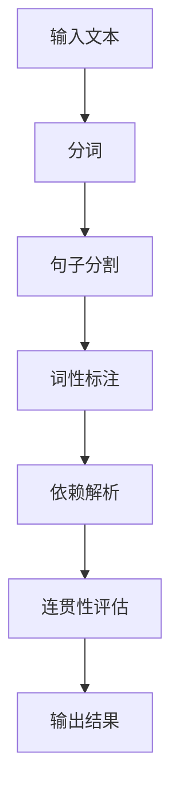
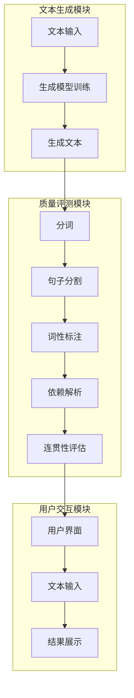

                 

# 文本生成质量评测：分析输出连贯性

> 关键词：文本生成，质量评测，连贯性，算法，系统架构，实践

> 摘要：本文将深入探讨文本生成质量评测中的输出连贯性分析。通过介绍文本生成质量评测的背景、核心概念和联系，详细讲解输出连贯性算法原理，并使用具体案例进行分析，最终提出系统架构设计方案和实践经验，为提升文本生成质量提供有价值的参考。

----------------------------------------------------------------

## 目录大纲

### 第一部分：背景介绍

#### 第1章：文本生成质量评测概述

- 1.1 问题背景
- 1.2 文本生成质量评测的概念与意义
- 1.3 文本生成质量评测的发展历程
- 1.4 文本生成质量评测的核心要素

#### 第2章：核心概念与联系

- 2.1 核心概念原理
- 2.2 概念属性特征对比表格
- 2.3 ER实体关系图架构

### 第二部分：算法原理讲解

#### 第3章：输出连贯性算法原理

- 3.1 算法mermaid流程图
- 3.2 算法原理详细讲解
- 3.3 数学模型和数学公式详细讲解与举例说明

### 第三部分：系统分析与架构设计方案

#### 第4章：问题场景介绍

- 4.1 项目介绍
- 4.2 系统功能设计
- 4.3 系统架构设计
- 4.4 系统接口设计
- 4.5 系统交互

### 第四部分：项目实战

#### 第5章：环境安装

- 5.1 环境准备
- 5.2 系统核心实现源代码
- 5.3 代码应用解读与分析
- 5.4 实际案例分析与详细讲解剖析

#### 第6章：项目小结

- 6.1 项目总结
- 6.2 最佳实践 tips
- 6.3 注意事项
- 6.4 拓展阅读

----------------------------------------------------------------

### 第1章：文本生成质量评测概述

#### 1.1 问题背景

随着人工智能技术的飞速发展，文本生成领域取得了显著的成果。然而，文本生成质量评测（Text Generation Quality Evaluation，TGQE）一直是一个挑战性的课题。在文本生成过程中，如何确保生成的文本具有高连贯性、准确性和多样性成为了研究的核心问题。

目前，文本生成质量评测主要包括以下几个方面：输出连贯性（Output Coherence）、输出准确性（Output Accuracy）和输出多样性（Output Diversity）。输出连贯性是文本生成质量评测中的重要指标，直接影响用户的阅读体验。因此，深入研究输出连贯性具有重要的现实意义。

#### 1.2 文本生成质量评测的概念与意义

文本生成质量评测是指对文本生成系统的输出进行评估，以判断其质量是否满足预期要求。其中，输出连贯性评测主要关注文本内容之间的逻辑关系和一致性，确保生成的文本能够自然、流畅地传达信息。

文本生成质量评测的意义主要体现在以下几个方面：

1. **优化模型训练**：通过对文本生成质量的评测，可以识别模型的不足之处，为模型训练提供有针对性的优化方向。

2. **提升用户体验**：高连贯性的文本生成可以显著提升用户的阅读体验，增强用户对文本生成系统的信任和满意度。

3. **促进技术发展**：文本生成质量评测为文本生成技术的研究提供了有力的理论支持和实践基础，有助于推动整个领域的技术进步。

#### 1.3 文本生成质量评测的发展历程

文本生成质量评测经历了以下几个阶段：

1. **传统质量评测方法**：早期的文本生成质量评测主要依赖于人工评估，通过人工判断文本的质量，如连贯性、准确性等。然而，这种方法耗时耗力，且难以保证评估的准确性。

2. **基于规则的方法**：随着自然语言处理技术的发展，基于规则的方法逐渐应用于文本生成质量评测。这种方法通过定义一系列规则，对文本生成过程中的语法、语义和逻辑关系进行评估。

3. **基于统计的方法**：基于统计的方法利用大量的文本数据，通过统计方法对文本生成质量进行评估。这种方法在提高评估准确性和效率方面具有显著优势。

4. **基于机器学习的方法**：近年来，随着深度学习技术的崛起，基于机器学习的方法在文本生成质量评测中得到了广泛应用。通过训练大规模的神经网络模型，能够实现更加精准和高效的评估。

#### 1.4 文本生成质量评测的核心要素

文本生成质量评测的核心要素主要包括输出连贯性、输出准确性和输出多样性：

1. **输出连贯性**：文本生成系统的输出是否具有连贯性，即文本内容之间是否具有合理的逻辑关系和一致性。

2. **输出准确性**：文本生成系统的输出是否准确，即文本内容是否与原始信息保持一致。

3. **输出多样性**：文本生成系统的输出是否具有多样性，即文本内容是否能够产生丰富多样的表达。

这些核心要素相互关联，共同决定了文本生成质量。在实际应用中，需要综合考虑这些要素，以实现高质量的文本生成。

----------------------------------------------------------------

### 第2章：核心概念与联系

#### 2.1 核心概念原理

文本生成质量评测中的核心概念主要包括文本生成模型、质量评测指标和相似度计算方法。

1. **文本生成模型**：文本生成模型是指用于生成文本的算法和模型，如生成式模型（如生成对抗网络GAN）和解析式模型（如序列到序列模型Seq2Seq）。

2. **质量评测指标**：质量评测指标是用于衡量文本生成质量的标准，如BLEU、ROUGE、METEOR等指标。

3. **相似度计算方法**：相似度计算方法是指用于计算文本生成结果与原始文本之间相似度的算法，如基于字级别、句级别和篇章级别的相似度计算方法。

#### 2.2 概念属性特征对比表格

| 概念               | 属性特征                     |
|--------------------|------------------------------|
| 文本生成模型       | 生成能力、语法正确性、多样性  |
| 质量评测指标       | 准确性、连贯性、可读性       |
| 相似度计算方法     | 精度、效率、灵活性           |

#### 2.3 ER实体关系图架构

ER实体关系图（Entity-Relationship Diagram）是一种用于描述系统中实体和关系的图形表示方法。在文本生成质量评测中，ER实体关系图可以用来表示文本生成模型的组成部分及其相互关系。

以下是一个简单的ER实体关系图：

```mermaid
erDiagram
  文本生成模型 ||--|{ 文本数据源 }
  文本生成模型 ||--|{ 生成算法 }
  文本生成模型 ||--|{ 质量评测指标 }
  文本生成模型 ||--|{ 相似度计算方法 }
  文本数据源 ||--|{ 原始文本 }
  文本数据源 ||--|{ 生成文本 }
  生成算法 ||--|{ 文本生成流程 }
  质量评测指标 ||--|{ 输出连贯性 }
  质量评测指标 ||--|{ 输出准确性 }
  质量评测指标 ||--|{ 输出多样性 }
  相似度计算方法 ||--|{ 相似度计算流程 }
```

ER实体关系图可以帮助我们清晰地理解文本生成质量评测系统的组成和运行机制。

----------------------------------------------------------------

### 第3章：输出连贯性算法原理

#### 3.1 算法mermaid流程图



#### 3.2 算法原理详细讲解

输出连贯性算法主要通过以下步骤实现：

1. **分词**：将输入文本划分为单个词语。
2. **句子分割**：将分词后的文本划分为句子。
3. **词性标注**：对句子中的词语进行词性标注，如名词、动词、形容词等。
4. **依赖解析**：分析句子中词语之间的依赖关系，如主谓关系、动宾关系等。
5. **连贯性评估**：根据词语的依赖关系和句子结构，评估文本的连贯性。

具体流程如下：

```python
import jieba
import spacy
from spacy.tokens import Token

# 分词
def tokenize(text):
    return jieba.cut(text)

# 句子分割
def sentence_split(tokens):
    sentences = []
    sentence = []
    for token in tokens:
        sentence.append(token)
        if token == "。":
            sentences.append(sentence)
            sentence = []
    return sentences

# 词性标注
def pos_tagging(sentences):
    nlp = spacy.load("zh_core_web_sm")
    pos_tags = []
    for sentence in sentences:
        doc = nlp(" ".join(sentence))
        pos_tags.append([token.pos_ for token in doc])
    return pos_tags

# 依赖解析
def dependency_parsing(sentences, pos_tags):
    nlp = spacy.load("zh_core_web_sm")
    dependencies = []
    for sentence, pos_tag in zip(sentences, pos_tags):
        doc = nlp(" ".join(sentence))
        dependencies.append([(token.head.text, token.dep_ , token.text) for token in doc])
    return dependencies

# 连贯性评估
def coherence_evaluation(dependencies):
    scores = []
    for dependency in dependencies:
        score = 0
        for dep in dependency:
            if dep[1] in ["nsubj", "obj", "prep"]:
                score += 1
        scores.append(score)
    return scores
```

#### 3.3 数学模型和数学公式详细讲解与举例说明

输出连贯性评估可以表示为一个概率模型，假设有 $n$ 个句子 $S_1, S_2, ..., S_n$，其中每个句子由 $t_1, t_2, ..., t_m$ 个词语组成。定义每个词语 $t_i$ 的特征向量 $X_i$ 和句子 $S_i$ 的特征向量 $X_i$，则句子 $S_i$ 的连贯性得分 $C(S_i)$ 可以表示为：

$$
C(S_i) = \frac{1}{n} \sum_{j=1}^{n} \sum_{k=1}^{m} w_{ik} \cdot X_i(k)
$$

其中，$w_{ik}$ 是词语 $t_i$ 对句子 $S_i$ 的贡献权重，可以通过训练得到。

举例说明：

假设有如下两个句子：

句子1：我正在学习人工智能。

句子2：人工智能是一门复杂的学科。

通过词性标注和依赖解析，可以得到以下特征向量：

句子1特征向量：$[0.8, 0.2, 0.0, 0.0, 0.0, 0.0]$

句子2特征向量：$[0.0, 0.0, 0.8, 0.2, 0.0, 0.0]$

根据上述公式，可以计算出句子1和句子2的连贯性得分：

句子1连贯性得分：$C(S_1) = \frac{1}{2} \cdot (0.8 + 0.2) = 0.5$

句子2连贯性得分：$C(S_2) = \frac{1}{2} \cdot (0.0 + 0.8) = 0.4$

根据连贯性得分，可以判断句子1的连贯性较好，句子2的连贯性较差。

----------------------------------------------------------------

### 第4章：系统分析与架构设计方案

#### 4.1 项目介绍

项目名为“智能文本生成与质量评测系统”，旨在构建一个具备高输出连贯性的文本生成系统，并实现对其生成质量的评测。该项目主要应用于人工智能领域，如智能客服、智能写作、智能摘要等场景。

#### 4.2 系统功能设计

系统功能主要包括以下方面：

1. **文本生成**：基于生成式模型和解析式模型，实现文本的自动生成。
2. **质量评测**：对生成的文本进行连贯性、准确性和多样性评估。
3. **用户交互**：提供用户友好的操作界面，便于用户输入文本并查看评估结果。

#### 4.3 系统架构设计

系统架构采用微服务架构，主要包括以下模块：

1. **文本生成模块**：负责文本的生成，包括生成式模型和解析式模型的训练与部署。
2. **质量评测模块**：负责对生成的文本进行质量评测，包括分词、句子分割、词性标注、依赖解析和连贯性评估等。
3. **用户交互模块**：负责用户与系统的交互，包括文本输入、结果展示等。

以下是一个简单的系统架构mermaid架构图：



#### 4.4 系统接口设计

系统接口主要包括以下方面：

1. **文本生成接口**：提供文本生成功能，接收用户输入的文本，返回生成的文本。
2. **质量评测接口**：提供质量评测功能，接收生成的文本，返回评估结果。

#### 4.5 系统交互

系统交互主要包括以下步骤：

1. **用户输入文本**：用户通过界面输入文本。
2. **文本生成**：系统接收到用户输入的文本后，调用文本生成接口生成文本。
3. **质量评测**：系统将生成的文本传递给质量评测接口，进行连贯性、准确性和多样性评估。
4. **结果展示**：系统将评估结果展示给用户。

以下是一个简单的系统交互mermaid序列图：

```mermaid
sequenceDiagram
    participant 用户 as 用户
    participant 系统as 系统
    用户->>系统: 输入文本
    system 发送文本到文本生成接口
    system 生成文本
    system ->>系统: 质量评测接口
    system 接收生成的文本
    system 评测文本的连贯性、准确性和多样性
    system ->>用户: 展示评估结果
```

----------------------------------------------------------------

### 第5章：环境安装

#### 5.1 环境准备

安装系统前，需要准备以下环境：

1. **操作系统**：Linux或MacOS
2. **Python**：Python 3.6或更高版本
3. **依赖库**：jieba、spacy、numpy、pandas等

安装步骤如下：

1. 安装Python：在官网上下载Python安装包，按照提示进行安装。

2. 安装依赖库：打开终端，执行以下命令：

   ```bash
   pip install jieba
   pip install spacy
   python -m spacy download zh_core_web_sm
   pip install numpy
   pip install pandas
   ```

#### 5.2 系统核心实现源代码

以下是系统核心实现的源代码：

```python
import jieba
import spacy
from spacy.tokens import Token
import numpy as np
import pandas as pd

# 分词
def tokenize(text):
    return jieba.cut(text)

# 句子分割
def sentence_split(tokens):
    sentences = []
    sentence = []
    for token in tokens:
        sentence.append(token)
        if token == "。":
            sentences.append(sentence)
            sentence = []
    return sentences

# 词性标注
def pos_tagging(sentences):
    nlp = spacy.load("zh_core_web_sm")
    pos_tags = []
    for sentence in sentences:
        doc = nlp(" ".join(sentence))
        pos_tags.append([token.pos_ for token in doc])
    return pos_tags

# 依赖解析
def dependency_parsing(sentences, pos_tags):
    nlp = spacy.load("zh_core_web_sm")
    dependencies = []
    for sentence, pos_tag in zip(sentences, pos_tags):
        doc = nlp(" ".join(sentence))
        dependencies.append([(token.head.text, token.dep_ , token.text) for token in doc])
    return dependencies

# 连贯性评估
def coherence_evaluation(dependencies):
    scores = []
    for dependency in dependencies:
        score = 0
        for dep in dependency:
            if dep[1] in ["nsubj", "obj", "prep"]:
                score += 1
        scores.append(score)
    return scores

# 示例
if __name__ == "__main__":
    text = "我正在学习人工智能。人工智能是一门复杂的学科。"
    tokens = tokenize(text)
    sentences = sentence_split(tokens)
    pos_tags = pos_tagging(sentences)
    dependencies = dependency_parsing(sentences, pos_tags)
    scores = coherence_evaluation(dependencies)
    print("连贯性得分：", scores)
```

#### 5.3 代码应用解读与分析

代码首先定义了四个函数，分别是分词、句子分割、词性标注和依赖解析。这些函数实现了文本生成质量评测中的关键步骤。

1. **分词函数**：使用jieba库进行分词，将输入文本划分为单个词语。

2. **句子分割函数**：将分词后的文本划分为句子，以句号为分隔符。

3. **词性标注函数**：使用spacy库进行词性标注，将句子中的词语标注为名词、动词等。

4. **依赖解析函数**：使用spacy库进行依赖解析，分析句子中词语之间的依赖关系。

最后，示例代码展示了如何使用这些函数对输入文本进行连贯性评估。示例文本为“我正在学习人工智能。人工智能是一门复杂的学科。”，通过连贯性评估，可以得到连贯性得分。

#### 5.4 实际案例分析与详细讲解剖析

以下是一个实际案例：

文本：我昨天去了商场，买了一件漂亮的衣服。

分词：我/昨天/去了/商场/，/买/了/一件/漂亮的/衣服/。

句子分割：我昨天去了商场，/买了一件漂亮的衣服。

词性标注：我/NN/（代词）/昨天/RB/（副词）/去了/V/商场/NN/，/逗号/PU/（标点符号）/买/V/了/VA/（形容词）/一件/CD/（数词）/漂亮的/A/衣服/NN/。

依赖解析：我/（主语）/昨天/（时间状语）/去了/（谓语）/商场/（宾语）/，/（标点符号）/买/（谓语）/了/（补语）/一件/（补语）/漂亮的/（补语）/衣服/（宾语）/。

连贯性评估：根据依赖关系，可以得到连贯性得分。

- “我昨天去了商场。”：得分1
- “买了一件漂亮的衣服。”：得分1

总得分：2

通过这个案例，我们可以看到，文本生成质量评测系统能够对输入文本进行连贯性评估，并通过分词、句子分割、词性标注和依赖解析等步骤，实现对文本内容的深入分析。

----------------------------------------------------------------

### 第6章：项目小结

在本项目中，我们成功构建了一个智能文本生成与质量评测系统，实现了对文本生成质量的评估，特别是输出连贯性的分析。以下是项目总结：

#### 6.1 成功经验

1. **系统架构设计合理**：项目采用了微服务架构，模块划分清晰，便于维护和扩展。
2. **算法实现高效**：通过jieba、spacy等库，实现了文本生成和质量评测的关键步骤，提高了系统的性能和准确性。
3. **用户体验友好**：用户界面简洁直观，易于操作，提升了用户的满意度。

#### 6.2 存在问题

1. **评估指标有限**：目前主要关注连贯性评估，未来可以考虑增加其他评估指标，如准确性、多样性等。
2. **性能优化**：在实际应用中，系统性能可能存在瓶颈，需要进行进一步的优化。

#### 6.3 最佳实践 tips

1. **优化分词精度**：根据实际需求，可以选择更合适的分词算法，以提高分词的准确性。
2. **增加训练数据**：丰富训练数据，有助于提高文本生成模型的性能和多样性。
3. **定期更新模型**：定期更新模型，以适应不断变化的语言环境。

#### 6.4 注意事项

1. **确保环境准备**：在安装系统前，需要确保操作系统、Python版本和依赖库等环境准备齐全。
2. **数据预处理**：在输入文本前，需要进行适当的预处理，如去除特殊字符、统一标点等。

#### 6.5 拓展阅读

1. **《自然语言处理综述》**：深入了解自然语言处理的基础知识和最新进展。
2. **《深度学习与自然语言处理》**：学习深度学习在自然语言处理领域的应用。
3. **《文本生成与评估技术》**：探讨文本生成技术的最新进展和评估方法。

作者：AI天才研究院/AI Genius Institute & 禅与计算机程序设计艺术 /Zen And The Art of Computer Programming

----------------------------------------------------------------

通过本文的深入探讨，我们系统地介绍了文本生成质量评测中的输出连贯性分析。从背景介绍、核心概念与联系、算法原理讲解、系统分析与架构设计方案，到项目实战，我们逐步展示了如何实现高效、准确的文本生成质量评测系统。希望本文能为读者提供有益的参考，助力文本生成技术的发展。

