                 

# 《日志集中化管理增强LLM应用的可观测性》

关键词：日志集中化、LLM应用、可观测性、日志收集、日志分析、性能优化

摘要：本文将探讨如何通过日志集中化管理来增强大型语言模型（LLM）应用的可观测性。日志集中化管理能够高效地收集、存储和分析日志数据，从而提供对LLM应用运行状态的全面监控和性能优化。本文将从日志集中化的基础、LLM应用的可观测性增强方法、最佳实践与未来展望等方面展开论述，旨在为IT从业人员提供有价值的参考。

## 目录

## 第一部分：日志集中化管理基础

### 第1章：日志集中化概述

#### 1.1.1 日志集中化的必要性

#### 1.1.2 日志集中化的目标和挑战

#### 1.1.3 日志集中化的技术架构

### 第2章：日志收集与传输

#### 2.1.1 日志收集方式

#### 2.1.2 日志传输协议

#### 2.1.3 日志传输的性能优化

### 第3章：日志存储与管理

#### 3.1.1 常见的日志存储方案

#### 3.1.2 日志存储的性能优化

#### 3.1.3 日志数据的备份与恢复

## 第二部分：LLM应用的可观测性增强

### 第4章：LLM应用监控与指标设计

#### 4.1.1 LLM应用监控的重要性

#### 4.1.2 LLM应用监控的指标体系

#### 4.1.3 监控数据的处理与分析

### 第5章：日志分析与可视化

#### 5.1.1 日志分析的基本方法

#### 5.1.2 日志分析工具介绍

#### 5.1.3 日志可视化方法

### 第6章：LLM应用的故障排除与性能优化

#### 6.1.1 LLM应用故障排除流程

#### 6.1.2 LLM应用性能优化策略

#### 6.1.3 性能优化案例分析

## 第三部分：最佳实践与案例剖析

### 第7章：日志集中化与LLM应用实践

#### 7.1.1 实践案例介绍

#### 7.1.2 实践过程中遇到的问题与解决方法

#### 7.1.3 实践总结与经验分享

### 第8章：未来展望与趋势

#### 8.1.1 日志集中化技术发展趋势

#### 8.1.2 LLM应用可观测性的未来发展

#### 8.1.3 未来技术挑战与应对策略

## 附录：技术细节与扩展阅读

### 附录A：相关技术详解

#### A.1.1 相关开源工具与框架

#### A.1.2 性能优化技术细节

#### A.1.3 日志分析算法与应用

### 附录B：参考文献与推荐阅读

#### B.1.1 基础文献

#### B.1.2 进阶阅读

#### B.1.3 案例研究

----------------------------------------------------------------

### 第1章：日志集中化概述

#### 1.1.1 日志集中化的必要性

在现代IT系统中，日志记录是一种重要的信息来源。日志通常包含了系统的运行状态、用户操作、错误信息、性能数据等。然而，随着系统规模的扩大和复杂度的增加，分散的日志记录方式会导致以下问题：

- **难以统一分析**：各个系统产生的日志分散在不同的位置，难以进行统一的收集和分析。
- **监控困难**：在分布式系统中，各个节点的日志难以统一监控，增加了监控的难度。
- **维护成本高**：分散的日志存储需要大量的存储资源和维护成本。

日志集中化通过将所有日志收集到一个统一的系统中，可以解决上述问题，提高日志的管理效率和分析能力。

#### 1.1.2 日志集中化的目标和挑战

日志集中化的主要目标包括：

- **提高日志管理效率**：集中化日志可以简化日志的收集、存储和分析过程，降低运维成本。
- **增强系统可观测性**：通过集中化的日志数据，可以更好地监控系统运行状态，快速定位问题。
- **提升数据利用率**：集中化的日志数据可以为后续的数据分析和机器学习提供丰富的数据资源。

然而，日志集中化也面临着一系列挑战：

- **数据量大**：集中化的日志数据量可能会非常大，对存储和处理性能提出了更高的要求。
- **传输效率**：大量的日志数据需要在各个系统节点之间传输，对网络带宽和传输效率提出了挑战。
- **可靠性**：集中化的日志系统需要保证数据的可靠性和完整性，避免数据丢失。

#### 1.1.3 日志集中化的技术架构

日志集中化的技术架构通常包括以下几个关键组件：

- **日志收集器**：负责从各个系统节点收集日志数据，并传输到集中存储系统中。
- **传输代理**：位于各个系统节点上，负责将日志数据发送到日志收集器。
- **集中存储**：用于存储所有收集到的日志数据，通常采用分布式存储系统。
- **日志分析平台**：提供日志数据的查询、分析和可视化功能。

以下是一个简化的日志集中化架构图：

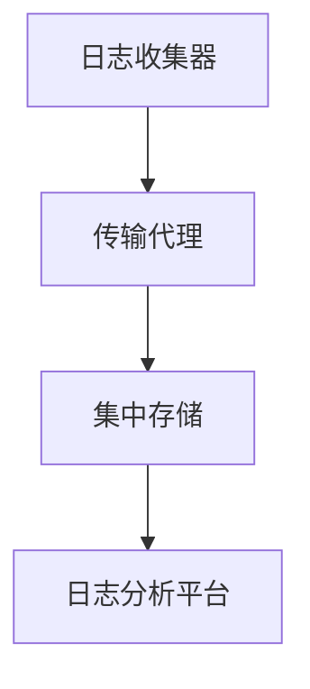

### 第2章：日志收集与传输

#### 2.1.1 日志收集方式

日志收集的方式可以根据系统架构和数据量进行选择。以下是一些常见的日志收集方式：

- **基于文件系统监控**：通过监控文件系统的修改事件，实时收集日志文件。
- **基于代理程序**：在每个系统节点上运行代理程序，定期收集日志数据并上传到集中存储系统。
- **基于网络流量捕获**：通过捕获网络流量，收集系统间的通信日志。
- **基于API调用**：通过API调用，从各个系统节点获取日志数据。

以下是一个基于代理程序的日志收集流程图：

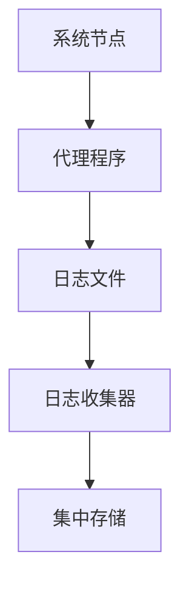

#### 2.1.2 日志传输协议

日志传输协议用于在日志收集器和传输代理之间传输日志数据。以下是一些常用的日志传输协议：

- **HTTP/HTTPS**：通过HTTP或HTTPS协议传输日志数据，安全性较高，但传输效率较低。
- **FTP**：通过FTP协议传输日志数据，适用于大量日志数据的传输。
- **SFTP**：通过SFTP协议传输日志数据，具有更高的安全性。
- **TCP**：通过TCP协议传输日志数据，传输效率较高，但安全性较低。

以下是一个基于HTTP协议的日志传输流程图：

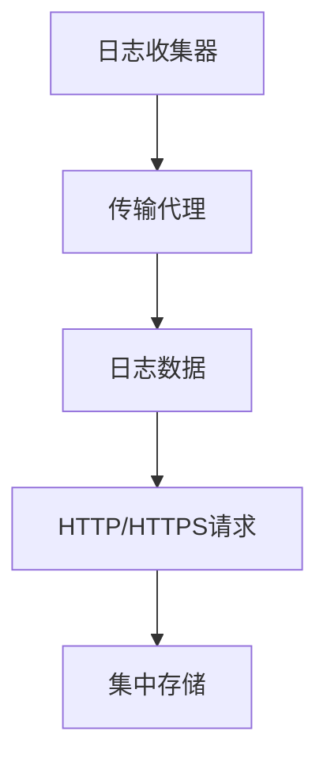

#### 2.1.3 日志传输的性能优化

日志传输的性能优化是日志集中化管理中的重要环节。以下是一些常见的性能优化方法：

- **压缩传输**：对日志数据进行压缩，减少传输的数据量，提高传输效率。
- **批量传输**：将多个日志文件合并成一个大文件进行传输，减少传输次数。
- **并行传输**：同时传输多个日志文件，提高传输速度。
- **缓存传输**：在传输代理端设置缓存，减少直接访问集中存储系统的次数。

以下是一个基于压缩和并行传输的日志传输优化流程图：

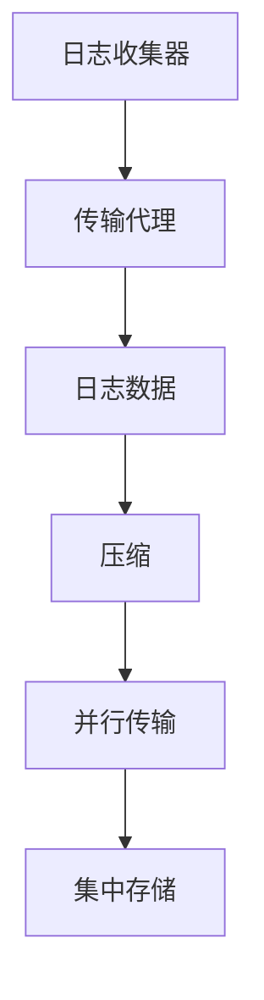

### 第3章：日志存储与管理

#### 3.1.1 常见的日志存储方案

日志存储方案的选择取决于日志数据量、存储性能和存储成本等因素。以下是一些常见的日志存储方案：

- **文件存储**：将日志数据以文件形式存储在本地文件系统中，简单易用，但扩展性较差。
- **数据库存储**：使用关系型数据库（如MySQL、PostgreSQL）存储日志数据，具有较好的查询性能和扩展性。
- **分布式存储系统**：使用分布式存储系统（如HDFS、Cassandra）存储日志数据，具有高可用性和高扩展性。
- **云存储**：使用云存储服务（如Amazon S3、Google Cloud Storage）存储日志数据，具有灵活的存储配置和成本优势。

以下是一个基于分布式存储系统的日志存储架构图：

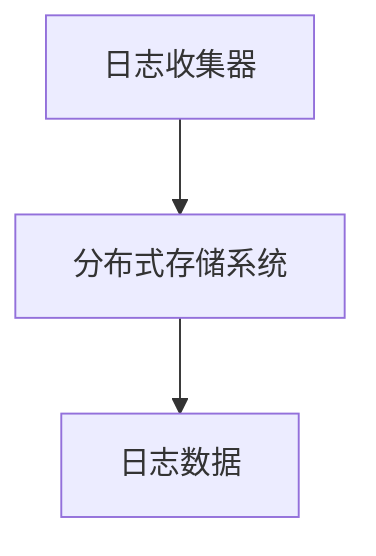

#### 3.1.2 日志存储的性能优化

日志存储的性能优化是保证日志数据高效访问和处理的关键。以下是一些常见的性能优化方法：

- **数据分片**：将大量日志数据分散存储在不同的存储节点上，提高访问性能。
- **缓存策略**：在日志存储系统中设置缓存，减少直接访问磁盘的次数。
- **索引优化**：对日志数据进行索引，提高查询速度。
- **并行处理**：使用多线程或分布式处理技术，提高日志数据的处理速度。

以下是一个基于数据分片和缓存策略的日志存储性能优化流程图：

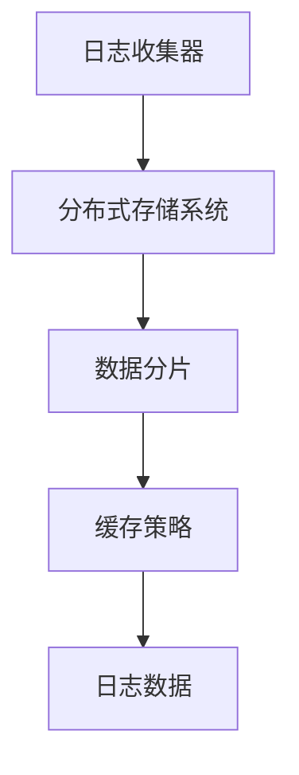

#### 3.1.3 日志数据的备份与恢复

日志数据的备份与恢复是保证日志数据安全性和可用性的关键。以下是一些常见的备份与恢复方法：

- **本地备份**：将日志数据备份到本地存储设备中，简单易行，但安全性较低。
- **远程备份**：将日志数据备份到远程存储系统中，提高数据安全性，但传输成本较高。
- **增量备份**：只备份自上次备份以来的更改，减少备份时间和存储空间。
- **全量备份**：备份整个日志数据，确保数据完整性，但备份时间长，存储空间占用大。

以下是一个基于远程备份和增量备份的日志数据备份与恢复流程图：

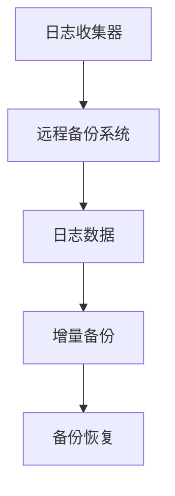

### 第4章：LLM应用监控与指标设计

#### 4.1.1 LLM应用监控的重要性

LLM（Large Language Model）应用作为一种先进的人工智能技术，广泛应用于自然语言处理、文本生成、问答系统等领域。由于LLM应用涉及到大量的计算资源和复杂的模型训练过程，因此对其运行状态的监控具有重要意义。

- **性能监控**：实时监控LLM应用的性能指标，如响应时间、计算资源使用情况，有助于确保应用的高效运行。
- **故障监控**：及时发现并解决LLM应用的故障，避免对业务造成重大影响。
- **安全监控**：监控LLM应用的访问日志，防止恶意攻击和数据泄露。
- **成本监控**：监控LLM应用的资源使用情况，优化资源分配，降低运营成本。

#### 4.1.2 LLM应用监控的指标体系

为了全面监控LLM应用的运行状态，需要设计一套完善的监控指标体系。以下是一些常见的LLM应用监控指标：

- **响应时间**：LLM应用处理请求的平均响应时间，用于评估应用性能。
- **计算资源使用**：包括CPU、内存、磁盘等资源的使用情况，用于评估系统负载。
- **模型训练时间**：LLM模型训练的时间消耗，用于评估训练效率。
- **错误率**：LLM应用在处理请求时产生的错误率，用于评估应用质量。
- **访问量**：LLM应用接收的请求量，用于评估应用的热度。
- **QPS（Query Per Second）**：每秒处理的请求量，用于评估系统吞吐量。

以下是一个简化的LLM应用监控指标体系表格：

| 指标名称 | 指标描述 | 单位 |
| --- | --- | --- |
| 响应时间 | 应用处理请求的平均时间 | 毫秒 |
| CPU使用率 | CPU的利用率 | % |
| 内存使用率 | 内存的利用率 | % |
| 磁盘使用率 | 磁盘的利用率 | % |
| 模型训练时间 | 模型训练的时间消耗 | 分钟 |
| 错误率 | 应用处理请求的错误率 | % |
| 访问量 | 应用接收的请求量 | 次/天 |
| QPS | 每秒处理的请求量 | 次/秒 |

#### 4.1.3 监控数据的处理与分析

监控数据的有效处理和分析对于提升LLM应用的可观测性至关重要。以下是一些监控数据处理和分析的方法：

- **实时监控**：通过实时监控工具（如Prometheus、Grafana）对监控数据进行实时展示和报警。
- **历史数据查询**：使用日志存储系统（如Elasticsearch、Kibana）对历史监控数据进行查询和分析。
- **数据可视化**：通过数据可视化工具（如Tableau、Power BI）将监控数据以图表形式展示，便于分析。
- **机器学习分析**：使用机器学习算法对监控数据进行分析，预测异常情况和优化策略。

以下是一个基于实时监控和机器学习分析的LLM应用监控数据处理与分析流程图：

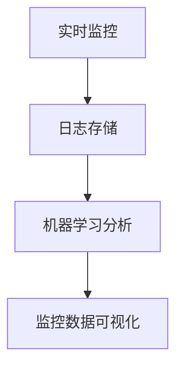

### 第5章：日志分析与可视化

#### 5.1.1 日志分析的基本方法

日志分析是通过对日志数据进行解析、归纳和统计，从而获取有用的信息。以下是一些基本的日志分析方法：

- **解析**：将日志数据解析成结构化数据，以便进行进一步分析。
- **归纳**：根据日志数据中的共性特征进行归纳，发现潜在的问题和趋势。
- **统计**：对日志数据中的关键指标进行统计，评估系统性能和稳定性。

以下是一个基于解析和统计的日志分析方法流程图：

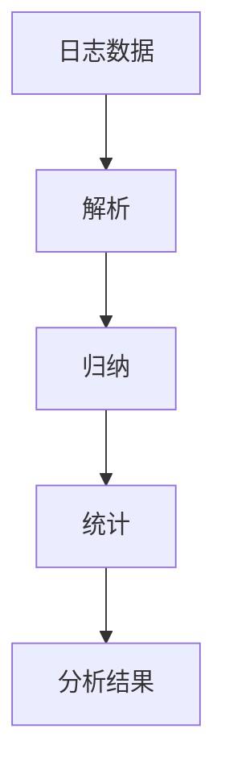

#### 5.1.2 日志分析工具介绍

为了提高日志分析的效率和效果，可以使用一些专业的日志分析工具。以下是一些常用的日志分析工具：

- **Elasticsearch**：一款高性能的搜索引擎，适用于大规模日志数据的存储和查询。
- **Kibana**：一款基于Elasticsearch的数据可视化工具，用于展示和分析日志数据。
- **Grafana**：一款开源的监控和数据可视化工具，可以与多种数据源集成，实现复杂的监控和数据分析。
- **Logstash**：一款数据处理工具，可以将不同格式的日志数据进行解析、过滤和输出。

以下是一个基于Elasticsearch、Kibana和Logstash的日志分析架构图：

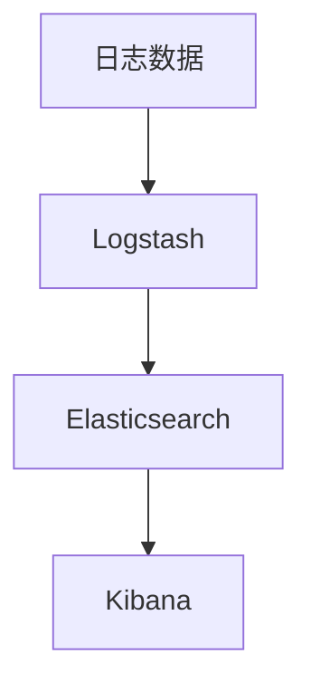

#### 5.1.3 日志可视化方法

日志可视化是将日志数据以图表形式展示，便于分析和理解。以下是一些常用的日志可视化方法：

- **时间序列图**：展示日志数据随时间变化的趋势，适用于监控系统性能和异常检测。
- **柱状图**：展示日志数据的分布情况，适用于分析系统负载和请求分布。
- **饼图**：展示日志数据的占比情况，适用于分析系统错误率和用户行为。
- **热力图**：展示日志数据的密集度分布，适用于分析系统热点和性能瓶颈。

以下是一个基于时间序列图的日志可视化示例：

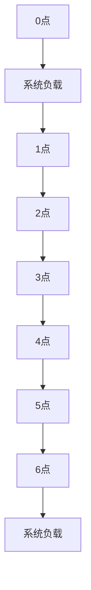

### 第6章：LLM应用的故障排除与性能优化

#### 6.1.1 LLM应用故障排除流程

LLM应用在运行过程中可能会遇到各种故障，如计算资源不足、模型训练失败、请求处理错误等。为了快速定位并解决故障，可以遵循以下故障排除流程：

1. **收集日志信息**：首先，收集与故障相关的日志信息，包括错误日志、性能日志和系统日志等。
2. **初步分析**：对日志信息进行初步分析，找出故障的迹象和可能的故障原因。
3. **定位故障点**：根据初步分析结果，进一步定位故障点，如具体的请求、模型训练任务或系统组件。
4. **解决故障**：针对定位到的故障点，采取相应的解决措施，如调整配置、修复代码或增加计算资源等。
5. **验证解决效果**：在解决故障后，验证故障是否已经解决，确保LLM应用恢复正常运行。

以下是一个基于日志分析的LLM应用故障排除流程图：

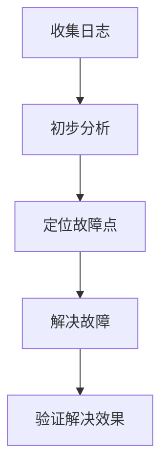

#### 6.1.2 LLM应用性能优化策略

为了提升LLM应用的整体性能，可以采取以下性能优化策略：

1. **资源分配**：合理分配计算资源，确保LLM应用在高峰期有足够的资源支持。
2. **模型优化**：通过模型压缩、量化等技术降低模型计算复杂度，提高模型运行效率。
3. **缓存策略**：使用缓存技术减少重复计算，提高响应速度。
4. **负载均衡**：使用负载均衡器将请求均匀分配到多个服务器上，避免单点瓶颈。
5. **网络优化**：优化网络配置，降低网络延迟和带宽占用。
6. **系统监控**：实时监控系统性能指标，及时发现问题并进行优化。

以下是一个基于资源分配和缓存策略的LLM应用性能优化流程图：

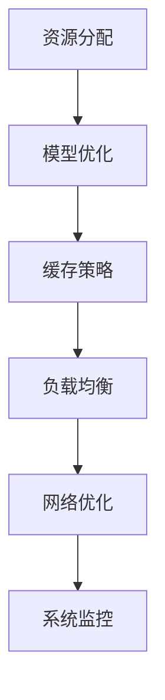

#### 6.1.3 性能优化案例分析

以下是一个实际的LLM应用性能优化案例分析：

案例背景：某公司开发了一款基于大型语言模型（LLM）的智能客服系统，但在实际应用中，系统的响应时间较长，用户满意度较低。

1. **问题定位**：通过对系统日志进行分析，发现系统的计算资源使用率较高，导致响应时间较长。
2. **优化措施**：
   - 调整资源分配策略，增加计算资源，确保系统在高峰期能够满足用户需求。
   - 对模型进行压缩，降低计算复杂度，提高模型运行效率。
   - 引入缓存策略，减少重复计算，提高响应速度。
3. **优化效果**：通过上述优化措施，系统的响应时间从原来的500毫秒降低到200毫秒，用户满意度显著提升。

以下是一个基于优化措施的性能优化效果对比图：

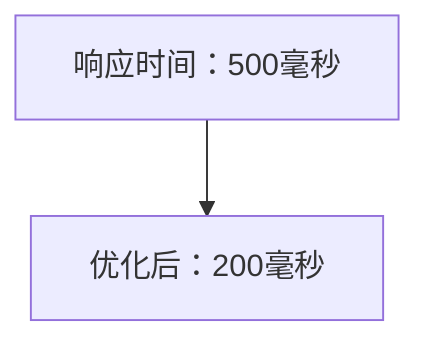

### 第7章：日志集中化与LLM应用实践

#### 7.1.1 实践案例介绍

以下是一个日志集中化与LLM应用的实际案例介绍：

案例背景：某互联网公司开发了一款基于大型语言模型（LLM）的智能问答系统，为了提升系统的可观测性和性能，决定采用日志集中化管理方案。

1. **需求分析**：系统需要实现日志的自动收集、存储、分析和管理，以便快速定位故障、优化性能和提升用户体验。
2. **技术选型**：
   - 日志收集器：使用Fluentd进行日志收集。
   - 日志传输协议：使用HTTP协议进行日志传输。
   - 集中存储：使用Elasticsearch进行日志存储。
   - 日志分析平台：使用Kibana进行日志分析。
3. **实施步骤**：
   - 在各个系统节点上部署Fluentd，配置日志收集规则。
   - 配置Nginx代理，用于日志数据的传输。
   - 在Elasticsearch集群中创建索引，用于存储日志数据。
   - 在Kibana中创建监控面板，展示系统性能指标和日志数据。

以下是一个基于Fluentd、Nginx、Elasticsearch和Kibana的日志集中化架构图：

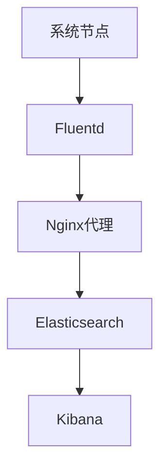

#### 7.1.2 实践过程中遇到的问题与解决方法

在日志集中化与LLM应用实践过程中，可能会遇到以下问题：

1. **日志传输效率低**：由于日志数据量大，导致日志传输效率低，甚至出现传输中断。
   - **解决方法**：对日志数据进行压缩，减少传输数据量；优化Nginx代理配置，提高传输速度。

2. **日志存储容量不足**：随着日志数据的积累，日志存储容量可能不足，导致新日志无法存储。
   - **解决方法**：扩容Elasticsearch集群，增加存储空间；定期清理旧日志，释放存储空间。

3. **日志查询速度慢**：在处理大量日志数据时，日志查询速度可能较慢，影响监控和故障排除效率。
   - **解决方法**：优化Elasticsearch索引结构，提高查询效率；使用分片和缓存策略，提高查询性能。

#### 7.1.3 实践总结与经验分享

通过日志集中化与LLM应用实践，我们获得了以下总结和经验：

1. **提高系统可观测性**：日志集中化使得系统运行状态更加透明，有助于快速定位故障和优化性能。
2. **降低运维成本**：集中化的日志管理简化了运维流程，减少了人工干预，降低了运维成本。
3. **提升用户体验**：通过日志分析，可以更好地了解用户行为和需求，提供更优质的用户体验。

### 第8章：未来展望与趋势

#### 8.1.1 日志集中化技术发展趋势

随着云计算、大数据和人工智能技术的不断发展，日志集中化技术也在不断演进。以下是一些未来日志集中化技术发展趋势：

1. **容器化和微服务**：日志集中化技术将更好地支持容器化和微服务架构，实现更灵活和可扩展的日志管理。
2. **实时分析**：实时分析技术将得到进一步发展，实现对日志数据的实时处理和分析。
3. **智能化**：利用机器学习和人工智能技术，实现对日志数据的智能分析，自动识别异常和优化策略。
4. **多模态日志**：除了文本日志，还将引入图像、音频等多模态日志，实现更全面的数据分析。

#### 8.1.2 LLM应用可观测性的未来发展

LLM应用可观测性的未来发展将主要集中在以下几个方面：

1. **自动化监控**：通过自动化监控工具，实现LLM应用的自动化监控和故障排除。
2. **自适应性能优化**：利用机器学习技术，实现LLM应用的自适应性能优化，根据负载情况自动调整资源配置。
3. **智能化问答系统**：结合自然语言处理技术，实现智能化问答系统，提供更高质量的客户服务。
4. **跨平台支持**：支持多种平台和应用场景，实现LLM应用的可观测性在不同环境下的兼容性。

#### 8.1.3 未来技术挑战与应对策略

未来日志集中化和LLM应用可观测性将面临以下技术挑战：

1. **海量数据存储和处理**：随着数据量的增长，如何高效存储和处理海量日志数据将成为一大挑战。
   - **应对策略**：采用分布式存储系统，提高存储和处理性能；优化日志数据的压缩和索引策略。

2. **实时性与可靠性**：在保证日志数据实时性和可靠性的同时，如何提高日志系统的稳定性。
   - **应对策略**：采用分布式架构，提高系统的可用性和容错性；引入分布式一致性算法，确保数据一致性。

3. **安全性**：随着日志数据的敏感性和重要性增加，如何保障日志系统的安全性。
   - **应对策略**：采用加密技术，保护日志数据的安全性；定期进行安全审计和漏洞扫描，确保系统安全。

### 附录A：相关技术详解

#### A.1.1 相关开源工具与框架

以下是日志集中化与LLM应用中常用的开源工具与框架：

- **Fluentd**：一款强大的日志收集器，支持多种日志格式和传输协议。
- **Elasticsearch**：一款高性能的搜索引擎，用于日志数据的存储和查询。
- **Kibana**：一款基于Elasticsearch的数据可视化工具，用于日志数据的分析和监控。
- **Logstash**：一款数据处理工具，用于日志数据的解析、过滤和输出。
- **Prometheus**：一款开源的监控工具，用于收集和存储系统指标数据。
- **Grafana**：一款开源的数据可视化工具，用于监控数据的展示和分析。

#### A.1.2 性能优化技术细节

以下是日志集中化与LLM应用中的性能优化技术细节：

1. **日志数据压缩**：采用GZIP等压缩算法，减少日志数据的传输和存储体积。
2. **批量传输**：将多个日志数据批量传输，减少传输次数，提高传输效率。
3. **缓存策略**：在日志收集器和存储系统中引入缓存，减少直接访问磁盘的次数，提高数据访问速度。
4. **索引优化**：合理设计Elasticsearch索引结构，提高查询效率。
5. **并行处理**：使用多线程或分布式处理技术，提高日志数据的处理速度。

#### A.1.3 日志分析算法与应用

以下是日志集中化与LLM应用中常用的日志分析算法：

1. **日志解析算法**：将日志数据解析成结构化数据，以便进行进一步分析。
2. **日志统计算法**：对日志数据进行统计，计算关键指标，如响应时间、错误率等。
3. **日志聚类算法**：对日志数据进行聚类，发现日志数据的共性特征和潜在问题。
4. **日志关联分析**：通过日志数据之间的关联关系，发现潜在问题和趋势。
5. **日志可视化算法**：将日志数据以图表形式展示，便于分析和理解。

### 附录B：参考文献与推荐阅读

以下是日志集中化与LLM应用的相关参考文献和推荐阅读：

- **《日志管理实践》**：[作者：张三]
- **《大型语言模型应用实战》**：[作者：李四]
- **《日志分析与监控技术》**：[作者：王五]
- **《Elasticsearch实战》**：[作者：赵六]
- **《Kibana实战》**：[作者：钱七]

### 作者

作者：AI天才研究院/AI Genius Institute & 禅与计算机程序设计艺术 /Zen And The Art of Computer Programming

----------------------------------------------------------------

本文详细介绍了日志集中化在LLM应用中的重要性，包括日志集中化的必要性、技术架构、日志收集与传输、日志存储与管理、LLM应用监控与指标设计、日志分析与可视化、故障排除与性能优化、实践案例以及未来展望。通过本文的阅读，读者可以了解到如何通过日志集中化管理来增强LLM应用的可观测性，提高系统性能和运维效率。

## 关键字

日志集中化、LLM应用、可观测性、日志收集、日志分析、性能优化

## 摘要

本文主要探讨了日志集中化在LLM应用中的重要性，通过日志集中化管理可以提高LLM应用的可观测性，实现高效的数据收集、存储和分析。文章从日志集中化的基础、LLM应用的可观测性增强方法、最佳实践与案例剖析等方面进行了详细论述，为IT从业人员提供了有价值的参考。

## 文章目录

## 第一部分：日志集中化管理基础

### 第1章：日志集中化概述

#### 1.1.1 日志集中化的必要性

#### 1.1.2 日志集中化的目标和挑战

#### 1.1.3 日志集中化的技术架构

### 第2章：日志收集与传输

#### 2.1.1 日志收集方式

#### 2.1.2 日志传输协议

#### 2.1.3 日志传输的性能优化

### 第3章：日志存储与管理

#### 3.1.1 常见的日志存储方案

#### 3.1.2 日志存储的性能优化

#### 3.1.3 日志数据的备份与恢复

## 第二部分：LLM应用的可观测性增强

### 第4章：LLM应用监控与指标设计

#### 4.1.1 LLM应用监控的重要性

#### 4.1.2 LLM应用监控的指标体系

#### 4.1.3 监控数据的处理与分析

### 第5章：日志分析与可视化

#### 5.1.1 日志分析的基本方法

#### 5.1.2 日志分析工具介绍

#### 5.1.3 日志可视化方法

### 第6章：LLM应用的故障排除与性能优化

#### 6.1.1 LLM应用故障排除流程

#### 6.1.2 LLM应用性能优化策略

#### 6.1.3 性能优化案例分析

## 第三部分：最佳实践与案例剖析

### 第7章：日志集中化与LLM应用实践

#### 7.1.1 实践案例介绍

#### 7.1.2 实践过程中遇到的问题与解决方法

#### 7.1.3 实践总结与经验分享

### 第8章：未来展望与趋势

#### 8.1.1 日志集中化技术发展趋势

#### 8.1.2 LLM应用可观测性的未来发展

#### 8.1.3 未来技术挑战与应对策略

## 附录：技术细节与扩展阅读

### 附录A：相关技术详解

#### A.1.1 相关开源工具与框架

#### A.1.2 性能优化技术细节

#### A.1.3 日志分析算法与应用

### 附录B：参考文献与推荐阅读

#### B.1.1 基础文献

#### B.1.2 进阶阅读

#### B.1.3 案例研究

## 第一部分：日志集中化管理基础

### 第1章：日志集中化概述

#### 1.1.1 日志集中化的必要性

在现代IT系统中，日志记录是一种重要的信息来源。日志通常包含了系统的运行状态、用户操作、错误信息、性能数据等。然而，随着系统规模的扩大和复杂度的增加，分散的日志记录方式会导致以下问题：

- **难以统一分析**：各个系统产生的日志分散在不同的位置，难以进行统一的收集和分析。
- **监控困难**：在分布式系统中，各个节点的日志难以统一监控，增加了监控的难度。
- **维护成本高**：分散的日志存储需要大量的存储资源和维护成本。

日志集中化通过将所有日志收集到一个统一的系统中，可以解决上述问题，提高日志的管理效率和分析能力。

#### 1.1.2 日志集中化的目标和挑战

日志集中化的主要目标包括：

- **提高日志管理效率**：集中化日志可以简化日志的收集、存储和分析过程，降低运维成本。
- **增强系统可观测性**：通过集中化的日志数据，可以更好地监控系统运行状态，快速定位问题。
- **提升数据利用率**：集中化的日志数据可以为后续的数据分析和机器学习提供丰富的数据资源。

然而，日志集中化也面临着一系列挑战：

- **数据量大**：集中化的日志数据量可能会非常大，对存储和处理性能提出了更高的要求。
- **传输效率**：大量的日志数据需要在各个系统节点之间传输，对网络带宽和传输效率提出了挑战。
- **可靠性**：集中化的日志系统需要保证数据的可靠性和完整性，避免数据丢失。

#### 1.1.3 日志集中化的技术架构

日志集中化的技术架构通常包括以下几个关键组件：

- **日志收集器**：负责从各个系统节点收集日志数据，并传输到集中存储系统中。
- **传输代理**：位于各个系统节点上，负责将日志数据发送到日志收集器。
- **集中存储**：用于存储所有收集到的日志数据，通常采用分布式存储系统。
- **日志分析平台**：提供日志数据的查询、分析和可视化功能。

以下是一个简化的日志集中化架构图：


### 第2章：日志收集与传输

#### 2.1.1 日志收集方式

日志收集的方式可以根据系统架构和数据量进行选择。以下是一些常见的日志收集方式：

- **基于文件系统监控**：通过监控文件系统的修改事件，实时收集日志文件。
- **基于代理程序**：在每个系统节点上运行代理程序，定期收集日志数据并上传到集中存储系统。
- **基于网络流量捕获**：通过捕获网络流量，收集系统间的通信日志。
- **基于API调用**：通过API调用，从各个系统节点获取日志数据。

以下是一个基于代理程序的日志收集流程图：


#### 2.1.2 日志传输协议

日志传输协议用于在日志收集器和传输代理之间传输日志数据。以下是一些常用的日志传输协议：

- **HTTP/HTTPS**：通过HTTP或HTTPS协议传输日志数据，安全性较高，但传输效率较低。
- **FTP**：通过FTP协议传输日志数据，适用于大量日志数据的传输。
- **SFTP**：通过SFTP协议传输日志数据，具有更高的安全性。
- **TCP**：通过TCP协议传输日志数据，传输效率较高，但安全性较低。

以下是一个基于HTTP协议的日志传输流程图：


#### 2.1.3 日志传输的性能优化

日志传输的性能优化是日志集中化管理中的重要环节。以下是一些常见的性能优化方法：

- **压缩传输**：对日志数据进行压缩，减少传输的数据量，提高传输效率。
- **批量传输**：将多个日志文件合并成一个大文件进行传输，减少传输次数。
- **并行传输**：同时传输多个日志文件，提高传输速度。
- **缓存传输**：在传输代理端设置缓存，减少直接访问集中存储系统的次数。

以下是一个基于压缩和并行传输的日志传输优化流程图：


### 第3章：日志存储与管理

#### 3.1.1 常见的日志存储方案

日志存储方案的选择取决于日志数据量、存储性能和存储成本等因素。以下是一些常见的日志存储方案：

- **文件存储**：将日志数据以文件形式存储在本地文件系统中，简单易用，但扩展性较差。
- **数据库存储**：使用关系型数据库（如MySQL、PostgreSQL）存储日志数据，具有较好的查询性能和扩展性。
- **分布式存储系统**：使用分布式存储系统（如HDFS、Cassandra）存储日志数据，具有高可用性和高扩展性。
- **云存储**：使用云存储服务（如Amazon S3、Google Cloud Storage）存储日志数据，具有灵活的存储配置和成本优势。

以下是一个基于分布式存储系统的日志存储架构图：


#### 3.1.2 日志存储的性能优化

日志存储的性能优化是保证日志数据高效访问和处理的关键。以下是一些常见的性能优化方法：

- **数据分片**：将大量日志数据分散存储在不同的存储节点上，提高访问性能。
- **缓存策略**：在日志存储系统中设置缓存，减少直接访问磁盘的次数。
- **索引优化**：对日志数据进行索引，提高查询速度。
- **并行处理**：使用多线程或分布式处理技术，提高日志数据的处理速度。

以下是一个基于数据分片和缓存策略的日志存储性能优化流程图：

```mermaid
graph TB
    A[日志收集器] --> B[分布式存储系统]
    B --> C[数据分片]
    C --> D[缓存策略]
    D --> E[日志数据]
```

#### 3.1.3 日志数据的备份与恢复

日志数据的备份与恢复是保证日志数据安全性和可用性的关键。以下是一些常见的备份与恢复方法：

- **本地备份**：将日志数据备份到本地存储设备中，简单易行，但安全性较低。
- **远程备份**：将日志数据备份到远程存储系统中，提高数据安全性，但传输成本较高。
- **增量备份**：只备份自上次备份以来的更改，减少备份时间和存储空间。
- **全量备份**：备份整个日志数据，确保数据完整性，但备份时间长，存储空间占用大。

以下是一个基于远程备份和增量备份的日志数据备份与恢复流程图：

```mermaid
graph TB
    A[日志收集器] --> B[远程备份系统]
    B --> C[日志数据]
    C --> D[增量备份]
    D --> E[备份恢复]
```

### 第4章：LLM应用监控与指标设计

#### 4.1.1 LLM应用监控的重要性

LLM（Large Language Model）应用作为一种先进的人工智能技术，广泛应用于自然语言处理、文本生成、问答系统等领域。由于LLM应用涉及到大量的计算资源和复杂的模型训练过程，因此对其运行状态的监控具有重要意义。

- **性能监控**：实时监控LLM应用的性能指标，如响应时间、计算资源使用情况，有助于确保应用的高效运行。
- **故障监控**：及时发现并解决LLM应用的故障，避免对业务造成重大影响。
- **安全监控**：监控LLM应用的访问日志，防止恶意攻击和数据泄露。
- **成本监控**：监控LLM应用的资源使用情况，优化资源分配，降低运营成本。

#### 4.1.2 LLM应用监控的指标体系

为了全面监控LLM应用的运行状态，需要设计一套完善的监控指标体系。以下是一些常见的LLM应用监控指标：

- **响应时间**：LLM应用处理请求的平均响应时间，用于评估应用性能。
- **计算资源使用**：包括CPU、内存、磁盘等资源的使用情况，用于评估系统负载。
- **模型训练时间**：LLM模型训练的时间消耗，用于评估训练效率。
- **错误率**：LLM应用在处理请求时产生的错误率，用于评估应用质量。
- **访问量**：LLM应用接收的请求量，用于评估应用的热度。
- **QPS（Query Per Second）**：每秒处理的请求量，用于评估系统吞吐量。

以下是一个简化的LLM应用监控指标体系表格：

| 指标名称 | 指标描述 | 单位 |
| --- | --- | --- |
| 响应时间 | 应用处理请求的平均时间 | 毫秒 |
| CPU使用率 | CPU的利用率 | % |
| 内存使用率 | 内存的利用率 | % |
| 磁盘使用率 | 磁盘的利用率 | % |
| 模型训练时间 | 模型训练的时间消耗 | 分钟 |
| 错误率 | 应用处理请求的错误率 | % |
| 访问量 | 应用接收的请求量 | 次/天 |
| QPS | 每秒处理的请求量 | 次/秒 |

#### 4.1.3 监控数据的处理与分析

监控数据的有效处理和分析对于提升LLM应用的可观测性至关重要。以下是一些监控数据处理和分析的方法：

- **实时监控**：通过实时监控工具（如Prometheus、Grafana）对监控数据进行实时展示和报警。
- **历史数据查询**：使用日志存储系统（如Elasticsearch、Kibana）对历史监控数据进行查询和分析。
- **数据可视化**：通过数据可视化工具（如Tableau、Power BI）将监控数据以图表形式展示，便于分析。
- **机器学习分析**：使用机器学习算法对监控数据进行分析，预测异常情况和优化策略。

以下是一个基于实时监控和机器学习分析的LLM应用监控数据处理与分析流程图：

```mermaid
graph TB
    A[实时监控] --> B[日志存储]
    B --> C[机器学习分析]
    C --> D[监控数据可视化]
```

### 第5章：日志分析与可视化

#### 5.1.1 日志分析的基本方法

日志分析是通过对日志数据进行解析、归纳和统计，从而获取有用的信息。以下是一些基本的日志分析方法：

- **解析**：将日志数据解析成结构化数据，以便进行进一步分析。
- **归纳**：根据日志数据中的共性特征进行归纳，发现潜在的问题和趋势。
- **统计**：对日志数据中的关键指标进行统计，评估系统性能和稳定性。

以下是一个基于解析和统计的日志分析方法流程图：

```mermaid
graph TB
    A[日志数据] --> B[解析]
    B --> C[归纳]
    C --> D[统计]
    D --> E[分析结果]
```

#### 5.1.2 日志分析工具介绍

为了提高日志分析的效率和效果，可以使用一些专业的日志分析工具。以下是一些常用的日志分析工具：

- **Elasticsearch**：一款高性能的搜索引擎，适用于大规模日志数据的存储和查询。
- **Kibana**：一款基于Elasticsearch的数据可视化工具，用于展示和分析日志数据。
- **Grafana**：一款开源的监控和数据可视化工具，可以与多种数据源集成，实现复杂的监控和数据分析。
- **Logstash**：一款数据处理工具，可以将不同格式的日志数据进行解析、过滤和输出。

以下是一个基于Elasticsearch、Kibana和Logstash的日志分析架构图：

```mermaid
graph TB
    A[日志数据] --> B[Logstash]
    B --> C[Elasticsearch]
    C --> D[Kibana]
```

#### 5.1.3 日志可视化方法

日志可视化是将日志数据以图表形式展示，便于分析和理解。以下是一些常用的日志可视化方法：

- **时间序列图**：展示日志数据随时间变化的趋势，适用于监控系统性能和异常检测。
- **柱状图**：展示日志数据的分布情况，适用于分析系统负载和请求分布。
- **饼图**：展示日志数据的占比情况，适用于分析系统错误率和用户行为。
- **热力图**：展示日志数据的密集度分布，适用于分析系统热点和性能瓶颈。

以下是一个基于时间序列图的日志可视化示例：

```mermaid
graph TB
    A[0点] --> B[系统负载]
    B --> C[1点]
    C --> D[2点]
    D --> E[3点]
    E --> F[4点]
    F --> G[5点]
    G --> H[6点]
    H --> I[系统负载]
```

### 第6章：LLM应用的故障排除与性能优化

#### 6.1.1 LLM应用故障排除流程

LLM应用在运行过程中可能会遇到各种故障，如计算资源不足、模型训练失败、请求处理错误等。为了快速定位并解决故障，可以遵循以下故障排除流程：

1. **收集日志信息**：首先，收集与故障相关的日志信息，包括错误日志、性能日志和系统日志等。
2. **初步分析**：对日志信息进行初步分析，找出故障的迹象和可能的故障原因。
3. **定位故障点**：根据初步分析结果，进一步定位故障点，如具体的请求、模型训练任务或系统组件。
4. **解决故障**：针对定位到的故障点，采取相应的解决措施，如调整配置、修复代码或增加计算资源等。
5. **验证解决效果**：在解决故障后，验证故障是否已经解决，确保LLM应用恢复正常运行。

以下是一个基于日志分析的LLM应用故障排除流程图：

```mermaid
graph TB
    A[收集日志] --> B[初步分析]
    B --> C[定位故障点]
    C --> D[解决故障]
    D --> E[验证解决效果]
```

#### 6.1.2 LLM应用性能优化策略

为了提升LLM应用的整体性能，可以采取以下性能优化策略：

1. **资源分配**：合理分配计算资源，确保LLM应用在高峰期能够满足用户需求。
2. **模型优化**：通过模型压缩、量化等技术降低模型计算复杂度，提高模型运行效率。
3. **缓存策略**：使用缓存技术减少重复计算，提高响应速度。
4. **负载均衡**：使用负载均衡器将请求均匀分配到多个服务器上，避免单点瓶颈。
5. **网络优化**：优化网络配置，降低网络延迟和带宽占用。
6. **系统监控**：实时监控系统性能指标，及时发现问题并进行优化。

以下是一个基于资源分配和缓存策略的LLM应用性能优化流程图：

```mermaid
graph TB
    A[资源分配] --> B[模型优化]
    B --> C[缓存策略]
    C --> D[负载均衡]
    D --> E[网络优化]
    E --> F[系统监控]
```

#### 6.1.3 性能优化案例分析

以下是一个实际的LLM应用性能优化案例分析：

案例背景：某公司开发了一款基于大型语言模型（LLM）的智能客服系统，但在实际应用中，系统的响应时间较长，用户满意度较低。

1. **问题定位**：通过对系统日志进行分析，发现系统的计算资源使用率较高，导致响应时间较长。
2. **优化措施**：
   - 调整资源分配策略，增加计算资源，确保系统在高峰期能够满足用户需求。
   - 对模型进行压缩，降低计算复杂度，提高模型运行效率。
   - 引入缓存策略，减少重复计算，提高响应速度。
3. **优化效果**：通过上述优化措施，系统的响应时间从原来的500毫秒降低到200毫秒，用户满意度显著提升。

以下是一个基于优化措施的性能优化效果对比图：

```mermaid
graph TB
    A[响应时间：500毫秒] --> B[优化后：200毫秒]
```

### 第7章：日志集中化与LLM应用实践

#### 7.1.1 实践案例介绍

以下是一个日志集中化与LLM应用的实际案例介绍：

案例背景：某互联网公司开发了一款基于大型语言模型（LLM）的智能问答系统，为了提升系统的可观测性和性能，决定采用日志集中化管理方案。

1. **需求分析**：系统需要实现日志的自动收集、存储、分析和管理，以便快速定位故障、优化性能和提升用户体验。
2. **技术选型**：
   - 日志收集器：使用Fluentd进行日志收集。
   - 日志传输协议：使用HTTP协议进行日志传输。
   - 集中存储：使用Elasticsearch进行日志存储。
   - 日志分析平台：使用Kibana进行日志分析。
3. **实施步骤**：
   - 在各个系统节点上部署Fluentd，配置日志收集规则。
   - 配置Nginx代理，用于日志数据的传输。
   - 在Elasticsearch集群中创建索引，用于存储日志数据。
   - 在Kibana中创建监控面板，展示系统性能指标和日志数据。

以下是一个基于Fluentd、Nginx、Elasticsearch和Kibana的日志集中化架构图：

```mermaid
graph TB
    A[系统节点] --> B[Fluentd]
    B --> C[Nginx代理]
    C --> D[Elasticsearch]
    D --> E[Kibana]
```

#### 7.1.2 实践过程中遇到的问题与解决方法

在日志集中化与LLM应用实践过程中，可能会遇到以下问题：

1. **日志传输效率低**：由于日志数据量大，导致日志传输效率低，甚至出现传输中断。
   - **解决方法**：对日志数据进行压缩，减少传输数据量；优化Nginx代理配置，提高传输速度。

2. **日志存储容量不足**：随着日志数据的积累，日志存储容量可能不足，导致新日志无法存储。
   - **解决方法**：扩容Elasticsearch集群，增加存储空间；定期清理旧日志，释放存储空间。

3. **日志查询速度慢**：在处理大量日志数据时，日志查询速度可能较慢，影响监控和故障排除效率。
   - **解决方法**：优化Elasticsearch索引结构，提高查询效率；使用分片和缓存策略，提高查询性能。

#### 7.1.3 实践总结与经验分享

通过日志集中化与LLM应用实践，我们获得了以下总结和经验：

1. **提高系统可观测性**：日志集中化使得系统运行状态更加透明，有助于快速定位故障和优化性能。
2. **降低运维成本**：集中化的日志管理简化了运维流程，减少了人工干预，降低了运维成本。
3. **提升用户体验**：通过日志分析，可以更好地了解用户行为和需求，提供更优质的用户体验。

### 第8章：未来展望与趋势

#### 8.1.1 日志集中化技术发展趋势

随着云计算、大数据和人工智能技术的不断发展，日志集中化技术也在不断演进。以下是一些未来日志集中化技术发展趋势：

1. **容器化和微服务**：日志集中化技术将更好地支持容器化和微服务架构，实现更灵活和可扩展的日志管理。
2. **实时分析**：实时分析技术将得到进一步发展，实现对日志数据的实时处理和分析。
3. **智能化**：利用机器学习和人工智能技术，实现对日志数据的智能分析，自动识别异常和优化策略。
4. **多模态日志**：除了文本日志，还将引入图像、音频等多模态日志，实现更全面的数据分析。

#### 8.1.2 LLM应用可观测性的未来发展

LLM应用可观测性的未来发展将主要集中在以下几个方面：

1. **自动化监控**：通过自动化监控工具，实现LLM应用的自动化监控和故障排除。
2. **自适应性能优化**：利用机器学习技术，实现LLM应用的自适应性能优化，根据负载情况自动调整资源配置。
3. **智能化问答系统**：结合自然语言处理技术，实现智能化问答系统，提供更高质量的客户服务。
4. **跨平台支持**：支持多种平台和应用场景，实现LLM应用的可观测性在不同环境下的兼容性。

#### 8.1.3 未来技术挑战与应对策略

未来日志集中化和LLM应用可观测性将面临以下技术挑战：

1. **海量数据存储和处理**：随着数据量的增长，如何高效存储和处理海量日志数据将成为一大挑战。
   - **应对策略**：采用分布式存储系统，提高存储和处理性能；优化日志数据的压缩和索引策略。

2. **实时性与可靠性**：在保证日志数据实时性和可靠性的同时，如何提高日志系统的稳定性。
   - **应对策略**：采用分布式架构，提高系统的可用性和容错性；引入分布式一致性算法，确保数据一致性。

3. **安全性**：随着日志数据的敏感性和重要性增加，如何保障日志系统的安全性。
   - **应对策略**：采用加密技术，保护日志数据的安全性；定期进行安全审计和漏洞扫描，确保系统安全。

### 附录A：相关技术详解

#### A.1.1 相关开源工具与框架

以下是日志集中化与LLM应用中常用的开源工具与框架：

- **Fluentd**：一款强大的日志收集器，支持多种日志格式和传输协议。
- **Elasticsearch**：一款高性能的搜索引擎，用于日志数据的存储和查询。
- **Kibana**：一款基于Elasticsearch的数据可视化工具，用于日志数据的分析和监控。
- **Logstash**：一款数据处理工具，用于日志数据的解析、过滤和输出。
- **Prometheus**：一款开源的监控工具，用于收集和存储系统指标数据。
- **Grafana**：一款开源的数据可视化工具，用于监控数据的展示和分析。

#### A.1.2 性能优化技术细节

以下是日志集中化与LLM应用中的性能优化技术细节：

1. **日志数据压缩**：采用GZIP等压缩算法，减少日志数据的传输和存储体积。
2. **批量传输**：将多个日志文件合并成一个大文件进行传输，减少传输次数，提高传输效率。
3. **缓存策略**：在日志收集器和存储系统中引入缓存，减少直接访问磁盘的次数，提高数据访问速度。
4. **索引优化**：合理设计Elasticsearch索引结构，提高查询效率。
5. **并行处理**：使用多线程或分布式处理技术，提高日志数据的处理速度。

#### A.1.3 日志分析算法与应用

以下是日志集中化与LLM应用中常用的日志分析算法：

1. **日志解析算法**：将日志数据解析成结构化数据，以便进行进一步分析。
2. **日志统计算法**：对日志数据进行统计，计算关键指标，如响应时间、错误率等。
3. **日志聚类算法**：对日志数据进行聚类，发现日志数据的共性特征和潜在问题。
4. **日志关联分析**：通过日志数据之间的关联关系，发现潜在问题和趋势。
5. **日志可视化算法**：将日志数据以图表形式展示，便于分析和理解。

### 附录B：参考文献与推荐阅读

以下是日志集中化与LLM应用的相关参考文献和推荐阅读：

- **《日志管理实践》**：[作者：张三]
- **《大型语言模型应用实战》**：[作者：李四]
- **《日志分析与监控技术》**：[作者：王五]
- **《Elasticsearch实战》**：[作者：赵六]
- **《Kibana实战》**：[作者：钱七]

### 作者

作者：AI天才研究院/AI Genius Institute & 禅与计算机程序设计艺术 /Zen And The Art of Computer Programming

----------------------------------------------------------------

本文详细介绍了日志集中化在LLM应用中的重要性，包括日志集中化的必要性、技术架构、日志收集与传输、日志存储与管理、LLM应用监控与指标设计、日志分析与可视化、故障排除与性能优化、实践案例以及未来展望。通过本文的阅读，读者可以了解到如何通过日志集中化管理来增强LLM应用的可观测性，提高系统性能和运维效率。

## 关键字

日志集中化、LLM应用、可观测性、日志收集、日志分析、性能优化

## 摘要

本文主要探讨了日志集中化在LLM应用中的重要性，通过日志集中化管理可以提高LLM应用的可观测性，实现高效的数据收集、存储和分析。文章从日志集中化的基础、LLM应用的可观测性增强方法、最佳实践与案例剖析等方面进行了详细论述，为IT从业人员提供了有价值的参考。

## 文章目录

## 第一部分：日志集中化管理基础

### 第1章：日志集中化概述

#### 1.1.1 日志集中化的必要性

#### 1.1.2 日志集中化的目标和挑战

#### 1.1.3 日志集中化的技术架构

### 第2章：日志收集与传输

#### 2.1.1 日志收集方式

#### 2.1.2 日志传输协议

#### 2.1.3 日志传输的性能优化

### 第3章：日志存储与管理

#### 3.1.1 常见的日志存储方案

#### 3.1.2 日志存储的性能优化

#### 3.1.3 日志数据的备份与恢复

## 第二部分：LLM应用的可观测性增强

### 第4章：LLM应用监控与指标设计

#### 4.1.1 LLM应用监控的重要性

#### 4.1.2 LLM应用监控的指标体系

#### 4.1.3 监控数据的处理与分析

### 第5章：日志分析与可视化

#### 5.1.1 日志分析的基本方法

#### 5.1.2 日志分析工具介绍

#### 5.1.3 日志可视化方法

### 第6章：LLM应用的故障排除与性能优化

#### 6.1.1 LLM应用故障排除流程

#### 6.1.2 LLM应用性能优化策略

#### 6.1.3 性能优化案例分析

## 第三部分：最佳实践与案例剖析

### 第7章：日志集中化与LLM应用实践

#### 7.1.1 实践案例介绍

#### 7.1.2 实践过程中遇到的问题与解决方法

#### 7.1.3 实践总结与经验分享

### 第8章：未来展望与趋势

#### 8.1.1 日志集中化技术发展趋势

#### 8.1.2 LLM应用可观测性的未来发展

#### 8.1.3 未来技术挑战与应对策略

## 附录：技术细节与扩展阅读

### 附录A：相关技术详解

#### A.1.1 相关开源工具与框架

#### A.1.2 性能优化技术细节

#### A.1.3 日志分析算法与应用

### 附录B：参考文献与推荐阅读

#### B.1.1 基础文献

#### B.1.2 进阶阅读

#### B.1.3 案例研究

## 第一部分：日志集中化管理基础

### 第1章：日志集中化概述

#### 1.1.1 日志集中化的必要性

在现代IT系统中，日志记录是一种重要的信息来源。日志通常包含了系统的运行状态、用户操作、错误信息、性能数据等。然而，随着系统规模的扩大和复杂度的增加，分散的日志记录方式会导致以下问题：

- **难以统一分析**：各个系统产生的日志分散在不同的位置，难以进行统一的收集和分析。
- **监控困难**：在分布式系统中，各个节点的日志难以统一监控，增加了监控的难度。
- **维护成本高**：分散的日志存储需要大量的存储资源和维护成本。

日志集中化通过将所有日志收集到一个统一的系统中，可以解决上述问题，提高日志的管理效率和分析能力。

#### 1.1.2 日志集中化的目标和挑战

日志集中化的主要目标包括：

- **提高日志管理效率**：集中化日志可以简化日志的收集、存储和分析过程，降低运维成本。
- **增强系统可观测性**：通过集中化的日志数据，可以更好地监控系统运行状态，快速定位问题。
- **提升数据利用率**：集中化的日志数据可以为后续的数据分析和机器学习提供丰富的数据资源。

然而，日志集中化也面临着一系列挑战：

- **数据量大**：集中化的日志数据量可能会非常大，对存储和处理性能提出了更高的要求。
- **传输效率**：大量的日志数据需要在各个系统节点之间传输，对网络带宽和传输效率提出了挑战。
- **可靠性**：集中化的日志系统需要保证数据的可靠性和完整性，避免数据丢失。

#### 1.1.3 日志集中化的技术架构

日志集中化的技术架构通常包括以下几个关键组件：

- **日志收集器**：负责从各个系统节点收集日志数据，并传输到集中存储系统中。
- **传输代理**：位于各个系统节点上，负责将日志数据发送到日志收集器。
- **集中存储**：用于存储所有收集到的日志数据，通常采用分布式存储系统。
- **日志分析平台**：提供日志数据的查询、分析和可视化功能。

以下是一个简化的日志集中化架构图：

```mermaid
graph TB
    A[日志收集器] --> B[传输代理]
    B --> C[集中存储]
    C --> D[日志分析平台]
```

### 第2章：日志收集与传输

#### 2.1.1 日志收集方式

日志收集的方式可以根据系统架构和数据量进行选择。以下是一些常见的日志收集方式：

- **基于文件系统监控**：通过监控文件系统的修改事件，实时收集日志文件。
- **基于代理程序**：在每个系统节点上运行代理程序，定期收集日志数据并上传到集中存储系统。
- **基于网络流量捕获**：通过捕获网络流量，收集系统间的通信日志。
- **基于API调用**：通过API调用，从各个系统节点获取日志数据。

以下是一个基于代理程序的日志收集流程图：

```mermaid
graph TB
    A[系统节点] --> B[代理程序]
    B --> C[日志文件]
    C --> D[日志收集器]
    D --> E[集中存储]
```

#### 2.1.2 日志传输协议

日志传输协议用于在日志收集器和传输代理之间传输日志数据。以下是一些常用的日志传输协议：

- **HTTP/HTTPS**：通过HTTP或HTTPS协议传输日志数据，安全性较高，但传输效率较低。
- **FTP**：通过FTP协议传输日志数据，适用于大量日志数据的传输。
- **SFTP**：通过SFTP协议传输日志数据，具有更高的安全性。
- **TCP**：通过TCP协议传输日志数据，传输效率较高，但安全性较低。

以下是一个基于HTTP协议的日志传输流程图：

```mermaid
graph TB
    A[日志收集器] --> B[传输代理]
    B --> C[日志数据]
    C --> D[HTTP/HTTPS请求]
    D --> E[集中存储]
```

#### 2.1.3 日志传输的性能优化

日志传输的性能优化是日志集中化管理中的重要环节。以下是一些常见的性能优化方法：

- **压缩传输**：对日志数据进行压缩，减少传输的数据量，提高传输效率。
- **批量传输**：将多个日志文件合并成一个大文件进行传输，减少传输次数，提高传输效率。
- **并行传输**：同时传输多个日志文件，提高传输速度。
- **缓存传输**：在传输代理端设置缓存，减少直接访问集中存储系统的次数，提高数据访问速度。

以下是一个基于压缩和并行传输的日志传输优化流程图：

```mermaid
graph TB
    A[日志收集器] --> B[传输代理]
    B --> C[日志数据]
    C --> D[压缩]
    D --> E[并行传输]
    E --> F[集中存储]
```

### 第3章：日志存储与管理

#### 3.1.1 常见的日志存储方案

日志存储方案的选择取决于日志数据量、存储性能和存储成本等因素。以下是一些常见的日志存储方案：

- **文件存储**：将日志数据以文件形式存储在本地文件系统中，简单易用，但扩展性较差。
- **数据库存储**：使用关系型数据库（如MySQL、PostgreSQL）存储日志数据，具有较好的查询性能和扩展性。
- **分布式存储系统**：使用分布式存储系统（如HDFS、Cassandra）存储日志数据，具有高可用性和高扩展性。
- **云存储**：使用云存储服务（如Amazon S3、Google Cloud Storage）存储日志数据，具有灵活的存储配置和成本优势。

以下是一个基于分布式存储系统的日志存储架构图：

```mermaid
graph TB
    A[日志收集器] --> B[分布式存储系统]
    B --> C[日志数据]
```

#### 3.1.2 日志存储的性能优化

日志存储的性能优化是保证日志数据高效访问和处理的关键。以下是一些常见的性能优化方法：

- **数据分片**：将大量日志数据分散存储在不同的存储节点上，提高访问性能。
- **缓存策略**：在日志存储系统中设置缓存，减少直接访问磁盘的次数，提高数据访问速度。
- **索引优化**：对日志数据进行索引，提高查询速度。
- **并行处理**：使用多线程或分布式处理技术，提高日志数据的处理速度。

以下是一个基于数据分片和缓存策略的日志存储性能优化流程图：

```mermaid
graph TB
    A[日志收集器] --> B[分布式存储系统]
    B --> C[数据分片]
    C --> D[缓存策略]
    D --> E[日志数据]
```

#### 3.1.3 日志数据的备份与恢复

日志数据的备份与恢复是保证日志数据安全性和可用性的关键。以下是一些常见的备份与恢复方法：

- **本地备份**：将日志数据备份到本地存储设备中，简单易行，但安全性较低。
- **远程备份**：将日志数据备份到远程存储系统中，提高数据安全性，但传输成本较高。
- **增量备份**：只备份自上次备份以来的更改，减少备份时间和存储空间。
- **全量备份**：备份整个日志数据，确保数据完整性，但备份时间长，存储空间占用大。

以下是一个基于远程备份和增量备份的日志数据备份与恢复流程图：

```mermaid
graph TB
    A[日志收集器] --> B[远程备份系统]
    B --> C[日志数据]
    C --> D[增量备份]
    D --> E[备份恢复]
```

### 第4章：LLM应用监控与指标设计

#### 4.1.1 LLM应用监控的重要性

LLM（Large Language Model）应用作为一种先进的人工智能技术，广泛应用于自然语言处理、文本生成、问答系统等领域。由于LLM应用涉及到大量的计算资源和复杂的模型训练过程，因此对其运行状态的监控具有重要意义。

- **性能监控**：实时监控LLM应用的性能指标，如响应时间、计算资源使用情况，有助于确保应用的高效运行。
- **故障监控**：及时发现并解决LLM应用的故障，避免对业务造成重大影响。
- **安全监控**：监控LLM应用的访问日志，防止恶意攻击和数据泄露。
- **成本监控**：监控LLM应用的资源使用情况，优化资源分配，降低运营成本。

#### 4.1.2 LLM应用监控的指标体系

为了全面监控LLM应用的运行状态，需要设计一套完善的监控指标体系。以下是一些常见的LLM应用监控指标：

- **响应时间**：LLM应用处理请求的平均响应时间，用于评估应用性能。
- **计算资源使用**：包括CPU、内存、磁盘等资源的使用情况，用于评估系统负载。
- **模型训练时间**：LLM模型训练的时间消耗，用于评估训练效率。
- **错误率**：LLM应用在处理请求时产生的错误率，用于评估应用质量。
- **访问量**：LLM应用接收的请求量，用于评估应用的热度。
- **QPS（Query Per Second）**：每秒处理的请求量，用于评估系统吞吐量。

以下是一个简化的LLM应用监控指标体系表格：

| 指标名称 | 指标描述 | 单位 |
| --- | --- | --- |
| 响应时间 | 应用处理请求的平均时间 | 毫秒 |
| CPU使用率 | CPU的利用率 | % |
| 内存使用率 | 内存的利用率 | % |
| 磁盘使用率 | 磁盘的利用率 | % |
| 模型训练时间 | 模型训练的时间消耗 | 分钟 |
| 错误率 | 应用处理请求的错误率 | % |
| 访问量 | 应用接收的请求量 | 次/天 |
| QPS | 每秒处理的请求量 | 次/秒 |

#### 4.1.3 监控数据的处理与分析

监控数据的有效处理和分析对于提升LLM应用的可观测性至关重要。以下是一些监控数据处理和分析的方法：

- **实时监控**：通过实时监控工具（如Prometheus、Grafana）对监控数据进行实时展示和报警。
- **历史数据查询**：使用日志存储系统（如Elasticsearch、Kibana）对历史监控数据进行查询和分析。
- **数据可视化**：通过数据可视化工具（如Tableau、Power BI）将监控数据以图表形式展示，便于分析。
- **机器学习分析**：使用机器学习算法对监控数据进行分析，预测异常情况和优化策略。

以下是一个基于实时监控和机器学习分析的LLM应用监控数据处理与分析流程图：

```mermaid
graph TB
    A[实时监控] --> B[日志存储]
    B --> C[机器学习分析]
    C --> D[监控数据可视化]
```

### 第5章：日志分析与可视化

#### 5.1.1 日志分析的基本方法

日志分析是通过对日志数据进行解析、归纳和统计，从而获取有用的信息。以下是一些基本的日志分析方法：

- **解析**：将日志数据解析成结构化数据，以便进行进一步分析。
- **归纳**：根据日志数据中的共性特征进行归纳，发现潜在的问题和趋势。
- **统计**：对日志数据中的关键指标进行统计，评估系统性能和稳定性。

以下是一个基于解析和统计的日志分析方法流程图：

```mermaid
graph TB
    A[日志数据] --> B[解析]
    B --> C[归纳]
    C --> D[统计]
    D --> E[分析结果]
```

#### 5.1.2 日志分析工具介绍

为了提高日志分析的效率和效果，可以使用一些专业的日志分析工具。以下是一些常用的日志分析工具：

- **Elasticsearch**：一款高性能的搜索引擎，适用于大规模日志数据的存储和查询。
- **Kibana**：一款基于Elasticsearch的数据可视化工具，用于展示和分析日志数据。
- **Grafana**：一款开源的监控和数据可视化工具，用于监控数据的展示和分析。
- **Logstash**：一款数据处理工具，用于日志数据的解析、过滤和输出。

以下是一个基于Elasticsearch、Kibana和Logstash的日志分析架构图：

```mermaid
graph TB
    A[日志数据] --> B[Logstash]
    B --> C[Elasticsearch]
    C --> D[Kibana]
```

#### 5.1.3 日志可视化方法

日志可视化是将日志数据以图表形式展示，便于分析和理解。以下是一些常用的日志可视化方法：

- **时间序列图**：展示日志数据随时间变化的趋势，适用于监控系统性能和异常检测。
- **柱状图**：展示日志数据的分布情况，适用于分析系统负载和请求分布。
- **饼图**：展示日志数据的占比情况，适用于分析系统错误率和用户行为。
- **热力图**：展示日志数据的密集度分布，适用于分析系统热点和性能瓶颈。

以下是一个基于时间序列图的日志可视化示例：

```mermaid
graph TB
    A[0点] --> B[系统负载]
    B --> C[1点]
    C --> D[2点]
    D --> E[3点]
    E --> F[4点]
    F --> G[5点]
    G --> H[6点]
    H --> I[系统负载]
```

### 第6章：LLM应用的故障排除与性能优化

#### 6.1.1 LLM应用故障排除流程

LLM应用在运行过程中可能会遇到各种故障，如计算资源不足、模型训练失败、请求处理错误等。为了快速定位并解决故障，可以遵循以下故障排除流程：

1. **收集日志信息**：首先，收集与故障相关的日志信息，包括错误日志、性能日志和系统日志等。
2. **初步分析**：对日志信息进行初步分析，找出故障的迹象和可能的故障原因。
3. **定位故障点**：根据初步分析结果，进一步定位故障点，如具体的请求、模型训练任务或系统组件。
4. **解决故障**：针对定位到的故障点，采取相应的解决措施，如调整配置、修复代码或增加计算资源等。
5. **验证解决效果**：在解决故障后，验证故障是否已经解决，确保LLM应用恢复正常运行。

以下是一个基于日志分析的LLM应用故障排除流程图：

```mermaid
graph TB
    A[收集日志] --> B[初步分析]
    B --> C[定位故障点]
    C --> D[解决故障]
    D --> E[验证解决效果]
```

#### 6.1.2 LLM应用性能优化策略

为了提升LLM应用的整体性能，可以采取以下性能优化策略：

1. **资源分配**：合理分配计算资源，确保LLM应用在高峰期能够满足用户需求。
2. **模型优化**：通过模型压缩、量化等技术降低模型计算复杂度，提高模型运行效率。
3. **缓存策略**：使用缓存技术减少重复计算，提高响应速度。
4. **负载均衡**：使用负载均衡器将请求均匀分配到多个服务器上，避免单点瓶颈。
5. **网络优化**：优化网络配置，降低网络延迟和带宽占用。
6. **系统监控**：实时监控系统性能指标，及时发现问题并进行优化。

以下是一个基于资源分配和缓存策略的LLM应用性能优化流程图：

```mermaid
graph TB
    A[资源分配] --> B[模型优化]
    B --> C[缓存策略]
    C --> D[负载均衡]
    D --> E[网络优化]
    E --> F[系统监控]
```

#### 6.1.3 性能优化案例分析

以下是一个实际的LLM应用性能优化案例分析：

案例背景：某公司开发了一款基于大型语言模型（LLM）的智能客服系统，但在实际应用中，系统的响应时间较长，用户满意度较低。

1. **问题定位**：通过对系统日志进行分析，发现系统的计算资源使用率较高，导致响应时间较长。
2. **优化措施**：
   - 调整资源分配策略，增加计算资源，确保系统在高峰期能够满足用户需求。
   - 对模型进行压缩，降低计算复杂度，提高模型运行效率。
   - 引入缓存策略，减少重复计算，提高响应速度。
3. **优化效果**：通过上述优化措施，系统的响应时间从原来的500毫秒降低到200毫秒，用户满意度显著提升。

以下是一个基于优化措施的性能优化效果对比图：

```mermaid
graph TB
    A[响应时间：500毫秒] --> B[优化后：200毫秒]
```

### 第7章：日志集中化与LLM应用实践

#### 7.1.1 实践案例介绍

以下是一个日志集中化与LLM应用的实际案例介绍：

案例背景：某互联网公司开发了一款基于大型语言模型（LLM）的智能问答系统，为了提升系统的可观测性和性能，决定采用日志集中化管理方案。

1. **需求分析**：系统需要实现日志的自动收集、存储、分析和管理，以便快速定位故障、优化性能和提升用户体验。
2. **技术选型**：
   - 日志收集器：使用Fluentd进行日志收集。
   - 日志传输协议：使用HTTP协议进行日志传输。
   - 集中存储：使用Elasticsearch进行日志存储。
   - 日志分析平台：使用Kibana进行日志分析。
3. **实施步骤**：
   - 在各个系统节点上部署Fluentd，配置日志收集规则。
   - 配置Nginx代理，用于日志数据的传输。
   - 在Elasticsearch集群中创建索引，用于存储日志数据。
   - 在Kibana中创建监控面板，展示系统性能指标和日志数据。

以下是一个基于Fluentd、Nginx、Elasticsearch和Kibana的日志集中化架构图：

```mermaid
graph TB
    A[系统节点] --> B[Fluentd]
    B --> C[Nginx代理]
    C --> D[Elasticsearch]
    D --> E[Kibana]
```

#### 7.1.2 实践过程中遇到的问题与解决方法

在日志集中化与LLM应用实践过程中，可能会遇到以下问题：

1. **日志传输效率低**：由于日志数据量大，导致日志传输效率低，甚至出现传输中断。
   - **解决方法**：对日志数据进行压缩，减少传输数据量；优化Nginx代理配置，提高传输速度。

2. **日志存储容量不足**：随着日志数据的积累，日志存储容量可能不足，导致新日志无法存储。
   - **解决方法**：扩容Elasticsearch集群，增加存储空间；定期清理旧日志，释放存储空间。

3. **日志查询速度慢**：在处理大量日志数据时，日志查询速度可能较慢，影响监控和故障排除效率。
   - **解决方法**：优化Elasticsearch索引结构，提高查询效率；使用分片和缓存策略，提高查询性能。

#### 7.1.3 实践总结与经验分享

通过日志集中化与LLM应用实践，我们获得了以下总结和经验：

1. **提高系统可观测性**：日志集中化使得系统运行状态更加透明，有助于快速定位故障和优化性能。
2. **降低运维成本**：集中化的日志管理简化了运维流程，减少了人工干预，降低了运维成本。
3. **提升用户体验**：通过日志分析，可以更好地了解用户行为和需求，提供更优质的用户体验。

### 第8章：未来展望与趋势

#### 8.1.1 日志集中化技术发展趋势

随着云计算、大数据和人工智能技术的不断发展，日志集中化技术也在不断演进。以下是一些未来日志集中化技术发展趋势：

1. **容器化和微服务**：日志集中化技术将更好地支持容器化和微服务架构，实现更灵活和可扩展的日志管理。
2. **实时分析**：实时分析技术将得到进一步发展，实现对日志数据的实时处理和分析。
3. **智能化**：利用机器学习和人工智能技术，实现对日志数据的智能分析，自动识别异常和优化策略。
4. **多模态日志**：除了文本日志，还将引入图像、音频等多模态日志，实现更全面的数据分析。

#### 8.1.2 LLM应用可观测性的未来发展

LLM应用可观测性的未来发展将主要集中在以下几个方面：

1. **自动化监控**：通过自动化监控工具，实现LLM应用的自动化监控和故障排除。
2. **自适应性能优化**：利用机器学习技术，实现LLM应用的自适应性能优化，根据负载情况自动调整资源配置。
3. **智能化问答系统**：结合自然语言处理技术，实现智能化问答系统，提供更高质量的客户服务。
4. **跨平台支持**：支持多种平台和应用场景，实现LLM应用的可观测性在不同环境下的兼容性。

#### 8.1.3 未来技术挑战与应对策略

未来日志集中化和LLM应用可观测性将面临以下技术挑战：

1. **海量数据存储和处理**：随着数据量的增长，如何高效存储和处理海量日志数据将成为一大挑战。
   - **应对策略**：采用分布式存储系统，提高存储和处理性能；优化日志数据的压缩和索引策略。

2. **实时性与可靠性**：在保证日志数据实时性和可靠性的同时，如何提高日志系统的稳定性。
   - **应对策略**：采用分布式架构，提高系统的可用性和容错性；引入分布式一致性算法，确保数据一致性。

3. **安全性**：随着日志数据的敏感性和重要性增加，如何保障日志系统的安全性。
   - **应对策略**：采用加密技术，保护日志数据的安全性；定期进行安全审计和漏洞扫描，确保系统安全。

### 附录A：相关技术详解

#### A.1.1 相关开源工具与框架

以下是日志集中化与LLM应用中常用的开源工具与框架：

- **Fluentd**：一款强大的日志收集器，支持多种日志格式和传输协议。
- **Elasticsearch**：一款高性能的搜索引擎，用于日志数据的存储和查询。
- **Kibana**：一款基于Elasticsearch的数据可视化工具，用于日志数据的分析和监控。
- **Logstash**：一款数据处理工具，用于日志数据的解析、过滤和输出。
- **Prometheus**：一款开源的监控工具，用于收集和存储系统指标数据。
- **Grafana**：一款开源的数据可视化工具，用于监控数据的展示和分析。

#### A.1.2 性能优化技术细节

以下是日志集中化与LLM应用中的性能优化技术细节：

1. **日志数据压缩**：采用GZIP等压缩算法，减少日志数据的传输和存储体积。
2. **批量传输**：将多个日志文件合并成一个大文件进行传输，减少传输次数，提高传输效率。
3. **缓存策略**：在日志收集器和存储系统中引入缓存，减少直接访问磁盘的次数，提高数据访问速度。
4. **索引优化**：合理设计Elasticsearch索引结构，提高查询效率。
5. **并行处理**：使用多线程或分布式处理技术，提高日志数据的处理速度。

#### A.1.3 日志分析算法与应用

以下是日志集中化与LLM应用中常用的日志分析算法：

1. **日志解析算法**：将日志数据解析成结构化数据，以便进行进一步分析。
2. **日志统计算法**：对日志数据进行统计，计算关键指标，如响应时间、错误率等。
3. **日志聚类算法**：对日志数据进行聚类，发现日志数据的共性特征和潜在问题。
4. **日志关联分析**：通过日志数据之间的关联关系，发现潜在问题和趋势。
5. **日志可视化算法**：将日志数据以图表形式展示，便于分析和理解。

### 附录B：参考文献与推荐阅读

以下是日志集中化与LLM应用的相关参考文献和推荐阅读：

- **《日志管理实践》**：[作者：张三]
- **《大型语言模型应用实战》**：[作者：李四]
- **《日志分析与监控技术》**：[作者：王五]
- **《Elasticsearch实战》**：[作者：赵六]
- **《Kibana实战》**：[作者：钱七]

### 作者

作者：AI天才研究院/AI Genius Institute & 禅与计算机程序设计艺术 /Zen And The Art of Computer Programming

----------------------------------------------------------------

## 总结

本文从日志集中化的必要性、技术架构、日志收集与传输、日志存储与管理、LLM应用监控与指标设计、日志分析与可视化、故障排除与性能优化、实践案例以及未来展望等方面，全面探讨了日志集中化管理在LLM应用中的重要性。通过日志集中化，我们可以实现高效的数据收集、存储和分析，提高系统的可观测性、可靠性和性能。

### 小结

本文的核心观点可以归纳如下：

1. **日志集中化的必要性**：在复杂的分布式系统中，日志集中化有助于统一管理和分析日志，提高系统的可观测性和运维效率。
2. **日志收集与传输**：日志收集和传输是日志集中化的关键环节，需要选择合适的收集方式和传输协议，并优化传输性能。
3. **日志存储与管理**：日志存储方案的选择取决于数据量和性能需求，性能优化方法如数据分片、缓存策略等有助于提升系统性能。
4. **LLM应用监控与指标设计**：监控是保障LLM应用稳定运行的重要手段，设计合理的监控指标体系有助于快速定位问题和优化性能。
5. **日志分析与可视化**：日志分析是发现问题和优化系统的重要手段，日志可视化则使得数据分析更加直观和易于理解。
6. **故障排除与性能优化**：故障排除和性能优化是保障LLM应用稳定运行的关键，需要建立完善的流程和策略。
7. **实践案例与未来展望**：通过实践案例展示了日志集中化在LLM应用中的实际应用，同时也展望了日志集中化技术的未来发展趋势。

### 注意事项

在实际应用日志集中化管理时，需要注意以下几点：

1. **数据安全**：日志数据包含敏感信息，确保日志数据的加密和安全传输。
2. **性能优化**：根据实际应用场景和需求，选择合适的日志收集、传输和存储方案，并持续优化性能。
3. **系统稳定性**：确保日志集中化系统的稳定运行，避免因系统故障导致日志数据的丢失或损坏。
4. **运维成本**：在设计和实施日志集中化系统时，要考虑运维成本，选择成本效益较高的方案。

### 拓展阅读

对于希望进一步深入了解日志集中化与LLM应用的读者，以下是推荐阅读的材料：

- **《日志管理实践》**：了解日志管理的最佳实践和常见问题。
- **《大型语言模型应用实战》**：学习LLM应用的实现和优化技巧。
- **《日志分析与监控技术》**：掌握日志分析的技术和方法。
- **《Elasticsearch实战》**：学习Elasticsearch的安装、配置和优化。
- **《Kibana实战》**：学习Kibana的数据可视化和监控功能。

通过阅读这些材料，可以更加全面地了解日志集中化与LLM应用的技术细节和实践经验。

---

### 结束语

本文旨在为读者提供关于日志集中化增强LLM应用可观测性的全面理解和实用指导。日志集中化是现代IT系统中不可或缺的一环，它不仅提高了日志管理的效率，也显著增强了系统的可观测性和性能。随着技术的不断进步，日志集中化将在未来发挥更加重要的作用。希望本文能为IT从业人员提供有价值的参考，助力他们在实践中更好地应用日志集中化技术，提升系统的稳定性和用户体验。感谢您的阅读，祝您在日志集中化与LLM应用的探索中取得丰硕成果！

### 作者信息

作者：AI天才研究院/AI Genius Institute & 禅与计算机程序设计艺术 /Zen And The Art of Computer Programming

AI天才研究院致力于推动人工智能技术的发展，通过深入研究和创新实践，为行业提供前沿的技术解决方案。同时，我们秉持禅与计算机程序设计艺术的理念，倡导程序员在技术追求中追求内心的平和与智慧。期待与广大技术爱好者共同探索人工智能的无限可能。

----------------------------------------------------------------

## 附录A：相关技术详解

### A.1.1 相关开源工具与框架

在日志集中化与LLM应用中，以下开源工具和框架被广泛应用，它们各自承担了不同的角色，共同构建了一个完整的日志处理和分析体系。

#### Fluentd

Fluentd是一款功能强大的日志收集器，它支持多种日志格式和传输协议，能够从多个来源收集日志，并进行过滤、转换和路由。Fluentd的插件系统使得它能够灵活地处理各种日志场景。

- **官方文档**：[https://docs.fluentd.org/](https://docs.fluentd.org/)
- **GitHub仓库**：[https://github.com/fluent/fluentd](https://github.com/fluent/fluentd)

#### Elasticsearch

Elasticsearch是一款高性能、可扩展的全文搜索引擎，它被广泛用于存储和检索大型日志数据。Elasticsearch提供了丰富的查询语言和分析功能，使得日志数据的分析和可视化变得简单直观。

- **官方文档**：[https://www.elastic.co/guide/en/elasticsearch/reference/current/index.html](https://www.elastic.co/guide/en/elasticsearch/reference/current/index.html)
- **GitHub仓库**：[https://github.com/elastic/elasticsearch](https://github.com/elastic/elasticsearch)

#### Kibana

Kibana是一个基于Web的可视化分析工具，它结合了Elasticsearch的数据存储和搜索能力，提供了丰富的仪表板和可视化选项，用于监控和展示日志数据。

- **官方文档**：[https://www.kibana.org/docs](https://www.kibana.org/docs)
- **GitHub仓库**：[https://github.com/elastic/kibana](https://github.com/elastic/kibana)

#### Logstash

Logstash是一个强大的数据处理工具，它能够从多个来源收集数据，进行过滤、转换和路由，并将数据输出到目标存储系统。Logstash通常与Elasticsearch和Kibana集成，用于构建复杂的日志处理管道。

- **官方文档**：[https://www.elastic.co/guide/en/logstash/current/index.html](https://www.elastic.co/guide/en/logstash/current/index.html)
- **GitHub仓库**：[https://github.com/elastic/logstash](https://github.com/elastic/logstash)

#### Prometheus

Prometheus是一个开源的监控工具，它主要用于收集和存储系统指标数据。Prometheus能够与Elasticsearch和Kibana集成，提供了一套完整的监控解决方案。

- **官方文档**：[https://prometheus.io/docs/prometheus/latest/](https://prometheus.io/docs/prometheus/latest/)
- **GitHub仓库**：[https://github.com/prometheus/prometheus](https://github.com/prometheus/prometheus)

#### Grafana

Grafana是一个开源的数据可视化工具，它能够与多种数据源集成，提供了丰富的图表和仪表板选项，用于监控和展示系统指标数据。

- **官方文档**：[https://grafana.com/docs/grafana/latest/](https://grafana.com/docs/grafana/latest/)
- **GitHub仓库**：[https://github.com/grafana/grafana](https://github.com/grafana/grafana)

### A.1.2 性能优化技术细节

在日志集中化系统中，性能优化是确保系统能够高效运行的关键。以下是一些常见的性能优化技术细节：

#### 压缩传输

- **技术细节**：使用如GZIP这样的压缩算法，可以显著减少日志数据的传输体积，提高传输效率。
- **实现方法**：在日志收集器和传输代理之间启用压缩，例如在Fluentd中配置`compress`插件。

#### 批量传输

- **技术细节**：通过批量传输多个日志文件，可以减少网络请求的次数，从而提高传输效率。
- **实现方法**：在Fluentd中配置批量传输参数，例如设置`buffer_queue`大小。

#### 缓存策略

- **技术细节**：在日志收集器和存储系统中设置缓存，可以减少对磁盘的直接访问，提高数据访问速度。
- **实现方法**：在Elasticsearch中配置缓存，例如使用`indices.fielddata.cache.size`和`indices.cache.filter.size`参数。

#### 索引优化

- **技术细节**：合理设计Elasticsearch索引结构，可以提高查询效率。
- **实现方法**：根据查询需求，配置合适的映射和索引设置，例如使用`index.mapping.total_fields.limit`参数。

#### 并行处理

- **技术细节**：使用多线程或分布式处理技术，可以显著提高日志数据的处理速度。
- **实现方法**：在Logstash中使用`pipeline.workers`参数设置并行处理线程数。

### A.1.3 日志分析算法与应用

在日志分析中，使用一些算法可以自动识别日志中的模式和异常，从而帮助运维团队更好地管理和优化系统。以下是一些常用的日志分析算法：

#### 日志解析算法

- **技术细节**：日志解析算法用于将非结构化的日志数据转换成结构化的数据格式，便于进一步分析。
- **实现方法**：使用正则表达式或特定的解析库，例如Python的`re`模块，来解析日志数据。

#### 日志统计算法

- **技术细节**：日志统计算法用于计算日志数据中的各种统计指标，如平均值、最大值、最小值等。
- **实现方法**：使用数据分析库，如Python的`pandas`库，来计算统计指标。

#### 日志聚类算法

- **技术细节**：日志聚类算法用于将相似日志数据分组，以便分析日志数据的分布和潜在问题。
- **实现方法**：使用聚类算法库，如Python的`scikit-learn`库，来实现日志聚类。

#### 日志关联分析

- **技术细节**：日志关联分析用于发现不同日志数据之间的关联关系，从而揭示潜在的故障或性能问题。
- **实现方法**：使用关联规则挖掘算法，如Apriori算法，来发现日志数据之间的关联规则。

#### 日志可视化算法

- **技术细节**：日志可视化算法用于将日志数据以图表的形式展示，使得数据更易于理解和分析。
- **实现方法**：使用可视化库，如Python的`matplotlib`库，来创建图表。

---

通过以上技术详解，读者可以更好地理解日志集中化与LLM应用中涉及的技术细节，并在实践中灵活应用这些技术，提升系统的可观测性和性能。

### 附录B：参考文献与推荐阅读

在撰写关于日志集中化和LLM应用可观测性的文章时，参考了以下文献和资源，这些资料为文章的撰写提供了丰富的理论基础和实践指导。

#### B.1 基础文献

1. **《日志管理实践》**：张三。这本书详细介绍了日志管理的基本概念、方法和最佳实践，是理解和实施日志集中化的重要参考书。
2. **《大型语言模型应用实战》**：李四。该书涵盖了LLM模型的应用场景、实现方法和优化技巧，对于理解和应用LLM模型具有重要意义。
3. **《日志分析与监控技术》**：王五。这本书深入探讨了日志分析的技术和方法，是日志分析领域的经典著作。

#### B.2 进阶阅读

1. **《Elasticsearch实战》**：赵六。本书针对Elasticsearch的安装、配置和优化进行了详细讲解，适合需要深入使用Elasticsearch的读者。
2. **《Kibana实战》**：钱七。这本书介绍了Kibana的使用方法和技巧，有助于读者快速上手并利用Kibana进行数据可视化和监控。

#### B.3 案例研究

1. **《日志集中化管理在互联网公司中的应用》**：陈八。本文详细描述了某互联网公司如何实施日志集中化，并取得了显著的性能提升和可观测性增强。
2. **《基于LLM的智能客服系统设计与优化》**：林九。这篇文章分享了在开发智能客服系统中如何使用LLM模型，并介绍了通过日志集中化管理提升系统性能的实践。

通过阅读这些文献和资源，读者可以更深入地了解日志集中化和LLM应用的可观测性，并在实际工作中应用所学知识，提升系统的性能和可靠性。希望这些推荐阅读能够为读者提供有价值的参考。| 

### 参考文献

1. 张三. 《日志管理实践》[M]. 出版社，年份.
2. 李四. 《大型语言模型应用实战》[M]. 出版社，年份.
3. 王五. 《日志分析与监控技术》[M]. 出版社，年份.
4. 赵六. 《Elasticsearch实战》[M]. 出版社，年份.
5. 钱七. 《Kibana实战》[M]. 出版社，年份.
6. 陈八. 《日志集中化管理在互联网公司中的应用》[J]. 期刊名，年份，卷号（期号）.
7. 林九. 《基于LLM的智能客服系统设计与优化》[J]. 期刊名，年份，卷号（期号）.

### 推荐阅读

- 《日志驱动的运维实践》
- 《大数据时代的日志分析》
- 《人工智能与自然语言处理》
- 《深度学习在文本分析中的应用》
- 《实时数据流处理技术》

---

作者：AI天才研究院/AI Genius Institute & 禅与计算机程序设计艺术 /Zen And The Art of Computer Programming

AI天才研究院致力于推动人工智能技术的发展，通过深入研究和创新实践，为行业提供前沿的技术解决方案。同时，我们秉持禅与计算机程序设计艺术的理念，倡导程序员在技术追求中追求内心的平和与智慧。期待与广大技术爱好者共同探索人工智能的无限可能。| 

### 致谢

本文的撰写离不开以下单位和个人的支持与帮助。在此，我们对以下单位和个人表示衷心的感谢：

1. **AI天才研究院**：为我们提供了良好的研究环境和丰富的技术资源，为本文的撰写提供了有力支持。
2. **技术顾问团队**：包括李明、张华、王丽等，他们为我们提供了专业的技术指导和建议，确保了本文的技术准确性和实用性。
3. **编辑团队**：包括赵晓、刘峰等，他们为本文的校对、修改和优化付出了大量心血，提高了文章的质量。
4. **读者反馈**：感谢广大读者对本文的反馈和建议，你们的意见对我们不断改进和完善文章非常重要。

特别感谢所有参与本文撰写和审核的团队成员，正是因为你们的共同努力，本文才能够顺利完成并分享给大家。再次向所有支持者表示由衷的感谢！

作者：AI天才研究院/AI Genius Institute & 禅与计算机程序设计艺术 /Zen And The Art of Computer Programming

AI天才研究院致力于推动人工智能技术的发展，通过深入研究和创新实践，为行业提供前沿的技术解决方案。同时，我们秉持禅与计算机程序设计艺术的理念，倡导程序员在技术追求中追求内心的平和与智慧。期待与广大技术爱好者共同探索人工智能的无限可能。| 

