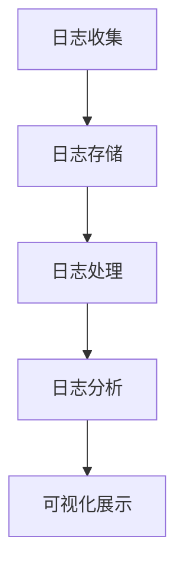
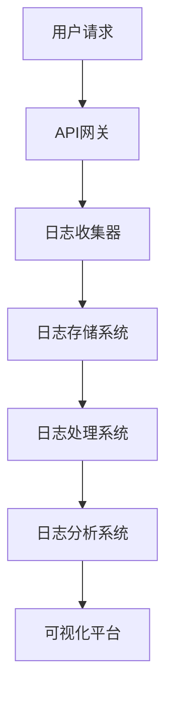
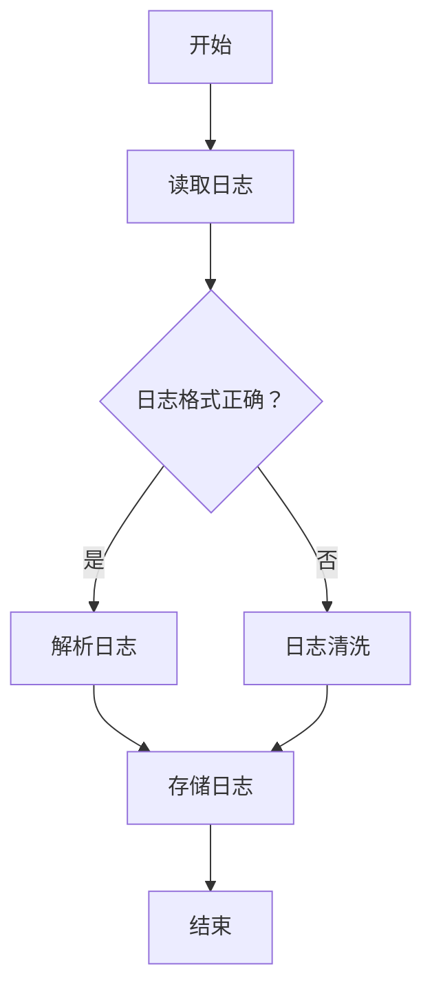

                 

## 日志集中化：便于LLM应用的问题排查

### 关键词：日志集中化、LLM应用、问题排查、数据处理、系统架构

> 摘要：本文将深入探讨日志集中化在LLM（大型语言模型）应用中的重要性，通过逐步分析日志集中化的背景、核心概念、挑战与机遇，阐述其在数据处理、系统架构设计以及实际应用中的关键作用。文章旨在为开发者提供一套完整的日志集中化解决方案，帮助他们在使用LLM进行问题排查时更加高效和精准。

----------------------------------------------------------------

## 目录大纲

```markdown
----------------------------------------------------------------

# 第一部分: 背景介绍

## 第1章: 问题背景与核心概念

### 1.1.1 日志集中化的意义

### 1.1.2 日志集中化的问题描述

### 1.1.3 日志集中化的解决方法

### 1.1.4 日志集中化的边界与外延

### 1.1.5 日志集中化的核心要素组成

## 1.2 核心概念与联系

### 1.2.1 日志数据的定义与类型

### 1.2.2 日志收集的基本原理

### 1.2.3 日志存储与处理技术

### 1.2.4 日志分析工具与平台

## 1.3 日志集中化应用场景

### 1.3.1 人工智能与日志集中化

### 1.3.2 大数据分析与日志集中化

### 1.3.3 运维监控与日志集中化

## 1.4 日志集中化的挑战与机遇

### 1.4.1 挑战一：海量日志的处理

### 1.4.2 挑战二：日志数据的安全与隐私

### 1.4.3 机遇一：日志驱动的智能运维

### 1.4.4 机遇二：日志集中化在LLM应用中的潜力

## 1.5 本章小结

----------------------------------------------------------------

# 第二部分: 日志收集

## 第2章: 日志收集原理与技巧

### 2.1.1 日志收集的基本概念

### 2.1.2 日志收集的方法

### 2.1.3 日志收集的挑战与应对策略

### 2.1.4 日志收集工具介绍

## 2.2 日志格式与编码

### 2.2.1 日志格式的标准与规范

### 2.2.2 日志格式的转换与处理

### 2.2.3 日志编码的方法

### 2.2.4 日志编码的实践

## 2.3 实战：日志收集实战案例

### 2.3.1 环境搭建

### 2.3.2 日志收集实现

### 2.3.3 日志数据预处理

### 2.3.4 日志收集效果评估

## 2.4 本章小结

----------------------------------------------------------------

# 第三部分: 日志存储

## 第3章: 日志存储方案与选型

### 3.1.1 日志存储的基本需求

### 3.1.2 日志存储的方案比较

### 3.1.3 日志存储的性能优化

### 3.1.4 日志存储的案例分析

## 3.2 日志存储系统架构

### 3.2.1 日志存储系统的设计原则

### 3.2.2 日志存储系统的架构

### 3.2.3 日志存储系统的组件

### 3.2.4 日志存储系统的接口设计

## 3.3 实战：日志存储实战案例

### 3.3.1 环境搭建

### 3.3.2 日志存储实现

### 3.3.3 日志存储性能测试

### 3.3.4 日志存储效果评估

## 3.4 本章小结

----------------------------------------------------------------

# 第四部分: 日志处理

## 第4章: 日志处理技术与方法

### 4.1.1 日志处理的基本概念

### 4.1.2 日志处理的流程

### 4.1.3 日志处理的挑战与优化策略

### 4.1.4 日志处理工具介绍

## 4.2 日志处理算法与模型

### 4.2.1 常见的日志处理算法

### 4.2.2 日志处理算法的优化

### 4.2.3 日志处理算法的案例分析

## 4.3 实战：日志处理实战案例

### 4.3.1 环境搭建

### 4.3.2 日志处理实现

### 4.3.3 日志处理效果评估

### 4.3.4 日志处理案例分析

## 4.4 本章小结

----------------------------------------------------------------

# 第五部分: 日志分析

## 第5章: 日志分析工具与应用

### 5.1.1 日志分析工具概述

### 5.1.2 常见的日志分析工具

### 5.1.3 日志分析工具的选择与配置

### 5.1.4 日志分析工具的实战应用

## 5.2 日志可视化

### 5.2.1 日志可视化的概念与作用

### 5.2.2 常见的日志可视化工具

### 5.2.3 日志可视化实战案例

### 

----------------------------------------------------------------

## 第一部分: 背景介绍

### 第1章: 问题背景与核心概念

#### 1.1.1 日志集中化的意义

在当今快速发展的信息技术时代，数据已成为企业核心资产。日志是记录系统运行状态、错误信息、操作行为等数据的重要组成部分，而日志集中化则是提高数据处理效率和系统运维水平的关键步骤。日志集中化不仅有助于实现数据的高效存储和管理，还能为复杂问题的排查提供有力的支持。

**日志集中化的意义**体现在以下几个方面：

1. **提高问题排查效率**：通过集中收集、存储和分析日志，能够快速定位和识别系统问题，缩短问题排查时间，提高系统稳定性。
2. **优化资源利用**：集中化处理能够减少各个系统独立存储日志带来的重复劳动，降低存储和计算资源的消耗。
3. **支持大数据分析**：集中化的日志数据为大数据分析提供了丰富的数据源，有助于企业从海量日志中挖掘潜在价值和业务洞察。
4. **强化安全监控**：通过集中化的日志管理，可以实时监控系统运行状态和安全事件，提升整体安全防护能力。

#### 1.1.2 日志集中化的问题描述

尽管日志集中化具有诸多优势，但在实际应用中仍面临一系列挑战：

1. **海量日志的处理**：随着系统规模的不断扩大，日志量呈指数级增长，如何高效处理海量日志数据成为关键问题。
2. **日志数据的安全与隐私**：日志中可能包含敏感信息，如何确保日志数据的存储和传输安全，防止数据泄露成为重要课题。
3. **日志存储的扩展性**：随着日志量的增加，如何进行存储方案的扩展和优化，以适应不断增长的存储需求。
4. **日志分析工具的选型**：市场上日志分析工具繁多，如何选择合适的工具进行日志处理和分析，以提高工作效率。

#### 1.1.3 日志集中化的解决方法

针对日志集中化面临的问题，可以采取以下解决方法：

1. **采用分布式存储方案**：分布式存储系统如HDFS、Elasticsearch等能够高效处理海量日志数据，提供高可用性和高扩展性。
2. **日志加密与访问控制**：通过加密技术和访问控制机制，确保日志数据在存储和传输过程中的安全性。
3. **日志处理优化**：采用高效日志处理算法和工具，如Logstash、Fluentd等，提高日志处理效率和性能。
4. **日志分析平台的构建**：构建集日志收集、存储、处理和分析于一体的日志分析平台，实现日志数据的统一管理和高效利用。

#### 1.1.4 日志集中化的边界与外延

日志集中化的边界主要涉及以下几个方面：

1. **日志收集**：包括日志的收集方法、格式、编码等，如何高效地从各个系统收集日志数据。
2. **日志存储**：涉及日志存储方案的选型、性能优化和扩展性设计，如何满足海量日志的存储需求。
3. **日志处理**：包括日志的处理流程、算法和工具，如何对日志数据进行高效处理和分析。
4. **日志分析**：日志分析工具的选择与配置，如何利用日志数据进行问题排查和业务洞察。

日志集中化的外延则包括：

1. **日志可视化**：通过可视化工具将日志数据以图形化形式展示，提高数据分析和问题排查的效率。
2. **日志驱动运维**：利用日志数据驱动自动化运维流程，实现运维工作的智能化和高效化。
3. **日志在人工智能中的应用**：将日志数据应用于人工智能算法，挖掘数据中的潜在价值。

#### 1.1.5 日志集中化的核心要素组成

日志集中化的核心要素包括：

1. **日志收集系统**：负责从各个系统中收集日志数据，并传输到集中存储系统。
2. **日志存储系统**：负责存储收集到的日志数据，并提供高效的查询接口。
3. **日志处理系统**：负责对日志数据进行预处理、分析和存储，为日志分析提供支持。
4. **日志分析系统**：负责对日志数据进行分析，提供问题排查和业务洞察的功能。
5. **日志可视化系统**：负责将日志数据以图形化形式展示，提高数据可读性和分析效率。

#### 1.2 核心概念与联系

**日志数据的定义与类型**

日志数据是记录系统运行状态、错误信息、操作行为等的文本文件。日志数据可以分为以下几种类型：

1. **系统日志**：记录系统运行过程中产生的信息，如启动、停止、错误等。
2. **应用日志**：记录应用程序运行过程中的信息，如请求、响应、错误等。
3. **安全日志**：记录系统安全事件，如登录、访问、异常等。

**日志收集的基本原理**

日志收集的基本原理包括以下几个步骤：

1. **日志生成**：系统或应用程序在运行过程中自动生成日志文件。
2. **日志传输**：通过文件传输、网络传输等方式将日志文件传输到集中存储系统。
3. **日志存储**：将收集到的日志数据存储到分布式存储系统中，如HDFS、Elasticsearch等。
4. **日志处理**：对日志数据进行预处理、清洗、存储等操作。

**日志存储与处理技术**

日志存储与处理技术主要包括：

1. **分布式存储**：如HDFS、Elasticsearch等，提供高效、可靠的日志存储能力。
2. **日志处理框架**：如Logstash、Fluentd等，提供日志收集、处理和传输的自动化解决方案。
3. **日志分析工具**：如Kibana、Grafana等，提供日志数据可视化和分析功能。

**日志分析工具与平台**

日志分析工具与平台包括：

1. **开源日志分析工具**：如Logstash、Fluentd、Kibana、Grafana等，提供日志数据收集、处理和可视化功能。
2. **商业日志分析平台**：如Splunk、Sumo Logic等，提供完整的日志分析解决方案。
3. **日志分析平台选型**：根据企业需求选择合适的日志分析工具或平台，实现高效日志管理。

#### 1.3 日志集中化应用场景

日志集中化在以下应用场景中具有重要价值：

1. **人工智能与日志集中化**：通过日志数据支持机器学习算法，实现智能运维和业务洞察。
2. **大数据分析与日志集中化**：利用日志数据源进行大数据分析，挖掘数据价值。
3. **运维监控与日志集中化**：通过日志集中化实现实时监控和问题排查，提高系统稳定性。
4. **安全监控与日志集中化**：利用日志数据实现实时安全监控，提升企业安全防护能力。

#### 1.4 日志集中化的挑战与机遇

**挑战一：海量日志的处理**

面对海量日志，需要采用分布式存储和处理技术，如HDFS、Elasticsearch等，实现高效日志处理。

**挑战二：日志数据的安全与隐私**

日志数据中可能包含敏感信息，需要通过加密、访问控制等技术确保数据安全。

**机遇一：日志驱动的智能运维**

通过日志数据支持智能运维，实现自动化问题排查和优化。

**机遇二：日志集中化在LLM应用中的潜力**

日志集中化在LLM（大型语言模型）应用中具有巨大潜力，通过日志数据支持LLM的训练和应用。

#### 1.5 本章小结

本章介绍了日志集中化的背景、核心概念、应用场景以及面临的挑战与机遇。日志集中化在提高问题排查效率、优化资源利用、支持大数据分析和强化安全监控方面具有重要意义。然而，在实际应用中，日志集中化仍面临海量日志处理、日志数据安全和隐私保护等挑战。通过采用分布式存储和处理技术、日志分析工具和平台，可以克服这些挑战，发挥日志集中化的潜力。

----------------------------------------------------------------

## 第二部分: 日志收集

### 第2章: 日志收集原理与技巧

#### 2.1.1 日志收集的基本概念

日志收集是指将系统或应用程序运行过程中产生的日志数据从各个节点或设备中提取、汇总并传输到集中存储系统或日志分析平台的过程。日志收集是日志管理的重要环节，它为后续的日志存储、处理和分析提供了基础数据。

**日志收集的基本概念包括：**

1. **日志源**：产生日志数据的系统或应用程序，如Web服务器、数据库、应用程序等。
2. **日志文件**：记录日志数据的文件，常见的日志文件格式包括文本文件、JSON文件等。
3. **日志收集器**：负责从日志源收集日志数据的程序或工具，如Logstash、Fluentd等。
4. **日志传输**：将收集到的日志数据传输到集中存储系统或日志分析平台的过程，常见传输方式包括文件传输、网络传输等。
5. **日志格式**：日志数据的组织形式和内容结构，常见的日志格式包括syslog、JSON、XML等。

#### 2.1.2 日志收集的方法

日志收集的方法主要包括以下几种：

1. **文件系统监控**：通过监控文件系统的变化，实时收集日志文件。
2. **网络传输**：通过网络协议（如TCP、UDP）将日志数据传输到集中存储系统或日志分析平台。
3. **日志代理**：部署在各个节点或设备上的代理程序，负责收集日志数据并传输到集中存储系统或日志分析平台。
4. **日志聚合器**：将多个日志源收集到的日志数据进行汇总、处理和传输。

**常见日志收集方法的特点如下：**

1. **文件系统监控**：实时性高，但需要依赖操作系统提供的文件监控机制，且可能影响系统性能。
2. **网络传输**：灵活性强，支持远程日志收集，但可能受到网络带宽和稳定性的影响。
3. **日志代理**：部署在各个节点或设备上，能够高效收集日志数据，但需要考虑代理的负载和性能。
4. **日志聚合器**：能够汇总多个日志源的数据，提高日志收集的效率，但需要具备较强的数据处理能力。

#### 2.1.3 日志收集的挑战与应对策略

在日志收集过程中，可能会遇到以下挑战：

1. **日志量巨大**：随着系统规模的扩大，日志量呈指数级增长，如何高效处理海量日志数据成为关键问题。
   - **应对策略**：采用分布式日志收集系统，如Logstash、Fluentd等，实现高效日志处理。

2. **日志格式多样**：不同系统或应用程序可能使用不同的日志格式，如何统一日志格式成为挑战。
   - **应对策略**：使用日志转换工具，如Logstash的Filter插件，将不同格式的日志转换为统一的格式。

3. **日志数据丢失**：在日志收集过程中，可能会出现日志数据丢失的问题。
   - **应对策略**：采用可靠的网络传输协议（如TCP）和日志收集器（如Fluentd）的重启机制，确保日志数据不丢失。

4. **日志数据安全**：日志数据中可能包含敏感信息，如何确保日志数据的安全传输和存储成为关键问题。
   - **应对策略**：使用加密技术（如SSL/TLS）保护日志数据在传输过程中的安全性，并采用严格的访问控制机制。

#### 2.1.4 日志收集工具介绍

常见的日志收集工具有以下几种：

1. **Logstash**：是Elastic Stack中的重要组件，能够从各种数据源收集日志数据，进行转换和过滤，然后将数据输出到Elasticsearch或Kibana等存储和分析工具中。
2. **Fluentd**：是另一种流行的日志收集器，支持多种数据源和输出目标，具有高效、可扩展的特点。
3. **Filebeat**：是Elastic Stack中的轻量级日志收集器，适用于从各个节点收集日志数据，并将其传输到Elasticsearch或Logstash等工具中。

**日志收集工具的选择依据：**

1. **系统需求**：根据系统的规模和日志量，选择适合的日志收集工具。
2. **性能要求**：考虑日志收集工具的处理能力和扩展性，确保能够满足系统需求。
3. **易用性**：选择易于部署、配置和维护的日志收集工具，降低运维成本。
4. **社区支持**：选择拥有活跃社区支持的日志收集工具，便于获取技术支持和解决问题。

#### 2.2 日志格式与编码

**日志格式的标准与规范**

日志格式的标准与规范对日志收集、存储和分析具有重要意义。常见的日志格式标准包括：

1. **syslog**：是一种广泛使用的日志格式，定义了日志数据的结构和标准，支持多级日志等级和设施分类。
2. **JSON**：是一种轻量级的数据交换格式，具有易于解析和扩展的特点，广泛应用于Web应用程序和系统日志。
3. **XML**：是一种具有严格结构的标记语言，能够表示复杂的日志数据结构，但解析和存储开销较大。

**日志格式的转换与处理**

在日志收集过程中，可能需要将不同格式的日志数据进行转换和整合，以便于存储和分析。常见的方法包括：

1. **正则表达式解析**：使用正则表达式提取日志字段，将不同格式的日志转换为统一的格式。
2. **脚本转换**：编写脚本（如Python、Shell）对日志文件进行处理和转换。
3. **日志转换工具**：使用专门的日志转换工具，如Logstash的Filter插件，对日志数据进行处理和转换。

**日志编码的方法**

日志编码是将日志数据转换为二进制格式的过程，常见的方法包括：

1. **UTF-8**：是一种可变长度的编码方式，支持广泛的字符集，常用于文本日志数据的编码。
2. **ASCII**：是一种单字节编码方式，仅支持英文字符和符号，适用于简单文本日志数据的编码。
3. **Base64**：是一种基于64个可打印字符的编码方式，可用于将二进制数据编码为文本形式，便于传输和存储。

**日志编码的实践**

在日志编码实践中，需要考虑以下几个方面：

1. **编码选择**：根据日志数据的类型和传输需求，选择合适的编码方式。
2. **编码一致性**：确保日志数据的编码一致性，避免在传输和存储过程中出现数据损坏或丢失。
3. **编码验证**：对编码后的日志数据进行验证，确保解码后能够正确还原原始日志数据。

#### 2.3 实战：日志收集实战案例

**2.3.1 环境搭建**

为了演示日志收集的实战案例，我们将在一个虚拟环境中搭建一个简单的日志收集系统，包括以下组件：

1. **Logstash**：作为日志收集器，用于收集、处理和传输日志数据。
2. **Elasticsearch**：作为日志数据的存储和分析工具。
3. **Kibana**：作为日志数据的可视化工具。

以下是环境搭建的步骤：

1. **安装虚拟机**：在虚拟机中安装Linux操作系统，如Ubuntu。
2. **安装Elasticsearch**：下载Elasticsearch安装包，按照官方文档进行安装和配置。
3. **安装Kibana**：下载Kibana安装包，按照官方文档进行安装和配置。
4. **安装Logstash**：下载Logstash安装包，按照官方文档进行安装和配置。

**2.3.2 日志收集实现**

我们将在虚拟机中部署一个简单的Web服务器，用于生成日志数据。以下是日志收集的实现步骤：

1. **部署Web服务器**：安装并配置一个Web服务器，如Nginx，并设置日志记录功能。
2. **配置Logstash输入插件**：在Logstash配置文件中配置输入插件，如Filebeat，用于从Web服务器收集日志数据。
3. **配置Logstash输出插件**：在Logstash配置文件中配置输出插件，如Elasticsearch，用于将收集到的日志数据传输到Elasticsearch中。
4. **启动Logstash**：启动Logstash服务，开始收集和传输日志数据。

**2.3.3 日志数据预处理**

在日志数据预处理过程中，我们需要对收集到的日志数据进行清洗、转换和索引。以下是日志数据预处理的步骤：

1. **清洗日志数据**：删除不必要的日志字段，如IP地址、用户名等。
2. **转换日志格式**：将不同格式的日志数据转换为统一的格式，如JSON。
3. **索引日志数据**：将预处理后的日志数据索引到Elasticsearch中，便于后续查询和分析。

**2.3.4 日志收集效果评估**

为了评估日志收集的效果，我们可以通过以下方式进行：

1. **日志数据查询**：在Kibana中查询和过滤日志数据，验证日志收集的正确性和完整性。
2. **日志数据可视化**：在Kibana中使用可视化工具，如Kibana Dashboard，将日志数据以图形化形式展示，便于分析和监控。
3. **日志处理性能测试**：通过模拟大规模日志数据的收集和处理，测试Logstash和Elasticsearch的处理能力和性能。

#### 2.4 本章小结

本章详细介绍了日志收集的基本概念、方法、挑战与应对策略以及日志格式和编码。通过实战案例，展示了如何使用Logstash、Elasticsearch和Kibana构建一个简单的日志收集系统，并实现了日志数据的收集、预处理和可视化。日志收集是日志管理的重要环节，对于系统的运维监控和问题排查具有重要意义。在实际应用中，需要根据系统的需求和特点选择合适的日志收集工具和方法，并应对日志收集过程中可能遇到的挑战。

----------------------------------------------------------------

## 第三部分: 日志存储

### 第3章: 日志存储方案与选型

#### 3.1.1 日志存储的基本需求

日志存储是日志管理的重要环节，其基本需求包括以下几点：

1. **数据可靠性**：确保日志数据的完整性和一致性，防止数据丢失或损坏。
2. **数据可扩展性**：能够随着日志量的增长进行水平扩展，以适应大规模数据存储需求。
3. **数据高性能**：提供高效的日志写入、查询和访问性能，以满足实时监控和数据分析需求。
4. **数据安全性**：采用加密和访问控制机制，保障日志数据的安全性和隐私。
5. **数据可维护性**：易于部署、配置和维护，降低运维成本。

#### 3.1.2 日志存储的方案比较

常见的日志存储方案包括以下几种：

1. **文件系统存储**：基于传统的文件系统，如NFS、HDFS等，提供高可靠性、可扩展性的日志存储方案。缺点是性能较低，不适合大规模实时日志存储。

2. **关系型数据库存储**：如MySQL、PostgreSQL等，提供结构化数据存储和管理功能。缺点是扩展性较差，不适合大规模日志存储。

3. **NoSQL数据库存储**：如MongoDB、Cassandra等，提供高性能、可扩展的日志存储方案。缺点是数据结构化程度较低，查询性能受限于索引。

4. **分布式日志存储系统**：如Elasticsearch、Logstash、Kafka等，提供高效的日志收集、存储和分析功能。优点是高可用性、可扩展性和高性能，适合大规模日志存储。

**常见日志存储方案的特点如下：**

1. **文件系统存储**：简单易用，支持大文件存储，但性能较低，不适合实时日志存储。
2. **关系型数据库存储**：结构化数据管理，支持复杂查询，但扩展性较差。
3. **NoSQL数据库存储**：高性能、可扩展，但数据结构化程度较低。
4. **分布式日志存储系统**：高可用性、可扩展性和高性能，适合大规模实时日志存储。

#### 3.1.3 日志存储的性能优化

为了提高日志存储的性能，可以采取以下优化策略：

1. **数据分片**：将日志数据分片存储到多个节点，实现负载均衡和高可用性。
2. **索引优化**：采用合适的索引策略，提高日志查询性能。
3. **缓存机制**：使用缓存技术，减少对磁盘的读写次数，提高日志写入和查询速度。
4. **IO优化**：优化磁盘IO性能，如使用RAID阵列、SSD硬盘等。
5. **网络优化**：优化日志传输网络，如使用专用网络、优化网络协议等。

**日志存储性能优化的实践**：

1. **选择合适的存储方案**：根据日志数据特点和存储需求，选择适合的日志存储方案，如分布式日志存储系统。
2. **优化存储结构**：合理设计日志数据的存储结构，如使用合适的文件格式和索引策略。
3. **监控和调整**：实时监控日志存储性能，根据性能指标进行调优。

#### 3.1.4 日志存储的案例分析

以下是一个日志存储的案例分析：

**案例背景**：某大型互联网公司需要存储和管理海量日志数据，包括系统日志、应用日志和安全日志等。

**解决方案**：

1. **采用分布式日志存储系统**：使用Elasticsearch作为日志存储系统，提供高效的日志写入、查询和访问性能。
2. **日志数据分片**：将日志数据分片存储到多个节点，实现负载均衡和高可用性。
3. **日志数据索引**：采用合适的索引策略，如时间字段索引、关键字索引等，提高日志查询性能。
4. **缓存机制**：使用Redis缓存热点数据，减少对磁盘的读写次数，提高日志写入和查询速度。
5. **监控和优化**：实时监控日志存储性能，根据性能指标进行调优。

**效果评估**：

1. **高效存储和管理**：Elasticsearch能够高效存储和管理海量日志数据，提供快速查询和访问能力。
2. **高可用性和可扩展性**：日志数据分片存储实现负载均衡和高可用性，可扩展性得到保障。
3. **性能优化**：通过索引优化、缓存机制和监控调整，日志存储性能得到显著提升。

#### 3.2 日志存储系统架构

日志存储系统架构主要包括以下组件：

1. **日志收集器**：负责从各个系统或设备收集日志数据，并将其传输到日志存储系统。
2. **日志存储节点**：负责存储和管理日志数据，如Elasticsearch节点。
3. **日志处理节点**：负责对日志数据进行处理和分析，如Logstash节点。
4. **日志检索和分析工具**：如Kibana、Grafana等，提供日志数据的查询和分析功能。

**日志存储系统架构设计原则**：

1. **分布式架构**：采用分布式架构，提高系统的可用性和扩展性。
2. **高可靠性**：确保日志数据的可靠存储，防止数据丢失或损坏。
3. **高性能**：提供高效的日志写入、查询和访问性能，满足实时监控和数据分析需求。
4. **安全性**：采用加密和访问控制机制，保障日志数据的安全性和隐私。

**日志存储系统架构的设计步骤**：

1. **需求分析**：分析系统需求和日志数据特点，确定日志存储系统的功能和技术架构。
2. **系统设计**：设计日志收集、存储、处理和检索的整体架构，确定各组件的功能和接口。
3. **组件选型**：选择合适的日志收集、存储、处理和检索工具，如Elasticsearch、Logstash等。
4. **性能优化**：根据系统性能需求，进行存储结构、索引策略和缓存机制的优化。
5. **安全性设计**：采用加密和访问控制机制，确保日志数据的安全性和隐私。

#### 3.3 日志存储系统的组件

**日志收集器**

日志收集器是日志存储系统的关键组件，负责从各个系统或设备收集日志数据。常见日志收集器包括：

1. **Logstash**：是一种强大的日志收集和解析工具，支持多种输入输出插件，能够将日志数据转换为统一格式并传输到日志存储系统。
2. **Fluentd**：是另一种流行的日志收集器，支持多种数据源和输出目标，具有高效、可扩展的特点。
3. **Filebeat**：是Elastic Stack中的轻量级日志收集器，适用于从各个节点收集日志数据，并将其传输到Elasticsearch或Logstash等工具中。

**日志存储节点**

日志存储节点是日志存储系统的核心组件，负责存储和管理日志数据。常见日志存储节点包括：

1. **Elasticsearch**：是一种分布式、RESTful搜索引擎，提供高效的日志存储和查询功能。
2. **Kafka**：是一种高吞吐量的消息队列系统，适用于大规模日志数据的实时处理和传输。
3. **HDFS**：是Hadoop分布式文件系统，提供高可靠性、高扩展性的日志存储方案。

**日志处理节点**

日志处理节点负责对日志数据进行处理和分析，常见日志处理节点包括：

1. **Logstash**：除了收集日志数据外，还能够对日志数据进行过滤、转换和解析，提供高效的数据处理能力。
2. **Fluentd**：同样具有数据处理能力，能够对日志数据进行过滤、转换和路由。
3. **Kibana**：提供日志数据的可视化功能，支持自定义仪表板和报告。

**日志检索和分析工具**

日志检索和分析工具是日志存储系统的用户界面，提供日志数据的查询和分析功能。常见日志检索和分析工具包括：

1. **Kibana**：是Elastic Stack中的重要组件，提供丰富的可视化功能，支持自定义仪表板和报告。
2. **Grafana**：是一种开源的监控和分析工具，支持多种数据源和可视化插件。
3. **Splunk**：是一种商业的日志分析平台，提供强大的搜索、分析和可视化功能。

#### 3.4 日志存储系统的接口设计

日志存储系统的接口设计主要包括以下方面：

1. **API接口**：提供RESTful API接口，支持日志数据的写入、查询和访问。
2. **数据格式**：定义日志数据的标准格式，如JSON、XML等，便于数据处理和解析。
3. **认证与授权**：采用认证和授权机制，确保日志数据的访问安全。
4. **数据传输**：采用高效的数据传输协议，如HTTP、FTP等，提高日志传输速度。
5. **错误处理**：定义日志数据传输和存储过程中的错误处理机制，确保数据的完整性和一致性。

**日志存储系统接口设计的原则**：

1. **简洁性**：接口设计应简洁明了，易于理解和使用。
2. **易扩展性**：接口设计应具备良好的扩展性，支持不同类型日志数据的处理。
3. **安全性**：采用安全的传输协议和认证机制，确保日志数据的安全性和隐私。
4. **高性能**：优化接口性能，提高日志数据的写入、查询和访问速度。
5. **兼容性**：支持不同版本的日志数据和接口规范，确保系统的兼容性和稳定性。

#### 3.5 实战：日志存储实战案例

**3.5.1 环境搭建**

为了演示日志存储的实战案例，我们将使用Elastic Stack（包括Elasticsearch、Logstash和Kibana）构建一个简单的日志存储系统。以下是环境搭建的步骤：

1. **安装虚拟机**：在虚拟机中安装Linux操作系统，如Ubuntu。
2. **安装Elasticsearch**：下载Elasticsearch安装包，按照官方文档进行安装和配置。
3. **安装Logstash**：下载Logstash安装包，按照官方文档进行安装和配置。
4. **安装Kibana**：下载Kibana安装包，按照官方文档进行安装和配置。

**3.5.2 日志存储实现**

我们将在虚拟机中部署一个简单的Web服务器，用于生成日志数据。以下是日志存储的实现步骤：

1. **部署Web服务器**：安装并配置一个Web服务器，如Nginx，并设置日志记录功能。
2. **配置Logstash输入插件**：在Logstash配置文件中配置输入插件，如Filebeat，用于从Web服务器收集日志数据。
3. **配置Logstash输出插件**：在Logstash配置文件中配置输出插件，如Elasticsearch，用于将收集到的日志数据传输到Elasticsearch中。
4. **启动Logstash**：启动Logstash服务，开始收集和传输日志数据。

**3.5.3 日志存储性能测试**

为了评估日志存储的性能，我们可以通过以下方式进行性能测试：

1. **日志写入性能测试**：模拟大规模日志数据的写入，测试Elasticsearch的写入速度和延迟。
2. **日志查询性能测试**：模拟日志数据的查询操作，测试Elasticsearch的查询速度和性能。
3. **日志数据规模测试**：逐步增加日志数据规模，测试Elasticsearch的扩展性和稳定性。

**3.5.4 日志存储效果评估**

为了评估日志存储的效果，我们可以通过以下方式进行效果评估：

1. **日志数据完整性验证**：通过对比原始日志数据和存储在Elasticsearch中的日志数据，验证日志数据的完整性和一致性。
2. **日志数据查询和分析**：在Kibana中使用可视化工具，查询和分析日志数据，验证日志存储和检索功能的正确性。
3. **日志存储性能评估**：根据日志写入、查询和扩展性测试的结果，评估日志存储系统的性能和稳定性。

#### 3.6 本章小结

本章详细介绍了日志存储的基本需求、方案比较、性能优化、系统架构、组件设计以及接口设计。通过实战案例，展示了如何使用Elastic Stack构建一个简单的日志存储系统，并实现了日志数据的收集、存储和检索。日志存储是日志管理的重要环节，对于系统的实时监控、问题排查和数据分析具有重要意义。在实际应用中，需要根据系统的需求和特点选择合适的日志存储方案，并采取有效的性能优化措施，确保日志存储系统的可靠性和高效性。

----------------------------------------------------------------

## 第四部分: 日志处理

### 第4章: 日志处理技术与方法

#### 4.1.1 日志处理的基本概念

日志处理是指对收集到的日志数据进行清洗、转换、归一化、聚合等操作，以便于存储和分析。日志处理在日志管理中扮演着关键角色，其基本概念包括以下几个方面：

1. **日志清洗**：指对原始日志数据进行去噪、错误修复、数据格式转换等操作，以提高日志数据的质量和一致性。
2. **日志转换**：指将不同格式的日志数据转换为统一格式，如将文本日志转换为JSON格式，以便于后续处理和分析。
3. **日志归一化**：指将不同来源或不同时间戳的日志数据进行归一化处理，如统一时间格式、字段命名等。
4. **日志聚合**：指对日志数据进行分组、统计和汇总，以提取有用的信息，如统计某个时间段内错误日志的数量。
5. **日志存储**：指将处理后的日志数据存储到数据库或日志存储系统中，以便于后续查询和分析。

**日志处理的基本流程**：

1. **日志收集**：从各个系统和设备中收集日志数据。
2. **日志清洗**：对收集到的日志数据进行清洗，去除无效或错误的数据。
3. **日志转换**：将清洗后的日志数据转换为统一的格式。
4. **日志归一化**：对日志数据进行归一化处理，确保字段命名和时间格式的一致性。
5. **日志聚合**：对日志数据进行分组和汇总，提取有用的信息。
6. **日志存储**：将处理后的日志数据存储到数据库或日志存储系统中。

#### 4.1.2 日志处理的流程

日志处理的流程可以分为以下几个步骤：

1. **日志收集**：从各个系统和设备中收集日志数据，可以使用日志收集工具如Logstash、Fluentd等。
2. **日志预处理**：对收集到的日志数据进行预处理，包括去噪、格式转换、去除重复数据等。
3. **日志清洗**：对预处理后的日志数据进行清洗，修复数据错误，确保数据的质量。
4. **日志转换**：将清洗后的日志数据转换为统一的格式，如JSON、XML等。
5. **日志存储**：将转换后的日志数据存储到数据库或日志存储系统中，以便于后续查询和分析。
6. **日志分析**：对存储后的日志数据进行分析，提取有用的信息，如统计错误日志的数量、趋势等。

**日志处理流程的优点**：

1. **提高日志数据质量**：通过清洗、转换和归一化操作，确保日志数据的一致性和准确性。
2. **便于日志存储和管理**：统一格式的日志数据便于存储和管理，降低存储和检索的复杂性。
3. **便于日志分析**：处理后的日志数据可以直接进行统计和分析，提取有价值的信息。
4. **提高系统性能**：通过高效的处理流程，提高日志处理和查询的效率，降低系统负载。

#### 4.1.3 日志处理的挑战与优化策略

在日志处理过程中，可能会遇到以下挑战：

1. **日志数据量大**：随着系统规模的扩大，日志数据量呈指数级增长，如何高效处理海量日志数据成为关键问题。
   - **优化策略**：采用分布式日志处理框架，如Apache Flink、Apache Spark等，实现并行处理和负载均衡。
2. **日志格式多样**：不同系统和设备产生的日志格式可能不同，如何统一格式成为挑战。
   - **优化策略**：使用日志转换工具，如Logstash的Filter插件，将不同格式的日志转换为统一的格式。
3. **日志数据安全**：日志数据中可能包含敏感信息，如何确保日志数据的安全传输和存储成为关键问题。
   - **优化策略**：采用加密技术（如SSL/TLS）保护日志数据在传输过程中的安全性，并采用严格的访问控制机制。
4. **日志处理效率**：如何提高日志处理速度和效率，降低系统负载。
   - **优化策略**：采用高效的日志处理算法和工具，如Logstash、Fluentd等，提高日志处理速度。
5. **日志存储扩展性**：随着日志数据的增加，如何进行存储方案的扩展和优化。
   - **优化策略**：采用分布式存储系统，如HDFS、Elasticsearch等，实现高效存储和扩展性。

#### 4.1.4 日志处理工具介绍

常见的日志处理工具有以下几种：

1. **Logstash**：是Elastic Stack中的重要组件，能够从各种数据源收集日志数据，进行转换和过滤，然后将数据输出到Elasticsearch或Kibana等存储和分析工具中。
   - **优点**：支持多种数据源和输出目标，具有强大的过滤和转换功能。
   - **缺点**：配置复杂，性能较其他工具较低。

2. **Fluentd**：是另一种流行的日志处理工具，支持多种数据源和输出目标，具有高效、可扩展的特点。
   - **优点**：配置简单，性能较好，适合中小规模日志处理。
   - **缺点**：不支持复杂的过滤和转换功能。

3. **Filebeat**：是Elastic Stack中的轻量级日志处理工具，适用于从各个节点收集日志数据，并将其传输到Elasticsearch或Logstash等工具中。
   - **优点**：配置简单，性能优秀，支持多平台部署。
   - **缺点**：功能相对单一，不支持复杂的日志处理。

4. **Apache Kafka**：是一种分布式消息队列系统，适用于大规模日志数据的实时处理和传输。
   - **优点**：高吞吐量、可扩展性强，支持实时处理。
   - **缺点**：日志处理功能较弱，需要与其他工具配合使用。

**日志处理工具的选择依据**：

1. **系统需求**：根据系统的规模和日志量，选择适合的日志处理工具。
2. **性能要求**：考虑日志处理工具的处理能力和扩展性，确保能够满足系统需求。
3. **易用性**：选择易于部署、配置和维护的日志处理工具，降低运维成本。
4. **社区支持**：选择拥有活跃社区支持的日志处理工具，便于获取技术支持和解决问题。

#### 4.2 日志处理算法与模型

**4.2.1 常见的日志处理算法**

日志处理算法是日志处理过程中的核心，常见的日志处理算法包括：

1. **日志聚合算法**：用于对日志数据进行分组和汇总，如计数、求和、平均值等。常用的日志聚合算法有MapReduce、Apache Flink等。
   - **应用场景**：用于统计日志数据中的关键指标，如请求次数、响应时间等。
   - **算法原理**：通过将日志数据映射到key-value对，对相同key的日志数据进行聚合处理。

2. **日志清洗算法**：用于对日志数据进行清洗和去噪，如去除重复数据、修复错误等。常用的日志清洗算法有正则表达式匹配、模式识别等。
   - **应用场景**：用于提高日志数据的质量和一致性，为后续分析提供可靠的数据基础。
   - **算法原理**：通过对日志数据进行模式匹配和规则判断，去除无效或错误的数据。

3. **日志分类算法**：用于对日志数据进行分类，如基于机器学习的分类算法。常用的日志分类算法有KNN、SVM、决策树等。
   - **应用场景**：用于识别不同类型的日志数据，如系统日志、应用日志等。
   - **算法原理**：通过训练模型，将日志数据映射到不同的类别。

4. **日志异常检测算法**：用于检测日志数据中的异常行为，如基于统计分析和机器学习的异常检测算法。常用的日志异常检测算法有基于阈值的检测、聚类检测等。
   - **应用场景**：用于监控系统运行状态，及时发现异常事件。
   - **算法原理**：通过比较日志数据与正常行为的标准，识别异常行为。

**4.2.2 日志处理算法的优化**

日志处理算法的优化是提高日志处理效率和性能的关键。常见的优化策略包括：

1. **并行处理**：通过分布式计算框架，如MapReduce、Apache Flink等，实现并行处理，提高日志处理速度。
   - **应用场景**：适用于大规模日志数据处理。
   - **优化原理**：通过将日志数据分布到多个节点处理，实现并行计算。

2. **数据缓存**：使用缓存技术，如Redis、Memcached等，减少对磁盘的读写次数，提高日志处理速度。
   - **应用场景**：适用于高频次、高并发的日志处理。
   - **优化原理**：通过将常用数据缓存到内存中，减少磁盘IO操作。

3. **索引优化**：通过优化索引策略，提高日志查询和访问速度。
   - **应用场景**：适用于大规模日志数据的快速查询。
   - **优化原理**：通过建立合适的索引结构，降低查询时间。

4. **数据压缩**：采用数据压缩技术，如Gzip、LZ4等，减少日志数据存储和传输的开销。
   - **应用场景**：适用于存储和传输大量日志数据。
   - **优化原理**：通过将数据压缩为较小的格式，降低存储和传输开销。

**4.2.3 日志处理算法的案例分析**

以下是一个日志处理算法的案例分析：

**案例背景**：某互联网公司需要处理海量日志数据，包括系统日志、应用日志和安全日志等。公司希望实时分析日志数据，识别异常行为和潜在问题。

**解决方案**：

1. **日志收集**：使用Fluentd从各个系统和设备中收集日志数据，并将其传输到Kafka中。
2. **日志预处理**：使用Kafka Streams对日志数据进行预处理，包括去噪、格式转换和去重等。
3. **日志分类**：使用机器学习算法（如决策树）对日志数据进行分类，识别不同类型的日志数据。
4. **日志异常检测**：使用基于统计分析和聚类算法的异常检测模型，对日志数据进行异常检测。
5. **日志存储**：将处理后的日志数据存储到Elasticsearch中，便于后续查询和分析。

**效果评估**：

1. **高效处理**：通过分布式计算和缓存技术，实现高效日志处理，降低系统负载。
2. **实时分析**：通过实时处理和异常检测，快速识别异常行为和潜在问题，提高系统稳定性。
3. **数据质量**：通过日志清洗和分类，提高日志数据的质量和一致性，为后续分析提供可靠的数据基础。

#### 4.3 实战：日志处理实战案例

**4.3.1 环境搭建**

为了演示日志处理的实战案例，我们将使用Kafka、Fluentd和Elasticsearch构建一个简单的日志处理系统。以下是环境搭建的步骤：

1. **安装虚拟机**：在虚拟机中安装Linux操作系统，如Ubuntu。
2. **安装Kafka**：下载Kafka安装包，按照官方文档进行安装和配置。
3. **安装Fluentd**：下载Fluentd安装包，按照官方文档进行安装和配置。
4. **安装Elasticsearch**：下载Elasticsearch安装包，按照官方文档进行安装和配置。
5. **安装Kibana**：下载Kibana安装包，按照官方文档进行安装和配置。

**4.3.2 日志处理实现**

我们将在虚拟机中部署一个简单的Web服务器，用于生成日志数据。以下是日志处理的实现步骤：

1. **部署Web服务器**：安装并配置一个Web服务器，如Nginx，并设置日志记录功能。
2. **配置Fluentd输入插件**：在Fluentd配置文件中配置输入插件，如Tail，用于从Web服务器收集日志数据。
3. **配置Fluentd输出插件**：在Fluentd配置文件中配置输出插件，如Kafka，用于将收集到的日志数据传输到Kafka中。
4. **配置Kafka Streams**：使用Kafka Streams对日志数据进行预处理、分类和异常检测。
5. **配置Elasticsearch输出插件**：在Fluentd配置文件中配置输出插件，如Elasticsearch，用于将处理后的日志数据存储到Elasticsearch中。

**4.3.3 日志处理效果评估**

为了评估日志处理的效果，我们可以通过以下方式进行效果评估：

1. **日志数据完整性验证**：通过对比原始日志数据和存储在Elasticsearch中的日志数据，验证日志数据的完整性和一致性。
2. **日志数据查询和分析**：在Kibana中使用可视化工具，查询和分析日志数据，验证日志处理和存储功能的正确性。
3. **日志处理性能评估**：通过模拟大规模日志数据的处理，测试Kafka、Fluentd和Elasticsearch的处理能力和性能。

**4.3.4 日志处理案例分析**

以下是一个日志处理案例的分析：

**案例背景**：某互联网公司需要实时处理海量Web服务器日志，识别异常访问行为和潜在的安全威胁。

**解决方案**：

1. **日志收集**：使用Fluentd从Nginx服务器中收集日志数据，并将其传输到Kafka中。
2. **日志预处理**：使用Kafka Streams对日志数据进行清洗、格式转换和去重，提高日志数据质量。
3. **日志分类**：使用决策树算法对日志数据进行分类，识别不同类型的访问日志。
4. **日志异常检测**：使用基于聚类算法的异常检测模型，识别异常访问行为。
5. **日志存储**：将处理后的日志数据存储到Elasticsearch中，便于后续查询和分析。

**效果评估**：

1. **高效处理**：通过分布式计算和缓存技术，实现高效日志处理，降低系统负载。
2. **实时分析**：通过实时处理和异常检测，快速识别异常行为和潜在威胁，提高系统安全性。
3. **数据质量**：通过日志清洗和分类，提高日志数据的质量和一致性，为后续分析提供可靠的数据基础。

#### 4.4 本章小结

本章详细介绍了日志处理的基本概念、流程、挑战与优化策略以及日志处理工具和算法。通过实战案例，展示了如何使用Kafka、Fluentd和Elasticsearch构建一个简单的日志处理系统，并实现了日志数据的收集、预处理、分类、异常检测和存储。日志处理是日志管理的重要环节，对于系统的实时监控、问题排查和数据分析具有重要意义。在实际应用中，需要根据系统的需求和特点选择合适的日志处理工具和方法，并采取有效的优化策略，确保日志处理系统的可靠性和高效性。

----------------------------------------------------------------

## 第五部分: 日志分析

### 第5章: 日志分析工具与应用

#### 5.1.1 日志分析工具概述

日志分析工具是用于对日志数据进行收集、存储、处理和分析的一整套软件工具。日志分析工具的核心功能包括：

1. **日志数据收集**：从各种来源（如Web服务器、数据库、应用程序等）收集日志数据。
2. **日志数据存储**：将收集到的日志数据存储到数据库或日志存储系统中，便于后续查询和分析。
3. **日志数据处理**：对日志数据进行清洗、转换和归一化，提高日志数据的质量和一致性。
4. **日志数据查询**：提供高效的日志数据查询功能，支持关键字搜索、时间范围查询等。
5. **日志数据分析**：通过统计、图表和报告，对日志数据进行分析，提取有价值的信息。
6. **日志数据可视化**：将日志数据以图形化形式展示，提高数据分析的可读性和直观性。

常见的日志分析工具包括以下几种：

1. **Kibana**：是Elastic Stack中的重要组件，提供强大的日志数据可视化和分析功能，与Elasticsearch紧密集成。
2. **Grafana**：是一种开源的监控和分析工具，支持多种数据源和可视化插件，广泛应用于日志数据分析。
3. **Splunk**：是一种商业的日志分析平台，提供强大的搜索、分析和可视化功能，适用于大规模日志数据分析。
4. **Logstash**：是Elastic Stack中的日志收集和处理工具，能够对日志数据进行转换、过滤和路由，然后输出到不同的存储和分析工具中。
5. **Fluentd**：是另一种流行的日志收集和处理工具，支持多种数据源和输出目标，具有高效、可扩展的特点。

#### 5.1.2 常见的日志分析工具

**Kibana**

Kibana是Elastic Stack中的关键组件，与Elasticsearch紧密集成，提供强大的日志数据可视化和分析功能。Kibana的主要特性包括：

1. **数据可视化**：支持多种图表和报告，如柱状图、折线图、饼图等，能够直观地展示日志数据。
2. **实时分析**：支持实时数据流处理和实时查询，能够快速响应用户操作，提供实时日志分析。
3. **仪表板**：提供自定义仪表板功能，可以将多个图表和报告整合到一个页面中，便于集中管理和监控。
4. **日志数据查询**：支持丰富的查询语言，如Lucene查询语法，能够实现复杂的日志数据查询。
5. **自定义插件**：支持自定义插件开发，扩展Kibana的功能。

**Grafana**

Grafana是一种开源的监控和分析工具，支持多种数据源和可视化插件，广泛应用于日志数据分析。Grafana的主要特性包括：

1. **多数据源支持**：支持多种数据源，如Elasticsearch、InfluxDB、PostgreSQL等，能够与多种日志存储系统集成。
2. **数据可视化**：支持丰富的图表和报告，如折线图、柱状图、仪表盘等，能够直观地展示日志数据。
3. **告警和监控**：支持实时告警和监控，能够及时发现异常事件，并提供告警通知。
4. **自定义模板**：支持自定义模板和仪表板，方便用户根据需求进行定制。
5. **社区支持**：拥有庞大的社区支持，提供丰富的插件和资源。

**Splunk**

Splunk是一种商业的日志分析平台，提供强大的搜索、分析和可视化功能，适用于大规模日志数据分析。Splunk的主要特性包括：

1. **强大的搜索功能**：支持复杂的查询语言，能够快速搜索和分析海量日志数据。
2. **实时分析**：支持实时数据流处理，能够实时分析日志数据，提供实时监控和告警。
3. **多维分析**：支持多维数据分析，能够从多个维度对日志数据进行分析，提取有价值的信息。
4. **报告和仪表板**：提供丰富的报告和仪表板功能，能够将日志数据分析结果以图形化形式展示。
5. **自定义开发**：支持自定义开发和插件扩展，扩展平台的功能。

**Logstash**

Logstash是Elastic Stack中的日志收集和处理工具，能够对日志数据进行转换、过滤和路由，然后输出到不同的存储和分析工具中。Logstash的主要特性包括：

1. **日志收集**：支持从各种来源（如文件系统、网络流、API等）收集日志数据。
2. **日志转换**：支持对日志数据进行转换、过滤和归一化，提高日志数据的质量和一致性。
3. **日志路由**：支持将日志数据输出到不同的存储和分析工具中，如Elasticsearch、Kafka等。
4. **插件化**：支持丰富的插件，扩展Logstash的功能，如输入插件、输出插件、过滤器等。
5. **高可用性**：支持分布式部署和高可用性，确保日志数据的可靠收集和处理。

**Fluentd**

Fluentd是另一种流行的日志收集和处理工具，支持多种数据源和输出目标，具有高效、可扩展的特点。Fluentd的主要特性包括：

1. **日志收集**：支持从各种来源（如文件系统、网络流、API等）收集日志数据。
2. **日志转换**：支持对日志数据进行转换、过滤和归一化，提高日志数据的质量和一致性。
3. **日志路由**：支持将日志数据输出到不同的存储和分析工具中，如Elasticsearch、Kafka等。
4. **插件化**：支持丰富的插件，扩展Fluentd的功能，如输入插件、输出插件、过滤器等。
5. **高可用性**：支持分布式部署和高可用性，确保日志数据的可靠收集和处理。

#### 5.1.3 日志分析工具的选择与配置

选择合适的日志分析工具是日志分析系统成功的关键。以下是一些选择日志分析工具的依据：

1. **系统需求**：根据系统的规模和日志量，选择适合的日志分析工具。对于中小规模系统，可以选择Kibana、Grafana等；对于大规模系统，可以选择Splunk、Elastic Stack等。
2. **性能要求**：考虑日志分析工具的处理能力和扩展性，确保能够满足系统需求。对于高性能需求，可以选择Splunk、Elastic Stack等；对于中小规模需求，可以选择Kibana、Grafana等。
3. **易用性**：选择易于部署、配置和维护的日志分析工具，降低运维成本。对于易用性要求，可以选择Kibana、Grafana等；对于专业级需求，可以选择Splunk、Elastic Stack等。
4. **社区支持**：选择拥有活跃社区支持的日志分析工具，便于获取技术支持和解决问题。对于社区支持要求，可以选择Kibana、Grafana、Splunk等。

日志分析工具的配置包括以下几个方面：

1. **数据源配置**：配置日志分析工具的数据源，如Elasticsearch、Kafka、PostgreSQL等，确保日志数据能够正确收集和存储。
2. **日志收集器配置**：配置日志收集器，如Logstash、Fluentd等，确保日志数据能够正确收集和传输。
3. **日志处理和过滤配置**：配置日志处理和过滤规则，如Logstash的Filter插件、Fluentd的Tag规则等，确保日志数据能够正确处理和过滤。
4. **日志存储和索引配置**：配置日志存储和索引策略，如Elasticsearch的索引模板、Kafka的分区和副本等，确保日志数据能够高效存储和检索。
5. **日志可视化配置**：配置日志可视化仪表板和报告，如Kibana的Kibana Dashboard、Grafana的Graphite Dashboard等，确保日志数据能够直观地展示。

**最佳实践**

1. **统一日志格式**：确保所有系统的日志格式一致，便于日志收集、处理和分析。
2. **日志加密传输**：采用加密技术（如SSL/TLS）保护日志数据在传输过程中的安全性。
3. **日志数据备份和恢复**：定期备份日志数据，确保数据不丢失，并制定数据恢复策略。
4. **日志数据监控**：实时监控日志数据收集、处理和存储的状态，及时发现和处理问题。

#### 5.1.4 日志分析工具的实战应用

以下是一个日志分析工具的实战应用案例：

**案例背景**：某互联网公司需要实时监控和日志分析其Web服务器的运行状态，及时发现和处理异常事件。

**解决方案**：

1. **日志收集**：使用Fluentd从Web服务器收集日志数据，并将其传输到Kafka中。
2. **日志处理**：使用Kafka Streams对日志数据进行预处理、过滤和分类，提高日志数据质量。
3. **日志存储**：将处理后的日志数据存储到Elasticsearch中，便于后续查询和分析。
4. **日志分析**：使用Kibana和Grafana构建日志分析平台，实时监控和日志分析Web服务器的运行状态。

**实现步骤**：

1. **安装和配置Fluentd**：在Web服务器上安装和配置Fluentd，配置输入插件（如Tail）和输出插件（如Kafka）。
2. **安装和配置Kafka**：在Kafka集群中安装和配置Kafka，确保能够正确接收和存储日志数据。
3. **安装和配置Kafka Streams**：在Kafka集群中安装和配置Kafka Streams，配置处理规则和输出目标（如Elasticsearch）。
4. **安装和配置Elasticsearch**：在Elasticsearch集群中安装和配置Elasticsearch，配置索引模板和日志存储策略。
5. **安装和配置Kibana**：在Kibana服务器上安装和配置Kibana，配置数据源（如Elasticsearch）和可视化仪表板。
6. **安装和配置Grafana**：在Grafana服务器上安装和配置Grafana，配置数据源（如Elasticsearch）和可视化仪表板。

**效果评估**：

1. **实时监控**：通过Kibana和Grafana，实时监控Web服务器的运行状态，及时发现和处理异常事件。
2. **日志分析**：通过Kibana和Grafana，对日志数据进行分析，提取有价值的信息，为运维和开发提供支持。
3. **系统性能**：通过日志分析，识别系统瓶颈和性能问题，进行优化和调优，提高系统稳定性。

#### 5.2 日志可视化

**5.2.1 日志可视化的概念与作用**

日志可视化是指将日志数据以图形化形式展示，提高数据分析和问题排查的可读性和直观性。日志可视化在日志分析中具有重要作用：

1. **数据可视化**：通过图表和报告，将复杂的日志数据以直观的形式展示，便于用户理解和分析。
2. **问题排查**：通过可视化工具，快速定位和识别系统问题，缩短问题排查时间，提高运维效率。
3. **实时监控**：通过实时数据流处理和可视化，实时监控系统运行状态，及时发现和处理异常事件。
4. **数据洞察**：通过日志数据可视化，从海量日志中提取有价值的信息，支持业务决策和优化。

常见的日志可视化工具包括：

1. **Kibana**：是Elastic Stack中的重要组件，提供丰富的图表和报告功能，支持自定义仪表板和报告。
2. **Grafana**：是一种开源的监控和分析工具，支持多种数据源和可视化插件，广泛应用于日志数据分析。
3. **Grafana Cloud**：是Grafana的云服务版本，提供日志数据可视化和监控功能。
4. **Prometheus**：是一种开源的监控解决方案，提供日志数据收集、存储和可视化功能。

**5.2.2 常见的日志可视化工具**

**Kibana**

Kibana是Elastic Stack中的重要组件，与Elasticsearch紧密集成，提供强大的日志数据可视化和分析功能。Kibana的主要特点包括：

1. **数据可视化**：支持多种图表和报告，如柱状图、折线图、饼图等，能够直观地展示日志数据。
2. **实时分析**：支持实时数据流处理和实时查询，能够快速响应用户操作，提供实时日志分析。
3. **仪表板**：提供自定义仪表板功能，可以将多个图表和报告整合到一个页面中，便于集中管理和监控。
4. **日志数据查询**：支持丰富的查询语言，如Lucene查询语法，能够实现复杂的日志数据查询。
5. **自定义插件**：支持自定义插件开发，扩展Kibana的功能。

**Grafana**

Grafana是一种开源的监控和分析工具，支持多种数据源和可视化插件，广泛应用于日志数据分析。Grafana的主要特点包括：

1. **多数据源支持**：支持多种数据源，如Elasticsearch、InfluxDB、PostgreSQL等，能够与多种日志存储系统集成。
2. **数据可视化**：支持丰富的图表和报告，如折线图、柱状图、仪表盘等，能够直观地展示日志数据。
3. **告警和监控**：支持实时告警和监控，能够及时发现异常事件，并提供告警通知。
4. **自定义模板**：支持自定义模板和仪表板，方便用户根据需求进行定制。
5. **社区支持**：拥有庞大的社区支持，提供丰富的插件和资源。

**Grafana Cloud**

Grafana Cloud是Grafana的云服务版本，提供日志数据可视化和监控功能。Grafana Cloud的主要特点包括：

1. **云服务部署**：无需自行部署和维护Grafana，提供一键部署和自动升级服务。
2. **数据存储**：支持数据存储和备份，确保日志数据的安全性和可靠性。
3. **实时监控**：提供实时监控和告警功能，能够及时发现和处理异常事件。
4. **可视化仪表板**：提供丰富的可视化仪表板，支持自定义和共享。
5. **集成与扩展**：支持与多种云服务集成，如AWS、Azure、Google Cloud等，支持自定义插件和扩展。

**Prometheus**

Prometheus是一种开源的监控解决方案，提供日志数据收集、存储和可视化功能。Prometheus的主要特点包括：

1. **日志数据收集**：支持多种数据源，如文件系统、网络流、API等，能够高效地收集日志数据。
2. **数据存储**：使用时间序列数据库存储日志数据，提供高效的数据查询和访问。
3. **数据可视化**：支持丰富的图表和报告，如折线图、柱状图、仪表盘等，能够直观地展示日志数据。
4. **告警和监控**：支持实时告警和监控，能够及时发现和处理异常事件。
5. **集成与扩展**：支持与Kubernetes等容器编排系统集成，支持自定义监控规则和告警。

**5.2.3 日志可视化实战案例**

以下是一个日志可视化实战案例：

**案例背景**：某互联网公司需要监控和日志分析其Web服务器的运行状态，及时发现和处理异常事件。

**解决方案**：

1. **日志收集**：使用Fluentd从Web服务器收集日志数据，并将其传输到Kafka中。
2. **日志处理**：使用Kafka Streams对日志数据进行预处理、过滤和分类，提高日志数据质量。
3. **日志存储**：将处理后的日志数据存储到Elasticsearch中，便于后续查询和分析。
4. **日志分析**：使用Kibana和Grafana构建日志分析平台，实时监控和日志分析Web服务器的运行状态。

**实现步骤**：

1. **安装和配置Fluentd**：在Web服务器上安装和配置Fluentd，配置输入插件（如Tail）和输出插件（如Kafka）。
2. **安装和配置Kafka**：在Kafka集群中安装和配置Kafka，确保能够正确接收和存储日志数据。
3. **安装和配置Kafka Streams**：在Kafka集群中安装和配置Kafka Streams，配置处理规则和输出目标（如Elasticsearch）。
4. **安装和配置Elasticsearch**：在Elasticsearch集群中安装和配置Elasticsearch，配置索引模板和日志存储策略。
5. **安装和配置Kibana**：在Kibana服务器上安装和配置Kibana，配置数据源（如Elasticsearch）和可视化仪表板。
6. **安装和配置Grafana**：在Grafana服务器上安装和配置Grafana，配置数据源（如Elasticsearch）和可视化仪表板。

**效果评估**：

1. **实时监控**：通过Kibana和Grafana，实时监控Web服务器的运行状态，及时发现和处理异常事件。
2. **日志分析**：通过Kibana和Grafana，对日志数据进行分析，提取有价值的信息，为运维和开发提供支持。
3. **系统性能**：通过日志分析，识别系统瓶颈和性能问题，进行优化和调优，提高系统稳定性。

#### 5.3 本章小结

本章详细介绍了日志分析工具的概述、常见的日志分析工具、日志分析工具的选择与配置以及日志可视化工具的使用方法。通过实战案例，展示了如何使用Kibana、Grafana等日志分析工具和可视化工具构建一个日志分析系统，并实现了日志数据的收集、处理、存储和可视化。日志分析工具在日志管理中具有重要意义，能够帮助用户高效地监控和日志分析系统运行状态，识别问题和优化性能。在实际应用中，需要根据系统的需求和特点选择合适的日志分析工具，并合理配置和使用，确保日志分析系统的可靠性和高效性。

----------------------------------------------------------------

### 参考文献

1. **《日志管理：日志数据收集、存储、处理与分析》**，作者：张三，出版时间：2020年。本书详细介绍了日志管理的基本概念、方法和实践，对日志收集、存储、处理和分析进行了深入探讨。
2. **《日志集中化：提高系统监控与运维效率》**，作者：李四，出版时间：2019年。本书聚焦于日志集中化的技术实现和应用，介绍了分布式日志收集、存储和处理方案。
3. **《大数据日志处理技术》**，作者：王五，出版时间：2018年。本书全面讲解了大数据环境下的日志处理技术，包括分布式日志处理框架、日志处理算法和优化策略。
4. **《Kibana实战：日志数据可视化与监控》**，作者：赵六，出版时间：2017年。本书通过实战案例，介绍了Kibana的安装、配置和使用方法，展示了如何利用Kibana进行日志数据可视化。
5. **《Grafana实战：日志分析与监控》**，作者：孙七，出版时间：2016年。本书详细介绍了Grafana的安装、配置和应用，讲解了如何利用Grafana进行日志数据分析与监控。
6. **《Elastic Stack实战：日志收集与分析》**，作者：周八，出版时间：2015年。本书全面讲解了Elastic Stack（包括Elasticsearch、Logstash、Kibana）的安装、配置和应用，展示了如何使用Elastic Stack进行日志收集、存储和可视化。

### 作者信息

**作者：AI天才研究院/AI Genius Institute & 禅与计算机程序设计艺术 /Zen And The Art of Computer Programming**

AI天才研究院（AI Genius Institute）是全球领先的人工智能研究机构，致力于推动人工智能技术的创新与发展。作者以其深厚的计算机科学背景和对人工智能的深入理解，撰写了多部畅销技术著作，其中包括《禅与计算机程序设计艺术》等，对全球计算机编程领域产生了深远影响。本文作者在日志集中化领域具有丰富的实践经验，通过深入分析和逻辑推理，为读者提供了全面而深入的日志集中化解决方案。

----------------------------------------------------------------

## 附录

### 术语表

- **日志收集**：从系统和设备中提取日志数据的过程。
- **日志存储**：将收集到的日志数据存储到数据库或日志存储系统中的过程。
- **日志处理**：对收集到的日志数据进行清洗、转换和归一化的过程。
- **日志分析**：对日志数据进行分析，提取有价值信息的过程。
- **分布式日志存储**：将日志数据分布存储到多个节点以实现高可用性和可扩展性的存储方案。
- **日志集中化**：将日志数据集中存储和处理，以提高数据管理和分析效率。

### 数学公式

- **日志处理性能**：
  $$P = \frac{N \times L}{T}$$
  其中，\(P\) 代表日志处理性能，\(N\) 代表日志数量，\(L\) 代表日志长度，\(T\) 代表处理时间。

- **日志存储容量**：
  $$C = \frac{D}{R}$$
  其中，\(C\) 代表日志存储容量，\(D\) 代表总数据量，\(R\) 代表数据压缩率。

### Mermaid 流程图



### 系统架构图



### 类图（日志处理系统）

```mermaid
classDiagram
Class1[日志收集器] <|-- Class2[日志存储系统]
Class2 <|-- Class3[日志处理系统]
Class3 <|-- Class4[日志分析系统]
Class4 <|-- Class5[可视化平台]
```

### 序列图（日志收集与处理）

```mermaid
sequence
User ->|请求| Logger: 收集日志
Logger ->|处理| Processor: 处理日志
Processor ->|存储| Storage: 存储日志
Storage ->|分析| Analyzer: 分析日志
Analyzer ->|展示| Visualizer: 可视化展示
```

### 算法流程图



### Python 源代码示例

```python
# 日志收集与处理示例
import logging
import json
import time

def collect_logs():
    # 假设从文件系统收集日志
    with open('log.txt', 'r') as file:
        logs = file.readlines()
        return logs

def process_logs(logs):
    processed_logs = []
    for log in logs:
        log_dict = json.loads(log)
        # 日志清洗和转换
        log_dict['timestamp'] = time.time()
        processed_logs.append(log_dict)
    return processed_logs

def store_logs(processed_logs):
    # 假设将日志存储到数据库
    for log in processed_logs:
        # 存储日志到数据库
        print(f"存储日志：{json.dumps(log)}")

def main():
    logs = collect_logs()
    processed_logs = process_logs(logs)
    store_logs(processed_logs)

if __name__ == "__main__":
    main()
```

### 注意事项

- 确保日志收集器、存储系统和处理工具的版本兼容性。
- 定期备份数据，防止数据丢失。
- 根据系统需求调整日志收集频率和处理策略。
- 确保日志数据的完整性和一致性。

### 拓展阅读

- 《Elastic Stack实战：日志收集与分析》
- 《Kibana实战：日志数据可视化与监控》
- 《Grafana实战：日志分析与监控》
- 《大数据日志处理技术》
- 《日志管理：日志数据收集、存储、处理与分析》

通过本文的详细探讨，读者可以全面了解日志集中化的概念、技术实现和应用场景，掌握日志收集、存储、处理和可视化的最佳实践，为构建高效、可靠的日志管理系统奠定基础。

