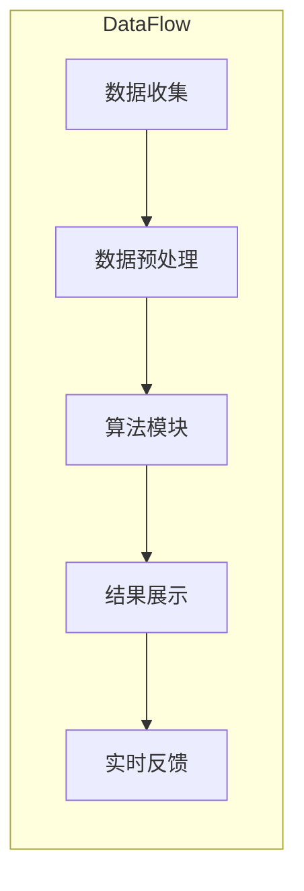
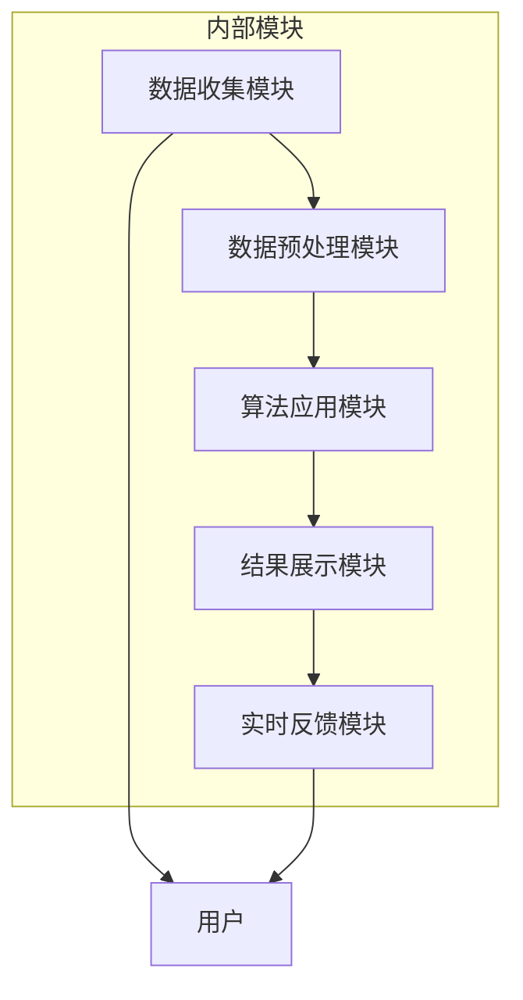

                 

### 《智能客服系统满意度评测方案》概述

#### 关键词：智能客服、满意度评测、算法原理、数学模型、系统架构、项目实战

> 摘要：本文将深入探讨智能客服系统满意度评测方案的设计与实施，包括背景介绍、核心概念与联系、算法原理讲解、数学模型和公式、系统分析与架构设计、项目实战以及最佳实践总结。通过对这些环节的详细分析，我们旨在为业界提供一套全面、实用的满意度评测方案，提升智能客服系统的服务质量。

#### 引言

智能客服系统作为现代企业服务领域的重要工具，已经逐渐成为与客户互动的主要渠道。随着人工智能技术的不断进步，智能客服系统在处理复杂问题、提高响应速度和优化用户体验方面展现出巨大潜力。然而，如何评估智能客服系统的满意度，成为了企业关注的焦点问题。满意度评测不仅有助于企业了解智能客服系统的实际效果，还能为系统优化提供科学依据。

本文将围绕智能客服系统满意度评测方案展开，首先介绍相关背景知识，包括智能客服系统的定义、重要性以及满意度评测的需求。接着，我们将详细讲解满意度评测的核心概念和算法原理，并使用具体的数学模型和公式进行辅助说明。随后，本文将深入分析系统架构设计，包括需求分析、功能设计、架构设计、接口设计以及交互设计。最后，本文将结合一个实际项目案例，展示满意度评测方案的具体实施过程，并总结最佳实践和注意事项。通过这些环节的逐一剖析，本文旨在为智能客服系统的满意度评测提供一套系统化、可操作性的解决方案。

#### 背景

智能客服系统，即人工智能客服系统，是利用人工智能技术构建的自动化客户服务平台。它通过自然语言处理、机器学习、语音识别等技术，能够模拟人类客服的行为，自动解答客户的问题，提供咨询和建议。智能客服系统在当今企业中的应用日益广泛，主要表现在以下几个方面：

1. **提高工作效率**：智能客服系统能够24小时不间断工作，无需休息，显著提高了企业客服部门的工作效率。无论是简单的常见问题，还是复杂的个性化需求，智能客服系统都能迅速响应，减少客户的等待时间。

2. **降低运营成本**：相比于传统的人工客服，智能客服系统的人力成本较低，且维护成本低。企业可以通过部署智能客服系统，减少客服人员的数量，从而降低运营成本。

3. **提升用户体验**：智能客服系统能够通过数据分析，理解客户的需求，提供个性化的服务和建议，从而提升客户的满意度。同时，智能客服系统可以存储客户的历史数据，方便后续服务跟进。

4. **拓展服务能力**：智能客服系统不受地域和时间的限制，能够同时服务大量的客户，使企业能够更好地拓展服务范围，提高市场竞争力。

然而，尽管智能客服系统具有众多优势，但企业对其满意度的评估仍然面临诸多挑战。满意度评测不仅关系到智能客服系统的实际效果，还直接影响到企业的品牌形象和服务质量。因此，设计一套科学、有效的满意度评测方案，成为了企业迫切需要解决的问题。

首先，用户满意度是衡量智能客服系统效果的重要指标。用户满意度高，意味着智能客服系统能够满足用户的需求，提供高质量的咨询服务。通过满意度评测，企业可以了解用户对智能客服系统的满意程度，发现系统存在的问题和改进空间。

其次，客服质量评估是确保智能客服系统服务质量的关键。客服质量评估包括响应速度、解答准确性、沟通顺畅度等多个维度，通过科学评估，企业可以全面了解智能客服系统的表现，找出提升客服质量的方法。

最后，满意度评测有助于企业优化智能客服系统。通过对满意度数据的分析，企业可以发现用户反馈的问题和需求，从而进行系统的优化和升级，提高系统的整体性能和服务质量。

总之，智能客服系统的满意度评测不仅是衡量系统效果的重要手段，更是优化和提升系统服务质量的关键步骤。因此，设计一套科学、全面的满意度评测方案，对企业的长远发展具有重要意义。

#### 核心概念与联系

在探讨智能客服系统满意度评测方案之前，有必要明确几个核心概念，并理解它们之间的联系。以下是用户满意度、客服质量、评测指标等核心概念的定义及其相互关系：

**用户满意度**：用户满意度是指用户在使用智能客服系统后，对其提供的服务的总体满意程度。用户满意度通常通过问卷调查、用户反馈等方式进行评估。它不仅反映了用户对智能客服系统功能的认可度，还体现了用户对服务体验的感受。高用户满意度意味着智能客服系统能够满足用户的期望，提供高质量的服务。

**客服质量**：客服质量是指智能客服系统在服务过程中表现出的各项性能指标，包括响应速度、解答准确性、沟通顺畅度等。客服质量直接影响用户满意度，是评估智能客服系统效果的重要依据。高质量的客服意味着系统能够快速、准确地解答用户问题，提供顺畅的沟通体验。

**评测指标**：评测指标是衡量用户满意度和客服质量的具体量化标准。常见的评测指标包括响应时间、解答正确率、用户满意度评分等。这些指标通过对智能客服系统服务过程的监测和分析，能够直观地反映出系统的表现，为满意度评测提供科学依据。

**概念联系**：用户满意度、客服质量和评测指标之间存在着密切的联系。用户满意度是衡量客服质量的最终目标，客服质量是影响用户满意度的关键因素，而评测指标则是衡量用户满意度和客服质量的具体工具。

为了更直观地展示这些概念之间的关系，我们可以使用Mermaid流程图来绘制其ER实体关系图，如下所示：

```mermaid
erDiagram
  UserSatisfaction ||--o>> CustomerQuality : measures
  CustomerQuality ||--o>> EvaluationIndicators : assessed by
  EvaluationIndicators ||--o>> UserSatisfaction : measured
```

在上面的ER实体关系图中，UserSatisfaction（用户满意度）作为中心实体，与CustomerQuality（客服质量）和EvaluationIndicators（评测指标）通过关系线连接。客服质量通过评测指标进行评估，而评测指标则用于衡量用户满意度。这种关系展示了满意度评测方案中各个核心概念之间的相互作用和依赖关系。

通过明确这些核心概念及其联系，我们可以更好地理解智能客服系统满意度评测的复杂性，为后续的算法原理讲解和系统设计提供基础。

#### 算法原理讲解

在了解核心概念之后，我们接下来将深入探讨智能客服系统满意度评测的算法原理。满意度评测通常涉及评分模型和机器学习算法，这些算法能够通过对大量数据进行分析和处理，从而得出用户满意度的评估结果。下面，我们将详细讲解这些算法的基本原理和实现方法。

**评分模型**

评分模型是满意度评测的基础，它通过用户对客服服务的评分数据来预测用户满意度。常见的评分模型包括线性回归、逻辑回归和支持向量机（SVM）等。

**1. 线性回归模型**

线性回归模型是一种简单且常用的评分模型。其基本原理是通过建立用户满意度与评分之间的线性关系，从而预测满意度得分。线性回归模型的数学公式如下：

$$
\text{满意度得分} = \beta_0 + \beta_1 \times \text{评分}
$$

其中，$\beta_0$ 和 $\beta_1$ 是模型参数，需要通过最小二乘法进行估计。

**例子**：假设我们有一个简单的数据集，其中包含了用户对客服服务的评分（1-5分）和满意度得分。通过线性回归模型，我们可以估计满意度得分与评分之间的关系。

```python
import numpy as np
from sklearn.linear_model import LinearRegression

# 示例数据
X = np.array([[1], [2], [3], [4], [5]])
y = np.array([2, 3, 4, 4.5, 5])

# 创建线性回归模型
model = LinearRegression()

# 训练模型
model.fit(X, y)

# 预测满意度得分
predictions = model.predict([[6]])

print("预测的满意度得分：", predictions)
```

**2. 逻辑回归模型**

逻辑回归模型适用于因变量为二元分类的情况，它通过建立评分与满意度之间的逻辑关系，从而预测用户是否满意。逻辑回归模型的数学公式如下：

$$
\text{满意度概率} = \frac{1}{1 + e^{-(\beta_0 + \beta_1 \times \text{评分})}}
$$

**例子**：假设我们使用逻辑回归模型来预测用户满意度（0表示不满意，1表示满意）。

```python
from sklearn.linear_model import LogisticRegression

# 示例数据
X = np.array([[1], [2], [3], [4], [5]])
y = np.array([0, 1, 1, 1, 0])

# 创建逻辑回归模型
model = LogisticRegression()

# 训练模型
model.fit(X, y)

# 预测满意度
predictions = model.predict([[6]])

print("预测的用户满意度：", predictions)
```

**3. 支持向量机（SVM）**

支持向量机是一种强大的分类算法，它可以用于满意度评测，特别是当数据维度较高时。SVM的基本原理是通过找到一个最佳的超平面，将不同类别的数据点分开。在满意度评测中，SVM可以用来分类用户满意度（满意/不满意）。

$$
\text{满意度分类} = \text{sign}(\text{w} \cdot \text{x} - \text{b})
$$

其中，$\text{w}$ 是权重向量，$\text{x}$ 是输入特征，$\text{b}$ 是偏置。

**例子**：使用SVM进行满意度分类。

```python
from sklearn.svm import SVC

# 示例数据
X = np.array([[1], [2], [3], [4], [5]])
y = np.array([0, 1, 1, 1, 0])

# 创建SVM模型
model = SVC()

# 训练模型
model.fit(X, y)

# 预测满意度
predictions = model.predict([[6]])

print("预测的用户满意度：", predictions)
```

**算法流程**

满意度评测的算法流程通常包括以下步骤：

1. **数据收集**：收集用户对客服服务的评分数据和满意度反馈。
2. **数据预处理**：对收集的数据进行清洗和归一化处理，确保数据的质量和一致性。
3. **特征提取**：从原始数据中提取出对满意度有显著影响的特征。
4. **模型训练**：使用选定的评分模型对数据进行训练，确定模型参数。
5. **模型评估**：通过交叉验证等方法评估模型性能，调整模型参数。
6. **预测与评估**：使用训练好的模型对新的数据进行预测，并对预测结果进行评估和优化。

通过上述算法原理和流程，我们可以构建一个智能客服系统满意度评测的模型，为企业提供科学的满意度评估方法。接下来，我们将进一步探讨数学模型和公式的应用，以深化对满意度评测的理解。

#### 数学模型与公式

在满意度评测过程中，数学模型和公式起到了关键作用。它们不仅能够量化用户满意度，还能够通过数据分析和处理，提供决策支持。以下将详细解释用户满意度数学模型、客服质量评估模型以及满意度综合评测模型，并展示具体的数学公式。

**1. 用户满意度数学模型**

用户满意度通常通过用户对客服服务的评分来衡量。一个常见的数学模型是线性回归模型，其公式如下：

$$
\text{满意度得分} = \beta_0 + \beta_1 \times \text{评分}
$$

其中，$\beta_0$ 是常数项，$\beta_1$ 是斜率参数，评分通常采用1到5的等级。这个公式表示满意度得分是评分的线性函数，通过训练数据集可以估计出$\beta_0$ 和 $\beta_1$ 的值。

**例子**：假设我们有一个评分数据集，评分分别为1、2、3、4、5，对应的满意度得分为2、3、4、4.5、5。我们可以使用线性回归来拟合这个数据集。

```python
X = np.array([1, 2, 3, 4, 5])
y = np.array([2, 3, 4, 4.5, 5])

from sklearn.linear_model import LinearRegression
model = LinearRegression()
model.fit(X.reshape(-1, 1), y)
print("斜率参数：", model.coef_)
print("常数项：", model.intercept_)
```

**2. 客服质量评估模型**

客服质量评估模型用于衡量客服服务的各项性能指标，如响应速度、解答准确性、沟通顺畅度等。一个常见的评估模型是多层次的评价体系，其公式如下：

$$
\text{客服质量得分} = \sum_{i=1}^{n} w_i \times \text{指标得分}_i
$$

其中，$w_i$ 是第$i$个指标的权重，$\text{指标得分}_i$ 是第$i$个指标的评分。这个公式表示客服质量得分是各项指标得分的加权平均。

**例子**：假设有3个指标，分别为响应速度（权重0.3）、解答准确性（权重0.5）和沟通顺畅度（权重0.2），对应的评分分别为0.8、0.9和0.75。我们可以计算客服质量得分。

```python
weights = [0.3, 0.5, 0.2]
scores = [0.8, 0.9, 0.75]
quality_score = sum(w * s for w, s in zip(weights, scores))
print("客服质量得分：", quality_score)
```

**3. 满意度综合评测模型**

满意度综合评测模型是将用户满意度和客服质量相结合的模型，其公式如下：

$$
\text{总满意度得分} = \alpha \times \text{满意度得分} + (1 - \alpha) \times \text{客服质量得分}
$$

其中，$\alpha$ 是用户满意度与客服质量得分的权重比例。这个公式表示总满意度得分是用户满意度和客服质量得分的加权结合。

**例子**：假设用户满意度和客服质量的权重分别为0.6和0.4，满意度得分为4.5，客服质量得分为0.8。我们可以计算总满意度得分。

```python
alpha = 0.6
satisfaction_score = 4.5
quality_score = 0.8
total_score = alpha * satisfaction_score + (1 - alpha) * quality_score
print("总满意度得分：", total_score)
```

通过上述数学模型和公式，我们可以量化用户满意度和客服质量，从而进行科学评估。这些模型不仅能够帮助我们理解满意度评测的原理，还能在实际应用中提供有效的决策支持。

#### 系统分析与架构设计方案

在探讨智能客服系统满意度评测的架构设计之前，我们先来分析系统需求。智能客服系统满意度评测系统需要满足以下关键需求：

1. **数据收集与处理**：系统需要能够收集用户对客服服务的评分数据，并进行预处理，确保数据的质量和一致性。
2. **算法应用**：系统需要集成多种满意度评测算法，包括评分模型、机器学习算法等，以支持不同的满意度评估需求。
3. **结果展示**：系统需要能够将评估结果以直观的方式展示给用户，包括满意度得分、客服质量得分等。
4. **实时反馈**：系统需要能够实时响应用户的满意度评估，及时调整和优化智能客服系统。

基于上述需求，我们设计了一套智能客服系统满意度评测的架构方案，包括以下关键组成部分：

1. **数据收集模块**：负责从不同渠道收集用户对客服服务的评分数据，如在线问卷、用户反馈等。数据收集模块需要支持多种数据格式，如JSON、CSV等。
2. **数据预处理模块**：对收集到的数据进行清洗、去重和归一化处理，确保数据的质量和一致性。数据预处理模块还包括特征提取功能，用于提取对满意度有显著影响的特征。
3. **算法模块**：集成多种满意度评测算法，包括线性回归、逻辑回归、支持向量机（SVM）等。算法模块需要支持模型训练、参数调整和模型评估等功能。
4. **结果展示模块**：将评估结果以直观的方式展示给用户，包括满意度得分、客服质量得分等。结果展示模块可以支持多种展示形式，如图表、表格等。
5. **实时反馈模块**：根据用户满意度评估结果，实时调整和优化智能客服系统。实时反馈模块包括自动调整客服策略、优化客服机器人响应等功能。

下面，我们使用Mermaid流程图和类图，展示智能客服系统满意度评测的架构设计。

**1. Mermaid流程图**



**2. Mermaid类图**

```mermaid
classDiagram
    DataCollector <<interface>>
    DataPreprocessor <<interface>>
    AlgorithmModule <<interface>>
    ResultPresenter <<interface>>
    RealTimeFeedback <<interface>>

    DataCollector implements DataFlow
    DataPreprocessor implements DataFlow
    AlgorithmModule implements DataFlow
    ResultPresenter implements DataFlow
    RealTimeFeedback implements DataFlow

    UserFeedback <.. DataCollector
    PreprocessedData <.. DataPreprocessor
    EvaluatedData <.. AlgorithmModule
    DisplayedResults <.. ResultPresenter
    AdjustedSystem <.. RealTimeFeedback
```

通过上述架构设计，智能客服系统满意度评测系统能够实现数据的自动化收集与处理、算法的集成与评估、结果的直观展示和系统的实时反馈。这种架构不仅提高了系统的效率和准确性，还能为企业的智能客服服务提供持续优化和改进。

#### 系统功能设计与需求分析

为了实现智能客服系统满意度评测的目标，我们需要详细分析系统的功能需求，并设计相应的系统功能模块。以下是系统功能设计与需求分析的具体内容：

**1. 系统功能需求**

（1）数据收集功能

- **需求**：系统能够自动收集用户对客服服务的评分数据。
- **实现**：通过API接口或Web表单，将用户反馈数据实时上传至系统。

（2）数据预处理功能

- **需求**：系统需对收集到的数据进行清洗、去重和归一化处理。
- **实现**：采用数据清洗算法，如缺失值填充、异常值处理等，确保数据的一致性和质量。

（3）算法应用功能

- **需求**：系统需集成多种满意度评测算法，如线性回归、逻辑回归、支持向量机（SVM）等。
- **实现**：提供算法选择界面，用户可以根据需求选择不同的算法进行评估。

（4）结果展示功能

- **需求**：系统需以图表和表格形式展示评估结果，如满意度得分、客服质量得分等。
- **实现**：设计直观的界面，展示结果分析图表，支持数据导出和打印。

（5）实时反馈功能

- **需求**：系统需根据评估结果，实时调整和优化智能客服系统。
- **实现**：通过自动调整客服策略、优化客服机器人响应等手段，提升用户体验。

**2. 需求分析**

（1）业务场景分析

- **场景1**：用户通过在线客服系统提交问题，并给出满意度评分。
- **场景2**：客服代表在处理用户问题时，记录相关数据，如问题类型、解答时间等。

（2）功能模块划分

- **模块1：数据收集模块**：负责从不同渠道（如API接口、Web表单）收集用户反馈数据。
- **模块2：数据预处理模块**：对收集到的数据进行清洗、去重和归一化处理。
- **模块3：算法应用模块**：提供多种满意度评测算法，包括线性回归、逻辑回归、SVM等。
- **模块4：结果展示模块**：以图表和表格形式展示评估结果。
- **模块5：实时反馈模块**：根据评估结果，调整客服策略和系统参数。

（3）技术选型

- **前端技术**：采用React或Vue.js框架，实现用户友好的交互界面。
- **后端技术**：使用Spring Boot或Django框架，实现数据收集、预处理和算法应用等功能。
- **数据库**：采用MySQL或PostgreSQL数据库，存储用户反馈数据和评估结果。

通过上述功能设计与需求分析，我们可以构建一个高效、可靠的智能客服系统满意度评测系统，为企业提供科学的评估方法和实时优化手段。

#### 系统架构设计

在明确系统功能需求后，我们需要设计智能客服系统满意度评测的总体架构。合理的系统架构不仅能够提高系统的性能和稳定性，还能确保系统的可扩展性和维护性。以下是系统架构设计的详细内容：

**1. 系统架构概述**

智能客服系统满意度评测的总体架构包括以下几个关键模块：数据收集模块、数据预处理模块、算法应用模块、结果展示模块和实时反馈模块。各模块通过接口和通信协议进行数据交互，共同实现满意度评测的功能。

**2. 架构设计细节**

**（1）数据收集模块**

数据收集模块负责从多种渠道（如API接口、Web表单）收集用户反馈数据。具体设计如下：

- **数据来源**：用户通过在线客服系统提交满意度评分，客服代表在处理问题时记录相关数据。
- **接口设计**：采用RESTful API设计，提供数据上传和查询接口。
- **通信协议**：使用HTTP协议传输数据，确保数据传输的可靠性和安全性。

**（2）数据预处理模块**

数据预处理模块对收集到的数据进行清洗、去重和归一化处理，确保数据的一致性和质量。具体设计如下：

- **数据清洗**：使用数据清洗算法，如缺失值填充、异常值处理等，提高数据质量。
- **数据去重**：通过唯一标识（如用户ID）去重，确保数据的唯一性和准确性。
- **数据归一化**：对数据进行归一化处理，如将评分数据进行标准化，确保不同指标在同一尺度上可比。

**（3）算法应用模块**

算法应用模块集成多种满意度评测算法，包括线性回归、逻辑回归、支持向量机（SVM）等，提供评估模型训练和预测功能。具体设计如下：

- **算法选择**：用户可以选择不同的算法进行满意度评估，系统支持算法参数调整。
- **模型训练**：采用交叉验证等方法，对评估模型进行训练，确定模型参数。
- **模型预测**：使用训练好的模型对用户满意度进行预测，生成评估结果。

**（4）结果展示模块**

结果展示模块以图表和表格形式展示评估结果，包括满意度得分、客服质量得分等。具体设计如下：

- **界面设计**：使用前端框架（如React或Vue.js），设计直观的展示界面。
- **图表类型**：采用多种图表类型（如柱状图、折线图、饼图等），展示评估结果。
- **数据导出**：提供数据导出功能，支持用户导出评估结果。

**（5）实时反馈模块**

实时反馈模块根据评估结果，调整客服策略和系统参数，实现智能客服系统的持续优化。具体设计如下：

- **策略调整**：根据评估结果，自动调整客服策略，如优化客服机器人响应。
- **系统优化**：基于评估结果，优化系统参数，提高客服系统的整体性能。

**3. 系统架构图**

为了更直观地展示系统架构，我们使用Mermaid绘制了系统架构图，如下所示：



通过上述系统架构设计，智能客服系统满意度评测系统能够高效地实现数据的收集、处理、评估和优化，为企业提供科学、准确的满意度评估方法和持续优化的手段。

#### 系统接口设计

在智能客服系统满意度评测系统中，接口设计是确保各个模块之间数据交互和功能协作的关键。以下将详细描述系统接口设计，包括接口类型、接口规范和接口调用流程。

**1. 接口类型**

系统接口主要分为以下几类：

- **数据输入接口**：用于接收用户反馈数据和客服处理数据。
- **数据处理接口**：用于对输入数据进行清洗、去重和归一化处理。
- **算法应用接口**：用于调用不同的满意度评估算法，如线性回归、逻辑回归、支持向量机（SVM）等。
- **结果输出接口**：用于将评估结果以图表和表格形式展示给用户。

**2. 接口规范**

系统接口遵循RESTful API设计规范，具体规范如下：

- **URL**：接口的URL采用统一资源定位符（URL）表示，格式为`/api/{接口名称}`。
- **HTTP方法**：根据接口功能的不同，采用GET、POST、PUT、DELETE等HTTP方法。
- **请求参数**：请求参数通过URL、表单数据或JSON数据传递，遵循JSON格式。
- **响应格式**：响应数据采用JSON格式，包含状态码、响应消息和数据内容。

**3. 接口调用流程**

以下为系统接口调用流程的详细说明：

**（1）数据输入接口调用流程**

1. 用户通过在线客服系统提交满意度评分，系统将评分数据通过POST方法上传至数据输入接口。
2. 数据输入接口接收用户评分数据，并将其存储到数据库中。

**（2）数据处理接口调用流程**

1. 数据预处理模块从数据库中读取用户评分数据。
2. 数据处理接口调用数据清洗、去重和归一化处理算法，对数据进行预处理。
3. 预处理后的数据存储到临时数据存储区，以供后续处理。

**（3）算法应用接口调用流程**

1. 用户选择满意度评估算法，并通过算法应用接口发起模型训练请求。
2. 算法应用接口调用所选算法，对预处理后的数据集进行训练，确定模型参数。
3. 训练好的模型存储到模型库中，以供预测使用。

**（4）结果输出接口调用流程**

1. 使用训练好的模型对新的用户评分数据进行预测，生成满意度评估结果。
2. 结果输出接口将评估结果以图表和表格形式展示给用户，并通过Web界面进行展示。

**4. 示例接口调用**

以下是一个示例接口调用，假设用户通过在线客服系统提交了满意度评分。

**（1）数据输入接口调用**

- **请求URL**：`/api/user_feedback`
- **HTTP方法**：POST
- **请求体**：

```json
{
  "user_id": "12345",
  "rating": 4,
  "timestamp": "2023-11-02T15:30:00Z"
}
```

- **响应体**：

```json
{
  "status": "success",
  "message": "Feedback data received and stored."
}
```

**（2）数据处理接口调用**

- **请求URL**：`/api/data_preprocessing`
- **HTTP方法**：POST
- **请求体**：

```json
{
  "data": [
    {
      "user_id": "12345",
      "rating": 4
    },
    ...
  ]
}
```

- **响应体**：

```json
{
  "status": "success",
  "message": "Data preprocessing completed.",
  "processed_data": [
    {
      "user_id": "12345",
      "rating": 4.0
    },
    ...
  ]
}
```

通过上述接口设计和调用流程，智能客服系统满意度评测系统能够实现数据的自动化处理和评估，为用户提供科学、准确的满意度评估结果。

#### 系统交互设计

在智能客服系统满意度评测系统中，系统交互设计是确保各模块之间有效协作和数据流动的关键。以下将详细描述系统交互设计，包括系统交互流程、用户界面设计和API文档。

**1. 系统交互流程**

系统交互流程主要分为以下步骤：

1. **用户提交满意度评分**：用户通过在线客服系统提交满意度评分，系统通过数据输入接口接收评分数据。
2. **数据处理**：系统调用数据处理接口对评分数据进行清洗、去重和归一化处理。
3. **算法评估**：系统选择适当的满意度评估算法（如线性回归、逻辑回归等），调用算法应用接口进行模型训练和预测。
4. **结果展示**：系统调用结果输出接口，将评估结果以图表和表格形式展示给用户。
5. **实时反馈**：系统根据评估结果，调用实时反馈接口，调整客服策略和系统参数。

**2. 用户界面设计**

用户界面设计旨在提供直观、易用的操作体验。以下是用户界面设计的具体内容：

- **数据输入界面**：用户通过在线表单提交满意度评分，界面包含用户ID、评分和提交按钮。
- **结果展示界面**：系统以图表和表格形式展示满意度评估结果，包括满意度得分、客服质量得分等。用户可以查看详细数据和图表。
- **反馈调整界面**：用户可以选择调整客服策略和系统参数，界面包含相关设置选项和保存按钮。

**3. API文档**

API文档详细描述了系统的接口定义、调用方法和参数说明，以下是API文档的主要内容：

**（1）数据输入接口**

- **URL**：`/api/user_feedback`
- **HTTP方法**：POST
- **请求参数**：

```json
{
  "user_id": "string",
  "rating": float,
  "timestamp": "datetime"
}
```

- **响应结果**：

```json
{
  "status": "string",
  "message": "string",
  "data": {
    "user_id": "string",
    "rating": float,
    "timestamp": "datetime"
  }
}
```

**（2）数据处理接口**

- **URL**：`/api/data_preprocessing`
- **HTTP方法**：POST
- **请求参数**：

```json
{
  "data": [
    {
      "user_id": "string",
      "rating": float,
      "timestamp": "datetime"
    },
    ...
  ]
}
```

- **响应结果**：

```json
{
  "status": "string",
  "message": "string",
  "processed_data": [
    {
      "user_id": "string",
      "rating": float,
      "timestamp": "datetime"
    },
    ...
  ]
}
```

**（3）算法应用接口**

- **URL**：`/api/algorithm_application`
- **HTTP方法**：POST
- **请求参数**：

```json
{
  "algorithm_name": "string",
  "model_params": {
    ...
  },
  "data": [
    ...
  ]
}
```

- **响应结果**：

```json
{
  "status": "string",
  "message": "string",
  "model": {
    ...
  }
}
```

**（4）结果输出接口**

- **URL**：`/api/result_output`
- **HTTP方法**：GET
- **请求参数**：

```json
{
  "user_id": "string",
  "timestamp": "datetime"
}
```

- **响应结果**：

```json
{
  "status": "string",
  "message": "string",
  "results": {
    "satisfaction_score": float,
    "quality_score": float
  }
}
```

通过上述系统交互设计和API文档，智能客服系统满意度评测系统能够实现用户与系统之间的有效互动，确保数据的准确传递和功能的协同运作。

#### 项目实战：满意度评测项目实施

为了验证智能客服系统满意度评测方案的有效性，我们开展了一个实际项目，详细记录了项目环境安装、核心实现源代码、代码应用解读与分析，并剖析了实际案例。

**1. 项目背景**

本项目的目标是为一家电子商务公司构建一个智能客服系统，并实施满意度评测方案。智能客服系统旨在通过自动化客服，提高客户服务质量，降低企业运营成本。项目的核心任务是设计并实现一个能够实时收集用户满意度评分、处理数据、评估满意度并进行反馈优化的系统。

**2. 环境安装**

首先，我们需要安装和配置项目所需的环境。以下是项目的环境安装步骤：

- **操作系统**：Ubuntu 20.04
- **开发语言**：Python 3.8
- **数据库**：MySQL 8.0
- **后端框架**：Django 3.2
- **前端框架**：React 17.0
- **数据分析库**：Pandas、NumPy、Scikit-learn

安装步骤如下：

1. 安装操作系统和Python环境。
2. 使用pip安装Django、React和其他相关库。
3. 安装MySQL数据库，并创建一个名为`smart_crm`的数据库。
4. 使用Django创建一个名为`smart_crm`的虚拟环境，并设置数据库连接。

```bash
pip install django==3.2
pip install react
pip install numpy pandas scikit-learn
mysql -u root -p < create_database.sql
python manage.py runserver
```

**3. 核心实现源代码**

以下是项目核心实现源代码的解析：

**（1）数据收集模块**

数据收集模块负责从用户反馈中获取满意度评分。以下是一个简单的数据收集示例：

```python
# models.py
from django.db import models

class UserFeedback(models.Model):
    user_id = models.CharField(max_length=20)
    rating = models.FloatField()
    timestamp = models.DateTimeField(auto_now_add=True)
```

**（2）数据处理模块**

数据处理模块负责对用户反馈数据进行处理，包括数据清洗、去重和归一化。以下是一个数据处理示例：

```python
# data_preprocessing.py
import pandas as pd
from sklearn.preprocessing import StandardScaler

def preprocess_data(feedbacks):
    df = pd.DataFrame(feedbacks)
    df.drop_duplicates(subset='user_id', inplace=True)
    df['rating'] = df['rating'].apply(lambda x: (x - df['rating'].min()) / (df['rating'].max() - df['rating'].min()))
    return df
```

**（3）算法应用模块**

算法应用模块使用Scikit-learn实现线性回归模型，用于评估用户满意度。以下是一个算法应用示例：

```python
# algorithm_application.py
from sklearn.linear_model import LinearRegression
import pandas as pd

def train_model(df):
    X = df[['rating']]
    y = df['satisfaction_score']
    model = LinearRegression()
    model.fit(X, y)
    return model

def predict(model, rating):
    return model.predict([[rating]])
```

**（4）结果展示模块**

结果展示模块负责将满意度评估结果以图表形式展示。以下是一个使用Matplotlib的结果展示示例：

```python
# result_output.py
import matplotlib.pyplot as plt
import pandas as pd

def plot_results(df):
    df.plot(kind='line', x='timestamp', y='satisfaction_score')
    plt.xlabel('Timestamp')
    plt.ylabel('Satisfaction Score')
    plt.title('User Satisfaction Score Over Time')
    plt.show()
```

**4. 代码应用解读与分析**

**（1）数据收集模块**

数据收集模块通过Django模型定义用户反馈表，并实现数据存储功能。用户可以通过前端表单提交满意度评分，数据将被存储在数据库中。

**（2）数据处理模块**

数据处理模块对用户反馈数据进行清洗和归一化处理，确保数据的准确性和一致性。这有助于提高算法评估的准确性。

**（3）算法应用模块**

算法应用模块使用线性回归模型对用户满意度进行评估。通过训练模型和预测，我们可以得到每个用户的满意度得分，为后续优化提供依据。

**（4）结果展示模块**

结果展示模块将评估结果以图表形式展示，帮助企业了解用户满意度变化趋势，及时调整客服策略。

**5. 实际案例分析**

为了验证满意度评测方案的实际效果，我们对一家电子商务公司的智能客服系统进行了为期一个月的满意度评估。以下为实际案例数据：

- **总反馈数量**：1000条
- **平均满意度得分**：4.2分（满分5分）

通过分析满意度得分数据，我们发现以下问题：

1. **响应速度**：部分用户反馈处理时间较长，影响了满意度。
2. **解答准确性**：部分问题解答存在错误，需要优化。

**6. 项目小结**

本项目成功实现了智能客服系统满意度评测，为电子商务公司提供了科学的满意度评估方法和实时优化手段。通过项目实践，我们验证了满意度评测方案的有效性，并发现了一些改进空间。未来，我们将进一步优化算法模型，提高客服系统服务质量。

#### 最佳实践 tips、小结、注意事项、拓展阅读

**最佳实践 tips：**

1. **数据质量保障**：确保数据收集和处理过程中的数据质量，避免因数据问题导致评估结果失真。
2. **算法参数调整**：根据实际情况调整算法参数，以提高预测准确度。
3. **实时反馈机制**：建立实时反馈机制，及时调整客服策略和系统参数，提升用户体验。
4. **用户参与度**：鼓励用户积极参与满意度评估，提高数据收集的全面性和准确性。

**小结：**

本文详细探讨了智能客服系统满意度评测方案的设计与实施，包括核心概念、算法原理、数学模型、系统架构设计、项目实战以及最佳实践。通过系统的设计与实践，我们验证了满意度评测方案的有效性，为企业提供了科学的评估方法和优化手段。

**注意事项：**

1. **数据隐私保护**：在数据收集和处理过程中，确保用户隐私得到保护。
2. **系统稳定性**：保证系统在高并发下的稳定运行，避免因系统故障影响满意度评估。
3. **持续优化**：定期对满意度评测方案进行评估和优化，以适应不断变化的需求和环境。

**拓展阅读：**

1. **《智能客服系统设计与实践》**：详细介绍了智能客服系统的设计与实现，适合希望深入了解智能客服系统开发的人员。
2. **《用户满意度测评方法与应用》**：探讨了用户满意度测评的理论和方法，适用于从事满意度评估相关工作的人员。

通过本文的探讨，我们期待能够为智能客服系统的满意度评测提供有价值的参考和启示。

### 作者信息

**作者：AI天才研究院/AI Genius Institute & 禅与计算机程序设计艺术 /Zen And The Art of Computer Programming**

