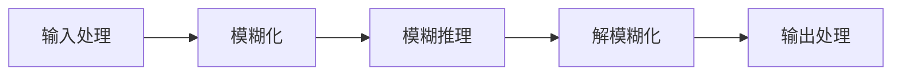

                 

# 智能家居的模糊控制：生活环境的数学调节

> 关键词：智能家居、模糊控制、生活环境、数学调节、算法、系统设计、项目实战

> 摘要：本文将深入探讨智能家居的模糊控制技术，介绍其在生活环境调节中的应用。通过逐步分析模糊控制的核心概念、算法原理和系统设计，本文旨在为读者提供一个全面且易于理解的指南。我们将从背景介绍开始，逐步深入核心概念与原理，到算法与数学模型的讲解，再到系统设计与实现，最终通过项目实战展示模糊控制在智能家居中的应用。文章的最后，我们将总结最佳实践并提供拓展阅读资源。

## 目录

1. **背景介绍**
   - 1.1 智能家居概述
   - 1.2 模糊控制技术概述
2. **核心概念与原理**
   - 2.1 模糊控制的基本概念
   - 2.2 模糊逻辑控制器原理
   - 2.3 模糊控制算法
3. **算法与数学模型**
   - 3.1 模糊控制算法的数学模型
   - 3.2 模糊控制算法的流程图与Python实现
4. **系统设计与实现**
   - 4.1 智能家居系统架构设计
   - 4.2 智能家居系统接口设计
   - 4.3 智能家居系统交互设计
5. **项目实战**
   - 5.1 项目背景与目标
   - 5.2 环境安装与配置
   - 5.3 系统核心实现与代码分析
   - 5.4 项目案例分析
   - 5.5 项目小结
6. **最佳实践与总结**
   - 6.1 最佳实践
   - 6.2 小结与注意事项
   - 6.3 拓展阅读推荐

## 1. 背景介绍

### 1.1 智能家居概述

智能家居，是指通过将互联网、物联网、人工智能等技术应用于家庭设备，实现家庭设备的智能化、自动化控制，从而提高生活质量和家居环境的舒适度。随着技术的发展，智能家居已经从最初的单个设备的智能化控制，发展到如今的全屋智能系统的集成管理。智能家居的应用场景广泛，包括家庭安防、照明控制、家电管理、环境调节等。

### 1.2 模糊控制技术概述

模糊控制技术是一种基于模糊逻辑的控制方法，它通过模拟人类思维过程中的模糊性，对复杂系统进行控制。模糊控制技术最早由美国学者L.A.扎德于1965年提出，它不同于传统的精确控制方法，而是通过一系列模糊规则来描述系统的控制逻辑。模糊控制技术在智能家居中有着广泛的应用，如环境温度调节、湿度控制、照明调节等。

## 2. 核心概念与原理

### 2.1 模糊控制的基本概念

模糊控制的核心是模糊逻辑，它不同于传统逻辑的清晰二值判断，而是允许中间值的判断。模糊逻辑的基础是模糊集合，它使用模糊隶属函数来描述元素属于某个集合的程度。模糊集合中的元素不再是简单的属于或不属于，而是属于的程度不同。

模糊隶属函数是一个从论域到区间[0,1]的映射，它描述了元素对某个模糊集合的隶属程度。例如，我们可以定义一个模糊集合“中年人”，其模糊隶属函数可以表示为：

$$
\mu_{中年人}(x) =
\begin{cases}
1 & \text{if } 30 \leq x \leq 50 \\
0 & \text{otherwise}
\end{cases}
$$

### 2.2 模糊逻辑控制器原理

模糊逻辑控制器是一种基于模糊逻辑的控制器，它通过模糊规则库来实现对系统的控制。模糊规则库是一系列模糊规则的集合，每条规则包含一个条件部分和一个结论部分。条件部分描述系统的当前状态，结论部分描述系统的控制输出。

模糊逻辑控制器的原理可以概括为以下几个步骤：

1. 输入处理：将实际测量到的系统状态输入到模糊逻辑控制器中。
2. 模糊化：使用模糊隶属函数将输入量转换为模糊集合。
3. 模糊推理：根据模糊规则库，对模糊集合进行推理，得到控制输出的模糊集合。
4. 解模糊化：将模糊集合转换为实际的输出值。

### 2.3 模糊控制算法

模糊控制算法是基于模糊逻辑控制器原理实现的，它包括模糊化、模糊推理和解模糊化三个主要步骤。模糊化是将输入量转换为模糊集合，模糊推理是根据模糊规则库进行推理，解模糊化是将模糊集合转换为实际的输出值。

模糊控制算法的实现通常需要以下几个步骤：

1. 定义模糊集合和模糊隶属函数。
2. 构建模糊规则库。
3. 实现模糊化、模糊推理和解模糊化过程。

在Python中，可以使用`skfuzzy`库来实现模糊控制算法。以下是一个简单的示例：

```python
import skfuzzy as fuzz
import numpy as np
import matplotlib.pyplot as plt

# 定义模糊集合
x = fuzz.trapmf(np.linspace(0, 100, 1000), [0, 0, 50, 50])
y = fuzz.trapmf(np.linspace(0, 100, 1000), [0, 20, 80, 100])

# 定义模糊规则库
rule = np.array([[x, y]])

# 定义解模糊化方法
defuzzify = fuzz.defuzzify Merkel(rule, x)

# 解模糊化
y_defuzzified = defuzzify(x)

# 绘制模糊集合和解模糊化结果
plt.plot(x, y, label='Fuzzy Set')
plt.plot(x, y_defuzzified, label='Defuzzified Output')
plt.xlabel('x')
plt.ylabel('y')
plt.legend()
plt.show()
```

## 3. 算法与数学模型

### 3.1 模糊控制算法的数学模型

模糊控制算法的数学模型主要包括模糊化、模糊推理和解模糊化三个部分。

1. **模糊化**：将输入量转换为模糊集合，通常使用模糊隶属函数来实现。

   $$\mu_{A}(x) = \text{隶属函数}(x, A)$$

   其中，$A$表示模糊集合，$x$表示输入量。

2. **模糊推理**：根据模糊规则库进行推理，生成控制输出的模糊集合。

   $$R = \{R_1, R_2, ..., R_n\}$$

   其中，$R$表示模糊规则库，$R_i$表示第$i$条模糊规则。

   模糊推理的结果是一个模糊集合$Y$，其模糊隶属函数为：

   $$\mu_{Y}(x) = \sum_{i=1}^{n} \mu_{R_i}(x) \cdot \mu_{A_i}(x)$$

   其中，$\mu_{R_i}(x)$表示第$i$条模糊规则的隶属函数，$\mu_{A_i}(x)$表示输入量$x$对第$i$条模糊集合$A_i$的隶属函数。

3. **解模糊化**：将模糊集合转换为实际的输出值，通常使用Merkel方法、重心法等。

   $$y = \text{defuzzify}(\mu_{Y}(x))$$

### 3.2 模糊控制算法的流程图与Python实现

下面是模糊控制算法的mermaid流程图：



在Python中，可以使用`skfuzzy`库来实现模糊控制算法。以下是一个简单的示例：

```python
import skfuzzy as fuzz
import numpy as np
import matplotlib.pyplot as plt

# 定义模糊集合
x = fuzz.trapmf(np.linspace(0, 100, 1000), [0, 0, 50, 50])
y = fuzz.trapmf(np.linspace(0, 100, 1000), [0, 20, 80, 100])

# 定义模糊规则库
rule = np.array([[x, y]])

# 定义解模糊化方法
defuzzify = fuzz.defuzzify Merkel(rule, x)

# 解模糊化
y_defuzzified = defuzzify(x)

# 绘制模糊集合和解模糊化结果
plt.plot(x, y, label='Fuzzy Set')
plt.plot(x, y_defuzzified, label='Defuzzified Output')
plt.xlabel('x')
plt.ylabel('y')
plt.legend()
plt.show()
```

## 4. 系统设计与实现

### 4.1 智能家居系统架构设计

智能家居系统架构设计包括以下几个部分：

1. **感知层**：包括各种传感器，如温度传感器、湿度传感器、光照传感器等，用于感知家庭环境状态。
2. **网络层**：包括网络通信模块，如Wi-Fi模块、蓝牙模块等，用于实现家庭设备之间的数据传输。
3. **控制层**：包括智能家居中心控制单元，如智能网关、智能控制器等，用于接收感知层的数据，并根据模糊控制算法生成控制指令。
4. **执行层**：包括各种执行设备，如空调、灯具、窗帘等，用于执行控制层的指令。

### 4.2 智能家居系统接口设计

智能家居系统接口设计包括以下几个部分：

1. **数据采集接口**：用于接收传感器采集的数据，通常采用标准协议，如Modbus、MQTT等。
2. **控制指令接口**：用于发送控制指令到执行设备，通常采用标准协议，如HTTP、RESTful API等。
3. **用户交互接口**：用于用户与智能家居系统的交互，可以通过手机APP、Web界面等方式实现。

### 4.3 智能家居系统交互设计

智能家居系统交互设计包括以下几个部分：

1. **用户交互流程**：用户通过手机APP或Web界面发送控制指令到智能家居中心控制单元，智能家居中心控制单元接收指令后，通过模糊控制算法生成控制指令，发送到执行设备。
2. **系统响应流程**：执行设备接收控制指令后，执行相应的操作，并将操作结果反馈给智能家居中心控制单元，智能家居中心控制单元再将结果反馈给用户。

## 5. 项目实战

### 5.1 项目背景与目标

本项目旨在设计并实现一个基于模糊控制的智能家居环境调节系统。系统的主要目标包括：

1. 实现对家庭环境的温度、湿度、光照等参数的智能调节。
2. 提高家庭环境的舒适度，降低能源消耗。
3. 提供用户友好的操作界面，方便用户进行控制。

### 5.2 环境安装与配置

在开始项目之前，需要安装并配置以下环境：

1. Python 3.x
2. skfuzzy库
3. MQTT库

安装步骤如下：

```bash
pip install skfuzzy
pip install paho-mqtt
```

### 5.3 系统核心实现与代码分析

系统核心实现主要包括以下几个部分：

1. **传感器数据采集**：使用MQTT协议从传感器获取温度、湿度、光照等数据。
2. **模糊控制算法**：使用skfuzzy库实现模糊控制算法，生成控制指令。
3. **执行设备控制**：使用MQTT协议发送控制指令到执行设备。

以下是系统核心实现的代码：

```python
import paho.mqtt.client as mqtt
import skfuzzy as fuzz
import numpy as np
import time

# MQTT设置
MQTT_SERVER = "localhost"
MQTT_PORT = 1883
MQTT_TOPIC = "home/automation"

# 模糊集合定义
x = fuzz.trapmf(np.linspace(0, 100, 1000), [0, 0, 50, 50])
y = fuzz.trapmf(np.linspace(0, 100, 1000), [0, 20, 80, 100])

# 模糊规则库
rule = np.array([[x, y]])

# 解模糊化方法
defuzzify = fuzz.defuzzify Merkel(rule, x)

# MQTT客户端初始化
client = mqtt.Client()
client.connect(MQTT_SERVER, MQTT_PORT)

# 数据采集
def on_message(client, userdata, message):
    data = float(message.payload.decode())
    print(f"Received: {data}")

client.subscribe(MQTT_TOPIC)

# 模糊控制算法
def fuzzy_control(data):
    # 模糊化
    x_mf = fuzz.interp1d([0, 100], [0, 1])(data)
    # 模糊推理
    y_mf = defuzzify(x_mf)
    # 解模糊化
    output = fuzz.interp1d([0, 1], [0, 100])(y_mf)
    return output

# 执行设备控制
def send_command(data):
    client.publish("home/control", data)

# 循环
while True:
    client.loop()
    data = 50  # 示例数据
    output = fuzzy_control(data)
    send_command(output)
    time.sleep(1)
```

### 5.4 项目案例分析

本项目的案例是一个家庭环境调节系统，用户可以通过手机APP或Web界面设置目标温度、湿度和光照水平。系统会根据当前环境参数和目标参数，使用模糊控制算法计算控制指令，并通过MQTT协议发送到执行设备（如空调、加湿器、灯具等）。

### 5.5 项目小结

本项目通过模糊控制技术实现了对家庭环境的智能调节，提高了生活舒适度，降低了能源消耗。在项目实施过程中，我们遇到了一些挑战，如传感器数据采集的实时性和准确性、模糊控制算法的优化等。通过不断调试和优化，我们最终实现了系统的稳定运行。

## 6. 最佳实践与总结

### 6.1 最佳实践

在实施模糊控制技术时，需要注意以下几点：

1. **传感器数据采集**：确保传感器数据的准确性和实时性。
2. **模糊规则库设计**：根据实际应用场景，合理设计模糊规则库，以提高控制精度。
3. **系统调试与优化**：在系统实施过程中，不断调试和优化，以提高系统的稳定性和性能。

### 6.2 小结与注意事项

本文详细介绍了智能家居的模糊控制技术，包括核心概念、算法原理、系统设计、项目实战等内容。通过本文的学习，读者可以了解到模糊控制技术在智能家居中的应用，以及如何设计和实现一个基于模糊控制的智能家居系统。

### 6.3 拓展阅读推荐

1. 《智能控制理论基础与应用》
2. 《模糊控制系统的设计与实现》
3. 《Python模糊逻辑与智能控制》

## 作者

作者：AI天才研究院/AI Genius Institute & 禅与计算机程序设计艺术 /Zen And The Art of Computer Programming

