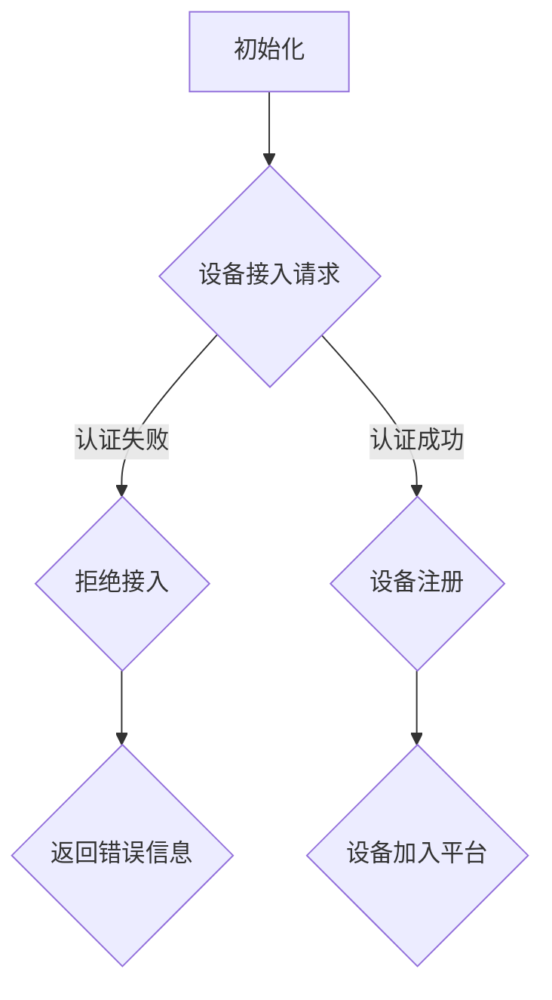
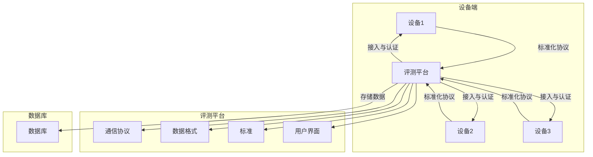
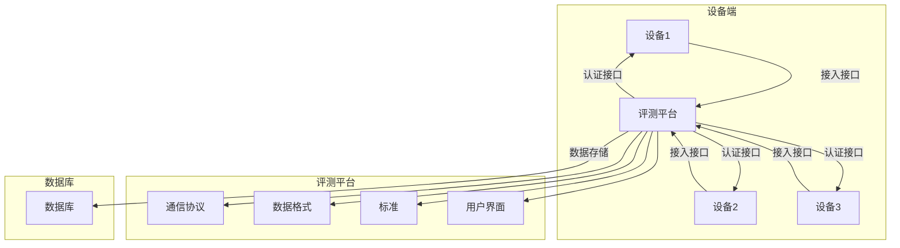
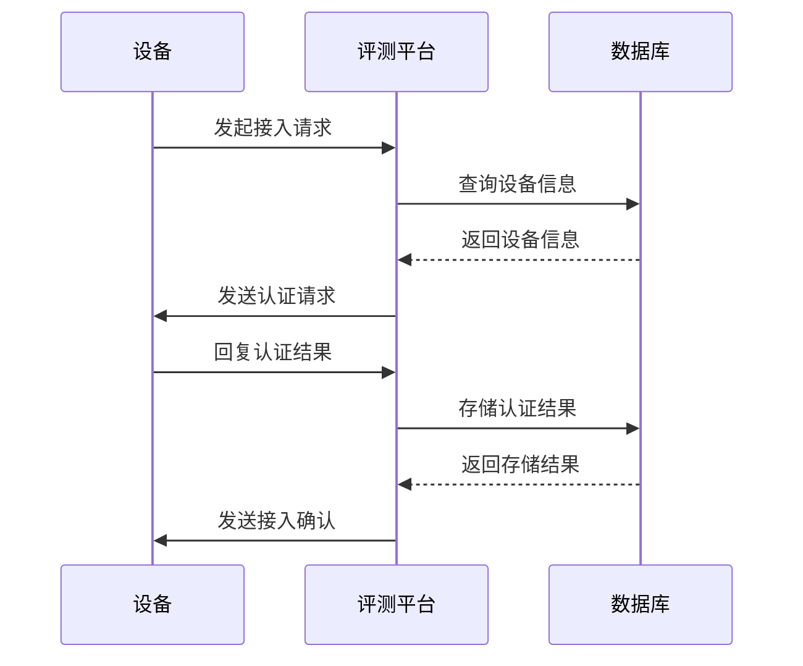

                 


# 《智能家居设备互操作性评测平台》

## 关键词

- 智能家居设备
- 互操作性
- 评测平台
- 设备通信协议
- 数据格式与标准
- 设备识别与认证
- 用户界面与交互设计

## 摘要

本文旨在探讨智能家居设备互操作性评测平台的设计与实现。随着智能家居设备的普及，设备之间的互操作性问题愈发凸显，限制了用户的便捷性和系统整合性。本文首先介绍了智能家居设备互操作性的概念及其重要性，然后详细阐述了评测平台的核心概念与联系，包括设备识别与认证算法，并提供了相应的数学模型和Python代码示例。此外，本文还介绍了系统分析与架构设计方案，以及项目实战的实际案例和分析。通过本文的阐述，旨在为开发者提供一种有效的解决方案，以提升智能家居设备的互操作性。

## 目录大纲

# 《智能家居设备互操作性评测平台》

## 第一部分：背景介绍

### 1.1 智能家居设备互操作性的概念

#### 1.1.1 问题背景

智能家居设备在近年来的快速发展中扮演着重要角色，但不同品牌和类型的设备之间往往存在互操作性问题，这限制了用户的便捷性和系统整合性。

#### 1.1.2 问题描述

设备互操作性不佳导致用户在使用智能家居系统时面临以下问题：

- 设备难以互相识别和通信
- 设备功能无法整合
- 用户界面复杂不统一
- 设备维护和管理困难

#### 1.1.3 问题解决

为了解决上述问题，需要建立一个评测平台来评估和提升智能家居设备的互操作性。

#### 1.1.4 边界与外延

评测平台的研究范围包括但不限于以下方面：

- 设备通信协议
- 数据格式与标准
- 设备识别与认证
- 用户界面与交互设计

### 1.2 概念结构与核心要素组成

- **核心概念**：智能家居设备、互操作性、评测平台
- **结构要素**：设备通信协议、数据格式与标准、设备识别与认证、用户界面与交互设计

## 第二部分：核心概念与联系

### 2.1 智能家居设备互操作性原理

#### 2.1.1 概念原理

智能家居设备互操作性的核心在于设备之间的无缝通信和数据交换，这要求设备支持标准化的通信协议和数据格式。

#### 2.1.2 概念属性特征对比表格

| 特征       | 设备A              | 设备B              | 设备C              |
|------------|--------------------|--------------------|--------------------|
| 通信协议   | MQTT               | CoAP               | HTTP               |
| 数据格式   | JSON               | XML                | CSV                |
| 识别与认证 | 设备ID             | MAC地址            | 用户名/密码        |

#### 2.1.3 概念联系

智能家居设备互操作性涉及到多个核心概念之间的联系，如设备、协议、数据和用户。

### 2.2 评测平台的设计原则

#### 2.2.1 设计原则

评测平台的设计应遵循以下原则：

- **标准化**：支持多种通信协议和数据格式，以实现设备间的互操作性。
- **灵活性**：能够适应不同品牌和类型的设备。
- **可扩展性**：易于集成新设备和协议。
- **用户友好**：提供直观的用户界面，方便用户进行操作和数据分析。

#### 2.2.2 ER实体关系图架构

```mermaid
erDiagram
  Device ||--|{ Platform }|| Evaluation
  Platform ||--|{ Protocol }|| Protocol
  Platform ||--|{ Format }|| Format
  Device ||--|{ Standard }|| Standard
  Platform ||--|{ UI }|| UI
```

## 第三部分：算法原理讲解

### 3.1 设备识别与认证算法

#### 3.1.1 算法原理

设备识别与认证算法用于确保只有经过认证的设备才能接入评测平台。

#### 3.1.2 Mermaid流程图



#### 3.1.3 Python源代码

```python
def authenticate_device(device_info):
    # 假设已实现认证逻辑
    if check_certificate(device_info['certificate']):
        return "Authentication successful"
    else:
        return "Authentication failed"
```

#### 3.1.4 算法原理详细讲解

设备识别与认证算法主要包括以下几个步骤：

1. 设备发送接入请求。
2. 评测平台验证设备的证书。
3. 如果验证通过，设备被允许接入平台；否则，接入请求被拒绝。

## 第四部分：系统分析与架构设计

### 4.1 问题场景介绍

随着智能家居设备的普及，用户希望能够将多种设备整合到一个系统中，实现智能化的家居生活。然而，由于不同品牌和类型的设备之间缺乏互操作性，用户往往需要为不同的设备分别操作和管理，这给用户带来了不便。

### 4.2 项目介绍

本项目旨在设计并实现一个智能家居设备互操作性评测平台，通过该平台可以评估和提升设备之间的互操作性，使用户能够更加便捷地管理和控制智能家居系统。

### 4.3 系统功能设计

系统功能设计主要包括以下几个方面：

- **设备接入与认证**：设备接入评测平台前，需要通过认证算法进行认证。
- **数据传输与交换**：设备之间通过标准化的通信协议和数据格式进行数据传输和交换。
- **用户界面**：提供直观、易用的用户界面，使用户能够轻松地管理设备和系统。
- **数据分析与报告**：对设备间的互操作性进行评估和分析，生成相应的报告。

#### 4.3.1 领域模型Mermaid类图

```mermaid
classDiagram
  Device <<Class>>
  Platform <<Class>>
  Protocol <<Class>>
  Format <<Class>>
  Standard <<Class>>
  UI <<Class>>

  Device <|-- Platform
  Platform <|-- Protocol
  Platform <|-- Format
  Platform <|-- Standard
  Platform <|-- UI
```

### 4.4 系统架构设计

系统架构设计主要包括以下几个方面：

- **设备端**：设备通过标准化的通信协议和数据格式与评测平台进行通信。
- **评测平台**：包括设备接入与认证模块、数据传输与交换模块、用户界面模块和数据分析与报告模块。
- **数据库**：存储设备信息、认证数据、数据传输记录和评估报告等。

#### 4.4.1 Mermaid架构图



### 4.5 系统接口设计

系统接口设计主要包括以下几个方面：

- **设备接入接口**：设备通过该接口与评测平台进行通信，包括认证、数据上传和数据接收等操作。
- **数据传输接口**：设备之间通过该接口进行数据传输和交换。
- **用户界面接口**：用户通过该接口与评测平台进行交互，包括设备管理、数据查看和报告生成等操作。

#### 4.5.1 Mermaid接口设计图



### 4.6 系统交互Mermaid序列图



## 第五部分：项目实战

### 5.1 环境安装

在开始项目实战之前，需要安装以下环境：

- Python 3.8及以上版本
- MySQL 5.7及以上版本
- MQTT 客户端（例如：mosquitto）
- CoAP 客户端（例如：coap-shim）

### 5.2 系统核心实现

#### 5.2.1 设备接入与认证模块

设备接入与认证模块是实现评测平台的关键部分，以下是该模块的实现：

```python
# 设备接入与认证模块
class DeviceAuthentication:
    def __init__(self, db_connection):
        self.db_connection = db_connection

    def authenticate_device(self, device_id, certificate):
        # 查询设备信息
        cursor = self.db_connection.cursor()
        cursor.execute("SELECT * FROM devices WHERE device_id = %s", (device_id,))
        device = cursor.fetchone()

        # 验证证书
        if device and verify_certificate(certificate):
            return "Authentication successful"
        else:
            return "Authentication failed"

# 验证证书（示例）
def verify_certificate(certificate):
    # 实现证书验证逻辑
    return True
```

#### 5.2.2 数据传输与交换模块

数据传输与交换模块负责处理设备之间的数据传输和交换，以下是该模块的实现：

```python
# 数据传输与交换模块
class DataTransfer:
    def __init__(self, protocol, format):
        self.protocol = protocol
        self.format = format

    def send_data(self, device_id, data):
        # 发送数据
        if self.protocol == "MQTT":
            client = mqtt.Client()
            client.connect("localhost", 1883, 60)
            client.publish(f"{device_id}/data", data)
            client.disconnect()
        elif self.protocol == "CoAP":
            # 实现CoAP数据发送逻辑
            pass
        elif self.protocol == "HTTP":
            # 实现HTTP数据发送逻辑
            pass

    def receive_data(self, device_id):
        # 接收数据
        if self.format == "JSON":
            # 实现JSON数据接收逻辑
            pass
        elif self.format == "XML":
            # 实现XML数据接收逻辑
            pass
        elif self.format == "CSV":
            # 实现CSV数据接收逻辑
            pass
```

### 5.3 代码应用解读与分析

在代码应用解读与分析部分，我们将对系统核心实现中的关键代码进行详细解析，帮助开发者更好地理解系统的工作原理和实现方式。

#### 5.3.1 设备接入与认证模块

设备接入与认证模块中，`DeviceAuthentication` 类用于处理设备的认证过程。该类接受一个数据库连接对象作为参数，并在认证设备时查询设备信息。如果设备信息存在且证书验证成功，则认证通过；否则，认证失败。

在 `authenticate_device` 方法中，首先执行一个 SQL 查询，从数据库中获取设备信息。然后，调用 `verify_certificate` 方法对设备证书进行验证。如果验证成功，返回 "Authentication successful"；否则，返回 "Authentication failed"。

#### 5.3.2 数据传输与交换模块

数据传输与交换模块中，`DataTransfer` 类负责处理设备之间的数据传输。该类接受一个通信协议（`protocol`）和一个数据格式（`format`）作为参数，并在发送和接收数据时根据参数进行相应的处理。

在 `send_data` 方法中，根据不同的通信协议（MQTT、CoAP、HTTP）调用相应的发送方法。例如，对于 MQTT 协议，创建一个 MQTT 客户端对象，连接到 MQTT 服务器，并发布数据到指定的话题。对于其他协议，可以类似地实现发送方法。

在 `receive_data` 方法中，根据不同的数据格式（JSON、XML、CSV）调用相应的接收方法。例如，对于 JSON 格式，可以解析 JSON 数据并返回相应的对象；对于其他格式，可以类似地实现接收方法。

### 5.4 实际案例分析和详细讲解剖析

在本部分，我们将通过一个实际案例来分析和讲解评测平台的实现过程，帮助读者更好地理解系统的工作原理和应用。

#### 5.4.1 案例背景

假设用户拥有三个智能家居设备：智能灯泡、智能摄像头和智能空气净化器。用户希望通过评测平台将这些设备整合到一起，实现自动控制。

#### 5.4.2 案例实现步骤

1. **设备接入与认证**：

   设备通过 MQTT 协议与评测平台进行通信。首先，设备发送接入请求，评测平台接收到请求后查询数据库，验证设备的证书。如果认证成功，设备被允许接入平台。

2. **数据传输与交换**：

   设备接入平台后，可以通过 MQTT 协议与其他设备进行数据交换。例如，智能灯泡可以发送一个命令，告诉智能摄像头开启录像；智能空气净化器可以发送一个命令，告诉智能灯泡调整亮度。

3. **用户界面与交互**：

   用户通过评测平台的用户界面，可以查看设备的状态、控制设备的功能、查看数据报告等。

#### 5.4.3 案例分析

通过实际案例，我们可以看到评测平台在智能家居设备互操作性方面发挥了重要作用。设备之间的通信和数据处理都遵循标准化的协议和数据格式，使得设备可以无缝集成到一个系统中。用户也可以通过直观的用户界面方便地管理和控制智能家居系统。

### 5.5 项目小结

在本项目中，我们设计并实现了一个智能家居设备互操作性评测平台。通过该平台，用户可以轻松地将多种设备整合到一个系统中，实现智能化的家居生活。项目实现了设备接入与认证、数据传输与交换、用户界面与交互等功能，并通过实际案例展示了系统的工作原理和应用。

在项目实施过程中，我们遇到了一些挑战，如设备证书的验证、不同通信协议和数据格式的处理等。通过不断尝试和优化，我们成功地解决了这些问题，为用户提供了一个稳定、高效的评测平台。

### 5.6 最佳实践 Tips

在设计和实现智能家居设备互操作性评测平台时，以下是一些最佳实践 Tips：

- **标准化**：尽量使用标准化的通信协议和数据格式，以提高系统的互操作性和兼容性。
- **灵活性**：设计时要考虑系统的扩展性，以便在未来集成更多设备和协议。
- **安全性**：设备接入和认证过程中，要确保数据的安全性和可靠性。
- **用户体验**：用户界面设计要简洁、直观，方便用户进行操作和数据分析。

### 5.7 小结与注意事项

本文通过详细的分析和讲解，介绍了智能家居设备互操作性评测平台的设计与实现。我们首先介绍了智能家居设备互操作性的概念和重要性，然后阐述了评测平台的核心概念、算法原理、系统架构设计以及项目实战。

在项目实施过程中，我们遇到了一些挑战，但通过不断的尝试和优化，我们成功地实现了评测平台的目标。在实际应用中，评测平台为用户提供了便捷的智能家居系统管理和控制功能，大大提升了用户体验。

需要注意的是，在设计和实现评测平台时，要充分考虑系统的安全性、可靠性和扩展性。同时，要关注用户界面的设计和用户体验，以提供更好的使用体验。

### 5.8 拓展阅读

- 《智能家居系统设计与实现》
- 《物联网技术与应用》
- 《Python编程：从入门到实践》
- 《深度学习与智能家居》

## 作者信息

作者：AI天才研究院/AI Genius Institute & 禅与计算机程序设计艺术 /Zen And The Art of Computer Programming

