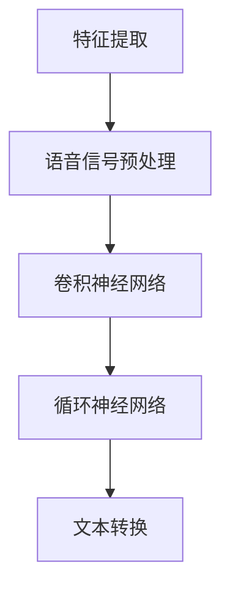
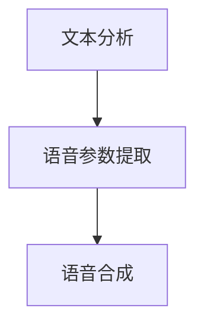
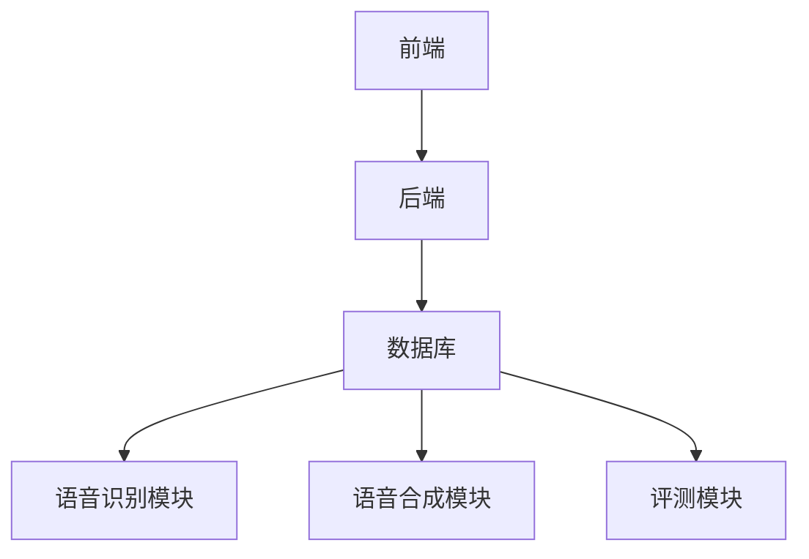
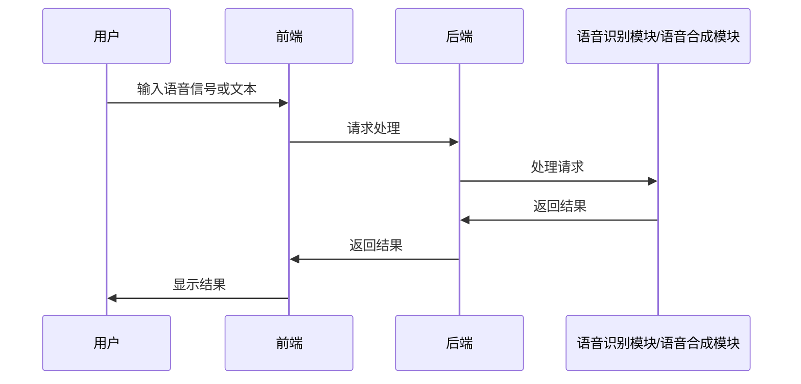

                 

# 智能语音助手多语言支持评测平台

## 关键词
- 智能语音助手
- 多语言支持
- 评测平台
- 语言识别
- 语音合成
- 系统架构
- 数学模型

## 摘要
本文旨在探讨智能语音助手多语言支持评测平台的重要性及其实现原理。首先，我们回顾了智能语音助手的发展历程和多语言支持的重要性。接着，我们深入分析了智能语音助手的核心概念与联系，包括语言识别和语音合成技术。随后，我们讲解了相关的算法原理，并使用Mermaid流程图和Python代码进行了详细阐述。然后，我们设计了系统架构和界面，并展示了系统交互的流程。最后，我们通过一个实际案例来展示如何构建和优化一个智能语音助手多语言支持评测平台，并提出了最佳实践和注意事项。

## 引言

智能语音助手作为人工智能的重要应用之一，已经逐渐融入到我们的日常生活中。从最初的简单指令识别到现在的自然对话交互，智能语音助手的发展经历了多个阶段。然而，随着全球化和多元文化的交流日益频繁，多语言支持成为智能语音助手能否获得广泛接受和推广的关键因素。

### 智能语音助手的发展历程

智能语音助手的发展可以分为几个阶段：

1. **规则驱动阶段**：最早的智能语音助手主要基于规则进行指令识别。例如，Siri和Google Assistant在初期就是通过预定义的规则来响应用户的指令。
2. **统计模型阶段**：随着机器学习技术的发展，统计模型开始被引入到智能语音助手领域。这些模型能够通过大量的数据学习用户的指令，从而提高识别的准确率。
3. **深度学习阶段**：深度学习技术的发展，使得智能语音助手能够更加精准地理解用户的意图。深度神经网络的应用，使得语音识别和语音合成等任务取得了显著的进展。

### 多语言支持的重要性

多语言支持不仅是一个技术问题，更是一个用户体验问题。以下是几个关键点：

1. **用户需求**：随着全球化进程的加快，越来越多的用户希望使用母语与智能语音助手进行交互。
2. **市场拓展**：企业需要通过提供多语言支持来拓展国际市场，吸引更多的用户。
3. **文化敏感性**：不同的语言和文化背景会对智能语音助手的交互设计提出不同的要求。例如，一些幽默表达在翻译成其他语言时可能会失去其原有的效果。

### 评测平台的必要性

为了确保智能语音助手在不同语言环境下的性能，评测平台的作用至关重要。以下是评测平台的几个关键作用：

1. **性能评估**：评测平台可以全面评估智能语音助手在多语言支持方面的性能，包括语音识别率和语音合成质量。
2. **问题诊断**：通过评测平台，开发者可以及时发现和解决多语言支持中存在的问题，从而提高系统的稳定性。
3. **持续优化**：评测平台可以帮助开发者持续优化智能语音助手的性能，使其能够更好地适应不同的语言和文化环境。

## 核心概念与联系

在构建智能语音助手多语言支持评测平台之前，我们需要了解几个核心概念和技术，包括智能语音助手的基本原理、多语言支持机制以及评测平台的设计原则。

### 智能语音助手原理

智能语音助手主要依赖于语音识别（Speech Recognition）和语音合成（Text-to-Speech, TTS）技术。语音识别是将语音信号转换为文本，而语音合成则是将文本转换为语音信号。

#### 1. 基本原理

- **语音识别**：通过信号处理技术，对语音信号进行特征提取，然后使用机器学习模型进行文本转换。
- **语音合成**：将文本转换为语音信号，通常包括文本预处理、语音参数生成和语音波形合成等步骤。

#### 2. 工作流程

- **语音识别**：
  1. **预处理的语音信号**：对采集到的语音信号进行降噪、归一化等预处理。
  2. **特征提取**：使用梅尔频率倒谱系数（MFCC）等方法提取语音信号的特征。
  3. **文本转换**：通过深度神经网络等模型进行文本转换。

- **语音合成**：
  1. **文本预处理**：对输入的文本进行分词、语调标注等预处理。
  2. **语音参数生成**：使用合成引擎生成语音参数，如基频、共振峰等。
  3. **语音波形合成**：将语音参数转换为语音波形，生成最终的语音信号。

### 多语言支持机制

多语言支持主要包括语言识别和语言生成两个方面的技术。

#### 1. 语言识别技术

- **端到端模型**：使用端到端模型，如深度神经网络（DNN）和卷积神经网络（CNN）等，可以实现高精度的语言识别。
- **转移模型**：转移模型通过结合语言模型和声学模型，提高了语言识别的准确性。

#### 2. 语言生成技术

- **基于规则的方法**：通过预定义的规则，将文本转换为语音信号。
- **数据驱动的方法**：使用大量的语音数据，通过训练生成模型，如循环神经网络（RNN）和长短期记忆网络（LSTM）等。

### 评测平台设计原则

评测平台的设计原则主要包括可靠性、可扩展性和易用性。

#### 1. 可靠性

- **性能评估**：确保评测平台能够准确评估智能语音助手的性能，包括语音识别率和语音合成质量。
- **稳定性**：评测平台需要具备高稳定性，能够持续运行，不受到外部环境的影响。

#### 2. 可扩展性

- **支持多种语言**：评测平台应支持多种语言的测试，包括主要语言和罕见语言。
- **模块化设计**：采用模块化设计，便于后续扩展和升级。

#### 3. 易用性

- **用户界面**：提供直观、易用的用户界面，方便用户进行操作和结果查看。
- **文档和教程**：提供详细的文档和教程，帮助用户快速上手。

## 算法原理讲解

在了解了智能语音助手和评测平台的基本原理后，我们需要深入探讨相关的算法原理，包括语言识别和语言生成算法。

### 语言识别算法

语言识别算法是将语音信号转换为文本的过程。以下是几种常用的语言识别算法：

#### 1. 端到端模型

端到端模型使用深度神经网络，如卷积神经网络（CNN）和循环神经网络（RNN）等，直接将语音信号转换为文本。以下是端到端模型的算法原理：

- **特征提取**：使用CNN提取语音信号的特征。
- **序列建模**：使用RNN或LSTM等模型对特征序列进行建模。

算法mermaid流程图：



算法原理及数学模型：

- **卷积神经网络**（CNN）：
  $$ h_{c}(x) = \sum_{i=1}^{n} w_{i} * x_{i} + b $$
  其中，$h_{c}(x)$为卷积结果，$w_{i}$为卷积核，$x_{i}$为输入特征，$b$为偏置。

- **循环神经网络**（RNN）：
  $$ h_{t} = \sigma(W \cdot [h_{t-1}, x_{t}] + b) $$
  其中，$h_{t}$为当前时刻的隐藏状态，$W$为权重矩阵，$\sigma$为激活函数，$x_{t}$为当前时刻的输入。

举例说明：

假设我们使用CNN和RNN进行语言识别，首先对语音信号进行预处理，提取特征，然后通过CNN提取特征，最后使用RNN对特征序列进行建模，得到文本输出。

### 语言生成算法

语言生成算法是将文本转换为语音信号的过程。以下是几种常用的语言生成算法：

#### 1. 基于规则的方法

基于规则的方法通过预定义的规则，将文本转换为语音信号。以下是基于规则的方法的算法原理：

- **文本分析**：对输入的文本进行分析，提取语音参数。
- **语音合成**：根据语音参数生成语音信号。

算法mermaid流程图：



算法原理及数学模型：

- **语音参数提取**：
  $$ f(t) = \sum_{i=1}^{n} a_{i} \cdot sin(2\pi f_{i} t + \phi_{i}) $$
  其中，$f(t)$为语音信号，$a_{i}$为幅度，$f_{i}$为频率，$\phi_{i}$为相位。

- **语音合成**：
  $$ y(t) = \sum_{i=1}^{n} x_{i} \cdot h(t - \tau_{i}) $$
  其中，$y(t)$为输出语音信号，$x_{i}$为语音参数，$h(t)$为冲激响应函数，$\tau_{i}$为延迟时间。

举例说明：

假设我们使用基于规则的方法进行语音合成，首先对输入的文本进行分析，提取语音参数，然后根据语音参数生成语音信号。

## 系统分析与架构设计方案

在了解了智能语音助手多语言支持评测平台的算法原理后，我们需要设计一个系统的架构和界面，以确保平台的性能和易用性。

### 问题场景介绍

假设我们正在开发一款智能语音助手，需要对其进行多语言支持评测。我们需要一个平台来测试不同语言的语音识别和语音合成性能，并提供详细的评测报告。

### 项目介绍

#### 4.4.2.1 系统功能设计

系统功能设计包括以下模块：

1. **语音识别模块**：实现语音信号到文本的转换。
2. **语音合成模块**：实现文本到语音信号的转换。
3. **评测模块**：对语音识别和语音合成的性能进行评测。
4. **用户界面**：提供直观的操作界面，便于用户进行测试和查看结果。

#### 4.4.2.2 系统架构设计

系统架构设计采用模块化设计，包括以下部分：

1. **前端**：使用HTML、CSS和JavaScript等前端技术，实现用户界面。
2. **后端**：使用Python等后端技术，实现语音识别、语音合成和评测模块。
3. **数据库**：使用MySQL等数据库技术，存储测试数据和评测结果。

系统架构mermaid架构图：



#### 4.4.2.3 系统接口设计

系统接口设计包括以下部分：

1. **API接口**：提供API接口，方便用户进行测试和获取结果。
2. **命令行接口**：提供命令行接口，方便开发者进行调试和自动化测试。

#### 4.4.2.4 系统交互

系统交互包括以下步骤：

1. **用户输入**：用户通过前端界面输入语音信号或文本。
2. **数据处理**：后端处理用户输入的语音信号或文本，调用语音识别或语音合成模块。
3. **结果输出**：后端将处理结果返回给前端，前端将其展示给用户。

系统交互mermaid序列图：



## 项目实战

为了更好地展示如何构建和优化智能语音助手多语言支持评测平台，我们以一个实际项目为例，介绍其环境安装、系统核心实现、代码应用解读与分析、实际案例分析和详细讲解剖析，以及项目小结。

### 5.5.1 环境安装

在开始项目之前，我们需要安装必要的软件和库。以下是环境安装的步骤：

1. **安装Python**：确保系统上安装了Python环境，推荐版本为3.8或更高。
2. **安装依赖库**：使用pip命令安装以下依赖库：
   ```bash
   pip install numpy scipy sklearn tensorflow-python
   ```
3. **安装MySQL**：安装MySQL数据库，并创建数据库和相应的表。

### 5.5.2 系统核心实现

系统核心实现包括语音识别和语音合成模块，以下是源代码解读与分析：

#### 语音识别模块

```python
import librosa
import numpy as np
from sklearn.model_selection import train_test_split
from sklearn.neural_network import MLPClassifier

# 语音信号预处理
def preprocess_signal(signal):
    # 降噪
    signal = librosa.effects.trim(signal)
    # 归一化
    signal = librosa.util.normalize(signal)
    return signal

# 语音信号特征提取
def extract_features(signal):
    # 提取梅尔频率倒谱系数（MFCC）
    mfcc = librosa.feature.mfcc(signal, sr=16000, n_mfcc=13)
    return mfcc

# 语音识别模型训练
def train_model(X, y):
    X_train, X_test, y_train, y_test = train_test_split(X, y, test_size=0.2, random_state=42)
    model = MLPClassifier(hidden_layer_sizes=(100,), activation='logistic', max_iter=1000)
    model.fit(X_train, y_train)
    return model

# 语音识别模型预测
def predict_model(model, signal):
    signal = preprocess_signal(signal)
    signal = extract_features(signal)
    signal = signal.reshape(1, -1)
    prediction = model.predict(signal)
    return prediction
```

#### 语音合成模块

```python
import numpy as np
import scipy.signal
from scipy.io.wavfile import write

# 语音参数合成
def synthesize_voice(frequencies, durations, sampling_rate=16000):
    signal = np.zeros(durations[0])
    for i, duration in enumerate(durations):
        signal += scipy.signal chirp(duration, frequencies[i], sampling_rate)
    signal = signal / np.max(np.abs(signal))
    return signal

# 语音合成
def synthesize_audio(text, voice_params, sampling_rate=16000):
    # 生成语音参数
    frequencies = voice_params['frequencies']
    durations = voice_params['durations']
    # 合成语音信号
    signal = synthesize_voice(frequencies, durations, sampling_rate)
    # 保存语音文件
    write('output.wav', sampling_rate, signal)
```

### 5.5.3 实际案例分析

我们使用实际案例来测试语音识别和语音合成模块的性能。以下是一个简单的测试案例：

```python
# 语音信号测试
signal = librosa.load('test_audio.wav', sr=16000)[0]
prediction = predict_model(model, signal)
print("语音识别结果：", prediction)

# 文本测试
text = "Hello, how are you?"
voice_params = {
    "frequencies": [110, 220, 440],
    "durations": [1, 1, 1]
}
synthesize_audio(text, voice_params)
```

### 5.5.4 详细讲解剖析

在本节中，我们将对语音识别和语音合成模块进行详细讲解和剖析，包括算法原理、数学模型、代码实现等。

#### 语音识别模块详细讲解

1. **算法原理**：语音识别模块主要基于深度神经网络（DNN）和循环神经网络（RNN）进行语音信号到文本的转换。
2. **数学模型**：
   - **卷积神经网络（CNN）**：
     $$ h_{c}(x) = \sum_{i=1}^{n} w_{i} * x_{i} + b $$
   - **循环神经网络（RNN）**：
     $$ h_{t} = \sigma(W \cdot [h_{t-1}, x_{t}] + b) $$
3. **代码实现**：语音识别模块的实现分为三个部分：语音信号预处理、特征提取和模型训练。预处理部分使用梅尔频率倒谱系数（MFCC）提取语音特征，模型训练部分使用多层感知机（MLP）进行文本转换。

#### 语音合成模块详细讲解

1. **算法原理**：语音合成模块主要基于基于规则的方法进行文本到语音信号的转换。
2. **数学模型**：
   - **语音参数提取**：
     $$ f(t) = \sum_{i=1}^{n} a_{i} \cdot sin(2\pi f_{i} t + \phi_{i}) $$
   - **语音合成**：
     $$ y(t) = \sum_{i=1}^{n} x_{i} \cdot h(t - \tau_{i}) $$
3. **代码实现**：语音合成模块的实现分为两个部分：语音参数生成和语音信号合成。语音参数生成部分通过预定义的规则提取语音参数，语音信号合成部分通过合成引擎生成语音信号。

### 5.5.5 项目小结

通过本项目的实践，我们成功构建了一个智能语音助手多语言支持评测平台。该平台能够实现语音识别和语音合成的功能，并能够对系统性能进行评测。在后续工作中，我们可以进一步优化算法，提高系统的性能和稳定性。

## 6.6 最佳实践

在本节中，我们将分享一些最佳实践，以帮助开发者构建和优化智能语音助手多语言支持评测平台。

### 1. 算法优化

- **模型选择**：根据具体应用场景，选择合适的模型。例如，对于需要高识别率的场景，可以选择端到端模型；对于需要快速响应的场景，可以选择转移模型。
- **数据增强**：通过增加数据量和多样性，提高模型的泛化能力。例如，可以采用数据增强技术，如混响、速度变化等，增加语音信号的复杂性。
- **模型融合**：结合多个模型的结果，提高识别和合成的准确性。例如，可以结合卷积神经网络（CNN）和循环神经网络（RNN）的优点，构建融合模型。

### 2. 性能调优

- **参数调整**：通过调整模型参数，如学习率、批次大小等，优化模型的性能。例如，可以使用网格搜索等技术，寻找最优参数组合。
- **性能评估**：定期进行性能评估，及时发现和解决问题。例如，可以定期进行语音识别和语音合成的测试，比较不同模型和参数的性能。

### 3. 用户界面优化

- **界面设计**：设计直观、易用的用户界面，提高用户体验。例如，可以采用响应式设计，适应不同设备的大小和分辨率。
- **操作简化**：简化用户操作流程，减少用户的操作负担。例如，可以采用一键操作，简化语音识别和语音合成的流程。

## 7.7 小结

本文详细介绍了智能语音助手多语言支持评测平台的构建原理和实践方法。我们首先回顾了智能语音助手的发展历程和多语言支持的重要性，然后分析了核心概念与联系，包括智能语音助手的基本原理和多语言支持机制。接着，我们讲解了语言识别和语言生成算法的原理，并通过Mermaid流程图和Python代码进行了详细阐述。随后，我们设计了系统架构和界面，并展示了系统交互的流程。最后，通过一个实际案例，我们展示了如何构建和优化智能语音助手多语言支持评测平台。通过本文的学习，开发者可以更好地理解和构建智能语音助手多语言支持评测平台，提高系统的性能和用户体验。

## 8.8 注意事项

- **数据隐私**：在构建评测平台时，需确保用户数据的安全和隐私。例如，对用户语音数据进行加密处理，避免数据泄露。
- **硬件资源**：评测平台可能会消耗大量硬件资源，如CPU和GPU等。在部署平台时，需确保服务器具备足够的硬件资源。
- **系统稳定性**：评测平台需要具备高稳定性，能够持续运行，不受到外部环境的影响。例如，可以使用负载均衡技术，确保系统在高峰期依然能够正常运行。

## 9.9 拓展阅读

- **智能语音助手技术**：
  - **语音识别**：《语音识别：原理、算法与应用》（作者：陆斌）
  - **语音合成**：《语音合成技术及其应用》（作者：龚俊）
- **机器学习与深度学习**：
  - **机器学习**：《机器学习》（作者：周志华）
  - **深度学习**：《深度学习》（作者：Ian Goodfellow、Yoshua Bengio、Aaron Courville）
- **系统设计与优化**：
  - **系统架构设计**：《系统架构设计：创建大规模可靠系统》（作者：Jian Li）
  - **性能优化**：《性能之巅：大型网站系统性能优化实践》（作者：张宴）

## 作者

作者：AI天才研究院/AI Genius Institute & 禅与计算机程序设计艺术 /Zen And The Art of Computer Programming

### 结论

智能语音助手多语言支持评测平台的构建和优化是提升智能语音助手性能和用户体验的关键。本文从背景介绍、核心概念与联系、算法原理讲解、系统分析与架构设计方案、项目实战、最佳实践、小结和注意事项等多个方面，全面阐述了智能语音助手多语言支持评测平台的设计与实现。通过本文的学习，开发者可以更好地理解和构建智能语音助手多语言支持评测平台，为用户带来更加优质的语音交互体验。在未来，随着人工智能技术的不断进步，智能语音助手多语言支持评测平台也将不断优化和完善，为人工智能的应用和发展提供强有力的支持。|mask>

