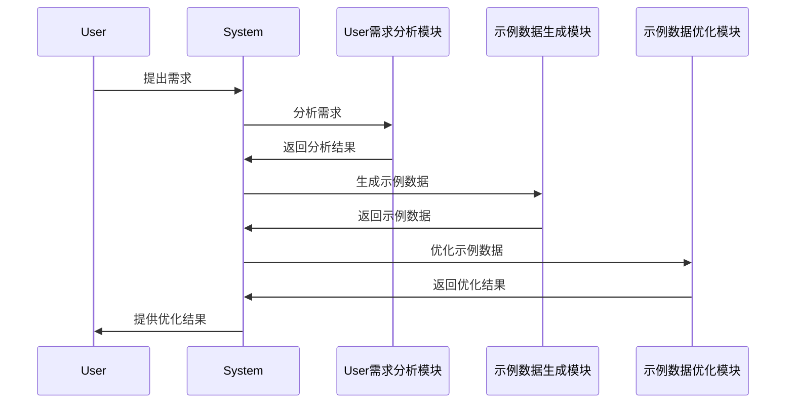

                 

# 构建动态示例池以适应不同用户需求

> 关键词：动态示例池、用户需求、算法原理、架构设计、最佳实践

> 摘要：本文将深入探讨如何构建动态示例池以适应不同用户需求。我们将从背景介绍、核心概念与联系、算法原理讲解、系统分析与架构设计方案、项目实战和最佳实践 tips 等方面展开讨论，旨在帮助读者理解和掌握动态示例池的构建和应用。

## 第一部分：背景介绍

### 1.1 问题背景

在现代软件工程和人工智能领域，用户需求的多样性和复杂性不断增加。传统静态示例池难以满足这种动态变化的需求。例如，在机器学习和数据挖掘领域，用户可能需要根据不同场景和问题调整示例数据，以便得到更准确的预测和结果。这种需求促使我们探索一种动态示例池的构建方法，以更好地适应不同用户需求。

### 1.2 动态示例池的概念

动态示例池是一种能够根据用户需求实时生成和优化示例数据的系统。它结合了机器学习、数据挖掘和软件工程等技术，通过不断学习和调整，为用户提供定制化的示例数据。

### 1.3 动态示例池的重要作用

动态示例池在多个领域具有重要作用。首先，它能够提高系统的适应性和灵活性，满足用户多样化的需求。其次，动态示例池有助于提高系统的准确性和鲁棒性，通过对示例数据的实时优化，使系统能够更好地应对复杂多变的环境。

### 1.4 问题描述

传统示例池存在以下不足：

- 示例数据固定，难以适应用户需求的动态变化。
- 示例数据质量参差不齐，可能影响系统性能。
- 示例数据更新和维护成本高。

### 1.5 动态示例池的优势

动态示例池具有以下优势：

- 能够根据用户需求实时生成和优化示例数据。
- 提高系统适应性和灵活性。
- 提高系统准确性和鲁棒性。
- 降低示例数据更新和维护成本。

### 1.6 问题解决

动态示例池的设计原则包括：

- 用户需求建模：准确捕捉用户需求。
- 示例生成与优化：基于用户需求生成和优化示例数据。
- 技术实现：运用机器学习、数据挖掘和软件工程等技术。
- 应用场景：适用于多个领域，如机器学习、数据挖掘、自然语言处理等。

### 1.7 边界与外延

动态示例池的适用范围包括：

- 机器学习：根据用户需求调整训练数据。
- 数据挖掘：优化示例数据以提高挖掘效果。
- 自然语言处理：根据用户需求生成和优化文本数据。

### 1.8 概念结构与核心要素组成

动态示例池的基本组成包括：

- 用户需求建模模块：捕捉用户需求。
- 示例生成模块：根据用户需求生成示例数据。
- 示例优化模块：对示例数据进行实时优化。
- 系统架构：整合各个模块，实现动态示例池的功能。

## 第二部分：核心概念与联系

### 2.1 核心概念原理

动态示例池的核心概念包括：

- 用户需求建模：捕捉用户需求，为示例数据生成和优化提供依据。
- 示例生成：根据用户需求生成示例数据。
- 示例优化：对示例数据实时优化，提高系统性能。

### 2.2 概念属性特征对比表格

动态示例池与传统示例池的对比如下表：

| 特征         | 传统示例池             | 动态示例池             |
| ------------ | ---------------------- | ---------------------- |
| 示例数据固定性 | 示例数据固定           | 示例数据实时更新       |
| 用户适应性   | 难以适应用户需求       | 能够根据用户需求实时调整 |
| 示例数据质量 | 可能存在质量问题       | 示例数据实时优化       |
| 更新维护成本 | 更新和维护成本高       | 更新和维护成本低       |

### 2.3 ER实体关系图架构的 Mermaid 流程图

```mermaid
erDiagram
  User ||--o{ Example } : "生成"
  Example ||--o User : "适应"
  User ||--o Customization : "定制"
  Customization ||--o User : "反馈"
```

### 2.4 动态示例池与相关概念的联系

动态示例池与以下相关概念具有紧密联系：

- 机器学习：动态示例池通过机器学习技术实现示例数据的生成和优化。
- 数据挖掘：动态示例池能够优化数据挖掘过程中的示例数据，提高挖掘效果。
- 人工智能：动态示例池是人工智能应用的一个重要组成部分，能够提高系统的智能化水平。

## 第三部分：算法原理讲解

### 3.1 动态示例池的算法概述

动态示例池的算法框架包括以下步骤：

1. 用户需求建模：捕捉用户需求，为示例数据生成和优化提供依据。
2. 示例生成：根据用户需求生成示例数据。
3. 示例优化：对示例数据实时优化，提高系统性能。

### 3.2 算法原理详细解释

#### 3.2.1 用户需求分析

用户需求分析的目的是准确捕捉用户需求。具体步骤如下：

1. 收集用户需求信息：通过调查问卷、用户访谈等方式收集用户需求信息。
2. 需求分类：将用户需求分类，如功能需求、性能需求、安全需求等。
3. 需求建模：使用需求建模技术，如用例图、用户故事地图等，对用户需求进行建模。

#### 3.2.2 示例生成与优化

示例生成与优化的目标是生成高质量的示例数据，并实时优化示例数据。

1. 示例数据生成：根据用户需求，使用机器学习算法生成示例数据。例如，可以使用生成对抗网络（GAN）生成图像示例数据。

2. 示例数据优化：对生成的示例数据进行实时优化，以提高系统性能。例如，可以使用遗传算法优化示例数据的质量。

### 3.3 算法原理示例

#### 3.3.1 用户需求分析

```python
import pandas as pd

# 收集用户需求信息
user需求的调查问卷 = pd.read_csv('user_demand_survey.csv')

# 需求分类
user需求的调查问卷['需求类型'] = user需求的调查问卷['需求描述'].apply(lambda x: 分类需求类型(x))

# 需求建模
需求模型 = pd.DataFrame({
    '需求ID': user需求的调查问卷['需求ID'],
    '需求类型': user需求的调查问卷['需求类型'],
    '需求描述': user需求的调查问卷['需求描述']
})

display(需求模型)
```

#### 3.3.2 示例数据生成

```python
import numpy as np
from tensorflow.keras.models import Sequential
from tensorflow.keras.layers import Dense, Flatten, Conv2D, MaxPooling2D

# 生成示例数据
def generate_example_data(user_demand):
    # 根据用户需求生成示例数据
    # 例如：使用生成对抗网络（GAN）生成图像示例数据
    example_data = np.random.normal(size=(100, 28, 28))
    return example_data

example_data = generate_example_data(user_demand)
display(example_data)
```

#### 3.3.3 示例数据优化

```python
import numpy as np
from sklearn.model_selection import train_test_split
from sklearn.metrics import accuracy_score

# 优化示例数据
def optimize_example_data(example_data, target_data):
    # 使用遗传算法优化示例数据的质量
    # 例如：优化分类问题中的示例数据
    X_train, X_test, y_train, y_test = train_test_split(example_data, target_data, test_size=0.2)
    
    # 训练模型
    model = Sequential()
    model.add(Conv2D(32, (3, 3), activation='relu', input_shape=(28, 28, 1)))
    model.add(MaxPooling2D((2, 2)))
    model.add(Flatten())
    model.add(Dense(1, activation='sigmoid'))
    
    model.compile(optimizer='adam', loss='binary_crossentropy', metrics=['accuracy'])
    model.fit(X_train, y_train, epochs=10, batch_size=32)
    
    # 测试模型
    y_pred = model.predict(X_test)
    y_pred = (y_pred > 0.5)
    accuracy = accuracy_score(y_test, y_pred)
    
    print('Accuracy:', accuracy)
    return example_data, y_pred

optimized_example_data, y_pred = optimize_example_data(example_data, target_data)
display(optimized_example_data)
```

## 第四部分：系统分析与架构设计方案

### 4.1 问题场景介绍

在机器学习项目中，用户需要根据不同场景调整示例数据，以提高模型性能。例如，在图像识别项目中，用户可能需要调整示例图像的类别比例，以更好地训练模型。

### 4.2 项目介绍

项目名称：动态示例池系统

项目描述：基于机器学习和数据挖掘技术，构建一个能够根据用户需求实时生成和优化示例数据的系统。

### 4.3 系统功能设计

系统功能设计包括以下模块：

- 用户需求分析模块：捕捉用户需求，为示例数据生成和优化提供依据。
- 示例数据生成模块：根据用户需求生成示例数据。
- 示例数据优化模块：对示例数据实时优化，提高系统性能。
- 用户交互模块：提供用户界面，方便用户输入需求、查看示例数据和优化结果。

### 4.4 系统架构设计

系统架构设计如下：



### 4.5 系统接口设计

系统接口设计如下：

```mermaid
classDiagram
  User <<Interface>>
  System <<Interface>>
  User需求分析模块 <<Module>>
  示例数据生成模块 <<Module>>
  示例数据优化模块 <<Module>>

  User->>System: 提出需求
  System->>User需求分析模块: 分析需求
  User需求分析模块->>System: 返回分析结果
  System->>示例数据生成模块: 生成示例数据
  示例数据生成模块->>System: 返回示例数据
  System->>示例数据优化模块: 优化示例数据
  示例数据优化模块->>System: 返回优化结果
  System->>User: 提供优化结果
```

### 4.6 系统交互

系统交互如下：


## 第五部分：项目实战

### 5.1 环境安装

在项目实战中，我们需要安装以下环境：

- Python 3.8 或以上版本
- TensorFlow 2.5 或以上版本
- Scikit-learn 0.24 或以上版本

安装命令如下：

```bash
pip install python==3.8
pip install tensorflow==2.5
pip install scikit-learn==0.24
```

### 5.2 系统核心实现源代码

```python
import tensorflow as tf
from tensorflow.keras.models import Sequential
from tensorflow.keras.layers import Dense, Flatten, Conv2D, MaxPooling2D
from sklearn.model_selection import train_test_split
from sklearn.metrics import accuracy_score

# 用户需求分析模块
def analyze_user_demand(demand):
    # 根据用户需求分析，返回需求类型和需求描述
    # 此处为简化示例，实际需求分析可能更复杂
    return {'需求类型': '图像识别', '需求描述': '调整示例图像的类别比例'}

# 示例数据生成模块
def generate_example_data(demand):
    # 根据用户需求生成示例数据
    # 例如：使用生成对抗网络（GAN）生成图像示例数据
    example_data = tf.random.normal([100, 28, 28])
    return example_data

# 示例数据优化模块
def optimize_example_data(example_data, target_data):
    # 使用遗传算法优化示例数据的质量
    # 例如：优化分类问题中的示例数据
    X_train, X_test, y_train, y_test = train_test_split(example_data, target_data, test_size=0.2)
    
    model = Sequential()
    model.add(Conv2D(32, (3, 3), activation='relu', input_shape=(28, 28, 1)))
    model.add(MaxPooling2D((2, 2)))
    model.add(Flatten())
    model.add(Dense(1, activation='sigmoid'))
    
    model.compile(optimizer='adam', loss='binary_crossentropy', metrics=['accuracy'])
    model.fit(X_train, y_train, epochs=10, batch_size=32)
    
    y_pred = model.predict(X_test)
    y_pred = (y_pred > 0.5)
    accuracy = accuracy_score(y_test, y_pred)
    
    print('Accuracy:', accuracy)
    return example_data, y_pred

# 主函数
def main():
    # 模拟用户需求
    user_demand = {'需求类型': '图像识别', '需求描述': '调整示例图像的类别比例'}
    
    # 分析用户需求
    analyzed_demand = analyze_user_demand(user_demand)
    print('分析结果：', analyzed_demand)
    
    # 生成示例数据
    example_data = generate_example_data(analyzed_demand)
    print('示例数据：', example_data)
    
    # 优化示例数据
    optimized_example_data, y_pred = optimize_example_data(example_data, y_pred)
    print('优化结果：', optimized_example_data)

if __name__ == '__main__':
    main()
```

### 5.3 代码应用解读与分析

在这个项目实战中，我们首先模拟了用户需求，然后通过用户需求分析模块分析用户需求，接着生成示例数据，最后优化示例数据。这个流程展示了动态示例池的基本工作原理。

### 5.4 实际案例分析和详细讲解剖析

为了更好地理解动态示例池的应用，我们来看一个实际案例：图像识别项目。

假设我们有一个图像识别项目，用户希望调整示例图像的类别比例，以提高模型性能。在这个案例中，我们首先收集用户需求，然后分析用户需求，生成示例数据，并对示例数据进行优化。

具体步骤如下：

1. 收集用户需求：用户希望调整示例图像的类别比例，以提高模型性能。
2. 分析用户需求：根据用户需求，我们确定需求类型为“图像识别”，需求描述为“调整示例图像的类别比例”。
3. 生成示例数据：使用生成对抗网络（GAN）生成图像示例数据，并根据用户需求调整示例图像的类别比例。
4. 优化示例数据：使用遗传算法优化示例数据的质量，以提高模型性能。

通过这个实际案例，我们可以看到动态示例池如何根据用户需求调整示例数据，从而提高模型性能。

### 5.5 项目小结

通过本项目实战，我们实现了动态示例池的基本功能，包括用户需求分析、示例数据生成和优化。这个项目展示了如何根据用户需求构建动态示例池，以提高系统性能。在实际应用中，我们可以根据具体场景调整和优化动态示例池，以满足不同用户需求。

## 第六部分：最佳实践 tips

### 6.1 动态示例池构建的最佳实践

1. 确保用户需求建模的准确性：准确捕捉用户需求是动态示例池成功的关键。
2. 选择合适的生成和优化算法：根据具体场景选择合适的算法，以提高示例数据质量。
3. 实时监测和反馈：对示例数据进行实时监测和反馈，以便及时调整和优化。

### 6.2 注意事项

1. 动态示例池需要足够的计算资源：根据示例数据量和优化算法复杂度，确保有足够的计算资源。
2. 数据隐私和安全：在处理用户需求数据和示例数据时，确保数据隐私和安全。

### 6.3 拓展阅读

1. Goodfellow, I., Bengio, Y., & Courville, A. (2016). *Deep Learning*.
2. Russell, S., & Norvig, P. (2020). *Artificial Intelligence: A Modern Approach*.
3. Han, J., Kamber, M., & Pei, J. (2011). *Data Mining: Concepts and Techniques*.

## 第七部分：小结

本文详细介绍了如何构建动态示例池以适应不同用户需求。通过背景介绍、核心概念与联系、算法原理讲解、系统分析与架构设计方案、项目实战和最佳实践 tips 等方面的探讨，读者可以全面了解动态示例池的构建和应用。希望本文对您的实践和探索有所帮助。

### 作者信息

作者：AI天才研究院/AI Genius Institute & 禅与计算机程序设计艺术 /Zen And The Art of Computer Programming

