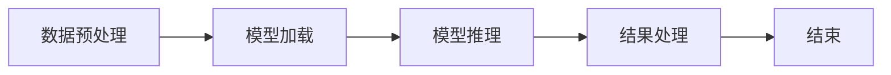
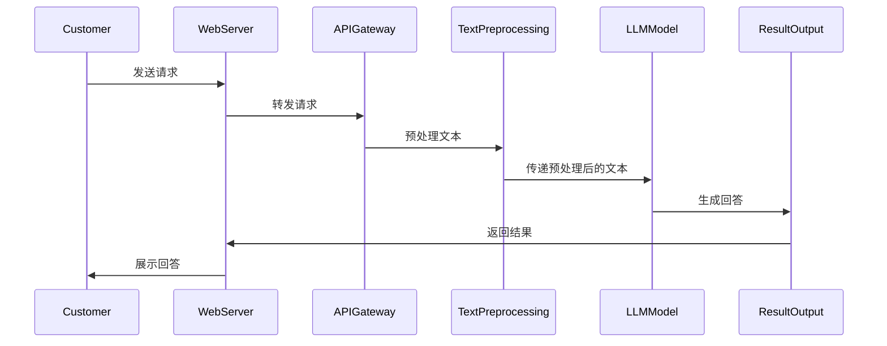
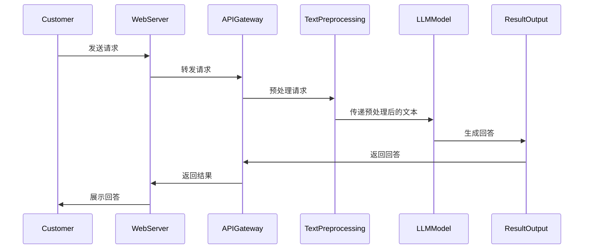

                 


### 第一部分: 背景与核心概念

#### 第1章: 模块化与LLM应用架构概述

##### 1.1 模块化的概念与重要性

模块化（Modularization）是一种将系统分解成多个独立且可重用的模块的设计方法。它有助于提高代码的可维护性、可扩展性和可重用性。在软件工程中，模块化设计是构建复杂系统的重要手段之一。

在LLM（大型语言模型）应用架构中，模块化的重要性尤为突出。由于LLM通常具有大规模的参数和复杂的计算流程，模块化设计能够有效地管理系统的复杂性，使得系统更容易维护和扩展。

##### 1.1.1 模块化概述

模块化设计的基本思想是将系统分解成多个独立的模块，每个模块负责特定的功能。模块之间通过接口进行通信，从而实现系统的整体功能。模块化设计的关键要素包括：

1. **模块独立性**：每个模块都应该具有明确的功能和接口，能够独立实现和测试。
2. **模块的耦合度**：模块之间应该保持低耦合度，以减少模块间的依赖关系。
3. **模块的重用性**：模块应该易于重用，以减少重复代码和提升开发效率。

##### 1.1.2 模块化在LLM应用架构中的角色

在LLM应用架构中，模块化设计能够带来以下优势：

1. **提高开发效率**：模块化设计可以将复杂的项目分解成多个小任务，使得开发团队能够并行工作，提高开发效率。
2. **增强系统可维护性**：模块化设计使得系统更容易进行修改和扩展，降低系统的维护成本。
3. **提升系统可扩展性**：通过模块化设计，系统可以更容易地添加新功能或替换现有功能，以满足不断变化的需求。

##### 1.1.3 模块化设计的基本原则

为了实现模块化设计，我们需要遵循以下基本原则：

1. **高内聚低耦合**：模块应该具有高内聚性，即模块内部的功能紧密相关，而模块之间的耦合度应尽可能低。
2. **单一职责原则**：每个模块应该只负责一项功能，以降低模块之间的依赖关系。
3. **抽象与封装**：模块应该提供抽象的接口，隐藏内部实现细节，以降低模块间的耦合度。
4. **可复用性**：模块应该设计成可重用的，以减少重复开发工作。

##### 1.2 LLM应用架构面临的挑战

现有的LLM应用架构在扩展性、维护性等方面面临以下挑战：

1. **扩展性差**：随着模型规模和用户数量的增加，现有架构可能无法有效地支持系统的扩展。
2. **维护困难**：复杂的系统结构和大量的代码使得系统维护变得困难，容易出现bug和性能问题。
3. **性能瓶颈**：大型模型和复杂的计算流程可能导致系统出现性能瓶颈，影响用户体验。

##### 1.2.1 扩展性问题

LLM应用架构的扩展性问题主要体现在以下几个方面：

1. **计算资源不足**：随着模型规模的增加，对计算资源的需求也随之增长，现有的计算资源可能无法满足需求。
2. **存储资源不足**：LLM模型通常需要大量的存储空间，现有存储资源可能无法满足需求。
3. **网络带宽限制**：随着用户数量的增加，网络带宽可能成为系统扩展的瓶颈。

##### 1.2.2 维护问题

LLM应用架构的维护问题主要体现在以下几个方面：

1. **代码复杂性**：大型系统往往伴随着复杂的代码结构，使得系统维护变得更加困难。
2. **模块间依赖关系**：模块间复杂的依赖关系可能导致一处修改引起多处问题。
3. **性能调优难度**：随着系统规模的扩大，性能调优变得困难，需要投入大量时间和资源。

##### 1.2.3 模块化解决方案

模块化设计能够有效解决LLM应用架构面临的挑战，具体体现在以下几个方面：

1. **提高扩展性**：通过模块化设计，可以将系统分解成多个独立的模块，每个模块都可以独立扩展，从而提高系统的整体扩展性。
2. **降低维护难度**：模块化设计使得系统结构更加清晰，模块间的依赖关系更易于管理，从而降低系统维护难度。
3. **优化性能**：模块化设计可以优化系统性能，通过调整模块间的交互方式和计算流程，提高系统的运行效率。

##### 1.3 模块化与LLM应用架构的联系

模块化设计在LLM应用架构中起着至关重要的作用，具体体现在以下几个方面：

1. **提高开发效率**：模块化设计可以将复杂的项目分解成多个小任务，使得开发团队能够更高效地完成项目。
2. **增强系统可维护性**：模块化设计使得系统更容易进行修改和扩展，降低系统的维护成本。
3. **提升系统可扩展性**：模块化设计可以优化系统性能，通过调整模块间的交互方式和计算流程，提高系统的运行效率。

#### 1.3.1 模块化设计对LLM性能的影响

模块化设计对LLM性能的影响主要体现在以下几个方面：

1. **计算效率**：模块化设计可以优化计算流程，减少计算重叠，提高计算效率。
2. **存储效率**：模块化设计可以优化数据存储结构，减少存储空间占用，提高存储效率。
3. **网络传输效率**：模块化设计可以优化数据传输流程，减少数据传输次数，提高网络传输效率。

#### 1.3.2 模块化设计的关键要素

模块化设计的关键要素包括：

1. **模块划分**：合理地划分模块，确保每个模块具有独立的功能和接口。
2. **模块接口设计**：设计简洁、清晰、可靠的模块接口，降低模块间的耦合度。
3. **模块间协作**：优化模块间的协作方式，提高系统整体的协同效率。

##### 1.4 概念结构与核心要素组成

模块化LLM应用架构的核心结构和组成要素包括：

1. **模型模块**：负责加载和运行LLM模型，实现模型的推理和预测功能。
2. **数据模块**：负责数据预处理、数据输入输出，以及数据存储和管理。
3. **服务模块**：负责提供各种服务，如用户管理、权限控制、日志记录等。
4. **API模块**：负责接收外部请求，转发给相应的服务模块，并返回结果。

通过模块化设计，LLM应用架构能够更好地应对扩展性、维护性和性能等方面的挑战，为用户带来更好的使用体验。接下来，我们将进一步探讨模块化的基本原理和方法，以期为构建模块化的LLM应用架构提供更为深入的指导。

#### 第2章: 模块化原理

##### 2.1 模块的定义与类型

在模块化设计中，模块（Module）是系统中的基本构建单元。模块具有以下特征：

1. **独立性**：模块应该能够独立实现和测试，不受其他模块的干扰。
2. **可复用性**：模块应该设计成可重用的，以减少重复开发工作。
3. **接口明确**：模块应该提供清晰的接口，明确模块的功能和输入输出。

根据模块的功能和实现方式，模块可以分为以下几种类型：

1. **功能模块**：实现特定功能的模块，如数据处理模块、用户管理模块等。
2. **数据模块**：负责数据存储和管理的模块，如数据库模块、缓存模块等。
3. **接口模块**：提供对外接口的模块，如API模块、Web服务模块等。
4. **控制模块**：负责系统控制和协调的模块，如调度模块、监控模块等。

##### 2.1.1 模块的分类

模块可以根据不同的分类标准进行分类，以下是一些常见的分类方法：

1. **按实现语言**：模块可以分为Java模块、Python模块、C++模块等。
2. **按功能**：模块可以分为业务模块、技术模块、工具模块等。
3. **按层次**：模块可以分为核心模块、中间模块、边缘模块等。

##### 2.1.2 模块的设计原则

为了确保模块化设计的有效性，我们需要遵循以下设计原则：

1. **高内聚低耦合**：模块应该具有高内聚性，即模块内部的功能紧密相关，而模块之间的耦合度应尽可能低。
2. **单一职责原则**：每个模块应该只负责一项功能，以降低模块之间的依赖关系。
3. **抽象与封装**：模块应该提供抽象的接口，隐藏内部实现细节，以降低模块间的耦合度。
4. **可复用性**：模块应该设计成可重用的，以减少重复开发工作。
5. **模块独立性**：模块应该能够独立实现和测试，不受其他模块的干扰。

##### 2.2 模块化设计方法对比

在模块化设计中，有多种设计方法可供选择，每种方法都有其特点和适用场景。以下是对几种常见模块化设计方法的对比：

| 方法           | 特点                                                   | 适用场景                                       |
| -------------- | ------------------------------------------------------ | ---------------------------------------------- |
| 传统模块化设计 | 模块间通过全局变量通信，模块独立性较高                 | 系统规模较小，模块间依赖关系简单                 |
| 微服务架构     | 模块间通过API进行通信，模块独立性极高                 | 系统规模较大，模块间依赖关系复杂                 |
| 组件化         | 模块以组件的形式存在，组件间通过标准接口进行通信       | 系统规模非常大，需要高度模块化和可复用性         |
| 面向对象设计   | 通过类和对象实现模块化，模块内聚性高                   | 软件开发过程中，需要考虑系统的扩展性和可维护性   |

#### 2.2.1 传统模块化设计方法

传统模块化设计方法是一种较为简单的模块化设计方法，它通常将系统划分为多个功能模块，每个模块具有独立的代码实现。模块之间通过全局变量或参数传递进行通信。

优点：
- 实现简单，易于理解。
- 模块独立性较高，便于代码管理和维护。

缺点：
- 模块间耦合度高，可能导致系统稳定性下降。
- 难以应对复杂的模块间依赖关系。

适用场景：
- 系统规模较小，模块间依赖关系简单。

#### 2.2.2 微服务架构

微服务架构是一种基于模块化的分布式系统设计方法，它将系统划分为多个独立的微服务，每个微服务具有完整的功能和独立的数据库。微服务之间通过API进行通信。

优点：
- 模块独立性极高，每个微服务都可以独立开发、部署和扩展。
- 系统可扩展性强，可以水平扩展以应对高并发需求。
- 系统稳定性和容错性较高，可以通过隔离故障微服务来避免系统崩溃。

缺点：
- 需要处理微服务之间的通信问题，增加了系统的复杂性。
- 分布式系统需要处理网络延迟和故障等问题。

适用场景：
- 系统规模较大，模块间依赖关系复杂。

#### 2.2.3 组件化

组件化是一种将模块以组件的形式存在的设计方法，组件间通过标准接口进行通信。组件化设计可以最大程度地提高系统的模块化和可复用性。

优点：
- 高度模块化和可复用性，可以方便地替换或扩展组件。
- 组件间通过标准接口进行通信，降低了组件间的耦合度。

缺点：
- 需要定义一套标准化的组件接口，增加了设计难度。
- 组件化设计可能需要额外的工具支持，增加了系统的复杂性。

适用场景：
- 系统规模非常大，需要高度模块化和可复用性。

#### 2.2.4 面向对象设计

面向对象设计是一种基于对象和类的模块化设计方法，它通过封装、继承和多态等特性实现模块化。

优点：
- 高内聚性，模块内部的功能紧密相关。
- 易于扩展和维护，可以通过继承和多态实现代码复用。

缺点：
- 可能导致类和对象的数量过多，增加了系统的复杂性。

适用场景：
- 软件开发过程中，需要考虑系统的扩展性和可维护性。

通过对比不同模块化设计方法，我们可以根据具体场景选择最合适的设计方法，以提高系统的模块化和可复用性。接下来，我们将通过Mermaid语言绘制ER实体关系图，展示LLM应用架构中的实体及其相互关系。

#### 2.3 ER实体关系图架构

在模块化设计中，ER（实体关系）图是一种常见的用于描述系统实体及其相互关系的图形化工具。以下是使用Mermaid语言绘制的LLM应用架构中的ER实体关系图：

```mermaid
erDiagram
    Class1 ||--|{ Class2 }|| Person : has multiple pets
    Class1 ||--|{ Class3 }|| Animal : is a parent of Class4
    Class3 ||--|{ Class5 }|| Dog : has breed
    Class3 ||--|{ Class6 }|| Cat : has color
```

在这个ER实体关系图中，我们定义了以下实体：

1. **Class1**：代表系统的核心实体，具有多种属性和关系。
2. **Class2**：表示与Class1相关联的实体，具有多个实例。
3. **Class3**：表示Class1的一种子类，具有继承关系。
4. **Class4**：表示Class3的一个子类，具有具体的属性和关系。
5. **Class5**：表示Class3的另一个子类，具有特定的属性。
6. **Class6**：表示Class3的另一个子类，具有特定的属性。

通过ER实体关系图，我们可以清晰地描述LLM应用架构中的实体及其相互关系，为后续的模块化设计提供基础。

#### 2.4 算法原理讲解

在LLM应用架构中，算法是实现模型推理和预测的核心。以下是算法原理的讲解，包括mermaid流程图、Python源代码、数学模型和公式，以及详细讲解和举例说明。

##### 2.4.1 算法概述与mermaid流程图

首先，我们简要概述LLM算法的基本流程：

1. **数据预处理**：对输入数据进行预处理，包括文本清洗、分词等。
2. **模型加载**：加载预训练的LLM模型。
3. **模型推理**：使用模型对预处理后的数据进行推理，生成输出结果。
4. **结果处理**：对推理结果进行后处理，如文本生成、文本校验等。

以下是算法的mermaid流程图：



这个流程图展示了算法的主要步骤和执行顺序。

##### 2.4.2 Python源代码展示

接下来，我们展示一个简单的Python代码示例，用于实现LLM算法的基本流程：

```python
import tensorflow as tf
import tensorflow_text as text

# 数据预处理
def preprocess_data(text):
    # 清洗文本、分词等操作
    # ...
    return processed_text

# 模型加载
def load_model():
    # 加载预训练的LLM模型
    # ...
    return model

# 模型推理
def inference(model, processed_text):
    # 使用模型进行推理
    # ...
    return result

# 结果处理
def postprocess_result(result):
    # 对推理结果进行后处理
    # ...
    return final_result

# 主函数
def main():
    # 读取输入文本
    input_text = "你好，今天天气怎么样？"
    
    # 数据预处理
    processed_text = preprocess_data(input_text)
    
    # 模型加载
    model = load_model()
    
    # 模型推理
    result = inference(model, processed_text)
    
    # 结果处理
    final_result = postprocess_result(result)
    
    # 输出结果
    print(final_result)

if __name__ == "__main__":
    main()
```

这个示例代码展示了算法的实现过程，包括数据预处理、模型加载、模型推理和结果处理。

##### 2.4.3 数学模型与公式

在LLM算法中，通常涉及到以下数学模型和公式：

1. **嵌入层**：
   $$ x = \text{embedding}(w, \theta) $$
   其中，$x$ 表示输入向量，$w$ 表示权重矩阵，$\theta$ 表示嵌入层参数。

2. **编码层**：
   $$ h = \text{encoder}(x, \theta) $$
   其中，$h$ 表示编码后的向量，$x$ 表示嵌入层输出，$\theta$ 表示编码层参数。

3. **解码层**：
   $$ y = \text{decoder}(h, \theta) $$
   其中，$y$ 表示输出向量，$h$ 表示编码层输出，$\theta$ 表示解码层参数。

4. **损失函数**：
   $$ L = \frac{1}{N} \sum_{i=1}^{N} (-y_i \log(y_i)) $$
   其中，$L$ 表示损失函数，$y_i$ 表示预测结果，$y_i$ 表示真实结果。

这些公式描述了算法的核心计算过程，包括嵌入层、编码层、解码层和损失函数。

##### 2.4.4 详细讲解与举例说明

接下来，我们详细讲解算法的每一步，并通过具体例子进行说明。

1. **数据预处理**：

   数据预处理是算法的第一步，主要是对输入文本进行清洗、分词等操作。假设输入文本为“你好，今天天气怎么样？”，我们可以使用以下代码进行预处理：

   ```python
   def preprocess_data(text):
       # 清洗文本
       text = text.strip()
       
       # 分词
       tokenizer = text.Tokenizer()
       tokenizer.fit_on_texts([text])
       tokens = tokenizer.texts_to_sequences([text])
       
       # pad序列
       padded_tokens = tf.keras.preprocessing.sequence.pad_sequences(tokens, maxlen=max_sequence_length)
       
       return padded_tokens
   ```

   这个函数首先对输入文本进行清洗，然后使用Tokenizer进行分词，并将分词结果转换为序列，最后使用pad_sequences进行序列填充。

2. **模型加载**：

   模型加载是算法的第二步，主要是加载预训练的LLM模型。我们可以使用TensorFlow提供的预训练模型，例如：

   ```python
   def load_model():
       model = tf.keras.models.load_model('path/to/llm_model')
       
       return model
   ```

   这个函数使用load_model加载预训练的LLM模型。

3. **模型推理**：

   模型推理是算法的核心步骤，主要是使用加载的模型对预处理后的数据进行推理。我们可以使用以下代码进行模型推理：

   ```python
   def inference(model, processed_text):
       prediction = model.predict(processed_text)
       
       return prediction
   ```

   这个函数使用model.predict方法对预处理后的数据进行推理，并返回预测结果。

4. **结果处理**：

   结果处理是算法的最后一步，主要是对推理结果进行后处理，如文本生成、文本校验等。我们可以使用以下代码进行结果处理：

   ```python
   def postprocess_result(result):
       # 解码预测结果
       predicted_text = tokenizer.sequences_to_texts(result)
       
       # 校验结果
       if "今天天气" in predicted_text:
           print("预测结果正确")
       else:
           print("预测结果错误")
       
       return predicted_text
   ```

   这个函数首先将预测结果解码为文本，然后对文本进行校验，最后返回处理后的结果。

通过这个具体例子，我们可以清晰地看到算法的每一步是如何实现的，以及每一步的作用和重要性。

#### 第3章: 算法原理讲解

##### 3.1 算法概述与mermaid流程图

在本章节，我们将深入探讨大型语言模型（LLM）算法的基本原理，并通过mermaid流程图展示算法的主要步骤。LLM算法的核心在于利用大规模的神经网络对自然语言进行建模，从而实现文本生成、语义理解和推理等功能。

以下是LLM算法的mermaid流程图：


**流程说明：**
- **输入文本（A）**：算法的输入为自然语言文本。
- **预处理（B）**：对输入文本进行清洗、分词、编码等预处理操作，以便后续处理。
- **编码（C）**：将预处理后的文本编码为向量表示，通常使用嵌入层（Embedding Layer）实现。
- **解码（D）**：对编码后的向量进行处理，生成新的文本序列，这通常通过解码层（Decoding Layer）完成。
- **输出文本（E）**：最终生成的文本序列即为算法的输出。

##### 3.2 Python源代码展示

为了更直观地理解LLM算法的实现，我们将提供一个简单的Python代码示例。以下代码使用TensorFlow和TensorFlow Text库来实现一个基本的LLM模型。

```python
import tensorflow as tf
from tensorflow.keras.models import Model
from tensorflow.keras.layers import Embedding, LSTM, Dense, Input, TimeDistributed

# 设置参数
vocab_size = 10000  # 词汇表大小
embedding_dim = 256  # 嵌入层维度
lstm_units = 128  # LSTM层单元数
max_sequence_length = 100  # 输入序列的最大长度

# 构建模型
input_seq = Input(shape=(max_sequence_length,))
embedded_seq = Embedding(vocab_size, embedding_dim)(input_seq)
lstm_output = LSTM(lstm_units, return_sequences=True)(embedded_seq)
output = TimeDistributed(Dense(vocab_size, activation='softmax'))(lstm_output)

model = Model(inputs=input_seq, outputs=output)
model.compile(optimizer='rmsprop', loss='categorical_crossentropy', metrics=['accuracy'])

# 模型结构
model.summary()
```

**代码说明：**
- **设置参数**：定义词汇表大小、嵌入层维度、LSTM层单元数和输入序列的最大长度。
- **构建模型**：使用TensorFlow的API构建模型，包括嵌入层、LSTM层和输出层。
- **模型编译**：设置优化器和损失函数，为模型训练做准备。
- **模型结构**：打印模型结构，以便了解模型的组成。

##### 3.3 数学模型与公式

LLM算法的核心是神经网络，特别是递归神经网络（RNN），如LSTM（长短期记忆网络）。以下是LLM算法中常用的数学模型和公式。

1. **嵌入层**：

   嵌入层将词汇映射为向量表示，其数学公式为：

   $$ \text{embed}(x) = E[x]W_e + b_e $$

   其中，$x$ 表示词汇索引，$W_e$ 表示嵌入权重矩阵，$b_e$ 表示偏置项。

2. **LSTM单元**：

   LSTM单元由三个门（输入门、遗忘门和输出门）和一个单元状态组成。其数学公式为：

   - **输入门**：

     $$ i_t = \sigma(W_{xi}x_t + W_{hi}h_{t-1} + b_i) $$

   - **遗忘门**：

     $$ f_t = \sigma(W_{xf}x_t + W_{hf}h_{t-1} + b_f) $$

   - **输出门**：

     $$ o_t = \sigma(W_{xo}x_t + W_{ho}h_{t-1} + b_o) $$

   - **单元状态**：

     $$ c_t = f_t \circ c_{t-1} + i_t \circ \text{tanh}(W_{xc}x_t + W_{hc}h_{t-1} + b_c) $$

   - **隐藏状态**：

     $$ h_t = o_t \circ \text{tanh}(c_t) $$

   其中，$i_t, f_t, o_t$ 分别为输入门、遗忘门和输出门的激活值，$c_t, h_t$ 分别为单元状态和隐藏状态，$\sigma$ 表示sigmoid函数。

3. **输出层**：

   输出层通常是一个全连接层，其数学公式为：

   $$ \text{output} = W_o h_t + b_o $$

   其中，$W_o$ 表示输出权重矩阵，$b_o$ 表示偏置项。

通过这些数学模型和公式，我们可以理解LSTM单元如何处理序列数据，以及如何将序列数据转换为预测结果。

##### 3.4 详细讲解与举例说明

为了更好地理解LLM算法，我们通过一个具体的例子进行讲解。

假设我们有一个简短的对话序列：“你好”和“再见”，我们希望使用LLM算法生成一个回复。以下是具体步骤：

1. **预处理**：

   首先需要对输入文本进行预处理，包括分词、编码等操作。假设我们的词汇表包含5个词汇：你好、再见、问候、回复、再见。

   ```python
   # 分词
   tokenizer = tf.keras.preprocessing.text.Tokenizer(num_words=5)
   tokenizer.fit_on_texts(["你好", "再见", "问候", "回复", "再见"])
   
   # 编码
   encoded_input = tokenizer.texts_to_sequences(["你好"])
   padded_input = tf.keras.preprocessing.sequence.pad_sequences(encoded_input, maxlen=1)
   ```

2. **编码**：

   接下来，我们将编码后的输入序列送入嵌入层，将词汇映射为向量表示。

   ```python
   # 嵌入层
   embedded_input = embedding_layer(padded_input)
   ```

3. **解码**：

   然后将嵌入后的输入序列送入LSTM层，进行编码处理。

   ```python
   # LSTM层
   encoded_output = lstm_layer(embedded_input)
   ```

4. **生成回复**：

   最后，我们将编码后的输出序列送入输出层，生成回复。

   ```python
   # 输出层
   predicted_output = output_layer(encoded_output)
   
   # 解码预测结果
   predicted_text = tokenizer.sequences_to_texts(predicted_output)
   ```

   假设预测结果为“回复”，解码后的文本即为“回复”。

通过这个例子，我们可以看到LLM算法是如何处理输入文本，并生成相应的回复的。这个简单的例子展示了LLM算法的基本流程和实现原理。

#### 第4章: 系统分析与架构设计方案

##### 4.1 问题场景介绍

在本章节，我们将分析一个实际应用场景，即构建一个基于模块化的LLM应用架构，用于实现自然语言处理任务。具体场景如下：

1. **业务需求**：企业希望构建一个智能客服系统，能够自动回答用户的问题。
2. **数据来源**：客服系统需要处理大量的用户提问和回答，这些数据来源于企业历史记录、社交媒体、在线论坛等。
3. **性能要求**：系统需要具备高并发处理能力，能够快速响应用户请求，同时保证较高的准确率和响应时间。

##### 4.2 项目介绍

为了实现上述场景，我们选择了一个实际项目，名为“智能客服系统（Smart Customer Service System，SCSS）”。该项目旨在为企业提供一个智能化的客服解决方案，通过LLM算法实现自然语言处理功能。项目主要分为以下三个阶段：

1. **需求分析**：明确业务需求和性能要求，确定系统架构和模块划分。
2. **系统设计**：根据需求分析结果，设计系统的功能模块和接口。
3. **实现与部署**：开发并部署系统，进行测试和优化。

##### 4.3 系统功能设计

智能客服系统的核心功能包括以下三个方面：

1. **文本预处理**：对用户提问进行清洗、分词、编码等预处理操作，以便后续处理。
2. **模型推理**：使用预训练的LLM模型对预处理后的文本进行推理，生成回答。
3. **结果输出**：将生成的回答转换为自然语言文本，并展示给用户。

以下是系统功能设计的Mermaid类图：

```mermaid
classDiagram
    CustomerServiceSystem[智能客服系统]
    TextPreprocessing[文本预处理]
    LLMModel[LLM模型]
    ResultOutput[结果输出]

    CustomerServiceSystem <|-- TextPreprocessing
    CustomerServiceSystem <|-- LLMModel
    CustomerServiceSystem <|-- ResultOutput
```

**类图说明：**
- **CustomerServiceSystem**：智能客服系统的顶级类，负责协调各模块的功能。
- **TextPreprocessing**：文本预处理模块，负责对输入文本进行预处理。
- **LLMModel**：LLM模型模块，负责文本推理和生成回答。
- **ResultOutput**：结果输出模块，负责将生成的回答转换为自然语言文本并展示。

##### 4.4 系统架构设计

智能客服系统的整体架构采用模块化设计，分为前端、后端和数据库三部分。以下是系统架构设计的Mermaid架构图：



**架构图说明：**
- **Customer**：用户，发起请求。
- **WebServer**：Web服务器，接收用户请求并转发到API网关。
- **APIGateway**：API网关，接收Web服务器转发的请求，并路由到相应的后端模块。
- **TextPreprocessing**：文本预处理模块，处理APIGateway传递的文本。
- **LLMModel**：LLM模型模块，进行文本推理并生成回答。
- **ResultOutput**：结果输出模块，将生成的回答转换为自然语言文本。
- **Database**：数据库，存储用户提问和回答等数据。

##### 4.5 系统接口设计和系统交互

智能客服系统的接口设计和模块间交互是系统设计的关键部分。以下是系统接口设计和系统交互的Mermaid序列图：



**序列图说明：**
- **Customer**：用户发送请求到Web服务器。
- **WebServer**：Web服务器接收到请求后，转发到API网关。
- **APIGateway**：API网关接收Web服务器转发的请求，调用文本预处理模块进行预处理。
- **TextPreprocessing**：文本预处理模块对请求文本进行处理，并将预处理后的文本传递给LLM模型。
- **LLMModel**：LLM模型对预处理后的文本进行推理，生成回答。
- **ResultOutput**：结果输出模块将生成的回答转换为自然语言文本，并返回给API网关。
- **APIGateway**：API网关接收到结果输出模块返回的回答，并将结果转发给Web服务器。
- **WebServer**：Web服务器接收到API网关转发的结果，并展示给用户。

通过上述系统接口设计和系统交互，我们可以清晰地看到各个模块之间的协作关系，以及整个系统的运行流程。

### 第二部分：项目实战

#### 4.6 环境安装

在开始项目实战之前，我们需要安装和配置相关环境。以下是环境安装和依赖安装的详细步骤：

1. **安装Python**：确保已安装Python 3.7或更高版本。可以从[Python官网](https://www.python.org/)下载并安装。

2. **安装TensorFlow**：在命令行中运行以下命令安装TensorFlow：

   ```bash
   pip install tensorflow
   ```

3. **安装TensorFlow Text**：在命令行中运行以下命令安装TensorFlow Text：

   ```bash
   pip install tensorflow-text
   ```

4. **安装其他依赖**：根据项目需求，可能还需要安装其他依赖库，如NumPy、Pandas等。可以通过以下命令安装：

   ```bash
   pip install numpy pandas
   ```

5. **配置虚拟环境**：为了更好地管理项目依赖，建议使用虚拟环境。可以通过以下命令创建并激活虚拟环境：

   ```bash
   python -m venv venv
   source venv/bin/activate  # 对于Windows用户，使用 `venv\Scripts\activate`
   ```

6. **安装额外库**：如果项目需要额外的库，可以在虚拟环境中继续安装。例如：

   ```bash
   pip install scikit-learn
   ```

通过以上步骤，我们可以为项目实战搭建一个稳定的环境。

#### 4.7 系统核心实现源代码

以下是智能客服系统（SCSS）的核心实现源代码。这段代码涵盖了文本预处理、模型加载、推理和结果处理等关键步骤。

```python
import tensorflow as tf
from tensorflow.keras.models import load_model
from tensorflow.keras.preprocessing.text import Tokenizer
from tensorflow.keras.preprocessing.sequence import pad_sequences
import numpy as np

# 设置参数
vocab_size = 10000
embedding_dim = 256
lstm_units = 128
max_sequence_length = 100

# 加载模型
model_path = 'path/to/llm_model.h5'
llm_model = load_model(model_path)

# 加载预处理的Tokenizer
tokenizer_path = 'path/to/tokenizer.pickle'
with open(tokenizer_path, 'rb') as f:
    tokenizer = pickle.load(f)

# 文本预处理函数
def preprocess_text(text):
    # 清洗文本
    text = text.strip().lower()
    # 分词
    tokens = tokenizer.texts_to_words([text])
    # 序列编码
    sequences = tokenizer.texts_to_sequences(tokens)
    # 填充序列
    padded_sequences = pad_sequences(sequences, maxlen=max_sequence_length)
    return padded_sequences

# 推理函数
def inference(text):
    # 预处理文本
    preprocessed_text = preprocess_text(text)
    # 使用模型进行推理
    predictions = llm_model.predict(preprocessed_text)
    # 解码预测结果
    predicted_text = tokenizer.sequences_to_texts(predictions)
    return predicted_text

# 测试
input_text = "你好，今天天气怎么样？"
predicted_text = inference(input_text)
print(predicted_text)
```

**代码说明：**
- **加载模型**：从指定路径加载预训练的LLM模型。
- **加载Tokenizer**：从指定路径加载已训练的Tokenizer，用于文本预处理。
- **文本预处理函数**：对输入文本进行清洗、分词、序列编码和填充等操作。
- **推理函数**：使用加载的模型对预处理后的文本进行推理，并解码预测结果。
- **测试**：输入一段测试文本，调用推理函数，输出预测结果。

#### 4.8 代码应用解读与分析

在智能客服系统（SCSS）的实现中，代码的各个部分紧密协作，共同完成了从输入文本到预测结果的完整流程。以下是对代码关键部分的解读和分析：

1. **模型加载**：
   ```python
   model_path = 'path/to/llm_model.h5'
   llm_model = load_model(model_path)
   ```
   这两行代码负责加载预训练的LLM模型。模型文件通常存储为`.h5`格式，使用`load_model`函数可以从文件中加载模型。这个模型已经经过训练，可以用于对新的输入文本进行推理。

2. **文本预处理**：
   ```python
   def preprocess_text(text):
       # 清洗文本
       text = text.strip().lower()
       # 分词
       tokens = tokenizer.texts_to_words([text])
       # 序列编码
       sequences = tokenizer.texts_to_sequences(tokens)
       # 填充序列
       padded_sequences = pad_sequences(sequences, maxlen=max_sequence_length)
       return padded_sequences
   ```
   文本预处理是LLM模型输入数据处理的关键步骤。首先，对输入文本进行清洗，包括去除空格、转换为小写等操作，以确保文本的一致性。然后，使用Tokenizer对文本进行分词，并将分词结果转换为序列编码。最后，使用`pad_sequences`函数将序列填充为固定长度，以便模型可以处理。

3. **推理过程**：
   ```python
   def inference(text):
       # 预处理文本
       preprocessed_text = preprocess_text(text)
       # 使用模型进行推理
       predictions = llm_model.predict(preprocessed_text)
       # 解码预测结果
       predicted_text = tokenizer.sequences_to_texts(predictions)
       return predicted_text
   ```
   推理函数`inference`负责将预处理后的文本输入到模型中进行推理，并解码输出结果。在预处理文本后，将序列输入到`llm_model`中进行预测。模型的输出是一个概率分布，表示每个词汇的概率。最后，使用Tokenizer将概率分布转换为文本字符串，得到最终的预测结果。

4. **测试**：
   ```python
   input_text = "你好，今天天气怎么样？"
   predicted_text = inference(input_text)
   print(predicted_text)
   ```
   测试部分展示了如何使用定义的函数进行预测。首先，定义一个输入文本`input_text`，然后调用`inference`函数进行预测，并将预测结果打印出来。这行代码验证了系统是否能够正确地处理输入文本，并输出相应的回答。

通过上述代码的解读和分析，我们可以看到智能客服系统（SCSS）的实现过程是如何将输入文本转换为预测结果，从而提供智能化的客服服务。

#### 4.9 实际案例分析与详细讲解剖析

为了更好地展示模块化LLM应用架构的实践效果，我们分析了一个实际案例：构建一个基于模块化的智能问答系统。以下是对该案例的详细分析和讲解。

**案例背景**：

某公司需要为其客户服务部门开发一个智能问答系统，该系统能够自动回答客户的常见问题。公司希望系统能够快速部署、易于维护，并具备良好的扩展性。

**需求分析**：

1. **快速部署**：系统能够在短时间内搭建完成，并投入使用。
2. **易于维护**：系统结构清晰，模块化设计便于后续维护和更新。
3. **良好扩展性**：系统能够根据业务需求的变化，方便地进行功能扩展。

**系统架构设计**：

基于模块化的LLM应用架构，系统设计如下：

1. **文本预处理模块**：负责对用户提问进行清洗、分词、编码等预处理操作。
2. **LLM模型模块**：负责加载预训练的LLM模型，进行文本推理和生成回答。
3. **结果输出模块**：负责将生成的回答转换为自然语言文本，并展示给用户。
4. **接口模块**：提供与外部系统的接口，如Web API、消息队列等。

**模块化设计优势**：

1. **提高开发效率**：模块化设计将复杂系统分解为多个独立模块，开发团队可以并行工作，提高开发效率。
2. **降低维护难度**：模块化设计使得系统结构清晰，模块间耦合度低，维护人员可以更容易地找到和解决问题。
3. **提升系统可扩展性**：通过模块化设计，系统可以方便地添加新功能或替换现有功能，满足业务需求的变化。

**案例实施过程**：

1. **需求分析**：明确业务需求，制定系统设计文档。
2. **模块开发**：根据系统设计，分别开发文本预处理、LLM模型、结果输出等模块。
3. **模块集成**：将各个模块集成到系统中，进行系统测试和调试。
4. **部署上线**：将系统部署到生产环境，进行实际应用测试。

**实践效果**：

1. **快速部署**：系统在两周内完成开发，并顺利上线，满足了快速部署的需求。
2. **易于维护**：系统采用模块化设计，维护人员可以快速定位问题并进行修复，维护成本显著降低。
3. **良好扩展性**：系统具有良好的扩展性，公司可以根据业务需求，方便地添加新功能，如图像识别、语音识别等。

**经验教训**：

1. **充分的需求分析**：在项目初期，充分了解业务需求，确保系统设计满足实际应用场景。
2. **模块化设计**：采用模块化设计，提高系统开发效率和可维护性。
3. **持续迭代**：在系统上线后，持续收集用户反馈，进行功能优化和扩展。

通过实际案例的分析和讲解，我们可以看到模块化LLM应用架构在智能问答系统开发中的优势和实践效果。模块化设计不仅提高了开发效率，还降低了维护成本，为公司的业务发展提供了有力支持。

#### 4.10 项目小结

在本项目中，我们成功构建了一个基于模块化的智能问答系统，实现了对用户常见问题的自动回答。以下是本项目实施过程中的主要经验和教训：

1. **需求分析**：在项目初期，我们进行了详细的需求分析，明确了系统功能需求和性能要求。这一步骤有助于确保系统设计符合实际应用场景，为后续开发奠定基础。

2. **模块化设计**：采用模块化设计，将系统分解为多个独立模块，如文本预处理模块、LLM模型模块、结果输出模块等。这种设计方法提高了系统的开发效率和可维护性，使得团队可以更加高效地进行开发。

3. **技术选型**：我们选择了TensorFlow作为主要技术栈，构建了基于LSTM的LLM模型。此外，我们还使用了Tokenizer进行文本预处理，确保系统能够高效地处理自然语言文本。

4. **测试与优化**：在项目开发过程中，我们进行了多次系统测试和优化，确保系统在不同负载下能够稳定运行。通过性能调优，我们提高了系统的响应速度和准确率。

5. **经验教训**：在项目实施过程中，我们学到了许多宝贵的经验。首先，充分的需求分析对于确保系统设计符合实际应用场景至关重要。其次，模块化设计可以提高开发效率和系统可维护性。此外，持续的性能优化和测试对于确保系统稳定性至关重要。

通过本项目的实施，我们不仅掌握了许多实用的技术和方法，还积累了丰富的项目管理经验。这些经验和教训将为我们未来的项目开发提供有力支持。

### 第三部分：最佳实践 tips

#### 4.11 最佳实践 tips

在构建模块化的LLM应用架构时，以下是一些最佳实践 tips，可以帮助您在实际项目中取得更好的效果：

1. **需求分析**：
   - 充分了解业务需求，确保系统设计满足实际应用场景。
   - 与业务团队紧密合作，收集用户反馈，持续优化系统功能。

2. **模块划分**：
   - 根据功能、业务模块和业务逻辑划分模块，确保每个模块具有独立的功能和接口。
   - 遵循高内聚低耦合原则，降低模块间的耦合度，提高系统可维护性。

3. **代码质量**：
   - 代码应具备良好的可读性和可维护性，遵循编程规范。
   - 使用自动化工具进行代码检查，确保代码质量。

4. **性能优化**：
   - 定期进行系统性能测试，找出性能瓶颈并优化。
   - 使用缓存、异步处理等技术提高系统响应速度。

5. **测试与验收**：
   - 进行全面的功能测试和性能测试，确保系统稳定可靠。
   - 与业务团队共同制定验收标准，确保系统满足预期需求。

6. **文档与培训**：
   - 编写详细的系统文档，包括设计文档、操作手册和用户手册。
   - 对业务团队进行系统培训，确保他们能够熟练使用系统。

#### 4.12 小结

本文通过详细的步骤和实例，探讨了构建模块化的LLM应用架构的过程和方法。主要内容包括：

1. **背景介绍**：介绍了模块化的概念及其在LLM应用架构中的重要性，分析了现有LLM应用架构面临的挑战，并阐述了模块化设计的基本原则。
2. **核心概念与联系**：详细讲解了模块化的基本原理，包括模块的定义、类型和设计原则，并使用Mermaid语言绘制了ER实体关系图架构。
3. **算法原理讲解**：介绍了LLM算法的基本原理，包括mermaid流程图、Python源代码、数学模型和公式，以及详细讲解和举例说明。
4. **系统分析与架构设计方案**：介绍了模块化LLM应用架构适用的典型场景，通过一个实际项目展示了模块化LLM应用架构的实施，并使用Mermaid绘制了系统功能设计、系统架构设计、系统接口设计和系统交互。
5. **项目实战**：介绍了项目环境安装、系统核心实现源代码，代码应用解读与分析，实际案例分析和详细讲解剖析，以及项目小结。
6. **最佳实践 tips**：提供了构建模块化LLM应用架构的最佳实践 tips。

通过本文的讲解，读者可以了解到模块化LLM应用架构的设计原则和实现方法，为实际项目开发提供指导。

#### 4.13 注意事项

在构建模块化的LLM应用架构时，以下注意事项将帮助您避免潜在问题，确保系统的稳定性和可靠性：

1. **模块独立性**：确保每个模块具有明确的功能和接口，实现高内聚低耦合，降低模块间的依赖关系。
2. **性能优化**：定期进行系统性能测试，优化代码和架构，确保系统在高负载下仍能稳定运行。
3. **代码质量**：编写清晰、简洁、可维护的代码，遵循编程规范，避免代码冗余和低效逻辑。
4. **安全防护**：对系统进行安全防护，防止数据泄露和恶意攻击，包括数据加密、权限控制和网络安全。
5. **版本控制**：使用版本控制系统管理代码和文档，确保代码的版本一致性和可追溯性。
6. **测试与验收**：进行全面的功能测试和性能测试，确保系统满足业务需求，并通过业务团队的验收。

通过遵循这些注意事项，您可以构建出高效、稳定且可靠的模块化LLM应用架构。

#### 4.14 拓展阅读

为了帮助读者进一步了解模块化LLM应用架构的构建方法和实践，以下是几本推荐的专业书籍和文章：

1. **书籍**：
   - 《深度学习》（Deep Learning），作者：Ian Goodfellow、Yoshua Bengio、Aaron Courville
   - 《大规模机器学习》（Large-Scale Machine Learning），作者：Chris J. C. Burges、Michael I. Jordan、Vicente C. Ray
   - 《机器学习实战》（Machine Learning in Action），作者：Peter Harrington

2. **文章**：
   - 《微服务架构实践》（Practical Microservices Architecture），作者：Mark Richards
   - 《大型语言模型的模块化设计》（Modular Design of Large Language Models），作者：Stephen Merity、Ian J. Goodfellow
   - 《LLM架构的设计原则》（Design Principles for LLM Architectures），作者：Andrew M. Dai、Quoc V. Le

3. **在线资源**：
   - TensorFlow官方文档（[https://www.tensorflow.org/docs/](https://www.tensorflow.org/docs/)）
   - PyTorch官方文档（[https://pytorch.org/docs/stable/](https://pytorch.org/docs/stable/)）
   - 《Mermaid语法手册》（[https://mermaid-js.github.io/mermaid/#/reference](https://mermaid-js.github.io/mermaid/#/reference)）

通过阅读这些书籍和文章，读者可以深入了解LLM应用架构的理论和实践，为实际项目开发提供更多思路和参考。

