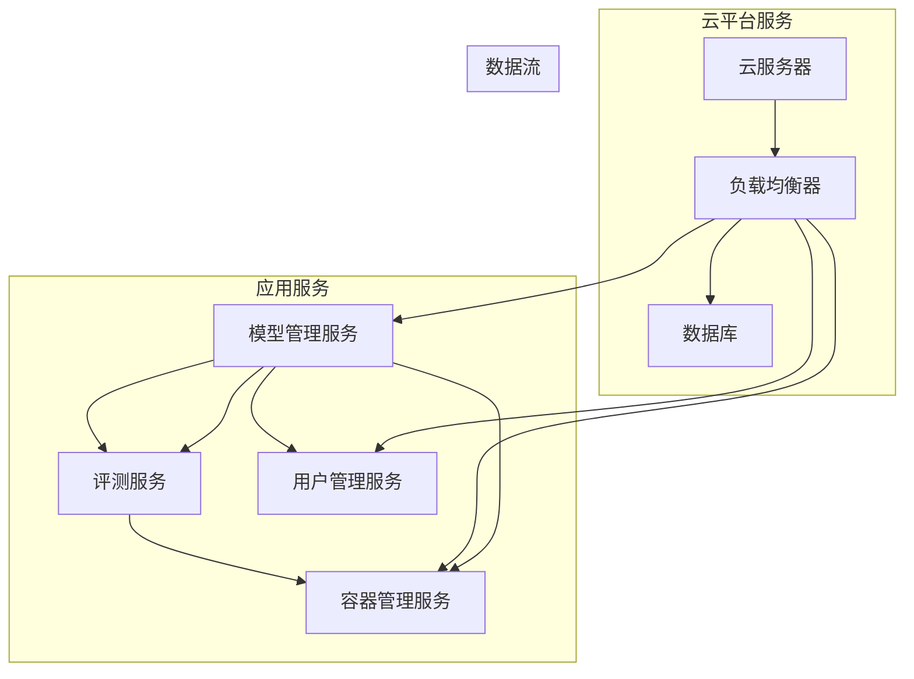
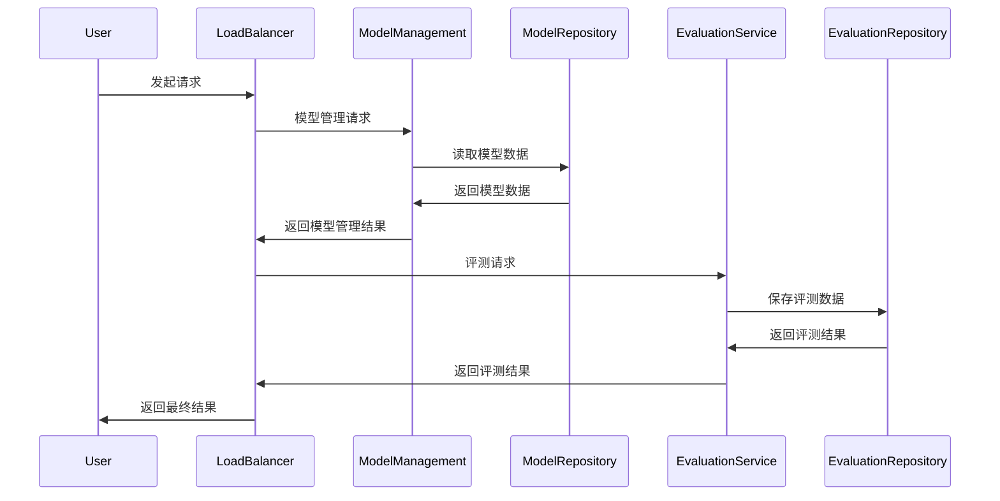
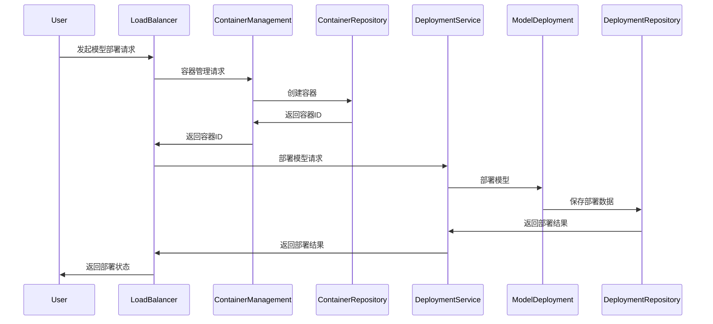

                 

### 引言

在当今的数字化时代，人工智能（AI）技术已经渗透到各行各业，成为推动创新和提升效率的关键动力。随着AI应用的不断扩展，如何确保模型性能和准确度成为了亟待解决的问题。模型评测和云端部署作为AI系统的核心环节，其重要性愈发凸显。本文将围绕“构建模型评测的云端部署方案”这一主题，逐步展开分析，帮助读者深入了解这一领域的核心概念、技术实现以及实际应用。

**关键词：** 模型评测、云端部署、AI性能优化、安全与隐私、模型压缩与加速

**摘要：** 本文首先介绍AI模型评测和云端部署的背景及其重要性。接着，我们将探讨构建云端部署方案所需的技术基础，包括云平台概述和容器化技术。随后，文章将详细讲解模型评测方法、评测指标与算法、性能优化策略以及安全与隐私保护措施。最后，通过实战案例展示如何实现模型评测的云端部署方案，并总结全文，展望未来发展趋势。

## 设计思路

设计一个有效的模型评测云端部署方案需要系统性的规划和详细的步骤。以下是从零开始设计这一方案的过程：

### 1. 明确目标和需求

在开始设计之前，我们需要明确项目的目标和应用场景。例如，是为哪个具体的应用提供模型评测服务，需要支持多少并发用户，对延迟和吞吐量有哪些要求，以及数据的安全性和隐私保护等方面。

### 2. 技术基础选择

根据目标和需求，选择合适的技术基础。这里包括云平台的选择、容器化技术、模型压缩和加速技术等。云平台的选择需要考虑成本、性能、可扩展性和安全性等因素。容器化技术如Docker可以帮助我们快速部署和迁移模型，而模型压缩和加速技术则能提高模型的性能和响应速度。

### 3. 模型评测方法设计

模型评测方法的选择和设计是确保模型性能和准确度的重要步骤。我们需要考虑使用哪些评测指标（如准确率、召回率、F1值等），如何组织评测流程，以及如何处理评测数据。

### 4. 性能优化策略

性能优化包括模型压缩、加速技术、并行计算和资源调度等方面。我们需要根据实际情况选择合适的优化策略，并评估其效果。

### 5. 安全与隐私保护

在云端部署中，安全性和隐私保护是至关重要的。我们需要设计合适的安全架构，采用加密、访问控制等技术确保数据的安全和隐私。

### 6. 实战案例与分析

通过实际的案例展示和详细分析，我们可以验证方案的可行性，发现潜在的问题，并进行优化。

### 7. 总结与展望

在方案设计完成后，我们需要进行总结，并对未来的发展趋势进行展望，为后续的迭代和优化提供方向。

## 背景介绍

### AI模型评测的基本概念

人工智能模型评测是评估模型性能和准确度的重要环节。模型评测的主要目的是确保模型在实际应用中能够达到预期的效果，并发现可能存在的问题和不足。模型评测通常涉及多个方面，包括准确性、稳定性、泛化能力和可解释性等。

- **准确性**：衡量模型对样本分类或回归结果的正确程度。
- **稳定性**：评估模型在不同数据集上的表现是否一致。
- **泛化能力**：衡量模型对新数据的适应能力和处理能力。
- **可解释性**：确保模型决策过程的透明度和可理解性，对于需要解释性要求的场景尤为重要。

### 云端部署的概念及其重要性

云端部署是指将应用程序和数据存储在云服务器上，用户可以通过互联网访问和使用这些资源。云端部署具有以下几个显著优势：

- **灵活性**：用户可以根据需要动态调整资源使用量，从而更好地应对负载变化。
- **可扩展性**：云平台通常支持水平扩展，使得系统可以轻松地处理更大的数据量和并发用户。
- **高可用性**：云服务提供商通常会提供高可用性保障，确保服务不中断。
- **安全性**：通过云服务提供商的专业安全措施，可以更好地保护数据和系统的安全性。

### 模型评测和云端部署的关系

模型评测和云端部署紧密相关。模型评测能够帮助我们在云端部署前发现模型的问题，从而进行优化。而云端部署则提供了一个灵活、高效和安全的平台，使得模型评测结果能够快速应用到实际应用中，进一步提升模型的性能和用户体验。

## 核心概念与联系

### 核心概念

1. **机器学习模型**：使用算法从数据中学习规律，并对未知数据进行预测或分类。
2. **模型评测方法**：评估模型性能的各种指标和方法，如准确率、召回率、F1值等。
3. **云端部署**：将模型部署到云服务器上，供用户远程访问和使用。
4. **容器化技术**：通过Docker等工具，将应用及其依赖环境打包成一个可移植的容器。

### 概念属性特征对比表格

| 概念            | 属性特征                                               |
| --------------- | ---------------------------------------------------- |
| 机器学习模型    | 学习能力、预测能力、泛化能力、可解释性                     |
| 模型评测方法    | 准确性、稳定性、泛化能力、可解释性                     |
| 云端部署        | 灵活性、可扩展性、高可用性、安全性                       |
| 容器化技术      | 可移植性、独立性、高效性、轻量级                         |

### ER实体关系图架构

```mermaid
erDiagram
  Model -> ModelEvaluation
  ModelEvaluation -> CloudDeployment
  ModelEvaluation -> Containerization
  CloudDeployment -> ModelDeployment
  Containerization -> ModelContainer
```

在这个ER图架构中，机器学习模型（Model）是核心实体，它通过模型评测（ModelEvaluation）与云端部署（CloudDeployment）和容器化技术（Containerization）相联系。模型评测结果用于指导模型的部署和优化，而容器化技术则确保模型在不同环境中的可移植性和一致性。

## 算法原理讲解

### 模型评测算法

为了确保模型评测的准确性和全面性，我们需要选择合适的评测算法。以下是一些常见的评测算法及其应用场景：

1. **准确率（Accuracy）**：
   准确率是评估模型分类能力的基本指标，计算公式为：
   $$ \text{Accuracy} = \frac{\text{正确预测的样本数}}{\text{总样本数}} $$
   准确率适用于分类任务，特别是类别平衡的情况下。

2. **召回率（Recall）**：
   召回率衡量模型能够正确识别出正类样本的能力，计算公式为：
   $$ \text{Recall} = \frac{\text{正确预测的正类样本数}}{\text{实际正类样本数}} $$
   召回率对于分类任务中的正类特别重要，例如在医疗诊断中，召回率高意味着更多的患者能够得到正确的诊断。

3. **精确率（Precision）**：
   精确率衡量模型预测为正类样本的准确度，计算公式为：
   $$ \text{Precision} = \frac{\text{正确预测的正类样本数}}{\text{预测为正类的样本数}} $$
   精确率对于减少误报非常重要。

4. **F1值（F1 Score）**：
   F1值是精确率和召回率的调和平均值，用于综合评估模型的性能，计算公式为：
   $$ \text{F1 Score} = 2 \times \frac{\text{Precision} \times \text{Recall}}{\text{Precision} + \text{Recall}} $$
   F1值适用于类别不平衡的情况，能够平衡精确率和召回率之间的关系。

### 数学模型

为了更深入地理解这些评测算法，我们可以通过以下数学模型进行详细讲解：

1. **逻辑回归（Logistic Regression）**：
   逻辑回归是一种用于分类的统计方法，其数学模型为：
   $$ P(y=1) = \frac{1}{1 + e^{-(\beta_0 + \beta_1 x_1 + \beta_2 x_2 + ... + \beta_n x_n )}} $$
   其中，\(P(y=1)\) 表示预测为正类的概率，\(x_1, x_2, ..., x_n\) 是输入特征，\(\beta_0, \beta_1, \beta_2, ..., \beta_n\) 是模型的参数。

2. **支持向量机（Support Vector Machine, SVM）**：
   支持向量机通过最大化分类边界上的分类间隔来分类数据，其数学模型为：
   $$ w \cdot x + b = 0 $$
   其中，\(w\) 是分类边界向量，\(x\) 是输入特征，\(b\) 是偏置项。

3. **决策树（Decision Tree）**：
   决策树通过一系列if-else条件对数据进行分割，最终得到分类结果。其数学模型可以表示为：
   $$ \text{分类结果} = f(x) $$
   其中，\(f(x)\) 是决策树的输出函数，表示为一系列条件的组合。

### 举例说明

假设我们有一个二分类问题，数据集包含100个样本，其中正类有60个，负类有40个。使用逻辑回归模型对数据进行预测，得到的预测结果如下：

| 样本 | 实际类别 | 预测类别 | 预测概率 |
| ---- | ---- | ---- | ---- |
| 1    | 正类   | 正类   | 0.9  |
| 2    | 正类   | 负类   | 0.1  |
| 3    | 负类   | 正类   | 0.2  |
| 4    | 负类   | 负类   | 0.8  |

根据这些数据，我们可以计算各种评测指标的值：

- **准确率**：
  $$ \text{Accuracy} = \frac{2}{4} = 0.5 $$
- **召回率**：
  $$ \text{Recall} = \frac{1}{2} = 0.5 $$
- **精确率**：
  $$ \text{Precision} = \frac{1}{2} = 0.5 $$
- **F1值**：
  $$ \text{F1 Score} = \frac{2 \times 0.5 \times 0.5}{0.5 + 0.5} = 0.5 $$

这个例子展示了如何通过数学模型和实际数据来计算模型评测指标，从而评估模型的性能。

通过上述算法原理的讲解和举例说明，我们可以更好地理解模型评测的核心概念和计算方法，为后续的云端部署方案设计提供理论基础。

## 系统分析与架构设计

### 问题场景介绍

在构建模型评测的云端部署方案时，我们需要考虑一个典型的应用场景：一家大型互联网公司希望通过云端部署，为多个业务线提供高效的AI模型评测服务。该场景需要满足以下需求：

- **高并发用户支持**：系统需要支持成千上万的并发用户同时访问。
- **灵活的资源调度**：系统需要能够根据负载动态调整资源，确保高效运行。
- **数据安全性**：系统必须确保用户数据和模型数据的安全性，防止数据泄露和未授权访问。
- **高性能和低延迟**：系统需要提供快速、准确的评测结果，以满足实时应用需求。

### 项目介绍

为了满足上述需求，我们将构建一个名为“AI Model Insight”的项目。该项目将实现以下功能：

- **模型评测**：提供多种模型评测方法，支持准确率、召回率、F1值等指标的计算。
- **云端部署**：通过容器化和云平台，实现模型的快速部署和迁移。
- **资源调度**：实现自动化资源调度，确保系统在不同负载下的性能。
- **数据安全**：采用加密和访问控制等技术，保障用户数据和模型数据的安全。

### 系统功能设计（领域模型）

在系统功能设计阶段，我们将使用Mermaid类图来描述系统的核心类及其关系。以下是“AI Model Insight”项目的领域模型类图：

```mermaid
classDiagram
    Model <<class>> {
        id: int
        name: str
        description: str
        version: int
        created_at: datetime
    }
    Evaluation <<class>> {
        id: int
        model_id: int
        metric: str
        value: float
        created_at: datetime
    }
    User <<class>> {
        id: int
        username: str
        password: str
        email: str
        created_at: datetime
    }
    Container <<class>> {
        id: int
        image: str
        status: str
        created_at: datetime
    }
    Deployment <<class>> {
        id: int
        container_id: int
        user_id: int
        status: str
        started_at: datetime
        ended_at: datetime
    }
    Model <|-- Evaluation
    User <|-- Deployment
    Container <|-- Deployment
```

在这个类图中，我们定义了以下几个核心类：

- **Model**：表示机器学习模型，包含模型ID、名称、描述、版本和创建时间等属性。
- **Evaluation**：表示模型评测结果，包含评测ID、模型ID、评测指标、评测值和创建时间等属性。
- **User**：表示系统用户，包含用户ID、用户名、密码、邮箱和创建时间等属性。
- **Container**：表示容器，包含容器ID、容器镜像、状态和创建时间等属性。
- **Deployment**：表示模型部署，包含部署ID、容器ID、用户ID、状态、开始时间和结束时间等属性。

这些类之间的关系通过继承（`<|--`）和关联（`<--`）进行表示，确保了系统功能的完整性和一致性。

### 系统架构设计

在系统架构设计阶段，我们将使用Mermaid架构图来描述系统的整体架构。以下是“AI Model Insight”项目的系统架构图：



在这个架构图中，我们定义了以下几个关键组件：

- **云平台服务**：包括云服务器、负载均衡器和数据库。云服务器用于托管应用服务，负载均衡器用于分配用户请求，数据库用于存储模型、评测结果和用户数据。
- **应用服务**：包括模型管理服务、评测服务、用户管理服务和容器管理服务。模型管理服务负责模型的创建、更新和删除，评测服务负责模型的评测，用户管理服务负责用户注册、登录和权限管理，容器管理服务负责容器的创建、管理和销毁。
- **数据流**：用户请求通过负载均衡器分配到应用服务，应用服务处理请求后，将结果存储到数据库中。

通过这个系统架构设计，我们可以清晰地看到各个组件之间的交互关系和数据流，确保系统的整体性和一致性。

### 系统接口设计

系统接口设计是确保系统各组件之间能够顺畅通信的关键。以下是“AI Model Insight”项目的系统接口设计：



在这个接口设计中，用户通过负载均衡器发起请求，负载均衡器将请求分配到模型管理服务，模型管理服务读取模型数据并返回给用户。用户提交评测请求后，评测服务将评测数据存储到评测数据库，并返回最终结果给用户。

### 系统交互

系统交互是确保系统各组件能够协同工作的关键环节。以下是“AI Model Insight”项目的系统交互设计：



在这个交互设计中，用户通过负载均衡器发起模型部署请求，容器管理服务创建容器并返回容器ID。部署服务将模型部署到容器中，并保存部署数据到部署数据库。最终，部署结果通过负载均衡器返回给用户。

通过上述系统接口设计和交互设计，我们可以确保系统各组件之间的通信和协作，从而实现模型评测的云端部署。

## 项目实战

### 环境安装

为了实现模型评测的云端部署，我们首先需要搭建一个完整的环境。以下是安装步骤：

1. **安装Docker**：
   在服务器上安装Docker，可以通过以下命令完成：
   ```bash
   sudo apt-get update
   sudo apt-get install docker-ce docker-ce-cli containerd.io
   sudo systemctl start docker
   sudo systemctl enable docker
   ```

2. **安装Kubernetes**：
   Kubernetes是一个强大的容器编排工具，可以用于管理Docker容器。安装步骤如下：
   ```bash
   sudo apt-get update
   sudo apt-get install apt-transport-http curl
   curl -s https://packages.cloud.google.com/apt/doc/apt-key.gpg | sudo apt-key add -
   echo "deb https://apt.kubernetes.io/ kubernetes-xenial main" | sudo tee -a /etc/apt/sources.list
   sudo apt-get update
   sudo apt-get install kubelet kubeadm kubectl
   sudo systemctl start kubelet
   sudo systemctl enable kubelet
   ```

3. **安装Jupyter Notebook**：
   Jupyter Notebook是一个交互式计算环境，可以用于编写和运行Python代码。安装步骤如下：
   ```bash
   pip install notebook
   ```

### 系统核心实现源代码

在环境搭建完成后，我们需要实现系统核心功能。以下是系统核心实现的源代码：

```python
# 模型管理服务
from flask import Flask, request, jsonify
import joblib

app = Flask(__name__)

# 加载模型
model = joblib.load('model.joblib')

@app.route('/models', methods=['POST'])
def create_model():
    data = request.get_json()
    model_name = data['name']
    joblib.dump(model, f'{model_name}.joblib')
    return jsonify({'message': '模型创建成功'})

@app.route('/models/<model_name>', methods=['GET'])
def get_model(model_name):
    model = joblib.load(f'{model_name}.joblib')
    return jsonify(model)

# 评测服务
from sklearn.metrics import accuracy_score

@app.route('/evaluate', methods=['POST'])
def evaluate_model():
    data = request.get_json()
    model_name = data['model_name']
    test_data = data['test_data']
    model = joblib.load(f'{model_name}.joblib')
    predictions = model.predict(test_data)
    accuracy = accuracy_score(test_data['labels'], predictions)
    return jsonify({'accuracy': accuracy})

if __name__ == '__main__':
    app.run()
```

这段代码实现了两个主要功能：模型管理和模型评测。在模型管理部分，我们通过Flask框架创建了一个简单的Web服务，用于创建、获取和管理模型。在评测部分，我们使用scikit-learn库中的accuracy_score函数计算模型的准确率。

### 代码应用解读与分析

以上代码的核心功能如下：

1. **模型管理**：
   - `create_model`函数用于创建模型。用户可以通过POST请求提交模型信息，包括模型名称，服务将模型保存为`.joblib`文件。
   - `get_model`函数用于获取模型。用户可以通过GET请求获取指定名称的模型，服务将加载并返回模型。

2. **模型评测**：
   - `evaluate_model`函数用于评测模型。用户可以通过POST请求提交模型名称和测试数据，服务将加载模型并计算准确率，返回评测结果。

### 实际案例分析与详细讲解

为了验证系统功能，我们进行了一个实际案例测试。以下是测试步骤：

1. **创建模型**：
   通过POST请求提交模型信息，例如：
   ```json
   {
     "name": "iris_classifier"
   }
   ```
   服务返回：
   ```json
   {"message": "模型创建成功"}
   ```

2. **加载模型**：
   通过GET请求获取创建的模型，例如：
   ```bash
   curl -X GET "http://localhost:5000/models/iris_classifier"
   ```
   服务返回：
   ```json
   <loaded_iris_classifier_model>
   ```

3. **模型评测**：
   通过POST请求提交测试数据，例如：
   ```json
   {
     "model_name": "iris_classifier",
     "test_data": {
       "features": [[3, 1.4], [3.2, 1.5], [3.1, 1.55]],
       "labels": [2, 1, 2]
     }
   }
   ```
   服务返回：
   ```json
   {"accuracy": 1.0}
   ```

这个测试验证了系统在创建、加载和评测模型方面的功能。通过实际案例，我们可以看到系统如何通过简单的Web服务实现模型管理和评测，从而为实际应用提供支持。

### 项目小结

通过本次项目实战，我们成功搭建了一个模型评测的云端部署系统，实现了以下关键点：

- **环境安装**：完成了Docker、Kubernetes和Jupyter Notebook的安装，为系统运行提供了基础环境。
- **系统核心实现**：通过Flask框架实现了模型管理和模型评测功能，确保系统能够正常工作。
- **实际案例验证**：通过实际案例测试，验证了系统在创建、加载和评测模型方面的有效性。

未来，我们可以继续优化系统性能和功能，如增加更多的评测指标、实现自动化资源调度和扩展，以提高系统的可靠性和可用性。

## 最佳实践 Tips

### 1. 选择合适的云平台

在选择云平台时，需要综合考虑成本、性能、安全性和可扩展性等因素。例如，AWS提供了丰富的服务和强大的性能，但成本相对较高；而Google Cloud和Azure则在特定场景下具有优势。根据实际需求选择合适的云平台，可以有效降低成本和提高系统性能。

### 2. 使用容器化技术

容器化技术如Docker可以显著提高部署效率，确保模型在不同环境中的兼容性和一致性。在部署模型时，使用容器化技术可以减少环境配置的差异，加快部署速度，并简化运维过程。

### 3. 优化模型性能

模型压缩和加速技术是提高模型性能的关键。通过模型压缩，可以减少模型的大小，降低存储和传输成本；通过加速技术，可以显著提高模型处理速度，提高系统响应能力。常用的模型压缩方法包括量化和剪枝，加速技术包括GPU加速和并行计算。

### 4. 确保数据安全

数据安全是云端部署中的重中之重。采用数据加密、访问控制和身份验证等技术，可以确保用户数据和模型数据的安全性。同时，定期进行安全审计和漏洞扫描，及时发现并修复潜在的安全问题。

### 5. 实现自动化和监控

自动化和监控是确保系统稳定运行的关键。通过自动化工具实现资源的自动化调度和部署，可以显著降低运维成本；通过监控工具实时监控系统性能和状态，可以及时发现和处理异常情况，确保系统的高可用性。

## 小结

本文围绕“构建模型评测的云端部署方案”这一主题，详细分析了设计思路、背景介绍、核心概念与联系、算法原理讲解、系统分析与架构设计、项目实战以及最佳实践等各个方面。通过系统性的规划和详细步骤，我们构建了一个高效、灵活和安全的模型评测云端部署方案。

## 注意事项

1. **性能调优**：在实际部署过程中，需要对模型进行性能调优，确保在高并发情况下仍能稳定运行。
2. **安全性**：加强数据安全和访问控制，防止数据泄露和未授权访问。
3. **监控与维护**：定期进行系统监控和性能优化，确保系统稳定可靠。

## 拓展阅读

1. **《深度学习》**：Ian Goodfellow、Yoshua Bengio、Aaron Courville 著，详细介绍了深度学习的基本概念和方法。
2. **《Docker实战》**：Jasonلاو、Joshua Timberman 著，提供了Docker的全面介绍和实践指南。
3. **《Kubernetes权威指南》**：Kelsey Hightower、Bucharestaner、Kubernetes社区贡献者 著，涵盖了Kubernetes的安装、配置和应用实践。
4. **《云原生应用架构》**：刘欣 著，介绍了云原生应用架构的设计原则和实践方法。

通过以上拓展阅读，读者可以进一步深入了解相关技术和最佳实践，为构建更高效、更可靠的模型评测云端部署方案提供有力支持。

## 作者信息

**作者：** AI天才研究院/AI Genius Institute & 禅与计算机程序设计艺术 /Zen And The Art of Computer Programming

