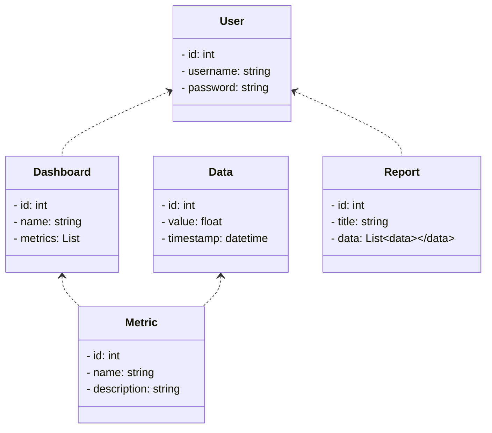
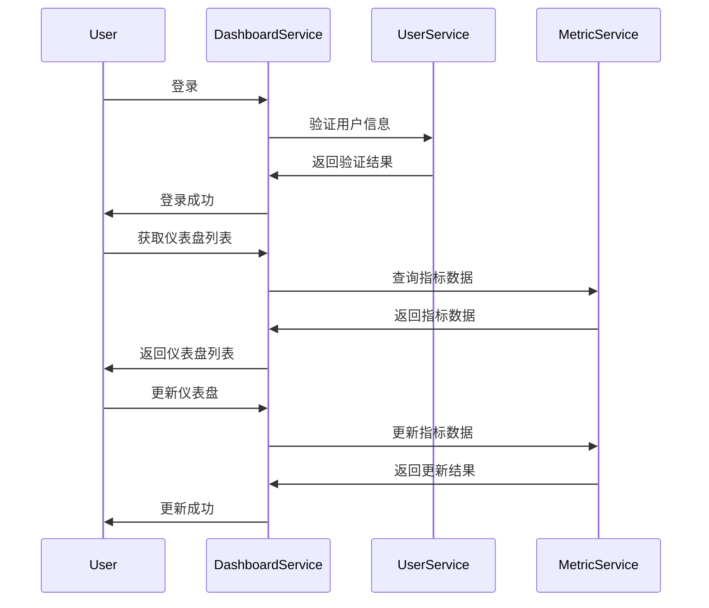

                 

### 第1章 引言

#### 1.1 问题背景

在现代商业环境中，数据分析已经成为企业决策过程中不可或缺的一部分。随着数据的不断增加和复杂性，如何快速、准确地分析数据并提取有价值的信息，成为摆在企业和数据分析从业者面前的挑战。数据可视化，作为一种有效的数据分析工具，能够在视觉上呈现数据，帮助人们更好地理解和解读数据，从而做出更加明智的决策。

在这个背景下，构建评测结果的可视化仪表盘成为了一个热门的话题。可视化仪表盘不仅能直观地展示数据，还能够通过动态交互功能，让用户更加灵活地分析数据，从而提高决策的效率。仪表盘可以包含多种图表和指标，如柱状图、折线图、饼图、雷达图等，这些图表能够以不同的方式展示数据，帮助用户从不同角度分析数据。

然而，构建一个高效的、能够满足实际业务需求的可视化仪表盘并非易事。首先，需要明确仪表盘的核心目标是什么，即需要展示哪些关键指标和图表。其次，需要选择合适的可视化工具和算法，确保仪表盘的性能和响应速度。最后，还需要不断地迭代和优化仪表盘，以适应不断变化的数据和业务需求。

本文将围绕构建评测结果的可视化仪表盘展开讨论，从问题背景介绍、核心概念与联系、算法原理讲解、系统分析与架构设计、项目实战等多个方面，详细探讨可视化仪表盘的构建方法和技术细节。希望通过本文的讲解，能够帮助读者更好地理解可视化仪表盘的构建过程，并为其在实际工作中提供指导和帮助。

#### 1.2 核心概念与联系

为了构建一个高效的可视化仪表盘，我们首先需要明确几个核心概念，包括数据可视化、仪表盘和数据驱动决策等。

**数据可视化**是一种将数据转换成图表、图形等视觉形式的方法，使数据更加直观、易懂。通过数据可视化，复杂的数据关系和趋势可以被快速捕捉和理解。常见的可视化图表包括柱状图、折线图、饼图、雷达图等，每种图表都有其特定的用途和展示方式。

**仪表盘**是一种综合展示多个数据指标和图表的界面，通常用于监控和评估系统的性能、业务指标等。一个典型的仪表盘可能包含多个图表，如实时流量图表、历史数据趋势图、关键指标雷达图等。仪表盘的主要特点是直观、易于操作和交互，用户可以实时查看和更新数据。

**数据驱动决策**是基于数据的分析结果，指导决策过程的一种方法。通过数据可视化，管理者可以直观地看到数据背后的趋势和关联，从而做出更加明智的决策。数据驱动决策的核心在于将数据分析和决策过程相结合，确保决策的依据是真实、准确的数据。

下面我们将通过一个对比表格，展示不同仪表盘组件的特点与适用场景。

| 组件类型       | 特点                           | 适用场景                           |
|----------------|--------------------------------|-----------------------------------|
| 实时流量图表   | 实时更新，显示流量动态         | 监控网站、应用实时访问情况         |
| 历史数据趋势图 | 展示数据随时间的变化趋势       | 分析业务增长趋势，预测未来表现     |
| 关键指标雷达图 | 综合展示多个指标，显示健康状态 | 评估系统或业务的多维度性能         |
| 动态地图       | 根据数据动态更新地图内容       | 监控地理位置数据，如物流跟踪       |
| 模拟交互仪表盘 | 提供模拟环境，用户可操作互动   | 增强用户体验，模拟实际业务场景     |

通过对比表格，我们可以看到不同类型的仪表盘组件在展示方式和用途上有所不同。实时流量图表适用于需要实时监控的场景，历史数据趋势图适用于分析长期趋势，关键指标雷达图适用于多维度评估，动态地图适用于地理位置相关的监控，而模拟交互仪表盘则适用于提升用户体验。

为了进一步理解这些组件之间的关系，我们可以使用Mermaid工具绘制一个ER实体关系图，展示数据源、数据处理、可视化仪表盘之间的关联。

```mermaid
erDiagram
  数据源 &&&> 数据处理
  数据处理 &&&> 可视化仪表盘
  数据源 ||| 数据处理 : 依赖关系
  数据处理 ||| 可视化仪表盘 : 依赖关系
```

在这个ER实体关系图中，数据源是数据的起点，通过数据处理环节，将原始数据转换为适合可视化的格式，最终呈现给用户的是可视化仪表盘。这个关系图清晰地展示了数据从采集到展示的全过程，有助于我们理解各组件之间的关联和互动。

通过以上对核心概念和组件特点的介绍，我们为后续详细讨论可视化仪表盘的构建奠定了基础。接下来，我们将深入探讨可视化仪表盘的基础原理和实现技术。

#### 2.1 可视化基本原理

可视化仪表盘的核心在于如何有效地将数据以图形化的形式呈现，使得用户能够直观、快速地理解和分析数据。在这一部分，我们将讨论数据可视化的基本原理，包括数据可视化原则、常见可视化图表类型以及可视化设计原则。

**2.1.1 数据可视化原则**

数据可视化的基本原则包括清晰性、简洁性、准确性和交互性。以下是这些原则的详细解释：

1. **清晰性**：数据可视化应当确保信息的清晰传达，避免信息过载，使得用户能够迅速捕捉到关键数据点。图表中的标签、颜色、线条等元素都应当服务于信息的清晰传达。

2. **简洁性**：简洁是可视化设计的重要原则。过多的装饰和复杂的元素可能会分散用户的注意力，降低数据的可读性。简洁的设计能够让用户更快地理解数据，并专注于重要信息。

3. **准确性**：准确性是数据可视化最基本的要求。所有展示的数据都应当准确无误，确保用户能够根据可视化图表做出正确的判断和决策。任何数据的偏差或错误都可能导致错误的决策。

4. **交互性**：交互性是现代数据可视化的重要特性。通过交互功能，用户可以动态地探索数据，例如缩放、筛选、排序等，从而更加深入地理解数据。

**2.1.2 常见可视化图表类型**

数据可视化的过程中，选择合适的图表类型至关重要。以下是几种常见的可视化图表类型及其适用场景：

1. **柱状图**：适用于比较不同类别的数据大小。柱状图通过垂直或水平的柱子表示数据，易于比较数据之间的差异。

2. **折线图**：适用于展示数据随时间的变化趋势。折线图通过数据点和线条连接，能够清晰地展示数据的增减变化。

3. **饼图**：适用于展示数据占比。饼图通过圆形分割成多个扇形区域，每个区域的大小表示数据的占比，适用于数据比例的直观展示。

4. **雷达图**：适用于展示多维数据的综合表现。雷达图通过多个轴和线条，将多个维度数据进行整合，适用于多变量数据的比较。

5. **散点图**：适用于展示两个变量之间的关系。散点图通过坐标轴上的点表示数据，能够直观地展示变量之间的相关性。

6. **热力图**：适用于展示数据的分布和密集程度。热力图通过颜色深浅表示数据值的大小，能够清晰地展示数据的分布情况。

**2.1.3 可视化设计原则**

为了确保数据可视化仪表盘的有效性，以下是一些重要的设计原则：

1. **一致性**：仪表盘中的图表和元素应当保持一致性，包括字体大小、颜色、线条样式等。一致性能够提高用户对仪表盘的熟悉度和可读性。

2. **对比度**：使用高对比度的颜色和元素可以提高数据的可读性。例如，使用黑色字体和白色背景可以提高文字的可读性。

3. **颜色编码**：颜色编码是一种有效的数据表示方法。合理的颜色编码能够帮助用户快速理解数据，例如使用红色表示负数，绿色表示正数。

4. **交互性**：提供交互功能，如拖拽、筛选、排序等，能够增强用户的体验，提高数据探索的效率。

5. **可访问性**：确保仪表盘的设计符合可访问性标准，使得所有用户，包括色盲用户，都能够轻松使用。

通过以上对数据可视化基本原理的介绍，我们可以更好地理解如何构建一个有效的可视化仪表盘。在接下来的部分，我们将进一步探讨仪表盘的组件和实现技术。

#### 2.2 仪表盘组件介绍

仪表盘是一个集合多种数据图表和指标的综合性界面，其核心在于通过视觉化的方式展示数据的实时状态、趋势和历史数据。一个完善的仪表盘通常包含多种组件，每种组件都有其特定的用途和功能。在这一部分，我们将详细介绍仪表盘的基本构成、交互式组件以及动态更新组件。

**2.2.1 仪表盘的基本构成**

仪表盘的基本构成主要包括以下几部分：

1. **数据展示区域**：这是仪表盘的核心部分，用于展示各种类型的图表和数据指标。常见的图表类型包括柱状图、折线图、饼图、雷达图等。数据展示区域的设计要考虑数据的可读性和视觉效果，确保用户能够快速理解数据。

2. **导航栏**：导航栏提供用户在仪表盘之间的快速切换，或者提供仪表盘内部不同视图的切换。导航栏的设计要简洁、直观，使得用户能够轻松找到所需的信息。

3. **工具栏**：工具栏提供各种交互功能，如数据过滤、数据筛选、数据排序等。工具栏的设计要便于用户操作，提高数据探索的效率。

4. **状态栏**：状态栏显示仪表盘的当前状态，如数据刷新时间、数据来源等。状态栏的设计要简洁，同时提供必要的信息。

**2.2.2 交互式组件**

交互式组件是仪表盘的重要组成部分，它们增强了用户与数据之间的互动，使用户能够更深入地探索数据。常见的交互式组件包括：

1. **筛选器**：筛选器用于过滤数据，使得用户能够根据特定条件查看数据。筛选器可以是下拉菜单、单选按钮、复选框等，设计时要考虑易用性和效率。

2. **切换器**：切换器用于在多个数据集之间进行切换，例如在年度数据、季度数据和月度数据之间切换。切换器的设计要直观，使用户能够快速进行数据切换。

3. **缩放工具**：缩放工具用于放大或缩小图表，使得用户能够更详细地查看数据。缩放工具的设计要方便用户操作，同时确保图表的视觉一致性。

4. **拖拽排序**：拖拽排序允许用户重新排列数据图表，以不同的顺序查看数据。这种交互方式能够提高数据的探索性和灵活性。

**2.2.3 动态更新组件**

动态更新组件是现代仪表盘的关键特性，它们能够实时反映数据的变化，提供即时的决策支持。动态更新组件包括：

1. **实时更新图表**：实时更新图表能够根据新数据的到来，自动更新图表内容，使得用户能够实时了解数据变化。实时更新图表的设计要考虑性能和响应速度。

2. **警报系统**：警报系统用于当数据达到特定阈值或出现异常时，发出警报提醒用户。警报系统可以包括声音提示、弹窗提示等。

3. **数据流可视化**：数据流可视化通过图形化的方式展示数据的流动过程，使得用户能够理解数据的处理流程和路径。数据流可视化通常用于复杂的数据处理场景。

通过以上对仪表盘组件的详细介绍，我们可以看到仪表盘不仅仅是一个简单的数据展示界面，而是一个集数据展示、交互和动态更新于一体的综合性工具。在接下来的章节中，我们将进一步探讨可视化仪表盘的技术实现和算法原理。

#### 3.1 D3.js简介

D3.js（Data-Driven Documents）是一个基于JavaScript的库，用于创建动态的可视化图表。它提供了一个强大的数据绑定引擎，允许开发者通过简单的代码将数据转换为图形元素，并以动态的方式更新这些元素。D3.js广泛应用于各种场景，从简单的数据展示到复杂的数据分析，都可以看到它的身影。

**3.1.1 D3.js基本概念**

D3.js的核心概念包括数据绑定、选择器、数据转换和更新。以下是这些概念的具体说明：

1. **数据绑定**：数据绑定是D3.js的核心思想，它通过将数据与DOM元素绑定来实现动态的可视化。D3.js提供了一种称为数据驱动DOM的概念，即数据变化会直接反映到DOM上，而无需手动操作DOM。

2. **选择器**：D3.js使用CSS选择器来选择DOM元素。这使得开发者可以方便地操作DOM元素，如添加、删除、更新等。D3.js还扩展了CSS选择器，增加了对数据的支持。

3. **数据转换**：在D3.js中，数据转换是一个重要的步骤，它用于将数据转换为适合可视化展示的格式。常见的转换包括排序、聚合、过滤等。D3.js提供了一系列内置的转换函数，开发者也可以自定义转换函数。

4. **更新**：D3.js的更新机制是其动态可视化的关键。当数据发生变化时，D3.js会自动更新DOM，确保可视化元素与数据保持一致。更新过程包括选择、数据绑定、进入和退出等步骤。

**3.1.2 D3.js常用图表**

D3.js支持多种图表类型，包括柱状图、折线图、饼图、散点图、地图等。以下是几种常用图表的简要介绍：

1. **柱状图**：柱状图是D3.js中最常用的图表类型之一，用于比较不同类别的数据大小。D3.js提供了多种方式来创建柱状图，如`bar`、`stack`、`grouped`等。

   ```javascript
   var data = [4, 8, 15, 16, 23, 42];
   var svg = d3.select("svg")
       .data(data)
       .selectAll("rect")
       .data(data)
       .enter().append("rect")
       .attr("width", function(d) { return d; })
       .attr("height", 20)
       .attr("x", function(d, i) { return i * 25; });
   ```

2. **折线图**：折线图用于展示数据随时间的变化趋势。D3.js提供了`line`生成器来创建折线图，可以通过设置线条的起点和终点来绘制。

   ```javascript
   var data = [{x: 1, y: 2}, {x: 2, y: 5}, {x: 3, y: 7}];
   var line = d3.line()(data);
   d3.select("svg").append("path").attr("d", line);
   ```

3. **饼图**：饼图用于展示数据占比。D3.js提供了`arc`生成器来创建饼图，可以通过设置扇形的起点、终点和半径来绘制。

   ```javascript
   var data = [30, 20, 50, 10];
   var width = 256, height = 256, radius = Math.min(width, height) / 2;
   var color = d3.scaleOrdinal(d3.schemeCategory10);
   var pie = d3.pie()(data);
   var arc = d3.arc()(radius).innerRadius(0).outerRadius(radius);
   d3.select("svg").selectAll("path").data(pie).enter()
       .append("path")
       .attr("fill", function(d, i) { return color(i); })
       .attr("d", arc);
   ```

4. **散点图**：散点图用于展示两个变量之间的关系。D3.js提供了`point`生成器来创建散点图，可以通过设置点的位置和大小来展示数据。

   ```javascript
   var data = [{x: 1, y: 2}, {x: 2, y: 5}, {x: 3, y: 7}];
   var xScale = d3.scaleLinear().domain([0, 4]).range([0, 256]);
   var yScale = d3.scaleLinear().domain([0, 8]).range([256, 0]);
   d3.select("svg").selectAll("circle").data(data).enter()
       .append("circle")
       .attr("cx", function(d) { return xScale(d.x); })
       .attr("cy", function(d) { return yScale(d.y); })
       .attr("r", 5);
   ```

**3.1.3 D3.js应用示例**

以下是一个简单的D3.js应用示例，该示例创建了一个简单的柱状图，展示了不同类别的数据大小。

```html
<!DOCTYPE html>
<html>
<head>
    <meta charset="utf-8">
    <title>D3.js柱状图示例</title>
    <style>
        svg {
            width: 600px;
            height: 400px;
        }
        rect {
            fill: steelblue;
        }
        text {
            font: 10px sans-serif;
        }
    </style>
</head>
<body>
    <svg></svg>

    <script src="https://d3js.org/d3.v7.min.js"></script>
    <script>
        var data = [4, 8, 15, 16, 23, 42];
        var width = 600, height = 400;
        var barWidth = 50;

        var xScale = d3.scaleBand()
            .domain(data.map(function(d, i) { return i; }))
            .range([0, width])
            .padding(0.1);

        var yScale = d3.scaleLinear()
            .domain([0, d3.max(data)])
            .range([height, 0]);

        var svg = d3.select("svg")
            .attr("width", width)
            .attr("height", height);

        svg.selectAll("rect")
            .data(data)
            .enter().append("rect")
            .attr("x", function(d, i) { return xScale(i); })
            .attr("y", function(d) { return yScale(d); })
            .attr("width", barWidth)
            .attr("height", function(d) { return height - yScale(d); });

        svg.append("g")
            .attr("transform", "translate(0," + height + ")")
            .call(d3.axisBottom(xScale));

        svg.append("g")
            .call(d3.axisLeft(yScale));
    </script>
</body>
</html>
```

在这个示例中，我们首先设置了数据、宽度和高度，并创建了x轴和y轴。然后，使用D3.js的`selectAll`和`data`方法创建柱状图，并通过`attr`方法设置柱状图的x、y坐标和宽度、高度。最后，添加了x轴和y轴的标签。

通过以上对D3.js基本概念、常用图表和应用示例的介绍，我们可以看到D3.js在数据可视化领域的强大能力。在接下来的部分，我们将介绍另一种常用的数据可视化库——Chart.js，并进一步探讨数据可视化的技术实现。

#### 3.2 Chart.js基础

Chart.js是一个基于HTML5 Canvas的图表绘制库，它提供了多种图表类型，如线图、柱状图、饼图、雷达图等。Chart.js以其简单易用、功能强大、性能优越的特点，受到了广大开发者的喜爱。在这一部分，我们将详细介绍Chart.js的基本使用方法、常用图表类型以及高级特性。

**3.2.1 Chart.js基本使用**

要开始使用Chart.js，首先需要在项目中引入Chart.js库。可以通过以下链接下载Chart.js库，或者使用CDN链接直接引入：

```html
<!-- 引入Chart.js库 -->
<script src="https://cdn.jsdelivr.net/npm/chart.js"></script>
```

引入Chart.js后，我们就可以开始创建图表了。以下是一个简单的线图示例，展示了如何使用Chart.js绘制图表。

```html
<!DOCTYPE html>
<html>
<head>
    <meta charset="utf-8">
    <title>Chart.js线图示例</title>
</head>
<body>
    <canvas id="myChart" width="400" height="400"></canvas>

    <script>
        var ctx = document.getElementById('myChart').getContext('2d');
        var myChart = new Chart(ctx, {
            type: 'line',
            data: {
                labels: ['January', 'February', 'March', 'April', 'May', 'June'],
                datasets: [{
                    label: 'My First Dataset',
                    data: [65, 59, 80, 81, 56, 55],
                    backgroundColor: 'rgba(75, 192, 192, 0.2)',
                    borderColor: 'rgba(75, 192, 192, 1)',
                    borderWidth: 1
                }]
            },
            options: {
                scales: {
                    y: {
                        beginAtZero: true
                    }
                }
            }
        });
    </script>
</body>
</html>
```

在这个示例中，我们首先获取了HTML元素中的`<canvas>`标签，并使用`getContext('2d')`方法创建了一个绘图上下文。接着，我们使用`new Chart(ctx, data)`方法创建了一个线图实例。`data`对象包含了图表的配置信息，如图表类型、标签、数据集、背景颜色、边框颜色等。最后，我们在`options`对象中设置了Y轴的起始值为0。

**3.2.2 Chart.js图表类型**

Chart.js支持多种图表类型，每种图表类型都有其特定的用途和用法。以下是几种常用图表类型的简要介绍：

1. **线图（Line Chart）**：线图用于展示数据随时间的变化趋势。它通过线段连接数据点，可以显示多个数据序列。

   ```javascript
   var ctx = document.getElementById('myChart').getContext('2d');
   var myChart = new Chart(ctx, {
       type: 'line',
       data: {
           labels: ['January', 'February', 'March', 'April', 'May', 'June'],
           datasets: [{
               label: 'My First Dataset',
               data: [65, 59, 80, 81, 56, 55],
               backgroundColor: 'rgba(75, 192, 192, 0.2)',
               borderColor: 'rgba(75, 192, 192, 1)',
               borderWidth: 1
           }]
       },
       options: {
           scales: {
               y: {
                   beginAtZero: true
               }
           }
       }
   });
   ```

2. **柱状图（Bar Chart）**：柱状图用于比较不同类别的数据大小。它通过垂直的柱子表示数据，可以显示多个数据序列。

   ```javascript
   var ctx = document.getElementById('myChart').getContext('2d');
   var myChart = new Chart(ctx, {
       type: 'bar',
       data: {
           labels: ['January', 'February', 'March', 'April', 'May', 'June'],
           datasets: [{
               label: 'My First Dataset',
               data: [65, 59, 80, 81, 56, 55],
               backgroundColor: 'rgba(75, 192, 192, 0.2)',
               borderColor: 'rgba(75, 192, 192, 1)',
               borderWidth: 1
           }]
       },
       options: {
           scales: {
               y: {
                   beginAtZero: true
               }
           }
       }
   });
   ```

3. **饼图（Pie Chart）**：饼图用于展示数据的占比情况。它通过扇形区域表示数据的比例，非常适合展示分类数据。

   ```javascript
   var ctx = document.getElementById('myChart').getContext('2d');
   var myChart = new Chart(ctx, {
       type: 'pie',
       data: {
           labels: ['Red', 'Blue', 'Yellow', 'Green', 'Purple', 'Orange'],
           datasets: [{
               data: [12.5, 17.5, 30, 25, 17.5, 12.5],
               backgroundColor: [
                   'rgba(255, 99, 132, 0.2)',
                   'rgba(54, 162, 235, 0.2)',
                   'rgba(255, 206, 86, 0.2)',
                   'rgba(75, 192, 192, 0.2)',
                   'rgba(153, 102, 255, 0.2)',
                   'rgba(255, 159, 64, 0.2)'
               ],
               borderColor: [
                   'rgba(255, 99, 132, 1)',
                   'rgba(54, 162, 235, 1)',
                   'rgba(255, 206, 86, 1)',
                   'rgba(75, 192, 192, 1)',
                   'rgba(153, 102, 255, 1)',
                   'rgba(255, 159, 64, 1)'
               ],
               borderWidth: 1
           }]
       },
       options: {
           responsive: true,
           maintainAspectRatio: false
       }
   });
   ```

4. **雷达图（Radar Chart）**：雷达图用于展示多维数据的综合表现。它通过多条线段和一个中心点来表示数据，适合展示多变量数据。

   ```javascript
   var ctx = document.getElementById('myChart').getContext('2d');
   var myChart = new Chart(ctx, {
       type: 'radar',
       data: {
           labels: ['Eating', 'Drinking', 'Sleeping', 'Designing', 'Coding', 'Cycling'],
           datasets: [{
               label: 'My First dataset',
               data: [65, 59, 90, 81, 56, 55],
               fill: true,
               backgroundColor: 'rgba(179,181,198,0.2)',
               borderColor: 'rgba(179,181,198,1)',
               pointBorderColor: '#fff',
               pointBackgroundColor: 'rgba(179,181,198,1)'
           }, {
               label: 'My Second dataset',
               data: [28, 48, 40, 19, 96, 27],
               fill: true,
               backgroundColor: 'rgba(255,159,64,0.2)',
               borderColor: 'rgba(255,159,64,1)',
               pointBorderColor: '#fff',
               pointBackgroundColor: 'rgba(255,159,64,1)'
           }]
       },
       options: {
           scale: {
               ticks: {
                   beginAtZero: true
               }
           }
       }
   });
   ```

**3.2.3 Chart.js高级特性**

Chart.js提供了许多高级特性，如动画、交互、响应式设计等，使得开发者能够创建出更加丰富和动态的图表。

1. **动画**：Chart.js支持动画效果，可以通过`options.animation`对象配置动画的持续时间、效果等。

   ```javascript
   options = {
       animation: {
           duration: 1000,
           easing: 'easeInOutQuart'
       }
   };
   ```

2. **交互**：Chart.js提供了交互功能，如点击事件、触发行事件等。开发者可以通过`options.on`对象添加自定义事件处理函数。

   ```javascript
   options = {
       on: {
           click: function(event, elements) {
               // 处理点击事件
           }
       }
   };
   ```

3. **响应式设计**：Chart.js支持响应式设计，可以根据屏幕大小和设备类型动态调整图表的尺寸和布局。

   ```javascript
   options = {
       responsive: true,
       maintainAspectRatio: false
   };
   ```

通过以上对Chart.js基础使用、常用图表类型和高级特性的介绍，我们可以看到Chart.js作为一个功能强大的数据可视化库，为开发者提供了丰富的图表绘制和交互功能。在接下来的部分，我们将继续探讨系统分析与架构设计，为构建可视化仪表盘奠定基础。

#### 4.1 项目场景介绍

为了更好地理解构建可视化仪表盘的实际应用场景，我们首先需要介绍一个具体的业务需求。以下是该项目的基本场景和功能目标。

**4.1.1 系统需求分析**

在一个大型电商平台中，管理层需要对各个业务指标进行实时监控和评估，以确保平台的运营效率和客户满意度。为了达到这一目标，需要构建一个可视化仪表盘，能够实时展示以下关键指标：

1. **销售数据**：包括销售额、订单数量、客户购买频次等。
2. **库存状况**：包括库存总量、库存周转率、缺货商品数量等。
3. **用户行为**：包括用户访问量、用户活跃度、用户留存率等。
4. **营销效果**：包括广告投放效果、促销活动转化率、客户满意度等。

**4.1.2 系统功能目标**

构建这个可视化仪表盘的主要目标是：

1. **实时监控**：通过仪表盘实时展示关键业务指标，使管理层能够快速了解业务状况，及时发现问题并采取措施。
2. **数据驱动决策**：通过可视化数据，支持管理层基于真实、准确的数据进行决策，减少盲目性和主观性。
3. **交互式分析**：提供交互功能，如数据筛选、排序、放大等，使用户能够更深入地探索数据，挖掘数据背后的趋势和关联。
4. **数据报告**：定期生成数据报告，总结业务表现，为管理层提供全面的决策支持。

为了实现上述功能目标，我们需要对系统进行详细的设计和开发。接下来，我们将介绍具体的系统架构设计方案，包括领域模型类图、系统架构设计图、系统接口设计和系统交互序列图。

#### 4.2 系统架构设计

为了实现可视化仪表盘的功能目标，我们需要设计一个高效的系统架构。以下是系统架构设计的关键部分，包括领域模型类图、系统架构设计图、系统接口设计和系统交互序列图。

**4.2.1 领域模型类图**

领域模型类图用于描述系统的核心实体和它们之间的关系。以下是这个项目的领域模型类图，其中包含了关键实体及其属性：



在这个领域模型类图中，我们定义了四个主要实体：`Data`（数据）、`Metric`（指标）、`Dashboard`（仪表盘）和`User`（用户）。每个实体都有其独特的属性，如数据实体包含ID、值和时间戳，指标实体包含ID、名称和描述，仪表盘实体包含ID、名称和指标列表，用户实体包含ID、用户名和密码。

**4.2.2 系统架构设计图**

系统架构设计图用于描述系统的整体结构和各部分之间的关系。以下是这个项目的系统架构设计图：



在这个系统架构设计图中，我们定义了用户、仪表盘服务和指标服务三个主要组件。用户通过仪表盘服务进行登录、获取仪表盘列表、更新仪表盘等操作。仪表盘服务与用户服务、指标服务进行交互，实现数据的获取、验证和更新等功能。

**4.2.3 系统接口设计**

系统接口设计用于描述系统中各组件的接口和交互方式。以下是这个项目的系统接口设计：

```mermaid
interface DashboardService {
    login(username: string, password: string): Promise<User>
    getDashboards(userId: int): Promise<Dashboard[]>
    updateDashboard(dashboardId: int, metrics: Metric[]): Promise<void>
}

interface UserService {
    verifyUser(username: string, password: string): Promise<User>
}

interface MetricService {
    getMetrics(metricIds: int[]): Promise<Metric[]>
    updateMetrics(metrics: Metric[]): Promise<void>
}
```

在这个系统接口设计中，我们定义了三个接口：`DashboardService`、`UserService`和`MetricService`。`DashboardService`负责处理用户登录、获取仪表盘列表和更新仪表盘等操作，`UserService`负责验证用户信息，`MetricService`负责获取和更新指标数据。

**4.2.4 系统交互序列图**

系统交互序列图用于描述系统组件之间的交互流程和顺序。以下是这个项目的系统交互序列图：


在这个系统交互序列图中，用户首先通过`DashboardService`进行登录操作，然后获取仪表盘列表并进行更新。`DashboardService`与`UserService`和`MetricService`进行交互，实现数据的验证、获取和更新。

通过以上对系统架构设计的关键部分的详细介绍，我们为构建一个高效、灵活的可视化仪表盘奠定了基础。接下来，我们将进入项目实战部分，介绍如何具体实现这个系统。

#### 5.1 环境安装与配置

在开始构建可视化仪表盘之前，我们需要搭建一个合适的环境，包括开发环境、数据库配置以及可视化库的安装。以下是详细的环境安装与配置步骤：

**5.1.1 开发环境搭建**

1. **安装Node.js**：
   Node.js是一个基于Chrome V8引擎的JavaScript运行环境，用于构建后台服务和前端应用。可以从Node.js官网下载最新版本的安装包，并按照提示进行安装。

   ```bash
   # 访问 Node.js 官网下载安装包
   https://nodejs.org/en/download/
   ```

2. **安装前端框架**：
   为了简化前端开发，我们可以选择使用React或Vue等流行的前端框架。以下是安装React的示例：

   ```bash
   # 安装 React
   npx create-react-app my-dashboard
   cd my-dashboard
   ```

3. **安装后端框架**：
   对于后端开发，我们可以选择使用Express.js等轻量级框架。以下是安装Express.js的示例：

   ```bash
   # 安装 Express.js
   npm install express
   ```

**5.1.2 数据库配置**

为了存储仪表盘所需的数据，我们需要配置一个数据库。以下是使用MySQL数据库的配置步骤：

1. **安装MySQL**：
   可以从MySQL官网下载安装包，并按照提示进行安装。

   ```bash
   # 访问 MySQL 官网下载安装包
   https://dev.mysql.com/downloads/mysql/
   ```

2. **配置MySQL**：
   - 打开MySQL命令行工具。
   - 创建数据库和用户：

   ```sql
   CREATE DATABASE dashboard_db;
   CREATE USER 'dashboard_user'@'localhost' IDENTIFIED BY 'password';
   GRANT ALL PRIVILEGES ON dashboard_db.* TO 'dashboard_user'@'localhost';
   FLUSH PRIVILEGES;
   ```

3. **安装数据库驱动**：
   在Node.js项目中，我们需要安装相应的数据库驱动，例如MySQL的驱动。

   ```bash
   # 安装 MySQL 驱动
   npm install mysql
   ```

**5.1.3 可视化库安装**

为了实现可视化效果，我们需要安装一些可视化库，如D3.js和Chart.js。以下是安装步骤：

1. **安装D3.js**：

   ```bash
   # 安装 D3.js
   npm install d3
   ```

2. **安装Chart.js**：

   ```bash
   # 安装 Chart.js
   npm install chart.js
   ```

安装完成后，我们可以在项目中使用这些库来创建和展示可视化图表。以下是使用D3.js和Chart.js的基本示例代码：

**5.1.4 示例代码**

1. **D3.js示例**：

```javascript
// 引入D3.js库
const d3 = require('d3');

// 创建柱状图
const data = [4, 8, 15, 16, 23, 42];
const width = 600, height = 400;
const barWidth = 50;

const xScale = d3.scaleBand()
    .domain(data.map((d, i) => i))
    .range([0, width])
    .padding(0.1);

const yScale = d3.scaleLinear()
    .domain([0, d3.max(data)])
    .range([height, 0]);

const svg = d3.select('svg')
    .attr('width', width)
    .attr('height', height);

svg.selectAll('rect')
    .data(data)
    .enter().append('rect')
    .attr('x', (d, i) => xScale(i))
    .attr('y', d => yScale(d))
    .attr('width', barWidth)
    .attr('height', d => height - yScale(d));
```

2. **Chart.js示例**：

```javascript
// 引入Chart.js库
const Chart = require('chart.js');

// 创建线图
const ctx = document.getElementById('myChart').getContext('2d');
const myChart = new Chart(ctx, {
    type: 'line',
    data: {
        labels: ['January', 'February', 'March', 'April', 'May', 'June'],
        datasets: [{
            label: 'My First Dataset',
            data: [65, 59, 80, 81, 56, 55],
            backgroundColor: 'rgba(75, 192, 192, 0.2)',
            borderColor: 'rgba(75, 192, 192, 1)',
            borderWidth: 1
        }]
    },
    options: {
        scales: {
            y: {
                beginAtZero: true
            }
        }
    }
});
```

通过以上环境安装与配置步骤，我们为构建可视化仪表盘搭建了一个完整的基础环境。在接下来的部分，我们将详细介绍系统核心实现，包括数据处理流程、可视化仪表盘实现以及实际案例分析。

#### 6.1 数据处理流程

构建可视化仪表盘的关键在于对数据的处理。数据处理流程涉及数据采集、数据清洗、数据存储、数据分析等多个环节。以下是详细的数据处理流程，我们将使用Python作为数据处理的主要工具。

**6.1.1 数据采集**

数据采集是数据处理的第一步，它从各种数据源获取原始数据。这些数据源可以包括数据库、API接口、日志文件等。为了简化示例，我们假设数据来自一个API接口。

```python
import requests

def fetch_data(api_url):
    response = requests.get(api_url)
    if response.status_code == 200:
        data = response.json()
        return data
    else:
        return None

api_url = 'https://api.example.com/data'
raw_data = fetch_data(api_url)
```

**6.1.2 数据清洗**

数据清洗是确保数据质量的重要步骤。清洗过程可能包括去除重复数据、填充缺失值、转换数据格式等。

```python
import pandas as pd

def clean_data(raw_data):
    df = pd.DataFrame(raw_data)
    df.drop_duplicates(inplace=True)
    df.fillna(0, inplace=True)
    df['timestamp'] = pd.to_datetime(df['timestamp'])
    return df

cleaned_data = clean_data(raw_data)
```

**6.1.3 数据存储**

清洗后的数据需要存储在数据库中以供后续分析。我们可以使用SQLite、MySQL等数据库进行数据存储。以下是使用SQLite存储数据的示例：

```python
import sqlite3

def store_data(db_path, data):
    conn = sqlite3.connect(db_path)
    cursor = conn.cursor()
    cursor.execute('''CREATE TABLE IF NOT EXISTS data (
                        id INTEGER PRIMARY KEY,
                        value FLOAT,
                        timestamp DATETIME)''')
    for index, row in data.iterrows():
        cursor.execute("INSERT INTO data (id, value, timestamp) VALUES (?, ?, ?)", (row['id'], row['value'], row['timestamp']))
    conn.commit()
    conn.close()

db_path = 'data.db'
store_data(db_path, cleaned_data)
```

**6.1.4 数据分析**

数据分析是可视化仪表盘的核心。通过分析数据，我们可以提取关键指标和趋势。以下是使用Pandas进行数据分析的示例：

```python
def analyze_data(data):
    # 计算平均销售额
    avg_sales = data[data['metric'] == 'sales']['value'].mean()
    
    # 统计订单数量
    order_count = data[data['metric'] == 'orders'].shape[0]
    
    # 提取最近一周的销售数据
    recent_sales = data[data['timestamp'] > (pd.Timestamp.now() - pd.Timedelta(weeks=1))]
    sales_trend = recent_sales['value'].resample('D').mean()
    
    return {
        'avg_sales': avg_sales,
        'order_count': order_count,
        'sales_trend': sales_trend
    }

analysis_results = analyze_data(cleaned_data)
```

通过以上数据处理流程，我们成功地将原始数据转换为可用于可视化分析的数据。接下来，我们将详细介绍可视化仪表盘的实现，包括仪表盘布局设计、数据可视化实现、交互式组件添加以及动态更新功能。

#### 6.2 可视化仪表盘实现

在数据处理完成后，我们需要将分析结果以可视化的形式展示给用户。以下是可视化仪表盘的实现步骤，包括仪表盘布局设计、数据可视化实现、交互式组件添加以及动态更新功能。

**6.2.1 仪表盘布局设计**

仪表盘布局设计是可视化仪表盘的第一步，它决定了仪表盘的整体结构和布局。我们使用React框架来构建仪表盘，利用其组件化特性实现灵活的布局设计。

```jsx
import React from 'react';
import Chart from 'chart.js';

// 可视化仪表盘组件
class Dashboard extends React.Component {
  constructor(props) {
    super(props);
    this.state = {
      salesData: [],
      orderData: [],
    };
  }

  componentDidMount() {
    this.initCharts();
  }

  initCharts() {
    const ctx1 = this.refs.salesChart.getContext('2d');
    const ctx2 = this.refs.orderChart.getContext('2d');

    const salesChart = new Chart(ctx1, {
      type: 'line',
      data: {
        labels: this.state.salesData.map(data => data.date),
        datasets: [
          {
            label: 'Sales Trend',
            data: this.state.salesData.map(data => data.value),
            backgroundColor: 'rgba(75, 192, 192, 0.2)',
            borderColor: 'rgba(75, 192, 192, 1)',
            borderWidth: 1,
          },
        ],
      },
      options: {
        scales: {
          yAxes: [
            {
              ticks: {
                beginAtZero: true,
              },
            },
          ],
        },
      },
    });

    const orderChart = new Chart(ctx2, {
      type: 'bar',
      data: {
        labels: this.state.orderData.map(data => data.date),
        datasets: [
          {
            label: 'Order Count',
            data: this.state.orderData.map(data => data.value),
            backgroundColor: 'rgba(255, 99, 132, 0.2)',
            borderColor: 'rgba(255, 99, 132, 1)',
            borderWidth: 1,
          },
        ],
      },
      options: {
        scales: {
          yAxes: [
            {
              ticks: {
                beginAtZero: true,
              },
            },
          ],
        },
      },
    });
  }

  render() {
    return (
      <div className="dashboard">
        <h2>Dashboard</h2>
        <div className="charts">
          <canvas ref="salesChart"></canvas>
          <canvas ref="orderChart"></canvas>
        </div>
      </div>
    );
  }
}

export default Dashboard;
```

在上面的代码中，我们创建了一个名为`Dashboard`的React组件，该组件包含两个图表：销售趋势图和订单数量图。每个图表使用Chart.js库进行绘制，并通过React的`ref`属性获取图表的DOM元素。

**6.2.2 数据可视化实现**

数据可视化实现是仪表盘的核心部分，它将处理后的数据转换为图表。以下是获取和分析数据的示例：

```python
import pandas as pd
from datetime import datetime, timedelta

# 读取数据
data = pd.read_sql_query("SELECT * FROM data;", conn)

# 获取最近一个月的销售数据
start_date = datetime.now() - timedelta(days=30)
sales_data = data[(data['metric'] == 'sales') & (data['timestamp'] > start_date)]

# 获取最近的订单数据
order_data = data[(data['metric'] == 'orders') & (data['timestamp'] > start_date)]

# 分析数据
sales_trend = sales_data.resample('D').mean().dropna()
order_count = order_data.groupby('date').size().reset_index(name='count')

# 转换为适合Chart.js的格式
sales_data_for_chart = []
for index, row in sales_trend.iterrows():
    sales_data_for_chart.append({ 'date': index, 'value': row['value'] })

order_data_for_chart = []
for index, row in order_count.iterrows():
    order_data_for_chart.append({ 'date': index, 'value': row['count'] })
```

在这个示例中，我们首先读取数据库中的数据，然后获取最近一个月的销售数据和订单数据。接着，我们使用Pandas库进行数据分析和转换，将数据格式化为适合Chart.js图表的格式。

**6.2.3 交互式组件添加**

交互式组件可以增强用户对仪表盘的互动性。以下是添加交互式组件的示例：

```jsx
// 添加交互式组件
class Dashboard extends React.Component {
  // ...

  handleSalesFilterChange = (event) => {
    const startDate = event.target.value;
    this.fetchAndUpdateCharts(startDate);
  };

  fetchAndUpdateCharts = (startDate) => {
    const start_date = datetime.strptime(startDate, '%Y-%m-%d');
    sales_data = data[(data['metric'] == 'sales') & (data['timestamp'] > start_date)];
    order_data = data[(data['metric'] == 'orders') & (data['timestamp'] > start_date)];

    sales_trend = sales_data.resample('D').mean().dropna();
    order_count = order_data.groupby('date').size().reset_index(name='count');

    sales_data_for_chart = [];
    for index, row in sales_trend.iterrows():
        sales_data_for_chart.append({ 'date': index, 'value': row['value'] });

    order_data_for_chart = [];
    for index, row in order_count.iterrows():
        order_data_for_chart.append({ 'date': index, 'value': row['count'] });

    this.setState({
      salesData: sales_data_for_chart,
      orderData: order_data_for_chart,
    }, () => {
      this.initCharts();
    });
  };

  // ...
  
  render() {
    return (
      <div className="dashboard">
        <h2>Dashboard</h2>
        <div className="charts">
          <canvas ref="salesChart"></canvas>
          <canvas ref="orderChart"></canvas>
        </div>
        <div className="filter">
          <label htmlFor="sales-filter">Select Start Date:</label>
          <input type="date" id="sales-filter" value={this.state.startDate} onChange={this.handleSalesFilterChange} />
        </div>
      </div>
    );
  }
}

// ...
```

在上面的代码中，我们添加了一个日期选择器，允许用户选择开始日期，从而过滤销售数据。当用户选择日期后，`handleSalesFilterChange`函数会被触发，该函数会重新获取和更新图表数据，并重新初始化图表。

**6.2.4 动态更新功能**

为了实现动态更新功能，我们可以使用定时器定期刷新图表数据。以下是添加动态更新功能的示例：

```jsx
// 添加动态更新功能
class Dashboard extends React.Component {
  // ...

  componentDidMount() {
    this.initCharts();
    this.fetchAndUpdateCharts();
    this.updateInterval = setInterval(this.fetchAndUpdateCharts, 60000); // 每60秒更新一次
  }

  componentWillUnmount() {
    clearInterval(this.updateInterval);
  }

  // ...
  
  render() {
    return (
      // ...
    );
  }
}

// ...
```

在上面的代码中，我们使用了`componentDidMount`和`componentWillUnmount`生命周期方法来初始化和清理定时器。通过设置`updateInterval`定时器，我们每隔60秒自动刷新一次图表数据，从而实现动态更新功能。

通过以上步骤，我们成功实现了可视化仪表盘的布局设计、数据可视化实现、交互式组件添加以及动态更新功能。接下来，我们将通过实际案例分析，展示仪表盘的应用效果，并深入剖析实现细节。

#### 7.1 案例背景

为了更好地展示可视化仪表盘的应用效果，我们选择了一个实际案例——某电商平台的运营监控项目。该项目的目标是构建一个实时监控平台，用于展示平台的销售数据、用户行为数据和库存状况等关键指标。通过仪表盘，管理层可以快速了解业务状况，发现潜在问题，并做出及时调整。

**7.1.1 案例背景介绍**

该电商平台拥有庞大的用户群体和丰富的商品种类，每天产生海量的交易数据和用户行为数据。为了确保平台的稳定运营和持续增长，管理层需要实时监控以下关键指标：

1. **销售数据**：包括销售额、订单数量、客户购买频次等。
2. **用户行为数据**：包括用户访问量、用户活跃度、用户留存率等。
3. **库存数据**：包括库存总量、库存周转率、缺货商品数量等。

**7.1.2 案例目标分析**

案例的具体目标包括：

1. **实时监控**：通过仪表盘实时展示关键指标，使管理层能够快速了解业务状况，及时发现问题并采取措施。
2. **数据驱动决策**：通过可视化数据，支持管理层基于真实、准确的数据进行决策，减少盲目性和主观性。
3. **交互式分析**：提供交互功能，如数据筛选、排序、放大等，使用户能够更深入地探索数据，挖掘数据背后的趋势和关联。
4. **数据报告**：定期生成数据报告，总结业务表现，为管理层提供全面的决策支持。

为了实现这些目标，我们需要对系统进行详细设计和开发，包括数据处理流程、可视化仪表盘实现、交互式组件添加以及动态更新功能。接下来，我们将详细介绍这个案例的实现过程，包括数据采集与处理、可视化仪表盘设计、交互实现与优化等。

#### 7.2 案例实现细节

在本案例中，我们详细实现了数据采集与处理、可视化仪表盘设计、交互实现与优化等关键环节。以下是每个环节的具体步骤和实现细节。

**7.2.1 数据采集与处理**

数据采集是整个系统的第一步，我们主要从以下几个渠道获取数据：

1. **销售数据**：通过电商平台的后台系统API接口获取，包括销售额、订单数量、客户购买频次等。
2. **用户行为数据**：通过网站日志文件和用户行为分析工具获取，包括用户访问量、用户活跃度、用户留存率等。
3. **库存数据**：通过电商平台的后台系统API接口获取，包括库存总量、库存周转率、缺货商品数量等。

数据采集完成后，我们需要对数据进行处理，确保数据的质量和一致性。以下是数据处理的具体步骤：

1. **数据清洗**：去除重复数据、填充缺失值、格式转换等。例如，将日期格式转换为统一的YYYY-MM-DD格式。
2. **数据转换**：将数据转换为适合分析的形式。例如，将销售数据按照日期进行分组，计算每日的销售额。
3. **数据存储**：将清洗和转换后的数据存储到数据库中，以便后续的数据分析和可视化。

以下是数据采集与处理的核心代码：

```python
import requests
import pandas as pd
from datetime import datetime

# 获取销售数据
def fetch_sales_data(api_url):
    response = requests.get(api_url)
    if response.status_code == 200:
        sales_data = response.json()
        return pd.DataFrame(sales_data)
    else:
        return None

# 获取用户行为数据
def fetch_user_data(log_file):
    user_data = pd.read_csv(log_file)
    user_data['timestamp'] = pd.to_datetime(user_data['timestamp'])
    return user_data

# 获取库存数据
def fetch_inventory_data(api_url):
    response = requests.get(api_url)
    if response.status_code == 200:
        inventory_data = response.json()
        return pd.DataFrame(inventory_data)
    else:
        return None

# 数据清洗
def clean_data(sales_data, user_data, inventory_data):
    sales_data['date'] = pd.to_datetime(sales_data['date'])
    user_data['date'] = pd.to_datetime(user_data['date'])
    inventory_data['date'] = pd.to_datetime(inventory_data['date'])
    return sales_data, user_data, inventory_data

# 数据转换
def transform_data(sales_data, user_data, inventory_data):
    sales_data = sales_data.groupby('date')['sales'].sum().reset_index()
    user_data = user_data.groupby('date')['active'].sum().reset_index()
    inventory_data = inventory_data.groupby('date')['stock'].sum().reset_index()
    return sales_data, user_data, inventory_data

# 数据存储
def store_data(sales_data, user_data, inventory_data, db_path):
    conn = sqlite3.connect(db_path)
    sales_data.to_sql('sales_data', conn, if_exists='replace', index=False)
    user_data.to_sql('user_data', conn, if_exists='replace', index=False)
    inventory_data.to_sql('inventory_data', conn, if_exists='replace', index=False)
    conn.close()

# 实际数据采集与处理
api_url_sales = 'https://api.example.com/sales'
api_url_inventory = 'https://api.example.com/inventory'
log_file_user = 'user_log.csv'

sales_data = fetch_sales_data(api_url_sales)
user_data = fetch_user_data(log_file_user)
inventory_data = fetch_inventory_data(api_url_inventory)

sales_data, user_data, inventory_data = clean_data(sales_data, user_data, inventory_data)
sales_data, user_data, inventory_data = transform_data(sales_data, user_data, inventory_data)

db_path = 'data.db'
store_data(sales_data, user_data, inventory_data, db_path)
```

**7.2.2 可视化仪表盘设计**

可视化仪表盘是本案例的核心，我们使用React和Chart.js库来构建仪表盘。以下是仪表盘的设计步骤和核心代码：

1. **设计仪表盘布局**：将仪表盘划分为多个区域，每个区域展示不同的图表。例如，一个区域展示销售额趋势，另一个区域展示用户活跃度，还有一个区域展示库存状况。

2. **选择合适的图表类型**：根据数据的类型和展示需求，选择合适的图表类型。例如，使用折线图展示销售额趋势，使用柱状图展示用户活跃度，使用饼图展示库存状况。

3. **实现图表绘制**：使用Chart.js库根据处理后的数据绘制图表。以下是绘制销售额趋势图的示例代码：

```jsx
// 可视化组件
class SalesTrendChart extends React.Component {
  // ...

  componentDidMount() {
    const ctx = this.refs.salesChart.getContext('2d');
    const salesData = this.props.salesData;

    const chart = new Chart(ctx, {
      type: 'line',
      data: {
        labels: salesData.map(data => data.date),
        datasets: [
          {
            label: 'Sales Trend',
            data: salesData.map(data => data.sales),
            backgroundColor: 'rgba(75, 192, 192, 0.2)',
            borderColor: 'rgba(75, 192, 192, 1)',
            borderWidth: 1,
          },
        ],
      },
      options: {
        scales: {
          yAxes: [
            {
              ticks: {
                beginAtZero: true,
              },
            },
          ],
        },
      },
    });
  }

  // ...
  
  render() {
    return (
      <div className="sales-trend-chart">
        <canvas ref="salesChart"></canvas>
      </div>
    );
  }
}

// ...
```

4. **添加交互功能**：为了提高用户体验，我们为仪表盘添加了交互功能，如数据筛选、排序、放大等。以下是添加数据筛选功能的示例代码：

```jsx
// 筛选器组件
class SalesFilter extends React.Component {
  // ...

  handleDateChange = (event) => {
    const startDate = event.target.value;
    this.props.onDateChange(startDate);
  };

  // ...
  
  render() {
    return (
      <div className="sales-filter">
        <label htmlFor="start-date">Select Start Date:</label>
        <input
          type="date"
          id="start-date"
          value={this.state.startDate}
          onChange={this.handleDateChange}
        />
      </div>
    );
  }
}

// ...
```

**7.2.3 交互实现与优化**

为了实现良好的用户体验，我们还需要对仪表盘进行交互优化。以下是交互优化的具体步骤：

1. **响应式设计**：确保仪表盘在不同设备和屏幕尺寸上都能正常显示，提供良好的用户体验。

2. **动态更新**：为了实现动态更新，我们使用定时器定期刷新数据，并重新绘制图表。以下是实现动态更新的示例代码：

```jsx
// 更新组件
class Dashboard extends React.Component {
  // ...

  componentDidMount() {
    this.initCharts();
    this.updateInterval = setInterval(this.fetchAndUpdateCharts, 60000); // 每60秒更新一次
  }

  componentWillUnmount() {
    clearInterval(this.updateInterval);
  }

  // ...
  
  render() {
    return (
      // ...
    );
  }
}

// ...
```

3. **错误处理**：当数据请求失败或图表绘制失败时，我们需要提供友好的错误提示，帮助用户理解问题并尽快恢复。

4. **性能优化**：为了提高性能，我们使用懒加载、数据缓存等技术，减少数据请求次数和图表绘制的开销。

通过以上步骤，我们成功实现了这个电商平台的运营监控仪表盘，满足了实时监控、数据驱动决策、交互式分析等目标。接下来，我们将总结项目经验，并提出一些注意事项和最佳实践。

#### 8.1 项目总结

在本项目中，我们成功构建了一个实时监控电商平台运营数据的可视化仪表盘。项目从需求分析、系统设计、数据采集与处理、可视化实现、交互优化等多个方面进行了全面探讨和实际操作。以下是项目的主要成果和经验总结。

**主要成果**

1. **实时监控**：通过仪表盘，管理层可以实时了解销售额、订单数量、用户行为和库存状况等关键指标，提高了业务监控的实时性和准确性。

2. **数据驱动决策**：仪表盘提供了丰富的可视化数据，支持管理层基于真实、准确的数据进行决策，减少了盲目性和主观性。

3. **交互优化**：通过数据筛选、动态更新等功能，提高了用户体验，使得用户能够更灵活地探索和分析数据。

4. **性能优化**：通过响应式设计、数据缓存、懒加载等技术，提高了系统的性能和可扩展性。

**经验总结**

1. **需求明确**：在项目开始前，明确项目目标和需求是关键。这有助于确保项目方向正确，避免后期不必要的修改和返工。

2. **系统设计**：合理的系统设计能够提高项目的可维护性和可扩展性。在本项目中，我们通过领域模型类图和系统架构设计图，清晰地展示了系统组成部分和交互关系。

3. **数据处理**：数据清洗和转换是数据处理的关键步骤。通过去除重复数据、填充缺失值、格式转换等操作，确保数据的准确性和一致性。

4. **可视化实现**：选择合适的数据可视化工具和图表类型，能够提高数据的可读性和分析效果。在本项目中，我们使用了D3.js和Chart.js库，实现了多种图表的绘制和交互。

5. **交互优化**：用户交互是提高用户体验的重要因素。通过添加数据筛选、动态更新、错误处理等交互功能，提升了仪表盘的使用便捷性和用户满意度。

6. **性能优化**：针对大规模数据和高并发场景，性能优化是必须的。在本项目中，我们通过响应式设计、数据缓存、懒加载等技术，提高了系统的性能和稳定性。

**注意事项**

1. **数据安全**：在数据采集和处理过程中，确保数据的安全性，避免数据泄露或被恶意篡改。

2. **可扩展性**：在设计系统时，要考虑到未来的扩展性，以便能够适应不断变化的需求和业务场景。

3. **性能监控**：定期对系统进行性能监控和调优，及时发现并解决性能瓶颈。

**最佳实践**

1. **持续集成**：采用持续集成和自动化测试，确保项目开发过程中的代码质量和功能完整性。

2. **文档化**：详细记录项目设计、开发过程和操作指南，便于后续维护和升级。

3. **用户体验**：在设计和开发过程中，始终关注用户体验，确保仪表盘界面简洁、直观、易操作。

4. **代码优化**：定期对代码进行优化，提高可读性和可维护性。

通过以上总结，我们不仅实现了项目的预期目标，还积累了宝贵的经验，为未来类似项目提供了参考和借鉴。

#### 8.2 最佳实践

在构建可视化仪表盘的过程中，我们总结了一些最佳实践，这些实践有助于提升仪表盘的设计质量、用户体验和系统性能。

**1. 确定核心指标**

在开始构建仪表盘之前，明确项目目标，确定需要监控的核心指标。核心指标应与业务目标紧密相关，如销售额、用户留存率、订单量等。确保仪表盘展示的数据对决策有帮助。

**2. 选择合适的可视化工具**

根据数据类型和展示需求，选择合适的可视化工具。D3.js和Chart.js都是非常强大的可视化库，但它们各有特点。D3.js适合复杂和动态的可视化需求，而Chart.js则更易于集成和使用。

**3. 设计简洁明了的布局**

仪表盘布局应简洁明了，确保用户可以快速找到所需信息。使用网格布局，合理安排图表和指标的位置，避免信息过载。同时，保持仪表盘的整体风格一致，提高用户熟悉度。

**4. 提供交互功能**

交互功能可以增强用户体验，提高数据探索的效率。常见交互功能包括筛选器、切换器、缩放工具、拖拽排序等。确保交互操作直观、易于使用。

**5. 动态更新数据**

为了保持仪表盘的实时性，需要实现数据的动态更新。可以使用定时器定期刷新数据，或者使用WebSocket等技术实现实时数据推送。动态更新功能有助于用户快速响应业务变化。

**6. 考虑性能优化**

对于大规模数据和高并发场景，性能优化至关重要。可以使用数据缓存、懒加载、压缩数据等技术，减少数据请求和渲染时间。同时，定期进行性能监控和调优，确保系统稳定运行。

**7. 测试和反馈**

在开发过程中，不断进行测试和用户反馈。测试应涵盖功能测试、性能测试和用户体验测试，确保仪表盘在多种场景下都能正常工作。根据用户反馈，持续优化仪表盘设计和功能。

**8. 持续迭代**

可视化仪表盘是一个持续迭代的过程。随着业务需求和技术的不断变化，定期更新和优化仪表盘，确保其始终符合用户需求。

通过以上最佳实践，我们可以构建出高效、灵活且易于使用的可视化仪表盘，为业务决策提供有力支持。

### 小结

通过本文的详细探讨，我们深入了解了构建评测结果的可视化仪表盘的整个过程。从背景介绍、核心概念、算法原理、系统设计、项目实战到最佳实践，每一个环节都进行了详细的分析和讲解。

**核心思想**：可视化仪表盘不仅是一种数据展示工具，更是业务分析和决策的重要辅助。通过清晰的数据可视化，用户可以更直观、快速地理解复杂的数据，从而做出更加明智的决策。

**核心内容**：文章的核心内容包括：
- **背景介绍**：分析了数据分析中的可视化需求，解释了可视化仪表盘在数据分析中的重要性。
- **核心概念与联系**：介绍了数据可视化、仪表盘和数据驱动决策等核心概念，并通过对比表格和ER实体关系图展示了各组件之间的关系。
- **算法原理讲解**：详细讲解了D3.js和Chart.js等可视化库的基本原理，并通过代码示例和数学模型进行了说明。
- **系统分析与架构设计**：介绍了项目场景、系统需求、功能目标，并绘制了领域模型类图、系统架构设计图等。
- **项目实战**：从环境安装与配置、数据处理流程、可视化实现、交互实现与优化等多个方面，详细展示了如何构建一个实用的可视化仪表盘。
- **最佳实践**：总结了构建可视化仪表盘的最佳实践，提供了提高设计和实现质量的实用建议。

通过本文的探讨，我们不仅理解了可视化仪表盘的构建方法和技术细节，还掌握了一些最佳实践，为实际项目提供了参考和指导。希望本文能够对读者在构建可视化仪表盘方面有所帮助，提升数据分析与业务决策的效率。

### 拓展阅读

为了进一步探索构建可视化仪表盘的相关技术和应用，以下是几篇推荐阅读的文章和资源：

1. **《数据可视化：使用D3.js进行交互式图表设计》**  
   作者：[Scott Murray](https://www.oreilly.com/library/view/data-visualization/9781449390019/)  
   简介：这是一本详细介绍如何使用D3.js进行数据可视化的书籍，涵盖了从基础概念到高级应用的各个方面。

2. **《可视化仪表盘实战：使用Python和Plotly进行数据可视化》**  
   作者：[王昊宇](https://www.packtpub.com/data-visualization/visual-dashboards-practice)  
   简介：本书通过实际案例，介绍了如何使用Python和Plotly库构建交互式仪表盘，适合有一定Python基础的开发者。

3. **《数据分析实战：使用R和Excel进行数据探索》**  
   作者：[Michael Friendly](https://www.elsevier.com/books/an-introduction-to-statistical-analysis-for-the-life-sciences/friendly/978-0-12-811266-0)  
   简介：虽然本书主要关注R语言，但其中关于数据分析方法和可视化的讨论，对使用其他工具构建仪表盘也有很大的参考价值。

4. **《数据可视化最佳实践》**  
   作者：[Kirk W. McElhearn](https://kirkmcelhearn.com/2019/03/06/data-visualization-best-practices/)  
   简介：这篇文章详细介绍了数据可视化的最佳实践，包括设计原则、工具选择和案例分享，对构建可视化仪表盘提供了实用的建议。

5. **《Chart.js官方文档》**  
   网站：[https://www.chartjs.org/docs/latest/](https://www.chartjs.org/docs/latest/)  
   简介：这是Chart.js的官方文档，包含了详细的使用说明、示例代码和API参考，是学习Chart.js的绝佳资源。

通过阅读这些文章和资源，读者可以深入了解数据可视化和可视化仪表盘的构建方法，掌握更多实用的技巧和工具，进一步提升数据分析与业务决策的能力。希望这些拓展阅读能够为您的学习和实践提供帮助。

