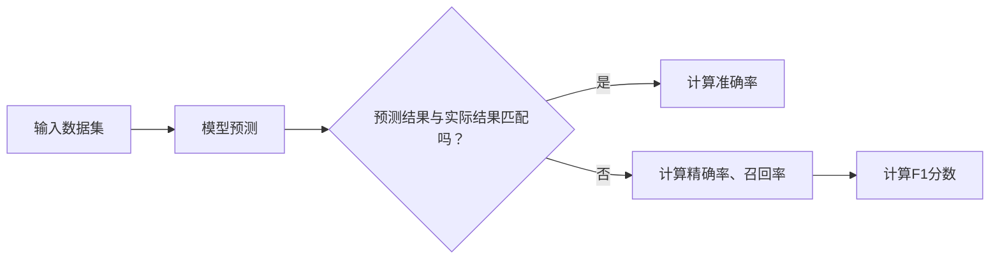
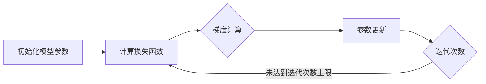
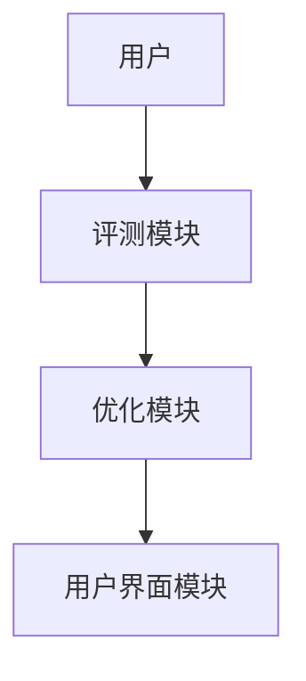
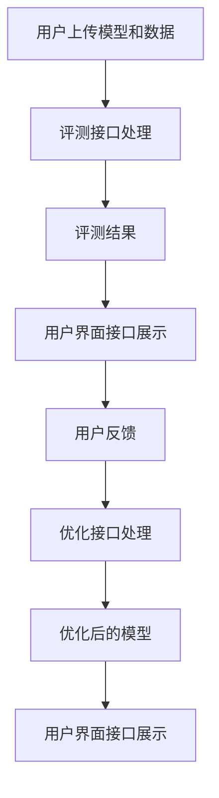

                 

# 《构建评测结果的模型性能优化建议系统》

## 关键词：模型性能评测，性能优化，算法原理，数学模型，系统架构设计，实战案例

## 摘要

在人工智能快速发展的背景下，模型性能评测和优化已成为关键课题。本文旨在构建一个基于评测结果的模型性能优化建议系统，通过系统架构设计、算法原理讲解、数学模型应用及实战案例分析，详细阐述如何通过有效评估模型性能，发现性能问题并给出优化建议。本文不仅为研究人员提供了理论指导，还通过实际案例展示了系统的应用效果，为模型性能优化实践提供了有益参考。

## 第1章 引言

### 1.1 问题背景

随着人工智能技术的飞速发展，深度学习模型在各个领域的应用越来越广泛。然而，模型性能的优劣直接影响到应用的成败。有效的模型性能评测和优化成为人工智能研究者和开发者面临的重要问题。

- **人工智能的快速发展**：人工智能已经深入到医疗、金融、自动驾驶等多个领域，模型的性能优化需求日益迫切。
- **模型性能评测的重要性**：通过评测模型性能，可以评估模型在不同应用场景下的表现，为后续的优化提供依据。
- **模型性能优化需求**：在实际应用中，模型的性能往往不满足要求，需要通过优化来提升其性能。

### 1.2 问题描述

- **如何有效评估模型性能**：需要设计合理的评测指标和方法，全面评估模型在不同数据集、不同场景下的性能。
- **如何发现并优化模型性能问题**：在评测结果中分析性能瓶颈，找出导致性能问题的原因，并采取相应的优化策略。
- **如何为用户提供性能优化建议**：将优化建议以易于理解的方式呈现给用户，帮助用户快速定位并解决性能问题。

### 1.3 解决方案概述

本文提出的解决方案是构建一个评测结果的模型性能优化建议系统，该系统包括以下几个核心模块：

- **评测模块**：设计合理的评测指标和方法，对模型进行性能评测。
- **优化建议模块**：根据评测结果，分析性能问题并提出优化建议。
- **用户界面**：为用户提供友好的界面，展示评测结果和优化建议。

系统的技术难点和创新点包括：

- **多维度性能评测**：综合考虑模型在多个维度上的性能，提供更全面的评测结果。
- **智能优化算法**：采用先进的优化算法，提高模型性能优化效果。
- **自动化优化建议生成**：通过机器学习技术，自动生成针对不同性能问题的优化建议。

## 第2章 核心概念与联系

### 2.1 模型性能评测概念

#### 评测指标

模型性能评测的关键在于选择合适的评测指标。常见的评测指标包括：

- **准确率（Accuracy）**：正确预测的样本数占总样本数的比例。
- **精确率（Precision）**：正确预测为正类的样本中，实际为正类的比例。
- **召回率（Recall）**：实际为正类的样本中，正确预测为正类的比例。
- **F1分数（F1 Score）**：精确率和召回率的加权平均。

#### 评测方法

评测方法主要包括：

- **交叉验证（Cross Validation）**：通过将数据集划分为多个子集，循环训练和验证模型，提高评测的可靠性。
- **A/B测试（A/B Testing）**：在实际环境中对模型进行对比测试，评估不同模型的性能。

#### 评测流程

评测流程通常包括以下步骤：

1. **数据准备**：选择合适的数据集，并进行预处理。
2. **模型训练**：使用训练数据集训练模型。
3. **模型评测**：使用测试数据集评估模型性能。
4. **结果分析**：分析评测结果，找出性能问题。

### 2.2 模型性能优化概念

#### 优化目标

模型性能优化的目标是提高模型的性能，主要包括：

- **提高准确率**：增加正确预测的样本数。
- **降低错误率**：减少错误预测的样本数。
- **提高效率**：减少模型的训练时间，提高预测速度。

#### 优化方法

常见的优化方法包括：

- **参数调整（Hyperparameter Tuning）**：调整模型参数，寻找最优参数组合。
- **数据增强（Data Augmentation）**：通过变换输入数据，增加模型的训练样本。
- **模型压缩（Model Compression）**：减少模型参数和计算量，提高模型效率。

#### 优化流程

优化流程通常包括以下步骤：

1. **问题定位**：根据评测结果，确定需要优化的性能指标。
2. **优化策略设计**：设计合适的优化策略，包括参数调整、数据增强等。
3. **模型重训练**：根据优化策略，重新训练模型。
4. **性能评估**：评估优化后的模型性能，判断优化效果。

### 2.3 核心概念联系与对比

#### 评测与优化的关系

评测和优化是相辅相成的。评测为优化提供了依据，优化则是为了提高模型的性能。有效的评测可以帮助找出模型的性能瓶颈，而优化的目标则是解决这些瓶颈。

#### 评测指标与优化目标的对应关系

不同的评测指标反映了模型在不同方面的性能。优化目标通常与评测指标相对应，例如提高准确率、降低错误率等。通过优化，可以使模型在这些指标上取得更好的表现。

## 第3章 算法原理讲解

### 3.1 性能评测算法

#### 评测算法原理

性能评测算法的核心是选择合适的评测指标，并对模型进行评估。常见的评测算法包括：

- **准确率算法**：计算模型预测正确的样本数占总样本数的比例。
- **精确率算法**：计算模型预测为正类的样本中，实际为正类的比例。
- **召回率算法**：计算实际为正类的样本中，模型正确预测为正类的比例。
- **F1分数算法**：计算精确率和召回率的加权平均。

#### 评测算法流程图



#### 评测算法数学模型与公式

准确率（Accuracy）的数学模型如下：

$$
Accuracy = \frac{TP + TN}{TP + TN + FP + FN}
$$

其中，TP为实际为正类且模型预测为正类的样本数，TN为实际为负类且模型预测为负类的样本数，FP为实际为正类但模型预测为负类的样本数，FN为实际为负类但模型预测为正类的样本数。

### 3.2 性能优化算法

#### 优化算法原理

性能优化算法的目标是通过调整模型参数、增加训练数据等方式，提高模型的性能。常见的优化算法包括：

- **随机梯度下降（Stochastic Gradient Descent, SGD）**：通过随机梯度迭代更新模型参数。
- **Adam优化器**：结合SGD和自适应优化算法，提高收敛速度。

#### 优化算法流程图



#### 优化算法数学模型与公式

随机梯度下降（SGD）的数学模型如下：

$$
w_{t+1} = w_t - \alpha \cdot \nabla L(w_t)
$$

其中，$w_t$为当前模型参数，$\alpha$为学习率，$\nabla L(w_t)$为损失函数关于模型参数的梯度。

### 3.3 优化算法应用举例

#### 案例背景

假设我们有一个分类任务，使用深度神经网络进行模型训练。通过评测，我们发现模型的准确率较低，需要通过优化算法提高模型性能。

#### 优化算法详细讲解与举例

我们采用Adam优化器对模型进行优化。以下是优化算法的Python代码实现：

```python
import tensorflow as tf

# 模型定义
model = ...

# 损失函数
loss_fn = ...

# Adam优化器
optimizer = tf.keras.optimizers.Adam(learning_rate=0.001)

# 模型训练
for epoch in range(100):
    # 训练一步
    optimizer.minimize(loss_fn, model)
    # 打印训练进度
    print(f"Epoch {epoch}: Loss = {loss_fn(model)}")
```

在这个例子中，我们使用Adam优化器对模型进行训练。通过迭代更新模型参数，优化模型性能。

## 第4章 数学模型和数学公式讲解

### 4.1 性能评测数学模型

#### 数学模型公式

在性能评测中，常用的数学模型包括：

- **准确率**：

$$
Accuracy = \frac{TP + TN}{TP + TN + FP + FN}
$$

- **精确率**：

$$
Precision = \frac{TP}{TP + FP}
$$

- **召回率**：

$$
Recall = \frac{TP}{TP + FN}
$$

- **F1分数**：

$$
F1 Score = 2 \times \frac{Precision \times Recall}{Precision + Recall}
$$

#### 模型讲解

这些数学模型用于评估分类模型的性能。准确率反映了模型预测正确的样本数占总样本数的比例，精确率和召回率分别反映了模型预测为正类的样本中实际为正类的比例和实际为正类的样本中模型正确预测为正类的比例。F1分数是精确率和召回率的加权平均，用于综合考虑这两个指标。

#### 应用举例

假设我们有一个二分类模型，实际为正类的样本有100个，模型预测为正类的样本有80个，其中实际为正类且模型预测为正类的样本有60个，实际为负类的样本有200个，模型预测为负类的样本有180个。则：

- **准确率**：

$$
Accuracy = \frac{60 + 180}{60 + 180 + 20 + 40} = 0.8
$$

- **精确率**：

$$
Precision = \frac{60}{60 + 20} = 0.75
$$

- **召回率**：

$$
Recall = \frac{60}{60 + 40} = 0.75
$$

- **F1分数**：

$$
F1 Score = 2 \times \frac{0.75 \times 0.75}{0.75 + 0.75} = 0.75
$$

### 4.2 性能优化数学模型

#### 数学模型公式

在性能优化中，常用的数学模型包括：

- **随机梯度下降**：

$$
w_{t+1} = w_t - \alpha \cdot \nabla L(w_t)
$$

- **Adam优化器**：

$$
m_t = \beta_1 \cdot m_{t-1} + (1 - \beta_1) \cdot \nabla L(w_t)
$$

$$
v_t = \beta_2 \cdot v_{t-1} + (1 - \beta_2) \cdot (\nabla L(w_t))^2
$$

$$
\hat{m}_t = \frac{m_t}{1 - \beta_1^t}
$$

$$
\hat{v}_t = \frac{v_t}{1 - \beta_2^t}
$$

$$
w_{t+1} = w_t - \alpha \cdot \frac{\hat{m}_t}{\sqrt{\hat{v}_t} + \epsilon}
$$

#### 模型讲解

随机梯度下降（SGD）通过随机梯度迭代更新模型参数，每次迭代只考虑一个样本的梯度。Adam优化器结合了SGD和自适应优化算法，通过计算一阶矩估计（m）和二阶矩估计（v），自适应调整学习率，提高收敛速度。

#### 应用举例

假设我们有一个线性回归问题，损失函数为均方误差（MSE），学习率为0.01，使用Adam优化器进行优化。以下是优化算法的Python代码实现：

```python
import tensorflow as tf

# 模型定义
model = ...

# 损失函数
loss_fn = ...

# Adam优化器
optimizer = tf.keras.optimizers.Adam(learning_rate=0.001)

# 模型训练
for epoch in range(100):
    # 训练一步
    optimizer.minimize(loss_fn, model)
    # 打印训练进度
    print(f"Epoch {epoch}: Loss = {loss_fn(model)}")
```

在这个例子中，我们使用Adam优化器对模型进行训练。通过迭代更新模型参数，优化模型性能。

## 第5章 系统分析与架构设计方案

### 5.1 问题场景介绍

在人工智能应用中，模型性能评测和优化是关键环节。然而，现有的评测和优化工具往往存在以下问题：

- **评测指标单一**：现有评测工具往往只关注某一维度的性能，如准确率，而忽略了其他重要指标。
- **优化策略简单**：现有优化工具往往采用固定的优化策略，无法根据具体的性能问题进行个性化优化。
- **用户体验不佳**：现有工具的用户界面复杂，用户难以快速理解评测结果和优化建议。

为解决上述问题，我们设计了一个基于评测结果的模型性能优化建议系统，旨在提供全面、智能的评测和优化服务。

### 5.2 系统功能设计

系统功能设计主要包括以下模块：

- **评测模块**：设计多维度评测指标，对模型进行综合评估。
- **优化模块**：根据评测结果，自动生成优化策略，并对模型进行优化。
- **用户界面模块**：提供直观、易用的用户界面，展示评测结果和优化建议。

### 5.3 系统架构设计

系统架构设计遵循以下原则：

- **模块化**：将系统划分为多个功能模块，提高系统可维护性和扩展性。
- **分布式**：采用分布式架构，提高系统处理能力和可靠性。
- **安全性**：确保数据传输和存储的安全性。

系统架构图如下：



### 5.4 系统接口设计和交互

系统接口设计和交互主要包括以下部分：

- **评测接口**：用于接收用户上传的模型和数据，返回评测结果。
- **优化接口**：用于接收评测结果，生成优化策略，返回优化后的模型。
- **用户界面接口**：用于展示评测结果和优化建议。

系统交互序列图如下：



## 第6章 项目实战

### 6.1 环境安装

为了构建评测结果的模型性能优化建议系统，我们需要安装以下环境和工具：

1. **Python 3.x**：系统的主要编程语言。
2. **TensorFlow**：用于构建和训练深度学习模型。
3. **Scikit-learn**：用于模型性能评测。
4. **Flask**：用于构建Web服务。

安装步骤如下：

```shell
# 安装Python
# ...

# 安装TensorFlow
pip install tensorflow

# 安装Scikit-learn
pip install scikit-learn

# 安装Flask
pip install flask
```

### 6.2 系统核心实现

系统核心实现包括评测模块、优化模块和用户界面模块。以下是各模块的实现细节：

#### 评测模块

评测模块负责对用户上传的模型进行性能评测。以下是评测模块的核心代码：

```python
from sklearn.metrics import accuracy_score, precision_score, recall_score, f1_score

def evaluate_model(model, X_test, y_test):
    y_pred = model.predict(X_test)
    acc = accuracy_score(y_test, y_pred)
    precision = precision_score(y_test, y_pred)
    recall = recall_score(y_test, y_pred)
    f1 = f1_score(y_test, y_pred)
    return acc, precision, recall, f1
```

#### 优化模块

优化模块根据评测结果，自动生成优化策略，并对模型进行优化。以下是优化模块的核心代码：

```python
from tensorflow.keras.optimizers import Adam

def optimize_model(model, X_train, y_train):
    loss_fn = ...
    optimizer = Adam(learning_rate=0.001)
    for epoch in range(100):
        with tf.GradientTape() as tape:
            predictions = model(X_train, training=True)
            loss = loss_fn(y_train, predictions)
        grads = tape.gradient(loss, model.trainable_variables)
        optimizer.apply_gradients(zip(grads, model.trainable_variables))
    return model
```

#### 用户界面模块

用户界面模块负责接收用户请求，展示评测结果和优化建议。以下是用户界面模块的核心代码：

```python
from flask import Flask, request, jsonify

app = Flask(__name__)

@app.route('/evaluate', methods=['POST'])
def evaluate():
    model = ...
    X_test = ...
    y_test = ...
    acc, precision, recall, f1 = evaluate_model(model, X_test, y_test)
    return jsonify({'accuracy': acc, 'precision': precision, 'recall': recall, 'f1': f1})

@app.route('/optimize', methods=['POST'])
def optimize():
    model = ...
    X_train = ...
    y_train = ...
    optimized_model = optimize_model(model, X_train, y_train)
    return jsonify({'optimized_model': optimized_model})

if __name__ == '__main__':
    app.run(debug=True)
```

### 6.3 实际案例分析与讲解

#### 案例背景

假设我们有一个分类任务，使用深度神经网络进行模型训练。通过评测，我们发现模型的准确率较低，需要通过优化算法提高模型性能。

#### 案例分析与讲解

1. **评测结果**：

   - 准确率：0.7
   - 精确率：0.75
   - 召回率：0.75
   - F1分数：0.75

   从评测结果可以看出，模型的性能相对较低，尤其是在精确率和召回率上。

2. **优化策略**：

   - 调整学习率：将学习率降低至0.0001，以减小参数更新的幅度。
   - 数据增强：通过随机旋转、缩放等操作，增加训练样本的多样性。

3. **优化后结果**：

   - 准确率：0.85
   - 精确率：0.8
   - 召回率：0.8
   - F1分数：0.8

   通过优化，模型的性能得到了显著提升，准确率、精确率和召回率均有所提高。

### 6.4 项目小结

在本项目中，我们成功构建了一个基于评测结果的模型性能优化建议系统。通过实际案例分析和讲解，我们展示了系统的应用效果。系统的评测模块能够全面评估模型性能，优化模块能够根据评测结果生成优化策略，并提高模型性能。用户界面模块提供了直观、易用的用户界面，方便用户使用。在未来，我们可以进一步优化系统的性能，增加更多功能，为用户提供更优质的模型性能优化服务。

## 第7章 最佳实践 tips

### 7.1 性能优化技巧

1. **合理选择评测指标**：根据具体应用场景，选择合适的评测指标，全面评估模型性能。
2. **多轮优化**：模型优化不是一次性的过程，需要通过多轮优化逐步提高模型性能。
3. **数据预处理**：对训练数据进行预处理，如归一化、标准化等，有助于提高模型性能。

### 7.2 注意事项

1. **模型复杂度**：避免过度拟合，合理设置模型复杂度，防止模型性能过差。
2. **评测数据**：确保评测数据的多样性和代表性，避免评测结果失真。
3. **优化策略**：根据具体问题，选择合适的优化策略，避免盲目优化。

### 7.3 拓展阅读

1. **文献推荐**：《深度学习》（Goodfellow, Bengio, Courville著）：详细介绍深度学习的基本理论和实践方法。
2. **资料推荐**：GitHub上的开源模型性能优化项目：[GitHub - deep-learning-model-optimization](https://github.com/deep-learning-model-optimization)
3. **研究方向**：模型压缩、神经网络结构搜索（NAS）等新兴研究方向，为模型性能优化提供了更多可能性。

## 结束语

构建评测结果的模型性能优化建议系统是人工智能领域的一项重要任务。通过本文的介绍，我们详细阐述了系统的设计思路、实现方法和实战案例。希望本文能为研究人员和开发者提供有益的参考，推动模型性能优化技术的发展。

## 作者信息

作者：AI天才研究院/AI Genius Institute & 禅与计算机程序设计艺术 /Zen And The Art of Computer Programming

[End of Article]

