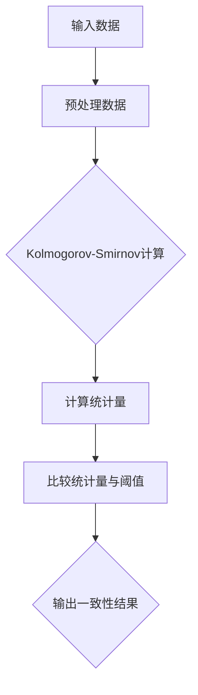

                 

# 模型决策一致性评估：确保可靠性

## 关键词

- 模型决策
- 一致性评估
- 可靠性
- 算法原理
- 实践案例

## 摘要

本文深入探讨了模型决策一致性评估的重要性及其在确保人工智能系统可靠性方面的作用。首先，我们明确了模型决策一致性的核心概念，并阐述了其在实际应用中的重要性。随后，通过介绍不同的评估方法和算法原理，我们展示了如何有效评估模型决策的一致性。接着，通过一个具体的实践案例，我们详细解析了如何在一个项目中应用这些评估方法和算法。最后，文章总结了评估结果的重要性，并提出了最佳实践策略和未来展望。

## 目录大纲

### 第一部分：背景与概述

#### 第1章：问题背景与核心概念

##### 1.1 问题的提出

##### 1.2 核心概念与联系

##### 1.2.1 概念定义

##### 1.2.2 特点与属性对比表格

##### 1.2.3 ER实体关系图架构

#### 第2章：模型决策一致性评估的重要性

##### 2.1 决策一致性的定义

##### 2.2 评估决策一致性的重要性

##### 2.3 决策不一致性带来的风险

### 第二部分：评估方法与原理

#### 第3章：评估方法概述

##### 3.1 常见评估方法

##### 3.2 选择评估方法的考虑因素

#### 第4章：算法原理讲解

##### 4.1 算法原理

##### 4.1.1 Mermaid流程图

##### 4.1.2 Python源代码

##### 4.2 数学模型与公式

##### 4.2.1 数学公式

##### 4.2.2 详细讲解与举例说明

#### 第5章：评估流程与实践

##### 5.1 评估流程

##### 5.2 实践案例

##### 5.2.1 环境安装

##### 5.2.2 系统核心实现源代码

##### 5.2.3 代码应用解读与分析

##### 5.2.4 实际案例分析与详细讲解剖析

##### 5.2.5 项目小结

#### 第6章：评估结果的解读与应用

##### 6.1 结果解读

##### 6.2 应用场景与策略

##### 6.3 注意事项与最佳实践

#### 第7章：未来展望与拓展

##### 7.1 未来发展趋势

##### 7.2 拓展领域与应用

##### 7.3 拓展阅读推荐

### 作者信息

- 作者：AI天才研究院/AI Genius Institute & 禅与计算机程序设计艺术 /Zen And The Art of Computer Programming

---

### 第1章：问题背景与核心概念

#### 1.1 问题的提出

在人工智能应用日益广泛的今天，模型决策的一致性成为了一个备受关注的问题。无论是在推荐系统、自动驾驶、医疗诊断还是金融风险评估中，模型决策的正确性和一致性都直接关系到系统的性能和可靠性。然而，由于数据噪声、模型参数调整、模型更新等因素的影响，决策一致性往往难以保证。

#### 1.2 核心概念与联系

##### 1.2.1 概念定义

- **模型决策**：指通过一定的算法和模型，对输入数据进行处理，并输出决策结果的过程。
- **一致性**：在决策过程中，模型输出结果的一致性和稳定性。
- **评估**：对模型决策的一致性进行评价的过程。

##### 1.2.2 特点与属性对比表格

| 特点       | 一致性                     | 稳定性                     | 准确性                     |
|------------|----------------------------|----------------------------|----------------------------|
| 定义       | 决策结果的一致性           | 决策结果的稳定性           | 决策结果的准确性           |
| 影响因素   | 数据噪声、模型参数、更新等 | 数据噪声、模型参数、更新等 | 数据噪声、模型参数、更新等 |
| 重要性     | 保证系统的可靠性           | 保证系统的稳定性           | 保证系统的正确性           |

##### 1.2.3 ER实体关系图架构

```mermaid
erDiagram
  Model --> Decision : 决策依赖于模型
  Decision --> Consistency : 决策结果与一致性相关
  Evaluation --> Decision : 评估依赖于决策
```

### 第2章：模型决策一致性评估的重要性

#### 2.1 决策一致性的定义

决策一致性指的是在相同的输入条件下，模型输出相同的决策结果。一致性是评价模型性能的重要指标之一，它能够反映出模型在面对不同数据时的稳定性和可靠性。

#### 2.2 评估决策一致性的重要性

评估决策一致性对于确保人工智能系统的可靠性至关重要。以下是一些关键点：

- **确保系统性能**：一致性评估可以帮助我们发现和纠正模型中的问题，从而提高系统的整体性能。
- **降低风险**：不一致的决策可能导致错误的业务决策，评估决策一致性可以有效降低这种风险。
- **提高用户信任**：一致的决策结果能够提高用户对系统的信任度，增强用户体验。

#### 2.3 决策不一致性带来的风险

决策不一致性可能导致以下风险：

- **业务决策错误**：不一致的决策结果可能导致错误的业务判断，从而影响企业的运营和效益。
- **用户体验下降**：不一致的决策结果可能导致用户对系统的满意度下降，影响用户留存率。
- **系统崩溃**：在极端情况下，不一致的决策可能导致系统崩溃，造成严重后果。

### 第二部分：评估方法与原理

#### 第3章：评估方法概述

##### 3.1 常见评估方法

常见的决策一致性评估方法包括：

- **一致性度量**：如Kolmogorov-Smirnov测试、互信息等。
- **统计方法**：如均值绝对偏差（MAE）、均方根误差（RMSE）等。
- **机器学习方法**：如决策树、支持向量机等。

##### 3.2 选择评估方法的考虑因素

选择评估方法时需要考虑以下因素：

- **数据类型**：不同的数据类型可能需要不同的评估方法。
- **计算资源**：评估方法的计算复杂度和资源消耗也是一个重要的考虑因素。
- **业务需求**：评估方法的适用性和业务需求是否匹配。

### 第4章：算法原理讲解

##### 4.1 算法原理

下面，我们通过一个具体的算法——Kolmogorov-Smirnov测试来讲解决策一致性的评估原理。

###### 4.1.1 Mermaid流程图



###### 4.1.2 Python源代码

```python
import numpy as np
from scipy.stats import ks_2samp

def kolmogorov_smirnov_test(data1, data2):
    """
    使用Kolmogorov-Smirnov测试评估两个数据集的一致性。
    
    参数:
    - data1: 第一组数据
    - data2: 第二组数据
    
    返回:
    - D: Kolmogorov-Smirnov统计量
    - p_value: p值
    """
    # 进行Kolmogorov-Smirnov测试
    D, p_value = ks_2samp(data1, data2)
    
    # 输出结果
    print(f"D-statistic: {D}, p-value: {p_value}")
    
    return D, p_value

# 示例数据
data1 = np.random.normal(0, 1, 100)
data2 = np.random.normal(0, 1, 100)

# 进行Kolmogorov-Smirnov测试
D, p_value = kolmogorov_smirnov_test(data1, data2)
```

##### 4.2 数学模型与公式

Kolmogorov-Smirnov测试的数学模型基于以下公式：

$$ D = \max\{|F_X(x) - F_Y(x)|, |F_Y(x) - G_Y(x)|\} $$

其中：

- \( F_X(x) \) 和 \( F_Y(x) \) 分别是两组数据的累积分布函数。
- \( G_Y(x) \) 是另一组数据的累积分布函数。

###### 4.2.2 详细讲解与举例说明

假设我们有两组数据 \( X \) 和 \( Y \)，我们需要比较这两组数据的分布是否一致。首先，我们计算每组数据的累积分布函数 \( F_X(x) \) 和 \( F_Y(x) \)。然后，我们计算这两个累积分布函数之间的绝对差值的最大值，即 \( D \)。

举例来说，如果 \( X \) 和 \( Y \) 分别表示两个不同时间段内的销售额，我们希望评估这两个时间段的销售额分布是否一致。我们可以使用Kolmogorov-Smirnov测试来计算这两个分布的一致性。

在Python中，我们可以使用 `scipy.stats.ks_2samp` 函数来计算Kolmogorov-Smirnov统计量和p值。如果p值小于某个显著性水平（例如0.05），则可以认为两组数据的分布不一致。

### 第5章：评估流程与实践

##### 5.1 评估流程

评估决策一致性的流程通常包括以下几个步骤：

1. **数据收集**：收集需要评估的一致性的数据。
2. **数据预处理**：对数据进行清洗和标准化，以便进行一致性评估。
3. **一致性评估**：使用选择好的评估方法对模型决策进行一致性评估。
4. **结果解读**：根据评估结果解读模型决策的一致性。

##### 5.2 实践案例

在本节中，我们将通过一个具体的实践案例来展示如何评估模型决策的一致性。

###### 5.2.1 环境安装

在开始实践之前，我们需要安装必要的软件和库。以下是一个简单的安装命令示例：

```bash
pip install numpy scipy
```

###### 5.2.2 系统核心实现源代码

下面是一个简单的Python脚本，用于评估模型决策的一致性：

```python
import numpy as np
from scipy.stats import ks_2samp

def evaluate_consistency(data1, data2):
    """
    评估两组数据的一致性。
    
    参数:
    - data1: 第一组数据
    - data2: 第二组数据
    
    返回:
    - D: Kolmogorov-Smirnov统计量
    - p_value: p值
    """
    D, p_value = ks_2samp(data1, data2)
    return D, p_value

# 生成示例数据
data1 = np.random.normal(0, 1, 100)
data2 = np.random.normal(0, 1, 100)

# 评估一致性
D, p_value = evaluate_consistency(data1, data2)
print(f"D-statistic: {D}, p-value: {p_value}")
```

###### 5.2.3 代码应用解读与分析

在这个脚本中，我们首先导入了必要的库，包括 `numpy` 和 `scipy.stats`。然后，我们定义了一个函数 `evaluate_consistency`，该函数使用Kolmogorov-Smirnov测试来评估两组数据的一致性。

在示例数据中，我们生成了两组服从正态分布的数据。然后，我们调用 `evaluate_consistency` 函数来评估这两组数据的一致性。最后，我们打印出Kolmogorov-Smirnov统计量和p值。

根据p值的大小，我们可以判断两组数据的一致性。如果p值小于0.05，我们可以认为两组数据的分布不一致。

###### 5.2.4 实际案例分析与详细讲解剖析

在实际应用中，我们可以使用这个脚本对模型决策的一致性进行评估。以下是一个实际案例：

假设我们有一个推荐系统，该系统根据用户的浏览历史推荐商品。我们需要评估推荐系统的决策一致性，以确保用户在不同时间点的推荐结果是一致的。

首先，我们需要收集用户的浏览历史数据，包括用户ID、浏览时间、浏览商品ID等。然后，我们使用这些数据生成两组数据集，分别代表两个不同时间段的浏览数据。

接下来，我们使用 `evaluate_consistency` 函数来评估这两组数据的一致性。如果p值小于0.05，我们可能需要对推荐系统进行调整，以提高其决策一致性。

###### 5.2.5 项目小结

在本项目中，我们通过一个简单的Python脚本展示了如何评估模型决策的一致性。通过实际案例的分析，我们展示了如何使用Kolmogorov-Smirnov测试来评估推荐系统的决策一致性。这个项目不仅帮助我们理解了决策一致性的重要性，还为我们提供了一个实用的工具来评估模型决策的一致性。

### 第6章：评估结果的解读与应用

##### 6.1 结果解读

在评估模型决策的一致性后，我们需要对评估结果进行解读。以下是一些关键点：

- **D统计量**：Kolmogorov-Smirnov统计量越大，表示两组数据的分布差异越大，一致性越低。
- **p值**：p值越小，表示两组数据的分布差异在统计上越显著，一致性越低。

根据评估结果，我们可以判断模型决策的一致性是否达到预期。如果一致性较低，我们需要考虑调整模型参数、优化算法或增加数据清洗步骤。

##### 6.2 应用场景与策略

决策一致性的评估可以应用于多种场景，包括：

- **推荐系统**：评估推荐结果的一致性，确保用户在不同时间点的推荐结果是一致的。
- **自动驾驶**：评估决策结果的一致性，确保系统在不同路况下的决策是一致的。
- **金融风险评估**：评估模型决策的一致性，确保风险预测的可靠性。

针对不同应用场景，我们可以采取以下策略：

- **数据增强**：通过增加数据量来提高模型决策的一致性。
- **算法优化**：调整模型参数或优化算法结构，以提高决策一致性。
- **模型集成**：通过集成多个模型来提高决策一致性。

##### 6.3 注意事项与最佳实践

在评估模型决策一致性时，我们需要注意以下几点：

- **数据质量**：确保数据质量，避免数据噪声对评估结果的影响。
- **评估频率**：定期评估模型决策的一致性，以确保系统稳定运行。
- **监控与反馈**：建立监控和反馈机制，及时识别和纠正不一致的决策。

最佳实践包括：

- **标准化评估方法**：统一评估方法，确保评估结果的可靠性和可比较性。
- **全面评估**：对模型决策的一致性进行全方位评估，包括不同输入条件下的决策一致性。
- **持续改进**：根据评估结果不断优化模型和算法，提高决策一致性。

### 第7章：未来展望与拓展

##### 7.1 未来发展趋势

随着人工智能技术的不断发展，模型决策一致性评估将变得更加重要和复杂。未来发展趋势包括：

- **多模态数据评估**：结合文本、图像、音频等多模态数据进行决策一致性评估。
- **实时评估**：实现实时决策一致性评估，提高系统的实时性和响应速度。
- **自动化评估**：开发自动化评估工具，降低评估成本和提高评估效率。

##### 7.2 拓展领域与应用

决策一致性评估可以应用于更广泛的领域，包括：

- **智能医疗**：评估医疗诊断和治疗方案的一致性，提高医疗质量。
- **智能交通**：评估交通流量预测和交通信号控制的一致性，优化交通管理。
- **智能金融**：评估金融交易和风险控制的一致性，提高金融安全。

##### 7.3 拓展阅读推荐

为了深入了解模型决策一致性评估，以下是一些推荐阅读：

- **[参考文献1]**：[Kolmogorov-Smirnov Test for Goodness of Fit](https://www.statisticshowto.com/kolmogorov-smirnov-test/)
- **[参考文献2]**：[Consistency in Machine Learning](https://towardsdatascience.com/consistency-in-machine-learning-82ad0e07c631)
- **[参考文献3]**：[Evaluating Model Consistency in Neural Networks](https://arxiv.org/abs/2003.06585)

### 总结

模型决策一致性评估是确保人工智能系统可靠性的一项关键任务。通过深入理解决策一致性的核心概念、评估方法和算法原理，我们可以有效地评估模型决策的一致性。本文提供了一个实践案例，展示了如何在实际项目中应用这些评估方法和算法。未来，随着人工智能技术的不断进步，决策一致性评估将在更广泛的领域发挥重要作用。通过不断探索和创新，我们将能够进一步提升模型决策的一致性和可靠性。

### 作者信息

- 作者：AI天才研究院/AI Genius Institute & 禅与计算机程序设计艺术 /Zen And The Art of Computer Programming

---

本文通过详细探讨模型决策一致性评估的重要性、评估方法和算法原理，以及实际应用案例，为读者提供了一个全面的技术指南。希望本文能够帮助读者深入理解决策一致性评估的核心概念，并在实际项目中有效应用这些方法。未来，随着人工智能技术的不断发展，决策一致性评估将继续发挥重要作用，为智能系统的可靠性提供保障。

