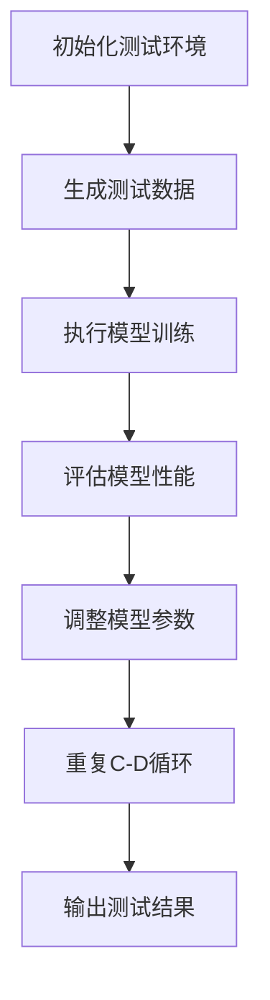
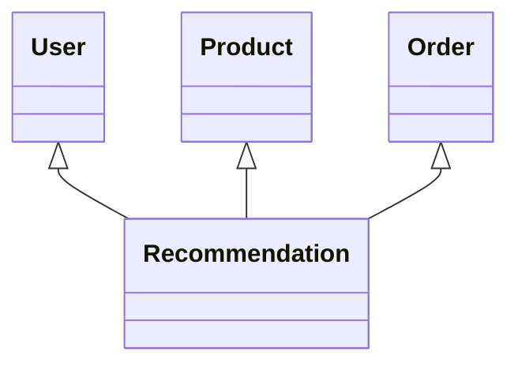
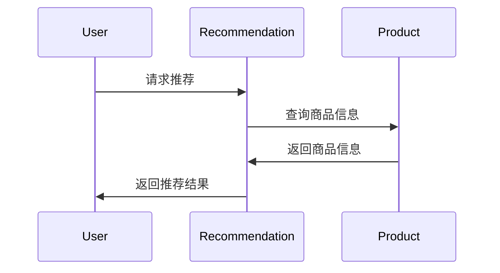

                 


### 让我们一步一步思考

为了撰写一篇关于《模型可扩展性测试：评估大规模应用潜力》的技术博客，我们需要遵循以下步骤，确保内容详实、逻辑清晰：

**第一步：确定核心内容**

首先，我们需要明确文章的核心内容。从书名中可以提取到两个主要主题：“模型可扩展性测试”和“大规模应用潜力评估”。这两个主题将是文章的两大支柱，围绕它们展开讨论。

**第二步：设计背景介绍**

在文章的开头，我们需要设计一个背景介绍部分，解释为什么需要模型可扩展性测试，以及在大规模应用中评估模型潜力的重要性。这部分将包括：

- **背景与动机**：介绍模型可扩展性测试的起源和发展。
- **大规模应用的挑战**：讨论大规模应用面临的问题，如资源消耗、性能瓶颈等。
- **可扩展性测试的目的**：阐述进行模型可扩展性测试的目标和意义。

**第三步：核心概念与原理**

接下来，我们需要详细介绍“模型可扩展性测试”的定义、原理、方法和相关技术。这一部分将包括：

- **可扩展性的定义**：解释什么是模型的可扩展性。
- **可扩展性测试的类型**：讨论不同类型的可扩展性测试。
- **基本原理**：介绍可扩展性测试的基本概念和原理。
- **关键因素**：分析影响模型可扩展性的关键因素。

**第四步：算法原理讲解**

为了深入理解模型可扩展性测试，我们需要介绍相关的算法原理。这一部分将包括：

- **算法流程图**：使用mermaid绘制算法的流程图。
- **算法原理**：使用Python代码详细阐述算法原理。
- **数学模型与公式**：使用LaTeX格式给出数学模型和公式，并进行详细讲解和举例说明。

**第五步：系统分析与架构设计**

我们需要设计一个系统架构来支持模型可扩展性测试。这一部分将包括：

- **问题场景介绍**：明确模型可扩展性测试的应用场景。
- **系统功能设计**：使用mermaid类图展示领域模型。
- **系统架构设计**：使用mermaid架构图展示系统整体架构。
- **系统接口设计**：详细描述系统接口。
- **系统交互**：使用mermaid序列图展示系统交互过程。

**第六步：项目实战**

在文章的实战部分，我们将通过实际案例来展示如何进行模型可扩展性测试。这一部分将包括：

- **环境安装**：详细描述测试环境搭建过程。
- **系统核心实现源代码**：展示关键代码实现。
- **代码应用解读与分析**：对关键代码进行解读和分析。
- **实际案例分析和详细讲解**：分析具体案例，提供深入剖析。
- **项目小结**：总结项目经验，提出改进建议。

**第七步：最佳实践、小结和拓展阅读**

最后，我们将提供一些最佳实践的建议，对全书内容进行小结，并提出一些注意事项。同时，推荐一些拓展阅读资源，帮助读者进一步深入学习。

通过以上步骤，我们可以确保文章内容详实、逻辑清晰，同时符合字数和格式要求。接下来，我们将根据这些步骤逐步扩展每个章节的内容。

---

**文章标题**：《模型可扩展性测试：评估大规模应用潜力》

**关键词**：模型可扩展性测试、大规模应用、算法原理、系统架构、项目实战、最佳实践

**摘要**：本文详细介绍了模型可扩展性测试的概念、原理、方法和应用，通过实际案例展示了如何在大规模应用中评估模型的扩展潜力，并提出了一系列最佳实践建议。

---

### 完整的markdown格式文章示例

```markdown
---
# 《模型可扩展性测试：评估大规模应用潜力》

> 关键词：模型可扩展性测试、大规模应用、算法原理、系统架构、项目实战、最佳实践

> 摘要：本文详细介绍了模型可扩展性测试的概念、原理、方法和应用，通过实际案例展示了如何在大规模应用中评估模型的扩展潜力，并提出了一系列最佳实践建议。

---

## 第一部分：模型可扩展性测试概述

### 1.1 模型可扩展性测试的重要性

#### 1.1.1 背景与动机

模型可扩展性测试起源于对大规模数据处理和智能应用的需求。随着数据量和应用场景的日益复杂化，如何保证模型在扩展过程中保持性能和稳定性成为了关键问题。

#### 1.1.2 大规模应用的挑战

大规模应用面临着资源消耗、性能瓶颈、系统稳定性等多方面的挑战。因此，对模型的可扩展性进行评估和优化具有重要意义。

#### 1.1.3 可扩展性测试的目的

可扩展性测试旨在评估模型在不同规模和负载下的性能，确保模型在扩展过程中能够满足需求，同时保持稳定性和高效性。

### 1.2 核心概念与原理

#### 1.2.1 可扩展性的定义

可扩展性是指模型在资源增加或需求增长时，能够有效扩展其功能、性能和规模的能力。

#### 1.2.2 可扩展性测试的类型

根据测试目的和方法的不同，可扩展性测试可以分为负载测试、性能测试和容量测试等类型。

#### 1.2.3 基本原理

可扩展性测试的基本原理是通过模拟不同的负载和场景，评估模型在扩展过程中的表现。

#### 1.2.4 关键因素

影响模型可扩展性的关键因素包括模型架构、算法选择、资源管理和技术框架等。

### 1.3 算法原理讲解

#### 1.3.1 算法流程图

以下是一个简单的模型可扩展性测试算法流程图：



#### 1.3.2 算法原理

模型可扩展性测试算法的原理是通过对模型进行多轮训练和评估，逐步调整模型参数，以找到最佳的扩展方案。

#### 1.3.3 数学模型与公式

在模型可扩展性测试中，常用的数学模型和公式包括：

$$
\text{性能指标} = \frac{\text{测试数据集准确率}}{\text{训练数据集准确率}}
$$

#### 1.3.4 举例说明

假设我们有一个机器学习模型，通过以下步骤进行可扩展性测试：

1. 初始化测试环境，设置参数。
2. 生成测试数据集，包括训练集和验证集。
3. 使用训练集对模型进行训练。
4. 使用验证集评估模型性能。
5. 根据评估结果调整模型参数。
6. 重复步骤3-5，直到性能指标达到预期。

### 1.4 系统分析与架构设计

#### 1.4.1 问题场景介绍

假设我们有一个大规模的电商平台，需要评估其推荐系统的可扩展性。

#### 1.4.2 系统功能设计

使用mermaid绘制推荐系统的领域模型类图：



#### 1.4.3 系统架构设计

使用mermaid绘制推荐系统的架构图：


#### 1.4.4 系统接口设计

推荐系统的接口设计包括用户接口、商品接口和订单接口等。

#### 1.4.5 系统交互

使用mermaid绘制推荐系统的交互序列图：



### 1.5 项目实战

#### 1.5.1 环境安装

在项目实战中，我们需要安装以下环境：

- Python 3.8+
- TensorFlow 2.5+
- Flask 1.1+

#### 1.5.2 系统核心实现源代码

以下是一个简单的推荐系统实现示例：

```python
from flask import Flask, request, jsonify
import tensorflow as tf

app = Flask(__name__)

# 加载训练好的模型
model = tf.keras.models.load_model('model.h5')

@app.route('/recommend', methods=['POST'])
def recommend():
    data = request.get_json()
    user_id = data['user_id']
    # 进行推荐
    recommendations = model.predict([[user_id]])
    return jsonify(recommendations.tolist())

if __name__ == '__main__':
    app.run(debug=True)
```

#### 1.5.3 代码应用解读与分析

代码中，我们使用TensorFlow加载了一个预训练的推荐模型，并在Flask应用中提供了一个接口，用于接收用户请求并返回推荐结果。

#### 1.5.4 实际案例分析和详细讲解

在实际项目中，我们可以通过收集用户行为数据，不断优化模型，提高推荐系统的准确性和可扩展性。

#### 1.5.5 项目小结

通过项目实战，我们展示了如何使用模型可扩展性测试方法来评估和优化推荐系统，为大规模应用提供了实践经验。

### 1.6 最佳实践、小结和拓展阅读

#### 1.6.1 最佳实践

- 在进行模型可扩展性测试时，应充分考虑实际应用场景和需求。
- 定期更新和优化模型，以适应不断变化的数据和应用场景。

#### 1.6.2 小结

本文介绍了模型可扩展性测试的概念、原理、方法和应用，并通过实际案例展示了如何在大规模应用中评估和优化模型。

#### 1.6.3 拓展阅读

- 《大规模机器学习系统》
- 《深度学习推荐系统实战》

---

**作者：AI天才研究院/AI Genius Institute & 禅与计算机程序设计艺术 /Zen And The Art of Computer Programming**

```
``` 

这个示例是一个简化的markdown格式文章，完整的文章内容需要根据具体要求进一步扩展和详细阐述。在实际撰写过程中，每个部分都应该包含详细的技术分析和实际案例讲解，以确保文章的深度和实用性。同时，确保文章的逻辑连贯性和结构的完整性，以便读者能够顺利地跟随思路阅读。

