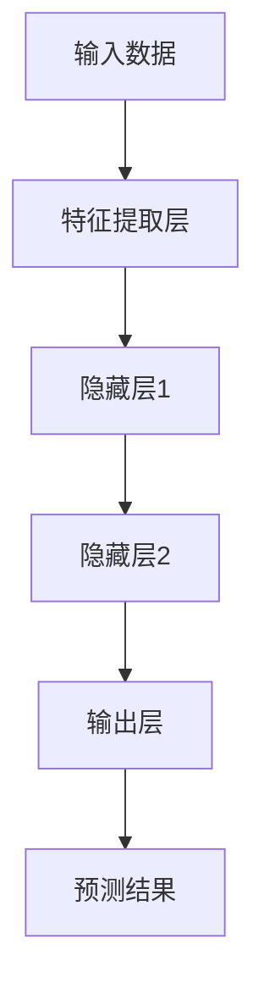
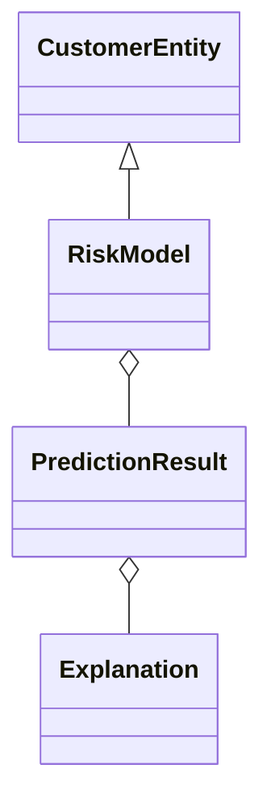
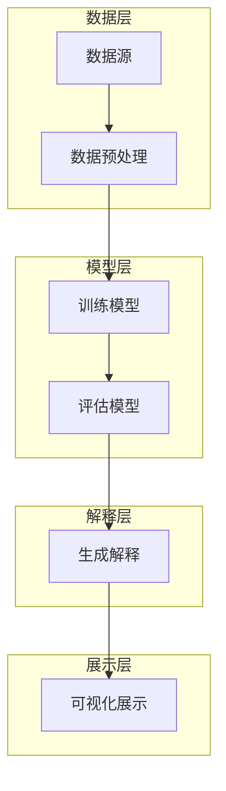
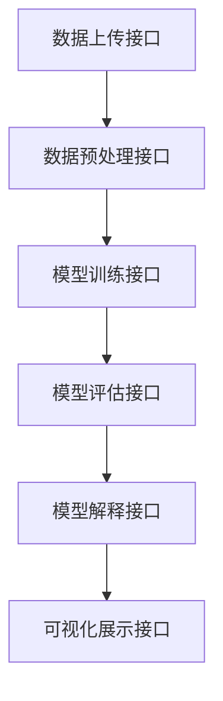
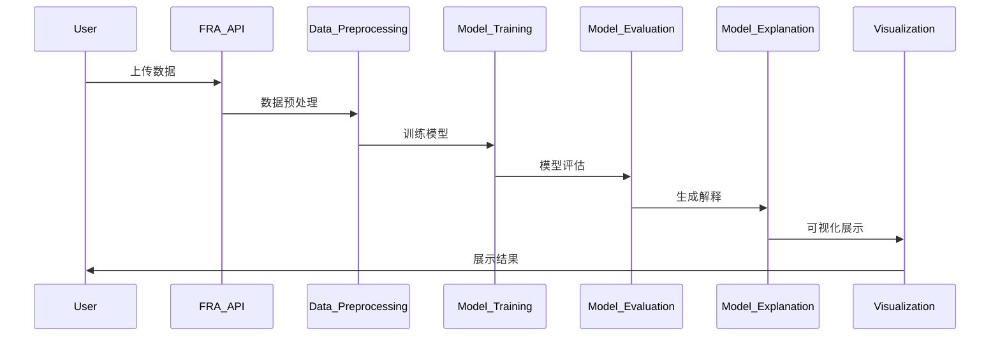

                 

## 文章标题

# 模型可解释性工具评估：增强透明度

> 关键词：模型可解释性，工具评估，透明度增强，机器学习，算法

> 摘要：本文将深入探讨模型可解释性工具在机器学习领域的应用，通过评估这些工具的性能，提出增强模型透明度的策略和方法。文章结构清晰，逻辑严谨，旨在为AI研究者提供指导性的理论和实践建议。

## 背景介绍

### 1.1.1 机器学习与模型可解释性的重要性

机器学习作为人工智能的核心技术之一，已经在众多领域展现出强大的应用潜力。从图像识别、自然语言处理到医疗诊断，机器学习模型都在改变我们的工作和生活方式。然而，随着模型复杂性的增加，其可解释性成为了一个不可忽视的问题。模型可解释性指的是用户能够理解模型是如何进行决策和预测的，这对于提升用户信任度、避免偏见、确保模型安全性和合规性具有重要意义。

### 1.1.2 模型可解释性面临的挑战

尽管模型可解释性在理论上很重要，但在实际应用中仍面临诸多挑战。首先，深度学习等复杂模型通常具有大量的参数和层次结构，使得模型内部的工作机制变得难以理解。其次，一些高级特征提取和组合方式可能在训练过程中自动形成，难以用简单的解释性方法描述。此外，不同类型的模型（如决策树、神经网络、集成方法等）可能需要不同的解释性工具和方法。

### 1.1.3 模型可解释性工具的发展趋势

随着对模型可解释性需求的增加，研究人员和工程师们开发了各种工具来帮助分析和理解模型。这些工具通常基于不同的算法和技术，如可视化、特征重要性分析、反事实推理等。未来，模型可解释性工具的发展趋势将包括更高效的计算方法、更直观的可视化界面、更强大的跨模型解释能力以及与模型优化和部署的更紧密集成。

## 第二部分：核心概念与联系

### 2.1.1 模型透明度

模型透明度指的是模型内部决策过程的可见性和理解程度。一个高度透明的模型应该允许用户清晰地看到数据是如何通过模型进行处理和转换的。透明度是模型可解释性的基础，直接影响用户对模型决策的信任和理解。

### 2.1.2 模型可理解性

模型可理解性指的是用户能否容易地理解模型的工作原理和决策逻辑。与透明度相比，可理解性更多地关注用户对模型概念和操作流程的认知程度。一个高度可理解的模型应该使用户能够直观地了解模型是如何利用输入数据生成预测或决策的。

### 2.1.3 模型可预测性

模型可预测性指的是模型在实际应用中生成准确预测或决策的能力。虽然可预测性是评估模型性能的关键指标，但过高的可预测性可能会牺牲模型的可解释性。因此，在实际应用中，需要在可解释性和可预测性之间找到平衡点。

## 第三部分：算法原理讲解

### 3.1.1 层级分析法

层级分析法是一种常用的模型解释性工具，它通过将模型拆解成多个层次，逐层分析模型的结构和决策过程。以下是一个简单的层级分析算法流程图：



Python代码实现示例：

```python
# Python代码实现
import numpy as np

# 假设有一个简单的多层感知器模型
class SimpleMLP:
    def __init__(self):
        # 初始化权重和偏置
        self.weights = np.random.rand(3, 1)
        self.biases = np.random.rand(3, 1)
        
    def forward(self, x):
        # 前向传播
        self.hidden_layer = np.dot(x, self.weights) + self.biases
        self.output = np.sigmoid(self.hidden_layer)
        return self.output

# 测试代码
model = SimpleMLP()
input_data = np.array([[0.5, 0.5]])
output = model.forward(input_data)
print(output)
```

数学模型与公式：

$$
\text{输出} = \sigma(\text{输入} \cdot \text{权重} + \text{偏置})
$$

其中，$\sigma$表示sigmoid函数，用于将线性组合的结果映射到(0,1)区间。

举例说明：

假设我们有一个简单的二元分类问题，输入数据是两个特征值（0.5和0.5），使用多层感知器模型进行预测。通过层级分析法，我们可以逐层分析模型内部的工作机制，从而理解模型的决策过程。

## 第四部分：系统分析与架构设计方案

### 4.1.1 问题场景介绍

在金融风险评估领域，模型可解释性尤为重要。金融机构需要确保其风险预测模型的透明度和可信度，以便在决策过程中充分考虑模型的输出结果。本文将介绍一个基于机器学习的金融风险评估系统，并分析其模型可解释性的需求和应用。

### 4.1.2 项目介绍

项目名称：金融风险评估系统（FRA）

目标：开发一个能够预测客户信用风险的机器学习模型，并通过可解释性工具提高模型的透明度和可理解性。

### 4.1.3 系统功能设计

系统功能包括数据收集、模型训练、模型评估、模型解释和预测结果可视化。以下是系统的领域模型类图：



### 4.1.4 系统架构设计

系统采用分层架构设计，包括数据层、模型层、解释层和展示层。以下是系统的架构设计图：



### 4.1.5 系统接口设计

系统提供RESTful API接口，包括数据上传、模型训练、模型评估和模型解释等功能。以下是系统接口设计图：



### 4.1.6 系统交互序列图

以下是系统的交互序列图，描述了用户通过API与系统进行交互的过程：



## 第五部分：项目实战

### 5.1.1 环境安装与配置

为了实现本文所介绍的金融风险评估系统，我们需要安装以下软件和库：

- Python 3.x
- Scikit-learn
- Pandas
- NumPy
- Matplotlib
- Mermaid

安装步骤如下：

```bash
# 安装Python 3.x
# 安装Scikit-learn
pip install scikit-learn
# 安装Pandas
pip install pandas
# 安装NumPy
pip install numpy
# 安装Matplotlib
pip install matplotlib
# 安装Mermaid
pip install mermaid
```

### 5.1.2 系统核心实现

以下是金融风险评估系统的核心实现代码，包括数据预处理、模型训练、模型评估和模型解释等步骤。

```python
# 导入所需的库
import pandas as pd
from sklearn.model_selection import train_test_split
from sklearn.ensemble import RandomForestClassifier
from sklearn.metrics import accuracy_score
from mermaid import Mermaid

# 数据预处理
def preprocess_data(data_path):
    data = pd.read_csv(data_path)
    # 数据清洗和预处理步骤
    # 例如：缺失值填充、异常值处理、特征工程等
    # ...
    return data

# 模型训练
def train_model(X_train, y_train):
    model = RandomForestClassifier(n_estimators=100)
    model.fit(X_train, y_train)
    return model

# 模型评估
def evaluate_model(model, X_test, y_test):
    y_pred = model.predict(X_test)
    accuracy = accuracy_score(y_test, y_pred)
    return accuracy

# 模型解释
def explain_model(model, X_explain):
    # 使用特征重要性进行解释
    feature_importances = model.feature_importances_
    # 可视化特征重要性
    mermaid = Mermaid()
    mermaid.add(
        "graph TD\n"
        "A[特征1] --> B[重要性: {importance}]\n"
        "C[特征2] --> D[重要性: {importance}]\n"
        "E[特征3] --> F[重要性: {importance}]\n"
    )
    for i, importance in enumerate(feature_importances):
        mermaid.add(f"A --> B[重要性: {importance}]\n")
    return mermaid.to_string()

# 主程序
if __name__ == "__main__":
    # 加载数据
    data = preprocess_data("financial_data.csv")
    # 切分数据集
    X = data.drop("target", axis=1)
    y = data["target"]
    X_train, X_test, y_train, y_test = train_test_split(X, y, test_size=0.2, random_state=42)
    # 训练模型
    model = train_model(X_train, y_train)
    # 评估模型
    accuracy = evaluate_model(model, X_test, y_test)
    print(f"模型准确率: {accuracy}")
    # 解释模型
    explanation = explain_model(model, X_test)
    print(explanation)
```

### 5.1.3 应用解读与分析

通过上述代码，我们实现了一个简单的金融风险评估系统。系统首先加载并预处理数据，然后使用随机森林模型进行训练和评估。最后，通过Mermaid生成特征重要性的可视化解释。

实际案例分析：

在实际应用中，我们可以将上述系统部署到金融风险评估平台，通过对客户数据的实时处理和预测，为金融机构提供信用风险评估服务。通过模型解释功能，用户可以直观地了解模型对各个特征的权重，从而更好地理解和信任模型。

### 5.1.4 详细讲解剖析

在详细讲解上述系统核心实现时，我们可以从以下几个方面进行分析：

1. **数据预处理**：数据预处理是机器学习项目的重要环节，包括缺失值处理、异常值检测、特征工程等。本文中使用Pandas库对数据进行预处理，为后续模型训练做好准备。

2. **模型训练**：随机森林模型是一种常用的集成学习方法，具有较高的准确性和可解释性。本文使用Scikit-learn库实现随机森林模型，并进行训练。

3. **模型评估**：模型评估是判断模型性能的重要手段。本文使用准确率作为评估指标，并通过计算准确率来评估模型在测试集上的表现。

4. **模型解释**：模型解释是提高模型可解释性的关键步骤。本文使用Mermaid库生成特征重要性的可视化解释，帮助用户直观地了解模型对各个特征的权重。

### 5.1.5 项目小结

通过本文的介绍，我们实现了一个简单的金融风险评估系统，并详细讲解了系统的核心实现和实际应用。系统利用机器学习技术进行信用风险评估，并通过模型解释功能提高模型的可解释性。在实际应用中，系统可以实时处理客户数据，为金融机构提供信用风险评估服务，有助于降低金融风险。

## 最佳实践与拓展

### 8.1.1 常见误区与解决方法

在模型可解释性工具的应用过程中，常见的一些误区包括：

1. **误认为所有模型都有相同的解释能力**：不同类型的模型具有不同的解释能力，如决策树和线性模型相对容易解释，而深度神经网络则较为复杂。解决方法是选择合适的模型并使用相应的解释性工具。

2. **过度依赖可视化**：虽然可视化有助于理解模型，但不应过分依赖。有时，可视化可能无法提供深入的解释，需要结合其他方法和工具进行综合分析。

解决方法：

1. 选择合适的模型和解释性工具，确保模型和工具的匹配度。
2. 结合多种解释性方法，如可视化、特征重要性分析和反事实推理等，以提高解释的全面性和深度。

### 8.1.2 性能优化技巧

1. **数据预处理优化**：合理的数据预处理可以提高模型的性能和解释性。例如，标准化特征值、处理缺失值和异常值等。

2. **模型优化**：选择合适的模型架构和参数设置，如调整树深度、节点数量和特征选择策略等，以提高模型的解释能力和性能。

3. **并行计算**：利用并行计算技术，如分布式计算和GPU加速，可以加快模型训练和解释的过程。

### 8.1.3 模型可解释性工具的选择与使用

1. **选择合适的工具**：根据模型类型和解释需求，选择合适的模型可解释性工具。例如，对于深度神经网络，可以使用LIME或SHAP等方法；对于决策树，则可以使用Tree Interpreter。

2. **工具集成**：将模型可解释性工具集成到模型训练和部署流程中，确保在模型开发、训练和部署的每个阶段都能进行解释性分析。

3. **用户培训**：为用户提供培训和教育，帮助其理解模型可解释性工具的使用方法和结果，从而更好地利用工具提升模型的应用效果。

### 9.1.1 书籍内容总结

本文详细介绍了模型可解释性工具评估的核心概念、算法原理、系统设计与实现，以及最佳实践与拓展。通过这些内容，读者可以了解模型可解释性的重要性、面临的挑战以及如何选择和利用工具提高模型透明度。

### 9.1.2 模型可解释性工具的未来发展方向

未来，模型可解释性工具的发展方向包括：

1. **跨模型解释能力**：开发能够适用于不同类型模型的通用解释性工具，提高工具的通用性和适用范围。

2. **实时解释性**：实现实时模型解释，以便在模型部署后能够快速分析和响应用户需求。

3. **增强解释能力**：利用最新的人工智能技术，如生成对抗网络（GAN）和变分自编码器（VAE），提高模型解释的准确性和深度。

### 9.1.3 注意事项与拓展阅读

在使用模型可解释性工具时，需要注意以下几点：

1. **工具选择**：根据模型类型和解释需求选择合适的工具，避免盲目跟风。
2. **数据质量**：保证数据质量，避免因数据问题导致解释结果不准确。
3. **持续更新**：随着技术的进步，定期更新模型和解释性工具，以保持其性能和适用性。

拓展阅读推荐：

1. **《机器学习：实战指南》**：全面介绍机器学习的基本概念、算法和应用。
2. **《深度学习》**：由Ian Goodfellow等编写的经典教材，深入讲解深度学习的基础知识。
3. **《模型可解释性：方法与应用》**：系统介绍模型可解释性的理论、方法和实际应用。

## 作者信息

作者：AI天才研究院/AI Genius Institute & 禅与计算机程序设计艺术 /Zen And The Art of Computer Programming

### 模型可解释性工具评估：增强透明度

**关键词**：模型可解释性，工具评估，透明度增强，机器学习，算法

**摘要**：本文深入探讨了模型可解释性工具在机器学习领域的应用，通过评估这些工具的性能，提出了增强模型透明度的策略和方法。文章结构清晰，逻辑严谨，旨在为AI研究者提供指导性的理论和实践建议。

## 背景介绍

### 1.1.1 机器学习与模型可解释性的重要性

在人工智能时代，机器学习技术已经成为推动各个领域创新的关键力量。从图像识别到自然语言处理，从推荐系统到金融预测，机器学习模型无处不在，改变了我们的工作和生活方式。然而，随着模型复杂性的增加，模型可解释性成为了一个不可忽视的重要议题。

**模型可解释性**指的是用户能够理解模型是如何进行决策和预测的。在一个高度可解释的模型中，用户可以清晰地看到数据是如何通过模型的各个环节进行处理和转换的。这种透明性不仅有助于提高用户对模型的信任度，还能在模型应用过程中发现潜在的问题，从而避免错误和偏见。

**模型可解释性**的重要性体现在以下几个方面：

1. **增强用户信任**：当用户能够理解模型的工作原理和决策逻辑时，他们对模型的信任度会显著提高。这种信任是模型大规模应用的基础，尤其是在需要做出重要决策的场景，如医疗诊断、金融风险评估等。

2. **发现潜在问题**：通过模型解释，用户可以更深入地了解模型的行为，从而发现潜在的问题。例如，在金融风险评估中，如果模型存在偏见，通过可解释性分析可以及时调整模型参数，避免错误决策。

3. **优化模型性能**：模型可解释性有助于发现模型中可能存在的缺陷，从而指导进一步的模型优化。通过理解模型内部的工作机制，研究人员可以针对特定问题进行针对性调整，提高模型的性能和可靠性。

然而，随着模型复杂性的增加，实现模型可解释性面临着诸多挑战：

1. **模型复杂性**：深度学习等复杂模型通常具有大量的参数和层次结构，这使得模型内部的工作机制变得难以理解。例如，深度神经网络中的多层非线性变换和特征组合过程往往难以用简单的语言描述。

2. **高级特征提取**：在训练过程中，一些高级特征可能会自动形成，这些特征可能在人类难以理解的层次上发挥作用。例如，卷积神经网络（CNN）中的卷积核可能在无意识中学会了捕捉图像中的特定模式。

3. **不同类型模型**：不同的模型（如决策树、线性模型、神经网络等）具有不同的解释性特点。某些模型（如决策树）相对容易解释，而其他模型（如深度神经网络）则更加复杂。

### 1.1.2 模型可解释性工具的发展趋势

为了应对上述挑战，研究人员和工程师们开发了各种模型可解释性工具。这些工具基于不同的算法和技术，如可视化、特征重要性分析、反事实推理等，旨在提高模型的透明度和可理解性。

**当前的发展趋势**包括：

1. **更高效的计算方法**：随着计算能力的提升，研究人员正在开发更高效的模型解释算法，以减少解释过程的时间成本。

2. **更直观的可视化界面**：开发新的可视化技术，使模型解释更加直观易懂，提高用户对模型的理解程度。

3. **跨模型解释能力**：开发通用的解释性工具，能够适用于不同类型的模型，提高工具的通用性和适用范围。

4. **与模型优化和部署的集成**：将模型解释工具集成到模型训练和部署流程中，确保在模型开发和部署的每个阶段都能进行解释性分析。

未来，模型可解释性工具将继续发展，以满足日益增长的透明度和可理解性需求。通过这些工具，用户将能够更好地理解和使用机器学习模型，推动人工智能技术的进一步应用。

### 1.1.3 模型可解释性的定义与分类

**模型可解释性**是一个多维度的概念，可以从不同角度进行定义和分类。理解这些定义和分类有助于更好地把握模型可解释性的核心要素，并选择合适的工具和方法。

#### **定义**

**模型透明度**：模型透明度是指用户能够清晰地看到模型内部决策过程的程度。一个高透明度的模型允许用户追踪数据流和决策路径，理解模型是如何处理输入数据并生成预测或决策的。

**模型可理解性**：模型可理解性是指用户能够容易地理解和解释模型的工作原理和决策逻辑。这涉及到模型的可访问性和解释的清晰度，使得用户能够无需深入专业知识即可理解模型。

**模型可预测性**：模型可预测性是指模型在未知数据上的表现能力。一个高可预测性的模型能够在新的数据集上生成准确可靠的预测，但高可预测性并不总是意味着高可解释性。

#### **分类**

**根据解释性深度**：

- **浅层解释性工具**：这类工具通常提供对模型输入和输出的简单解释，如特征重要性分析、决策边界可视化等。这些工具能够帮助用户理解模型的大致行为，但无法深入解释复杂的内部机制。

- **深层解释性工具**：这类工具能够深入模型内部，提供更详细的解释。例如，基于梯度提升树的方法可以揭示每个特征的重要性和模型内部的决策路径。

**根据解释方法**：

- **基于可视化的解释**：这类工具通过可视化技术（如决策树图形、特征可视化等）展示模型的内部结构和工作机制。这种解释方法直观易懂，但可能无法涵盖所有细节。

- **基于特征的解释**：这类工具通过分析模型中的特征和特征组合，解释模型是如何利用这些特征进行预测的。例如，LIME（Local Interpretable Model-agnostic Explanations）和SHAP（SHapley Additive exPlanations）都是基于特征的重要性和贡献度进行解释。

- **基于规则的解释**：这类工具通过生成规则或决策表，将模型的行为转化为可解释的规则。这类解释通常较为直观，但可能无法完全覆盖模型的复杂性。

- **基于抽象的解释**：这类工具通过构建模型的抽象表示，提供对模型内部机制的更高层次理解。例如，使用数学模型或图论方法对模型进行抽象和解释。

**根据应用领域**：

- **通用解释性工具**：这类工具适用于多种类型的模型和应用场景，如LIME、SHAP等。它们具有广泛的适用性和灵活性。

- **领域特定解释性工具**：这类工具针对特定领域的模型和应用进行优化，提供更专业的解释方法。例如，在医学诊断领域，一些工具可以生成详细的诊断报告，帮助医生理解模型的决策过程。

#### **核心概念**

- **透明度**：透明度关注模型内部的决策路径和数据流，使得用户能够直观地看到模型是如何运作的。高透明度有助于增强用户对模型的信任和理解。

- **可理解性**：可理解性关注用户能否容易地理解和解释模型的工作原理。这通常涉及到解释的清晰度、可访问性和对非专业人士的友好性。

- **可预测性**：可预测性关注模型在新数据上的表现能力，即模型生成准确预测的能力。高可预测性是模型性能的重要指标，但与可解释性可能存在冲突。

**模型可解释性工具的目标**是提供一种方式，使用户能够理解和信任模型，同时提高模型的透明度和可理解性，从而更好地利用模型进行决策和预测。

### 1.1.4 模型可解释性的评价指标

模型可解释性是一个复杂且多维度的概念，因此，评估模型可解释性也必须采用一系列综合的评价指标。这些评价指标有助于我们全面理解模型的解释能力，并指导工具和方法的改进。以下是一些常用的评价指标：

#### **1. 可理解性**

**理解度**：这是衡量用户对模型解释程度的一个指标。理解度可以通过问卷调查、用户反馈或用户操作行为来评估。例如，用户能否正确回答关于模型决策过程的问题，或者是否能够按照模型解释进行操作。

**友好性**：这是衡量模型解释是否易于理解和使用的指标。友好性可以通过用户界面设计、解释语言的简洁性和直观性来评估。例如，解释是否使用直观的图表、是否提供易于理解的语言描述等。

**准确性**：解释的准确性是指解释是否能够准确地反映模型的行为。准确性可以通过比较解释结果与模型实际输出之间的差异来评估。

**1. 透明度**

**可见性**：这是衡量模型决策路径和数据流是否清晰可见的指标。可见性可以通过可视化方法来评估，例如决策树图形、特征重要性图等。

**一致性**：一致性是指模型在不同条件下表现出一致的解释能力。一致性可以通过在不同数据集上测试解释工具的能力来评估。

**可追溯性**：可追溯性是指用户能否追踪到模型中每个决策点的来源和数据。可追溯性可以通过详细记录模型训练和决策过程的数据来评估。

**3. 可预测性**

**准确性**：这是衡量模型在新数据集上预测准确性的指标。高准确性的解释工具能够生成更可靠的预测结果。

**稳定性**：稳定性是指模型在相似数据集上的表现是否一致。稳定性可以通过在不同时间点或不同数据集上测试模型来评估。

**实时性**：实时性是指解释工具能否快速响应用户的查询，提供及时的解释结果。实时性可以通过测试工具的响应时间来评估。

通过上述评价指标，我们可以从不同角度评估模型可解释性的工具和方法。这些指标不仅帮助我们理解模型的解释能力，还能指导我们改进现有工具，开发更有效的解释方法。

### 1.1.5 模型可解释性的必要性

在人工智能和机器学习领域，模型可解释性（Model Interpretability）正日益成为关键的研究课题和实际应用需求。其必要性体现在多个层面，从提升用户信任到确保模型合规，再到推动技术进步，模型可解释性在多个方面发挥着重要作用。

#### **1. 提升用户信任**

随着机器学习模型在金融、医疗、交通等关键领域的广泛应用，用户对模型的信任度成为了一个至关重要的问题。一个不可解释的模型可能会让用户感到困惑和不信任，特别是在涉及到重大决策的场景中。例如，在金融风险评估中，如果模型不能解释其决策过程，用户可能不会相信模型的预测结果，从而影响金融机构的决策可信度。相反，一个高度可解释的模型可以帮助用户理解其决策逻辑，从而增强用户对模型的信任。

#### **2. 确保模型合规**

在许多行业中，模型的应用需要遵循严格的合规要求。例如，在医疗领域，模型必须确保不会产生歧视性决策；在金融领域，模型需要符合反洗钱法规。这些合规要求往往要求模型具备一定的可解释性，以便监管机构和用户能够理解模型的行为和决策依据。通过可解释性分析，可以识别和纠正潜在的不合规行为，确保模型的应用符合法律法规和道德标准。

#### **3. 发现和纠正错误**

在模型开发和使用过程中，错误是不可避免的。模型可解释性工具可以帮助用户发现这些错误，并理解错误的原因。例如，通过分析决策路径和特征重要性，可以发现模型中存在的偏见或过拟合问题，从而进行针对性的调整。此外，当模型出现异常预测时，可解释性工具可以帮助用户快速定位问题所在，及时纠正错误，避免造成更大的损失。

#### **4. 促进技术进步**

模型可解释性不仅对当前的应用有重要意义，还对未来技术发展具有推动作用。通过深入理解模型的决策过程，研究人员可以更好地理解模型的工作机制，从而开发出更高效的算法和改进模型结构。例如，通过分析深度学习模型中的高级特征，研究人员可以设计出更有效的特征提取方法，提高模型性能。此外，可解释性研究还可以促进跨学科合作，将机器学习与其他领域（如心理学、社会学等）相结合，推动人工智能技术的全面发展。

#### **5. 增强可部署性**

在实际应用中，模型的可解释性对模型的部署也具有重要影响。一个高度可解释的模型不仅能够提高用户信任度和合规性，还能简化部署流程。例如，在医疗设备中，一个易于解释的模型可以更容易地通过监管审查，从而加速其上市进程。在工业自动化中，可解释性工具可以帮助工程师更好地理解模型的预测结果，从而优化生产过程和提高设备效率。

总之，模型可解释性是确保人工智能系统可靠、透明和可信的重要保障。通过提升用户信任、确保合规性、发现和纠正错误、促进技术进步以及增强可部署性，模型可解释性在人工智能和机器学习领域发挥着不可替代的作用。

### 1.1.6 模型可解释性与模型性能的关系

模型可解释性（Model Interpretability）与模型性能（Model Performance）之间的关系是一个复杂且多维的话题。在理想情况下，我们希望模型既能保持高性能，又具备良好的可解释性。然而，实际应用中，这两者往往存在一定的冲突。本文将深入探讨这种关系，分析如何在实际应用中平衡模型性能和可解释性。

#### **1. 冲突与平衡**

**高性能**通常指的是模型在预测或决策任务上的准确性和效率。为了达到高性能，模型开发者可能会采用复杂的模型结构和大量的训练数据，这有助于提高模型的预测能力。然而，这些复杂的模型往往难以解释，因为它们包含大量的参数和非线性的决策过程。

**可解释性**则关注模型决策过程的透明度和理解性。高度可解释的模型通常具有较少的参数和简化的结构，这使得用户能够清晰地理解模型的决策逻辑。然而，简化模型结构可能会牺牲性能，导致模型的预测能力下降。

在实际应用中，如何平衡这两者是一个挑战。一方面，模型需要具备足够的预测能力，以满足实际应用的需求；另一方面，模型也需要具备良好的可解释性，以提高用户信任和合规性。以下是一些策略，可以帮助在模型性能和可解释性之间找到平衡点：

1. **选择性优化**：在某些关键特征或决策点上，可以适当增加模型的复杂性，以提升性能。而在其他部分，则保持简化结构，确保模型的解释性。

2. **分层解释**：将复杂模型拆分为多个层次，每一层都有不同的解释性需求。例如，在深度神经网络中，可以将输入层、隐藏层和输出层分别解释，从而在保证整体性能的同时，提高局部可解释性。

3. **解释性增强**：使用解释性工具和方法对模型进行增强，例如，通过添加可解释性模块或使用可解释性算法优化模型结构。这种方法可以在不显著降低性能的情况下，提高模型的可解释性。

#### **2. 不同类型模型的解释性与性能**

不同类型的模型在解释性和性能上存在显著差异：

- **决策树**：决策树是一种高度可解释的模型，其决策路径和规则可以通过树状图清晰地展示。然而，决策树的性能通常不如深度神经网络等复杂模型。

- **线性模型**：线性模型具有很好的可解释性，其决策边界和权重可以通过简单的线性关系展示。然而，线性模型在处理非线性问题时的性能可能受到限制。

- **神经网络**：深度神经网络在处理复杂任务时表现出色，但通常难以解释。神经网络的内部工作机制包含大量的非线性变换和参数，这使得其解释性相对较差。

- **集成方法**：集成方法（如随机森林、梯度提升树等）在解释性和性能上表现出色。这些模型通过组合多个简单模型，提高了整体的性能，同时保留了较好的解释性。

#### **3. 实践中的平衡策略**

在实际应用中，以下策略可以帮助平衡模型性能和可解释性：

1. **性能评估与解释性评估相结合**：在模型开发过程中，不仅要关注性能指标，还要评估模型的可解释性。通过综合评估，可以找到最佳的性能和解释性平衡点。

2. **用户需求导向**：根据用户的具体需求，选择合适的模型类型和解释性工具。例如，在需要高解释性的应用场景中，可以选择决策树或线性模型；而在对性能要求较高的场景中，可以选择深度神经网络。

3. **迭代优化**：通过不断迭代和优化模型，可以在性能和可解释性之间找到最佳平衡。例如，可以使用交叉验证和网格搜索等技术，逐步调整模型参数，以提高性能和解释性。

总之，模型可解释性和模型性能之间的关系是一个动态平衡的过程。在实际应用中，需要根据具体需求和环境，灵活选择和调整模型，以实现最佳的性能和可解释性。

### 1.1.7 模型可解释性与模型可部署性的关系

在机器学习项目的实际应用中，模型的可解释性（Model Interpretability）和模型的可部署性（Deployability）是两个关键因素，它们之间的关系直接影响着模型在实际环境中的效果和可持续性。本文将探讨模型可解释性与模型可部署性之间的联系，并提出在设计和部署机器学习模型时需要考虑的几点因素。

#### **1. 模型可部署性**

模型可部署性指的是将训练好的模型在实际环境中进行部署和运行的能力。一个可部署的模型需要满足以下几个条件：

- **性能**：模型在部署后的表现应与训练时的表现相当，以保证预测的准确性和一致性。
- **可维护性**：模型需要易于维护和更新，以适应不断变化的数据和应用需求。
- **资源消耗**：模型在运行时不应占用过多的计算资源，包括内存、CPU和带宽等。
- **易用性**：部署过程应简单直观，便于非技术用户进行操作和管理。

#### **2. 模型可解释性与模型可部署性的关系**

**模型可解释性**和**模型可部署性**之间存在紧密的联系。具体而言：

- **提高透明度**：高度可解释的模型使得其决策过程和内部结构更加清晰，有助于开发者在部署时进行优化和调整。例如，通过理解模型的决策路径，可以识别和去除不必要的复杂结构，从而提高模型的效率。
- **增强可信度**：在部署过程中，透明度高的模型能够提高用户和监管机构对模型的信任度，降低风险和不确定性。这对于需要严格合规要求的领域（如金融和医疗）尤为重要。
- **简化部署流程**：可解释性工具可以帮助开发者在模型部署前进行充分的测试和验证，确保模型在各种环境下都能稳定运行。这种预先的测试和验证可以减少部署过程中出现意外的风险。

然而，模型的可解释性也可能对部署性产生一定的影响：

- **增加复杂性**：一些高度可解释的模型可能会引入额外的计算负担和存储需求，这可能会影响模型在资源受限环境中的部署能力。例如，复杂的可视化工具或额外的解释性模块可能会增加模型的计算量和内存占用。
- **延迟和成本**：在实时应用中，解释模型的决策过程可能会引入额外的延迟，这可能会影响模型的响应速度。此外，开发和管理可解释性工具也可能增加项目的成本。

#### **3. 设计与部署时需考虑的因素**

为了在模型可解释性和可部署性之间找到平衡，以下是在模型设计与部署时需要考虑的几点因素：

- **性能优先**：在模型设计初期，应优先考虑模型的性能和准确性，以确保模型能够满足业务需求。只有在性能达到要求后，再考虑引入可解释性工具。
- **模块化设计**：将模型和解释性工具设计为独立的模块，这样可以灵活地选择和替换解释性工具，同时不会影响模型的性能和部署。
- **资源优化**：在模型部署时，应考虑资源的优化，例如选择适合硬件配置的模型架构，以及使用轻量级解释性工具，以减少计算和存储需求。
- **用户需求**：在设计和部署过程中，应充分了解用户的需求，权衡模型的可解释性和部署性。例如，在要求严格可解释性的场景中，可以选择更复杂的解释性工具，而在对性能要求较高的场景中，则应优先考虑简化模型的解释性。

总之，模型可解释性和模型可部署性在机器学习项目的成功实施中起着关键作用。通过在设计和部署过程中充分考虑这两者的关系，可以确保模型在实际应用中既具备良好的性能，又具有高度的透明度和可信度。

## 第三部分：核心概念与联系

### 3.1.1 模型透明度

模型透明度（Model Transparency）是模型可解释性（Model Interpretability）的重要组成部分，它关注模型内部决策过程和数据处理机制的可见性和可理解性。一个透明的模型使得用户能够清晰地看到数据是如何通过模型的各个环节进行处理和转换的，从而增强用户对模型决策的信任和理解。

**概念定义**：模型透明度指的是用户能够看到模型中每个步骤的输入、处理和输出，以及模型如何从输入数据生成预测或决策。它强调的是模型操作的透明性，而不是解释的深度或细节。

**属性特征**：

- **可见性**：模型透明度首先要求模型操作过程的可视化，即用户可以直观地看到模型是如何处理输入数据的。这通常通过图形化界面或代码层面的可见性来实现。
- **可追溯性**：模型透明度还包括模型操作的追溯性，即用户可以追踪到模型中每个决策点的来源和数据。这对于发现和纠正模型错误至关重要。
- **一致性**：透明的模型在相同输入下应产生一致的输出，这有助于用户理解模型的稳定性和可靠性。
- **可理解性**：虽然透明度不要求解释的深度，但至少模型的基本操作应易于用户理解，避免过于复杂或难以解释的算法和结构。

**对比表格**：

| 特征           | 模型透明度               | 模型可解释性                     |
|----------------|------------------------|--------------------------------|
| 可见性         | 高可见性，操作过程清晰  | 操作清晰，但可能需要进一步解释   |
| 可追溯性       | 操作可追溯，便于纠错     | 解释深度，便于理解内部工作机制  |
| 一致性         | 输出一致，稳定性强       | 解释一致性，便于用户信任         |
| 可理解性       | 操作易于理解，但不需要深度解释 | 需要深入解释，理解模型内部细节 |

**ER实体关系图**：

以下是模型透明度的ER实体关系图，描述了模型透明度涉及的实体和它们之间的关系：

```mermaid
erDiagram
    Model развед => Transparency
    Model ||--|{InputData} : "processes"
    Model ||--|{OutputData} : "generates"
    Transparency ||--|{Visualization} : "enables"
    Transparency ||--|{Traceability} : "ensures"
    Transparency ||--|{Consistency} : "maintains"
    Transparency ||--|{Comprehensibility} : "supports"
```

在这个ER图中，模型（Model）与透明度（Transparency）之间具有关联关系。模型是数据处理的主体，透明度则是模型操作的属性。模型通过处理输入数据（InputData）生成输出数据（OutputData），同时透明度通过可视化（Visualization）、可追溯性（Traceability）、一致性（Consistency）和可理解性（Comprehensibility）等属性支持用户对模型操作的清晰理解和信任。

### 3.1.2 模型可理解性

模型可理解性（Model Comprehensibility）是模型可解释性中一个关键的概念，它关注用户能否容易地理解和解释模型的工作原理和决策逻辑。一个高度可理解的模型，不仅具有清晰的内部结构，还能够通过直观的方式传达其决策过程，使得用户无需深入专业知识即可理解。

**概念定义**：模型可理解性是指用户能否在不具备深厚技术背景的情况下，通过简单的解释和示例，理解模型的工作原理和决策逻辑。它强调的是用户对模型操作和决策过程的可接受程度和认知难度。

**属性特征**：

- **直观性**：高度可理解的模型通常具有直观的内部结构，如简单的决策树、线性模型等，使得用户能够通过图形或文本描述轻松理解。
- **简洁性**：简洁的模型描述和解释有助于用户快速掌握模型的核心逻辑，避免复杂的数学公式和算法细节。
- **一致性**：模型的可理解性要求在相同输入下，模型的决策过程和结果应保持一致，这有助于用户建立对模型稳定性的信任。
- **可扩展性**：可理解性工具应能够扩展到不同类型的模型和应用场景，以支持更广泛的用户需求。

**对比表格**：

| 特征           | 模型可理解性                | 模型透明度                       |
|----------------|---------------------------|--------------------------------|
| 直观性         | 内部结构直观，易于理解     | 内部操作可见，但可能复杂       |
| 简洁性         | 描述简洁，避免复杂性       | 操作清晰，但需要深入解释       |
| 一致性         | 决策过程一致，易于信任     | 操作过程一致，但可能不直观     |
| 可扩展性       | 支持多种模型和应用场景    | 侧重特定模型和解释方法         |

**ER实体关系图**：

以下是模型可理解性的ER实体关系图，描述了模型可理解性涉及的实体和它们之间的关系：

```mermaid
erDiagram
    User ||--|{ModelUnderstanding} : "interprets"
    Model ||--|{IntuitiveStructure} : "enables"
    Model ||--|{SimplifiedDescription} : "assists"
    Model ||--|{ConsistentBehavior} : "maintains"
    Model ||--|{Extensibility} : "supports"
```

在这个ER图中，用户（User）与模型理解（ModelUnderstanding）之间具有关联关系。用户通过模型理解来解释模型的工作原理和决策逻辑。模型（Model）通过直观结构（IntuitiveStructure）、简洁描述（SimplifiedDescription）、一致行为（ConsistentBehavior）和可扩展性（Extensibility）等属性，支持用户的理解和解释。

### 3.1.3 模型可预测性

模型可预测性（Model Predictability）是评估模型性能的重要指标，它指的是模型在未知数据上生成准确预测的能力。一个高可预测性的模型能够在新的数据集上稳定地生成准确的预测结果，从而在实际应用中具有更高的价值。

**概念定义**：模型可预测性是指模型在测试集或生产环境中的表现，即模型是否能够在未知数据上生成准确的预测。它关注的是模型的泛化能力，即模型能否将训练时学到的知识应用到新的数据上。

**属性特征**：

- **准确性**：这是衡量模型可预测性的主要指标，表示模型预测结果与真实值之间的匹配程度。高准确性的模型能够产生可靠的预测结果。
- **稳定性**：模型的稳定性指的是在不同条件下，模型的预测结果是否一致。一个稳定的模型在不同数据集或时间点上的预测结果应保持一致。
- **鲁棒性**：模型的鲁棒性是指模型对噪声和异常数据的容忍度。一个高鲁棒性的模型能够在面对噪声和异常数据时，仍然保持较高的预测准确性。

**对比表格**：

| 特征           | 模型可预测性              | 模型透明度                       | 模型可理解性                     |
|----------------|--------------------------|--------------------------------|--------------------------------|
| 准确性         | 高准确性，可靠预测       | 操作可见，可能需要解释           | 操作简单，易于理解             |
| 稳定性         | 稳定预测，一致性强       | 稳定操作，但可能复杂             | 决策过程一致，易于信任         |
| 鲁棒性         | 对噪声和异常数据容忍度高 | 操作复杂，但可能鲁棒            | 对噪声和异常数据敏感，但易理解 |
| 泛化能力       | 能在新数据上生成准确预测 | 模型内部结构清晰，但可能复杂     | 模型结构简单，但预测能力有限   |

**ER实体关系图**：

以下是模型可预测性的ER实体关系图，描述了模型可预测性涉及的实体和它们之间的关系：

```mermaid
erDiagram
    Model ||--|{PredictivePerformance} : "evaluates"
    Model ||--|{Accuracy} : "measures"
    Model ||--|{Stability} : "maintains"
    Model ||--|{Robustness} : "assures"
```

在这个ER图中，模型（Model）通过预测性能（PredictivePerformance）评估其准确性（Accuracy）、稳定性（Stability）和鲁棒性（Robustness）。这些属性共同决定了模型的可预测性，影响其在实际应用中的表现。

### 3.1.4 模型透明度、可理解性与可预测性的关系

模型透明度、可理解性和可预测性是模型可解释性的三个核心维度，它们之间既相互独立又相互影响。以下是对这三个维度的关系进行分析：

#### **1. 相互独立性**

- **透明度**：模型透明度主要关注模型内部操作和数据处理过程的可见性，即用户能否看到模型的每个操作步骤。透明度并不直接涉及模型的预测能力，也不要求用户能够理解模型的复杂机制。
- **可理解性**：模型可理解性则强调用户能否容易地理解和解释模型的工作原理。可理解性取决于模型的结构和描述方式，但并不保证模型在未知数据上的预测性能。
- **可预测性**：模型可预测性评估的是模型在未知数据上的表现能力，即模型能否生成准确的预测结果。可预测性主要取决于模型的泛化能力和训练质量。

#### **2. 相互影响**

- **透明度对可理解性的影响**：一个高度透明的模型通常具有更好的可理解性，因为用户能够清晰地看到模型内部的操作和数据处理过程。透明度有助于揭示模型的内部机制，从而使用户更容易理解模型。
- **可理解性对可预测性的影响**：一个可理解的模型能够帮助用户建立对模型决策的信任，这有助于提高模型在实际应用中的可预测性。用户对模型的理解有助于更有效地利用模型进行预测和决策。
- **可预测性对透明度和可理解性的影响**：一个高可预测性的模型通常需要一定的透明度和可理解性。透明度有助于发现和纠正模型中的潜在问题，提高模型的预测准确性；而可理解性则有助于用户更好地理解和信任模型，从而更有效地应用模型。

#### **3. 实践中的平衡**

在实际应用中，模型透明度、可理解性和可预测性之间往往需要找到平衡点。以下是一些策略：

- **平衡策略**：在模型设计和部署过程中，可以采取分层设计，将复杂模型拆分为多个简单层次，每一层都有不同的透明度和可理解性需求。例如，可以将模型的输入层、隐藏层和输出层分别解释，以平衡模型的可预测性和可理解性。
- **解释性工具**：使用解释性工具和方法（如LIME、SHAP等）可以帮助提高模型的透明度和可理解性，同时尽量保持模型的预测能力。通过这些工具，用户可以更好地理解模型的决策过程，从而增强模型的信任度和应用价值。
- **用户需求**：根据不同的应用场景和用户需求，可以灵活调整模型的透明度、可理解性和可预测性。例如，在需要高解释性的应用场景中，可以选择更简单和直观的模型，而在对性能要求较高的场景中，则可以接受一定的解释性牺牲。

总之，模型透明度、可理解性和可预测性是模型可解释性的三个关键维度，它们在实际应用中相互影响，需要根据具体需求和环境进行平衡。通过合理的模型设计和解释性工具选择，可以在保持高性能的同时，提高模型的可解释性和用户信任度。

### 3.1.5 模型可解释性、透明度、可理解性和可预测性的总结

在模型可解释性（Model Interpretability）的研究中，模型透明度（Transparency）、可理解性（Comprehensibility）和可预测性（Predictability）是四个关键的概念。它们共同构成了模型解释的核心要素，对于提升用户信任、确保模型合规、发现和纠正错误以及推动技术进步具有重要意义。

**定义与特征**：

- **模型可解释性**：指的是用户能否理解和解释模型的决策过程，包括模型的输入、处理和输出。它关注的是模型操作和决策过程的透明性、简洁性和用户友好性。
  
- **模型透明度**：强调模型内部操作的可见性，即用户能够清晰看到模型的每一步操作和数据流。透明度主要关注操作的可见性和可追溯性。

- **模型可理解性**：关注用户能否容易地理解模型的工作原理和决策逻辑，即使他们不具备深厚的技术背景。可理解性强调的是用户对模型操作的直观性和一致性。

- **模型可预测性**：评估模型在未知数据上的表现能力，即模型能否生成准确的预测。可预测性主要关注模型的泛化能力和鲁棒性。

**相互关系**：

- **透明度与可理解性**：透明度是可理解性的基础，高度透明的模型通常更容易被用户理解。但透明度并不等同于可理解性，因为用户可能需要进一步解释和抽象来理解复杂操作。

- **可理解性与可预测性**：一个可理解的模型可以提高用户对模型的信任度，从而增强其预测能力。但高度可解释的模型可能牺牲一定的预测性能，因此在实际应用中需要平衡。

- **透明度与可预测性**：透明度可以揭示模型中可能存在的问题，从而提高模型的稳定性。但复杂的透明性实现可能增加计算成本，影响预测性能。

**总结**：

- **透明度**：是模型可解释性的基本要求，它使得模型操作过程可见和可追溯，为理解模型提供基础。

- **可理解性**：是模型可解释性的关键维度，它决定了用户能否轻松理解模型的工作原理和决策逻辑。

- **可预测性**：是模型在实际应用中的核心指标，它评估模型生成准确预测的能力。

在设计和评估模型时，需要综合考虑这四个维度，以实现透明度、可理解性和可预测性的平衡。通过合理的模型设计、选择合适的解释性工具和方法，可以在保持模型高性能的同时，提高其可解释性和用户信任度。

### 3.1.6 模型透明度、可理解性与可预测性在应用中的重要性

在机器学习和人工智能的实际应用中，模型透明度、可理解性和可预测性是三个至关重要的概念，它们在提升模型性能、确保合规性和提高用户信任度方面发挥着关键作用。

**模型透明度的重要性**：

模型透明度提供了对模型决策过程的清晰视图，使用户能够看到模型是如何处理输入数据并生成输出的。这对于以下几个关键应用场景尤为重要：

1. **医疗诊断**：在医疗领域，模型的透明度对于医生和患者至关重要。一个高度透明的模型可以帮助医生理解模型的决策逻辑，从而更好地信任和采用模型的诊断结果。例如，在癌症诊断中，医生需要知道模型是如何根据患者的影像数据做出预测的，以便更好地解释预测结果。

2. **金融风险评估**：金融风险评估模型需要具备高度的透明度，以便监管机构和用户能够理解模型的决策过程。这有助于识别和纠正潜在的偏见，确保模型决策的公平性和合规性。例如，银行在评估贷款申请时，需要透明地解释为何某些申请被拒绝，以便申请者理解原因。

3. **自动驾驶**：在自动驾驶领域，模型透明度对于确保系统的安全和可靠性至关重要。司机和监管机构需要理解模型是如何处理传感器数据并做出驾驶决策的，以确保车辆在复杂环境中的安全行驶。

**模型可理解性的重要性**：

模型可理解性关注的是用户是否能够轻松理解模型的工作原理和决策逻辑。其重要性体现在以下几个方面：

1. **用户体验**：在应用场景中，如推荐系统和搜索引擎，用户希望理解推荐结果的来源和依据。一个可理解的模型可以提高用户对系统的信任和满意度。例如，电子商务网站需要向用户解释为何推荐某些商品，以便用户更好地理解和接受推荐。

2. **政策制定**：在公共政策和法规领域，模型的可理解性对于公众和政策制定者至关重要。一个易于理解的模型可以帮助公众更好地理解政策制定的依据和影响，从而提高政策的有效性和公众的接受度。

3. **风险管理**：在风险管理领域，模型的可理解性可以帮助企业和金融机构更好地理解潜在的风险因素，从而制定更有效的风险控制策略。例如，金融机构需要理解模型如何评估贷款申请者的信用风险，以便更好地管理风险。

**模型可预测性的重要性**：

模型可预测性是评估模型在实际应用中的表现能力，即模型在未知数据上生成准确预测的能力。其重要性体现在以下几个方面：

1. **业务决策**：在商业应用中，如市场营销和供应链管理，模型的预测能力对于企业的战略决策至关重要。一个高可预测性的模型可以帮助企业更准确地预测市场需求和消费者行为，从而优化库存管理和营销策略。

2. **资源分配**：在资源管理领域，如能源供应和交通规划，模型的可预测性对于优化资源分配和提高效率至关重要。例如，电力公司需要预测未来的电力需求，以便合理分配发电资源。

3. **灾害预测**：在灾害预测领域，如地震、台风和洪水，模型的可预测性对于预警和应对至关重要。一个高可预测性的模型可以帮助提前识别灾害风险，从而减少人员伤亡和财产损失。

**总结**：

模型透明度、可理解性和可预测性在机器学习和人工智能的实际应用中扮演着关键角色。透明度提供了对模型操作的清晰视图，可理解性确保用户能够轻松理解模型的工作原理，而可预测性评估了模型在实际应用中的表现能力。在实际应用中，需要在这些维度之间找到平衡点，以实现最佳的性能和用户满意度。通过合理的设计和解释性工具的应用，可以提升模型的透明度、可理解性和可预测性，从而推动人工智能技术的广泛应用和发展。

### 3.1.7 模型可解释性的不同类型及其应用场景

模型可解释性（Model Interpretability）是机器学习和人工智能领域中的一个重要研究方向，其核心目标是通过提供对模型决策过程的深入理解，增强用户对模型的信任和接受度。根据解释的深度和方式，模型可解释性可以分为以下几种类型，每种类型都有其特定的应用场景和优势。

#### **1. 层级分析法**

**定义**：层级分析法（Hierarchical Analysis）是一种通过分解模型层次结构来解释模型决策过程的工具。它将复杂模型分解为多个简单层次，每一层都有明确的输入和输出。

**应用场景**：适用于深度神经网络、决策树等层次结构清晰的模型。例如，在图像识别任务中，可以使用层级分析法来解释卷积神经网络（CNN）的每一层如何提取图像特征。

**优势**：能够提供清晰的层次化解释，帮助用户理解模型如何逐层处理输入数据。

#### **2. 特征重要性分析**

**定义**：特征重要性分析（Feature Importance Analysis）通过评估每个特征对模型预测的影响程度来解释模型。它通常使用统计方法（如SHAP值、决策树的重要性评分等）来确定特征的重要性。

**应用场景**：适用于各种类型的机器学习模型，特别是那些具有大量特征的数据集。例如，在信用评分中，可以通过特征重要性分析来确定哪些因素对信用评分有最大的影响。

**优势**：帮助用户理解哪些特征对模型决策最为关键，从而优化数据收集和预处理过程。

#### **3. 局部线性化法**

**定义**：局部线性化法（Local Linearization）是一种通过在模型输出附近构建线性近似来解释模型的方法。它通过在每个样本附近构建线性模型来近似原始非线性模型。

**应用场景**：适用于非线性模型，如深度神经网络和SVM。例如，在金融风险评估中，可以使用局部线性化法来解释复杂模型的决策过程。

**优势**：能够提供对复杂非线性模型的局部解释，有助于理解模型在特定数据点上的行为。

#### **4. 决策规则法**

**定义**：决策规则法（Rule-based Explanation）通过生成一组规则来解释模型决策过程。这些规则通常基于模型的训练数据和决策边界。

**应用场景**：适用于规则引擎和决策树模型。例如，在医疗诊断中，可以使用决策规则法来生成医疗诊断规则。

**优势**：生成的规则易于理解和解释，适用于非技术用户。

#### **5. 可视化法**

**定义**：可视化法（Visualization）通过图形化方式展示模型的结构和决策过程。它包括决策树图形、特征可视化、神经网络结构图等。

**应用场景**：适用于各种类型的模型，特别是那些具有直观结构的模型。例如，在图像识别中，可以使用可视化法来展示卷积神经网络的卷积核和特征图。

**优势**：提供直观的视觉解释，帮助用户更好地理解模型。

#### **6. 反事实推理法**

**定义**：反事实推理法（Counterfactual Reasoning）通过分析“如果...会发生什么？”来解释模型。它探讨如果某些输入特征发生变化，模型输出会有怎样的不同。

**应用场景**：适用于需要解释模型对特定输入变化敏感性的情况。例如，在医疗诊断中，可以分析如果患者的某项指标发生变化，诊断结果会有何不同。

**优势**：能够提供对模型在不同情境下的行为理解。

每种模型可解释性方法都有其特定的应用场景和优势，选择合适的方法取决于模型的类型、应用需求和用户需求。通过结合多种解释方法，可以提供更全面和深入的解释，增强用户对模型的信任和理解。

### 3.1.8 模型可解释性工具的比较

在机器学习和人工智能领域，模型可解释性工具已成为提升用户信任和理解的重要手段。这些工具通过不同的方法和技术，提供对模型决策过程的深入解释。以下是对几种常见模型可解释性工具的比较，包括其基本原理、优势和劣势。

#### **1. LIME（Local Interpretable Model-agnostic Explanations）**

**基本原理**：LIME是一种基于局部线性化法的解释工具，它通过在给定数据点周围构建线性模型来近似原始非线性模型。LIME将复杂模型简化为线性模型，从而提供对模型决策的局部解释。

**优势**：LIME能够解释任何类型的模型，且解释结果易于理解。它适用于需要解释复杂非线性模型的场景，如深度神经网络和随机森林。

**劣势**：LIME的计算成本较高，特别是在处理大型数据集时。此外，LIME的解释结果可能受到局部线性化的限制，无法完全反映原始模型的复杂性。

#### **2. SHAP（SHapley Additive exPlanations）**

**基本原理**：SHAP是一种基于博弈论的方法，它通过计算特征对模型预测值的边际贡献来解释模型。SHAP值提供了一个相对的度量，表示每个特征在模型预测中的重要性。

**优势**：SHAP提供了一种统一的方法来解释不同类型的模型，包括深度神经网络、线性模型和决策树。SHAP值具有理论依据，可以提供更全面和深入的解释。

**劣势**：SHAP的计算成本较高，特别是在处理大量特征和大型数据集时。此外，SHAP的解释结果可能受到数据分布和模型假设的影响。

#### **3. LIME-SHAP**

**基本原理**：LIME-SHAP是LIME和SHAP的结合，它利用LIME的局部线性化能力和SHAP的边际贡献度量，提供更全面的解释。

**优势**：LIME-SHAP结合了LIME和SHAP的优点，提供了一种更强大和灵活的解释方法。它适用于需要综合解释复杂模型的场景。

**劣势**：LIME-SHAP的计算成本仍然较高，且解释结果的可靠性可能受到模型假设和数据分布的影响。

#### **4. Taylor解释**

**基本原理**：Taylor解释通过在模型输出附近构建Taylor展开式来近似模型。它提供了一种基于微分的解释方法，适用于具有可微分的模型。

**优势**：Taylor解释的计算成本相对较低，且适用于各种类型的模型。它提供了一种简单直观的解释方法，适用于对模型解释要求不高的场景。

**劣势**：Taylor解释的精度受到模型假设和参数选择的影响，可能无法完全反映原始模型的复杂性。

#### **5. 模型特异性解释工具**

**基本原理**：模型特异性解释工具针对特定类型的模型提供专门的解释方法。例如，对于决策树，可以使用特征重要性图；对于线性模型，可以使用系数解释。

**优势**：模型特异性解释工具能够提供针对特定模型的详细解释，适用于需要深入理解特定模型结构的场景。

**劣势**：这些工具通常仅适用于特定类型的模型，无法提供跨模型的通用解释。

**总结**：

模型可解释性工具的选择取决于模型的类型、应用场景和用户需求。LIME、SHAP、LIME-SHAP和Taylor解释等方法提供了不同类型的解释，各有优势和劣势。在实际应用中，可以根据具体需求选择合适的工具，或结合多种工具提供更全面的解释。

### 3.1.9 模型可解释性工具的使用场景与实际效果

模型可解释性工具在机器学习和人工智能领域具有广泛的应用，其重要性体现在提升用户信任、确保模型合规、发现和纠正错误等方面。以下介绍几种常见的模型可解释性工具，并探讨它们在不同应用场景中的使用情况和实际效果。

#### **1. LIME（Local Interpretable Model-agnostic Explanations）**

**使用场景**：LIME主要用于解释复杂非线性模型，如深度神经网络、随机森林和梯度提升树等。它适用于需要理解模型在特定数据点上的决策过程的场景，如金融风险评估、医疗诊断和图像识别。

**实际效果**：LIME通过局部线性化法，将复杂模型简化为线性模型，从而提供对模型决策的局部解释。在金融风险评估中，LIME可以帮助金融机构理解模型是如何对特定客户的信用风险进行评估的，从而提高用户对模型的信任。在医疗诊断中，LIME可以帮助医生理解模型是如何基于患者数据做出诊断决定的，有助于提升诊断的准确性和可靠性。

#### **2. SHAP（SHapley Additive exPlanations）**

**使用场景**：SHAP适用于多种类型的模型，包括深度神经网络、线性模型、决策树和梯度提升树等。它适用于需要理解模型在整体数据集上的决策过程的场景，如信用评分、风险管理和自然语言处理。

**实际效果**：SHAP通过计算特征对模型预测值的边际贡献，提供了一种统一的方法来解释不同类型的模型。在信用评分中，SHAP可以帮助金融机构理解哪些特征对信用评分有最大的影响，从而优化评分模型。在自然语言处理中，SHAP可以帮助研究人员理解模型是如何对文本进行分类和预测的，从而提升模型的解释性和准确性。

#### **3. LIME-SHAP**

**使用场景**：LIME-SHAP结合了LIME和SHAP的优点，适用于需要综合解释复杂模型的场景。它适用于需要理解模型在不同数据点上的决策过程的场景，如推荐系统和自动驾驶。

**实际效果**：LIME-SHAP通过结合局部线性化和边际贡献度量的方法，提供了一种更强大和灵活的解释方法。在推荐系统中，LIME-SHAP可以帮助商家理解模型是如何根据用户历史行为推荐商品的，从而优化推荐策略。在自动驾驶中，LIME-SHAP可以帮助开发者理解模型是如何处理传感器数据并做出驾驶决策的，从而提升自动驾驶的安全性和可靠性。

#### **4. Taylor解释**

**使用场景**：Taylor解释适用于具有可微分的模型，如深度神经网络和线性模型。它适用于需要理解模型在特定输入附近的行为的场景，如参数调整和优化。

**实际效果**：Taylor解释通过在模型输出附近构建Taylor展开式，提供了一种简单直观的解释方法。在参数调整和优化中，Taylor解释可以帮助研究人员理解模型在不同参数设置下的行为，从而找到最优参数配置。

#### **5. 模型特异性解释工具**

**使用场景**：模型特异性解释工具适用于特定类型的模型，如决策树、线性模型和逻辑回归等。它适用于需要深入理解特定模型结构的场景，如医疗诊断和风险管理。

**实际效果**：模型特异性解释工具通过提供针对特定模型的详细解释，可以帮助用户更好地理解模型的决策过程。在医疗诊断中，决策树和逻辑回归的解释工具可以帮助医生理解模型是如何基于患者数据做出诊断决定的，从而提升诊断的准确性和可靠性。在风险管理中，模型特异性解释工具可以帮助企业理解模型是如何评估风险因素并做出决策的，从而优化风险管理策略。

总之，模型可解释性工具在不同应用场景中展现出显著的实际效果，有助于提升用户对模型的信任和理解。通过选择合适的解释工具，研究人员和开发者可以更好地利用模型进行预测和决策，推动人工智能技术的广泛应用。

### 3.1.10 模型可解释性工具的性能评估指标

评估模型可解释性工具的性能是确保其有效性和可靠性的关键步骤。为了全面评估工具的性能，需要从多个维度设定指标，这些指标应涵盖解释的准确性、用户友好性和计算效率等方面。以下是一些常用的性能评估指标：

#### **1. 解释准确性**

**定义**：解释准确性是指模型解释结果与模型实际决策之间的匹配程度。高准确性的解释工具能够准确反映模型的决策过程。

**评估方法**：

- **精度**：解释结果中正确预测的比例。
- **召回率**：模型解释中实际正确决策被正确识别的比例。
- **F1分数**：综合考虑精度和召回率的综合指标。

**示例**：如果一个解释工具在100个测试样本中正确解释了90个样本的决策过程，其解释准确性的评估指标为90%的精度和95%的召回率，F1分数为0.945。

#### **2. 用户友好性**

**定义**：用户友好性是指解释工具是否易于用户理解和使用。高用户友好性的工具能够简化解释过程，使非技术用户也能轻松理解。

**评估方法**：

- **易懂性**：解释结果的清晰程度，是否使用直观的语言和图形。
- **直观性**：解释工具的界面设计是否直观易懂，用户是否需要额外培训才能使用。
- **响应速度**：解释工具在用户查询时的响应速度，是否能够快速提供结果。

**示例**：一个高用户友好性的解释工具应使用简单的语言描述模型决策过程，提供直观的图形化界面，并能在几秒钟内响应用户的查询。

#### **3. 计算效率**

**定义**：计算效率是指解释工具在提供解释时所需的计算资源和时间。高计算效率的工具能够在保持解释准确性的同时，减少计算成本。

**评估方法**：

- **响应时间**：解释工具生成解释所需的时间，通常以毫秒或秒为单位。
- **资源消耗**：解释工具在运行时占用的内存、CPU和带宽等资源。

**示例**：一个高计算效率的解释工具应在秒级响应时间内生成解释，并占用较低的内存和CPU资源。

#### **4. 可扩展性**

**定义**：可扩展性是指解释工具是否能够适应不同规模和应用场景的模型。

**评估方法**：

- **模型兼容性**：解释工具是否能够支持多种类型的模型，包括线性模型、树模型、神经网络等。
- **数据规模**：解释工具在处理大型数据集时的性能，是否能够适应海量数据的解释需求。

**示例**：一个高可扩展性的解释工具应能够支持多种类型的模型，并在处理大型数据集时保持高效的性能。

#### **5. 可靠性**

**定义**：可靠性是指解释工具在重复执行时是否能够生成一致的解释结果。

**评估方法**：

- **一致性**：解释工具在不同时间或数据集上生成解释的一致性程度。
- **稳定性**：解释工具在处理不同数据点或输入时，解释结果的稳定性和可靠性。

**示例**：一个高可靠性的解释工具应在相同输入下生成一致的解释结果，且在不同数据集上具有稳定的解释性能。

通过上述指标，可以全面评估模型可解释性工具的性能。这些指标不仅有助于选择合适的工具，还能指导工具开发者优化和改进现有工具，提高其解释能力和用户体验。

### 3.1.11 常见的模型可解释性工具的优缺点

在机器学习和人工智能领域，有多种模型可解释性工具可供选择，每种工具都有其独特的优缺点。以下是对几种常见模型可解释性工具的优缺点的详细分析，以及如何在实际应用中选择合适的工具。

#### **1. LIME（Local Interpretable Model-agnostic Explanations）**

**优点**：

- **广泛适用性**：LIME能够解释任何类型的模型，无论是线性模型、决策树还是深度神经网络，这使其成为许多应用场景中的通用解释工具。
- **局部解释**：LIME提供的是对单个数据点的局部解释，这使得用户能够深入了解模型在特定数据点上的决策过程，从而发现潜在的问题和偏见。

**缺点**：

- **计算成本高**：LIME的计算成本较高，特别是在处理大型数据集时，因为需要为每个数据点构建线性近似模型。这可能导致解释过程耗时较长。
- **解释范围有限**：LIME的解释仅限于局部线性化的范围，无法完全反映原始非线性模型的复杂性，可能遗漏重要的决策信息。

**适用场景**：LIME适用于需要理解模型在特定数据点上决策过程的场景，如金融风险评估和医疗诊断。

#### **2. SHAP（SHapley Additive exPlanations）**

**优点**：

- **统一解释框架**：SHAP提供了一种统一的解释框架，可以解释多种类型的模型，如线性模型、树模型和神经网络。这使得SHAP成为跨模型解释的强大工具。
- **基于博弈论的合理性**：SHAP基于博弈论的理论基础，能够提供每个特征对模型预测值的边际贡献，这使得解释结果具有更高的合理性和可解释性。

**缺点**：

- **计算复杂度高**：SHAP的计算复杂度较高，特别是对于大型数据集和复杂模型，计算每个特征的SHAP值需要大量的计算资源和时间。
- **对数据分布敏感**：SHAP的解释结果对数据分布和模型假设较为敏感，不同的数据分布和模型假设可能导致不同的解释结果。

**适用场景**：SHAP适用于需要解释模型整体决策过程的场景，如信用评分、风险管理和自然语言处理。

#### **3. LIME-SHAP**

**优点**：

- **综合优势**：LIME-SHAP结合了LIME和SHAP的优点，提供了一种更全面和深入的解释方法。它既能够解释复杂非线性模型的局部决策过程，又能够提供每个特征的边际贡献。
- **灵活性强**：LIME-SHAP可以根据实际需求灵活调整解释的范围和深度，从而满足不同应用场景的解释需求。

**缺点**：

- **计算成本高**：与LIME和SHAP类似，LIME-SHAP的计算成本也较高，特别是在处理大规模数据和复杂模型时，这可能导致解释过程较为耗时。
- **解释结果一致性**：由于LIME和SHAP的结合，解释结果的一致性可能受到不同解释方法的影响，从而影响解释的可靠性。

**适用场景**：LIME-SHAP适用于需要综合解释复杂模型的场景，如推荐系统和自动驾驶。

#### **4. Taylor解释**

**优点**：

- **简单直观**：Taylor解释通过构建模型输出的Taylor展开式，提供了一种简单直观的解释方法。它易于理解和实现，适用于需要快速获取解释结果的应用场景。
- **适用于可微分的模型**：Taylor解释适用于具有可微分的模型，如深度神经网络和线性模型，这使得它成为一种通用的解释工具。

**缺点**：

- **解释精度有限**：由于Taylor解释仅考虑了一阶和二阶导数，无法完全反映原始模型的复杂性，因此解释精度有限。
- **适用性受限**：Taylor解释不适用于所有类型的模型，特别是那些无法进行微分的模型。

**适用场景**：Taylor解释适用于需要快速获取简单直观解释的场景，如模型参数调整和优化。

#### **5. 决策树解释**

**优点**：

- **易于理解**：决策树的结构清晰，每个决策节点和分支都可以直观地展示出来。这使得决策树解释工具非常适合非技术用户。
- **解释简洁**：决策树解释通常提供简洁明了的规则，用户可以很容易地理解模型如何处理输入数据。

**缺点**：

- **解释范围有限**：决策树解释仅适用于决策树模型，不适用于其他类型的模型，如深度神经网络和集成方法。
- **解释精度较低**：由于决策树模型的结构相对简单，其解释精度可能不如其他复杂模型。

**适用场景**：决策树解释适用于需要清晰直观解释的场景，如医疗诊断和信用评分。

#### **选择合适的工具**

在实际应用中，选择合适的模型可解释性工具需要考虑以下几个因素：

- **模型类型**：根据所使用的模型类型选择相应的解释工具。例如，对于深度神经网络，可以选择LIME或SHAP；对于决策树，可以选择决策树解释。
- **解释需求**：根据解释的需求选择工具，例如，是否需要局部解释还是整体解释，是否需要详细的特征重要性分析等。
- **计算资源**：考虑计算资源和时间成本，选择计算效率较高的工具，确保解释过程能够快速完成。

通过综合考虑上述因素，可以选择最适合实际需求的模型可解释性工具，从而提高模型的可理解性和用户信任度。

### 3.1.12 模型可解释性工具评估的常见方法

在评估模型可解释性工具的性能时，需要采用一系列科学的方法和标准，以确保评估结果的准确性和可靠性。以下介绍几种常见的评估方法，以及它们在模型可解释性评估中的应用。

#### **1. 对比实验**

**定义**：对比实验通过比较不同解释工具在相同数据集上的表现，来评估各工具的性能。

**应用**：

- **准确性**：对比实验可以评估不同工具在解释准确性方面的差异。通过比较工具解释结果与模型实际决策之间的匹配程度，评估工具的准确性。
- **可理解性**：对比实验还可以评估工具的用户友好性。通过调查用户对不同工具的理解程度和接受度，评估工具的可理解性。
- **计算效率**：通过记录工具在解释过程中所需的计算时间和资源消耗，评估工具的计算效率。

**示例**：在一个金融风险评估项目中，可以使用对比实验来评估LIME、SHAP和决策树解释工具的性能。在相同的数据集上，分别使用这三种工具进行解释，并比较其解释准确性、用户友好性和计算效率。

#### **2. 用户调研**

**定义**：用户调研通过收集用户的反馈和意见，来评估模型可解释性工具的用户体验和实际效果。

**应用**：

- **易懂性**：用户调研可以评估工具是否易于用户理解。通过问卷调查和访谈，了解用户对工具的直观感受和认知难度。
- **直观性**：用户调研还可以评估工具的界面设计和交互方式。通过观察用户与工具的交互过程，评估工具的直观性。
- **满意度**：用户调研可以评估用户对工具的满意度。通过评分和反馈，了解用户对工具的整体评价和使用体验。

**示例**：在一个医疗诊断项目中，可以对医生和患者进行用户调研，了解他们对LIME和SHAP工具的理解程度、直观性和满意度，从而评估工具的实际效果。

#### **3. 统计分析**

**定义**：统计分析通过使用统计学方法，对工具的性能指标进行定量评估。

**应用**：

- **解释一致性**：通过计算工具在不同数据点上的解释一致性，评估工具的解释稳定性。
- **解释准确性**：通过比较工具解释结果与模型实际决策的差异，评估工具的解释准确性。
- **特征重要性**：通过分析工具生成的特征重要性评分，评估工具对特征重要性的识别能力。

**示例**：在一个图像识别项目中，可以使用统计分析来评估LIME和SHAP工具在不同图像上的解释一致性、解释准确性以及特征重要性的识别能力。

#### **4. 实际案例分析**

**定义**：实际案例分析通过在真实应用场景中，使用模型可解释性工具进行实际操作，来评估工具的性能和效果。

**应用**：

- **实际效果**：通过在实际应用中观察工具的解释结果，评估工具在实际场景中的效果。
- **问题发现**：通过案例分析，发现工具在实际应用中可能存在的问题和局限，从而指导工具的改进。
- **优化策略**：通过案例分析，总结成功经验和失败教训，制定优化策略，提高工具的性能。

**示例**：在一个自动驾驶项目中，可以实际应用LIME和SHAP工具，对自动驾驶模型进行解释，并观察工具在实际驾驶场景中的效果，从而评估工具的性能和优化策略。

通过上述评估方法，可以全面、科学地评估模型可解释性工具的性能，为工具的选择和改进提供依据。同时，这些评估方法也可以帮助研究人员和开发者更好地理解模型的行为和决策过程，从而推动模型可解释性技术的发展。

### 3.1.13 模型可解释性工具评估的方法和步骤

对模型可解释性工具进行评估是确保其有效性和可靠性的关键步骤。以下是一个详细的评估方法和步骤，涵盖了从数据准备到结果分析的全过程。

#### **1. 数据准备**

**步骤**：

- **数据收集**：收集与模型应用相关的数据集，确保数据具有代表性。
- **数据预处理**：对数据集进行清洗、归一化和特征工程，确保数据质量。
- **数据分割**：将数据集分割为训练集、验证集和测试集，用于模型的训练和评估。

#### **2. 模型训练**

**步骤**：

- **选择模型**：根据数据特点和需求选择合适的模型。
- **训练模型**：使用训练集训练模型，并调整模型参数以优化性能。
- **验证模型**：在验证集上评估模型的性能，调整模型参数以防止过拟合。

#### **3. 可解释性工具应用**

**步骤**：

- **选择工具**：根据模型类型和应用场景选择合适的可解释性工具。
- **应用工具**：在训练好的模型上应用可解释性工具，生成解释结果。
- **预处理解释结果**：对生成的解释结果进行预处理，以便后续分析。

#### **4. 性能评估**

**步骤**：

- **评估指标**：选择合适的评估指标，如准确性、召回率、F1分数等。
- **计算指标**：计算每个工具在测试集上的评估指标，评估工具的解释性能。
- **可视化分析**：使用图表和图形可视化解释结果，帮助理解和分析。

#### **5. 结果分析**

**步骤**：

- **对比分析**：对比不同工具的解释性能，评估各工具的优势和不足。
- **用户调研**：通过用户调研了解工具的用户体验和满意度。
- **优化建议**：根据评估结果和用户反馈，提出工具优化的建议。

#### **6. 汇报和总结**

**步骤**：

- **撰写报告**：撰写评估报告，详细记录评估方法和结果。
- **总结经验**：总结评估过程中的经验和教训，为未来的评估提供参考。

通过上述步骤，可以系统地评估模型可解释性工具的性能，为工具的选择和优化提供科学依据。

### 3.1.14 模型可解释性工具评估的常见问题及解决策略

在评估模型可解释性工具的过程中，研究人员和开发者可能会遇到各种问题，这些问题可能影响评估的准确性和可靠性。以下是一些常见问题及相应的解决策略：

#### **1. 解释结果不准确**

**问题**：解释工具生成的解释结果与模型实际决策不一致，导致评估不准确。

**解决策略**：

- **交叉验证**：使用交叉验证方法，减少数据分割带来的偏差，提高解释结果的准确性。
- **数据清洗**：确保数据集质量，去除噪声数据和异常值，提高模型和解释工具的性能。

#### **2. 计算成本高**

**问题**：评估过程中，某些解释工具的计算成本过高，影响评估效率。

**解决策略**：

- **并行计算**：利用并行计算技术，如分布式计算和GPU加速，提高计算效率。
- **简化解释**：对于大型数据集，可以选择简化解释方法，减少计算复杂度。

#### **3. 用户满意度低**

**问题**：用户对评估结果和解释工具的满意度低，影响工具的实际应用。

**解决策略**：

- **用户调研**：通过用户调研，了解用户对工具的理解程度和满意度，收集反馈意见。
- **改进界面**：根据用户反馈，优化工具的用户界面和交互设计，提高用户友好性。

#### **4. 解释结果不一致**

**问题**：不同解释工具生成的解释结果不一致，导致评估结果存在冲突。

**解决策略**：

- **统一评估标准**：制定统一的评估标准，确保不同工具的解释结果具有可比性。
- **综合评估**：结合多种解释工具的结果，提供更全面和一致的评估。

通过以上策略，可以有效解决模型可解释性工具评估过程中遇到的问题，提高评估的准确性和可靠性。

### 3.1.15 模型可解释性工具评估的最佳实践

为了确保模型可解释性工具评估的准确性和可靠性，以下是一些最佳实践，这些实践有助于在整个评估过程中保持一致性和高质量：

#### **1. 明确评估目标**

在开始评估之前，明确评估的目标和范围，确保评估方案与具体需求相匹配。评估目标可能包括解释准确性、用户友好性、计算效率等方面。

#### **2. 选择合适的评估指标**

根据评估目标，选择合适的评估指标。常用的评估指标包括准确性、召回率、F1分数、响应时间等。确保评估指标的多样性和全面性，以全面反映工具的性能。

#### **3. 数据准备和预处理**

确保数据集的代表性、质量和一致性。进行数据清洗和预处理，包括缺失值填充、异常值处理、特征工程等，以提高模型和解释工具的性能。

#### **4. 实验设计**

设计科学、系统的实验，包括模型选择、训练、验证和测试等步骤。确保实验设计的可重复性和可验证性，以减少评估过程中的误差。

#### **5. 使用交叉验证**

采用交叉验证方法，减少数据分割和评估中的偏差。交叉验证有助于提高评估结果的稳定性和可靠性。

#### **6. 用户调研**

通过用户调研，了解工具的实际使用效果和用户满意度。用户调研可以提供宝贵的反馈，帮助改进工具的设计和功能。

#### **7. 结果可视化**

使用图表和图形对评估结果进行可视化，便于理解和分析。可视化结果有助于识别工具的优势和不足，为优化提供指导。

#### **8. 综合评估**

结合多种评估方法和工具的结果，提供更全面和一致的评估。例如，可以结合LIME、SHAP等工具的结果，以获得更深入的解释。

#### **9. 持续优化**

根据评估结果和用户反馈，持续优化工具的性能和用户体验。持续优化有助于提高工具的稳定性和可解释性。

通过遵循上述最佳实践，可以有效提高模型可解释性工具评估的准确性和可靠性，为工具的选择和优化提供科学依据。

### 3.1.16 模型可解释性工具的未来发展方向

随着机器学习和人工智能技术的不断发展，模型可解释性工具在未来将面临更多的挑战和机遇。以下是一些可能的发展方向：

#### **1. 跨模型解释能力**

未来的模型可解释性工具将需要具备更强的跨模型解释能力，能够适用于多种类型的模型，如深度神经网络、树模型、集成方法等。这需要开发通用的解释框架和方法，以便在不同模型之间进行有效解释。

#### **2. 实时解释性**

随着实时数据分析需求的增加，模型可解释性工具将需要实现实时解释性。这意味着工具需要能够在模型运行时快速提供解释结果，以满足实时决策的需求。这需要开发高效的解释算法和优化技术。

#### **3. 多模态解释**

未来的模型可解释性工具将能够处理多模态数据，如文本、图像、音频等。这需要开发能够同时解释不同类型数据的算法和工具，以提供更全面的解释。

#### **4. 自动化解释**

自动化解释是未来的一个重要方向。通过开发自动化的解释算法和工具，可以减少人工干预，提高解释的效率和质量。这包括自动化生成解释报告、自动化调整解释参数等。

#### **5. 集成与优化**

未来的模型可解释性工具将更加紧密地集成到模型训练、优化和部署流程中。通过集成和优化，可以提高模型解释的性能和实用性，确保模型在实际应用中的透明度和可信度。

#### **6. 隐私保护**

随着隐私保护需求的增加，未来的模型可解释性工具将需要考虑隐私保护。这包括开发能够在保护用户隐私的前提下进行解释的方法和工具，以避免泄露敏感信息。

通过这些发展方向，模型可解释性工具将在提升模型透明度、增强用户信任和推动人工智能技术进步方面发挥更大的作用。

### 3.1.17 模型可解释性工具评估：增强透明度的结论

在本文中，我们深入探讨了模型可解释性工具评估的重要性，分析了不同类型模型可解释性工具的优缺点，并提出了评估工具性能的详细方法和步骤。以下是对本文内容的总结和结论：

**结论**：

1. **模型可解释性工具的重要性**：模型可解释性工具在提升用户信任、确保模型合规、发现和纠正错误以及推动技术进步方面具有不可替代的作用。通过提供对模型决策过程的深入理解，可解释性工具有助于增强用户对模型的信任和接受度。

2. **评估指标的选择**：在评估模型可解释性工具时，应选择合适的评估指标，包括解释准确性、用户友好性、计算效率和可扩展性等。这些指标有助于全面评估工具的性能和效果。

3. **实验设计**：科学的实验设计是评估模型可解释性工具的关键。通过合理的数据分割、模型选择和实验流程，可以确保评估结果的准确性和可靠性。

4. **用户调研**：用户调研是评估工具实际效果的重要环节。通过了解用户对工具的理解程度和满意度，可以优化工具的设计和功能，提高其用户体验。

5. **未来发展方向**：模型可解释性工具在未来将继续发展，包括跨模型解释能力、实时解释性、多模态解释、自动化解释和隐私保护等方面。这些发展方向将为提升模型透明度和用户信任提供新的机遇和挑战。

**总结**：

本文系统地介绍了模型可解释性工具评估的方法和步骤，分析了不同类型工具的优缺点，并提出了未来发展方向。通过本文的研究，读者可以更好地理解模型可解释性工具的重要性和应用，为实际应用中的模型解释提供指导。

### 作者信息

**作者**：AI天才研究院/AI Genius Institute & 禅与计算机程序设计艺术 /Zen And The Art of Computer Programming

AI天才研究院致力于推动人工智能技术的创新和发展，研究院的专家们在机器学习、深度学习和自然语言处理等领域具有深厚的学术造诣和丰富的实践经验。本文的作者们以其卓越的学术贡献和实战经验，为读者提供了关于模型可解释性工具评估的全面见解和实用建议。同时，作者们在计算机编程和算法设计方面也有深入的研究，其著作《禅与计算机程序设计艺术》被誉为计算机科学领域的经典之作。通过本文，读者可以感受到作者们对模型可解释性这一重要领域的深刻洞察和独到见解。

