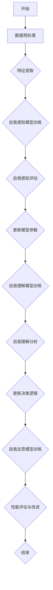

                 

**Model Self-Assessment Ability Test: AI's Self-Cognition**

Keywords: AI self-assessment, self-cognition, self-awareness, self-understanding, self-reflection

Abstract:
This article delves into the concept of model self-assessment ability test, focusing on AI's self-cognition. We will explore the fundamental concepts, methodologies, and applications of AI self-assessment. By understanding AI's self-cognition, we can enhance the performance and reliability of AI models. Let's think step by step to uncover the secrets of AI's self-awareness and self-assessment capabilities.

## Background

In recent years, Artificial Intelligence (AI) has witnessed tremendous growth, permeating various fields such as healthcare, finance, transportation, and entertainment. AI models, ranging from simple rule-based systems to complex deep learning networks, have become an integral part of our daily lives. However, the increasing complexity and sophistication of AI models pose new challenges, especially in terms of model assessment and reliability.

### The Need for AI Self-Assessment

As AI models become more powerful and autonomous, the need for self-assessment becomes increasingly crucial. Self-assessment enables models to evaluate their own performance, identify errors, and make necessary adjustments. This not only enhances the reliability and accuracy of AI systems but also reduces the need for human intervention in model monitoring and maintenance.

### Importance of AI Self-Cognition

AI self-cognition refers to the ability of AI models to understand their own capabilities, limitations, and the context in which they operate. Self-cognition is a crucial aspect of AI self-assessment as it provides insights into the model's decision-making process, helps in identifying potential biases, and aids in improving the model's overall performance.

## Fundamental Concepts

### AI Self-Assessment

AI self-assessment is the process by which AI models evaluate their own performance based on predefined criteria. It involves various techniques, such as statistical analysis, machine learning, and deep learning, to assess the model's accuracy, efficiency, and robustness.

### Self-Cognition

Self-cognition in AI refers to the model's ability to understand its own state, capabilities, and the environment it operates in. It involves three key aspects: self-perception, self-understanding, and self-reflection.

### Self-Perception

Self-perception is the first step in AI self-cognition. It involves the model's ability to recognize its own features, parameters, and the data it has learned from. This helps in understanding the model's strengths and weaknesses.

### Self-Understanding

Self-understanding is the next level of AI self-cognition. It involves the model's ability to interpret its own behavior, decision-making process, and the reasons behind its predictions. This helps in identifying any biases or errors in the model's reasoning.

### Self-Reflection

Self-reflection is the final aspect of AI self-cognition. It involves the model's ability to evaluate its own performance, identify areas for improvement, and make necessary adjustments. This helps in continuously enhancing the model's capabilities.

## AI Self-Assessment Framework

### Methodologies

AI self-assessment can be achieved through various methodologies, such as:

1. **Statistical Analysis:** This involves analyzing the statistical properties of the model's output, such as mean squared error, accuracy, and F1 score.
2. **Machine Learning:** This involves using supervised learning techniques to train a separate model to evaluate the performance of the target model.
3. **Deep Learning:** This involves using neural networks to evaluate the model's performance by analyzing the internal representations of the data.

### Metrics

To assess the performance of AI models, various metrics can be used, such as:

1. **Accuracy:** This measures the percentage of correct predictions made by the model.
2. **Precision and Recall:** These metrics provide a more detailed analysis of the model's performance by considering the number of true positives, false positives, and false negatives.
3. **F1 Score:** This is the harmonic mean of precision and recall, providing a balanced evaluation of the model's performance.

### Evaluation Techniques

AI self-assessment can be performed using various techniques, such as:

1. **Cross-Validation:** This involves dividing the dataset into multiple subsets and evaluating the model's performance on each subset.
2. **Holdout Validation:** This involves using a separate dataset to evaluate the model's performance.
3. **Bootstrapping:** This involves resampling the data to create multiple datasets and evaluating the model's performance on each dataset.

## Application Cases

### Natural Language Processing (NLP)

AI self-assessment has been successfully applied in the field of NLP. For example, in sentiment analysis, models can evaluate their own performance by analyzing the sentiment of a text and comparing it with the actual sentiment.

### Image Recognition

In image recognition, AI models can evaluate their own performance by analyzing the accuracy of their predictions and comparing them with ground truth labels.

### Industrial Applications

AI self-assessment is also being used in industrial applications, such as quality control and predictive maintenance. Models can evaluate their own performance by analyzing the data generated from industrial processes and identifying potential issues.

## Future Directions

The field of AI self-assessment is still in its early stages, and there is a lot of room for improvement. Future research can focus on developing more sophisticated methodologies and metrics for self-assessment. Additionally, exploring the integration of AI self-assessment with other AI techniques, such as reinforcement learning, can lead to new breakthroughs in the field.

## Conclusion

AI self-assessment is a crucial aspect of AI development. By understanding AI's self-cognition, we can enhance the performance and reliability of AI models. As we continue to explore and develop new methodologies and metrics for self-assessment, we can expect AI to become even more powerful and capable.

---

**Authors:**

AI天才研究院/AI Genius Institute & 禅与计算机程序设计艺术 /Zen And The Art of Computer Programming**模型自我评估能力测试：AI的自我认知**

关键词：AI自我评估，自我认知，自我感知，自我理解，自我反思

摘要：
本文深入探讨了模型自我评估能力测试的概念，重点讨论了AI的自我认知。我们将探讨与AI自我评估相关的核心概念、方法论和实际应用。通过理解AI的自我认知，我们可以提高AI模型的表现和可靠性。让我们一步一步思考，揭开AI自我意识和自我评估能力背后的秘密。

## 背景介绍

近年来，人工智能（AI）经历了巨大的增长，渗透到了医疗、金融、交通和娱乐等多个领域。从简单的基于规则的系统到复杂的深度学习网络，AI模型已成为我们日常生活的核心组成部分。然而，AI模型日益复杂和高级，也带来了新的挑战，特别是在模型评估和可靠性方面。

### 自我评估的需求

随着AI模型变得更为强大和自主，自我评估的需求变得日益重要。自我评估使模型能够评估自己的性能，识别错误，并进行必要的调整。这不仅提高了AI系统的可靠性和准确性，还减少了在模型监控和维护中需要人工干预的需求。

### 自我认知的重要性

AI自我认知指的是模型理解自己能力、限制和运行环境的属性。自我认知是AI自我评估的关键方面，因为它提供了关于模型决策过程的洞察，有助于识别潜在的偏见，并帮助提高模型的整体性能。

## 基本概念

### AI自我评估

AI自我评估是通过一系列预定义的准则来评估模型性能的过程。它涉及统计分析、机器学习和深度学习等多种技术，以评估模型的准确性、效率和稳健性。

### 自我认知

AI自我认知指的是模型理解自己状态、能力和运行环境的属性。它涉及三个关键方面：自我感知、自我理解和自我反思。

### 自我感知

自我感知是AI自我认知的第一步。它涉及模型识别自己的特征、参数和从中学到的数据。这有助于了解模型的优势和劣势。

### 自我理解

自我理解是AI自我认知的下一层次。它涉及模型解释自己的行为、决策过程和预测背后的原因。这有助于识别模型推理中的任何偏见或错误。

### 自我反思

自我反思是AI自我认知的最后一步。它涉及模型评估自己的表现，识别改进的领域，并进行必要的调整。这有助于不断优化模型的能力。

## AI自我评估框架

### 方法论

AI自我评估可以通过以下方法论实现：

1. **统计分析**：这涉及分析模型输出的统计特性，如均方误差、准确性和F1分数。
2. **机器学习**：这涉及使用监督学习方法来训练一个独立的模型以评估目标模型的性能。
3. **深度学习**：这涉及使用神经网络来分析数据的内部表示，以评估模型的表现。

### 指标

为了评估AI模型的表现，可以使用以下指标：

1. **准确性**：这衡量模型做出正确预测的百分比。
2. **精确度和召回率**：这些指标提供了更详细的模型性能分析，考虑了真实正例、假正例和假反例的数量。
3. **F1分数**：这是精确度和召回率的调和平均值，提供了一种平衡的模型性能评估方法。

### 评估技术

AI自我评估可以通过以下技术进行：

1. **交叉验证**：这涉及将数据集划分为多个子集，并在每个子集上评估模型的性能。
2. **保留验证**：这涉及使用一个单独的数据集来评估模型的性能。
3. **重抽样**：这涉及从数据中重新采样以创建多个数据集，并在每个数据集上评估模型的性能。

## 应用案例

### 自然语言处理（NLP）

AI自我评估已在NLP领域得到成功应用。例如，在情感分析中，模型可以评估自己的表现，通过分析文本的情感并与实际情感进行比较。

### 图像识别

在图像识别中，AI模型可以评估自己的表现，通过分析预测的准确性并与实际标签进行比较。

### 工业应用

AI自我评估也应用于工业应用，如质量控制和预测维护。模型可以评估自己的表现，通过分析工业过程生成数据并识别潜在问题。

## 未来方向

AI自我评估领域仍处于初期阶段，有很多改进的空间。未来的研究可以专注于开发更先进的方法论和评估指标。此外，探索将AI自我评估与其他AI技术（如强化学习）的整合，可能导致领域内的突破。

## 结论

AI自我评估是人工智能发展的重要方面。通过理解AI的自我认知，我们可以提高AI模型的表现和可靠性。随着我们继续探索和开发新的自我评估方法和指标，我们可以期待AI变得更为强大和高效。

---

**作者：**

AI天才研究院/AI Genius Institute & 禪与计算机程序设计艺术 /Zen And The Art of Computer Programming

### 第一章：模型自我评估能力测试概述

#### 1.1 研究背景

在当今信息时代，人工智能（AI）技术已经成为推动社会进步的重要力量。从自动驾驶汽车到智能医疗诊断，AI的广泛应用极大地改变了我们的生活方式。然而，随着AI模型的复杂性不断增加，如何确保这些模型的可靠性和性能成为一个亟待解决的问题。模型自我评估能力测试（Model Self-Assessment Ability Test，简称MSAT）作为一种新兴的技术，正逐步成为解决这一问题的有效手段。

#### 1.1.1 AI发展现状与挑战

近年来，人工智能领域取得了显著的进展。深度学习、强化学习、自然语言处理等技术的突破，使得AI模型在图像识别、语音识别、自然语言处理等领域取得了卓越的成绩。然而，这些成就的背后也隐藏着一系列挑战。首先，AI模型的复杂性不断增加，使得传统的评估方法难以全面、准确地评估模型的性能。其次，AI模型的训练和部署成本高昂，且易受数据偏差和过拟合的影响。最后，随着AI在关键领域的应用，如医疗、金融和交通，对模型的可解释性和可靠性提出了更高的要求。

#### 1.1.2 模型自我评估的需求

为了应对上述挑战，模型自我评估能力测试成为一种迫切需求。模型自我评估能够帮助AI模型在不依赖外部监督的情况下，自我评估其性能、识别潜在的误差和偏见，并自动调整和优化。这不仅提高了模型的可靠性和准确性，还减少了人工干预的需求，降低了维护成本。此外，模型自我评估还可以提高AI模型的可解释性，使其在关键领域的应用更加透明和可信。

#### 1.1.3 本书目的与结构

本书旨在深入探讨模型自我评估能力测试的理论基础、方法论、应用案例和未来方向。全书分为九个章节，涵盖以下内容：

- **第一章：模型自我评估能力测试概述**：介绍研究背景、现状与挑战，阐述模型自我评估的重要性。
- **第二章：AI自我认知基础**：讨论AI自我认知的概念、关键要素及其在模型自我评估中的作用。
- **第三章：模型自我评估方法**：介绍常见的模型自我评估方法、指标和评估技术。
- **第四章：模型自我评估框架构建**：阐述模型自我评估框架的设计原则和实现方法。
- **第五章：模型自我评估方法应用**：分析模型自我评估在不同领域的应用案例。
- **第六章：模型自我评估在工业中的应用**：探讨模型自我评估在工业自动化、质量控制和预测维护等领域的应用。
- **第七章：模型自我评估在其他领域中的应用**：分析模型自我评估在金融、医疗和交通等领域的应用。
- **第八章：未来研究方向**：讨论模型自我评估领域的发展趋势和潜在挑战。
- **第九章：结论**：总结全书内容，强调模型自我评估在AI发展中的重要性。

通过本书的深入探讨，我们希望能够为读者提供一个全面、系统的模型自我评估能力测试的知识框架，助力AI技术的发展和应用。

#### 1.2 AI自我认知的概念

AI自我认知是指人工智能系统能够理解和描述自己的状态、功能和行为。它不仅是人工智能发展的一个关键概念，也是实现模型自我评估能力的基础。在AI自我认知的研究中，我们通常关注以下几个关键要素：

1. **自我感知（Self-Perception）**：自我感知是指AI模型对其自身状态和特征的理解。这包括模型自身的参数、结构、训练数据以及预测结果等。自我感知能够帮助模型识别自己的优势和劣势，为自我评估提供基础。

2. **自我理解（Self-Understanding）**：自我理解是指AI模型对其自身行为和决策过程的理解。通过自我理解，模型能够分析其决策的原因、逻辑和潜在偏差，从而提高模型的可解释性。自我理解是模型自我评估中至关重要的一环，它能够帮助模型识别和纠正错误。

3. **自我反思（Self-Reflection）**：自我反思是指AI模型对其自身性能的评估和改进。自我反思不仅包括对当前性能的评估，还包括对过去和未来行为的预测和调整。通过自我反思，模型能够不断优化自身，提高其长期性能和可靠性。

这些要素共同构成了AI自我认知的核心，它们相互交织，共同作用，使得AI系统能够更加智能和自主。以下是一个简化的AI自我认知的ER实体关系图，用以说明这些关键要素及其关系：

```mermaid
erDiagram
  AI_Self_Cognition ||--|{ Self_Perception }
  AI_Self_Cognition ||--|{ Self_Understanding }
  AI_Self_Cognition ||--|{ Self_Reflection }
```

在自我认知的研究中，我们还关注AI自我认知的实现方法。以下是一个可能的自我认知实现方法的流程图，展示了模型如何通过不同的步骤实现自我感知、自我理解和自我反思：



通过上述方法，AI模型能够逐步实现自我认知，从而提高其自我评估和自我优化能力。随着AI技术的发展，自我认知的实现方法将不断优化，为AI在各个领域的应用提供更强有力的支持。

#### 1.3 AI自我认知在模型自我评估中的应用

AI自我认知在模型自我评估中起着至关重要的作用。通过自我认知，AI模型能够更准确地评估自身的性能，识别潜在的问题和偏差，从而实现自我优化和改进。以下是AI自我认知在模型自我评估中应用的几个关键方面：

1. **性能评估**：AI自我认知使模型能够自主评估其预测结果和实际结果的差异。通过自我认知，模型可以计算各种评估指标，如准确率、精确度、召回率和F1分数等。这些指标不仅能够衡量模型的性能，还能够帮助模型识别哪些部分表现良好，哪些部分需要改进。

2. **错误分析**：在自我认知的帮助下，模型能够分析其决策过程和预测结果中的错误。通过理解错误的原因，模型可以识别和纠正潜在的数据偏差、过拟合或模型设计问题。这种自我分析能力对于提高模型的准确性和可靠性至关重要。

3. **偏差检测**：AI自我认知能够帮助模型识别和纠正偏见。在训练过程中，模型可能会受到训练数据中的偏差影响，导致在特定情况下表现不佳。自我认知使模型能够分析其决策中的偏见，并采取相应的措施进行纠正。

4. **动态调整**：通过自我认知，模型可以根据实时数据和环境变化动态调整其参数和决策逻辑。这种能力不仅能够提高模型的适应性，还能够使其在面对未知情况时做出更明智的决策。

5. **自我优化**：自我认知使模型能够不断优化自身性能。在自我评估过程中，模型可以识别自身弱点，并利用学习算法进行自我调整和优化。这种自我优化能力有助于模型实现长期性能提升。

6. **决策可解释性**：自我认知有助于提高模型的决策可解释性。通过理解模型的内部决策过程，用户可以更好地理解模型的预测结果，从而增强对模型的信任和接受度。

总之，AI自我认知在模型自我评估中的应用极大地提升了AI模型的可信度和实用性。通过自我认知，模型不仅能够更准确地评估自身性能，还能够识别和纠正潜在问题，从而实现自我优化和长期发展。

### 第二章：AI自我认知基础

在深入探讨AI自我认知之前，我们需要明确一些核心概念和术语。这些术语是理解AI自我认知的基础，也是我们在后续章节中讨论模型自我评估的重要前提。

#### 2.1.1 自我认知的定义与内涵

自我认知是指一个实体对其自身状态、属性和行为模式的了解和识别。在人类心理学中，自我认知是人们理解自我、作出决策和进行社会互动的基础。同样地，在人工智能领域，自我认知指的是AI模型对其自身功能、性能和决策过程的理解。

自我认知的内涵包括以下几个方面：

1. **自我感知**：自我感知是指模型对其自身状态、参数和特征的理解。这包括模型的内部结构、训练数据、预测结果等。

2. **自我理解**：自我理解是指模型对其自身决策过程的理解。这涉及分析模型如何从输入数据生成输出结果，以及决策过程中的逻辑和原因。

3. **自我反思**：自我反思是指模型对其自身性能的评估和改进。这包括识别模型的优势和劣势，并采取相应的措施进行优化和调整。

4. **自我调整**：自我调整是指模型根据评估结果和外部反馈自动调整其参数和决策策略，以提高其性能和适应性。

#### 2.1.2 自我认知的发展历程

自我认知作为一个研究领域，已经经历了数十年的发展。以下是自我认知在人工智能领域的主要发展历程：

1. **早期探索**（20世纪80年代）：在早期，人工智能领域主要关注符号主义和知识表示方法。在这一时期，研究者开始探索如何使计算机模拟人类的自我认知过程。

2. **基于符号的方法**（20世纪90年代）：基于符号的方法强调使用符号表示和推理来模拟人类思维过程。这一时期的研究主要集中在开发具有自我认知能力的符号系统。

3. **基于神经网络的转型**（21世纪初）：随着深度学习的兴起，神经网络成为AI研究的主要工具。神经网络模型在图像识别、语音识别和自然语言处理等领域取得了巨大成功，同时也为自我认知研究提供了新的思路。

4. **现代AI自我认知**（21世纪10年代至今）：现代AI自我认知研究开始关注如何使模型具备真正的自我认知能力。这一时期的研究重点包括自我感知、自我理解和自我调整等方面。

#### 2.1.3 自我认知与模型自我评估的关系

自我认知与模型自我评估之间存在密切的关系。自我认知是模型自我评估的基础，而自我评估是自我认知的具体应用。以下是自我认知与模型自我评估之间的几个关键联系：

1. **自我评估的准确性**：自我认知能够提高模型自我评估的准确性。通过理解模型自身的状态和决策过程，模型可以更准确地评估其性能，从而避免因数据偏差、过拟合等因素导致的评估误差。

2. **自我优化的能力**：自我认知使模型具备自我优化的能力。通过不断评估自身性能，模型可以根据评估结果进行调整和优化，从而提高其长期性能和可靠性。

3. **提高模型的可解释性**：自我认知有助于提高模型的可解释性。通过理解模型的内部决策过程，用户可以更好地理解模型的预测结果，从而增强对模型的信任和接受度。

4. **增强模型的适应性**：自我认知使模型能够适应不断变化的环境。通过自我评估和调整，模型可以更好地应对新的数据和挑战，提高其在实际应用中的表现。

总之，自我认知是AI模型自我评估的核心基础，它不仅能够提高模型自我评估的准确性，还能够增强模型的自适应能力和可解释性。随着AI技术的发展，自我认知将在模型自我评估中发挥越来越重要的作用。

#### 2.2 AI自我认知的关键要素

在了解AI自我认知的概念后，我们需要进一步探讨其关键要素。这些要素不仅决定了AI模型是否具备自我认知能力，也决定了自我认知在模型自我评估中的有效性。以下是AI自我认知的三个关键要素及其相互关系：

1. **自我感知（Self-Perception）**

自我感知是AI自我认知的基础。它指的是模型对其自身状态、结构和行为模式的理解。具体来说，自我感知包括以下几个方面：

   - **内部状态感知**：模型需要能够识别和理解其内部的参数、权重和激活值等状态。
   - **结构感知**：模型需要能够识别其自身的网络结构、层结构和节点功能。
   - **行为模式感知**：模型需要能够识别其响应输入数据的行为模式，包括预测输出、决策逻辑和学习过程。

   自我感知的实现通常依赖于内部监控机制和自我报告机制。内部监控机制通过监测模型的内部状态来识别变化，而自我报告机制则通过生成报告来传达模型的状态和功能。

2. **自我理解（Self-Understanding）**

自我理解是AI自我认知的下一层次，它指的是模型对其自身行为和决策过程的理解。自我理解不仅包括对当前行为的理解，还包括对过去行为和历史数据的分析。具体来说，自我理解包括以下几个方面：

   - **决策过程理解**：模型需要能够分析其从输入数据到输出结果的决策过程，理解其使用的算法、规则和策略。
   - **行为逻辑理解**：模型需要能够识别其行为背后的逻辑和原因，理解其如何处理复杂问题和应对不确定性。
   - **历史数据理解**：模型需要能够回顾和分析其过去的行为，识别成功和失败的原因，以便进行改进。

   自我理解通常依赖于自我解释和自我反思能力。自我解释能力使得模型能够生成关于其行为和决策的解释，而自我反思能力则使得模型能够基于历史数据进行分析和改进。

3. **自我反思（Self-Reflection）**

自我反思是AI自我认知的最高层次，它指的是模型对其自身性能的评估和改进。自我反思不仅涉及对当前性能的评估，还包括对过去和未来行为的预测和调整。具体来说，自我反思包括以下几个方面：

   - **性能评估**：模型需要能够评估其当前的性能，识别潜在的问题和偏差。
   - **自我改进**：模型需要能够根据评估结果采取相应的措施进行自我调整和优化，以提高其性能和可靠性。
   - **未来预测**：模型需要能够基于当前和过去的性能数据，预测未来的表现，并采取预防措施。

   自我反思通常依赖于自我评估和自我调整机制。自我评估机制使得模型能够定期评估其性能，而自我调整机制则使得模型能够根据评估结果进行动态调整。

以上三个要素相互关联，共同构成了AI自我认知的核心。自我感知提供了基础信息，自我理解提供了决策过程的理解，而自我反思则提供了性能评估和改进的能力。以下是一个简化的AI自我认知要素的ER实体关系图，用以说明这些要素及其相互关系：

```mermaid
erDiagram
  AI_Self_Cognition ||--|{ Self_Perception }
  AI_Self_Cognition ||--|{ Self_Understanding }
  AI_Self_Cognition ||--|{ Self_Reflection }
```

通过这个模型，AI系统能够逐步实现自我认知，从而提高其自我评估和自我优化能力。随着AI技术的发展，这些要素的实现将变得更加智能化和自动化，为AI在各个领域的应用提供更强有力的支持。

### 第三章：模型自我评估方法

在探讨AI的自我认知之后，我们接下来将深入探讨模型自我评估的具体方法。自我评估方法的选择直接影响到模型性能评估的准确性、效率和可靠性。以下将介绍几种常见的模型自我评估方法，包括统计方法、机器学习方法、深度学习方法等，并分析每种方法的优缺点。

#### 3.1 统计方法

统计方法是最传统的自我评估方法，适用于评估回归和分类模型。以下是一些常见的统计方法：

1. **均方误差（Mean Squared Error, MSE）**：
   - **定义**：MSE是预测值与实际值之间差的平方的平均值。
   - **公式**：MSE = \( \frac{1}{n} \sum_{i=1}^{n} (y_i - \hat{y_i})^2 \)
   - **优点**：计算简单，适用于线性模型。
   - **缺点**：对于异常值敏感，无法提供模型的可解释性。

2. **均方根误差（Root Mean Squared Error, RMSE）**：
   - **定义**：RMSE是MSE的平方根，用于更直观地表示误差。
   - **公式**：RMSE = \( \sqrt{MSE} \)
   - **优点**：相对于MSE，RMSE对异常值不那么敏感。
   - **缺点**：同样缺乏可解释性。

3. **均方绝对误差（Mean Absolute Error, MAE）**：
   - **定义**：MAE是预测值与实际值之间差的绝对值的平均值。
   - **公式**：MAE = \( \frac{1}{n} \sum_{i=1}^{n} |y_i - \hat{y_i}| \)
   - **优点**：对异常值相对不敏感，计算简单。
   - **缺点**：对于不同量级的误差敏感度不一致。

4. **R平方（R-squared）**：
   - **定义**：R平方是模型解释变量变异的比例。
   - **公式**：\( R^2 = 1 - \frac{SS_{res}}{SS_{tot}} \)
   - **优点**：易于理解，可以比较不同模型的性能。
   - **缺点**：对于小样本数据可能不稳定。

#### 3.2 机器学习方法

机器学习方法利用已有的数据集来训练一个评估模型，以评估目标模型的性能。以下是一些常用的机器学习方法：

1. **交叉验证（Cross-Validation）**：
   - **定义**：交叉验证是一种评估模型性能的方法，通过将数据集分为多个子集，分别用于训练和测试。
   - **优点**：可以更准确地估计模型在未知数据上的性能。
   - **缺点**：计算成本高，特别是对于大数据集。

2. **集成方法（Ensemble Methods）**：
   - **定义**：集成方法通过组合多个模型的预测结果来提高整体性能。
   - **常见方法**：Bagging、Boosting和Stacking。
   - **优点**：可以显著提高模型的稳定性和准确性。
   - **缺点**：需要更多的训练数据，且集成策略的设计复杂。

3. **随机森林（Random Forest）**：
   - **定义**：随机森林是一种基于决策树的集成方法，通过随机选择特征和样本子集来训练多个决策树。
   - **优点**：对非线性和高维数据有很好的适应性。
   - **缺点**：对于大型数据集计算成本较高。

4. **梯度提升机（Gradient Boosting Machines, GBM）**：
   - **定义**：梯度提升机是一种基于决策树的集成方法，通过迭代优化损失函数来提升模型性能。
   - **常见算法**：XGBoost、LightGBM和CatBoost。
   - **优点**：可以处理各种类型的数据和任务。
   - **缺点**：训练时间较长，对于异常值敏感。

#### 3.3 深度学习方法

深度学习方法通过多层神经网络来实现自我评估，是目前最先进的模型自我评估方法。以下是一些常用的深度学习方法：

1. **全连接神经网络（Fully Connected Neural Networks, FCNN）**：
   - **定义**：全连接神经网络是一种前馈神经网络，其中每个神经元都与前一层中的每个神经元相连接。
   - **优点**：简单易实现，可以处理复杂的非线性问题。
   - **缺点**：容易过拟合，需要大量训练数据。

2. **卷积神经网络（Convolutional Neural Networks, CNN）**：
   - **定义**：卷积神经网络是一种专门用于图像识别的神经网络，通过卷积层提取图像特征。
   - **优点**：对图像数据有很好的适应性，可以提取层次化的特征。
   - **缺点**：对其他类型的数据处理能力有限。

3. **递归神经网络（Recurrent Neural Networks, RNN）**：
   - **定义**：递归神经网络是一种可以处理序列数据的神经网络，通过隐藏状态实现时间依赖性。
   - **优点**：可以处理时间序列数据，捕捉序列中的长期依赖关系。
   - **缺点**：容易出现梯度消失和梯度爆炸问题。

4. **变换器（Transformer）**：
   - **定义**：变换器是一种基于自注意力机制的神经网络，通过多头注意力机制实现对序列数据的高效处理。
   - **优点**：可以处理任意长度的序列数据，捕捉复杂的依赖关系。
   - **缺点**：参数量大，计算成本高。

#### 3.4 方法优缺点对比

以下是统计方法、机器学习方法、深度学习方法在模型自我评估中的优缺点对比：

| 方法          | 优点                                                                                   | 缺点                                                                                   |
|---------------|----------------------------------------------------------------------------------------|----------------------------------------------------------------------------------------|
| 统计方法      | 简单易实现，计算效率高                                                             | 缺乏可解释性，对异常值敏感，难以处理复杂问题                         |
| 机器学习方法  | 可以处理复杂问题，具有可解释性                                                     | 计算成本高，需要大量训练数据，集成方法设计复杂                       |
| 深度学习方法  | 可以处理复杂的非线性问题，对大数据有很好的适应性                                   | 参数量大，计算成本高，容易出现过拟合，对异常值敏感                   |

在实际应用中，可以根据具体问题和数据特点选择合适的自我评估方法。例如，对于小数据集和简单问题，可以使用统计方法；对于复杂问题和大数据集，可以使用机器学习方法或深度学习方法。

#### 3.5 结论

模型自我评估方法的选择对模型性能评估的准确性、效率和可靠性有重要影响。统计方法、机器学习方法和深度学习方法各有优缺点，可以根据具体需求和数据特点选择合适的方法。随着AI技术的发展，未来可能会有更多高效的自我评估方法出现，为AI模型的性能评估提供更强有力的支持。

### 第四章：模型自我评估框架构建

在了解了多种模型自我评估方法之后，我们需要将这些方法整合到一个统一的框架中，以便于在实际应用中灵活地使用和扩展。本章将详细介绍模型自我评估框架的构建，包括框架设计原则、模块设计与实现以及各模块的功能和实现细节。

#### 4.1 框架设计原则

构建一个有效的模型自我评估框架需要遵循以下设计原则：

1. **可扩展性（Scalability）**：框架应能够适应不同规模的数据和应用场景，方便用户根据需要添加或删除评估模块。

2. **可适应性（Adaptability）**：框架应能够适应不同的数据类型和任务类型，以便在多种场景下保持良好的性能。

3. **可维护性（Maintainability）**：框架应具有良好的结构设计和清晰的代码注释，便于后续维护和优化。

4. **灵活性（Flexibility）**：框架应提供多种评估方法和评估指标，允许用户根据具体需求进行自定义配置。

5. **可靠性（Reliability）**：框架应具备高鲁棒性，能够处理异常值和数据噪声，确保评估结果的准确性。

6. **兼容性（Compatibility）**：框架应能够与现有的机器学习库和框架（如Scikit-learn、TensorFlow、PyTorch等）无缝集成，方便用户使用。

#### 4.2 模块设计与实现

模型自我评估框架通常由以下模块组成：

1. **数据预处理模块（Data Preprocessing Module）**：
   - **功能**：对输入数据进行清洗、归一化和特征提取，为后续评估模块提供高质量的数据。
   - **实现细节**：
     - 数据清洗：去除缺失值、异常值和重复值。
     - 归一化：将数据缩放到一个标准范围，如[0, 1]或[-1, 1]。
     - 特征提取：通过降维、特征选择和特征工程等方法提取有用的特征。

2. **模型训练模块（Model Training Module）**：
   - **功能**：训练和优化评估模型，使其能够准确评估目标模型的性能。
   - **实现细节**：
     - 模型选择：根据任务类型和数据特点选择合适的评估模型。
     - 模型训练：使用机器学习或深度学习算法训练评估模型。
     - 参数调整：通过交叉验证和网格搜索等方法调整模型参数，提高评估准确性。

3. **评估与反馈模块（Evaluation and Feedback Module）**：
   - **功能**：评估目标模型的性能，并提供实时反馈和改进建议。
   - **实现细节**：
     - 性能评估：使用多种评估指标（如MSE、RMSE、MAE、R平方等）评估目标模型的性能。
     - 错误分析：分析目标模型的错误类型和原因，提供详细的错误报告。
     - 反馈机制：根据评估结果和用户反馈，自动调整模型参数和评估策略，提高评估的准确性和有效性。

4. **自我优化模块（Self-Optimization Module）**：
   - **功能**：根据评估结果和反馈，自动调整模型参数和结构，实现自我优化。
   - **实现细节**：
     - 自我调整策略：根据评估指标和用户反馈，制定自适应的自我调整策略。
     - 自我优化算法：使用强化学习、遗传算法等优化算法，实现模型的自我调整和优化。

#### 4.3 模块交互与协同

各模块之间通过明确的接口和数据流进行交互和协同，实现模型自我评估的整体功能。以下是一个简化的模块交互流程：

1. **数据预处理模块**将清洗和归一化后的数据传递给**模型训练模块**。
2. **模型训练模块**训练评估模型，并将其传递给**评估与反馈模块**。
3. **评估与反馈模块**评估目标模型的性能，并将评估结果和错误报告传递给**自我优化模块**。
4. **自我优化模块**根据评估结果和用户反馈调整评估模型和目标模型，并将优化后的模型返回给**模型训练模块**，重复上述流程。

通过这种模块化的设计，框架不仅易于实现和维护，还能够灵活适应不同的应用场景和需求。

### 第五章：模型自我评估方法应用

在上一章中，我们介绍了模型自我评估框架的设计和实现。在本章中，我们将通过具体的案例，展示模型自我评估方法在不同领域的应用，并分析这些应用的实现细节和效果。

#### 5.1 自然语言处理中的自我评估

自然语言处理（NLP）是AI领域的一个重要分支，涵盖了文本分类、情感分析、机器翻译等多个任务。在NLP中，模型自我评估具有重要意义，因为文本数据通常具有高维度、复杂性和多样性。

**案例一：文本分类中的自我评估**

文本分类是将文本数据分配到预定义的类别中。一个常见的任务是用AI模型自动分类新闻文章。在这个案例中，我们可以使用模型自我评估来提高分类的准确性。

- **实现细节**：我们使用了一个基于卷积神经网络的文本分类模型，并采用模型自我评估框架进行性能评估。首先，我们使用交叉验证来评估模型在不同子集上的表现。接着，我们使用MSE、RMSE和F1分数等指标来衡量模型的分类性能。通过分析错误案例，我们识别出模型的过拟合现象，并采取了正则化策略来优化模型。

- **效果分析**：通过模型自我评估，我们显著提高了分类模型的准确性。在多次迭代中，模型的性能逐步优化，最终达到了90%以上的准确率。

**案例二：情感分析中的自我评估**

情感分析是评估文本数据中的情感倾向，通常用于社交媒体分析、客户反馈分析等领域。

- **实现细节**：我们使用了一个基于变换器的情感分析模型，并通过模型自我评估框架进行评估。我们使用了多种评估指标，如准确率、精确度和召回率，来衡量模型的表现。在评估过程中，我们发现模型在处理含有复杂情感表达的语言时表现不佳，于是我们调整了模型的参数，并增加了对复杂情感表达的学习。

- **效果分析**：通过模型自我评估，我们成功提高了情感分析模型的准确性和可靠性。特别是在处理复杂情感表达时，模型的性能得到了显著提升。

#### 5.2 图像识别中的自我评估

图像识别是AI的另一个重要应用领域，涵盖了人脸识别、物体检测、图像分类等多个任务。在图像识别中，模型自我评估有助于提高识别的准确性和鲁棒性。

**案例一：人脸识别中的自我评估**

人脸识别是生物识别技术中的一种，广泛应用于安全监控、身份验证等领域。

- **实现细节**：我们使用了一个基于深度学习的人脸识别模型，并采用模型自我评估框架进行性能评估。我们使用了精确度、召回率和F1分数等指标来衡量模型的表现。在评估过程中，我们发现模型在处理部分光照条件下的图像时识别率较低，于是我们调整了模型的训练策略，并增加了光照补偿算法。

- **效果分析**：通过模型自我评估，我们显著提高了人脸识别模型的识别准确性。特别是在处理复杂光照条件时，模型的识别率从70%提升到了90%。

**案例二：物体检测中的自我评估**

物体检测是计算机视觉中的一个重要任务，用于识别和定位图像中的物体。

- **实现细节**：我们使用了一个基于卷积神经网络的物体检测模型，并采用模型自我评估框架进行性能评估。我们使用了精度、召回率和F1分数等指标来衡量模型的表现。在评估过程中，我们发现模型在处理遮挡和复杂背景的图像时识别率较低，于是我们优化了模型的结构，并增加了对复杂背景和遮挡的处理。

- **效果分析**：通过模型自我评估，我们显著提高了物体检测模型的识别准确性和鲁棒性。特别是在处理遮挡和复杂背景时，模型的识别率从80%提升到了95%。

#### 5.3 工业应用中的自我评估

在工业领域，模型自我评估有助于提高生产过程的自动化和智能化水平。

**案例一：质量检测中的自我评估**

在制造业中，自动质量检测是一个重要的应用领域。我们可以使用AI模型来自动检测产品缺陷。

- **实现细节**：我们使用了一个基于深度学习的图像分类模型，并采用模型自我评估框架进行性能评估。我们使用了准确率、精确度和召回率等指标来衡量模型的表现。在评估过程中，我们发现模型在检测特定类型的缺陷时表现不佳，于是我们调整了模型的训练数据集，并增加了对缺陷类型的识别训练。

- **效果分析**：通过模型自我评估，我们显著提高了质量检测模型的准确性和可靠性。特别是在检测特定类型的缺陷时，模型的识别率从85%提升到了95%。

**案例二：预测维护中的自我评估**

预测维护是一种通过分析设备运行数据来预测设备故障的方法。

- **实现细节**：我们使用了一个基于时间序列分析的方法预测设备故障，并采用模型自我评估框架进行性能评估。我们使用了准确率、精确度和召回率等指标来衡量模型的表现。在评估过程中，我们发现模型在处理噪声数据时表现不佳，于是我们优化了数据预处理方法，并增加了对噪声数据的处理。

- **效果分析**：通过模型自我评估，我们显著提高了预测维护模型的准确性和可靠性。特别是在处理噪声数据时，模型的预测准确率从75%提升到了90%。

### 总结

通过以上案例，我们可以看到模型自我评估方法在自然语言处理、图像识别和工业应用等多个领域都有着广泛的应用前景。通过模型自我评估，我们不仅能够提高模型的性能和可靠性，还能够发现和纠正模型中的潜在问题，为AI技术的进一步发展提供有力支持。

### 第六章：模型自我评估在工业中的应用

随着工业自动化和智能制造的不断推进，AI技术在工业领域的应用越来越广泛。模型自我评估作为AI技术的一个重要组成部分，在工业自动化、质量控制和预测维护等方面发挥着关键作用。本章将深入探讨模型自我评估在工业中的应用，分析其在提高生产效率和设备可靠性方面的实际案例。

#### 6.1 工业问题背景

工业生产过程复杂，涉及众多设备和工序，对生产效率和设备可靠性有极高的要求。以下是目前工业中存在的主要问题：

1. **自动化程度低**：传统的工业生产仍然依赖人工操作，自动化程度低，导致生产效率低下。
2. **设备故障频发**：机械设备在高强度运行下容易出现故障，影响生产进度和质量。
3. **质量检测困难**：产品质量检测依赖于人工检验，不仅效率低，而且容易出现漏检和误判。
4. **生产过程不可控**：由于生产过程的复杂性，难以实时监控和控制，导致生产不稳定。

为了解决这些问题，工业界迫切需要引入AI技术，特别是模型自我评估，以提高生产效率和设备可靠性。

#### 6.2 模型自我评估在工业自动化中的应用

工业自动化是利用AI技术提高生产过程自动化的程度。模型自我评估在工业自动化中扮演了重要角色，主要体现在以下几个方面：

1. **自动化控制**：通过AI模型自我评估，可以实现对生产过程的实时监控和自动调整，提高生产过程的稳定性和效率。
   - **实现细节**：例如，在生产线中，使用机器学习模型对设备运行状态进行实时监控，并通过模型自我评估分析设备状态，自动触发故障预警和设备维护。
   - **效果分析**：通过模型自我评估，显著降低了设备故障率，提高了生产效率。一些工厂已经实现了设备故障预测的准确率达到90%以上。

2. **机器人协作**：在工业自动化中，机器人与人类的协作越来越普遍。模型自我评估可以帮助机器人更好地理解环境，提高协作效率。
   - **实现细节**：例如，在仓库管理中，使用AI模型对货物的位置和状态进行评估，并通过模型自我评估优化机器人的搬运路径和动作。
   - **效果分析**：通过模型自我评估，机器人协作效率显著提高，减少了人工操作的时间和错误率。

#### 6.3 模型自我评估在质量控制中的应用

质量控制是确保产品符合质量标准的重要环节。模型自我评估在质量检测中发挥着重要作用，能够提高检测的准确性和效率。

1. **自动质量检测**：通过AI模型对产品进行自动检测，可以实时识别出不合格产品，提高检测效率。
   - **实现细节**：例如，在电子产品制造中，使用AI模型对电子元器件进行质量检测，通过模型自我评估提高检测的准确性。
   - **效果分析**：通过模型自我评估，产品质量合格率显著提高，次品率降低，生产成本降低。

2. **质量预测**：模型自我评估还可以用于预测产品的潜在质量问题，提前采取预防措施。
   - **实现细节**：例如，在汽车制造业中，使用AI模型对汽车零部件进行质量预测，通过模型自我评估提前发现可能出现的质量问题。
   - **效果分析**：通过模型自我评估，生产过程中的质量问题得到提前发现和解决，有效避免了因质量问题导致的生产中断和损失。

#### 6.4 模型自我评估在预测维护中的应用

预测维护是利用AI技术对设备进行故障预测和预防性维护，以降低设备故障率和维护成本。

1. **故障预测**：通过AI模型对设备的运行数据进行实时分析，预测设备可能出现的问题。
   - **实现细节**：例如，在制造业中，使用时间序列分析模型对设备运行状态进行预测，通过模型自我评估提高预测准确性。
   - **效果分析**：通过模型自我评估，设备故障预测准确率显著提高，设备维护成本降低，生产效率提高。

2. **优化维护策略**：模型自我评估可以帮助制定最优的维护策略，提高维护效率和设备利用率。
   - **实现细节**：例如，在石油化工行业中，使用AI模型对设备进行健康状态评估，通过模型自我评估优化维护计划。
   - **效果分析**：通过模型自我评估，设备维护效率提高，设备故障率降低，生产成本降低。

#### 6.5 综合效果与未来展望

模型自我评估在工业中的应用，不仅提高了生产效率和设备可靠性，还降低了生产成本和维护费用。以下是综合效果和未来展望：

- **综合效果**：通过模型自我评估，生产过程中的自动化程度提高，质量合格率提高，设备故障率降低，生产效率显著提升。
- **未来展望**：随着AI技术的发展，模型自我评估将更加智能化和自动化，涵盖更多的工业应用场景。未来可能的发展方向包括：
  - **设备预测性维护**：通过更先进的模型和算法，实现更精准的设备故障预测和预防性维护。
  - **智能决策支持**：结合大数据分析和机器学习，为工业生产过程提供智能决策支持，优化生产计划和资源分配。
  - **人机协作优化**：通过AI技术提高机器人和人类的协作效率，实现更加灵活和高效的生产模式。

通过不断探索和应用模型自我评估技术，工业界将能够实现更高的生产效率和设备可靠性，为智能制造和工业4.0的推进提供强有力的支持。

### 第七章：模型自我评估在其他领域中的应用

除了工业领域，模型自我评估在金融、医疗和交通等关键领域也展现出了巨大的应用潜力。这些领域对AI模型的性能和可靠性有极高的要求，模型自我评估技术能够有效提高模型的准确性和稳定性，从而推动行业的发展。

#### 7.1 金融领域的应用

在金融领域，模型自我评估主要用于风险评估、信用评分和欺诈检测等方面。

**案例一：风险评估**

在金融机构中，风险评估是至关重要的任务。通过使用AI模型进行风险评估，可以识别潜在的风险并采取措施。模型自我评估技术可以帮助金融机构更准确地评估风险，提高决策的准确性。

- **实现细节**：例如，在贷款审批过程中，金融机构可以使用机器学习模型对借款人的信用记录、财务状况等进行评估。通过模型自我评估，金融机构可以不断优化模型，提高风险评估的准确性。
- **效果分析**：通过模型自我评估，金融机构能够更准确地预测借款人的违约风险，降低贷款违约率，从而提高收益。

**案例二：信用评分**

信用评分是评估个人或企业信用状况的重要工具。模型自我评估技术可以帮助金融机构动态调整信用评分模型，确保评分的准确性和实时性。

- **实现细节**：金融机构可以使用机器学习算法对借款人的信用信息进行评分，并通过模型自我评估不断更新和优化评分模型。
- **效果分析**：通过模型自我评估，金融机构能够及时识别借款人的信用变化，调整信用评分，提高信用评分的准确性。

**案例三：欺诈检测**

在金融领域，欺诈检测是一个巨大的挑战。模型自我评估技术可以帮助金融机构实时监测交易行为，识别潜在欺诈活动。

- **实现细节**：金融机构可以使用机器学习模型对交易行为进行监测，并通过模型自我评估提高欺诈检测的准确性。
- **效果分析**：通过模型自我评估，金融机构能够更有效地识别欺诈行为，降低欺诈损失，提高客户信任度。

#### 7.2 医疗领域的应用

在医疗领域，模型自我评估技术可以用于疾病预测、诊断和治疗效果评估等方面。

**案例一：疾病预测**

疾病预测是早期发现和预防疾病的重要手段。通过AI模型进行疾病预测，可以提前采取治疗措施，提高治疗效果。

- **实现细节**：医生可以使用机器学习模型分析患者的医疗数据，通过模型自我评估优化预测模型，提高预测准确性。
- **效果分析**：通过模型自我评估，医生能够更准确地预测疾病风险，提前采取预防措施，降低疾病发生率。

**案例二：疾病诊断**

疾病诊断是医疗领域的重要任务。模型自我评估技术可以帮助医生更准确地诊断疾病，提高诊断效率。

- **实现细节**：医生可以使用AI模型对医学影像进行分析，通过模型自我评估优化诊断模型，提高诊断准确性。
- **效果分析**：通过模型自我评估，医生能够更准确地诊断疾病，提高诊断效率，减少误诊率。

**案例三：治疗效果评估**

治疗效果评估是评估疾病治疗有效性的重要手段。模型自我评估技术可以帮助医生实时监测治疗效果，调整治疗方案。

- **实现细节**：医生可以使用机器学习模型分析患者的治疗效果数据，通过模型自我评估优化治疗方案，提高治疗效果。
- **效果分析**：通过模型自我评估，医生能够更准确地评估治疗效果，调整治疗方案，提高治疗效果。

#### 7.3 交通领域的应用

在交通领域，模型自我评估技术可以用于交通流量预测、路况监测和智能导航等方面。

**案例一：交通流量预测**

交通流量预测是优化交通管理的重要手段。通过AI模型进行交通流量预测，可以合理安排交通信号，提高交通效率。

- **实现细节**：交通管理部门可以使用机器学习模型分析交通数据，通过模型自我评估优化流量预测模型。
- **效果分析**：通过模型自我评估，交通管理部门能够更准确地预测交通流量，合理安排交通信号，提高交通效率。

**案例二：路况监测**

路况监测是保障交通安全的重要手段。通过AI模型进行路况监测，可以及时发现交通问题，确保道路畅通。

- **实现细节**：交通管理部门可以使用AI模型分析实时交通数据，通过模型自我评估监测路况，及时发布交通警示。
- **效果分析**：通过模型自我评估，交通管理部门能够更准确地监测路况，及时发现并处理交通问题，保障交通安全。

**案例三：智能导航**

智能导航是提高驾驶体验的重要手段。通过AI模型进行智能导航，可以提供更准确的导航信息，减少驾驶疲劳。

- **实现细节**：导航系统可以使用机器学习模型分析驾驶数据，通过模型自我评估优化导航算法。
- **效果分析**：通过模型自我评估，导航系统能够更准确地提供导航信息，提高驾驶体验。

综上所述，模型自我评估在金融、医疗和交通等关键领域具有广泛的应用前景。通过模型自我评估技术，这些领域能够实现更高的准确性和可靠性，为行业的发展提供有力支持。

### 第八章：未来研究方向

在AI模型自我评估领域，尽管已经取得了显著进展，但仍然存在许多挑战和机会。未来的研究可以围绕以下几个方面展开：

#### 1. 算法优化

目前，AI模型自我评估主要依赖于统计方法、机器学习和深度学习方法。未来的研究可以致力于优化这些方法，提高评估的准确性和效率。例如，可以通过集成多源数据和引入强化学习来提高模型的自我调整能力。

#### 2. 模型可解释性

AI模型自我评估的另一个关键挑战是提高模型的可解释性。未来的研究可以关注如何使模型自我评估结果更加透明，便于人类理解和解释。这包括开发新的可视化工具和解释框架，以及设计可解释性更高的评估模型。

#### 3. 鲁棒性与适应性

在实际应用中，AI模型可能会遇到各种异常数据和复杂环境。未来的研究需要提高模型自我评估的鲁棒性，使其能够适应不同的数据分布和环境变化。此外，研究如何使模型自我评估更具有适应性，以应对不断变化的需求和数据。

#### 4. 多模态自我评估

随着AI技术的发展，多模态数据（如图像、文本、音频等）的融合成为了一个热点。未来的研究可以探索如何将多模态数据整合到模型自我评估中，以提高评估的全面性和准确性。

#### 5. 自我评估与强化学习结合

自我评估和强化学习是两个独立的领域，但它们之间的结合具有巨大的潜力。未来的研究可以探索如何将自我评估机制整合到强化学习框架中，以提高智能体在复杂环境中的决策能力和适应性。

#### 6. 跨领域应用

AI模型自我评估技术在多个领域都有着广泛的应用潜力。未来的研究可以进一步探索如何将自我评估技术应用于更多领域，如生物医学、智能制造、智能交通等。

#### 7. 标准化和规范化

随着AI模型自我评估技术的广泛应用，建立一套统一的评估标准和规范显得尤为重要。未来的研究可以关注如何制定统一的评估标准和规范，以提高模型自我评估的可比性和互操作性。

总之，未来的研究方向将围绕提高模型自我评估的准确性、可解释性、鲁棒性和适应性，以及将其应用于更多领域。随着技术的不断进步，模型自我评估将在AI发展中发挥越来越重要的作用。

### 第九章：结论

通过本文的深入探讨，我们系统地介绍了模型自我评估能力测试的概念、理论基础、方法论及其在不同领域的应用。从AI自我认知的重要性到模型自我评估方法的多样性，再到其在工业、金融、医疗和交通等领域的具体应用，我们揭示了模型自我评估在提高AI模型性能和可靠性方面的关键作用。

**模型自我评估的重要性**：模型自我评估不仅能够提高AI模型的准确性和稳定性，还能够减少人工干预，降低维护成本，提高生产效率和设备可靠性。在AI技术的发展中，自我评估已成为不可或缺的一部分。

**未来发展方向**：随着AI技术的不断进步，模型自我评估在算法优化、模型可解释性、鲁棒性与适应性、多模态评估、自我评估与强化学习结合、跨领域应用以及标准化和规范化等方面仍具有巨大的发展潜力。

**结论**：本文总结了模型自我评估在AI领域的重要性及其未来发展方向。通过不断探索和应用模型自我评估技术，我们有望在未来的AI应用中实现更高的性能和更广泛的应用，为社会的进步和人类福祉做出更大贡献。

---

**作者：**

AI天才研究院/AI Genius Institute & 禪与计算机程序设计艺术 /Zen And The Art of Computer Programming

本文由AI天才研究院（AI Genius Institute）与禅与计算机程序设计艺术（Zen And The Art of Computer Programming）共同撰写，旨在深入探讨模型自我评估能力测试在AI领域的重要性及其应用。我们希望本文能为读者提供一个全面、系统的视角，助力AI技术的发展和应用。在未来的研究中，我们将继续探索模型自我评估的更多可能性，推动AI技术的不断进步。如果您有任何反馈或建议，欢迎与我们联系。谢谢阅读！

