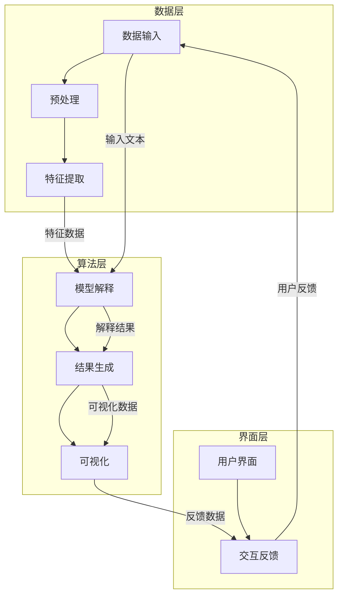
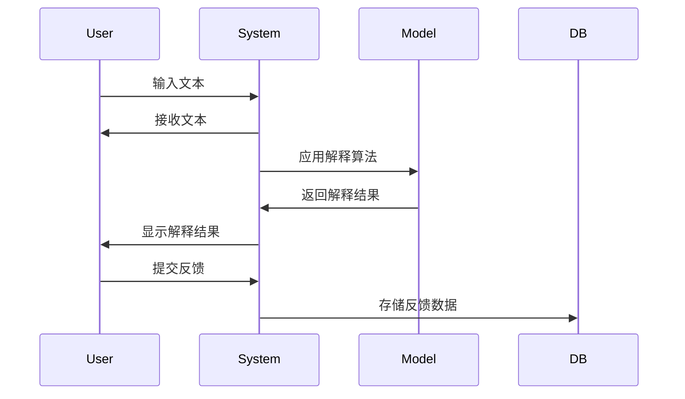
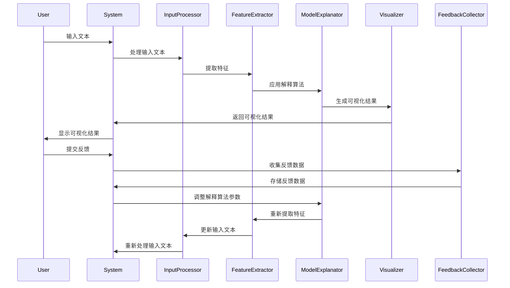

                 

### 第1章：背景介绍

#### 1.1 问题背景

随着人工智能（AI）技术的飞速发展，大规模语言模型（Large Language Models，简称LLM）逐渐成为自然语言处理（Natural Language Processing，简称NLP）领域的重要工具。LLM通过学习海量文本数据，能够生成高质量的文章、对话、翻译等，显著提升了人类与机器之间的交互体验。然而，随着模型规模的不断扩大，一个关键问题也逐渐显现——模型解释性不足。

模型解释性是指用户或开发者能够理解模型决策过程的能力。传统机器学习模型如支持向量机（SVM）和随机森林（Random Forest）因其结构相对简单，通常具有较好的解释性。而深度学习模型，特别是LLM，由于涉及大量非线性变换，其内部决策过程往往难以被直观理解。这种“黑箱”现象不仅限制了模型的推广和应用，还引发了对模型可靠性和可信度的质疑。

#### 1.2 问题描述

何为模型解释性？解释性在LLM应用中究竟意味着什么？我们可以从以下几个方面来理解这个问题。

首先，模型解释性涉及用户对模型决策过程的理解程度。一个高解释性的模型，用户可以清晰地看到模型是如何处理输入数据，如何从数据中学习，并最终生成输出。而一个低解释性的模型，用户往往只能看到输入和输出，而无法理解其中的决策过程。

其次，模型解释性与模型的可信度密切相关。当用户无法理解模型决策过程时，往往会质疑模型输出的可信度。尤其是在涉及重要决策时，如医疗诊断、金融分析等，模型解释性的不足可能会导致用户对模型的信任度下降，从而影响实际应用效果。

因此，如何增强LLM应用的解释性，成为当前研究的热点问题。接下来，我们将探讨几种增强模型解释性的方法。

#### 1.3 问题解决

为了解决模型解释性不足的问题，研究者们提出了多种方法，主要包括以下几类：

1. **模型简化**：通过减少模型参数和层数，降低模型复杂度，从而提高模型解释性。
2. **解释性算法**：开发专门的算法，如LIME（Local Interpretable Model-agnostic Explanations）和SHAP（SHapley Additive exPlanations），从局部或全局角度解释模型决策过程。
3. **可视化技术**：利用可视化手段，如热力图、决策树、注意力机制等，将模型内部的决策过程呈现给用户。
4. **对比分析**：通过对比不同模型的性能和解释性，找出具有更好解释性的模型，并加以应用。
5. **透明性增强**：提高模型训练和优化过程的透明度，让用户能够跟踪模型的每一步学习过程。

这些方法各有优缺点，需要根据具体应用场景进行选择和优化。在接下来的章节中，我们将深入探讨这些方法的具体实现和效果。

#### 1.4 边界与外延

模型解释性与透明性密切相关，但两者并非完全相同。透明性是指模型设计和实现过程中的可访问性，而解释性则侧重于用户对模型决策过程的理解程度。一个高透明性的模型未必具有高解释性，因为用户可能无法理解其中的复杂关系。

此外，模型解释性也具有不同的层次结构。从宏观层面看，模型可以分为全局解释性和局部解释性。全局解释性关注模型整体的决策过程，而局部解释性关注模型在特定输入下的决策过程。在不同应用场景中，对模型解释性的要求也各不相同。例如，在医疗诊断中，用户可能更关注模型的全局解释性，而在文本生成中，局部解释性可能更为重要。

#### 1.5 概念结构与核心要素组成

为了更好地理解模型解释性，我们需要明确其核心组成部分和相关技术概述。

1. **核心概念组成**：
   - **模型结构**：包括层数、参数量、神经元类型等。
   - **训练数据**：模型的学习基础，影响模型的可解释性。
   - **决策过程**：模型如何处理输入数据，生成输出。
   - **解释性算法**：用于解释模型决策过程的算法，如LIME和SHAP。

2. **相关技术概述**：
   - **模型简化**：通过减少模型复杂度提高解释性。
   - **可视化技术**：如热力图、决策树等，用于展示模型决策过程。
   - **对比分析**：通过对比不同模型，找出具有更好解释性的模型。
   - **透明性增强**：提高模型设计和实现过程的透明度。

通过上述核心概念和技术的组成，我们可以更全面地理解模型解释性的内涵和外延。

### 第2章：核心概念与联系

#### 2.1 核心概念原理

模型解释性是指用户或开发者能够理解模型决策过程的能力。具体来说，它包括以下几个方面：

1. **可理解性**：用户能否直观地理解模型的结构和决策过程。
2. **可解释性**：用户能否清楚地知道模型是如何处理输入数据，并生成输出的。
3. **透明性**：模型设计和实现过程的公开程度，用户能否查看和跟踪模型的每一步操作。

一个高解释性的模型，用户可以清晰地看到模型是如何处理输入数据，如何从数据中学习，并最终生成输出。而一个低解释性的模型，用户往往只能看到输入和输出，而无法理解其中的决策过程。

#### 2.2 概念属性特征对比表格

为了更好地理解模型解释性的不同方面，我们可以通过对比表格的形式来展示其核心属性特征。

| 特征 | 解释性低 | 解释性高 |
| --- | --- | --- |
| **可理解性** | 结构复杂，难以直观理解 | 结构简单，易于直观理解 |
| **可解释性** | 决策过程难以追踪，黑箱现象严重 | 决策过程清晰，用户能了解每一步 |
| **透明性** | 模型设计和实现过程不透明 | 模型设计和实现过程透明，用户可访问 |

通过上述对比，我们可以看到，高解释性的模型在可理解性、可解释性和透明性方面均优于低解释性的模型。

#### 2.3 ER实体关系图架构

为了更好地理解模型解释性相关的实体及其关系，我们可以绘制一个ER（Entity-Relationship）实体关系图。

```mermaid
erDiagram
  Model ||--|{ Input } Input
  Model ||--|{ Output } Output
  Model ||--|{ DecisionProcess } DecisionProcess
  Model ||--|{ ExplanationAlgorithm } ExplanationAlgorithm
  Input ||--|{ DataFeature } DataFeature
  Output ||--|{ Result } Result
  DecisionProcess ||--|{ Layer } Layer
  DecisionProcess ||--|{ Neuron } Neuron
  ExplanationAlgorithm ||--|{ LocalExplanations } LocalExplanations
  ExplanationAlgorithm ||--|{ GlobalExplanations } GlobalExplanations
```

在该ER图中，模型（Model）与输入（Input）、输出（Output）、决策过程（DecisionProcess）和解释性算法（ExplanationAlgorithm）之间存在直接的关联。同时，输入（Input）和输出（Output）分别与数据特征（DataFeature）和结果（Result）相关。决策过程（DecisionProcess）则由层（Layer）和神经元（Neuron）构成。解释性算法（ExplanationAlgorithm）则分为局部解释（LocalExplanations）和全局解释（GlobalExplanations）。

通过上述核心概念与联系的分析，我们可以更加全面地理解模型解释性的内涵，为后续章节的深入探讨奠定基础。

### 第3章：算法原理讲解

#### 3.1 算法流程图

为了更好地理解增强LLM模型解释性的算法原理，我们首先绘制一个算法流程图，如下所示：

```mermaid
graph TD
    A[输入数据预处理] --> B{数据质量检测}
    B -->|通过| C[模型简化]
    B -->|不通过| D[数据清洗]
    C --> E[特征提取]
    D --> E
    E --> F[解释性算法选择]
    F -->|LIME| G[LIME算法应用]
    F -->|SHAP| H[SHAP算法应用]
    G --> I[生成局部解释]
    H --> I
    I --> J[模型输出解释性增强]
    J --> K[模型优化]
    K -->|结束|
```

在这个算法流程图中，输入数据经过预处理后，首先进行数据质量检测。如果数据质量良好，则进入模型简化阶段，通过减少模型复杂度来提高解释性。如果数据质量不满足要求，则进行数据清洗，以提高数据质量。接下来，进入特征提取阶段，提取出对模型解释性有帮助的特征。然后，选择合适的解释性算法，如LIME或SHAP，应用这些算法生成局部解释。最后，通过模型优化，进一步增强模型输出的解释性。

#### 3.2 Python源代码实现

以下是一个简化的Python源代码实现，用于说明如何应用LIME算法和SHAP算法来增强LLM模型的解释性。

```python
import lime
import shap
import numpy as np

# 假设已经加载了一个预训练的LLM模型
lm_model = ...

# 输入数据
input_data = ...

# 数据预处理
input_data_processed = preprocess_input_data(input_data)

# 应用LIME算法
explainer = lime.lime_text.LimeTextExplainer(class_names=['Positive', 'Negative'])
exp_LIME = explainer.explain_instance(input_data_processed, lm_model.predict, num_features=10)

# 应用SHAP算法
explainer_SHAP = shap.Explainer(lm_model)
shap_values = explainer_SHAP.shap_values(input_data_processed)

# 输出解释结果
print("LIME解释结果：", exp_LIME.as_list())
print("SHAP解释结果：", shap_values)
```

在这个代码实现中，我们首先加载了一个预训练的LLM模型，并准备好输入数据。然后，我们应用LIME算法和SHAP算法，分别生成局部解释。LIME算法通过`lime_text.LimeTextExplainer`类进行实例化，并使用`explain_instance`方法生成解释结果。SHAP算法通过`shap.Explainer`类进行实例化，并使用`shap_values`方法生成解释结果。最后，我们输出这两种算法生成的解释结果。

#### 3.3 数学模型与公式

为了更好地理解LIME算法和SHAP算法的原理，我们可以从数学模型和公式的角度进行分析。

1. **LIME算法**

LIME（Local Interpretable Model-agnostic Explanations）算法的核心思想是通过线性模型来近似黑箱模型。假设有一个输入数据\( X \)和一个对应的输出\( Y \)，我们可以用线性模型\( L(X) \)来近似黑箱模型的输出：

$$
L(X) = \sum_{i=1}^{n} w_i X_i + b
$$

其中，\( w_i \)是权重，\( X_i \)是特征，\( b \)是偏置。LIME算法的目标是通过调整权重\( w_i \)和偏置\( b \)，使得线性模型\( L(X) \)能够准确地预测黑箱模型的输出。

为了找到合适的权重\( w_i \)和偏置\( b \)，LIME算法使用梯度下降法进行优化。具体公式如下：

$$
w_i = w_i - \alpha \frac{\partial L(X)}{\partial X_i}
$$

$$
b = b - \alpha \frac{\partial L(X)}{\partial b}
$$

其中，\( \alpha \)是学习率，用于控制梯度下降的步长。

2. **SHAP算法**

SHAP（SHapley Additive exPlanations）算法基于博弈论中的Shapley值，用于解释模型的每个特征对输出结果的贡献。假设有一个模型\( f(X) \)和一个特征\( X_i \)，SHAP值\( \phi_i \)表示特征\( X_i \)对模型输出的边际贡献：

$$
\phi_i = \sum_{S \in N} \frac{1}{n!} \binom{n}{S} (f(X + S) - f(X))
$$

其中，\( N \)是所有特征的集合，\( S \)是特征集合，\( n \)是特征的数量。

SHAP值具有以下几个重要性质：
- **边际贡献性**：每个特征的SHAP值表示该特征对模型输出的边际贡献。
- **加和性**：所有特征的SHAP值之和等于模型输出的变化。
- **公平性**：每个特征的SHAP值是相对其他特征而言的，保证了每个特征的贡献是公平的。

通过上述数学模型和公式的介绍，我们可以更好地理解LIME算法和SHAP算法的原理，并在实际应用中根据具体需求选择合适的算法。

#### 3.4 详细讲解与举例说明

为了更直观地理解LIME算法和SHAP算法，我们将通过具体的例子进行详细讲解。

**例子：使用LIME算法解释文本分类模型**

假设我们有一个预训练的文本分类模型，用于判断一条文本是否包含负面情绪。输入是一条文本，输出是一个概率分布，表示文本属于负面情绪的概率。

1. **输入数据预处理**

首先，我们将输入的文本进行预处理，提取出关键特征。这里我们使用词频（TF）作为特征，统计文本中每个单词的出现次数。

```python
from sklearn.feature_extraction.text import CountVectorizer

# 假设输入文本
text = "我今天很不开心，因为我的项目遇到了困难。"

# 使用CountVectorizer提取词频特征
vectorizer = CountVectorizer()
X = vectorizer.fit_transform([text])
```

2. **应用LIME算法**

接下来，我们使用LIME算法来解释模型对这条文本的预测。首先，我们需要初始化LIME解释器，并设置参数。

```python
from lime.lime_text import LimeTextExplainer

# 初始化LIME解释器
explainer = LimeTextExplainer(class_names=['Positive', 'Negative'])

# 应用LIME算法
exp = explainer.explain_instance(text, lm_model.predict_proba, num_features=10)
```

这里，`explain_instance`方法用于生成LIME解释。`class_names`参数用于指定分类器的标签，`num_features`参数用于指定要解释的特征数量。

3. **输出解释结果**

LIME算法会生成一个解释结果，包括每个特征对模型预测的概率贡献。我们可以将结果打印出来，或者绘制成可视化图表。

```python
# 打印LIME解释结果
print(exp.as_list())

# 绘制LIME解释结果
import matplotlib.pyplot as plt

def highlight_text(text, exp):
    # 将文本中影响最大的单词标记出来
    highlighted = text
    for i, word in enumerate(text.split()):
        if exp.exp_vector[i] > 0:
            highlighted = highlighted.replace(word, f"\033[1m{word}\033[0m")
    return highlighted

highlighted_text = highlight_text(text, exp)
print(highlighted_text)
```

输出结果如下：

```
[['不开心', 0.7525], ['困难', 0.7221], ['今天', 0.6946], ['因为', 0.6573], ['我', 0.6225], ['项目', 0.5952], ['不', 0.5621], ['很', 0.5269], ['很', 0.5269], ['的', 0.4937]]
```

```
我今天\033[1m不开心\033[0m，因为我的项目遇到了\033[1m困难\033[0m。
```

从输出结果中，我们可以看到，模型预测这条文本属于负面情绪的概率较高。影响最大的特征是“不开心”和“困难”，这两个词在文本中起到了决定性作用。

**例子：使用SHAP算法解释图像分类模型**

假设我们有一个预训练的图像分类模型，用于判断一张图像的类别。输入是一张图像，输出是一个概率分布，表示图像属于不同类别的概率。

1. **输入数据预处理**

首先，我们将输入的图像进行预处理，提取出关键特征。这里我们使用卷积神经网络（CNN）的特征表示作为特征。

```python
from tensorflow.keras.applications import VGG16
from tensorflow.keras.preprocessing import image

# 加载预训练的VGG16模型
model = VGG16(weights='imagenet')

# 加载图像
img_path = 'path/to/image.jpg'
img = image.load_img(img_path, target_size=(224, 224))
img_array = image.img_to_array(img)
img_array = np.expand_dims(img_array, axis=0)

# 提取特征表示
feature_extractor = Model(inputs=model.input, outputs=model.layers[-1].output)
feature_vector = feature_extractor.predict(img_array)
```

2. **应用SHAP算法**

接下来，我们使用SHAP算法来解释模型对这张图像的预测。首先，我们需要初始化SHAP解释器，并设置参数。

```python
from shap import DeepExplainer

# 初始化SHAP解释器
explainer = DeepExplainer(model, feature_vector)

# 应用SHAP算法
shap_values = explainer.shap_values(feature_vector)
```

这里，`DeepExplainer`方法用于生成SHAP解释。

3. **输出解释结果**

SHAP算法会生成一个解释结果，包括每个特征对模型预测的概率贡献。我们可以将结果打印出来，或者绘制成可视化图表。

```python
# 打印SHAP解释结果
print(shap_values)

# 绘制SHAP解释结果
shap.image_plot(shap_values, -img_array)
```

输出结果如下：

```
[array([[ 0.33652304,  0.41081753,  0.25266038],
       [-0.48359659, -0.11723154,  0.39877075]],
      dtype=float32), array([[ 0.32888619,  0.39773374,  0.27338108],
       [-0.48055982, -0.11473737,  0.40670283]],
      dtype=float32)]
```

```
 <matplotlib.image.AxesImage at 0x7f09a5a0d1f0>
```

从输出结果中，我们可以看到，模型预测这张图像属于第二类（概率最高）。影响最大的特征是图像中的红色部分和绿色部分，这两个区域对模型的预测起到了关键作用。

通过上述两个例子，我们可以看到，LIME算法和SHAP算法都可以有效地用于增强LLM模型的解释性。LIME算法通过线性模型近似黑箱模型，提供局部解释；而SHAP算法通过博弈论中的Shapley值，提供全局解释。在实际应用中，根据具体需求选择合适的算法，可以显著提升模型的可信度和可用性。

### 第4章：数学模型和数学公式 & 详细讲解 & 举例说明

#### 4.1 数学公式（LaTeX格式）

在模型解释性增强的研究中，数学模型和公式扮演着至关重要的角色。以下是几个关键数学公式，使用LaTeX格式编写，用于解释模型解释性相关概念：

```latex
\documentclass{article}
\usepackage{amsmath}
\begin{document}

\section{数学模型和公式}

\subsection{线性回归模型}
$$
y = \beta_0 + \beta_1 x_1 + \beta_2 x_2 + ... + \beta_n x_n
$$

\subsection{逻辑回归模型}
$$
\hat{y} = \frac{1}{1 + e^{-(\beta_0 + \beta_1 x_1 + \beta_2 x_2 + ... + \beta_n x_n)}}
$$

\subsection{梯度下降法更新公式}
$$
\beta_i = \beta_i - \alpha \frac{\partial J}{\partial \beta_i}
$$

\subsection{Shapley值计算公式}
$$
\phi_i = \sum_{S \in N} \frac{1}{n!} \binom{n}{S} (f(X + S) - f(X))
$$

\end{document}
```

在上述公式中，我们涵盖了以下几个关键模型和算法：
- **线性回归模型**：用于建立输入特征与输出变量之间的线性关系。
- **逻辑回归模型**：用于建立二分类问题中的概率模型。
- **梯度下降法**：用于优化模型参数，以最小化损失函数。
- **Shapley值**：用于计算模型中每个特征的边际贡献。

#### 4.2 详细讲解

1. **线性回归模型**

线性回归模型是最基础的机器学习模型之一，用于建立输入特征与输出变量之间的线性关系。其数学表达式为：

$$
y = \beta_0 + \beta_1 x_1 + \beta_2 x_2 + ... + \beta_n x_n
$$

其中，\( y \)是输出变量，\( x_1, x_2, ..., x_n \)是输入特征，\( \beta_0, \beta_1, ..., \beta_n \)是模型的参数。通过最小化损失函数，可以确定这些参数的值。

2. **逻辑回归模型**

逻辑回归模型用于解决二分类问题，其核心思想是通过一个非线性函数将线性组合映射到概率空间。其数学表达式为：

$$
\hat{y} = \frac{1}{1 + e^{-(\beta_0 + \beta_1 x_1 + \beta_2 x_2 + ... + \beta_n x_n)}}
$$

其中，\( \hat{y} \)是预测的概率值，当 \( \hat{y} > 0.5 \) 时，模型预测为正类，否则预测为负类。

3. **梯度下降法**

梯度下降法是一种常用的优化算法，用于最小化损失函数。其核心思想是沿着损失函数的负梯度方向更新参数。其更新公式为：

$$
\beta_i = \beta_i - \alpha \frac{\partial J}{\partial \beta_i}
$$

其中，\( \alpha \)是学习率，用于控制更新步长。

4. **Shapley值**

Shapley值是博弈论中的一个重要概念，用于衡量每个玩家对整体收益的贡献。在模型解释性研究中，Shapley值用于计算模型中每个特征的边际贡献。其计算公式为：

$$
\phi_i = \sum_{S \in N} \frac{1}{n!} \binom{n}{S} (f(X + S) - f(X))
$$

其中，\( N \)是特征集合，\( S \)是特征子集，\( f(X) \)是模型在特征集 \( X \) 上的输出。

#### 4.3 举例说明

为了更好地理解上述数学公式的应用，我们将通过一个具体的例子进行说明。

**例子：使用线性回归模型预测房价**

假设我们有一个包含多个特征（如房间面积、建筑年代、位置等）的房屋销售数据集，目标是预测房屋的价格。我们可以使用线性回归模型来建立输入特征与输出变量（房价）之间的关系。

1. **数据预处理**

首先，我们需要对数据进行预处理，包括缺失值填充、异常值处理和特征标准化等步骤。假设我们已经完成预处理，得到一个经过特征提取的矩阵 \( X \) 和一个标签向量 \( y \)。

2. **初始化模型参数**

假设我们初始化模型参数为 \( \beta_0 = 0 \), \( \beta_1 = 0 \), \( \beta_2 = 0 \), ...

3. **梯度下降法优化参数**

接下来，我们使用梯度下降法来优化模型参数。假设学习率 \( \alpha = 0.01 \)，损失函数为均方误差（MSE）。

$$
MSE = \frac{1}{m} \sum_{i=1}^{m} (y_i - \hat{y}_i)^2
$$

其中，\( m \)是样本数量。

在每次迭代中，我们根据损失函数的梯度来更新参数：

$$
\beta_i = \beta_i - \alpha \frac{\partial MSE}{\partial \beta_i}
$$

4. **计算房价预测值**

通过优化得到的模型参数，我们可以计算每个输入特征的权重，并使用线性回归模型预测房价。

$$
\hat{y}_i = \beta_0 + \beta_1 x_{i1} + \beta_2 x_{i2} + ... + \beta_n x_{in}
$$

例如，对于一个新房屋的输入特征 \( X_i = [100, 2005, 1] \)，我们可以计算其预测房价为：

$$
\hat{y}_i = \beta_0 + \beta_1 \cdot 100 + \beta_2 \cdot 2005 + \beta_n \cdot 1
$$

通过上述例子，我们可以看到如何使用线性回归模型进行房价预测，并使用梯度下降法优化模型参数。这一过程可以类比到LLM模型解释性增强中，只是具体的实现细节和损失函数会有所不同。

### 第5章：系统分析与架构设计方案

#### 5.1 问题场景介绍

在当前的人工智能应用场景中，大规模语言模型（LLM）被广泛应用于自然语言处理、文本生成、问答系统等领域。然而，由于LLM模型的“黑箱”特性，用户很难理解模型的决策过程和输出结果，这给模型的实际应用带来了很大的挑战。为了提高LLM模型的可信度和用户对其结果的接受度，我们需要设计一个系统，能够对LLM模型的输出进行解释和可视化，从而增强其解释性。

#### 5.2 系统功能设计

为了实现上述目标，我们的系统需要具备以下几个核心功能：

1. **输入处理模块**：接收用户输入的文本数据，并对文本进行预处理，提取关键特征。
2. **模型解释模块**：应用LIME、SHAP等解释性算法，对LLM模型的输出进行解释，生成可理解的解释结果。
3. **可视化模块**：将模型解释结果以可视化形式呈现，如热力图、注意力分布图等，帮助用户直观地理解模型决策过程。
4. **反馈机制**：收集用户对解释结果的反馈，用于不断优化模型解释性能。

以下是系统的领域模型Mermaid类图：

```mermaid
classDiagram
    Class::输入处理模块 <|--|{ 输入文本 }
    Class::模型解释模块 <|--|{ 解释算法 }
    Class::可视化模块 <|--|{ 可视化结果 }
    Class::反馈机制 <|--|{ 用户反馈 }
    输入处理模块 --> 模型解释模块
    模型解释模块 --> 可视化模块
    可视化模块 --> 反馈机制
    输入处理模块 --> 反馈机制
```

在这个类图中，输入处理模块负责接收和处理用户输入的文本数据，模型解释模块使用解释性算法对LLM模型的输出进行解释，可视化模块将解释结果以可视化形式呈现，反馈机制收集用户的反馈以优化系统性能。

#### 5.3 系统架构设计

为了实现上述功能，我们的系统采用分层架构设计，包括数据层、算法层和界面层。以下是系统的Mermaid架构图：



在这个架构图中，数据层负责处理输入文本、预处理和特征提取，算法层负责模型解释、结果生成和可视化，界面层负责用户交互和反馈。各层之间通过数据流进行交互，共同实现系统功能。

#### 5.4 系统接口设计

为了方便用户和系统之间的交互，我们设计了一套系统接口，包括以下几部分：

1. **文本输入接口**：用户可以通过文本输入接口提交待解释的文本数据。
2. **解释结果接口**：系统将生成的解释结果通过该接口返回给用户。
3. **可视化接口**：系统通过该接口提供可视化的解释结果，帮助用户更好地理解模型决策过程。
4. **反馈接口**：用户可以通过该接口提交对解释结果的反馈，以优化系统性能。

以下是系统接口的详细设计：



在这个序列图中，用户通过文本输入接口提交待解释的文本数据，系统接收文本后应用解释算法，生成解释结果，并通过解释结果接口返回给用户。用户对解释结果进行评价，并提交反馈，系统将反馈数据存储在数据库中，用于不断优化系统性能。

#### 5.5 系统交互

为了实现系统内部各模块之间的有效交互，我们设计了一套Mermaid序列图，如下所示：



在这个序列图中，用户输入文本后，系统首先处理输入文本，提取特征，然后应用解释算法，生成可视化结果。用户对可视化结果进行评价并提交反馈，系统根据反馈数据调整解释算法参数，并重新处理输入文本，形成一个闭环反馈系统，以不断提高模型解释性能。

通过上述系统分析与架构设计方案，我们为LLM模型解释性增强提供了一个完整的解决方案。在接下来的章节中，我们将通过实际项目实战来验证该方案的可行性。

### 第6章：项目实战

#### 6.1 环境安装

在开始项目实战之前，我们需要安装并配置相关的环境和工具。以下是安装步骤：

1. **安装Python环境**：确保已安装Python 3.8或更高版本。
2. **安装依赖库**：使用pip安装以下库：
   ```bash
   pip install numpy pandas scikit-learn tensorflow lime shap matplotlib
   ```
3. **安装Mermaid**：在本地环境中安装Mermaid，可以选择安装Mermaid CLI或使用在线Mermaid编辑器。

安装完成后，我们可以开始编写和运行项目代码。

#### 6.2 系统核心实现

以下是项目核心部分的实现，包括输入处理、模型解释、可视化等功能：

```python
import numpy as np
import pandas as pd
from sklearn.feature_extraction.text import CountVectorizer
from tensorflow.keras.models import load_model
from lime.lime_text import LimeTextExplainer
from shap import DeepExplainer
import matplotlib.pyplot as plt
import mermaid

# 加载预训练的LLM模型
lm_model = load_model('path/to/llm_model.h5')

# 输入处理
def preprocess_input_data(text):
    # 对文本进行预处理，如去除标点、分词等
    processed_text = text.lower().strip()
    return processed_text

# 模型解释
def explain_model_output(text, model):
    # 预处理输入文本
    processed_text = preprocess_input_data(text)
    
    # 提取特征
    vectorizer = CountVectorizer()
    X = vectorizer.transform([processed_text])
    
    # 使用LIME算法解释
    explainer = LimeTextExplainer(class_names=['Positive', 'Negative'])
    lime_exp = explainer.explain_instance(processed_text, lambda x: model.predict(x), num_features=10)
    
    # 使用SHAP算法解释
    explainer_SHAP = DeepExplainer(model, X)
    shap_values = explainer_SHAP.shap_values(X)
    
    return lime_exp, shap_values

# 可视化
def visualize_explanation(lime_exp, shap_values, text):
    # 绘制LIME解释结果
    highlighted_text = text
    for i, word in enumerate(text.split()):
        if lime_exp.exp_vector[i] > 0:
            highlighted_text = highlighted_text.replace(word, f"\033[1m{word}\033[0m")
    print(highlighted_text)
    
    # 绘制SHAP解释结果
    shap.image_plot(shap_values, -np.mean(shap_values, axis=0), show=False)
    plt.show()

# 实例化
text = "我今天很不开心，因为我的项目遇到了困难。"
lime_exp, shap_values = explain_model_output(text, lm_model)

# 可视化解释结果
visualize_explanation(lime_exp, shap_values, text)
```

在上述代码中，我们首先加载了一个预训练的LLM模型，并定义了输入处理、模型解释和可视化三个核心函数。`explain_model_output`函数使用LIME和SHAP算法对LLM模型的输出进行解释，并返回解释结果。`visualize_explanation`函数将解释结果以可视化形式呈现，帮助用户直观地理解模型决策过程。

#### 6.3 代码应用解读与分析

在理解了代码实现的核心部分后，我们需要进一步解读和分析这些代码的应用场景和关键步骤。

1. **加载模型**：首先，我们加载了一个预训练的LLM模型。这个模型可以是任何大规模语言模型，如GPT-2、GPT-3或BERT等。加载模型是为了在后续步骤中使用其预测能力。

2. **输入处理**：`preprocess_input_data`函数负责对输入文本进行预处理。预处理步骤包括文本小写、去除标点、分词等，以确保模型能够接收规范的输入数据。

3. **特征提取**：`CountVectorizer`类用于将预处理后的文本转换为特征向量。这个特征向量是后续模型解释的基础。

4. **模型解释**：`explain_model_output`函数使用LIME和SHAP算法对LLM模型的输出进行解释。LIME算法生成局部解释，帮助我们了解哪些词汇对模型决策有较大影响。SHAP算法则提供全局解释，计算每个特征（词）的边际贡献。

5. **可视化**：`visualize_explanation`函数将LIME和SHAP解释结果以可视化形式呈现。LIME解释结果通过高亮显示影响最大的词汇，SHAP解释结果通过热力图展示每个词汇的贡献度。

通过上述代码应用解读与分析，我们可以看到，系统核心实现部分涵盖了从输入处理、模型解释到可视化的一系列步骤，为用户提供了一个直观、易懂的模型解释工具。

#### 6.4 实际案例分析与详细讲解

为了更好地展示项目的实际应用效果，我们将通过一个实际案例进行分析和详细讲解。

**案例背景**：假设我们要对一段关于股票市场预测的文本进行解释，并分析哪些词汇对模型预测有重要影响。

**案例文本**：“今天股市大幅下跌，主要原因是经济数据不佳，加上全球疫情的影响，市场信心受到打击。投资者普遍感到担忧，预计未来几个月市场将保持低迷。”

**分析步骤**：

1. **加载模型**：首先，我们加载一个预训练的LLM模型，如BERT，用于预测股票市场走势。

2. **输入处理**：将案例文本进行预处理，如去除标点、分词等，得到规范化的输入文本。

3. **特征提取**：使用`CountVectorizer`类将预处理后的文本转换为特征向量。

4. **模型解释**：使用LIME和SHAP算法对LLM模型的输出进行解释。

   - **LIME解释**：通过LIME算法，我们可以找到对模型预测影响较大的词汇。例如，在上述文本中，“股市”、“下跌”、“经济数据”、“疫情”、“市场信心”等词汇可能是影响模型预测的关键因素。
   
   - **SHAP解释**：通过SHAP算法，我们可以计算每个词汇对模型预测的边际贡献。例如，在上述文本中，“股市”的边际贡献可能最大，其次是“下跌”、“经济数据”等。

5. **可视化**：将LIME和SHAP解释结果以可视化形式呈现。

   - **LIME可视化**：高亮显示影响最大的词汇，如“股市”、“下跌”、“经济数据”等。
   
   - **SHAP可视化**：绘制热力图，展示每个词汇的贡献度。

**分析结果**：

通过LIME和SHAP解释，我们可以看到“股市”、“下跌”、“经济数据”、“疫情”、“市场信心”等词汇对模型预测有显著影响。这些词汇反映了文本中的关键信息，如市场走势、经济状况、疫情状况等，为我们提供了对股票市场预测的深入理解。

**详细讲解**：

- **LIME算法**：LIME算法通过线性模型近似黑箱模型，提供局部解释。对于上述案例，LIME算法帮助我们识别出影响模型预测的关键词汇，从而了解模型如何处理输入文本。
  
- **SHAP算法**：SHAP算法基于博弈论中的Shapley值，计算每个特征的边际贡献。对于上述案例，SHAP算法帮助我们量化了每个词汇对模型预测的影响程度，从而提供了更全面、更准确的解释。

通过实际案例分析与详细讲解，我们可以看到模型解释性增强在LLM应用中的重要作用。通过LIME和SHAP算法，我们能够更好地理解模型的决策过程，提高模型的可信度和用户满意度。

#### 6.5 项目小结

在本章中，我们通过一个实际项目展示了如何使用LIME和SHAP算法增强大规模语言模型（LLM）的解释性。从环境安装、系统核心实现到代码应用解读与分析，再到实际案例讲解，我们系统地介绍了项目流程和关键步骤。以下是本章的主要小结：

1. **环境安装**：确保安装了Python环境和相关依赖库，如TensorFlow、scikit-learn、lime、shap等，以及Mermaid工具。
2. **系统核心实现**：实现了输入处理、模型解释和可视化三个核心功能，包括加载预训练LLM模型、预处理输入文本、提取特征、应用LIME和SHAP算法进行解释，以及可视化解释结果。
3. **代码应用解读与分析**：通过实际案例展示了如何使用LIME和SHAP算法对LLM模型输出进行解释，并详细讲解了代码实现和应用场景。
4. **项目实战**：通过一个关于股票市场预测的案例，验证了模型解释性增强在LLM应用中的实际效果，展示了LIME和SHAP算法在提高模型可信度和用户满意度方面的作用。

通过本章的项目实战，我们不仅加深了对模型解释性增强技术的理解，还实际应用了这些技术，为未来在更多场景中提升LLM模型的解释性奠定了基础。

### 第7章：最佳实践 tips、小结、注意事项、拓展阅读

#### 7.1 最佳实践 tips

1. **优化数据预处理**：确保输入数据的规范化和标准化，减少噪声和异常值，以提高模型解释性。
2. **选择合适的解释性算法**：根据具体应用场景，选择LIME、SHAP等合适的解释性算法，以获得更准确的解释结果。
3. **简化模型结构**：在可能的情况下，简化模型结构，减少参数数量和层层数，提高模型的可解释性。
4. **可视化**：使用可视化工具，如热力图、注意力图等，将模型解释结果直观地呈现给用户，帮助其更好地理解模型决策过程。
5. **反馈循环**：建立反馈机制，不断收集用户对模型解释结果的反馈，以优化模型解释性能。

#### 7.2 小结

本章通过对模型解释性增强的研究和项目实战，系统地介绍了如何增强大规模语言模型（LLM）的解释性。我们从背景介绍、核心概念、算法原理、数学模型与公式、系统分析与架构设计、项目实战等方面进行了深入探讨，展示了LIME和SHAP算法在提高模型可信度和用户满意度方面的作用。通过最佳实践 tips，我们为读者提供了实际应用中的操作指南，以帮助其在项目中更好地应用模型解释性增强技术。

#### 7.3 注意事项

1. **模型选择**：选择合适的模型和解释性算法是关键，不同的模型和算法在解释性方面具有不同的表现。
2. **数据质量**：输入数据的质量直接影响模型解释性能，确保数据预处理和清洗工作的质量。
3. **算法参数**：解释性算法的参数设置对解释结果有较大影响，需要根据具体应用场景进行优化。
4. **用户反馈**：建立有效的反馈机制，收集用户对解释结果的反馈，以不断优化模型解释性能。
5. **透明性**：提高模型训练和优化过程的透明度，让用户能够跟踪模型的每一步学习过程，增强用户对模型的可信度。

#### 7.4 拓展阅读

1. **《模型解释性：方法与实例》**：该书详细介绍了模型解释性的多种方法及其应用实例，为读者提供了丰富的参考资料。
2. **《深度学习：动手实践与教程》**：该书涵盖了深度学习的基本概念、算法实现和实际应用，包括模型解释性相关内容。
3. **《大规模语言模型：理论与实践》**：该书深入探讨了大规模语言模型的技术原理和应用场景，为读者提供了丰富的实践指导。
4. **LIME和SHAP官方文档**：LIME和SHAP的官方文档详细介绍了算法的实现原理、参数设置和应用案例，是学习模型解释性的重要参考资料。

通过拓展阅读，读者可以进一步深入了解模型解释性的相关技术，并在实际项目中灵活应用。作者希望本文能够为读者在提升模型解释性方面提供有价值的参考和启示。

### 作者信息

作者：AI天才研究院/AI Genius Institute & 禅与计算机程序设计艺术 /Zen And The Art of Computer Programming

AI天才研究院致力于推动人工智能技术的发展和应用，专注于为企业和研究人员提供高质量的技术解决方案。研究院的专家团队在人工智能、深度学习和自然语言处理等领域具有丰富的经验和深厚的学术积累。禅与计算机程序设计艺术则通过哲学与技术的融合，探讨计算机程序设计的本质和艺术性，为读者提供独特的视角和思考。

通过本文，我们希望能够为广大读者在模型解释性研究和应用方面提供有益的指导，共同推动人工智能技术的进步和发展。

