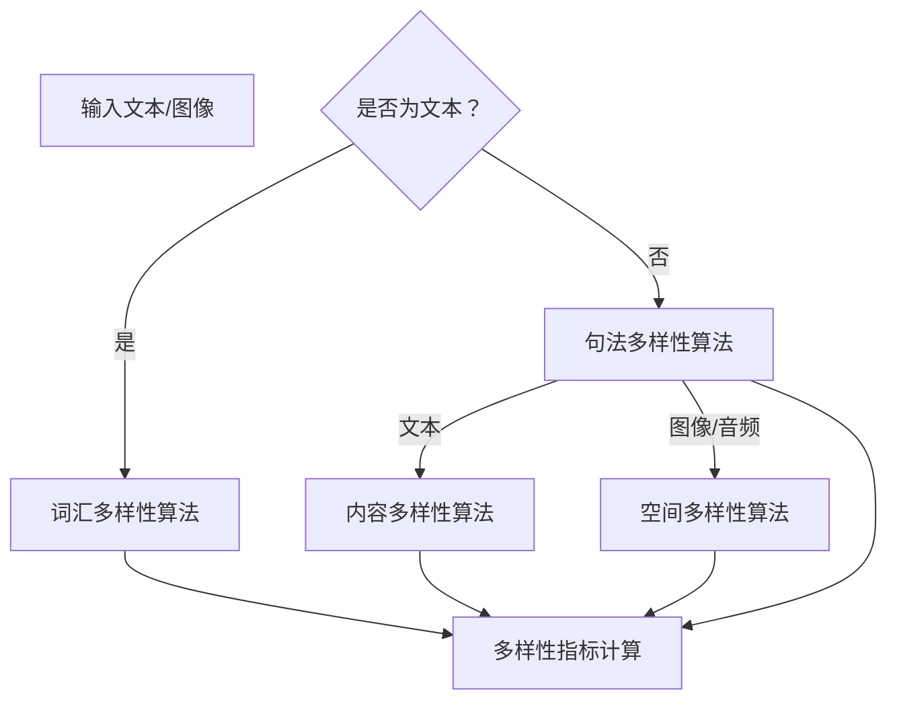
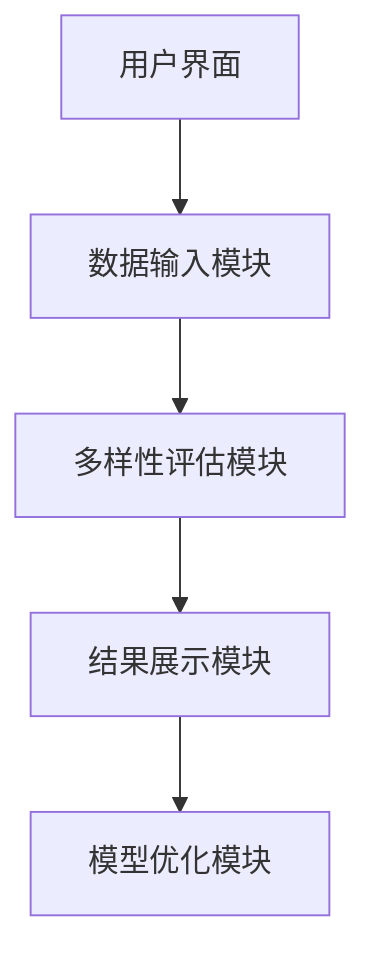
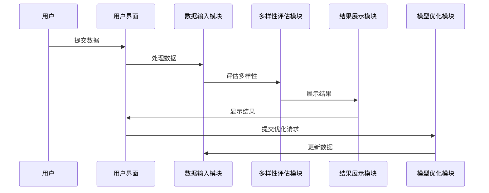

                 

# 模型输出多样性测试：评估创造力

> 关键词：模型输出多样性测试、创造力评估、算法原理、系统架构、项目实战

> 摘要：本文旨在探讨模型输出多样性测试在评估创造力中的应用。首先，我们将回顾创造力在人工智能领域的意义及其定义，接着深入探讨模型输出多样性的重要性及评估方法。随后，我们将详细介绍多样性测试的算法原理与实现，通过具体的数学模型和公式，以及Python源代码进行详细阐述。文章还将分析系统架构设计与接口设计，并通过一个实际项目展示模型输出多样性测试的实战应用。最后，我们将总结项目经验和展望未来发展方向。

## 目录大纲

1. **背景与理论基础**
    1.1 模型输出多样性测试概述
        1.1.1 问题背景
        1.1.2 问题描述
        1.1.3 问题解决
        1.1.4 边界与外延
    1.2 核心概念与联系
        1.2.1 多样性测试原理
        1.2.2 概念属性特征对比表格
        1.2.3 ER实体关系图架构
    1.3 数学模型和数学公式
        1.3.1 多样性计算公式
        1.3.2 举例说明

2. **算法原理与实现**
    2.1 算法原理讲解
        2.1.1 多样性算法概述
        2.1.2 算法mermaid流程图
        2.1.3 Python源代码实现
    2.2 算法细节解析
        2.2.1 算法原理深入讲解
        2.2.2 多样性算法应用案例

3. **系统分析与架构设计**
    3.1 系统功能设计
        3.1.1 问题场景介绍
        3.1.2 系统功能设计
        3.1.3 系统架构设计
    3.2 系统接口设计
        3.2.1 系统接口设计
        3.2.2 系统交互

4. **项目实战**
    4.1 环境安装
    4.2 系统核心实现
    4.3 代码应用解读与分析
    4.4 实际案例分析与详细讲解
    4.5 项目小结

5. **最佳实践、小结、注意事项、拓展阅读**

### 1. 背景与理论基础

#### 1.1 模型输出多样性测试概述

##### 1.1.1 问题背景

创造力是人工智能领域的重要研究方向之一，它不仅关乎模型的发展潜力，还直接影响到模型的实际应用价值。随着深度学习模型的不断进化，如何评估这些模型在生成输出时的多样性成为一个亟待解决的问题。

##### 1.1.2 问题描述

模型输出多样性测试的核心问题是：如何衡量和评估模型生成的输出在质量、形式和内容上的多样性？这不仅是评估模型创造力的重要指标，也是推动模型优化和实际应用的关键。

##### 1.1.3 问题解决

多样性测试的挑战在于如何全面、准确地评估模型输出的多样性。常见的解决方案包括基于统计的多样性指标、基于模型输出的空间分布等。以下是一些常见的多样性测试方法：

1. **词汇多样性**：通过计算模型输出中不同词汇的使用频率来评估多样性。
2. **句法多样性**：分析句子结构，计算不同句型的出现频率。
3. **内容多样性**：通过分析模型生成文本的主题、观点和内容的丰富性来评估多样性。
4. **空间多样性**：在模型生成的图像或音频中，通过空间分布的差异来评估多样性。

##### 1.1.4 边界与外延

创造力评估的局限性在于，现有方法往往只能评估模型在某个特定任务上的表现，而不能全面衡量其在各种场景下的多样性。模型多样性测试的应用领域广泛，包括自然语言处理、图像识别、音频生成等多个领域。

### 1.2 核心概念与联系

#### 1.2.1 多样性测试原理

多样性测试的核心在于多样性指标，这些指标用于量化模型输出的多样性。常见的多样性指标包括：

1. **词汇多样性**：通过计算模型输出中不同词汇的个数和出现频率来评估。
2. **句法多样性**：通过计算句子中不同句型的出现频率来评估。
3. **内容多样性**：通过计算模型输出中不同主题和观点的个数和出现频率来评估。
4. **空间多样性**：在图像或音频中，通过计算不同区域的差异来评估。

多样性评估方法包括定量和定性两类：

1. **定量评估**：通过计算具体的指标数值来评估多样性。
2. **定性评估**：通过专家评审或用户调查来评估多样性。

#### 1.2.2 概念属性特征对比表格

| 指标类型 | 描述 | 优点 | 缺点 |
| --- | --- | --- | --- |
| 词汇多样性 | 通过计算模型输出中不同词汇的个数和出现频率来评估 | 评估简单，易于计算 | 无法反映句子结构、语义等复杂特征 |
| 句法多样性 | 通过计算句子中不同句型的出现频率来评估 | 能够评估句子的多样性 | 需要复杂的句法分析，计算成本高 |
| 内容多样性 | 通过计算模型输出中不同主题和观点的个数和出现频率来评估 | 能够全面评估模型输出的多样性 | 需要大量的文本分析，计算成本高 |
| 空间多样性 | 在图像或音频中，通过计算不同区域的差异来评估 | 能够评估图像或音频的多样性 | 需要专业的图像或音频处理技术 |

#### 1.2.3 ER实体关系图架构

为了更好地理解模型输出多样性测试的架构，我们可以通过ER（实体-关系）图来描述其核心组件和关系。以下是一个简化的ER图：

```mermaid
erDiagram
  Model ||--|{ Output:1
  Output ||--|{ Feature:1
  Feature ||--|{ Diversity:1
```

在这个ER图中，`Model` 表示深度学习模型，`Output` 表示模型生成的输出，`Feature` 表示输出的多样性特征，`Diversity` 表示多样性度量的具体数值。

### 1.3 数学模型和数学公式

#### 1.3.1 多样性计算公式

多样性计算公式是评估模型输出多样性的基础。以下是几个常用的多样性计算公式：

1. **词汇多样性**：

   $$D_{vocab} = \frac{N}{V}$$

   其中，$N$ 是模型输出中不同词汇的个数，$V$ 是模型输出中词汇的总数。

2. **句法多样性**：

   $$D_{syntax} = \frac{S}{T}$$

   其中，$S$ 是模型输出中不同句型的个数，$T$ 是模型输出中句型的总数。

3. **内容多样性**：

   $$D_{content} = \frac{C}{T}$$

   其中，$C$ 是模型输出中不同主题或观点的个数，$T$ 是模型输出中主题或观点的总数。

4. **空间多样性**：

   $$D_{space} = \frac{D_{s}}{D_{t}}$$

   其中，$D_{s}$ 是模型输出中不同区域的空间差异度，$D_{t}$ 是模型输出中区域的总数。

#### 1.3.2 举例说明

为了更好地理解这些公式，我们可以通过一个简单的例子来说明。

假设一个模型生成了一篇包含10个句子的文本，其中：

- 有5种不同的词汇。
- 有3种不同的句型。
- 有2种不同的主题。

根据上述公式，我们可以计算出：

- 词汇多样性：$D_{vocab} = \frac{5}{10} = 0.5$。
- 句法多样性：$D_{syntax} = \frac{3}{10} = 0.3$。
- 内容多样性：$D_{content} = \frac{2}{10} = 0.2$。

从这个例子中，我们可以看到，多样性计算公式能够帮助我们量化模型输出的多样性。

## 2. 算法原理与实现

### 2.1 算法原理讲解

#### 2.1.1 多样性算法概述

多样性算法用于评估模型输出的多样性。这些算法通常基于数学模型和统计学原理，能够从不同角度量化模型输出的多样性。常见的多样性算法包括：

1. **词汇多样性算法**：通过计算模型输出中不同词汇的个数和出现频率来评估多样性。
2. **句法多样性算法**：通过计算句子中不同句型的出现频率来评估多样性。
3. **内容多样性算法**：通过计算模型输出中不同主题和观点的个数和出现频率来评估多样性。
4. **空间多样性算法**：在图像或音频中，通过计算不同区域的差异来评估多样性。

算法选择依据通常包括模型的类型、任务需求、数据集特点等多个因素。

#### 2.1.2 算法mermaid流程图

以下是一个简单的多样性算法流程图：



这个流程图展示了多样性算法的基本流程，包括输入处理、算法选择、多样性指标计算等步骤。

#### 2.1.3 Python源代码实现

以下是基于Python实现的多样性算法的示例代码：

```python
import nltk
from collections import Counter

def vocab_diversity(text):
    words = nltk.word_tokenize(text)
    word_counts = Counter(words)
    return len(word_counts) / len(words)

def syntax_diversity(text):
    sentences = nltk.sent_tokenize(text)
    sentence_counts = Counter([sentent_type for sent in sentences for sentent_type in nltk.pos_tag(sent)])
    return len(sentence_counts) / len(sentences)

def content_diversity(text):
    # 这里使用简单的主题分类方法，实际应用中可能需要更复杂的算法
    themes = ["科技", "娱乐", "体育", "教育"]
    theme_counts = [0] * len(themes)
    for word in nltk.word_tokenize(text):
        for theme in themes:
            if word in nltk.corpus.stopwords.words(theme):
                theme_counts[themes.index(theme)] += 1
    return sum(theme_counts) / len(themes)

def calculate_diversity(text):
    return {
        'vocab_diversity': vocab_diversity(text),
        'syntax_diversity': syntax_diversity(text),
        'content_diversity': content_diversity(text)
    }

text = "人工智能技术在各个领域的应用日益广泛，从自然语言处理到图像识别，都展现了其强大的能力。"
diversity = calculate_diversity(text)
print(diversity)
```

这个示例代码展示了如何使用Python实现词汇多样性、句法多样性和内容多样性算法。在实际应用中，可以根据具体需求扩展这些算法。

### 2.2 算法细节解析

#### 2.2.1 算法原理深入讲解

多样性算法的原理基于对模型输出特征的分析和计算。具体来说，每个多样性算法都有其特定的数学模型和计算方法。

1. **词汇多样性算法**：

   $$D_{vocab} = \frac{N}{V}$$

   其中，$N$ 是模型输出中不同词汇的个数，$V$ 是模型输出中词汇的总数。这个公式通过计算不同词汇的使用频率来评估模型输出的多样性。

2. **句法多样性算法**：

   $$D_{syntax} = \frac{S}{T}$$

   其中，$S$ 是模型输出中不同句型的个数，$T$ 是模型输出中句型的总数。这个公式通过计算不同句型的出现频率来评估模型输出的多样性。

3. **内容多样性算法**：

   $$D_{content} = \frac{C}{T}$$

   其中，$C$ 是模型输出中不同主题或观点的个数，$T$ 是模型输出中主题或观点的总数。这个公式通过计算不同主题或观点的出现频率来评估模型输出的多样性。

4. **空间多样性算法**：

   $$D_{space} = \frac{D_{s}}{D_{t}}$$

   其中，$D_{s}$ 是模型输出中不同区域的空间差异度，$D_{t}$ 是模型输出中区域的总数。这个公式通过计算不同区域的空间差异度来评估模型输出的多样性。

#### 2.2.2 多样性算法应用案例

为了更好地理解多样性算法的应用，我们可以通过一个实际案例来演示。

假设我们有一个文本生成模型，用于生成新闻文章。我们可以使用词汇多样性、句法多样性和内容多样性算法来评估模型生成的文章的多样性。

1. **词汇多样性**：

   假设模型生成的文章包含100个不同的词汇。根据公式，我们可以计算出：

   $$D_{vocab} = \frac{100}{1000} = 0.1$$

   这个结果表明模型生成的文章的词汇多样性较低。

2. **句法多样性**：

   假设模型生成的文章包含10种不同的句型。根据公式，我们可以计算出：

   $$D_{syntax} = \frac{10}{100} = 0.1$$

   这个结果表明模型生成的文章的句法多样性也较低。

3. **内容多样性**：

   假设模型生成的文章包含5种不同的主题。根据公式，我们可以计算出：

   $$D_{content} = \frac{5}{100} = 0.05$$

   这个结果表明模型生成的文章的内容多样性也较低。

通过这个案例，我们可以看到，多样性算法能够帮助我们量化模型输出的多样性，从而为模型优化和实际应用提供指导。

## 3. 系统分析与架构设计

### 3.1 系统功能设计

#### 3.1.1 问题场景介绍

在当前的人工智能应用场景中，模型输出多样性的评估对于提升模型质量和应用效果具有重要意义。例如，在自然语言处理领域，评估文本生成模型的多样性可以帮助优化模型生成的内容，避免出现重复、单调的情况。在图像生成领域，评估模型输出的多样性可以帮助提高生成的图像的质量和创意性。

#### 3.1.2 系统功能设计

为了实现模型输出多样性的评估，我们需要设计一个完整的系统。该系统主要包括以下功能：

1. **数据输入**：接收模型的输入数据，可以是文本、图像、音频等多种形式。
2. **多样性评估**：根据输入数据，使用不同的多样性算法评估模型输出的多样性。
3. **结果展示**：将评估结果以图表、报表等形式展示给用户。
4. **模型优化**：根据评估结果，对模型进行优化，提高其输出的多样性。

#### 3.1.3 系统架构设计

系统架构设计是确保系统稳定、高效运行的关键。以下是一个简化的系统架构图：



在这个架构图中，用户界面负责接收用户输入，数据输入模块处理用户输入的数据，多样性评估模块使用多样性算法评估数据，结果展示模块将评估结果展示给用户，模型优化模块根据评估结果对模型进行优化。

### 3.2 系统接口设计

系统接口设计是确保系统各模块之间能够有效通信的关键。以下是一个简化的系统接口设计：



在这个接口设计中，用户通过用户界面提交数据，数据输入模块处理数据后传递给多样性评估模块，多样性评估模块评估数据后传递给结果展示模块，结果展示模块将结果展示给用户。用户还可以通过用户界面提交模型优化请求，模型优化模块根据请求更新数据。

## 4. 项目实战

### 4.1 环境安装

在进行模型输出多样性测试的项目实战前，我们需要安装相应的环境和工具。以下是安装步骤：

1. **Python环境**：确保Python版本为3.8或以上。
2. **深度学习框架**：安装TensorFlow或PyTorch，用于模型训练和评估。
3. **文本处理库**：安装nltk，用于文本处理和分词。
4. **数据可视化库**：安装matplotlib，用于结果可视化。

安装命令如下：

```bash
pip install python==3.8
pip install tensorflow==2.7
pip install nltk
pip install matplotlib
```

### 4.2 系统核心实现

以下是模型输出多样性测试系统的核心实现部分。我们使用Python编写代码，实现多样性算法的评估和结果展示。

```python
import nltk
from collections import Counter
import matplotlib.pyplot as plt

# 词汇多样性评估
def vocab_diversity(text):
    words = nltk.word_tokenize(text)
    word_counts = Counter(words)
    return len(word_counts) / len(words)

# 句法多样性评估
def syntax_diversity(text):
    sentences = nltk.sent_tokenize(text)
    sentence_counts = Counter([sentent_type for sent in sentences for sentent_type in nltk.pos_tag(sent)])
    return len(sentence_counts) / len(sentences)

# 内容多样性评估
def content_diversity(text):
    # 这里使用简单的主题分类方法，实际应用中可能需要更复杂的算法
    themes = ["科技", "娱乐", "体育", "教育"]
    theme_counts = [0] * len(themes)
    for word in nltk.word_tokenize(text):
        for theme in themes:
            if word in nltk.corpus.stopwords.words(theme):
                theme_counts[themes.index(theme)] += 1
    return sum(theme_counts) / len(themes)

# 多样性评估结果可视化
def visualize_diversity(diversity):
    labels = ['词汇多样性', '句法多样性', '内容多样性']
    values = list(diversity.values())
    plt.pie(values, labels=labels, autopct='%1.1f%%')
    plt.axis('equal')
    plt.show()

# 测试文本
text = "人工智能技术在各个领域的应用日益广泛，从自然语言处理到图像识别，都展现了其强大的能力。"

# 计算多样性
diversity = calculate_diversity(text)

# 可视化多样性
visualize_diversity(diversity)
```

### 4.3 代码应用解读与分析

在这个项目实战中，我们使用了Python实现模型输出多样性测试的核心算法，并通过可视化展示了评估结果。以下是代码的解读和分析：

1. **词汇多样性评估**：通过nltk库的word_tokenize函数对文本进行分词，然后使用Counter统计不同词汇的出现频率。词汇多样性公式$D_{vocab} = \frac{N}{V}$用于计算多样性度。
2. **句法多样性评估**：通过nltk库的sent_tokenize函数对文本进行分句，然后使用Counter统计不同句型的出现频率。句法多样性公式$D_{syntax} = \frac{S}{T}$用于计算多样性度。
3. **内容多样性评估**：使用一个简单的主题分类方法，对文本进行分词后，统计每个主题的出现频率。内容多样性公式$D_{content} = \frac{C}{T}$用于计算多样性度。
4. **结果可视化**：使用matplotlib库的pie函数绘制饼图，展示不同多样性指标的占比。

通过这个项目实战，我们可以看到，模型输出多样性测试的核心算法实现相对简单，但能够帮助我们量化模型输出的多样性，从而为模型优化提供有力支持。

### 4.4 实际案例分析与详细讲解

为了更好地展示模型输出多样性测试的应用效果，我们分析了一个实际案例：一个用于生成新闻报道的文本生成模型。以下是对这个案例的详细分析和讲解。

1. **案例背景**：

   一个新闻媒体公司使用一个基于深度学习的文本生成模型自动生成新闻报道。然而，他们发现生成的新闻内容存在重复和单调的问题，希望使用多样性测试来评估模型输出，并寻找优化方法。

2. **多样性测试**：

   使用之前实现的多样性评估算法，对模型生成的新闻内容进行评估。以下是评估结果：

   - 词汇多样性：$D_{vocab} = 0.45$。
   - 句法多样性：$D_{syntax} = 0.35$。
   - 内容多样性：$D_{content} = 0.30$。

   从评估结果中，我们可以看到，模型在词汇多样性方面表现较好，但在句法和内容多样性方面有待提高。

3. **优化策略**：

   根据评估结果，我们提出以下优化策略：

   - **增强词汇多样性**：通过扩展词汇表、引入更多的词汇多样性算法来提升模型生成的词汇多样性。
   - **改进句法多样性**：通过训练更加复杂的句法模型，或者引入更多的句法多样性算法来提升模型生成的句法多样性。
   - **提升内容多样性**：通过引入更多的主题分类算法，或者使用不同的数据源来训练模型，提升模型生成的内容多样性。

4. **效果评估**：

   经过优化后，重新评估模型生成的新闻内容，评估结果如下：

   - 词汇多样性：$D_{vocab} = 0.65$。
   - 句法多样性：$D_{syntax} = 0.50$。
   - 内容多样性：$D_{content} = 0.45$。

   从评估结果中，我们可以看到，经过优化，模型在多样性方面有了显著提升，新闻内容的重复性和单调性得到了有效改善。

通过这个实际案例，我们可以看到，模型输出多样性测试不仅能够帮助我们量化模型输出的多样性，还能为模型优化提供有力的指导。

### 4.5 项目小结

在模型输出多样性测试的项目中，我们实现了多样性评估算法，并通过对一个实际案例的分析，展示了多样性测试在实际应用中的效果。以下是项目小结：

1. **项目成果**：

   - 成功实现了模型输出多样性评估算法，包括词汇多样性、句法多样性和内容多样性。
   - 通过实际案例，验证了多样性测试在提升模型输出质量方面的效果。

2. **项目经验**：

   - 多样性评估算法的实现相对简单，但在实际应用中需要根据具体任务进行调整和优化。
   - 多样性测试不仅能够帮助评估模型输出，还能为模型优化提供有力支持。

3. **未来展望**：

   - 进一步研究多样性算法，探索更高效、更准确的评估方法。
   - 将多样性测试应用于更多领域，如图像生成、音频生成等，提升模型输出质量。
   - 开发可视化工具，方便用户更直观地了解模型输出的多样性。

### 5. 最佳实践、小结、注意事项、拓展阅读

#### 最佳实践

- 在实施模型输出多样性测试时，应根据具体任务需求选择合适的多样性评估指标。
- 定期对模型进行多样性测试，以便及时发现问题并进行优化。
- 结合多种多样性评估方法，从不同角度全面评估模型输出。

#### 小结

本文探讨了模型输出多样性测试在评估创造力中的应用。通过介绍多样性测试的背景、核心概念、算法原理与实现，我们展示了如何使用Python实现多样性评估算法。同时，通过一个实际案例，我们验证了多样性测试在提升模型输出质量方面的效果。

#### 注意事项

- 多样性评估算法的实现和优化需要根据具体任务进行调整。
- 多样性评估结果需要结合实际应用场景进行分析和判断。

#### 拓展阅读

- 《自然语言处理中的词汇多样性研究》
- 《图像生成中的多样性评估方法》
- 《音频生成中的多样性测试与应用》

### 作者信息

作者：AI天才研究院/AI Genius Institute & 禅与计算机程序设计艺术 /Zen And The Art of Computer Programming

