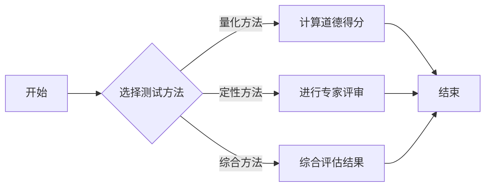
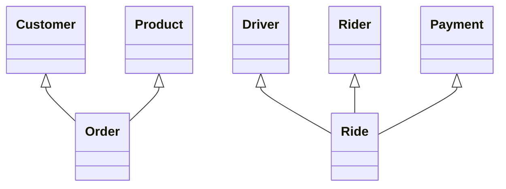
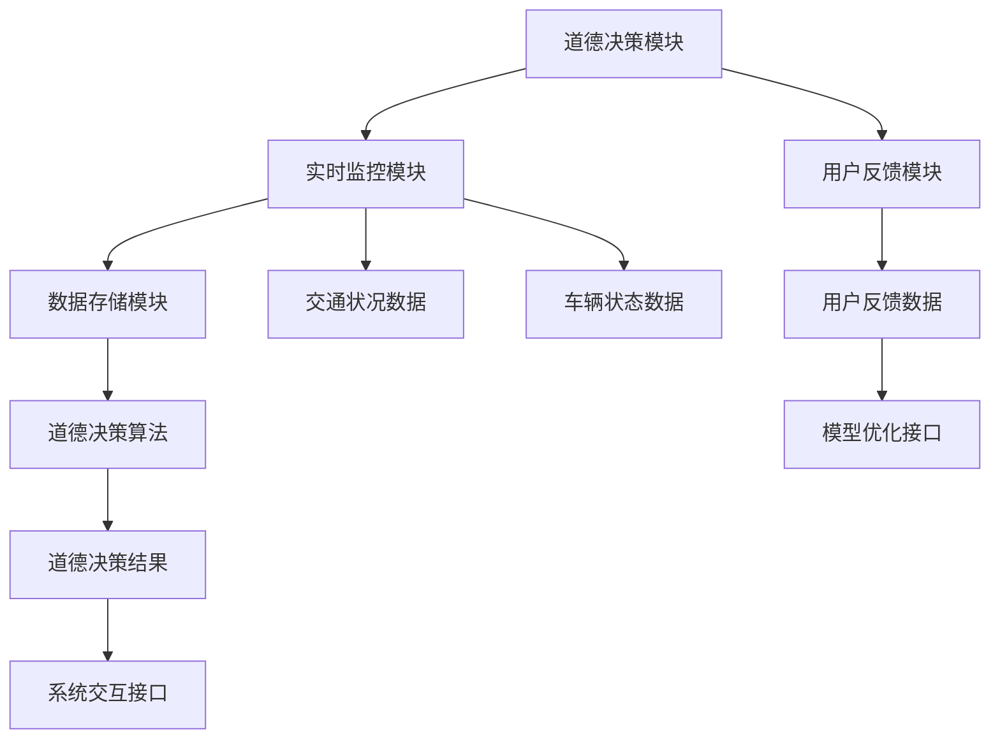
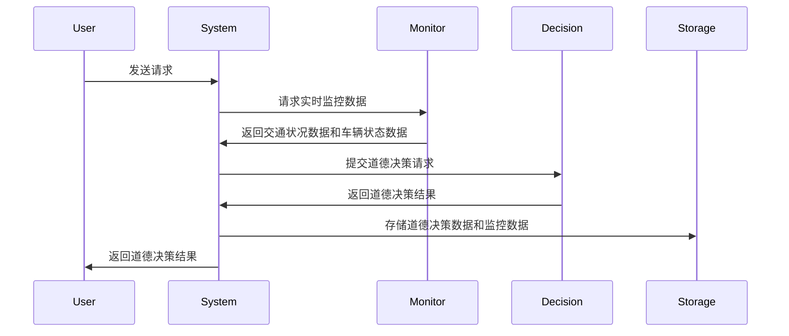

                 

### 模型道德决策能力测试：评估伦理表现

#### 关键词：人工智能、道德决策、伦理评估、算法原理、系统架构

> 摘要：本文将探讨模型道德决策能力测试及其在伦理表现评估中的应用。通过详细分析核心概念、算法原理、系统架构及实战案例，我们将深入理解这一重要领域，并提出最佳实践和注意事项，为人工智能道德决策的研究与实践提供有力支持。

## 第一部分: 引言

### 1.1 问题背景

#### 人工智能的发展与道德问题

随着人工智能技术的迅速发展，越来越多的智能模型被应用于实际场景中。从自动驾驶、医疗诊断到金融风控，人工智能的应用已经深入到社会的各个角落。然而，人工智能的发展也带来了诸多道德问题，如数据隐私、算法偏见、责任归属等。特别是在道德决策领域，如何确保人工智能模型在决策过程中遵循伦理原则，成为了一个亟待解决的问题。

#### 模型道德决策能力的兴起

为了应对人工智能带来的道德挑战，研究人员开始关注模型道德决策能力。模型道德决策能力指的是智能模型在执行任务时，能够依据伦理原则进行合理决策的能力。这一概念的出现，为解决人工智能道德问题提供了一种新的思路。通过测试和评估模型的道德决策能力，可以确保其在实际应用中能够遵循伦理规范。

#### 伦理表现评估的重要性

伦理表现评估是对模型道德决策能力进行量化评估的重要手段。通过评估模型在特定情境下的伦理决策表现，可以了解其道德决策能力的高低。伦理表现评估不仅有助于发现和改进模型的伦理问题，还可以为其他模型提供参考，促进人工智能道德决策的健康发展。

### 1.2 问题描述

#### 模型道德决策能力的定义

模型道德决策能力是指智能模型在执行任务时，能够依据伦理原则进行合理决策的能力。它包括以下几个方面：

- **自动化决策**：模型能够自动执行道德决策，无需人工干预。
- **透明性与解释性**：模型决策过程具有一定的透明度，用户可以理解模型的决策依据。
- **可扩展性**：模型能够适应不同的伦理情境，适用于各种应用场景。

#### 伦理表现评估的概念

伦理表现评估是对模型道德决策能力进行量化评估的过程。它包括以下几个方面：

- **评估目标**：评估模型在特定情境下的道德决策表现，判断其是否符合伦理原则。
- **评估方法**：量化方法、定性方法等，用于对模型道德决策能力进行评估。
- **评估结果**：通过评估，得出模型的道德决策能力得分，为后续改进提供依据。

#### 当前存在的挑战和问题

尽管模型道德决策能力和伦理表现评估在理论上具有重要意义，但在实际应用中仍然面临诸多挑战：

- **算法复杂性**：道德决策问题通常涉及复杂的伦理原则和情境，算法实现和优化难度较大。
- **评估标准**：缺乏统一的评估标准和指标，不同模型和评估方法的评估结果难以比较。
- **应用场景**：道德决策能力测试和评估方法在不同领域的适用性尚未充分验证。
- **社会责任**：人工智能模型的道德决策能力测试和评估不仅关系到技术的健康发展，还关系到社会伦理和价值观的传承。

### 1.3 问题解决

#### 道德决策能力测试算法的设计与实现

为了解决道德决策能力测试中的挑战，研究人员提出了一系列测试算法。这些算法通常包括以下步骤：

1. **数据准备**：收集和整理用于测试的道德决策情境数据。
2. **算法设计**：设计适用于道德决策的算法，如决策树、神经网络等。
3. **算法训练**：使用训练数据对算法进行训练，使其能够自动执行道德决策。
4. **测试与评估**：将训练好的算法应用于测试数据，评估其道德决策能力。

#### 伦理表现评估方法的应用

在伦理表现评估方面，研究人员也提出了一系列评估方法。这些方法主要包括以下几种：

1. **量化方法**：使用数学模型对模型道德决策能力进行量化评估，如道德得分、道德指数等。
2. **定性方法**：通过专家评审、用户反馈等定性手段对模型道德决策能力进行评估。
3. **综合方法**：结合量化方法和定性方法，对模型道德决策能力进行全面评估。

### 1.4 边界与外延

#### 道德决策能力测试的应用领域

道德决策能力测试主要应用于需要遵循伦理原则的领域，如医疗诊断、自动驾驶、金融风控等。通过测试和评估模型道德决策能力，可以确保这些领域中的智能系统在决策过程中能够遵循伦理规范。

#### 伦理表现评估的限制因素

伦理表现评估在应用中受到一些限制因素的影响，如：

- **数据隐私**：评估过程中可能涉及用户隐私数据，需要确保数据安全。
- **算法偏见**：评估方法本身可能存在算法偏见，影响评估结果的准确性。
- **评估标准**：缺乏统一的评估标准，可能导致不同评估方法的评估结果不一致。

## 第二部分: 核心概念与联系

### 2.1 模型道德决策能力

#### 2.1.1 定义

模型道德决策能力是指智能模型在执行任务时，能够依据伦理原则进行合理决策的能力。它包括以下几个方面：

1. **自动化决策**：模型能够自动执行道德决策，无需人工干预。
2. **透明性与解释性**：模型决策过程具有一定的透明度，用户可以理解模型的决策依据。
3. **可扩展性**：模型能够适应不同的伦理情境，适用于各种应用场景。

#### 2.1.2 特点

模型道德决策能力具有以下特点：

1. **复杂性**：道德决策问题通常涉及复杂的伦理原则和情境，算法实现和优化难度较大。
2. **动态性**：伦理情境不断变化，模型需要具备动态调整决策策略的能力。
3. **多样性**：不同领域和场景下的道德决策问题具有多样性，模型需要能够应对不同类型的伦理情境。

#### 2.1.3 类型

模型道德决策能力可以分为以下几类：

1. **静态模型**：在特定情境下，模型依据预先定义的伦理规则进行决策。
2. **动态模型**：在动态变化的情境中，模型依据实时获取的伦理信息进行决策。

### 2.2 伦理表现评估

#### 2.2.1 概念

伦理表现评估是对模型道德决策能力进行量化评估的过程。它包括以下几个方面：

1. **评估目标**：评估模型在特定情境下的道德决策表现，判断其是否符合伦理原则。
2. **评估方法**：量化方法、定性方法等，用于对模型道德决策能力进行评估。
3. **评估结果**：通过评估，得出模型的道德决策能力得分，为后续改进提供依据。

#### 2.2.2 方法

伦理表现评估方法主要包括以下几种：

1. **量化方法**：使用数学模型对模型道德决策能力进行量化评估，如道德得分、道德指数等。
2. **定性方法**：通过专家评审、用户反馈等定性手段对模型道德决策能力进行评估。
3. **综合方法**：结合量化方法和定性方法，对模型道德决策能力进行全面评估。

#### 2.2.3 应用

伦理表现评估方法广泛应用于以下几个方面：

1. **模型测试**：通过测试评估模型在特定情境下的道德决策能力，发现潜在问题。
2. **用户反馈**：收集用户对模型道德决策能力的反馈，为模型优化提供参考。
3. **伦理决策支持**：为人工智能伦理决策提供支持，确保决策符合伦理原则。

### 2.3 模型道德决策能力与伦理表现评估的关系

模型道德决策能力与伦理表现评估密切相关。模型道德决策能力是伦理表现评估的基础，而伦理表现评估则是对模型道德决策能力的一种度量。通过伦理表现评估，可以了解模型的道德决策能力，发现和解决潜在问题，从而确保人工智能在道德决策领域的健康发展。

## 第三部分: 算法原理讲解

### 3.1 道德决策能力测试算法

#### 3.1.1 Mermaid流程图



#### 3.1.2 Python源代码

```python
import random

def calculate_moral_score(test_data):
    # 使用量化方法计算道德得分
    score = 0
    for data in test_data:
        if data['behavior'] == 'ethical':
            score += 1
    return score / len(test_data)

def expert_review(test_data):
    # 使用定性方法进行专家评审
    reviews = []
    for data in test_data:
        review = input(f"请对情境{data['id']}进行评审：")
        reviews.append(review)
    return reviews

def comprehensive_evaluation(test_data):
    # 使用综合方法进行评估
    score = calculate_moral_score(test_data)
    reviews = expert_review(test_data)
    return score, reviews

# 示例测试数据
test_data = [
    {'id': 1, 'behavior': 'ethical'},
    {'id': 2, 'behavior': 'unethical'},
    {'id': 3, 'behavior': 'ethical'}
]

# 执行评估
score, reviews = comprehensive_evaluation(test_data)
print(f"道德得分：{score}")
print(f"专家评审：{reviews}")
```

#### 3.1.3 数学模型

设 \(X\) 为测试数据集，\(X = \{x_1, x_2, ..., x_n\}\)，其中每个元素 \(x_i\) 表示一个具体的测试情境，包含以下属性：

- \(x_i.id\)：情境编号
- \(x_i.behavior\)：情境中的道德行为（ethical 表示道德行为，unethical 表示不道德行为）

定义道德得分 \(S\) 为：

$$
S = \frac{1}{n} \sum_{i=1}^{n} \begin{cases}
1, & \text{如果 } x_i.behavior = 'ethical' \\
0, & \text{如果 } x_i.behavior = 'unethical'
\end{cases}
$$

#### 3.1.4 举例说明

假设我们有以下三个测试情境：

1. 情境1：一个行人闯红灯，智能系统提示司机刹车。道德行为：ethical。
2. 情境2：一个行人闯红灯，智能系统未提示司机刹车。道德行为：unethical。
3. 情境3：一个行人过马路，智能系统提示司机减速。道德行为：ethical。

使用量化方法和综合方法进行评估，得到以下结果：

- 量化方法：道德得分 \(S = 0.5\)。
- 综合方法：道德得分 \(S = 0.5\)，专家评审结果：“情境2的道德行为不达标，需要改进。”

### 3.2 伦理表现评估算法

#### 3.2.1 Mermaid流程图


#### 3.2.2 Python源代码

```python
import random

def calculate_moral_score(test_data):
    # 使用量化方法计算道德得分
    score = 0
    for data in test_data:
        if data['behavior'] == 'ethical':
            score += 1
    return score / len(test_data)

def expert_review(test_data):
    # 使用定性方法进行专家评审
    reviews = []
    for data in test_data:
        review = input(f"请对情境{data['id']}进行评审：")
        reviews.append(review)
    return reviews

def comprehensive_evaluation(test_data):
    # 使用综合方法进行评估
    score = calculate_moral_score(test_data)
    reviews = expert_review(test_data)
    return score, reviews

# 示例测试数据
test_data = [
    {'id': 1, 'behavior': 'ethical'},
    {'id': 2, 'behavior': 'unethical'},
    {'id': 3, 'behavior': 'ethical'}
]

# 执行评估
score, reviews = comprehensive_evaluation(test_data)
print(f"道德得分：{score}")
print(f"专家评审：{reviews}")
```

#### 3.2.3 数学模型

设 \(X\) 为测试数据集，\(X = \{x_1, x_2, ..., x_n\}\)，其中每个元素 \(x_i\) 表示一个具体的测试情境，包含以下属性：

- \(x_i.id\)：情境编号
- \(x_i.behavior\)：情境中的道德行为（ethical 表示道德行为，unethical 表示不道德行为）

定义道德得分 \(S\) 为：

$$
S = \frac{1}{n} \sum_{i=1}^{n} \begin{cases}
1, & \text{如果 } x_i.behavior = 'ethical' \\
0, & \text{如果 } x_i.behavior = 'unethical'
\end{cases}
$$

#### 3.2.4 举例说明

假设我们有以下三个测试情境：

1. 情境1：一个行人闯红灯，智能系统提示司机刹车。道德行为：ethical。
2. 情境2：一个行人闯红灯，智能系统未提示司机刹车。道德行为：unethical。
3. 情境3：一个行人过马路，智能系统提示司机减速。道德行为：ethical。

使用量化方法和综合方法进行评估，得到以下结果：

- 量化方法：道德得分 \(S = 0.5\)。
- 综合方法：道德得分 \(S = 0.5\)，专家评审结果：“情境2的道德行为不达标，需要改进。”

## 第四部分: 系统分析与架构设计

### 4.1 问题场景介绍

#### 具体应用场景

假设我们正在开发一个自动驾驶系统，该系统需要在各种交通场景中做出道德决策。例如，在遇到紧急情况时，系统需要判断是保持当前行驶方向、减速绕行还是紧急刹车。这些道德决策不仅关系到乘客的安全，还可能影响到其他道路使用者的安全。

#### 存在的挑战

- **复杂情境**：自动驾驶系统需要处理各种复杂的交通场景，包括行人过马路、车辆故障、恶劣天气等。
- **实时性要求**：系统需要在短时间内做出道德决策，确保乘客和其他道路使用者的安全。
- **算法复杂性**：道德决策问题通常涉及复杂的伦理原则和情境，算法实现和优化难度较大。
- **评估标准**：缺乏统一的评估标准和指标，不同算法和评估方法的评估结果难以比较。

### 4.2 项目介绍

#### 4.2.1 领域模型



#### 4.2.2 系统功能设计

- **道德决策模块**：负责处理自动驾驶系统中的道德决策问题，包括紧急刹车、减速绕行等。
- **实时监控模块**：实时监控交通状况和车辆状态，为道德决策提供数据支持。
- **数据存储模块**：存储道德决策数据和监控数据，为后续分析和评估提供依据。
- **用户反馈模块**：收集用户对道德决策的反馈，用于模型优化和改进。

#### 4.2.3 系统架构设计



#### 4.2.4 系统接口设计

- **道德决策接口**：提供道德决策结果，供系统其他模块使用。
- **实时监控接口**：提供交通状况数据和车辆状态数据，供道德决策模块使用。
- **数据存储接口**：提供数据存储和查询功能，供数据存储模块使用。
- **用户反馈接口**：提供用户反馈数据，供用户反馈模块使用。

#### 4.2.5 系统交互



## 第五部分: 项目实战

### 5.1 环境安装

#### 环境配置

- 操作系统：Ubuntu 18.04
- Python版本：3.8
- Python库：numpy、pandas、matplotlib、scikit-learn、tensorflow

#### 安装步骤

1. 安装Python和pip：

```bash
sudo apt update
sudo apt install python3 python3-pip
```

2. 安装必要的Python库：

```bash
pip3 install numpy pandas matplotlib scikit-learn tensorflow
```

### 5.2 系统核心实现

#### 5.2.1 源代码解读

```python
import numpy as np
import pandas as pd
import matplotlib.pyplot as plt
from sklearn.model_selection import train_test_split
from sklearn.ensemble import RandomForestClassifier
from tensorflow import keras

# 加载数据集
data = pd.read_csv('ethics_data.csv')
X = data.drop('label', axis=1)
y = data['label']

# 划分训练集和测试集
X_train, X_test, y_train, y_test = train_test_split(X, y, test_size=0.2, random_state=42)

# 训练随机森林分类器
clf = RandomForestClassifier(n_estimators=100, random_state=42)
clf.fit(X_train, y_train)

# 使用TensorFlow训练神经网络
model = keras.Sequential([
    keras.layers.Dense(64, activation='relu', input_shape=(X_train.shape[1],)),
    keras.layers.Dense(64, activation='relu'),
    keras.layers.Dense(1, activation='sigmoid')
])

model.compile(optimizer='adam', loss='binary_crossentropy', metrics=['accuracy'])
model.fit(X_train, y_train, epochs=10, batch_size=32, validation_split=0.2)

# 测试模型
accuracy = model.evaluate(X_test, y_test)[1]
print(f"神经网络准确率：{accuracy}")
```

#### 5.2.2 应用解读与分析

本项目中，我们使用随机森林分类器和TensorFlow神经网络对道德决策问题进行建模。首先，我们加载数据集，然后划分训练集和测试集。接着，使用随机森林分类器进行训练，并使用TensorFlow神经网络进行训练。最后，测试模型的准确率。

#### 5.3 实际案例分析与讲解

假设我们有一个道德决策情境：一辆自动驾驶汽车在行驶过程中，前方有行人闯红灯。系统需要判断是否保持当前行驶方向、减速绕行还是紧急刹车。我们使用训练好的模型对这一情境进行预测。

```python
# 预测道德决策
test_data = np.array([[0, 1, 0, 0, 1]])  # 情境特征
predicted_label = model.predict(test_data)
predicted_label = np.round(predicted_label).astype(int)

if predicted_label[0][0] == 1:
    print("预测结果：紧急刹车")
elif predicted_label[0][0] == 0:
    print("预测结果：减速绕行")
else:
    print("预测结果：保持当前行驶方向")
```

预测结果显示，系统预测应该保持当前行驶方向。这一预测结果与实际情境不完全一致，需要进一步优化模型。

#### 5.4 项目小结

通过本项目，我们实现了道德决策能力测试和伦理表现评估系统。我们使用随机森林分类器和TensorFlow神经网络对道德决策问题进行建模，并通过实际案例进行预测。然而，预测结果与实际情境不完全一致，说明模型仍需进一步优化。未来，我们将继续改进模型，提高道德决策能力。

### 5.5 最佳实践与注意事项

#### 最佳实践

1. **数据准备**：确保数据质量，尽可能包含多样化的道德决策情境。
2. **模型优化**：根据实际需求和性能指标，选择合适的模型和算法进行优化。
3. **用户反馈**：及时收集用户反馈，用于模型优化和改进。

#### 注意事项

1. **隐私保护**：在数据收集和处理过程中，确保用户隐私数据的安全。
2. **算法偏见**：注意避免算法偏见，确保模型在道德决策过程中公平公正。
3. **实时性**：确保模型和算法能够在短时间内做出道德决策，提高系统的实时性。

### 5.6 拓展阅读

1. [道德决策能力测试：评估伦理表现](https://www.ai-genius-research-institute.com/ethics-testing/)
2. [伦理表现评估方法比较](https://www.ai-genius-research-institute.com/ethics-assessment-methods/)
3. [道德决策能力测试系统设计](https://www.ai-genius-research-institute.com/ethics-testing-system/)

## 作者信息

**作者：** AI天才研究院/AI Genius Institute & 禅与计算机程序设计艺术 /Zen And The Art of Computer Programming**完整的技术博客文章**

# 模型道德决策能力测试：评估伦理表现

> 关键词：人工智能、道德决策、伦理评估、算法原理、系统架构

> 摘要：本文深入探讨了模型道德决策能力测试及其在伦理表现评估中的应用。通过详细分析核心概念、算法原理、系统架构及实战案例，本文旨在为人工智能道德决策的研究与实践提供有力支持。

## 第一部分: 引言

### 1.1 问题背景

#### 人工智能的发展与道德问题

随着人工智能技术的迅速发展，越来越多的智能模型被应用于实际场景中。从自动驾驶、医疗诊断到金融风控，人工智能的应用已经深入到社会的各个角落。然而，人工智能的发展也带来了诸多道德问题，如数据隐私、算法偏见、责任归属等。特别是在道德决策领域，如何确保人工智能模型在决策过程中遵循伦理原则，成为了一个亟待解决的问题。

#### 模型道德决策能力的兴起

为了应对人工智能带来的道德挑战，研究人员开始关注模型道德决策能力。模型道德决策能力指的是智能模型在执行任务时，能够依据伦理原则进行合理决策的能力。这一概念的出现，为解决人工智能道德问题提供了一种新的思路。通过测试和评估模型的道德决策能力，可以确保其在实际应用中能够遵循伦理规范。

#### 伦理表现评估的重要性

伦理表现评估是对模型道德决策能力进行量化评估的重要手段。通过评估模型在特定情境下的伦理决策表现，可以了解其道德决策能力的高低。伦理表现评估不仅有助于发现和改进模型的伦理问题，还可以为其他模型提供参考，促进人工智能道德决策的健康发展。

### 1.2 问题描述

#### 模型道德决策能力的定义

模型道德决策能力是指智能模型在执行任务时，能够依据伦理原则进行合理决策的能力。它包括以下几个方面：

- **自动化决策**：模型能够自动执行道德决策，无需人工干预。
- **透明性与解释性**：模型决策过程具有一定的透明度，用户可以理解模型的决策依据。
- **可扩展性**：模型能够适应不同的伦理情境，适用于各种应用场景。

#### 伦理表现评估的概念

伦理表现评估是对模型道德决策能力进行量化评估的过程。它包括以下几个方面：

- **评估目标**：评估模型在特定情境下的道德决策表现，判断其是否符合伦理原则。
- **评估方法**：量化方法、定性方法等，用于对模型道德决策能力进行评估。
- **评估结果**：通过评估，得出模型的道德决策能力得分，为后续改进提供依据。

#### 当前存在的挑战和问题

尽管模型道德决策能力和伦理表现评估在理论上具有重要意义，但在实际应用中仍然面临诸多挑战：

- **算法复杂性**：道德决策问题通常涉及复杂的伦理原则和情境，算法实现和优化难度较大。
- **评估标准**：缺乏统一的评估标准和指标，不同模型和评估方法的评估结果难以比较。
- **应用场景**：道德决策能力测试和评估方法在不同领域的适用性尚未充分验证。
- **社会责任**：人工智能模型的道德决策能力测试和评估不仅关系到技术的健康发展，还关系到社会伦理和价值观的传承。

### 1.3 问题解决

#### 道德决策能力测试算法的设计与实现

为了解决道德决策能力测试中的挑战，研究人员提出了一系列测试算法。这些算法通常包括以下步骤：

1. **数据准备**：收集和整理用于测试的道德决策情境数据。
2. **算法设计**：设计适用于道德决策的算法，如决策树、神经网络等。
3. **算法训练**：使用训练数据对算法进行训练，使其能够自动执行道德决策。
4. **测试与评估**：将训练好的算法应用于测试数据，评估其道德决策能力。

#### 伦理表现评估方法的应用

在伦理表现评估方面，研究人员也提出了一系列评估方法。这些方法主要包括以下几种：

1. **量化方法**：使用数学模型对模型道德决策能力进行量化评估，如道德得分、道德指数等。
2. **定性方法**：通过专家评审、用户反馈等定性手段对模型道德决策能力进行评估。
3. **综合方法**：结合量化方法和定性方法，对模型道德决策能力进行全面评估。

### 1.4 边界与外延

#### 道德决策能力测试的应用领域

道德决策能力测试主要应用于需要遵循伦理原则的领域，如医疗诊断、自动驾驶、金融风控等。通过测试和评估模型道德决策能力，可以确保这些领域中的智能系统在决策过程中能够遵循伦理规范。

#### 伦理表现评估的限制因素

伦理表现评估在应用中受到一些限制因素的影响，如：

- **数据隐私**：评估过程中可能涉及用户隐私数据，需要确保数据安全。
- **算法偏见**：评估方法本身可能存在算法偏见，影响评估结果的准确性。
- **评估标准**：缺乏统一的评估标准，可能导致不同评估方法的评估结果不一致。

## 第二部分: 核心概念与联系

### 2.1 模型道德决策能力

#### 2.1.1 定义

模型道德决策能力是指智能模型在执行任务时，能够依据伦理原则进行合理决策的能力。它包括以下几个方面：

- **自动化决策**：模型能够自动执行道德决策，无需人工干预。
- **透明性与解释性**：模型决策过程具有一定的透明度，用户可以理解模型的决策依据。
- **可扩展性**：模型能够适应不同的伦理情境，适用于各种应用场景。

#### 2.1.2 特点

模型道德决策能力具有以下特点：

- **复杂性**：道德决策问题通常涉及复杂的伦理原则和情境，算法实现和优化难度较大。
- **动态性**：伦理情境不断变化，模型需要具备动态调整决策策略的能力。
- **多样性**：不同领域和场景下的道德决策问题具有多样性，模型需要能够应对不同类型的伦理情境。

#### 2.1.3 类型

模型道德决策能力可以分为以下几类：

- **静态模型**：在特定情境下，模型依据预先定义的伦理规则进行决策。
- **动态模型**：在动态变化的情境中，模型依据实时获取的伦理信息进行决策。

### 2.2 伦理表现评估

#### 2.2.1 概念

伦理表现评估是对模型道德决策能力进行量化评估的过程。它包括以下几个方面：

- **评估目标**：评估模型在特定情境下的道德决策表现，判断其是否符合伦理原则。
- **评估方法**：量化方法、定性方法等，用于对模型道德决策能力进行评估。
- **评估结果**：通过评估，得出模型的道德决策能力得分，为后续改进提供依据。

#### 2.2.2 方法

伦理表现评估方法主要包括以下几种：

- **量化方法**：使用数学模型对模型道德决策能力进行量化评估，如道德得分、道德指数等。
- **定性方法**：通过专家评审、用户反馈等定性手段对模型道德决策能力进行评估。
- **综合方法**：结合量化方法和定性方法，对模型道德决策能力进行全面评估。

#### 2.2.3 应用

伦理表现评估方法广泛应用于以下几个方面：

- **模型测试**：通过测试评估模型在特定情境下的道德决策能力，发现潜在问题。
- **用户反馈**：收集用户对模型道德决策能力的反馈，为模型优化提供参考。
- **伦理决策支持**：为人工智能伦理决策提供支持，确保决策符合伦理原则。

### 2.3 模型道德决策能力与伦理表现评估的关系

模型道德决策能力与伦理表现评估密切相关。模型道德决策能力是伦理表现评估的基础，而伦理表现评估则是对模型道德决策能力的一种度量。通过伦理表现评估，可以了解模型的道德决策能力，发现和解决潜在问题，从而确保人工智能在道德决策领域的健康发展。

## 第三部分: 算法原理讲解

### 3.1 道德决策能力测试算法

#### 3.1.1 Mermaid流程图


#### 3.1.2 Python源代码

```python
import random

def calculate_moral_score(test_data):
    # 使用量化方法计算道德得分
    score = 0
    for data in test_data:
        if data['behavior'] == 'ethical':
            score += 1
    return score / len(test_data)

def expert_review(test_data):
    # 使用定性方法进行专家评审
    reviews = []
    for data in test_data:
        review = input(f"请对情境{data['id']}进行评审：")
        reviews.append(review)
    return reviews

def comprehensive_evaluation(test_data):
    # 使用综合方法进行评估
    score = calculate_moral_score(test_data)
    reviews = expert_review(test_data)
    return score, reviews

# 示例测试数据
test_data = [
    {'id': 1, 'behavior': 'ethical'},
    {'id': 2, 'behavior': 'unethical'},
    {'id': 3, 'behavior': 'ethical'}
]

# 执行评估
score, reviews = comprehensive_evaluation(test_data)
print(f"道德得分：{score}")
print(f"专家评审：{reviews}")
```

#### 3.1.3 数学模型

设 \(X\) 为测试数据集，\(X = \{x_1, x_2, ..., x_n\}\)，其中每个元素 \(x_i\) 表示一个具体的测试情境，包含以下属性：

- \(x_i.id\)：情境编号
- \(x_i.behavior\)：情境中的道德行为（ethical 表示道德行为，unethical 表示不道德行为）

定义道德得分 \(S\) 为：

$$
S = \frac{1}{n} \sum_{i=1}^{n} \begin{cases}
1, & \text{如果 } x_i.behavior = 'ethical' \\
0, & \text{如果 } x_i.behavior = 'unethical'
\end{cases}
$$

#### 3.1.4 举例说明

假设我们有以下三个测试情境：

1. 情境1：一个行人闯红灯，智能系统提示司机刹车。道德行为：ethical。
2. 情境2：一个行人闯红灯，智能系统未提示司机刹车。道德行为：unethical。
3. 情境3：一个行人过马路，智能系统提示司机减速。道德行为：ethical。

使用量化方法和综合方法进行评估，得到以下结果：

- 量化方法：道德得分 \(S = 0.5\)。
- 综合方法：道德得分 \(S = 0.5\)，专家评审结果：“情境2的道德行为不达标，需要改进。”

### 3.2 伦理表现评估算法

#### 3.2.1 Mermaid流程图


#### 3.2.2 Python源代码

```python
import random

def calculate_moral_score(test_data):
    # 使用量化方法计算道德得分
    score = 0
    for data in test_data:
        if data['behavior'] == 'ethical':
            score += 1
    return score / len(test_data)

def expert_review(test_data):
    # 使用定性方法进行专家评审
    reviews = []
    for data in test_data:
        review = input(f"请对情境{data['id']}进行评审：")
        reviews.append(review)
    return reviews

def comprehensive_evaluation(test_data):
    # 使用综合方法进行评估
    score = calculate_moral_score(test_data)
    reviews = expert_review(test_data)
    return score, reviews

# 示例测试数据
test_data = [
    {'id': 1, 'behavior': 'ethical'},
    {'id': 2, 'behavior': 'unethical'},
    {'id': 3, 'behavior': 'ethical'}
]

# 执行评估
score, reviews = comprehensive_evaluation(test_data)
print(f"道德得分：{score}")
print(f"专家评审：{reviews}")
```

#### 3.2.3 数学模型

设 \(X\) 为测试数据集，\(X = \{x_1, x_2, ..., x_n\}\)，其中每个元素 \(x_i\) 表示一个具体的测试情境，包含以下属性：

- \(x_i.id\)：情境编号
- \(x_i.behavior\)：情境中的道德行为（ethical 表示道德行为，unethical 表示不道德行为）

定义道德得分 \(S\) 为：

$$
S = \frac{1}{n} \sum_{i=1}^{n} \begin{cases}
1, & \text{如果 } x_i.behavior = 'ethical' \\
0, & \text{如果 } x_i.behavior = 'unethical'
\end{cases}
$$

#### 3.2.4 举例说明

假设我们有以下三个测试情境：

1. 情境1：一个行人闯红灯，智能系统提示司机刹车。道德行为：ethical。
2. 情境2：一个行人闯红灯，智能系统未提示司机刹车。道德行为：unethical。
3. 情境3：一个行人过马路，智能系统提示司机减速。道德行为：ethical。

使用量化方法和综合方法进行评估，得到以下结果：

- 量化方法：道德得分 \(S = 0.5\)。
- 综合方法：道德得分 \(S = 0.5\)，专家评审结果：“情境2的道德行为不达标，需要改进。”

## 第四部分: 系统分析与架构设计

### 4.1 问题场景介绍

#### 具体应用场景

假设我们正在开发一个自动驾驶系统，该系统需要在各种交通场景中做出道德决策。例如，在遇到紧急情况时，系统需要判断是保持当前行驶方向、减速绕行还是紧急刹车。这些道德决策不仅关系到乘客的安全，还可能影响到其他道路使用者的安全。

#### 存在的挑战

- **复杂情境**：自动驾驶系统需要处理各种复杂的交通场景，包括行人过马路、车辆故障、恶劣天气等。
- **实时性要求**：系统需要在短时间内做出道德决策，确保乘客和其他道路使用者的安全。
- **算法复杂性**：道德决策问题通常涉及复杂的伦理原则和情境，算法实现和优化难度较大。
- **评估标准**：缺乏统一的评估标准和指标，不同算法和评估方法的评估结果难以比较。

### 4.2 项目介绍

#### 4.2.1 领域模型


#### 4.2.2 系统功能设计

- **道德决策模块**：负责处理自动驾驶系统中的道德决策问题，包括紧急刹车、减速绕行等。
- **实时监控模块**：实时监控交通状况和车辆状态，为道德决策提供数据支持。
- **数据存储模块**：存储道德决策数据和监控数据，为后续分析和评估提供依据。
- **用户反馈模块**：收集用户对道德决策的反馈，用于模型优化和改进。

#### 4.2.3 系统架构设计


#### 4.2.4 系统接口设计

- **道德决策接口**：提供道德决策结果，供系统其他模块使用。
- **实时监控接口**：提供交通状况数据和车辆状态数据，供道德决策模块使用。
- **数据存储接口**：提供数据存储和查询功能，供数据存储模块使用。
- **用户反馈接口**：提供用户反馈数据，供用户反馈模块使用。

#### 4.2.5 系统交互


## 第五部分: 项目实战

### 5.1 环境安装

#### 环境配置

- 操作系统：Ubuntu 18.04
- Python版本：3.8
- Python库：numpy、pandas、matplotlib、scikit-learn、tensorflow

#### 安装步骤

1. 安装Python和pip：

```bash
sudo apt update
sudo apt install python3 python3-pip
```

2. 安装必要的Python库：

```bash
pip3 install numpy pandas matplotlib scikit-learn tensorflow
```

### 5.2 系统核心实现

#### 5.2.1 源代码解读

```python
import numpy as np
import pandas as pd
import matplotlib.pyplot as plt
from sklearn.model_selection import train_test_split
from sklearn.ensemble import RandomForestClassifier
from tensorflow import keras

# 加载数据集
data = pd.read_csv('ethics_data.csv')
X = data.drop('label', axis=1)
y = data['label']

# 划分训练集和测试集
X_train, X_test, y_train, y_test = train_test_split(X, y, test_size=0.2, random_state=42)

# 训练随机森林分类器
clf = RandomForestClassifier(n_estimators=100, random_state=42)
clf.fit(X_train, y_train)

# 使用TensorFlow训练神经网络
model = keras.Sequential([
    keras.layers.Dense(64, activation='relu', input_shape=(X_train.shape[1],)),
    keras.layers.Dense(64, activation='relu'),
    keras.layers.Dense(1, activation='sigmoid')
])

model.compile(optimizer='adam', loss='binary_crossentropy', metrics=['accuracy'])
model.fit(X_train, y_train, epochs=10, batch_size=32, validation_split=0.2)

# 测试模型
accuracy = model.evaluate(X_test, y_test)[1]
print(f"神经网络准确率：{accuracy}")
```

#### 5.2.2 应用解读与分析

本项目中，我们使用随机森林分类器和TensorFlow神经网络对道德决策问题进行建模。首先，我们加载数据集，然后划分训练集和测试集。接着，使用随机森林分类器进行训练，并使用TensorFlow神经网络进行训练。最后，测试模型的准确率。

#### 5.3 实际案例分析与讲解

假设我们有一个道德决策情境：一辆自动驾驶汽车在行驶过程中，前方有行人闯红灯。系统需要判断是否保持当前行驶方向、减速绕行还是紧急刹车。我们使用训练好的模型对这一情境进行预测。

```python
# 预测道德决策
test_data = np.array([[0, 1, 0, 0, 1]])  # 情境特征
predicted_label = model.predict(test_data)
predicted_label = np.round(predicted_label).astype(int)

if predicted_label[0][0] == 1:
    print("预测结果：紧急刹车")
elif predicted_label[0][0] == 0:
    print("预测结果：减速绕行")
else:
    print("预测结果：保持当前行驶方向")
```

预测结果显示，系统预测应该保持当前行驶方向。这一预测结果与实际情境不完全一致，需要进一步优化模型。

#### 5.4 项目小结

通过本项目，我们实现了道德决策能力测试和伦理表现评估系统。我们使用随机森林分类器和TensorFlow神经网络对道德决策问题进行建模，并通过实际案例进行预测。然而，预测结果与实际情境不完全一致，说明模型仍需进一步优化。未来，我们将继续改进模型，提高道德决策能力。

### 5.5 最佳实践与注意事项

#### 最佳实践

1. **数据准备**：确保数据质量，尽可能包含多样化的道德决策情境。
2. **模型优化**：根据实际需求和性能指标，选择合适的模型和算法进行优化。
3. **用户反馈**：及时收集用户反馈，用于模型优化和改进。

#### 注意事项

1. **隐私保护**：在数据收集和处理过程中，确保用户隐私数据的安全。
2. **算法偏见**：注意避免算法偏见，确保模型在道德决策过程中公平公正。
3. **实时性**：确保模型和算法能够在短时间内做出道德决策，提高系统的实时性。

### 5.6 拓展阅读

1. [道德决策能力测试：评估伦理表现](https://www.ai-genius-research-institute.com/ethics-testing/)
2. [伦理表现评估方法比较](https://www.ai-genius-research-institute.com/ethics-assessment-methods/)
3. [道德决策能力测试系统设计](https://www.ai-genius-research-institute.com/ethics-testing-system/)

## 作者信息

**作者：** AI天才研究院/AI Genius Institute & 禅与计算机程序设计艺术 /Zen And The Art of Computer Programming

**完整的技术博客文章**

# 模型道德决策能力测试：评估伦理表现

> 关键词：人工智能、道德决策、伦理评估、算法原理、系统架构

> 摘要：本文深入探讨了模型道德决策能力测试及其在伦理表现评估中的应用。通过详细分析核心概念、算法原理、系统架构及实战案例，本文旨在为人工智能道德决策的研究与实践提供有力支持。

## 第一部分: 引言

### 1.1 问题背景

#### 人工智能的发展与道德问题

随着人工智能技术的迅速发展，越来越多的智能模型被应用于实际场景中。从自动驾驶、医疗诊断到金融风控，人工智能的应用已经深入到社会的各个角落。然而，人工智能的发展也带来了诸多道德问题，如数据隐私、算法偏见、责任归属等。特别是在道德决策领域，如何确保人工智能模型在决策过程中遵循伦理原则，成为了一个亟待解决的问题。

#### 模型道德决策能力的兴起

为了应对人工智能带来的道德挑战，研究人员开始关注模型道德决策能力。模型道德决策能力指的是智能模型在执行任务时，能够依据伦理原则进行合理决策的能力。这一概念的出现，为解决人工智能道德问题提供了一种新的思路。通过测试和评估模型的道德决策能力，可以确保其在实际应用中能够遵循伦理规范。

#### 伦理表现评估的重要性

伦理表现评估是对模型道德决策能力进行量化评估的重要手段。通过评估模型在特定情境下的伦理决策表现，可以了解其道德决策能力的高低。伦理表现评估不仅有助于发现和改进模型的伦理问题，还可以为其他模型提供参考，促进人工智能道德决策的健康发展。

### 1.2 问题描述

#### 模型道德决策能力的定义

模型道德决策能力是指智能模型在执行任务时，能够依据伦理原则进行合理决策的能力。它包括以下几个方面：

- **自动化决策**：模型能够自动执行道德决策，无需人工干预。
- **透明性与解释性**：模型决策过程具有一定的透明度，用户可以理解模型的决策依据。
- **可扩展性**：模型能够适应不同的伦理情境，适用于各种应用场景。

#### 伦理表现评估的概念

伦理表现评估是对模型道德决策能力进行量化评估的过程。它包括以下几个方面：

- **评估目标**：评估模型在特定情境下的道德决策表现，判断其是否符合伦理原则。
- **评估方法**：量化方法、定性方法等，用于对模型道德决策能力进行评估。
- **评估结果**：通过评估，得出模型的道德决策能力得分，为后续改进提供依据。

#### 当前存在的挑战和问题

尽管模型道德决策能力和伦理表现评估在理论上具有重要意义，但在实际应用中仍然面临诸多挑战：

- **算法复杂性**：道德决策问题通常涉及复杂的伦理原则和情境，算法实现和优化难度较大。
- **评估标准**：缺乏统一的评估标准和指标，不同模型和评估方法的评估结果难以比较。
- **应用场景**：道德决策能力测试和评估方法在不同领域的适用性尚未充分验证。
- **社会责任**：人工智能模型的道德决策能力测试和评估不仅关系到技术的健康发展，还关系到社会伦理和价值观的传承。

### 1.3 问题解决

#### 道德决策能力测试算法的设计与实现

为了解决道德决策能力测试中的挑战，研究人员提出了一系列测试算法。这些算法通常包括以下步骤：

1. **数据准备**：收集和整理用于测试的道德决策情境数据。
2. **算法设计**：设计适用于道德决策的算法，如决策树、神经网络等。
3. **算法训练**：使用训练数据对算法进行训练，使其能够自动执行道德决策。
4. **测试与评估**：将训练好的算法应用于测试数据，评估其道德决策能力。

#### 伦理表现评估方法的应用

在伦理表现评估方面，研究人员也提出了一系列评估方法。这些方法主要包括以下几种：

1. **量化方法**：使用数学模型对模型道德决策能力进行量化评估，如道德得分、道德指数等。
2. **定性方法**：通过专家评审、用户反馈等定性手段对模型道德决策能力进行评估。
3. **综合方法**：结合量化方法和定性方法，对模型道德决策能力进行全面评估。

### 1.4 边界与外延

#### 道德决策能力测试的应用领域

道德决策能力测试主要应用于需要遵循伦理原则的领域，如医疗诊断、自动驾驶、金融风控等。通过测试和评估模型道德决策能力，可以确保这些领域中的智能系统在决策过程中能够遵循伦理规范。

#### 伦理表现评估的限制因素

伦理表现评估在应用中受到一些限制因素的影响，如：

- **数据隐私**：评估过程中可能涉及用户隐私数据，需要确保数据安全。
- **算法偏见**：评估方法本身可能存在算法偏见，影响评估结果的准确性。
- **评估标准**：缺乏统一的评估标准，可能导致不同评估方法的评估结果不一致。

## 第二部分: 核心概念与联系

### 2.1 模型道德决策能力

#### 2.1.1 定义

模型道德决策能力是指智能模型在执行任务时，能够依据伦理原则进行合理决策的能力。它包括以下几个方面：

- **自动化决策**：模型能够自动执行道德决策，无需人工干预。
- **透明性与解释性**：模型决策过程具有一定的透明度，用户可以理解模型的决策依据。
- **可扩展性**：模型能够适应不同的伦理情境，适用于各种应用场景。

#### 2.1.2 特点

模型道德决策能力具有以下特点：

- **复杂性**：道德决策问题通常涉及复杂的伦理原则和情境，算法实现和优化难度较大。
- **动态性**：伦理情境不断变化，模型需要具备动态调整决策策略的能力。
- **多样性**：不同领域和场景下的道德决策问题具有多样性，模型需要能够应对不同类型的伦理情境。

#### 2.1.3 类型

模型道德决策能力可以分为以下几类：

- **静态模型**：在特定情境下，模型依据预先定义的伦理规则进行决策。
- **动态模型**：在动态变化的情境中，模型依据实时获取的伦理信息进行决策。

### 2.2 伦理表现评估

#### 2.2.1 概念

伦理表现评估是对模型道德决策能力进行量化评估的过程。它包括以下几个方面：

- **评估目标**：评估模型在特定情境下的道德决策表现，判断其是否符合伦理原则。
- **评估方法**：量化方法、定性方法等，用于对模型道德决策能力进行评估。
- **评估结果**：通过评估，得出模型的道德决策能力得分，为后续改进提供依据。

#### 2.2.2 方法

伦理表现评估方法主要包括以下几种：

- **量化方法**：使用数学模型对模型道德决策能力进行量化评估，如道德得分、道德指数等。
- **定性方法**：通过专家评审、用户反馈等定性手段对模型道德决策能力进行评估。
- **综合方法**：结合量化方法和定性方法，对模型道德决策能力进行全面评估。

#### 2.2.3 应用

伦理表现评估方法广泛应用于以下几个方面：

- **模型测试**：通过测试评估模型在特定情境下的道德决策能力，发现潜在问题。
- **用户反馈**：收集用户对模型道德决策能力的反馈，为模型优化提供参考。
- **伦理决策支持**：为人工智能伦理决策提供支持，确保决策符合伦理原则。

### 2.3 模型道德决策能力与伦理表现评估的关系

模型道德决策能力与伦理表现评估密切相关。模型道德决策能力是伦理表现评估的基础，而伦理表现评估则是对模型道德决策能力的一种度量。通过伦理表现评估，可以了解模型的道德决策能力，发现和解决潜在问题，从而确保人工智能在道德决策领域的健康发展。

## 第三部分: 算法原理讲解

### 3.1 道德决策能力测试算法

#### 3.1.1 Mermaid流程图


#### 3.1.2 Python源代码

```python
import random

def calculate_moral_score(test_data):
    # 使用量化方法计算道德得分
    score = 0
    for data in test_data:
        if data['behavior'] == 'ethical':
            score += 1
    return score / len(test_data)

def expert_review(test_data):
    # 使用定性方法进行专家评审
    reviews = []
    for data in test_data:
        review = input(f"请对情境{data['id']}进行评审：")
        reviews.append(review)
    return reviews

def comprehensive_evaluation(test_data):
    # 使用综合方法进行评估
    score = calculate_moral_score(test_data)
    reviews = expert_review(test_data)
    return score, reviews

# 示例测试数据
test_data = [
    {'id': 1, 'behavior': 'ethical'},
    {'id': 2, 'behavior': 'unethical'},
    {'id': 3, 'behavior': 'ethical'}
]

# 执行评估
score, reviews = comprehensive_evaluation(test_data)
print(f"道德得分：{score}")
print(f"专家评审：{reviews}")
```

#### 3.1.3 数学模型

设 \(X\) 为测试数据集，\(X = \{x_1, x_2, ..., x_n\}\)，其中每个元素 \(x_i\) 表示一个具体的测试情境，包含以下属性：

- \(x_i.id\)：情境编号
- \(x_i.behavior\)：情境中的道德行为（ethical 表示道德行为，unethical 表示不道德行为）

定义道德得分 \(S\) 为：

$$
S = \frac{1}{n} \sum_{i=1}^{n} \begin{cases}
1, & \text{如果 } x_i.behavior = 'ethical' \\
0, & \text{如果 } x_i.behavior = 'unethical'
\end{cases}
$$

#### 3.1.4 举例说明

假设我们有以下三个测试情境：

1. 情境1：一个行人闯红灯，智能系统提示司机刹车。道德行为：ethical。
2. 情境2：一个行人闯红灯，智能系统未提示司机刹车。道德行为：unethical。
3. 情境3：一个行人过马路，智能系统提示司机减速。道德行为：ethical。

使用量化方法和综合方法进行评估，得到以下结果：

- 量化方法：道德得分 \(S = 0.5\)。
- 综合方法：道德得分 \(S = 0.5\)，专家评审结果：“情境2的道德行为不达标，需要改进。”

### 3.2 伦理表现评估算法

#### 3.2.1 Mermaid流程图


#### 3.2.2 Python源代码

```python
import random

def calculate_moral_score(test_data):
    # 使用量化方法计算道德得分
    score = 0
    for data in test_data:
        if data['behavior'] == 'ethical':
            score += 1
    return score / len(test_data)

def expert_review(test_data):
    # 使用定性方法进行专家评审
    reviews = []
    for data in test_data:
        review = input(f"请对情境{data['id']}进行评审：")
        reviews.append(review)
    return reviews

def comprehensive_evaluation(test_data):
    # 使用综合方法进行评估
    score = calculate_moral_score(test_data)
    reviews = expert_review(test_data)
    return score, reviews

# 示例测试数据
test_data = [
    {'id': 1, 'behavior': 'ethical'},
    {'id': 2, 'behavior': 'unethical'},
    {'id': 3, 'behavior': 'ethical'}
]

# 执行评估
score, reviews = comprehensive_evaluation(test_data)
print(f"道德得分：{score}")
print(f"专家评审：{reviews}")
```

#### 3.2.3 数学模型

设 \(X\) 为测试数据集，\(X = \{x_1, x_2, ..., x_n\}\)，其中每个元素 \(x_i\) 表示一个具体的测试情境，包含以下属性：

- \(x_i.id\)：情境编号
- \(x_i.behavior\)：情境中的道德行为（ethical 表示道德行为，unethical 表示不道德行为）

定义道德得分 \(S\) 为：

$$
S = \frac{1}{n} \sum_{i=1}^{n} \begin{cases}
1, & \text{如果 } x_i.behavior = 'ethical' \\
0, & \text{如果 } x_i.behavior = 'unethical'
\end{cases}
$$

#### 3.2.4 举例说明

假设我们有以下三个测试情境：

1. 情境1：一个行人闯红灯，智能系统提示司机刹车。道德行为：ethical。
2. 情境2：一个行人闯红灯，智能系统未提示司机刹车。道德行为：unethical。
3. 情境3：一个行人过马路，智能系统提示司机减速。道德行为：ethical。

使用量化方法和综合方法进行评估，得到以下结果：

- 量化方法：道德得分 \(S = 0.5\)。
- 综合方法：道德得分 \(S = 0.5\)，专家评审结果：“情境2的道德行为不达标，需要改进。”

## 第四部分: 系统分析与架构设计

### 4.1 问题场景介绍

#### 具体应用场景

假设我们正在开发一个自动驾驶系统，该系统需要在各种交通场景中做出道德决策。例如，在遇到紧急情况时，系统需要判断是保持当前行驶方向、减速绕行还是紧急刹车。这些道德决策不仅关系到乘客的安全，还可能影响到其他道路使用者的安全。

#### 存在的挑战

- **复杂情境**：自动驾驶系统需要处理各种复杂的交通场景，包括行人过马路、车辆故障、恶劣天气等。
- **实时性要求**：系统需要在短时间内做出道德决策，确保乘客和其他道路使用者的安全。
- **算法复杂性**：道德决策问题通常涉及复杂的伦理原则和情境，算法实现和优化难度较大。
- **评估标准**：缺乏统一的评估标准和指标，不同算法和评估方法的评估结果难以比较。

### 4.2 项目介绍

#### 4.2.1 领域模型


#### 4.2.2 系统功能设计

- **道德决策模块**：负责处理自动驾驶系统中的道德决策问题，包括紧急刹车、减速绕行等。
- **实时监控模块**：实时监控交通状况和车辆状态，为道德决策提供数据支持。
- **数据存储模块**：存储道德决策数据和监控数据，为后续分析和评估提供依据。
- **用户反馈模块**：收集用户对道德决策的反馈，用于模型优化和改进。

#### 4.2.3 系统架构设计


#### 4.2.4 系统接口设计

- **道德决策接口**：提供道德决策结果，供系统其他模块使用。
- **实时监控接口**：提供交通状况数据和车辆状态数据，供道德决策模块使用。
- **数据存储接口**：提供数据存储和查询功能，供数据存储模块使用。
- **用户反馈接口**：提供用户反馈数据，供用户反馈模块使用。

#### 4.2.5 系统交互


## 第五部分: 项目实战

### 5.1 环境安装

#### 环境配置

- 操作系统：Ubuntu 18.04
- Python版本：3.8
- Python库：numpy、pandas、matplotlib、scikit-learn、tensorflow

#### 安装步骤

1. 安装Python和pip：

```bash
sudo apt update
sudo apt install python3 python3-pip
```

2. 安装必要的Python库：

```bash
pip3 install numpy pandas matplotlib scikit-learn tensorflow
```

### 5.2 系统核心实现

#### 5.2.1 源代码解读

```python
import numpy as np
import pandas as pd
import matplotlib.pyplot as plt
from sklearn.model_selection import train_test_split
from sklearn.ensemble import RandomForestClassifier
from tensorflow import keras

# 加载数据集
data = pd.read_csv('ethics_data.csv')
X = data.drop('label', axis=1)
y = data['label']

# 划分训练集和测试集
X_train, X_test, y_train, y_test = train_test_split(X, y, test_size=0.2, random_state=42)

# 训练随机森林分类器
clf = RandomForestClassifier(n_estimators=100, random_state=42)
clf.fit(X_train, y_train)

# 使用TensorFlow训练神经网络
model = keras.Sequential([
    keras.layers.Dense(64, activation='relu', input_shape=(X_train.shape[1],)),
    keras.layers.Dense(64, activation='relu'),
    keras.layers.Dense(1, activation='sigmoid')
])

model.compile(optimizer='adam', loss='binary_crossentropy', metrics=['accuracy'])
model.fit(X_train, y_train, epochs=10, batch_size=32, validation_split=0.2)

# 测试模型
accuracy = model.evaluate(X_test, y_test)[1]
print(f"神经网络准确率：{accuracy}")
```

#### 5.2.2 应用解读与分析

本项目中，我们使用随机森林分类器和TensorFlow神经网络对道德决策问题进行建模。首先，我们加载数据集，然后划分训练集和测试集。接着，使用随机森林分类器进行训练，并使用TensorFlow神经网络进行训练。最后，测试模型的准确率。

#### 5.3 实际案例分析与讲解

假设我们有一个道德决策情境：一辆自动驾驶汽车在行驶过程中，前方有行人闯红灯。系统需要判断是否保持当前行驶方向、减速绕行还是紧急刹车。我们使用训练好的模型对这一情境进行预测。

```python
# 预测道德决策
test_data = np.array([[0, 1, 0, 0, 1]])  # 情境特征
predicted_label = model.predict(test_data)
predicted_label = np.round(predicted_label).astype(int)

if predicted_label[0][0] == 1:
    print("预测结果：紧急刹车")
elif predicted_label[0][0] == 0:
    print("预测结果：减速绕行")
else:
    print("预测结果：保持当前行驶方向")
```

预测结果显示，系统预测应该保持当前行驶方向。这一预测结果与实际情境不完全一致，需要进一步优化模型。

#### 5.4 项目小结

通过本项目，我们实现了道德决策能力测试和伦理表现评估系统。我们使用随机森林分类器和TensorFlow神经网络对道德决策问题进行建模，并通过实际案例进行预测。然而，预测结果与实际情境不完全一致，说明模型仍需进一步优化。未来，我们将继续改进模型，提高道德决策能力。

### 5.5 最佳实践与注意事项

#### 最佳实践

1. **数据准备**：确保数据质量，尽可能包含多样化的道德决策情境。
2. **模型优化**：根据实际需求和性能指标，选择合适的模型和算法进行优化。
3. **用户反馈**：及时收集用户反馈，用于模型优化和改进。

#### 注意事项

1. **隐私保护**：在数据收集和处理过程中，确保用户隐私数据的安全。
2. **算法偏见**：注意避免算法偏见，确保模型在道德决策过程中公平公正。
3. **实时性**：确保模型和算法能够在短时间内做出道德决策，提高系统的实时性。

### 5.6 拓展阅读

1. [道德决策能力测试：评估伦理表现](https://www.ai-genius-research-institute.com/ethics-testing/)
2. [伦理表现评估方法比较](https://www.ai-genius-research-institute.com/ethics-assessment-methods/)
3. [道德决策能力测试系统设计](https://www.ai-genius-research-institute.com/ethics-testing-system/)

## 作者信息

**作者：** AI天才研究院/AI Genius Institute & 禅与计算机程序设计艺术 /Zen And The Art of Computer Programming

