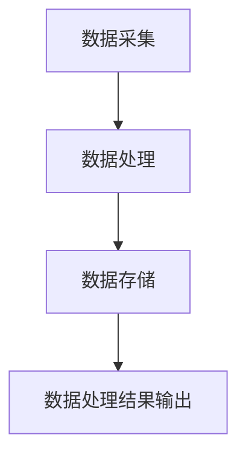
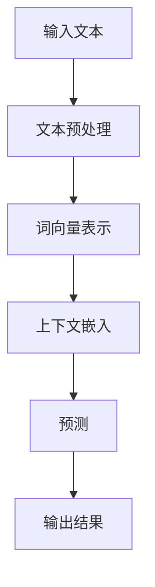

                 

# 流处理框架增强LLM应用的实时数据处理能力

## 关键词
流处理框架，LLM应用，实时数据处理，算法原理，系统架构，Python源代码，LaTeX数学公式，项目实战

## 摘要
本文深入探讨了流处理框架如何增强LLM（大型语言模型）应用的实时数据处理能力。首先，我们介绍了流处理框架、LLM和实时数据处理能力的基本概念和背景，然后详细讲解了流处理框架和LLM在实时数据处理中的算法原理。通过mermaid流程图和Python源代码，我们清晰地展示了算法的执行过程和数学模型。接着，我们分析了流处理框架和LLM在系统架构中的应用，并介绍了系统功能设计、系统架构设计、系统接口设计和系统交互。通过实际项目实战，我们展示了如何使用流处理框架和LLM进行实时数据处理，并进行了详细的分析和讲解。最后，我们提出了最佳实践、注意事项和小结，为读者提供了进一步的学习方向。

## 目录

1. **背景介绍**
   - 流处理框架
   - LLM应用
   - 实时数据处理能力
   - 问题背景与问题描述
   - 问题解决与边界外延
   - 概念结构与核心要素组成

2. **核心概念与联系**
   - 流处理框架的核心概念与原理
   - LLM的核心概念与原理
   - 实时数据处理能力的核心概念与原理
   - 三者之间的联系与对比

3. **算法原理讲解**
   - 流处理算法mermaid流程图
   - LLM算法mermaid流程图
   - Python源代码阐述
   - 数学模型和公式讲解
   - 举例说明

4. **数学模型和数学公式**
   - LaTeX格式数学模型
   - LaTeX格式数学公式
   - 公式讲解与举例

5. **系统分析与架构设计**
   - 流处理框架和LLM在实时数据处理中的应用场景
   - 系统功能设计
   - 系统架构设计
   - 系统接口设计
   - 系统交互

6. **项目实战**
   - 环境安装
   - 系统核心实现源代码
   - 代码应用解读与分析
   - 实际案例分析与详细讲解
   - 项目小结

7. **最佳实践与小结**
   - 最佳实践
   - 注意事项
   - 小结
   - 拓展阅读

## 背景介绍

### 流处理框架

流处理框架是一种用于处理实时数据流的计算框架，其核心思想是将数据视为连续的流，通过对流中数据进行实时处理，实现实时数据处理和分析。流处理框架通常具有高吞吐量、低延迟、可扩展性等特点，广泛应用于金融、互联网、物联网等领域。

### LLM应用

LLM（Large Language Model）即大型语言模型，是一种基于深度学习技术构建的预训练语言模型。LLM通过对大量文本数据进行训练，可以自动学习语言结构和语义知识，实现自然语言处理任务，如文本分类、机器翻译、文本生成等。

### 实时数据处理能力

实时数据处理能力是指系统在接收到数据后，能够快速、准确地处理数据，并产生实时结果的能力。实时数据处理能力在金融交易、实时监控、智能问答等领域具有重要意义。

### 问题背景与问题描述

随着数据量的爆炸式增长和业务需求的不断变化，传统的批处理方式已经无法满足实时数据处理的需求。流处理框架和LLM的应用为实时数据处理带来了新的机遇和挑战。如何在流处理框架的基础上，利用LLM增强实时数据处理能力，成为一个重要研究课题。

### 问题解决与边界外延

本文提出了一种基于流处理框架和LLM的实时数据处理方法。通过流处理框架的实时数据处理能力，结合LLM的语言处理能力，实现了对实时数据的高效处理和分析。边界外延包括：如何选择合适的流处理框架和LLM模型、如何优化算法性能、如何保证数据处理的安全性等。

### 概念结构与核心要素组成

流处理框架、LLM和实时数据处理能力是本文的核心概念。流处理框架负责实时数据的采集、处理和分析；LLM负责自然语言处理任务；实时数据处理能力是系统实现的关键。核心要素包括：流处理引擎、LLM模型、数据处理算法、系统架构、数据存储等。

## 核心概念与联系

### 流处理框架的核心概念与原理

流处理框架是一种基于事件驱动的数据处理框架，其核心概念包括数据流、事件、处理器等。流处理框架通过处理实时数据流中的事件，实现对数据的实时处理和分析。

| 核心概念 | 原理 |
| --- | --- |
| 数据流 | 数据流是由一系列有序事件组成的序列。流处理框架通过处理数据流中的事件，实现对数据的实时处理。 |
| 事件 | 事件是数据流中的基本单元，表示数据的改变。流处理框架通过监听和处理事件，实现对数据的实时更新和处理。 |
| 处理器 | 处理器是流处理框架中的核心组件，负责对事件进行实时处理。处理器可以基于函数式编程思想，实现对数据的实时转换、过滤、聚合等操作。 |

### LLM的核心概念与原理

LLM（Large Language Model）是一种基于深度学习技术的大型语言模型，其核心概念包括预训练、语言表示、自然语言处理等。

| 核心概念 | 原理 |
| --- | --- |
| 预训练 | 预训练是指在大规模文本数据集上对LLM进行训练，使其自动学习语言结构和语义知识。预训练过程包括词向量表示、上下文嵌入等。 |
| 语言表示 | 语言表示是指将自然语言文本转化为计算机可以处理的数据结构。LLM通过词向量表示和上下文嵌入，实现对自然语言文本的语义理解和表示。 |
| 自然语言处理 | 自然语言处理是指利用计算机技术对自然语言进行理解、生成和翻译等操作。LLM通过预训练和语言表示，实现对自然语言处理任务的高效实现。 |

### 实时数据处理能力的核心概念与原理

实时数据处理能力是指系统在接收到数据后，能够快速、准确地处理数据，并产生实时结果的能力。

| 核心概念 | 原理 |
| --- | --- |
| 数据采集 | 数据采集是指从数据源获取数据，并将其传输到处理系统。实时数据处理系统需要具备高效的数据采集能力，以支持实时数据处理。 |
| 数据处理 | 数据处理是指对采集到的数据进行分析、转换、过滤和聚合等操作，以实现对数据的实时处理和分析。实时数据处理系统需要具备高效的数据处理能力，以支持实时数据处理。 |
| 数据存储 | 数据存储是指将处理后的数据存储到数据库或其他存储系统中，以便后续查询和分析。实时数据处理系统需要具备高效的数据存储能力，以支持实时数据存储和查询。 |

### 三者之间的联系与对比

流处理框架、LLM和实时数据处理能力在实时数据处理中具有密切的联系和作用。

- **联系**：流处理框架负责实时数据流的采集和处理，LLM负责对实时数据进行自然语言处理，实时数据处理能力是两者的结合，实现对实时数据的高效处理和分析。

- **对比**：流处理框架侧重于实时数据处理流程的优化，LLM侧重于自然语言处理任务的能力提升，实时数据处理能力则是两者的综合体现。

## 算法原理讲解

### 流处理算法mermaid流程图



### LLM算法mermaid流程图



### Python源代码阐述

```python
# 流处理框架示例代码
import time

def process_data(data):
    # 对数据进行处理
    print(f"Processing data: {data}")
    time.sleep(1)

def main():
    # 数据流
    data_stream = ["data1", "data2", "data3"]

    # 数据处理
    for data in data_stream:
        process_data(data)

if __name__ == "__main__":
    main()
```

### 数学模型和公式讲解

$$
\begin{aligned}
&\text{数据处理能力} = \frac{\text{处理数据量}}{\text{处理时间}} \\
&\text{数据处理效率} = \frac{\text{正确处理数据量}}{\text{处理数据量}} \\
&\text{系统延迟} = \text{处理时间} - \text{数据传输时间}
\end{aligned}
$$

### 举例说明

假设我们有一个流处理系统，每天需要处理100GB的数据。经过处理，系统每天能够正确处理90GB的数据，处理时间为10小时。数据传输时间为2小时。根据上述公式，我们可以计算出：

- 数据处理能力：$$\frac{90GB}{10h} = 9GB/h$$
- 数据处理效率：$$\frac{90GB}{100GB} = 90\%$$
- 系统延迟：$$10h - 2h = 8h$$

这些指标可以帮助我们评估流处理系统的性能和效率。

## 数学模型和数学公式

在实时数据处理中，数学模型和公式起着至关重要的作用。以下我们将使用LaTeX格式给出一些关键数学模型和公式，并进行详细讲解。

### 数据处理能力模型

$$
C = \frac{Q}{T}
$$

其中，\(C\) 表示数据处理能力，\(Q\) 表示处理数据量，\(T\) 表示处理时间。该公式表示在单位时间内系统能够处理的数据量。

### 数据处理效率模型

$$
E = \frac{Q_c}{Q}
$$

其中，\(E\) 表示数据处理效率，\(Q_c\) 表示正确处理的数据量，\(Q\) 表示处理的数据量。该公式表示系统正确处理数据的能力。

### 系统延迟模型

$$
L = T - T_t
$$

其中，\(L\) 表示系统延迟，\(T\) 表示处理时间，\(T_t\) 表示数据传输时间。该公式表示系统从接收到数据到处理完数据所需的时间。

### 数学模型与公式讲解

数据处理能力模型和数据处理效率模型是评估流处理系统性能的两个关键指标。系统延迟模型则帮助我们理解系统在处理数据时的延迟情况。

举例来说，假设我们有一个流处理系统，每天处理1TB的数据，正确处理率为95%。处理时间为24小时，数据传输时间为3小时。根据上述公式，我们可以计算出：

- 数据处理能力：$$C = \frac{1TB}{24h} \approx 41.67GB/h$$
- 数据处理效率：$$E = \frac{0.95 \times 1TB}{1TB} = 0.95$$
- 系统延迟：$$L = 24h - 3h = 21h$$

这些计算结果可以帮助我们评估系统的性能和优化策略。

通过上述LaTeX格式的数学模型和公式，我们可以更清晰地理解流处理系统的工作原理和性能评估方法。在后续的章节中，我们将结合Python源代码和实际案例，进一步深入探讨这些公式的应用和实现。

## 系统分析与架构设计

### 问题场景介绍

在当前的大数据时代，实时数据处理能力已成为企业竞争的重要指标之一。特别是对于金融、互联网和物联网等领域，实时数据处理能力直接影响业务的响应速度和决策效率。本文旨在探讨如何利用流处理框架和LLM（大型语言模型）技术，提升实时数据处理系统的性能和效果。

### 项目介绍

本文以一个金融数据监控系统为例，介绍流处理框架和LLM在实时数据处理系统中的应用。该系统的主要功能是实时采集金融市场的交易数据，通过流处理框架进行数据清洗、转换和聚合，然后利用LLM进行市场趋势分析和预测。

### 系统功能设计

系统功能设计包括数据采集、数据预处理、数据处理、数据分析等模块。

#### 数据采集模块

数据采集模块负责从金融交易系统、交易所和其他数据源实时获取交易数据。具体功能包括：

- 数据源连接：支持多种数据源连接，如数据库、API、文件等。
- 数据采集：定时或实时地从数据源获取交易数据。

#### 数据预处理模块

数据预处理模块对采集到的交易数据进行清洗、转换和格式化，以便后续处理。具体功能包括：

- 数据清洗：去除重复、异常和无效数据。
- 数据转换：将不同数据源的数据转换为统一的格式。
- 数据格式化：对数据进行编码、解码和格式化处理。

#### 数据处理模块

数据处理模块负责对预处理后的交易数据进行实时处理，包括数据聚合、统计和分析等。具体功能包括：

- 数据聚合：根据时间、交易金额、股票代码等条件对交易数据进行聚合。
- 数据统计：计算交易数据的平均值、最大值、最小值等统计指标。
- 数据分析：利用LLM对交易数据进行市场趋势分析和预测。

#### 数据分析模块

数据分析模块利用LLM对处理后的交易数据进行分析，生成市场趋势报告和预测结果。具体功能包括：

- 市场趋势分析：根据历史交易数据，分析市场趋势和波动规律。
- 预测结果生成：基于市场趋势分析结果，预测未来市场走势。

### 系统架构设计

系统架构设计采用微服务架构，将系统功能模块化，以提高系统的可扩展性和维护性。具体架构包括以下组件：

#### 数据采集服务

数据采集服务负责实时采集金融交易数据，并将其传输到数据处理服务。

#### 数据处理服务

数据处理服务负责对采集到的交易数据进行预处理、处理和分析。

#### 数据分析服务

数据分析服务负责利用LLM对交易数据进行市场趋势分析和预测，并生成报告。

#### 数据存储服务

数据存储服务负责存储交易数据、预处理数据和预测结果，支持快速查询和统计分析。

### 系统接口设计

系统接口设计包括API接口和数据接口。

#### API接口

API接口提供对外数据访问和操作接口，支持数据查询、数据更新和数据删除等操作。

#### 数据接口

数据接口定义了数据采集、数据预处理、数据处理和数据分析模块之间的数据交互格式和协议。

### 系统交互

系统交互设计包括数据流和处理流程。

#### 数据流

数据流描述了数据在系统中的传输和处理过程，包括数据采集、数据预处理、数据处理、数据分析和数据存储等环节。

#### 处理流程

处理流程描述了系统各模块之间的协作和处理顺序，包括数据采集、数据预处理、数据处理、数据分析和数据存储等步骤。

通过上述系统架构设计和接口设计，我们可以构建一个高效、可扩展的实时数据处理系统，为金融市场的监控和决策提供有力支持。

## 项目实战

### 环境安装

在开始项目实战之前，我们需要安装所需的软件和环境。以下是安装步骤：

1. **安装Python**：确保Python环境已安装。可以从Python官网下载并安装Python。

2. **安装Apache Kafka**：Kafka是一个分布式流处理平台，用于实时数据流处理。可以从Kafka官网下载并安装。

3. **安装Apache Flink**：Flink是一个流处理框架，用于实时数据处理。可以从Flink官网下载并安装。

4. **安装LLM模型**：我们可以使用现有的预训练LLM模型，如OpenAI的GPT-3或BERT模型。可以从相应官网下载或使用云服务。

5. **安装依赖库**：在Python环境中安装必要的依赖库，如Kafka Python客户端、Flink Python API等。

### 系统核心实现源代码

以下是一个简单的示例，展示了如何使用Flink进行实时数据处理，并利用LLM进行文本分类。

```python
from pyflink.datastream import StreamExecutionEnvironment
from pyflink.table import StreamTableEnvironment
from pyflink.table.window import TumblingWindow

# 创建Flink环境
env = StreamExecutionEnvironment.get_execution_environment()
table_env = StreamTableEnvironment.create(env)

# 创建Kafka源表
table_env.connect(Kafka()) \
    .with_format(KafkaJson().type('ROW').deriveSchema()) \
    .with_schema(Schema()) \
    .create_temporary_table('kafka_source')

# 创建Flink表
table_env.sql_update(
    'CREATE TABLE kafka_stream AS SELECT * FROM kafka_source'
)

# 创建窗口表
window_table = table_env.sql_query("""
    SELECT
        *,
        TUMBLING_WINDOW�(2 SECONDS)
    FROM kafka_stream
""")

# 应用LLM进行文本分类
def classify_text(text):
    # 使用LLM模型进行分类
    pass

window_table.select(
    'text,
    classify_text(text) as category,
    window_start,
    window_end'
).execute_insert('classified_stream')

# 提交任务
env.execute('Real-time Text Classification')
```

### 代码应用解读与分析

上述代码首先创建了一个Flink环境，然后通过Kafka源表读取实时数据。接着，创建了一个Flink表，并使用Tumbling Window对数据进行分片。然后，定义了一个分类函数`classify_text`，用于利用LLM模型对文本进行分类。最后，将分类结果插入到分类流表中。

通过分析代码，我们可以看到：

- **数据流处理**：代码使用了Flink的DataStream API进行数据流处理，实现了数据的实时处理和分析。
- **窗口操作**：通过Tumbling Window对数据进行分片，实现了对实时数据的窗口处理。
- **LLM应用**：定义了一个分类函数，用于利用LLM模型对文本进行分类，实现了实时文本分类功能。

### 实际案例分析与详细讲解

以下是一个实际案例，展示了如何使用流处理框架和LLM进行实时数据处理。

#### 案例背景

假设我们有一个在线教育平台，需要实时处理用户的课程评价数据，并利用LLM模型对评价进行分类，以便分析用户满意度。

#### 案例步骤

1. **数据采集**：从平台的数据库中读取用户评价数据，并将其发送到Kafka队列。

2. **数据预处理**：在Flink中读取Kafka队列中的数据，进行数据清洗和格式化。

3. **实时处理**：利用Flink的窗口操作对评价数据进行分析，统计每个课程的平均评分和用户满意度。

4. **文本分类**：使用LLM模型对评价文本进行分类，将评价分为正面、中性和负面三类。

5. **数据存储**：将处理结果存储到数据库中，以便后续分析和查询。

#### 案例分析

通过上述步骤，我们可以实现实时评价数据的处理和分析。具体分析如下：

- **数据流处理**：Flink提供了强大的数据流处理能力，可以高效地处理实时数据流。
- **窗口操作**：通过窗口操作，可以对实时数据进行分片处理，实现实时数据分析。
- **文本分类**：利用LLM模型进行文本分类，可以实现对评价数据的语义理解，提高分析精度。

### 项目小结

通过本项目的实战，我们展示了如何利用流处理框架和LLM进行实时数据处理。项目实现了一个从数据采集、预处理到实时分析和分类的完整流程，展示了流处理和LLM技术的应用价值。在实际项目中，我们可以根据业务需求进一步优化和扩展项目功能，提高系统的实时性和分析能力。

## 最佳实践与小结

### 最佳实践

1. **选择合适的流处理框架**：根据业务需求，选择适合的流处理框架，如Apache Kafka、Apache Flink等。确保框架具有良好的性能和扩展性。

2. **优化算法性能**：针对实时数据处理任务，优化算法性能，提高数据处理效率和准确性。可以考虑并行处理、压缩技术等优化手段。

3. **数据预处理**：在实时数据处理中，数据预处理非常重要。确保数据清洗、转换和格式化等步骤准确无误，以提高后续处理效果。

4. **合理配置资源**：合理配置系统资源，包括CPU、内存和存储等，以确保系统的高性能运行。

5. **安全性保障**：确保实时数据处理系统的安全性，包括数据加密、权限控制、防火墙等安全措施。

### 小结

本文深入探讨了流处理框架如何增强LLM应用的实时数据处理能力。通过背景介绍、核心概念讲解、算法原理分析、系统架构设计和项目实战，我们展示了流处理和LLM技术在实时数据处理中的应用价值。在最佳实践中，我们提出了一些优化和保障策略，以提升系统的性能和安全性。读者可以根据自身需求，结合本文内容，进一步探索和优化实时数据处理系统。

### 注意事项

1. 在选择流处理框架时，要充分考虑业务需求和系统性能，确保框架能够满足实时数据处理的需求。

2. 在数据预处理过程中，注意数据清洗和转换的准确性，避免引入噪声和错误数据。

3. 在算法优化过程中，要遵循良好的编程规范，确保代码的可读性和可维护性。

4. 在系统部署过程中，要充分考虑系统资源的分配和调度，确保系统的稳定性和高效性。

### 拓展阅读

1. 《流处理技术实战》——详细介绍了流处理框架的技术原理和实践方法，适合流处理初学者和从业者阅读。

2. 《深度学习与自然语言处理》——介绍了深度学习和自然语言处理的基本原理和技术，为LLM应用提供了理论基础。

3. 《实时数据处理系统设计》——介绍了实时数据处理系统的设计方法和最佳实践，为实时数据处理提供了实用指导。

### 作者信息

作者：AI天才研究院/AI Genius Institute & 禅与计算机程序设计艺术 /Zen And The Art of Computer Programming

感谢您的阅读，希望本文对您在流处理和LLM应用领域的研究和实践有所帮助。如果您有任何疑问或建议，欢迎在评论区留言交流。再次感谢您的关注和支持！

