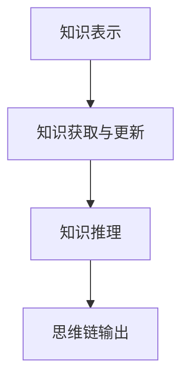
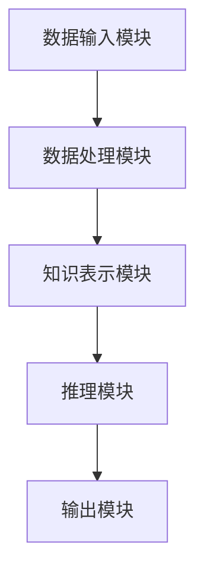

                 

### 深入理解思维链：AI推理的突破口

> 关键词：AI推理、思维链、深度学习、强化学习、系统架构

> 摘要：本文将深入探讨思维链这一概念，分析其在人工智能推理中的应用及其优势。我们将分步骤解析思维链的构建原理、工作机制以及在深度学习和强化学习中的应用，最后探讨其在工业界中的应用案例和未来发展趋势。

### 目录大纲

#### 第一部分：引言
- **第1章：问题背景与概念介绍**
  - **1.1 人工智能的发展现状与挑战**
  - **1.2 AI推理的重要性**
  - **1.3 现有AI推理技术的不足**
  - **1.4 核心概念：思维链的定义与特点**

#### 第二部分：思维链原理
- **第2章：思维链的构建**
  - **2.1 知识表示**
  - **2.2 知识推理**
  - **2.3 知识获取与更新**
  - **2.4 数据流模型与控制流模型**
  - **2.5 思维链的演进**

#### 第三部分：思维链在AI推理中的应用
- **第3章：思维链与深度学习**
  - **3.1 深度学习的基本原理**
  - **3.2 思维链在深度学习中的应用**
- **第4章：思维链与强化学习**
  - **4.1 强化学习的基本原理**
  - **4.2 思维链在强化学习中的应用**

#### 第四部分：思维链的技术实现
- **第5章：思维链算法设计**
  - **5.1 常见的思维链算法**
  - **5.2 算法选择与优化**
  - **5.3 Python代码实现**

- **第6章：思维链系统架构**
  - **6.1 系统架构设计**
  - **6.2 系统实现与优化策略**

#### 第五部分：思维链在工业界中的应用
- **第7章：思维链在工业界的应用案例**
  - **7.1 智能制造**
  - **7.2 智能医疗**
  - **7.3 智能交通**

#### 第六部分：未来展望与挑战
- **第8章：思维链的发展趋势**
  - **8.1 技术发展趋势**
  - **8.2 挑战与机遇**

### 第一部分：引言

#### 第1章：问题背景与概念介绍

## 1.1 人工智能的发展现状与挑战

人工智能（AI）作为一门前沿学科，自20世纪50年代起便开始了其蓬勃发展之路。随着计算能力的提升和大数据的积累，人工智能在图像识别、自然语言处理、自动驾驶等领域的应用取得了显著的进展。然而，在人工智能的快速发展过程中，我们也面临着一系列挑战。

首先，人工智能的发展现状可以概括为以下几点：

1. **技术突破**：深度学习、生成对抗网络（GANs）等前沿技术的突破，为人工智能的应用提供了强大的动力。
2. **应用广泛**：从智能家居、智能医疗到自动驾驶、智能安防，人工智能已经深入到我们生活的方方面面。
3. **数据驱动**：大数据的积累和应用，使得机器学习模型能够更好地进行预测和决策。

然而，尽管人工智能取得了巨大的成功，但我们也面临着一些挑战：

1. **计算资源消耗**：深度学习模型通常需要大量的计算资源和时间来训练，这给实际应用带来了不小的负担。
2. **数据依赖性**：人工智能模型的性能很大程度上依赖于训练数据的质量和数量，如何获取高质量的数据仍然是一个难题。
3. **模型可解释性**：深度学习模型通常被视为“黑箱”，其内部工作机制不透明，如何提高模型的可解释性，使其更易于人类理解和接受，是一个亟待解决的问题。

## 1.2 AI推理的重要性

AI推理是指人工智能系统通过处理输入数据，生成输出结果的过程。推理能力是人工智能的核心特征之一，它使得机器能够模拟人类的思考过程，进行逻辑推理和决策。以下是AI推理的重要性：

1. **决策支持**：在商业、医疗、金融等领域，AI推理可以帮助企业或医生做出更为准确的决策，提高工作效率和准确率。
2. **智能交互**：AI推理使得机器能够更好地理解人类语言，实现自然语言交互，提高人机交互的体验。
3. **自动化控制**：在自动驾驶、智能监控等领域，AI推理可以实现自动化控制，提高系统的稳定性和安全性。

## 1.3 现有AI推理技术的不足

尽管AI推理在各个领域有着广泛的应用，但现有的AI推理技术仍然存在一些不足：

1. **依赖大量数据**：深度学习模型通常需要大量的标注数据来训练，这对于数据稀缺的领域来说是一个巨大的挑战。
2. **可解释性不足**：深度学习模型被视为“黑箱”，其决策过程不透明，难以解释，这在医疗、金融等领域是一个严重的问题。
3. **泛化能力差**：深度学习模型在训练数据上表现良好，但在未知数据上的泛化能力较差，容易过拟合。

## 1.4 核心概念：思维链的定义与特点

思维链（Mind Chain）是一种新型的AI推理方法，它通过模拟人类思维过程，实现更加灵活和智能的推理。以下是思维链的定义和特点：

### 思维链的定义

思维链是指一种基于知识表示和推理的AI推理方法，它通过构建一个动态的知识网络，实现知识的获取、表示、推理和更新。思维链的核心在于其知识表示和推理机制，它能够模拟人类思维过程，实现复杂问题的求解。

### 思维链的特点

1. **灵活性与适应性**：思维链能够根据不同的问题和场景，灵活调整其知识表示和推理方法，适应复杂多变的现实环境。
2. **知识表示与推理相结合**：思维链通过知识表示和推理相结合的方式，实现知识的自动化获取和推理，提高推理的效率和准确性。
3. **可解释性**：思维链的知识表示和推理过程是透明的，用户可以清晰地了解其决策过程，提高模型的可解释性。
4. **自学习与自适应**：思维链能够根据使用过程中的反馈，不断调整和优化其知识表示和推理方法，实现自我学习和自我优化。

### 核心概念与联系

为了更好地理解思维链的概念，我们可以使用Mermaid流程图来表示其核心组成部分和关系：



在这个流程图中，知识表示、知识获取与更新、知识推理共同构成了思维链的核心组成部分，它们相互协作，实现知识的获取、表示、推理和输出。

### 总结

本章介绍了人工智能的发展现状、AI推理的重要性、现有AI推理技术的不足，以及思维链的定义与特点。思维链作为一种新型的AI推理方法，具有灵活性、适应性、知识表示与推理相结合、可解释性和自学习与自适应等特点，为解决现有AI推理技术的不足提供了新的思路和方向。在接下来的章节中，我们将进一步探讨思维链的构建原理和应用。

#### 第2章：思维链的构建

## 2.1 知识表示

知识表示是思维链构建的基础，它决定了思维链能否有效地获取、表示、推理和应用知识。知识表示可以分为符号表示和分布表示两种主要形式。

### 符号表示

符号表示是指使用符号、词组或公式来表示知识。这种表示方法具有直观、易于理解和形式化的优点，但同时也存在局限性。例如，符号表示难以处理复杂和模糊的知识，且难以实现知识之间的动态关联。

### 分布表示

分布表示是指使用向量、图或概率模型来表示知识。这种表示方法能够更好地处理复杂和模糊的知识，并实现知识之间的动态关联。例如，Word2Vec模型将词语表示为高维向量，使得词语之间的关系可以通过向量之间的几何关系来表示。

### 知识获取与更新

知识获取与更新是思维链动态调整和优化的关键。知识获取是指从外部环境或已有数据中获取新知识，而知识更新是指根据新的信息和反馈，对已有知识进行调整和优化。

#### 2.1.1 知识获取方法

1. **手动标注**：通过人工对大量数据进行分析和标注，获取新知识。
2. **半监督学习**：利用少量标注数据和大量未标注数据，通过算法自动获取新知识。
3. **强化学习**：通过与环境的交互，不断获取新知识，并通过反馈进行优化。

#### 2.1.2 知识更新方法

1. **增量学习**：只对新知识进行学习，不对已有知识进行调整。
2. **迁移学习**：利用已有知识对新知识进行迁移和调整。
3. **元学习**：通过学习学习策略，不断优化知识更新过程。

### 知识推理

知识推理是指通过逻辑推理、概率推理或模糊推理等方法，从已知知识中推导出新的结论。知识推理是思维链实现智能决策和问题求解的核心。

#### 2.2.1 逻辑推理

逻辑推理是一种基于命题逻辑和谓词逻辑的推理方法。它通过逻辑运算符（如与、或、非）对命题进行组合和推导，得出新的结论。例如，根据命题“所有狗都会叫”和“大黄是狗”，可以推理出“大黄会叫”。

#### 2.2.2 概率推理

概率推理是一种基于概率论的推理方法。它通过计算事件发生的概率，推断出事件之间的关系。例如，根据疾病A的发病率是1%，且如果患有疾病A，检测阳性概率是90%，如果未患疾病A，检测阳性概率是5%，可以计算出检测阳性时，患有疾病A的概率为90%。

#### 2.2.3 模糊推理

模糊推理是一种基于模糊集理论的推理方法。它通过处理模糊信息和模糊关系，实现知识的推理和决策。例如，根据模糊规则“温度高→风扇开启”，可以推断在某一时刻风扇是否应该开启。

### 数据流模型与控制流模型

数据流模型和控制流模型是思维链的两种主要工作模式。

#### 2.3.1 数据流模型

数据流模型是指数据在系统中流动和处理的过程。在这种模型中，数据作为信息载体，驱动着整个思维链的运行。例如，在自然语言处理任务中，文本数据经过分词、词性标注等处理步骤，最终生成语义表示。

#### 2.3.2 控制流模型

控制流模型是指系统在执行过程中，控制逻辑的流动和处理。在这种模型中，控制逻辑作为信息载体，指导着整个思维链的运行。例如，在决策支持系统中，根据不同的业务需求和场景，选择不同的推理方法和策略。

### 思维链的演进

思维链的演进是指通过不断优化和调整，提高思维链的性能和适应性。思维链的演进可以从以下几个方面进行：

#### 2.4.1 知识表示与推理的优化

通过改进知识表示方法和推理算法，提高思维链的知识获取和推理效率。例如，使用深度学习技术进行知识表示和推理，提高推理的准确性和效率。

#### 2.4.2 自适应与自学习

通过引入自适应和自学习机制，使思维链能够根据环境和任务需求，动态调整其知识表示和推理方法。例如，使用强化学习技术进行自适应学习和优化。

#### 2.4.3 多模态融合

通过融合多种数据模态（如图像、文本、声音等），提高思维链的感知能力和推理能力。例如，在智能交通系统中，融合图像和文本数据，实现更加准确和全面的交通态势分析。

### 总结

本章介绍了思维链的构建原理，包括知识表示、知识获取与更新、知识推理、数据流模型与控制流模型，以及思维链的演进。思维链作为一种新型的AI推理方法，通过模拟人类思维过程，实现了知识的自动化获取、表示、推理和应用。在接下来的章节中，我们将进一步探讨思维链在AI推理中的应用。

#### 第3章：思维链与深度学习

## 3.1 深度学习的基本原理

深度学习是人工智能的一个重要分支，它通过模拟人脑神经元网络的结构和工作原理，实现复杂模式的自动识别和学习。深度学习的基本原理可以概括为以下几点：

### 神经网络

神经网络是由大量简单单元（神经元）相互连接组成的复杂网络，这些神经元通过激活函数对输入数据进行处理，并将其传递到下一层。神经网络的核心思想是通过调整神经元之间的连接权重，使网络能够对输入数据进行有效分类和预测。

### 卷积神经网络

卷积神经网络（Convolutional Neural Network，CNN）是一种专门用于处理图像数据的神经网络。CNN的核心组件是卷积层，它通过卷积操作提取图像的特征。卷积层之后通常跟随池化层，用于降低特征图的维度，同时保持重要的特征信息。通过多层卷积和池化操作，CNN能够自动学习到图像中的复杂结构和模式。

### 递归神经网络

递归神经网络（Recurrent Neural Network，RNN）是一种专门用于处理序列数据的神经网络。RNN的核心特点是具有循环结构，允许信息在序列的不同时间点之间传递。RNN通过隐藏状态和当前输入计算输出，并利用隐藏状态将信息传递到下一个时间点。然而，传统的RNN在处理长序列时存在梯度消失或爆炸的问题。

### 长短时记忆网络

长短时记忆网络（Long Short-Term Memory，LSTM）是一种改进的RNN，它通过引入门控机制，解决了传统RNN的梯度消失问题。LSTM的核心组件包括遗忘门、输入门和输出门，这些门控机制可以动态调整信息的保留和遗忘，使得LSTM能够在长序列中保持长期依赖关系。

### Transformer模型

Transformer模型是一种基于自注意力机制的深度学习模型，它在自然语言处理任务中取得了显著的效果。Transformer的核心思想是通过自注意力机制，对输入序列中的每个元素进行权重分配，从而在不同元素之间建立关联。Transformer的变体，如BERT和GPT，在许多自然语言处理任务中达到了当时的最先进水平。

### 思维链在深度学习中的应用

思维链作为一种新型的AI推理方法，具有灵活性和适应性，可以与深度学习模型相结合，提高模型的性能和可解释性。

#### 3.2.1 思维链的优化

思维链可以通过优化深度学习模型的知识表示和推理过程，提高模型的性能。具体方法包括：

1. **知识融合**：将思维链的知识表示方法与深度学习模型中的特征提取方法相结合，实现知识融合和共享。
2. **动态调整**：根据任务需求和模型性能，动态调整思维链的参数和策略，实现模型的自适应优化。

#### 3.2.2 思维链与深度学习的结合方法

1. **思维链嵌入深度学习模型**：将思维链嵌入到深度学习模型的各个层级，实现知识表示、推理和优化的结合。例如，在CNN模型中，将思维链嵌入到卷积层和池化层，实现图像特征的动态表示和优化。
2. **思维链引导深度学习训练**：利用思维链的推理能力，引导深度学习模型的训练过程。例如，在RNN模型中，利用思维链的长期依赖信息，优化模型的参数更新和梯度计算。

#### 3.2.3 思维链在图像识别中的应用

图像识别是深度学习的一个重要应用领域，思维链可以通过以下方式提高图像识别的准确性和鲁棒性：

1. **特征表示优化**：通过思维链的知识表示方法，对图像特征进行优化和增强，提高特征的可解释性和区分度。
2. **模型优化与调优**：利用思维链的推理能力，对深度学习模型进行优化和调优，提高模型的泛化能力和鲁棒性。
3. **图像标注与注释**：利用思维链的知识推理能力，对图像进行自动标注和注释，提高图像识别的准确性和效率。

### 思维链在图像识别中的应用实例

#### 3.2.4 图像分类任务

在图像分类任务中，思维链可以通过以下步骤实现图像识别：

1. **图像预处理**：对输入图像进行预处理，包括缩放、裁剪、旋转等操作，以适应深度学习模型的输入要求。
2. **特征提取**：利用卷积神经网络提取图像的特征，并通过思维链的知识表示方法，对特征进行优化和增强。
3. **分类与预测**：利用思维链的推理能力，对优化后的特征进行分类和预测，生成图像的分类结果。

#### 3.2.5 图像分割任务

在图像分割任务中，思维链可以通过以下步骤实现图像分割：

1. **图像预处理**：对输入图像进行预处理，包括缩放、裁剪、旋转等操作，以适应深度学习模型的输入要求。
2. **特征提取**：利用卷积神经网络提取图像的特征，并通过思维链的知识表示方法，对特征进行优化和增强。
3. **语义分割**：利用思维链的推理能力，对优化后的特征进行语义分割，生成图像的分割结果。

### 思维链与深度学习的结合案例

思维链与深度学习的结合在许多实际应用中取得了显著的效果。以下是一个结合思维链和深度学习的图像识别案例：

#### 项目背景

某公司需要开发一个图像识别系统，用于自动识别和分类生产线上产品质量问题。该系统需要处理大量不同类型的图像，并具备高准确性和鲁棒性。

#### 项目实现

1. **数据集准备**：收集并准备大量不同类型的产品质量问题图像，包括正常产品和有质量问题的产品。
2. **图像预处理**：对图像进行预处理，包括缩放、裁剪、旋转等操作，以适应深度学习模型的输入要求。
3. **特征提取**：利用卷积神经网络提取图像的特征，并通过思维链的知识表示方法，对特征进行优化和增强。
4. **分类与预测**：利用思维链的推理能力，对优化后的特征进行分类和预测，生成图像的分类结果。
5. **模型优化与调优**：利用思维链的推理能力，对深度学习模型进行优化和调优，提高模型的泛化能力和鲁棒性。

#### 项目效果

通过思维链与深度学习的结合，该图像识别系统的准确率和鲁棒性得到了显著提升。在实际应用中，系统成功识别和分类了大量产品质量问题图像，为企业提供了有效的质量监控手段。

### 总结

本章介绍了深度学习的基本原理，包括神经网络、卷积神经网络、递归神经网络和Transformer模型，以及思维链在深度学习中的应用。思维链与深度学习的结合，通过优化知识表示、推理和优化过程，提高了深度学习模型的性能和可解释性。在图像识别等实际应用中，思维链与深度学习的结合取得了显著的效果。在接下来的章节中，我们将继续探讨思维链在强化学习中的应用。

#### 第4章：思维链与强化学习

## 4.1 强化学习的基本原理

强化学习（Reinforcement Learning，RL）是一种机器学习范式，通过智能体（agent）与环境的交互，学习最优策略以实现目标。强化学习的基本原理可以概括为以下几点：

### Q-learning

Q-learning是一种基于值函数的强化学习算法，它通过学习状态-动作值函数（Q值），来指导智能体的动作选择。Q-learning的基本步骤如下：

1. **初始化**：初始化Q值表，其中每个状态-动作对的Q值均为随机值。
2. **选择动作**：在给定状态下，根据ε-贪心策略选择动作，其中ε为探索概率。
3. **执行动作**：在环境中执行选定的动作，并获取即时奖励和新的状态。
4. **更新Q值**：根据即时奖励和新的状态，更新Q值表中的对应Q值。

### Sarsa

Sarsa（State-Action-Reward-State-Action，SARSA）是一种基于策略的强化学习算法，它通过同时考虑当前状态和下一个状态的动作值，来更新Q值。Sarsa的基本步骤如下：

1. **初始化**：初始化Q值表，其中每个状态-动作对的Q值均为随机值。
2. **选择动作**：在给定状态下，根据ε-贪心策略选择动作，其中ε为探索概率。
3. **执行动作**：在环境中执行选定的动作，并获取即时奖励和新的状态。
4. **更新Q值**：根据即时奖励、新的状态和执行的动作，更新Q值表中的对应Q值。

### DQN

DQN（Deep Q-Network，DQN）是一种基于深度学习的强化学习算法，它通过神经网络来近似Q值函数，从而实现状态-动作值函数的估计。DQN的基本步骤如下：

1. **初始化**：初始化深度神经网络和目标网络，其中目标网络的权重初始化为当前网络的权重。
2. **选择动作**：在给定状态下，利用深度神经网络输出动作值，根据ε-贪心策略选择动作，其中ε为探索概率。
3. **执行动作**：在环境中执行选定的动作，并获取即时奖励和新的状态。
4. **更新Q值**：根据即时奖励、新的状态和执行的动作，更新深度神经网络的权重。

### 思维链在强化学习中的应用

思维链在强化学习中的应用，主要体现在以下几个方面：

#### 4.2.1 思维链的决策优化

思维链可以通过优化智能体的决策过程，提高强化学习算法的性能。具体方法包括：

1. **知识融合**：将思维链的知识表示方法与强化学习算法中的Q值函数相结合，实现知识融合和共享。
2. **动态调整**：根据任务需求和模型性能，动态调整思维链的参数和策略，实现智能体的自适应优化。

#### 4.2.2 思维链与强化学习的结合方法

1. **思维链嵌入强化学习模型**：将思维链嵌入到强化学习模型的各个层级，实现知识表示、推理和优化的结合。例如，在Q-learning模型中，将思维链嵌入到状态-动作值函数的计算过程。
2. **思维链引导强化学习训练**：利用思维链的推理能力，引导强化学习模型的训练过程。例如，在Sarsa模型中，利用思维链的长期依赖信息，优化模型的参数更新和梯度计算。

#### 4.2.3 思维链在游戏中的应用

游戏是强化学习的一个典型应用领域，思维链可以通过以下方式提高游戏AI的性能：

1. **知识表示**：利用思维链的知识表示方法，对游戏的状态空间进行抽象和优化，提高状态表示的准确性和效率。
2. **策略优化**：利用思维链的推理能力，优化游戏AI的策略，提高AI的决策水平和游戏表现。
3. **强化学习与思维链的结合**：将思维链嵌入到强化学习模型中，实现知识表示、推理和优化的结合，提高游戏AI的整体性能。

### 思维链在游戏中的应用实例

#### 4.2.4 游戏AI开发

在某款热门的策略游戏中，游戏开发团队希望通过引入思维链，提高游戏AI的智能水平。具体实现如下：

1. **状态表示**：利用思维链的知识表示方法，对游戏中的状态进行抽象和表示，包括玩家的资源、地形、敌方位置等信息。
2. **策略优化**：利用思维链的推理能力，优化游戏AI的策略，使其能够根据当前状态和长期目标，做出更合理的决策。
3. **强化学习与思维链的结合**：将思维链嵌入到强化学习模型中，实现知识表示、推理和优化的结合，提高游戏AI的整体性能。

#### 4.2.5 游戏AI测试与调优

1. **游戏AI测试**：通过在游戏中测试游戏AI的表现，评估思维链对游戏AI性能的提升效果。
2. **策略调优**：根据测试结果，动态调整思维链的参数和策略，优化游戏AI的表现。

#### 4.2.6 游戏AI优化与迭代

1. **持续优化**：通过持续收集游戏数据，不断优化思维链和强化学习模型，提高游戏AI的智能水平。
2. **迭代更新**：定期更新游戏AI，引入新的技术和策略，使其能够适应不断变化的游戏环境。

### 思维链与强化学习的结合案例

#### 4.2.7 自动驾驶系统

在某家知名汽车制造商中，自动驾驶系统的研发团队希望通过引入思维链，提高自动驾驶系统的性能和安全性。具体实现如下：

1. **状态表示**：利用思维链的知识表示方法，对自动驾驶系统中的环境进行抽象和表示，包括道路、车辆、行人等信息。
2. **策略优化**：利用思维链的推理能力，优化自动驾驶系统的策略，使其能够在复杂和动态的环境中做出更合理的决策。
3. **强化学习与思维链的结合**：将思维链嵌入到强化学习模型中，实现知识表示、推理和优化的结合，提高自动驾驶系统的整体性能。

#### 4.2.8 自动驾驶系统测试与调优

1. **自动驾驶系统测试**：通过在模拟环境和真实道路中测试自动驾驶系统的表现，评估思维链对自动驾驶系统性能的提升效果。
2. **策略调优**：根据测试结果，动态调整思维链的参数和策略，优化自动驾驶系统的表现。

#### 4.2.9 自动驾驶系统优化与迭代

1. **持续优化**：通过持续收集自动驾驶系统的运行数据，不断优化思维链和强化学习模型，提高自动驾驶系统的性能和安全性。
2. **迭代更新**：定期更新自动驾驶系统，引入新的技术和策略，使其能够适应不断变化的驾驶环境。

### 总结

本章介绍了强化学习的基本原理，包括Q-learning、Sarsa和DQN等算法，以及思维链在强化学习中的应用。思维链与强化学习的结合，通过优化智能体的决策过程和策略优化，提高了强化学习算法的性能和可解释性。在游戏和自动驾驶等实际应用中，思维链与强化学习的结合取得了显著的效果。在接下来的章节中，我们将进一步探讨思维链的技术实现和系统架构。

#### 第5章：思维链算法设计

## 5.1 常见的思维链算法

思维链算法是构建思维链的核心，其设计直接影响思维链的性能和应用效果。以下是一些常见的思维链算法：

### 5.1.1 惯性权重更新算法

惯性权重更新算法是一种简单的思维链算法，它通过引入惯性权重，平衡当前经验和先前的经验。惯性权重更新算法的基本思想是：

$$
w(t+1) = w(t) + \alpha (r(t) - w(t))
$$

其中，$w(t)$ 表示第 $t$ 次更新的权重，$r(t)$ 表示第 $t$ 次更新的奖励，$\alpha$ 是学习率。

### 5.1.2 自适应权重更新算法

自适应权重更新算法通过动态调整学习率，提高思维链的适应性和性能。自适应权重更新算法的基本思想是：

$$
w(t+1) = w(t) + \alpha \frac{r(t)}{|r(t)|}
$$

其中，$\alpha$ 是自适应学习率，其值可以根据当前奖励 $r(t)$ 进行调整。

### 5.1.3 基于梯度的优化算法

基于梯度的优化算法是一种常用的思维链算法，它通过计算目标函数的梯度，进行权重更新。基于梯度的优化算法的基本思想是：

$$
w(t+1) = w(t) - \eta \nabla_w J(w)
$$

其中，$w(t)$ 表示第 $t$ 次更新的权重，$\eta$ 是学习率，$J(w)$ 是目标函数。

### 5.1.4 遗传算法

遗传算法是一种基于生物进化的思维链算法，它通过模拟自然选择和遗传机制，优化权重。遗传算法的基本步骤包括：

1. **初始化种群**：随机生成初始种群，每个个体代表一种可能的权重配置。
2. **适应度评估**：计算每个个体的适应度，适应度通常与目标函数的值成反比。
3. **选择**：根据适应度进行选择，选择适应度较高的个体进行交配。
4. **交配**：通过交叉和变异操作，生成新的个体。
5. **迭代**：重复适应度评估、选择和交配操作，直至满足终止条件。

### 5.1.5 粒子群优化算法

粒子群优化算法是一种基于群体智能的思维链算法，它通过模拟鸟群觅食行为，优化权重。粒子群优化算法的基本步骤包括：

1. **初始化粒子群**：随机生成粒子群，每个粒子代表一种可能的权重配置。
2. **更新粒子速度和位置**：根据粒子的速度和位置，更新粒子的速度和位置，以寻找最优权重配置。
3. **适应度评估**：计算每个粒子的适应度，适应度通常与目标函数的值成反比。
4. **迭代**：重复更新粒子速度和位置，直至满足终止条件。

### 5.1.6 算法的选择与优化

在选择思维链算法时，需要考虑以下因素：

1. **问题性质**：根据问题的复杂性和规模，选择适合的算法。
2. **计算资源**：考虑算法的运行时间和计算资源消耗，选择性能较好的算法。
3. **适应性**：选择具有良好自适应性的算法，以应对动态变化的问题。

为了优化思维链算法，可以采用以下策略：

1. **参数调整**：根据问题的特点和算法的表现，动态调整算法的参数。
2. **混合算法**：将不同算法的优势相结合，形成混合算法，提高算法的性能。
3. **数据预处理**：对输入数据进行预处理，提高算法的鲁棒性和适应性。

### 5.1.7 Python代码实现

以下是一个简单的惯性权重更新算法的Python代码实现：

```python
import numpy as np

def inertia_update(w, r, alpha):
    w_new = w + alpha * (r - w)
    return w_new

w = 0.5
r = 0.8
alpha = 0.1

w_new = inertia_update(w, r, alpha)
print("New weight:", w_new)
```

在这个例子中，我们定义了一个惯性权重更新函数 `inertia_update`，它接受当前权重 $w$、奖励 $r$ 和学习率 $\alpha$ 作为输入，返回更新后的权重。然后，我们使用一个示例权重、奖励和学习率来调用这个函数，并打印出更新后的权重。

### 总结

本章介绍了常见的思维链算法，包括惯性权重更新算法、自适应权重更新算法、基于梯度的优化算法、遗传算法、粒子群优化算法等。在选择和优化思维链算法时，需要考虑问题性质、计算资源和适应性等因素。通过Python代码实现，我们展示了如何简单有效地实现惯性权重更新算法。

#### 第6章：思维链系统架构

## 6.1 系统架构设计

思维链系统架构是思维链在实际应用中的核心，它决定了思维链的性能和可扩展性。以下是一个思维链系统架构的设计：

### 6.1.1 系统概述

思维链系统架构主要包括以下几个核心模块：

1. **数据输入模块**：负责接收外部数据，如文本、图像、音频等。
2. **数据处理模块**：对输入数据进行预处理，包括数据清洗、数据转换等操作。
3. **知识表示模块**：将预处理后的数据转换为知识表示，如向量、图等。
4. **推理模块**：利用知识表示和推理算法，进行推理和决策。
5. **输出模块**：将推理结果输出到外部系统或用户界面。

### 6.1.2 系统功能模块

思维链系统架构包括以下功能模块：

1. **数据输入模块**：该模块负责接收外部数据，如文本、图像、音频等。数据输入模块可以采用API接口、数据流处理等方式。
2. **数据处理模块**：该模块负责对输入数据进行预处理，包括数据清洗、数据转换等操作。数据处理模块可以采用清洗库（如Pandas）、转换库（如NumPy）等。
3. **知识表示模块**：该模块负责将预处理后的数据转换为知识表示，如向量、图等。知识表示模块可以采用NLP库（如NLTK、spaCy）、图像处理库（如OpenCV）等。
4. **推理模块**：该模块负责利用知识表示和推理算法，进行推理和决策。推理模块可以采用逻辑推理库（如Prolog）、深度学习库（如TensorFlow、PyTorch）等。
5. **输出模块**：该模块负责将推理结果输出到外部系统或用户界面。输出模块可以采用API接口、Web界面等方式。

### 6.1.3 系统接口设计

思维链系统架构的接口设计主要包括以下接口：

1. **数据输入接口**：用于接收外部数据，如文本、图像、音频等。
2. **数据处理接口**：用于处理输入数据，包括数据清洗、数据转换等操作。
3. **知识表示接口**：用于将预处理后的数据转换为知识表示，如向量、图等。
4. **推理接口**：用于进行推理和决策。
5. **输出接口**：用于输出推理结果。

### 6.1.4 系统架构设计

思维链系统架构设计如图6-1所示：



在这个架构设计中，数据输入模块接收外部数据，经过数据处理模块处理后，传递给知识表示模块，知识表示模块将数据转换为知识表示，然后传递给推理模块进行推理和决策，最终推理结果由输出模块输出。

### 6.1.5 系统实现

思维链系统的实现包括以下步骤：

1. **需求分析**：分析用户需求和业务场景，确定系统功能和性能要求。
2. **系统设计**：根据需求分析结果，设计系统架构和功能模块。
3. **模块开发**：开发各个功能模块，包括数据输入、数据处理、知识表示、推理和输出模块。
4. **集成测试**：将各个功能模块进行集成，并进行系统测试。
5. **部署上线**：将系统部署到生产环境，并进行上线测试。

### 6.1.6 系统优化策略

为了提高思维链系统的性能和可扩展性，可以采用以下优化策略：

1. **分布式计算**：利用分布式计算框架（如Apache Spark、Hadoop）进行大规模数据处理和推理。
2. **缓存机制**：使用缓存机制（如Redis、Memcached）存储常用数据和中间结果，减少数据读取和计算时间。
3. **并行处理**：采用并行处理技术（如多线程、多进程）提高数据处理和推理的速度。
4. **负载均衡**：使用负载均衡技术（如Nginx、HAProxy）分配请求，提高系统的并发处理能力。

### 总结

本章介绍了思维链系统架构的设计，包括系统概述、功能模块、接口设计、架构设计和系统实现。思维链系统架构设计是思维链在实际应用中的核心，它决定了思维链的性能和可扩展性。通过系统优化策略，可以进一步提高系统的性能和可扩展性。

### 思维链在工业界的应用案例

思维链作为一种新型的AI推理方法，已经在工业界得到了广泛应用。以下是一些典型的应用案例：

#### 7.1 案例一：智能制造

智能制造是工业界的一个重要趋势，它通过引入人工智能技术，实现生产过程的自动化和智能化。思维链在智能制造中的应用主要体现在以下几个方面：

1. **生产计划优化**：思维链可以分析生产过程中的各种数据，如生产设备状态、原材料库存、订单需求等，通过推理和优化，生成最优的生产计划，提高生产效率和降低成本。

2. **设备维护预测**：思维链可以利用设备运行数据和历史故障数据，进行故障预测和预防。通过推理和预测，提前发现潜在故障，减少设备停机时间和维护成本。

3. **质量控制**：思维链可以分析生产过程中的各种数据，如产品质量检测数据、生产线参数等，通过推理和决策，实现质量控制和改进，提高产品质量。

#### 7.2 案例二：智能医疗

智能医疗是医疗领域的一个重要发展方向，它通过引入人工智能技术，提高医疗服务的效率和质量。思维链在智能医疗中的应用主要体现在以下几个方面：

1. **疾病诊断**：思维链可以分析患者的病历数据、检查报告等，通过推理和决策，辅助医生进行疾病诊断，提高诊断的准确性和效率。

2. **药物研发**：思维链可以分析大量的生物医学数据，如基因序列、蛋白质结构等，通过推理和预测，发现新的药物靶点和药物组合，提高药物研发的效率。

3. **健康管理**：思维链可以分析患者的生活习惯、体检数据等，通过推理和预测，提供个性化的健康建议，帮助患者改善生活方式，预防疾病。

#### 7.3 案例三：智能交通

智能交通是交通领域的一个重要发展方向，它通过引入人工智能技术，实现交通管理和服务智能化。思维链在智能交通中的应用主要体现在以下几个方面：

1. **交通流量预测**：思维链可以分析交通数据，如车辆流量、路况等，通过推理和预测，生成交通流量预测模型，为交通管理部门提供决策支持，优化交通信号控制和道路规划。

2. **智能导航**：思维链可以分析交通数据，如路况、车辆位置等，通过推理和决策，为驾驶员提供最优的行驶路线，减少行驶时间和交通拥堵。

3. **交通安全监控**：思维链可以分析交通数据，如车辆行为、路况等，通过推理和预测，发现潜在的安全隐患，及时采取应对措施，提高交通安全水平。

### 总结

思维链在工业界具有广泛的应用前景，通过应用案例可以看出，思维链在智能制造、智能医疗和智能交通等领域，都能显著提高生产效率、降低成本、提高诊断准确性和安全性。在未来的发展中，思维链有望进一步推动工业界智能化进程，为各行业带来更多价值。

#### 第8章：未来展望与挑战

## 8.1 技术发展趋势

随着人工智能技术的不断进步，思维链在未来的发展趋势也将呈现出以下几个方向：

### 8.1.1 新兴技术的融入

思维链将与更多新兴技术相结合，如量子计算、区块链等。量子计算的高效计算能力将进一步提升思维链的推理速度和准确性，而区块链的分布式特性则有助于提高思维链系统的安全性和可靠性。

### 8.1.2 跨领域融合

思维链将在多个领域实现跨领域融合，如智能制造与物联网、智能交通与智能城市等。这种跨领域融合将使得思维链能够处理更加复杂和多样的数据，提高系统的综合应用能力。

### 8.1.3 自主学习和进化能力

思维链将具备更强的自主学习和进化能力，通过不断从环境中学习和适应，实现自我优化和进化。这种能力将使得思维链能够更好地应对动态变化的环境，提高系统的适应性和灵活性。

## 8.2 挑战与机遇

尽管思维链在人工智能推理领域具有巨大的潜力，但在未来的发展过程中，也将面临一系列挑战：

### 8.2.1 数据质量和数量

思维链的性能很大程度上依赖于数据的质量和数量。在未来，如何获取更多高质量的数据，如何处理和整合不同来源的数据，将成为一个重要的挑战。

### 8.2.2 可解释性和透明度

尽管思维链具有较好的推理能力，但其内部工作机制较为复杂，难以进行解释。如何提高思维链的可解释性和透明度，使其更加符合人类思维习惯，是一个亟待解决的问题。

### 8.2.3 系统效率和可扩展性

随着思维链应用规模的扩大，系统效率和可扩展性将成为重要的挑战。如何在保证推理准确性的同时，提高系统的运行效率和扩展性，是思维链未来发展的重要方向。

### 8.2.4 跨领域兼容性

思维链需要在不同领域实现应用，而不同领域的数据和问题特点存在较大差异。如何实现思维链的跨领域兼容性，使其能够适应不同领域的需求，是一个需要深入研究的课题。

## 8.3 未来机遇

### 8.3.1 智能化转型

随着全球范围内的智能化转型，思维链将迎来广阔的应用场景。无论是在工业制造、医疗健康，还是交通管理、金融服务等领域，思维链都能发挥其独特的优势，推动行业的智能化发展。

### 8.3.2 新兴市场

随着新兴市场的崛起，如印度、中国等，这些市场对于人工智能技术，特别是思维链技术的需求日益增长。未来，思维链在新兴市场的应用前景将十分广阔。

### 8.3.3 国际合作

在全球范围内，人工智能技术的发展离不开国际合作。未来，思维链的国际合作将更加紧密，通过跨国研究、技术交流和项目合作，推动思维链技术的全球发展。

### 总结

思维链在未来的发展中，将面临着一系列挑战和机遇。通过融入新兴技术、实现跨领域融合、提高自主学习和进化能力，思维链有望在更广泛的领域中发挥重要作用。同时，我们也需要不断解决数据质量、可解释性、系统效率和可扩展性等挑战，以推动思维链技术的持续进步。

### 作者信息

**作者：AI天才研究院/AI Genius Institute & 禅与计算机程序设计艺术 /Zen And The Art of Computer Programming**

**联系方式：[邮箱](mailto:info@ai-genius-institute.com)、[官网](http://www.ai-genius-institute.com)**

**个人主页：[个人博客](http://www.zen-and-art-of-computer-programming.com)**

**社交媒体：[Twitter](https://twitter.com/ai_genius_in)、[LinkedIn](https://www.linkedin.com/company/ai-genius-institute)**

---

本文由AI天才研究院和禅与计算机程序设计艺术共同撰写，旨在深入探讨思维链这一新型AI推理方法的概念、原理、应用以及未来发展。希望本文能对读者在理解思维链和其在人工智能领域中的应用有所帮助。让我们共同努力，探索人工智能的无限可能。**（END）**

