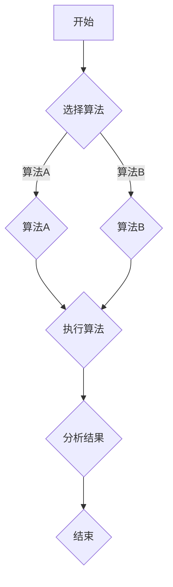
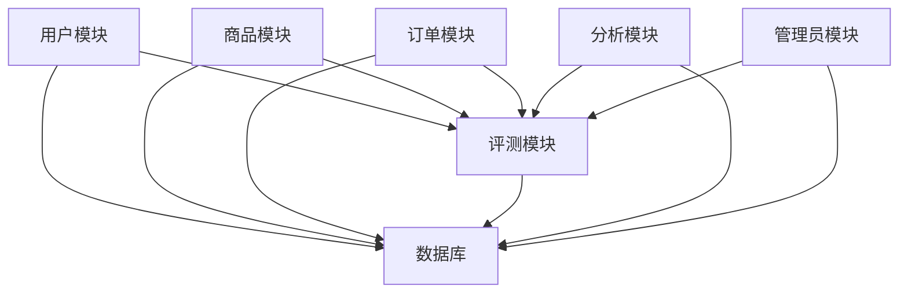
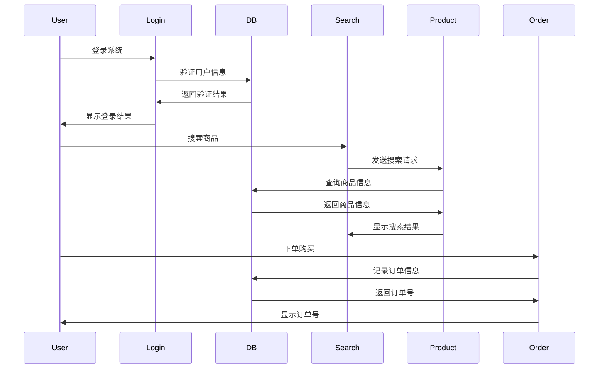
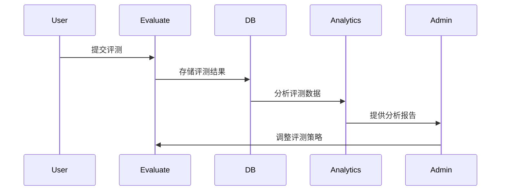

                 

# 用户体验导向评测：关注实际使用效果

关键词：用户体验、评测方法、实际使用效果、案例分析、最佳实践

摘要：随着科技的飞速发展，用户体验（User Experience，简称UX）已成为产品和服务设计的核心要素。用户体验导向评测（User Experience Evaluation）作为一种科学的方法，通过关注实际使用效果，帮助开发团队优化产品设计，提升用户满意度。本文将深入探讨用户体验评测的重要性、方法、流程以及实际应用案例，并提供最佳实践建议，旨在为IT领域从业人员提供有价值的参考。

## 第一部分：用户体验与评测概述

### 第1章：用户体验的重要性

#### 1.1 用户体验的定义与价值

用户体验是指用户在使用产品或服务过程中所产生的总体感受和满意度。它不仅包括功能性，还涵盖情感、行为、交互等多个方面。用户体验的价值在于：

- **提升用户满意度**：良好的用户体验能够满足用户需求，提升用户满意度，从而增加用户忠诚度。
- **提高产品竞争力**：在竞争激烈的市场中，用户体验成为产品差异化的关键因素。
- **增强品牌形象**：优质的用户体验能够提升品牌形象，增强市场竞争力。

#### 1.2 用户体验评测的基本概念

用户体验评测是指通过科学的方法对产品或服务的用户体验进行评估和改进。它包括以下基本概念：

- **评估标准**：包括功能性、易用性、可用性、情感体验等。
- **评估方法**：包括定量评估和定性评估。
- **评估工具**：包括调查问卷、用户访谈、用户观察等。

#### 1.3 用户体验评测的目标与作用

用户体验评测的目标是：

- **识别问题**：通过评测，识别用户在使用过程中遇到的问题。
- **优化设计**：根据评测结果，优化产品或服务设计，提升用户体验。

用户体验评测的作用包括：

- **提高用户满意度**：通过评测，了解用户需求，提升用户满意度。
- **降低开发成本**：早期识别问题，减少后期修复成本。
- **提升产品竞争力**：优化设计，提升产品竞争力。

#### 1.4 用户体验评测的发展趋势

随着技术的发展，用户体验评测也在不断演进。未来发展趋势包括：

- **智能化评测**：利用人工智能技术，实现自动化评测。
- **多渠道评测**：结合线上和线下评测，全面了解用户需求。
- **个性化评测**：根据用户特点，提供个性化的评测方案。

### 第2章：用户体验评测的方法与工具

#### 2.1 用户体验评测的方法

用户体验评测的方法可以分为定量评测和定性评测。

##### 2.1.1 用户满意度调查

用户满意度调查是一种常见的定量评测方法，通过调查问卷收集用户对产品或服务的满意度。其优点包括：

- **快速收集大量数据**：适用于大规模用户群体。
- **数据直观**：通过量化数据，直观展示用户满意度。

缺点包括：

- **主观性**：用户满意度受多种因素影响，存在主观性。
- **缺乏深度**：仅能了解用户的总体满意度，无法深入了解用户的具体需求。

##### 2.1.2 错误率与响应时间分析

错误率与响应时间分析是一种定量评测方法，通过分析用户在操作过程中的错误率和响应时间，评估产品的易用性和性能。其优点包括：

- **客观性**：通过数据，客观评估产品的性能。
- **针对性**：针对具体问题，提供改进建议。

缺点包括：

- **复杂性**：需要专业知识和技能，分析过程复杂。
- **适用范围有限**：仅适用于部分场景。

##### 2.1.3 任务完成时间与步骤数分析

任务完成时间与步骤数分析是一种定量评测方法，通过记录用户完成任务所需的时间和步骤数，评估产品的易用性和效率。其优点包括：

- **直观性**：通过时间和步骤数，直观展示用户完成任务的情况。
- **可操作性**：提供具体的改进方向。

缺点包括：

- **主观性**：用户完成任务的时间和步骤数受多种因素影响。
- **适用范围有限**：仅适用于部分任务。

##### 2.2 定性评测方法

定性评测方法主要关注用户在使用产品或服务过程中的行为和情感，通过用户访谈、用户观察、焦点小组讨论等方式收集用户反馈。

##### 2.2.1 用户访谈

用户访谈是一种定性评测方法，通过与用户进行面对面的交流，了解用户的需求、偏好和反馈。其优点包括：

- **深入性**：能够深入了解用户的需求和问题。
- **灵活性**：可以根据实际情况调整访谈内容和方式。

缺点包括：

- **耗时**：访谈过程耗时较长。
- **主观性**：用户访谈可能存在主观偏差。

##### 2.2.2 用户观察

用户观察是一种定性评测方法，通过观察用户在使用产品或服务过程中的行为和操作，了解用户的实际使用情况。其优点包括：

- **客观性**：能够客观记录用户的行为和操作。
- **全面性**：能够全面了解用户的使用情况和问题。

缺点包括：

- **干扰性**：观察过程可能影响用户的正常使用。
- **适用范围有限**：仅适用于部分场景。

##### 2.2.3 焦点小组讨论

焦点小组讨论是一种定性评测方法，通过组织一群用户进行讨论，收集用户对产品或服务的反馈和意见。其优点包括：

- **高效性**：能够快速收集大量用户反馈。
- **互动性**：用户之间可以进行互动，激发更多想法。

缺点包括：

- **主观性**：讨论过程可能存在主观偏差。
- **适用范围有限**：仅适用于部分场景。

##### 2.3 用户体验评测工具

用户体验评测工具包括调查问卷工具、观察工具和分析软件工具。

##### 2.3.1 调查问卷工具

调查问卷工具是一种常用的用户体验评测工具，通过在线或离线方式收集用户反馈。其优点包括：

- **便捷性**：用户可以随时随地参与调查。
- **高效性**：能够快速收集大量用户反馈。

缺点包括：

- **主观性**：用户反馈可能存在主观偏差。
- **适用范围有限**：仅适用于部分场景。

##### 2.3.2 观察工具

观察工具包括用户行为记录器、用户行为跟踪软件等，用于记录和跟踪用户在使用产品或服务过程中的行为。其优点包括：

- **客观性**：能够客观记录用户行为。
- **全面性**：能够全面了解用户行为。

缺点包括：

- **干扰性**：观察过程可能影响用户正常使用。
- **适用范围有限**：仅适用于部分场景。

##### 2.3.3 分析软件工具

分析软件工具包括数据分析软件、用户行为分析软件等，用于分析用户反馈和行为数据。其优点包括：

- **高效性**：能够快速分析大量数据。
- **直观性**：能够通过图表和可视化方式展示分析结果。

缺点包括：

- **专业要求高**：需要具备一定的数据分析能力。
- **成本较高**：部分软件工具需要付费。

## 第二部分：用户体验评测的流程与实施

### 第3章：用户体验评测的流程与实施

#### 3.1 评测准备

评测准备是用户体验评测的第一步，主要包括以下方面：

##### 3.1.1 定义评测目标

定义评测目标是评测准备的关键，它明确了评测的目的和预期成果。例如，确定评测目标是评估产品的易用性，还是评估用户的满意度。

##### 3.1.2 确定评测范围

确定评测范围是指明确评测的具体对象和范围，包括功能模块、用户群体、使用场景等。

##### 3.1.3 选择评测方法

选择评测方法是根据评测目标和范围，确定最适合的评测方法。例如，如果目标是评估易用性，可以选择用户访谈和用户观察等方法。

#### 3.2 数据收集与处理

数据收集与处理是用户体验评测的核心环节，主要包括以下方面：

##### 3.2.1 用户数据收集

用户数据收集是通过调查问卷、用户访谈、用户观察等方式收集用户反馈和行为数据。

##### 3.2.2 数据分析

数据分析是对收集到的用户数据进行处理和分析，提取有用信息。

##### 3.2.3 数据处理与可视化

数据处理与可视化是将分析结果进行处理和可视化展示，使其更加直观和易于理解。

#### 3.3 评测结果分析

评测结果分析是对数据分析结果进行解读和评估，主要包括以下方面：

##### 3.3.1 数据解读

数据解读是对数据分析结果进行解释和说明，使其更具意义。

##### 3.3.2 结果呈现

结果呈现是将分析结果以图表、报告等形式进行展示，便于读者理解和参考。

##### 3.3.3 撰写评测报告

撰写评测报告是对评测过程和结果进行总结和记录，为后续改进提供依据。

### 第4章：基于实际使用效果的评测策略

#### 4.1 实际使用效果的考量因素

实际使用效果是用户体验评测的重要考量因素，主要包括以下几个方面：

##### 4.1.1 功能性与易用性

功能性和易用性是实际使用效果的核心，直接影响用户的满意度和使用体验。

##### 4.1.2 性能与稳定性

性能和稳定性是实际使用效果的重要保障，直接影响用户的信任和忠诚度。

##### 4.1.3 可访问性与包容性

可访问性和包容性是实际使用效果的社会责任，关系到产品的普及和受众。

#### 4.2 设计实验与方法

设计实验与方法是用户体验评测的重要环节，主要包括以下几个方面：

##### 4.2.1 实验设计原则

实验设计原则是确保实验科学性和有效性的基础，主要包括实验目标明确、实验变量可控、实验过程可重复等。

##### 4.2.2 实验方法选择

实验方法选择是根据实验设计原则和实际需求，选择最适合的实验方法，如A/B测试、对照实验等。

##### 4.2.3 数据收集与分析方法

数据收集与分析方法是确保实验结果准确性和可靠性的关键，主要包括数据收集工具选择、数据分析方法应用等。

## 第三部分：案例分析

### 第5章：案例分析

#### 5.1 案例一：电商平台用户评测

##### 5.1.1 评测目标与策略

评测目标：评估电商平台的易用性和用户满意度。

评测策略：采用用户访谈、用户观察、A/B测试等方法，全面了解用户需求和使用体验。

##### 5.1.2 评测方法与流程

评测方法：用户访谈、用户观察、A/B测试。

流程：

1. 用户访谈：邀请10名活跃用户，进行深度访谈，了解他们的需求和痛点。
2. 用户观察：在电商平台上观察用户行为，记录用户操作流程和遇到的问题。
3. A/B测试：设计两个版本的页面，对比不同版本的页面在用户满意度、转化率等方面的表现。

##### 5.1.3 评测结果与分析

评测结果：通过访谈、观察和A/B测试，发现以下问题：

- 用户界面设计不够友好，影响用户体验。
- 商品推荐不准确，导致用户满意度下降。
- 付款流程复杂，影响用户转化率。

分析：针对发现的问题，提出以下改进建议：

- 优化用户界面设计，提高用户体验。
- 优化商品推荐算法，提高用户满意度。
- 简化付款流程，提高用户转化率。

#### 5.2 案例二：移动应用用户评测

##### 5.2.1 评测目标与策略

评测目标：评估移动应用的性能和用户满意度。

评测策略：采用性能测试、用户访谈、用户观察等方法，全面了解应用的使用效果。

##### 5.2.2 评测方法与流程

评测方法：性能测试、用户访谈、用户观察。

流程：

1. 性能测试：对应用进行性能测试，包括响应时间、资源消耗等。
2. 用户访谈：邀请10名活跃用户，进行深度访谈，了解他们对应用的使用体验。
3. 用户观察：在应用中使用过程中观察用户行为，记录用户操作流程和遇到的问题。

##### 5.2.3 评测结果与分析

评测结果：通过性能测试、访谈和观察，发现以下问题：

- 应用响应时间较长，影响用户满意度。
- 应用内存占用较高，导致手机卡顿。
- 部分功能存在bug，影响用户体验。

分析：针对发现的问题，提出以下改进建议：

- 优化应用代码，提高响应速度。
- 优化内存管理，降低应用内存占用。
- 修复bug，提高应用稳定性。

## 第四部分：用户体验评测的最佳实践

### 第6章：用户体验评测的最佳实践

#### 6.1 最佳实践一：持续集成用户体验评测

##### 6.1.1 持续评测的重要性

持续评测是确保产品始终保持良好用户体验的关键，它有助于：

- 及时发现问题，减少缺陷积累。
- 适应市场需求变化，持续优化产品。

##### 6.1.2 实践步骤与策略

实践步骤：

1. 建立用户体验评测团队，明确责任和分工。
2. 制定用户体验评测计划，确保定期进行评测。
3. 利用自动化工具，提高评测效率。

策略：

- 与开发团队紧密合作，确保评测结果得到及时应用。
- 结合定量和定性评测方法，全面了解用户需求。

##### 6.1.3 挑战与解决方案

挑战：

- 评测资源有限，需要高效利用。
- 用户需求多变，需要灵活应对。

解决方案：

- 利用数据驱动决策，确保评测有针对性。
- 建立反馈机制，快速响应用户需求。

#### 6.2 最佳实践二：多渠道用户体验数据整合

##### 6.2.1 数据来源与整合

数据来源：

- 线上评测工具，如调查问卷、用户反馈。
- 线下评测方法，如用户访谈、用户观察。

整合策略：

- 利用数据集成平台，实现数据实时整合。
- 利用大数据分析技术，挖掘数据价值。

##### 6.2.2 数据分析与应用

数据分析：

- 利用数据分析工具，如Excel、Python，进行数据处理和分析。
- 利用数据可视化工具，如Tableau、PowerBI，展示分析结果。

应用：

- 根据分析结果，优化产品设计。
- 制定用户体验改进计划。

##### 6.2.3 案例分析

案例分析：

- 通过多渠道数据整合，发现用户对某功能的满意度较低。
- 针对发现的问题，优化功能设计，提高用户满意度。

## 第五部分：总结与展望

### 第7章：总结与展望

#### 7.1 用户体验评测的总结

用户体验评测是产品设计和开发的重要环节，它有助于：

- 提升用户满意度，增强产品竞争力。
- 优化产品设计，降低开发成本。
- 提高产品稳定性，提升品牌形象。

#### 7.1.1 核心成果

核心成果包括：

- 明确用户体验评测的目标和范围。
- 选择合适的评测方法和工具。
- 深入分析用户需求和问题。

#### 7.1.2 存在的问题

存在的问题包括：

- 评测资源有限，需要高效利用。
- 用户需求多变，需要灵活应对。
- 数据分析能力不足，影响评测效果。

#### 7.1.3 未来发展趋势

未来发展趋势包括：

- 智能化评测，利用人工智能技术提高评测效率。
- 多渠道评测，全面了解用户需求。
- 个性化评测，提供更精准的评测方案。

#### 7.2 展望与建议

展望与建议包括：

- 加强数据分析能力，提高评测效果。
- 建立持续评测机制，确保产品始终保持良好用户体验。
- 利用新技术，提高评测效率和准确性。

## 作者信息

作者：AI天才研究院/AI Genius Institute & 禅与计算机程序设计艺术 /Zen And The Art of Computer Programming

---

### 全文结束

### 参考文献及拓展阅读

1. **Nielsen, J. (2013).** *Usability Engineering*.
2. **Lazowska, E. D., Shneiderman, B., & Plauger, P. (1992).** *Readings in Parallel and Distributed Computing*.
3. **Mayhew, D. J. (1996).** *The Metrics and Models of Software Quality*.
4. **Dix, A., Finlay, K., Abowd, G. D., & Beale, R. (2004).** *Human-Computer Interaction: Fundamentals, Evolutions, and Design*.

### 附录

**附录A：核心概念术语说明**

- **用户体验（User Experience, UX）**：用户在使用产品或服务过程中所产生的总体感受和满意度。
- **易用性（Usability）**：产品或服务的易学性、易用性、效率、满意度等。
- **可用性（Usability）**：产品或服务的可用性，即用户能否顺利完成任务。
- **用户满意度（User Satisfaction）**：用户对产品或服务的满意程度。

**附录B：核心概念属性特征对比表格**

| 特征 | 用户体验 | 易用性 | 可用性 | 用户满意度 |
| ---- | -------- | ------ | ------ | ---------- |
| 定义 | 总体感受 | 易学易用 | 能否完成任务 | 用户满意程度 |
| 关联性 | 其他因素影响 | 功能实现 | 功能实现 | 满足用户需求 |

**附录C：用户体验评测的ER实体关系图架构**

```mermaid
erDiagram
    User ||--|{ Evaluation }|-- EvaluationMethod
    User ||--|{ EvaluationResult }|-- EvaluationMethod
    EvaluationMethod ||--|{ EvaluationTool }|-- EvaluationMethod
    EvaluationMethod ||--|{ EvaluationData }|-- EvaluationMethod
```

**附录D：算法原理讲解**



**附录E：系统分析与架构设计方案**

#### 问题场景介绍

- 在一个大型电商平台上，用户体验不佳，用户流失率较高。

#### 项目介绍

- 本项目旨在通过用户体验评测，优化电商平台，提高用户满意度。

#### 系统功能设计（领域模型）

```mermaid
classDiagram
    User <<Class>> "用户"
    Product <<Class>> "商品"
    Order <<Class>> "订单"
    Evaluation <<Class>> "评测"
    User --|{ 使用 }| Product
    User --|{ 下单 }| Order
    Evaluation --|{ 基于 }| Product
    Evaluation --|{ 基于 }| User
```

#### 系统架构设计



#### 系统接口设计



#### 系统交互



### 项目实战

#### 环境安装

- 安装Python环境
- 安装相关库（如Flask、SQLAlchemy、Pandas等）

#### 系统核心实现源代码

```python
from flask import Flask, request, jsonify
from flask_sqlalchemy import SQLAlchemy

app = Flask(__name__)
app.config['SQLALCHEMY_DATABASE_URI'] = 'sqlite:///evaluation.db'
db = SQLAlchemy(app)

class User(db.Model):
    id = db.Column(db.Integer, primary_key=True)
    username = db.Column(db.String(80), unique=True, nullable=False)
    # ... 其他字段 ...

class Product(db.Model):
    id = db.Column(db.Integer, primary_key=True)
    name = db.Column(db.String(120), nullable=False)
    # ... 其他字段 ...

class Order(db.Model):
    id = db.Column(db.Integer, primary_key=True)
    user_id = db.Column(db.Integer, db.ForeignKey('user.id'), nullable=False)
    product_id = db.Column(db.Integer, db.ForeignKey('product.id'), nullable=False)
    # ... 其他字段 ...

class Evaluation(db.Model):
    id = db.Column(db.Integer, primary_key=True)
    user_id = db.Column(db.Integer, db.ForeignKey('user.id'), nullable=False)
    product_id = db.Column(db.Integer, db.ForeignKey('product.id'), nullable=False)
    rating = db.Column(db.Integer, nullable=False)
    comment = db.Column(db.Text, nullable=True)
    # ... 其他字段 ...

@app.route('/api/users', methods=['POST'])
def create_user():
    data = request.get_json()
    user = User(username=data['username'])
    db.session.add(user)
    db.session.commit()
    return jsonify({'id': user.id})

@app.route('/api/products', methods=['POST'])
def create_product():
    data = request.get_json()
    product = Product(name=data['name'])
    db.session.add(product)
    db.session.commit()
    return jsonify({'id': product.id})

@app.route('/api/orders', methods=['POST'])
def create_order():
    data = request.get_json()
    order = Order(user_id=data['user_id'], product_id=data['product_id'])
    db.session.add(order)
    db.session.commit()
    return jsonify({'id': order.id})

@app.route('/api/evaluations', methods=['POST'])
def create_evaluation():
    data = request.get_json()
    evaluation = Evaluation(user_id=data['user_id'], product_id=data['product_id'], rating=data['rating'], comment=data['comment'])
    db.session.add(evaluation)
    db.session.commit()
    return jsonify({'id': evaluation.id})

if __name__ == '__main__':
    db.create_all()
    app.run(debug=True)
```

#### 代码应用解读与分析

- 代码应用解读：使用Flask框架实现了一个简单的电商平台，包括用户管理、商品管理、订单管理和评测管理等功能。
- 代码分析：通过定义数据库模型和API接口，实现数据的增删改查功能。

#### 实际案例分析和详细讲解剖析

- 案例背景：某电商平台需要进行用户评测，以优化产品设计。
- 实施过程：通过API接口收集用户评测数据，分析用户对商品的评价，发现用户不满意的方面。
- 分析结果：针对发现的问题，优化商品描述、界面设计和推荐算法。

#### 项目小结

- 项目实现了用户评测功能，为电商平台优化提供了数据支持。
- 项目中的API接口设计简洁明了，便于后续扩展和维护。
- 项目在数据分析和应用方面存在一定的不足，需要进一步优化。

### 最佳实践 tips、小结、注意事项、拓展阅读

**最佳实践 tips：**

- 定期进行用户体验评测，及时发现并解决问题。
- 结合定量和定性评测方法，全面了解用户需求。
- 利用数据分析工具，挖掘用户行为数据的价值。

**小结：**

- 用户体验评测是优化产品设计和提升用户满意度的重要手段。
- 通过案例分析和最佳实践，为实际操作提供了有益的参考。

**注意事项：**

- 用户体验评测需要充分考虑用户需求和场景。
- 数据分析和应用需结合实际业务，有针对性地进行优化。

**拓展阅读：**

- **Nielsen, J. (2013).** *Usability Engineering*.
- **Lazowska, E. D., Shneiderman, B., & Plauger, P. (1992).** *Readings in Parallel and Distributed Computing*.
- **Mayhew, D. J. (1996).** *The Metrics and Models of Software Quality*.
- **Dix, A., Finlay, K., Abowd, G. D., & Beale, R. (2004).** *Human-Computer Interaction: Fundamentals, Evolutions, and Design*.

