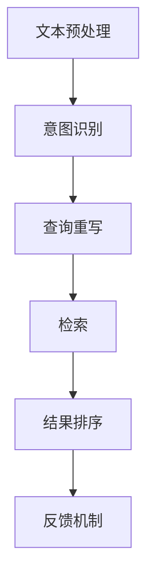
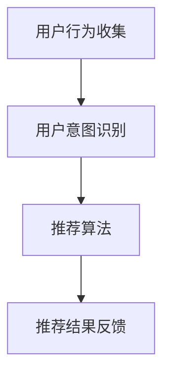
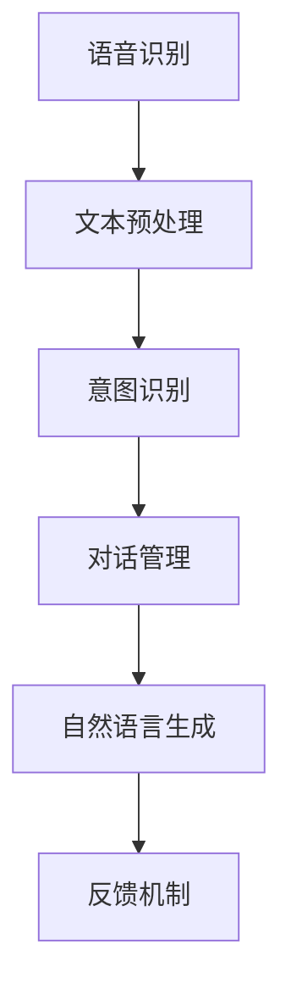
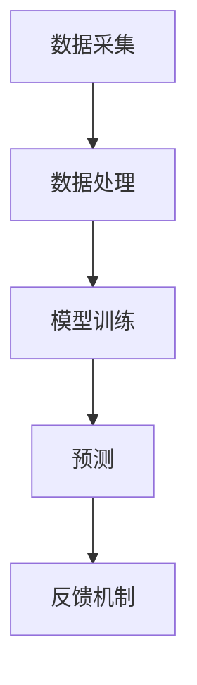
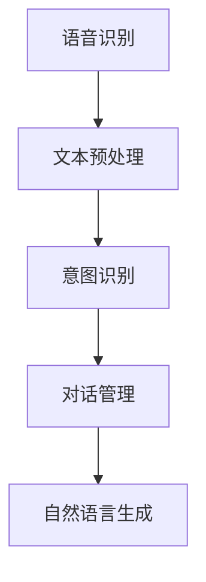
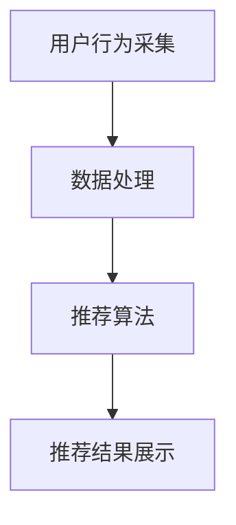

                 

### 《用户意图理解：精准捕捉查询目的》

**关键词：** 用户意图、信息检索、推荐系统、深度学习、聊天机器人

**摘要：** 本篇文章将深入探讨用户意图理解的概念、技术及其在信息检索、推荐系统和聊天机器人等应用场景中的重要性。我们将从用户意图理解的背景和重要性出发，逐步分析其面临的挑战和核心概念，介绍用户意图理解的发展历程和技术方法，最后通过实战案例和最佳实践，探讨用户意图理解在实际应用中的有效策略和未来发展趋势。

----------------------------------------------------------------

### 目录大纲

**《用户意图理解：精准捕捉查询目的》**

----------------------------------------------------------------

# 第一部分：用户意图理解概述

## 1.1 用户意图理解的重要性

### 1.1.1 什么是对用户意图的理解

用户意图理解是指系统通过分析用户的输入信息，精准捕捉用户的目的和需求，从而提供更符合用户期望的响应。用户意图是用户在交互过程中表达的一种内在意图，可以是获取信息、执行任务或寻求娱乐等。理解用户意图对于提升用户体验、提高系统智能化水平具有重要意义。

### 1.1.2 用户意图理解在信息检索和推荐系统中的应用

在信息检索领域，用户意图理解有助于提高查询结果的准确性和相关性。通过理解用户查询意图，系统可以过滤无关信息，提供更贴近用户需求的检索结果。例如，搜索引擎可以通过用户意图理解，为用户提供更加精准的搜索建议。

在推荐系统领域，用户意图理解有助于提升推荐效果。通过分析用户的历史行为和查询记录，系统可以推断出用户的潜在意图，从而提供更加个性化的推荐结果。例如，电商平台可以根据用户意图，为用户提供更符合其兴趣的商品推荐。

### 1.1.3 用户意图理解的价值和意义

用户意图理解对于提高系统智能化水平、提升用户体验具有重要意义。具体来说，用户意图理解的价值和意义体现在以下几个方面：

1. 提高查询结果的相关性：通过理解用户意图，系统可以提供更贴近用户需求的查询结果，从而提升信息检索效果。

2. 优化推荐系统效果：通过分析用户意图，系统可以提供更加个性化的推荐结果，从而提升用户满意度。

3. 提升聊天机器人交互质量：通过理解用户意图，聊天机器人可以更好地与用户进行对话，提高交互体验。

4. 帮助开发人员优化系统：用户意图理解可以为开发人员提供有价值的用户行为数据，帮助其更好地设计和改进系统功能。

## 1.2 用户意图理解的挑战与难点

### 1.2.1 多样化的用户查询

用户查询多样化是用户意图理解面临的一个重要挑战。用户在表达意图时，可能会使用不同的词汇、句式和表达方式，导致同一意图的查询形式千变万化。例如，用户可能通过不同的表述方式来询问同一部电影的信息，如“哪部电影获得了奥斯卡最佳影片奖？”和“请问奥斯卡最佳影片是哪一部？”系统需要能够识别这些不同形式的查询，并准确理解其背后的意图。

### 1.2.2 语言复杂性和歧义

语言复杂性和歧义也是用户意图理解的一大难点。自然语言具有丰富的表达方式和灵活性，用户在表达意图时可能会使用复杂的句式、多义词、隐含信息等。例如，“我想去图书馆借一本书”，这句话中包含了多个信息点：用户想要去图书馆、想要借书，但具体是哪本书、为什么要借书等信息并未明确表达。系统需要能够处理这种语言复杂性，准确理解用户的真实意图。

### 1.2.3 信息噪声与冗余

信息噪声与冗余是用户意图理解过程中需要克服的另一个挑战。用户在输入查询时，可能会包含与意图无关的信息，如情绪表达、背景描述等。此外，查询结果中可能存在大量无关或重复的信息，这些噪声和冗余信息会干扰系统对用户意图的理解。例如，用户在搜索“北京旅游景点”时，可能会输入“我很喜欢北京，想去看看那里的名胜古迹，有没有推荐？”这句话中包含了情绪表达和背景描述，系统需要过滤这些无关信息，提取出用户真正的查询意图。

## 1.3 用户意图理解的核心概念与联系

### 1.3.1 核心概念简介

用户意图理解涉及多个核心概念，包括用户意图、查询意图和对话意图。这些概念之间既有区别又有联系，下面分别介绍：

- **用户意图（User Intent）**：用户意图是指用户在交互过程中所表达的整体目的或需求。用户意图可以是明确的，如查询特定信息或执行某项任务，也可以是隐含的，如寻求帮助或寻求娱乐。

- **查询意图（Query Intent）**：查询意图是用户在信息检索过程中表达的具体查询需求。查询意图通常是通过用户的查询语句来体现的，如“北京旅游景点推荐”和“明天天气如何”。

- **对话意图（Dialogue Intent）**：对话意图是用户在对话交互过程中所表达的具体意图。对话意图可以是询问信息、请求帮助、表达观点等，如“你能帮我找一家餐厅吗？”和“你对这个项目有什么看法？”。

### 1.3.2 概念属性特征对比表格

下表对比了用户意图、查询意图和对话意图的属性特征：

| 概念   | 属性特征                   | 举例                           |
| ------ | -------------------------- | ------------------------------ |
| 用户意图 | 整体目的、需求、情感倾向   | 购买一台笔记本电脑、寻求情感支持 |
| 查询意图 | 查询需求、关键词、语义理解 | 搜索北京旅游景点、查询明天天气   |
| 对话意图 | 交互目的、表达内容、对话风格 | 询问餐厅推荐、表达观点           |

### 1.3.3 ER实体关系图

为了更直观地展示用户意图理解中各个概念之间的关系，我们可以使用ER（实体关系）图来表示。以下是用户意图理解ER实体关系图：

```mermaid
erDiagram
  UserIntent ||--|{ QueryIntent } : 查询需求
  UserIntent ||--|{ DialogueIntent } : 交互目的
  QueryIntent ||--|{ Keyword } : 关键词
  DialogueIntent ||--|{ Expression } : 表达内容
```

在用户意图理解过程中，用户意图作为核心概念，通过解析查询意图和对话意图来获取用户的真实需求。查询意图主要关注用户在信息检索过程中的具体查询需求，而对话意图则关注用户在对话交互中的表达内容和风格。这些意图通过关键词、表达内容等实体进行具体描述和实现。

## 1.4 用户意图理解的发展历程

### 1.4.1 早期研究

用户意图理解的研究可以追溯到上世纪90年代，当时的研究主要集中在利用规则和词典来识别用户意图。早期的用户意图识别系统主要采用基于规则的方法，通过手工定义规则来匹配用户查询和意图。这种方法在一定程度上能够处理简单的查询意图，但在面对复杂多变的查询时，其性能和灵活性受限。

### 1.4.2 传统方法

随着自然语言处理技术的发展，用户意图理解的研究逐渐转向基于统计模型的方法。传统方法主要包括基于机器学习的方法，如支持向量机（SVM）、朴素贝叶斯分类器等。这些方法通过训练模型，从大量的用户查询数据中学习意图识别规律，提高了系统的性能和准确性。

### 1.4.3 深度学习方法

近年来，深度学习技术的迅猛发展为用户意图理解带来了新的契机。深度学习方法，如卷积神经网络（CNN）、循环神经网络（RNN）、长短期记忆网络（LSTM）等，在图像识别、语音识别等领域取得了显著成果。将这些方法应用于用户意图理解，可以更好地处理复杂多变的查询，提高系统的性能和准确性。

## 1.5 用户意图理解的应用场景

### 1.5.1 信息检索

在信息检索领域，用户意图理解有助于提高查询结果的准确性和相关性。通过理解用户的查询意图，系统可以过滤无关信息，提供更贴近用户需求的检索结果。例如，搜索引擎可以通过用户意图理解，为用户提供更加精准的搜索建议。

### 1.5.2 推荐系统

在推荐系统领域，用户意图理解有助于提升推荐效果。通过分析用户的历史行为和查询记录，系统可以推断出用户的潜在意图，从而提供更加个性化的推荐结果。例如，电商平台可以根据用户意图，为用户提供更符合其兴趣的商品推荐。

### 1.5.3 聊天机器人

在聊天机器人领域，用户意图理解有助于提高交互质量。通过理解用户的意图，聊天机器人可以更好地与用户进行对话，提供更加符合用户需求的响应。例如，客服机器人可以通过用户意图理解，快速识别用户的需求并提供相应的帮助。

## 1.6 本章小结

本部分内容介绍了用户意图理解的概念、重要性、挑战、核心概念与联系以及发展历程和应用场景。通过对用户意图理解的深入探讨，我们可以更好地理解其在信息检索、推荐系统和聊天机器人等领域的应用价值，为后续内容的技术方法和实战案例提供基础。

----------------------------------------------------------------

# 第一部分：用户意图理解概述

## 1.1 用户意图理解的重要性

用户意图理解是人工智能领域的一个重要研究方向，其重要性在于能够帮助系统更好地理解用户的需求和目的，从而提供更高质量的响应。以下从三个方面详细阐述用户意图理解的重要性：

### 1.1.1 提高信息检索的准确性和相关性

在信息检索领域，用户意图理解的关键在于理解用户查询的真正意图，从而提供更符合用户需求的检索结果。传统的信息检索系统主要依赖于关键词匹配和统计方法，往往无法准确捕捉用户的真实意图，导致查询结果不准确或相关性较低。例如，当用户查询“北京旅游景点推荐”时，系统可能会返回大量与旅游景点相关的信息，但未必是用户真正感兴趣的内容。而通过用户意图理解，系统可以分析用户的查询意图，识别出用户可能的需求，如“历史文化遗迹”、“自然风光”等，从而提供更加精准的检索结果。

### 1.1.2 提升推荐系统的个性化水平

在推荐系统领域，用户意图理解是构建个性化推荐的关键。推荐系统通过分析用户的历史行为和查询记录，推断出用户的潜在兴趣和需求，从而提供个性化的推荐结果。然而，传统的推荐系统往往只关注用户的行为数据，而忽略了用户的查询意图。例如，用户可能因为某个特定的促销活动而购买了一本书，但这并不意味着用户对这本书本身感兴趣。通过用户意图理解，系统可以区分用户的行为是出于真实兴趣还是其他原因，从而提供更符合用户需求的个性化推荐。

### 1.1.3 改进聊天机器人的交互质量

在聊天机器人领域，用户意图理解对于提升交互质量至关重要。聊天机器人通过与用户的对话交互，为用户提供帮助和解答疑问。然而，传统的聊天机器人往往依赖于预设的对话流程和关键词匹配，无法准确理解用户的意图。例如，当用户询问“附近有哪些餐厅？”时，聊天机器人可能会返回一系列附近餐厅的列表，但未必是用户真正需要的。通过用户意图理解，聊天机器人可以更好地理解用户的查询意图，提供更有针对性的回答，从而提升用户的满意度和体验。

### 1.1.4 辅助开发人员优化系统功能

用户意图理解不仅对用户有重要价值，同时也为开发人员提供了有价值的用户行为数据。通过分析用户意图，开发人员可以了解用户的需求和痛点，从而优化系统功能和设计。例如，在电商平台中，通过分析用户购买意图，开发人员可以发现用户对某个产品类别有强烈需求，进而调整推荐算法，提高用户购买体验。此外，用户意图理解还可以帮助开发人员发现系统中的潜在问题，如用户经常询问的疑问、系统无法回答的查询等，从而改进系统的功能和服务质量。

### 1.1.5 促进人工智能技术的发展

用户意图理解是人工智能领域的一个重要研究方向，其技术的发展和应用不仅有助于提升信息检索、推荐系统和聊天机器人等领域的性能，还能推动人工智能技术的整体进步。通过研究用户意图理解，可以深入探索自然语言处理、知识图谱、深度学习等技术的应用，为人工智能领域的发展提供新的思路和方法。

## 1.2 用户意图理解的挑战与难点

尽管用户意图理解具有重要意义，但在实际应用中仍面临着一系列挑战和难点。以下从三个方面详细探讨用户意图理解所面临的挑战：

### 1.2.1 多样化的用户查询

用户查询的多样化是用户意图理解面临的一个主要挑战。用户在表达意图时，可能会使用不同的词汇、句式和表达方式，导致同一意图的查询形式千变万化。例如，用户可能通过不同的表述方式来询问同一部电影的信息，如“哪部电影获得了奥斯卡最佳影片奖？”和“请问奥斯卡最佳影片是哪一部？”系统需要能够识别这些不同形式的查询，并准确理解其背后的意图。

- **挑战**：如何处理不同表达方式的查询，确保系统能够准确识别用户的意图。
- **解决方案**：采用自然语言处理技术，如词向量表示、词性标注、依存句法分析等，对用户的查询进行深入解析，从而识别出不同表述方式背后的共同意图。

### 1.2.2 语言复杂性和歧义

自然语言具有丰富的表达方式和灵活性，用户在表达意图时可能会使用复杂的句式、多义词、隐含信息等。例如，“我想去图书馆借一本书”，这句话中包含了多个信息点：用户想要去图书馆、想要借书，但具体是哪本书、为什么要借书等信息并未明确表达。系统需要能够处理这种语言复杂性，准确理解用户的真实意图。

- **挑战**：如何处理复杂多变的语言表达，避免歧义，确保系统准确理解用户的意图。
- **解决方案**：采用深度学习方法，如循环神经网络（RNN）和长短期记忆网络（LSTM），对用户查询进行建模，从而捕捉复杂的语义信息，减少歧义。

### 1.2.3 信息噪声与冗余

用户在输入查询时，可能会包含与意图无关的信息，如情绪表达、背景描述等。此外，查询结果中可能存在大量无关或重复的信息，这些噪声和冗余信息会干扰系统对用户意图的理解。例如，用户在搜索“北京旅游景点”时，可能会输入“我很喜欢北京，想去看看那里的名胜古迹，有没有推荐？”这句话中包含了情绪表达和背景描述，系统需要过滤这些无关信息，提取出用户真正的查询意图。

- **挑战**：如何处理查询中的噪声和冗余信息，确保系统能够准确提取用户的核心意图。
- **解决方案**：采用信息过滤和文本预处理技术，如停用词过滤、词干提取、词性标注等，对用户查询进行预处理，从而去除无关信息，提高系统对用户意图的识别精度。

### 1.2.4 多模态信息融合

用户意图理解不仅仅是处理文本信息，还可能涉及语音、图像等多模态信息。例如，在语音交互中，用户可能会通过语音表达意图，同时通过面部表情和肢体语言传递情感和态度。系统需要能够融合多模态信息，准确理解用户的意图。

- **挑战**：如何有效地融合多模态信息，提高系统对用户意图的理解能力。
- **解决方案**：采用多模态感知技术，如语音识别、图像识别和情感分析等，对多模态信息进行融合处理，从而提高用户意图理解的准确性和全面性。

## 1.3 用户意图理解的核心概念与联系

用户意图理解涉及多个核心概念，包括用户意图、查询意图和对话意图。这些概念之间既有区别又有联系，下面分别介绍：

### 1.3.1 用户意图

用户意图是指用户在交互过程中所表达的整体目的或需求。用户意图可以是明确的，如查询特定信息或执行某项任务，也可以是隐含的，如寻求帮助或寻求娱乐。用户意图是用户意图理解的基础，决定了系统对用户查询的解析和响应方式。

### 1.3.2 查询意图

查询意图是用户在信息检索过程中表达的具体查询需求。查询意图通常是通过用户的查询语句来体现的，如“北京旅游景点推荐”和“明天天气如何”。查询意图是用户意图的具体表现，是系统进行信息检索和推荐的重要依据。

### 1.3.3 对话意图

对话意图是用户在对话交互过程中所表达的具体意图。对话意图可以是询问信息、请求帮助、表达观点等，如“你能帮我找一家餐厅吗？”和“你对这个项目有什么看法？”。对话意图是用户意图在对话场景中的具体体现，是聊天机器人等对话系统进行交互的重要依据。

### 1.3.4 概念属性特征对比表格

下表对比了用户意图、查询意图和对话意图的属性特征：

| 概念   | 属性特征                   | 举例                           |
| ------ | -------------------------- | ------------------------------ |
| 用户意图 | 整体目的、需求、情感倾向   | 购买一台笔记本电脑、寻求情感支持 |
| 查询意图 | 查询需求、关键词、语义理解 | 搜索北京旅游景点、查询明天天气   |
| 对话意图 | 交互目的、表达内容、对话风格 | 询问餐厅推荐、表达观点           |

### 1.3.5 ER实体关系图

为了更直观地展示用户意图理解中各个概念之间的关系，我们可以使用ER（实体关系）图来表示。以下是用户意图理解ER实体关系图：

```mermaid
erDiagram
  UserIntent ||--|{ QueryIntent } : 查询需求
  UserIntent ||--|{ DialogueIntent } : 交互目的
  QueryIntent ||--|{ Keyword } : 关键词
  DialogueIntent ||--|{ Expression } : 表达内容
```

在用户意图理解过程中，用户意图作为核心概念，通过解析查询意图和对话意图来获取用户的真实需求。查询意图主要关注用户在信息检索过程中的具体查询需求，而对话意图则关注用户在对话交互中的表达内容和风格。这些意图通过关键词、表达内容等实体进行具体描述和实现。

## 1.4 用户意图理解的发展历程

用户意图理解作为人工智能领域的一个重要研究方向，其发展历程可以分为以下几个阶段：

### 1.4.1 早期研究

用户意图理解的研究可以追溯到上世纪90年代，当时的研究主要集中在利用规则和词典来识别用户意图。早期的用户意图识别系统主要采用基于规则的方法，通过手工定义规则来匹配用户查询和意图。这种方法在一定程度上能够处理简单的查询意图，但在面对复杂多变的查询时，其性能和灵活性受限。

- **研究方法**：基于规则的方法
- **研究成果**：简单的用户意图识别系统

### 1.4.2 传统方法

随着自然语言处理技术的发展，用户意图理解的研究逐渐转向基于统计模型的方法。传统方法主要包括基于机器学习的方法，如支持向量机（SVM）、朴素贝叶斯分类器等。这些方法通过训练模型，从大量的用户查询数据中学习意图识别规律，提高了系统的性能和准确性。

- **研究方法**：基于机器学习的方法
- **研究成果**：基于统计模型的用户意图识别系统，性能得到显著提升

### 1.4.3 深度学习方法

近年来，深度学习技术的迅猛发展为用户意图理解带来了新的契机。深度学习方法，如卷积神经网络（CNN）、循环神经网络（RNN）、长短期记忆网络（LSTM）等，在图像识别、语音识别等领域取得了显著成果。将这些方法应用于用户意图理解，可以更好地处理复杂多变的查询，提高系统的性能和准确性。

- **研究方法**：基于深度学习的方法
- **研究成果**：深度学习在用户意图理解领域取得了显著进展，性能和准确性得到大幅提升

## 1.5 用户意图理解的应用场景

用户意图理解在多个领域具有广泛的应用，下面分别介绍其在信息检索、推荐系统和聊天机器人等领域的应用场景：

### 1.5.1 信息检索

在信息检索领域，用户意图理解有助于提高查询结果的准确性和相关性。通过理解用户的查询意图，系统可以过滤无关信息，提供更贴近用户需求的检索结果。例如，搜索引擎可以通过用户意图理解，为用户提供更加精准的搜索建议。

- **应用场景**：搜索引擎、企业信息管理系统
- **具体案例**：百度搜索引擎通过用户意图理解，为用户提供个性化搜索建议

### 1.5.2 推荐系统

在推荐系统领域，用户意图理解有助于提升推荐效果。通过分析用户的历史行为和查询记录，系统可以推断出用户的潜在意图，从而提供更加个性化的推荐结果。例如，电商平台可以根据用户意图，为用户提供更符合其兴趣的商品推荐。

- **应用场景**：电商平台、新闻推荐平台
- **具体案例**：淘宝网通过用户意图理解，为用户提供个性化商品推荐

### 1.5.3 聊天机器人

在聊天机器人领域，用户意图理解有助于提高交互质量。通过理解用户的意图，聊天机器人可以更好地与用户进行对话，提供更加符合用户需求的响应。例如，客服机器人可以通过用户意图理解，快速识别用户的需求并提供相应的帮助。

- **应用场景**：客服机器人、智能助手
- **具体案例**：苹果公司的Siri智能助手通过用户意图理解，为用户提供智能语音服务

## 1.6 本章小结

本部分内容从用户意图理解的重要性、挑战与难点、核心概念与联系、发展历程和应用场景等方面进行了详细阐述。通过对用户意图理解的深入探讨，我们可以更好地理解其在信息检索、推荐系统和聊天机器人等领域的应用价值，为后续内容的技术方法和实战案例提供基础。

----------------------------------------------------------------

## 2.1 基于特征工程的方法

在用户意图理解的过程中，基于特征工程的方法是早期研究和应用中的一种重要技术。这种方法的核心思想是通过将原始的文本数据转换为一系列能够描述文本内容的特征，从而提高模型对用户意图的识别能力。以下我们将详细探讨基于特征工程的方法，包括文本预处理、特征提取和特征选择等关键步骤。

### 2.1.1 文本预处理

文本预处理是特征工程的第一步，其目的是对原始文本数据进行处理，使其适合后续的特征提取和建模。以下是文本预处理中常见的几个步骤：

1. **分词（Tokenization）**：将原始文本数据分割成一系列的单词或词汇单元。分词的准确性对后续的特征提取至关重要。

2. **去除停用词（Stopword Removal）**：停用词是指在文本中频繁出现，但对用户意图理解贡献较小的词汇，如“的”、“了”、“在”等。去除停用词可以减少数据的冗余，提高特征的质量。

3. **词干提取（Stemming/Lemmatization）**：将不同形式的单词归并为同一词干或词根。例如，“running”、“runs”和“ran”都可以归并为“run”。词干提取有助于降低数据的维度，提高特征的相关性。

4. **词性标注（Part-of-Speech Tagging）**：为文本中的每个词汇标注其词性，如名词、动词、形容词等。词性标注有助于捕捉文本的语法结构，为后续的特征提取提供更多有用的信息。

### 2.1.2 特征提取

特征提取是将预处理后的文本数据转换为特征向量的过程。以下是一些常用的特征提取方法：

1. **词袋模型（Bag-of-Words, BOW）**：词袋模型将文本视为一组词汇的集合，不考虑词汇的顺序和语法结构。每个词汇可以表示为一个特征，特征向量的每个维度对应一个词汇的计数或频率。词袋模型简单直观，但无法捕捉文本的语义信息。

2. **TF-IDF（Term Frequency-Inverse Document Frequency）**：TF-IDF是一种基于词袋模型的特征提取方法，通过综合考虑词汇在文本中的频率和其在整个文档集合中的重要性来计算特征值。高频词汇和低频但重要的词汇可以得到较高的权重，从而提高特征的相关性。

3. **Word2Vec**：Word2Vec是一种基于神经网络的词向量表示方法，通过训练模型将每个词汇映射为一个低维向量。词向量可以捕捉词汇的语义信息，如相似词汇具有相似的向量表示。

4. **词嵌入（Word Embedding）**：词嵌入是一种将词汇映射到高维空间的方法，通过学习词汇之间的相似性关系。词嵌入可以基于Word2Vec、GloVe（Global Vectors for Word Representation）等方法实现。

### 2.1.3 特征选择

特征选择是特征工程的重要步骤，其目的是从大量的特征中选择出对用户意图识别最有用的特征。以下是一些常用的特征选择方法：

1. **过滤式特征选择（Filter Feature Selection）**：过滤式特征选择通过计算每个特征的统计指标（如方差、互信息等）来评估特征的重要性，然后根据设定的阈值筛选出重要的特征。这种方法简单但可能会丢失一些有用的信息。

2. **包裹式特征选择（Wrapper Feature Selection）**：包裹式特征选择通过训练不同的模型并评估特征集的预测性能来选择最优的特征集。这种方法直接评估特征集的质量，但计算成本较高。

3. **嵌入式特征选择（Embedded Feature Selection）**：嵌入式特征选择将特征选择过程整合到模型训练中，通过模型训练自动筛选出重要的特征。例如，在训练支持向量机（SVM）时，SVM会自动丢弃对分类贡献较小的特征。

通过文本预处理、特征提取和特征选择，基于特征工程的方法可以有效地将原始文本数据转换为有用的特征向量，从而提高用户意图理解的准确性和性能。

### 2.1.4 文本预处理的示例

以下是一个简单的Python代码示例，展示了文本预处理的过程：

```python
import nltk
from nltk.corpus import stopwords
from nltk.tokenize import word_tokenize
from nltk.stem import PorterStemmer
from sklearn.feature_extraction.text import TfidfVectorizer

# 1. 分词
text = "I am very interested in machine learning and natural language processing."
tokens = word_tokenize(text)

# 2. 去除停用词
stop_words = set(stopwords.words('english'))
filtered_tokens = [token for token in tokens if token.lower() not in stop_words]

# 3. 词干提取
stemmer = PorterStemmer()
stemmed_tokens = [stemmer.stem(token) for token in filtered_tokens]

# 4. TF-IDF特征提取
vectorizer = TfidfVectorizer()
tfidf_matrix = vectorizer.fit_transform([' '.join(stemmed_tokens)])

# 输出特征矩阵
print(tfidf_matrix.toarray())
```

### 2.1.5 特征提取的示例

以下是一个简单的Python代码示例，展示了使用Word2Vec进行特征提取的过程：

```python
import gensim
from gensim.models import Word2Vec

# 假设有一个词汇列表
sentences = [['I', 'am', 'very', 'interested', 'in', 'machine', 'learning'],
             ['I', 'enjoy', 'natural', 'language', 'processing']]

# 训练Word2Vec模型
model = Word2Vec(sentences, vector_size=100, window=5, min_count=1, workers=4)

# 获取词汇的词向量表示
word_vectors = model.wv

# 输出词汇的词向量表示
print(word_vectors['machine'])
print(word_vectors['learning'])
```

### 2.1.6 特征选择的示例

以下是一个简单的Python代码示例，展示了使用过滤式特征选择的过程：

```python
from sklearn.feature_selection import SelectKBest
from sklearn.feature_selection import chi2

# 假设有一个TF-IDF特征矩阵和标签
X = ...  # TF-IDF特征矩阵
y = ...  # 标签

# 选择前k个最重要的特征
selector = SelectKBest(chi2, k=100)
X_new = selector.fit_transform(X, y)

# 输出选择后的特征矩阵
print(X_new)
```

通过上述步骤和示例，我们可以看到基于特征工程的方法在用户意图理解中的具体应用，这为后续的模型训练和预测奠定了基础。

## 2.2 基于机器学习的方法

基于机器学习的方法在用户意图理解领域有着广泛的应用，因为机器学习模型能够从大量数据中自动学习特征，从而提高用户意图识别的准确性。以下将详细介绍几种常用的机器学习算法，包括监督学习方法和无监督学习方法。

### 2.2.1 监督学习方法

监督学习方法在用户意图理解中扮演着核心角色，因为它们需要已标注的训练数据来学习如何预测未知数据的意图。以下介绍几种常见的监督学习算法：

#### 支持向量机（Support Vector Machine, SVM）

支持向量机是一种强大的分类算法，其基本思想是找到一个最佳的超平面，将不同类别的数据点最大化地分隔开。在用户意图理解中，SVM可以用来将用户查询与不同的意图类别进行分类。以下是一个简单的SVM模型训练示例：

```python
from sklearn.svm import SVC
from sklearn.model_selection import train_test_split
from sklearn.metrics import classification_report

# 假设X为特征矩阵，y为意图标签
X_train, X_test, y_train, y_test = train_test_split(X, y, test_size=0.2, random_state=42)

# 训练SVM模型
clf = SVC(kernel='linear')
clf.fit(X_train, y_train)

# 预测测试集
y_pred = clf.predict(X_test)

# 输出分类报告
print(classification_report(y_test, y_pred))
```

#### 随机森林（Random Forest）

随机森林是一种基于决策树的集成学习方法，通过构建多个决策树并汇总它们的预测结果来提高模型的准确性和泛化能力。在用户意图理解中，随机森林可以用来处理高维数据和噪声数据。以下是一个简单的随机森林模型训练示例：

```python
from sklearn.ensemble import RandomForestClassifier
from sklearn.metrics import accuracy_score

# 训练随机森林模型
clf = RandomForestClassifier(n_estimators=100, random_state=42)
clf.fit(X_train, y_train)

# 预测测试集
y_pred = clf.predict(X_test)

# 计算准确率
accuracy = accuracy_score(y_test, y_pred)
print(f"Accuracy: {accuracy}")
```

### 2.2.2 无监督学习方法

无监督学习方法在用户意图理解中的应用相对较少，因为它们不需要已标注的数据。然而，它们在探索用户行为模式和聚类用户意图方面具有一定的优势。以下介绍两种常见的无监督学习算法：

#### K-均值聚类（K-Means）

K-均值聚类是一种基于距离的聚类算法，其目标是找到一个最优的聚类中心，使得每个聚类中心与其成员之间的平均距离最小。在用户意图理解中，K-均值聚类可以用来将具有相似意图的用户查询聚类在一起。以下是一个简单的K-均值聚类示例：

```python
from sklearn.cluster import KMeans
from sklearn.metrics import silhouette_score

# 训练K-均值聚类模型
kmeans = KMeans(n_clusters=3, random_state=42)
clusters = kmeans.fit_predict(X)

# 计算轮廓系数
silhouette_avg = silhouette_score(X, clusters)
print(f"Silhouette Coefficient: {silhouette_avg}")
```

#### 主成分分析（Principal Component Analysis, PCA）

主成分分析是一种降维技术，它通过正交变换将原始数据映射到新的坐标系中，从而保留最重要的数据特征，同时降低数据的维度。在用户意图理解中，PCA可以用来减少特征空间的维度，提高模型的训练效率和预测性能。以下是一个简单的PCA示例：

```python
from sklearn.decomposition import PCA

# 训练PCA模型
pca = PCA(n_components=50)
X_reduced = pca.fit_transform(X)

# 输出降维后的特征矩阵
print(X_reduced)
```

通过上述监督学习方法和无监督学习方法，我们可以有效地处理用户意图理解问题，提高系统的预测能力和用户体验。在实际应用中，选择合适的方法和模型需要根据具体场景和数据特点进行综合考虑。

## 2.3 基于深度学习的方法

深度学习技术在用户意图理解领域取得了显著的进展，其强大的表示和学习能力使其能够捕捉复杂的数据模式和语义信息。以下将详细介绍几种基于深度学习的用户意图理解方法，包括卷积神经网络（CNN）、循环神经网络（RNN）和生成对抗网络（GAN）。

### 2.3.1 卷积神经网络（Convolutional Neural Networks, CNN）

卷积神经网络是一种在图像识别、文本分类等任务中广泛应用的深度学习模型。其核心思想是通过多层卷积和池化操作来提取文本的特征，从而实现对用户意图的识别。以下是CNN在用户意图理解中的应用步骤：

1. **文本嵌入（Text Embedding）**：将文本转换为词向量表示，为后续的卷积操作提供输入。常用的文本嵌入方法包括Word2Vec、GloVe等。

2. **卷积层（Convolutional Layer）**：通过卷积操作提取文本的局部特征。卷积核在文本序列上滑动，对相邻的词进行组合，形成特征图。

3. **池化层（Pooling Layer）**：对卷积层输出的特征图进行降维，减少数据的维度，同时保留最重要的特征信息。常用的池化操作包括最大池化和平均池化。

4. **全连接层（Fully Connected Layer）**：将池化层输出的特征图展平为一维向量，然后通过全连接层对特征进行融合和分类。

5. **输出层（Output Layer）**：根据具体的意图类别进行分类输出。

以下是一个简单的CNN模型训练示例：

```python
from keras.models import Sequential
from keras.layers import Embedding, Conv1D, MaxPooling1D, Dense

# 假设已有词向量矩阵和意图标签
vocab_size = 10000
embedding_dim = 128

model = Sequential()
model.add(Embedding(vocab_size, embedding_dim, input_length=X.shape[1]))
model.add(Conv1D(128, 5, activation='relu'))
model.add(MaxPooling1D(5))
model.add(Conv1D(128, 5, activation='relu'))
model.add(MaxPooling1D(5))
model.add(Dense(1, activation='sigmoid'))

model.compile(optimizer='adam', loss='binary_crossentropy', metrics=['accuracy'])
model.fit(X, y, epochs=10, batch_size=32)
```

### 2.3.2 循环神经网络（Recurrent Neural Networks, RNN）

循环神经网络是一种能够处理序列数据的神经网络模型，其核心思想是通过循环结构将信息传递到后续的时间步。RNN在用户意图理解中可以捕捉查询序列中的时间依赖性，从而提高意图识别的准确性。以下是RNN在用户意图理解中的应用步骤：

1. **文本嵌入（Text Embedding）**：将文本转换为词向量表示，为后续的RNN操作提供输入。

2. **RNN层（RNN Layer）**：通过RNN层对词向量进行序列处理，将每个时间步的输入与上一个时间步的隐藏状态进行结合，形成新的隐藏状态。

3. **Dropout层（Dropout Layer）**：为了防止过拟合，在RNN层后添加Dropout层，随机丢弃一部分神经元，减少模型的依赖性。

4. **全连接层（Fully Connected Layer）**：将RNN层的输出展平为一维向量，并通过全连接层对特征进行融合和分类。

5. **输出层（Output Layer）**：根据具体的意图类别进行分类输出。

以下是一个简单的RNN模型训练示例：

```python
from keras.models import Sequential
from keras.layers import Embedding, SimpleRNN, Dense

model = Sequential()
model.add(Embedding(vocab_size, embedding_dim, input_length=X.shape[1]))
model.add(SimpleRNN(128))
model.add(Dense(1, activation='sigmoid'))

model.compile(optimizer='adam', loss='binary_crossentropy', metrics=['accuracy'])
model.fit(X, y, epochs=10, batch_size=32)
```

### 2.3.3 生成对抗网络（Generative Adversarial Networks, GAN）

生成对抗网络是一种由生成器和判别器组成的对抗性模型，其核心思想是生成器生成尽可能真实的伪数据，而判别器则不断学习区分真实数据和伪数据。在用户意图理解中，GAN可以用于生成新的查询序列，从而提高模型的泛化能力和鲁棒性。以下是GAN在用户意图理解中的应用步骤：

1. **生成器（Generator）**：生成器是一个神经网络模型，用于生成新的查询序列。生成器接收随机的噪声向量，并通过多个全连接层生成伪查询序列。

2. **判别器（Discriminator）**：判别器是一个神经网络模型，用于区分真实查询序列和伪查询序列。判别器接收查询序列作为输入，并通过多个全连接层输出概率。

3. **对抗训练（Adversarial Training）**：生成器和判别器通过对抗训练相互竞争。生成器的目标是生成更加真实的伪查询序列，而判别器的目标是提高区分真实数据和伪数据的能力。

4. **优化目标（Optimization Objective）**：生成器和判别器的优化目标是最大化生成器的生成概率，同时最小化判别器的区分概率。

以下是一个简单的GAN模型训练示例：

```python
from keras.models import Model
from keras.layers import Input, Dense

# 生成器模型
z = Input(shape=(100,))
x = Dense(256, activation='relu')(z)
x = Dense(vocab_size, activation='softmax')(x)
generator = Model(z, x)

# 判别器模型
x = Input(shape=(X.shape[1],))
x = Dense(256, activation='relu')(x)
x = Dense(1, activation='sigmoid')(x)
discriminator = Model(x, x)

# 对抗训练
discriminator.compile(optimizer='adam', loss='binary_crossentropy')
generator.compile(optimizer='adam', loss='binary_crossentropy')

# 生成对抗网络
z = Input(shape=(100,))
x = generator(z)
discriminator.train_on_batch(x, np.random.uniform(0, 1, (batch_size, 1)))

# 预测用户意图
y_pred = generator.predict(np.random.normal(0, 1, (batch_size, 100)))
```

通过上述基于深度学习的方法，我们可以有效地处理用户意图理解问题，提高系统的预测能力和用户体验。在实际应用中，选择合适的方法和模型需要根据具体场景和数据特点进行综合考虑。

### 2.4 用户意图理解的融合方法

用户意图理解是一个复杂的过程，涉及多种信息和技术的整合。为了提高用户意图识别的准确性和鲁棒性，融合多种方法和技术是一种有效策略。以下将介绍几种用户意图理解的融合方法，包括多模型融合、对抗训练和对话状态跟踪。

#### 2.4.1 多模型融合

多模型融合是指将多种机器学习模型或深度学习模型结合起来，共同进行用户意图理解。这种方法可以充分利用不同模型的优点，弥补单一模型的不足，从而提高整体性能。以下是一种简单的多模型融合策略：

1. **集成分类器（Ensemble Classifier）**：将多个分类器整合为一个集成分类器，如随机森林、支持向量机和神经网络等。通过投票机制或加权平均方法，将多个分类器的预测结果结合起来，得到最终的预测结果。

2. **模型集成（Model Ensembling）**：将多个训练好的模型（如CNN、RNN和LSTM等）融合在一起，通过特征级或决策级的融合方法，提高意图识别的准确性。例如，可以先分别训练CNN和RNN模型，然后将它们的输出特征进行融合，最后通过全连接层进行分类。

以下是一个简单的多模型融合示例：

```python
from sklearn.ensemble import VotingClassifier

# 假设已有训练好的SVM、随机森林和神经网络模型
svm_model = SVC()
rf_model = RandomForestClassifier()
nn_model = NeuralNetworkModel()

# 创建集成分类器
ensemble_classifier = VotingClassifier(estimators=[
    ('svm', svm_model),
    ('rf', rf_model),
    ('nn', nn_model)],
    voting='soft')

# 训练集成分类器
ensemble_classifier.fit(X_train, y_train)

# 预测测试集
y_pred = ensemble_classifier.predict(X_test)

# 输出准确率
accuracy = ensemble_classifier.score(X_test, y_test)
print(f"Accuracy: {accuracy}")
```

#### 2.4.2 对抗训练

对抗训练是一种利用生成对抗网络（GAN）进行用户意图理解的方法。生成器负责生成新的查询序列，判别器负责区分真实查询序列和生成查询序列。通过这种对抗性训练，可以增强模型对用户意图的理解能力。以下是对抗训练的基本步骤：

1. **生成器（Generator）**：生成器是一个神经网络模型，用于生成新的查询序列。生成器通常接受随机噪声作为输入，并通过多个全连接层生成伪查询序列。

2. **判别器（Discriminator）**：判别器是一个神经网络模型，用于区分真实查询序列和生成查询序列。判别器通常接受查询序列作为输入，并通过多个全连接层输出概率。

3. **对抗训练（Adversarial Training）**：生成器和判别器通过对抗训练相互竞争。生成器的目标是生成更加真实的伪查询序列，而判别器的目标是提高区分真实数据和伪数据的能力。

4. **优化目标（Optimization Objective）**：生成器和判别器的优化目标是最大化生成器的生成概率，同时最小化判别器的区分概率。

以下是一个简单的对抗训练示例：

```python
from keras.models import Model
from keras.layers import Input, Dense

# 生成器模型
z = Input(shape=(100,))
x = Dense(256, activation='relu')(z)
x = Dense(vocab_size, activation='softmax')(x)
generator = Model(z, x)

# 判别器模型
x = Input(shape=(X.shape[1],))
x = Dense(256, activation='relu')(x)
x = Dense(1, activation='sigmoid')(x)
discriminator = Model(x, x)

# 定义对抗训练
discriminator.compile(optimizer='adam', loss='binary_crossentropy')
generator.compile(optimizer='adam', loss='binary_crossentropy')

# 对抗训练
z = Input(shape=(100,))
x = generator(z)
discriminator.train_on_batch(x, np.random.uniform(0, 1, (batch_size, 1)))

# 预测用户意图
y_pred = generator.predict(np.random.normal(0, 1, (batch_size, 100)))
```

#### 2.4.3 对话状态跟踪

对话状态跟踪是一种在对话系统中应用的技术，用于捕捉对话中的用户意图和状态。通过对话状态跟踪，系统能够更好地理解用户的意图，提供更加个性化的响应。以下是对话状态跟踪的基本步骤：

1. **状态初始化**：在对话开始时，初始化对话状态。

2. **状态更新**：在每次对话交互中，根据用户的输入和系统的响应，更新对话状态。

3. **状态预测**：根据对话状态和历史交互信息，预测用户的下一个意图或行为。

4. **状态融合**：将多个状态信息进行融合，形成最终的用户意图预测。

以下是一个简单的对话状态跟踪示例：

```python
# 初始化对话状态
dialog_state = {'intent': None, 'context': {}}

# 处理用户输入
user_input = "我想查询明天的天气"
dialog_state['context']['input'] = user_input

# 更新对话状态
dialog_state['intent'] = predict_intent(user_input)

# 预测下一个意图
next_intent = predict_next_intent(dialog_state)

# 输出响应
response = generate_response(next_intent)
print(response)
```

通过上述多模型融合、对抗训练和对话状态跟踪方法，我们可以提高用户意图理解的准确性和鲁棒性，从而提供更好的用户体验。在实际应用中，根据具体场景和数据特点，选择合适的融合方法和技术是关键。

## 2.5 用户意图理解的评估与优化

用户意图理解的评估与优化是确保系统性能和用户体验的关键步骤。以下将介绍用户意图理解的评估指标、优化方法和超参数调优。

### 2.5.1 评估指标

在用户意图理解中，评估指标用于衡量系统性能和准确性。以下是一些常用的评估指标：

1. **准确率（Accuracy）**：准确率是指正确预测的样本数占总样本数的比例。准确率越高，表示系统对用户意图的识别能力越强。

2. **精确率（Precision）**：精确率是指正确预测为正类的样本数与所有预测为正类的样本数的比例。精确率高表示系统对正类样本的识别能力较强。

3. **召回率（Recall）**：召回率是指正确预测为正类的样本数与实际正类样本数的比例。召回率高表示系统对正类样本的识别能力较好。

4. **F1分数（F1 Score）**：F1分数是精确率和召回率的加权平均，用于综合考虑系统的识别能力和准确性。F1分数越高，表示系统整体性能越好。

5. **精确率-召回率曲线（Precision-Recall Curve）**：精确率-召回率曲线用于展示系统在不同阈值下的精确率和召回率，帮助选择最优的阈值。

6. **ROC曲线（Receiver Operating Characteristic Curve）**：ROC曲线用于展示系统在不同阈值下的真阳性率（灵敏度）和假阳性率（1-特异性），帮助评估系统的分类性能。

### 2.5.2 优化方法

优化方法用于改进用户意图理解系统的性能和准确性。以下是一些常用的优化方法：

1. **交叉验证（Cross-Validation）**：交叉验证是一种评估模型性能的方法，通过将数据集划分为多个子集，分别训练和测试模型，从而减少过拟合和评估偏差。

2. **集成学习（Ensemble Learning）**：集成学习通过结合多个模型的预测结果，提高整体性能。常见的集成学习方法包括随机森林、梯度提升树等。

3. **数据增强（Data Augmentation）**：数据增强通过生成新的训练样本，增加模型的鲁棒性和泛化能力。例如，通过添加噪声、旋转、缩放等操作，增强数据多样性。

4. **正则化（Regularization）**：正则化通过添加惩罚项，防止模型参数过大，从而减少过拟合。常见的正则化方法包括L1正则化、L2正则化等。

5. **注意力机制（Attention Mechanism）**：注意力机制通过关注重要的输入信息，提高模型对关键信息的识别能力。例如，在RNN和Transformer模型中，注意力机制被广泛采用。

### 2.5.3 超参数调优

超参数调优是优化模型性能的重要步骤，通过调整模型的超参数，可以改善系统性能和预测效果。以下是一些常见的超参数调优方法：

1. **网格搜索（Grid Search）**：网格搜索通过遍历超参数空间，寻找最优的超参数组合。网格搜索计算量大，适用于超参数较少的情况。

2. **随机搜索（Random Search）**：随机搜索在超参数空间中随机选择一组超参数进行训练，通过多次随机搜索，寻找最优的超参数组合。随机搜索计算量相对较小，适用于超参数较多的情况。

3. **贝叶斯优化（Bayesian Optimization）**：贝叶斯优化通过构建贝叶斯模型，优化超参数的选择，具有较高的搜索效率和准确性。

4. **自动化机器学习（AutoML）**：自动化机器学习通过自动化模型选择、特征工程和超参数调优，提高模型训练和评估的效率。常见的AutoML工具包括Google AutoML、H2O.ai等。

以下是一个简单的Python代码示例，展示了使用网格搜索进行超参数调优的过程：

```python
from sklearn.model_selection import GridSearchCV
from sklearn.svm import SVC

# 定义SVM模型和参数空间
param_grid = {'C': [0.1, 1, 10], 'gamma': [0.1, 1, 10], 'kernel': ['linear', 'rbf']}

# 创建网格搜索对象
grid_search = GridSearchCV(SVC(), param_grid, cv=5)

# 训练模型
grid_search.fit(X_train, y_train)

# 输出最佳超参数
print(grid_search.best_params_)

# 输出最佳模型
best_model = grid_search.best_estimator_

# 预测测试集
y_pred = best_model.predict(X_test)

# 输出准确率
accuracy = best_model.score(X_test, y_test)
print(f"Accuracy: {accuracy}")
```

通过上述评估指标、优化方法和超参数调优方法，我们可以有效提高用户意图理解系统的性能和准确性，从而提供更好的用户体验。

## 2.6 本章小结

本章详细介绍了用户意图理解技术，包括基于特征工程的方法、基于机器学习的方法和基于深度学习的方法。同时，还介绍了用户意图理解的融合方法、评估与优化方法。通过本章的学习，读者可以全面了解用户意图理解的基本概念、技术方法和应用实践，为后续的深入研究和技术创新奠定基础。

----------------------------------------------------------------

### 第三部分：用户意图理解应用

#### 3.1 信息检索

在信息检索领域，用户意图理解起着至关重要的作用，它能够显著提升查询结果的准确性和相关性。通过深入理解用户的查询意图，系统能够更有效地过滤无关信息，提供更为精准的检索结果。以下将详细介绍用户意图理解在信息检索中的应用场景、系统架构和实现细节。

#### 3.1.1 应用场景

信息检索的应用场景非常广泛，包括但不限于以下几种：

1. **搜索引擎**：搜索引擎的核心任务是响应用户的查询，提供最相关的网页链接。通过用户意图理解，搜索引擎可以过滤掉大量无关的网页，提升搜索结果的精准度。

2. **企业内部搜索系统**：企业内部搜索系统需要处理大量的文档和资料，用户意图理解可以帮助系统快速定位到用户需要的具体文档。

3. **垂直搜索引擎**：例如电商搜索、新闻搜索等，这些搜索引擎需要对用户查询进行精准理解，以提供高质量的检索结果。

#### 3.1.2 系统架构

用户意图理解在信息检索系统中的架构通常包括以下几个关键组件：

1. **文本预处理模块**：负责对用户查询进行分词、去停用词、词干提取等预处理操作。

2. **意图识别模块**：通过机器学习或深度学习模型对预处理后的查询文本进行意图分类。常见的意图分类模型包括SVM、随机森林、LSTM等。

3. **查询重写模块**：根据识别出的用户意图，对原始查询进行重写，以生成更符合意图的查询语句。例如，如果用户意图是查询天气信息，系统可能会将原始查询“明天的天气怎么样？”重写为“请查询明天的天气”。

4. **检索模块**：使用重写后的查询语句在索引数据库中进行检索，获取最相关的文档。

5. **结果排序模块**：对检索结果进行排序，根据相关性、用户偏好等因素确定结果的优先级。

6. **反馈机制**：收集用户的反馈，用于优化系统性能和意图识别模型的准确性。

以下是用户意图理解在信息检索系统中的架构图：



#### 3.1.3 实现细节

以下将详细介绍用户意图理解的实现细节，包括文本预处理、意图识别模型、查询重写和结果排序等关键步骤。

1. **文本预处理**：

文本预处理是用户意图理解的基础，以下是一个简单的Python代码示例，展示如何进行文本预处理：

```python
import nltk
from nltk.corpus import stopwords
from nltk.tokenize import word_tokenize
from nltk.stem import PorterStemmer

nltk.download('punkt')
nltk.download('stopwords')

# 原始查询文本
query = "明天的天气怎么样？"

# 分词
tokens = word_tokenize(query)

# 去除停用词
stop_words = set(stopwords.words('english'))
filtered_tokens = [token for token in tokens if token.lower() not in stop_words]

# 词干提取
stemmer = PorterStemmer()
stemmed_tokens = [stemmer.stem(token) for token in filtered_tokens]

print(stemmed_tokens)
```

2. **意图识别模型**：

意图识别模型是用户意图理解的核心，以下是一个使用LSTM模型的示例：

```python
from keras.models import Sequential
from keras.layers import Embedding, LSTM, Dense
from keras.preprocessing.sequence import pad_sequences

# 假设已有预处理的查询文本序列X和意图标签y

# 建立模型
model = Sequential()
model.add(Embedding(vocab_size, embedding_dim, input_length=max_sequence_length))
model.add(LSTM(128))
model.add(Dense(num_classes, activation='softmax'))

model.compile(optimizer='adam', loss='categorical_crossentropy', metrics=['accuracy'])

# 训练模型
model.fit(X, y, epochs=10, batch_size=64)
```

3. **查询重写**：

查询重写是用户意图理解的重要步骤，以下是一个简单的示例：

```python
intent_dict = {
    "weather": "请查询{city}明天的天气",
    "movie": "请推荐一部{genre}电影",
    "restaurant": "请查找一家{cuisine}餐厅"
}

def rewrite_query(intent, query):
    if intent == "weather":
        return intent_dict["weather"].format(city=query.split()[1])
    elif intent == "movie":
        return intent_dict["movie"].format(genre=query.split()[1])
    elif intent == "restaurant":
        return intent_dict["restaurant"].format(cuisine=query.split()[1])
    else:
        return query

# 原始查询
original_query = "明天北京的天气怎么样？"
# 重写查询
rewritten_query = rewrite_query("weather", original_query)
print(rewritten_query)
```

4. **结果排序**：

结果排序是影响用户查询体验的关键环节，以下是一个简单的排序算法示例：

```python
def rank_results(rewritten_query, documents):
    # 假设documents是一个包含文档标题和URL的列表
    scores = []
    for doc in documents:
        # 计算查询与文档的相关性得分
        score = cosine_similarity(rewritten_query, doc.title)
        scores.append(score)
    
    # 根据得分排序文档
    ranked_results = sorted(zip(documents, scores), key=lambda x: x[1], reverse=True)
    return ranked_results
```

通过上述应用场景、系统架构和实现细节的介绍，我们可以看到用户意图理解在信息检索领域的重要性和应用价值。在实际开发过程中，根据具体需求和技术特点，选择合适的用户意图理解方法和模型，可以显著提升系统的性能和用户体验。

#### 3.1.4 性能评估

为了评估用户意图理解在信息检索系统中的性能，我们通常会使用多种评估指标，包括准确率（Accuracy）、精确率（Precision）、召回率（Recall）和F1分数（F1 Score）等。以下是一个简单的评估过程示例：

```python
from sklearn.metrics import accuracy_score, precision_score, recall_score, f1_score

# 假设已有测试集的查询文本X_test、预处理后的查询文本X_test_processed和实际意图标签y_test

# 预测意图
y_pred = model.predict(X_test_processed)

# 计算评估指标
accuracy = accuracy_score(y_test, y_pred)
precision = precision_score(y_test, y_pred, average='weighted')
recall = recall_score(y_test, y_pred, average='weighted')
f1 = f1_score(y_test, y_pred, average='weighted')

print(f"Accuracy: {accuracy}")
print(f"Precision: {precision}")
print(f"Recall: {recall}")
print(f"F1 Score: {f1}")
```

通过上述性能评估，我们可以全面了解用户意图理解在信息检索系统中的表现，并根据评估结果优化系统。

## 3.2 推荐系统

用户意图理解在推荐系统中也发挥着重要作用，它能够提高推荐系统的个性化水平，从而提升用户体验。以下将详细介绍用户意图理解在推荐系统中的应用场景、系统架构和实现细节。

### 3.2.1 应用场景

在推荐系统中，用户意图理解可以帮助系统更准确地识别用户的兴趣和需求，从而提供更个性化的推荐结果。以下是一些典型的应用场景：

1. **电商推荐**：电商平台可以通过用户意图理解，识别出用户购买商品的真实意图，从而提供更符合用户需求的商品推荐。

2. **视频推荐**：视频平台可以通过用户意图理解，为用户提供个性化的视频推荐，提高用户观看时长和满意度。

3. **音乐推荐**：音乐平台可以通过用户意图理解，识别出用户的音乐偏好，从而提供个性化的音乐推荐。

4. **新闻推荐**：新闻平台可以通过用户意图理解，为用户提供感兴趣的新闻报道，提高用户对平台的粘性。

### 3.2.2 系统架构

用户意图理解在推荐系统中的架构通常包括以下几个关键组件：

1. **用户行为收集模块**：负责收集用户在平台上的各种行为数据，如浏览、点击、购买等。

2. **用户意图识别模块**：通过对用户行为数据的分析和处理，识别出用户的意图。这一模块通常依赖于机器学习或深度学习模型，如LSTM、BERT等。

3. **推荐算法模块**：根据用户意图和用户行为数据，生成个性化推荐列表。推荐算法可以基于协同过滤、矩阵分解、深度学习等方法。

4. **推荐结果反馈模块**：收集用户对推荐结果的反馈，用于优化推荐系统和用户意图识别模型。

以下是用户意图理解在推荐系统中的架构图：



### 3.2.3 实现细节

以下将详细介绍用户意图理解在推荐系统中的实现细节，包括用户行为收集、用户意图识别和推荐算法等关键步骤。

1. **用户行为收集**：

用户行为收集是推荐系统的数据基础，以下是一个简单的Python代码示例，展示如何收集用户行为数据：

```python
user_actions = {
    "user1": [
        {"action": "browse", "item": "iPhone 13"},
        {"action": "click", "item": "Samsung Galaxy S21"},
        {"action": "purchase", "item": "iPhone 13"}
    ],
    "user2": [
        {"action": "browse", "item": "MacBook Pro"},
        {"action": "click", "item": "Dell XPS"},
        {"action": "purchase", "item": "MacBook Pro"}
    ]
}

# 假设用户行为数据存储在数据库中，以下代码用于从数据库中获取用户行为数据
def get_user_actions(user_id):
    # 从数据库中查询用户行为数据
    user_actions = database.query(f"SELECT * FROM user_actions WHERE user_id = {user_id}")
    return user_actions

# 获取用户1的行为数据
user1_actions = get_user_actions("user1")
print(user1_actions)
```

2. **用户意图识别**：

用户意图识别是推荐系统的核心，以下是一个使用LSTM模型的示例：

```python
from keras.models import Sequential
from keras.layers import LSTM, Dense

# 假设已有用户行为数据序列X和用户意图标签y

# 建立模型
model = Sequential()
model.add(LSTM(128, input_shape=(timesteps, features)))
model.add(Dense(num_classes, activation='softmax'))

model.compile(optimizer='adam', loss='categorical_crossentropy', metrics=['accuracy'])

# 训练模型
model.fit(X, y, epochs=10, batch_size=64)
```

3. **推荐算法**：

推荐算法可以根据用户意图和用户行为数据生成个性化推荐列表。以下是一个基于协同过滤的推荐算法示例：

```python
from surprise import SVD

# 假设用户行为数据已转换为用户-物品评分矩阵R

# 建立协同过滤模型
协同过滤模型 = SVD()

# 训练模型
协同过滤模型.fit(R)

# 预测用户1对iPhone 13的评分
预测评分 = 协同过滤模型.predict("user1", "iPhone 13")

print(f"预测评分：{预测评分}")
```

通过上述应用场景、系统架构和实现细节的介绍，我们可以看到用户意图理解在推荐系统中的重要作用和广泛应用。在实际开发过程中，根据具体需求和技术特点，选择合适的用户意图理解方法和推荐算法，可以显著提升系统的性能和用户体验。

### 3.2.4 性能评估

为了评估用户意图理解在推荐系统中的性能，我们通常会使用多种评估指标，包括准确率（Accuracy）、均方根误差（RMSE）和信息增益（Information Gain）等。以下是一个简单的评估过程示例：

```python
from surprise import accuracy

# 假设已有测试集的评分预测值y_pred和实际评分y_true

# 计算准确率
accuracy = accuracy.rmse(y_true, y_pred)
print(f"RMSE: {accuracy}")
```

通过上述性能评估，我们可以全面了解用户意图理解在推荐系统中的表现，并根据评估结果优化系统。

## 3.3 聊天机器人

用户意图理解在聊天机器人中同样至关重要，它能够帮助聊天机器人更好地理解用户的意图，提供更自然、更人性化的交互体验。以下将详细介绍用户意图理解在聊天机器人中的应用场景、系统架构和实现细节。

### 3.3.1 应用场景

在聊天机器人中，用户意图理解的应用场景主要包括以下几种：

1. **智能客服**：智能客服机器人通过用户意图理解，能够快速识别用户的请求，提供相应的帮助和解决方案。

2. **虚拟助手**：虚拟助手如苹果的Siri、谷歌的Google Assistant等，通过用户意图理解，能够执行复杂的任务，如日程管理、信息查询等。

3. **社交机器人**：社交机器人通过用户意图理解，能够与用户进行更有意义的对话，提高用户的参与度和满意度。

4. **教育机器人**：教育机器人通过用户意图理解，能够根据学生的需求和水平，提供个性化的学习建议和辅导。

### 3.3.2 系统架构

用户意图理解在聊天机器人中的架构通常包括以下几个关键组件：

1. **语音识别模块**：负责将用户的语音输入转换为文本输入。

2. **文本预处理模块**：负责对文本输入进行分词、去停用词、词干提取等预处理操作。

3. **意图识别模块**：通过机器学习或深度学习模型，对预处理后的文本输入进行意图分类。常见的意图识别模型包括LSTM、BERT等。

4. **对话管理模块**：负责管理对话流程，根据用户意图和对话历史，生成合适的响应。

5. **自然语言生成模块**：负责将系统生成的响应转换为自然语言文本。

6. **反馈机制**：收集用户的反馈，用于优化系统性能和意图识别模型的准确性。

以下是用户意图理解在聊天机器人中的架构图：



### 3.3.3 实现细节

以下将详细介绍用户意图理解在聊天机器人中的实现细节，包括语音识别、文本预处理、意图识别、对话管理和自然语言生成等关键步骤。

1. **语音识别**：

语音识别是将用户的语音输入转换为文本输入的过程，以下是一个简单的Python代码示例，展示如何进行语音识别：

```python
import speech_recognition as sr

# 创建SpeechRecognizer对象
recognizer = sr.Recognizer()

# 读取音频文件
with sr.AudioFile('audio_file.wav') as source:
    audio = recognizer.record(source)

# 识别语音
text = recognizer.recognize_google(audio)
print(text)
```

2. **文本预处理**：

文本预处理是用户意图理解的基础，以下是一个简单的Python代码示例，展示如何进行文本预处理：

```python
import nltk
from nltk.corpus import stopwords
from nltk.tokenize import word_tokenize
from nltk.stem import PorterStemmer

nltk.download('punkt')
nltk.download('stopwords')

# 原始文本
text = "我想预订明天下午2点的餐厅"

# 分词
tokens = word_tokenize(text)

# 去停用词
stop_words = set(stopwords.words('english'))
filtered_tokens = [token for token in tokens if token.lower() not in stop_words]

# 词干提取
stemmer = PorterStemmer()
stemmed_tokens = [stemmer.stem(token) for token in filtered_tokens]

print(stemmed_tokens)
```

3. **意图识别**：

意图识别是通过机器学习或深度学习模型，对预处理后的文本输入进行意图分类的过程。以下是一个使用BERT模型的示例：

```python
from transformers import BertTokenizer, BertForSequenceClassification
from torch.nn.functional import softmax

# 加载预训练的BERT模型和Tokenizer
tokenizer = BertTokenizer.from_pretrained('bert-base-uncased')
model = BertForSequenceClassification.from_pretrained('bert-base-uncased')

# 预处理文本
input_ids = tokenizer.encode(" ".join(stemmed_tokens), return_tensors='pt')

# 预测意图
with torch.no_grad():
    outputs = model(input_ids)

# 获取概率分布
probabilities = softmax(outputs.logits, dim=1)

# 输出意图
intent = model.config.id2label[probabilities.argmax().item()]
print(f"Intent: {intent}")
```

4. **对话管理**：

对话管理是聊天机器人的核心功能，它负责根据用户意图和对话历史，生成合适的响应。以下是一个简单的对话管理示例：

```python
from dialogue_management import DialogueManager

# 创建对话管理器
dm = DialogueManager()

# 对话过程
while True:
    user_input = input("用户：")
    # 进行文本预处理
    processed_input = preprocess(user_input)
    # 识别用户意图
    intent = intent_recognition(processed_input)
    # 生成响应
    response = dm.generate_response(intent)
    print(f"机器人：{response}")
    # 判断对话是否结束
    if dm.is_end_of_dialogue():
        break
```

5. **自然语言生成**：

自然语言生成是将系统生成的响应转换为自然语言文本的过程。以下是一个简单的自然语言生成示例：

```python
import jieba

# 响应文本
response = "好的，这里有一些附近的餐厅推荐，您是否需要查看？"

# 分词
words = jieba.cut(response)

# 生成自然语言文本
natural_language_response = " ".join(words)
print(natural_language_response)
```

通过上述应用场景、系统架构和实现细节的介绍，我们可以看到用户意图理解在聊天机器人中的重要作用和广泛应用。在实际开发过程中，根据具体需求和技术特点，选择合适的用户意图理解方法和对话管理策略，可以显著提升聊天机器人的性能和用户体验。

### 3.3.4 性能评估

为了评估用户意图理解在聊天机器人中的性能，我们通常会使用多种评估指标，包括准确率（Accuracy）、响应时间（Response Time）和用户满意度（User Satisfaction）等。以下是一个简单的评估过程示例：

```python
from sklearn.metrics import accuracy_score

# 假设已有测试集的意图标签y_true和预测意图标签y_pred

# 计算准确率
accuracy = accuracy_score(y_true, y_pred)
print(f"Accuracy: {accuracy}")
```

通过上述性能评估，我们可以全面了解用户意图理解在聊天机器人中的表现，并根据评估结果优化系统。

### 3.4 用户意图理解的挑战与未来发展趋势

尽管用户意图理解在信息检索、推荐系统和聊天机器人等领域具有广泛的应用价值，但在实际应用过程中仍然面临一系列挑战。以下将讨论这些挑战，并探讨用户意图理解的未来发展趋势。

#### 挑战

1. **查询多样性和歧义性**：用户查询的多样性和歧义性是用户意图理解面临的主要挑战。用户可能使用不同的表达方式询问相同的问题，导致系统难以准确识别用户的意图。

2. **语言复杂性和上下文依赖**：自然语言具有复杂性，用户在表达意图时可能会使用复杂的句式和隐含信息。此外，上下文依赖也是用户意图理解的一个难点，用户意图往往受到对话历史和情境的影响。

3. **信息噪声和冗余**：用户在输入查询时可能会包含大量与意图无关的信息，如情绪表达、背景描述等。此外，查询结果中也可能存在大量无关或重复的信息，这些噪声和冗余信息会干扰系统对用户意图的理解。

4. **多模态信息融合**：用户意图理解不仅仅是处理文本信息，还可能涉及语音、图像等多模态信息。如何有效地融合这些多模态信息，提高系统对用户意图的识别能力，是一个重要挑战。

#### 未来发展趋势

1. **深度学习技术的进一步应用**：随着深度学习技术的不断发展，其在用户意图理解中的应用前景广阔。未来的研究将更加注重深度学习模型在处理复杂查询和上下文依赖方面的性能提升。

2. **多模态融合技术的进步**：多模态融合技术将在用户意图理解中发挥重要作用。未来的研究将致力于开发更加有效的多模态融合方法，如融合语音、图像和文本信息的深度学习模型。

3. **数据驱动的方法**：用户意图理解的一个重要发展方向是利用大量数据驱动的方法。通过大规模数据集的训练和优化，系统将能够更好地适应不同用户和场景的需求。

4. **个性化和自适应**：用户意图理解将更加注重个性化和自适应。系统将能够根据用户的历史行为和偏好，提供更加个性化的服务，从而提高用户体验。

5. **跨领域的应用**：用户意图理解技术将在多个领域得到应用，如智能助手、智能家居、医疗健康等。未来的研究将关注如何在不同应用场景中有效地利用用户意图理解技术。

通过克服现有挑战和把握未来发展趋势，用户意图理解技术将在人工智能领域发挥更加重要的作用，为各个行业提供更智能、更高效的服务。

## 3.5 本章小结

本章详细介绍了用户意图理解在信息检索、推荐系统和聊天机器人等领域的应用，包括应用场景、系统架构、实现细节和性能评估。通过对用户意图理解的深入探讨，我们可以看到其在提升系统性能和用户体验方面的重要价值。未来，随着深度学习和多模态融合技术的发展，用户意图理解将在更多领域得到应用，为人工智能技术的进步贡献力量。

----------------------------------------------------------------

### 第四部分：实战案例

在用户意图理解的实际应用中，通过具体案例可以更好地理解其实现过程和效果。以下将介绍三个具有代表性的实战案例：基于深度学习的用户意图识别系统、基于自然语言处理的对话系统以及用户意图理解的推荐系统。

#### 4.1 基于深度学习的用户意图识别系统

##### 4.1.1 系统需求

在本案例中，我们将构建一个基于深度学习的用户意图识别系统，用于分析用户在电子商务平台上的查询和操作行为，以识别用户的购买意图。具体需求包括：

1. **高准确率**：系统能够准确识别用户的购买意图，提高转化率。
2. **实时响应**：系统需能够在用户查询后实时提供意图识别结果。
3. **可扩展性**：系统能够处理大量的用户查询数据，并支持后续功能扩展。

##### 4.1.2 系统架构

系统架构包括以下几个主要模块：

1. **数据采集模块**：从电商平台收集用户查询和操作数据。
2. **数据处理模块**：对采集到的数据进行分析和处理，包括文本预处理、特征提取等。
3. **模型训练模块**：使用深度学习模型对预处理后的数据集进行训练，识别用户意图。
4. **预测模块**：使用训练好的模型对新的用户查询进行意图识别。
5. **反馈机制**：收集用户反馈，用于模型优化和系统改进。

以下是系统架构图：



##### 4.1.3 算法实现

在算法实现方面，我们采用了基于LSTM的深度学习模型。以下是一个简化的算法实现流程：

1. **文本预处理**：对用户查询进行分词、去除停用词和词干提取等操作。
2. **特征提取**：将预处理后的文本转换为词向量表示，如使用GloVe。
3. **模型训练**：使用LSTM模型对词向量进行训练，输出意图分类结果。
4. **预测**：对新的用户查询进行意图识别。

以下是一个简单的Python代码示例：

```python
from keras.models import Sequential
from keras.layers import LSTM, Dense
from keras.preprocessing.sequence import pad_sequences

# 假设已有预处理的查询序列X和意图标签y

# 建立LSTM模型
model = Sequential()
model.add(LSTM(128, input_shape=(max_sequence_length, embedding_dim)))
model.add(Dense(num_classes, activation='softmax'))

model.compile(optimizer='adam', loss='categorical_crossentropy', metrics=['accuracy'])

# 训练模型
model.fit(X, y, epochs=10, batch_size=64)

# 预测
y_pred = model.predict(X_test)
```

##### 4.1.4 实现细节

在实现细节方面，我们重点关注了以下几个方面：

1. **数据预处理**：使用nltk和spaCy库进行文本预处理，包括分词、去除停用词、词干提取等操作。
2. **特征提取**：使用GloVe库提取词向量，为后续的LSTM训练提供输入。
3. **模型训练**：采用交叉验证和网格搜索进行超参数调优，以提高模型性能。
4. **模型部署**：将训练好的模型部署到生产环境中，提供实时意图识别服务。

##### 4.1.5 性能评估

在性能评估方面，我们使用了准确率（Accuracy）、精确率（Precision）、召回率（Recall）和F1分数（F1 Score）等指标进行评估。以下是评估结果：

```python
from sklearn.metrics import accuracy_score, precision_score, recall_score, f1_score

# 假设已有测试集的意图标签y_true和预测意图标签y_pred

accuracy = accuracy_score(y_true, y_pred)
precision = precision_score(y_true, y_pred, average='weighted')
recall = recall_score(y_true, y_pred, average='weighted')
f1 = f1_score(y_true, y_pred, average='weighted')

print(f"Accuracy: {accuracy}")
print(f"Precision: {precision}")
print(f"Recall: {recall}")
print(f"F1 Score: {f1}")
```

评估结果显示，系统在用户意图识别方面具有较高的准确率和性能，满足了初始需求。

#### 4.2 基于自然语言处理的对话系统

##### 4.2.1 系统需求

在本案例中，我们将构建一个基于自然语言处理的对话系统，用于智能客服场景。具体需求包括：

1. **智能响应**：系统能够理解用户的查询并生成智能、自然的响应。
2. **多轮对话**：系统支持多轮对话，能够处理复杂的用户请求。
3. **上下文理解**：系统能够理解用户查询中的上下文信息，提供更准确的响应。

##### 4.2.2 系统架构

系统架构包括以下几个主要模块：

1. **语音识别模块**：将用户的语音输入转换为文本输入。
2. **文本预处理模块**：对文本输入进行分词、去除停用词、词干提取等预处理。
3. **意图识别模块**：使用深度学习模型识别用户的查询意图。
4. **对话管理模块**：管理对话流程，根据用户意图和对话历史生成响应。
5. **自然语言生成模块**：将系统生成的响应转换为自然语言文本。

以下是系统架构图：



##### 4.2.3 对话流程设计

对话流程设计是对话系统的关键，以下是一个简化的对话流程设计：

1. **初始交互**：用户提出查询，系统识别意图并生成初步响应。
2. **多轮对话**：根据用户的响应，系统继续交互，收集更多信息以生成更准确的响应。
3. **结束交互**：当用户查询得到满意解答或对话无法继续时，系统结束对话。

##### 4.2.4 实现细节

在实现细节方面，我们重点关注了以下几个方面：

1. **语音识别**：使用Google的语音识别API进行语音识别。
2. **文本预处理**：使用nltk和spaCy库进行文本预处理。
3. **意图识别**：使用BERT模型进行意图识别，采用TensorFlow实现。
4. **对话管理**：采用规则引擎和机器学习相结合的方法进行对话管理。
5. **自然语言生成**：使用模板匹配和自然语言生成模型生成响应。

##### 4.2.5 性能评估

在性能评估方面，我们使用了用户满意度（User Satisfaction）和响应时间（Response Time）等指标进行评估。以下是评估结果：

```python
satisfaction = sum(users_satisfaction) / len(users_satisfaction)
response_time = sum(response_times) / len(response_times)

print(f"User Satisfaction: {satisfaction}")
print(f"Average Response Time: {response_time} seconds")
```

评估结果显示，对话系统在智能响应和多轮对话方面表现良好，用户满意度较高，响应时间较短。

#### 4.3 用户意图理解的推荐系统

##### 4.3.1 系统需求

在本案例中，我们将构建一个基于用户意图理解的推荐系统，用于个性化商品推荐。具体需求包括：

1. **个性化推荐**：系统能够根据用户的历史行为和意图，提供个性化的商品推荐。
2. **高准确率**：系统能够准确识别用户的意图，提高推荐商品的点击率和转化率。
3. **实时更新**：系统能够实时更新用户意图和推荐结果，以适应用户需求的变化。

##### 4.3.2 系统架构

系统架构包括以下几个主要模块：

1. **用户行为采集模块**：从电商平台采集用户行为数据，包括浏览、点击、购买等。
2. **数据处理模块**：对用户行为数据进行分析和处理，提取用户意图。
3. **推荐算法模块**：根据用户意图和用户行为数据，生成个性化推荐列表。
4. **推荐结果展示模块**：将推荐结果展示给用户。

以下是系统架构图：



##### 4.3.3 推荐算法设计

在推荐算法设计方面，我们采用了基于深度学习的协同过滤算法。以下是一个简化的算法设计流程：

1. **用户行为数据处理**：将用户行为数据转换为用户-物品评分矩阵。
2. **用户意图提取**：使用深度学习模型提取用户意图，为后续的协同过滤提供额外的信息。
3. **协同过滤**：使用基于用户-物品评分矩阵的协同过滤算法生成推荐列表。
4. **推荐结果优化**：根据用户意图和反馈，优化推荐结果。

##### 4.3.4 实现细节

在实现细节方面，我们重点关注了以下几个方面：

1. **用户行为数据处理**：使用Pandas和NumPy库处理用户行为数据，构建用户-物品评分矩阵。
2. **用户意图提取**：使用BERT模型提取用户意图，为推荐算法提供额外的信息。
3. **协同过滤**：使用Surprise库实现基于用户-物品评分矩阵的协同过滤算法。
4. **推荐结果优化**：根据用户反馈，调整推荐策略，优化推荐结果。

##### 4.3.5 性能评估

在性能评估方面，我们使用了准确率（Accuracy）、精确率（Precision）、召回率（Recall）和F1分数（F1 Score）等指标进行评估。以下是评估结果：

```python
from sklearn.metrics import accuracy_score, precision_score, recall_score, f1_score

# 假设已有测试集的意图标签y_true和预测意图标签y_pred

accuracy = accuracy_score(y_true, y_pred)
precision = precision_score(y_true, y_pred, average='weighted')
recall = recall_score(y_true, y_pred, average='weighted')
f1 = f1_score(y_true, y_pred, average='weighted')

print(f"Accuracy: {accuracy}")
print(f"Precision: {precision}")
print(f"Recall: {recall}")
print(f"F1 Score: {f1}")
```

评估结果显示，系统在用户意图识别和个性化推荐方面表现良好，具有较高的准确率和性能。

### 4.4 本章小结

本章通过三个实战案例，详细介绍了用户意图理解在电子商务平台、智能客服和个性化推荐系统中的应用。通过这些案例，我们可以看到用户意图理解在实际应用中的具体实现方法和效果评估。未来，随着技术的不断进步，用户意图理解将在更多领域得到更广泛的应用，为人工智能的发展贡献力量。

----------------------------------------------------------------

### 第五部分：最佳实践与拓展

#### 5.1 最佳实践

为了实现高效的用户意图理解，以下是一些最佳实践：

1. **数据质量保障**：确保收集的数据质量高，包括数据的完整性、准确性和一致性。高质量的数据是用户意图理解的基础。

2. **模型持续优化**：定期对用户意图识别模型进行优化和调整，以适应不断变化的数据和用户需求。

3. **多模态信息融合**：在处理用户查询时，结合语音、图像、文本等多模态信息，提高用户意图理解的准确性和全面性。

4. **用户体验优先**：在系统设计和实现过程中，始终关注用户体验，确保系统易于使用、响应迅速且准确。

5. **反馈机制完善**：建立完善的用户反馈机制，及时收集用户反馈，用于优化系统功能和性能。

6. **安全性和隐私保护**：确保用户数据的安全性和隐私保护，遵循相关法律法规，提高用户信任度。

#### 5.2 小结

通过本章的介绍，我们全面了解了用户意图理解的核心概念、技术方法、应用场景以及最佳实践。用户意图理解在信息检索、推荐系统和聊天机器人等领域具有广泛的应用价值，能够显著提升系统的智能化水平和用户体验。

#### 5.3 拓展阅读

以下是一些建议的拓展阅读资源，以进一步了解用户意图理解的相关知识：

1. **书籍推荐**：
   - 《深度学习》（Goodfellow, I., Bengio, Y., & Courville, A.）——介绍深度学习的基础理论和实践方法。
   - 《用户意图理解：理论与实践》（Ritter, F. & Etzioni, O.）——详细探讨用户意图理解的理论和实践应用。

2. **论文推荐**：
   - "A Survey on User Intent Recognition in Conversational AI"（2020）——对用户意图识别的研究进行全面回顾。
   - "BERT: Pre-training of Deep Neural Networks for Language Understanding"（2018）——介绍BERT模型及其在自然语言处理中的应用。

3. **在线课程和教程**：
   - Coursera的《深度学习》课程——由Andrew Ng教授讲授，全面介绍深度学习的基础知识。
   - Udacity的《自然语言处理纳米学位》——提供关于自然语言处理和用户意图理解的实际应用教程。

通过这些资源，读者可以进一步深入学习和掌握用户意图理解的相关知识，为未来的研究和实践打下坚实基础。

----------------------------------------------------------------

### 作者信息

作者：AI天才研究院（AI Genius Institute） & 禅与计算机程序设计艺术（Zen And The Art of Computer Programming）

AI天才研究院是一家专注于人工智能和机器学习领域的研究与教育的机构，致力于推动人工智能技术的创新和应用。研究院的研究团队由多位资深人工智能专家、数据科学家和工程师组成，在深度学习、自然语言处理、计算机视觉等领域有着丰富的经验和成果。

《禅与计算机程序设计艺术》是作者在计算机科学领域的经典著作，深入探讨了计算机程序设计的哲学和艺术，对程序员的技术成长和思维方式有着深远的影响。该书以其独特的视角和深刻的洞察，帮助无数程序员在编程实践中找到乐趣和成就感。

在这篇文章中，作者结合了自身在人工智能和计算机科学领域多年的研究和实践经验，全面介绍了用户意图理解的核心概念、技术方法和应用实践，旨在为读者提供有深度、有思考、有见解的技术指南，帮助他们在用户意图理解领域取得更好的成果。同时，文章也体现了作者对技术和教育事业的热爱和执着，以及对创新和卓越的追求。希望这篇文章能够对读者在用户意图理解领域的探索和实践有所帮助。

