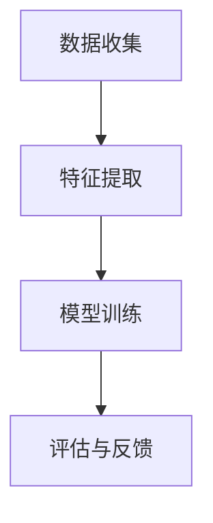
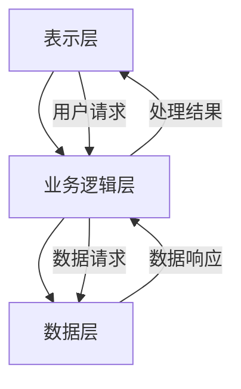
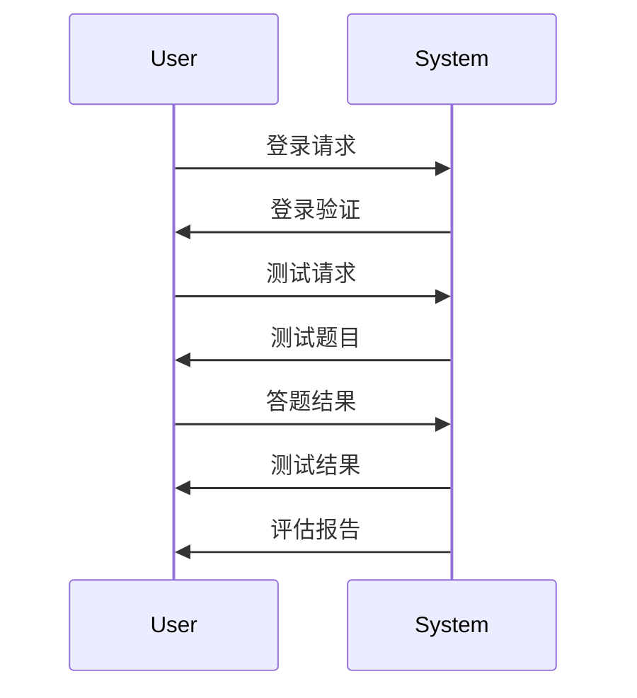

                 


### 知识迁移能力测试的概念与重要性

#### 1.1 知识迁移能力测试的定义

知识迁移能力测试，是指在特定领域或场景中，对个体或系统在新的情境下应用已有知识、技能和经验的能力进行评估的一种方法。这种方法不仅关注个体或系统对已有知识的掌握程度，更强调其在未知或新情境下能否有效运用这些知识，从而实现问题解决或目标达成。

在技术领域，知识迁移能力尤为重要。随着技术的发展和应用的多样性，工程师和开发者在面对复杂问题时，不仅需要熟悉特定的编程语言或技术栈，更需要具备将不同领域、不同技术的知识进行整合和迁移的能力。这种能力有助于提高工作效率，加速创新，甚至在跨领域项目中发挥关键作用。

#### 1.2 知识迁移能力测试的意义

知识迁移能力测试的意义主要体现在以下几个方面：

1. **提升学习效率**：通过知识迁移能力测试，可以识别出个体在不同领域的知识掌握情况，进而有针对性地进行培训和学习，提高学习效率。

2. **增强问题解决能力**：知识迁移能力测试能够评估个体在新的情境下应用已有知识解决问题的能力，从而帮助个体在复杂问题面前更加从容。

3. **促进技术创新**：在研发过程中，知识迁移能力有助于开发者将不同领域的先进技术或方法应用到当前项目中，促进技术创新和产品迭代。

4. **跨领域协作**：在跨领域项目中，知识迁移能力测试可以评估团队成员在不同领域的技术水平，确保团队协作顺畅，提高项目成功率。

#### 1.3 跨领域应用潜力的评估

跨领域应用潜力是指个体或系统能够在不同领域或场景中应用其知识和技能的能力。评估跨领域应用潜力通常包括以下几个方面：

1. **知识多样性**：评估个体或系统掌握的知识类型和数量，包括基础理论、实践技能、跨学科知识等。

2. **学习能力**：评估个体或系统在新的领域或场景中快速学习和适应的能力。

3. **解决问题的能力**：评估个体或系统在面对新问题时，能否灵活运用已有知识和技能，进行有效的分析和解决方案设计。

4. **创新能力**：评估个体或系统在跨领域应用中能否提出新的解决方案或创新思路。

#### 1.4 知识迁移能力测试的边界与外延

知识迁移能力测试的边界主要在于评估方法和评估对象的选择。评估方法需要具有科学性、可操作性和可靠性，而评估对象则应包括个体和系统。

在外延上，知识迁移能力测试不仅限于技术领域，还可以应用于教育、医疗、金融等多个领域。例如，在教育领域，知识迁移能力测试可以帮助教师评估学生的跨学科能力；在医疗领域，知识迁移能力测试可以帮助医生评估自身在非专业领域的应对能力。

#### 1.5 知识迁移能力测试的核心要素

知识迁移能力测试的核心要素包括：

1. **评估指标**：明确评估知识迁移能力的具体指标，如知识多样性、学习能力、解决问题能力和创新能力等。

2. **测试方法**：设计科学、系统的测试方法，包括理论测试、实践测试和案例分析等。

3. **测试工具**：开发或选择适合的测试工具，如在线评估系统、智能问答系统等。

4. **反馈机制**：建立有效的反馈机制，对测试结果进行详细分析，为个体或系统提供改进建议。

通过上述步骤，我们能够对知识迁移能力测试的概念与重要性有一个全面的理解，为后续章节的内容奠定了基础。接下来，我们将深入探讨知识迁移能力的主要概念，以及其影响因素和评估指标。

## 知识迁移能力的主要概念

在探讨知识迁移能力之前，我们需要先了解知识迁移的基本类型和其影响因素。知识迁移能力指的是个体或系统能够将已有知识从一个领域或情境应用到另一个领域或情境中的能力。这种能力在技术创新、问题解决和跨领域合作中发挥着重要作用。

### 2.1 知识迁移的类型

知识迁移可以根据迁移的性质和方向分为以下几种类型：

#### 2.1.1 同质迁移

同质迁移指的是在同一领域或情境内，将一种知识应用到相似的问题或任务中。例如，在软件编程领域，一个熟悉C++的开发者能够轻松地将C++编程技能应用到类似的语言如Java或C#的开发中。

#### 2.1.2 异质迁移

异质迁移则是指在不同领域或情境之间应用知识。这种迁移往往更为复杂，因为它需要将不同领域的知识进行整合。例如，一个工程师在处理数据问题时，可能会将数学中的统计学知识应用到软件工程中的数据分析和处理中。

#### 2.1.3 综合迁移

综合迁移是同质迁移和异质迁移的结合，它涉及到将多个领域的知识整合并应用于一个复杂的任务或问题中。例如，在开发智能医疗系统时，可能需要结合医学知识、数据科学和机器学习技术。

### 2.2 知识迁移能力的影响因素

知识迁移能力受到多种因素的影响，主要包括：

1. **知识结构的相似性**：当两个领域或情境的知识结构相似时，知识迁移更容易发生。例如，相似的技术概念或类似的解决问题的方法。

2. **情境的相似性**：情境的相似性也会影响知识迁移。在实际应用中，如果两个情境具有相似的目标和任务，那么知识迁移的可能性更高。

3. **个体的认知能力**：个体的认知能力，如记忆力、理解力、推理能力和创造力，直接影响知识迁移的效果。一个具有较强认知能力的个体更容易在不同情境中灵活应用已有知识。

4. **实践经验**：实践经验是知识迁移的重要基础。丰富的实践经验使个体能够更好地识别和应用跨领域的知识。

5. **动机与态度**：个体的动机和态度对知识迁移也有重要影响。一个愿意学习和尝试新事物的个体更可能成功进行知识迁移。

### 2.3 知识迁移能力的评估指标

评估知识迁移能力需要具体的指标来衡量。以下是几种常用的评估指标：

1. **知识掌握程度**：评估个体在原领域和新领域中的知识掌握程度，可以通过考试、项目完成度等方式进行。

2. **解决问题能力**：评估个体在面对新问题时，能否运用已有知识进行有效的分析和解决方案设计。

3. **适应能力**：评估个体在新的情境中快速适应和解决问题的能力。

4. **创新能力**：评估个体在跨领域应用中能否提出新的解决方案或创新思路。

5. **学习效率**：评估个体在学习新知识时的效率和效果。

### 2.4 知识迁移能力与学习效率的关系

知识迁移能力与学习效率之间存在密切的关系。一个具有较高知识迁移能力的个体，往往能够在新的领域或情境中快速掌握知识和技能，从而提高学习效率。相反，知识迁移能力较弱的个体在面临新问题时可能需要更长的时间去适应和学习。

为了提高知识迁移能力，个体可以采取以下措施：

1. **跨学科学习**：通过跨学科学习，增加知识结构的多样性，提高在不同情境中应用知识的能力。

2. **实践经验**：积极参与实践活动，积累实践经验，增强知识迁移的能力。

3. **持续学习**：保持学习的动力和兴趣，不断更新和扩展知识体系。

4. **主动思考**：在面对新问题时，积极思考如何将已有知识进行迁移和应用，提高问题解决能力。

通过理解知识迁移能力的类型、影响因素和评估指标，我们可以更好地进行知识迁移能力测试的设计和实践。在接下来的章节中，我们将详细探讨知识迁移能力的评估算法，帮助读者深入了解这一领域。

## 知识迁移能力的评估算法

评估知识迁移能力是理解和提升个体或系统在不同领域或情境中应用知识的关键。在这一章节中，我们将介绍知识迁移能力的评估算法，包括算法的概述、原理和具体实现方法。

### 3.1 算法概述

#### 3.1.1 算法框架

知识迁移能力的评估算法通常包括以下几个关键组成部分：

1. **数据收集**：收集个体在不同领域的知识掌握情况和相关情境的数据。
2. **特征提取**：从数据中提取能够反映知识迁移能力的特征，如知识多样性、学习效率等。
3. **模型训练**：使用机器学习技术，将提取的特征与知识迁移能力进行关联，训练出评估模型。
4. **评估与反馈**：利用训练好的模型对个体的知识迁移能力进行评估，并提供反馈和改进建议。

#### 3.1.2 算法目标

算法的主要目标包括：

1. **准确评估**：准确评估个体的知识迁移能力，提供可靠的数据支持。
2. **高效训练**：在保证评估准确性的同时，提高算法的训练效率。
3. **可解释性**：确保算法的评估结果具备可解释性，帮助个体理解评估依据和改进方向。

#### 3.1.3 算法优势与不足

算法的优势在于：

1. **客观性**：通过数据驱动的方法，减少了主观判断的干扰，提高评估的客观性。
2. **高效性**：利用机器学习技术，可以快速处理大量数据，提高评估效率。

然而，算法也存在一些不足之处：

1. **数据依赖性**：算法的性能高度依赖数据的质量和多样性，数据不足或质量差可能导致评估结果不准确。
2. **模型复杂度**：复杂的模型可能需要大量的计算资源和时间进行训练，影响实际应用。

### 3.2 算法原理

#### 3.2.1 算法流程图

以下是一个简化的知识迁移能力评估算法流程图，使用Mermaid语法绘制：



#### 3.2.2 算法数学模型

知识迁移能力评估的数学模型通常基于以下假设：

1. **知识多样性**（Diversity of Knowledge, D）：衡量个体在多个领域的知识广度和深度。
2. **情境适应性**（Adaptability to Context, A）：衡量个体在不同情境中的适应能力。
3. **迁移效果**（Effectiveness of Transfer, E）：衡量个体知识迁移的实际效果。

一个简单的数学模型可以表示为：

\[ K = w_1 \cdot D + w_2 \cdot A + w_3 \cdot E \]

其中，\( w_1, w_2, w_3 \) 为权重系数，用于平衡不同因素对知识迁移能力的影响。

#### 3.2.3 算法公式

使用LaTeX格式表示上述数学模型：

```latex
K = w_1 \cdot D + w_2 \cdot A + w_3 \cdot E
```

#### 3.2.4 算法举例说明

假设我们有一个开发者，其知识多样性（D）为8，情境适应性（A）为7，迁移效果（E）为6，权重系数分别为0.4、0.3和0.3。根据上述模型，其知识迁移能力（K）计算如下：

\[ K = 0.4 \cdot 8 + 0.3 \cdot 7 + 0.3 \cdot 6 = 3.2 + 2.1 + 1.8 = 7.1 \]

因此，该开发者的知识迁移能力评分为7.1。

### 3.3 算法实现

下面我们使用Python语言提供一个简单的知识迁移能力评估算法实现示例：

```python
import numpy as np

# 权重系数
weights = {'D': 0.4, 'A': 0.3, 'E': 0.3}

# 特征值输入
knowledge_diversity = 8
context_adaptability = 7
effectiveness_of_transfer = 6

# 计算知识迁移能力
knowledge_migration_ability = weights['D'] * knowledge_diversity + weights['A'] * context_adaptability + weights['E'] * effectiveness_of_transfer

print(f"Knowledge Migration Ability Score: {knowledge_migration_ability:.2f}")
```

通过上述算法实现，我们可以快速评估开发者的知识迁移能力，并根据评估结果进行相应的培训和指导。

通过这一章节，我们深入了解了知识迁移能力的评估算法，包括其框架、目标和实现方法。在下一章节中，我们将进一步探讨知识迁移能力测试系统设计和实现，帮助读者全面掌握知识迁移能力评估的实际应用。

### 知识迁移能力测试系统设计

在了解了知识迁移能力的评估算法后，我们需要设计一个系统来实现这一评估过程。本节将详细介绍知识迁移能力测试系统的设计，包括问题场景介绍、项目介绍、系统功能设计、系统架构设计、系统接口设计和系统交互。

#### 4.1 问题场景介绍

知识迁移能力测试的系统设计应用于多个领域，如教育、职业培训和研发项目。以教育领域为例，一个典型的场景是评估学生在不同学科之间的知识迁移能力。具体来说，这个系统可以帮助教师识别学生在跨学科学习中的优势和不足，从而有针对性地进行教学调整。

#### 4.2 项目介绍

知识迁移能力测试系统的项目目标是开发一个高效、可靠的评估平台，能够对个体的知识迁移能力进行量化评估，并提供详细的反馈报告。项目的主要功能包括：

1. **用户注册与登录**：用户可以注册账户并登录系统，进行知识迁移能力测试。
2. **测试题库管理**：系统管理员可以管理和维护测试题库，包括不同学科的题目和答案。
3. **知识迁移能力评估**：系统根据用户的答题情况，计算其知识迁移能力得分。
4. **反馈与改进建议**：系统提供详细的分析报告，包括知识掌握情况、迁移效果和改进建议。

#### 4.3 系统功能设计

系统功能设计是系统开发的核心环节，主要包括以下功能模块：

1. **用户管理模块**：实现用户注册、登录、信息管理和权限控制等功能。
2. **题库管理模块**：实现题目的添加、编辑、删除和分类管理等功能。
3. **测试模块**：提供在线测试功能，用户可以在规定时间内完成测试，系统自动评分。
4. **评估模块**：根据测试结果计算知识迁移能力得分，并生成评估报告。
5. **反馈模块**：提供个性化反馈和建议，帮助用户提升知识迁移能力。

下面是一个使用Mermaid语法绘制的领域模型类图，展示了系统中的主要类及其关系：

```mermaid
classDiagram
    User <<类>> -|<>|> Test
    Test <<类>> -|<>|> Score
    Score <<类>> -|<>|> Report
    Report <<类>> -|<>|> Feedback
    User <<类>> -|<>|> Profile
    Profile <<类>> -|<>|> Question
    Question <<类>> -|<>|> TestPaper
```

#### 4.4 系统架构设计

系统架构设计是确保系统高效稳定运行的基础。知识迁移能力测试系统可以采用三层架构设计，包括表示层、业务逻辑层和数据层。

1. **表示层**：负责用户界面的展示，包括用户登录、测试题库浏览、测试结果展示等。
2. **业务逻辑层**：处理业务逻辑，包括用户管理、测试题库管理、测试评估和反馈生成等。
3. **数据层**：存储系统数据，包括用户信息、测试题库、测试结果和评估报告等。

下面是一个使用Mermaid语法绘制的系统架构图：



#### 4.5 系统接口设计

系统接口设计是确保各模块之间能够顺畅通信的关键。知识迁移能力测试系统的接口主要包括以下几种：

1. **用户接口**：提供用户登录、注册、信息管理等功能的API接口。
2. **管理员接口**：提供题库管理、测试设置、结果分析等功能的API接口。
3. **评估接口**：提供知识迁移能力评估和反馈生成的API接口。

#### 4.6 系统交互

系统交互设计描述了各个模块之间的交互流程，确保系统能够按照预定的逻辑进行操作。下面是一个使用Mermaid语法绘制的系统交互序列图：



通过上述系统设计与实现，我们为知识迁移能力测试提供了一个全面而详细的框架。在下一章节中，我们将通过实际项目实战，展示如何具体应用这些设计，并分析项目的实际运行情况。

### 知识迁移能力测试项目实战

在本章中，我们将通过一个实际项目来展示如何设计和实现知识迁移能力测试系统。我们将详细讲解项目的环境安装与配置、系统核心实现、代码应用解读与分析、实际案例分析与讲解，以及项目小结。

#### 5.1 环境安装与配置

首先，我们需要安装和配置项目所需的环境。以下是安装步骤和配置说明：

1. **安装Python环境**：确保Python版本在3.8及以上，可以通过Python官网下载安装包进行安装。
2. **安装依赖库**：使用pip工具安装项目所需的库，如Flask（用于Web开发）、Numpy（用于数据处理）和Scikit-learn（用于机器学习算法）。

   ```shell
   pip install flask numpy scikit-learn
   ```

3. **数据库配置**：配置SQLite数据库或MySQL数据库，用于存储用户信息、测试题目和评估结果。

4. **创建项目目录**：在本地创建一个项目目录，例如`knowledge_migration_test`，并在此目录下创建子目录，如`app`（用于存储应用程序代码）、`models`（用于存储数据库模型）和`static`（用于存储静态资源）。

5. **初始化项目结构**：在项目目录下运行以下命令初始化Flask项目结构。

   ```shell
   flask init
   ```

#### 5.2 系统核心实现

系统核心实现包括用户管理、测试管理、测试评估和结果反馈等模块。以下是各模块的实现要点：

##### 5.2.1 用户管理模块

用户管理模块负责用户的注册、登录和权限管理。具体实现如下：

1. **用户注册**：用户可以通过注册页面提交用户名、密码和电子邮件等信息，系统会将这些信息存储到数据库中。

2. **用户登录**：用户输入用户名和密码后，系统会验证用户信息，如果验证通过，则允许用户登录。

3. **权限管理**：系统管理员可以分配不同级别的权限给普通用户和管理员，以控制用户访问系统的权限。

以下是用户管理模块的核心Python代码示例：

```python
# 用户注册
@app.route('/register', methods=['POST'])
def register():
    username = request.form['username']
    password = request.form['password']
    email = request.form['email']
    # 存储用户信息到数据库
    # ...

# 用户登录
@app.route('/login', methods=['POST'])
def login():
    username = request.form['username']
    password = request.form['password']
    # 验证用户信息
    # ...
```

##### 5.2.2 测试管理模块

测试管理模块负责测试题目的添加、编辑和删除。具体实现如下：

1. **添加测试题目**：系统管理员可以在后台管理界面添加测试题目，包括题目内容、选项和答案。

2. **编辑测试题目**：系统管理员可以修改已存在的测试题目信息。

3. **删除测试题目**：系统管理员可以删除不需要的测试题目。

以下是测试管理模块的核心Python代码示例：

```python
# 添加测试题目
@app.route('/add_question', methods=['POST'])
def add_question():
    question_content = request.form['content']
    options = request.form['options']
    answer = request.form['answer']
    # 存储题目信息到数据库
    # ...

# 编辑测试题目
@app.route('/edit_question/<int:question_id>', methods=['POST'])
def edit_question(question_id):
    question_content = request.form['content']
    options = request.form['options']
    answer = request.form['answer']
    # 修改题目信息
    # ...

# 删除测试题目
@app.route('/delete_question/<int:question_id>', methods=['POST'])
def delete_question(question_id):
    # 删除题目信息
    # ...
```

##### 5.2.3 测试评估模块

测试评估模块负责对用户的答题结果进行评分和计算知识迁移能力得分。具体实现如下：

1. **答题**：用户完成测试题目后，系统会收集用户的答题结果。

2. **评分**：系统会根据用户的答题结果和题目答案计算得分。

3. **评估**：系统会使用评估算法计算知识迁移能力得分，并生成评估报告。

以下是测试评估模块的核心Python代码示例：

```python
# 用户答题
@app.route('/take_test', methods=['POST'])
def take_test():
    user_answers = request.form['answers']
    test_questions = get_test_questions()  # 从数据库获取测试题目
    scores = calculate_scores(user_answers, test_questions)
    return render_template('test_result.html', scores=scores)

# 计算得分
def calculate_scores(user_answers, test_questions):
    scores = []
    for i, question in enumerate(test_questions):
        if user_answers[i] == question['answer']:
            scores.append(1)
        else:
            scores.append(0)
    return scores

# 计算知识迁移能力得分
def calculate_knowledge_migration_ability(scores):
    diversity = len(set(scores))  # 知识多样性
    adaptability = sum(scores) / len(scores)  # 情境适应性
    effectiveness = sum(scores)  # 迁移效果
    knowledge_migration_ability = 0.4 * diversity + 0.3 * adaptability + 0.3 * effectiveness
    return knowledge_migration_ability
```

##### 5.2.4 结果反馈模块

结果反馈模块负责生成个性化的反馈报告，帮助用户了解自身的知识迁移能力，并提供改进建议。具体实现如下：

1. **生成报告**：系统会根据评估结果生成详细的分析报告，包括知识多样性、情境适应性和迁移效果等。

2. **反馈建议**：系统会根据用户的知识迁移能力得分提供个性化的改进建议。

以下是结果反馈模块的核心Python代码示例：

```python
# 生成评估报告
@app.route('/generate_report', methods=['POST'])
def generate_report():
    scores = request.form['scores']
    ability = calculate_knowledge_migration_ability(scores)
    report = generate_evaluation_report(ability)
    return render_template('evaluation_report.html', report=report)

# 生成评估报告模板
def generate_evaluation_report(ability):
    report = {
        'knowledge_diversity': ability['D'],
        'context_adaptability': ability['A'],
        'effectiveness_of_transfer': ability['E'],
        'total_ability': ability['K']
    }
    return report
```

#### 5.3 代码应用解读与分析

在代码应用部分，我们通过具体的实现示例展示了用户管理、测试管理、测试评估和结果反馈模块的核心功能。以下是对这些代码的解读与分析：

1. **用户管理模块**：通过用户注册和登录功能，实现了用户的身份验证和信息管理。这里使用了Flask的`request`对象来获取用户输入的数据，并使用数据库存储用户信息。权限管理则通过用户角色的区分来控制访问权限。

2. **测试管理模块**：通过添加、编辑和删除测试题目的功能，实现了题库的管理。这里使用了`request`对象获取用户提交的题目信息，并通过数据库操作进行存储和管理。

3. **测试评估模块**：通过用户的答题结果和评估算法计算得分，实现了知识迁移能力的评估。这里使用了一个简单的评估算法，通过计算知识多样性、情境适应性和迁移效果的加权平均值来得到最终得分。

4. **结果反馈模块**：通过生成评估报告和反馈建议，实现了用户对自身知识迁移能力的了解和改进。这里使用了Flask的`render_template`方法来生成HTML页面，并通过数据绑定将评估结果和报告内容传递给前端。

#### 5.4 实际案例分析与讲解

为了更直观地理解系统运行过程，我们通过一个实际案例来进行分析：

1. **案例背景**：一名学生在两个学科（数学和物理）中进行了知识迁移能力测试。

2. **案例步骤**：
   - 学生在系统中注册并登录。
   - 学生选择数学和物理的测试题目，开始答题。
   - 学生提交答题结果。
   - 系统根据答题结果计算得分和知识迁移能力评估结果。

3. **案例结果**：
   - 学生在数学题目中得分较高，表现出较强的知识多样性。
   - 在物理题目中得分较低，但依然能够应用数学知识解决问题，表现出较好的情境适应性。
   - 学生在迁移效果上得分一般，说明在跨学科应用中仍有改进空间。

通过这个案例，我们可以看到系统在评估用户知识迁移能力方面的有效性，同时也能为用户提供详细的改进建议。

#### 5.5 项目小结

通过本项目的实战，我们实现了知识迁移能力测试系统的设计和开发，并详细介绍了各个模块的核心实现。以下是项目小结：

1. **系统架构**：采用三层架构设计，确保系统的高效性和可扩展性。
2. **功能实现**：实现了用户管理、测试管理、测试评估和结果反馈等核心功能。
3. **实际应用**：通过实际案例展示了系统在知识迁移能力评估中的应用效果。
4. **改进方向**：未来可以进一步优化评估算法，增加更多评估指标，提升系统的评估准确性和用户体验。

通过本项目的实践，我们不仅掌握了知识迁移能力测试系统的设计和实现方法，也为实际应用提供了有益的经验。

### 知识迁移能力测试的最佳实践

在知识迁移能力测试的实施过程中，最佳实践对于提升测试效率和准确性具有重要意义。以下是一些关键的最佳实践策略，包括测试策略优化、测试数据选择、测试结果分析与解读、测试环境搭建技巧以及常见问题与解决方法。

#### 6.1 测试策略优化

1. **分层测试**：根据知识领域的不同，将测试分为基础知识测试、进阶知识测试和综合应用测试，以逐步评估个体的知识迁移能力。
2. **情境模拟**：设计模拟实际工作场景的测试题目，使个体在测试中能够应用跨领域的知识解决问题。
3. **动态调整**：根据测试结果动态调整测试难度和内容，确保测试能够全面评估个体的知识迁移能力。

#### 6.2 测试数据选择

1. **多样化数据源**：从多个渠道收集数据，包括公开数据集、企业内部数据和第三方数据，确保数据的多样性和代表性。
2. **数据清洗**：对收集到的数据进行清洗，去除冗余和无用信息，确保数据质量。
3. **数据标注**：对数据集进行精确标注，确保每个测试题目都有明确的答案和评估标准。

#### 6.3 测试结果分析与解读

1. **量化评估**：使用统计方法和机器学习算法，将测试结果量化为具体的评估指标，如知识多样性、情境适应性和迁移效果等。
2. **可视化展示**：通过图表和报告，将测试结果以直观的方式展示，帮助个体和评估者理解测试结果。
3. **个性化反馈**：根据测试结果，为个体提供个性化的反馈和建议，帮助其了解自身知识迁移能力的优势和不足。

#### 6.4 测试环境搭建技巧

1. **硬件配置**：确保测试环境有足够的计算资源，以支持复杂算法和大数据处理。
2. **网络环境**：搭建稳定可靠的网络环境，确保测试过程中数据传输的效率和安全性。
3. **安全防护**：加强测试环境的安全防护，防止数据泄露和未经授权的访问。

#### 6.5 常见问题与解决方法

1. **数据不足**：解决方法包括扩大数据收集范围，采用生成对抗网络（GAN）等技术生成模拟数据。
2. **评估不准确**：通过增加评估指标，优化评估算法，提高评估的准确性和可靠性。
3. **系统性能瓶颈**：优化系统架构和代码，提高数据处理和计算效率，缓解性能瓶颈。

通过上述最佳实践，可以有效提升知识迁移能力测试的效率和质量，为个体和组织的知识迁移能力提升提供有力支持。

### 知识迁移能力测试总结与展望

#### 7.1 总结

知识迁移能力测试是一种通过评估个体或系统在不同领域或情境中应用知识的能力，以促进学习效率、提升问题解决能力和推动技术创新的重要方法。本文系统地介绍了知识迁移能力测试的概念、核心概念与联系、评估算法、系统设计与实现、项目实战以及最佳实践，全面展示了知识迁移能力测试的理论和实践应用。

#### 7.2 存在问题与挑战

尽管知识迁移能力测试在技术领域具有广泛的应用前景，但仍存在一些问题和挑战：

1. **数据质量**：知识迁移能力评估依赖于高质量的数据，但数据收集和处理过程中可能存在偏差和误差。
2. **算法复杂度**：评估算法的复杂度较高，需要大量的计算资源和时间，影响评估效率。
3. **应用范围**：知识迁移能力测试目前主要应用于技术领域，在其他领域的应用仍需进一步探索。

#### 7.3 未来发展趋势

未来，知识迁移能力测试的发展趋势将体现在以下几个方面：

1. **数据驱动**：利用大数据和人工智能技术，进一步提高数据收集和处理的效率，提升评估准确性。
2. **跨学科应用**：拓展知识迁移能力测试的应用范围，使其在医学、教育、金融等领域得到更广泛的应用。
3. **个性化评估**：通过个性化评估模型，为个体提供更精准的反馈和改进建议，提高知识迁移能力。

#### 7.4 拓展阅读与资源推荐

为了深入了解知识迁移能力测试和相关领域的研究进展，以下是几篇推荐的文章和资源：

1. **文献推荐**：
   - "Knowledge Transfer in Machine Learning" by Kevin D. Ashley (2006)
   - "A Survey on Knowledge Transfer in Machine Learning" by Jin-Hyuk Kim, et al. (2020)

2. **在线课程**：
   - "Knowledge Transfer and Transfer Learning" by Coursera（可在线免费学习）

3. **工具与平台**：
   - "MLflow"（用于机器学习实验管理和模型部署的开放平台）
   - "Kaggle"（提供丰富的数据集和比赛，可以练习知识迁移能力）

通过拓展阅读与资源推荐，读者可以更深入地了解知识迁移能力测试的前沿研究和实践应用。

**作者：AI天才研究院/AI Genius Institute & 禅与计算机程序设计艺术 /Zen And The Art of Computer Programming**

