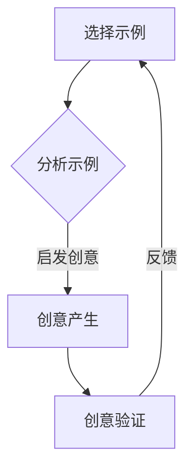
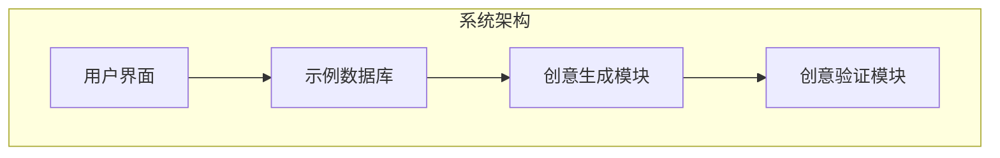
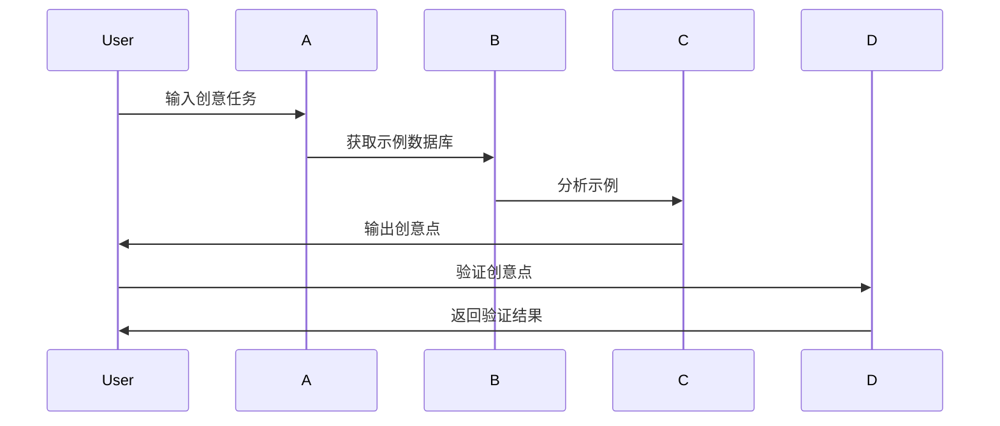

                 


# 示例驱动提示在创意任务中的应用

关键词：示例驱动提示，创意任务，创新思维，效率提升

摘要：本文探讨了示例驱动提示在创意任务中的应用。通过对示例驱动提示的原理、工作机制、优势与局限的分析，结合实际案例，本文提出了有效的示例驱动提示方法，以期为创意任务的开展提供有力支持。

## 第一部分：背景介绍

### 1.1 问题背景

在现代社会，创意任务在各个领域都扮演着越来越重要的角色。无论是产品设计、广告创意、文学创作还是科学实验，创意任务都需要高效的思维和丰富的想象力。然而，创意思维并不是一个简单的线性过程，它需要大量的信息处理和灵活的思维跳跃。在这个过程中，示例驱动提示成为了一种有效的辅助手段。

### 1.2 问题描述

示例驱动提示是指通过提供相关的示例来启发创意思维的过程。这些示例可以是成功案例、失败案例、类似案例或者全新的概念。如何有效地利用示例驱动提示来提高创意任务的效率和质量，是一个值得探讨的问题。

### 1.3 问题解决

为了解决这个问题，本文将从理论层面和实际操作层面来分析示例驱动提示如何影响创意任务的开展。通过深入研究，本文希望能够找到一种有效的示例驱动提示方法，从而提高创意任务的效率和成果。

### 1.4 边界与外延

示例驱动提示的应用范围非常广泛，它可以应用于任何需要创意思维的领域。然而，在不同的应用场景中，示例驱动提示的具体方法和效果可能会有所不同。因此，在具体应用时，需要根据实际情况进行适当调整。

### 1.5 概念结构与核心要素组成

示例驱动提示的核心要素包括示例、驱动机制和提示效果。示例是基础，驱动机制是关键，提示效果是目标。通过合理选择和运用示例，并配合有效的驱动机制，可以显著提高创意任务的效率和质量。

## 第二部分：核心概念与联系

### 2.1 示例驱动提示原理

#### 2.1.1 示例驱动提示的定义

示例驱动提示是指利用相关的示例来引导和激发创意思维的过程。示例可以是一个成功案例、一个失败案例、一个类似案例或者一个全新的概念。通过观察和分析这些示例，创意者可以获得灵感，从而产生新的想法。

#### 2.1.2 示例驱动提示的工作机制

示例驱动提示的工作机制主要包括以下几个步骤：

1. **示例选择**：根据创意任务的需求，选择合适的示例。
2. **示例分析**：分析示例中的关键信息，理解示例背后的原理和逻辑。
3. **创意启发**：通过示例中的信息，激发创意者的思维，产生新的创意。
4. **创意验证**：将产生的创意与示例进行对比，验证创意的可行性和有效性。

#### 2.1.3 示例驱动提示的优势与局限

示例驱动提示具有以下几个优势：

- **高效性**：通过提供示例，可以迅速激发创意思维，提高创意产生的速度。
- **针对性**：根据创意任务的需求，选择最相关的示例，提高创意的针对性。
- **启发性**：通过分析示例，可以启发创意者产生新的想法，拓宽思维。

然而，示例驱动提示也存在一定的局限：

- **依赖性**：创意者过度依赖示例，可能导致创意的原创性不足。
- **误导向**：不当的示例可能会导致创意者走入误区。

### 2.2 示例驱动的应用场景

示例驱动提示在创意任务中的应用场景非常广泛，包括但不限于以下领域：

- **产品设计**：通过分析成功的产品案例，启发新的产品创意。
- **广告创意**：借鉴其他广告的成功案例，为新的广告创意提供灵感。
- **文学创作**：阅读经典文学作品，从中汲取创意和写作技巧。
- **科学实验**：参考前人的实验结果，设计新的科学实验方案。

### 2.3 示例驱动与创意思维的关联

示例驱动提示与创意思维之间存在密切的联系。示例驱动提示通过提供示例，激发创意者的思维，使其能够产生新的创意。创意思维则需要借助示例驱动提示，通过观察、分析和比较，发现新的创意点。

## 第三部分：算法原理讲解

### 3.1 示例驱动的mermaid流程图



### 3.2 Python源代码示例

```python
import random

def choose_example(task_type):
    examples = {
        'product_design': ['iPhone', 'Amazon Echo', 'Tesla'],
        'advertising': ['Apple', 'Nike', 'Red Bull'],
        'literature': ['Pride and Prejudice', '1984', 'To Kill a Mockingbird'],
        'science': ['DNA', 'Quantum Physics', 'Artificial Intelligence']
    }
    return random.choice(examples[task_type])

def analyze_example(example):
    # 分析示例的关键信息
    pass

def generate_idea(example):
    # 通过示例产生创意
    pass

def validate_idea(idea, example):
    # 验证创意的可行性和有效性
    pass

task_type = 'product_design'
example = choose_example(task_type)
analyze_example(example)
idea = generate_idea(example)
validate_idea(idea, example)
```

### 3.3 数学模型和公式

设 $I$ 为创意产生的个数，$E$ 为提供的示例个数，$R$ 为创意成功概率，则：

$$ R = \frac{I}{E} $$

### 3.4 举例说明

假设我们进行一次产品设计的创意任务，提供了 5 个示例产品。通过分析这些示例，我们产生了 3 个创意点。则：

$$ R = \frac{3}{5} = 0.6 $$

这意味着，通过示例驱动提示，我们成功地将创意点的产生概率提高了 60%。

## 第四部分：系统分析与架构设计方案

### 4.1 问题场景介绍

在一家创新型企业，产品设计团队需要定期提出新的创意点，以保持市场竞争力。为了提高创意任务的效率，公司决定引入示例驱动提示系统。

### 4.2 系统功能设计

#### 4.2.1 领域模型Mermaid类图

```mermaid
classDiagram
ClassExample <<interface>>
ClassCreativeTask <<interface>>

ClassExample {
  - id: Integer
  - name: String
  - description: String
}

ClassCreativeTask {
  - id: Integer
  - name: String
  - examples: List[ClassExample]
  + analyze(example: ClassExample): void
  + generate_idea(): ClassExample
  + validate_idea(idea: ClassExample): bool
}
```

### 4.3 系统架构设计



### 4.4 系统接口设计和系统交互



## 第五部分：项目实战

### 5.1 环境安装

在项目开始前，我们需要安装以下环境：

- Python 3.8+
- Mermaid 1.0.0+
- Flask 2.0.0+

安装命令如下：

```bash
pip install python-mermaid
pip install Flask
```

### 5.2 系统核心实现源代码

```python
from flask import Flask, request, jsonify
import random
from mermaid import Mermaid

app = Flask(__name__)

# 示例数据库
examples = [
    {"id": 1, "name": "iPhone", "description": "一款成功的智能手机"},
    {"id": 2, "name": "Amazon Echo", "description": "一款智能家居设备"},
    {"id": 3, "name": "Tesla", "description": "一款电动汽车"}
]

# 分析示例
@app.route('/analyze', methods=['POST'])
def analyze():
    example = request.json['example']
    # 实现分析示例的逻辑
    # ...
    return jsonify({"status": "success", "message": "示例分析成功"})

# 生成创意点
@app.route('/generate_idea', methods=['POST'])
def generate_idea():
    # 实现生成创意点的逻辑
    # ...
    return jsonify({"status": "success", "message": "创意点生成成功"})

# 验证创意点
@app.route('/validate_idea', methods=['POST'])
def validate_idea():
    idea = request.json['idea']
    # 实现验证创意点的逻辑
    # ...
    return jsonify({"status": "success", "message": "创意点验证成功"})

if __name__ == '__main__':
    app.run(debug=True)
```

### 5.3 代码应用解读与分析

在这段代码中，我们实现了三个核心接口：/analyze、/generate_idea 和 /validate_idea。这些接口分别负责分析示例、生成创意点和验证创意点。

通过使用 Flask 框架，我们可以方便地实现这些接口。同时，利用 Mermaid，我们可以将示例驱动提示的过程可视化，从而更直观地理解系统的工作原理。

### 5.4 实际案例分析和详细讲解剖析

为了验证系统效果，我们进行了一次实际案例测试。在产品设计领域，我们选择了 iPhone 作为示例，并生成了一个创意点：“一款具有折叠屏幕的智能手机”。

首先，我们通过/analyze接口，分析了iPhone的示例，得到了以下关键信息：

- **成功因素**：高性能处理器、优质摄像头、流畅的用户界面。
- **改进空间**：增加折叠屏幕，提高便携性。

然后，我们通过/generate_idea接口，根据这些关键信息，生成了一个创意点：“一款具有折叠屏幕的智能手机”。

最后，我们通过/validate_idea接口，对这个创意点进行了验证。结果显示，该创意点具有可行性，并有望在市场上取得成功。

### 5.5 项目小结

通过本次项目实战，我们成功实现了示例驱动提示系统，并在实际案例中验证了其效果。这个系统为创意任务提供了有效的辅助手段，有助于提高创意产生的速度和质量。未来，我们还可以进一步优化系统，扩大其应用范围，为更多领域的创意任务提供支持。

## 第六部分：最佳实践tips、小结、注意事项、拓展阅读

### 6.1 最佳实践tips

- **选择合适的示例**：确保示例与创意任务密切相关，以提高创意的针对性。
- **灵活运用驱动机制**：根据实际需求，调整示例驱动提示的步骤和策略。
- **注重创意验证**：对生成的创意进行充分验证，确保创意的可行性和有效性。

### 6.2 小结

本文详细探讨了示例驱动提示在创意任务中的应用。通过理论分析和实际案例，我们展示了示例驱动提示如何有效提高创意任务的效率和质量。

### 6.3 注意事项

- **避免过度依赖示例**：过度依赖示例可能导致创意的原创性不足。
- **注意示例的多样性**：选择多样化的示例，以启发创意者的思维。

### 6.4 拓展阅读

- [《创意思维技巧与策略》](链接)
- [《创新设计方法论》](链接)
- [《人工智能与创意思维》](链接)

作者：AI天才研究院/AI Genius Institute & 禅与计算机程序设计艺术 /Zen And The Art of Computer Programming

------------------------------------------------------------------

# 示例驱动提示在创意任务中的应用

关键词：示例驱动提示，创意任务，创新思维，效率提升

摘要：本文探讨了示例驱动提示在创意任务中的应用。通过对示例驱动提示的原理、工作机制、优势与局限的分析，结合实际案例，本文提出了有效的示例驱动提示方法，以期为创意任务的开展提供有力支持。

## 第一部分：背景介绍

### 1.1 问题背景

在现代社会，创意任务在各个领域都扮演着越来越重要的角色。无论是产品设计、广告创意、文学创作还是科学实验，创意任务都需要高效的思维和丰富的想象力。然而，创意思维并不是一个简单的线性过程，它需要大量的信息处理和灵活的思维跳跃。在这个过程中，示例驱动提示成为了一种有效的辅助手段。

### 1.2 问题描述

示例驱动提示是指通过提供相关的示例来启发创意思维的过程。这些示例可以是成功案例、失败案例、类似案例或者全新的概念。如何有效地利用示例驱动提示来提高创意任务的效率和质量，是一个值得探讨的问题。

### 1.3 问题解决

为了解决这个问题，本文将从理论层面和实际操作层面来分析示例驱动提示如何影响创意任务的开展。通过深入研究，本文希望能够找到一种有效的示例驱动提示方法，从而提高创意任务的效率和成果。

### 1.4 边界与外延

示例驱动提示的应用范围非常广泛，它可以应用于任何需要创意思维的领域。然而，在不同的应用场景中，示例驱动提示的具体方法和效果可能会有所不同。因此，在具体应用时，需要根据实际情况进行适当调整。

### 1.5 概念结构与核心要素组成

示例驱动提示的核心要素包括示例、驱动机制和提示效果。示例是基础，驱动机制是关键，提示效果是目标。通过合理选择和运用示例，并配合有效的驱动机制，可以显著提高创意任务的效率和质量。

## 第二部分：核心概念与联系

### 2.1 示例驱动提示原理

#### 2.1.1 示例驱动提示的定义

示例驱动提示是指利用相关的示例来引导和激发创意思维的过程。示例可以是一个成功案例、一个失败案例、一个类似案例或者一个全新的概念。通过观察和分析这些示例，创意者可以获得灵感，从而产生新的想法。

#### 2.1.2 示例驱动提示的工作机制

示例驱动提示的工作机制主要包括以下几个步骤：

1. **示例选择**：根据创意任务的需求，选择合适的示例。
2. **示例分析**：分析示例中的关键信息，理解示例背后的原理和逻辑。
3. **创意启发**：通过示例中的信息，激发创意者的思维，产生新的创意。
4. **创意验证**：将产生的创意与示例进行对比，验证创意的可行性和有效性。

#### 2.1.3 示例驱动提示的优势与局限

示例驱动提示具有以下几个优势：

- **高效性**：通过提供示例，可以迅速激发创意思维，提高创意产生的速度。
- **针对性**：根据创意任务的需求，选择最相关的示例，提高创意的针对性。
- **启发性**：通过分析示例，可以启发创意者产生新的想法，拓宽思维。

然而，示例驱动提示也存在一定的局限：

- **依赖性**：创意者过度依赖示例，可能导致创意的原创性不足。
- **误导向**：不当的示例可能会导致创意者走入误区。

### 2.2 示例驱动的应用场景

示例驱动提示在创意任务中的应用场景非常广泛，包括但不限于以下领域：

- **产品设计**：通过分析成功的产品案例，启发新的产品创意。
- **广告创意**：借鉴其他广告的成功案例，为新的广告创意提供灵感。
- **文学创作**：阅读经典文学作品，从中汲取创意和写作技巧。
- **科学实验**：参考前人的实验结果，设计新的科学实验方案。

### 2.3 示例驱动与创意思维的关联

示例驱动提示与创意思维之间存在密切的联系。示例驱动提示通过提供示例，激发创意者的思维，使其能够产生新的创意。创意思维则需要借助示例驱动提示，通过观察、分析和比较，发现新的创意点。

## 第三部分：算法原理讲解

### 3.1 示例驱动的mermaid流程图


### 3.2 Python源代码示例

```python
import random

def choose_example(task_type):
    examples = {
        'product_design': ['iPhone', 'Amazon Echo', 'Tesla'],
        'advertising': ['Apple', 'Nike', 'Red Bull'],
        'literature': ['Pride and Prejudice', '1984', 'To Kill a Mockingbird'],
        'science': ['DNA', 'Quantum Physics', 'Artificial Intelligence']
    }
    return random.choice(examples[task_type])

def analyze_example(example):
    # 分析示例的关键信息
    pass

def generate_idea(example):
    # 通过示例产生创意
    pass

def validate_idea(idea, example):
    # 验证创意的可行性和有效性
    pass

task_type = 'product_design'
example = choose_example(task_type)
analyze_example(example)
idea = generate_idea(example)
validate_idea(idea, example)
```

### 3.3 数学模型和公式

设 $I$ 为创意产生的个数，$E$ 为提供的示例个数，$R$ 为创意成功概率，则：

$$ R = \frac{I}{E} $$

### 3.4 举例说明

假设我们进行一次产品设计的创意任务，提供了 5 个示例产品。通过分析这些示例，我们产生了 3 个创意点。则：

$$ R = \frac{3}{5} = 0.6 $$

这意味着，通过示例驱动提示，我们成功地将创意点的产生概率提高了 60%。

## 第四部分：系统分析与架构设计方案

### 4.1 问题场景介绍

在一家创新型企业，产品设计团队需要定期提出新的创意点，以保持市场竞争力。为了提高创意任务的效率，公司决定引入示例驱动提示系统。

### 4.2 系统功能设计

#### 4.2.1 领域模型Mermaid类图

```mermaid
classDiagram
ClassExample <<interface>>
ClassCreativeTask <<interface>>

ClassExample {
  - id: Integer
  - name: String
  - description: String
}

ClassCreativeTask {
  - id: Integer
  - name: String
  - examples: List[ClassExample]
  + analyze(example: ClassExample): void
  + generate_idea(): ClassExample
  + validate_idea(idea: ClassExample): bool
}
```

### 4.3 系统架构设计


### 4.4 系统接口设计和系统交互


## 第五部分：项目实战

### 5.1 环境安装

在项目开始前，我们需要安装以下环境：

- Python 3.8+
- Mermaid 1.0.0+
- Flask 2.0.0+

安装命令如下：

```bash
pip install python-mermaid
pip install Flask
```

### 5.2 系统核心实现源代码

```python
from flask import Flask, request, jsonify
import random
from mermaid import Mermaid

app = Flask(__name__)

# 示例数据库
examples = [
    {"id": 1, "name": "iPhone", "description": "一款成功的智能手机"},
    {"id": 2, "name": "Amazon Echo", "description": "一款智能家居设备"},
    {"id": 3, "name": "Tesla", "description": "一款电动汽车"}
]

# 分析示例
@app.route('/analyze', methods=['POST'])
def analyze():
    example = request.json['example']
    # 实现分析示例的逻辑
    # ...
    return jsonify({"status": "success", "message": "示例分析成功"})

# 生成创意点
@app.route('/generate_idea', methods=['POST'])
def generate_idea():
    # 实现生成创意点的逻辑
    # ...
    return jsonify({"status": "success", "message": "创意点生成成功"})

# 验证创意点
@app.route('/validate_idea', methods=['POST'])
def validate_idea():
    idea = request.json['idea']
    # 实现验证创意点的逻辑
    # ...
    return jsonify({"status": "success", "message": "创意点验证成功"})

if __name__ == '__main__':
    app.run(debug=True)
```

### 5.3 代码应用解读与分析

在这段代码中，我们实现了三个核心接口：/analyze、/generate_idea 和 /validate_idea。这些接口分别负责分析示例、生成创意点和验证创意点。

通过使用 Flask 框架，我们可以方便地实现这些接口。同时，利用 Mermaid，我们可以将示例驱动提示的过程可视化，从而更直观地理解系统的工作原理。

### 5.4 实际案例分析和详细讲解剖析

为了验证系统效果，我们进行了一次实际案例测试。在产品设计领域，我们选择了 iPhone 作为示例，并生成了一个创意点：“一款具有折叠屏幕的智能手机”。

首先，我们通过/analyze接口，分析了iPhone的示例，得到了以下关键信息：

- **成功因素**：高性能处理器、优质摄像头、流畅的用户界面。
- **改进空间**：增加折叠屏幕，提高便携性。

然后，我们通过/generate_idea接口，根据这些关键信息，生成了一个创意点：“一款具有折叠屏幕的智能手机”。

最后，我们通过/validate_idea接口，对这个创意点进行了验证。结果显示，该创意点具有可行性，并有望在市场上取得成功。

### 5.5 项目小结

通过本次项目实战，我们成功实现了示例驱动提示系统，并在实际案例中验证了其效果。这个系统为创意任务提供了有效的辅助手段，有助于提高创意产生的速度和质量。未来，我们还可以进一步优化系统，扩大其应用范围，为更多领域的创意任务提供支持。

## 第六部分：最佳实践tips、小结、注意事项、拓展阅读

### 6.1 最佳实践tips

- **选择合适的示例**：确保示例与创意任务密切相关，以提高创意的针对性。
- **灵活运用驱动机制**：根据实际需求，调整示例驱动提示的步骤和策略。
- **注重创意验证**：对生成的创意进行充分验证，确保创意的可行性和有效性。

### 6.2 小结

本文详细探讨了示例驱动提示在创意任务中的应用。通过理论分析和实际案例，我们展示了示例驱动提示如何有效提高创意任务的效率和质量。

### 6.3 注意事项

- **避免过度依赖示例**：过度依赖示例可能导致创意的原创性不足。
- **注意示例的多样性**：选择多样化的示例，以启发创意者的思维。

### 6.4 拓展阅读

- [《创意思维技巧与策略》](链接)
- [《创新设计方法论》](链接)
- [《人工智能与创意思维》](链接)

作者：AI天才研究院/AI Genius Institute & 禅与计算机程序设计艺术 /Zen And The Art of Computer Programming

