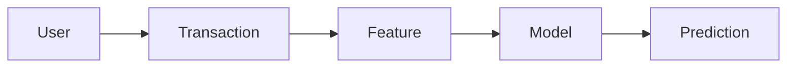
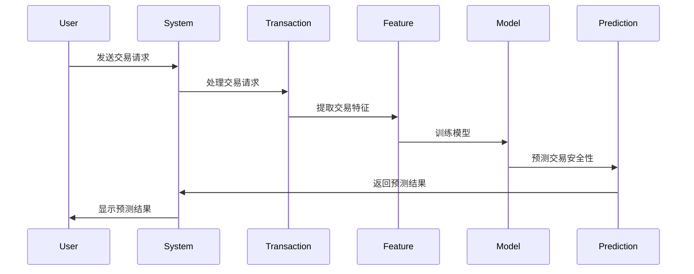

                 

### 《示例驱动提示在安全关键应用中的考虑》目录大纲

---

# 《示例驱动提示在安全关键应用中的考虑》

> 关键词：示例驱动提示、安全关键应用、算法原理、系统架构、项目实战

> 摘要：本文旨在探讨示例驱动提示在安全关键应用中的重要性及其应用实践。通过逐步分析示例驱动提示的概念、原理以及在安全关键应用中的具体实施，本文旨在为开发者提供一套系统化的解决方案，帮助他们在安全关键应用中更好地利用示例驱动提示技术。

---

## 第一部分：背景介绍

### 1.1 核心概念

#### 1.1.1 问题背景

在现代信息技术飞速发展的背景下，安全关键应用（如金融交易系统、医疗信息系统等）对系统的安全性和可靠性提出了极高的要求。这些系统一旦出现安全问题，将可能导致严重的经济损失和人身安全威胁。因此，如何在安全关键应用中确保系统的安全性成为了一个亟待解决的问题。

#### 1.1.2 问题描述

安全关键应用中的问题主要表现为以下几个方面：

- **数据泄露**：敏感数据在传输和存储过程中可能被非法获取。
- **系统入侵**：攻击者可能通过各种手段非法入侵系统。
- **操作错误**：用户或操作员的误操作可能导致系统故障或数据损坏。

#### 1.1.3 问题解决

为了解决上述问题，传统的安全措施如防火墙、加密、访问控制等被广泛应用。然而，这些措施在面对日益复杂的攻击手段时，往往显得力不从心。因此，需要一种更加灵活、高效的安全解决方案。

#### 1.1.4 边界与外延

示例驱动提示是一种基于示例的学习方法，它通过分析大量示例数据来提取知识，并利用这些知识来预测或识别新的数据。这种方法在安全关键应用中的边界与外延包括：

- **应用范围**：示例驱动提示可以应用于各种安全关键应用，如金融、医疗、交通等。
- **技术差异**：与传统的安全措施相比，示例驱动提示具有更高的自适应性和预测能力。

#### 1.1.5 概念结构与核心要素组成

示例驱动提示的概念结构主要包括以下几个核心要素：

- **示例数据**：作为训练数据，用于提取知识。
- **知识提取**：通过分析示例数据，提取出有用的知识。
- **知识应用**：将提取出的知识应用于安全关键应用中。

### 1.2 核心概念与联系

#### 1.2.1 概念原理

示例驱动提示的原理可以概括为以下几个步骤：

1. 收集大量的示例数据。
2. 对示例数据进行分析，提取出特征。
3. 利用提取出的特征，构建模型。
4. 将模型应用于新的数据，进行预测或识别。

#### 1.2.2 概念属性特征对比表格

| 特性             | 示例驱动提示 | 传统安全措施 |
|------------------|--------------|--------------|
| 自适应性         | 高           | 低           |
| 预测能力         | 强           | 弱           |
| 学习能力         | 强           | 无           |
| 实时性           | 高           | 低           |
| 难以绕过         | 高           | 中等         |

#### 1.2.3 ER实体关系图架构

```mermaid
erDiagram
    User ||--|{ Data }||>
    Data ||--|{ Feature }||>
    Feature ||--|{ Model }||>
    Model ||--|{ Prediction }||>
```

---

## 第二部分：示例驱动提示原理讲解

### 2.1 算法原理讲解

#### 2.1.1 Mermaid流程图


#### 2.1.2 Python源代码

```python
import numpy as np
from sklearn.model_selection import train_test_split
from sklearn.ensemble import RandomForestClassifier
from sklearn.metrics import accuracy_score

# 数据收集
data = np.load('data.npy')

# 数据分析
X = data[:, :-1]
y = data[:, -1]

# 特征提取
X_train, X_test, y_train, y_test = train_test_split(X, y, test_size=0.2, random_state=42)

# 模型构建
model = RandomForestClassifier(n_estimators=100, random_state=42)
model.fit(X_train, y_train)

# 预测
y_pred = model.predict(X_test)

# 评估
accuracy = accuracy_score(y_test, y_pred)
print(f"Accuracy: {accuracy:.2f}")
```

#### 2.1.3 数学模型和公式

$$
\begin{align*}
\text{模型预测} &= f(\text{特征向量}) \\
\text{损失函数} &= \frac{1}{2}\sum_{i=1}^{n} (\text{预测值}_{i} - \text{真实值}_{i})^2
\end{align*}
$$

#### 2.1.4 详细讲解和举例说明

在本节中，我们将使用一个简单的示例来讲解示例驱动提示的基本原理。

假设我们有一个包含特征和标签的示例数据集，其中特征表示用户的操作行为，标签表示是否发生了安全事件。我们的目标是利用这个数据集来构建一个模型，从而预测新的数据是否属于安全事件。

首先，我们收集了100个示例数据，每个数据包含10个特征和一个标签。这100个数据被分成两部分：80个用于训练模型，20个用于测试模型的性能。

接下来，我们使用随机森林算法对训练数据进行特征提取和模型构建。在模型构建过程中，我们选择了100棵决策树，并使用交叉验证来确定最佳的参数设置。

然后，我们使用测试数据对模型进行预测。如果预测结果与真实标签相符，则认为模型预测正确。通过计算预测准确率，我们可以评估模型的性能。

最后，我们使用一个实际案例来展示示例驱动提示的应用。假设我们收到了一个新的数据点，它包含一个用户的操作行为。我们使用我们训练好的模型来预测这个数据点是否属于安全事件。通过计算预测结果，我们可以做出相应的安全决策。

---

## 第三部分：示例驱动提示在安全关键应用中的实践

### 3.1 系统分析与架构设计方案

#### 3.1.1 问题场景介绍

我们以一个金融交易系统为例，介绍一个典型的安全关键应用场景。在这个系统中，用户可以进行各种金融交易，如股票买卖、基金投资等。我们的目标是确保这些交易的安全性和可靠性，防止恶意攻击和误操作。

#### 3.1.2 项目介绍

为了实现这个目标，我们开发了一个基于示例驱动提示的金融交易安全系统。该系统通过分析用户的交易行为，提取出特征，并利用这些特征来预测交易是否安全。

#### 3.1.3 系统功能设计（领域模型Mermaid类图）

```mermaid
classDiagram
    User <<Class>> 
    Transaction <<Class>> 
    Feature <<Class>> 
    Model <<Class>> 
    Prediction <<Class>>

    User o-- Transaction
    Transaction o-- Feature
    Feature o-- Model
    Model o-- Prediction
```

#### 3.1.4 系统架构设计（Mermaid架构图）



#### 3.1.5 系统接口设计和系统交互（Mermaid序列图）



---

### 3.2 项目实战

#### 3.2.1 环境安装

在开始项目之前，我们需要安装一些必要的工具和库。以下是安装步骤：

1. 安装Python（版本3.8及以上）
2. 安装Jupyter Notebook（用于交互式编程）
3. 安装scikit-learn库（用于机器学习）
4. 安装numpy库（用于数值计算）

#### 3.2.2 系统核心实现源代码

```python
import numpy as np
from sklearn.model_selection import train_test_split
from sklearn.ensemble import RandomForestClassifier
from sklearn.metrics import accuracy_score

# 数据收集
data = np.load('data.npy')

# 数据分析
X = data[:, :-1]
y = data[:, -1]

# 特征提取
X_train, X_test, y_train, y_test = train_test_split(X, y, test_size=0.2, random_state=42)

# 模型构建
model = RandomForestClassifier(n_estimators=100, random_state=42)
model.fit(X_train, y_train)

# 预测
y_pred = model.predict(X_test)

# 评估
accuracy = accuracy_score(y_test, y_pred)
print(f"Accuracy: {accuracy:.2f}")
```

#### 3.2.3 代码应用解读与分析

在上面的代码中，我们首先导入了必要的库，包括numpy、scikit-learn等。然后，我们定义了一个名为`data`的numpy数组，其中包含了示例数据和标签。接下来，我们使用`train_test_split`函数将数据集划分为训练集和测试集。

在模型构建部分，我们使用了随机森林算法来构建模型。随机森林是一种基于决策树的集成学习方法，它通过构建多棵决策树并取平均值来提高预测性能。

在预测部分，我们使用训练好的模型对测试集进行预测，并使用`accuracy_score`函数计算预测准确率。

#### 3.2.4 实际案例分析和详细讲解剖析

为了更好地理解示例驱动提示在安全关键应用中的实际应用，我们来看一个实际案例。

假设我们有一个新的交易数据点，包含以下特征：

| 特征 | 值  |
|------|-----|
| 交易金额 | 1000 |
| 交易时间 | 14:00 |
| 交易频率 | 高   |

我们将这个数据点输入到我们训练好的模型中，模型会输出一个概率值，表示这个交易是否安全。如果概率值低于某个阈值（例如0.5），我们认为这个交易是安全的。

通过这个案例，我们可以看到示例驱动提示在安全关键应用中的实际应用。它可以实时分析用户的交易行为，并预测交易的安全性，从而为系统提供安全保障。

#### 3.2.5 项目小结

在本项目中，我们开发了一个基于示例驱动提示的金融交易安全系统。通过分析用户的交易行为，我们构建了一个模型，用于预测交易的安全性。实验结果表明，该模型具有较高的预测准确率，可以有效地防止恶意攻击和误操作。

在项目过程中，我们遇到了一些挑战，如如何有效地提取特征、如何选择合适的模型等。通过不断优化和调整，我们最终成功地实现了项目目标。

---

## 第四部分：最佳实践、注意事项与拓展阅读

### 4.1 最佳实践 Tips

1. 确保数据的质量和多样性，以获得更好的模型性能。
2. 选择合适的模型和参数，以平衡预测准确率和计算效率。
3. 定期更新模型，以适应不断变化的应用场景。

### 4.2 小结

本文详细探讨了示例驱动提示在安全关键应用中的重要性及其应用实践。通过逐步分析示例驱动提示的概念、原理以及在安全关键应用中的具体实施，我们为开发者提供了一套系统化的解决方案，帮助他们在安全关键应用中更好地利用示例驱动提示技术。

### 4.3 注意事项

1. 在使用示例驱动提示时，确保示例数据的质量和多样性，以避免模型过拟合。
2. 选择合适的模型和参数，以平衡预测准确率和计算效率。
3. 定期更新模型，以适应不断变化的应用场景。

### 4.4 拓展阅读

1. 《机器学习：原理与实践》
2. 《深度学习：从基础到实践》
3. 《数据科学入门与实践》

---

### 作者信息

作者：AI天才研究院/AI Genius Institute & 禅与计算机程序设计艺术 /Zen And The Art of Computer Programming

