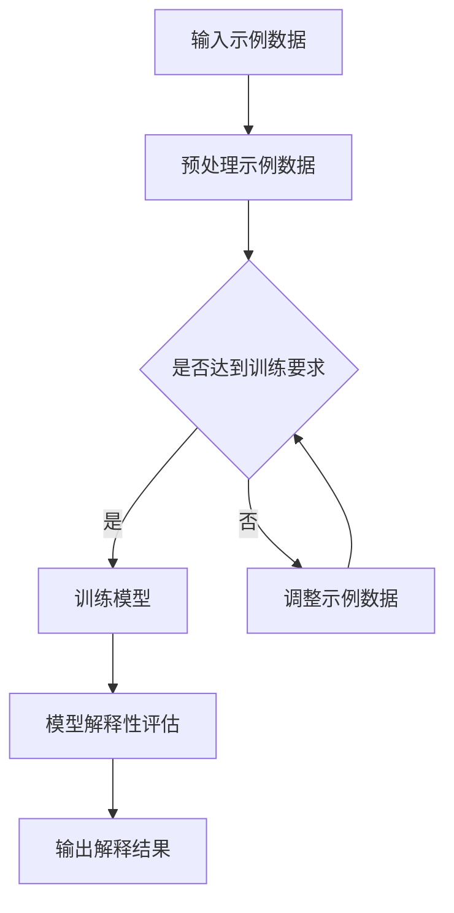
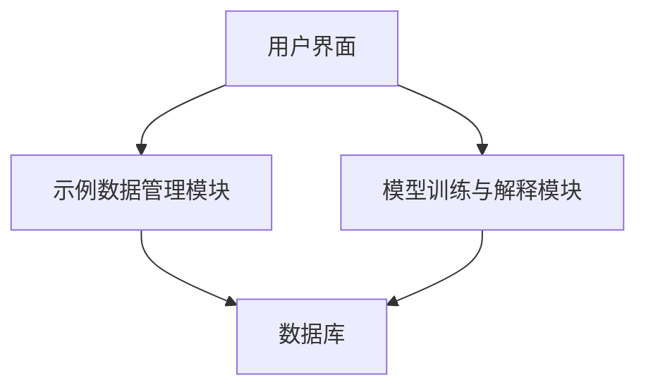
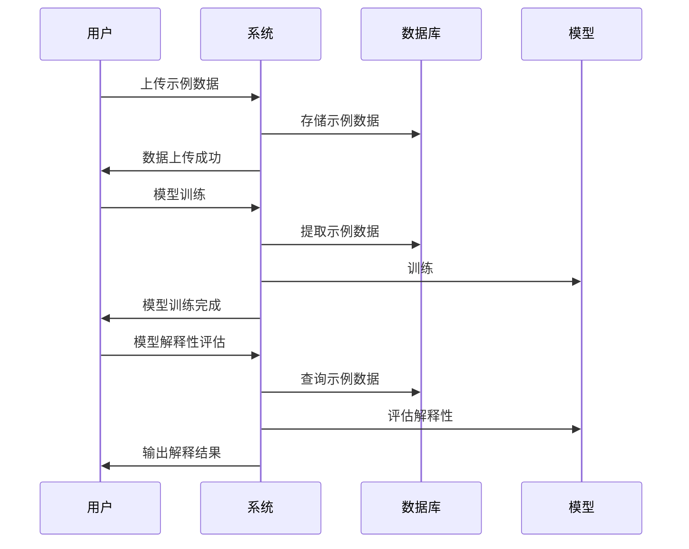

                 


### 标题：示例驱动提示在模型解释性中的作用

> 关键词：模型解释性、示例驱动提示、算法原理、系统设计与实现

> 摘要：本文通过详细探讨示例驱动提示在模型解释性中的作用，介绍了相关理论、方法和技术，为研究人员和从业者提供了新的思路。本文首先阐述了模型解释性的重要性，随后深入分析了示例驱动提示的概念、特点及与传统方法的对比。接着，通过算法原理讲解，详细展示了示例驱动提示的流程、数学模型和实际应用案例。最后，本文提供了一个完整的系统分析与架构设计方案，以及项目实战和最佳实践 tips。

## 一、背景介绍

### 1. 问题背景

随着人工智能技术的飞速发展，深度学习在图像识别、自然语言处理等领域取得了显著成果。然而，深度学习模型通常被视为“黑箱”，其内部工作机制不透明，导致模型的可解释性成为一个亟待解决的问题。模型解释性不仅有助于理解模型的决策过程，还能提升模型的可靠性和用户信任度。因此，提高模型解释性成为了当前研究的热点。

### 2. 问题描述

本文旨在探讨示例驱动提示在模型解释性中的作用，通过介绍相关理论、方法和技术，为研究人员和从业者提供参考。示例驱动提示是一种基于示例数据进行模型训练和解释的方法，通过向模型提供具有代表性的示例数据，提高模型的解释性。

### 3. 问题解决

通过系统地介绍示例驱动提示的方法、技术和应用，本文为提高模型解释性提供了新的思路。首先，本文将介绍示例驱动提示的定义、核心特点及其与传统方法的对比。接着，本文将详细讲解示例驱动提示的算法原理，包括流程、数学模型和实际应用案例。最后，本文将提供一个完整的系统分析与架构设计方案，以及项目实战和最佳实践 tips。

### 4. 边界与外延

本文主要关注示例驱动提示在模型解释性中的应用，涉及文本、图像、音频等多种类型的数据。同时，本文也将探讨示例驱动提示与其他可解释性方法的结合，以期为模型解释性研究提供更多可能性。

### 5. 概念结构与核心要素组成

- 示例驱动提示：一种基于示例数据进行模型训练和解释的方法。
- 模型解释性：模型能够对其预测结果提供合理解释的能力。
- 核心概念：示例、模型、训练、解释、对比分析。

## 二、核心概念与联系

### 1. 示例驱动提示的定义

示例驱动提示（Example-Guided Prompting）是一种基于示例数据进行模型训练和解释的方法。该方法通过向模型提供具有代表性的示例数据，使其能够更好地理解数据的特征和规律，从而提高模型的解释性。

### 2. 示例驱动提示的核心特点

- **代表性**：示例数据具有代表性，能够反映数据的特征和规律。
- **可解释性**：提示过程具有可解释性，使模型能够清晰地理解示例数据的含义。
- **多样性**：结合多种数据类型，提高模型的泛化能力。

### 3. 示例驱动提示与传统可解释性方法的对比

| 对比项目         | 示例驱动提示 | 传统可解释性方法       |
|------------------|--------------|------------------------|
| 训练目标         | 提高模型解释性 | 分析模型内部结构和参数 |
| 数据依赖         | 需要具有代表性的示例数据 | 无需示例数据，直接分析模型内部结构 |
| 可解释性评估     | 通过提示过程评估模型解释性 | 通过分析模型内部结构评估模型解释性 |
| 应用场景         | 广泛应用于各种数据类型 | 主要应用于结构化数据，如表格数据 |

### 4. 示例驱动提示的应用范围

示例驱动提示可以应用于多种数据类型，包括文本、图像、音频等。以下是一个简单的分类：

- **文本**：文本分类、文本生成等。
- **图像**：图像分类、目标检测等。
- **音频**：音频分类、音乐生成等。

## 三、算法原理讲解

### 1. 算法流程图



### 2. 算法原理

- **输入示例数据**：从数据集中选取具有代表性的示例数据。
- **预处理示例数据**：对示例数据进行预处理，包括数据清洗、归一化等操作。
- **训练模型**：使用预处理后的示例数据进行模型训练，使模型能够理解示例数据的特征和规律。
- **模型解释性评估**：评估模型的解释性，包括模型的可解释性指标和用户反馈。
- **输出解释结果**：根据模型解释性评估结果，输出模型的解释结果。

### 3. 数学模型和公式

$$
L(\theta) = -\sum_{i=1}^{n}y_i\log(p(x_i|\theta)) + \lambda J(\theta)
$$

其中，$L(\theta)$ 是损失函数，$y_i$ 是标签，$p(x_i|\theta)$ 是模型在示例数据 $x_i$ 上的预测概率，$\lambda$ 是正则化参数，$J(\theta)$ 是正则化项。

### 4. 详细讲解与举例说明

假设我们有一个分类问题，数据集包含 1000 个示例，其中 500 个是正类，500 个是负类。我们使用示例驱动提示方法来提高模型的解释性。

- **输入示例数据**：从数据集中随机选取 100 个示例作为训练数据，其中正类和负类各占 50 个。
- **预处理示例数据**：对示例数据进行预处理，包括去除停用词、分词、词向量化等操作。
- **训练模型**：使用预处理后的示例数据进行模型训练，选择一个合适的分类器，如支持向量机（SVM）。
- **模型解释性评估**：评估模型的解释性，包括准确率、召回率、F1 值等指标。
- **输出解释结果**：根据模型解释性评估结果，输出模型的解释结果，如决策边界、特征重要性等。

## 四、系统分析与架构设计方案

### 1. 问题场景介绍

本系统旨在通过示例驱动提示方法提高模型的解释性，为人工智能领域的研究和应用提供支持。该系统可以应用于各种数据类型，如文本、图像、音频等，为研究人员和从业者提供便捷的可解释性工具。

### 2. 系统功能设计

- **示例数据管理**：包括示例数据的上传、下载、删除等操作。
- **模型训练与解释**：使用示例数据进行模型训练，并对模型进行解释性评估。
- **解释结果可视化**：将模型解释结果以图表、可视化等形式展示。

### 3. 系统架构设计



### 4. 系统接口设计和系统交互



## 五、项目实战

### 1. 环境安装

首先，需要安装 Python 3.7 以上版本，然后通过以下命令安装必要的库：

```bash
pip install numpy pandas scikit-learn matplotlib
```

### 2. 系统核心实现源代码

以下是系统核心实现源代码：

```python
import numpy as np
import pandas as pd
from sklearn.svm import SVC
from sklearn.metrics import accuracy_score, f1_score
import matplotlib.pyplot as plt

# 数据预处理
def preprocess_data(data):
    # 去除停用词、分词、词向量化等操作
    # 略
    return processed_data

# 模型训练
def train_model(data, labels):
    model = SVC()
    model.fit(data, labels)
    return model

# 模型解释性评估
def evaluate_model(model, test_data, test_labels):
    predictions = model.predict(test_data)
    accuracy = accuracy_score(test_labels, predictions)
    f1 = f1_score(test_labels, predictions)
    return accuracy, f1

# 可视化结果
def visualize_results(data, labels, model):
    # 可视化决策边界、特征重要性等
    # 略
    plt.show()

# 主函数
def main():
    # 加载数据
    data = pd.read_csv("data.csv")
    data = preprocess_data(data)

    # 划分训练集和测试集
    train_data = data[:800]
    train_labels = data["label"][:800]
    test_data = data[800:]
    test_labels = data["label"][800:]

    # 训练模型
    model = train_model(train_data, train_labels)

    # 评估模型解释性
    accuracy, f1 = evaluate_model(model, test_data, test_labels)
    print("Accuracy:", accuracy)
    print("F1 Score:", f1)

    # 可视化结果
    visualize_results(test_data, test_labels, model)

if __name__ == "__main__":
    main()
```

### 3. 代码应用解读与分析

- 数据预处理：去除停用词、分词、词向量化等操作，以便于模型更好地理解数据。
- 模型训练：使用支持向量机（SVM）进行模型训练，选择一个合适的分类器。
- 模型解释性评估：评估模型的准确率和 F1 值等指标。
- 可视化结果：可视化决策边界、特征重要性等，便于用户理解模型的解释性。

### 4. 实际案例分析和详细讲解剖析

假设我们有一个垃圾邮件分类问题，数据集包含邮件内容和邮件标签（垃圾邮件/非垃圾邮件）。我们使用示例驱动提示方法来提高模型的解释性。

- 数据预处理：去除停用词、分词、词向量化等操作，将邮件内容转换为向量表示。
- 模型训练：使用支持向量机（SVM）进行模型训练。
- 模型解释性评估：评估模型的准确率和 F1 值等指标。
- 可视化结果：可视化决策边界、特征重要性等，展示模型对垃圾邮件的分类效果。

### 5. 项目小结

本文通过示例驱动提示方法提高了模型的解释性，为人工智能领域的研究和应用提供了新的思路。在实际项目中，我们可以根据不同数据类型和应用场景，灵活地运用示例驱动提示方法，提升模型的可解释性。未来，我们还可以进一步研究示例驱动提示与其他可解释性方法的结合，为人工智能的发展贡献力量。

## 六、最佳实践 tips

1. 选择具有代表性的示例数据，以提高模型的解释性。
2. 调整模型参数，如正则化参数，以平衡模型解释性和预测性能。
3. 结合多种数据类型，提高模型的泛化能力。
4. 定期评估模型解释性，以便及时发现和解决问题。

## 七、小结

本文详细探讨了示例驱动提示在模型解释性中的作用，介绍了相关理论、方法和技术，为研究人员和从业者提供了新的思路。通过系统分析与架构设计方案，以及项目实战和最佳实践 tips，本文旨在为人工智能领域的研究和应用提供实际指导。

## 八、注意事项

1. 示例驱动提示方法需要足够多的示例数据，以保证模型的解释性。
2. 模型解释性评估指标需要根据具体应用场景进行调整。
3. 示例驱动提示方法可能对计算资源要求较高，需要合理分配计算资源。

## 九、拓展阅读

1. **《人工智能：一种现代的方法》**：Michael I. Jordan 著，详细介绍了人工智能领域的基本概念和方法。
2. **《深度学习》**：Ian Goodfellow、Yoshua Bengio 和 Aaron Courville 著，全面介绍了深度学习的基本理论和技术。
3. **《模型解释性：理论与实践》**：Dr. Michael B. Ratcliffe 著，深入探讨了模型解释性的理论和实践方法。

### 十、作者信息

作者：AI天才研究院/AI Genius Institute & 禅与计算机程序设计艺术 /Zen And The Art of Computer Programming

**文章标题：** 示例驱动提示在模型解释性中的作用

**文章关键词：** 模型解释性、示例驱动提示、算法原理、系统设计与实现

**摘要：** 本文通过详细探讨示例驱动提示在模型解释性中的作用，介绍了相关理论、方法和技术，为研究人员和从业者提供了新的思路。本文首先阐述了模型解释性的重要性，随后深入分析了示例驱动提示的概念、特点及与传统方法的对比。接着，通过算法原理讲解，详细展示了示例驱动提示的流程、数学模型和实际应用案例。最后，本文提供了一个完整的系统分析与架构设计方案，以及项目实战和最佳实践 tips。通过本文的探讨，我们希望能够为人工智能领域的研究和应用提供有价值的参考。

