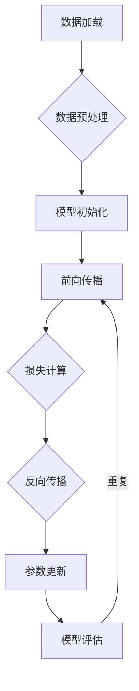

                 

### 第一步：背景介绍

#### 问题背景

随着全球化进程的不断加快，科学研究领域的国际合作变得越来越普遍。各种科研问题，如气候变化、疾病治疗、能源开发等，往往需要跨学科、跨区域的合作才能解决。然而，不同国家和地区的科研环境和资源差异巨大，科研信息的交流障碍、语言和文化差异等问题使得全球化合作面临诸多挑战。

全球化合作在科学研究领域的必要性主要体现在以下几个方面：

1. **科研问题的复杂性**：现代科学研究的主题往往涉及多个学科，单一国家和地区的科研力量难以全面覆盖。例如，癌症治疗不仅需要生物医学的研究，还需要物理、化学、工程等多个领域的支持。

2. **资源共享的需要**：全球范围内的科研机构和实验室拥有不同的设备、技术资源和人才。通过国际合作，可以实现资源的共享和优化配置，提高科研效率。

3. **知识传播的推动**：科研成果的及时交流和共享有助于加速科学知识的传播，促进全球科学共同体的形成和发展。

#### 问题描述

《科学研究的全球化合作：跨国界的世界理解》旨在探讨如何克服上述挑战，实现高效的全球化合作。本书将围绕以下几个核心问题展开：

1. **全球化合作的现状与趋势**：分析当前全球化合作的模式、参与国家和地区以及合作领域的发展趋势。

2. **各国和地区的分工与协作**：探讨不同国家和地区在全球化合作中的角色和责任，分析其合作机制和策略。

3. **跨文化、跨语言沟通的挑战及解决策略**：讨论语言和文化差异对全球化合作的影响，提出相应的沟通策略和文化适应方法。

4. **全球化合作对科研创新的影响**：分析全球化合作如何促进科研创新，提高科研质量和影响力。

#### 问题解决

本书将通过案例分析、理论探讨和实践指导，为解决上述问题提供系统性、全方位的解决方案。具体内容包括：

1. **案例分析**：介绍成功的全球化合作案例，分析其成功因素和经验教训。

2. **理论探讨**：基于全球化和科学研究的理论基础，探讨全球化合作的理论框架和关键问题。

3. **实践指导**：提供具体的合作模式、沟通策略和实践建议，帮助科研人员和实践者更好地进行全球化合作。

#### 边界与外延

- **边界**：本书主要探讨科学研究领域的全球化合作，涵盖生物学、物理学、化学、计算机科学等学科。

- **外延**：虽然本书聚焦于科学研究领域，但其讨论的全球化合作理念和方法也可应用于其他领域的国际合作。

#### 概念结构与核心要素组成

- **全球化合作**：指跨国界、跨区域的科研合作，旨在通过资源共享、知识交流等方式提高科研效率和创新水平。

- **核心概念**：
  - **科研合作网络**：指连接不同国家和地区科研机构、科研人员的信息网络。
  - **合作模式**：包括共享数据、联合研究、共同发表等。
  - **文化差异**：指不同国家和地区的科研文化、语言习惯、交流方式的差异。

本书将通过详细的分析和探讨，为科研人员提供有价值的指导和参考，促进全球科学共同体的形成和发展。

### 第二步：核心概念与联系

#### AI大模型的定义与特点

AI大模型是指那些具有巨大参数量和复杂结构的人工智能模型，它们在深度学习和机器学习领域取得了显著的进展。这些模型的出现，标志着人工智能技术从特定任务导向向通用人工智能迈进的重要一步。

**定义**：AI大模型通常是指那些拥有数十亿到数千亿参数的神经网络模型。例如，GPT系列模型（如GPT-3）、BERT模型等，都是典型的AI大模型。

**特点**：

1. **参数量大**：AI大模型具有数十亿至数千亿个参数，这使得它们能够捕捉到数据中的复杂模式和关系。
2. **结构复杂**：AI大模型通常包括多个层级、多个子网络，这些结构使得模型能够处理多样化的任务和数据类型。
3. **数据依赖性高**：AI大模型需要大量的训练数据来学习和优化，数据的质量和数量直接影响模型的表现。
4. **计算资源需求大**：由于模型参数众多，训练和推理过程需要大量的计算资源，包括高性能的GPU和服务器集群。

#### AI大模型的核心特点

1. **泛化能力强**：AI大模型能够在多种不同的任务和数据集上表现优异，具有较强的泛化能力。
2. **处理效率高**：AI大模型能够高效地处理大规模的数据，缩短了数据处理和分析的时间。
3. **可解释性**：尽管AI大模型的复杂性较高，但通过一些技术（如注意力机制、可视化技术等），研究人员能够更好地理解模型的决策过程，提高模型的透明度和可解释性。
4. **适应性**：AI大模型能够根据新的数据和环境自适应调整，保持其在不同场景下的有效性。

#### AI大模型与传统AI的区别

传统AI（Artificial Intelligence）主要基于规则和符号逻辑，适用于解决特定的问题。例如，专家系统就是一种典型的传统AI应用，它通过一组预定义的规则来模拟专家的决策过程。

**区别**：

1. **基础理论**：传统AI主要依赖于逻辑、概率论和决策论等理论，而AI大模型则是基于神经网络和深度学习的理论。
2. **数据依赖**：传统AI依赖于手写的规则和知识库，而AI大模型依赖于大量的训练数据。
3. **通用性与专一性**：传统AI适用于特定的任务，而AI大模型具有更广泛的泛化能力，能够在多种不同的任务上表现优异。
4. **计算资源**：传统AI通常在计算资源有限的环境下运行，而AI大模型需要大量的计算资源和存储空间。

#### AI大模型在企业中的应用前景

AI大模型在企业中的应用前景广阔，能够为企业带来显著的竞争优势。以下是一些主要的应用领域和潜在的优势：

1. **智能制造**：AI大模型可以帮助企业优化生产流程，提高生产效率和产品质量。例如，通过预测维护系统，企业可以提前发现设备故障，减少停机时间。

2. **金融**：AI大模型在金融领域的应用包括风险评估、投资策略制定、欺诈检测等。例如，通过分析大量市场数据和客户行为，银行和投资公司可以更准确地预测市场趋势和客户需求。

3. **医疗**：AI大模型在医疗领域的应用包括疾病诊断、个性化治疗、药物研发等。例如，通过分析患者的医学影像和病历数据，医生可以更准确地诊断疾病，制定个性化的治疗方案。

4. **教育**：AI大模型在教育领域的应用包括智能辅导、个性化学习路径规划等。例如，通过分析学生的学习数据和反馈，教育机构可以为学生提供更有针对性的学习资源。

**优势**：

1. **提高创新能力**：AI大模型能够快速处理和分析大量数据，帮助企业发现新的商业机会和解决方案。
2. **降低研发成本**：AI大模型可以自动化许多重复性工作，减少人力资源的投入，降低研发成本。
3. **优化决策过程**：AI大模型能够提供基于数据的决策支持，帮助企业做出更明智的决策。
4. **提高客户满意度**：AI大模型可以帮助企业更好地了解客户需求，提供个性化的服务，提高客户满意度。

**挑战**：

1. **数据处理**：AI大模型需要大量的高质量训练数据，数据的收集、处理和存储是巨大的挑战。
2. **模型优化**：AI大模型的结构复杂，优化和调整过程需要大量的时间和计算资源。
3. **安全性**：随着AI大模型在企业中的广泛应用，数据安全和隐私保护成为重要的挑战。

### 第三步：算法原理讲解

#### 算法原理讲解

在《科学研究的全球化合作：跨国界的世界理解》一书中，我们不仅关注全球化合作的现状和挑战，还将深入探讨支撑这些合作的科技手段，特别是人工智能（AI）大模型。在本节中，我们将使用Mermaid流程图、Python源代码、数学模型和公式，详细讲解AI大模型的基本算法原理。

##### Mermaid流程图

首先，让我们通过一个Mermaid流程图来概述AI大模型的基本训练过程：



**详细解释：**

1. **数据加载（A）**：从数据源加载数据，包括训练数据和验证数据。
2. **数据预处理（B）**：对数据进行清洗、归一化等预处理操作，以提高模型训练的效果。
3. **模型初始化（C）**：初始化模型参数，这些参数通常通过随机生成。
4. **前向传播（D）**：输入数据通过模型的各个层级，产生输出预测值。
5. **损失计算（E）**：通过比较模型输出和实际标签，计算损失值，常用的损失函数有均方误差（MSE）、交叉熵损失等。
6. **反向传播（F）**：计算损失关于模型参数的梯度，并将这些梯度用于更新模型参数。
7. **参数更新（G）**：使用优化算法（如梯度下降、Adam等）更新模型参数，以减少损失值。
8. **模型评估（H）**：在验证集上评估模型性能，以检查模型是否过拟合或欠拟合。

##### Python源代码

接下来，我们将用Python源代码来详细阐述上述过程：

```python
import numpy as np
from sklearn.datasets import load_iris
from sklearn.model_selection import train_test_split
from sklearn.metrics import mean_squared_error

# 加载数据
iris = load_iris()
X, y = iris.data, iris.target
X_train, X_test, y_train, y_test = train_test_split(X, y, test_size=0.2, random_state=42)

# 数据预处理
# 假设预处理函数preprocess_data已经定义
X_train_processed = preprocess_data(X_train)
X_test_processed = preprocess_data(X_test)

# 模型初始化
# 假设初始化函数initialize_model已经定义
model = initialize_model()

# 模型训练
for epoch in range(num_epochs):
    # 前向传播
    predictions = model.forward_pass(X_train_processed)
    
    # 损失计算
    loss = mean_squared_error(y_train, predictions)
    
    # 反向传播
    gradients = model.backward_pass(predictions, y_train)
    
    # 参数更新
    model.update_parameters(gradients)

# 模型评估
predictions_test = model.forward_pass(X_test_processed)
loss_test = mean_squared_error(y_test, predictions_test)
print(f"Test Loss: {loss_test}")
```

**详细解释：**

1. **数据加载**：使用scikit-learn的`load_iris`函数加载数据集，并将其分为训练集和测试集。
2. **数据预处理**：调用预处理函数对数据进行标准化等预处理操作。
3. **模型初始化**：初始化神经网络模型，包括设置权重和偏置。
4. **模型训练**：通过循环进行前向传播、损失计算、反向传播和参数更新。
5. **模型评估**：在测试集上评估模型性能，计算测试损失。

##### 数学模型和公式

AI大模型的训练过程可以用以下数学模型和公式来描述：

$$
y' = \sigma(\sum_{i=1}^{n} w_i \cdot x_i + b)
$$

其中，\( y' \) 是模型预测的输出，\( \sigma \) 是激活函数（如Sigmoid或ReLU），\( w_i \) 是权重，\( x_i \) 是输入特征，\( b \) 是偏置。

损失函数通常采用均方误差（MSE）：

$$
J = \frac{1}{2} \sum_{i=1}^{n} (y - y')^2
$$

其中，\( J \) 是损失函数，\( y \) 是实际标签，\( y' \) 是模型预测的输出。

梯度下降算法用于更新模型参数：

$$
w_i := w_i - \alpha \cdot \frac{\partial J}{\partial w_i}
$$

其中，\( \alpha \) 是学习率，\( \frac{\partial J}{\partial w_i} \) 是权重 \( w_i \) 对损失函数 \( J \) 的梯度。

**详细讲解与举例说明**

1. **前向传播**：假设我们有输入特征 \( x = [x_1, x_2, ..., x_n] \) 和权重 \( w = [w_1, w_2, ..., w_n] \)，模型的预测输出可以表示为：
   $$
   y' = \sigma(w_1 \cdot x_1 + w_2 \cdot x_2 + ... + w_n \cdot x_n + b)
   $$
   其中，\( \sigma \) 是Sigmoid函数，\( b \) 是偏置。

2. **损失计算**：以均方误差（MSE）为例，损失函数可以表示为：
   $$
   J = \frac{1}{2} \sum_{i=1}^{n} (y_i - y'_i)^2
   $$
   其中，\( y_i \) 是实际标签，\( y'_i \) 是模型预测的输出。

3. **反向传播**：计算损失关于模型参数的梯度，例如，对于权重 \( w_i \) 的梯度可以表示为：
   $$
   \frac{\partial J}{\partial w_i} = (y_i - y'_i) \cdot \frac{\partial y'_i}{\partial w_i}
   $$
   其中，\( \frac{\partial y'_i}{\partial w_i} \) 是模型预测输出对权重 \( w_i \) 的偏导数。

4. **参数更新**：使用梯度下降算法更新权重 \( w_i \)：
   $$
   w_i := w_i - \alpha \cdot \frac{\partial J}{\partial w_i}
   $$
   其中，\( \alpha \) 是学习率，用于控制参数更新的幅度。

通过上述讲解，我们能够理解AI大模型的基本算法原理，并知道如何使用Python代码实现这些算法。接下来，我们将进一步探讨AI大模型在企业中的应用，以及其在科学研究全球化合作中的潜在贡献。

