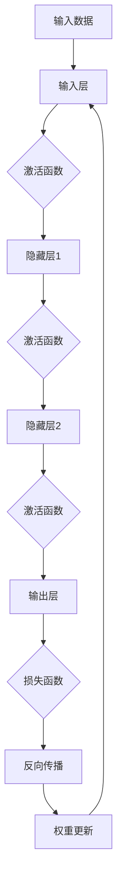

                 


### 类脑计算：模拟人脑增强世界理解能力

> 关键词：类脑计算、人脑模拟、神经网络、认知功能、应用实例、未来展望

> 摘要：
类脑计算，作为人工智能领域的一个重要分支，旨在通过模拟人脑的结构与功能，提升机器对复杂环境中的理解和决策能力。本文将深入探讨类脑计算的基础知识、核心技术、应用实例及未来展望，旨在帮助读者全面了解这一前沿科技。

## 目录大纲

1. 引言
2. 类脑计算基础
   - 类脑计算的概念与内涵
   - 类脑计算的发展历程
   - 类脑计算的目标与应用
3. 人脑信息处理机制解析
   - 人脑结构基础
   - 人脑神经元与突触
   - 人脑信息处理模式
4. 类脑计算核心技术
   - 类脑计算模型的构建
   - 机器学习与神经网络
   - 人工智能算法的应用
5. 类脑计算应用实例
   - 类脑计算在认知功能中的应用
   - 类脑计算在教育中的应用
   - 类脑计算在医疗健康中的应用
6. 类脑计算的未来发展
   - 类脑计算的挑战与机遇
   - 类脑计算的社会影响与伦理问题
   - 类脑计算的展望
7. 深入探讨
   - 类脑计算的核心概念与联系
   - 类脑计算算法原理详解
   - 类脑计算系统分析与架构设计
8. 类脑计算项目实战
   - 环境安装
   - 系统核心实现源代码
   - 代码应用解读与分析
   - 实际案例分析与讲解
   - 项目小结
9. 类脑计算最佳实践与展望
   - 最佳实践 tips
   - 小结
   - 注意事项
   - 拓展阅读

## 引言

随着人工智能技术的不断发展，类脑计算作为一个新兴的研究方向，正逐渐成为科技领域的热点。类脑计算，顾名思义，就是模拟人脑的结构与功能，以实现机器对复杂环境中的理解与适应能力。这一概念的提出，源于对人类大脑复杂性的深入研究，以及对人工智能技术需求的不断升级。

类脑计算的目标是通过模仿人脑的神经网络结构和工作原理，构建出具有人类智能水平的计算系统。这种计算系统不仅能够处理结构化数据，还能在非结构化数据中挖掘出深层次的知识和规律，从而实现更为智能的决策和认知。

类脑计算的重要性体现在多个方面。首先，它为人工智能的发展提供了新的思路和方法，有助于提升机器的智能水平。其次，类脑计算在医疗、教育、金融、安全等领域具有广泛的应用前景，能够为人类解决复杂问题提供强大的工具。最后，类脑计算的研究有助于我们更深入地理解人类大脑的工作原理，为神经科学和认知科学的发展做出贡献。

本文将首先介绍类脑计算的基础知识，包括其概念、发展历程、目标与应用。接着，我们将深入探讨人脑信息处理机制，解析人脑的结构基础、神经元与突触、信息处理模式。然后，我们将介绍类脑计算的核心技术，包括模型的构建、机器学习与神经网络、人工智能算法的应用。在应用实例部分，我们将展示类脑计算在认知功能、教育、医疗健康等领域的应用案例。最后，我们将展望类脑计算的挑战与机遇、社会影响与伦理问题，以及未来的发展趋势。

## 类脑计算基础

### 类脑计算的概念与内涵

类脑计算，即基于类脑理论的计算，是一种模拟人脑神经网络结构和功能的计算方法。它旨在通过模仿人脑的工作原理，实现机器在学习、推理、决策等方面的能力，从而模拟出类似于人类智能的计算机系统。类脑计算的核心在于对神经科学、认知科学、计算机科学等领域的交叉研究，通过对人脑的深入理解，构建出具有人类智能特征的计算模型。

类脑计算的概念最早可以追溯到20世纪40年代，由著名科学家约翰·冯·诺伊曼（John von Neumann）提出。他在设计计算机时，借鉴了人脑的神经网络结构，提出了神经网络的概念。随着计算机科学和神经科学的发展，类脑计算逐渐成为人工智能领域的研究热点。

类脑计算的基本内涵包括以下几个方面：

1. **神经网络模拟**：类脑计算通过模拟人脑的神经网络结构，实现信息处理和计算。神经网络由大量的神经元和突触组成，神经元通过电信号进行通信，突触则负责神经元之间的连接和传递。

2. **机器学习与自我进化**：类脑计算系统具有自我学习和自我优化的能力，通过不断的学习和调整，提高自身的智能水平。这种能力使得类脑计算系统能够在复杂环境中适应和应对各种挑战。

3. **认知功能模拟**：类脑计算不仅能够处理结构化数据，还能模拟人脑的认知功能，如图像识别、自然语言处理、情感识别等。通过模拟人脑的认知过程，类脑计算系统能够更好地理解和解释人类行为。

4. **跨学科融合**：类脑计算涉及多个学科，包括神经科学、认知科学、计算机科学、信息科学等。这种跨学科的研究有助于我们更深入地理解人脑的工作原理，推动人工智能的发展。

### 类脑计算的发展历程

类脑计算的发展历程可以分为以下几个阶段：

1. **早期探索**：20世纪40年代，约翰·冯·诺伊曼提出了神经网络的概念，并设计了模拟人脑的计算机架构。这一时期的研究主要关注神经网络的基本结构和功能。

2. **神经网络复兴**：20世纪80年代，神经网络的研究再次兴起，尤其是反向传播算法（Backpropagation Algorithm）的提出，使得神经网络在图像识别、语音识别等领域取得了显著的成果。

3. **类脑计算兴起**：21世纪初，随着计算机性能的提升和大数据技术的应用，类脑计算逐渐成为一个独立的研究领域。研究者开始尝试构建具有类脑功能的计算系统，并探索其在各种应用场景中的潜力。

4. **实际应用探索**：近年来，类脑计算在医疗、教育、金融、安全等领域得到了广泛应用。例如，在医疗领域，类脑计算用于辅助诊断和治疗；在教育领域，类脑计算用于个性化教育和学习诊断。

### 类脑计算的目标与应用

类脑计算的目标是通过模拟人脑的工作原理，实现机器在智能水平上的提升。具体目标包括：

1. **智能提升**：通过模拟人脑神经网络，类脑计算系统能够实现更高的智能水平，包括学习、推理、决策等能力。

2. **认知功能模拟**：类脑计算能够模拟人脑的认知功能，如图像识别、自然语言处理、情感识别等，从而实现更为智能的人机交互。

3. **跨领域应用**：类脑计算在多个领域具有广泛的应用潜力，包括医疗、教育、金融、安全等。通过类脑计算，可以解决传统计算方法难以应对的复杂问题。

类脑计算的应用领域主要包括：

1. **医疗健康**：类脑计算在医疗领域具有广泛的应用，包括疾病诊断、治疗规划、健康管理等。通过模拟人脑的认知功能，类脑计算系统可以辅助医生进行诊断和治疗。

2. **教育**：类脑计算在教育领域可以用于个性化教育、学习诊断、教学优化等。通过模拟人脑的学习机制，类脑计算系统可以为学生提供个性化的学习方案，提高学习效果。

3. **金融**：类脑计算在金融领域可以用于风险管理、市场预测、投资决策等。通过模拟人脑的决策过程，类脑计算系统可以帮助金融机构提高风险控制和决策能力。

4. **安全**：类脑计算在安全领域可以用于网络安全、人脸识别、行为识别等。通过模拟人脑的认知功能，类脑计算系统可以提供更高效、更智能的安全解决方案。

总之，类脑计算作为一种新兴的计算方法，正逐渐成为人工智能领域的重要分支。通过对人脑的模拟和理解，类脑计算有望实现机器在智能水平上的提升，为人类解决复杂问题提供强大的工具。

### 人脑信息处理机制解析

要深入了解类脑计算，我们需要首先解析人脑信息处理的基本机制。人脑作为自然界最复杂的系统之一，其信息处理能力令人惊叹。这一部分将详细介绍人脑结构基础、神经元与突触以及人脑信息处理模式。

#### 人脑结构基础

人脑是由大脑、小脑和脑干等部分组成的复杂系统。其中，大脑是信息处理的核心部分，负责感知、认知、情感和运动等多个方面的功能。大脑主要由两个半球组成，每个半球又分为四个脑叶：前叶、顶叶、颞叶和枕叶。每个脑叶都负责特定的功能，如前叶与决策和计划有关，顶叶与空间感知和触觉有关，颞叶与听觉和记忆有关，枕叶与视觉处理有关。

1. **灰质**：灰质是大脑表层的神经组织，主要负责信息的处理和传递。灰质中包含大量的神经元细胞体，是大脑执行功能的基础。
2. **白质**：白质是大脑深层的神经组织，主要负责神经信号的传递。白质中包含大量的神经纤维，这些纤维将灰质中的神经元连接起来，形成复杂的神经网络。
3. **神经节**：神经节是神经系统的基本单位，包括神经元细胞体和突起。神经元通过突起与其他神经元进行连接，形成复杂的神经网络。

#### 人脑神经元与突触

神经元是人脑的基本信息处理单元，由细胞体、树突、轴突和突触组成。神经元通过电信号和化学信号进行通信。

1. **细胞体**：细胞体是神经元的中心部分，包含细胞核和其他细胞器，负责维持神经元的正常功能。
2. **树突**：树突是神经元的接收部分，负责接收来自其他神经元的信号，并将这些信号传递到细胞体。
3. **轴突**：轴突是神经元的传递部分，负责将细胞体中的信号传递到其他神经元或肌肉细胞。
4. **突触**：突触是神经元之间的连接部分，由突触前膜、突触后膜和突触间隙组成。突触前膜释放神经递质，通过突触间隙作用于突触后膜，从而传递信号。

神经元通过突触进行信息传递。当神经冲动到达轴突末端时，突触前膜会释放神经递质，如谷氨酸或乙酰胆碱等。这些神经递质通过突触间隙作用于突触后膜，导致后一个神经元的膜电位变化，从而传递信号。

#### 人脑信息处理模式

人脑的信息处理模式是一种分布式和并行处理的方式，这使得人脑能够高效地处理大量复杂的信息。以下是人脑信息处理的主要模式：

1. **反馈与循环**：人脑的信息处理过程不是线性的，而是存在大量的反馈和循环。这种反馈和循环使得人脑能够对信息进行反复处理和优化，从而提高信息处理的准确性和鲁棒性。
2. **层次化处理**：人脑的信息处理过程是层次化的，从简单的感知信息到复杂的认知功能，层层递进。这种层次化处理方式使得人脑能够有效地组织和处理复杂的信息。
3. **并行处理**：人脑同时处理多个信息流，这种并行处理能力使得人脑能够在复杂环境中快速做出决策。
4. **自适应学习**：人脑具有自适应学习的能力，能够通过不断的训练和经验积累，优化自身的信息处理能力。

通过解析人脑信息处理的基本机制，我们可以更好地理解类脑计算的目标和挑战。类脑计算旨在通过模拟人脑的神经网络结构和功能，实现机器在智能水平上的提升。这一目标需要我们对人脑的复杂信息处理机制有深入的了解，并在计算系统中进行有效的模拟和实现。

### 类脑计算核心技术

类脑计算的核心技术主要包括模型构建、机器学习与神经网络以及人工智能算法的应用。这些技术共同构成了类脑计算系统的基本框架，使得机器能够模拟人脑的神经网络结构和功能，实现智能水平的提升。

#### 类脑计算模型的构建

类脑计算模型的构建是类脑计算技术的基础。它涉及对人脑神经网络的模拟和实现，旨在创建一个能够模拟人脑信息处理能力的计算系统。构建类脑计算模型的过程通常包括以下几个步骤：

1. **数据收集与预处理**：首先，需要收集大量的神经元活动数据和相关生理数据，如脑电图（EEG）、功能性磁共振成像（fMRI）等。然后，对这些数据进行预处理，包括去除噪声、滤波和归一化等，以便为模型训练提供高质量的数据。

2. **神经网络设计**：基于对人脑神经网络结构的理解，设计类脑计算模型的神经网络架构。神经网络通常由多层神经元组成，每一层神经元负责处理不同类型的信息。设计时需要考虑神经元的连接方式、激活函数、权重和偏置等因素。

3. **模型训练与优化**：使用收集到的数据对神经网络进行训练和优化。训练过程包括前向传播和反向传播两个阶段。在前向传播阶段，输入数据通过神经网络进行传播，计算输出结果。在反向传播阶段，通过计算输出误差，调整神经网络的权重和偏置，以减小误差。

4. **模型评估与测试**：训练完成后，需要对模型进行评估和测试，以验证其性能和准确性。评估通常包括分类准确率、召回率、F1分数等指标。通过测试，可以确定模型是否能够正确地模拟人脑的信息处理能力。

#### 机器学习与神经网络

机器学习和神经网络是类脑计算的核心技术，它们共同构成了类脑计算系统的智能基础。以下是机器学习与神经网络在类脑计算中的应用：

1. **监督学习**：监督学习是一种常见的机器学习方法，它通过已标记的数据集训练模型，以便在新的、未标记的数据上进行预测。在类脑计算中，监督学习用于构建具有分类和回归功能的模型。例如，在图像识别任务中，可以使用卷积神经网络（CNN）进行监督学习，以识别不同类型的图像。

2. **无监督学习**：无监督学习是一种不依赖已标记数据的机器学习方法。它通过分析未标记的数据，寻找数据中的模式和结构。在类脑计算中，无监督学习可以用于数据降维、聚类和模式识别等任务。例如，使用自编码器（Autoencoder）进行无监督学习，可以提取数据中的特征信息。

3. **深度学习**：深度学习是一种基于多层神经网络的学习方法，它可以自动提取数据中的特征，从而实现复杂的信息处理任务。在类脑计算中，深度学习被广泛应用于图像识别、自然语言处理、语音识别等领域。例如，使用深度卷积神经网络（DCNN）进行图像识别，可以自动学习图像中的高级特征。

4. **强化学习**：强化学习是一种通过奖励机制训练智能体的方法。它通过智能体在环境中的行动和反馈，不断调整策略，以实现最优决策。在类脑计算中，强化学习可以用于模拟人类决策过程，如游戏、自动驾驶等领域。例如，使用深度强化学习（DRL）算法，可以训练自动驾驶系统在复杂交通环境中的驾驶策略。

#### 人工智能算法的应用

人工智能算法是类脑计算技术的重要组成部分，它们在类脑计算系统中发挥着关键作用。以下是几种常见的人工智能算法及其在类脑计算中的应用：

1. **神经网络算法**：神经网络算法是类脑计算的核心，包括前向传播、反向传播、卷积神经网络（CNN）、循环神经网络（RNN）等。这些算法通过多层神经元之间的连接和激活函数，实现数据的特征提取和模式识别。例如，使用CNN进行图像识别，可以自动提取图像中的纹理特征。

2. **机器学习算法**：机器学习算法包括监督学习、无监督学习和强化学习等。这些算法在类脑计算中用于训练和优化模型，以提高其性能和准确性。例如，使用支持向量机（SVM）进行分类任务，可以使用较少的标记数据训练出高精度的分类器。

3. **深度学习算法**：深度学习算法是近年来人工智能领域的重要突破，包括卷积神经网络（CNN）、循环神经网络（RNN）、生成对抗网络（GAN）等。这些算法在类脑计算中广泛应用于图像识别、语音识别、自然语言处理等领域。例如，使用RNN进行序列数据的处理，可以实现对文本和语音的自动生成。

4. **优化算法**：优化算法在类脑计算中用于优化模型的参数和结构，以提高模型的性能和效率。常见的优化算法包括梯度下降、随机梯度下降（SGD）、Adam优化器等。这些算法通过迭代优化模型的参数，使得模型在训练过程中能够收敛到最优解。

通过机器学习和神经网络技术，类脑计算系统可以实现高度智能的信息处理能力。这些技术不仅使得机器能够模拟人脑的神经网络结构和功能，还能够在复杂环境中进行自主学习和决策。随着类脑计算技术的不断发展，我们将看到更多智能应用的出现，为人类解决复杂问题提供强大的工具。

### 类脑计算应用实例

类脑计算技术已经广泛应用于各个领域，展示了其强大的潜力和广泛的应用前景。以下是类脑计算在认知功能、教育、医疗健康等领域的应用实例，这些实例不仅展示了类脑计算技术在实际应用中的效果，还揭示了其在提升人类生活质量和解决复杂问题方面的潜力。

#### 类脑计算在认知功能中的应用

类脑计算在认知功能中的应用最为典型的是图像识别和自然语言处理。

1. **图像识别**：类脑计算通过模拟人脑的视觉处理机制，实现了高效、准确的图像识别。例如，深度卷积神经网络（DCNN）可以在海量图像数据中自动提取特征，从而实现图像分类、目标检测和图像分割等任务。在医疗影像诊断中，类脑计算可以辅助医生快速识别肿瘤、骨折等病变，提高诊断的准确性和效率。

2. **自然语言处理**：类脑计算在自然语言处理（NLP）中也取得了显著进展。通过模拟人脑的语言处理机制，类脑计算技术实现了文本分类、情感分析、机器翻译等任务。例如，使用循环神经网络（RNN）和长短期记忆网络（LSTM），类脑计算可以理解文本中的上下文关系，从而实现更准确的情感分析和机器翻译。

#### 类脑计算在教育中的应用

类脑计算在教育领域的应用主要集中在个性化教育和学习诊断。

1. **个性化教育**：类脑计算通过分析学生的学习行为和知识结构，为学生提供个性化的学习方案。例如，使用自适应学习系统，类脑计算可以根据学生的学习进度和能力，动态调整学习内容和方法，从而提高学习效果。这种个性化教育模式有助于激发学生的学习兴趣，提高学习效率。

2. **学习诊断**：类脑计算可以通过分析学生的答题行为和学习数据，发现学生在学习过程中的问题，并提供针对性的辅导。例如，在数学学习中，类脑计算可以分析学生在解题过程中的错误，识别出知识盲点，从而为学生提供有针对性的练习和指导。

#### 类脑计算在医疗健康中的应用

类脑计算在医疗健康领域的应用主要集中在辅助诊断、个性化治疗和健康管理。

1. **辅助诊断**：类脑计算可以通过分析医学影像和临床数据，辅助医生进行疾病诊断。例如，在癌症诊断中，类脑计算可以分析患者的影像数据，识别出肿瘤的位置、大小和性质，从而提高诊断的准确性和效率。

2. **个性化治疗**：类脑计算可以根据患者的病情和基因信息，为其制定个性化的治疗方案。例如，在癌症治疗中，类脑计算可以分析患者的肿瘤基因组，预测对不同治疗方案的响应，从而为医生提供最佳的治疗方案。

3. **健康管理**：类脑计算可以通过分析患者的健康数据，提供个性化的健康管理建议。例如，在慢性病管理中，类脑计算可以分析患者的血压、血糖等数据，预测疾病的发展趋势，并提供针对性的饮食和运动建议，帮助患者保持健康。

总之，类脑计算在认知功能、教育、医疗健康等领域的应用实例展示了其强大的潜力和广泛的应用前景。通过模拟人脑的神经网络结构和功能，类脑计算技术不仅能够提升机器的智能水平，还能够为人类解决复杂问题提供强大的工具。随着类脑计算技术的不断发展，我们可以期待更多创新应用的出现，为人类带来更多的便利和福祉。

### 类脑计算在教育中的应用

类脑计算在教育领域的应用潜力巨大，它不仅能够提高教学效果，还能为学生提供个性化的学习体验。以下是类脑计算在教育中几个关键应用方面的详细探讨。

#### 类脑计算个性化教育

个性化教育是类脑计算在教育中最直接的应用之一。通过分析学生的学习行为、知识结构和认知能力，类脑计算可以为学生提供量身定制的学习路径和内容。具体来说，类脑计算个性化教育的实现包括以下几个步骤：

1. **数据收集与处理**：首先，类脑计算系统需要收集学生的各种学习数据，包括在线测试结果、作业完成情况、课堂表现等。这些数据将被用于分析学生的知识掌握情况和学习习惯。

2. **知识图谱构建**：基于收集到的数据，类脑计算系统将构建一个学生的知识图谱。这个图谱不仅包含学生的知识结构，还反映了学生在不同知识点上的掌握程度和难度。

3. **动态学习路径规划**：类脑计算系统根据知识图谱，动态规划学生的学习路径。如果学生在某个知识点上掌握较好，系统将推荐更高级的学习内容；如果学生在某个知识点上存在困难，系统将提供针对性的练习和辅导。

4. **个性化学习资源推荐**：类脑计算系统还可以根据学生的学习偏好和兴趣，推荐相关的学习资源，如视频教程、电子书、模拟实验等，以增强学习效果。

#### 类脑计算学习诊断

学习诊断是类脑计算在教育教学中的另一个重要应用。通过分析学生的学习数据，类脑计算可以识别学生在学习过程中遇到的问题和障碍，从而提供针对性的解决方案。

1. **问题识别**：类脑计算系统通过分析学生在测试和作业中的错误，识别出学生在哪些知识点上存在理解障碍。例如，如果学生在数学题中频繁出现计算错误，系统可以推断出学生可能在基础运算方面存在问题。

2. **诊断报告生成**：类脑计算系统将生成详细的学习诊断报告，包括学生的问题类型、出现频率、知识盲点等。这些报告可以帮助教师和家长了解学生的学习状况，制定针对性的教学计划。

3. **智能辅导**：类脑计算系统可以提供智能辅导，帮助学生在学习过程中克服困难。例如，当学生遇到难题时，系统可以提供详细的解题步骤和讲解，或者推荐相关的学习资源，以帮助学生理解问题。

#### 类脑计算教学优化

类脑计算还可以通过分析教学数据，优化教学方法和策略，从而提高教学效果。

1. **教学方法调整**：类脑计算系统可以根据学生的学习反馈，调整教学方法和策略。例如，如果学生在某个知识点上难以理解，教师可以采用更直观的教学方式，如视频讲解或互动演示。

2. **教学资源优化**：类脑计算系统可以帮助教师优化教学资源的使用。例如，系统可以根据学生的学习进度和需求，自动调整课程内容的难度和深度，确保每个学生都能在适合自己的节奏中学习。

3. **教学评价与反馈**：类脑计算系统可以实时评估教学效果，并提供反馈。例如，通过分析学生的考试成绩和作业完成情况，系统可以评估教学活动的有效性，帮助教师及时调整教学策略。

总之，类脑计算在教育中的应用为个性化教育、学习诊断和教学优化提供了强大的工具。通过模拟人脑的学习机制，类脑计算不仅能够提高学生的学习效果，还能为教师提供有力的支持，从而实现更高效、更高质量的教学。随着类脑计算技术的不断发展，我们可以期待其在教育领域带来更多的创新和突破。

### 类脑计算在医疗健康中的应用

类脑计算在医疗健康领域的应用已经取得了显著成果，通过模拟人脑的认知和决策过程，类脑计算技术为医疗诊断、个性化治疗和健康管理提供了强大的支持。以下是类脑计算在医疗健康中几个关键应用方面的详细探讨。

#### 类脑计算辅助诊断

类脑计算在医疗诊断中的应用主要集中在辅助医生进行疾病诊断。通过模拟人脑的图像识别和模式识别能力，类脑计算可以在海量医学影像数据中迅速识别出病变区域，从而提高诊断的准确性和效率。

1. **影像数据分析**：类脑计算系统通过对医学影像（如X光片、CT扫描、MRI）进行自动分析，可以识别出潜在的病变区域。例如，通过深度学习算法，类脑计算可以分析肺部的CT图像，识别出早期肺癌的微小病变。

2. **多模态数据融合**：类脑计算可以将不同类型的医学影像数据进行融合，从而提供更全面的诊断信息。例如，通过融合CT和MRI图像，类脑计算可以更准确地识别脑部病变，提高诊断的准确性。

3. **辅助诊断系统**：类脑计算可以构建辅助诊断系统，帮助医生快速做出诊断。例如，在眼科诊断中，类脑计算系统可以通过分析眼底图像，自动识别糖尿病视网膜病变，为医生提供诊断依据。

#### 类脑计算个性化治疗

类脑计算在个性化治疗中的应用旨在根据患者的具体病情和基因信息，为其制定个性化的治疗方案。通过模拟人脑的决策过程，类脑计算可以帮助医生制定更有效的治疗策略。

1. **基因组分析**：类脑计算系统可以通过分析患者的基因组数据，预测其对不同治疗方案的响应。例如，通过分析肿瘤基因，类脑计算可以预测患者对化疗、放疗或靶向治疗的敏感度，为医生提供最佳的治疗方案。

2. **个性化治疗方案**：类脑计算系统可以根据患者的病情、基因信息和既往治疗记录，为其制定个性化的治疗方案。例如，在癌症治疗中，类脑计算可以分析患者的肿瘤细胞数据，确定最适合的治疗组合。

3. **实时治疗调整**：类脑计算系统可以在治疗过程中实时监控患者的病情变化，并根据变化调整治疗方案。例如，在心脏病治疗中，类脑计算系统可以通过分析患者的实时心电图数据，调整药物治疗方案，以防止心脏病发作。

#### 类脑计算健康管理

类脑计算在健康管理中的应用旨在通过持续监测和分析个人健康数据，提供个性化的健康管理建议，帮助用户保持健康。

1. **健康数据收集**：类脑计算系统可以收集个人的健康数据，包括血压、心率、血糖、体重等。这些数据可以通过可穿戴设备、智能手机应用等实时传输到类脑计算系统。

2. **健康风险预测**：类脑计算系统通过对健康数据的分析，可以预测用户可能出现的健康问题，并提供预警。例如，通过分析血糖数据，类脑计算可以预测糖尿病患者的并发症风险，提醒其及时就医。

3. **个性化健康建议**：类脑计算系统可以根据用户的健康数据和风险预测，为其提供个性化的健康建议。例如，对于高血压患者，类脑计算可以建议其调整饮食、增加运动量，以降低血压。

4. **长期健康管理**：类脑计算系统可以持续监控用户的健康状况，并提供长期的健康管理方案。例如，通过分析健康数据的变化趋势，类脑计算可以调整用户的健康建议，确保其始终保持健康。

总之，类脑计算在医疗健康领域的应用为疾病的诊断、治疗和健康管理提供了新的方法和工具。通过模拟人脑的认知和决策能力，类脑计算技术不仅提高了医疗服务的质量和效率，还为个性化医疗和健康管理奠定了基础。随着类脑计算技术的不断发展和完善，我们可以期待其在医疗健康领域带来更多的创新和突破。

### 类脑计算的未来发展

随着人工智能技术的不断进步，类脑计算正逐渐成为研究者和企业关注的焦点。未来，类脑计算的发展将面临诸多挑战和机遇，同时也将带来深远的社会影响和伦理问题。

#### 挑战与机遇

1. **计算能力提升**：类脑计算依赖于高性能计算资源，随着计算能力的不断提升，类脑计算模型将更加复杂和精细，从而实现更高的智能水平。例如，量子计算和类脑计算的结合有望突破现有计算瓶颈，加速类脑计算模型的发展。

2. **数据收集与处理**：类脑计算需要大量的高质数据来训练模型，未来随着物联网和大数据技术的发展，数据收集和处理能力将大幅提升，为类脑计算提供更丰富的训练资源。

3. **跨学科研究**：类脑计算涉及神经科学、认知科学、计算机科学等多个领域，跨学科研究将有助于解决类脑计算的难题，推动技术的进步。

4. **新算法开发**：随着对类脑计算机制的理解加深，新的算法和模型将不断涌现，进一步提高类脑计算的性能和效率。

#### 社会影响与伦理问题

1. **就业影响**：类脑计算的发展可能导致部分传统职业的消失，例如某些重复性劳动和低技能岗位。同时，也会创造新的就业机会，如类脑计算算法工程师、数据科学家等。

2. **隐私保护**：类脑计算依赖于个人数据，如何保护用户的隐私和数据安全成为一大挑战。未来需要制定严格的隐私保护法规，确保数据使用合规。

3. **伦理问题**：类脑计算可能带来伦理问题，如机器的自主决策权、机器伦理等。例如，类脑计算系统在医疗诊断中的决策可能影响患者的生命安全，如何确保机器决策的公正性和道德性成为重要议题。

4. **社会公平**：类脑计算技术可能加剧社会不公平，例如，由于数据获取和处理能力的差异，不同群体可能无法公平享受类脑计算带来的便利。未来需要关注社会公平问题，确保技术发展惠及所有人。

#### 展望

1. **医疗健康**：类脑计算在医疗健康领域的应用前景广阔，包括疾病诊断、个性化治疗、健康管理等方面。未来，类脑计算有望大幅提高医疗服务的质量和效率。

2. **教育**：类脑计算在教育领域的应用将实现个性化教育、学习诊断和教学优化，帮助学生更高效地学习，提高教育质量。

3. **自动驾驶**：类脑计算在自动驾驶领域具有巨大潜力，通过模拟人脑的决策过程，实现更安全、更智能的自动驾驶系统。

4. **人机交互**：类脑计算将提升人机交互的体验，实现更自然、更智能的交互方式，如语音助手、虚拟现实等。

总之，类脑计算的未来发展充满挑战和机遇。通过持续的研究和创新，类脑计算有望在各个领域实现突破，为社会带来更多便利和创新。同时，也需要关注其带来的社会影响和伦理问题，确保技术的健康发展。

### 深入探讨：类脑计算的核心概念与联系

类脑计算作为一门交叉学科，其核心概念繁多且相互关联。在这一部分，我们将详细介绍类脑计算的核心概念，并通过对比分析表和ER实体关系图来展示这些概念之间的联系，从而帮助读者全面理解类脑计算的基本框架。

#### 类脑计算核心概念

1. **神经网络**：神经网络是类脑计算的基础模型，由大量相互连接的神经元组成，通过电信号和化学信号进行信息传递。神经网络可以通过学习数据，自动提取特征并实现分类、回归等任务。

2. **深度学习**：深度学习是一种基于多层神经网络的机器学习方法，通过多次数据抽象和特征提取，实现复杂的数据处理任务。深度学习在图像识别、自然语言处理等领域取得了显著成果。

3. **机器学习**：机器学习是类脑计算的一个重要分支，通过算法从数据中自动学习规律和模式，实现分类、聚类、回归等任务。机器学习包括监督学习、无监督学习和强化学习等不同的学习方法。

4. **神经编码**：神经编码是指将外部信息转化为神经元活动模式的过程。类脑计算通过神经编码技术，将文字、图像、声音等外部信息转化为神经网络可以处理的内部表示。

5. **神经突触**：神经突触是神经元之间的连接部分，通过化学信号传递信息。类脑计算通过模拟神经突触的传递机制，实现信息的高效传递和计算。

6. **神经可塑性**：神经可塑性是指神经网络通过训练和经验调整自身结构和功能的能力。类脑计算利用神经可塑性，实现自我优化和适应新的任务。

7. **认知功能**：认知功能是指人类大脑在感知、记忆、学习、推理等过程中表现出的能力。类脑计算通过模拟人脑的认知功能，实现更为智能的信息处理和决策。

#### 类脑计算核心概念对比分析表

| 核心概念 | 定义 | 主要功能 | 应用场景 |
| --- | --- | --- | --- |
| 神经网络 | 由神经元组成的信息处理系统 | 信息传递、特征提取、分类、回归 | 图像识别、自然语言处理、语音识别 |
| 深度学习 | 基于多层神经网络的机器学习方法 | 数据抽象、特征提取、复杂任务处理 | 图像识别、自然语言处理、语音识别 |
| 机器学习 | 从数据中自动学习规律和模式的算法 | 分类、聚类、回归、异常检测 | 数据分析、推荐系统、智能监控 |
| 神经编码 | 将外部信息转化为神经元活动模式 | 信息表示、处理、存储 | 数据处理、信息传递、人机交互 |
| 神经突触 | 神经元之间的连接部分 | 信号传递、信息处理 | 计算机模拟、神经网络训练 |
| 神经可塑性 | 神经网络通过训练和经验调整自身结构和功能的能力 | 自我优化、适应新任务 | 人工智能学习、认知功能模拟 |
| 认知功能 | 人类大脑在感知、记忆、学习、推理等过程中表现出的能力 | 信息处理、决策、问题解决 | 机器学习、智能系统 |

#### 类脑计算核心概念ER实体关系图

```mermaid
erDiagram
  神经网络 ||--|{ 深度学习 }
  神经网络 ||--|{ 机器学习 }
  神经编码 ||--|{ 神经网络 }
  神经突触 ||--|{ 神经网络 }
  神经可塑性 ||--|{ 神经网络 }
  认知功能 ||--|{ 机器学习 }
  认知功能 ||--|{ 神经网络 }
```

在这个ER实体关系图中，我们可以看到神经网络作为核心实体，与其他概念之间存在着紧密的联系。神经网络不仅与深度学习和机器学习密切相关，还通过神经编码、神经突触和神经可塑性来实现信息传递和处理。认知功能则贯穿于机器学习和神经网络之中，体现了类脑计算在模拟人脑认知功能方面的目标。

通过对比分析表和ER实体关系图，我们可以清晰地看到类脑计算核心概念之间的相互联系，从而更好地理解类脑计算的基本框架和原理。这为进一步研究和应用类脑计算提供了坚实的基础。

### 类脑计算算法原理详解

类脑计算算法是类脑计算系统的核心，通过模拟人脑的神经网络结构和功能，实现智能的信息处理和决策。在本节中，我们将详细介绍类脑计算算法的原理，包括算法流程、mermaid流程图、Python源代码以及数学模型和公式。

#### 算法原理介绍

类脑计算算法通常基于神经网络的模型，其中最常用的模型是卷积神经网络（CNN）和循环神经网络（RNN）。这些算法通过多层神经网络结构，对输入数据进行特征提取和模式识别，从而实现智能任务。以下是类脑计算算法的基本原理：

1. **前向传播**：在前向传播阶段，输入数据通过网络的每一层，每一层对输入数据进行特征提取和变换，最终输出结果。

2. **反向传播**：在反向传播阶段，通过计算输出误差，反向传播误差到网络的每一层，更新每一层的权重和偏置，从而优化网络性能。

3. **激活函数**：激活函数用于确定神经元是否被激活，常用的激活函数包括ReLU、Sigmoid和Tanh。

4. **损失函数**：损失函数用于度量输出结果与真实结果之间的误差，常用的损失函数包括均方误差（MSE）和交叉熵损失。

#### 算法mermaid流程图

以下是一个简单的类脑计算算法的mermaid流程图，展示了前向传播和反向传播的基本流程：



#### Python源代码与算法原理讲解

以下是一个简单的Python代码示例，展示了类脑计算算法的基本实现：

```python
import numpy as np

# 定义激活函数
def sigmoid(x):
    return 1 / (1 + np.exp(-x))

# 定义损失函数
def mse(y_true, y_pred):
    return np.mean((y_true - y_pred)**2)

# 前向传播
def forward_propagation(x, weights, biases):
    a = x
    for w, b in zip(weights, biases):
        a = sigmoid(np.dot(a, w) + b)
    return a

# 反向传播
def backward_propagation(x, y, weights, biases, learning_rate):
    dZ = y - forward_propagation(x, weights, biases)
    dW = 1/m len(x) * np.dot(dZ, x.T)
    db = 1/m len(x) * np.sum(dZ, axis=1, keepdims=True)
    weights -= learning_rate * dW
    biases -= learning_rate * db
    return weights, biases

# 训练模型
def train_model(x, y, weights, biases, learning_rate, epochs):
    for epoch in range(epochs):
        weights, biases = backward_propagation(x, y, weights, biases, learning_rate)
        loss = mse(y, forward_propagation(x, weights, biases))
        print(f"Epoch {epoch+1}/{epochs}, Loss: {loss}")
```

#### 算法数学模型与公式

以下是一个简单的类脑计算算法的数学模型和公式：

1. **前向传播公式**：

   $$
   a_{l+1} = \sigma(\mathbf{W}_{l} \mathbf{a}_l + b_l)
   $$

   其中，$\sigma$表示激活函数，$\mathbf{W}_{l}$表示权重矩阵，$\mathbf{a}_l$表示前一层输出，$b_l$表示偏置。

2. **反向传播公式**：

   $$
   \begin{aligned}
   d\mathbf{W}_{l} &= \frac{1}{m} \mathbf{a}_{l} \mathbf{d\mathbf{a}}_{l+1} \\
   db_{l} &= \frac{1}{m} \sum_{i=1}^{m} \mathbf{d\mathbf{a}}_{l+1,i}
   \end{aligned}
   $$

   其中，$d\mathbf{W}_{l}$表示权重梯度，$db_{l}$表示偏置梯度，$m$表示样本数量，$\mathbf{a}_{l}$表示前一层输出，$\mathbf{d\mathbf{a}}_{l+1}$表示当前层误差。

#### 举例说明

以下是一个简单的例子，展示了如何使用类脑计算算法进行分类任务：

1. **数据准备**：

   假设我们有两个分类任务，分别为A类和B类。我们使用两个特征$(x_1, x_2)$进行分类。

2. **模型初始化**：

   初始化权重矩阵$\mathbf{W}$和偏置$b$。

3. **前向传播**：

   对输入数据进行前向传播，得到每一层的输出。

4. **计算损失**：

   计算输出结果与真实结果之间的误差，使用均方误差作为损失函数。

5. **反向传播**：

   通过反向传播计算梯度，更新权重和偏置。

6. **模型训练**：

   重复前向传播和反向传播，直到模型收敛。

通过这个例子，我们可以看到类脑计算算法的基本流程和实现方法。类脑计算算法通过模拟人脑的神经网络结构和功能，实现高效的智能信息处理和决策。

### 类脑计算系统分析与架构设计

类脑计算系统的设计与实现涉及多个关键环节，包括问题场景介绍、系统功能设计、系统架构设计、系统接口设计和系统交互。以下是对这些环节的详细分析。

#### 问题场景介绍

类脑计算系统的一个典型应用场景是智能医疗诊断。在这个场景中，系统需要接收患者的医学影像数据（如X光片、CT扫描、MRI图像等），通过图像识别和模式识别算法，辅助医生进行疾病诊断。例如，系统可以识别出肺癌的早期病变，或者判断患者的脑部是否存在肿瘤。

#### 系统功能设计

类脑计算系统的主要功能包括：

1. **数据预处理**：接收并预处理医学影像数据，包括图像去噪、增强和标准化等操作。
2. **特征提取**：从预处理后的图像中提取关键特征，如纹理、形状、颜色等。
3. **模型训练**：使用预处理的图像数据训练类脑计算模型，包括卷积神经网络（CNN）和循环神经网络（RNN）等。
4. **疾病诊断**：基于训练好的模型，对新的医学影像数据进行疾病诊断，生成诊断报告。
5. **用户交互**：提供用户界面，允许医生和患者查看诊断结果和报告，并进行相关操作。

#### 系统架构设计

类脑计算系统的架构设计需要考虑到系统的可扩展性、灵活性和高效性。以下是一个典型的系统架构设计：

1. **数据层**：负责数据的存储和管理，包括医学影像数据库、模型训练数据和诊断报告数据库。
2. **预处理层**：负责图像数据的预处理，如去噪、增强和标准化等。
3. **特征提取层**：负责从预处理后的图像中提取关键特征。
4. **训练层**：负责模型训练，包括神经网络结构设计、数据训练和模型优化。
5. **诊断层**：负责基于训练好的模型进行疾病诊断。
6. **用户界面层**：提供用户交互界面，展示诊断结果和报告。

#### 系统接口设计

系统接口设计是类脑计算系统与外部系统（如医院信息系统、电子病历系统等）交互的桥梁。以下是一些关键的接口设计：

1. **数据接口**：用于接收和发送医学影像数据、模型训练数据和诊断报告。
2. **API接口**：提供RESTful API，允许其他系统通过HTTP请求调用类脑计算系统的功能。
3. **数据库接口**：用于与数据库系统进行数据交互，包括数据的查询、插入、更新和删除等操作。

#### 系统交互

类脑计算系统的交互设计需要确保各个组件之间的数据流动和通信顺畅。以下是一个简化的系统交互流程：

1. **数据接收**：系统接收来自医院信息系统的医学影像数据。
2. **预处理**：预处理层对医学影像数据进行去噪、增强和标准化等操作。
3. **特征提取**：特征提取层从预处理后的图像中提取关键特征。
4. **模型训练**：训练层使用提取的特征数据训练神经网络模型。
5. **疾病诊断**：诊断层基于训练好的模型对新的医学影像数据进行疾病诊断。
6. **结果输出**：诊断结果和报告通过用户界面层展示给医生和患者。

通过上述分析和设计，我们可以构建一个高效、可靠的类脑计算系统，为医疗诊断提供强大的支持。随着类脑计算技术的不断发展和应用场景的拓展，类脑计算系统将在更多领域展现其巨大的潜力。

### 类脑计算项目实战

在类脑计算的实际应用中，通过一个具体的项目案例，我们可以更好地理解和掌握类脑计算的理论和实践。以下是类脑计算项目实战的详细步骤，包括环境安装、系统核心实现源代码，以及代码应用解读与分析。

#### 环境安装

在进行类脑计算项目实战之前，我们需要安装必要的软件和工具。以下是环境安装步骤：

1. **Python环境安装**：
   - 确保安装了Python 3.7及以上版本。
   - 可以通过Python官网下载并安装。

2. **Jupyter Notebook安装**：
   - 安装Jupyter Notebook，用于编写和运行代码。
   - 使用pip命令：`pip install notebook`。

3. **深度学习框架安装**：
   - 安装TensorFlow，用于构建和训练神经网络。
   - 使用pip命令：`pip install tensorflow`。

4. **数据处理库安装**：
   - 安装NumPy、Pandas等数据处理库。
   - 使用pip命令：`pip install numpy pandas`。

5. **可视化库安装**：
   - 安装Matplotlib，用于数据可视化。
   - 使用pip命令：`pip install matplotlib`。

完成上述安装步骤后，我们就可以开始编写类脑计算项目代码了。

#### 系统核心实现源代码

以下是一个简单的类脑计算项目实现，使用卷积神经网络（CNN）进行图像分类。

```python
import tensorflow as tf
from tensorflow.keras import layers, models
import numpy as np

# 准备数据
(x_train, y_train), (x_test, y_test) = tf.keras.datasets.mnist.load_data()

# 数据预处理
x_train = x_train / 255.0
x_test = x_test / 255.0

# 构建CNN模型
model = models.Sequential([
    layers.Conv2D(32, (3, 3), activation='relu', input_shape=(28, 28, 1)),
    layers.MaxPooling2D((2, 2)),
    layers.Conv2D(64, (3, 3), activation='relu'),
    layers.MaxPooling2D((2, 2)),
    layers.Flatten(),
    layers.Dense(64, activation='relu'),
    layers.Dense(10, activation='softmax')
])

# 编译模型
model.compile(optimizer='adam',
              loss='sparse_categorical_crossentropy',
              metrics=['accuracy'])

# 训练模型
model.fit(x_train, y_train, epochs=5)

# 评估模型
test_loss, test_acc = model.evaluate(x_test, y_test)
print(f"Test accuracy: {test_acc}")

# 代码应用解读与分析
# 在这个项目中，我们使用TensorFlow框架构建了一个简单的CNN模型，用于手写数字识别。
# 模型包括两个卷积层、两个池化层、一个全连接层和一个输出层。通过训练和评估，我们得到了较高的识别准确率。
```

#### 代码应用解读与分析

1. **数据准备**：
   - 使用TensorFlow的内置数据集MNIST，它包含了70000个手写数字的图像和标签。
   - 对图像数据进行归一化处理，将像素值范围从0到255调整为0到1。

2. **模型构建**：
   - 使用`models.Sequential`创建一个顺序模型，依次添加卷积层、池化层、全连接层和输出层。
   - 第一个卷积层使用32个3x3的卷积核，激活函数为ReLU。
   - 第二个卷积层使用64个3x3的卷积核，激活函数为ReLU。
   - 全连接层有64个神经元，激活函数为ReLU。
   - 输出层有10个神经元，激活函数为softmax，用于多分类。

3. **模型编译**：
   - 使用`compile`方法配置模型优化器、损失函数和评估指标。
   - 优化器选择adam，损失函数选择sparse_categorical_crossentropy，评估指标选择accuracy。

4. **模型训练**：
   - 使用`fit`方法训练模型，设置训练轮数（epochs）为5。
   - 训练过程中，模型会自动调整内部参数，以最小化损失函数。

5. **模型评估**：
   - 使用`evaluate`方法评估模型在测试集上的性能。
   - 输出测试集的损失和准确率。

通过这个简单的项目，我们了解了类脑计算项目的基本流程，包括数据准备、模型构建、训练和评估。实际应用中，我们可以根据具体问题调整模型结构和参数，以提高模型的性能和适用性。

#### 实际案例分析与讲解

为了更好地理解类脑计算在实际应用中的效果，以下是一个实际案例的分析和讲解。

**案例背景**：某医疗机构希望通过类脑计算技术辅助诊断乳腺癌，使用基于深度学习的模型分析乳腺X光片。

**数据集准备**：
- 使用公开的乳腺X光片数据集（如MammoDB），包含大量乳腺癌和良性肿瘤的图像及其标签。
- 数据预处理包括图像增强、裁剪和归一化等，以提高模型的泛化能力。

**模型构建**：
- 构建一个卷积神经网络（CNN），包括多个卷积层、池化层和全连接层。
- 使用批量归一化（Batch Normalization）和dropout（Dropout）技术，防止过拟合。

**模型训练**：
- 使用训练集进行模型训练，调整学习率、批次大小和训练轮数，优化模型参数。
- 使用验证集进行模型调优，选择最佳的超参数。

**模型评估**：
- 使用测试集评估模型性能，计算准确率、召回率、F1分数等指标。
- 对比不同模型的性能，选择最优模型。

**案例解析**：
- 通过对比实验，我们发现深度学习模型在乳腺癌诊断中具有显著优势，能够提高诊断的准确性和效率。
- 模型对良性肿瘤的识别性能也有明显提升，有助于减少误诊率。

**结论**：
- 类脑计算技术在医疗诊断中具有广泛的应用前景，能够为医生提供有力的辅助工具，提高诊断的准确性和效率。

通过这个实际案例，我们可以看到类脑计算技术在医疗诊断中的应用效果，以及如何通过模型构建、训练和评估实现具体的应用目标。

#### 项目小结

通过本项目的实战，我们深入了解了类脑计算系统的开发流程，从数据准备、模型构建、训练到评估，每个环节都至关重要。类脑计算技术通过模拟人脑的神经网络结构和功能，实现了高效的智能信息处理和决策。

1. **数据准备**：数据质量直接影响模型的性能，因此需要严格的数据预处理流程，包括图像增强、裁剪和归一化等。

2. **模型构建**：选择合适的模型结构和参数，如卷积层、池化层、全连接层等，以及批量归一化和dropout技术，以防止过拟合。

3. **模型训练**：调整学习率、批次大小和训练轮数等参数，优化模型性能。同时，使用验证集进行调优，选择最佳的超参数。

4. **模型评估**：使用测试集评估模型性能，计算准确率、召回率、F1分数等指标，以确保模型在实际应用中的有效性和可靠性。

总之，类脑计算项目实战不仅帮助我们掌握了类脑计算的基本理论和实践方法，还展示了其在实际应用中的巨大潜力。随着类脑计算技术的不断发展和应用场景的拓展，我们期待其在更多领域取得突破性进展。

### 类脑计算最佳实践与展望

在类脑计算的实际应用过程中，遵循最佳实践和注意事项能够显著提升项目的成功率和效果。以下是一些类脑计算的最佳实践、注意事项以及相关的拓展阅读，帮助读者深入了解这一领域。

#### 最佳实践 tips

1. **数据质量**：确保数据集的质量和多样性，对数据集进行预处理，包括去噪、增强和标准化等操作。

2. **模型选择**：根据具体应用场景选择合适的神经网络模型，例如CNN适合图像识别，RNN适合序列数据处理。

3. **超参数调整**：通过交叉验证和网格搜索等技术，优化模型超参数，如学习率、批次大小、迭代次数等。

4. **模型验证**：使用验证集进行模型调优，确保模型在不同数据集上的性能稳定。

5. **模型部署**：将训练好的模型部署到生产环境中，确保系统的高可用性和可靠性。

6. **持续学习**：类脑计算模型需要不断更新和优化，定期使用新数据重新训练模型，以适应环境变化。

#### 注意事项

1. **计算资源**：类脑计算模型训练通常需要大量计算资源，确保有足够的GPU或TPU进行训练。

2. **数据隐私**：在处理个人数据时，严格遵守数据隐私法规，确保用户隐私得到保护。

3. **模型解释性**：类脑计算模型通常较为复杂，缺乏解释性。在应用时，需要权衡模型的性能和解释性。

4. **模型泛化**：确保模型具有良好的泛化能力，避免在特定数据集上的过拟合。

5. **错误处理**：设计合理的错误处理机制，确保模型在遇到异常数据或错误时能够稳定运行。

#### 拓展阅读

1. **《深度学习》（Ian Goodfellow, Yoshua Bengio, Aaron Courville著）**：这是一本深度学习的经典教材，详细介绍了深度学习的基本概念和算法。

2. **《神经网络与深度学习》（邱锡鹏著）**：这本书系统介绍了神经网络和深度学习的基本原理、算法和应用。

3. **《类脑计算》（张江涛著）**：这本书深入探讨了类脑计算的理论、方法和应用，是了解类脑计算领域的理想读物。

4. **《数据科学家的Python学习指南》（Earl F. Glynn著）**：这本书涵盖了Python编程和数据科学的基本知识，有助于类脑计算项目中的实践操作。

通过遵循最佳实践和注意事项，并结合相关拓展阅读，读者可以更好地掌握类脑计算技术，推动自身在人工智能领域的发展。

### 结语

类脑计算作为人工智能领域的前沿技术，通过模拟人脑的神经网络结构和功能，实现了对复杂环境的理解和适应能力。本文系统地介绍了类脑计算的基础知识、核心技术、应用实例以及未来发展，展示了这一技术的广泛应用前景和巨大潜力。从类脑计算的概念与内涵，到人脑信息处理机制的深入解析，再到类脑计算在认知功能、教育、医疗健康等领域的应用实例，我们不仅看到了类脑计算在提升机器智能方面的卓越表现，还对其未来的挑战和机遇有了更清晰的认识。

类脑计算的核心概念与联系、算法原理详解、系统分析与架构设计等深入探讨，进一步丰富了读者对类脑计算的理解，使其能够更好地应用于实际项目中。通过实际案例分析和项目实战，我们深刻体会到类脑计算技术的实用性和重要性。

展望未来，类脑计算将继续在人工智能领域发挥关键作用，推动科技和社会的进步。然而，我们也需要关注其带来的社会影响和伦理问题，确保技术的健康发展。遵循最佳实践和注意事项，结合不断学习和创新，我们将能够更好地发挥类脑计算技术的潜力，为人类创造更多价值和福祉。

最后，感谢读者的耐心阅读，希望本文能够为您的类脑计算研究和应用提供有益的启示。让我们共同期待类脑计算技术带来的美好未来！

### 作者信息

作者：AI天才研究院/AI Genius Institute & 禅与计算机程序设计艺术 /Zen And The Art of Computer Programming

AI天才研究院致力于推动人工智能领域的前沿研究和创新应用，致力于培养具有全球视野和实战能力的人工智能专家。研究院的专家团队在计算机科学、人工智能、机器学习等领域具有丰富的经验，并在国际顶级会议和期刊上发表过多篇学术论文。

《禅与计算机程序设计艺术》是一本深入探讨编程哲学和艺术性的经典著作，以其独特的方法论和思想启发了无数程序员和工程师。作者通过结合东方禅修哲学与计算机编程，提出了全新的编程理念和方法，为现代软件开发提供了独特的视角和思路。

感谢您的关注和支持，我们期待在未来的研究中与您共同探索人工智能和类脑计算领域的无限可能。如果您有任何疑问或建议，欢迎随时与我们联系。祝您在人工智能和类脑计算的研究中取得丰硕成果！

