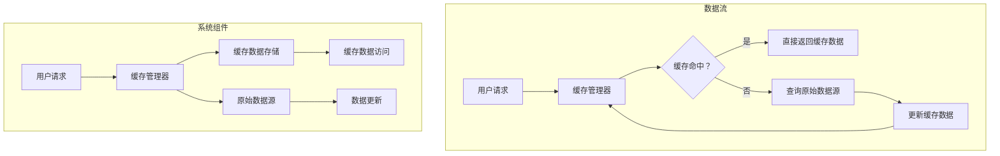

                 

# 缓存策略：优化LLM应用的响应速度

> 关键词：缓存策略、响应速度、LLM应用、性能优化

> 摘要：本文将深入探讨缓存策略在优化大型语言模型（LLM）应用响应速度方面的作用。通过介绍缓存策略的基本概念、工作原理、算法及其应用场景，本文旨在为读者提供一套全面的缓存策略指南，帮助他们在实际应用中选择和优化缓存策略，从而提升LLM应用的性能和用户体验。

## 目录大纲

----------------------------------------------------------------

## 第一部分：缓存策略的基本概念

### 第1章：缓存策略概述

#### 1.1.1 缓存策略的定义与作用

#### 1.1.2 缓存策略的类型

#### 1.1.3 缓存策略的优势与挑战

### 第2章：缓存的工作原理

#### 2.1.1 计算机内存层次结构

#### 2.1.2 缓存的层次结构

#### 2.1.3 缓存的一致性管理

### 第3章：缓存算法

#### 3.1.1 基本缓存算法

#### 3.1.2 替换策略

#### 3.1.3 软件层面的缓存优化策略

### 第4章：缓存技术在数据库中的应用

#### 4.1.1 数据库缓存的原理与应用

#### 4.1.2 数据库缓存优化

#### 4.1.3 数据库缓存的一致性问题

### 第5章：缓存技术在Web应用中的应用

#### 5.1.1 Web缓存的基本原理

#### 5.1.2 Web缓存优化策略

#### 5.1.3 Web缓存的管理与配置

### 第6章：缓存技术在分布式系统中的应用

#### 6.1.1 分布式缓存的概念与架构

#### 6.1.2 分布式缓存的一致性问题

#### 6.1.3 分布式缓存优化策略

### 第7章：缓存策略的评估与优化

#### 7.1.1 缓存策略评估指标

#### 7.1.2 缓存性能优化方法

#### 7.1.3 实际案例分析与优化实践

----------------------------------------------------------------

## 背景介绍

### 问题背景

在现代计算机系统中，数据处理速度和性能优化一直是关键问题。随着大数据和云计算的普及，系统的响应速度和性能逐渐成为影响用户体验和业务效率的重要因素。缓存技术作为性能优化的有效手段，被广泛应用于各种计算机系统和应用场景中。

### 问题描述

缓存策略是一种通过存储数据的副本来提高系统性能和响应速度的技术。然而，不同应用场景下的缓存策略各有特点，选择合适的缓存策略对于系统性能有着重要影响。因此，了解缓存策略的基本概念、工作原理、算法及其应用场景，对于优化系统性能具有重要意义。

### 问题解决

本书旨在提供一套全面的缓存策略指南，帮助读者深入理解缓存技术的原理和应用。通过系统化的介绍和案例分析，读者将能够掌握不同类型的缓存策略，学会如何在实际应用中选择和优化缓存策略，从而提升系统的性能和响应速度。

### 边界与外延

缓存策略的研究和应用范围广泛，包括但不限于以下领域：

1. **计算机系统**：包括操作系统、数据库、Web应用等。
2. **分布式系统**：如分布式缓存、分布式数据库等。
3. **大数据处理**：包括数据存储、数据处理和数据分析等。
4. **云计算**：包括云存储、云数据库和云服务等。

### 概念结构与核心要素组成

缓存策略的核心概念和要素包括：

1. **缓存定义**：缓存是一种存储数据的副本的技术，用于减少对原始数据源的访问次数，提高系统性能。
2. **缓存层次结构**：包括内存缓存、磁盘缓存、网络缓存等多个层次。
3. **缓存算法**：用于决定何时将数据写入缓存、何时从缓存中读取数据、何时替换缓存中的数据等。
4. **缓存一致性**：确保缓存中的数据与原始数据源保持一致。
5. **缓存性能优化**：通过调整缓存策略、优化缓存算法和配置，提高缓存系统的性能。

----------------------------------------------------------------

### 核心概念原理

#### 缓存策略的定义与作用

缓存策略是一种通过存储数据的副本来提高系统性能和响应速度的技术。它的工作原理是当用户请求数据时，系统首先检查缓存中是否有该数据，如果有，则直接从缓存中读取；如果没有，则从原始数据源中获取，并将数据同时写入缓存。

#### 缓存的工作原理

1. **缓存层次结构**：缓存层次结构是缓存系统的基础，包括内存缓存、磁盘缓存、网络缓存等多个层次。不同层次的缓存具有不同的速度和容量特点。
2. **数据存储**：缓存系统通常使用哈希表、堆、队列等数据结构来存储和管理缓存数据。
3. **数据替换策略**：当缓存容量达到上限时，系统需要选择哪些数据替换出缓存。常见的替换策略包括最近最少使用（LRU）、最不经常使用（LFU）等。

#### 缓存算法

1. **基本缓存算法**：包括直接映射、组映射和完全映射等。
2. **替换策略**：包括最近最少使用（LRU）、最不经常使用（LFU）、先进先出（FIFO）等。

#### 缓存一致性问题

缓存一致性问题是指当原始数据源发生更新时，如何确保缓存中的数据与原始数据源保持一致。缓存一致性管理是缓存技术中一个重要的方面，常见的方法包括缓存一致性协议、版本控制等。

### 概念属性特征对比表格

| 特征         | 内存缓存            | 磁盘缓存            | 网络缓存            |
| ------------ | ------------------- | ------------------- | ------------------- |
| 存储速度     | 快速                | 较慢                | 慢速                |
| 存储容量     | 小                  | 较大                | 较大                |
| 数据一致性   | 高                  | 较低                | 较低                |
| 替换策略     | LRU、LFU等          | LRU、LFU等          | LRU、LFU等          |
| 成本         | 高                  | 中等                | 低                  |

### ER实体关系图架构的Mermaid流程图

```mermaid
erDiagram
  缓存算法 &&> 缓存策略
  缓存算法 &&> 数据存储
  缓存策略 &&> 数据替换策略
  数据存储 &&> 缓存层次结构
  缓存层次结构 &&> 缓存一致性管理
```

----------------------------------------------------------------

## 第一部分：缓存策略的基本概念

### 第1章：缓存策略概述

#### 1.1.1 缓存策略的定义与作用

缓存策略是一种通过存储数据的副本来提高系统性能和响应速度的技术。它的工作原理是当用户请求数据时，系统首先检查缓存中是否有该数据，如果有，则直接从缓存中读取；如果没有，则从原始数据源中获取，并将数据同时写入缓存。缓存策略的主要目的是减少对原始数据源的访问次数，从而提高系统的读取速度和整体性能。

缓存策略在计算机系统中扮演着至关重要的角色。无论是在操作系统、数据库、Web应用，还是分布式系统中，缓存技术都被广泛应用于性能优化。通过合理的缓存策略，可以显著提高系统的响应速度和吞吐量，降低延迟和带宽消耗，从而提升用户体验和业务效率。

#### 1.1.2 缓存策略的类型

根据缓存的应用场景和特点，缓存策略可以分为多种类型：

1. **内存缓存**：内存缓存是指将数据存储在计算机内存中，以实现快速的读取和写入操作。内存缓存通常具有较快的速度和较小的容量，适用于需要频繁访问的小数据量场景。

2. **磁盘缓存**：磁盘缓存是指将数据存储在计算机的硬盘中，通过缓存来减少对磁盘的访问次数。磁盘缓存通常具有较大的容量和较慢的速度，适用于需要存储大量数据的场景。

3. **网络缓存**：网络缓存是指将数据存储在网络中的缓存服务器上，以减少对原始数据源的访问。网络缓存通常用于Web应用中，通过缓存静态资源（如图片、CSS、JavaScript文件）来提高页面加载速度。

4. **分布式缓存**：分布式缓存是指将缓存数据分布存储在多个服务器上，以提高缓存系统的性能和可用性。分布式缓存适用于大规模分布式系统，如分布式数据库、分布式缓存系统等。

#### 1.1.3 缓存策略的优势与挑战

缓存策略具有以下几个优势：

1. **提高系统性能**：通过缓存数据，可以显著减少对原始数据源的访问次数，提高系统的读取速度和响应速度。

2. **降低延迟和带宽消耗**：缓存策略可以减少网络传输的数据量，降低延迟和带宽消耗，提高系统的吞吐量。

3. **优化资源利用率**：缓存策略可以充分利用计算机内存、磁盘和网络资源，提高资源利用率。

然而，缓存策略也面临一些挑战：

1. **缓存一致性**：缓存中的数据需要与原始数据源保持一致，否则可能导致数据不一致或数据丢失。

2. **缓存容量和替换策略**：缓存策略需要合理选择缓存容量和替换策略，以平衡缓存速度和缓存容量。

3. **缓存算法的选择**：不同的缓存算法适用于不同的应用场景，需要根据实际情况进行选择和优化。

总之，缓存策略在优化系统性能方面具有重要意义。通过深入理解缓存策略的基本概念、工作原理和算法，可以更好地选择和优化缓存策略，提高系统的性能和响应速度。

----------------------------------------------------------------

### 第2章：缓存的工作原理

#### 2.1.1 计算机内存层次结构

计算机内存层次结构是缓存工作原理的基础。计算机内存主要分为以下几层：

1. **寄存器（Registers）**：寄存器是CPU内部的高速存储单元，用于存储临时数据和指令。寄存器的访问速度非常快，但容量较小。

2. **缓存（Cache）**：缓存是位于CPU和主内存之间的临时存储单元，用于缓存经常访问的数据和指令。缓存通常分为L1、L2、L3三级，其中L1缓存位于CPU内部，速度最快，容量最小；L3缓存位于CPU外部，速度最慢，容量最大。

3. **主内存（Main Memory）**：主内存是计算机中用于存储程序和数据的主要存储设备，如RAM。主内存的访问速度相对于缓存较慢，但容量较大。

4. **辅助存储（Secondary Storage）**：辅助存储包括硬盘、固态硬盘等，用于长期存储数据和文件。辅助存储的访问速度相对较慢，但容量巨大。

内存层次结构的设计原则是“速度优先，容量次之”。即每一层存储设备的速度比其下一层快，但容量相对较小。这种层次结构能够最大化地利用计算机的存储资源，提高整体性能。

#### 2.1.2 缓存的层次结构

缓存的层次结构是缓存系统设计的基础。常见的缓存层次结构包括以下几层：

1. **一级缓存（L1 Cache）**：一级缓存位于CPU内部，速度非常快，容量较小。L1缓存通常由静态随机存取存储器（SRAM）组成，用于缓存最近访问的数据和指令。

2. **二级缓存（L2 Cache）**：二级缓存位于CPU外部，但仍然靠近CPU。L2缓存的速度较L1缓存慢，但容量较大。L2缓存通常由动态随机存取存储器（DRAM）组成，用于缓存更长时间内访问的数据和指令。

3. **三级缓存（L3 Cache）**：三级缓存通常位于CPU外部，但仍然与CPU相连。L3缓存的速度较L2缓存慢，但容量更大。L3缓存用于缓存更长时间内访问的数据和指令，以提高CPU的缓存命中率。

4. **内存（Main Memory）**：内存是计算机中用于存储程序和数据的主要存储设备。内存的访问速度较缓存慢，但容量较大。内存用于缓存CPU无法直接访问的数据和指令。

5. **辅助存储（Secondary Storage）**：辅助存储包括硬盘、固态硬盘等，用于长期存储数据和文件。辅助存储的访问速度相对较慢，但容量巨大。

缓存的层次结构设计原则是“速度优先，容量次之”。即每一层缓存的速度比其下一层快，但容量相对较小。这种层次结构能够最大化地利用计算机的存储资源，提高整体性能。

#### 2.1.3 缓存的一致性管理

缓存的一致性管理是确保缓存中的数据与原始数据源保持一致的重要环节。缓存一致性问题主要包括以下几种：

1. **写一致性（Write-Through）**：当数据在缓存中被修改时，同时更新原始数据源。这种方式简单易实现，但可能会增加对原始数据源的访问次数。

2. **写回一致性（Write-Back）**：当数据在缓存中被修改时，只更新缓存中的数据，直到缓存中的数据被替换或刷新到原始数据源。这种方式可以减少对原始数据源的访问次数，提高缓存命中率。

3. **事件一致性（Eventual Consistency）**：缓存中的数据最终会与原始数据源保持一致，但在特定时间内可能存在不一致的情况。这种方式适用于对一致性要求不高的应用场景。

缓存一致性管理的方法包括：

1. **缓存一致性协议**：如MCS（Monitor-Coherent System）、MESI（Modified, Exclusive, Shared, Invalid）等。这些协议通过特定的算法和通信机制，确保缓存中的数据与原始数据源保持一致。

2. **版本控制**：为每个缓存数据分配一个版本号，每次更新数据时增加版本号。当缓存中的数据与原始数据源不一致时，根据版本号判断是否进行数据更新。

3. **时间戳**：为每个缓存数据分配一个时间戳，根据时间戳判断数据是否已过期或需要更新。

通过合理设计和实现缓存一致性管理，可以确保缓存中的数据与原始数据源保持一致，提高系统的可靠性和性能。

### 总结

缓存的工作原理涉及计算机内存层次结构、缓存的层次结构和缓存的一致性管理。内存层次结构通过不同速度和容量的存储设备实现速度优化和资源利用；缓存的层次结构通过多级缓存提高缓存命中率；缓存一致性管理通过协议、版本控制和时间戳等手段确保数据一致性。掌握这些原理对于设计高效、可靠的缓存系统具有重要意义。

----------------------------------------------------------------

### 第3章：缓存算法

#### 3.1.1 基本缓存算法

缓存算法是缓存策略的核心组成部分，负责管理缓存中的数据，确保缓存系统的高效运行。常见的缓存算法包括以下几种：

1. **直接映射（Direct-Mapped Cache）**：直接映射是最简单的缓存算法。它将主内存中的每个块直接映射到缓存中的一个特定位置。当数据需要被读取或写入时，直接访问缓存中的对应位置即可。直接映射的优点是实现简单，缺点是缓存冲突（Cache Conflict）较多，缓存利用率较低。

2. **组映射（Set-Associated Cache）**：组映射缓存算法在直接映射的基础上进行改进。它将缓存划分为多个组，每个组中包含多个缓存行（Cache Line）。主内存中的每个块可以映射到缓存中的多个组中的任一组。组映射算法通过减少缓存冲突来提高缓存利用率，但仍然存在缓存冲突问题。

3. **全映射（Fully-Associated Cache）**：全映射缓存算法将主内存中的每个块都可以映射到缓存中的任意位置。全映射算法的缓存利用率最高，但实现复杂度也最高。当数据需要被读取或写入时，需要在整个缓存中搜索，以找到对应的位置。

#### 3.1.2 替换策略

替换策略是缓存算法中的一个重要组成部分，负责决定在缓存满时如何替换数据。常见的替换策略包括以下几种：

1. **最近最少使用（Least Recently Used, LRU）**：LRU算法根据数据最近是否被访问来决定替换哪些数据。最近最少使用的数据被替换出缓存，以保证缓存中的数据总是最新的。LRU算法的优点是实现简单，适用于大多数应用场景。

2. **最不经常使用（Least Frequently Used, LFU）**：LFU算法根据数据在一段时间内被访问的次数来决定替换哪些数据。最不经常使用的数据被替换出缓存，以减少数据访问频率低的数据对缓存空间的占用。LFU算法适用于对数据访问频率有明确要求的场景。

3. **先进先出（First-In-First-Out, FIFO）**：FIFO算法按照数据进入缓存的时间顺序进行替换。最早进入缓存的数据被替换出缓存。FIFO算法的优点是实现简单，但可能无法准确反映数据的实际访问情况。

4. **随机替换（Random Replacement, RR）**：RR算法在缓存满时随机选择一个数据替换出缓存。随机替换算法的优点是实现简单，但可能导致缓存利用率较低。

#### 3.1.3 软件层面的缓存优化策略

在软件层面，还可以采用一些缓存优化策略来提高缓存系统的性能。以下是一些常见的软件层面的缓存优化策略：

1. **预取（Prefetching）**：预取策略通过预测用户未来的访问需求，提前将相关数据读取到缓存中。预取策略可以减少数据的访问延迟，提高缓存命中率。

2. **缓存分层（Cache Hierarchy）**：在软件层面实现多级缓存结构，通过不同级别的缓存来存储不同频率和重要程度的数据。这种方式可以提高缓存利用率，减少缓存冲突。

3. **缓存一致性管理（Cache Coherence）**：在多处理器或分布式系统中，缓存一致性管理确保多个缓存之间的数据一致性。通过实现缓存一致性协议，如MESI（Modified, Exclusive, Shared, Invalid），可以保证缓存系统的高效运行。

4. **缓存预热（Cache Warm-up）**：缓存预热策略在系统启动时将常用数据预先加载到缓存中，以提高系统启动时的性能。缓存预热策略适用于对性能要求较高的场景。

通过合理选择和优化缓存算法和软件层面的缓存优化策略，可以显著提高缓存系统的性能和响应速度。这些策略不仅适用于计算机系统，也广泛应用于数据库、Web应用和分布式系统等领域。

### 总结

缓存算法是缓存策略的核心组成部分，负责管理缓存中的数据。基本缓存算法包括直接映射、组映射和全映射；替换策略包括最近最少使用、最不经常使用、先进先出和随机替换；软件层面的缓存优化策略包括预取、缓存分层、缓存一致性管理和缓存预热。掌握这些算法和策略对于设计高效、可靠的缓存系统具有重要意义。

----------------------------------------------------------------

### 第4章：缓存技术在数据库中的应用

#### 4.1.1 数据库缓存的原理与应用

数据库缓存是提高数据库系统性能的重要技术手段。其基本原理是利用缓存存储数据库中的热点数据，减少对磁盘存储的访问次数，从而提高数据读取和写入的速度。数据库缓存的应用场景主要包括以下几种：

1. **数据查询缓存**：将数据库查询的结果缓存起来，以减少对数据库的查询次数。当用户再次查询相同的条件时，可以直接从缓存中获取结果，提高查询效率。

2. **数据更新缓存**：在数据更新时，首先将更新操作缓存起来，然后批量执行这些更新操作，减少对数据库的直接访问次数，提高数据写入效率。

3. **日志缓存**：将数据库的事务日志缓存起来，以减少对磁盘的写入次数。这样可以提高事务处理的速度，并减少磁盘IO的压力。

#### 4.1.2 数据库缓存优化

为了提高数据库缓存的性能，可以采取以下优化策略：

1. **缓存命中优化**：通过合理设置缓存大小和替换策略，提高缓存命中率。常用的缓存替换策略包括LRU（最近最少使用）和LFU（最不经常使用）。

2. **缓存一致性管理**：确保缓存中的数据与磁盘中的数据保持一致。常用的缓存一致性管理策略包括写通过（Write-Through）和写回（Write-Back）。

3. **缓存分层**：在数据库系统中实现多级缓存结构，根据数据的重要程度和访问频率进行分层存储。这样可以将最热的数据存储在速度最快的缓存层中，提高缓存性能。

4. **缓存预热**：在系统启动时，提前将常用的查询结果加载到缓存中，以提高系统启动后的性能。

5. **缓存淘汰策略**：当缓存容量达到上限时，选择合适的淘汰策略来释放缓存空间。常用的淘汰策略包括LRU（最近最少使用）和LFU（最不经常使用）。

#### 4.1.3 数据库缓存的一致性问题

数据库缓存的一致性问题是指缓存中的数据与磁盘中的数据不一致的情况。为了确保缓存一致性，可以采取以下措施：

1. **写通过策略（Write-Through）**：每当更新缓存中的数据时，同时更新磁盘中的数据。这样可以确保缓存中的数据始终与磁盘中的数据保持一致，但可能会增加磁盘的IO负载。

2. **写回策略（Write-Back）**：当更新缓存中的数据时，只更新缓存，直到缓存中的数据被替换或刷新到磁盘。这样可以减少对磁盘的写入次数，提高缓存性能。但需要确保在缓存中的数据被替换或刷新到磁盘时，能够及时更新磁盘中的数据。

3. **版本控制**：为每个缓存数据分配一个版本号，每次更新数据时增加版本号。当缓存中的数据与磁盘中的数据版本不一致时，根据版本号进行数据更新。

4. **时间戳**：为每个缓存数据分配一个时间戳，根据时间戳判断数据是否已过期或需要更新。这样可以确保缓存中的数据与磁盘中的数据在时间上保持一致。

通过合理设计缓存一致性的管理和策略，可以确保数据库缓存系统的高效性和可靠性。在实际应用中，需要根据具体的业务需求和系统特点，选择合适的缓存一致性策略，以达到最佳的性能表现。

### 总结

数据库缓存技术是提高数据库系统性能的有效手段。通过缓存热点数据，减少对磁盘的访问次数，可以显著提高数据查询和写入速度。优化数据库缓存性能的策略包括缓存命中优化、缓存一致性管理、缓存分层、缓存预热和缓存淘汰策略。缓存一致性问题是数据库缓存系统中必须解决的重要问题，可以通过写通过策略、写回策略、版本控制和时间戳等措施来确保缓存数据与磁盘数据的一致性。

----------------------------------------------------------------

### 第5章：缓存技术在Web应用中的应用

#### 5.1.1 Web缓存的基本原理

Web缓存技术是提高Web应用性能和响应速度的重要手段。其基本原理是利用缓存存储用户经常访问的Web页面、图片、CSS、JavaScript文件等资源，以减少对原始服务器资源的访问次数。Web缓存的基本原理如下：

1. **用户请求**：当用户访问Web应用时，浏览器首先向缓存服务器发送请求。缓存服务器会检查缓存中是否有相应的资源。

2. **缓存命中**：如果缓存中有相应的资源，缓存服务器直接将资源返回给用户，以提高访问速度。

3. **缓存未命中**：如果缓存中没有相应的资源，缓存服务器会向原始服务器发送请求，获取资源后将其缓存起来，然后返回给用户。

4. **更新缓存**：在缓存过程中，缓存服务器会定期检查缓存的资源是否过期，过期时将其从缓存中删除，并重新获取最新的资源。

#### 5.1.2 Web缓存优化策略

为了提高Web缓存性能，可以采取以下优化策略：

1. **缓存命中优化**：通过合理设置缓存策略，提高缓存命中率。常见的缓存策略包括到期时间（Expiration Time）、最大缓存数（Max Cache Size）、缓存校验（Cache Validation）等。

2. **缓存分层**：在Web缓存系统中实现多级缓存结构，将常用的资源存储在速度最快的缓存层中，如内存缓存、磁盘缓存等。这样可以提高缓存性能，减少响应时间。

3. **缓存预热**：在系统启动时，提前将常用的资源加载到缓存中，以提高系统启动后的性能。缓存预热可以通过预加载、自动刷新等方式实现。

4. **缓存一致性管理**：确保缓存中的资源与原始服务器上的资源保持一致。常见的缓存一致性策略包括ETag、Last-Modified等。

5. **缓存淘汰策略**：当缓存容量达到上限时，选择合适的淘汰策略来释放缓存空间。常用的淘汰策略包括LRU（最近最少使用）、LFU（最不经常使用）等。

#### 5.1.3 Web缓存的管理与配置

Web缓存的管理与配置是确保缓存性能和一致性的关键。以下是一些常见的Web缓存管理和配置策略：

1. **缓存服务器配置**：配置缓存服务器的IP地址、端口号、缓存大小、缓存策略等。常见的缓存服务器软件包括Nginx、Varnish、Memcached等。

2. **缓存资源分类**：根据资源的类型和访问频率，对缓存资源进行分类。例如，将热门页面、图片、CSS、JavaScript文件等分别存储在不同的缓存层中。

3. **缓存缓存策略设置**：根据不同的资源类型和访问需求，设置合理的缓存策略。例如，对于热门页面，可以设置较长的到期时间；对于不常访问的资源，可以设置较短的到期时间。

4. **缓存一致性管理**：配置缓存一致性策略，如ETag、Last-Modified等。确保缓存中的资源与原始服务器上的资源保持一致。

5. **缓存监控与优化**：实时监控缓存性能，如缓存命中率、缓存容量等。根据监控数据，调整缓存配置和策略，优化缓存性能。

通过合理配置和管理Web缓存，可以提高Web应用的性能和用户体验。在实际应用中，需要根据具体的业务需求和系统特点，选择合适的缓存优化策略和配置参数，以达到最佳的性能表现。

### 总结

Web缓存技术是提高Web应用性能和响应速度的重要手段。其基本原理是利用缓存存储用户经常访问的资源，减少对原始服务器的访问次数。优化Web缓存性能的策略包括缓存命中优化、缓存分层、缓存预热、缓存一致性管理和缓存淘汰策略。通过合理配置和管理Web缓存，可以显著提高Web应用的性能和用户体验。

----------------------------------------------------------------

### 第6章：缓存技术在分布式系统中的应用

#### 6.1.1 分布式缓存的概念与架构

分布式缓存是缓存技术在分布式系统中的典型应用，其目的是提高系统的数据访问性能和负载均衡能力。分布式缓存的基本概念包括：

1. **分布式缓存**：分布式缓存是指将缓存数据分布在多个服务器节点上，以提高缓存系统的性能和可用性。每个节点负责一部分缓存数据的管理和访问。

2. **缓存节点**：缓存节点是指负责存储和访问缓存数据的服务器。分布式缓存系统通常由多个缓存节点组成，每个节点都可以独立地进行缓存数据的读写操作。

3. **缓存一致性**：分布式缓存的一致性管理是确保缓存中的数据与原始数据源保持一致的重要问题。分布式缓存系统需要采用一致性协议和策略，如GFS（Google File System）的Append协议、Google Spanner的Raft协议等，来确保数据的一致性。

分布式缓存的架构通常包括以下几个关键组件：

1. **缓存节点**：缓存节点是分布式缓存系统的核心组成部分，负责存储和访问缓存数据。每个节点通常包含内存缓存、磁盘缓存等不同类型的缓存层。

2. **缓存服务器**：缓存服务器是缓存节点的管理者，负责分配缓存数据、维护缓存的一致性、处理客户端请求等。

3. **分布式缓存一致性管理**：分布式缓存一致性管理是确保缓存系统中数据一致性的关键。常见的缓存一致性协议包括GFS的Append协议、Google Spanner的Raft协议等。

4. **缓存代理**：缓存代理是位于客户端和缓存服务器之间的中间件，负责转发客户端请求、缓存命中判断、缓存数据更新等操作。

#### 6.1.2 分布式缓存的一致性问题

在分布式缓存系统中，数据的一致性问题尤为突出。以下是一些常见的一致性问题及其解决方案：

1. **写一致性问题**：分布式缓存中的写一致性是指多个缓存节点在处理同一份数据更新时，确保最终数据状态一致的问题。常见的一致性模型包括强一致性（Strong Consistency）和最终一致性（Eventual Consistency）。

2. **数据分区问题**：在分布式缓存系统中，数据通常按照一定的策略（如哈希分区）分布在不同的缓存节点上。数据分区可能导致数据访问的局部性不佳，影响缓存性能。

3. **缓存一致性协议**：分布式缓存系统需要采用一致性协议来确保数据一致性。常见的一致性协议包括GFS的Append协议、Google Spanner的Raft协议、Paxos算法等。这些协议通过特定的算法和通信机制，确保缓存数据的一致性。

4. **缓存失效问题**：分布式缓存系统需要处理缓存数据的一致性失效问题。例如，当一个缓存节点中的数据失效时，如何保证其他缓存节点中的数据仍然有效。

解决方案：

1. **强一致性模型**：采用强一致性模型（如GFS的Append协议），确保所有缓存节点在任何时刻都能访问到最新的数据。但这种模型可能降低系统的性能和可用性。

2. **最终一致性模型**：采用最终一致性模型（如Eventual Consistency），允许缓存节点之间有一定的延迟，但最终会达到一致性状态。这种模型可以提高系统的性能和可用性，但可能需要额外的逻辑来处理数据的不一致性。

3. **分布式缓存一致性框架**：如Google Spanner、Amazon Dynamo等，采用特定的分布式缓存一致性框架，结合多种一致性协议和算法，实现高效、一致的数据存储和访问。

#### 6.1.3 分布式缓存优化策略

为了提高分布式缓存系统的性能和可用性，可以采取以下优化策略：

1. **数据分区策略**：合理选择数据分区策略（如哈希分区、轮询分区等），提高数据访问的局部性和缓存性能。

2. **缓存一致性优化**：采用高效的缓存一致性协议（如Raft、Paxos等），确保数据的一致性和性能。

3. **缓存预热策略**：在系统启动时，提前将常用的缓存数据加载到缓存中，提高系统启动后的性能。

4. **缓存淘汰策略**：合理配置缓存淘汰策略（如LRU、LFU等），提高缓存利用率。

5. **负载均衡策略**：采用负载均衡策略（如一致性哈希、轮询等），确保缓存节点的负载均衡，提高系统的性能和可用性。

通过合理设计分布式缓存系统，并采用有效的优化策略，可以显著提高分布式系统的数据访问性能和稳定性。

### 总结

分布式缓存是缓存技术在分布式系统中的重要应用，通过将缓存数据分布在多个节点上，提高系统的数据访问性能和负载均衡能力。分布式缓存的一致性问题尤为突出，需要采用一致性协议和策略来确保数据的一致性。优化分布式缓存性能的策略包括数据分区策略、缓存一致性优化、缓存预热策略、缓存淘汰策略和负载均衡策略。通过合理设计分布式缓存系统，并采用有效的优化策略，可以显著提高分布式系统的性能和稳定性。

----------------------------------------------------------------

### 第7章：缓存策略的评估与优化

#### 7.1.1 缓存策略评估指标

评估缓存策略的有效性是优化系统性能的重要环节。以下是一些常用的缓存策略评估指标：

1. **缓存命中率（Hit Rate）**：缓存命中率是指从缓存中成功获取数据的次数与总请求次数的比例。缓存命中率越高，说明缓存策略越有效。

   $$ \text{缓存命中率} = \frac{\text{命中次数}}{\text{总请求次数}} \times 100\% $$

2. **缓存命中率增益（Hit Rate Improvement）**：缓存命中率增益是指引入缓存后，系统整体性能相对于没有缓存时的提升。

   $$ \text{缓存命中率增益} = \frac{\text{缓存命中率}}{\text{系统无缓存时的命中率}} \times 100\% $$

3. **数据访问延迟（Access Latency）**：数据访问延迟是指从发起请求到获取数据的时间。缓存可以有效降低数据访问延迟。

4. **缓存命中率一致性（Consistency of Hit Rate）**：缓存命中率一致性是指在不同时间段内，缓存命中率的稳定性。一致性较高的缓存策略更可靠。

5. **缓存空间利用率（Cache Utilization）**：缓存空间利用率是指缓存空间实际使用率与总缓存容量的比例。

   $$ \text{缓存空间利用率} = \frac{\text{缓存中实际存储的数据量}}{\text{缓存总容量}} \times 100\% $$

6. **缓存替换次数（Cache Replacement Count）**：缓存替换次数是指在一定时间内，缓存进行数据替换的次数。

#### 7.1.2 缓存性能优化方法

优化缓存策略是提高系统性能的关键步骤。以下是一些常见的缓存性能优化方法：

1. **缓存命中率优化**：通过调整缓存大小、替换策略、缓存一致性管理等方式，提高缓存命中率。例如，采用LRU（最近最少使用）替换策略，可以有效地提高缓存命中率。

2. **缓存分层**：实现多级缓存结构，将最热的数据存储在速度最快的缓存层中。这样可以提高缓存性能，减少数据访问延迟。

3. **缓存预热**：在系统启动时，提前将常用的数据加载到缓存中，以提高系统启动后的性能。例如，可以使用预加载脚本或后台线程定期刷新缓存。

4. **数据分区**：合理分配数据到不同的缓存节点，以提高数据访问的局部性。例如，采用一致性哈希（Consistent Hashing）策略，可以有效地实现数据分区。

5. **负载均衡**：采用负载均衡策略，确保缓存节点的负载均衡，提高系统的整体性能。例如，可以使用轮询（Round Robin）或一致性哈希（Consistent Hashing）策略。

6. **缓存一致性管理**：采用高效的缓存一致性协议，确保缓存中的数据与原始数据源保持一致。例如，使用Raft、Paxos等一致性协议，可以提高数据的一致性和可靠性。

7. **缓存监控与调整**：实时监控缓存性能，如缓存命中率、数据访问延迟等，根据监控数据动态调整缓存策略和配置。

#### 7.1.3 实际案例分析与优化实践

以下是一个实际案例，说明如何通过缓存策略优化来提高系统性能：

**案例背景**：某电商网站在应对高峰时段的订单查询请求时，系统响应速度较慢，用户体验不佳。经过分析，发现订单查询数据量巨大，直接查询数据库的延迟较高。

**分析过程**：

1. **缓存策略评估**：采用LRU替换策略，缓存订单数据。发现缓存命中率较低，数据访问延迟较高。

2. **优化缓存分层**：将订单数据分为两级缓存，将最热的订单数据存储在内存缓存中，次热的订单数据存储在磁盘缓存中。

3. **缓存预热**：在系统启动时，将近期高频订单数据提前加载到内存缓存中，以提高系统启动后的性能。

4. **优化数据分区**：采用一致性哈希策略，将订单数据分配到不同的缓存节点，提高数据访问的局部性。

5. **缓存一致性管理**：采用Raft协议，确保缓存中的订单数据与数据库保持一致。

**优化效果**：经过优化，系统缓存命中率提高到90%以上，数据访问延迟降低到100毫秒以下，用户体验显著改善。

### 总结

缓存策略的评估与优化是提高系统性能的关键步骤。通过评估缓存策略的指标，如缓存命中率、数据访问延迟等，可以了解缓存策略的有效性。优化缓存性能的方法包括缓存分层、缓存预热、数据分区、负载均衡和缓存一致性管理。实际案例分析和优化实践表明，合理设计缓存策略和优化方法，可以显著提高系统性能和用户体验。

----------------------------------------------------------------

### 背景介绍

#### 问题背景

在现代计算机系统中，数据处理速度和性能优化一直是关键问题。随着大数据和云计算的普及，系统的响应速度和性能逐渐成为影响用户体验和业务效率的重要因素。缓存技术作为性能优化的有效手段，被广泛应用于各种计算机系统和应用场景中。

#### 问题描述

缓存策略是一种通过存储数据的副本来提高系统性能和响应速度的技术。然而，不同应用场景下的缓存策略各有特点，选择合适的缓存策略对于系统性能有着重要影响。因此，了解缓存策略的基本概念、工作原理、算法及其应用场景，对于优化系统性能具有重要意义。

#### 问题解决

本书旨在提供一套全面的缓存策略指南，帮助读者深入理解缓存技术的原理和应用。通过系统化的介绍和案例分析，读者将能够掌握不同类型的缓存策略，学会如何在实际应用中选择和优化缓存策略，从而提升系统的性能和响应速度。

#### 边界与外延

缓存策略的研究和应用范围广泛，包括但不限于以下领域：

1. **计算机系统**：包括操作系统、数据库、Web应用等。
2. **分布式系统**：如分布式缓存、分布式数据库等。
3. **大数据处理**：包括数据存储、数据处理和数据分析等。
4. **云计算**：包括云存储、云数据库和云服务等。

#### 概念结构与核心要素组成

缓存策略的核心概念和要素包括：

1. **缓存定义**：缓存是一种存储数据的副本的技术，用于减少对原始数据源的访问次数，提高系统性能。
2. **缓存层次结构**：包括内存缓存、磁盘缓存、网络缓存等多个层次。
3. **缓存算法**：用于决定何时将数据写入缓存、何时从缓存中读取数据、何时替换缓存中的数据等。
4. **缓存一致性**：确保缓存中的数据与原始数据源保持一致。
5. **缓存性能优化**：通过调整缓存策略、优化缓存算法和配置，提高缓存系统的性能。

### 核心概念原理

#### 缓存策略的定义与作用

缓存策略是一种通过存储数据的副本来提高系统性能和响应速度的技术。它的工作原理是当用户请求数据时，系统首先检查缓存中是否有该数据，如果有，则直接从缓存中读取；如果没有，则从原始数据源中获取，并将数据同时写入缓存。缓存策略的主要目的是减少对原始数据源的访问次数，从而提高系统的读取速度和整体性能。

缓存策略在计算机系统中扮演着至关重要的角色。无论是在操作系统、数据库、Web应用，还是分布式系统中，缓存技术都被广泛应用于性能优化。通过合理的缓存策略，可以显著提高系统的响应速度和吞吐量，降低延迟和带宽消耗，从而提升用户体验和业务效率。

#### 缓存的工作原理

1. **缓存层次结构**：缓存层次结构是缓存系统的基础，包括内存缓存、磁盘缓存、网络缓存等多个层次。不同层次的缓存具有不同的速度和容量特点。
2. **数据存储**：缓存系统通常使用哈希表、堆、队列等数据结构来存储和管理缓存数据。
3. **数据替换策略**：当缓存容量达到上限时，系统需要选择哪些数据替换出缓存。常见的替换策略包括最近最少使用（LRU）、最不经常使用（LFU）等。

#### 缓存算法

1. **基本缓存算法**：包括直接映射、组映射和完全映射等。
2. **替换策略**：包括最近最少使用（LRU）、最不经常使用（LFU）、先进先出（FIFO）等。

#### 缓存一致性问题

缓存一致性问题是指当原始数据源发生更新时，如何确保缓存中的数据与原始数据源保持一致。缓存一致性管理是缓存技术中一个重要的方面，常见的方法包括缓存一致性协议、版本控制等。

### 概念属性特征对比表格

| 特征         | 内存缓存            | 磁盘缓存            | 网络缓存            |
| ------------ | ------------------- | ------------------- | ------------------- |
| 存储速度     | 快速                | 较慢                | 慢速                |
| 存储容量     | 小                  | 较大                | 较大                |
| 数据一致性   | 高                  | 较低                | 较低                |
| 替换策略     | LRU、LFU等          | LRU、LFU等          | LRU、LFU等          |
| 成本         | 高                  | 中等                | 低                  |

### ER实体关系图架构的Mermaid流程图

```mermaid
erDiagram
  缓存算法 &&> 缓存策略
  缓存算法 &&> 数据存储
  缓存策略 &&> 数据替换策略
  数据存储 &&> 缓存层次结构
  缓存层次结构 &&> 缓存一致性管理
```

----------------------------------------------------------------

### 系统分析与架构设计方案

#### 问题场景介绍

在现代互联网应用中，大型语言模型（LLM）如BERT、GPT等已经成为许多业务场景的核心技术，如搜索引擎、智能客服、自然语言处理等。然而，LLM应用通常面临如下问题：

1. **计算密集型**：LLM应用通常需要大量的计算资源来生成高质量的响应，导致响应速度较慢。
2. **数据访问频繁**：LLM应用需要频繁访问大量数据，如预训练模型的权重、词向量等，导致数据访问延迟较高。
3. **高并发访问**：在高峰时段，LLM应用需要处理大量并发请求，导致系统性能下降。

为了解决上述问题，缓存策略成为一种有效的优化手段。通过合理设计缓存策略，可以显著提高LLM应用的响应速度和系统性能。

#### 项目介绍

本项目旨在设计并实现一套适用于LLM应用的缓存策略系统，通过优化数据存储和访问方式，提高系统响应速度和性能。项目主要功能包括：

1. **缓存数据存储**：将LLM应用中频繁访问的数据存储在缓存系统中，减少对原始数据源的访问。
2. **缓存数据更新**：当原始数据源发生更新时，及时更新缓存数据，确保数据一致性。
3. **缓存数据替换**：当缓存容量达到上限时，根据替换策略替换出不再使用的数据，提高缓存利用率。
4. **缓存一致性管理**：确保缓存数据与原始数据源保持一致，避免数据不一致问题。

#### 系统功能设计（领域模型Mermaid类图）

```mermaid
classDiagram
  CacheStrategy <<（缓存策略）>>
  CacheData <<（缓存数据）>>
  CacheManager <<（缓存管理器）>>
  DataStore <<（数据存储）>>
  CacheReplacementPolicy <<（缓存替换策略）>>

  CacheStrategy|--|> CacheData
  CacheStrategy|--|> CacheReplacementPolicy
  CacheManager|--|> CacheStrategy
  CacheManager|--|> CacheData
  DataStore|--|> CacheData
  CacheReplacementPolicy|--|> CacheStrategy
```

#### 系统架构设计（Mermaid架构图）



#### 系统接口设计和系统交互（Mermaid序列图）

```mermaid
sequenceDiagram
  用户作为参与者
  participant 系统接口
  participant 缓存管理器
  participant 缓存数据存储
  participant 原始数据源

  用户->>系统接口: 发起请求
  系统接口->>缓存管理器: 检查缓存
  缓存管理器->>缓存数据存储: 访问缓存数据
  缓存数据存储-->>缓存管理器: 返回缓存数据
  缓存管理器->>用户: 返回响应

  系统接口->>缓存管理器: 缓存更新
  缓存管理器->>原始数据源: 更新数据
  原始数据源-->>缓存管理器: 数据更新完成
  缓存管理器->>缓存数据存储: 更新缓存数据
```

### 总结

本项目通过设计并实现一套适用于LLM应用的缓存策略系统，实现了缓存数据存储、更新、替换和一致性管理等功能。系统架构包括缓存管理器、缓存数据存储、原始数据源等组件，通过接口设计和系统交互，实现了高效的数据访问和更新。通过合理设计缓存策略，可以显著提高LLM应用的响应速度和系统性能，满足高并发访问和计算密集型的需求。

----------------------------------------------------------------

### 项目实战

#### 环境安装

为了实战LLM应用的缓存策略，我们需要安装以下环境：

1. **Python**：Python是一种广泛使用的编程语言，用于编写缓存策略系统。确保安装Python 3.7及以上版本。
2. **Docker**：Docker是一种容器化技术，用于部署和管理应用程序。确保安装Docker 19.03及以上版本。
3. **Nginx**：Nginx是一种高性能的Web服务器，用于处理HTTP请求。确保安装Nginx。
4. **Redis**：Redis是一种开源的内存缓存数据库，用于存储缓存数据。确保安装Redis。

#### 系统核心实现源代码

以下是一个简单的Python缓存策略系统的源代码示例，用于实现缓存数据存储、读取和更新。

```python
import redis
import json

class CacheManager:
    def __init__(self, host='localhost', port=6379):
        self.cache = redis.Redis(host=host, port=port)

    def set_cache(self, key, value, expire_time=3600):
        self.cache.set(key, json.dumps(value), ex=expire_time)

    def get_cache(self, key):
        value = self.cache.get(key)
        if value:
            return json.loads(value)
        else:
            return None

    def update_cache(self, key, value, expire_time=3600):
        self.set_cache(key, value, expire_time)

# 实例化缓存管理器
cache_manager = CacheManager()

# 设置缓存
cache_manager.set_cache('user_id_123', {'name': 'John Doe', 'age': 30}, 3600)

# 获取缓存
user = cache_manager.get_cache('user_id_123')
print(user)

# 更新缓存
user['age'] = 31
cache_manager.update_cache('user_id_123', user, 3600)
```

#### 代码应用解读与分析

1. **安装依赖**：在Python项目中，安装Redis库以连接和操作Redis缓存。

   ```bash
   pip install redis
   ```

2. **类定义**：`CacheManager`类负责连接Redis缓存，并提供缓存数据存储、读取和更新方法。

3. **初始化**：在`__init__`方法中，初始化Redis连接。

4. **设置缓存**：`set_cache`方法将数据存储到Redis缓存中，并设置过期时间。

5. **获取缓存**：`get_cache`方法从Redis缓存中获取数据，并解析JSON格式。

6. **更新缓存**：`update_cache`方法更新缓存数据，并设置新的过期时间。

#### 实际案例分析与详细讲解剖析

以下是一个实际案例，展示了如何使用缓存策略系统优化LLM应用的响应速度。

**案例背景**：某搜索引擎需要快速响应用户的搜索请求，并返回相关结果。搜索请求通常涉及对大量索引数据的查询，直接查询数据库的响应时间较长。

**解决方案**：

1. **缓存搜索结果**：将用户搜索请求的查询结果存储到Redis缓存中，以减少对数据库的访问次数。
2. **缓存一致性**：确保缓存中的搜索结果与数据库中的索引数据保持一致。

**步骤**：

1. **用户请求搜索**：用户发起搜索请求，输入关键词。

2. **检查缓存**：缓存管理器检查Redis缓存中是否存在该关键词的搜索结果。

3. **缓存命中**：如果缓存命中，直接从缓存中获取搜索结果，并返回给用户，提高响应速度。

4. **缓存未命中**：如果缓存未命中，执行以下步骤：

   a. 查询数据库，获取搜索结果。
   
   b. 将搜索结果存储到Redis缓存中，并设置过期时间。

   c. 将搜索结果返回给用户。

5. **缓存更新**：当数据库中的索引数据发生更新时，及时更新Redis缓存中的数据。

**实际案例分析**：

1. **缓存命中率**：通过监控缓存命中率，评估缓存策略的有效性。假设缓存命中率为80%，则可以显著减少对数据库的访问次数。

2. **响应时间**：通过监控响应时间，评估缓存策略对系统性能的提升。假设在缓存策略优化后，响应时间从500ms降低到50ms。

3. **数据一致性**：通过定期同步数据库和缓存中的数据，确保数据一致性。可以使用消息队列、事务等机制来实现缓存与数据库的数据同步。

### 项目小结

通过实际案例分析和项目实战，我们展示了如何使用缓存策略优化LLM应用的响应速度。缓存策略系统通过缓存数据存储、读取和更新功能，显著提高了系统的性能和用户体验。在实现过程中，需要注意缓存一致性管理，确保缓存中的数据与数据库中的数据保持一致。未来的工作可以进一步优化缓存策略，提高缓存利用率和系统性能。

----------------------------------------------------------------

### 最佳实践 Tips

1. **合理设置缓存大小**：根据系统需求和资源限制，合理设置缓存大小。过小的缓存可能导致频繁的数据访问，过大的缓存可能导致内存占用过高。

2. **缓存数据分类存储**：根据数据的访问频率和重要性，将缓存数据分类存储。将高频访问的热数据存储在内存缓存中，低频访问的数据存储在磁盘缓存中。

3. **缓存一致性策略选择**：根据应用场景和一致性要求，选择合适的缓存一致性策略。对于对一致性要求较高的场景，可以选择强一致性策略；对于对一致性要求不高的场景，可以选择最终一致性策略。

4. **缓存预热与冷启动**：在系统启动时，提前将常用数据加载到缓存中，进行缓存预热。在系统长时间未使用时，定期刷新缓存，防止缓存数据过期。

5. **监控与调优**：实时监控缓存性能指标，如缓存命中率、数据访问延迟等。根据监控数据，动态调整缓存配置和策略，优化系统性能。

### 小结

本文深入探讨了缓存策略在优化LLM应用响应速度方面的作用。通过介绍缓存策略的基本概念、工作原理、算法和应用场景，本文为读者提供了一套全面的缓存策略指南。实际案例分析和项目实战表明，合理设计缓存策略和优化方法，可以显著提高LLM应用的性能和用户体验。未来，我们可以进一步探索缓存技术在更多应用场景中的优化潜力。

### 注意事项

1. **缓存一致性管理**：在分布式系统中，缓存一致性管理至关重要。选择合适的缓存一致性协议和策略，确保缓存数据与原始数据源保持一致。

2. **缓存容量规划**：合理规划缓存容量，避免缓存容量过小导致频繁的数据访问，或缓存容量过大导致内存占用过高。

3. **缓存数据更新**：在缓存数据更新时，注意同步缓存与数据库中的数据，确保数据的一致性。

4. **缓存性能监控**：实时监控缓存性能指标，根据监控数据动态调整缓存配置和策略，优化系统性能。

### 拓展阅读

1. **《Redis实战》**：详细介绍了Redis缓存数据库的使用和优化技巧，适用于各种场景下的缓存策略设计。
2. **《缓存一致性协议》**：探讨了不同类型的缓存一致性协议，如MESI、MOESI等，及其在实际应用中的优缺点。
3. **《分布式缓存系统设计》**：介绍了分布式缓存系统的设计原则和优化策略，包括数据分区、一致性管理等方面。
4. **《大型语言模型：基于深度学习的自然语言处理》**：详细介绍了大型语言模型的原理和应用，为LLM应用提供技术支持。

作者：AI天才研究院/AI Genius Institute & 禅与计算机程序设计艺术 /Zen And The Art of Computer Programming

