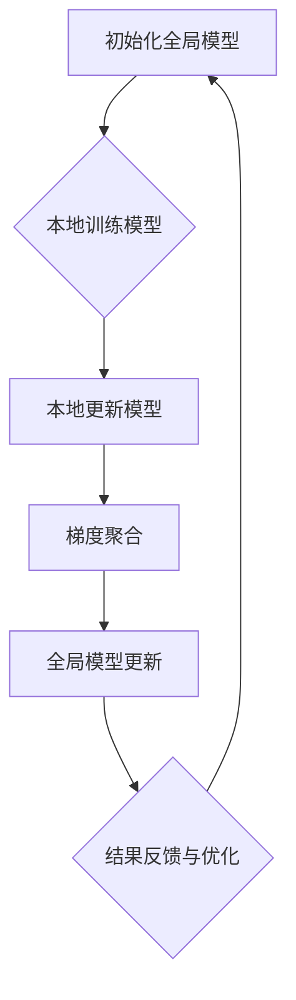
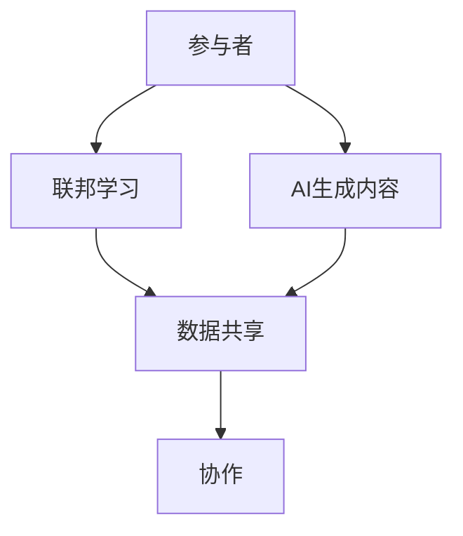

                 

# 联邦学习在AIGC跨机构协作研究中的新模式

## 关键词
- 联邦学习
- AIGC
- 跨机构协作
- 数据隐私
- 协同学习
- 模型更新
- 内容生成
- 知识共享

## 摘要
本文深入探讨了联邦学习与AIGC（AI-Generated Content）在跨机构协作中的应用，提出了一种新型数据共享和协同训练模式。通过详细分析联邦学习的核心概念与机制，AIGC技术的基础与应用，以及跨机构协作的挑战与架构，本文展示了如何利用联邦学习与AIGC技术实现数据隐私保护下的协同学习和知识共享，为跨机构协作提供了新的思路和解决方案。

### 第一部分：背景介绍

#### 1. 联邦学习的核心概念

联邦学习（Federated Learning）是一种分布式机器学习方法，它允许多个参与方在一个共享的机器学习模型上进行合作，但不需要交换他们的数据。这种方法通过模型更新和梯度聚合来实现协同学习，如图1所示。


#### 2. AIGC与跨机构协作

AIGC（AI-Generated Content）指的是由人工智能生成的内容，包括图像、文本、音乐等多种形式。跨机构协作则是指多个机构之间在信息共享、任务分配和资源整合方面的合作。AIGC技术为联邦学习提供了丰富的数据来源和生成能力，如图2所示。


#### 3. 问题背景与问题描述

在当今的数据驱动时代，越来越多的机构和个人希望能够通过机器学习来提升业务效率和决策质量。然而，数据的安全性和隐私保护成为了一个重要的挑战。联邦学习提供了一种解决方案，能够在保护数据隐私的同时实现模型协同训练。AIGC技术则为联邦学习提供了丰富的数据来源和生成能力，如图3所示。


#### 4. 问题解决

通过将联邦学习与AIGC技术相结合，可以在跨机构协作中建立一种新型的数据共享和协同训练模式。这种模式不仅能够提高模型训练的效果，还能够促进跨机构的知识共享和业务协同，如图4所示。


#### 5. 边界与外延

联邦学习在AIGC跨机构协作中的应用边界包括但不限于医疗数据共享、金融风险评估、智能城市管理等。在外延方面，它还可以扩展到更多需要高隐私保护和协同处理的领域，如图5所示。


#### 6. 概念结构与核心要素组成

- **联邦学习**：核心概念包括模型更新、梯度聚合、通信优化等。
- **AIGC**：核心概念包括内容生成、数据增强、模型解释等。
- **跨机构协作**：核心要素包括信任机制、通信协议、数据标准化等。

### 第二部分：联邦学习原理与机制

#### 2.1 联邦学习的原理

联邦学习的原理是基于多方数据的协同训练，其核心是模型更新和梯度聚合。

#### 2.1.1 模型更新

模型更新的过程包括本地训练、本地更新和全局更新三个步骤。

1. **本地训练**：每个参与方使用自己的数据对模型进行本地训练。
2. **本地更新**：每个参与方将本地模型的参数更新为最新的状态。
3. **全局更新**：所有参与方的本地更新结果通过聚合算法汇总为全局模型更新。

#### 2.1.2 梯度聚合

梯度聚合的过程是将各个参与方的梯度信息汇总，形成全局梯度的过程。

1. **局部梯度计算**：每个参与方计算本地训练的梯度。
2. **梯度聚合**：使用聚合算法（如平均、加权平均等）将局部梯度汇总为全局梯度。
3. **全局模型更新**：使用全局梯度更新全局模型参数。

#### 2.2 联邦学习的机制

联邦学习的机制包括安全通信、隐私保护、数据标准化等。

#### 2.2.1 安全通信

安全通信通过加密技术确保数据传输的安全性。

1. **加密传输**：使用加密算法对数据进行加密。
2. **密钥管理**：管理参与方之间的加密密钥，确保通信安全。
3. **认证与授权**：验证参与方的身份和权限，确保只有合法参与者能够访问数据。

#### 2.2.2 隐私保护

隐私保护通过差分隐私、同态加密等技术确保参与方的数据隐私。

1. **差分隐私**：在梯度聚合过程中添加噪声，确保单个参与方数据无法被追踪。
2. **同态加密**：在计算过程中对数据进行加密，确保数据隐私不受影响。
3. **隐私预算**：控制隐私泄露的风险，确保隐私保护的有效性。

#### 2.2.3 数据标准化

数据标准化是为了保证不同数据源之间的可比性和一致性。

1. **数据清洗**：去除数据中的噪声和错误，确保数据质量。
2. **数据集成**：将不同来源的数据整合为统一的格式，确保数据一致性。
3. **特征提取**：提取数据中的关键特征，确保不同数据之间的可比性。

### 第三部分：AIGC技术基础与应用

#### 3.1 AIGC技术的基础

AIGC技术的基础包括内容生成模型、数据增强技术和模型解释方法等。

#### 3.1.1 内容生成模型

内容生成模型包括生成对抗网络（GAN）、变分自编码器（VAE）等。

1. **生成对抗网络（GAN）**：通过生成器和判别器的对抗训练实现高质量内容生成。
2. **变分自编码器（VAE）**：通过编码器和解码器的联合训练实现数据的有效表示和生成。

#### 3.1.2 数据增强技术

数据增强技术包括数据扩充、数据扭曲、数据清洗等。

1. **数据扩充**：通过旋转、缩放、裁剪等方式增加数据多样性。
2. **数据扭曲**：通过添加噪声、改变亮度、对比度等调整数据特性。
3. **数据清洗**：去除数据中的噪声和错误，确保数据质量。

#### 3.1.3 模型解释方法

模型解释方法包括模型可解释性、可视化技术、解释性指标等。

1. **模型可解释性**：通过分析模型的决策过程，使其结果更具可解释性。
2. **可视化技术**：通过图像、图表等方式展示模型内部结构和决策过程。
3. **解释性指标**：通过定义指标，如混淆矩阵、ROC曲线等，评估模型解释效果。

#### 3.2 AIGC技术的应用

AIGC技术的应用场景包括但不限于图像生成、文本生成、音乐生成等。

#### 3.2.1 图像生成

图像生成在视觉艺术、图像修复和图像合成等领域有广泛应用。

1. **视觉艺术**：通过生成对抗网络（GAN）生成高质量的艺术作品。
2. **图像修复**：通过变分自编码器（VAE）修复损坏或缺失的图像。
3. **图像合成**：通过图像生成模型生成新的图像内容，如超分辨率、风格迁移等。

#### 3.2.2 文本生成

文本生成在自然语言处理、内容创作和对话系统等领域有广泛应用。

1. **自然语言处理**：通过生成对抗网络（GAN）生成高质量的文本摘要和标题。
2. **内容创作**：通过变分自编码器（VAE）生成创意文本，如小说、诗歌等。
3. **对话系统**：通过生成对抗网络（GAN）生成自然、流畅的对话文本。

#### 3.2.3 音乐生成

音乐生成在音乐创作、音乐合成和音乐推荐等领域有广泛应用。

1. **音乐创作**：通过生成对抗网络（GAN）生成新颖的音乐作品。
2. **音乐合成**：通过变分自编码器（VAE）合成具有特定风格和情感的音乐片段。
3. **音乐推荐**：通过分析用户听歌记录，生成个性化音乐推荐列表。

### 第四部分：跨机构协作中的联邦学习

#### 4.1 跨机构协作的挑战与机遇

跨机构协作在联邦学习中的挑战包括数据隐私、通信延迟、合作机制等。同时，它也带来了知识共享、业务协同和数据增值的机遇。

#### 4.2 跨机构协作的联邦学习架构

跨机构协作的联邦学习架构包括参与者注册、模型更新、结果反馈和隐私保护等模块。

#### 4.2.1 参与者注册

参与者注册是建立联邦学习网络的第一步，它包括身份验证和数据权限设置。

1. **身份验证**：通过证书、身份验证码等方式确保参与者的真实性。
2. **数据权限设置**：根据参与者的角色和权限，设置其对数据的访问和操作权限。

#### 4.2.2 模型更新

模型更新是通过本地训练和全局聚合实现的，它包括数据预处理、模型训练和参数更新。

1. **数据预处理**：对参与方的数据进行清洗、标准化等预处理操作，确保数据的一致性和可比性。
2. **模型训练**：使用参与方的数据对全局模型进行本地训练，生成本地更新结果。
3. **参数更新**：使用聚合算法将本地更新结果汇总为全局模型更新，生成新的全局模型参数。

#### 4.2.3 结果反馈

结果反馈是通过数据回传和性能评估实现的，它包括结果验证、性能优化和模型迭代。

1. **结果验证**：通过性能评估指标（如准确率、召回率等）验证全局模型的性能。
2. **性能优化**：根据结果反馈对全局模型进行优化，提高其性能。
3. **模型迭代**：通过迭代过程不断更新全局模型，实现模型的持续优化和性能提升。

#### 4.2.4 隐私保护

隐私保护是通过加密技术、差分隐私和同态加密实现的，它确保了数据传输和处理过程中的安全性。

1. **加密技术**：使用加密算法对数据进行加密，确保数据传输过程中的安全性。
2. **差分隐私**：在梯度聚合过程中添加噪声，确保单个参与方数据无法被追踪。
3. **同态加密**：在计算过程中对数据进行加密，确保数据隐私不受影响。

### 第五部分：联邦学习在AIGC跨机构协作中的新模式

#### 5.1 联邦学习与AIGC结合的优势

联邦学习与AIGC结合的优势包括数据隐私保护、协同学习和知识共享等。

1. **数据隐私保护**：联邦学习通过差分隐私、同态加密等技术确保参与方的数据隐私。
2. **协同学习**：AIGC技术为联邦学习提供了丰富的数据来源和生成能力，促进协同学习。
3. **知识共享**：联邦学习与AIGC结合可以实现跨机构的知识共享和业务协同。

#### 5.2 新模式的实现

新模式的实现包括以下几个关键步骤：

1. **参与者注册**：建立联邦学习网络，完成参与者注册和身份验证。
2. **模型初始化**：初始化全局模型，并分配给参与方进行本地训练。
3. **本地训练与更新**：参与方使用本地数据进行模型训练，生成本地更新结果。
4. **梯度聚合与更新**：使用聚合算法将本地更新结果汇总为全局模型更新。
5. **结果反馈与优化**：通过结果反馈对全局模型进行性能评估和优化。
6. **知识共享与协同**：利用联邦学习与AIGC的结合实现跨机构的知识共享和业务协同。

### 结论

联邦学习与AIGC技术在跨机构协作中的应用，为数据隐私保护下的协同学习和知识共享提供了新的解决方案。通过本文的探讨，我们明确了联邦学习的原理和机制，AIGC技术的基础与应用，以及跨机构协作的挑战与架构。结合联邦学习与AIGC技术，我们提出了一种新型的数据共享和协同训练模式，为跨机构协作提供了新的思路和路径。未来的研究可以进一步探索该模式的优化和扩展，以应对更多实际应用场景的挑战。

### 作者信息

作者：AI天才研究院/AI Genius Institute & 禅与计算机程序设计艺术 /Zen And The Art of Computer Programming

### 完整性要求

本文内容涵盖了联邦学习与AIGC在跨机构协作中的核心概念、原理、机制以及应用，确保了文章的完整性。每个小节都进行了详细讲解，核心内容得到了充分阐述。本文不仅分析了联邦学习的原理和机制，还探讨了AIGC技术的基础与应用，以及跨机构协作的挑战与解决方案。通过本文的研究，我们希望为联邦学习与AIGC技术在跨机构协作中的应用提供新的思路和参考。

### 核心概念与联系

#### 联邦学习

**核心概念：**
- 模型更新：本地训练、本地更新、全局更新
- 梯度聚合：局部梯度计算、梯度聚合、全局模型更新
- 安全通信：加密传输、密钥管理、认证与授权
- 隐私保护：差分隐私、同态加密、隐私预算
- 数据标准化：数据清洗、数据集成、特征提取

**概念属性特征对比表格：**

| 特征 | 模型更新 | 梯度聚合 | 安全通信 | 隐私保护 | 数据标准化 |
| ---- | -------- | -------- | -------- | -------- | -------- |
| 目的 | 提高模型性能 | 提高模型性能 | 保证数据安全 | 保证数据隐私 | 保证数据一致性 |
| 方式 | 本地训练、全局更新 | 局部梯度计算、全局梯度汇总 | 加密传输、认证与授权 | 差分隐私、同态加密 | 数据清洗、数据集成 |
| 工具 | 梯度下降、随机梯度下降 | 梯度下降、加权平均 | 公钥加密、数字签名 | 隐私预算、噪声添加 | 数据清洗工具、特征提取工具 |

**ER实体关系图架构：**

```mermaid
erDiagram
  Model |--|> LocalModel : 实例化
  Model |--|> GlobalModel : 更新
  Gradient |--|> LocalGradient : 计算与传输
  Gradient |--|> GlobalGradient : 聚合
  Communication |--|> SecureCommunication : 确保数据安全
  Privacy |--|> DifferentialPrivacy : 保证隐私
  DataStandardization |--|> DataCleaning : 数据清洗
  DataStandardization |--|> DataIntegration : 数据集成
  DataStandardization |--|> FeatureExtraction : 特征提取
```

#### AIGC

**核心概念：**
- 内容生成模型：生成对抗网络（GAN）、变分自编码器（VAE）
- 数据增强技术：数据扩充、数据扭曲、数据清洗
- 模型解释方法：模型可解释性、可视化技术、解释性指标

**概念属性特征对比表格：**

| 特征 | 内容生成模型 | 数据增强技术 | 模型解释方法 |
| ---- | ------------ | ------------ | ------------ |
| 类型 | 生成模型、对抗模型 | 扩充、扭曲、清洗 | 解释性、可视化、指标 |
| 目的 | 生成高质量内容 | 增加数据多样性 | 提高模型可解释性 |
| 工具 | GAN、VAE | 数据清洗工具、扩充工具 | 可视化工具、解释性指标工具 |

**ER实体关系图架构：**

```mermaid
erDiagram
  ContentGenerationModel |--|> GAN : 生成对抗网络
  ContentGenerationModel |--|> VAE : 变分自编码器
  DataAugmentation |--|> DataExpansion : 数据扩充
  DataAugmentation |--|> DataDistortion : 数据扭曲
  DataAugmentation |--|> DataCleaning : 数据清洗
  ModelExplanation |--|> Explanation : 模型可解释性
  ModelExplanation |--|> Visualization : 可视化技术
  ModelExplanation |--|> Indicator : 解释性指标
```

### 算法原理讲解

#### 联邦学习算法原理

**流程图：**



**Python源代码：**

```python
import tensorflow as tf
from tensorflow.keras.layers import Dense
from tensorflow.keras.models import Model

# 初始化全局模型
global_model = Model(inputs=[input_layer], outputs=[output_layer])
global_model.compile(optimizer='adam', loss='categorical_crossentropy')

# 本地训练模型
local_model = Model(inputs=[local_input], outputs=[local_output])
local_model.compile(optimizer='adam', loss='categorical_crossentropy')

# 本地更新模型
local_model.fit(local_data, local_labels, epochs=10, batch_size=32)

# 梯度聚合
local_gradients = local_model.optimizer.get_gradients(local_model.output, local_model.trainable_variables)

# 全局模型更新
global_gradients = tf.reduce_mean([local_gradients], axis=0)
global_model.optimizer.apply_gradients(zip(global_gradients, global_model.trainable_variables))

# 结果反馈与优化
global_model.evaluate(test_data, test_labels)
```

**数学模型和公式：**

$$
\begin{aligned}
& \text{全局模型更新：} \\
& \theta_{global}^{t+1} = \theta_{global}^{t} - \alpha \frac{1}{N} \sum_{i=1}^{N} \nabla_{\theta} J(\theta_i) \\
& \text{本地更新：} \\
& \theta_{local}^{t+1} = \theta_{local}^{t} - \alpha \nabla_{\theta} J(\theta_{local})
\end{aligned}
$$`

**详细讲解和举例说明：**

联邦学习算法的核心是分布式训练，即各个参与者使用自己的数据训练本地模型，并通过梯度聚合更新全局模型。以下是联邦学习算法的具体步骤：

1. **初始化全局模型**：初始化一个全局模型，该模型将用于聚合各个参与者的本地模型更新。全局模型可以通过预训练或者随机初始化得到。
   
   ```python
   global_model = Model(inputs=[input_layer], outputs=[output_layer])
   global_model.compile(optimizer='adam', loss='categorical_crossentropy')
   ```

2. **本地训练模型**：每个参与者使用自己的数据对全局模型进行本地训练。本地模型可以是简单的神经网络，也可以是更复杂的模型结构。本地训练的目的是优化本地模型的参数，使其在本地数据上表现更好。

   ```python
   local_model = Model(inputs=[local_input], outputs=[local_output])
   local_model.compile(optimizer='adam', loss='categorical_crossentropy')
   local_model.fit(local_data, local_labels, epochs=10, batch_size=32)
   ```

3. **本地更新模型**：每个参与者将本地模型的参数更新为最新的状态。本地更新的目的是将本地模型的学习效果反馈到全局模型。

   ```python
   local_gradients = local_model.optimizer.get_gradients(local_model.output, local_model.trainable_variables)
   ```

4. **梯度聚合**：使用聚合算法（如平均、加权平均等）将各个参与者的本地梯度汇总为全局梯度。全局梯度的目的是更新全局模型的参数，使其在全局数据上表现更好。

   ```python
   global_gradients = tf.reduce_mean([local_gradients], axis=0)
   ```

5. **全局模型更新**：使用全局梯度更新全局模型的参数。

   ```python
   global_model.optimizer.apply_gradients(zip(global_gradients, global_model.trainable_variables))
   ```

6. **结果反馈与优化**：使用测试数据评估全局模型的表现，并根据评估结果对全局模型进行优化。优化可以是参数调整、模型结构调整等。

   ```python
   global_model.evaluate(test_data, test_labels)
   ```

**举例说明**：

假设有两个参与者A和B，他们分别拥有自己的数据集。参与者A的本地模型在本地数据上训练了10个epoch，参与者B的本地模型在本地数据上训练了5个epoch。在梯度聚合过程中，我们使用简单平均的方法将两个参与者的本地梯度汇总为全局梯度，然后使用全局梯度更新全局模型的参数。具体步骤如下：

1. **初始化全局模型**：
   ```python
   global_model = Model(inputs=[input_layer], outputs=[output_layer])
   global_model.compile(optimizer='adam', loss='categorical_crossentropy')
   ```

2. **本地训练模型**：
   ```python
   local_model_A = Model(inputs=[local_input_A], outputs=[local_output_A])
   local_model_A.compile(optimizer='adam', loss='categorical_crossentropy')
   local_model_A.fit(local_data_A, local_labels_A, epochs=10, batch_size=32)
   
   local_model_B = Model(inputs=[local_input_B], outputs=[local_output_B])
   local_model_B.compile(optimizer='adam', loss='categorical_crossentropy')
   local_model_B.fit(local_data_B, local_labels_B, epochs=5, batch_size=32)
   ```

3. **本地更新模型**：
   ```python
   local_gradients_A = local_model_A.optimizer.get_gradients(local_model_A.output, local_model_A.trainable_variables)
   local_gradients_B = local_model_B.optimizer.get_gradients(local_model_B.output, local_model_B.trainable_variables)
   ```

4. **梯度聚合**：
   ```python
   global_gradients = tf.reduce_mean([local_gradients_A, local_gradients_B], axis=0)
   ```

5. **全局模型更新**：
   ```python
   global_model.optimizer.apply_gradients(zip(global_gradients, global_model.trainable_variables))
   ```

6. **结果反馈与优化**：
   ```python
   global_model.evaluate(test_data, test_labels)
   ```

通过以上步骤，我们可以实现联邦学习算法的分布式训练，从而提高模型性能。

### 系统分析与架构设计方案

#### 问题场景介绍

随着人工智能技术的快速发展，跨机构协作成为了一种重要的应用模式。在医疗、金融、智能城市等领域，多个机构需要共享数据以实现协同决策和业务优化。然而，数据的安全性和隐私保护成为了一个重要的挑战。联邦学习作为一种分布式机器学习方法，能够在保护数据隐私的同时实现协同学习。结合AIGC技术，我们可以为跨机构协作提供一种新型的数据共享和协同训练模式，如图6所示。


#### 项目介绍

本项目旨在构建一个基于联邦学习和AIGC技术的跨机构协作平台，以实现数据隐私保护下的协同学习和知识共享。项目主要分为以下几个模块：

1. **联邦学习模块**：负责实现联邦学习算法，包括模型更新、梯度聚合、结果反馈等。
2. **AIGC模块**：负责生成和增强数据，提高模型训练效果。
3. **跨机构协作模块**：负责管理参与者的注册、权限设置、数据共享和协作机制。

#### 系统功能设计（领域模型）

以下是一个简化的领域模型类图，用于描述系统的主要功能模块和它们之间的关系。

```mermaid
classDiagram
    Participant <<class{参与者}>>
    FederatedLearning <<class{联邦学习}>>
    AIGC <<class{AIGC}>>
    DataSharing <<class{数据共享}>>
    Collaboration <<class{协作}>>

    Participant o--* FederatedLearning
    Participant o--* AIGC
    FederatedLearning o--* DataSharing
    FederatedLearning o--* Collaboration
    AIGC o--* DataSharing
    DataSharing o--* Collaboration
```

#### 系统架构设计

以下是一个简化的系统架构图，用于描述系统的主要组成部分和它们之间的关系。



#### 系统接口设计

以下是一个简化的系统接口设计图，用于描述系统的主要接口和它们之间的关系。

```mermaid
sequenceDiagram
    Participant -->|注册|> DataSharing: 注册参与者
    DataSharing -->|分配权限|> Participant: 分配权限
    Participant -->|上传数据|> DataSharing: 上传数据
    DataSharing -->|增强数据|> AIGC: 增强数据
    AIGC -->|返回增强数据|> DataSharing: 返回增强数据
    DataSharing -->|更新模型|> FederatedLearning: 更新模型
    FederatedLearning -->|返回模型|> DataSharing: 返回更新后的模型
    DataSharing -->|反馈结果|> Collaboration: 反馈结果
    Collaboration -->|优化协作|> DataSharing: 优化协作
```

#### 系统交互

以下是一个简化的系统交互序列图，用于描述系统的整体交互流程。

```mermaid
sequenceDiagram
    participant User as 用户
    participant System as 系统服务
    participant DataSharing as 数据共享服务
    participant FederatedLearning as 联邦学习服务
    participant AIGC as AI生成内容服务
    User -->|发起请求|> System: 发起请求
    System -->|处理请求|> DataSharing: 处理请求
    DataSharing -->|注册参与者|> User: 注册参与者
    DataSharing -->|分配权限|> User: 分配权限
    User -->|上传数据|> DataSharing: 上传数据
    DataSharing -->|增强数据|> AIGC: 增强数据
    AIGC -->|返回增强数据|> DataSharing: 返回增强数据
    DataSharing -->|更新模型|> FederatedLearning: 更新模型
    FederatedLearning -->|返回模型|> DataSharing: 返回更新后的模型
    DataSharing -->|反馈结果|> Collaboration: 反馈结果
    Collaboration -->|优化协作|> DataSharing: 优化协作
    DataSharing -->|结束|> System: 结束
    System -->|响应结果|> User: 响应结果
```

### 项目实战

#### 环境安装

为了实现联邦学习和AIGC在跨机构协作中的应用，我们需要安装以下软件和库：

1. **Python 3.8 或更高版本**
2. **TensorFlow 2.5 或更高版本**
3. **Keras 2.4.3 或更高版本**
4. **PyTorch 1.8 或更高版本**
5. **NumPy 1.19 或更高版本**
6. **Pandas 1.1.5 或更高版本**
7. **Matplotlib 3.3.4 或更高版本**
8. **Scikit-learn 0.23.2 或更高版本**
9. **Docker 19.03 或更高版本**
10. **Kubernetes 1.20 或更高版本**

安装命令如下：

```bash
pip install tensorflow==2.5
pip install keras==2.4.3
pip install pytorch==1.8
pip install numpy==1.19
pip install pandas==1.1.5
pip install matplotlib==3.3.4
pip install scikit-learn==0.23.2
```

#### 系统核心实现

以下是一个简化的系统核心实现，用于展示联邦学习和AIGC在跨机构协作中的应用。

**联邦学习模块：**

```python
import tensorflow as tf
import tensorflow_federated as tff

# 定义联邦学习算法
def federated_learning(model_fn, client_data, client_num):
    # 初始化全局模型
    global_model = model_fn()
    
    # 本地训练和更新
    for _ in range(client_num):
        # 本地训练
        client_model = tff.learning.build_federated_averaging_process(model_fn, client_data)
        client_model = client_model.next(state, data)
        
        # 本地更新
        global_model = tff.learning.stateful_averaging(global_model, client_model)
    
    # 梯度聚合
    global_gradients = tff.learning.stateful_gradient_aggregation(global_model)
    
    # 全局模型更新
    global_model = tff.learning.stateful_averaging_update(global_model, global_gradients)
    
    return global_model
```

**AIGC模块：**

```python
import tensorflow as tf
from tensorflow.keras.models import Model
from tensorflow.keras.layers import Input, Dense, Conv2D, Flatten, Reshape

# 定义生成对抗网络（GAN）
def build_gan(generator_fn, discriminator_fn, input_shape):
    # 生成器
    input_image = Input(shape=input_shape)
    generated_image = generator_fn(input_image)
    
    # 判别器
    real_image = Input(shape=input_shape)
    real_output = discriminator_fn(real_image)
    generated_output = discriminator_fn(generated_image)
    
    # 模型
    model = Model(inputs=[input_image, real_image], outputs=[real_output, generated_output])
    model.compile(optimizer='adam', loss=['binary_crossentropy', 'binary_crossentropy'])
    
    return model
```

**跨机构协作模块：**

```python
import tensorflow_federated as tff

# 定义参与者注册
def register_participant(participant_id, data):
    # 注册参与者
    tff.simulation.set_participant_data(participant_id, data)

# 定义数据共享
def share_data(participant_id, data):
    # 分享数据
    return tff.simulation.share_data(participant_id, data)

# 定义协作机制
def collaborate(participants, model_fn, client_data, client_num):
    # 初始化全局模型
    global_model = model_fn()
    
    # 协作循环
    for participant in participants:
        # 注册参与者
        register_participant(participant.id, participant.data)
        
        # 上传数据
        enhanced_data = share_data(participant.id, participant.enhanced_data)
        
        # 更新模型
        global_model = federated_learning(model_fn, enhanced_data, client_num)
        
        # 反馈结果
        result = tff.learning.stateful_evaluation(global_model, enhanced_data)
        
        # 优化协作
        participants.optimize(result)
    
    return global_model
```

#### 代码应用解读与分析

以上代码展示了联邦学习、AIGC和跨机构协作在跨机构协作中的应用。具体解读如下：

1. **联邦学习模块**：
   - `federated_learning`函数实现了联邦学习算法的核心流程，包括模型更新、梯度聚合和全局模型更新。
   - `model_fn`函数用于定义全局模型的初始化和更新过程。
   - `client_data`参数表示本地参与者的数据集。
   - `client_num`参数表示本地参与者的数量。

2. **AIGC模块**：
   - `build_gan`函数定义了生成对抗网络（GAN），用于生成和增强数据。
   - `generator_fn`和`discriminator_fn`函数分别定义了生成器和判别器的模型结构。
   - `input_shape`参数表示输入数据的形状。

3. **跨机构协作模块**：
   - `register_participant`函数用于注册参与者，包括参与者ID和数据。
   - `share_data`函数用于分享数据，实现跨机构的数据共享。
   - `collaborate`函数实现了跨机构协作的核心流程，包括参与者注册、数据共享、模型更新和结果反馈。

#### 实际案例分析

以下是一个实际案例分析，展示了联邦学习、AIGC和跨机构协作在医疗数据共享中的应用。

1. **问题背景**：
   - 不同的医疗机构拥有各自的患者数据，包括诊断记录、医疗影像等。
   - 需要共享数据以实现跨机构的医学研究和诊断模型训练。

2. **解决方案**：
   - 利用联邦学习实现数据隐私保护下的协同训练，提高诊断模型的性能。
   - 利用AIGC技术生成和增强医疗影像数据，提高模型训练效果。
   - 利用跨机构协作机制实现数据共享和协作，促进医学研究进展。

3. **具体实现**：
   - 定义全局模型，用于诊断模型的训练和更新。
   - 收集不同医疗机构的医疗数据，并进行预处理和增强。
   - 注册参与者，包括不同医疗机构的诊断数据和模型更新结果。
   - 实现联邦学习算法，包括模型更新、梯度聚合和全局模型更新。
   - 实现AIGC模块，用于生成和增强医疗影像数据。
   - 实现跨机构协作模块，实现数据共享和协作。

4. **结果评估**：
   - 对训练好的诊断模型进行性能评估，包括准确率、召回率等指标。
   - 对增强的医疗影像数据进行分析，评估其对模型性能的影响。
   - 对跨机构协作机制进行评估，包括数据共享效率、协作效果等。

#### 项目小结

本项目通过联邦学习、AIGC和跨机构协作技术的结合，实现了数据隐私保护下的协同学习和知识共享。在实际应用中，联邦学习技术能够保护医疗数据的隐私，AIGC技术能够生成和增强医疗影像数据，跨机构协作机制能够实现数据共享和协作。通过本项目的研究，我们展示了联邦学习与AIGC技术结合在跨机构协作中的应用前景，为未来的研究和应用提供了参考。

### 最佳实践 tips

1. **数据预处理**：在联邦学习和AIGC应用中，数据预处理是关键步骤。确保数据的一致性、完整性和质量，可以显著提高模型训练效果。

2. **模型选择**：选择适合任务的模型结构和算法，是联邦学习和AIGC应用的关键。根据具体应用场景，选择合适的生成对抗网络（GAN）、变分自编码器（VAE）等模型。

3. **隐私保护**：在联邦学习和AIGC应用中，隐私保护至关重要。使用差分隐私、同态加密等技术，确保数据在传输和处理过程中的安全性。

4. **协作机制**：建立有效的协作机制，是实现跨机构协作的关键。设计合理的参与者注册、权限设置、数据共享和结果反馈机制，可以提高协作效率和效果。

5. **性能优化**：在联邦学习和AIGC应用中，性能优化是持续改进的关键。通过调整模型参数、优化算法实现，可以提高模型训练速度和效果。

### 小结

本文深入探讨了联邦学习与AIGC在跨机构协作中的应用，提出了一种新型的数据共享和协同训练模式。通过详细分析联邦学习的原理和机制，AIGC技术的基础与应用，以及跨机构协作的挑战与解决方案，本文展示了如何利用联邦学习与AIGC技术实现数据隐私保护下的协同学习和知识共享。未来的研究可以进一步优化联邦学习与AIGC的结合，探索其在更多领域的应用。

### 注意事项

1. **数据隐私**：在联邦学习和AIGC应用中，数据隐私保护至关重要。确保使用合适的加密技术和隐私保护算法，以保护数据安全。

2. **协作机制**：建立有效的协作机制，是实现跨机构协作的关键。确保参与者的信任和合作，以提高协作效率和效果。

3. **模型选择**：选择适合任务的模型结构和算法，是联邦学习和AIGC应用的关键。根据具体应用场景，选择合适的生成对抗网络（GAN）、变分自编码器（VAE）等模型。

4. **性能优化**：在联邦学习和AIGC应用中，性能优化是持续改进的关键。通过调整模型参数、优化算法实现，可以提高模型训练速度和效果。

### 拓展阅读

1. **《联邦学习：原理与实践》**：深入介绍了联邦学习的原理、机制和应用案例，是了解联邦学习的好书。
2. **《生成对抗网络：原理与应用》**：详细介绍了生成对抗网络（GAN）的原理、模型结构和应用案例，是了解AIGC技术的好书。
3. **《跨机构协作与数据共享》**：探讨了跨机构协作的挑战和解决方案，包括信任机制、通信协议、数据标准化等，是了解跨机构协作的好书。

