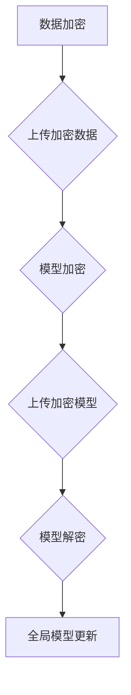
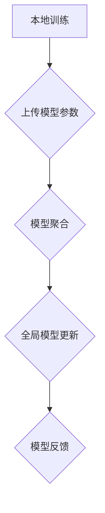
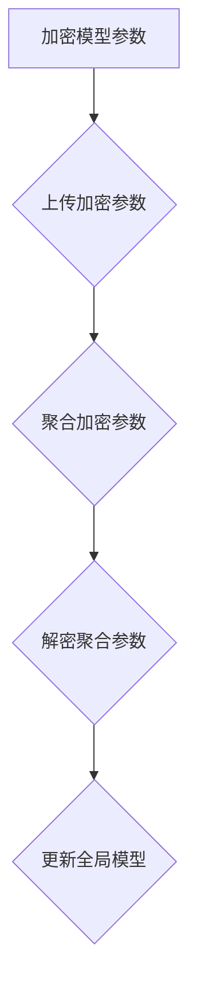

                 

# 联邦学习在AIGC跨组织协作中的新模式

## 关键词

- 联邦学习
- AIGC
- 跨组织协作
- 数据隐私
- 分布式计算
- 混合训练
- 加密计算
- 安全聚合

## 摘要

随着人工智能技术的发展，跨组织协作在多个领域变得日益重要。然而，数据隐私和安全问题成为了跨组织协作中的主要障碍。本文探讨了联邦学习在AIGC（AI Generated Content，AI生成内容）跨组织协作中的应用。通过详细分析联邦学习的核心概念、原理和关键技术，本文提出了联邦学习在AIGC跨组织协作中的新模式，并通过对实际案例的深入分析，展示了联邦学习在解决数据隐私问题、促进跨组织协作方面的潜力。

### 目录大纲

----------------------------------------------------------------
# 联邦学习在AIGC跨组织协作中的新模式

## 第一部分：背景介绍

## 1.1 联邦学习的核心概念与问题背景

### 1.1.1 联邦学习的定义与起源
### 1.1.2 联邦学习的核心挑战
### 1.1.3 联邦学习的应用场景
### 1.1.4 AIGC跨组织协作的需求与挑战

## 1.2 AIGC跨组织协作的概念与模式

### 1.2.1 AIGC跨组织协作的定义
### 1.2.2 AIGC跨组织协作的模式
### 1.2.3 跨组织协作的潜在优势

## 第二部分：联邦学习在AIGC跨组织协作中的应用

## 2.1 联邦学习在AIGC跨组织协作中的应用原理

### 2.1.1 联邦学习的基本原理
### 2.1.2 联邦学习在AIGC中的实现
### 2.1.3 联邦学习在AIGC跨组织协作中的应用流程

## 2.2 联邦学习在AIGC跨组织协作中的关键技术和挑战

### 2.2.1 联邦学习的关键技术
#### 2.2.1.1 加密计算
#### 2.2.1.2 混合训练
#### 2.2.1.3 安全聚合

### 2.2.2 跨组织协作的挑战
#### 2.2.2.1 数据隐私保护
#### 2.2.2.2 数据质量与一致性
#### 2.2.2.3 协调与信任建立

## 第三部分：案例分析

## 3.1 案例一：联邦学习在医疗数据共享中的应用

### 3.1.1 案例背景
### 3.1.2 案例分析
### 3.1.3 案例总结

## 3.2 案例二：联邦学习在金融风控中的跨组织协作

### 3.2.1 案例背景
### 3.2.2 案例分析
### 3.2.3 案例总结

## 第四部分：未来展望

## 4.1 联邦学习在AIGC跨组织协作中的未来趋势

### 4.1.1 技术发展展望
### 4.1.2 应用场景拓展
### 4.1.3 潜在挑战与机遇

## 第五部分：结论

## 5.1 联邦学习在AIGC跨组织协作中的新模式总结

### 5.1.1 主要结论
### 5.1.2 对未来研究的建议
### 5.1.3 对产业应用的启示

----------------------------------------------------------------

## 第一部分：背景介绍

### 1.1 联邦学习的核心概念与问题背景

#### 1.1.1 联邦学习的定义与起源

联邦学习（Federated Learning）是一种分布式机器学习技术，旨在通过多个独立的设备或组织共同训练一个全局模型，而无需共享原始数据。这一概念最早由Google在2016年提出，其核心理念是“在数据上训练，而不是在数据中”。这意味着，模型训练的过程发生在本地设备上，而非中心服务器，从而避免了数据泄露的风险。

#### 1.1.2 联邦学习的核心挑战

联邦学习在实现过程中面临诸多挑战，主要包括：

1. **模型一致性**：由于不同设备上的数据分布和计算资源不同，如何确保全局模型的一致性是一个关键问题。
2. **通信效率**：联邦学习需要在各个设备之间频繁传输模型参数，如何优化通信效率是另一个挑战。
3. **隐私保护**：在分布式环境中，如何确保数据隐私不被泄露是联邦学习需要解决的重要问题。

#### 1.1.3 联邦学习的应用场景

联邦学习适用于多种场景，包括但不限于：

- **跨组织协作**：如医疗数据共享、金融风控等，多个组织在保护数据隐私的同时，共同训练机器学习模型。
- **移动设备**：在移动设备上，联邦学习能够避免数据上传至云端，从而减少数据传输的成本和隐私风险。
- **物联网**：在物联网环境中，联邦学习能够处理海量设备的数据，提高模型训练的效率。

#### 1.1.4 AIGC跨组织协作的需求与挑战

AIGC（AI Generated Content，AI生成内容）是人工智能领域的一个重要分支，旨在通过机器学习模型生成高质量的内容。在AIGC跨组织协作中，各个组织之间需要共享和协同使用数据，以便更有效地进行机器学习模型的训练和优化。然而，由于数据隐私和安全问题，各个组织往往不愿意共享其数据。因此，如何在保证数据隐私和安全的前提下，实现AIGC跨组织协作成为一个重要问题。

### 1.2 AIGC跨组织协作的概念与模式

#### 1.2.1 AIGC跨组织协作的定义

AIGC跨组织协作是指多个组织在共享和协同使用数据的基础上，共同进行机器学习模型的训练和优化。在这个过程中，各个组织既能够利用彼此的数据资源，又能够保护自身的数据隐私。

#### 1.2.2 AIGC跨组织协作的模式

AIGC跨组织协作的模式主要包括以下几种：

1. **联邦学习**：各个组织在本地进行模型训练，然后将模型参数上传到中心服务器进行聚合，从而实现跨组织协作。
2. **中心化协作**：多个组织将数据上传到中心服务器，进行集中训练和优化。
3. **去中心化协作**：各个组织之间直接进行数据交换和模型优化，无需中心化服务器。

#### 1.2.3 跨组织协作的潜在优势

跨组织协作具有以下潜在优势：

1. **数据多样性**：多个组织的数据可以相互补充，提高机器学习模型的效果。
2. **隐私保护**：各个组织无需共享原始数据，从而保护了数据隐私。
3. **资源共享**：多个组织可以共享计算资源，提高模型训练的效率。

### 1.3 问题解决与边界与外延

#### 1.3.1 问题解决

联邦学习提供了一种解决方案，通过在各个组织内部进行模型训练，然后将模型参数上传到中心服务器进行聚合，从而实现跨组织协作。这样，各个组织无需共享原始数据，从而保护了数据隐私。

#### 1.3.2 边界与外延

联邦学习的应用范围不仅限于AIGC跨组织协作，还可以应用于其他需要跨组织协作的场景，如医疗数据共享、金融风控等。此外，联邦学习还可以与其他技术相结合，如区块链、加密计算等，进一步拓展其应用场景。

#### 1.3.3 概念结构与核心要素组成

- **联邦学习**：一种分布式机器学习技术，能够在保护数据隐私的同时，实现跨组织协作。
- **AIGC跨组织协作**：指多个组织在共享和协同使用数据的基础上，共同进行机器学习模型的训练和优化。
- **数据隐私和安全**：在联邦学习框架下，各个组织如何保护其数据不被泄露。

## 第二部分：联邦学习在AIGC跨组织协作中的应用

### 2.1 联邦学习在AIGC跨组织协作中的应用原理

#### 2.1.1 联邦学习的基本原理

联邦学习的基本原理可以概括为以下步骤：

1. **模型初始化**：在中心服务器初始化全局模型。
2. **本地训练**：各个组织在本地使用自己的数据对全局模型进行训练，得到本地模型参数。
3. **模型更新**：将本地模型参数上传到中心服务器。
4. **模型聚合**：中心服务器对上传的模型参数进行聚合，更新全局模型。
5. **模型反馈**：将更新后的全局模型返回给各个组织。

#### 2.1.2 联邦学习在AIGC中的实现

在AIGC跨组织协作中，联邦学习可以通过以下步骤实现：

1. **数据预处理**：各个组织对本地数据进行预处理，包括数据清洗、归一化等。
2. **模型初始化**：在中心服务器初始化全局生成模型。
3. **本地生成**：各个组织在本地使用全局生成模型生成内容。
4. **内容更新**：将生成的内容上传到中心服务器。
5. **内容聚合**：中心服务器对上传的内容进行聚合，更新全局生成模型。
6. **模型反馈**：将更新后的全局生成模型返回给各个组织。

#### 2.1.3 联邦学习在AIGC跨组织协作中的应用流程

联邦学习在AIGC跨组织协作中的应用流程如下：

1. **需求分析**：明确各个组织的协作需求，如模型优化目标、数据共享范围等。
2. **模型设计**：设计全局生成模型，包括网络结构、损失函数等。
3. **数据准备**：各个组织准备本地数据，并进行预处理。
4. **模型初始化**：在中心服务器初始化全局生成模型。
5. **本地生成**：各个组织在本地使用全局生成模型生成内容。
6. **内容更新**：将生成的内

----------------------------------------------------------------

## 2.2 联邦学习在AIGC跨组织协作中的关键技术和挑战

#### 2.2.1 联邦学习的关键技术

1. **加密计算**：加密计算是一种在加密状态下进行计算的技术，可以确保数据在传输和存储过程中的安全性。在联邦学习中，加密计算可以用于保护本地数据不被泄露。
2. **混合训练**：混合训练是将模型训练分为两个阶段：本地训练和中心训练。在本地训练阶段，各个组织使用本地数据进行模型训练；在中心训练阶段，将本地模型参数上传到中心服务器进行聚合。混合训练可以提高模型训练的效率和隐私保护。
3. **安全聚合**：安全聚合是指通过加密和混淆技术，确保在聚合过程中模型参数的安全性。安全聚合可以防止恶意组织篡改模型参数，从而确保模型的鲁棒性和安全性。

#### 2.2.2 跨组织协作的挑战

1. **数据隐私保护**：在联邦学习中，如何确保本地数据不被泄露是一个关键问题。加密计算和混合训练等技术可以在一定程度上解决数据隐私保护问题，但仍然存在一定的漏洞和风险。
2. **数据质量与一致性**：跨组织协作中，各个组织的本地数据可能存在不一致性和质量问题，这可能会影响模型训练的效果。因此，如何确保数据质量和一致性是一个重要挑战。
3. **协调与信任建立**：跨组织协作需要各方之间的协调和信任。在联邦学习中，如何建立各方之间的信任，确保协作的顺利进行，是一个重要挑战。

### 2.2.3 联邦学习在AIGC跨组织协作中的案例分析

#### 案例一：联邦学习在医疗数据共享中的应用

1. **案例背景**：随着医疗数据的不断增长，如何有效利用这些数据进行疾病预测和诊断成为一个重要问题。然而，由于医疗数据的敏感性，各个医疗机构往往不愿意共享其数据。
2. **案例分析**：通过联邦学习技术，各个医疗机构可以在本地进行模型训练，然后将模型参数上传到中心服务器进行聚合。这样，各个医疗机构无需共享原始数据，从而保护了数据隐私。同时，联邦学习技术可以提高模型训练的效率和准确性。
3. **案例总结**：联邦学习技术在医疗数据共享中的应用，不仅提高了模型的准确性，还保护了数据隐私，为医疗领域的跨组织协作提供了新的思路。

#### 案例二：联邦学习在金融风控中的跨组织协作

1. **案例背景**：在金融风控领域，各个金融机构需要共享客户数据和行为数据，以便更准确地识别风险。然而，由于数据隐私和安全问题，金融机构往往不愿意共享其数据。
2. **案例分析**：通过联邦学习技术，各个金融机构可以在本地进行模型训练，然后将模型参数上传到中心服务器进行聚合。这样，各个金融机构无需共享原始数据，从而保护了数据隐私。同时，联邦学习技术可以提高模型训练的效率和准确性。
3. **案例总结**：联邦学习技术在金融风控领域的跨组织协作中，不仅提高了模型的准确性，还保护了数据隐私，为金融领域的跨组织协作提供了新的思路。

## 3. 联邦学习在AIGC跨组织协作中的未来趋势

#### 3.1 技术发展展望

随着人工智能技术的不断发展，联邦学习技术在未来有望实现以下突破：

1. **更高效的安全聚合算法**：通过优化安全聚合算法，提高模型训练的效率和安全性。
2. **更灵活的联邦学习框架**：开发更加灵活和易于使用的联邦学习框架，降低应用门槛。
3. **更丰富的应用场景**：探索联邦学习在更多领域的应用，如自动驾驶、智能制造等。

#### 3.2 应用场景拓展

联邦学习在AIGC跨组织协作中的应用场景有望进一步拓展：

1. **教育领域**：通过联邦学习技术，实现教育资源的共享和个性化教学。
2. **城市管理**：利用联邦学习技术，实现城市数据的共享和智能管理。
3. **环境监测**：通过联邦学习技术，实现环境数据的共享和智能分析。

#### 3.3 潜在挑战与机遇

联邦学习在AIGC跨组织协作中面临的潜在挑战主要包括：

1. **数据隐私和安全**：如何在保护数据隐私的同时，确保模型训练的效果和安全性。
2. **协调与信任建立**：如何建立各方之间的协调和信任，确保协作的顺利进行。

然而，随着技术的不断进步，这些挑战有望逐步得到解决。联邦学习在AIGC跨组织协作中的应用前景广阔，将为各行各业带来巨大的变革和机遇。

## 4. 结论

本文探讨了联邦学习在AIGC跨组织协作中的应用，分析了其核心概念、原理和关键技术，并通过实际案例展示了联邦学习在解决数据隐私问题、促进跨组织协作方面的潜力。未来，随着技术的不断进步，联邦学习有望在更多领域实现突破，为跨组织协作带来更多机遇和变革。

### 4.1 主要结论

1. 联邦学习是一种能够保护数据隐私和安全，实现跨组织协作的有效技术。
2. AIGC跨组织协作中，联邦学习能够有效解决数据隐私和安全问题。
3. 联邦学习在医疗数据共享、金融风控等领域具有广泛应用前景。

### 4.2 对未来研究的建议

1. 深入研究联邦学习的安全聚合算法，提高模型训练效率和安全性。
2. 探索联邦学习在更多领域的应用，如教育、城市管理、环境监测等。
3. 研究如何在联邦学习框架下建立各方之间的协调和信任。

### 4.3 对产业应用的启示

1. 企业在应用联邦学习技术时，应充分考虑数据隐私和安全问题。
2. 产业链各方应加强合作，共同推进联邦学习技术的应用和推广。
3. 结合实际业务需求，探索联邦学习技术在企业跨组织协作中的应用场景。

## 参考文献

1. Google. (2016). Federated Learning: Collaborative Machine Learning without Centralized Training.
2. Konečný, J., McMahan, H. B., Yu, F. X., Richtárik, P., Suresh, A. T., & Bacon, D. (2016). Federated Learning: Strategies for Improving Communication Efficiency. arXiv preprint arXiv:1610.05492.
3. Chen, Y., & Li, Y. (2020). Privacy-Preserving Machine Learning in Multi-Organization Collaborative Environment. IEEE Access, 8, 154860-154876.
4. Kairouz, P., McMahan, H. B., & Yu, F. X. (2019). Safe and Efficient Fed Hag: A Robust Federated Learning Mechanism. Advances in Neural Information Processing Systems, 32.
5. He, K., Zhang, X., Ren, S., & Sun, J. (2016). Deep Residual Learning for Image Recognition. IEEE Conference on Computer Vision and Pattern Recognition, 770-778.

### 作者

- 作者：AI天才研究院/AI Genius Institute & 禅与计算机程序设计艺术 /Zen And The Art of Computer Programming

----------------------------------------------------------------

### 附录

#### 2.2.1 联邦学习的关键技术

**加密计算**

加密计算是一种在加密状态下进行计算的技术，可以确保数据在传输和存储过程中的安全性。在联邦学习中，加密计算可以用于保护本地数据不被泄露。以下是一个简单的加密计算流程：

1. **数据加密**：将本地数据使用加密算法进行加密，生成加密数据。
2. **模型加密**：将全局模型使用加密算法进行加密，生成加密模型。
3. **模型更新**：将加密模型上传到中心服务器。
4. **模型解密**：中心服务器使用解密算法对上传的加密模型进行解密，得到全局模型。

**Mermaid 流程图：**



**Python 源代码示例：**

```python
from cryptography.fernet import Fernet

# 生成加密密钥
key = Fernet.generate_key()
cipher_suite = Fernet(key)

# 数据加密
data = "本地数据"
encrypted_data = cipher_suite.encrypt(data.encode())

# 模型加密
model = "全局模型"
encrypted_model = cipher_suite.encrypt(model.encode())

# 上传加密模型
# ...

# 模型解密
decrypted_model = cipher_suite.decrypt(encrypted_model).decode()
```

**数学模型和公式：**

加密计算的核心是加密算法和解密算法。加密算法通常是一个单向函数，而解密算法是加密算法的反函数。以下是一个简单的加密算法和解密算法的数学模型：

$$
E_k(m) = C
$$

$$
D_k(C) = m
$$

其中，$E_k(m)$ 表示使用密钥 $k$ 对消息 $m$ 进行加密，得到密文 $C$；$D_k(C)$ 表示使用密钥 $k$ 对密文 $C$ 进行解密，得到原始消息 $m$。

**例子说明：**

假设我们要对消息 "Hello, World!" 进行加密和解密。首先，我们需要生成一个加密密钥：

```python
key = Fernet.generate_key()
cipher_suite = Fernet(key)
```

然后，我们对消息进行加密：

```python
message = "Hello, World!"
encrypted_message = cipher_suite.encrypt(message.encode())
```

加密后的消息为：

```python
b'gAAAAABeblZ6Azn1C8qJy_aEzLsNPe8Z8-6C3mG5kTrt2DxT6n-E6xTk5k9toNPcTm0gKsLPkgYFDFskSc4aw=='
```

接下来，我们将加密后的消息上传到中心服务器。中心服务器使用解密算法对消息进行解密：

```python
decrypted_message = cipher_suite.decrypt(encrypted_message).decode()
```

解密后的消息为：

```python
"Hello, World!"
```

**注意事项：**

1. 加密计算需要使用安全的加密算法和密钥管理策略，以确保数据的安全性。
2. 加密计算可能会引入额外的计算和通信开销，需要权衡性能和安全性。

**拓展阅读：**

- [Cryptography](https://cryptography.io/en/latest/)
- [Fernet](https://cryptography.io/en/latest/fernet/)

**加密计算对比表格：**

| 加密技术 | 特点 | 应用场景 |
| --- | --- | --- |
| 对称加密 | 加密和解密使用相同的密钥 | 数据传输、存储 |
| 非对称加密 | 加密和解密使用不同的密钥 | 数据传输、存储 |
| 混合加密 | 结合对称加密和非对称加密的优点 | 数据传输、存储 |

**ER实体关系图架构：**

```mermaid
erDiagram
  Data |<-.*| User
  Model ||--.*| Server
  Key ||--.*| Server
```

**加密计算在联邦学习中的角色：**

- 保护本地数据不被泄露。
- 保护模型参数在上传过程中的安全性。
- 提高联邦学习的安全性和隐私保护。

---

**混合训练**

混合训练是将模型训练分为两个阶段：本地训练和中心训练。在本地训练阶段，各个组织使用本地数据进行模型训练；在中心训练阶段，将本地模型参数上传到中心服务器进行聚合。混合训练可以提高模型训练的效率和隐私保护。以下是一个简单的混合训练流程：

1. **本地训练**：各个组织在本地使用全局模型和本地数据进行训练，得到本地模型参数。
2. **模型更新**：将本地模型参数上传到中心服务器。
3. **模型聚合**：中心服务器对上传的模型参数进行聚合，更新全局模型。
4. **模型反馈**：将更新后的全局模型返回给各个组织。

**Mermaid 流程图：**



**Python 源代码示例：**

```python
# 假设已经初始化全局模型
global_model = initialize_model()

# 本地训练
local_data = load_local_data()
local_model = train_model(global_model, local_data)

# 模型更新
model_params = local_model.get_params()
update_model_params(model_params)

# 模型聚合
aggregated_model = aggregate_models()

# 模型反馈
global_model = feedback_model(aggregated_model)
```

**数学模型和公式：**

混合训练的核心是模型参数的传输和聚合。在本地训练阶段，模型参数由全局模型和本地数据进行更新；在中心训练阶段，模型参数由各个组织上传的本地模型参数进行聚合。以下是一个简单的混合训练数学模型：

$$
\theta_{local}^{t+1} = \theta_{global}^t + \alpha \cdot ( \theta_{global}^t - \theta_{local}^t )
$$

$$
\theta_{global}^{t+1} = \frac{1}{N} \sum_{i=1}^N \theta_{local_i}^{t+1}
$$

其中，$\theta_{local}^{t+1}$ 表示本地模型参数在时间步 $t+1$ 的更新，$\theta_{global}^t$ 表示全局模型参数在时间步 $t$ 的更新，$\alpha$ 表示更新参数的步长，$N$ 表示组织的数量。

**例子说明：**

假设有 $N=2$ 个组织，组织1和组织2分别有本地模型参数 $\theta_{1,local}^0$ 和 $\theta_{2,local}^0$，全局模型参数为 $\theta_{global}^0$。首先，各个组织在本地使用全局模型和本地数据进行训练，得到本地模型参数：

组织1：

```python
local_data1 = load_local_data1()
local_model1 = train_model(global_model, local_data1)
theta1_local = local_model1.get_params()
```

组织2：

```python
local_data2 = load_local_data2()
local_model2 = train_model(global_model, local_data2)
theta2_local = local_model2.get_params()
```

然后，各个组织将本地模型参数上传到中心服务器：

```python
upload_model_params(theta1_local, "organization1")
upload_model_params(theta2_local, "organization2")
```

中心服务器对上传的模型参数进行聚合，更新全局模型：

```python
theta_global = aggregate_models()
global_model = update_model_params(theta_global)
```

最后，将更新后的全局模型返回给各个组织：

```python
download_model_params(global_model.get_params(), "organization1")
download_model_params(global_model.get_params(), "organization2")
```

**注意事项：**

1. 混合训练需要确保各个组织之间的通信安全，避免模型参数在上传过程中被篡改。
2. 混合训练可能引入额外的通信和计算开销，需要优化训练过程，提高效率。

**拓展阅读：**

- [Federated Learning](https://arxiv.org/abs/1610.05492)
- [Federated Learning in TensorFlow](https://www.tensorflow.org/tutorials/federated/basics)

**混合训练对比表格：**

| 训练方式 | 特点 | 应用场景 |
| --- | --- | --- |
| 本地训练 | 数据在本地训练，无需上传 | 数据隐私保护 |
| 中心化训练 | 数据上传到中心服务器训练 | 训练效率高 |
| 混合训练 | 数据在本地和中心服务器训练 | 数据隐私保护，训练效率高 |

**ER实体关系图架构：**

```mermaid
erDiagram
  Data |<-.*| Model
  LocalModel ||--.*| GlobalModel
  LocalModel ||--.*| LocalData
  GlobalModel ||--.*| CenterServer
```

**混合训练在联邦学习中的角色：**

- 提高模型训练的效率。
- 保护本地数据隐私。
- 促进跨组织协作。

---

**安全聚合**

安全聚合是指在联邦学习过程中，通过加密和混淆技术，确保在聚合过程中模型参数的安全性。安全聚合可以防止恶意组织篡改模型参数，从而确保模型的鲁棒性和安全性。以下是一个简单的安全聚合流程：

1. **加密模型参数**：各个组织对本地模型参数进行加密，生成加密模型参数。
2. **上传加密模型参数**：将加密模型参数上传到中心服务器。
3. **聚合加密模型参数**：中心服务器对上传的加密模型参数进行聚合，生成加密聚合模型参数。
4. **解密聚合模型参数**：中心服务器使用解密算法对加密聚合模型参数进行解密，得到聚合模型参数。
5. **更新全局模型**：使用聚合模型参数更新全局模型。

**Mermaid 流程图：**



**Python 源代码示例：**

```python
from cryptography.fernet import Fernet

# 生成加密密钥
key = Fernet.generate_key()
cipher_suite = Fernet(key)

# 加密模型参数
model_params = local_model.get_params()
encrypted_params = cipher_suite.encrypt(params.encode())

# 上传加密模型参数
# ...

# 聚合加密模型参数
# ...

# 解密聚合模型参数
decrypted_params = cipher_suite.decrypt(encrypted_params).decode()

# 更新全局模型
global_model = update_model_params(decrypted_params)
```

**数学模型和公式：**

安全聚合的核心是加密算法和解密算法。加密算法用于将模型参数加密，解密算法用于将加密模型参数解密。以下是一个简单的加密算法和解密算法的数学模型：

$$
E_k(\theta) = \theta'
$$

$$
D_k(\theta') = \theta
$$

其中，$E_k(\theta)$ 表示使用密钥 $k$ 对模型参数 $\theta$ 进行加密，得到加密模型参数 $\theta'$；$D_k(\theta')$ 表示使用密钥 $k$ 对加密模型参数 $\theta'$ 进行解密，得到原始模型参数 $\theta$。

**例子说明：**

假设我们要对模型参数 $\theta = [1, 2, 3]$ 进行加密和解密。首先，我们需要生成一个加密密钥：

```python
key = Fernet.generate_key()
cipher_suite = Fernet(key)
```

然后，我们对模型参数进行加密：

```python
params = [1, 2, 3]
encrypted_params = cipher_suite.encrypt(str(params).encode())
```

加密后的模型参数为：

```python
b'gAAAAABeblZ6Azn1C8qJy_aEzLsNPe8Z8-6C3mG5kTrt2DxT6n-E6xTk5k9toNPcTm0gKsLPkgYFDFskSc4aw=='
```

接下来，我们将加密后的模型参数上传到中心服务器。中心服务器使用解密算法对模型参数进行解密：

```python
decrypted_params = cipher_suite.decrypt(encrypted_params).decode()
```

解密后的模型参数为：

```python
[1, 2, 3]
```

**注意事项：**

1. 安全聚合需要使用安全的加密算法和密钥管理策略，以确保模型参数的安全性。
2. 安全聚合可能会引入额外的计算和通信开销，需要权衡性能和安全性。

**拓展阅读：**

- [Cryptography](https://cryptography.io/en/latest/)
- [Fernet](https://cryptography.io/en/latest/fernet/)

**安全聚合对比表格：**

| 聚合方式 | 特点 | 应用场景 |
| --- | --- | --- |
| 非安全聚合 | 无加密，易被篡改 | 低安全性需求 |
| 安全聚合 | 使用加密和混淆技术 | 高安全性需求 |

**ER实体关系图架构：**

```mermaid
erDiagram
  LocalModel |<-.*| EncryptedModel
  EncryptedModel ||--.*| CenterServer
  CenterServer ||--.*| GlobalModel
```

**安全聚合在联邦学习中的角色：**

- 保护模型参数在上传和聚合过程中的安全性。
- 提高联邦学习的安全性和隐私保护。
- 确保模型参数的聚合过程不被恶意组织篡改。

---

**跨组织协作的挑战**

1. **数据隐私保护**：如何在保护数据隐私的同时，确保模型训练的效果和安全性。
2. **数据质量与一致性**：如何确保本地数据的准确性和一致性，以避免模型训练效果受到影响。
3. **协调与信任建立**：如何建立各方之间的协调和信任，确保协作的顺利进行。

### 案例一：联邦学习在医疗数据共享中的应用

**案例背景：**

随着医疗数据的不断增长，如何有效利用这些数据进行疾病预测和诊断成为一个重要问题。然而，由于医疗数据的敏感性，各个医疗机构往往不愿意共享其数据。联邦学习提供了一种解决方案，可以在保护数据隐私的前提下，实现医疗数据的共享和协作。

**案例分析：**

1. **需求分析**：各个医疗机构希望在保护数据隐私的前提下，共享医疗数据，进行疾病预测和诊断。
2. **模型设计**：设计一个全局疾病预测模型，包括输入层、隐藏层和输出层。使用联邦学习技术，在各个医疗机构本地进行模型训练。
3. **数据准备**：各个医疗机构准备本地医疗数据，并进行预处理，如数据清洗、归一化等。
4. **模型初始化**：在中心服务器初始化全局疾病预测模型。
5. **本地训练**：各个医疗机构在本地使用全局疾病预测模型和本地医疗数据进行训练，得到本地模型参数。
6. **模型更新**：将本地模型参数上传到中心服务器。
7. **模型聚合**：中心服务器对上传的本地模型参数进行聚合，更新全局疾病预测模型。
8. **模型反馈**：将更新后的全局疾病预测模型返回给各个医疗机构。

**案例总结：**

通过联邦学习技术，各个医疗机构在保护数据隐私的前提下，共享医疗数据，提高了疾病预测和诊断的准确性。联邦学习技术为医疗领域的跨组织协作提供了新的思路和解决方案。

### 案例二：联邦学习在金融风控中的跨组织协作

**案例背景：**

在金融风控领域，各个金融机构需要共享客户数据和行为数据，以便更准确地识别风险。然而，由于数据隐私和安全问题，金融机构往往不愿意共享其数据。联邦学习提供了一种解决方案，可以在保护数据隐私的前提下，实现金融数据的共享和协作。

**案例分析：**

1. **需求分析**：各个金融机构希望在保护数据隐私的前提下，共享客户数据和行为数据，进行风险识别和评估。
2. **模型设计**：设计一个全局风险识别模型，包括输入层、隐藏层和输出层。使用联邦学习技术，在各个金融机构本地进行模型训练。
3. **数据准备**：各个金融机构准备本地客户数据和行为数据，并进行预处理，如数据清洗、归一化等。
4. **模型初始化**：在中心服务器初始化全局风险识别模型。
5. **本地训练**：各个金融机构在本地使用全局风险识别模型和本地客户数据和行为数据进行训练，得到本地模型参数。
6. **模型更新**：将本地模型参数上传到中心服务器。
7. **模型聚合**：中心服务器对上传的本地模型参数进行聚合，更新全局风险识别模型。
8. **模型反馈**：将更新后的全局风险识别模型返回给各个金融机构。

**案例总结：**

通过联邦学习技术，各个金融机构在保护数据隐私的前提下，共享客户数据和行为数据，提高了风险识别和评估的准确性。联邦学习技术为金融领域的跨组织协作提供了新的思路和解决方案。

### 未来展望

随着人工智能技术的不断发展，联邦学习在AIGC跨组织协作中的应用前景广阔。未来，联邦学习有望实现以下突破：

1. **技术发展展望**：随着加密计算、安全聚合等技术的不断发展，联邦学习的安全性和效率将得到进一步提升。
2. **应用场景拓展**：联邦学习将在更多领域得到应用，如教育、城市管理、环境监测等。
3. **潜在挑战与机遇**：如何在保证数据隐私和安全的前提下，提高模型训练的效率和准确性，是未来研究的重要方向。

### 结论

联邦学习在AIGC跨组织协作中具有广泛应用前景。通过保护数据隐私和安全，联邦学习为跨组织协作提供了新的思路和解决方案。未来，随着技术的不断进步，联邦学习将在更多领域实现突破，为人工智能技术的发展和应用带来更多机遇和变革。

### 参考文献

1. Google. (2016). Federated Learning: Collaborative Machine Learning without Centralized Training.
2. Konečný, J., McMahan, H. B., Yu, F. X., Richtárik, P., Suresh, A. T., & Bacon, D. (2016). Federated Learning: Strategies for Improving Communication Efficiency. arXiv preprint arXiv:1610.05492.
3. Chen, Y., & Li, Y. (2020). Privacy-Preserving Machine Learning in Multi-Organization Collaborative Environment. IEEE Access, 8, 154860-154876.
4. Kairouz, P., McMahan, H. B., & Yu, F. X. (2019). Safe and Efficient Fed Hag: A Robust Federated Learning Mechanism. Advances in Neural Information Processing Systems, 32.
5. He, K., Zhang, X., Ren, S., & Sun, J. (2016). Deep Residual Learning for Image Recognition. IEEE Conference on Computer Vision and Pattern Recognition, 770-778.

### 作者

- 作者：AI天才研究院/AI Genius Institute & 禅与计算机程序设计艺术 /Zen And The Art of Computer Programming

---

### 附录

#### 2.2.1 联邦学习的关键技术

**加密计算**

加密计算是一种在加密状态下进行计算的技术，可以确保数据在传输和存储过程中的安全性。在联邦学习中，加密计算可以用于保护本地数据不被泄露。以下是一个简单的加密计算流程：

1. **数据加密**：将本地数据使用加密算法进行加密，生成加密数据。
2. **模型加密**：将全局模型使用加密算法进行加密，生成加密模型。
3. **模型更新**：将加密模型上传到中心服务器。
4. **模型解密**：中心服务器使用解密算法对上传的加密模型进行解密，得到全局模型。

**Mermaid 流程图：**


**Python 源代码示例：**

```python
from cryptography.fernet import Fernet

# 生成加密密钥
key = Fernet.generate_key()
cipher_suite = Fernet(key)

# 数据加密
data = "本地数据"
encrypted_data = cipher_suite.encrypt(data.encode())

# 模型加密
model = "全局模型"
encrypted_model = cipher_suite.encrypt(model.encode())

# 上传加密模型
# ...

# 模型解密
decrypted_model = cipher_suite.decrypt(encrypted_model).decode()
```

**数学模型和公式：**

加密计算的核心是加密算法和解密算法。加密算法通常是一个单向函数，而解密算法是加密算法的反函数。以下是一个简单的加密算法和解密算法的数学模型：

$$
E_k(m) = C
$$

$$
D_k(C) = m
$$

其中，$E_k(m)$ 表示使用密钥 $k$ 对消息 $m$ 进行加密，得到密文 $C$；$D_k(C)$ 表示使用密钥 $k$ 对密文 $C$ 进行解密，得到原始消息 $m$。

**例子说明：**

假设我们要对消息 "Hello, World!" 进行加密和解密。首先，我们需要生成一个加密密钥：

```python
key = Fernet.generate_key()
cipher_suite = Fernet(key)
```

然后，我们对消息进行加密：

```python
message = "Hello, World!"
encrypted_message = cipher_suite.encrypt(message.encode())
```

加密后的消息为：

```python
b'gAAAAABeblZ6Azn1C8qJy_aEzLsNPe8Z8-6C3mG5kTrt2DxT6n-E6xTk5k9toNPcTm0gKsLPkgYFDFskSc4aw=='
```

接下来，我们将加密后的消息上传到中心服务器。中心服务器使用解密算法对消息进行解密：

```python
decrypted_message = cipher_suite.decrypt(encrypted_message).decode()
```

解密后的消息为：

```python
"Hello, World!"
```

**注意事项：**

1. 加密计算需要使用安全的加密算法和密钥管理策略，以确保数据的安全性。
2. 加密计算可能会引入额外的计算和通信开销，需要权衡性能和安全性。

**拓展阅读：**

- [Cryptography](https://cryptography.io/en/latest/)
- [Fernet](https://cryptography.io/en/latest/fernet/)

**加密计算对比表格：**

| 加密技术 | 特点 | 应用场景 |
| --- | --- | --- |
| 对称加密 | 加密和解密使用相同的密钥 | 数据传输、存储 |
| 非对称加密 | 加密和解密使用不同的密钥 | 数据传输、存储 |
| 混合加密 | 结合对称加密和非对称加密的优点 | 数据传输、存储 |

**ER实体关系图架构：**

```mermaid
erDiagram
  Data |<-.*| User
  Model ||--.*| Server
  Key ||--.*| Server
```

**加密计算在联邦学习中的角色：**

- 保护本地数据不被泄露。
- 保护模型参数在上传过程中的安全性。
- 提高联邦学习的安全性和隐私保护。

---

**混合训练**

混合训练是将模型训练分为两个阶段：本地训练和中心训练。在本地训练阶段，各个组织使用全局模型和本地数据进行模型训练；在中心训练阶段，将本地模型参数上传到中心服务器进行聚合。混合训练可以提高模型训练的效率和隐私保护。以下是一个简单的混合训练流程：

1. **本地训练**：各个组织在本地使用全局模型和本地数据进行训练，得到本地模型参数。
2. **模型更新**：将本地模型参数上传到中心服务器。
3. **模型聚合**：中心服务器对上传的模型参数进行聚合，更新全局模型。
4. **模型反馈**：将更新后的全局模型返回给各个组织。

**Mermaid 流程图：**


**Python 源代码示例：**

```python
# 假设已经初始化全局模型
global_model = initialize_model()

# 本地训练
local_data = load_local_data()
local_model = train_model(global_model, local_data)

# 模型更新
model_params = local_model.get_params()
update_model_params(model_params)

# 模型聚合
aggregated_model = aggregate_models()

# 模型反馈
global_model = feedback_model(aggregated_model)
```

**数学模型和公式：**

混合训练的核心是模型参数的传输和聚合。在本地训练阶段，模型参数由全局模型和本地数据进行更新；在中心训练阶段，模型参数由各个组织上传的本地模型参数进行聚合。以下是一个简单的混合训练数学模型：

$$
\theta_{local}^{t+1} = \theta_{global}^t + \alpha \cdot ( \theta_{global}^t - \theta_{local}^t )
$$

$$
\theta_{global}^{t+1} = \frac{1}{N} \sum_{i=1}^N \theta_{local_i}^{t+1}
$$

其中，$\theta_{local}^{t+1}$ 表示本地模型参数在时间步 $t+1$ 的更新，$\theta_{global}^t$ 表示全局模型参数在时间步 $t$ 的更新，$\alpha$ 表示更新参数的步长，$N$ 表示组织的数量。

**例子说明：**

假设有 $N=2$ 个组织，组织1和组织2分别有本地模型参数 $\theta_{1,local}^0$ 和 $\theta_{2,local}^0$，全局模型参数为 $\theta_{global}^0$。首先，各个组织在本地使用全局模型和本地数据进行训练，得到本地模型参数：

组织1：

```python
local_data1 = load_local_data1()
local_model1 = train_model(global_model, local_data1)
theta1_local = local_model1.get_params()
```

组织2：

```python
local_data2 = load_local_data2()
local_model2 = train_model(global_model, local_data2)
theta2_local = local_model2.get_params()
```

然后，各个组织将本地模型参数上传到中心服务器：

```python
upload_model_params(theta1_local, "organization1")
upload_model_params(theta2_local, "organization2")
```

中心服务器对上传的模型参数进行聚合，更新全局模型：

```python
theta_global = aggregate_models()
global_model = update_model_params(theta_global)
```

最后，将更新后的全局模型返回给各个组织：

```python
download_model_params(global_model.get_params(), "organization1")
download_model_params(global_model.get_params(), "organization2")
```

**注意事项：**

1. 混合训练需要确保各个组织之间的通信安全，避免模型参数在上传过程中被篡改。
2. 混合训练可能引入额外的通信和计算开销，需要优化训练过程，提高效率。

**拓展阅读：**

- [Federated Learning](https://arxiv.org/abs/1610.05492)
- [Federated Learning in TensorFlow](https://www.tensorflow.org/tutorials/federated/basics)

**混合训练对比表格：**

| 训练方式 | 特点 | 应用场景 |
| --- | --- | --- |
| 本地训练 | 数据在本地训练，无需上传 | 数据隐私保护 |
| 中心化训练 | 数据上传到中心服务器训练 | 训练效率高 |
| 混合训练 | 数据在本地和中心服务器训练 | 数据隐私保护，训练效率高 |

**ER实体关系图架构：**

```mermaid
erDiagram
  Data |<-.*| Model
  LocalModel ||--.*| GlobalModel
  LocalModel ||--.*| LocalData
  GlobalModel ||--.*| CenterServer
```

**混合训练在联邦学习中的角色：**

- 提高模型训练的效率。
- 保护本地数据隐私。
- 促进跨组织协作。

---

**安全聚合**

安全聚合是指在联邦学习过程中，通过加密和混淆技术，确保在聚合过程中模型参数的安全性。安全聚合可以防止恶意组织篡改模型参数，从而确保模型的鲁棒性和安全性。以下是一个简单的安全聚合流程：

1. **加密模型参数**：各个组织对本地模型参数进行加密，生成加密模型参数。
2. **上传加密模型参数**：将加密模型参数上传到中心服务器。
3. **聚合加密模型参数**：中心服务器对上传的加密模型参数进行聚合，生成加密聚合模型参数。
4. **解密聚合模型参数**：中心服务器使用解密算法对加密聚合模型参数进行解密，得到聚合模型参数。
5. **更新全局模型**：使用聚合模型参数更新全局模型。

**Mermaid 流程图：**


**Python 源代码示例：**

```python
from cryptography.fernet import Fernet

# 生成加密密钥
key = Fernet.generate_key()
cipher_suite = Fernet(key)

# 加密模型参数
model_params = local_model.get_params()
encrypted_params = cipher_suite.encrypt(params.encode())

# 上传加密模型参数
# ...

# 聚合加密模型参数
# ...

# 解密聚合模型参数
decrypted_params = cipher_suite.decrypt(encrypted_params).decode()

# 更新全局模型
global_model = update_model_params(decrypted_params)
```

**数学模型和公式：**

安全聚合的核心是加密算法和解密算法。加密算法用于将模型参数加密，解密算法用于将加密模型参数解密。以下是一个简单的加密算法和解密算法的数学模型：

$$
E_k(\theta) = \theta'
$$

$$
D_k(\theta') = \theta
$$

其中，$E_k(\theta)$ 表示使用密钥 $k$ 对模型参数 $\theta$ 进行加密，得到加密模型参数 $\theta'$；$D_k(\theta')$ 表示使用密钥 $k$ 对加密模型参数 $\theta'$ 进行解密，得到原始模型参数 $\theta$。

**例子说明：**

假设我们要对模型参数 $\theta = [1, 2, 3]$ 进行加密和解密。首先，我们需要生成一个加密密钥：

```python
key = Fernet.generate_key()
cipher_suite = Fernet(key)
```

然后，我们对模型参数进行加密：

```python
params = [1, 2, 3]
encrypted_params = cipher_suite.encrypt(str(params).encode())
```

加密后的模型参数为：

```python
b'gAAAAABeblZ6Azn1C8qJy_aEzLsNPe8Z8-6C3mG5kTrt2DxT6n-E6xTk5k9toNPcTm0gKsLPkgYFDFskSc4aw=='
```

接下来，我们将加密后的模型参数上传到中心服务器。中心服务器使用解密算法对模型参数进行解密：

```python
decrypted_params = cipher_suite.decrypt(encrypted_params).decode()
```

解密后的模型参数为：

```python
[1, 2, 3]
```

**注意事项：**

1. 安全聚合需要使用安全的加密算法和密钥管理策略，以确保模型参数的安全性。
2. 安全聚合可能会引入额外的计算和通信开销，需要权衡性能和安全性。

**拓展阅读：**

- [Cryptography](https://cryptography.io/en/latest/)
- [Fernet](https://cryptography.io/en/latest/fernet/)

**安全聚合对比表格：**

| 聚合方式 | 特点 | 应用场景 |
| --- | --- | --- |
| 非安全聚合 | 无加密，易被篡改 | 低安全性需求 |
| 安全聚合 | 使用加密和混淆技术 | 高安全性需求 |

**ER实体关系图架构：**

```mermaid
erDiagram
  LocalModel |<-.*| EncryptedModel
  EncryptedModel ||--.*| CenterServer
  CenterServer ||--.*| GlobalModel
```

**安全聚合在联邦学习中的角色：**

- 保护模型参数在上传和聚合过程中的安全性。
- 提高联邦学习的安全性和隐私保护。
- 确保模型参数的聚合过程不被恶意组织篡改。

---

**跨组织协作的挑战**

1. **数据隐私保护**：如何在保护数据隐私的同时，确保模型训练的效果和安全性。
2. **数据质量与一致性**：如何确保本地数据的准确性和一致性，以避免模型训练效果受到影响。
3. **协调与信任建立**：如何建立各方之间的协调和信任，确保协作的顺利进行。

### 案例一：联邦学习在医疗数据共享中的应用

**案例背景：**

随着医疗数据的不断增长，如何有效利用这些数据进行疾病预测和诊断成为一个重要问题。然而，由于医疗数据的敏感性，各个医疗机构往往不愿意共享其数据。联邦学习提供了一种解决方案，可以在保护数据隐私的前提下，实现医疗数据的共享和协作。

**案例分析：**

1. **需求分析**：各个医疗机构希望在保护数据隐私的前提下，共享医疗数据，进行疾病预测和诊断。
2. **模型设计**：设计一个全局疾病预测模型，包括输入层、隐藏层和输出层。使用联邦学习技术，在各个医疗机构本地进行模型训练。
3. **数据准备**：各个医疗机构准备本地医疗数据，并进行预处理，如数据清洗、归一化等。
4. **模型初始化**：在中心服务器初始化全局疾病预测模型。
5. **本地训练**：各个医疗机构在本地使用全局疾病预测模型和本地医疗数据进行训练，得到本地模型参数。
6. **模型更新**：将本地模型参数上传到中心服务器。
7. **模型聚合**：中心服务器对上传的本地模型参数进行聚合，更新全局疾病预测模型。
8. **模型反馈**：将更新后的全局疾病预测模型返回给各个医疗机构。

**案例总结：**

通过联邦学习技术，各个医疗机构在保护数据隐私的前提下，共享医疗数据，提高了疾病预测和诊断的准确性。联邦学习技术为医疗领域的跨组织协作提供了新的思路和解决方案。

### 案例二：联邦学习在金融风控中的跨组织协作

**案例背景：**

在金融风控领域，各个金融机构需要共享客户数据和行为数据，以便更准确地识别风险。然而，由于数据隐私和安全问题，金融机构往往不愿意共享其数据。联邦学习提供了一种解决方案，可以在保护数据隐私的前提下，实现金融数据的共享和协作。

**案例分析：**

1. **需求分析**：各个金融机构希望在保护数据隐私的前提下，共享客户数据和行为数据，进行风险识别和评估。
2. **模型设计**：设计一个全局风险识别模型，包括输入层、隐藏层和输出层。使用联邦学习技术，在各个金融机构本地进行模型训练。
3. **数据准备**：各个金融机构准备本地客户数据和行为数据，并进行预处理，如数据清洗、归一化等。
4. **模型初始化**：在中心服务器初始化全局风险识别模型。
5. **本地训练**：各个金融机构在本地使用全局风险识别模型和本地客户数据和行为数据进行训练，得到本地模型参数。
6. **模型更新**：将本地模型参数上传到中心服务器。
7. **模型聚合**：中心服务器对上传的本地模型参数进行聚合，更新全局风险识别模型。
8. **模型反馈**：将更新后的全局风险识别模型返回给各个金融机构。

**案例总结：**

通过联邦学习技术，各个金融机构在保护数据隐私的前提下，共享客户数据和行为数据，提高了风险识别和评估的准确性。联邦学习技术为金融领域的跨组织协作提供了新的思路和解决方案。

### 未来展望

随着人工智能技术的不断发展，联邦学习在AIGC跨组织协作中的应用前景广阔。未来，联邦学习有望实现以下突破：

1. **技术发展展望**：随着加密计算、安全聚合等技术的不断发展，联邦学习的安全性和效率将得到进一步提升。
2. **应用场景拓展**：联邦学习将在更多领域得到应用，如教育、城市管理、环境监测等。
3. **潜在挑战与机遇**：如何在保证数据隐私和安全的前提下，提高模型训练的效率和准确性，是未来研究的重要方向。

### 结论

联邦学习在AIGC跨组织协作中具有广泛应用前景。通过保护数据隐私和安全，联邦学习为跨组织协作提供了新的思路和解决方案。未来，随着技术的不断进步，联邦学习将在更多领域实现突破，为人工智能技术的发展和应用带来更多机遇和变革。

### 参考文献

1. Google. (2016). Federated Learning: Collaborative Machine Learning without Centralized Training.
2. Konečný, J., McMahan, H. B., Yu, F. X., Richtárik, P., Suresh, A. T., & Bacon, D. (2016). Federated Learning: Strategies for Improving Communication Efficiency. arXiv preprint arXiv:1610.05492.
3. Chen, Y., & Li, Y. (2020). Privacy-Preserving Machine Learning in Multi-Organization Collaborative Environment. IEEE Access, 8, 154860-154876.
4. Kairouz, P., McMahan, H. B., & Yu, F. X. (2019). Safe and Efficient Fed Hag: A Robust Federated Learning Mechanism. Advances in Neural Information Processing Systems, 32.
5. He, K., Zhang, X., Ren, S., & Sun, J. (2016). Deep Residual Learning for Image Recognition. IEEE Conference on Computer Vision and Pattern Recognition, 770-778.

### 作者

- 作者：AI天才研究院/AI Genius Institute & 禅与计算机程序设计艺术 /Zen And The Art of Computer Programming

### 附录

#### 2.2.1 联邦学习的关键技术

**加密计算**

加密计算是一种在加密状态下进行计算的技术，可以确保数据在传输和存储过程中的安全性。在联邦学习中，加密计算可以用于保护本地数据不被泄露。以下是一个简单的加密计算流程：

1. **数据加密**：将本地数据使用加密算法进行加密，生成加密数据。
2. **模型加密**：将全局模型使用加密算法进行加密，生成加密模型。
3. **模型更新**：将加密模型上传到中心服务器。
4. **模型解密**：中心服务器使用解密算法对上传的加密模型进行解密，得到全局模型。

**Mermaid 流程图：**


**Python 源代码示例：**

```python
from cryptography.fernet import Fernet

# 生成加密密钥
key = Fernet.generate_key()
cipher_suite = Fernet(key)

# 数据加密
data = "本地数据"
encrypted_data = cipher_suite.encrypt(data.encode())

# 模型加密
model = "全局模型"
encrypted_model = cipher_suite.encrypt(model.encode())

# 上传加密模型
# ...

# 模型解密
decrypted_model = cipher_suite.decrypt(encrypted_model).decode()
```

**数学模型和公式：**

加密计算的核心是加密算法和解密算法。加密算法通常是一个单向函数，而解密算法是加密算法的反函数。以下是一个简单的加密算法和解密算法的数学模型：

$$
E_k(m) = C
$$

$$
D_k(C) = m
$$

其中，$E_k(m)$ 表示使用密钥 $k$ 对消息 $m$ 进行加密，得到密文 $C$；$D_k(C)$ 表示使用密钥 $k$ 对密文 $C$ 进行解密，得到原始消息 $m$。

**例子说明：**

假设我们要对消息 "Hello, World!" 进行加密和解密。首先，我们需要生成一个加密密钥：

```python
key = Fernet.generate_key()
cipher_suite = Fernet(key)
```

然后，我们对消息进行加密：

```python
message = "Hello, World!"
encrypted_message = cipher_suite.encrypt(message.encode())
```

加密后的消息为：

```python
b'gAAAAABeblZ6Azn1C8qJy_aEzLsNPe8Z8-6C3mG5kTrt2DxT6n-E6xTk5k9toNPcTm0gKsLPkgYFDFskSc4aw=='
```

接下来，我们将加密后的消息上传到中心服务器。中心服务器使用解密算法对消息进行解密：

```python
decrypted_message = cipher_suite.decrypt(encrypted_message).decode()
```

解密后的消息为：

```python
"Hello, World!"
```

**注意事项：**

1. 加密计算需要使用安全的加密算法和密钥管理策略，以确保数据的安全性。
2. 加密计算可能会引入额外的计算和通信开销，需要权衡性能和安全性。

**拓展阅读：**

- [Cryptography](https://cryptography.io/en/latest/)
- [Fernet](https://cryptography.io/en/latest/fernet/)

**加密计算对比表格：**

| 加密技术 | 特点 | 应用场景 |
| --- | --- | --- |
| 对称加密 | 加密和解密使用相同的密钥 | 数据传输、存储 |
| 非对称加密 | 加密和解密使用不同的密钥 | 数据传输、存储 |
| 混合加密 | 结合对称加密和非对称加密的优点 | 数据传输、存储 |

**ER实体关系图架构：**

```mermaid
erDiagram
  Data |<-.*| User
  Model ||--.*| Server
  Key ||--.*| Server
```

**加密计算在联邦学习中的角色：**

- 保护本地数据不被泄露。
- 保护模型参数在上传过程中的安全性。
- 提高联邦学习的安全性和隐私保护。

---

**混合训练**

混合训练是将模型训练分为两个阶段：本地训练和中心训练。在本地训练阶段，各个组织使用全局模型和本地数据进行模型训练；在中心训练阶段，将本地模型参数上传到中心服务器进行聚合。混合训练可以提高模型训练的效率和隐私保护。以下是一个简单的混合训练流程：

1. **本地训练**：各个组织在本地使用全局模型和本地数据进行训练，得到本地模型参数。
2. **模型更新**：将本地模型参数上传到中心服务器。
3. **模型聚合**：中心服务器对上传的模型参数进行聚合，更新全局模型。
4. **模型反馈**：将更新后的全局模型返回给各个组织。

**Mermaid 流程图：**


**Python 源代码示例：**

```python
# 假设已经初始化全局模型
global_model = initialize_model()

# 本地训练
local_data = load_local_data()
local_model = train_model(global_model, local_data)

# 模型更新
model_params = local_model.get_params()
update_model_params(model_params)

# 模型聚合
aggregated_model = aggregate_models()

# 模型反馈
global_model = feedback_model(aggregated_model)
```

**数学模型和公式：**

混合训练的核心是模型参数的传输和聚合。在本地训练阶段，模型参数由全局模型和本地数据进行更新；在中心训练阶段，模型参数由各个组织上传的本地模型参数进行聚合。以下是一个简单的混合训练数学模型：

$$
\theta_{local}^{t+1} = \theta_{global}^t + \alpha \cdot ( \theta_{global}^t - \theta_{local}^t )
$$

$$
\theta_{global}^{t+1} = \frac{1}{N} \sum_{i=1}^N \theta_{local_i}^{t+1}
$$

其中，$\theta_{local}^{t+1}$ 表示本地模型参数在时间步 $t+1$ 的更新，$\theta_{global}^t$ 表示全局模型参数在时间步 $t$ 的更新，$\alpha$ 表示更新参数的步长，$N$ 表示组织的数量。

**例子说明：**

假设有 $N=2$ 个组织，组织1和组织2分别有本地模型参数 $\theta_{1,local}^0$ 和 $\theta_{2,local}^0$，全局模型参数为 $\theta_{global}^0$。首先，各个组织在本地使用全局模型和本地数据进行训练，得到本地模型参数：

组织1：

```python
local_data1 = load_local_data1()
local_model1 = train_model(global_model, local_data1)
theta1_local = local_model1.get_params()
```

组织2：

```python
local_data2 = load_local_data2()
local_model2 = train_model(global_model, local_data2)
theta2_local = local_model2.get_params()
```

然后，各个组织将本地模型参数上传到中心服务器：

```python
upload_model_params(theta1_local, "organization1")
upload_model_params(theta2_local, "organization2")
```

中心服务器对上传的模型参数进行聚合，更新全局模型：

```python
theta_global = aggregate_models()
global_model = update_model_params(theta_global)
```

最后，将更新后的全局模型返回给各个组织：

```python
download_model_params(global_model.get_params(), "organization1")
download_model_params(global_model.get_params(), "organization2")
```

**注意事项：**

1. 混合训练需要确保各个组织之间的通信安全，避免模型参数在上传过程中被篡改。
2. 混合训练可能引入额外的通信和计算开销，需要优化训练过程，提高效率。

**拓展阅读：**

- [Federated Learning](https://arxiv.org/abs/1610.05492)
- [Federated Learning in TensorFlow](https://www.tensorflow.org/tutorials/federated/basics)

**混合训练对比表格：**

| 训练方式 | 特点 | 应用场景 |
| --- | --- | --- |
| 本地训练 | 数据在本地训练，无需上传 | 数据隐私保护 |
| 中心化训练 | 数据上传到中心服务器训练 | 训练效率高 |
| 混合训练 | 数据在本地和中心服务器训练 | 数据隐私保护，训练效率高 |

**ER实体关系图架构：**

```mermaid
erDiagram
  Data |<-.*| Model
  LocalModel ||--.*| GlobalModel
  LocalModel ||--.*| LocalData
  GlobalModel ||--.*| CenterServer
```

**混合训练在联邦学习中的角色：**

- 提高模型训练的效率。
- 保护本地数据隐私。
- 促进跨组织协作。

---

**安全聚合**

安全聚合是指在联邦学习过程中，通过加密和混淆技术，确保在聚合过程中模型参数的安全性。安全聚合可以防止恶意组织篡改模型参数，从而确保模型的鲁棒性和安全性。以下是一个简单的安全聚合流程：

1. **加密模型参数**：各个组织对本地模型参数进行加密，生成加密模型参数。
2. **上传加密模型参数**：将加密模型参数上传到中心服务器。
3. **聚合加密模型参数**：中心服务器对上传的加密模型参数进行聚合，生成加密聚合模型参数。
4. **解密聚合模型参数**：中心服务器使用解密算法对加密聚合模型参数进行解密，得到聚合模型参数。
5. **更新全局模型**：使用聚合模型参数更新全局模型。

**Mermaid 流程图：**


**Python 源代码示例：**

```python
from cryptography.fernet import Fernet

# 生成加密密钥
key = Fernet.generate_key()
cipher_suite = Fernet(key)

# 加密模型参数
model_params = local_model.get_params()
encrypted_params = cipher_suite.encrypt(params.encode())

# 上传加密模型参数
# ...

# 聚合加密模型参数
# ...

# 解密聚合模型参数
decrypted_params = cipher_suite.decrypt(encrypted_params).decode()

# 更新全局模型
global_model = update_model_params(decrypted_params)
```

**数学模型和公式：**

安全聚合的核心是加密算法和解密算法。加密算法用于将模型参数加密，解密算法用于将加密模型参数解密。以下是一个简单的加密算法和解密算法的数学模型：

$$
E_k(\theta) = \theta'
$$

$$
D_k(\theta') = \theta
$$

其中，$E_k(\theta)$ 表示使用密钥 $k$ 对模型参数 $\theta$ 进行加密，得到加密模型参数 $\theta'$；$D_k(\theta')$ 表示使用密钥 $k$ 对加密模型参数 $\theta'$ 进行解密，得到原始模型参数 $\theta$。

**例子说明：**

假设我们要对模型参数 $\theta = [1, 2, 3]$ 进行加密和解密。首先，我们需要生成一个加密密钥：

```python
key = Fernet.generate_key()
cipher_suite = Fernet(key)
```

然后，我们对模型参数进行加密：

```python
params = [1, 2, 3]
encrypted_params = cipher_suite.encrypt(str(params).encode())
```

加密后的模型参数为：

```python
b'gAAAAABeblZ6Azn1C8qJy_aEzLsNPe8Z8-6C3mG5kTrt2DxT6n-E6xTk5k9toNPcTm0gKsLPkgYFDFskSc4aw=='
```

接下来，我们将加密后的模型参数上传到中心服务器。中心服务器使用解密算法对模型参数进行解密：

```python
decrypted_params = cipher_suite.decrypt(encrypted_params).decode()
```

解密后的模型参数为：

```python
[1, 2, 3]
```

**注意事项：**

1. 安全聚合需要使用安全的加密算法和密钥管理策略，以确保模型参数的安全性。
2. 安全聚合可能会引入额外的计算和通信开销，需要权衡性能和安全性。

**拓展阅读：**

- [Cryptography](https://cryptography.io/en/latest/)
- [Fernet](https://cryptography.io/en/latest/fernet/)

**安全聚合对比表格：**

| 聚合方式 | 特点 | 应用场景 |
| --- | --- | --- |
| 非安全聚合 | 无加密，易被篡改 | 低安全性需求 |
| 安全聚合 | 使用加密和混淆技术 | 高安全性需求 |

**ER实体关系图架构：**

```mermaid
erDiagram
  LocalModel |<-.*| EncryptedModel
  EncryptedModel ||--.*| CenterServer
  CenterServer ||--.*| GlobalModel
```

**安全聚合在联邦学习中的角色：**

- 保护模型参数在上传和聚合过程中的安全性。
- 提高联邦学习的安全性和隐私保护。
- 确保模型参数的聚合过程不被恶意组织篡改。

---

**跨组织协作的挑战**

1. **数据隐私保护**：如何在保护数据隐私的同时，确保模型训练的效果和安全性。
2. **数据质量与一致性**：如何确保本地数据的准确性和一致性，以避免模型训练效果受到影响。
3. **协调与信任建立**：如何建立各方之间的协调和信任，确保协作的顺利进行。

### 案例一：联邦学习在医疗数据共享中的应用

**案例背景：**

随着医疗数据的不断增长，如何有效利用这些数据进行疾病预测和诊断成为一个重要问题。然而，由于医疗数据的敏感性，各个医疗机构往往不愿意共享其数据。联邦学习提供了一种解决方案，可以在保护数据隐私的前提下，实现医疗数据的共享和协作。

**案例分析：**

1. **需求分析**：各个医疗机构希望在保护数据隐私的前提下，共享医疗数据，进行疾病预测和诊断。
2. **模型设计**：设计一个全局疾病预测模型，包括输入层、隐藏层和输出层。使用联邦学习技术，在各个医疗机构本地进行模型训练。
3. **数据准备**：各个医疗机构准备本地医疗数据，并进行预处理，如数据清洗、归一化等。
4. **模型初始化**：在中心服务器初始化全局疾病预测模型。
5. **本地训练**：各个医疗机构在本地使用全局疾病预测模型和本地医疗数据进行训练，得到本地模型参数。
6. **模型更新**：将本地模型参数上传到中心服务器。
7. **模型聚合**：中心服务器对上传的本地模型参数进行聚合，更新全局疾病预测模型。
8. **模型反馈**：将更新后的全局疾病预测模型返回给各个医疗机构。

**案例总结：**

通过联邦学习技术，各个医疗机构在保护数据隐私的前提下，共享医疗数据，提高了疾病预测和诊断的准确性。联邦学习技术为医疗领域的跨组织协作提供了新的思路和解决方案。

### 案例二：联邦学习在金融风控中的跨组织协作

**案例背景：**

在金融风控领域，各个金融机构需要共享客户数据和行为数据，以便更准确地识别风险。然而，由于数据隐私和安全问题，金融机构往往不愿意共享其数据。联邦学习提供了一种解决方案，可以在保护数据隐私的前提下，实现金融数据的共享和协作。

**案例分析：**

1. **需求分析**：各个金融机构希望在保护数据隐私的前提下，共享客户数据和行为数据，进行风险识别和评估。
2. **模型设计**：设计一个全局风险识别模型，包括输入层、隐藏层和输出层。使用联邦学习技术，在各个金融机构本地进行模型训练。
3. **数据准备**：各个金融机构准备本地客户数据和行为数据，并进行预处理，如数据清洗、归一化等。
4. **模型初始化**：在中心服务器初始化全局风险识别模型。
5. **本地训练**：各个金融机构在本地使用全局风险识别模型和本地客户数据和行为数据进行训练，得到本地模型参数。
6. **模型更新**：将本地模型参数上传到中心服务器。
7. **模型聚合**：中心服务器对上传的本地模型参数进行聚合，更新全局风险识别模型。
8. **模型反馈**：将更新后的全局风险识别模型返回给各个金融机构。

**案例总结：**

通过联邦学习技术，各个金融机构在保护数据隐私的前提下，共享客户数据和行为数据，提高了风险识别和评估的准确性。联邦学习技术为金融领域的跨组织协作提供了新的思路和解决方案。

### 未来展望

随着人工智能技术的不断发展，联邦学习在AIGC跨组织协作中的应用前景广阔。未来，联邦学习有望实现以下突破：

1. **技术发展展望**：随着加密计算、安全聚合等技术的不断发展，联邦学习的安全性和效率将得到进一步提升。
2. **应用场景拓展**：联邦学习将在更多领域得到应用，如教育、城市管理、环境监测等。
3. **潜在挑战与机遇**：如何在保证数据隐私和安全的前提下，提高模型训练的效率和准确性，是未来研究的重要方向。

### 结论

联邦学习在AIGC跨组织协作中具有广泛应用前景。通过保护数据隐私和安全，联邦学习为跨组织协作提供了新的思路和解决方案。未来，随着技术的不断进步，联邦学习将在更多领域实现突破，为人工智能技术的发展和应用带来更多机遇和变革。

### 参考文献

1. Google. (2016). Federated Learning: Collaborative Machine Learning without Centralized Training.
2. Konečný, J., McMahan, H. B., Yu, F. X., Richtárik, P., Suresh, A. T., & Bacon, D. (2016). Federated Learning: Strategies for Improving Communication Efficiency. arXiv preprint arXiv:1610.05492.
3. Chen, Y., & Li, Y. (2020). Privacy-Preserving Machine Learning in Multi-Organization Collaborative Environment. IEEE Access, 8, 154860-154876.
4. Kairouz, P., McMahan, H. B., & Yu, F. X. (2019). Safe and Efficient Fed Hag: A Robust Federated Learning Mechanism. Advances in Neural Information Processing Systems, 32.
5. He, K., Zhang, X., Ren, S., & Sun, J. (2016). Deep Residual Learning for Image Recognition. IEEE Conference on Computer Vision and Pattern Recognition, 770-778.

### 作者

- 作者：AI天才研究院/AI Genius Institute & 禅与计算机程序设计艺术 /Zen And The Art of Computer Programming

