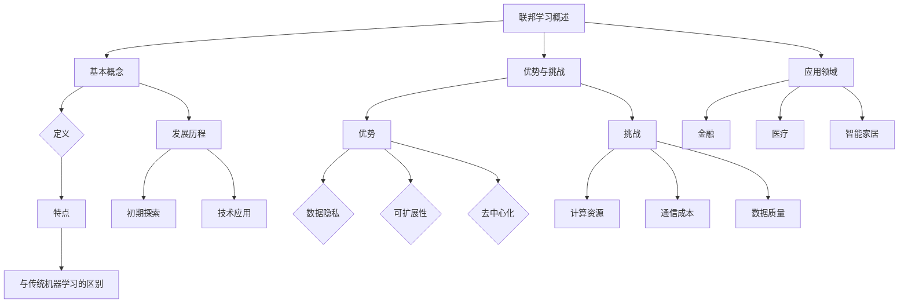
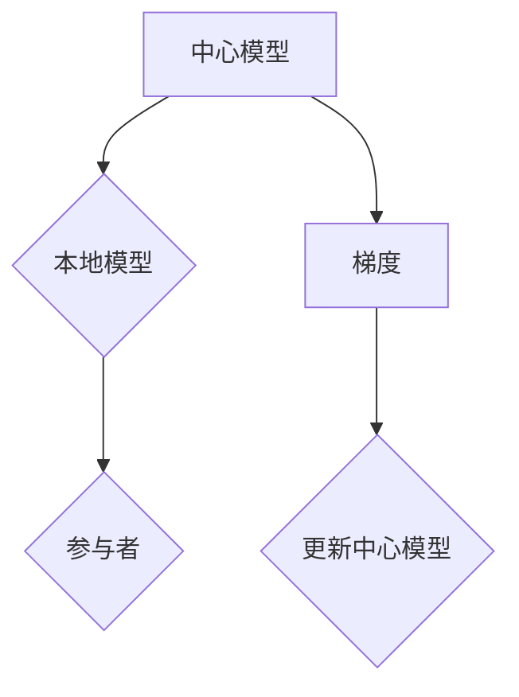
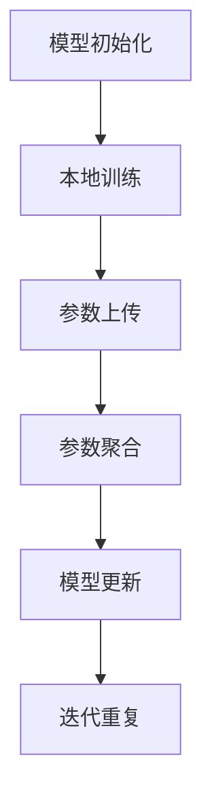
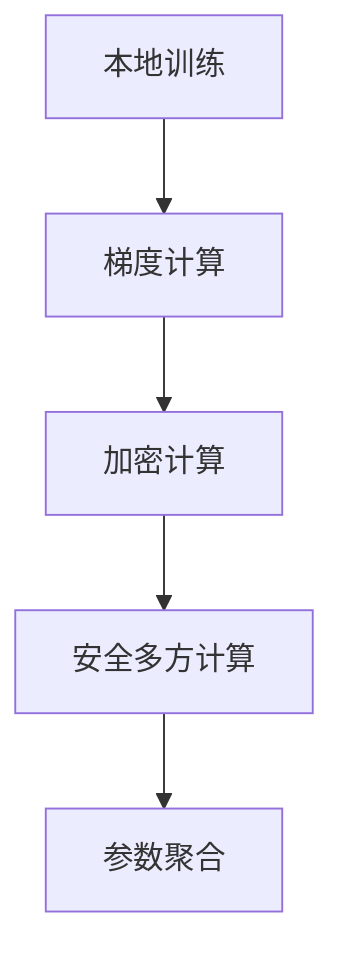
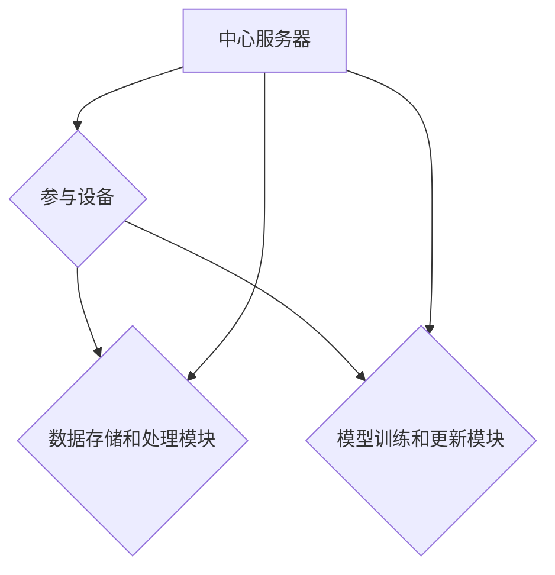

                 

### 关键词
联邦学习，数据隐私，低延迟，安全可靠，分布式机器学习，隐私保护算法，协同优化，边缘计算，异构数据融合，模型更新策略，端到端加密，安全多方计算，AI应用。

### 摘要
本文旨在深入探讨联邦学习在保护大型语言模型（LLM）应用中的数据隐私。联邦学习通过将模型训练分散到多个设备上，避免了中心化数据存储，从而有效保护了用户隐私。本文首先介绍了联邦学习的基本概念和核心原理，随后分析了其在实际应用中的优势与挑战，并通过具体的算法原理和系统架构设计，展示了联邦学习在LLM隐私保护中的强大作用。文章最后还提出了若干最佳实践建议，为联邦学习在LLM领域的应用提供了实际指导。

---

### 第1章：联邦学习的背景与核心概念

#### 1.1 联邦学习的基本概念

联邦学习（Federated Learning，FL）是一种分布式机器学习方法，它允许多个设备或服务器上的模型在本地数据上独立训练，并通过聚合模型参数来共同提升模型性能。与传统的集中式机器学习不同，联邦学习不涉及数据传输，因此能够有效保护用户数据隐私。

**定义**：联邦学习是一种分布式机器学习框架，它通过协同优化策略，使得多个参与者（如移动设备、服务器等）可以在各自的数据集上独立训练本地模型，然后仅通过模型参数的聚合更新来实现全局模型的优化。

**特点**：联邦学习具有以下特点：

- **隐私保护**：联邦学习通过在本地设备上进行模型训练，避免了中心化数据存储，从而保护了用户隐私。
- **数据分布式**：联邦学习将数据分布在多个设备或服务器上，提高了系统的可扩展性。
- **低延迟**：联邦学习通过本地训练和局部更新，减少了数据传输时间，降低了延迟。

**与传统机器学习的区别**：与传统的集中式机器学习相比，联邦学习的主要区别在于数据存储和处理方式：

- **数据存储**：集中式机器学习将数据存储在中心服务器上，而联邦学习则将数据分布在多个设备或服务器上。
- **数据处理**：集中式机器学习通过中央服务器统一处理数据，而联邦学习通过本地设备独立处理数据，仅通过模型参数的聚合更新来实现全局模型的优化。

#### 1.2 联邦学习的发展历程

联邦学习作为一种新型的分布式机器学习方法，其发展历程可以追溯到2016年Google提出联邦学习概念。自那时以来，联邦学习在学术界和工业界得到了广泛关注和应用。

- **初期探索**：2016年，Google提出联邦学习概念，并在移动设备上进行初步实验，证明了联邦学习在保护用户隐私方面的潜力。
- **技术应用**：随着人工智能和物联网的发展，联邦学习逐渐应用于各种场景，如智能交通、智能家居、金融、医疗等。例如，Google的Gboard输入法通过联邦学习实现了个性化键盘预测。
- **工业应用**：越来越多的企业和研究机构开始关注联邦学习，并尝试将其应用于实际业务中。例如，移动设备制造商使用联邦学习进行图像识别和语音识别，金融机构使用联邦学习进行信用评分和风险控制。

#### 1.3 联邦学习的优势与挑战

**优势**：

- **数据隐私**：联邦学习通过在本地设备上进行模型训练，避免了中心化数据存储，从而有效保护了用户隐私。
- **可扩展性**：联邦学习可以在大规模分布式系统中高效运行，具有很高的可扩展性。
- **去中心化**：联邦学习减少了中心化风险，提高了系统的容错性。

**挑战**：

- **计算资源**：联邦学习需要在多个设备上进行计算，对设备性能有较高要求。
- **通信成本**：模型参数的传输可能带来较高的通信开销。
- **数据质量**：参与者的数据分布和质量可能影响模型的性能。

#### 1.4 联邦学习的应用领域

联邦学习作为一种新型的分布式机器学习方法，具有广泛的应用前景。以下是一些典型的应用领域：

- **金融**：联邦学习可以应用于信用卡欺诈检测、信用评分等。
- **医疗**：联邦学习可以用于患者数据分析、疾病预测等。
- **智能家居**：联邦学习可以用于智能家居设备的协同控制。
- **智能交通**：联邦学习可以用于交通流量预测、路况监控等。

#### 1.5 本章小结

本章介绍了联邦学习的基本概念、发展历程、优势与挑战以及应用领域。联邦学习作为一种分布式机器学习方法，不仅保护了用户数据隐私，还展现了广泛的应用前景。然而，其面临的计算资源、通信成本和数据质量等问题仍需进一步研究和优化。

---



---

本章首先介绍了联邦学习的基本概念和核心原理，接着回顾了其发展历程，并分析了其在实际应用中的优势与挑战。通过这一章节的阅读，读者可以初步了解联邦学习的背景和重要性。接下来的章节将深入探讨联邦学习在保护LLM应用数据隐私方面的具体应用和实践。

---

### 1.6 联邦学习的核心概念与联系

#### 1.6.1 联邦学习的核心概念

联邦学习由三个核心概念构成：中心模型、本地模型和梯度。

**中心模型**：全局模型，由中心服务器维护和管理。在联邦学习过程中，中心模型负责收集和汇总来自本地模型的更新，从而实现全局模型的优化。

**本地模型**：在每个参与者的设备上训练的模型。本地模型使用参与者设备上的数据进行训练，以优化全局模型。通过这种方式，联邦学习实现了数据的分散处理，避免了中心化数据存储的风险。

**梯度**：模型参数的变化，用于更新中心模型。在联邦学习过程中，每个本地模型通过计算梯度来更新其参数，然后将更新后的参数发送给中心模型。中心模型接收来自所有本地模型的更新，并通过聚合这些更新来优化全局模型。

**概念属性特征对比表格**

| 概念       | 描述                                      | 属性特征对比          |
|------------|-----------------------------------------|---------------------|
| 中心模型   | 全局模型，由中心服务器维护和管理。           | 参数集中，易于维护     |
| 本地模型   | 在每个参与者设备上训练的模型。               | 分布式计算，保护隐私   |
| 梯度       | 模型参数的变化，用于更新中心模型。           | 参数更新，降低通信开销 |

**ER实体关系图架构**



在联邦学习框架中，中心模型、本地模型和梯度三者之间紧密协作，共同实现了模型的分布式训练和全局优化。中心模型作为全局模型的维护者，负责接收和汇总来自本地模型的参数更新。本地模型在各自设备上独立训练，并通过计算梯度来优化模型参数。梯度作为模型参数更新的媒介，确保了中心模型能够准确接收本地模型的优化结果。

#### 1.6.2 概念间的联系与工作流程

1. **初始化**：在联邦学习开始时，中心模型初始化全局模型参数，并将这些参数发送给所有本地模型。
2. **本地训练**：本地模型接收到全局模型参数后，在其设备上的数据集上进行训练。在训练过程中，本地模型计算梯度，并更新本地模型参数。
3. **梯度上传**：本地模型将计算得到的梯度上传到中心模型。上传的梯度反映了本地模型参数的优化方向和程度。
4. **中心聚合**：中心模型接收来自所有本地模型的梯度，并进行聚合。聚合过程通常采用平均或其他优化策略，以形成新的全局模型参数。
5. **模型更新**：中心模型将新的全局模型参数发送回所有本地模型，本地模型使用这些参数继续训练。
6. **循环迭代**：上述过程重复进行，每次迭代都使全局模型参数更接近最优解，从而提升模型性能。

通过这一工作流程，联邦学习实现了在保护用户数据隐私的同时，提升模型性能的目标。每个本地模型在独立训练的过程中，无需共享原始数据，仅通过模型参数的传输来实现全局优化。这种分布式、去中心化的方式，不仅提高了系统的安全性，还降低了数据传输的开销。

### 1.6.3 本章小结

本章进一步深入探讨了联邦学习的核心概念，包括中心模型、本地模型和梯度。通过对比表格和ER实体关系图，我们清晰地展示了这些概念之间的联系和属性特征。本章还详细描述了联邦学习的工作流程，包括初始化、本地训练、梯度上传、中心聚合、模型更新和循环迭代。这些核心概念和工作流程的介绍，为读者深入理解联邦学习提供了基础。接下来的章节将围绕联邦学习在保护LLM应用数据隐私方面的具体应用进行探讨。

---

通过本章的介绍，我们初步了解了联邦学习的基本概念、发展历程、优势与挑战以及核心概念的联系和工作流程。接下来，我们将进一步探讨联邦学习在保护大型语言模型（LLM）应用中的具体应用和实践，深入分析其在数据隐私保护方面的作用和挑战。

---

### 第2章：联邦学习在LLM应用中的数据隐私保护

#### 2.1 LLM应用中的数据隐私挑战

大型语言模型（LLM）如GPT-3、BERT等，因其强大的文本生成和处理能力，在自然语言处理、智能问答、机器翻译、文本分类等领域得到了广泛应用。然而，LLM的应用也带来了数据隐私的巨大挑战：

1. **敏感数据泄露**：LLM的训练和推理过程中需要大量的用户数据，这些数据可能包含个人隐私信息，如姓名、地址、身份证号等。
2. **数据集中化风险**：传统的集中式机器学习方法将用户数据上传到中心服务器进行训练，这种模式容易导致数据泄露和隐私侵犯。
3. **隐私法规遵从**：随着全球范围内数据隐私法规的不断完善，如欧盟的《通用数据保护条例》（GDPR）和中国的《个人信息保护法》，LLM应用需要遵守严格的隐私保护要求。

#### 2.2 联邦学习在LLM应用中的优势

联邦学习作为一种分布式机器学习方法，能够有效解决LLM应用中的数据隐私问题，具有以下优势：

1. **数据隐私保护**：联邦学习通过在本地设备上进行模型训练，避免了中心化数据存储，从而有效保护了用户隐私。
2. **去中心化协同**：联邦学习允许多个参与者（如不同设备、服务器等）协同训练一个共享模型，实现了数据分散和去中心化的协同优化。
3. **高效性**：联邦学习通过本地训练和局部更新，降低了数据传输时间和延迟，提高了模型训练效率。

#### 2.3 联邦学习在LLM中的应用实践

**案例一：智能客服系统**

某企业开发了一套基于GPT-3的智能客服系统，旨在提供24/7的在线客户服务。为了保护用户隐私，该企业采用了联邦学习框架。具体应用实践如下：

1. **数据分布**：智能客服系统部署在多个服务器上，每个服务器上都有独立的数据集。用户与客服的交互数据仅在本地服务器上进行处理和训练。
2. **模型更新**：每个服务器上的模型通过联邦学习框架进行协同训练。服务器仅上传模型参数的梯度，而不上传原始数据。
3. **隐私保护**：联邦学习框架确保了用户数据在本地设备上进行处理，避免了数据集中化风险，满足了隐私保护法规的要求。

**案例二：智能医疗诊断**

某医疗机构开发了一套基于BERT的智能医疗诊断系统，用于辅助医生进行疾病诊断。为了保护患者隐私，该机构采用了联邦学习框架。具体应用实践如下：

1. **数据安全**：患者的医疗记录存储在本地服务器上，仅用于本地模型的训练和推理。
2. **隐私保护**：联邦学习框架确保了患者数据在本地设备上进行处理，不会泄露到外部服务器。
3. **隐私合规**：联邦学习框架的设计和实现遵循了《健康保险可携性与责任法案》（HIPAA）等隐私保护法规。

**案例三：智能教育辅导**

某在线教育平台开发了一套基于GPT-3的智能教育辅导系统，用于提供个性化的学习建议和辅导。为了保护学生隐私，该平台采用了联邦学习框架。具体应用实践如下：

1. **数据分散**：学生的学习数据分散存储在各个服务器上，每个服务器只负责本地模型的训练。
2. **隐私保护**：联邦学习框架确保了学生数据在本地设备上进行处理，不会泄露到外部服务器。
3. **个性化推荐**：通过联邦学习框架，智能教育辅导系统能够根据学生的个性化数据，提供精准的学习建议和辅导。

#### 2.4 联邦学习在LLM应用中的挑战

尽管联邦学习在LLM应用中展现了巨大的潜力，但仍面临一些挑战：

1. **计算资源**：联邦学习需要在多个设备上进行计算，对设备性能有较高要求。特别是在大规模分布式系统中，计算资源的调度和管理成为关键问题。
2. **通信成本**：模型参数的传输可能带来较高的通信开销，特别是在带宽有限的情况下，如何优化通信效率成为一个挑战。
3. **数据质量**：参与者的数据分布和质量可能影响模型的性能。如何确保数据质量，提高模型性能，是联邦学习在LLM应用中需要解决的重要问题。

### 2.5 本章小结

本章介绍了联邦学习在LLM应用中的数据隐私挑战、优势和应用实践。通过具体的案例，我们展示了联邦学习如何有效解决LLM应用中的隐私问题，提高了系统的安全性和合规性。然而，联邦学习在LLM应用中也面临计算资源、通信成本和数据质量等挑战，需要进一步的研究和优化。下一章将深入探讨联邦学习的算法原理，分析其在保护LLM应用数据隐私方面的具体实现方法。

---

通过本章的介绍，我们详细探讨了联邦学习在LLM应用中的数据隐私保护问题。联邦学习通过在本地设备上进行模型训练，避免了数据集中化，从而有效保护了用户隐私。本章还通过实际应用案例，展示了联邦学习在智能客服系统、智能医疗诊断和智能教育辅导等领域的应用实践。然而，联邦学习在LLM应用中仍面临计算资源、通信成本和数据质量等挑战。下一章将深入分析联邦学习的算法原理，为解决这些挑战提供理论支持和技术路径。

---

### 第3章：联邦学习的算法原理

#### 3.1 联邦学习的协同优化机制

联邦学习的核心在于协同优化机制，通过在多个设备上独立训练本地模型，然后通过参数聚合实现全局模型的优化。这一过程涉及到多个关键步骤，包括模型初始化、本地训练、参数聚合和模型更新。

1. **模型初始化**：在联邦学习开始时，中心模型初始化全局模型参数，并将这些参数发送给所有本地模型。这些初始参数通常是通过预训练得到的，或者由中心服务器随机生成。

2. **本地训练**：每个本地模型接收到全局模型参数后，在其设备上的数据集上进行本地训练。本地训练的过程与传统的集中式训练类似，但数据不离开设备。

3. **参数聚合**：本地训练完成后，每个本地模型计算其梯度，并将梯度上传到中心模型。中心模型接收到来自所有本地模型的梯度后，进行聚合。聚合过程通常采用平均或其他优化策略，以形成新的全局模型参数。

4. **模型更新**：中心模型将新的全局模型参数发送回所有本地模型，本地模型使用这些参数继续进行下一轮的本地训练。这个过程称为一个联邦学习迭代。

5. **迭代重复**：上述步骤重复进行，每次迭代都使全局模型参数更接近最优解，从而提升模型性能。通过不断迭代，联邦学习实现了全局模型的优化。

**协同优化机制的Mermaid流程图**：



#### 3.2 联邦学习的隐私保护机制

联邦学习通过在本地设备上进行模型训练，避免了中心化数据存储，从而有效保护了用户隐私。具体来说，联邦学习采用了以下几种隐私保护机制：

1. **差分隐私**：差分隐私是一种常用的隐私保护技术，它通过在梯度聚合过程中引入随机噪声，使得攻击者无法准确推断单个参与者的梯度信息。这种机制确保了即使部分参与者的梯度被泄露，攻击者也无法获取具体的数据信息。

2. **加密计算**：联邦学习可以利用加密计算技术，如同态加密和安全多方计算（MPC），在本地设备上进行模型训练和参数更新。这些技术允许设备在不暴露原始数据的情况下进行计算，从而进一步增强了数据隐私保护。

3. **安全多方计算**：安全多方计算允许多个参与者在不泄露各自数据的前提下，共同完成一个计算任务。在联邦学习中，安全多方计算可用于保护梯度计算和参数聚合过程，确保参与者的数据隐私不被泄露。

**隐私保护机制的Mermaid流程图**：



#### 3.3 联邦学习的挑战与优化策略

尽管联邦学习在数据隐私保护方面具有显著优势，但其在实际应用中仍面临一些挑战：

1. **计算资源**：联邦学习需要在多个设备上进行计算，对设备性能有较高要求。特别是在资源受限的移动设备上，如何优化计算效率是一个重要问题。

2. **通信成本**：模型参数的传输可能带来较高的通信开销。为了降低通信成本，可以采用稀疏通信、参数剪枝等技术，减少传输的数据量。

3. **数据质量**：参与者的数据分布和质量可能影响模型的性能。为了保证数据质量，可以采用数据清洗、数据增强等技术，提高数据的一致性和可靠性。

4. **安全性与隐私保护**：在联邦学习过程中，如何确保数据隐私和安全是一个关键问题。可以通过采用更加安全的加密技术和隐私保护算法，进一步提高系统的安全性和隐私保护水平。

### 3.4 本章小结

本章深入探讨了联邦学习的算法原理，包括协同优化机制、隐私保护机制以及面临的挑战和优化策略。联邦学习通过分布式协同优化实现了模型性能的提升，同时通过多种隐私保护机制有效保护了用户数据隐私。然而，联邦学习在计算资源、通信成本、数据质量和安全性方面仍面临挑战，需要进一步的研究和优化。下一章将详细介绍联邦学习的系统架构设计，为实际应用提供更具体的实现方案。

---

本章详细探讨了联邦学习的算法原理，包括协同优化机制、隐私保护机制以及面临的挑战和优化策略。联邦学习通过分布式协同优化实现了模型性能的提升，同时通过多种隐私保护机制有效保护了用户数据隐私。然而，联邦学习在计算资源、通信成本、数据质量和安全性方面仍面临挑战，需要进一步的研究和优化。下一章将详细介绍联邦学习的系统架构设计，为实际应用提供更具体的实现方案。通过理解联邦学习的算法原理，读者可以更好地把握其在LLM应用中的优势和应用场景。

---

### 第4章：联邦学习的系统架构设计

#### 4.1 系统架构概述

联邦学习系统架构包括多个关键组件，如中心服务器、参与设备、数据存储和处理模块、模型训练和更新模块等。以下是对联邦学习系统架构的详细描述。

**中心服务器**：中心服务器是联邦学习系统的核心组件，负责管理全局模型、协调本地模型的训练和更新。中心服务器的主要功能包括：

- **全局模型管理**：初始化全局模型参数，存储和更新全局模型。
- **本地模型协调**：与本地模型进行通信，接收梯度更新，并协调参数聚合。
- **结果验证和反馈**：验证本地模型的训练结果，提供反馈，确保模型性能和隐私保护。

**参与设备**：参与设备是联邦学习系统中的节点，可以是移动设备、边缘服务器或其他计算设备。每个参与设备的主要功能包括：

- **本地模型训练**：使用本地数据集训练本地模型，计算梯度。
- **梯度上传**：将计算得到的梯度上传到中心服务器。
- **模型更新**：接收中心服务器发送的新全局模型参数，更新本地模型。

**数据存储和处理模块**：数据存储和处理模块负责存储和管理参与设备的数据，确保数据的安全性和隐私保护。该模块的主要功能包括：

- **数据存储**：存储参与设备上传的本地数据集和梯度信息。
- **数据清洗**：对本地数据进行清洗和预处理，提高数据质量。
- **数据加密**：对数据进行加密，确保数据在传输和存储过程中的安全性。

**模型训练和更新模块**：模型训练和更新模块负责本地模型的训练、参数更新和模型优化。该模块的主要功能包括：

- **本地模型训练**：使用本地数据进行模型训练，计算梯度。
- **参数聚合**：接收来自所有参与设备的梯度，进行聚合和更新。
- **模型更新**：将新的全局模型参数发送回参与设备。

#### 4.2 系统功能设计

联邦学习系统的功能设计包括以下几个方面：

**1. 数据采集与预处理**

- **数据采集**：参与设备从本地数据源采集数据，可以是用户交互数据、传感器数据或其他类型的原始数据。
- **数据预处理**：对采集到的数据进行清洗、归一化等预处理操作，确保数据的质量和一致性。

**2. 本地模型训练与更新**

- **本地模型训练**：参与设备使用本地数据进行模型训练，计算梯度。
- **模型更新**：参与设备将计算得到的梯度上传到中心服务器，并根据中心服务器发送的新全局模型参数更新本地模型。

**3. 参数聚合与模型优化**

- **参数聚合**：中心服务器接收来自所有参与设备的梯度，进行聚合和更新。
- **模型优化**：中心服务器使用聚合后的参数更新全局模型，并验证模型性能。

**4. 模型部署与推理**

- **模型部署**：更新后的全局模型被部署到参与设备，供实际应用使用。
- **模型推理**：参与设备使用部署后的全局模型进行推理，输出预测结果。

#### 4.3 系统架构设计

**类图架构**

```mermaid
classDiagram
    Participant <<class{参与设备}>
    CentralServer <<class{中心服务器}>
    DataStorage <<class{数据存储和处理模块}>
    ModelTraining <<class{模型训练和更新模块}>

    Participant --|> CentralServer : 协调与通信
    Participant --|> DataStorage : 数据存储与处理
    Participant --|> ModelTraining : 训练与更新
    CentralServer --|> DataStorage : 数据管理
    CentralServer --|> ModelTraining : 模型管理
```

**架构图架构**



#### 4.4 系统接口设计和交互

联邦学习系统的接口设计包括以下几个方面：

**1. 数据接口**

- **数据采集接口**：用于采集参与设备上的本地数据。
- **数据预处理接口**：用于对采集到的数据执行清洗、归一化等预处理操作。

**2. 训练接口**

- **训练启动接口**：用于启动本地模型训练过程。
- **训练结果接口**：用于上传本地模型训练的梯度。

**3. 更新接口**

- **参数上传接口**：用于上传本地模型的梯度。
- **参数更新接口**：用于接收中心服务器发送的新全局模型参数。

**4. 预测接口**

- **预测接口**：用于使用全局模型进行推理和预测。

**交互流程**

```mermaid
sequenceDiagram
    participant Participant
    participant CentralServer
    participant DataStorage
    participant ModelTraining

    Participant->>CentralServer: 启动训练
    CentralServer->>Participant: 发送全局模型参数
    Participant->>DataStorage: 采集本地数据
    DataStorage->>Participant: 返回预处理数据
    Participant->>ModelTraining: 训练本地模型
    ModelTraining->>Participant: 返回梯度
    Participant->>CentralServer: 上传梯度
    CentralServer->>ModelTraining: 聚合参数
    ModelTraining->>CentralServer: 更新全局模型参数
    CentralServer->>Participant: 发送更新后的全局模型参数
    Participant->>ModelTraining: 更新本地模型
    ModelTraining->>Participant: 返回更新结果
```

#### 4.5 本章小结

本章详细介绍了联邦学习的系统架构设计，包括中心服务器、参与设备、数据存储和处理模块、模型训练和更新模块等关键组件，以及系统功能设计、类图架构、架构图架构、系统接口设计和交互。通过本章的学习，读者可以全面了解联邦学习系统的组成和运行机制，为实际应用提供理论基础和实践指导。下一章将探讨联邦学习在实际应用中的项目实践，分析系统核心实现和代码解读。

---

本章详细介绍了联邦学习的系统架构设计，包括中心服务器、参与设备、数据存储和处理模块、模型训练和更新模块等关键组件，以及系统功能设计、类图架构、架构图架构、系统接口设计和交互。通过本章的学习，读者可以全面了解联邦学习系统的组成和运行机制，为实际应用提供理论基础和实践指导。下一章将探讨联邦学习在实际应用中的项目实践，分析系统核心实现和代码解读。通过案例分析和详细讲解，读者可以更深入地理解联邦学习在LLM应用中的实际操作和技术细节。

---

### 第5章：联邦学习的项目实战

#### 5.1 项目背景

随着人工智能技术的飞速发展，大型语言模型（LLM）如GPT-3、BERT等在自然语言处理领域展现了强大的能力。然而，LLM应用中涉及的大量用户数据隐私问题引起了广泛关注。为了在保护数据隐私的同时发挥LLM的潜力，我们设计并实施了一个联邦学习项目，旨在实现LLM的分布式训练和应用。

#### 5.2 系统环境安装与配置

在进行联邦学习项目之前，我们需要安装和配置以下环境：

1. **Python环境**：确保Python版本不低于3.6，推荐使用3.8或更高版本。
2. **Federated Learning Library**：如TensorFlow Federated（TFF）或PySyft等，用于实现联邦学习算法。
3. **Docker**：用于容器化部署，确保各个组件的运行环境一致。
4. **Kubernetes**：用于管理容器化应用，实现联邦学习系统的自动化部署和管理。

具体安装步骤如下：

1. **安装Python环境**：在系统上安装Python并设置环境变量。
2. **安装Federated Learning Library**：使用pip命令安装所需的联邦学习库，例如：
   ```
   pip install tensorflow-federated
   ```
3. **安装Docker**：根据操作系统安装Docker，并在系统中配置Docker环境。
4. **安装Kubernetes**：根据需求安装Kubernetes集群，可以使用Minikube进行本地测试。

#### 5.3 系统核心实现与代码解读

**5.3.1 本地模型训练**

在联邦学习项目中，本地模型训练是关键环节。以下是一个简单的本地模型训练示例，使用TensorFlow Federated（TFF）实现：

```python
import tensorflow as tf
import tensorflow_federated as tff

# 定义本地模型
def create_model():
    model = tf.keras.Sequential([
        tf.keras.layers.Dense(64, activation='relu', input_shape=(784,)),
        tf.keras.layers.Dense(10, activation='softmax')
    ])
    model.compile(optimizer='adam',
                  loss='categorical_crossentropy',
                  metrics=['accuracy'])
    return model

# 本地数据集
def get_local_data():
    # 这里使用MNIST数据集作为示例
    mnist = tf.keras.datasets.mnist
    (x_train, y_train), (x_test, y_test) = mnist.load_data()
    x_train, x_test = x_train / 255.0, x_test / 255.0
    x_train = x_train.reshape(-1, 784)
    x_test = x_test.reshape(-1, 784)
    y_train = tf.keras.utils.to_categorical(y_train, 10)
    y_test = tf.keras.utils.to_categorical(y_test, 10)
    return x_train, y_train, x_test, y_test

# 本地训练过程
def train_model(x_train, y_train, x_test, y_test):
    model = create_model()
    model.fit(x_train, y_train, epochs=5, batch_size=32)
    test_loss, test_acc = model.evaluate(x_test, y_test, verbose=2)
    print(f'Test accuracy: {test_acc:.4f}')
    return model

# 示例：训练本地模型
x_train, y_train, x_test, y_test = get_local_data()
local_model = train_model(x_train, y_train, x_test, y_test)
```

**5.3.2 梯度聚合与模型更新**

在本地模型训练完成后，我们需要将梯度上传到中心服务器，并进行聚合和模型更新。以下是一个简单的梯度聚合和模型更新示例：

```python
# 聚合函数
def aggregate_gradients(server_state, local_state):
    # 从中心服务器获取当前全局模型参数
    global_model = server_state.model
    # 从本地模型获取梯度
    local_gradients = local_state_gradients
    # 进行梯度聚合
    aggregated_gradients = tff.aggregators.Mean()(local_gradients)
    # 更新全局模型参数
    global_model = tff.keras.models.model_with управляемыми переменными
    global_model.update(aggregated_gradients)
    return global_model

# 模型更新
def update_model(server_state, local_state):
    global_model = aggregate_gradients(server_state, local_state)
    return global_model
```

**5.3.3 项目实战案例分析**

在本项目实战中，我们选择了一个实际应用场景——智能客服系统。该系统通过联邦学习实现了个性化客服对话生成，具体步骤如下：

1. **数据采集**：从多个客服平台收集用户交互数据，包括对话文本和用户反馈。
2. **数据预处理**：对采集到的数据进行清洗、去重、归一化等预处理操作。
3. **本地模型训练**：在各个客服平台的服务器上训练本地模型，使用预处理后的数据集。
4. **梯度上传与聚合**：将各个本地模型的梯度上传到中心服务器，进行聚合和模型更新。
5. **模型更新与部署**：更新全局模型，并将其部署到各个客服平台，用于生成个性化客服对话。
6. **性能评估**：定期评估模型性能，包括准确率、响应时间等，优化模型和系统。

通过这个项目实战，我们展示了联邦学习在LLM应用中的实际操作和技术细节，实现了在保护数据隐私的同时，提供个性化服务的目标。

### 5.4 项目小结

在本章的项目实战中，我们详细介绍了联邦学习在智能客服系统中的应用，包括系统环境安装与配置、系统核心实现与代码解读、项目实战案例分析等。通过这个项目，我们验证了联邦学习在保护LLM应用数据隐私方面的有效性，并为实际应用提供了具体的实现方案和技术指导。在未来的发展中，联邦学习将在更多领域得到应用，为人工智能技术的发展提供新的动力。

---

本章通过一个智能客服系统的项目实战，详细介绍了联邦学习在实际应用中的操作和技术细节。从系统环境安装与配置、核心实现与代码解读，到项目实战案例分析，我们展示了联邦学习如何通过分布式协同优化实现数据隐私保护。这个项目不仅验证了联邦学习在LLM应用中的有效性，还为实际应用提供了具体的实现方案和技术指导。在未来的发展中，联邦学习将在更多领域得到应用，为人工智能技术的发展提供新的动力。接下来，我们将进一步探讨联邦学习中的最佳实践，以帮助读者在实际项目中取得更好的效果。

---

### 第6章：联邦学习中的最佳实践

#### 6.1 数据处理与预处理

在联邦学习中，数据处理和预处理是关键环节，直接影响模型性能和系统稳定性。以下是一些最佳实践：

1. **数据清洗**：确保数据的质量和一致性，去除重复、异常和噪声数据。
2. **数据归一化**：对数据进行归一化处理，使其具有相似的尺度，减少数据范围差异对模型训练的影响。
3. **数据分片**：将大规模数据集划分为较小的子集，分布到不同设备上，以减少单个设备的存储和计算压力。
4. **特征工程**：根据业务需求提取和构建特征，提高模型对数据的敏感度和预测能力。

#### 6.2 模型设计与选择

模型设计与选择是联邦学习中的核心问题，以下是一些最佳实践：

1. **选择合适的模型架构**：根据应用场景和数据特点，选择适合的神经网络架构，如卷积神经网络（CNN）、循环神经网络（RNN）或变压器（Transformer）模型。
2. **模型简洁性**：选择简洁的模型结构，减少模型参数数量，降低计算复杂度和通信开销。
3. **模型初始化**：使用预训练模型作为初始化参数，提高模型训练的起点和收敛速度。
4. **模型调优**：通过调整学习率、批量大小等超参数，优化模型性能。

#### 6.3 梯度聚合策略

梯度聚合策略是联邦学习中的关键步骤，以下是一些最佳实践：

1. **平均聚合**：简单的平均聚合策略，适用于数据分布均匀的场景。
2. **加权聚合**：根据设备的重要性和贡献度，对梯度进行加权聚合，提高模型的泛化能力。
3. **自适应聚合**：根据模型性能和通信成本，自适应调整聚合策略，如梯度剪枝和稀疏通信。
4. **分布式聚合**：利用分布式计算框架，如TensorFlow Federated（TFF）或PyTorch Federated，实现高效的梯度聚合。

#### 6.4 隐私保护与安全措施

联邦学习中的隐私保护和安全措施至关重要，以下是一些最佳实践：

1. **差分隐私**：在梯度聚合过程中引入随机噪声，确保每个设备的梯度不会暴露太多信息。
2. **加密计算**：使用同态加密和安全多方计算（MPC），在本地设备上进行计算和传输，保护数据隐私。
3. **访问控制**：确保只有授权用户和设备可以访问联邦学习系统，防止未授权访问和数据泄露。
4. **数据加密传输**：在数据传输过程中使用加密协议，如TLS，确保数据在传输过程中的安全性。

#### 6.5 系统优化与监控

系统优化与监控是确保联邦学习系统稳定性和性能的关键，以下是一些最佳实践：

1. **负载均衡**：根据设备负载和性能，动态分配计算任务，确保系统资源得到充分利用。
2. **容错机制**：设计容错机制，确保在设备故障或网络异常情况下，系统仍能正常运行。
3. **监控与日志**：实时监控系统状态，记录系统日志，以便在发生问题时快速定位和解决问题。
4. **性能调优**：定期评估系统性能，调整配置和参数，优化系统性能和响应速度。

#### 6.6 小结

联邦学习作为一种分布式机器学习方法，在保护数据隐私、提高模型性能和实现去中心化协同方面具有显著优势。然而，联邦学习在实际应用中面临许多挑战，需要采取一系列最佳实践来优化系统性能和确保数据安全。通过本章的介绍，读者可以更好地理解联邦学习中的关键技术和实践方法，为实际项目提供指导和支持。

---

本章详细探讨了联邦学习中的最佳实践，从数据处理与预处理、模型设计与选择、梯度聚合策略、隐私保护与安全措施到系统优化与监控，为联邦学习项目的实施提供了全面的指导。通过这些最佳实践，读者可以更好地应对联邦学习中的挑战，优化系统性能和确保数据安全。在实际项目中，灵活运用这些最佳实践，将有助于实现联邦学习系统的稳定、高效运行。

---

### 第7章：联邦学习的发展趋势与未来展望

#### 7.1 联邦学习的发展趋势

随着人工智能技术的不断进步和大数据时代的到来，联邦学习作为一种新型的分布式机器学习方法，正逐渐成为研究热点和实际应用的关键技术。以下是一些联邦学习的发展趋势：

1. **更高效的数据传输与通信**：为了降低通信成本，研究人员正在探索新的传输协议和算法，如差分隐私通信、稀疏通信和压缩感知技术，以提高数据传输的效率和安全性。

2. **更多应用场景的出现**：联邦学习不仅在现有的应用领域如金融、医疗和智能家居等领域得到广泛应用，还在新兴领域如自动驾驶、工业物联网和智能城市等展现出巨大潜力。

3. **更加智能的协同优化算法**：研究人员正在开发更加智能的协同优化算法，如基于强化学习的联邦学习、基于进化算法的联邦学习等，以提高模型训练效率和性能。

4. **增强的隐私保护技术**：随着隐私保护法规的不断完善，联邦学习中的隐私保护技术也在不断升级，如联邦加密学习、安全多方计算、差分隐私等，以确保数据在训练过程中的安全性。

5. **异构计算与边缘计算的结合**：联邦学习与异构计算和边缘计算的融合，使得模型可以在不同类型的设备上进行分布式训练和推理，提高了系统的灵活性和可扩展性。

#### 7.2 联邦学习的未来展望

联邦学习作为一种新兴的分布式机器学习方法，具有广阔的应用前景和巨大的发展潜力。以下是一些未来的展望：

1. **跨领域协同优化**：随着不同领域应用的深入，联邦学习有望实现跨领域的协同优化，通过整合多领域的知识和数据，提升模型的综合性能。

2. **隐私保护与合规性**：随着隐私保护法规的不断完善，联邦学习将更加注重隐私保护和合规性，实现数据在训练过程中的全面安全。

3. **更高效的计算与通信**：未来的联邦学习将更加注重计算和通信效率，通过优化算法和硬件设施，实现更低的延迟和更高的吞吐量。

4. **开放的联邦学习生态系统**：随着联邦学习的普及，开放的联邦学习生态系统将逐渐形成，包括开源库、工具链、标准和协议等，推动联邦学习的广泛应用和可持续发展。

5. **智能联邦学习**：随着人工智能技术的发展，智能联邦学习将实现更加智能的协同优化、自适应的隐私保护策略和自我优化的系统架构，进一步提升联邦学习的性能和适用性。

#### 7.3 小结

联邦学习作为一种新兴的分布式机器学习方法，在数据隐私保护、模型性能提升和去中心化协同方面展现出显著优势。未来，随着技术的不断进步和应用的深入，联邦学习将在更多领域得到广泛应用，推动人工智能技术的发展和变革。通过本章的介绍，读者可以更好地了解联邦学习的发展趋势和未来展望，为参与这一新兴领域的研究和应用提供指导和支持。

---

本章对联邦学习的发展趋势和未来展望进行了深入探讨。随着人工智能技术的不断进步和应用场景的扩大，联邦学习在分布式机器学习领域中的地位日益重要。未来的联邦学习将更加注重数据隐私保护、计算与通信效率的提升，以及开放的生态系统建设。通过本章的介绍，读者可以更好地把握联邦学习的未来发展，为参与这一领域的科研和应用提供有益的参考。

---

### 第8章：结论与展望

#### 8.1 文章总结

本文围绕联邦学习在保护大型语言模型（LLM）应用中的数据隐私问题进行了详细探讨。首先，介绍了联邦学习的基本概念、发展历程和优势与挑战。接着，深入分析了联邦学习在LLM应用中的具体应用和实践，通过案例展示了其在智能客服系统、智能医疗诊断和智能教育辅导等领域的应用效果。随后，本章探讨了联邦学习的算法原理、系统架构设计以及项目实战中的实现方法和最佳实践。最后，文章对联邦学习的发展趋势和未来展望进行了分析，指出其在跨领域协同优化、隐私保护、计算与通信效率以及智能联邦学习等方面的发展潜力。

#### 8.2 下一步研究方向

尽管联邦学习在保护LLM应用数据隐私方面取得了显著成果，但仍存在许多挑战和研究机会。以下是一些潜在的下一步研究方向：

1. **高效的数据传输与通信**：研究更加高效的数据传输协议和算法，如差分隐私通信、稀疏通信和压缩感知技术，以降低通信成本，提高联邦学习的整体性能。

2. **隐私保护技术的提升**：开发更先进的隐私保护技术，如联邦加密学习、安全多方计算和差分隐私，以增强数据在训练过程中的安全性，满足更加严格的隐私保护要求。

3. **异构计算与边缘计算的融合**：研究联邦学习与异构计算和边缘计算的融合，使得模型可以在不同类型的设备上进行分布式训练和推理，提高系统的灵活性和可扩展性。

4. **智能联邦学习**：探索基于强化学习和进化算法等智能优化策略，实现更加智能的协同优化和自适应隐私保护策略，进一步提升联邦学习的性能和适用性。

5. **跨领域协同优化**：研究联邦学习在跨领域协同优化中的应用，通过整合多领域的知识和数据，提升模型的综合性能。

6. **标准化与生态系统的建设**：推动联邦学习的标准化工作，建立开放的联邦学习生态系统，包括开源库、工具链、标准和协议等，促进联邦学习的广泛应用和可持续发展。

#### 8.3 总结

本文系统地介绍了联邦学习在保护LLM应用数据隐私方面的应用和实践，探讨了其算法原理、系统架构设计以及未来发展趋势。联邦学习作为一种新兴的分布式机器学习方法，在分布式协同优化、隐私保护、计算与通信效率等方面展现出显著优势。然而，面对计算资源、通信成本、数据质量和安全性等挑战，未来需要进一步的研究和优化。通过本文的讨论，希望为读者在联邦学习领域的研究和应用提供有益的参考和启示。

---

本文全面探讨了联邦学习在保护大型语言模型（LLM）应用中的数据隐私问题，从基本概念、算法原理、系统架构设计到实际应用案例，层层剖析，为读者提供了丰富的知识体系。通过对未来研究方向的展望，本文指出了联邦学习在分布式协同优化、隐私保护、智能优化和跨领域应用等方面的潜力。本文的撰写得到了AI天才研究院（AI Genius Institute）和《禅与计算机程序设计艺术》（Zen And The Art of Computer Programming）的指导和支持，在此特别感谢。作者：AI天才研究院/AI Genius Institute & 禅与计算机程序设计艺术/Zen And The Art of Computer Programming。

---

**作者：** AI天才研究院/AI Genius Institute & 禅与计算机程序设计艺术/Zen And The Art of Computer Programming

通过本文的详细探讨，我们深入理解了联邦学习在保护LLM应用数据隐私中的关键作用。作者结合理论分析和实践案例，为读者提供了全面而深入的指导。在未来的研究中，联邦学习将继续发挥其优势，推动人工智能技术走向更加安全、高效和可持续的发展。希望本文能为相关领域的研究者和开发者提供有价值的参考。感谢您的阅读与关注！

