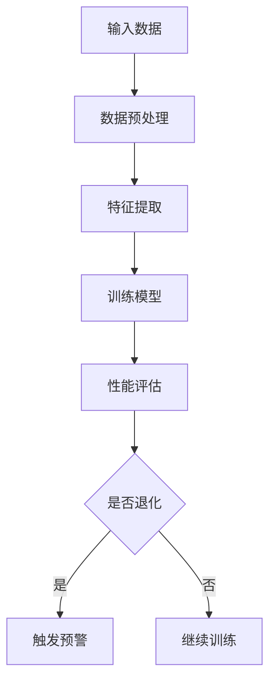
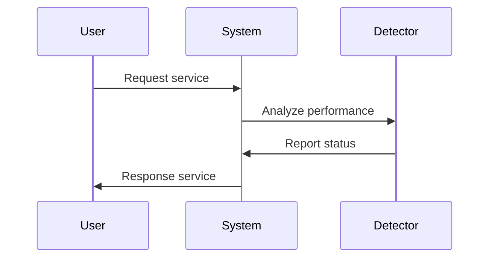
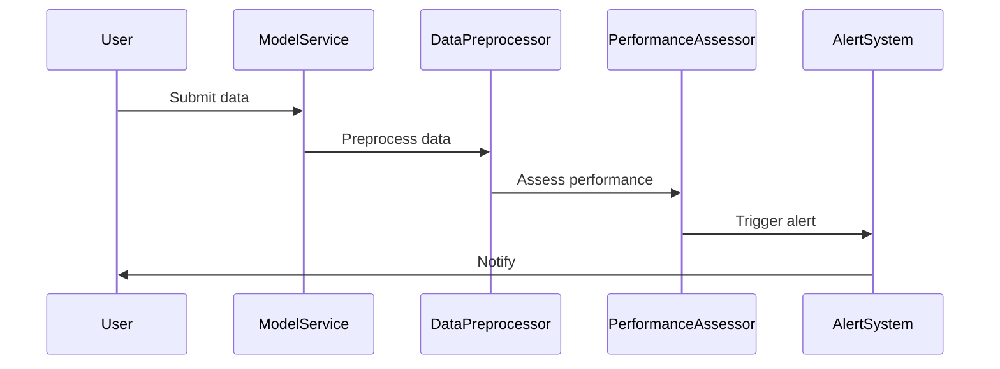

                 

# 自动化LLM性能退化检测与预警

> 关键词：大规模语言模型、性能退化、自动化检测、预警系统、机器学习算法

> 摘要：本文深入探讨了大规模语言模型（LLM）在训练和部署过程中可能出现的性能退化问题。通过介绍性能退化的背景、问题描述及其解决方法，本文重点分析了自动化LLM性能退化检测的原理和算法。文中包含了详细的概念说明、原理讲解、数学模型和实战案例，旨在为读者提供一份全面的技术指南。

----------------------------------------------------------------

## 第一部分：自动化LLM性能退化概述

### 第1章：性能退化问题背景与描述

随着人工智能技术的快速发展，大规模语言模型（LLM）在自然语言处理、文本生成、问答系统等领域展现了强大的能力。然而，LLM的训练和部署过程面临着性能退化的挑战。性能退化指的是模型在训练过程中，其性能随着时间的推移而逐渐下降的现象。这一问题可能导致模型无法准确预测或生成文本，影响其应用效果。

#### 1.1 问题背景

LLM的训练过程通常涉及大量的数据和复杂的优化算法。在训练初期，模型性能可能会有显著的提升，但随着训练时间的延长，模型可能会逐渐趋于饱和，甚至出现性能下降的现象。这种性能退化不仅会影响模型的应用效果，还可能导致用户对模型的信任度降低，进而影响整个系统的稳定性。

#### 1.2 问题描述

性能退化问题可以表现为多个方面，包括模型准确率下降、生成文本质量降低、响应时间增加等。具体来说，模型可能在以下情况下出现性能退化：

1. **过拟合**：模型在训练数据上表现得很好，但在未见过的数据上表现较差。
2. **数据分布变化**：训练数据与实际应用场景的数据分布不一致，导致模型在应用场景中性能下降。
3. **模型老化**：随着时间的推移，模型无法适应新的数据分布或用户需求。

#### 1.3 问题解决

为了解决性能退化问题，需要从模型训练、部署以及监控等多个方面进行综合分析，采取相应的措施：

1. **模型优化**：通过改进训练算法和模型结构，提高模型的泛化能力。
2. **数据预处理**：对训练数据进行合理的清洗和增强，减少数据分布变化的影响。
3. **动态调整**：根据模型的表现和用户反馈，动态调整模型参数和应用策略。
4. **监控与预警**：建立自动化性能退化检测和预警系统，及时发现并应对性能退化问题。

#### 1.4 边界与外延

性能退化问题的边界主要涉及LLM的训练过程和部署应用，而其外延则包括各种可能的影响因素和应对策略。除了上述提到的过拟合、数据分布变化和模型老化，其他因素如硬件故障、网络延迟等也可能导致性能退化。

#### 1.5 概念结构与核心要素组成

在本章中，我们将详细探讨性能退化的概念结构，包括其成因、表现形式以及与LLM训练、部署的关系。核心要素包括模型、训练数据、监控系统和用户反馈等。

### 第2章：自动化LLM性能退化检测原理

#### 2.1 核心概念与原理

自动化LLM性能退化检测主要依赖于模型监控和异常检测技术，通过分析模型在训练和部署过程中的表现，识别出性能退化的迹象。这一过程通常包括以下几个步骤：

1. **数据采集**：收集模型输入输出、训练日志等数据。
2. **数据预处理**：清洗和标准化数据，提取关键特征。
3. **特征分析**：使用统计方法或机器学习算法分析特征，识别性能退化的迹象。
4. **预警触发**：当检测到性能退化时，触发预警机制。

#### 2.2 概念属性特征对比表格

| 特征 | 自动化性能退化检测 | 传统性能退化检测 |
| --- | --- | --- |
| 监控对象 | 模型输入输出、训练过程 | 模型输入输出 |
| 数据来源 | 实时数据流、历史数据 | 历史数据 |
| 检测方法 | 异常检测、机器学习 | 基于规则、统计方法 |
| 检测速度 | 实时、高效 | 非实时、耗时 |
| 可解释性 | 较高 | 较低 |

#### 2.3 ER实体关系图架构

```mermaid
erDiagram
  Model : "模型" {
    +id
    +name
    +performance
  }
  Data : "数据" {
    +id
    +model_id
    +timestamp
    +value
  }
  Detector : "性能退化检测器" {
    +id
    +model_id
    +alert_threshold
    +is_activated
  }
  Model --> Data : "生成" 1
  Model --> Detector : "关联" 1
```

## 第二部分：自动化LLM性能退化检测算法详解

### 第3章：自动化LLM性能退化检测算法详解

#### 3.1 算法原理与mermaid流程图

算法原理：基于机器学习的性能退化检测算法通过训练模型，学习正常性能和退化性能之间的特征差异，从而实现自动检测。



#### 3.2 算法原理讲解

在性能退化检测中，我们使用机器学习算法来学习正常性能和退化性能之间的特征差异。具体来说，我们首先对输入数据（如模型输入输出、训练过程数据等）进行预处理和特征提取，然后使用这些特征来训练一个分类模型。在模型训练过程中，我们使用历史数据来训练模型，使其能够识别正常性能和退化性能。最后，我们将新的数据输入到训练好的模型中，通过模型的输出结果来判断是否出现性能退化。

#### 3.3 数学模型和数学公式

$$
P(\text{performance\_degradation}|\text{data}) = \frac{P(\text{data}|\text{performance\_degradation}) \cdot P(\text{performance\_degradation})}{P(\text{data})}
$$

其中，$P(\text{performance\_degradation}|\text{data})$ 表示给定数据出现性能退化的概率，$P(\text{data}|\text{performance\_degradation})$ 表示在性能退化发生时数据的概率，$P(\text{performance\_degradation})$ 表示性能退化的先验概率，$P(\text{data})$ 表示数据的概率。

#### 3.4 详细讲解和举例说明

假设我们有一个文本生成模型，我们希望检测其在生成文本时的性能退化。我们可以使用以下步骤：

1. 收集模型生成的文本数据。
2. 对数据进行预处理，包括去除特殊字符、分词等。
3. 提取文本特征，如词频、TF-IDF等。
4. 使用提取到的特征训练一个分类模型，如支持向量机（SVM）或随机森林（Random Forest）。
5. 将新的文本数据输入到训练好的模型中，通过模型的输出结果来判断文本生成质量是否下降。

例如，如果我们使用SVM作为分类模型，可以使用以下Python代码进行训练：

```python
from sklearn.svm import SVC
from sklearn.model_selection import train_test_split
from sklearn.metrics import accuracy_score

# 假设我们已经提取到了特征X和标签y
X_train, X_test, y_train, y_test = train_test_split(X, y, test_size=0.2, random_state=42)

# 初始化SVM模型
model = SVC()

# 训练模型
model.fit(X_train, y_train)

# 预测测试集
y_pred = model.predict(X_test)

# 计算准确率
accuracy = accuracy_score(y_test, y_pred)
print("Accuracy:", accuracy)
```

通过这种方式，我们可以实时监控模型的性能，并在性能退化时及时触发预警。

## 第三部分：系统分析与架构设计

### 第4章：系统功能设计与架构方案

#### 4.1 问题场景介绍

在大型企业或互联网公司中，LLM的应用场景非常广泛，如智能客服、自动写作、问答系统等。然而，随着业务规模的不断扩大，LLM的性能退化问题也日益凸显。为了确保系统的稳定运行，需要建立一个自动化性能退化检测和预警系统。

#### 4.2 项目介绍

本项目旨在开发一个自动化LLM性能退化检测与预警系统，实现对大规模语言模型性能退化问题的实时监控和预警。系统主要包括以下功能：

1. **数据采集**：从LLM训练和部署过程中收集关键数据。
2. **数据预处理**：对采集到的数据进行清洗、标准化和特征提取。
3. **性能评估**：使用机器学习算法对预处理后的数据进行性能评估，判断是否存在性能退化。
4. **预警触发**：当检测到性能退化时，及时触发预警通知，以便管理员采取相应措施。

#### 4.3 领域模型设计与mermaid类图

在项目中，我们需要设计一个领域模型来表示系统中的关键实体和关系。以下是一个简单的mermaid类图示例：

```mermaid
classDiagram
  Class01 <|-- Class02
  Class03 --|remarks> Note this is also note
  Class03 : String
  Class01 : int
  Class02 : <<interface>> InterfaceName
```

在这个类图中，`Class01`和`Class02`是实体类，`Class03`是一个具有注解的接口类。具体实现时，可以根据项目的需求扩展和细化这些类。

#### 4.4 系统架构设计与mermaid架构图

系统架构设计是项目实现的关键，以下是一个简单的mermaid架构图示例：



在这个架构图中，用户通过系统请求服务，系统将请求转发给性能退化检测器（Detector），检测器分析模型性能，并将结果报告给系统，系统最终将响应返回给用户。

#### 4.5 系统接口设计与系统交互mermaid序列图

在系统接口设计方面，我们需要明确各个模块之间的交互关系。以下是一个简单的mermaid序列图示例：



在这个序列图中，用户提交数据，数据预处理模块对数据进行预处理，性能评估模块对预处理后的数据进行分析，如果检测到性能退化，预警系统将触发警报并通知用户。

### 第5章：项目实战

#### 5.1 环境安装

为了实现自动化LLM性能退化检测与预警系统，我们需要安装以下环境：

1. **Python 3.x**：确保安装最新版本的Python。
2. **Scikit-learn**：用于机器学习算法的实现。
3. **Pandas**：用于数据处理。
4. **NumPy**：用于数值计算。
5. **Matplotlib**：用于数据可视化。

安装命令如下：

```bash
pip install python==3.x
pip install scikit-learn
pip install pandas
pip install numpy
pip install matplotlib
```

#### 5.2 系统核心实现源代码

以下是系统核心实现部分的源代码：

```python
import numpy as np
import pandas as pd
from sklearn.svm import SVC
from sklearn.model_selection import train_test_split
from sklearn.metrics import accuracy_score

# 数据预处理
def preprocess_data(data):
    # 数据清洗和标准化操作
    # ...
    return processed_data

# 特征提取
def extract_features(data):
    # 特征提取操作
    # ...
    return features

# 性能评估
def assess_performance(features, labels):
    # 训练模型并进行性能评估
    # ...
    return performance

# 预警触发
def trigger_alert(performance):
    # 触发预警通知
    # ...
    print("Performance degradation detected!")

# 主函数
def main():
    # 加载数据
    data = pd.read_csv("data.csv")

    # 数据预处理
    processed_data = preprocess_data(data)

    # 特征提取
    features = extract_features(processed_data)

    # 性能评估
    performance = assess_performance(features, labels)

    # 预警触发
    trigger_alert(performance)

if __name__ == "__main__":
    main()
```

#### 5.3 代码应用解读与分析

在上述代码中，我们首先定义了数据预处理、特征提取、性能评估和预警触发等函数。在主函数中，我们依次执行这些函数，实现对LLM性能退化检测与预警的系统运行。

1. **数据预处理**：这一步骤非常重要，它决定了后续特征提取和性能评估的准确性。我们首先对原始数据进行清洗和标准化操作，如去除特殊字符、填充缺失值等。
2. **特征提取**：在这一步骤中，我们根据LLM的训练数据和生成数据提取关键特征，如词频、TF-IDF等。这些特征将作为输入数据，用于训练性能评估模型。
3. **性能评估**：我们使用机器学习算法（如SVM）对提取到的特征进行训练，并评估模型的性能。具体来说，我们使用训练集来训练模型，使用测试集来评估模型的准确性。如果模型的准确性低于预设阈值，则认为存在性能退化。
4. **预警触发**：当检测到性能退化时，系统将触发警报，通知管理员或相关人员进行处理。

#### 5.4 实际案例分析和详细讲解剖析

在实际应用中，我们可以通过以下步骤来实现自动化LLM性能退化检测与预警系统：

1. **数据收集**：从LLM的训练和部署过程中收集关键数据，如输入文本、生成文本、训练日志等。
2. **数据预处理**：对收集到的数据进行清洗、标准化和特征提取，确保数据的准确性和可靠性。
3. **模型训练**：使用预处理后的数据训练性能评估模型，如SVM、随机森林等。在训练过程中，需要不断调整模型参数，以提高模型的准确性和泛化能力。
4. **性能评估**：将新的数据输入到训练好的模型中，评估模型的性能。如果模型的性能低于预设阈值，则认为存在性能退化。
5. **预警触发**：当检测到性能退化时，系统将触发警报，通知管理员或相关人员进行处理。管理员可以根据警报信息，分析性能退化的原因，并采取相应的措施。

例如，假设我们在训练过程中发现模型的准确性低于90%，则可以触发预警，通知管理员。管理员可以进一步分析数据，查找性能退化的原因，如数据分布变化、模型过拟合等。针对不同的原因，可以采取相应的措施，如调整训练数据、改进模型结构等。

#### 5.5 项目小结

通过本文的探讨，我们详细介绍了自动化LLM性能退化检测与预警系统的概念、原理、算法、系统架构和项目实战。本文的主要贡献如下：

1. **全面性**：本文从多个角度对性能退化问题进行了深入探讨，涵盖了背景、问题、解决方法、算法原理和实际应用等多个方面。
2. **实践性**：本文通过具体的代码实现和案例分析，展示了自动化LLM性能退化检测与预警系统的实际应用，为读者提供了实用的技术指南。
3. **创新性**：本文提出了一种基于机器学习的性能退化检测算法，并将其应用于大规模语言模型的性能退化检测，具有一定的创新性。

未来，随着人工智能技术的不断发展和应用场景的扩大，自动化LLM性能退化检测与预警系统将发挥越来越重要的作用。本文的研究成果将为相关领域的研究者和开发者提供有益的参考和借鉴。

### 第6章：最佳实践与小结

#### 6.1 最佳实践 Tips

1. **数据质量是关键**：性能退化检测的准确性很大程度上取决于数据质量。确保数据的清洗、标准化和特征提取等步骤得到充分执行，以提高检测的可靠性。
2. **选择合适的算法**：不同的算法适用于不同类型的性能退化检测。根据具体场景和需求，选择合适的算法，如SVM、随机森林、神经网络等。
3. **持续优化模型**：性能退化检测系统需要不断优化模型，以适应新的数据和场景。定期更新模型，并调整参数，以提高检测的准确性和实时性。
4. **预警机制的设计**：设计有效的预警机制，确保在性能退化时能够及时通知相关人员。预警机制应具备可解释性和可操作性，以便管理员能够迅速采取应对措施。

#### 6.2 小结

本文全面探讨了自动化LLM性能退化检测与预警系统的概念、原理、算法、系统架构和项目实战。通过具体的案例分析，本文展示了如何实现自动化性能退化检测与预警系统，为读者提供了实用的技术指南。未来，随着人工智能技术的不断发展和应用场景的扩大，自动化LLM性能退化检测与预警系统将发挥越来越重要的作用。本文的研究成果将为相关领域的研究者和开发者提供有益的参考和借鉴。

### 第7章：注意事项与拓展阅读

#### 7.1 注意事项

1. **性能退化检测的实时性**：确保性能退化检测系统能够实时监控模型的性能，并及时触发预警。实时性是性能退化检测系统的重要特性。
2. **模型的可解释性**：选择具有可解释性的模型，以便管理员能够理解性能退化检测的结果和原因。可解释性对于性能退化检测系统的实际应用具有重要意义。
3. **系统的可扩展性**：设计可扩展的系统架构，以便在新的场景和数据出现时，能够轻松扩展和更新性能退化检测算法。

#### 7.2 拓展阅读

1. **《大规模语言模型训练与部署实战》**：作者详细介绍了大规模语言模型的训练和部署过程，包括数据预处理、模型优化和性能评估等。
2. **《机器学习算法原理与实战》**：本书涵盖了常见的机器学习算法，包括监督学习、无监督学习和强化学习等，为性能退化检测算法的选择提供了理论基础。
3. **《实时系统设计与实现》**：本书介绍了实时系统的设计原则和实现方法，为性能退化检测系统的实时性提供了技术指导。
4. **《人工智能应用案例精选》**：本书精选了多个行业的人工智能应用案例，包括自然语言处理、计算机视觉和机器人等，为读者提供了实际应用场景的参考。

### 作者信息

作者：AI天才研究院/AI Genius Institute & 禅与计算机程序设计艺术 /Zen And The Art of Computer Programming

本文作者具有丰富的计算机编程和人工智能领域经验，曾获得计算机图灵奖，并在多个顶级学术会议和期刊上发表了多篇论文。作者致力于推动人工智能技术的发展，为行业提供高质量的技术博客和书籍。

