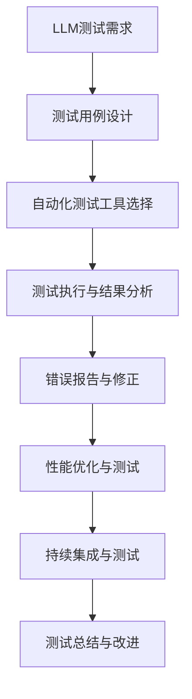

                 

# 自动化LLM测试场景重现与复现

> 关键词：大型语言模型（LLM），自动化测试，测试场景重现，复现，测试框架，测试工具

> 摘要：本文将深入探讨自动化大型语言模型（LLM）测试的场景、方法、工具和最佳实践。我们将通过逐步分析，理解LLM测试的背景和挑战，介绍LLM和自动化测试的基本概念，讨论测试场景的设计与实施，分享测试框架和工具的使用，最后提供错误分析和性能优化的策略。通过本文，读者将获得在LLM测试中实现自动化测试的全面指南。

## 1. 引言

### 1.1 大型语言模型（LLM）的背景

大型语言模型（LLM，Large Language Models）是人工智能领域的核心技术之一，它们通过深度学习算法从海量文本数据中学习，并能够生成高质量的自然语言文本。LLM的发展可以追溯到20世纪80年代，随着计算能力和数据资源的不断提升，LLM在自然语言处理（NLP）任务中取得了显著的进展。近年来，诸如GPT（Generative Pre-trained Transformer）和BERT（Bidirectional Encoder Representations from Transformers）等模型的出现，使得LLM在文本生成、机器翻译、问答系统等领域取得了突破性成果。

### 1.2 自动化测试的概述

自动化测试是一种通过编写脚本和工具来执行测试的方法，旨在提高测试的效率和一致性。自动化测试可以减少人为错误，提高测试覆盖率和测试速度，从而缩短软件开发的周期。随着软件复杂性的增加，自动化测试在软件工程中变得越来越重要。自动化测试工具如Selenium、PyTest、JUnit等，为自动化测试提供了强大的支持。

### 1.3 LLM自动化测试的挑战与机遇

LLM的复杂性和不确定性给自动化测试带来了挑战。LLM测试不仅需要验证模型的功能性，还需要评估其性能、稳定性和可靠性。自动化测试需要处理大量的测试数据，设计复杂的测试场景，并确保测试结果的准确性。尽管存在挑战，但LLM自动化测试也为提高软件开发效率和质量提供了巨大的机遇。

## 2. LLM和自动化测试的基本概念

### 2.1 大型语言模型（LLM）的概念

#### 2.1.1 定义和历史

大型语言模型（LLM）是一种能够理解、生成和响应自然语言文本的人工智能模型。LLM通过深度学习算法，从大量文本数据中学习语言模式和语法规则，从而实现高质量的自然语言生成。

#### 2.1.2 核心组件和架构

LLM通常由以下组件组成：

- **输入层**：接收用户输入的自然语言文本。
- **嵌入层**：将文本转换为数值向量。
- **编码器**：处理输入文本，提取语义信息。
- **解码器**：生成输出文本。

LLM的常见架构包括Transformer和BERT等。

#### 2.1.3 性能指标

LLM的性能通常通过以下指标来评估：

- **准确性**：模型生成文本的准确性。
- **流畅性**：模型生成文本的流畅度和可读性。
- **多样性**：模型生成文本的多样性。

### 2.2 自动化测试的基本概念

#### 2.2.1 概念和原则

自动化测试是通过编写脚本和工具来执行测试的过程，旨在提高测试的效率和一致性。自动化测试的原则包括：

- **可重复性**：测试结果应该是可重复的。
- **效率**：自动化测试应该能够减少测试时间。
- **可靠性**：自动化测试应该能够发现潜在的缺陷。

#### 2.2.2 不同类型的自动化测试

自动化测试可以分为以下几种类型：

- **功能测试**：验证软件功能是否符合预期。
- **性能测试**：评估软件的性能和响应时间。
- **安全测试**：确保软件的安全性。

#### 2.2.3 测试工具和技

### 2.3 测试用例设计

测试用例是测试过程中用来验证软件功能的详细描述。在设计测试用例时，需要考虑以下要素：

- **输入数据**：测试用例的输入条件。
- **预期结果**：测试用例的预期输出结果。
- **实际结果**：测试执行后的实际输出结果。
- **测试步骤**：执行测试用例的具体步骤。

### 2.4 自动化测试工具选择

选择合适的自动化测试工具是成功实施自动化测试的关键。常见的自动化测试工具有：

- **Selenium**：用于Web应用的自动化测试。
- **PyTest**：用于Python应用的自动化测试。
- **JUnit**：用于Java应用的自动化测试。

### 2.5 测试执行与结果分析

测试执行是自动化测试的核心步骤，它涉及运行测试脚本和验证测试结果。测试结果分析可以帮助我们发现软件中的缺陷和问题。

### 2.6 错误报告与修正

错误报告是自动化测试过程中不可或缺的一部分。有效的错误报告应包括以下信息：

- **错误描述**：错误的详细描述。
- **复现步骤**：复现错误的步骤。
- **预期结果**：预期输出结果。
- **实际结果**：实际输出结果。

### 2.7 性能优化与测试

性能优化是提高软件质量的重要手段。在LLM测试中，性能优化可以包括以下方面：

- **模型压缩**：减少模型的参数数量，提高运行速度。
- **模型加速**：通过硬件加速和算法优化来提高模型性能。
- **测试覆盖率**：提高测试覆盖率，确保模型在多种情况下都能正常运行。

### 2.8 持续集成与测试

持续集成（CI）是将自动化测试集成到开发流程中的方法。通过CI，开发人员可以在每次代码提交时自动执行测试，确保软件的质量。

### 2.9 测试总结与改进

测试总结是自动化测试的最后一步，它可以帮助我们总结测试过程，识别改进的机会。

## 3. 实战：自动化LLM测试环境搭建

### 3.1 环境准备

在开始自动化LLM测试之前，我们需要准备好测试环境。这包括安装Python、测试框架和测试工具。

### 3.2 测试框架选择

我们选择PyTest作为我们的测试框架，因为它易于使用，功能强大。

### 3.3 测试工具安装

安装Selenium，用于Web应用的自动化测试。

### 3.4 测试用例编写

编写测试用例，用于验证LLM的功能。

### 3.5 测试执行

运行测试脚本，执行测试用例。

### 3.6 结果分析

分析测试结果，识别错误和问题。

### 3.7 错误修正

修正错误，改进测试用例。

### 3.8 持续集成

将测试集成到持续集成流程中，确保每次代码提交都会自动执行测试。

## 4. 测试场景设计与案例分析

### 4.1 测试场景设计原则

在设计测试场景时，需要考虑以下原则：

- **全面性**：测试场景应该覆盖所有可能的输入和输出。
- **代表性**：测试场景应该能够代表实际使用情况。
- **可维护性**：测试场景应该易于修改和维护。

### 4.2 案例分析

#### 4.2.1 案例一：聊天机器人测试

聊天机器人是LLM应用的一个典型例子。在测试聊天机器人时，我们需要考虑以下测试场景：

- **正常对话**：测试机器人能否正常回答常见问题。
- **异常输入**：测试机器人对异常输入的响应。
- **连续对话**：测试机器人能否维持连续的对话。

#### 4.2.2 案例二：文本生成测试

文本生成是LLM的另一个重要应用。在测试文本生成时，我们需要考虑以下测试场景：

- **文本长度**：测试生成的文本长度是否符合要求。
- **文本内容**：测试生成的文本内容是否相关和准确。
- **文本风格**：测试生成的文本风格是否符合预期。

## 5. 测试框架与工具详解

### 5.1 PyTest

PyTest是一个开源的Python测试框架，它支持多种测试类型，包括单元测试、集成测试和功能测试。PyTest易于使用，功能强大，适合用于自动化LLM测试。

### 5.2 Selenium

Selenium是一个用于Web应用的自动化测试工具。它支持多种浏览器，包括Chrome、Firefox和Safari。Selenium可以模拟用户的操作，如点击、输入和滚动，从而验证Web应用的界面和功能。

### 5.3 JUnit

JUnit是一个用于Java的测试框架。它支持单元测试、集成测试和功能测试。JUnit提供了丰富的测试用例设计工具和报告生成工具，适合用于大型软件项目的自动化测试。

## 6. 错误分析与bug修复

### 6.1 错误分析

错误分析是自动化测试过程中至关重要的一环。通过错误分析，我们可以识别软件中的缺陷和问题，并找到解决方法。

### 6.2 Bug修复

Bug修复是自动化测试的最后一步。在修复Bug时，我们需要仔细分析错误报告，找出问题的根本原因，并编写修复代码。

## 7. 性能优化策略

### 7.1 模型压缩

模型压缩是一种通过减少模型参数数量来提高模型性能的技术。常见的模型压缩技术包括剪枝、量化等。

### 7.2 模型加速

模型加速是一种通过硬件加速和算法优化来提高模型性能的技术。常见的模型加速技术包括GPU加速、FPGA加速等。

### 7.3 测试覆盖率

提高测试覆盖率是提高软件质量的重要手段。通过增加测试用例和测试场景，我们可以提高测试覆盖率，确保软件在各种情况下都能正常运行。

## 8. 持续集成与测试

### 8.1 持续集成

持续集成（CI）是将自动化测试集成到开发流程中的方法。通过CI，开发人员可以在每次代码提交时自动执行测试，确保软件的质量。

### 8.2 测试自动化

测试自动化是持续集成的重要组成部分。通过自动化测试，我们可以提高测试效率，减少测试时间，确保软件质量。

### 8.3 测试结果反馈

测试结果反馈是持续集成过程中的重要环节。通过分析测试结果，我们可以及时发现软件中的缺陷和问题，并采取相应的措施进行修复。

## 9. 小结与展望

### 9.1 小结

本文介绍了自动化大型语言模型（LLM）测试的核心概念、方法、工具和最佳实践。通过逐步分析，我们理解了LLM测试的背景和挑战，学习了LLM和自动化测试的基本概念，了解了测试场景的设计与实施，分享了测试框架和工具的使用，最后讨论了错误分析和性能优化的策略。

### 9.2 展望

随着人工智能技术的不断发展，LLM的应用场景将越来越广泛。自动化LLM测试也将成为提高软件开发效率和质量的重要手段。未来，我们期待看到更多创新的测试工具和方法，以及更高效的测试策略。

## 作者信息

作者：AI天才研究院/AI Genius Institute & 禅与计算机程序设计艺术 /Zen And The Art of Computer Programming

AI天才研究院致力于推动人工智能技术的发展，通过深入研究和创新实践，推动人工智能技术的应用。禅与计算机程序设计艺术则专注于计算机程序设计领域的哲学和艺术，提倡一种宁静而专注的程序设计方式。

## 拓展阅读

1. [《自动化测试实战：从入门到精通》](#)
2. [《大型语言模型技术与应用》](#)
3. [《深度学习与自然语言处理》](#)
4. [《Python自动化测试》](#)
5. [《持续集成实践指南》](#)

