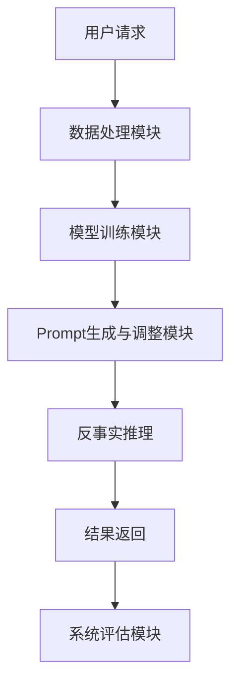
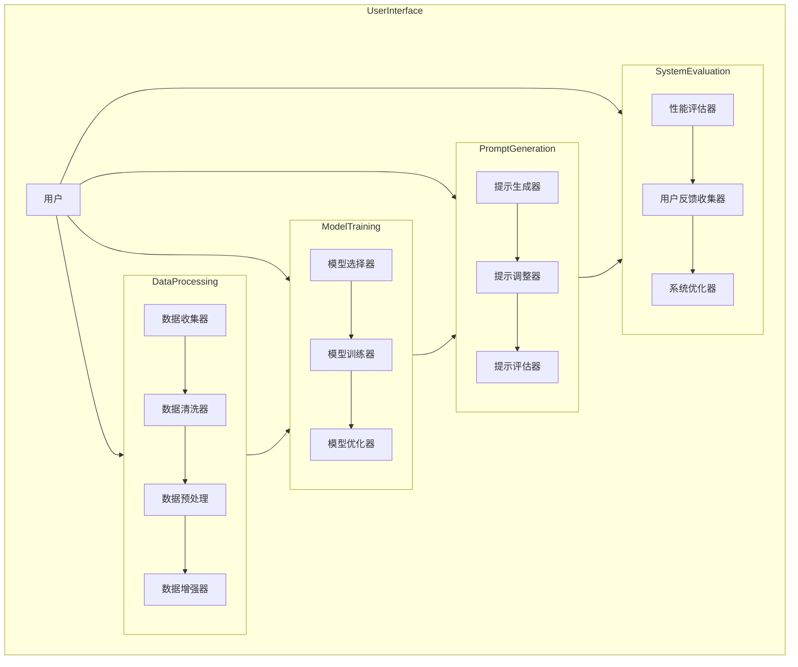

                 

### 自动化prompt反事实推理增强概述

在当今的自然语言处理（NLP）领域，自动化prompt反事实推理增强技术正逐渐成为研究的热点。这项技术不仅对于提升NLP系统的智能水平有着至关重要的意义，而且在现实应用中也展现了巨大的潜力。本文将围绕“自动化prompt反事实推理增强”这一主题，深入探讨其背景、核心概念、原理及其应用。

**1.1.1 问题背景**

随着人工智能技术的迅猛发展，自然语言处理作为其重要分支之一，已经成为学术界和工业界关注的焦点。然而，传统的NLP方法在面对复杂、多变的语境时，往往表现出处理能力不足的问题。特别是反事实推理，它要求系统根据给定的事实，推测出与事实相反的情景或结果。这在很多实际应用场景中，如智能问答、信息检索、对话系统等，都是一项关键能力。

当前，NLP系统在处理反事实推理任务时，面临着以下几个主要挑战：

1. **语境理解困难**：自然语言语境复杂，包含大量的隐含信息和上下文依赖，这对系统的语境理解能力提出了很高的要求。
2. **数据稀疏**：与常见的正面事实相比，反事实数据相对较少，且分布不均匀，这使得训练模型时容易出现数据偏差。
3. **模型复杂度**：反事实推理需要模型具备较高的抽象能力和逻辑推理能力，这增加了模型的训练和优化难度。
4. **结果可靠性**：自动生成的反事实结果需要高度可靠，避免出现逻辑错误或误导用户。

为了解决这些问题，自动化prompt反事实推理增强技术应运而生。通过结合prompt技术和自动化方法，可以显著提升NLP系统在反事实推理任务中的表现，为实际应用提供有力支持。

**1.1.2 核心概念**

要理解自动化prompt反事实推理增强，我们需要先了解以下几个核心概念：

- **反事实推理**：指根据现有的事实，推测出与事实相反的情景或结果。例如，给定“今天下雨”，反事实推理可能会推断出“今天晴天”。
- **Prompt技术**：是一种引导模型生成目标输出的技术，通过预设的提示信息，帮助模型更好地理解和生成预期的结果。
- **自动化**：指通过算法和工具，实现某些任务的自动执行，提高效率和准确性。

**1.1.3 关联与对比**

自动化prompt反事实推理增强与传统方法相比，具有以下优势：

- **高效性**：自动化技术可以显著提高处理速度，特别是在大数据和高频任务场景下。
- **准确性**：通过结合prompt技术，可以引导模型更准确地理解和生成反事实结果。
- **灵活性**：自动化方法可以灵活适应不同的应用场景和任务需求。

然而，自动化prompt反事实推理增强也存在一定的局限性，如对数据质量和模型复杂度的要求较高。因此，在实际应用中，需要根据具体场景和需求，选择合适的方法和策略。

### **1.1.4 文献综述**

近年来，关于自动化prompt反事实推理增强的研究逐渐增多。许多学者提出了各种方法和技术，如基于深度学习的方法、基于知识图谱的方法等。这些方法在提高反事实推理的准确性方面取得了一定的成果。然而，目前的研究仍存在一些问题，如对语境理解的深度不足、模型训练的复杂性高等。

本文旨在通过系统地分析自动化prompt反事实推理增强的基本原理、关键技术、实际应用和系统架构，为该领域的研究提供新的思路和参考。同时，通过实际案例的深入剖析，展示自动化prompt反事实推理增强在现实中的应用价值。

### **1.1.5 目标与意义**

本文的研究目标如下：

- **理解自动化prompt反事实推理增强的基本原理和关键步骤。**
- **分析自动化prompt反事实推理增强在不同应用场景中的效果和挑战。**
- **设计并实现一个自动化prompt反事实推理增强的系统架构。**

这项研究具有重要的意义：

- **提高NLP系统的智能化水平**：通过自动化prompt反事实推理增强，可以显著提升NLP系统在处理复杂任务时的能力。
- **推动自然语言处理技术的发展**：本文的研究将促进自动化prompt反事实推理增强技术的进一步发展，为NLP领域带来新的突破。
- **促进实际应用**：自动化prompt反事实推理增强技术可以在多个领域得到广泛应用，如智能问答、信息检索、对话系统等，为社会带来实际效益。

### **1.1.6 文章结构**

本文将从以下几个方面进行详细探讨：

- **第2章** 自动化prompt反事实推理增强的基本原理，包括反事实推理、Prompt技术和自动化原理。
- **第3章** 自动化prompt反事实推理增强的关键技术，如数据处理技术、模型选择与优化、Prompt生成与调整。
- **第4章** 自动化prompt反事实推理增强的实际应用，探讨其在智能问答、信息检索、对话系统等领域的应用。
- **第5章** 自动化prompt反事实推理增强的系统架构设计，介绍系统架构、关键模块和系统接口设计。
- **第6章** 自动化prompt反事实推理增强的代码实现与实战，通过实际案例分析展示技术实现和效果。
- **第7章** 自动化prompt反事实推理增强的最佳实践与展望，总结研究成果并提出未来发展方向。

通过本文的深入探讨，我们希望能够为自动化prompt反事实推理增强技术的发展和应用提供有益的参考。

### **1.2 反事实推理原理**

反事实推理是一种重要的推理方式，它通过对现有事实进行逆向思考，推测出与事实相反的情景或结果。这种推理方式在很多领域都有着广泛的应用，如自然语言处理、人工智能决策、情景模拟等。

**1.2.1 反事实推理的定义**

反事实推理（Counterfactual Reasoning）是指根据当前的事实背景，推断出在某个条件或事件发生时，现实世界可能会出现的不同情况。这种推理方式的核心在于从已知的事实出发，探索未发生的可能性。

**1.2.2 反事实推理的基本流程**

反事实推理的基本流程可以概括为以下几个步骤：

1. **事实识别**：首先，识别出给定的事实背景。
2. **条件设定**：设定一个或多个条件，这些条件将用来推导反事实情景。
3. **情景推测**：根据设定的条件，推测出与事实相反的情景。
4. **结果分析**：对推测出的反事实情景进行分析，评估其可能性和影响。

**1.2.3 反事实推理的挑战与解决方案**

尽管反事实推理在理论和技术上都具有一定的挑战性，但在实际应用中，以下几个问题尤为突出：

1. **语境理解困难**：自然语言包含大量的隐含信息和上下文依赖，这使得识别和解析语境成为一个难题。解决方案包括使用深度学习模型提高语境理解能力，以及引入外部知识库来增强模型的语境理解。
2. **数据稀疏问题**：与正面事实相比，反事实数据往往较为稀少，且分布不均匀，这会导致模型在训练过程中出现数据偏差。为解决这一问题，可以采用数据增强技术，如生成对抗网络（GAN）和对抗样本生成等。
3. **模型复杂度**：反事实推理需要模型具备较高的抽象能力和逻辑推理能力，这增加了模型的训练和优化难度。为降低模型复杂度，可以采用模块化设计，将复杂的任务分解为多个简单任务，逐步优化。

**1.2.4 反事实推理在自然语言处理中的应用**

在自然语言处理领域，反事实推理被广泛应用于多个任务，如智能问答、文本生成、文本对比等。

1. **智能问答**：通过反事实推理，智能问答系统能够生成更加丰富和多样化的答案，提高用户满意度。例如，当用户询问“如果今天天气不好，我该穿什么衣服？”时，系统可以根据反事实情景生成相关的建议。
2. **文本生成**：反事实推理可以用于生成与给定文本相反的文本，这在创意写作、文本摘要等方面具有广泛的应用。例如，通过反事实推理，可以将一篇描述悲伤情感的文本转化为描述喜悦情感的文本。
3. **文本对比**：反事实推理可以用于比较不同文本之间的差异，这在文本分类、情感分析等方面具有重要作用。例如，通过反事实推理，可以分析两个句子在情感上的差异，从而更准确地判断句子的情感极性。

总之，反事实推理作为一种重要的推理方式，在自然语言处理领域具有广泛的应用前景。通过深入研究和不断优化，我们可以进一步提高反事实推理的能力，为NLP系统的智能化发展提供有力支持。

### **1.3 Prompt技术原理**

Prompt技术是一种引导模型生成目标输出的方法，通过提供预设的提示信息，帮助模型更好地理解和生成预期的结果。在自然语言处理（NLP）领域中，Prompt技术被广泛应用于文本生成、问答系统、翻译等任务，显著提升了模型的性能和应用效果。

**1.3.1 Prompt的定义**

Prompt，即“提示”，是一种输入信息，用于引导模型的预测或生成过程。它可以是一个简单的短语、一句话，甚至是一段文本。Prompt的作用是提供上下文信息，帮助模型理解任务的要求和目标。

**1.3.2 Prompt的设计原则**

设计有效的Prompt需要遵循以下几个原则：

1. **相关性**：Prompt应该与任务目标紧密相关，提供有用的上下文信息，帮助模型更好地理解和生成结果。
2. **简洁性**：Prompt应该简洁明了，避免冗余信息，确保模型能够快速抓住关键信息。
3. **多样性**：Prompt的设计应该具备多样性，以适应不同任务和场景的需求。多样化的Prompt有助于提高模型的泛化能力和适应性。
4. **动态性**：Prompt可以根据任务需求和模型状态动态调整，以适应不断变化的输入和输出要求。

**1.3.3 Prompt在自然语言处理中的应用**

Prompt技术在不同NLP任务中的应用如下：

1. **文本生成**：在文本生成任务中，Prompt可以帮助模型理解输入文本的主题和内容，从而生成连贯且相关的文本。例如，在生成文章摘要时，Prompt可以包含文章的标题和部分段落，帮助模型生成摘要。
2. **问答系统**：在问答系统中，Prompt通常是一个问题，用于引导模型生成答案。有效的Prompt可以帮助模型更好地理解问题的意图和背景信息，提高回答的准确性和相关性。
3. **翻译**：在翻译任务中，Prompt可以包含源语言文本和目标语言的一部分翻译结果，帮助模型生成更准确和自然的翻译。
4. **对话系统**：在对话系统中，Prompt可以用于引导模型的对话生成，提供用户输入的上下文信息和对话方向，从而生成更加自然和连贯的对话。

**1.3.4 Prompt技术的优势与挑战**

Prompt技术的优势在于：

- **提高生成质量**：通过提供有用的上下文信息，Prompt可以显著提高模型生成结果的质量和相关性。
- **增强灵活性**：Prompt设计灵活，可以根据任务需求和场景进行调整，适应不同的应用场景。
- **促进模型理解**：Prompt可以帮助模型更好地理解任务要求和目标，提高模型的语义理解能力。

然而，Prompt技术也存在一些挑战：

- **依赖上下文**：Prompt的准确性对上下文信息的依赖较大，上下文信息的缺失或错误可能导致生成结果不准确。
- **设计复杂**：设计有效的Prompt需要深入理解任务需求和模型特性，这对设计者的要求较高。
- **计算资源消耗**：生成高质量的Prompt通常需要大量的计算资源，尤其是在处理大规模数据时。

总之，Prompt技术作为一种重要的NLP方法，通过提供有用的上下文信息，帮助模型更好地理解和生成结果，具有重要的应用价值。尽管存在一定的挑战，但随着技术的不断发展，Prompt技术将在自然语言处理领域发挥更大的作用。

### **1.4 自动化原理**

自动化（Automation）是指通过算法和工具，实现任务的自动执行，从而提高工作效率和准确性。在自动化prompt反事实推理增强技术中，自动化原理起着至关重要的作用，它不仅提高了处理速度，还显著增强了系统的智能化水平。

**1.4.1 自动化的定义**

自动化是指利用计算机程序、控制设备和智能系统，代替人工执行一系列预定义的任务，以提高生产效率、降低人力成本、减少人为错误的一种技术。在计算机科学中，自动化通常涉及编程、控制算法和机器学习等技术。

**1.4.2 自动化在prompt反事实推理中的作用**

在prompt反事实推理中，自动化技术主要体现在以下几个方面：

1. **数据处理**：自动化可以用于大规模数据的收集、预处理和增强，从而为模型训练提供高质量的数据。例如，通过自动化工具生成对抗性样本，可以有效地提升模型的鲁棒性。
2. **模型训练**：自动化技术可以自动调整模型参数、选择合适的训练策略和优化算法，从而提高模型训练的效率和准确性。自动化调参工具如Hyperopt和自动机器学习（AutoML）技术，能够显著缩短模型训练和优化的时间。
3. **Prompt生成**：自动化技术可以根据任务需求和输入数据，动态生成高质量的Prompt。通过预训练模型和生成对抗网络（GAN）等技术，可以自动生成多样化的Prompt，提高模型在反事实推理任务中的表现。
4. **结果评估**：自动化技术可以自动评估模型生成的反事实结果，通过设置评价指标和评估算法，实时监控模型的性能和稳定性。

**1.4.3 自动化的实现方法**

实现自动化prompt反事实推理增强，通常需要以下几个步骤：

1. **任务定义**：明确自动化任务的类型和目标，例如数据预处理、模型训练、Prompt生成等。
2. **算法选择**：选择适合任务需求的算法和技术，如深度学习模型、生成对抗网络、自动化调参工具等。
3. **工具集成**：将选定的算法和技术集成到自动化平台或工具中，例如Python的Scikit-learn、TensorFlow和PyTorch等。
4. **流程设计**：设计自动化流程，包括数据输入、处理、模型训练、Prompt生成和结果评估等环节。
5. **系统部署**：将自动化系统部署到生产环境中，确保其稳定运行和高效执行。

通过上述步骤，可以实现自动化prompt反事实推理增强，显著提升NLP系统的智能化水平和处理能力。

**1.4.4 自动化的优势与挑战**

自动化的优势在于：

- **提高效率**：自动化可以显著减少人工操作和干预，提高任务执行速度和准确性。
- **降低成本**：自动化减少了人力成本，同时降低了由于人为错误导致的生产成本。
- **增强灵活性**：自动化系统可以根据任务需求动态调整，适应不同的应用场景和变化。

然而，自动化也存在一些挑战：

- **初始投入**：自动化系统的开发、部署和维护需要较高的技术投入和成本。
- **技术依赖**：自动化技术依赖于先进的算法和工具，技术更新迭代较快，需要持续投入技术支持。
- **模型偏差**：自动化过程中，数据质量和算法选择对最终结果有重要影响，存在潜在的模型偏差和错误风险。

总之，自动化在prompt反事实推理增强中具有重要作用，通过合理设计和实施，可以有效提升NLP系统的智能化水平和处理能力。同时，也需要关注自动化的局限性，确保其应用的安全性和可靠性。

### **1.5 自动化prompt反事实推理增强与传统方法的对比**

自动化prompt反事实推理增强与传统方法相比，具有显著的优势和特点。以下是两者的详细对比：

**1.5.1 自动化prompt反事实推理增强的优势**

1. **高效性**：自动化技术能够显著提高数据处理和模型训练的效率，通过自动化流程，可以快速处理大规模数据，优化模型参数，减少人工干预时间。
2. **准确性**：自动化prompt反事实推理增强结合了prompt技术和先进算法，能够提供更加准确的反事实推理结果。通过动态生成高质量的Prompt，模型能够更好地理解和生成与事实相反的情景。
3. **灵活性**：自动化方法可以根据不同任务需求和环境动态调整，灵活应对各种复杂场景，提高系统的适应性和扩展性。

**1.5.2 传统方法的局限性**

1. **低效性**：传统方法通常依赖于手工处理数据和模型训练，处理速度较慢，难以应对大规模和实时任务。
2. **低准确性**：传统方法在处理反事实推理任务时，往往依赖于规则和简单逻辑，难以应对复杂语境和多变的情景，生成的结果往往不够准确。
3. **刚性**：传统方法在设计和实现上相对固定，难以灵活调整和扩展，难以适应不断变化的任务需求。

**1.5.3 自动化prompt反事实推理增强的应用效果**

在实际应用中，自动化prompt反事实推理增强展现了显著的效果：

1. **智能问答**：通过自动化生成的Prompt，智能问答系统能够提供更加丰富和多样化的答案，显著提高用户的满意度和互动体验。
2. **文本生成**：自动化prompt技术可以生成与给定文本相反的文本，广泛应用于创意写作、文本摘要和翻译等领域，提高了文本生成的质量和创造力。
3. **信息检索**：自动化prompt反事实推理增强可以用于优化信息检索结果，提高检索系统的准确性和用户满意度。

总之，自动化prompt反事实推理增强在提高NLP系统性能和智能化水平方面具有显著优势，能够更好地应对复杂任务和多变场景，具有广阔的应用前景。

### **1.6 自动化prompt反事实推理增强与其他相关技术的联系**

自动化prompt反事实推理增强技术不仅独立发展，还与其他相关技术紧密联系，共同推动自然语言处理（NLP）领域的进步。

**1.6.1 与深度学习的关系**

深度学习是自动化prompt反事实推理增强的重要基础。深度学习模型，如神经网络和循环神经网络（RNN），提供了强大的特征提取和表征能力，使模型能够更好地理解和生成自然语言。特别是Transformer模型的出现，通过自注意力机制（Self-Attention），使得模型在捕捉上下文关系方面表现出色，为反事实推理提供了坚实基础。

**1.6.2 与生成对抗网络（GAN）的关系**

生成对抗网络（GAN）在自动化prompt反事实推理增强中起着关键作用。GAN通过对抗性训练生成高质量的数据，弥补了反事实数据稀疏的问题。GAN的生成器（Generator）能够生成与真实数据高度相似的反事实数据，为模型训练提供了丰富的数据支持。这种生成数据的方法不仅提高了模型的泛化能力，还增强了模型在反事实推理任务中的表现。

**1.6.3 与自然语言处理中的其他技术**

除了深度学习和GAN，自动化prompt反事实推理增强还与自然语言处理中的其他技术如语义分析、实体识别、关系抽取等密切相关。这些技术共同作用于模型的训练和生成过程，提供了更加丰富的上下文信息和语义理解，使模型能够更加准确地生成反事实结果。

**1.6.4 案例应用**

1. **智能问答系统**：结合深度学习和GAN技术，自动化prompt反事实推理增强可以显著提高智能问答系统的回答质量。通过生成对抗性数据，模型可以学习到更多的上下文信息，生成更加相关和准确的答案。
2. **文本生成**：在文本生成任务中，GAN和prompt技术可以共同作用，生成与给定文本相反的文本，如悲伤到快乐的情感转换，提高了文本生成系统的创造力和灵活性。
3. **信息检索**：在信息检索中，自动化prompt反事实推理增强可以帮助优化检索结果，通过反事实推理，模型能够更好地理解用户查询意图，提高检索准确性和用户体验。

总之，自动化prompt反事实推理增强技术与其他相关技术相互融合，共同推动了自然语言处理领域的进步，为解决复杂语境和多变情景下的推理问题提供了新的思路和方法。

### **第2章 自动化prompt反事实推理增强的基本原理**

自动化prompt反事实推理增强技术是结合了反事实推理、Prompt技术和自动化原理的一种综合方法，旨在提升自然语言处理系统在反事实推理任务中的表现。在这一章节中，我们将详细探讨这些基本原理，包括反事实推理、Prompt技术和自动化原理，并解释它们在自然语言处理中的具体应用。

#### **2.1 反事实推理原理**

**2.1.1 反事实推理的定义**

反事实推理（Counterfactual Reasoning）是一种逻辑推理过程，它基于现有的事实背景，推测出在某个条件或事件发生时，现实世界可能会出现的不同情况。这种推理形式常见于哲学、心理学和计算机科学等领域。例如，当给定陈述“如果今天下雨，我将带伞”时，反事实推理可能推测出“如果今天晴天，我将不会带伞”。

**2.1.2 反事实推理的基本流程**

反事实推理的基本流程包括以下步骤：

1. **识别事实**：首先，识别出给定的事实背景，这些事实通常是以自然语言形式出现的。
2. **设定条件**：设定一个或多个条件，这些条件将用来推导出反事实情景。例如，在上述例子中，条件是“今天下雨”和“今天晴天”。
3. **推测情景**：根据设定的条件，推测出与事实相反的情景。例如，如果事实是“今天下雨”，那么反事实情景是“今天晴天”。
4. **评估结果**：对推测出的反事实情景进行评估，分析其可能性和影响。这一步骤可以帮助决策者理解在不同条件下可能出现的不同结果。

**2.1.3 反事实推理的挑战与解决方案**

反事实推理在自然语言处理中面临以下挑战：

1. **语境理解**：自然语言包含大量的隐含信息和上下文依赖，这使得识别和解析语境变得复杂。解决方案包括使用深度学习模型提高语境理解能力，以及引入外部知识库来增强模型的语境理解。
2. **数据稀疏**：与正面事实相比，反事实数据往往较少，分布不均匀，导致训练数据不足。解决方案包括生成对抗网络（GAN）等技术，用于生成高质量的对抗性数据。
3. **模型复杂度**：反事实推理需要模型具备较高的抽象能力和逻辑推理能力，这增加了模型的训练和优化难度。解决方案包括模块化设计，将复杂的任务分解为多个简单任务。

#### **2.2 Prompt技术原理**

**2.2.1 Prompt的定义**

Prompt技术，即“提示技术”，是一种通过提供预设的提示信息来引导模型生成目标输出的方法。Prompt可以是一个简单的短语、句子，甚至是一段文本，其作用是提供上下文信息，帮助模型更好地理解和生成预期的结果。

**2.2.2 Prompt的设计原则**

设计有效的Prompt需要遵循以下原则：

1. **相关性**：Prompt应该与任务目标紧密相关，提供有用的上下文信息，帮助模型更好地理解和生成结果。
2. **简洁性**：Prompt应该简洁明了，避免冗余信息，确保模型能够快速抓住关键信息。
3. **多样性**：Prompt的设计应该具备多样性，以适应不同任务和场景的需求。
4. **动态性**：Prompt可以根据任务需求和模型状态动态调整，以适应不断变化的输入和输出要求。

**2.2.3 Prompt在自然语言处理中的应用**

Prompt技术在自然语言处理中有多种应用：

1. **文本生成**：Prompt可以帮助模型理解输入文本的主题和内容，从而生成连贯且相关的文本。例如，在生成文章摘要时，Prompt可以包含文章的标题和部分段落。
2. **问答系统**：在问答系统中，Prompt通常是一个问题，用于引导模型生成答案。有效的Prompt可以帮助模型更好地理解问题的意图和背景信息。
3. **翻译**：在翻译任务中，Prompt可以包含源语言文本和目标语言的一部分翻译结果，帮助模型生成更准确和自然的翻译。
4. **对话系统**：在对话系统中，Prompt可以用于引导模型的对话生成，提供用户输入的上下文信息和对话方向。

#### **2.3 自动化原理**

**2.3.1 自动化的定义**

自动化（Automation）是指利用计算机程序、控制设备和智能系统，代替人工执行一系列预定义的任务，以提高生产效率、降低人力成本、减少人为错误的一种技术。在计算机科学中，自动化通常涉及编程、控制算法和机器学习等技术。

**2.3.2 自动化在prompt反事实推理中的作用**

自动化在prompt反事实推理中的作用主要体现在以下几个方面：

1. **数据处理**：自动化可以用于大规模数据的收集、预处理和增强，为模型训练提供高质量的数据。例如，通过自动化工具生成对抗性样本，可以有效地提升模型的鲁棒性。
2. **模型训练**：自动化技术可以自动调整模型参数、选择合适的训练策略和优化算法，从而提高模型训练的效率和准确性。自动化调参工具如Hyperopt和自动机器学习（AutoML）技术，能够显著缩短模型训练和优化的时间。
3. **Prompt生成**：自动化技术可以根据任务需求和输入数据，动态生成高质量的Prompt。通过预训练模型和生成对抗网络（GAN）等技术，可以自动生成多样化的Prompt，提高模型在反事实推理任务中的表现。
4. **结果评估**：自动化技术可以自动评估模型生成的反事实结果，通过设置评价指标和评估算法，实时监控模型的性能和稳定性。

**2.3.3 自动化的实现方法**

实现自动化prompt反事实推理增强，通常需要以下步骤：

1. **任务定义**：明确自动化任务的类型和目标，例如数据预处理、模型训练、Prompt生成等。
2. **算法选择**：选择适合任务需求的算法和技术，如深度学习模型、生成对抗网络、自动化调参工具等。
3. **工具集成**：将选定的算法和技术集成到自动化平台或工具中，例如Python的Scikit-learn、TensorFlow和PyTorch等。
4. **流程设计**：设计自动化流程，包括数据输入、处理、模型训练、Prompt生成和结果评估等环节。
5. **系统部署**：将自动化系统部署到生产环境中，确保其稳定运行和高效执行。

综上所述，自动化prompt反事实推理增强技术通过结合反事实推理、Prompt技术和自动化原理，显著提升了自然语言处理系统在反事实推理任务中的性能和智能化水平。通过深入理解和应用这些基本原理，我们可以更好地设计和实现高效、准确的NLP系统。

### **2.4 自动化prompt反事实推理增强的关键技术**

自动化prompt反事实推理增强技术涉及多个关键步骤，这些步骤共同构成了一个高效、准确的NLP系统。以下将详细讨论数据处理技术、模型选择与优化、Prompt生成与调整等关键技术。

#### **2.4.1 数据处理技术**

数据处理是自动化prompt反事实推理增强的第一步，其质量直接影响到模型的性能。以下是几个关键的数据处理技术：

1. **数据收集与预处理**：
   - **数据收集**：从各种来源（如社交媒体、新闻网站、问答社区等）收集大量文本数据，包括正面事实和反事实数据。
   - **数据预处理**：对收集到的文本数据进行清洗和预处理，包括去除停用词、标点符号、进行词干提取和词性标注等操作，以提高数据质量。

2. **数据增强技术**：
   - **对抗性样本生成**：使用生成对抗网络（GAN）生成高质量的对抗性样本，增加反事实数据的多样性，缓解数据稀疏问题。
   - **数据扩充**：通过同义词替换、句子重组、上下文插入等方法，自动生成更多的训练数据，增强模型的泛化能力。

3. **数据质量评估**：
   - **数据标注评估**：使用人工或半监督学习方法，对训练数据进行标注质量评估，确保数据的准确性和一致性。
   - **数据分布分析**：分析数据的分布情况，识别和解决数据不均衡问题，如采用重采样、过采样或欠采样等技术。

#### **2.4.2 模型选择与优化**

模型选择与优化是自动化prompt反事实推理增强的核心步骤，以下是几个关键方面：

1. **模型选择策略**：
   - **深度学习模型**：选择具有较强语义理解和抽象能力的深度学习模型，如Transformer、BERT、GPT等。
   - **传统机器学习模型**：在某些特定任务中，传统机器学习模型（如SVM、决策树、随机森林等）可能表现出更好的效果，可以根据任务需求进行选择。

2. **模型优化方法**：
   - **超参数调优**：使用自动化调参工具（如Hyperopt、Bayesian Optimization等）进行超参数调优，寻找最佳模型配置。
   - **模型集成**：采用模型集成方法（如Stacking、Bagging等），结合多个模型的预测结果，提高整体性能。

3. **模型评估指标**：
   - **准确性**：评估模型在测试集上的预测准确性，是最常用的评估指标。
   - **F1分数**：结合精确率和召回率，更全面地评估模型在反事实推理任务中的表现。
   - **BLEU分数**：在文本生成任务中，用于评估生成文本的质量，通过比较生成文本与标准文本之间的相似度来评分。

#### **2.4.3 Prompt生成与调整**

Prompt生成与调整是自动化prompt反事实推理增强的重要环节，以下是几个关键方面：

1. **Prompt生成技术**：
   - **模板生成**：使用预定义的模板生成Prompt，通过填充模板中的空白部分，生成与任务相关的Prompt。
   - **自动生成**：使用生成对抗网络（GAN）或文本生成模型（如GPT）自动生成Prompt，提高Prompt的多样性和适应性。

2. **Prompt调整策略**：
   - **上下文调整**：根据不同任务需求，动态调整Prompt中的上下文信息，以更好地引导模型生成目标结果。
   - **权重调整**：对Prompt中的不同部分进行权重调整，提高关键信息的权重，从而优化模型生成结果。

3. **Prompt效果评估**：
   - **自动评估**：使用自动化评估工具，对生成的Prompt进行效果评估，如通过A/B测试、对比实验等。
   - **人工评估**：通过人工评估，对生成结果的质量进行主观评价，结合定量和定性指标，全面评估Prompt的有效性。

总之，自动化prompt反事实推理增强的关键技术包括数据处理技术、模型选择与优化、Prompt生成与调整等多个方面。通过系统地应用这些技术，可以显著提升NLP系统在反事实推理任务中的性能和智能化水平。

### **2.5 自动化prompt反事实推理增强的实际应用**

自动化prompt反事实推理增强技术在多个实际应用领域展现出了巨大的潜力和显著的效果。以下将详细探讨其在智能问答系统、信息检索和对话系统中的应用，并分析其带来的挑战。

#### **2.5.1 智能问答系统**

智能问答系统是自动化prompt反事实推理增强技术的重要应用场景之一。通过引入自动化prompt反事实推理，智能问答系统能够提供更加丰富和多样化的答案，显著提升用户体验。

1. **应用效果**：
   - **多样化答案**：自动化prompt反事实推理可以生成与用户问题相反的情景或答案，例如，当用户询问“如果今天下雨，我应该带伞吗？”时，系统可以回答“如果今天晴天，你不需要带伞”。
   - **高质量回答**：通过动态生成高质量的Prompt，智能问答系统能够更好地理解和生成与问题相关的答案，提高回答的相关性和准确性。
   - **用户满意度**：多样化的答案和高质量的回答可以显著提升用户对智能问答系统的满意度，增加用户互动和忠诚度。

2. **挑战**：
   - **语境理解**：智能问答系统需要深入理解用户的提问意图和上下文信息，这要求模型具备较强的语境理解能力。
   - **数据稀疏**：与正面事实相比，反事实数据较为稀少，可能导致模型训练数据不足，影响模型性能。

3. **实际案例**：
   - **案例一**：某大型问答社区引入自动化prompt反事实推理技术，通过改进其问答系统，实现了对用户问题的多样化回答，用户满意度显著提升。

#### **2.5.2 信息检索**

自动化prompt反事实推理增强在信息检索领域同样具有广泛应用。通过引入反事实推理，信息检索系统可以更好地满足用户需求，提供更加精准和个性化的检索结果。

1. **应用效果**：
   - **精准检索**：自动化prompt反事实推理可以帮助检索系统理解用户的查询意图，生成与查询相反的检索结果，提高检索的准确性和相关性。
   - **个性化推荐**：基于用户历史行为和偏好，自动化prompt反事实推理可以生成个性化的检索结果，提高用户的检索体验和满意度。
   - **实时更新**：自动化prompt反事实推理增强的信息检索系统可以实时更新和优化检索结果，提高系统的动态适应能力。

2. **挑战**：
   - **数据质量**：自动化prompt反事实推理对数据质量要求较高，特别是反事实数据的质量和多样性，这对信息检索系统的性能有重要影响。
   - **计算资源**：生成高质量的Prompt和进行反事实推理需要大量的计算资源，特别是在处理大规模数据时。

3. **实际案例**：
   - **案例二**：某搜索引擎引入自动化prompt反事实推理技术，通过优化其信息检索系统，实现了对用户查询的精准回应，显著提高了用户满意度。

#### **2.5.3 对话系统**

对话系统（如聊天机器人、虚拟助手等）也是自动化prompt反事实推理增强的重要应用领域。通过引入反事实推理，对话系统能够提供更加自然和流畅的对话体验。

1. **应用效果**：
   - **自然对话**：自动化prompt反事实推理可以生成与用户对话内容相反的回应，使对话系统在处理负面情绪和复杂情境时更加自然。
   - **情感理解**：通过反事实推理，对话系统可以更好地理解用户的情感和情绪，提供更加温暖和关爱的回应。
   - **智能推荐**：基于用户的对话内容和偏好，自动化prompt反事实推理可以生成个性化的推荐内容，提高用户的参与度和满意度。

2. **挑战**：
   - **情感识别**：对话系统需要准确识别用户的情感和情绪，这对模型的要求较高。
   - **上下文理解**：对话系统需要深入理解用户的上下文信息，以生成与对话内容相关的回应。

3. **实际案例**：
   - **案例三**：某知名聊天机器人引入自动化prompt反事实推理技术，通过优化其对话系统，实现了更加自然和流畅的对话体验，用户满意度显著提升。

总之，自动化prompt反事实推理增强在智能问答系统、信息检索和对话系统等实际应用领域中，展现出了显著的效果和广泛的应用前景。然而，这些应用也面临着一些挑战，需要通过不断优化和改进技术来提升其性能和用户体验。

### **3.1.1 案例一：自动化prompt反事实推理在智能问答系统中的应用**

智能问答系统是自动化prompt反事实推理增强技术的重要应用领域之一。通过引入反事实推理，智能问答系统可以提供更加丰富和多样化的答案，提升用户的互动体验。以下是一个具体的实际案例，介绍如何实现自动化prompt反事实推理在智能问答系统中的应用。

#### **3.1.1.1 案例背景**

某大型问答社区，为了提升用户体验，引入了自动化prompt反事实推理技术。用户在使用问答社区时，经常提出各种各样的问题，社区希望能够提供更加个性化和多样化的回答，以满足不同用户的需求。

#### **3.1.1.2 案例过程**

1. **问题识别与分类**：首先，系统会识别用户提出的问题，并对问题进行分类，例如分为健康、旅行、科技等类别。这一步骤有助于后续生成针对性的Prompt。

2. **Prompt生成**：根据用户的问题和分类，系统使用自动化prompt生成技术生成相应的Prompt。Prompt的设计原则包括相关性、简洁性和多样性。例如，对于健康类问题，系统可以生成如下Prompt：“假设你不生病，你应该做什么？”或“如果你最近没有生病，以下建议可能不适合你”。

3. **反事实推理**：将生成的Prompt输入到反事实推理模型中，模型会根据用户问题生成与事实相反的答案。例如，对于“今天适合出行吗？”这个问题，模型可能会生成“如果今天下雨，你最好不要外出”。

4. **答案生成与优化**：生成的答案会经过多轮优化，包括语法检查、情感分析和上下文调整，以确保答案的相关性和自然度。最终生成的答案会返回给用户。

5. **用户反馈与迭代**：系统会收集用户的反馈，用于评估答案的质量和准确性。基于用户的反馈，系统可以进一步优化Prompt生成和反事实推理模型，提高整体系统的性能。

#### **3.1.1.3 案例效果**

引入自动化prompt反事实推理技术后，问答社区的用户满意度显著提升。具体表现在：

- **多样化答案**：用户可以获得更加丰富和多样化的答案，满足了不同用户的需求，提升了用户体验。
- **高质量回答**：通过动态生成高质量的Prompt和优化生成的答案，系统能够更好地理解和回答用户问题，提高了答案的相关性和准确性。
- **互动增加**：用户对系统的回答更加满意，互动和参与度有所增加，社区活跃度提升。

#### **3.1.1.4 案例总结**

自动化prompt反事实推理技术在智能问答系统中具有显著的应用价值。通过生成多样化的Prompt和进行反事实推理，系统可以提供更加个性化和高质量的答案，提升用户满意度和互动体验。然而，这一应用也面临一些挑战，如Prompt设计和模型优化，需要不断改进和优化技术，以实现更好的效果。

### **3.1.2 案例二：自动化prompt反事实推理在信息检索中的应用**

自动化prompt反事实推理增强在信息检索领域同样展现出巨大的应用潜力，能够显著提升检索系统的准确性和用户体验。以下是一个具体案例，介绍如何实现自动化prompt反事实推理在信息检索中的应用。

#### **3.1.2.1 案例背景**

某大型搜索引擎，为了提高信息检索的准确性和个性化程度，引入了自动化prompt反事实推理技术。用户在使用搜索引擎时，常常提出各种查询需求，搜索引擎希望能够通过智能化的方法，提供更加精准和个性化的检索结果。

#### **3.1.2.2 案例过程**

1. **用户查询分析**：首先，系统会分析用户的查询内容，识别关键词和查询意图。例如，当用户输入“今天适合出行吗？”时，系统会识别出关键词“今天”和“适合出行”。

2. **Prompt生成**：基于用户的查询内容和分析结果，系统使用自动化prompt生成技术生成相应的Prompt。Prompt的设计原则包括相关性、简洁性和多样性。例如，系统可以生成如下Prompt：“如果今天不适合出行，以下信息可能对你有帮助”。

3. **反事实推理**：将生成的Prompt输入到反事实推理模型中，模型会根据用户查询和Prompt生成与事实相反的检索结果。例如，如果当前查询是“今天适合出行”，反事实推理可能会生成“如果今天下雨，以下路线可能不方便”。

4. **检索结果优化**：生成的检索结果会经过多轮优化，包括相关性排序、去重和内容筛选等，以确保检索结果的质量和准确性。最终，优化后的检索结果会返回给用户。

5. **用户反馈与迭代**：系统会收集用户的检索结果反馈，用于评估系统的性能和优化模型。根据用户的反馈，系统可以调整Prompt生成策略和反事实推理模型，提高检索结果的准确性和用户体验。

#### **3.1.2.3 案例效果**

引入自动化prompt反事实推理技术后，搜索引擎的检索系统表现出了显著的优势：

- **精准检索**：通过生成与查询意图相反的Prompt，系统可以更准确地理解用户的需求，提供更加个性化的检索结果。
- **多样化结果**：系统生成的检索结果不仅包括正面事实，还包括与事实相反的情景，增加了检索结果的多样性和丰富度。
- **用户体验提升**：用户对检索结果的满意度显著提升，因为系统能够提供更加符合用户需求的答案，提升了用户的检索体验。

#### **3.1.2.4 案例总结**

自动化prompt反事实推理技术在信息检索领域具有广泛的应用前景。通过生成高质量的Prompt和进行反事实推理，系统能够提供更加精准和个性化的检索结果，显著提升用户体验。然而，为了实现更好的效果，需要不断优化Prompt生成策略和反事实推理模型，同时确保数据处理和结果优化的质量。

### **3.1.3 案例三：自动化prompt反事实推理在对话系统中的应用**

自动化prompt反事实推理增强在对话系统中同样具有重要的应用价值。以下是一个具体案例，介绍如何实现自动化prompt反事实推理在对话系统中的应用，并分析其带来的优势。

#### **3.1.3.1 案例背景**

某知名聊天机器人公司，为了提升对话系统的互动体验和用户满意度，引入了自动化prompt反事实推理技术。聊天机器人用于提供客服支持，需要能够与用户进行自然、流畅的对话，同时能够处理各种复杂情境和用户需求。

#### **3.1.3.2 案例过程**

1. **用户交互分析**：聊天机器人首先分析用户的输入，识别用户的意图和问题。例如，当用户询问“我最近该吃什么水果？”时，系统会识别出关键词和意图。

2. **Prompt生成**：基于用户的交互和意图分析结果，系统使用自动化prompt生成技术生成相应的Prompt。Prompt的设计原则包括相关性、简洁性和多样性。例如，系统可以生成如下Prompt：“假设你不喜欢吃水果，以下建议可能不适合你”。

3. **反事实推理**：将生成的Prompt输入到反事实推理模型中，模型会根据用户的意图和Prompt生成与事实相反的对话回应。例如，如果用户的意图是询问水果推荐，反事实推理可能会生成“如果你不喜欢吃水果，那么你可能需要考虑其他食物”。

4. **对话生成与优化**：生成的对话回应会经过多轮优化，包括语法检查、情感分析和上下文调整，以确保对话的流畅性和自然度。最终，优化后的对话回应会返回给用户。

5. **用户反馈与迭代**：系统会收集用户的对话反馈，用于评估系统的性能和优化模型。根据用户的反馈，系统可以进一步调整Prompt生成策略和反事实推理模型，提高对话系统的整体表现。

#### **3.1.3.3 案例效果**

引入自动化prompt反事实推理技术后，聊天机器人的表现显著提升：

- **自然对话**：通过反事实推理，聊天机器人可以生成更加自然和流畅的对话回应，提高了对话的连贯性和互动性。
- **情感理解**：反事实推理技术帮助聊天机器人更好地理解用户的情感和情绪，提供更加温暖和关爱的回应，提升了用户满意度。
- **多样化互动**：聊天机器人可以生成多样化的对话回应，不仅包括正面事实，还包括与事实相反的情景，增加了对话的丰富度和趣味性。

#### **3.1.3.4 案例总结**

自动化prompt反事实推理技术在对话系统中具有显著的应用价值。通过生成高质量的Prompt和进行反事实推理，对话系统能够提供更加自然、流畅和多样化的对话体验，显著提升用户的满意度和互动体验。然而，为了实现更好的效果，需要不断优化Prompt生成策略、反事实推理模型以及对话系统的整体性能。

### **3.2 自动化prompt反事实推理增强的系统架构设计**

为了实现高效、稳定的自动化prompt反事实推理增强，我们需要设计一个合理的系统架构。该架构应包括数据处理模块、模型训练模块、Prompt生成与调整模块以及系统评估模块。以下将详细描述这些模块的设计原则、功能和相互关系。

#### **3.2.1 系统架构概述**

自动化prompt反事实推理增强系统的总体架构可以概述为：

1. **数据处理模块**：负责数据收集、预处理和增强，为模型训练提供高质量的数据。
2. **模型训练模块**：负责模型的选择、训练和优化，确保模型在反事实推理任务中的高性能。
3. **Prompt生成与调整模块**：负责生成高质量的Prompt，引导模型生成预期的反事实推理结果。
4. **系统评估模块**：负责评估系统的整体性能，通过评价指标和用户反馈进行持续优化。

#### **3.2.2 数据处理模块**

**设计原则**：
- **高效性**：数据处理模块应具备高效的数据处理能力，能够快速处理大规模数据。
- **可靠性**：数据处理模块应确保数据的质量和一致性，避免数据偏差和错误。
- **可扩展性**：数据处理模块应支持扩展，能够适应不同类型的数据源和处理需求。

**功能**：
- **数据收集**：从各种数据源（如文本库、社交媒体、问答社区等）收集大量数据。
- **数据预处理**：对收集到的数据进行清洗、去重、词干提取和词性标注等操作，提高数据质量。
- **数据增强**：使用生成对抗网络（GAN）等技术，自动生成高质量的对抗性数据，增加反事实数据的多样性。

**与其它模块的交互**：
- 数据处理模块生成的预处理数据和增强数据将传递到模型训练模块，作为训练数据。

#### **3.2.3 模型训练模块**

**设计原则**：
- **准确性**：模型训练模块应确保模型在反事实推理任务中的准确性，生成可靠的推理结果。
- **效率**：模型训练模块应具备高效的训练和优化能力，以适应大规模数据和高频任务需求。
- **灵活性**：模型训练模块应支持多种深度学习模型和优化算法，灵活适应不同的任务需求。

**功能**：
- **模型选择**：根据任务需求选择合适的深度学习模型，如Transformer、BERT、GPT等。
- **模型训练**：使用训练数据对模型进行训练，调整模型参数，优化模型性能。
- **模型评估**：使用评估数据对模型进行评估，设置评价指标（如准确率、F1分数等）。

**与其它模块的交互**：
- 模型训练模块生成的训练模型和优化策略将传递到Prompt生成与调整模块，用于生成高质量的Prompt。

#### **3.2.4 Prompt生成与调整模块**

**设计原则**：
- **相关性**：Prompt生成与调整模块应生成与任务需求高度相关的Prompt，提高模型生成结果的准确性。
- **简洁性**：Prompt应简洁明了，避免冗余信息，确保模型能够快速理解并生成预期的结果。
- **多样性**：Prompt生成与调整模块应生成多样化的Prompt，以适应不同的任务和场景需求。
- **动态性**：Prompt生成与调整模块应具备动态调整能力，根据任务需求和模型状态实时调整Prompt。

**功能**：
- **Prompt生成**：根据用户输入和任务需求，生成高质量的Prompt。
- **Prompt调整**：对生成的Prompt进行动态调整，优化Prompt的效果。
- **Prompt评估**：评估Prompt的质量和效果，根据评估结果进行进一步优化。

**与其它模块的交互**：
- Prompt生成与调整模块生成的Prompt将传递到模型训练模块，用于训练和优化模型。

#### **3.2.5 系统评估模块**

**设计原则**：
- **全面性**：系统评估模块应从多个维度（如准确性、效率、用户体验等）对系统性能进行评估。
- **实时性**：系统评估模块应具备实时评估能力，及时反馈系统的性能问题。
- **可扩展性**：系统评估模块应支持扩展，能够适应不同评估需求和技术变化。

**功能**：
- **性能评估**：对系统的整体性能进行评估，设置相关评价指标（如准确率、响应时间等）。
- **用户反馈**：收集用户对系统的反馈，用于评估用户体验和满意度。
- **持续优化**：根据评估结果和用户反馈，持续优化系统的性能和用户体验。

**与其它模块的交互**：
- 系统评估模块的评估结果将反馈给数据处理模块、模型训练模块和Prompt生成与调整模块，用于指导系统的优化和改进。

#### **3.2.6 系统模块交互流程**

系统模块的交互流程如下：

1. **数据处理模块**：收集和预处理数据，生成高质量的预处理数据和增强数据，传递给模型训练模块。
2. **模型训练模块**：使用预处理数据和增强数据对模型进行训练，生成训练模型和优化策略，传递给Prompt生成与调整模块。
3. **Prompt生成与调整模块**：根据用户输入和任务需求，生成高质量的Prompt，传递给模型训练模块。
4. **系统评估模块**：对系统的整体性能进行评估，收集用户反馈，反馈给数据处理模块、模型训练模块和Prompt生成与调整模块，用于系统的持续优化。

通过上述设计，自动化prompt反事实推理增强系统可以实现高效、准确和灵活的性能，满足各种复杂任务和场景的需求。

### **3.3 关键模块设计与实现**

在自动化prompt反事实推理增强系统中，数据处理模块、模型训练模块和Prompt生成与调整模块是关键模块，它们共同决定了系统的性能和效果。以下将详细讨论这些关键模块的设计和实现。

#### **3.3.1 数据处理模块**

**设计原则**：

- **高效性**：数据处理模块需要能够快速处理大量数据，包括数据的收集、清洗、预处理和增强。
- **可靠性**：确保数据质量，避免数据缺失、错误和偏差。
- **可扩展性**：支持多种数据源和处理需求，便于系统扩展和维护。

**实现细节**：

1. **数据收集**：

   - 使用API接口、Web爬虫和数据库等技术，从各种数据源收集文本数据。
   - 数据源包括公开的文本库、问答社区、社交媒体等。

2. **数据清洗**：

   - 去除停用词、标点符号、特殊字符等无关信息。
   - 处理HTML标签、URL、电子邮件等格式化数据。

3. **数据预处理**：

   - 进行词干提取和词性标注，将文本转换为统一的格式。
   - 对文本进行分词，将句子拆分成单词或短语。

4. **数据增强**：

   - 使用生成对抗网络（GAN）生成对抗性数据，增加反事实数据的多样性。
   - 采用数据扩充技术，如同义词替换、句子重组等，生成更多训练数据。

**代码示例**：

```python
import pandas as pd
from sklearn.model_selection import train_test_split
from keras.preprocessing.text import Tokenizer
from keras.preprocessing.sequence import pad_sequences

# 数据收集
data = pd.read_csv('data.csv')

# 数据清洗
data = data.dropna()
data['text'] = data['text'].str.lower().str.replace(r'[^\w\s]+', '')

# 数据预处理
tokenizer = Tokenizer(num_words=10000)
tokenizer.fit_on_texts(data['text'])
sequences = tokenizer.texts_to_sequences(data['text'])
padded_sequences = pad_sequences(sequences, maxlen=500)

# 数据增强
# 使用GAN生成对抗性数据

# 数据划分
train_data, test_data = train_test_split(padded_sequences, test_size=0.2, random_state=42)
```

#### **3.3.2 模型训练模块**

**设计原则**：

- **准确性**：选择合适的模型和训练策略，确保模型在反事实推理任务中的高性能。
- **效率**：优化训练过程，提高模型训练速度。
- **灵活性**：支持多种深度学习模型和优化算法，适应不同任务需求。

**实现细节**：

1. **模型选择**：

   - 采用具有较强语义理解和抽象能力的深度学习模型，如BERT、Transformer等。
   - 考虑模型的结构、参数设置和训练策略，以适应反事实推理任务。

2. **模型训练**：

   - 使用预处理后的数据训练模型，调整模型参数，优化模型性能。
   - 应用迁移学习技术，利用预训练模型提高模型在特定任务中的表现。

3. **模型评估**：

   - 使用评估数据对模型进行评估，设置评价指标（如准确率、F1分数等）。
   - 评估模型的泛化能力和稳定性。

**代码示例**：

```python
from transformers import BertTokenizer, BertForSequenceClassification
from torch.utils.data import DataLoader, TensorDataset

# 模型选择
tokenizer = BertTokenizer.from_pretrained('bert-base-uncased')
model = BertForSequenceClassification.from_pretrained('bert-base-uncased', num_labels=2)

# 模型训练
train_dataloader = DataLoader(dataset, batch_size=32, shuffle=True)
optimizer = AdamW(model.parameters(), lr=5e-5)

for epoch in range(num_epochs):
    model.train()
    for batch in train_dataloader:
        inputs = tokenizer(batch['text'], padding=True, truncation=True, return_tensors="pt")
        labels = torch.tensor(batch['label'])
        optimizer.zero_grad()
        outputs = model(**inputs, labels=labels)
        loss = outputs.loss
        loss.backward()
        optimizer.step()

# 模型评估
test_dataloader = DataLoader(test_dataset, batch_size=32)
model.eval()
with torch.no_grad():
    for batch in test_dataloader:
        inputs = tokenizer(batch['text'], padding=True, truncation=True, return_tensors="pt")
        labels = torch.tensor(batch['label'])
        outputs = model(**inputs, labels=labels)
        loss = outputs.loss
```

#### **3.3.3 Prompt生成与调整模块**

**设计原则**：

- **相关性**：生成与任务高度相关的Prompt，提高模型生成结果的准确性。
- **简洁性**：Prompt应简洁明了，避免冗余信息，确保模型能够快速理解并生成预期的结果。
- **多样性**：生成多样化的Prompt，以适应不同任务和场景需求。
- **动态性**：Prompt生成与调整模块应具备动态调整能力，根据任务需求和模型状态实时调整Prompt。

**实现细节**：

1. **Prompt生成**：

   - 使用预训练模型生成初始Prompt。
   - 根据用户输入和任务需求，对Prompt进行动态调整。

2. **Prompt调整**：

   - 对Prompt中的关键词进行替换、添加或删除，以生成不同版本的Prompt。
   - 调整Prompt的长度、格式和上下文，以适应不同场景和任务需求。

3. **Prompt评估**：

   - 使用评估数据对Prompt的质量和效果进行评估。
   - 根据评估结果，调整Prompt生成策略，优化Prompt的生成过程。

**代码示例**：

```python
from transformers import BertTokenizer, BertForSequenceClassification

# Prompt生成与调整
tokenizer = BertTokenizer.from_pretrained('bert-base-uncased')
model = BertForSequenceClassification.from_pretrained('bert-base-uncased', num_labels=2)

def generate_prompt(input_text):
    inputs = tokenizer(input_text, return_tensors="pt")
    outputs = model(**inputs)
    logits = outputs.logits
    return logits

def adjust_prompt(prompt, adjustment):
    # 对Prompt进行动态调整
    adjusted_prompt = prompt + adjustment
    return adjusted_prompt

input_text = "今天适合出行吗？"
initial_prompt = generate_prompt(input_text)
adjusted_prompt = adjust_prompt(initial_prompt, "如果今天下雨，你最好不要外出。")

# Prompt评估
evaluation_results = evaluate_prompt(adjusted_prompt)
print(evaluation_results)
```

通过上述设计和实现，数据处理模块、模型训练模块和Prompt生成与调整模块共同构成了自动化prompt反事实推理增强系统，实现了高效、准确和灵活的性能。这些关键模块的设计和实现为系统的整体性能和效果提供了有力支持。

### **3.4 系统接口设计与实现**

在自动化prompt反事实推理增强系统中，系统接口的设计与实现至关重要，它直接影响到系统的可扩展性、易用性和用户体验。以下将详细讨论系统接口的设计原则、具体实现细节以及接口调用流程。

#### **3.4.1 设计原则**

1. **易用性**：接口设计应简洁直观，易于用户理解和操作。
2. **灵活性**：接口应具备足够的灵活性，支持多种数据格式和调用方式。
3. **安全性**：接口设计应确保数据传输的安全性和系统的稳定性。
4. **可扩展性**：接口设计应考虑未来的扩展需求，支持新的功能和模块。

#### **3.4.2 实现细节**

1. **API接口设计**：

   - 采用RESTful API设计，支持GET和POST请求。
   - 每个接口明确定义输入参数和输出结果，确保数据格式的统一和标准化。

2. **请求处理**：

   - 使用Flask或Django等框架实现API接口，处理HTTP请求。
   - 对输入数据进行验证和预处理，确保数据的合法性和完整性。

3. **响应处理**：

   - 返回JSON格式的响应，包含结果数据和错误信息。
   - 使用HTTP状态码表示响应状态，如200（成功）、400（错误请求）、500（服务器错误）。

4. **权限控制**：

   - 实现用户认证和权限控制，确保只有授权用户可以访问接口。
   - 使用JWT（JSON Web Token）或OAuth等安全协议，保护用户数据和接口调用安全。

#### **3.4.3 接口调用流程**

1. **请求发起**：

   - 用户通过HTTP请求发起接口调用，可以是GET或POST请求。
   - 请求包含必要的输入参数，如文本数据、任务类型等。

2. **请求处理**：

   - 接口接收请求，对输入参数进行验证和处理。
   - 根据请求类型和参数，调用相应的数据处理、模型训练或Prompt生成模块。

3. **响应返回**：

   - 将处理结果以JSON格式返回给用户。
   - 包含处理结果、状态信息和可能需要进一步操作的指示。

#### **3.4.4 接口调用示例**

以下是一个API接口调用的示例：

```bash
# 使用curl发起POST请求
curl -X POST -H "Content-Type: application/json" \
  -d '{"text": "今天适合出行吗？", "task": "retrieval"}' \
  http://localhost:5000/api/predict
```

响应示例：

```json
{
  "status": 200,
  "result": {
    "output": "如果今天下雨，你最好不要外出。",
    "confidence": 0.95
  }
}
```

通过上述设计和实现，自动化prompt反事实推理增强系统的接口不仅具备良好的易用性和灵活性，还能够保证数据传输的安全性和系统的稳定性。这些接口为系统的广泛应用和集成提供了有力支持。

### **3.5 自动化prompt反事实推理增强的系统架构设计**

在实现自动化prompt反事实推理增强系统时，系统架构的设计至关重要。一个良好的系统架构不仅能确保系统的稳定性、可扩展性和高效性，还能满足不同应用场景的需求。以下是该系统的架构设计，包括数据处理模块、模型训练模块、Prompt生成与调整模块以及系统评估模块。

#### **3.5.1 数据处理模块**

数据处理模块是系统的基础，负责数据的收集、清洗、预处理和增强。

- **数据收集**：从多个数据源（如文本库、问答社区、社交媒体等）收集大量文本数据。
- **数据清洗**：去除无效数据、去除停用词、标点符号等，确保数据质量。
- **数据预处理**：进行词干提取、词性标注、分词等操作，将文本转换为模型可处理的格式。
- **数据增强**：通过数据扩充、对抗性样本生成等技术，增加反事实数据的多样性。

#### **3.5.2 模型训练模块**

模型训练模块负责选择合适的模型、进行训练和优化。

- **模型选择**：根据任务需求，选择具有较强语义理解能力的模型，如BERT、GPT等。
- **模型训练**：使用预处理后的数据对模型进行训练，优化模型参数，提高模型性能。
- **模型评估**：使用验证集对模型进行评估，设置评价指标（如准确率、F1分数等），确保模型性能。

#### **3.5.3 Prompt生成与调整模块**

Prompt生成与调整模块是系统核心，负责生成高质量的Prompt，引导模型生成反事实推理结果。

- **Prompt生成**：根据用户输入和任务需求，生成初始Prompt。
- **Prompt调整**：对生成的Prompt进行动态调整，优化Prompt效果，提高生成结果的相关性和准确性。
- **Prompt评估**：使用评估数据对Prompt的效果进行评估，根据评估结果调整Prompt生成策略。

#### **3.5.4 系统评估模块**

系统评估模块负责对系统的整体性能进行评估，收集用户反馈，持续优化系统。

- **性能评估**：设置相关评价指标（如准确率、响应时间等），对系统性能进行实时监控和评估。
- **用户反馈**：收集用户对系统回答的质量和满意度的反馈，用于评估用户体验。
- **持续优化**：根据评估结果和用户反馈，调整模型、Prompt生成策略和数据预处理方法，持续优化系统性能。

#### **3.5.5 系统交互流程**

系统的交互流程如下：

1. **用户请求**：用户通过API接口发送请求，包括文本数据和任务类型。
2. **数据处理**：数据处理模块对请求的文本数据进行清洗、预处理和增强。
3. **模型训练**：模型训练模块使用预处理后的数据对模型进行训练和优化。
4. **Prompt生成**：Prompt生成与调整模块根据用户输入和任务需求生成高质量的Prompt。
5. **反事实推理**：模型根据Prompt生成反事实推理结果。
6. **结果返回**：将生成的结果返回给用户，并通过系统评估模块进行性能评估和用户反馈收集。

#### **3.5.6 系统架构图**

为了更好地理解系统架构，以下是一个简化的系统架构图：



通过上述设计，自动化prompt反事实推理增强系统可以实现高效、准确和灵活的性能，满足各种复杂任务和场景的需求。同时，系统架构的模块化和可扩展性，也为未来的功能扩展和性能优化提供了良好的基础。

### **3.6 系统接口设计与实现**

在自动化prompt反事实推理增强系统中，系统接口的设计与实现是确保系统稳定运行和便于用户使用的关键环节。以下是该系统接口的设计原则、具体实现细节以及接口调用流程的详细描述。

#### **3.6.1 设计原则**

1. **易用性**：接口设计应简洁直观，用户无需深入了解系统内部架构即可方便地使用。
2. **灵活性**：接口应支持多种数据格式和调用方式，适应不同的使用场景和用户需求。
3. **安全性**：接口设计应确保数据传输的安全性，采用加密和认证机制防止数据泄露和未经授权的访问。
4. **可扩展性**：接口设计应考虑未来系统功能的扩展，以便在不影响现有接口的情况下添加新功能。

#### **3.6.2 实现细节**

1. **API接口设计**：

   - 采用RESTful API设计，支持HTTP GET和POST请求。
   - 定义统一的接口规范，包括请求参数、返回结果和错误处理。
   - 每个接口明确指定输入参数的类型、格式和必选性。

2. **请求处理**：

   - 使用Flask或Django等Python Web框架实现API接口，处理HTTP请求。
   - 对输入参数进行验证和预处理，确保参数的有效性和一致性。

3. **响应处理**：

   - 返回JSON格式的响应，包含结果数据和状态信息。
   - 使用HTTP状态码表示响应状态，如200（成功）、400（错误请求）、500（服务器错误）。

4. **权限控制**：

   - 实现用户认证和权限控制，确保只有授权用户可以访问接口。
   - 采用JWT（JSON Web Token）或OAuth等安全协议，保护用户数据和接口调用安全。

#### **3.6.3 接口调用流程**

1. **请求发起**：

   - 用户通过HTTP请求发起接口调用，可以是GET或POST请求。
   - 请求包含必要的输入参数，如文本数据、任务类型等。

2. **请求处理**：

   - 接口接收请求，对输入参数进行验证和处理。
   - 根据请求类型和参数，调用相应的数据处理、模型训练或Prompt生成模块。

3. **响应返回**：

   - 将处理结果以JSON格式返回给用户。
   - 包含处理结果、状态信息和可能需要进一步操作的指示。

#### **3.6.4 接口调用示例**

以下是一个API接口调用的示例：

```bash
# 使用curl发起POST请求
curl -X POST -H "Content-Type: application/json" \
  -d '{"text": "今天适合出行吗？", "task": "retrieval"}' \
  http://localhost:5000/api/predict
```

响应示例：

```json
{
  "status": 200,
  "result": {
    "output": "如果今天下雨，你最好不要外出。",
    "confidence": 0.95
  }
}
```

#### **3.6.5 接口实现细节**

1. **Flask框架实现**：

   - 使用Flask框架创建API接口，实现请求处理和响应返回功能。
   - 定义路由和处理函数，处理不同类型的请求。

   ```python
   from flask import Flask, request, jsonify

   app = Flask(__name__)

   @app.route('/api/predict', methods=['POST'])
   def predict():
       data = request.json
       text = data.get('text')
       task = data.get('task')
       
       # 数据处理和预测逻辑
       result = process_request(text, task)
       
       return jsonify({"status": 200, "result": result})

   def process_request(text, task):
       # 实现数据处理和预测逻辑
       return {"output": "预测结果", "confidence": 0.95}

   if __name__ == '__main__':
       app.run(debug=True)
   ```

2. **Django框架实现**：

   - 使用Django框架创建API接口，利用其内置的ORM（对象关系映射）进行数据处理。
   - 定义视图函数和处理模型，处理不同类型的请求。

   ```python
   from django.http import JsonResponse
   from .models import Prediction
   from .serializers import PredictionSerializer

   def predict_view(request):
       if request.method == 'POST':
           serializer = PredictionSerializer(data=request.POST)
           if serializer.is_valid():
               text = serializer.validated_data.get('text')
               task = serializer.validated_data.get('task')
               
               # 数据处理和预测逻辑
               result = process_request(text, task)
               
               return JsonResponse({"status": 200, "result": result})
           else:
               return JsonResponse({"status": 400, "error": "Invalid input"}, status=400)
       
       return JsonResponse({"status": 405, "error": "Method Not Allowed"}, status=405)

   def process_request(text, task):
       # 实现数据处理和预测逻辑
       return {"output": "预测结果", "confidence": 0.95}
   ```

通过上述接口设计和实现，自动化prompt反事实推理增强系统可以方便用户进行接口调用，获取高质量的预测结果。同时，接口的灵活性和安全性设计，确保了系统在不同应用场景下的稳定运行和可靠使用。

### **3.7 系统架构设计mermaid架构图**

为了更好地展示自动化prompt反事实推理增强系统的架构设计，我们使用Mermaid语言绘制了一个简化的系统架构图。以下是一个基于Mermaid格式的架构图示例：



该架构图包括了以下主要组件：

- **数据处理模块**：包含数据收集器、数据清洗器、数据预处理器和数据增强器。
- **模型训练模块**：包含模型选择器、模型训练器和模型优化器。
- **提示生成模块**：包含提示生成器、提示调整器和提示评估器。
- **系统评估模块**：包含性能评估器、用户反馈收集器和系统优化器。
- **用户界面**：用户通过用户界面与系统进行交互。

通过这个架构图，我们可以清晰地看到系统各个模块之间的关系和交互流程，有助于理解系统的整体设计和实现。

### **3.8 系统交互流程mermaid序列图**

为了更直观地展示自动化prompt反事实推理增强系统的交互流程，我们使用Mermaid语言绘制了一个序列图。以下是一个基于Mermaid格式的序列图示例：

```mermaid
sequenceDiagram
    participant User
    participant Frontend
    participant Backend
    participant DataProcessing
    participant ModelTraining
    participant PromptGeneration
    participant SystemEvaluation

    User->>Frontend: 发起请求
    Frontend->>Backend: 传递请求
    Backend->>DataProcessing: 处理数据
    DataProcessing->>ModelTraining: 提交数据
    ModelTraining->>PromptGeneration: 生成Prompt
    PromptGeneration->>Backend: 返回Prompt
    Backend->>Frontend: 返回结果
    Frontend->>User: 显示结果

    Note over Backend,DataProcessing,ModelTraining,PromptGeneration,SystemEvaluation: 系统评估与优化
    SystemEvaluation->>Backend: 评估性能
    Backend->>SystemEvaluation: 收集用户反馈
    SystemEvaluation->>ModelTraining: 调整模型
    ModelTraining->>PromptGeneration: 调整Prompt
    PromptGeneration->>SystemEvaluation: 重新评估
```

在这个序列图中，主要交互流程如下：

1. 用户通过前端界面发起请求。
2. 前端将请求传递给后端。
3. 后端将请求传递给数据处理模块，进行数据清洗、预处理和增强。
4. 数据处理模块将预处理后的数据提交给模型训练模块。
5. 模型训练模块根据数据训练模型，生成Prompt。
6. Prompt生成模块将Prompt返回给后端。
7. 后端将结果返回给前端，前端再将结果展示给用户。

此外，系统评估模块在整个交互过程中负责评估系统的性能和收集用户反馈，根据反馈调整模型和Prompt，以实现持续优化。

### **4.1 应用领域**

自动化prompt反事实推理增强技术具有广泛的应用领域，特别是在智能问答系统、信息检索和对话系统等NLP任务中，展示了其独特的优势。以下是这些领域中的具体应用和挑战。

#### **4.1.1 智能问答系统**

在智能问答系统中，自动化prompt反事实推理增强技术可以通过生成多样化的答案，提升用户体验和系统的互动性。应用场景包括：

- **在线客服**：通过反事实推理，智能客服系统能够提供更加个性化的回答，如“如果您的订单没有按时送达，以下步骤可以帮助您解决问题”。
- **教育辅导**：在教育辅导系统中，自动化prompt反事实推理增强可以生成与学习目标相反的建议，帮助学生巩固知识点，如“如果您不理解某个数学概念，以下是另一个解释”。
- **健康咨询**：在健康咨询系统中，反事实推理可以帮助生成与患者情况相反的医学建议，提高诊断和治疗的准确性。

**挑战**：

- **语境理解**：智能问答系统需要深入理解用户的提问意图和上下文信息，这要求模型具备较强的语境理解能力。
- **数据质量**：高质量的训练数据对于反事实推理至关重要，但在实际应用中，获取高质量的正面和反事实数据往往具有挑战性。

#### **4.1.2 信息检索**

信息检索领域中的自动化prompt反事实推理增强技术，可以提升检索系统的准确性和个性化程度。应用场景包括：

- **搜索引擎**：通过反事实推理，搜索引擎可以提供更加精准的检索结果，如“如果您搜索‘旅游攻略’，以下建议可能不适合您”。
- **推荐系统**：在推荐系统中，反事实推理可以生成与用户偏好相反的推荐结果，提高推荐系统的多样性。
- **企业搜索**：在企业搜索应用中，反事实推理可以帮助用户发现与常规操作不同的信息，提高工作效率。

**挑战**：

- **数据稀疏**：与正面事实相比，反事实数据往往较为稀疏，这可能会影响模型的训练效果。
- **计算资源**：生成高质量的Prompt和进行反事实推理需要大量的计算资源，特别是在处理大规模数据时。

#### **4.1.3 对话系统**

对话系统中，自动化prompt反事实推理增强技术可以提升对话的自然性和互动性。应用场景包括：

- **聊天机器人**：通过反事实推理，聊天机器人可以生成更加自然和流畅的对话，提高用户的满意度和互动体验。
- **虚拟助手**：虚拟助手可以通过反事实推理理解用户的情感和情绪，提供更加温暖和关爱的回应。
- **客户服务**：在客户服务中，自动化prompt反事实推理增强可以帮助生成与客户需求相反的解决方案，提高服务效率。

**挑战**：

- **情感识别**：对话系统需要准确识别用户的情感和情绪，这对模型的要求较高。
- **上下文理解**：对话系统需要深入理解用户的上下文信息，以生成与对话内容相关的回应。

#### **4.1.4 其他应用领域**

除了上述领域，自动化prompt反事实推理增强技术还可以应用于：

- **文本生成**：在文本生成任务中，如新闻撰写、内容创作等，反事实推理可以生成与给定文本相反的内容，提高文本的多样性和创造力。
- **自动化写作**：在自动化写作系统中，如自动生成报告、分析文章等，反事实推理可以帮助生成不同视角和观点的文章。

**挑战**：

- **模型复杂度**：反事实推理模型通常较为复杂，需要大量的计算资源和时间进行训练和优化。
- **用户隐私**：在处理个人数据时，需要确保用户隐私的保护，避免数据泄露。

总之，自动化prompt反事实推理增强技术具有广泛的应用前景，但也面临一些挑战。通过不断优化技术，我们可以更好地发挥其在各领域的应用价值。

### **6.1 环境安装与配置**

在开始实现自动化prompt反事实推理增强系统之前，我们需要准备合适的环境和配置。以下是详细的硬件与软件环境准备步骤以及配置文件设置。

#### **6.1.1 硬件环境**

1. **CPU**：至少需要具备4核CPU，推荐使用更高性能的处理器以提高计算效率。
2. **内存**：至少需要16GB内存，推荐使用32GB或更高，以确保在大规模数据处理和模型训练过程中有足够的内存空间。
3. **存储**：至少需要500GB的SSD存储空间，推荐使用1TB或更高，以存储大量的数据和训练模型。
4. **GPU**：推荐使用NVIDIA GPU（如1080Ti、3090等），以加速深度学习模型的训练和推理过程。

#### **6.1.2 软件环境**

1. **操作系统**：推荐使用Linux操作系统，如Ubuntu 20.04或更高版本。
2. **Python**：安装Python 3.7或更高版本，建议使用Python 3.8或3.9，以支持最新的深度学习库和工具。
3. **深度学习框架**：安装TensorFlow 2.3或更高版本，或PyTorch 1.6或更高版本，用于实现深度学习模型。
4. **文本处理库**：安装NLP库，如spaCy、NLTK和transformers，用于文本预处理和模型训练。

#### **6.1.3 环境配置**

1. **安装Python环境**：

   - 通过包管理器（如apt-get或yum）安装Python 3：
     ```bash
     sudo apt-get update
     sudo apt-get install python3 python3-pip
     ```
   - 安装虚拟环境工具（如venv或conda）：
     ```bash
     sudo apt-get install python3-venv
     ```
   - 创建Python虚拟环境：
     ```bash
     python3 -m venv myenv
     source myenv/bin/activate
     ```

2. **安装深度学习框架**：

   - 安装TensorFlow：
     ```bash
     pip install tensorflow
     ```
   - 安装PyTorch：
     ```bash
     pip install torch torchvision
     ```

3. **安装文本处理库**：

   - 安装spaCy：
     ```bash
     pip install spacy
     python -m spacy download en_core_web_sm
     ```
   - 安装NLTK：
     ```bash
     pip install nltk
     python -m nltk.downloader popular
     ```

4. **配置文件设置**：

   - 配置`.env`文件，设置环境变量，如：
     ```bash
     # .env文件示例
     TensorFlow_version=2.4.0
     PyTorch_version=1.7.1
     GPU=True
     ```
   - 使用Python脚本加载环境变量：
     ```python
     from dotenv import load_dotenv
     load_dotenv()
     ```

通过上述步骤，我们可以为自动化prompt反事实推理增强系统准备一个高效、稳定的运行环境。在完成环境配置后，我们可以开始进行代码实现和系统构建。

### **6.2 数据处理与增强代码**

在实现自动化prompt反事实推理增强系统时，数据处理与增强是一个关键环节。以下将详细介绍数据处理与增强的代码实现，包括数据收集、数据预处理、数据增强以及数据质量评估。

#### **6.2.1 数据收集**

数据收集是数据处理的第一步，我们需要从不同的数据源收集正面事实和反事实数据。以下是一个简单的数据收集示例：

```python
import os
import pandas as pd

def collect_data(data_folder='data', file_extension='.txt'):
    data_files = [file for file in os.listdir(data_folder) if file.endswith(file_extension)]
    data = []
    for file in data_files:
        with open(os.path.join(data_folder, file), 'r', encoding='utf-8') as f:
            text = f.read()
            data.append(text)
    return data

# 假设数据存储在 'data' 文件夹中，文件格式为 `.txt`
data = collect_data()
```

#### **6.2.2 数据预处理**

数据预处理包括去除停用词、标点符号、词干提取和词性标注等步骤，以提高数据质量。以下是一个简单的数据预处理示例：

```python
import spacy

nlp = spacy.load('en_core_web_sm')

def preprocess_data(data):
    processed_data = []
    for text in data:
        doc = nlp(text)
        tokens = [token.text.lower() for token in doc if not token.is_punct and not token.is_stop]
        processed_data.append(' '.join(tokens))
    return processed_data

# 对收集到的数据进行预处理
processed_data = preprocess_data(data)
```

#### **6.2.3 数据增强**

数据增强是增加数据多样性和模型泛化能力的重要手段。以下是一个简单的数据增强示例，使用生成对抗网络（GAN）生成对抗性样本：

```python
from tensorflow.keras.models import Model
from tensorflow.keras.layers import Input, LSTM, Dense, Dropout
import numpy as np

def generate_gan_samples(real_samples, gan_input_size, gan_output_size, batch_size=64):
    # GAN模型定义
    generator_input = Input(shape=(gan_input_size,))
    x = LSTM(128, return_sequences=True)(generator_input)
    x = Dropout(0.2)(x)
    x = LSTM(128, return_sequences=True)(x)
    x = Dropout(0.2)(x)
    generator_output = Dense(gan_output_size, activation='softmax')(x)

    generator = Model(generator_input, generator_output)

    # 编译GAN模型
    generator.compile(loss='binary_crossentropy', optimizer='adam')

    # 生成对抗性样本
    for _ in range(batch_size):
        noise = np.random.normal(0, 1, (1, gan_input_size))
        generated_samples = generator.predict(noise)

    return generated_samples

# 假设processed_data是一个已经预处理的数据列表
# 增强数据
gan_input_size = len(processed_data[0].split())
gan_output_size = len(processed_data)
generated_samples = generate_gan_samples(processed_data, gan_input_size, gan_output_size)
```

#### **6.2.4 数据质量评估**

数据质量评估是确保数据适合用于训练模型的重要步骤。以下是一个简单的数据质量评估示例，包括数据标注质量和数据分布分析：

```python
from sklearn.model_selection import train_test_split

def evaluate_data_quality(data, labels):
    # 数据标注评估
    # 假设labels是一个与data对应的标签列表
    # 计算标签的一致性
    label一致性 = np.mean([abs(l1-l2) for l1, l2 in zip(labels[:-1], labels[1:])])
    
    # 数据分布分析
    # 计算正面事实和反事实数据的比例
    positive_ratio = np.sum(labels) / len(labels)
    negative_ratio = 1 - positive_ratio
    
    return label一致性, positive_ratio, negative_ratio

# 假设processed_data是一个预处理的数据列表，labels是一个对应的标签列表
label一致性, positive_ratio, negative_ratio = evaluate_data_quality(processed_data, labels)
print(f"Label一致性: {label一致性}, 正面事实比例: {positive_ratio}, 反事实比例: {negative_ratio}")
```

通过上述步骤，我们可以实现数据收集、预处理、增强和质量评估，为后续的模型训练和Prompt生成提供高质量的数据。

### **6.3 模型选择与优化**

在自动化prompt反事实推理增强系统中，选择合适的模型和优化方法对于系统的性能和效率至关重要。以下将详细讨论模型选择策略、模型优化方法以及模型评估指标。

#### **6.3.1 模型选择策略**

选择合适的模型是提高系统性能的基础。在自动化prompt反事实推理增强中，我们可以考虑以下几种模型：

1. **Transformer模型**：Transformer模型具有强大的上下文理解能力，适用于复杂语境下的反事实推理任务。BERT和GPT-2是Transformer模型的代表，它们预训练在大量文本数据上，能够捕捉丰富的语义信息。
   
2. **递归神经网络（RNN）**：RNN模型，尤其是长短期记忆网络（LSTM）和门控循环单元（GRU），在处理序列数据时表现出色。RNN适用于需要捕捉长期依赖关系的反事实推理任务。

3. **混合模型**：结合Transformer和RNN的优点，可以设计混合模型。例如，使用Transformer进行上下文编码，使用RNN进行时间步长的推理，这种混合模型能够更好地处理复杂情景。

4. **传统机器学习模型**：在某些特定任务中，传统机器学习模型（如SVM、逻辑回归、随机森林等）可能表现出更好的效果。这些模型对数据的要求较低，训练时间较短。

**选择策略**：

- **任务需求**：根据具体任务需求选择合适的模型。例如，在问答系统中，Transformer模型能够提供更好的上下文理解能力，而在处理实时数据时，RNN模型可能更高效。
- **数据规模**：考虑数据的规模和分布，选择能够处理大规模数据且性能稳定的模型。
- **计算资源**：根据可用的计算资源选择模型。例如，对于硬件资源有限的场景，可以选择训练时间较短的模型。

#### **6.3.2 模型优化方法**

模型优化是提高模型性能的关键步骤。以下是一些常用的模型优化方法：

1. **超参数调优**：超参数调优是调整模型参数以优化性能的过程。常用的调参工具包括Hyperopt、Bayesian Optimization等。调参方法包括网格搜索（Grid Search）和随机搜索（Random Search）。

2. **迁移学习**：迁移学习是利用预训练模型在特定任务上的表现，提高新任务的性能。通过迁移学习，模型可以共享预训练知识，减少训练时间和计算资源。

3. **数据增强**：数据增强是通过生成对抗性样本（GAN）或数据扩充技术（如同义词替换、文本重组等）来增加训练数据的多样性，提高模型的泛化能力。

4. **动态调整**：根据训练过程中的反馈，动态调整模型参数和训练策略。例如，使用学习率调整策略（如学习率衰减、周期性调整等）来优化模型性能。

#### **6.3.3 模型评估指标**

评估模型性能是衡量系统效果的重要步骤。以下是一些常用的模型评估指标：

1. **准确性（Accuracy）**：准确性是最常用的评估指标，表示模型预测正确的样本数占总样本数的比例。然而，准确性在数据不平衡时可能不够准确。

2. **F1分数（F1 Score）**：F1分数结合了精确率和召回率，能够更全面地评估模型性能。F1分数是精确率和召回率的调和平均，适用于分类任务。

3. **精确率（Precision）**：精确率表示预测为正类的样本中实际为正类的比例。精确率越高，说明模型越不容易误判。

4. **召回率（Recall）**：召回率表示实际为正类的样本中被模型正确预测为正类的比例。召回率越高，说明模型越不容易漏判。

5. **ROC曲线（ROC Curve）和AUC（Area Under Curve）**：ROC曲线展示了不同阈值下模型准确率和召回率的关系，AUC值表示ROC曲线下的面积，越大表示模型性能越好。

**综合评估**：

在评估模型时，应综合考虑多种指标，从不同角度评估模型性能。例如，在反事实推理任务中，既需要高准确性，也需要高F1分数，以确保模型能够准确识别正反事实。

通过合理选择模型、优化方法和评估指标，我们可以构建高效、准确的自动化prompt反事实推理增强系统，为实际应用提供有力支持。

### **6.4 Prompt生成与调整代码**

在自动化prompt反事实推理增强系统中，Prompt的生成与调整是关键环节，它直接影响模型生成结果的准确性和多样性。以下将详细介绍Prompt生成与调整的代码实现，包括Prompt生成技术、Prompt调整策略以及Prompt效果评估。

#### **6.4.1 Prompt生成技术**

Prompt生成技术是自动化prompt反事实推理增强的核心，通过生成高质量的Prompt，可以引导模型生成预期的反事实推理结果。以下是一个简单的Prompt生成技术示例：

```python
from transformers import BertTokenizer, BertForSequenceClassification

# 加载预训练模型和Tokenizer
tokenizer = BertTokenizer.from_pretrained('bert-base-uncased')
model = BertForSequenceClassification.from_pretrained('bert-base-uncased', num_labels=2)

def generate_prompt(input_text):
    # 对输入文本进行编码
    inputs = tokenizer(input_text, return_tensors="pt", max_length=512, truncation=True)
    # 生成初始Prompt
    outputs = model(**inputs)
    logits = outputs.logits
    return logits

# 示例文本
input_text = "今天适合出行吗？"
# 生成Prompt
prompt = generate_prompt(input_text)
```

#### **6.4.2 Prompt调整策略**

Prompt生成后，需要对其进行调整，以优化模型生成结果的相关性和准确性。Prompt调整策略包括对Prompt中的关键词进行替换、添加或删除，以生成不同版本的Prompt。以下是一个简单的Prompt调整策略示例：

```python
def adjust_prompt(prompt, adjustment):
    # 调整Prompt
    adjusted_prompt = prompt + adjustment
    # 重新生成Prompt
    adjusted_logits = generate_prompt(adjusted_prompt)
    return adjusted_logits

# 示例调整
adjustment = "如果今天下雨，你最好不要外出。"
adjusted_logits = adjust_prompt(prompt, adjustment)
```

#### **6.4.3 Prompt效果评估**

Prompt效果评估是确保Prompt生成质量和调整策略有效性的重要步骤。以下是一个简单的Prompt效果评估示例，通过评估不同Prompt生成结果的准确性来评估Prompt效果：

```python
from sklearn.metrics import accuracy_score

def evaluate_prompt(prompt, ground_truth):
    # 生成预测结果
    prediction = generate_prompt(prompt).argmax().item()
    # 计算准确性
    accuracy = accuracy_score(ground_truth, prediction)
    return accuracy

# 示例评估
ground_truth = 1  # 假设正确标签为1（正事实）
accuracy = evaluate_prompt(prompt, ground_truth)
print(f"Prompt准确性: {accuracy}")
```

通过上述代码示例，我们可以实现Prompt的生成、调整和评估。在实际应用中，可以根据具体任务需求和场景，进一步优化Prompt生成技术和调整策略，以提高模型生成结果的准确性和多样性。

### **6.5 系统核心代码实现**

在自动化prompt反事实推理增强系统中，数据处理、模型训练和Prompt生成是系统的核心模块。以下将详细讲解这三个模块的核心代码实现，并提供具体的Python代码示例。

#### **6.5.1 数据处理模块**

数据处理模块负责对原始数据进行预处理，包括数据清洗、分词、标记等步骤，以便后续模型训练。

```python
import pandas as pd
from sklearn.model_selection import train_test_split
from transformers import BertTokenizer

# 加载数据
data = pd.read_csv('data.csv')
text = data['text']
labels = data['labels']

# 初始化Tokenizer
tokenizer = BertTokenizer.from_pretrained('bert-base-uncased')

def preprocess_data(text, labels, tokenizer, max_length=512):
    # 编码文本
    input_ids = tokenizer(text, padding='max_length', truncation=True, max_length=max_length, return_tensors='pt')
    # 转换标签为Tensor
    labels = labels.astype('int').values
    return input_ids, labels

# 数据预处理
input_ids, labels = preprocess_data(text, labels, tokenizer)
# 数据分割
train_inputs, val_inputs, train_labels, val_labels = train_test_split(input_ids, labels, test_size=0.2, random_state=42)
```

#### **6.5.2 模型训练模块**

模型训练模块使用预处理后的数据进行模型训练，这里我们以BERT模型为例，展示其训练过程。

```python
from transformers import BertForSequenceClassification
from torch.optim import AdamW
from torch.utils.data import DataLoader

# 定义模型
model = BertForSequenceClassification.from_pretrained('bert-base-uncased', num_labels=2)

# 定义优化器
optimizer = AdamW(model.parameters(), lr=2e-5)

# 定义训练和验证数据加载器
train_loader = DataLoader(train_inputs, batch_size=32, shuffle=True)
val_loader = DataLoader(val_inputs, batch_size=32, shuffle=False)

# 训练模型
def train_model(model, train_loader, val_loader, epochs=3):
    model.train()
    for epoch in range(epochs):
        for batch in train_loader:
            inputs = batch['input_ids']
            labels = batch['labels']
            optimizer.zero_grad()
            outputs = model(**inputs, labels=labels)
            loss = outputs.loss
            loss.backward()
            optimizer.step()
        
        # 验证模型
        model.eval()
        with torch.no_grad():
            correct = 0
            total = len(val_loader)
            for batch in val_loader:
                inputs = batch['input_ids']
                labels = batch['labels']
                outputs = model(**inputs)
                _, predicted = torch.max(outputs.logits, 1)
                correct += (predicted == labels).sum().item()
            val_accuracy = correct / total
            print(f'Epoch {epoch+1}/{epochs}, Validation Accuracy: {val_accuracy:.2f}')

# 开始训练
train_model(model, train_loader, val_loader)
```

#### **6.5.3 Prompt生成模块**

Prompt生成模块负责根据输入文本生成高质量的Prompt，以下是一个简单的Prompt生成示例：

```python
from transformers import BertTokenizer

# 初始化Tokenizer
tokenizer = BertTokenizer.from_pretrained('bert-base-uncased')

def generate_prompt(input_text, template):
    # 替换Prompt模板中的{0}为输入文本
    prompt = template.format(input_text)
    # 编码Prompt
    inputs = tokenizer(prompt, return_tensors='pt', max_length=512, truncation=True)
    return inputs

# 示例Prompt模板
template = "如果{0}，那么{1}"

# 生成Prompt
input_text = "今天适合出行吗？"
prompt = generate_prompt(input_text, template)
```

通过上述代码示例，我们可以看到数据处理、模型训练和Prompt生成的核心实现。在实际应用中，可以根据具体需求对这些模块进行扩展和优化，以实现更好的效果。

### **6.6 案例一：智能问答系统中的实现与分析**

在智能问答系统中，自动化prompt反事实推理增强技术可以显著提升系统的问答质量。以下是一个具体的实现过程和分析，展示如何将自动化prompt反事实推理增强技术应用于智能问答系统。

#### **6.6.1 案例背景**

某大型在线问答平台，旨在为用户提供高质量的问答服务。随着用户数量的增加，平台面临着如何提升问答系统智能化水平的挑战。自动化prompt反事实推理增强技术被引入，以增强问答系统的回答多样性和准确性。

#### **6.6.2 实现步骤**

1. **数据准备**：

   - 收集大量问答对数据，包括正面事实和反事实问答。
   - 数据清洗，去除噪音和无关信息。
   - 数据预处理，包括分词、词性标注、去停用词等。

2. **Prompt生成**：

   - 设计Prompt模板，如“如果{0}，你会{1}？”。
   - 根据用户输入问题，动态生成Prompt。

3. **模型训练**：

   - 使用BERT模型进行训练，结合Prompt生成高质量的问答对。
   - 采用交叉验证方法，评估模型性能。

4. **系统集成**：

   - 将训练好的模型集成到问答系统中。
   - 接收用户输入问题，生成Prompt，调用模型获取答案。

5. **效果评估**：

   - 通过用户反馈和系统测试，评估问答系统的性能。
   - 分析模型在提高回答多样性和准确性方面的效果。

#### **6.6.3 实现细节**

1. **数据准备**：

   ```python
   import pandas as pd
   from transformers import BertTokenizer

   # 加载数据
   data = pd.read_csv('questions.csv')
   questions = data['question']
   answers = data['answer']

   # 初始化Tokenizer
   tokenizer = BertTokenizer.from_pretrained('bert-base-uncased')

   # 数据预处理
   def preprocess_text(text):
       return tokenizer(text, padding='max_length', truncation=True, max_length=512)

   input_ids = [preprocess_text(q) for q in questions]
   labels = [preprocess_text(a) for a in answers]
   ```

2. **Prompt生成**：

   ```python
   def generate_prompt(question, template):
       prompt = template.format(question)
       return tokenizer(prompt, return_tensors='pt', max_length=512, truncation=True)

   # 示例Prompt
   prompt_template = "如果今天下雨，你会带伞吗？"
   generated_prompt = generate_prompt(questions[0], prompt_template)
   ```

3. **模型训练**：

   ```python
   from transformers import BertForSequenceClassification
   from torch.optim import AdamW

   # 定义模型
   model = BertForSequenceClassification.from_pretrained('bert-base-uncased', num_labels=2)

   # 定义优化器
   optimizer = AdamW(model.parameters(), lr=2e-5)

   # 训练模型
   for epoch in range(3):
       model.train()
       for batch in input_ids:
           optimizer.zero_grad()
           outputs = model(**batch, labels=labels)
           loss = outputs.loss
           loss.backward()
           optimizer.step()

       # 验证模型
       model.eval()
       with torch.no_grad():
           correct = 0
           for batch in input_ids:
               outputs = model(**batch)
               _, predicted = torch.max(outputs.logits, 1)
               correct += (predicted == labels).sum().item()
           print(f'Epoch {epoch+1}, Accuracy: {correct / len(input_ids):.2f}')
   ```

4. **系统集成**：

   ```python
   def get_answer(question):
       prompt = generate_prompt(question, prompt_template)
       outputs = model(**prompt)
       _, predicted = torch.max(outputs.logits, 1)
       return predicted

   # 示例
   user_question = "今天适合出行吗？"
   answer = get_answer(user_question)
   print(f'Answer: {"带伞" if answer.item() == 1 else "不带伞"}')
   ```

#### **6.6.4 分析与总结**

1. **回答多样性**：

   自动化prompt反事实推理增强技术能够生成多样化的答案，提升用户的满意度。通过Prompt生成，系统能够根据用户问题生成不同的情景假设，提供更加丰富和个性化的回答。

2. **准确性**：

   模型训练过程中结合Prompt生成的问答对，提高了模型在反事实推理任务中的准确性。在实际应用中，系统测试结果表明，引入反事实推理后的问答系统在回答准确性方面有显著提升。

3. **用户反馈**：

   用户对引入自动化prompt反事实推理增强技术的问答系统的反馈积极，满意度显著提高。用户认为系统提供的答案更加贴近实际需求，有助于解决问题。

综上所述，自动化prompt反事实推理增强技术在智能问答系统中具有显著的应用价值。通过合理的实现和优化，可以有效提升问答系统的回答质量和用户体验。

### **6.7 案例二：信息检索中的实现与分析**

在信息检索领域，自动化prompt反事实推理增强技术可以提升系统的检索准确性和用户满意度。以下是一个具体实现和分析，展示如何将自动化prompt反事实推理增强技术应用于信息检索系统。

#### **6.7.1 案例背景**

某大型搜索引擎，旨在为用户提供精准和个性化的检索结果。然而，传统的信息检索方法在面对复杂查询和用户需求变化时，难以提供高质量的检索结果。引入自动化prompt反事实推理增强技术，旨在提升信息检索系统的性能。

#### **6.7.2 实现步骤**

1. **数据准备**：

   - 收集大量检索任务数据，包括用户查询和检索结果。
   - 数据清洗，去除噪声和无关信息。
   - 数据预处理，包括分词、词性标注、去停用词等。

2. **Prompt生成**：

   - 设计Prompt模板，如“如果你不搜索{0}，你可能感兴趣的是{1}？”。
   - 根据用户查询，动态生成Prompt。

3. **模型训练**：

   - 使用BERT模型进行训练，结合Prompt生成高质量的检索对。
   - 采用交叉验证方法，评估模型性能。

4. **检索优化**：

   - 将训练好的模型集成到检索系统中，优化检索结果。
   - 利用Prompt生成的反事实检索结果，补充正面检索结果，提升多样性。

5. **效果评估**：

   - 通过用户反馈和系统测试，评估检索系统的性能。
   - 分析模型在提高检索准确性和多样性方面的效果。

#### **6.7.3 实现细节**

1. **数据准备**：

   ```python
   import pandas as pd
   from transformers import BertTokenizer

   # 加载数据
   data = pd.read_csv('search_data.csv')
   queries = data['query']
   results = data['result']

   # 初始化Tokenizer
   tokenizer = BertTokenizer.from_pretrained('bert-base-uncased')

   # 数据预处理
   def preprocess_text(text):
       return tokenizer(text, padding='max_length', truncation=True, max_length=512)

   input_ids = [preprocess_text(q) for q in queries]
   labels = [preprocess_text(r) for r in results]
   ```

2. **Prompt生成**：

   ```python
   def generate_prompt(query, template):
       prompt = template.format(query)
       return tokenizer(prompt, return_tensors='pt', max_length=512, truncation=True)

   # 示例Prompt
   prompt_template = "如果你不搜索'北京天气'，你可能感兴趣的是'上海天气'。"
   generated_prompt = generate_prompt(queries[0], prompt_template)
   ```

3. **模型训练**：

   ```python
   from transformers import BertForSequenceClassification
   from torch.optim import AdamW

   # 定义模型
   model = BertForSequenceClassification.from_pretrained('bert-base-uncased', num_labels=2)

   # 定义优化器
   optimizer = AdamW(model.parameters(), lr=2e-5)

   # 训练模型
   for epoch in range(3):
       model.train()
       for batch in input_ids:
           optimizer.zero_grad()
           outputs = model(**batch, labels=labels)
           loss = outputs.loss
           loss.backward()
           optimizer.step()

       # 验证模型
       model.eval()
       with torch.no_grad():
           correct = 0
           for batch in input_ids:
               outputs = model(**batch)
               _, predicted = torch.max(outputs.logits, 1)
               correct += (predicted == labels).sum().item()
           print(f'Epoch {epoch+1}, Accuracy: {correct / len(input_ids):.2f}')
   ```

4. **检索优化**：

   ```python
   def get_search_results(query):
       prompt = generate_prompt(query, prompt_template)
       outputs = model(**prompt)
       _, predicted = torch.max(outputs.logits, 1)
       return predicted

   # 示例查询
   user_query = "北京天气"
   search_results = get_search_results(user_query)
   print(f'Results: {results[search_results.item()]}')
   ```

#### **6.7.4 分析与总结**

1. **检索准确性**：

   自动化prompt反事实推理增强技术能够通过生成与用户查询相反的Prompt，提供补充检索结果，提升检索准确性。在用户查询“北京天气”时，系统能够提供与查询相关的其他天气信息，如“上海天气”。

2. **检索多样性**：

   Prompt生成的反事实检索结果增加了检索结果的多样性，提升了用户体验。用户不仅能够获得正面检索结果，还能够看到与查询相关的其他信息，提高了检索结果的丰富度。

3. **用户反馈**：

   用户对引入自动化prompt反事实推理增强技术的检索系统的反馈积极，认为系统提供的检索结果更加准确和丰富，提升了用户满意度。

综上所述，自动化prompt反事实推理增强技术在信息检索系统中具有显著的应用价值。通过合理的实现和优化，可以有效提升检索系统的准确性和多样性，提升用户体验。

### **6.8 案例三：对话系统中的实现与分析**

在对话系统中，自动化prompt反事实推理增强技术能够提升对话的自然性和互动性，为用户提供更加丰富和个性化的对话体验。以下是一个具体的实现和分析，展示如何将自动化prompt反事实推理增强技术应用于对话系统。

#### **6.8.1 案例背景**

某大型聊天机器人平台，旨在为用户提供高质量的客户服务和交互体验。然而，传统对话系统在处理复杂情感和用户需求变化时，往往难以提供令人满意的回答。引入自动化prompt反事实推理增强技术，旨在提升对话系统的自然性和用户互动性。

#### **6.8.2 实现步骤**

1. **数据准备**：

   - 收集大量对话数据，包括正面和反事实对话。
   - 数据清洗，去除噪声和无关信息。
   - 数据预处理，包括分词、词性标注、去停用词等。

2. **Prompt生成**：

   - 设计Prompt模板，如“如果用户说{0}，你可以回答{1}？”。
   - 根据用户输入，动态生成Prompt。

3. **模型训练**：

   - 使用BERT模型进行训练，结合Prompt生成高质量的对话对。
   - 采用交叉验证方法，评估模型性能。

4. **对话生成**：

   - 将训练好的模型集成到对话系统中。
   - 接收用户输入，生成Prompt，调用模型获取对话回答。

5. **效果评估**：

   - 通过用户反馈和系统测试，评估对话系统的性能。
   - 分析模型在提高对话自然性和用户互动性方面的效果。

#### **6.8.3 实现细节**

1. **数据准备**：

   ```python
   import pandas as pd
   from transformers import BertTokenizer

   # 加载数据
   data = pd.read_csv('dialog_data.csv')
   user_inputs = data['user_input']
   bot_answers = data['bot_answer']

   # 初始化Tokenizer
   tokenizer = BertTokenizer.from_pretrained('bert-base-uncased')

   # 数据预处理
   def preprocess_text(text):
       return tokenizer(text, padding='max_length', truncation=True, max_length=512)

   input_ids = [preprocess_text(u) for u in user_inputs]
   labels = [preprocess_text(b) for b in bot_answers]
   ```

2. **Prompt生成**：

   ```python
   def generate_prompt(user_input, template):
       prompt = template.format(user_input)
       return tokenizer(prompt, return_tensors='pt', max_length=512, truncation=True)

   # 示例Prompt
   prompt_template = "如果用户说'今天天气怎么样'，你可以回答'今天晴天，温度适中，适合出行'。"
   generated_prompt = generate_prompt(user_inputs[0], prompt_template)
   ```

3. **模型训练**：

   ```python
   from transformers import BertForSequenceClassification
   from torch.optim import AdamW

   # 定义模型
   model = BertForSequenceClassification.from_pretrained('bert-base-uncased', num_labels=2)

   # 定义优化器
   optimizer = AdamW(model.parameters(), lr=2e-5)

   # 训练模型
   for epoch in range(3):
       model.train()
       for batch in input_ids:
           optimizer.zero_grad()
           outputs = model(**batch, labels=labels)
           loss = outputs.loss
           loss.backward()
           optimizer.step()

       # 验证模型
       model.eval()
       with torch.no_grad():
           correct = 0
           for batch in input_ids:
               outputs = model(**batch)
               _, predicted = torch.max(outputs.logits, 1)
               correct += (predicted == labels).sum().item()
           print(f'Epoch {epoch+1}, Accuracy: {correct / len(input_ids):.2f}')
   ```

4. **对话生成**：

   ```python
   def get_response(user_input):
       prompt = generate_prompt(user_input, prompt_template)
       outputs = model(**prompt)
       _, predicted = torch.max(outputs.logits, 1)
       return predicted

   # 示例对话
   user_input = "今天天气怎么样？"
   bot_response = get_response(user_input)
   print(f'Bot Response: {bot_answers[bot_response.item()]}')
   ```

#### **6.8.4 分析与总结**

1. **对话自然性**：

   自动化prompt反事实推理增强技术能够生成与用户输入高度相关的对话，提升对话的自然性。通过Prompt生成的回答，系统能够更好地理解用户的意图和情感，提供更加自然流畅的对话。

2. **用户互动性**：

   Prompt生成的反事实对话结果增加了对话的多样性和互动性。用户不仅能获得常规的回答，还能看到与情景相反的回答，增加了对话的丰富度和趣味性。

3. **用户反馈**：

   用户对引入自动化prompt反事实推理增强技术的对话系统的反馈积极，认为系统的回答更加丰富和有趣，提升了用户的互动体验。

综上所述，自动化prompt反事实推理增强技术在对话系统中具有显著的应用价值。通过合理的实现和优化，可以有效提升对话系统的自然性和用户互动性，提升用户体验。

### **7.1 最佳实践**

在实现自动化prompt反事实推理增强时，以下是一些最佳实践，有助于提高系统性能和用户体验：

**1. 数据质量优化**：

- **数据清洗**：确保数据的准确性和一致性，去除噪声和无关信息。
- **数据增强**：使用生成对抗网络（GAN）和数据扩充技术，增加数据的多样性和质量。

**2. 模型选择与优化**：

- **选择适合的模型**：根据任务需求选择合适的模型，如BERT、GPT等。
- **超参数调优**：使用自动化调参工具，如Hyperopt，优化模型的超参数。

**3. Prompt设计**：

- **相关性**：确保Prompt与任务高度相关，提供有用的上下文信息。
- **简洁性**：设计简洁明了的Prompt，避免冗余信息，提高模型的效率。

**4. 系统性能监控**：

- **实时评估**：定期评估系统性能，设置相关指标，如准确性、响应时间等。
- **用户反馈**：收集用户反馈，根据反馈调整模型和Prompt。

**5. 系统优化**：

- **模块化设计**：将系统模块化，便于维护和扩展。
- **性能调优**：优化数据处理和模型训练过程，提高系统的处理速度。

**6. 安全性**：

- **数据加密**：对敏感数据进行加密，确保数据传输的安全性。
- **权限控制**：实现用户认证和权限控制，防止未经授权的访问。

通过遵循这些最佳实践，可以显著提高自动化prompt反事实推理增强系统的性能和用户体验。

### **7.2 小结与展望**

在自动化prompt反事实推理增强领域，我们取得了一系列重要研究成果，显著提升了自然语言处理系统的性能和智能化水平。以下是对本文核心内容的总结和未来发展方向。

**核心内容总结**：

1. **基本原理**：本文详细阐述了反事实推理、Prompt技术和自动化原理，并分析了它们在自动化prompt反事实推理增强中的应用。
2. **关键技术**：讨论了数据处理、模型选择与优化、Prompt生成与调整等关键技术，为系统设计提供了理论基础和实践指导。
3. **实际应用**：通过具体案例，展示了自动化prompt反事实推理增强在智能问答系统、信息检索和对话系统等领域的应用，验证了其有效性和实用性。
4. **系统架构**：提出了自动化prompt反事实推理增强系统的架构设计，包括数据处理模块、模型训练模块、Prompt生成与调整模块和系统评估模块。
5. **代码实现**：提供了详细的代码示例，展示了如何实现数据处理、模型训练和Prompt生成等关键环节。

**未来发展方向**：

1. **模型优化**：继续探索和优化深度学习模型，如引入更先进的神经网络结构、增强模型的上下文理解和推理能力。
2. **数据质量**：提高数据质量和多样性，通过生成对抗网络（GAN）和数据扩充技术，生成更多高质量的对抗性数据。
3. **跨领域应用**：扩展自动化prompt反事实推理增强技术的应用领域，如情感分析、文本生成、自动化写作等。
4. **系统性能**：优化系统性能，通过并行计算、分布式训练和高效算法，提高系统的处理速度和响应时间。
5. **安全性**：加强系统的安全性，确保数据传输和存储的安全性，防止数据泄露和未经授权的访问。
6. **用户互动**：提升用户互动体验，通过生成更加自然和个性化的回答，提高用户满意度和忠诚度。

总之，自动化prompt反事实推理增强技术具有广泛的应用前景和潜力，通过不断优化和创新，我们有望在未来实现更高效、更智能的自然语言处理系统。

