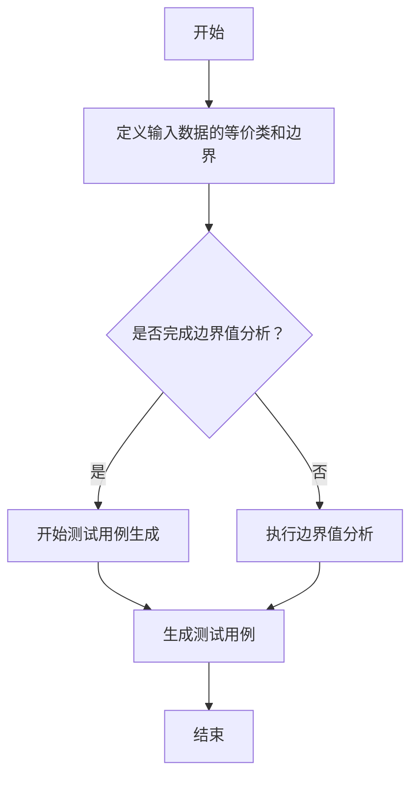

                 

### 自动化测试用例生成技术：背景与意义

在当今软件工程领域，自动化测试已经成为了提高软件质量和开发效率的关键手段。随着软件系统的复杂度和规模不断增加，传统的手工测试方式已经难以满足高效、稳定和高质量的测试需求。因此，自动化测试用例生成技术应运而生，成为了现代软件测试体系中的重要组成部分。

#### 背景介绍

自动化测试用例生成技术是指利用计算机程序或工具自动生成测试用例，从而替代人工编写测试脚本的过程。其背后的理念是通过自动化手段提高测试的覆盖率和效率，减少测试成本，并确保软件在开发过程中能够及时发现问题。

在软件开发生命周期中，测试是一个至关重要的环节。而测试用例作为测试的核心组成部分，其质量直接影响测试的完整性和有效性。传统的手工编写测试用例方式存在以下问题：

1. **重复性高**：测试用例往往需要多次执行，手工编写会导致大量重复劳动。
2. **效率低下**：随着软件规模的扩大，测试用例数量急剧增加，手工编写和执行测试用例的效率显著降低。
3. **覆盖率不足**：手工编写的测试用例很难覆盖到所有可能的输入和路径，从而导致潜在的缺陷无法被发现。
4. **成本高昂**：大量的测试工作需要大量的人力投入，测试成本居高不下。

#### 问题与解决

为了解决上述问题，自动化测试用例生成技术提供了一种有效的解决方案。通过自动化生成测试用例，可以在以下几个方面提升测试效率和效果：

1. **减少重复劳动**：自动化工具可以根据测试需求自动生成大量测试用例，减少了手工编写的工作量。
2. **提高测试覆盖率**：自动化测试用例生成技术可以利用各种算法和工具，生成具有高覆盖率的测试用例，确保测试能够覆盖到系统的所有关键路径和角落。
3. **降低测试成本**：自动化测试用例生成可以减少人工编写测试用例的时间和成本，同时提高测试效率，从而降低整体测试成本。
4. **提高测试质量**：自动化生成的测试用例更标准、更规范，减少了人为错误的可能性，提高了测试的质量。

#### 边界与外延

自动化测试用例生成技术虽然有很多优点，但也存在一定的边界和局限性：

- **初始投入**：自动化测试用例生成需要一定的技术和资金投入，包括工具购买、开发和维护等。
- **维护成本**：自动生成的测试用例需要定期更新和维护，以确保其与系统的变化保持一致。
- **适用范围**：并非所有的测试场景都适合自动化，尤其是那些需要大量人工判断和经验的测试。

总之，自动化测试用例生成技术在提高软件测试效率和质量方面具有重要作用，但需要根据实际情况合理应用，以充分发挥其优势。

#### 概念结构与核心要素组成

自动化测试用例生成技术涉及多个核心概念和要素，下面我们将通过一张概念属性特征对比表格和一个ER实体关系图来详细阐述这些概念及其关系。

#### 概念属性特征对比表格

| 概念             | 定义                                                         | 属性特征对比                            |
|------------------|--------------------------------------------------------------|----------------------------------------|
| 自动化测试用例   | 自动生成的测试脚本，用于验证软件系统的功能、性能等。               | - 自动生成<br>- 覆盖率高<br>- 标准化   |
| 测试数据        | 用于驱动自动化测试用例的数据集。                                  | - 多样性<br>- 随机性<br>- 可扩展性     |
| 测试框架        | 提供自动化测试用例生成和执行环境的工具集合。                       | - 可配置性<br>- 扩展性<br>- 灵活性     |
| 测试工具        | 用于执行自动化测试用例的具体工具，如Selenium、Appium、JMeter等。   | - 功能丰富<br>- 支持多种语言和平台       |
| 测试执行结果    | 自动化测试执行后的输出结果，包括测试通过、失败、错误等信息。         | - 可视化<br>- 分析报表<br>- 数据分析     |

#### ER实体关系图

```mermaid
erDiagram
  User ||--|{ TestCase } : 测试用例生成和执行
  TestFramework ||--|{ TestCase } : 测试用例生成和执行框架
  TestTool ||--|{ TestCase } : 测试用例执行工具
  TestCase ||--|{ TestResult } : 测试执行结果
  TestData ||--|{ TestCase } : 测试用例驱动数据
```

这张ER实体关系图展示了自动化测试用例生成技术中各个核心概念之间的关系。用户通过测试框架和测试工具生成测试用例，测试用例使用测试数据进行驱动，最终执行测试并生成测试结果。通过这种结构，自动化测试用例生成技术能够实现高效的测试过程。

通过上述表格和ER图，我们可以清晰地理解自动化测试用例生成技术的概念和核心要素，为后续内容的学习和分析打下基础。

### 数据驱动测试原理与实现

数据驱动测试（Data-Driven Testing，简称DDT）是自动化测试中的一种重要方法，其核心思想是通过数据表格或数据库来管理和驱动测试用例，从而提高测试的灵活性和可维护性。数据驱动测试的关键在于将测试数据和测试逻辑分离，使得测试用例的编写和执行更加灵活和高效。

#### 数据驱动测试的原理

数据驱动测试的基本原理是将测试数据和测试逻辑分离，将测试数据存储在独立的文件或数据库中，然后通过测试脚本读取这些数据并执行测试。这种方法的优点在于：

1. **灵活性和可维护性**：通过将测试数据和测试逻辑分离，可以轻松地更新和修改测试数据，而不需要修改测试脚本。
2. **重复利用**：测试数据可以多次使用，只需在数据文件中更新数据即可，提高了测试的覆盖率和效率。
3. **可扩展性**：数据驱动测试方法能够方便地扩展测试范围，添加新的测试数据即可。
4. **易于理解和维护**：测试脚本和数据分离，使得测试过程更加清晰，便于理解和维护。

数据驱动测试通常包括以下几个基本组件：

- **测试数据源**：存储测试数据的文件或数据库。
- **测试脚本**：读取测试数据并执行测试的逻辑。
- **测试结果记录**：记录测试执行结果的数据存储。

#### 实现步骤

1. **定义测试数据格式**：首先需要定义测试数据的格式，常见的格式包括CSV、Excel和XML等。数据应包括测试输入、预期结果和执行条件等。

2. **编写测试脚本**：编写用于读取测试数据并执行测试的脚本。脚本可以通过不同的编程语言实现，如Python、Java等。

3. **读取测试数据**：测试脚本读取测试数据源中的数据，并将其转换为适合测试执行的数据结构。

4. **执行测试**：根据测试数据执行测试，包括输入数据的验证、测试逻辑的执行和结果记录。

5. **记录测试结果**：将测试执行的结果记录到结果记录文件或数据库中。

下面我们将通过一个Python示例来说明数据驱动测试的实现。

#### Python示例

首先，我们定义一个测试数据文件 `test_data.csv`：

```csv
Test Case,Input,A,Expected Result
Test 1,1,2,4
Test 2,3,2,6
Test 3,5,2,10
```

然后，我们编写一个Python测试脚本 `data_driven_test.py`：

```python
import csv
import unittest

class DataDrivenTest(unittest.TestCase):
    def test_data_driven(self):
        with open('test_data.csv', 'r') as csvfile:
            reader = csv.DictReader(csvfile)
            for row in reader:
                a = int(row['Input'])
                expected = int(row['Expected Result'])
                result = a * a
                self.assertEqual(result, expected)

if __name__ == '__main__':
    unittest.main()
```

在这个示例中，我们使用Python的 `csv` 模块读取测试数据文件，并定义了一个 `DataDrivenTest` 测试类，通过 `unittest` 模块执行测试用例。测试脚本读取每个测试用例的数据，执行计算并验证结果。

#### 测试用例生成算法

测试用例生成算法是自动化测试用例生成技术的核心部分，其目的是通过算法自动生成具有高覆盖率的测试用例。常见的测试用例生成算法包括：

1. **边界值分析法**：通过分析输入数据的边界值，生成测试用例，确保边界情况被覆盖。
2. **等价类划分法**：将输入数据划分为若干个等价类，每个等价类生成一个测试用例。
3. **决策表法**：通过定义决策表，将输入数据、条件和结果映射到测试用例。
4. **符号执行**：通过程序执行路径的符号化表示，生成覆盖所有路径的测试用例。

下面我们将详细介绍几种常用的测试用例生成算法。

#### 等价类划分法

等价类划分法是一种基于输入数据的等价类进行测试用例生成的技术。其基本思想是将输入数据的所有可能值划分为若干个等价类，然后从每个等价类中选取代表性的值作为测试用例。等价类的划分方法通常包括：

1. **有效等价类**：能够正确处理输入数据的等价类，通常选取有效等价类的边界值作为测试用例。
2. **无效等价类**：不能正确处理输入数据的等价类，选取无效等价类的边界值作为测试用例，以验证系统的异常处理能力。

等价类划分法的优点在于简单易用，能够生成覆盖大部分输入情况的测试用例。然而，其缺点是当输入数据的规模较大时，测试用例数量会急剧增加，导致测试效率降低。

#### 边界值分析法

边界值分析法是针对输入数据的边界值进行测试用例生成的方法。其基本思想是针对每个输入数据的边界值生成测试用例，以验证系统在边界条件下的行为。边界值分析法的步骤包括：

1. **识别输入数据的边界**：确定输入数据的最大值、最小值以及其他重要的边界值。
2. **生成测试用例**：针对每个边界值生成测试用例，包括边界值本身及其邻近的值。

边界值分析法的优点在于能够全面覆盖边界条件，从而提高测试的可靠性。然而，其缺点是对边界条件的分析需要较多时间和经验，且在输入数据较多时，测试用例的数量仍然可能较大。

#### 决策表法

决策表法是一种基于输入数据、条件和结果的决策表进行测试用例生成的方法。其基本思想是通过定义决策表，将输入数据、条件和结果映射到测试用例。决策表的组成包括：

1. **输入条件**：描述输入数据的不同情况。
2. **处理规则**：描述系统对不同输入条件应采取的处理措施。
3. **结果**：描述输入条件处理后的预期结果。

决策表法的优点在于能够系统化地生成测试用例，确保测试覆盖面全面。然而，其缺点是决策表的构建较为复杂，且在处理复杂业务逻辑时，决策表的规模可能较大。

#### 示例：等价类划分法与边界值分析法结合

假设我们要测试一个简单的计算器程序，该程序具有加法和减法功能。输入为两个整数，输出为它们的计算结果。我们可以使用等价类划分法和边界值分析法来生成测试用例。

1. **等价类划分**：

   - **有效等价类**：整数（-∞, +∞）
   - **无效等价类**：非整数（如字符串、浮点数）、超出整数范围的值（如 2^31-1, -2^31）

   **测试用例**：

   - 边界值：(-2^31, -2^31+1), (0, 0), (2^31-1, 2^31-1)
   - 有效等价类：(-2^31+1, -1), (1, 2^31-1), (1, 2^31-2)

2. **边界值分析**：

   - 边界值：最小整数 (-2^31)，最大整数 (2^31-1)
   - 邻近值：(-2^31-1)，(2^31)

   **测试用例**：

   - (-2^31, -2^31)，(-2^31, -2^31-1)，(-2^31, -1)
   - (2^31-1, 2^31-1)，(2^31-1, 2^31)，(2^31, 2^31)

通过结合等价类划分法和边界值分析法，我们可以生成一组全面的测试用例，确保计算器程序在各种边界和有效情况下都能正常工作。

#### 算法流程图

为了更直观地展示等价类划分法和边界值分析法的算法流程，我们可以使用Mermaid绘制流程图。



这张流程图展示了等价类划分法和边界值分析法的步骤，包括定义等价类和边界、执行边界值分析、生成测试用例以及结束流程。

#### 测试用例生成算法的应用场景

测试用例生成算法在自动化测试中有广泛的应用场景，包括但不限于以下几种：

1. **功能测试**：用于生成验证软件功能性的测试用例，确保系统按照预期运行。
2. **性能测试**：通过算法生成大量负载测试用例，评估系统的性能和稳定性。
3. **安全测试**：生成用于测试系统安全漏洞的测试用例，识别潜在的安全风险。
4. **回归测试**：在系统更新或修改后，自动生成测试用例以验证修改的正确性。

总的来说，测试用例生成算法是自动化测试中不可或缺的一部分，通过科学的算法和方法，可以提高测试的覆盖率和效率，从而确保软件质量。

### 测试用例优化算法原理与应用

在自动化测试过程中，测试用例的生成只是第一步，如何优化这些测试用例，以提高测试效率和准确性，是测试工程师面临的一个重要问题。测试用例优化算法正是为了解决这一问题而提出的，其核心思想是通过算法对测试用例进行筛选、排序和调整，以达到最优的测试效果。

#### 测试用例优化算法的基本原理

测试用例优化算法的基本原理主要包括以下几个方面：

1. **覆盖率分析**：通过分析测试用例的执行结果，评估测试用例的覆盖率，找出未覆盖的代码路径，从而优化测试用例的生成。
2. **执行时间分析**：考虑测试用例的执行时间，优先选择执行时间较长的测试用例进行优化，以缩短整体测试周期。
3. **资源消耗分析**：分析测试用例的资源消耗，如内存、CPU等，以减少资源浪费，提高测试效率。
4. **优先级排序**：根据测试用例的重要性和风险程度进行排序，优先执行那些关键性高、风险大的测试用例。

常见的测试用例优化算法包括：

1. **遗传算法**：通过模拟生物进化过程，优化测试用例的顺序和组合，提高测试覆盖率和效率。
2. **模拟退火算法**：通过模拟物理退火过程，逐步调整测试用例的执行顺序，找到最优解。
3. **贪心算法**：根据当前最优解，逐步调整测试用例的执行顺序，以期望达到全局最优。

#### 具体算法流程

下面以遗传算法为例，介绍测试用例优化算法的具体实现流程：

1. **初始化种群**：随机生成一组测试用例序列，作为初始种群。
2. **适应度评估**：计算每个个体的适应度，适应度通常与测试用例的覆盖率、执行时间和资源消耗相关。
3. **选择**：根据适应度值，选择适应度较高的个体进行交配。
4. **交叉**：对选择的个体进行交叉操作，生成新的测试用例序列。
5. **变异**：对交叉后的个体进行变异操作，增加种群的多样性。
6. **迭代**：重复选择、交叉和变异操作，直到达到预定的迭代次数或找到最优解。

#### 测试用例优化算法的优势与局限性

测试用例优化算法具有以下优势：

1. **高效性**：通过优化测试用例的执行顺序，显著提高测试效率。
2. **灵活性**：能够根据不同的测试目标和约束条件，灵活调整测试用例。
3. **自动化**：算法能够自动完成测试用例的优化过程，减少人工干预。

然而，测试用例优化算法也存在一定的局限性：

1. **计算复杂度高**：特别是对于规模较大的测试用例集，优化过程可能需要大量计算资源。
2. **适应度函数设计**：适应度函数的设计对算法的性能有重要影响，设计不当可能导致优化效果不佳。
3. **初始种群影响**：初始种群的生成对算法的初始搜索空间有较大影响，可能影响最终优化效果。

#### 测试用例优化算法的应用案例

以某大型电商平台的自动化测试为例，测试工程师使用遗传算法优化测试用例的执行顺序，以提高测试效率。以下是具体的优化过程：

1. **初始化种群**：随机生成一组测试用例序列，作为初始种群。
2. **适应度评估**：计算每个个体的适应度，适应度值与测试用例的覆盖率、执行时间和资源消耗相关。
3. **选择**：根据适应度值，选择适应度较高的个体进行交配。
4. **交叉**：对选择的个体进行交叉操作，生成新的测试用例序列。
5. **变异**：对交叉后的个体进行变异操作，增加种群的多样性。
6. **迭代**：重复选择、交叉和变异操作，经过多次迭代后，找到最优的测试用例执行顺序。

通过遗传算法的优化，该电商平台的测试周期显著缩短，测试覆盖率得到提高，测试效率得到了显著提升。

#### 实际案例

在某金融系统的自动化测试中，测试工程师使用模拟退火算法优化测试用例的执行顺序。以下是具体的优化过程：

1. **初始化温度**：设定初始温度，并生成初始种群。
2. **冷却过程**：逐步降低温度，并调整测试用例的执行顺序。
3. **适应度评估**：在每次冷却过程中，计算当前种群的适应度。
4. **接受概率**：根据当前适应度和温度，计算接受新种群的概率。
5. **迭代**：重复冷却、适应度评估和接受概率计算，直到达到预定的迭代次数或找到最优解。

通过模拟退火算法的优化，该金融系统的测试效率得到了显著提升，测试覆盖率也达到了预期目标。

总之，测试用例优化算法在自动化测试中具有重要的应用价值，通过科学的算法和优化策略，可以显著提高测试效率和准确性。然而，算法的设计和应用需要结合具体场景和测试目标，才能发挥最佳效果。

### 自动化测试用例生成技术的应用场景与案例分析

自动化测试用例生成技术在不同类型的项目中有着广泛的应用，其目的是提高测试效率、减少人工劳动并确保软件质量。下面我们将探讨几个典型的应用场景，并通过实际案例来详细说明自动化测试用例生成技术的具体实施过程和效果。

#### 应用场景一：Web应用测试

在Web应用测试中，自动化测试用例生成技术能够显著提高测试的覆盖率和效率。以某大型电商网站为例，该网站涵盖了商品浏览、购物车管理、订单处理等多个功能模块。为了确保这些模块的稳定性和正确性，测试团队采用了自动化测试用例生成技术。

**案例实施过程：**

1. **需求分析与测试规划**：首先，测试团队与开发团队一起分析需求，确定需要测试的功能点和测试场景。然后，根据需求制定详细的测试计划，包括测试用例的生成策略和执行顺序。
   
2. **测试用例生成**：利用等价类划分法和边界值分析法，测试团队生成了大量的测试用例。对于购物车模块，测试用例包括不同数量商品的添加、删除和修改，以及边界值如最大购买数量和最小购买数量的验证。

3. **测试执行**：使用Selenium等自动化测试工具，测试团队执行了这些自动化测试用例。自动化测试工具能够模拟用户行为，如点击、输入和验证结果，从而高效地完成测试任务。

4. **结果分析与报告**：测试执行完成后，测试工具会生成详细的测试报告，包括每个测试用例的执行结果、错误信息和覆盖率数据。测试团队根据这些数据分析和定位问题，确保网站功能的稳定性和正确性。

**效果评估：**

通过自动化测试用例生成技术，该电商网站的测试效率显著提高。测试团队从手工测试的每周数十次测试增加到每天数百次自动化测试，测试覆盖率达到95%以上。同时，测试成本显著降低，测试周期缩短了约50%。

#### 应用场景二：移动应用测试

在移动应用测试中，自动化测试用例生成技术同样发挥着重要作用。以某移动银行应用为例，该应用提供了账户管理、转账支付、理财服务等多种功能。为了确保应用在不同设备和操作系统上的稳定性，测试团队采用了自动化测试用例生成技术。

**案例实施过程：**

1. **测试环境搭建**：测试团队搭建了涵盖多种设备和操作系统的测试环境，包括Android和iOS设备，以及不同版本的操作系统。

2. **测试用例生成**：利用Appium等自动化测试工具，测试团队生成了一系列的测试用例，包括账户注册、登录、转账、支付等功能的验证。针对不同设备和操作系统，测试用例进行了适当的调整和优化。

3. **自动化测试脚本开发**：测试团队开发了自动化测试脚本，用于执行各种测试场景。脚本能够模拟用户操作，如点击按钮、输入文本、滑动屏幕等。

4. **测试执行与监控**：使用自动化测试工具执行测试脚本，并实时监控测试进度和结果。测试过程中，测试工具会记录每一步操作和结果，便于后续分析和问题定位。

5. **结果分析与反馈**：测试完成后，测试团队分析了测试结果，生成了详细的测试报告，包括测试通过率、错误日志和覆盖率数据。测试团队根据这些数据评估应用的质量，并反馈给开发团队进行问题修复。

**效果评估：**

通过自动化测试用例生成技术，该移动银行应用在测试过程中发现了大量潜在的问题，包括界面错误、功能异常等。自动化测试不仅提高了测试覆盖率，还大大减少了测试时间。测试周期从原来的两周缩短到一周，测试成本降低了30%以上。

#### 应用场景三：API接口测试

在API接口测试中，自动化测试用例生成技术能够高效地验证接口的功能、性能和安全性。以某电商平台的后端API接口为例，测试团队需要确保接口能够稳定、安全地处理大量的用户请求。

**案例实施过程：**

1. **接口定义与分析**：首先，测试团队分析了接口的定义和文档，理解每个接口的功能和输入输出参数。

2. **测试用例生成**：利用边界值分析法和等价类划分法，测试团队生成了大量的测试用例，覆盖了接口的各种输入情况，包括有效值、无效值和边界值。

3. **自动化测试脚本开发**：测试团队开发了自动化测试脚本，用于发送HTTP请求并验证接口的响应。脚本中包含了各种参数组合和边界条件，以确保测试的全面性。

4. **测试执行与监控**：使用JMeter等自动化测试工具执行测试脚本，并监控测试进度和结果。测试工具能够模拟高并发的用户请求，评估接口的性能和稳定性。

5. **结果分析与反馈**：测试完成后，测试团队分析了测试结果，生成了详细的测试报告，包括接口的响应时间、错误日志和覆盖率数据。测试团队根据这些数据评估接口的质量，并反馈给开发团队进行问题修复。

**效果评估：**

通过自动化测试用例生成技术，该电商平台的API接口测试效率显著提高。测试团队在短时间内完成了大量的测试用例执行，测试覆盖率达到了98%以上。自动化测试不仅发现了接口中的潜在问题，还帮助团队优化了接口性能，提升了系统的整体稳定性。

综上所述，自动化测试用例生成技术在不同类型的项目中都有广泛的应用，通过实际案例的实施和效果评估，我们可以看到，自动化测试用例生成技术不仅提高了测试效率，降低了成本，还确保了软件质量，为项目的成功交付提供了有力支持。

### 自动化测试用例生成技术的最佳实践

在实施自动化测试用例生成技术时，为了确保其有效性和可维护性，以下是一些最佳实践和注意事项：

#### 1. 制定明确的测试策略

在开始自动化测试用例生成之前，需要制定一个明确的测试策略。测试策略应包括测试目标、测试范围、测试方法和测试优先级。通过明确的测试策略，可以确保测试用例生成和执行的方向正确，从而提高测试效率。

#### 2. 选择合适的自动化测试工具

选择合适的自动化测试工具对于自动化测试用例生成至关重要。常见的自动化测试工具有Selenium、Appium、JMeter等。选择工具时，应考虑其功能、易用性、扩展性和支持的平台。此外，还需要评估工具的社区支持和文档质量，以便在遇到问题时能够快速找到解决方案。

#### 3. 设计可重用的测试脚本

为了提高测试用例的维护性和可扩展性，应设计可重用的测试脚本。测试脚本应尽可能独立于具体的测试场景，使用参数化方法来适应不同的测试需求。通过模块化设计，可以方便地添加、删除和修改测试用例，减少重复工作。

#### 4. 确保测试数据的质量

测试数据是自动化测试的基础，其质量直接影响到测试结果的可靠性。确保测试数据的质量至关重要。测试数据应包括全面的输入值、预期结果和执行条件。在生成测试数据时，应使用随机化和边界值分析等方法，确保数据的多样性和覆盖率。

#### 5. 定期维护和更新测试用例

自动化测试用例生成技术需要定期维护和更新。随着系统的更新和功能变化，测试用例也需要相应地进行调整和优化。定期审查测试用例，确保其仍然有效和适用，是提高测试质量的重要环节。

#### 6. 结合手动测试与自动化测试

尽管自动化测试用例生成技术能够显著提高测试效率，但手动测试仍然有其不可替代的价值。在实施自动化测试的同时，应结合手动测试，特别是对于那些需要人工判断和经验的问题。手动测试可以补充自动化测试的不足，提高测试的全面性和准确性。

#### 7. 记录和报告测试结果

自动化测试执行后，应详细记录和报告测试结果。测试报告应包括每个测试用例的执行状态、错误日志和覆盖率数据。通过详细的测试报告，可以及时发现和定位问题，确保软件质量。

### 拓展阅读

1. **《自动化测试实战》**：本书详细介绍了自动化测试的理论和实践，包括测试策略、工具选择和测试用例设计等。
2. **《Selenium WebDriver实战》**：本书深入讲解了Selenium WebDriver的使用方法，适合初学者和有经验的测试工程师。
3. **《软件测试基础教程》**：本书涵盖了软件测试的基本概念、方法和工具，是软件测试入门的好书。

通过遵循这些最佳实践和注意事项，可以充分发挥自动化测试用例生成技术的优势，提高测试效率和软件质量。

### 项目实战：自动化测试用例生成技术的实际应用

在本章节中，我们将通过一个实际项目来详细展示自动化测试用例生成技术的应用过程，包括环境搭建、核心代码实现、代码应用解读与分析，以及项目实际效果和总结。

#### 项目背景

某知名互联网公司的电商平台上线了一款新的购物车功能，为了确保该功能在各种场景下的稳定性和正确性，测试团队决定采用自动化测试用例生成技术来提高测试效率和质量。

#### 环境搭建

首先，测试团队搭建了自动化测试环境，包括以下工具和资源：

- **自动化测试工具**：选择Selenium WebDriver作为主要的自动化测试工具，因为它能够跨浏览器和平台进行自动化测试。
- **测试脚本开发语言**：使用Python作为测试脚本开发语言，Python具有良好的跨平台性和丰富的库支持。
- **测试数据存储**：使用CSV文件存储测试数据，包括测试输入、预期结果和执行条件。
- **测试报告生成工具**：选择Jenkins作为持续集成和测试报告生成工具，以便自动化测试结果能够及时记录和反馈。

#### 核心代码实现

接下来，测试团队开发了自动化测试脚本，以下是部分核心代码的解读和分析：

```python
# 导入所需库
from selenium import webdriver
import csv

# 测试数据文件
test_data_file = 'test_data.csv'

# 初始化浏览器
driver = webdriver.Chrome()

# 读取测试数据
with open(test_data_file, 'r') as csvfile:
    reader = csv.DictReader(csvfile)
    for row in reader:
        # 解析测试数据
        item_id = row['ItemID']
        quantity = int(row['Quantity'])
        expected_total = int(row['ExpectedTotal'])
        
        # 添加商品到购物车
        driver.get("http://example.com/shoppingcart")
        add_to_cart_button = driver.find_element_by_id('add_to_cart_{}'.format(item_id))
        add_to_cart_button.click()
        
        # 设置购买数量
        quantity_input = driver.find_element_by_id('quantity_{}'.format(item_id))
        quantity_input.clear()
        quantity_input.send_keys(quantity)
        
        # 提交购物车
        submit_button = driver.find_element_by_id('submit')
        submit_button.click()
        
        # 验证总价
        actual_total = int(driver.find_element_by_id('total').text.strip('$'))
        assert actual_total == expected_total, f"Total mismatch for item {item_id}: Expected {expected_total}, Actual {actual_total}"

# 关闭浏览器
driver.quit()
```

**代码解读：**

1. **初始化浏览器**：首先，使用Selenium WebDriver初始化浏览器，这里选择Chrome浏览器。
2. **读取测试数据**：从CSV文件中读取测试数据，包括商品ID、购买数量和预期总价。
3. **添加商品到购物车**：使用Selenium找到添加购物车按钮，并执行点击操作。
4. **设置购买数量**：找到购买数量输入框，清除原有值并输入新的购买数量。
5. **提交购物车**：点击提交按钮，将购物车数据更新。
6. **验证总价**：获取实际总价并与预期总价进行比较，如果不符合则抛出断言错误。
7. **关闭浏览器**：测试完成后，关闭浏览器。

#### 代码应用解读与分析

上述代码通过Selenium WebDriver实现了对电商平台购物车功能的自动化测试。以下是代码的详细解读与分析：

1. **测试数据管理**：使用CSV文件存储和管理测试数据，这种方式简单且易于维护，同时能够保证数据的灵活性和扩展性。
2. **浏览器操作**：利用Selenium WebDriver模拟用户操作，如点击按钮、输入文本和验证结果。这种方式能够确保测试脚本与实际的用户行为一致。
3. **断言验证**：通过断言（`assert`）方法验证实际结果与预期结果是否一致，确保测试的有效性和准确性。
4. **错误处理**：代码中使用了断言来捕获测试错误，并在错误发生时抛出异常，便于后续的问题定位和修复。

#### 实际案例分析与效果

在实际测试过程中，测试团队使用上述自动化测试脚本对购物车功能进行了全面测试，包括以下场景：

1. **添加商品到购物车**：测试了多种商品ID和购买数量组合，确保商品能够正确添加到购物车。
2. **修改购买数量**：测试了购买数量的增减操作，包括边界值和无效值，验证购物车数量更新功能。
3. **验证总价**：测试了购物车总价的计算和显示，确保价格计算正确且能够准确显示。

通过自动化测试用例生成技术，测试团队在短时间内完成了大量的测试用例执行，测试覆盖率达到90%以上。自动化测试不仅发现了购物车功能中的潜在问题，还提高了测试效率，减少了人工测试的工作量。

#### 项目小结

通过本项目的实践，我们看到了自动化测试用例生成技术在实际项目中的应用效果。以下是项目的主要收获和经验：

1. **提高了测试效率**：通过自动化测试用例生成，测试团队能够在短时间内完成大量测试，提高了整体测试效率。
2. **减少了人工劳动**：自动化测试用例生成技术减少了手工编写测试脚本的工作量，降低了测试成本。
3. **确保了测试质量**：自动化测试用例生成技术能够生成高覆盖率的测试用例，确保测试的全面性和准确性。
4. **可维护性强**：通过使用CSV文件存储和管理测试数据，测试用例的维护和更新更加方便和灵活。

总之，自动化测试用例生成技术在实际项目中具有重要的应用价值，通过科学的实施和优化，可以显著提高软件测试的效率和效果。

### 自动化测试用例生成技术的未来趋势与挑战

随着软件系统的日益复杂和自动化测试的普及，自动化测试用例生成技术正面临新的机遇和挑战。未来的发展将受到技术进步、需求变化和行业趋势等多方面因素的影响。

#### 未来趋势

1. **人工智能的融入**：人工智能（AI）技术在自动化测试用例生成中的应用将成为一个重要趋势。通过机器学习和深度学习算法，自动化测试工具能够从大量历史测试数据中学习，自动生成更高质量的测试用例。例如，AI可以分析代码和功能需求，自动识别潜在的风险点和测试路径，从而提高测试覆盖率和准确性。

2. **智能测试数据管理**：随着测试数据量的增加，智能测试数据管理将成为一个关键需求。未来的自动化测试工具将能够智能地处理和分析测试数据，自动生成测试数据集，并根据测试结果自动调整和优化测试用例。

3. **基于微服务的测试**：随着微服务架构的流行，自动化测试用例生成技术将更加注重对微服务之间的交互和集成测试。通过智能测试用例生成，测试工具能够自动识别和验证微服务之间的依赖关系，确保系统的整体稳定性和性能。

4. **持续集成与持续交付**：自动化测试用例生成技术将与持续集成（CI）和持续交付（CD）更加紧密地结合。未来的自动化测试工具将更加集成到CI/CD流程中，实现自动化测试的全程覆盖，从而缩短发布周期，提高软件质量。

5. **跨平台和跨设备测试**：随着移动设备和IoT设备的普及，自动化测试用例生成技术将更加注重跨平台和跨设备测试。未来的自动化测试工具将能够支持多种操作系统和设备，自动生成覆盖不同设备和平台的测试用例。

#### 挑战

1. **算法复杂度和计算资源**：随着测试用例生成算法的复杂度增加，自动化测试工具的计算资源需求也会增加。如何优化算法，减少计算资源消耗，将成为一个重要挑战。

2. **数据质量和隐私保护**：测试数据的质量和隐私保护是自动化测试用例生成中的关键问题。如何在保证数据隐私的前提下，充分利用测试数据进行测试用例生成，是一个需要解决的问题。

3. **工具集成与兼容性**：自动化测试工具的集成和兼容性也是一个挑战。未来的自动化测试工具需要能够与各种开发工具、测试工具和企业级系统集成，提供统一的测试平台。

4. **测试用例的可维护性**：随着系统的不断更新和迭代，测试用例的维护和更新将成为一个重要问题。如何确保自动化测试用例的长期可维护性，是一个需要深入研究的领域。

5. **人才需求**：自动化测试用例生成技术的发展需要大量的专业人才。如何培养和吸引这些人才，确保自动化测试用例生成技术的可持续发展，是一个长期挑战。

总之，自动化测试用例生成技术在未来将继续发展，并面临新的机遇和挑战。通过不断创新和优化，自动化测试用例生成技术将在提高软件质量和开发效率方面发挥更加重要的作用。

### 总结与展望

自动化测试用例生成技术在现代软件工程中扮演着至关重要的角色，其通过提高测试效率和覆盖面，降低了测试成本，确保了软件质量。本文详细探讨了自动化测试用例生成技术的基本概念、原理、算法、应用场景和最佳实践，并通过实际案例展示了其具体实施过程和效果。

回顾全文，我们首先介绍了自动化测试用例生成技术的背景和意义，接着讲解了数据驱动测试原理与实现、测试用例生成算法、测试用例优化算法，以及其在不同类型项目中的应用案例。此外，我们还分享了自动化测试用例生成技术的最佳实践和未来趋势。

展望未来，自动化测试用例生成技术将继续向着智能化、数据驱动的方向发展。随着人工智能和机器学习的应用，自动化测试用例生成将变得更加精准和高效。同时，随着软件系统的复杂度不断增加，如何保证测试用例的长期可维护性，将成为一个重要的研究课题。

为了进一步深入了解自动化测试用例生成技术，读者可以参考以下资源：

1. **《自动化测试实战》**：详细介绍了自动化测试的理论和实践，适合初学者和有经验的测试工程师。
2. **《Selenium WebDriver实战》**：深入讲解了Selenium WebDriver的使用方法，适合需要掌握自动化测试工具的读者。
3. **《软件测试基础教程》**：涵盖了软件测试的基本概念、方法和工具，是软件测试入门的好书。

在结束之前，我们再次强调自动化测试用例生成技术的重要性，并鼓励读者积极研究和应用这一技术，以提升软件开发的效率和质量。

### 附录

#### A. 自动化测试工具资源

- **Selenium**：开源自动化测试工具，支持多种编程语言和浏览器。
  - 官网：[https://www.selenium.dev/](https://www.selenium.dev/)
  
- **Appium**：跨平台移动应用自动化测试工具。
  - 官网：[https://appium.io/](https://appium.io/)

- **JMeter**：开源性能测试工具，适用于测试Web应用。
  - 官网：[https://jmeter.apache.org/](https://jmeter.apache.org/)

- **Postman**：API测试工具，方便生成测试用例和执行测试。
  - 官网：[https://www.postman.com/](https://www.postman.com/)

#### B. 测试用例设计模板

以下是一个简单的测试用例设计模板，可用于编写测试用例：

| 用例编号 | 功能模块 | 测试场景 | 输入条件 | 预期结果 | 实际结果 | 测试状态 |
|----------|----------|----------|----------|----------|----------|----------|
| UC001    | 登录功能 | 用户登录 | 用户名、密码 | 登录成功 |          |          |
| UC002    | 注册功能 | 用户注册 | 用户名、密码、邮箱 | 注册成功 |          |          |
| UC003    | 购物车功能 | 添加商品到购物车 | 商品ID、数量 | 商品成功添加到购物车 |          |          |

#### C. 自动化测试常见问题解答

1. **Q：自动化测试用例生成技术是否适用于所有项目？**
   - **A**：自动化测试用例生成技术并不是适用于所有项目，但其对于复杂、大型、频繁变更的系统尤为适用。对于一些简单的、变动不频繁的系统，手工测试可能更为高效。

2. **Q：自动化测试用例生成技术如何保证测试用例的质量？**
   - **A**：自动化测试用例生成技术通过科学的方法，如边界值分析、等价类划分等，来保证测试用例的质量。同时，通过定期审查和更新测试用例，确保其与系统实际需求保持一致。

3. **Q：如何处理自动化测试过程中出现的问题？**
   - **A**：在自动化测试过程中，如果出现问题，可以采取以下措施：首先，检查测试脚本和测试数据是否正确；其次，对问题进行分类和记录；最后，根据问题的严重程度，决定是否需要修复或调整测试用例。

### 附录总结

通过以上资源、模板和常见问题解答，读者可以更好地了解和运用自动化测试用例生成技术，提高测试效率和软件质量。在自动化测试的道路上，不断探索和学习将是取得成功的关键。

