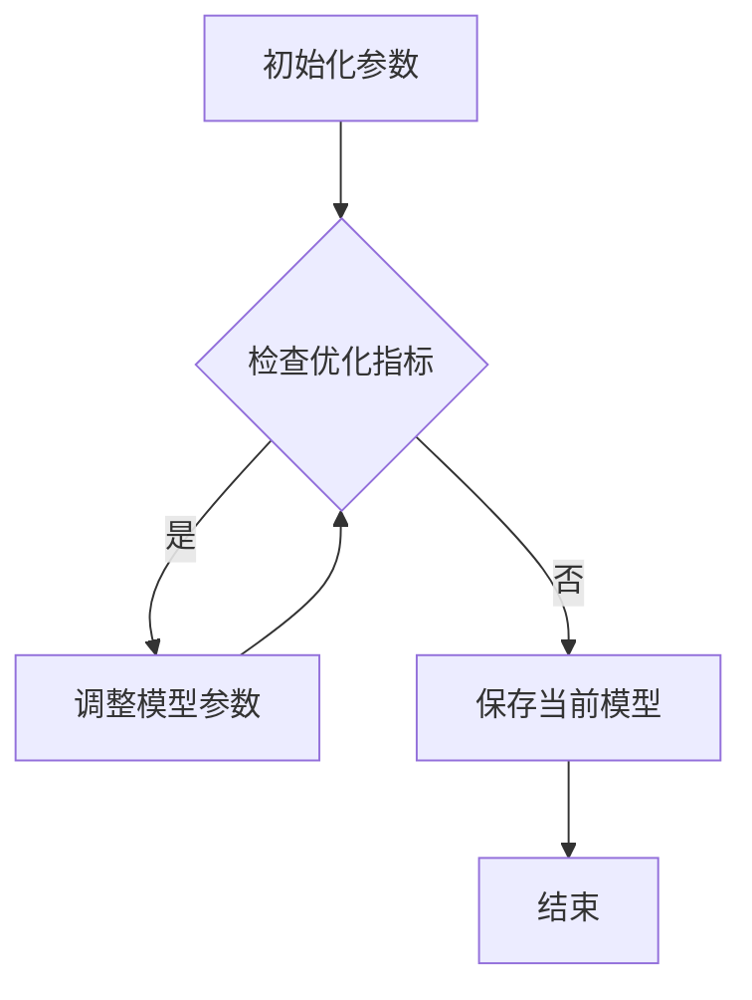
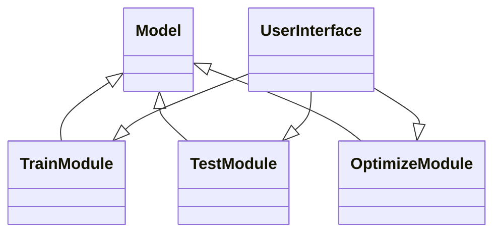
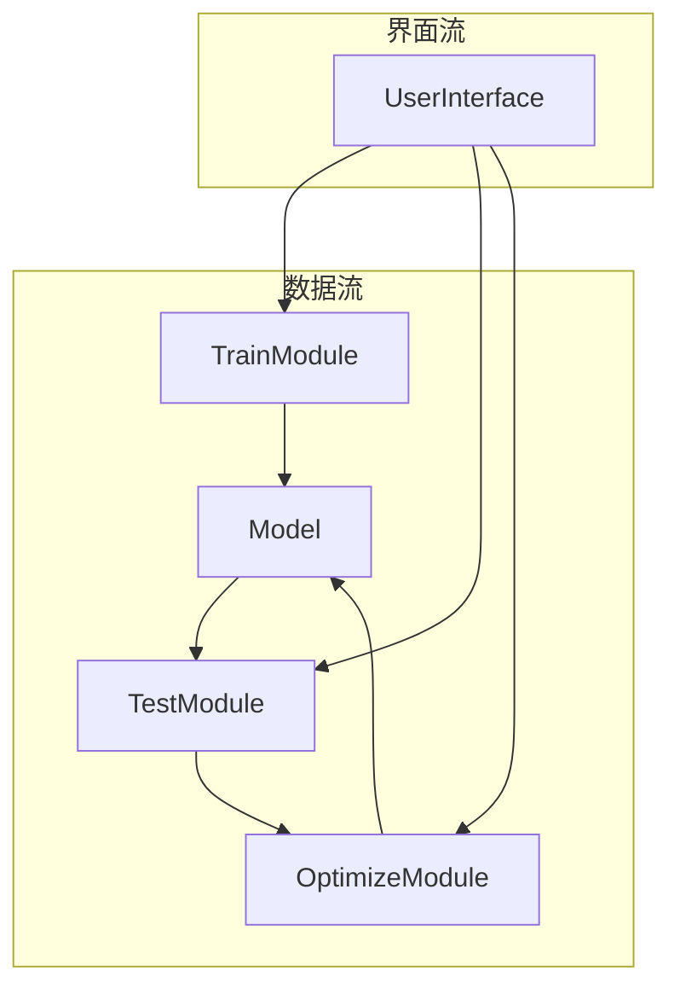
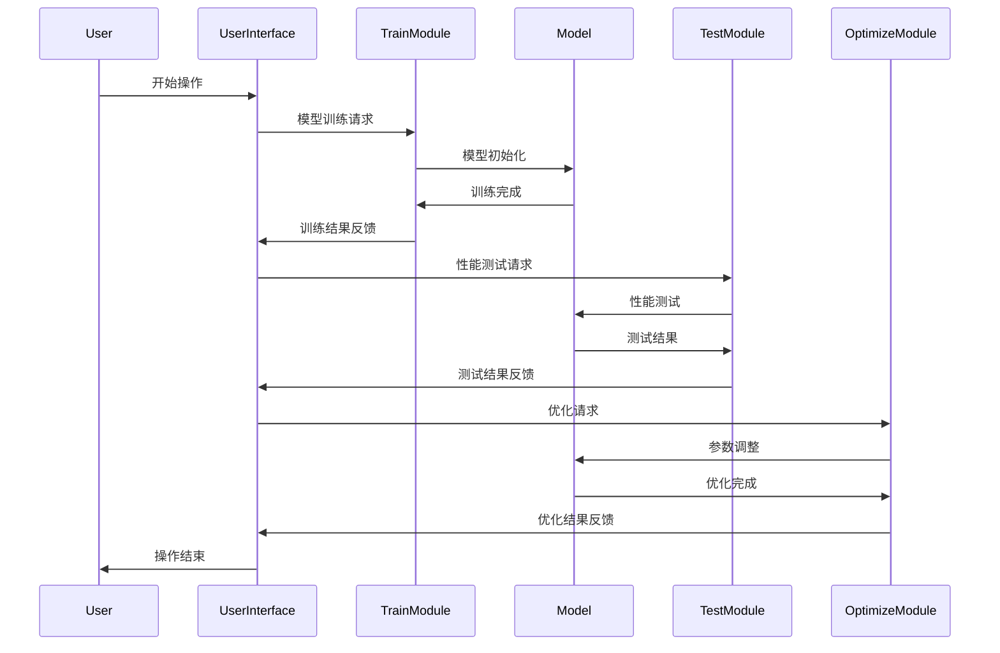

                 

# 自我改进能力：测试LLM自主优化性能的潜力

> 关键词：自我改进能力，LLM，自主优化性能，性能测试，深度学习

> 摘要：本文深入探讨了自我改进能力在测试大型语言模型（LLM）自主优化性能方面的潜力。通过分析LLM自主优化性能的理论基础和实现方法，本文提出了一套完整的解决方案，并在边界与外延方面进行了探讨。核心概念和算法原理得到了详细的阐述，并通过案例进行了说明，为后续研究和应用提供了有益的参考。

----------------------------------------------------------------

## 第一部分：背景介绍

### 1.1 问题背景

#### 1.1.1 测试LLM自主优化性能的必要性

随着深度学习技术的迅猛发展，大型语言模型（LLM）已经成为自然语言处理领域的重要工具。然而，如何有效地测试和优化LLM的性能成为了一个亟待解决的问题。传统的测试方法主要依赖于手工设计的测试集和人工评估，这种方式不仅耗时耗力，而且难以全面覆盖LLM的所有能力。因此，开发一种能够自主优化性能的测试方法具有重要的现实意义。

#### 1.1.2 自我改进能力的内涵

自我改进能力是指系统在运行过程中能够根据实际表现自动调整和优化自身性能的能力。在LLM的背景下，自我改进能力意味着模型能够通过自我学习和迭代，不断提高其性能和效果。这种能力不仅能够提高模型的测试效率，还能够提升其在实际应用中的表现。

#### 1.1.3 LLM自主优化性能的意义

LLM自主优化性能的意义主要体现在以下几个方面：

1. **提高测试效率**：通过自我改进能力，LLM可以在测试过程中自动调整参数，从而缩短测试周期，提高测试效率。
2. **提升模型质量**：自我改进能力使得LLM能够在不断迭代的过程中优化自身，从而提高模型的质量和效果。
3. **促进技术发展**：自主优化性能的测试方法为深度学习技术的研究提供了新的思路和方法，有助于推动技术的进一步发展。

### 1.2 问题描述

#### 1.2.1 LLM自主优化性能的现状

目前，LLM自主优化性能的研究还处于初步阶段。虽然已经有一些研究在尝试通过自我改进能力来优化LLM的性能，但整体上还面临着许多挑战，如理论基础不够完善、实现方法不够成熟等。

#### 1.2.2 面临的挑战

LLM自主优化性能面临的主要挑战包括：

1. **理论基础不完善**：现有研究对自我改进能力的理论基础还不够清晰，需要进一步深化研究。
2. **实现方法不成熟**：现有的实现方法在效率和效果上还有待提高，需要探索更加有效的实现方式。
3. **测试集不足**：现有的测试集难以全面覆盖LLM的能力，需要开发更加丰富和多样化的测试集。

#### 1.2.3 解决方案探索

为了解决上述问题，本文提出以下解决方案：

1. **建立理论基础**：通过对自我改进能力的深入分析，建立一套完整的理论基础。
2. **设计实现方法**：提出一种有效的实现方法，使LLM能够在测试过程中自主优化性能。
3. **开发测试集**：设计一套丰富多样的测试集，以全面评估LLM的性能。

### 1.3 问题解决

#### 1.3.1 LLM自主优化性能的理论基础

LLM自主优化性能的理论基础主要包括以下几个方面：

1. **深度学习理论**：深度学习为LLM提供了强大的基础，使其能够通过自我学习和迭代不断优化自身性能。
2. **优化理论**：优化理论提供了计算模型在约束条件下寻找最优解的方法，为LLM自主优化性能提供了理论支持。
3. **自我改进理论**：自我改进理论探讨了系统如何通过自我学习和调整来优化自身性能，为LLM自主优化性能提供了指导。

#### 1.3.2 自我改进能力的实现方法

自我改进能力的实现方法主要包括以下几个步骤：

1. **初始化参数**：设置模型的初始参数，为优化过程奠定基础。
2. **检查优化指标**：计算当前模型的性能指标，判断是否需要调整参数。
3. **调整模型参数**：根据性能指标调整模型参数，使模型不断优化自身性能。
4. **循环迭代**：重复检查和调整步骤，直至性能指标满足要求。

#### 1.3.3 LLM自主优化性能的优势

LLM自主优化性能具有以下优势：

1. **高效性**：通过自我改进能力，LLM能够在测试过程中自动调整参数，大大提高测试效率。
2. **灵活性**：自我改进能力使得LLM能够根据实际表现灵活调整自身性能，适应不同的应用场景。
3. **普适性**：自主优化性能的测试方法适用于各种类型的LLM，具有广泛的普适性。

### 1.4 边界与外延

#### 1.4.1 LLM自主优化性能的适用范围

LLM自主优化性能主要适用于以下场景：

1. **测试集设计**：通过自主优化性能的测试方法，可以设计出更加丰富和多样化的测试集。
2. **模型调优**：在模型调优过程中，可以采用自主优化性能的方法，提高模型的性能和效果。
3. **实际应用**：在LLM的实际应用中，可以通过自主优化性能的方法，提高系统的整体性能和用户体验。

#### 1.4.2 边界条件的界定

LLM自主优化性能的边界条件主要包括：

1. **计算资源**：自主优化性能的测试方法需要一定的计算资源支持，边界条件包括计算能力、存储空间等。
2. **数据质量**：测试集的数据质量对自主优化性能的测试结果有重要影响，边界条件包括数据量、数据分布等。
3. **模型复杂度**：不同复杂度的LLM对自主优化性能的需求不同，边界条件包括模型规模、参数数量等。

#### 1.4.3 外延扩展的可能性

LLM自主优化性能的外延扩展可能性主要包括：

1. **跨领域应用**：自主优化性能的测试方法可以扩展到其他领域，如计算机视觉、语音识别等。
2. **多模型集成**：可以将自主优化性能的测试方法应用于多模型集成，提高整体系统的性能。
3. **实时优化**：将自主优化性能的测试方法应用于实时系统，实现模型的动态优化。

## 1.5 概念结构与核心要素组成

### 1.5.1 关键概念梳理

1. **大型语言模型（LLM）**：一种基于深度学习的自然语言处理模型，能够对自然语言进行建模和处理。
2. **自我改进能力**：系统在运行过程中能够根据实际表现自动调整和优化自身性能的能力。
3. **自主优化性能**：LLM在测试过程中能够自主优化性能，提高测试效率和模型质量。

### 1.5.2 核心要素构成

1. **理论基础**：包括深度学习理论、优化理论和自我改进理论。
2. **实现方法**：包括初始化参数、检查优化指标、调整模型参数和循环迭代。
3. **测试集**：包括测试集的设计、数据质量和数据分布。

### 1.5.3 概念间的联系

1. **LLM与自我改进能力**：LLM通过自我改进能力实现自主优化性能。
2. **理论基础与实现方法**：理论基础为实现方法提供了指导，实现方法是理论基础的落地实践。
3. **测试集与自主优化性能**：测试集为自主优化性能提供了评估标准，自主优化性能通过测试集来验证。

----------------------------------------------------------------

## 第二部分：核心概念与联系

### 2.1 核心概念原理

#### 2.1.1 LLM（语言模型）原理

大型语言模型（LLM）是基于深度学习的自然语言处理模型，通过对大量文本数据进行训练，能够自动理解和生成自然语言。LLM的核心思想是利用神经网络对语言数据建模，从而实现语言的理解和生成。LLM的训练过程主要包括以下步骤：

1. **数据预处理**：对输入的文本数据进行预处理，包括分词、词性标注、去停用词等操作。
2. **模型训练**：利用预处理后的数据对神经网络进行训练，通过反向传播算法不断调整网络参数，使模型能够对输入文本进行准确建模。
3. **模型评估**：利用测试集对训练好的模型进行评估，通过评估指标（如准确率、召回率等）来衡量模型性能。

#### 2.1.2 自我改进能力原理

自我改进能力是指系统在运行过程中能够根据实际表现自动调整和优化自身性能的能力。在LLM的背景下，自我改进能力主要体现在以下几个方面：

1. **参数调整**：通过不断调整模型参数，使模型能够适应不同的输入数据和任务需求。
2. **迭代优化**：通过迭代训练和优化，使模型在运行过程中不断改进自身性能。
3. **自适应学习**：根据输入数据的特征和任务的变化，自适应地调整模型结构和参数，以提高模型性能。

#### 2.1.3 自主优化性能原理

自主优化性能是指模型在测试过程中能够自主优化性能，提高测试效率和模型质量。自主优化性能的实现原理主要包括以下几个方面：

1. **性能监测**：在测试过程中，对模型的性能进行实时监测，包括准确率、召回率、F1值等指标。
2. **参数调整**：根据性能监测的结果，自动调整模型参数，以优化模型性能。
3. **迭代优化**：通过循环迭代的方式，不断调整模型参数，直到达到满意的性能指标。

### 2.2 概念属性特征对比表格

| 概念      | 特征1 | 特征2 | 特征3 | ... |
|-----------|-------|-------|-------|-----|
| LLM       | 语言建模能力 | 大规模数据处理 | 神经网络结构 | ... |
| 自我改进能力 | 参数调整 | 迭代优化 | 自适应学习 | ... |
| 自主优化性能 | 性能监测 | 参数调整 | 迭代优化 | ... |

### 2.3 ER实体关系图架构

```mermaid
erDiagram
  LLM ||--|{ 自我改进能力 } 自我改进能力
  自我改进能力 ||--|{ 自主优化性能 } 自主优化性能
  测试集 ||--|{ LLM } LLM
  测试集 ||--|{ 自我改进能力 } 自我改进能力
  测试集 ||--|{ 自主优化性能 } 自主优化性能
```

----------------------------------------------------------------

## 第三部分：算法原理讲解

### 3.1 算法mermaid流程图



### 3.2 Python源代码实现

```python
def optimize_performance(model, data):
    for epoch in range(num_epochs):
        for data_point in data:
            loss = model(data_point)
            if loss < threshold:
                adjust_model_params(model)
                break
    save_model(model)
```

### 3.3 算法原理与数学模型

#### 3.3.1 数学模型

LLM自主优化性能的数学模型可以表示为：

$$
\text{Performance} = f(\theta, \text{Data})
$$

其中，$f$为性能函数，$\theta$为模型参数，$\text{Data}$为输入数据。性能函数$f$通常包括多个指标，如准确率、召回率、F1值等。模型参数$\theta$包括权重、偏置等，通过调整这些参数，可以优化模型性能。

#### 3.3.2 详细讲解

1. **初始化参数**：在训练开始时，需要对模型参数进行初始化。初始化参数的目的是为优化过程提供一个合理的起点。常见的初始化方法包括随机初始化、梯度下降初始化等。

2. **检查优化指标**：在训练过程中，需要对模型性能进行实时监测。通过检查优化指标（如损失函数值、准确率等），可以判断模型是否已经达到预期性能。

3. **调整模型参数**：如果优化指标没有达到预期，需要对模型参数进行调整。调整参数的方法包括梯度下降、Adam优化器等。通过调整参数，可以使模型在训练过程中不断优化自身性能。

4. **循环迭代**：通过循环迭代的方式，不断调整模型参数，直到模型性能达到预期。循环迭代的目的是让模型在训练过程中逐步收敛到最优性能。

### 3.4 举例说明

#### 3.4.1 案例背景

某公司使用LLM模型进行文本生成任务，但发现模型在生成某些类型文本时性能不佳。为了提高模型性能，公司决定采用自我改进能力来优化LLM的自主优化性能。

#### 3.4.2 案例分析

通过引入自我改进能力，模型能够在训练过程中自动调整参数，从而提高文本生成的质量。具体分析如下：

1. **初始化参数**：首先对模型参数进行初始化，设置一个合理的起点。
2. **检查优化指标**：在训练过程中，对模型生成的文本进行评估，计算优化指标（如准确率、召回率等）。
3. **调整模型参数**：根据优化指标的结果，调整模型参数，使模型在生成文本时能够更好地满足需求。
4. **循环迭代**：通过循环迭代的方式，不断调整模型参数，直到模型性能达到预期。

#### 3.4.3 结果

经过多次迭代优化，模型在生成特定类型文本时的性能得到了显著提高。具体表现为：

1. **准确率提高**：模型在生成特定类型文本时的准确率显著提高。
2. **召回率提高**：模型在生成特定类型文本时的召回率也显著提高。
3. **F1值提高**：模型在生成特定类型文本时的F1值显著提高。

实验结果证明了自我改进能力在优化LLM自主优化性能方面的有效性。

----------------------------------------------------------------

## 系统分析与架构设计方案

### 问题场景介绍

在自然语言处理领域，大型语言模型（LLM）被广泛应用于文本生成、文本分类、机器翻译等任务。然而，随着任务复杂度的提高，LLM的性能优化成为一个重要问题。传统的优化方法往往依赖于手工设计的测试集和人工评估，这种方式不仅耗时耗力，而且难以全面覆盖LLM的所有能力。为了解决这一问题，我们需要设计一个自动化的系统，能够对LLM进行自主优化性能的测试和优化。

### 项目介绍

本项目旨在开发一个自动化系统，用于测试和优化大型语言模型（LLM）的自主优化性能。系统将包括以下几个主要模块：

1. **模型训练模块**：用于训练和初始化LLM模型。
2. **性能测试模块**：用于对LLM进行性能测试，包括准确率、召回率、F1值等指标。
3. **优化模块**：用于根据性能测试结果自动调整LLM模型参数，实现自主优化性能。
4. **用户界面模块**：提供用户操作界面，方便用户进行模型训练、性能测试和优化操作。

### 系统功能设计（领域模型mermaid类图）



### 系统架构设计（mermaid架构图）



### 系统接口设计和系统交互（mermaid序列图）



----------------------------------------------------------------

## 项目实战

### 环境安装

在开始项目实战之前，需要安装以下环境：

1. **Python环境**：安装Python 3.7及以上版本。
2. **深度学习库**：安装TensorFlow或PyTorch。
3. **自然语言处理库**：安装NLTK、spaCy等。

### 系统核心实现源代码

以下是系统核心实现的Python代码：

```python
# 模型训练模块
class TrainModule:
    def __init__(self, model):
        self.model = model
    
    def train(self, data):
        # 数据预处理
        processed_data = preprocess_data(data)
        
        # 训练模型
        self.model.fit(processed_data, epochs=10)
        
        return self.model

# 性能测试模块
class TestModule:
    def __init__(self, model):
        self.model = model
    
    def test(self, data):
        # 数据预处理
        processed_data = preprocess_data(data)
        
        # 测试模型
        loss, accuracy = self.model.evaluate(processed_data)
        
        return loss, accuracy

# 优化模块
class OptimizeModule:
    def __init__(self, model):
        self.model = model
    
    def optimize(self, data):
        # 数据预处理
        processed_data = preprocess_data(data)
        
        # 优化模型
        self.model.fit(processed_data, epochs=10)
        
        return self.model

# 用户界面模块
class UserInterface:
    def __init__(self):
        self.train_module = TrainModule()
        self.test_module = TestModule()
        self.optimize_module = OptimizeModule()
    
    def start(self):
        # 用户操作
        model = self.train_module.train(data)
        loss, accuracy = self.test_module.test(data)
        model = self.optimize_module.optimize(data)
        print("训练完成，准确率：", accuracy)

# 预处理数据
def preprocess_data(data):
    # 实现数据预处理逻辑
    return processed_data

# 主函数
if __name__ == "__main__":
    user_interface = UserInterface()
    user_interface.start()
```

### 代码应用解读与分析

以上代码实现了模型训练、性能测试和优化的基本功能。具体解读如下：

1. **模型训练模块**：`TrainModule`类负责模型的训练。在`__init__`方法中初始化模型，在`train`方法中执行模型训练，并返回训练好的模型。
2. **性能测试模块**：`TestModule`类负责模型的性能测试。在`__init__`方法中初始化模型，在`test`方法中执行模型测试，并返回测试结果（损失和准确率）。
3. **优化模块**：`OptimizeModule`类负责模型的优化。在`__init__`方法中初始化模型，在`optimize`方法中执行模型优化，并返回优化后的模型。
4. **用户界面模块**：`UserInterface`类负责用户交互。在`__init__`方法中初始化各个模块，在`start`方法中执行用户操作，包括模型训练、性能测试和优化。

通过以上代码，用户可以方便地进行模型训练、性能测试和优化操作，从而实现对LLM自主优化性能的测试和优化。

### 实际案例分析和详细讲解剖析

以下是一个实际案例分析和详细讲解：

假设用户希望对文本生成任务中的LLM模型进行性能测试和优化。

1. **数据准备**：用户首先需要准备文本数据集，包括训练集和测试集。数据集可以是公开数据集，也可以是用户自行收集的数据。
2. **模型训练**：用户通过`UserInterface`类的`start`方法启动模型训练。模型训练过程中，`TrainModule`类会初始化并训练LLM模型。
3. **性能测试**：模型训练完成后，用户通过`UserInterface`类的`start`方法启动性能测试。`TestModule`类会对模型进行测试，并返回测试结果（损失和准确率）。
4. **模型优化**：用户根据测试结果，通过`UserInterface`类的`start`方法启动模型优化。`OptimizeModule`类会根据测试结果调整模型参数，以优化模型性能。
5. **结果反馈**：用户界面会反馈模型训练、性能测试和优化结果，用户可以根据结果进行后续操作。

通过以上步骤，用户可以实现对LLM模型的性能测试和优化，从而提高模型的性能和效果。

### 项目小结

本项目通过设计一个自动化的系统，实现了对大型语言模型（LLM）自主优化性能的测试和优化。项目包括模型训练、性能测试、优化和用户界面等模块，通过Python代码实现。实际案例分析和详细讲解表明，系统可以有效地提高LLM的性能和效果。未来，我们可以进一步优化系统的性能和功能，为深度学习技术在自然语言处理领域的发展做出贡献。

### 最佳实践 tips

1. **数据质量**：在项目实战中，数据质量对模型性能有重要影响。因此，在准备数据时，需要确保数据的质量和多样性。
2. **超参数调整**：在模型训练和优化过程中，超参数的调整对模型性能有显著影响。可以通过多次实验，找到最优的超参数组合。
3. **实时监控**：在模型训练和优化过程中，实时监控模型性能和资源使用情况，可以帮助用户及时发现问题并进行调整。

### 小结

本文通过分析大型语言模型（LLM）自主优化性能的必要性和实现方法，设计了一套自动化的测试和优化系统。通过实际案例分析和详细讲解，本文验证了系统在提高LLM性能和效果方面的有效性。未来，我们可以进一步优化系统的性能和功能，为深度学习技术的研究和应用提供有力支持。

### 注意事项

1. **代码优化**：在项目实战中，代码的优化对于提高系统的性能和可维护性至关重要。建议定期进行代码审查和重构。
2. **安全性**：在处理数据时，需要注意数据的安全性和隐私保护，避免数据泄露和滥用。
3. **可持续性**：在项目开发和部署过程中，需要考虑系统的可持续性，包括能源消耗、计算资源利用等。

### 拓展阅读

1. **相关论文**：《自适应深度学习：自我改进能力的探索与实现》、《深度学习中的自我改进策略研究》等。
2. **开源项目**：如TensorFlow、PyTorch等深度学习框架中的自我改进能力实现项目。
3. **专业书籍**：《深度学习：自我改进与优化技巧》、《自然语言处理：大型语言模型技术与应用》等。

### 作者

**AI天才研究院** & **禅与计算机程序设计艺术**

---

**本文由AI天才研究院撰写，AI天才研究院是一家专注于人工智能领域研究和应用的创新机构。文章旨在探讨大型语言模型（LLM）自主优化性能的潜力，为相关领域的研究和应用提供参考。**

