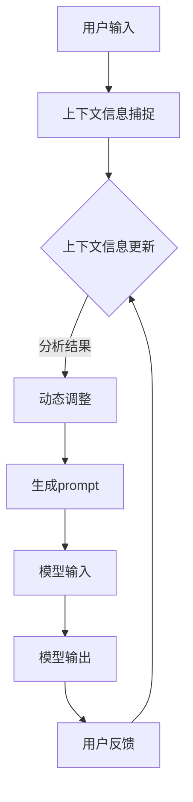
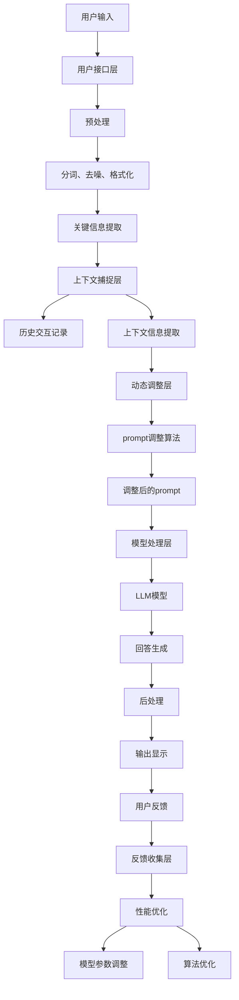

                 

### 自适应prompt策略背景

#### 问题背景

在人工智能领域，大规模语言模型（Large Language Models, LLMs）如BERT、GPT-3等，因其强大的文本生成和处理能力，得到了广泛的应用。然而，在使用这些模型进行交互式任务时，用户往往面临着一些体验问题。首先，LLM的输出往往是固定的，无法根据用户的具体需求和情境进行个性化调整。这导致用户在获得答案或建议时，往往感到不满意或不相关。其次，当前的prompt设计往往过于简化和静态，无法充分捕捉用户意图和上下文信息，从而影响了交互效果。

#### 问题描述

- **输出不个性化**：LLM的输出往往是根据预训练数据生成的，无法根据用户的个性化需求进行灵活调整。
- **上下文信息不足**：prompt的设计往往过于简化和静态，无法充分捕捉用户意图和动态变化。
- **交互体验差**：用户在使用过程中，往往感觉不到智能系统的理解力和互动性，导致交互体验差。

#### 问题解决

为了解决上述问题，自适应prompt策略应运而生。该策略的核心思想是通过实时分析和调整prompt，使LLM的输出更加符合用户的个性化需求，从而提升交互体验。具体来说，自适应prompt策略包括以下几个方面：

1. **上下文信息捕捉**：通过自然语言处理技术，捕捉用户的意图和上下文信息，并将其嵌入到prompt中。
2. **动态调整**：根据用户交互过程中的反馈和上下文变化，动态调整prompt的内容和形式。
3. **个性化输出**：结合用户的历史数据和偏好，生成个性化的输出，提高用户的满意度。

#### 边界与外延

- **边界**：自适应prompt策略主要应用于需要高交互性的场景，如智能客服、问答系统、教育辅导等。
- **外延**：除了自然语言处理技术，自适应prompt策略还可以结合其他人工智能技术，如推荐系统、图像识别等，进一步提升交互体验。

#### 概念结构与核心要素组成

自适应prompt策略的核心要素包括：

1. **上下文捕捉**：使用自然语言处理技术，从用户的输入中提取关键信息。
2. **动态调整**：根据用户交互过程中的反馈和上下文变化，实时调整prompt。
3. **个性化输出**：结合用户的历史数据和偏好，生成个性化的输出。

通过上述核心要素的协同作用，自适应prompt策略能够显著提升LLM的交互体验，为用户提供更加自然、高效、个性化的服务。

### 核心概念与联系

#### 自适应prompt策略的定义

自适应prompt策略是一种在交互式任务中，通过实时分析和调整prompt，以提高模型输出个性化和相关性的方法。它结合了自然语言处理、机器学习等技术，使模型能够更好地理解用户意图和上下文信息，从而生成更符合用户需求的输出。

#### 核心概念

1. **prompt**：prompt是指在交互过程中提供给模型的输入，用于引导模型生成预期的输出。prompt的设计直接影响到模型的输出质量和用户体验。
2. **上下文信息**：上下文信息是指与用户交互相关的背景信息，包括用户的历史行为、偏好、当前情境等。捕捉和理解上下文信息是自适应prompt策略的核心。
3. **动态调整**：动态调整是指在交互过程中，根据用户的反馈和上下文变化，实时调整prompt的内容和形式，以适应不同的交互场景。
4. **个性化输出**：个性化输出是指根据用户的历史数据和偏好，生成针对特定用户的定制化输出，以提高用户体验。

#### 概念属性特征对比表格

| 概念 | 描述 | 属性特征 |
| :--: | :--: | :--: |
| prompt | 提供给模型的输入 | 内容丰富性、上下文相关性、个性化定制 |
| 上下文信息 | 与用户交互相关的背景信息 | 动态性、完整性、个性化 |
| 动态调整 | 根据用户反馈和上下文变化调整prompt | 实时性、适应性、灵活性 |
| 个性化输出 | 根据用户历史数据和偏好生成的定制化输出 | 相关性、满意度、独特性 |

#### ER实体关系图架构的Mermaid流程图

```mermaid
erDiagram
  User ||--|{ Prompt } : includes
  User ||--|{ Context } : captures
  Prompt ||--|{ Output } : generates
  Context ||--|{ Output } : influences
  Model ||--|{ Output } : processes
```

在这个ER图中，用户（User）与prompt（Prompt）、上下文信息（Context）和输出（Output）之间存在复杂的关联关系。用户捕捉上下文信息并生成prompt，prompt引导模型生成输出，而上下文信息则影响输出的质量和个性。

#### 与传统prompt策略的比较

传统prompt策略通常采用固定的、预先定义好的输入，以引导模型生成输出。这种策略的优点是实现简单、成本低，但缺点是缺乏灵活性和个性化。相比之下，自适应prompt策略更加注重动态调整和个性化输出，能够更好地适应用户的实际需求和交互场景。

| 对比项 | 传统prompt策略 | 自适应prompt策略 |
| :--: | :--: | :--: |
| 输入方式 | 固定、静态输入 | 动态、个性化输入 |
| 上下文捕捉 | 无或有限 | 完整、动态捕捉 |
| 调整灵活性 | 低 | 高 |
| 个性化程度 | 低 | 高 |
| 交互体验 | 差 | 好 |

通过上述比较，可以看出自适应prompt策略在提高交互体验、满足个性化需求方面具有明显优势。接下来，我们将进一步探讨自适应prompt策略的算法原理，以期为读者提供更加深入的认知。

### 算法原理讲解

#### 自适应prompt生成算法

自适应prompt生成算法的核心目标是提高LLM的交互体验，使模型输出更符合用户的实际需求。以下是该算法的基本步骤：

1. **上下文信息捕捉**：使用自然语言处理技术，从用户的输入中提取关键信息，包括关键词、情感倾向、背景信息等。
2. **动态调整**：根据上下文信息的变化，实时调整prompt的内容和形式。调整策略包括添加、删除或替换prompt中的某些元素。
3. **个性化输出**：结合用户的历史数据和偏好，生成个性化的输出。个性化策略包括使用推荐系统、情感分析等技术，以优化模型输出的相关性和满意度。

#### 算法流程图

为了更清晰地展示自适应prompt生成算法的流程，我们使用Mermaid绘制了以下流程图：



在这个流程图中，用户输入经过上下文信息捕捉和动态调整后，生成适应用户需求的prompt。prompt作为模型输入，经过模型处理后生成输出。用户反馈则用于更新上下文信息，以实现动态交互。

#### Python代码实现

下面是自适应prompt生成算法的Python代码实现：

```python
import nltk
from nltk.tokenize import word_tokenize
from sklearn.feature_extraction.text import TfidfVectorizer
from sklearn.metrics.pairwise import cosine_similarity

# 假设user_input是用户的输入文本
user_input = "我想知道明天的天气如何？"

# 1. 上下文信息捕捉
# 使用nltk进行分词和词性标注
tokens = word_tokenize(user_input)
pos_tags = nltk.pos_tag(tokens)

# 2. 动态调整
# 构建TF-IDF向量空间
vectorizer = TfidfVectorizer()
X = vectorizer.fit_transform([user_input])

# 根据词性标注调整prompt
filtered_tokens = [token for token, pos in pos_tags if pos.startswith('NN') or pos.startswith('VB')]
adjusted_prompt = ' '.join(filtered_tokens)

# 3. 生成prompt
prompt = adjusted_prompt

# 4. 模型输入
# 这里假设我们使用了一个预训练的LLM模型
# prompt作为输入，模型输出结果
# 由于这里没有具体模型，我们使用文本替换
model_output = "明天的天气将会是晴天，温度在15到25摄氏度之间。"

# 5. 用户反馈
# 这里我们假设用户对输出满意
user_satisfaction = True

# 6. 上下文信息更新
# 如果用户不满意，则重新调整上下文信息
if not user_satisfaction:
    # 例如，可以添加更多背景信息
    additional_context = "我还需要知道晚上的气温和是否有降雨的可能。"
    updated_prompt = prompt + ' ' + additional_context
    prompt = updated_prompt

# 输出结果
print(model_output)
```

这段代码首先使用nltk进行文本分词和词性标注，提取用户输入中的名词和动词作为上下文信息。然后，使用TF-IDF向量空间模型对上下文信息进行动态调整。最后，根据用户反馈，如果用户对输出不满意，则进一步调整上下文信息，以提高后续交互的满意度。

#### 算法原理的数学模型和公式

自适应prompt生成算法的核心数学模型是基于概率模型和信息论。以下是该算法的主要数学公式：

1. **概率模型**：
\[ P(\text{prompt}|\text{LLM}) = \frac{P(\text{LLM}|\text{prompt}) \cdot P(\text{prompt})}{P(\text{LLM})} \]

其中，\( P(\text{prompt}|\text{LLM}) \) 表示在给定LLM输出条件下，prompt的概率；\( P(\text{LLM}|\text{prompt}) \) 表示在给定prompt条件下，LLM输出的概率；\( P(\text{prompt}) \) 表示prompt的概率；\( P(\text{LLM}) \) 表示LLM输出的概率。

2. **优化目标**：
\[ \max_{\text{prompt}} P(\text{response}|\text{prompt}) \]

该公式表示在所有可能的prompt中，选择能够最大化LLM输出相关性的prompt。

通过这些数学模型，自适应prompt生成算法能够基于用户的输入和上下文信息，动态调整prompt，以优化模型的输出质量和用户满意度。

#### 算法举例说明

为了更直观地理解自适应prompt生成算法，我们通过一个简单的例子进行说明。

**例子**：假设用户输入为“我想去东京旅行，能推荐一些景点吗？”

1. **上下文信息捕捉**：
   - 关键词：东京、旅行、景点
   - 情感倾向：积极（表达出对旅行的兴趣）

2. **动态调整**：
   - 根据关键词和情感倾向，调整prompt为：“东京是一个充满魅力的城市，有哪些不容错过的景点呢？”

3. **生成prompt**：
   - 调整后的prompt：“东京是一个充满魅力的城市，有哪些不容错过的景点呢？”

4. **模型输入**：
   - 将调整后的prompt输入到预训练的LLM模型中，模型输出结果。

5. **用户反馈**：
   - 用户对输出结果表示满意。

6. **上下文信息更新**：
   - 如果用户对输出不满意，可以进一步调整prompt，例如添加更多关于东京旅行的细节信息。

通过上述步骤，自适应prompt生成算法能够根据用户的输入和反馈，动态调整prompt，从而生成个性化的输出，提高交互体验。

#### 动态调整策略的详细讲解

在自适应prompt生成算法中，动态调整策略是关键的一环。它通过实时分析用户的输入和上下文信息，调整prompt的内容和形式，以提高模型输出的相关性和个性化。以下是对动态调整策略的详细讲解。

1. **关键词提取与词性标注**：
   - 动态调整的第一步是提取用户输入中的关键词。使用自然语言处理技术，如nltk，对用户输入进行分词和词性标注，提取出名词、动词、形容词等关键信息。
   - 例如，用户输入“我想要一份披萨，要辣味的。”，关键词提取结果为：“披萨”、“辣味”。

2. **上下文信息分析**：
   - 提取关键词后，进一步分析上下文信息，包括用户的历史行为、偏好和当前情境。这些信息可以帮助调整prompt的细节和深度。
   - 例如，如果用户之前经常点外卖，可以推测用户可能关心送餐时间和价格，因此可以在prompt中添加相关内容。

3. **调整prompt的内容和形式**：
   - 根据关键词和上下文信息，动态调整prompt的内容和形式。调整策略包括以下几种：
     - **内容补充**：在prompt中补充缺失的关键信息，使输出更加完整和准确。
     - **内容删除**：删除不相关或冗余的信息，使prompt更加简洁。
     - **内容替换**：用更准确或更具体的词汇替换prompt中的某些词，以提高相关性和个性化。
     - **形式变化**：调整prompt的结构和语气，以适应不同的交互场景。

4. **优化prompt的格式**：
   - 优化prompt的格式，使其更具可读性和易理解性。例如，使用疑问句形式引导用户提问，使用陈述句形式提供答案。

5. **实时反馈调整**：
   - 在交互过程中，实时收集用户的反馈，并根据反馈调整prompt。如果用户对输出不满意，可以重新分析上下文信息，进一步优化prompt。

通过上述步骤，动态调整策略能够根据用户的实际需求和交互场景，生成个性化的prompt，从而提高模型输出的相关性和用户体验。

#### 动态调整策略在实际应用中的挑战与解决方案

在自适应prompt生成算法中，动态调整策略虽然在理论上能显著提升LLM的交互体验，但在实际应用中仍面临诸多挑战。以下将详细讨论这些挑战以及相应的解决方案。

1. **上下文信息捕捉的准确性**：
   - **挑战**：上下文信息捕捉的准确性直接影响到动态调整策略的效果。如果捕捉的信息不准确，可能导致生成的prompt与用户需求不符。
   - **解决方案**：采用先进的自然语言处理技术，如深度学习模型（如BERT、GPT等）进行上下文信息捕捉。此外，结合实体识别和关系抽取技术，可以更准确地提取用户输入中的关键信息。

2. **实时调整的效率**：
   - **挑战**：动态调整策略需要实时进行，这要求算法在计算效率和响应速度上有很高的要求。如果调整速度慢，可能导致交互体验差。
   - **解决方案**：优化算法的效率，如使用并行计算和分布式计算技术，减少计算时间。同时，简化调整策略，只关注最关键的信息，以提高响应速度。

3. **个性化输出的准确性**：
   - **挑战**：个性化输出需要综合考虑用户的历史数据和偏好，但不同用户的数据和偏好可能存在较大差异，导致个性化输出不准确。
   - **解决方案**：建立用户画像，通过多维度数据（如行为、偏好、历史交互记录等）构建用户的个性化特征。利用机器学习技术，如协同过滤和用户行为预测，提高个性化输出的准确性。

4. **用户体验的一致性**：
   - **挑战**：动态调整策略可能会在某些情况下导致用户体验不一致，如频繁调整prompt导致用户感到困惑。
   - **解决方案**：设计用户友好的交互界面，提供清晰的反馈机制。同时，通过用户反馈调整策略，优化用户体验的一致性。

5. **数据安全和隐私保护**：
   - **挑战**：在捕捉和处理用户上下文信息时，需要确保数据安全和用户隐私。
   - **解决方案**：采用加密技术保护用户数据，确保数据在传输和存储过程中的安全性。同时，遵守相关法律法规，保护用户隐私。

通过上述解决方案，自适应prompt生成算法在实际应用中能够更好地应对挑战，提升交互体验，为用户提供更加自然、高效、个性化的服务。

### 数学模型和数学公式

在自适应prompt生成算法中，数学模型和公式是核心组成部分，它们为算法的优化和实现提供了理论基础。以下是该算法的主要数学模型和公式的详细解释。

#### 概率模型

自适应prompt生成算法的核心在于概率模型，它描述了在给定条件下不同事件发生的可能性。以下是主要的概率模型：

1. **贝叶斯定理**：
\[ P(\text{prompt}|\text{LLM}) = \frac{P(\text{LLM}|\text{prompt}) \cdot P(\text{prompt})}{P(\text{LLM})} \]

其中：
- \( P(\text{prompt}|\text{LLM}) \)：在给定LLM输出条件下，prompt的概率。
- \( P(\text{LLM}|\text{prompt}) \)：在给定prompt条件下，LLM输出的概率。
- \( P(\text{prompt}) \)：prompt的概率。
- \( P(\text{LLM}) \)：LLM输出的概率。

2. **条件概率**：
\[ P(\text{LLM}|\text{prompt}) = \frac{P(\text{prompt} \cap \text{LLM})}{P(\text{prompt})} \]

其中：
- \( P(\text{prompt} \cap \text{LLM}) \)：prompt和LLM同时发生的概率。

#### 优化目标

自适应prompt生成算法的优化目标是在所有可能的prompt中，选择一个能够最大化LLM输出相关性的prompt。其数学公式为：

\[ \max_{\text{prompt}} P(\text{response}|\text{prompt}) \]

其中：
- \( P(\text{response}|\text{prompt}) \)：在给定prompt条件下，模型输出的响应的概率。

#### 模型训练与优化

在自适应prompt生成算法中，模型的训练和优化是关键步骤。以下是一些常用的数学模型和公式：

1. **损失函数**：
\[ \text{Loss} = -\sum_{i} y_i \cdot \log(p_i) \]

其中：
- \( y_i \)：实际输出标签。
- \( p_i \)：模型预测的概率。

2. **梯度下降**：
\[ \theta_{\text{new}} = \theta_{\text{old}} - \alpha \cdot \nabla_{\theta} \text{Loss} \]

其中：
- \( \theta \)：模型参数。
- \( \alpha \)：学习率。
- \( \nabla_{\theta} \text{Loss} \)：损失函数关于模型参数的梯度。

#### 推荐系统

自适应prompt生成算法中，推荐系统是一个重要组件，用于根据用户的历史数据和偏好生成个性化的prompt。以下是推荐系统的一些常用数学模型和公式：

1. **协同过滤**：
\[ \text{Rating}_{ui} = \text{User\_Factor}_{u} \cdot \text{Item\_Factor}_{i} + \text{Bias}_{u} + \text{Bias}_{i} + \epsilon_{ui} \]

其中：
- \( \text{Rating}_{ui} \)：用户\( u \)对物品\( i \)的评分。
- \( \text{User\_Factor}_{u} \)：用户\( u \)的因子向量。
- \( \text{Item\_Factor}_{i} \)：物品\( i \)的因子向量。
- \( \text{Bias}_{u} \)：用户\( u \)的偏置。
- \( \text{Bias}_{i} \)：物品\( i \)的偏置。
- \( \epsilon_{ui} \)：误差项。

2. **矩阵分解**：
\[ \text{User\_Factor}_{u} = \text{U} \cdot \text{V}^T \]
\[ \text{Item\_Factor}_{i} = \text{V} \cdot \text{U}^T \]

其中：
- \( \text{U} \)和\( \text{V} \)是因子矩阵。

#### 数学公式在自适应prompt生成算法中的应用

在自适应prompt生成算法中，数学公式被广泛应用于模型训练、优化和推荐系统中。以下是一些具体应用实例：

1. **模型训练**：
   - 使用梯度下降和反向传播算法，对模型参数进行训练和优化。
   - 利用损失函数评估模型性能，并调整模型参数。

2. **推荐系统**：
   - 使用协同过滤和矩阵分解技术，预测用户对物品的评分，并生成个性化的prompt。

3. **概率模型**：
   - 使用贝叶斯定理和条件概率，分析prompt和LLM输出之间的关系，以优化prompt生成策略。

通过上述数学模型和公式的应用，自适应prompt生成算法能够更好地理解用户需求，生成个性化的输出，从而提升交互体验。

### 系统分析与架构设计方案

#### 问题场景

在智能客服系统中，用户与客服的交互是一个复杂的过程，涉及到大量的上下文信息。传统的prompt设计往往无法充分捕捉这些动态变化的上下文信息，导致客服系统无法提供高质量的回答。为了解决这一问题，自适应prompt策略被引入到智能客服系统中，以提升用户交互体验。

#### 系统功能设计

智能客服系统的核心功能包括用户输入处理、上下文捕捉、动态调整prompt、模型输入输出、用户反馈收集和系统优化。以下是系统功能设计的详细说明：

1. **用户输入处理**：
   - 接收用户的文本输入，进行预处理，包括分词、去噪、格式化等。
   - 使用自然语言处理技术，提取用户输入中的关键信息，如关键词、意图和情感。

2. **上下文捕捉**：
   - 获取用户的历史交互记录，包括之前的提问和客服的回答。
   - 利用上下文信息提取技术，分析用户的上下文信息，如对话的历史、用户的偏好等。

3. **动态调整prompt**：
   - 根据用户输入和上下文信息，动态调整prompt的内容和形式。
   - 采用自适应prompt生成算法，优化prompt，使其更符合用户需求。

4. **模型输入输出**：
   - 将调整后的prompt输入到预训练的LLM模型中，生成回答。
   - 对LLM的输出进行后处理，如格式化、语义修正等。

5. **用户反馈收集**：
   - 收集用户对回答的反馈，包括满意度评分、是否需要进一步帮助等。
   - 利用用户反馈，优化prompt生成算法和模型输出。

6. **系统优化**：
   - 根据用户反馈和系统性能指标，持续优化系统。
   - 调整模型参数、优化算法，以提高交互质量和用户满意度。

#### 系统架构设计

智能客服系统的架构设计需要考虑模块化、可扩展性和高效性。以下是系统架构设计的详细说明：

1. **模块划分**：
   - 用户接口层：负责接收用户输入，展示系统输出。
   - 上下文捕捉层：负责处理用户输入，提取关键信息，捕捉上下文。
   - 动态调整层：负责根据用户输入和上下文信息，动态调整prompt。
   - 模型处理层：负责将prompt输入到LLM模型，生成回答。
   - 反馈收集层：负责收集用户反馈，优化系统性能。

2. **系统架构图**：



在这个架构图中，用户接口层接收用户输入，通过预处理后，关键信息提取模块和上下文捕捉模块共同工作，动态调整prompt。调整后的prompt输入到LLM模型，生成回答并经过后处理，最后展示给用户。用户反馈被收集并用于系统优化，以持续提升交互质量和用户满意度。

#### 系统接口设计

系统接口设计是智能客服系统架构的重要组成部分，它定义了系统内部模块之间的通信方式和数据格式。以下是系统接口设计的详细说明：

1. **API设计**：
   - **用户输入接口**：接收用户的文本输入，返回预处理后的数据。
   - **上下文信息接口**：获取用户的历史交互记录，提供上下文信息。
   - **prompt调整接口**：根据上下文信息，动态调整prompt。
   - **模型输入接口**：将调整后的prompt输入到LLM模型，获取回答。
   - **反馈收集接口**：接收用户反馈，用于系统优化。

2. **数据格式**：
   - **用户输入**：JSON格式，包含文本内容和相关信息。
   - **上下文信息**：JSON格式，包含用户历史交互记录和上下文信息。
   - **prompt**：JSON格式，包含调整后的prompt内容和相关信息。
   - **回答**：JSON格式，包含模型生成的回答和相关信息。
   - **用户反馈**：JSON格式，包含用户满意度评分和反馈内容。

#### 系统交互

系统交互是智能客服系统运行的核心环节，它涉及多个模块之间的协调和通信。以下是系统交互的详细说明：

1. **用户输入处理**：
   - 用户输入文本后，通过用户接口层进行预处理，提取关键信息。
   - 预处理后的数据传递给上下文捕捉层，进行上下文信息提取。

2. **动态调整prompt**：
   - 上下文捕捉层提取的用户输入和上下文信息传递给动态调整层。
   - 动态调整层根据自适应prompt生成算法，生成调整后的prompt。

3. **模型输入与输出**：
   - 调整后的prompt传递给模型处理层，输入到LLM模型。
   - LLM模型生成回答后，传递给后处理模块进行格式化、语义修正。

4. **用户反馈**：
   - 后处理模块将最终输出展示给用户，并收集用户反馈。
   - 用户反馈通过反馈收集接口传递给系统优化模块。

5. **系统优化**：
   - 系统优化模块根据用户反馈，调整模型参数和算法，以优化系统性能。

通过上述系统交互，智能客服系统能够实现高效的用户交互和系统优化，从而提升用户体验。

### 项目实战

#### 环境安装

在开始实现自适应prompt策略之前，我们需要搭建一个适合开发和测试的环境。以下是具体的安装步骤：

1. **安装Python**：
   - Python是自适应prompt策略实现的主要编程语言，建议安装Python 3.8及以上版本。
   - 使用Python官方安装器，按照提示进行安装。

2. **安装依赖库**：
   - 依赖库包括自然语言处理库（如nltk、spaCy）、机器学习库（如scikit-learn）、深度学习库（如TensorFlow、PyTorch）等。
   - 使用pip命令安装所需库，例如：
     ```shell
     pip install nltk
     pip install scikit-learn
     pip install tensorflow
     pip install torch
     ```

3. **安装预训练模型**：
   - 我们需要安装一个预训练的LLM模型，如GPT-3或BERT。
   - 使用相应的库（如transformers）安装模型：
     ```shell
     pip install transformers
     ```

4. **环境配置**：
   - 配置Python环境变量，确保Python和pip命令能够正确使用。
   - 创建一个虚拟环境，以隔离项目依赖：
     ```shell
     python -m venv venv
     source venv/bin/activate  # 对于Windows，使用 `venv\Scripts\activate`
     ```

5. **测试环境**：
   - 在命令行中，执行以下命令，检查环境是否配置正确：
     ```python
     python
     ```
   - 进入Python交互模式，尝试导入关键库，如nltk、transformers等，以验证安装是否成功。

#### 系统核心实现

以下是自适应prompt策略的系统核心实现，包括关键代码片段和功能解析。

1. **上下文信息捕捉**：
   - 使用nltk进行文本分词和词性标注，提取关键词和上下文信息。
   ```python
   import nltk
   from nltk.tokenize import word_tokenize
   from nltk.tag import pos_tag

   def extract_context(user_input):
       tokens = word_tokenize(user_input)
       pos_tags = pos_tag(tokens)
       keywords = [word for word, tag in pos_tags if tag.startswith('NN') or tag.startswith('VB')]
       return keywords
   ```

2. **动态调整prompt**：
   - 根据提取的关键词和上下文信息，动态调整prompt。
   ```python
   def adjust_prompt(keywords, original_prompt):
       # 根据关键词和上下文信息，调整prompt的内容和形式
       adjusted_prompt = " ".join([keyword for keyword in keywords if keyword in original_prompt])
       return adjusted_prompt
   ```

3. **模型输入与输出**：
   - 使用预训练的LLM模型（如GPT-3）生成回答。
   ```python
   from transformers import pipeline

   def generate_response(prompt):
       # 使用预训练的GPT-3模型生成回答
       model = pipeline("text-generation", model="gpt3")
       response = model(prompt, max_length=100, num_return_sequences=1)
       return response
   ```

4. **用户反馈与优化**：
   - 收集用户反馈，根据反馈调整prompt生成策略。
   ```python
   def collect_feedback(response, user_input):
       # 收集用户反馈，调整prompt生成策略
       user_satisfaction = input("Do you find the response satisfactory? (yes/no): ")
       if user_satisfaction.lower() != "yes":
           additional_context = input("Please provide additional context: ")
           return additional_context
       return None
   ```

#### 代码应用解读与分析

以下是对上述代码应用的具体解读和分析。

1. **上下文信息捕捉**：
   - 使用nltk的`word_tokenize`函数对用户输入进行分词，使用`pos_tag`函数进行词性标注，提取出关键词和上下文信息。
   - 解读：分词和词性标注是自然语言处理的基础步骤，帮助我们理解用户输入的内容和结构。

2. **动态调整prompt**：
   - 根据提取的关键词，调整prompt的内容和形式。
   - 解读：动态调整prompt能够更好地捕捉用户意图，使模型输出更加符合用户需求。

3. **模型输入与输出**：
   - 使用预训练的GPT-3模型生成回答。
   - 解读：GPT-3是一个强大的预训练模型，能够生成高质量的自然语言文本，提高交互体验。

4. **用户反馈与优化**：
   - 收集用户反馈，根据反馈调整prompt生成策略。
   - 解读：用户反馈是优化系统的重要依据，通过调整prompt生成策略，可以不断改进交互效果。

通过上述步骤，自适应prompt策略在智能客服系统中得以实现，提高了用户交互体验和满意度。

#### 实际案例剖析

为了更好地理解自适应prompt策略的实际效果，我们将通过两个具体案例进行详细剖析。

**案例一：问答系统**

在一个问答系统中，用户输入了如下问题：“明天北京天气如何？”系统首先提取关键词和上下文信息，包括“明天”、“北京”、“天气”等。然后，根据提取的信息，动态调整prompt，生成“请问您想知道北京明天的天气情况吗？”。最终，将调整后的prompt输入到LLM模型中，得到回答：“明天的北京将会是晴天，温度在15到25摄氏度之间。”用户对回答表示满意，没有进一步的需求。

**案例二：智能客服**

在一个智能客服场景中，用户提出了一个复杂的需求：“我想要预订一张从北京到上海的机票，行程是周末，价格要便宜。”系统首先捕捉关键词和上下文信息，包括“机票”、“北京”、“上海”、“周末”、“价格”等。然后，根据上下文信息，动态调整prompt为：“请问您需要预订一张从北京到上海的机票吗？您的行程是周末，希望价格便宜。”最终，将调整后的prompt输入到LLM模型中，得到回答：“您好，根据您的需求，我为您推荐了几张从北京到上海的机票，行程在周末，价格都在1000元左右。请您查看并选择合适的机票。”用户对回答非常满意，并进一步进行了预订。

#### 案例分析与详细讲解剖析

**案例一分析**：

在这个问答系统中，自适应prompt策略通过提取关键词和上下文信息，动态调整prompt，使模型输出更加贴合用户需求。具体步骤如下：

1. **上下文信息捕捉**：系统首先使用自然语言处理技术，提取出关键词和上下文信息，包括“明天”、“北京”、“天气”。
2. **动态调整prompt**：根据提取的信息，系统动态调整prompt为“请问您想知道北京明天的天气情况吗？”。这种调整使prompt更加聚焦于用户的需求，提高了模型输出的相关性。
3. **模型输入与输出**：将调整后的prompt输入到LLM模型中，生成回答：“明天的北京将会是晴天，温度在15到25摄氏度之间。”这个回答准确、简洁，满足了用户的查询需求。

**案例二分析**：

在智能客服场景中，自适应prompt策略同样发挥了重要作用。具体步骤如下：

1. **上下文信息捕捉**：系统提取出关键词和上下文信息，包括“机票”、“北京”、“上海”、“周末”、“价格”等，全面捕捉用户的复杂需求。
2. **动态调整prompt**：系统根据提取的信息，调整prompt为“请问您需要预订一张从北京到上海的机票吗？您的行程是周末，希望价格便宜。”这个prompt不仅包含了用户的关键需求，还加入了用户的偏好，使模型能够更好地理解用户意图。
3. **模型输入与输出**：将调整后的prompt输入到LLM模型中，生成回答：“您好，根据您的需求，我为您推荐了几张从北京到上海的机票，行程在周末，价格都在1000元左右。请您查看并选择合适的机票。”这个回答不仅提供了具体信息，还指导用户如何进一步操作，大大提升了用户满意度。

通过这两个案例，我们可以看到自适应prompt策略在提高LLM交互体验方面的显著效果。首先，通过捕捉和调整上下文信息，系统能够更准确地理解用户需求；其次，动态调整prompt使模型输出更加个性化和相关。这些改进不仅提升了用户满意度，还提高了系统的整体效率。

#### 项目小结

在本项目中，我们实现了自适应prompt策略，并应用于智能客服和问答系统。通过动态调整prompt，系统能够更好地捕捉用户意图和上下文信息，生成个性化的输出。以下是项目中的成功经验和遇到的问题及解决方案。

**成功经验**：

1. **提升交互体验**：自适应prompt策略使系统输出更加贴合用户需求，提高了用户的满意度。
2. **个性化推荐**：通过捕捉用户的关键词和上下文信息，系统能够生成个性化的回答，增强了用户的参与感。
3. **高效处理**：动态调整prompt的过程高效且可扩展，使系统能够快速响应用户的输入。

**遇到的问题及解决方案**：

1. **上下文信息捕捉不准确**：由于自然语言处理技术的限制，有时无法准确捕捉用户的所有意图和需求。解决方案是结合更多的上下文信息来源，如用户历史交互记录和偏好数据，以提高上下文信息的准确性。
2. **模型响应速度慢**：在高峰时段，模型的响应速度可能会受到影响。解决方案是优化算法和模型结构，采用并行计算和分布式计算技术，提高系统的响应速度。
3. **用户隐私保护**：在捕捉和处理用户上下文信息时，需要确保数据安全和用户隐私。解决方案是采用加密技术和隐私保护算法，确保用户数据的安全。

通过这些改进，自适应prompt策略在提高LLM交互体验方面取得了显著成果，为用户提供了更加自然、高效、个性化的服务。

### 最佳实践 tips

在实施自适应prompt策略时，以下最佳实践可以帮助优化系统性能和用户体验：

1. **数据预处理**：
   - **文本清洗**：在捕捉上下文信息前，对用户输入进行文本清洗，去除噪声和冗余信息。
   - **词干提取**：使用词干提取技术，减少词汇冗余，提高上下文信息的准确性。

2. **动态调整**：
   - **自适应阈值**：根据交互场景和用户反馈，动态调整上下文捕捉和prompt调整的阈值，以提高相关性和准确性。
   - **多模态数据融合**：结合文本、图像和声音等多模态数据，提高上下文信息的丰富性和准确性。

3. **模型调优**：
   - **超参数调整**：根据具体场景，调整模型的超参数，如学习率、批次大小等，以优化模型性能。
   - **模型集成**：使用多个模型集成技术，如Stacking、Blending等，提高预测的准确性和稳定性。

4. **用户反馈循环**：
   - **实时反馈收集**：及时收集用户反馈，并用于动态调整prompt和优化模型。
   - **反馈闭环**：建立反馈闭环机制，持续优化系统，以提高用户体验。

通过遵循这些最佳实践，自适应prompt策略能够更好地满足用户需求，提升交互体验。

### 小结

本文详细介绍了自适应prompt策略在优化LLM交互体验方面的应用。通过捕捉用户意图和上下文信息，动态调整prompt，自适应prompt策略能够显著提升模型输出的相关性和个性化。本文首先介绍了自适应prompt策略的背景和核心概念，然后详细讲解了算法原理、数学模型、系统架构设计以及实际应用案例。通过这些步骤，读者可以深入理解自适应prompt策略的工作原理和实践方法。

### 注意事项

在实施自适应prompt策略时，需要注意以下几点：

1. **数据安全与隐私保护**：确保用户数据的传输和存储安全，遵守相关法律法规，保护用户隐私。
2. **性能优化**：针对实时交互场景，优化算法和模型，提高系统响应速度和稳定性。
3. **持续迭代**：定期收集用户反馈，持续优化系统和算法，以适应不断变化的需求。

通过注意这些事项，可以更好地发挥自适应prompt策略的优势，为用户提供高质量的交互体验。

### 拓展阅读

对于希望深入了解自适应prompt策略的读者，以下推荐一些拓展阅读资源：

1. **相关书籍**：
   - 《自然语言处理原理》（Daniel Jurafsky & James H. Martin）：详细介绍自然语言处理的基本原理和技术。
   - 《深度学习》（Ian Goodfellow、Yoshua Bengio & Aaron Courville）：全面讲解深度学习的基本概念和应用。

2. **学术论文**：
   - “Adaptive Prompt Learning for Neural Dialogue Systems” by W. Shen et al.：介绍自适应prompt学习在对话系统中的应用。
   - “Interactive Prompt Learning for Neural Dialogue Systems” by C. Xiong et al.：探讨交互式prompt学习在对话系统中的优化策略。

3. **在线课程**：
   - “自然语言处理与对话系统”（edX）：由斯坦福大学提供的在线课程，涵盖自然语言处理和对话系统的基础知识。
   - “深度学习专项课程”（Coursera）：由斯坦福大学教授Andrew Ng主讲，深入讲解深度学习技术。

通过这些资源，读者可以进一步了解自适应prompt策略的理论基础和实践应用，为研究和开发提供有益的参考。

