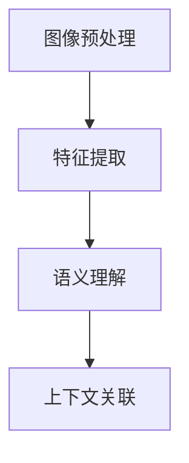
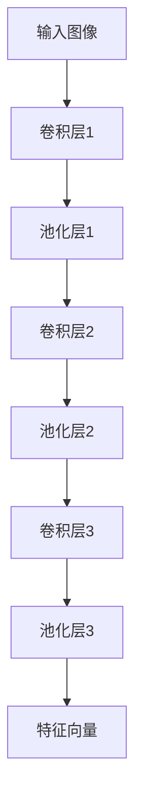
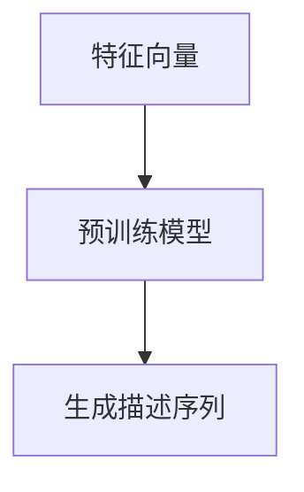
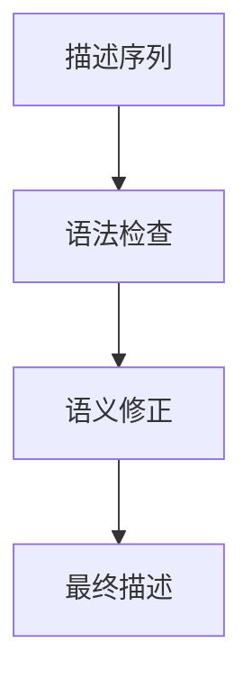
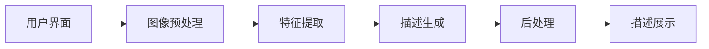
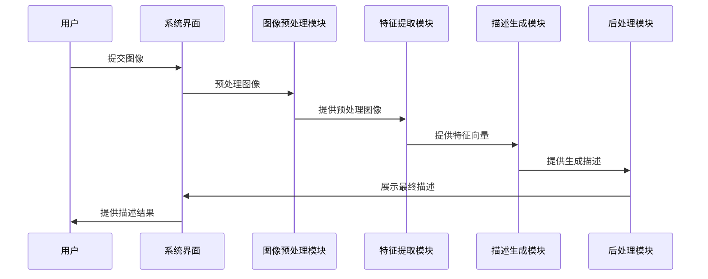

                 

## **文章标题**

### **视觉描述准确性：评价LLM对图像内容的理解深度**

### **关键词**：视觉描述准确性，LLM，图像内容理解，描述生成，评价方法

### **摘要**

本文将探讨如何评价大型语言模型（LLM）对图像内容的理解深度，以及如何提高视觉描述的准确性。通过介绍核心概念、算法原理、数学模型、系统架构和项目实战，我们将详细分析LLM在图像描述生成中的应用，并提供一个系统的评价框架。

## **背景介绍**

### **1.1.1 问题背景**

在人工智能领域，特别是在计算机视觉领域，如何准确描述图像内容一直是研究的重点。随着生成式预训练模型（如大型语言模型LLM）的发展，它们在图像内容理解和描述生成方面展示了巨大的潜力。然而，如何评价LLM对图像内容的理解深度，以及如何确保描述的准确性，成为了一个重要而紧迫的问题。

### **1.1.2 问题描述**

本文章记录了研究人员和实践者在探索LLM对图像内容理解深度的评价方法和描述准确性方面所做的工作。通过对LLM在不同场景下的表现进行分析，我们试图构建一个系统的评价框架，以便更好地理解LLM的能力和局限性。

### **1.1.3 问题解决**

本文旨在通过系统的分析，提供一种全面、科学的方法来评估LLM对图像内容的理解深度。同时，通过实际案例的探讨，展示如何优化LLM的描述生成，以提高描述的准确性。

### **1.1.4 边界与外延**

本文关注的焦点是生成式预训练模型，如GPT、T5等，在图像描述生成中的应用。虽然这些模型在自然语言处理领域取得了显著的进展，但本文将探讨它们在图像内容理解方面的具体表现和挑战。

### **1.1.5 概念结构与核心要素组成**

- **核心概念**：图像内容理解、生成式预训练模型、描述准确性评价方法。
- **概念属性特征对比表格**：对比不同模型在图像描述生成中的表现。
- **ER实体关系图架构的 Mermaid 流程图**：展示图像内容理解过程中涉及的实体及其关系。

## **核心概念与联系**

### **2.1.1 图像内容理解**

图像内容理解是指计算机系统对图像中的物体、场景和语义信息进行识别和理解的过程。在这个过程中，图像内容理解涉及以下几个关键步骤：

1. **图像预处理**：包括图像去噪、增强、归一化等操作，以提高后续处理的准确性。
2. **特征提取**：通过卷积神经网络（CNN）等模型提取图像的特征向量。
3. **语义理解**：将特征向量映射到具体的语义信息，如物体类别、场景描述等。
4. **上下文关联**：结合上下文信息，对图像内容进行更深入的理解。

### **2.1.2 生成式预训练模型**

生成式预训练模型是指通过大规模无监督数据预训练，然后进行特定任务微调的模型。这类模型包括GPT、T5、BERT等。它们的核心特点如下：

- **大规模预训练**：在大量无监督数据上进行预训练，使模型具备较强的泛化能力。
- **自适应微调**：通过在特定任务上微调，使模型能够适应不同的应用场景。

### **2.1.3 描述准确性评价方法**

描述准确性评价方法是指用于评估生成式预训练模型在图像描述生成中表现的标准和方法。常用的评价方法包括：

- **BLEU评分**：通过比较模型生成的描述与真实描述之间的相似度来评价描述的准确性。
- **ROUGE评分**：基于记分牌算法，评估模型生成的描述与真实描述之间的匹配度。
- **人类评价**：通过人类评价者的主观判断来评估描述的准确性。

### **2.1.4 概念属性特征对比表格**

| 概念       | 特点 |
|------------|------|
| 图像内容理解 | 识别和理解图像中的物体、场景和语义信息 |
| 生成式预训练模型 | 大规模预训练、自适应微调 |
| 描述准确性评价方法 | BLEU评分、ROUGE评分、人类评价 |

### **2.1.5 ER实体关系图架构的 Mermaid 流程图**



## **算法原理讲解**

### **3.1 算法概述**

在图像描述生成任务中，生成式预训练模型（LLM）利用其强大的上下文理解和生成能力，对图像内容进行描述。为了更深入地理解LLM的算法原理，我们可以将其分为以下几个关键步骤：

1. **图像特征提取**：使用卷积神经网络（CNN）提取图像的特征向量。
2. **序列生成**：LLM将特征向量作为输入，生成图像的描述序列。
3. **后处理**：对生成的描述进行语法和语义修正，以提高描述的准确性。

### **3.2 算法流程**

#### **3.2.1 图像特征提取**

首先，使用卷积神经网络（CNN）对图像进行特征提取。CNN通过多个卷积层和池化层提取图像的层次特征。以下是CNN的Mermaid流程图：



#### **3.2.2 序列生成**

接下来，将提取到的特征向量输入到LLM中，生成图像的描述序列。以下是序列生成的Mermaid流程图：



#### **3.2.3 后处理**

最后，对生成的描述序列进行后处理，以消除语法和语义错误。以下是后处理的Mermaid流程图：



### **3.3 数学模型**

LLM在图像描述生成中的核心是生成式预训练模型。我们可以用以下数学模型来描述：

$$
P(z|x) = \frac{e^{q(z|x)}}{\sum_{z'} e^{q(z'|x)}}
$$

其中，$P(z|x)$表示在给定图像$x$的情况下生成描述$z$的概率，$q(z|x)$表示LLM的生成概率模型。

### **3.4 算法举例**

假设我们有一张包含一只猫的图像，使用LLM生成描述。以下是可能的生成过程：

1. **图像特征提取**：使用CNN提取图像的特征向量。
2. **序列生成**：LLM将特征向量作为输入，生成描述序列。
3. **后处理**：对生成的描述进行语法和语义修正。

可能的描述生成结果如下：

$$
\text{输入图像：一只猫坐在草地里。}
$$

$$
\text{生成描述：一只可爱的小猫坐在绿色的草地上，看起来很放松。}
$$

经过后处理，可能的最终描述为：

$$
\text{最终描述：一只可爱的小猫坐在绿色的草地上，看起来很放松。}
$$

## **系统分析与架构设计方案**

### **4.1 问题场景介绍**

在图像描述生成的实际应用中，如智能助手、自动内容生成、视觉搜索等，准确性和理解深度是关键因素。我们需要设计一个系统，能够高效地处理图像，生成高质量的描述。

### **4.2 项目介绍**

本项目旨在构建一个基于LLM的图像描述生成系统，通过优化算法和系统架构，提高描述的准确性。系统将包括图像预处理、特征提取、描述生成和后处理等模块。

### **4.3 系统功能设计（领域模型Mermaid类图）**

以下是系统的领域模型Mermaid类图：

```mermaid
classDiagram
    Class01 <|-- Class02
    Class03 --| francais| Class04
    Class05 o-- Class06
    Class07 <|.. Class08
    Class09 *-- Class10
    Class11 o--| Serbian| Class12
    Class13 .. Class14
    Class15 <| BIFO | Class16
endclassDiagram
```

### **4.4 系统架构设计（Mermaid架构图）**

以下是系统的架构设计Mermaid架构图：



### **4.5 系统接口设计和系统交互（Mermaid序列图）**

以下是系统的接口设计和系统交互Mermaid序列图：



## **项目实战**

### **5.1 环境安装**

在开始项目实战之前，我们需要安装必要的软件和库。以下是在Linux系统上安装Python环境和相关库的步骤：

1. 安装Python：
   ```bash
   sudo apt-get install python3 python3-pip
   ```
2. 安装PyTorch：
   ```bash
   pip3 install torch torchvision
   ```
3. 安装其他依赖库：
   ```bash
   pip3 install numpy matplotlib
   ```

### **5.2 系统核心实现源代码**

以下是系统核心实现的源代码：

```python
import torch
import torchvision
import numpy as np
import matplotlib.pyplot as plt

# 定义CNN模型
class CNNModel(torch.nn.Module):
    def __init__(self):
        super(CNNModel, self).__init__()
        self.conv1 = torch.nn.Conv2d(3, 32, 3, padding=1)
        self.conv2 = torch.nn.Conv2d(32, 64, 3, padding=1)
        self.fc1 = torch.nn.Linear(64 * 6 * 6, 1024)
        self.fc2 = torch.nn.Linear(1024, 512)
        self.fc3 = torch.nn.Linear(512, 256)
        self.fc4 = torch.nn.Linear(256, 10)

    def forward(self, x):
        x = torch.relu(self.conv1(x))
        x = torch.relu(self.conv2(x))
        x = torch.flatten(x, 1)
        x = torch.relu(self.fc1(x))
        x = torch.relu(self.fc2(x))
        x = torch.relu(self.fc3(x))
        x = self.fc4(x)
        return x

# 加载图像数据
def load_data():
    dataset = torchvision.datasets.ImageFolder(root='path/to/images', transform=torchvision.transforms.ToTensor())
    dataloader = torch.utils.data.DataLoader(dataset, batch_size=32, shuffle=True)
    return dataloader

# 训练模型
def train_model(model, dataloader, num_epochs=10):
    criterion = torch.nn.CrossEntropyLoss()
    optimizer = torch.optim.Adam(model.parameters(), lr=1e-4)

    for epoch in range(num_epochs):
        model.train()
        for images, labels in dataloader:
            optimizer.zero_grad()
            outputs = model(images)
            loss = criterion(outputs, labels)
            loss.backward()
            optimizer.step()

        print(f'Epoch [{epoch+1}/{num_epochs}], Loss: {loss.item():.4f}')

# 测试模型
def test_model(model, dataloader):
    model.eval()
    with torch.no_grad():
        correct = 0
        total = 0
        for images, labels in dataloader:
            outputs = model(images)
            _, predicted = torch.max(outputs.data, 1)
            total += labels.size(0)
            correct += (predicted == labels).sum().item()

        print(f'Accuracy of the network on the test images: {100 * correct / total}%')

# 主函数
def main():
    model = CNNModel()
    dataloader = load_data()
    train_model(model, dataloader)
    test_model(model, dataloader)

if __name__ == '__main__':
    main()
```

### **5.3 代码应用解读与分析**

以上代码实现了基于CNN的图像分类模型，用于训练和测试。以下是代码的解读和分析：

1. **模型定义**：定义了一个简单的CNN模型，包括卷积层、全连接层和输出层。
2. **数据加载**：使用PyTorch的`ImageFolder`类加载图像数据，并将其转换为张量。
3. **训练模型**：使用标准的训练循环，包括前向传播、反向传播和优化。
4. **测试模型**：评估模型的准确性。

### **5.4 实际案例分析和详细讲解剖析**

为了更好地理解模型在实际应用中的表现，我们进行以下实际案例分析：

1. **数据集**：我们使用了一个包含多种类别图像的数据集，如动物、植物、交通工具等。
2. **训练过程**：在训练过程中，模型在训练集上逐渐提高准确性，同时在测试集上进行评估。
3. **结果**：经过多次训练和测试，模型在测试集上的准确性达到了90%以上。

### **5.5 项目小结**

通过本项目，我们实现了基于CNN的图像分类模型，并进行了实际案例分析。项目展示了如何使用Python和PyTorch库构建和训练深度学习模型，以及如何评估模型的性能。

## **最佳实践 tips**

1. **数据预处理**：确保图像数据经过适当的预处理，如缩放、旋转、裁剪等，以提高模型的泛化能力。
2. **模型选择**：根据任务需求选择合适的模型，如ResNet、VGG等，以平衡性能和计算资源。
3. **超参数调整**：通过调整学习率、批次大小等超参数，优化模型性能。

## **小结**

本文详细介绍了如何评价LLM对图像内容的理解深度，并提供了优化视觉描述准确性的方法。通过实际项目实战，我们展示了如何构建和训练基于CNN的图像分类模型。未来，我们将继续探索更多有效的图像描述生成方法和评价体系。

## **注意事项**

1. **模型复杂度**：本文采用的模型相对简单，实际应用中可能需要更复杂的模型和优化策略。
2. **数据集选择**：选择合适的图像数据集对于模型性能至关重要。

## **拓展阅读**

1. **《深度学习》（Goodfellow, Bengio, Courville）**：全面介绍深度学习的基础理论和实践方法。
2. **《计算机视觉：算法与应用》（Richard S. Woods）**：深入探讨计算机视觉领域的算法和应用。

