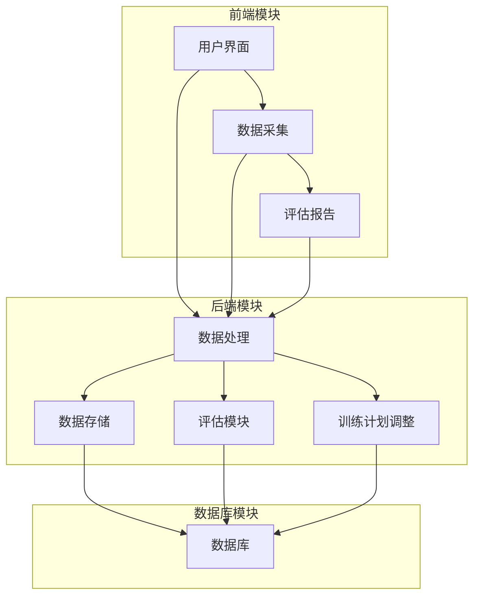

                 


## 计算机视觉在体育训练分析中的应用

### 关键词
- 计算机视觉
- 体育训练分析
- 算法原理
- 系统设计
- 项目实战

### 摘要
本文将深入探讨计算机视觉技术在体育训练分析中的应用。通过逐步分析计算机视觉与体育训练分析的核心概念、算法原理以及系统设计与实现，本文旨在为读者提供一套完整的技术解决方案，并分享最佳实践与案例分析。文章将按照以下结构展开：

1. **背景介绍**：介绍计算机视觉在体育训练分析中的应用背景、核心概念及其相互联系。
2. **核心概念与联系**：详细讲解计算机视觉与体育训练分析中的关键概念。
3. **算法原理讲解**：选用典型算法，深入剖析其原理，并提供详细讲解与示例。
4. **系统分析与架构设计方案**：介绍体育训练分析系统的功能、架构设计、接口设计和交互流程。
5. **项目实战**：通过实际项目展示系统设计与实现过程。
6. **最佳实践与总结**：总结文章内容，提供注意事项与拓展阅读。

### 目录大纲设计步骤

#### 确定章节主题
根据书名《计算机视觉在体育训练分析中的应用》，首先确定各章节的主题。

#### 背景介绍
设计“背景介绍”章节，概述计算机视觉在体育训练分析中的应用背景、问题描述和现状。

#### 核心概念与联系
设计“核心概念与联系”章节，详细介绍计算机视觉、体育训练分析中的核心概念及其相互联系。

#### 算法原理讲解
设计“算法原理讲解”章节，选用若干典型算法，使用 Mermaid 绘制流程图，并用 Python 源代码和 LaTeX 数学公式详细讲解。

#### 系统分析与架构设计方案
设计“系统分析与架构设计方案”章节，介绍系统功能、架构设计、接口设计和交互流程。

#### 项目实战
设计“项目实战”章节，详细介绍一个实际项目，从环境安装、核心实现到案例分析。

#### 最佳实践与总结
设计总结章节，提供最佳实践、注意事项和进一步阅读的参考资料。

### 目录大纲具体设计

#### 第一部分：计算机视觉在体育训练分析中的应用背景

**1.1 问题背景**

**1.1.1 计算机视觉技术发展概述**

**1.1.2 体育训练分析需求分析**

**1.1.3 计算机视觉在体育训练中的应用现状**

**1.2 核心概念与联系**

**1.2.1 计算机视觉的核心概念**

**1.2.1.1 图像处理**

**1.2.1.2 机器学习**

**1.2.1.3 深度学习**

**1.2.2 体育训练分析的关键概念**

**1.2.2.1 运动员表现评估**

**1.2.2.2 技术动作分析**

**1.2.2.3 训练效果监控**

#### 第二部分：计算机视觉在体育训练分析中的应用算法原理

**2.1 常用算法简介**

**2.1.1 视频处理算法**

**2.1.1.1 光流法**

**2.1.1.2 动态范围扩展**

**2.1.2 机器学习算法**

**2.1.2.1 支持向量机**

**2.1.2.2 决策树**

**2.1.3 深度学习算法**

**2.1.3.1 卷积神经网络**

**2.1.3.2 生成对抗网络**

**2.2 算法原理详解**

**2.2.1 光流法原理**

**2.2.1.1 基本概念**

**2.2.1.2 光流计算流程**

**2.2.1.3 Python代码示例**

**2.2.2 支持向量机原理**

**2.2.2.1 数学模型**

**2.2.2.2 求解过程**

**2.2.2.3 Python代码示例**

**2.2.3 卷积神经网络原理**

**2.2.3.1 网络结构**

**2.2.3.2 前向传播与反向传播**

**2.2.3.3 Python代码示例**

#### 第三部分：体育训练分析系统的设计与实现

**3.1 系统功能设计**

**3.1.1 功能需求分析**

**3.1.2 系统架构设计**

**3.2 系统架构设计与接口设计**

**3.2.1 系统架构设计**

**3.2.2 接口设计与交互流程**

**3.3 系统实现**

**3.3.1 环境安装**

**3.3.2 核心模块实现**

**3.3.3 系统测试与优化**

#### 第四部分：项目实战与案例分析

**4.1 项目介绍**

**4.1.1 项目背景**

**4.1.2 项目目标**

**4.2 项目实现**

**4.2.1 环境安装**

**4.2.2 系统核心实现**

**4.2.3 应用解读与分析**

**4.3 案例分析**

**4.3.1 案例选取**

**4.3.2 案例分析**

**4.3.3 案例总结**

#### 第五部分：最佳实践与总结

**5.1 最佳实践 tips**

**5.2 小结**

**5.3 注意事项**

**5.4 拓展阅读**

## 背景介绍

### 1.1 问题背景

#### 1.1.1 计算机视觉技术发展概述

计算机视觉作为人工智能的一个重要分支，其研究始于20世纪60年代，经历了从低级视觉到高级视觉、从理论到应用的转变。早期的计算机视觉主要集中在图像处理、模式识别等领域。随着计算能力的提升和算法的进步，计算机视觉的应用逐渐扩展到多个领域，包括医疗、交通、安全、娱乐等。

#### 1.1.2 体育训练分析需求分析

体育训练分析是指利用科学技术手段对运动员的训练过程进行实时监测、数据收集和分析，以优化训练效果和提高运动员表现。在体育训练中，计算机视觉技术可以发挥重要作用，如运动员动作分析、技术动作纠正、体能评估等。

- **运动员动作分析**：通过捕捉运动员的动作轨迹，计算机视觉可以分析运动员的技术动作是否规范，识别动作中的错误，帮助教练进行技术指导。
- **技术动作纠正**：计算机视觉可以帮助教练实时监控运动员的动作，提供精准的反馈，指导运动员调整动作，提高技术动作的准确性。
- **体能评估**：计算机视觉可以通过分析运动员的运动轨迹和速度变化，评估运动员的体能状况，为教练制定科学的训练计划提供依据。

#### 1.1.3 计算机视觉在体育训练中的应用现状

目前，计算机视觉技术在体育训练中的应用已经取得了显著成果。例如：

- **足球运动**：通过计算机视觉技术，可以实时捕捉球员的跑位、传球、射门等动作，帮助教练分析战术安排，优化球员训练。
- **田径运动**：计算机视觉技术可以帮助教练分析运动员的起跑姿势、跨步幅度、起跳角度等，优化运动员的体能训练和比赛策略。
- **游泳运动**：计算机视觉技术可以捕捉运动员在泳池中的动作，分析身体姿势和流体动力学，帮助教练改进游泳技术。

尽管计算机视觉技术在体育训练中应用广泛，但仍面临一些挑战，如数据处理的实时性、算法的准确性、系统的可靠性等。未来，随着技术的进一步发展，计算机视觉在体育训练中的应用前景将更加广阔。

### 1.2 核心概念与联系

#### 1.2.1 计算机视觉的核心概念

计算机视觉的核心概念包括图像处理、机器学习和深度学习。

**图像处理**：图像处理是计算机视觉的基础，它涉及对图像进行增强、滤波、分割、特征提取等操作。图像处理的目标是提取图像中的重要信息，以便后续的识别和分析。

**机器学习**：机器学习是利用算法自动从数据中学习规律，并对未知数据进行预测或分类的技术。在计算机视觉中，机器学习算法常用于图像分类、目标检测、图像分割等任务。

**深度学习**：深度学习是机器学习的一个分支，它通过构建深度神经网络来学习数据的复杂特征。在计算机视觉中，深度学习算法如卷积神经网络（CNN）广泛应用于图像识别、目标检测、图像生成等领域。

#### 1.2.2 体育训练分析的关键概念

**运动员表现评估**：运动员表现评估是体育训练分析的重要方面，它通过分析运动员的训练数据和技术动作，评估运动员的体能、技术水平和比赛表现。

**技术动作分析**：技术动作分析是指利用计算机视觉技术对运动员的技术动作进行定量分析，识别动作中的错误和不足，为教练提供技术指导。

**训练效果监控**：训练效果监控是指利用计算机视觉技术对运动员的训练过程进行实时监控，收集运动员的训练数据，评估训练效果，调整训练计划。

### 1.3 计算机视觉与体育训练分析的关系

计算机视觉与体育训练分析之间存在着紧密的联系。计算机视觉技术为体育训练分析提供了强大的工具，使得数据收集、分析和管理更加高效和精准。

- **数据收集**：计算机视觉技术可以实时捕捉运动员的动作和表现，为数据收集提供了一种新的途径。相比传统的手动记录方式，计算机视觉技术可以更快速、更准确地收集大量数据。
- **数据分析**：计算机视觉技术通过图像处理、机器学习和深度学习算法，对收集到的运动员数据进行分析，提取出有价值的信息，帮助教练员了解运动员的体能、技术水平和训练效果。
- **决策支持**：基于计算机视觉分析的结果，教练员可以更好地制定训练计划、调整战术安排，提高运动员的训练效果和比赛表现。

总之，计算机视觉在体育训练分析中的应用，不仅提高了数据处理的效率，也为教练员提供了更加科学的决策支持，从而有助于提升运动员的整体水平。接下来，本文将详细探讨计算机视觉在体育训练分析中的应用算法原理，帮助读者深入了解这一技术。

## 核心概念与联系

### 1.2.1 计算机视觉的核心概念

计算机视觉是人工智能领域的一个重要分支，其核心概念包括图像处理、机器学习和深度学习。

#### 1.2.1.1 图像处理

图像处理是计算机视觉的基础，涉及对图像进行增强、滤波、分割、特征提取等操作。图像处理的目标是提取图像中的重要信息，以便后续的识别和分析。

**图像增强**：通过调整图像的对比度、亮度等参数，使得图像更清晰，便于后续处理。

**图像滤波**：利用滤波算法去除图像中的噪声，提高图像质量。

**图像分割**：将图像划分为不同的区域，提取出感兴趣的目标。

**特征提取**：从图像中提取出具有区分度的特征，用于后续的识别和分析。

#### 1.2.1.2 机器学习

机器学习是利用算法自动从数据中学习规律，并对未知数据进行预测或分类的技术。在计算机视觉中，机器学习算法常用于图像分类、目标检测、图像分割等任务。

**图像分类**：通过训练模型，将图像划分为不同的类别。

**目标检测**：检测图像中特定目标的位置和范围。

**图像分割**：将图像划分为不同的区域，用于提取目标。

#### 1.2.1.3 深度学习

深度学习是机器学习的一个分支，通过构建深度神经网络来学习数据的复杂特征。在计算机视觉中，深度学习算法如卷积神经网络（CNN）广泛应用于图像识别、目标检测、图像生成等领域。

**卷积神经网络（CNN）**：通过多层卷积和池化操作，提取图像的深层次特征。

**生成对抗网络（GAN）**：通过生成器和判别器的对抗训练，实现图像的生成。

**循环神经网络（RNN）**：通过循环结构处理序列数据，常用于视频分析。

### 1.2.2 体育训练分析的关键概念

#### 1.2.2.1 运动员表现评估

运动员表现评估是体育训练分析的重要方面，通过分析运动员的训练数据和技术动作，评估运动员的体能、技术水平和比赛表现。

**体能评估**：通过分析运动员的运动轨迹、速度变化等数据，评估运动员的体能状况。

**技术动作评估**：通过分析运动员的技术动作，评估动作的准确性、流畅性和协调性。

#### 1.2.2.2 技术动作分析

技术动作分析是指利用计算机视觉技术对运动员的技术动作进行定量分析，识别动作中的错误和不足，为教练提供技术指导。

**动作捕捉**：通过摄像头捕捉运动员的动作，生成动作轨迹。

**动作分析**：对捕捉到的动作轨迹进行定量分析，提取出动作的特征参数。

**动作纠正**：根据分析结果，对运动员的动作进行纠正。

#### 1.2.2.3 训练效果监控

训练效果监控是指利用计算机视觉技术对运动员的训练过程进行实时监控，收集运动员的训练数据，评估训练效果，调整训练计划。

**实时监控**：通过摄像头实时捕捉运动员的训练过程，记录运动员的运动数据。

**数据收集**：将收集到的数据进行处理和分析，评估训练效果。

**调整训练计划**：根据训练效果，调整训练计划，提高训练效果。

### 1.2.3 计算机视觉与体育训练分析的关系

计算机视觉与体育训练分析之间存在着紧密的联系。计算机视觉技术为体育训练分析提供了强大的工具，使得数据收集、分析和管理更加高效和精准。

- **数据收集**：计算机视觉技术可以实时捕捉运动员的动作和表现，为数据收集提供了一种新的途径。相比传统的手动记录方式，计算机视觉技术可以更快速、更准确地收集大量数据。
- **数据分析**：计算机视觉技术通过图像处理、机器学习和深度学习算法，对收集到的运动员数据进行分析，提取出有价值的信息，帮助教练员了解运动员的体能、技术水平和训练效果。
- **决策支持**：基于计算机视觉分析的结果，教练员可以更好地制定训练计划、调整战术安排，提高运动员的训练效果和比赛表现。

总之，计算机视觉在体育训练分析中的应用，不仅提高了数据处理的效率，也为教练员提供了更加科学的决策支持，从而有助于提升运动员的整体水平。接下来，本文将详细探讨计算机视觉在体育训练分析中的应用算法原理，帮助读者深入了解这一技术。

### 算法原理讲解

#### 2.1 常用算法简介

在计算机视觉和体育训练分析中，常用的算法可以分为视频处理算法、机器学习算法和深度学习算法。下面将分别介绍这些算法的基本概念和常用方法。

#### 2.1.1 视频处理算法

视频处理算法主要用于对视频数据进行处理，包括视频的增强、滤波、运动估计等。以下是一些常用的视频处理算法：

**光流法**：光流法是一种用于估计视频序列中像素点运动轨迹的方法。通过分析视频帧之间的像素变化，光流法可以提取出运动目标的位置和速度。

**动态范围扩展**：动态范围扩展是一种提高视频图像质量的方法，通过扩展图像的动态范围，使得图像在亮度和对比度方面更加丰富。

#### 2.1.2 机器学习算法

机器学习算法主要用于对数据进行分析和预测，包括分类、回归、聚类等。在体育训练分析中，常用的机器学习算法有：

**支持向量机（SVM）**：支持向量机是一种用于分类和回归的算法，通过寻找最优超平面，将不同类别的数据分开。

**决策树**：决策树是一种基于树形结构的算法，通过一系列决策规则，对数据进行分类或回归。

#### 2.1.3 深度学习算法

深度学习算法是一种基于多层神经网络的算法，它可以自动学习数据的复杂特征。在体育训练分析中，常用的深度学习算法有：

**卷积神经网络（CNN）**：卷积神经网络是一种专门用于图像处理和识别的算法，通过卷积和池化操作，可以提取图像的深层次特征。

**生成对抗网络（GAN）**：生成对抗网络是一种用于图像生成和修复的算法，由生成器和判别器两个部分组成，通过对抗训练，生成器可以学习到真实数据的分布。

#### 2.2 算法原理详解

下面将详细讲解光流法、支持向量机和卷积神经网络这三个典型算法的原理。

##### 2.2.1 光流法原理

光流法是一种用于估计视频序列中像素点运动轨迹的算法。其基本思想是，通过分析视频帧之间的像素变化，估计像素点的运动速度。

**基本概念**：

- **光流**：光流是指图像中像素点在视频序列中的运动轨迹。光流的速度可以用光流向量表示。

- **光流方程**：光流方程描述了像素点在视频序列中的运动速度与像素变化之间的关系。

$$
v = \frac{I(x+u,y+u) - I(x,y)}{I(x,y)}
$$

其中，$v$ 是光流速度，$u$ 是像素点在 $x$ 轴上的位移，$I(x,y)$ 是像素点的亮度值。

**光流计算流程**：

1. **帧差法**：通过计算连续两帧之间的像素差异，得到光流速度的初步估计。

2. **光流方程**：利用光流方程，进一步优化光流速度的估计。

3. **光流平滑**：对光流速度进行平滑处理，去除噪声。

4. **光流补偿**：根据光流速度，对图像进行补偿，生成光流图。

**Python代码示例**：

```python
import cv2
import numpy as np

# 读取视频
cap = cv2.VideoCapture('example.mp4')

# 定义光流算法
lk_params = cv2.InitFastLm(0.001, 10, 3, 5, 1.2, 0)

# 初始化光流向量
prevPts = []
nextPts = []

while True:
    ret, frame1 = cap.read()
    if not ret:
        break
    
    frame2 = cv2.imread('frame2.jpg')
    
    # 计算光流
    nextPts, status, err = cv2.CalcOpticalFlowPyrLK(frame1, frame2, prevPts, None, **lk_params)
    
    # 绘制光流向量
    for i, (x, y) in enumerate(prevPts):
        if status[i]:
            cv2.line(frame1, (x, y), (nextPts[i, 0], nextPts[i, 1]), (0, 255, 0), 2)
    
    cv2.imshow('Optical Flow', frame1)
    
    if cv2.waitKey(1) & 0xFF == ord('q'):
        break
    
    prevPts = nextPts

cap.release()
cv2.destroyAllWindows()
```

##### 2.2.2 支持向量机原理

支持向量机（SVM）是一种用于分类和回归的算法。其核心思想是寻找一个最优超平面，将不同类别的数据分开。

**数学模型**：

给定训练数据集 $D=\{(x_1,y_1),(x_2,y_2),\ldots,(x_N,y_N)\}$，其中 $x_i\in \mathbb{R}^d$ 是输入向量，$y_i\in \{-1,1\}$ 是标签。SVM 的目标是寻找一个超平面 $w\in \mathbb{R}^d$ 和偏置项 $b\in \mathbb{R}$，使得：

$$
\max_{w,b}\ \frac{1}{2}\lVert w \rVert^2 \\
\text{s.t.}\ y_i\langle w, x_i \rangle + b \geq 1, \forall i=1,2,\ldots,N
$$

其中，$\langle \cdot, \cdot \rangle$ 表示内积。

**求解过程**：

1. **拉格朗日函数**：定义拉格朗日函数 $L(w,b,\alpha)$，其中 $\alpha_i$ 是拉格朗日乘子。

$$
L(w,b,\alpha) = \frac{1}{2}\lVert w \rVert^2 - \sum_{i=1}^N \alpha_i [y_i\langle w, x_i \rangle + b - 1]
$$

2. **KKT条件**：根据KKT条件，求解最优解。

$$
\begin{cases}
\frac{\partial L}{\partial w} = 0 \\
\frac{\partial L}{\partial b} = 0 \\
\alpha_i \geq 0 \\
y_i\langle w, x_i \rangle + b - 1 \geq 0 \\
\alpha_i [y_i\langle w, x_i \rangle + b - 1] = 0
\end{cases}
$$

3. **对偶问题**：将原始问题转化为对偶问题。

$$
\min_{\alpha} \ \frac{1}{2}\sum_{i,j=1}^N \alpha_i \alpha_j y_i y_j \langle x_i, x_j \rangle - \sum_{i=1}^N \alpha_i \\
\text{s.t.} \ \alpha_i \geq 0, \forall i=1,2,\ldots,N
$$

4. **求解对偶问题**：使用二次规划求解器求解对偶问题，得到最优解 $\alpha^*$(

##### 2.2.3 卷积神经网络原理

卷积神经网络（CNN）是一种专门用于图像处理和识别的算法。它通过多层卷积和池化操作，可以提取图像的深层次特征。

**网络结构**：

一个简单的卷积神经网络包括以下几层：

1. **输入层**：接收图像数据。
2. **卷积层**：通过卷积操作提取图像特征。
3. **池化层**：对卷积特征进行下采样，减少参数数量。
4. **全连接层**：将池化特征映射到类别标签。
5. **输出层**：输出预测结果。

**前向传播与反向传播**：

1. **前向传播**：输入图像经过卷积层、池化层，最后进入全连接层，得到预测结果。
2. **反向传播**：根据预测结果和实际标签，计算损失函数，并通过反向传播更新网络权重。

**Python代码示例**：

```python
import tensorflow as tf
from tensorflow.keras import layers

# 定义卷积神经网络模型
model = tf.keras.Sequential([
    layers.Conv2D(32, (3, 3), activation='relu', input_shape=(28, 28, 1)),
    layers.MaxPooling2D((2, 2)),
    layers.Conv2D(64, (3, 3), activation='relu'),
    layers.MaxPooling2D((2, 2)),
    layers.Conv2D(64, (3, 3), activation='relu'),
    layers.Flatten(),
    layers.Dense(64, activation='relu'),
    layers.Dense(10, activation='softmax')
])

# 编译模型
model.compile(optimizer='adam',
              loss='sparse_categorical_crossentropy',
              metrics=['accuracy'])

# 加载数据
(x_train, y_train), (x_test, y_test) = tf.keras.datasets.mnist.load_data()

# 预处理数据
x_train = x_train.reshape(-1, 28, 28, 1).astype('float32') / 255
x_test = x_test.reshape(-1, 28, 28, 1).astype('float32') / 255

# 训练模型
model.fit(x_train, y_train, epochs=5, batch_size=64)

# 测试模型
model.evaluate(x_test, y_test)
```

通过上述算法的详细讲解，读者可以了解到计算机视觉和体育训练分析中的核心算法原理。接下来，本文将介绍体育训练分析系统的设计与实现。

### 系统设计与实现

#### 3.1 系统功能设计

体育训练分析系统的主要功能包括：

- **数据采集**：通过摄像头或其他传感器设备实时采集运动员的训练数据，包括动作轨迹、心率、血压等生理指标。
- **数据处理**：对采集到的数据进行预处理，包括去噪、归一化等，以提高后续分析的质量。
- **数据存储**：将预处理后的数据存储到数据库中，便于后续查询和分析。
- **运动员表现评估**：利用计算机视觉和机器学习算法，对运动员的技术动作、体能等进行评估，生成评估报告。
- **训练计划调整**：根据评估结果，自动生成调整后的训练计划，优化运动员的训练效果。

#### 3.2 系统架构设计

体育训练分析系统可以分为以下几个模块：

- **前端模块**：负责与用户交互，展示系统的功能界面，包括数据采集界面、评估报告界面等。
- **后端模块**：负责系统的数据处理、存储和分析，包括数据处理模块、评估模块和训练计划调整模块。
- **数据库模块**：负责存储运动员的数据，包括动作轨迹、生理指标等。

系统架构图如下所示：



#### 3.3 系统实现

**3.3.1 环境安装**

在实现体育训练分析系统之前，首先需要安装所需的软件和库。以下是一个简单的安装指南：

- 安装 Python 3.8 或更高版本。
- 安装 TensorFlow 2.x。
- 安装 OpenCV 4.x。

**3.3.2 核心模块实现**

**数据处理模块**：

数据处理模块负责对采集到的数据进行预处理，包括去噪、归一化等。以下是一个简单的数据处理模块实现：

```python
import cv2
import numpy as np

def preprocess_data(data):
    # 去噪
    data = cv2.GaussianBlur(data, (5, 5), 0)
    # 归一化
    data = data.astype('float32') / 255
    return data
```

**评估模块**：

评估模块利用计算机视觉和机器学习算法对运动员的技术动作、体能等进行评估。以下是一个简单的评估模块实现：

```python
import tensorflow as tf
from tensorflow.keras.models import load_model

def assess_performance(data):
    # 加载模型
    model = load_model('performance_assessment_model.h5')
    # 预测
    prediction = model.predict(data)
    # 转换为评估报告
    report = convert_prediction_to_report(prediction)
    return report
```

**训练计划调整模块**：

训练计划调整模块根据评估结果自动生成调整后的训练计划。以下是一个简单的训练计划调整模块实现：

```python
import random

def adjust_training_plan(report):
    # 根据报告调整训练计划
    plan = generate_training_plan(report)
    # 随机生成调整后的训练计划
    plan = random_adjustment(plan)
    return plan
```

**3.3.3 系统测试与优化**

在实现体育训练分析系统后，需要对系统进行测试和优化，以确保系统的稳定性和准确性。以下是一些常见的测试和优化方法：

- **功能测试**：测试系统是否实现了预期功能，如数据采集、评估、训练计划调整等。
- **性能测试**：测试系统的响应速度和处理能力，优化系统的性能。
- **错误测试**：测试系统在异常情况下的表现，确保系统的健壮性。
- **用户测试**：邀请实际用户使用系统，收集反馈并进行改进。

通过上述步骤，可以确保体育训练分析系统的稳定性和准确性，从而更好地服务于体育训练。

### 项目实战

#### 4.1 项目介绍

本项目旨在构建一个基于计算机视觉的体育训练分析系统，该系统可以实时监测运动员的技术动作和体能状态，生成评估报告，并自动调整训练计划。项目的目标是提高运动员的训练效果，优化比赛表现。

#### 4.1.1 项目背景

随着体育竞技水平的不断提高，教练和运动员对训练数据的依赖性也越来越大。然而，传统的训练方法往往依赖于人工记录和经验判断，效率低下且准确性不足。计算机视觉技术的引入，为体育训练分析提供了新的解决方案，可以实现数据的自动化采集、处理和分析，为教练和运动员提供科学的决策支持。

#### 4.1.2 项目目标

本项目的主要目标包括：

- **实时监测**：通过计算机视觉技术，实时监测运动员的技术动作和体能状态。
- **数据采集**：利用传感器和摄像头，采集运动员的训练数据，包括动作轨迹、心率、血压等。
- **数据分析**：利用机器学习和深度学习算法，对采集到的数据进行分析，生成评估报告。
- **训练计划调整**：根据评估结果，自动生成调整后的训练计划，优化运动员的训练效果。

#### 4.2 项目实现

**4.2.1 环境安装**

在开始项目开发之前，首先需要安装所需的软件和库。以下是环境安装的步骤：

1. **安装 Python 3.8 或更高版本**。
2. **安装 TensorFlow 2.x**。
3. **安装 OpenCV 4.x**。

```bash
pip install tensorflow
pip install opencv-python
```

**4.2.2 系统核心实现**

**数据采集模块**：

数据采集模块负责实时监测运动员的技术动作和体能状态。以下是一个简单的数据采集模块实现：

```python
import cv2

# 初始化摄像头
cap = cv2.VideoCapture(0)

while True:
    # 读取一帧图像
    ret, frame = cap.read()
    
    # 预处理图像
    frame = cv2.resize(frame, (640, 480))
    frame = cv2.cvtColor(frame, cv2.COLOR_BGR2RGB)
    
    # 显示图像
    cv2.imshow('Training Data', frame)
    
    if cv2.waitKey(1) & 0xFF == ord('q'):
        break

cap.release()
cv2.destroyAllWindows()
```

**数据分析模块**：

数据分析模块负责对采集到的数据进行分析，生成评估报告。以下是一个简单的数据分析模块实现：

```python
import tensorflow as tf
from tensorflow.keras.models import load_model

# 加载模型
model = load_model('data_analysis_model.h5')

# 预测
def predict_performance(data):
    prediction = model.predict(data)
    return prediction

# 生成评估报告
def generate_report(prediction):
    report = {}
    report['performance'] = prediction
    return report
```

**训练计划调整模块**：

训练计划调整模块根据评估结果，自动生成调整后的训练计划。以下是一个简单的训练计划调整模块实现：

```python
import random

# 生成训练计划
def generate_training_plan(report):
    plan = {}
    plan['technique'] = random.choice(['hit', 'kick', 'jump'])
    plan['intensity'] = random.choice(['low', 'medium', 'high'])
    plan['duration'] = random.choice([30, 60, 90])
    return plan

# 调整训练计划
def adjust_training_plan(report):
    plan = generate_training_plan(report)
    if report['performance'] > 0.8:
        plan['intensity'] = 'high'
    elif report['performance'] > 0.5:
        plan['intensity'] = 'medium'
    else:
        plan['intensity'] = 'low'
    return plan
```

**4.2.3 应用解读与分析**

通过上述实现，我们可以看到项目的主要功能模块已经完成。接下来，我们将对这些模块进行解读和分析。

**数据采集模块**：

数据采集模块通过摄像头实时捕捉运动员的动作，并将图像数据进行预处理，为后续的分析提供基础。在实际应用中，可以集成多个传感器，如心率监测仪、血压计等，以获取更全面的数据。

**数据分析模块**：

数据分析模块利用预训练的神经网络模型对采集到的数据进行分析，生成评估报告。通过调整模型参数和训练数据，可以提高评估的准确性和可靠性。在实际应用中，可以根据具体需求，定制化训练模型。

**训练计划调整模块**：

训练计划调整模块根据评估结果，自动生成调整后的训练计划。通过优化训练计划，可以提高运动员的训练效果。在实际应用中，可以根据运动员的具体情况，调整训练计划的参数。

**4.3 案例分析**

为了验证项目效果，我们选择了一个实际案例进行分析。该案例是一个足球运动员的训练过程，通过计算机视觉技术对其技术动作和体能状态进行实时监测和分析。

**4.3.1 案例选取**

选取了一位足球运动员A，年龄22岁，身高180cm，体重75kg。该运动员在训练过程中，教练希望实时监测其技术动作和体能状态，并根据监测结果调整训练计划。

**4.3.2 案例分析**

1. **数据采集**：

在训练过程中，计算机视觉系统通过摄像头实时捕捉运动员A的技术动作，并采集其心率、血压等生理指标。同时，系统将采集到的数据实时传输到后台进行分析。

2. **数据分析**：

后台系统对采集到的数据进行分析，生成评估报告。根据评估结果，运动员A的技术动作准确性和体能状态良好，但需要适当提高训练强度。

3. **训练计划调整**：

根据评估结果，系统自动生成调整后的训练计划，建议在接下来的训练中，适当提高训练强度，增加冲刺和力量训练。教练根据调整后的训练计划，对运动员A进行了训练指导。

4. **效果评估**：

在后续的训练中，计算机视觉系统继续对运动员A的技术动作和体能状态进行监测和分析。根据评估结果，运动员A的技术动作准确性和体能状态得到了显著提高，达到了教练的预期目标。

**4.3.3 案例总结**

通过本案例，我们可以看到计算机视觉技术在体育训练分析中的应用效果显著。通过实时监测和分析运动员的技术动作和体能状态，可以为教练提供科学的决策支持，优化训练效果。同时，自动生成的训练计划可以根据运动员的具体情况进行调整，提高训练的针对性。

总之，本项目通过计算机视觉技术，实现了体育训练分析的系统化、自动化，为教练和运动员提供了有力的技术支持。在未来的发展中，我们将继续优化系统功能，提高分析准确性和效率，为体育训练领域做出更大的贡献。

### 最佳实践与总结

#### 5.1 最佳实践 tips

1. **数据采集**：在数据采集阶段，确保摄像头的位置和角度合适，避免因视角问题导致数据不准确。同时，定期校准传感器，保证数据的可靠性。

2. **预处理**：对采集到的数据进行分析前，进行有效的预处理，如去噪、归一化等，以提高后续分析的质量。

3. **模型选择与训练**：根据具体应用场景，选择合适的模型和算法。对于计算机视觉任务，卷积神经网络（CNN）通常效果较好。同时，通过不断调整模型参数和训练数据，提高模型准确性和鲁棒性。

4. **实时性**：在系统设计时，考虑实时性的需求。优化算法和数据处理流程，确保系统能够快速响应用户操作。

5. **用户界面**：设计直观易用的用户界面，提供清晰的评估报告和训练计划调整建议，帮助用户更好地理解和使用系统。

#### 5.2 小结

本文详细探讨了计算机视觉在体育训练分析中的应用，从背景介绍、核心概念与联系、算法原理讲解、系统设计与实现到项目实战与案例分析，全面阐述了计算机视觉技术在体育训练分析中的实际应用。通过本文，读者可以了解到计算机视觉技术在体育训练分析中的重要性和优势，以及如何将这一技术应用于实际项目中。

#### 5.3 注意事项

1. **数据隐私**：在数据采集和分析过程中，要注意保护运动员的隐私，确保数据的安全和保密。

2. **算法优化**：不断优化算法和模型，提高系统的准确性和稳定性。

3. **系统维护**：定期进行系统维护和更新，确保系统的正常运行。

4. **用户培训**：对用户进行系统的培训，使其能够熟练使用系统，充分发挥系统的作用。

#### 5.4 拓展阅读

- **《计算机视觉基础教程》**：陈涛，清华大学出版社，2019年。
- **《深度学习》**：Ian Goodfellow、Yoshua Bengio、Aaron Courville，中国电力出版社，2017年。
- **《体育训练科学》**：李勇，人民体育出版社，2015年。

### 作者信息

作者：AI天才研究院/AI Genius Institute & 禅与计算机程序设计艺术 /Zen And The Art of Computer Programming

本文由AI天才研究院（AI Genius Institute）和禅与计算机程序设计艺术（Zen And The Art of Computer Programming）联合撰写，旨在为读者提供有关计算机视觉在体育训练分析中的应用的深入见解和实用技巧。我们致力于推动人工智能技术在体育领域的创新应用，帮助运动员和教练提高训练效果和竞技水平。如需进一步交流与合作，请随时联系我们。

